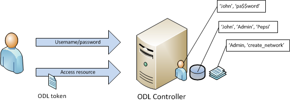
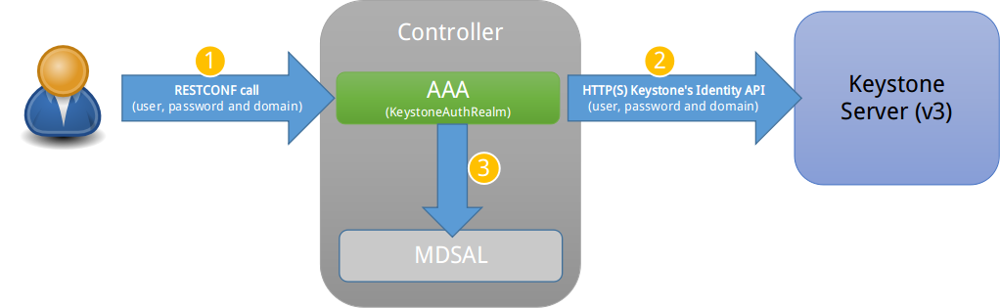

.. _aaa-dev-guide:

Authentication, Authorization and Accounting (AAA) Services
===========================================================

Overview
--------

Authentication, Authorization and Accounting (AAA) is a term for a
framework controlling access to resources, enforcing policies to use
those resources and auditing their usage. These processes are the
fundamental building blocks for effective network management and security.

Authentication provides a way of identifying a user, typically by
having the user enter a valid user name and valid password before access
is granted. The process of authentication is based on each user having a unique
set of criteria for gaining access. The AAA framework compares a user's
authentication credentials with other user credentials stored in a database.
If the credentials match, the user is granted access to the network.
If the credentials don't match, authentication fails and access is denied.

Authorization is the process of finding out what an authenticated user is
allowed to do within the system, which tasks can do, which API can call, etc.
The authorization process determines whether the user has the authority
to perform such actions.

Accounting is the process of logging the activity of an authenticated user,
for example, the amount of data a user has sent and/or received during a
session, which APIs called, etc.

Terms And Definitions
^^^^^^^^^^^^^^^^^^^^^

AAA
    Authentication, Authorization and Accounting.

Token
    A claim of access to a group of resources on the controller.

Domain
    A group of resources, direct or indirect, physical, logical, or
    virtual, for the purpose of access control.

User
    A person who either owns or has access to a resource or group of
    resources on the controller.

Role
    Opaque representation of a set of permissions, which is merely a
    unique string as admin or guest.

Credential
    Proof of identity such as user name and password, OTP, biometrics, or
    others.

Client
    A service or application that requires access to the controller.

Claim
    A data set of validated assertions regarding a user, e.g. the role,
    domain, name, etc.

IdP
    Identity Provider.

Quick Start
-----------

Building
^^^^^^^^
Get the code:

.. code-block:: bash

    git clone https://git.opendaylight.org/gerrit/aaa

Build it:

.. code-block:: bash

    cd aaa && mvn clean install

Installing
^^^^^^^^^^

AAA is automatically installed upon installation of odl-restconf, but you can
install it yourself directly from the Karaf console through the following
command:

::

    feature:install odl-aaa-shiro

Pushing changes
^^^^^^^^^^^^^^^

The following are basic instructions to push your contributions to the project's
GIT repository:

.. code-block:: bash

    git add .
    git commit -s
    # make changes, add change id, etc.
    git commit --amend
    git push ssh://{username}@git.opendaylight.org:29418/aaa.git HEAD:refs/for/master

AAA Framework implementations
-----------------------------

Since Boron release, the OpenDaylight's AAA services are based on the
`Apache Shiro <https://shiro.apache.org/>`_ Java Security Framework. The main
configuration file for AAA is located at “etc/shiro.ini” relative to the
OpenDaylight Karaf home directory.

Known limitations
^^^^^^^^^^^^^^^^^

The database (H2) used by ODL AAA Authentication store is not-cluster enabled.
When deployed in a clustered environment each node needs to have its AAA user
file synchronized using out of band means.

How to enable AAA
-----------------

AAA is enabled through installing the odl-aaa-shiro feature. The vast majority
of OpenDaylight's northbound APIs (and all RESTCONF APIs) are protected by AAA
by default when installing the +odl-restconf+ feature, since the odl-aaa-shiro
is automatically installed as part of them.

How to disable AAA
------------------

Edit the “etc/shiro.ini” file and replace the following:

::

    /** = authcBasic

with

::

    /** = anon

Then, restart the Karaf process.

How application developers can leverage AAA to provide servlet security
-----------------------------------------------------------------------

In order to provide security to a servlet, add the following to the
servlet’s web.xml file as the first filter definition:

.. code-block:: xml

    <context-param>
      <param-name>shiroEnvironmentClass</param-name>
      <param-value>org.opendaylight.aaa.shiro.web.env.KarafIniWebEnvironment</param-value>
    </context-param>

    <listener>
        <listener-class>org.apache.shiro.web.env.EnvironmentLoaderListener</listener-class>
    </listener>

    <filter>
        <filter-name>ShiroFilter</filter-name>
        <filter-class>org.opendaylight.aaa.shiro.filters.AAAShiroFilter</filter-class>
    </filter>

    <filter-mapping>
        <filter-name>AAAShiroFilter</filter-name>
        <url-pattern>/*</url-pattern>
    </filter-mapping>

.. note::

    It is very important to place this AAAShiroFilter as the first
    javax.servlet.Filter, as Jersey applies Filters in the order they
    appear within web.xml. Placing the AAAShiroFilter first ensures
    incoming HTTP/HTTPS requests have proper credentials before any
    other filtering is attempted.

AAA Realms
----------

AAA plugin utilizes the Shiro Realms to support pluggable authentication &
authorization schemes. There are two parent types of realms:

-  AuthenticatingRealm

   -  Provides no Authorization capability.

   -  Users authenticated through this type of realm are treated
      equally.

-  AuthorizingRealm

   -  AuthorizingRealm is a more sophisticated AuthenticatingRealm,
      which provides the additional mechanisms to distinguish users
      based on roles.

   -  Useful for applications in which roles determine allowed
      capabilities.

OpenDaylight contains five implementations:

-  TokenAuthRealm

   -  An AuthorizingRealm built to bridge the Shiro-based AAA service
      with the h2-based AAA implementation.

   -  Exposes a RESTful web service to manipulate IdM policy on a
      per-node basis. If identical AAA policy is desired across a
      cluster, the backing data store must be synchronized using an out
      of band method.

   -  A python script located at “etc/idmtool” is included to help
      manipulate data contained in the TokenAuthRealm.

   -  Enabled out of the box. This is the realm configured by default.

-  ODLJndiLdapRealm

   -  An AuthorizingRealm built to extract identity information from IdM
      data contained on an LDAP server.

   -  Extracts group information from LDAP, which is translated into
      OpenDaylight roles.

   -  Useful when federating against an existing LDAP server, in which
      only certain types of users should have certain access privileges.

   -  Disabled out of the box.

-  ODLJndiLdapRealmAuthNOnly

   -  The same as ODLJndiLdapRealm, except without role extraction.
      Thus, all LDAP users have equal authentication and authorization
      rights.

   -  Disabled out of the box.

-  ODLActiveDirectoryRealm

   -  Wraps the generic ActiveDirectoryRealm provided by Shiro. This allows for
      enhanced logging as well as isolation of all realms in a single package,
      which enables easier import by consuming servlets.

   -  Disabled out of the box.

-  KeystoneAuthRealm

   -  This realm authenticates OpenDaylight users against the OpenStack's
      Keystone server by using the
      `Keystone's Identity API v3 <https://developer.openstack.org/api-ref/identity/v3/>`_
      or later.

   - Disabled out of the box.

.. note::

    More than one Realm implementation can be specified. Realms are attempted
    in order until authentication succeeds or all realm sources are exhausted.
    Edit the **securityManager.realms = $tokenAuthRealm** property in shiro.ini
    and add all the realms needed separated by commas.

TokenAuthRealm
^^^^^^^^^^^^^^

How it works
~~~~~~~~~~~~

The TokenAuthRealm is the default Authorization Realm deployed in OpenDaylight.
TokenAuthRealm uses a direct authentication mechanism as shown in the following
picture:

   TokenAuthRealm direct authentication mechanism

A user presents some credentials (e.g., username/password) directly to the
OpenDaylight controller token endpoint /oauth2/token and receives an access
token, which then can be used to access protected resources on the controller.

How to access the H2 database
~~~~~~~~~~~~~~~~~~~~~~~~~~~~~

The H2 database provides an optional front-end Web interface, which can be very
useful for new users. From the KARAF_HOME directory, you can run the following
command to enable the user interface:

.. code-block:: bash

    java -cp ./data/cache/org.eclipse.osgi/bundles/217/1/.cp/h2-1.4.185.jar
        org.h2.tools.Server -trace -pg -web -webAllowOthers -baseDir `pwd`

You can navigate to the following and login via the browser:

::

    http://{IP}:8082/

ODLJndiLdapRealm
^^^^^^^^^^^^^^^^

How it works
~~~~~~~~~~~~

LDAP integration is provided in order to externalize identity management.
This configuration allows federation with an external LDAP server.
The user’s OpenDaylight role parameters are mapped to corresponding LDAP
attributes as specified by the groupRolesMap. Thus, an LDAP operator can
provision attributes for LDAP users that support different OpenDaylight role
structures.

ODLJndiLdapRealmAuthNOnly
^^^^^^^^^^^^^^^^^^^^^^^^^

How it works
~~~~~~~~~~~~

This is useful for setups where all LDAP users are allowed equal access.

KeystoneAuthRealm
^^^^^^^^^^^^^^^^^

How it works
~~~~~~~~~~~~

This realm authenticates OpenDaylight users against the OpenStack's Keystone
server. This realm uses the
`Keystone's Identity API v3 <https://developer.openstack.org/api-ref/identity/v3/>`_
or later.

   KeystoneAuthRealm authentication/authorization mechanism

As can shown on the above diagram, once configured, all the RESTCONF APIs calls
will require sending **user**, **password** and optionally **domain** (1). Those
credentials are used to authenticate the call against the Keystone server (2) and,
if the authentication succeeds, the call will proceed to the MDSAL (3). The
credentials must be provisioned in advance within the Keystone Server. The user
and password are mandatory, while the domain is optional, in case it is not
provided within the REST call, the realm will default to (**Default**),
which is hard-coded. The default domain can be also configured through the
*shiro.ini* file (see the :doc:`AAA User Guide <../user-guide/authentication-and-authorization-services>`).

The protocol between the Controller and the Keystone Server (2) can be either
HTTPS or HTTP. In order to use HTTPS the Keystone Server's certificate
must be exported and imported on the Controller (see the :ref:`Certificate Management <aaa-certificate-management>` section).

Authorization Configuration
---------------------------

OpenDaylight supports two authorization engines at present, both of which are
roughly similar in behavior:

- Shiro-Based Authorization

- MDSAL-Based Dynamic Authorization

.. note::

    The preferred mechanism for configuring AAA Authentication is the
    MDSAL-Based Dynamic Authorization. Read the following section.

Shiro-Based Static Authorization
^^^^^^^^^^^^^^^^^^^^^^^^^^^^^^^^

OpenDaylight AAA has support for Role Based Access Control (RBAC) based
on the Apache Shiro permissions system. Configuration of the authorization
system is done off-line; authorization currently cannot be configured
after the controller is started. The Authorization provided by this mechanism
is aimed towards supporting coarse-grained security policies, the MDSAL-Based
mechanism allows for a more robust configuration capabilities. `Shiro-based
Authorization <http://shiro.apache.org/web.html#Web-%7B%7B%5Curls%5C%7D%7D>`_
describes how to configure the Authentication feature in detail.

.. note::

    The Shiro-Based Authorization that uses the *shiro.ini* URLs section to
    define roles requirements is **deprecated** and **discouraged** since the
    changes made to the file are only honored on a controller restart.

    Shiro-Based Authorization is not **cluster-aware**, so the changes made on
    the *shiro.ini* file have to be replicated on every controller instance
    belonging to the cluster.

    The URL patterns are matched relative to the Servlet context leaving room
    for ambiguity, since many endpoints may match (i.e., "/restconf/modules" and
    "/auth/modules" would both match a "/modules/\**" rule).

MDSAL-Based Dynamic Authorization
^^^^^^^^^^^^^^^^^^^^^^^^^^^^^^^^^
The MDSAL-Based Dynamic authorization uses the MDSALDynamicAuthorizationFilter
engine to restrict access to particular URL endpoint patterns. Users may define
a list of policies that are insertion-ordered. Order matters for that list of
policies, since the first matching policy is applied. This choice was made to
emulate behavior of the Shiro-Based Authorization mechanism.

A **policy** is a key/value pair, where the key is a **resource**
(i.e., a "URL pattern") and the value is a list of **permissions** for the
resource. The following describes the various elements of a policy:

- **Resource**: the resource is a string URL pattern as outlined by
  Apache Shiro. For more information, see http://shiro.apache.org/web.html.

- **Description**: an optional description of the URL endpoint and why it is
  being secured.

- **Permissions list**: a list of permissions for a particular policy. If more
  than one permission exists in the permissions list they are evaluated using
  logical "OR". A permission describes the prerequisites to perform HTTP
  operations on a particular endpoint. The following describes the various
  elements of a permission:

  + **Role**: the role required to access the target URL endpoint.
  + **Actions list**: a leaf-list of HTTP permissions that are allowed for a
    Subject possessing the required role.

This an example on how to limit access to the modules endpoint:

::

    HTTP Operation:
    put URL: /restconf/config/aaa:http-authorization/policies

    headers: Content-Type: application/json Accept: application/json

    body:
      { "aaa:policies":
        { "aaa:policies":
          [ { "aaa:resource": "/restconf/modules/**",
            "aaa:permissions": [ { "aaa:role": "admin",
                                   "aaa:actions": [ "get",
                                                    "post",
                                                    "put",
                                                    "patch",
                                                    "delete"
                                                  ]
                                 }
                               ]
            }
          ]
        }
      }

The above example locks down access to the modules endpoint (and any URLS
available past modules) to the "admin" role. Thus, an attempt from the OOB
*admin* user will succeed with 2XX HTTP status code, while an attempt from the
OOB *user* user will fail with HTTP status code 401, as the user *user* is not
granted the "admin" role.

Accounting Configuration
------------------------

Accounting is handled through the standard slf4j logging mechanisms used by the
rest of OpenDaylight. Thus, one can control logging verbosity through
manipulating the log levels for individual packages and classes directly through
the Karaf console, JMX, or etc/org.ops4j.pax.logging.cfg. In normal operations,
the default levels exposed do not provide much information about AAA services;
this is due to the fact that logging can severely degrade performance.

All AAA logging is output to the standard karaf.log file. For debugging purposes
(i.e., to enable maximum verbosity), issue the following command:

::

    log:set TRACE org.opendaylight.aaa

Enable Successful/Unsuccessful Authentication Attempts Logging
^^^^^^^^^^^^^^^^^^^^^^^^^^^^^^^^^^^^^^^^^^^^^^^^^^^^^^^^^^^^^^

By default, successful/unsuccessful authentication attempts are NOT logged. This
is due to the fact that logging can severely decrease REST performance.

It is possible to add custom AuthenticationListener(s) to the Shiro-based
configuration, allowing different ways to listen for successful/unsuccessful
authentication attempts. Custom AuthenticationListener(s) must implement
the org.apache.shiro.authc.AuthenticationListener interface.

.. _aaa-certificate-management:

Certificate Management
----------------------

The **Certificate Management Service** is used to manage the keystores and
certificates at the OpenDaylight distribution to easily provides the TLS
communication.

The Certificate Management Service managing two keystores:

1. **OpenDaylight Keystore** which holds the OpenDaylight distribution
   certificate self sign certificate or signed certificate from a root CA based
   on generated certificate request.

2. **Trust Keystore** which holds all the network nodes certificates that shall
   to communicate with the OpenDaylight distribution through TLS communication.

The Certificate Management Service stores the keystores (OpenDaylight & Trust)
as *.jks* files under configuration/ssl/ directory. Also the keystores
could be stored at the MD-SAL datastore in case OpenDaylight distribution
running at cluster environment. When the keystores are stored at MD-SAL,
the Certificate Management Service rely on the **Encryption-Service** to encrypt
the keystore data before storing it to MD-SAL and decrypted at runtime.

How to use the Certificate Management Service to manage the TLS communication
^^^^^^^^^^^^^^^^^^^^^^^^^^^^^^^^^^^^^^^^^^^^^^^^^^^^^^^^^^^^^^^^^^^^^^^^^^^^^

The following are the steps to configure the TLS communication within your
feature or module:

1. It is assumed that there exists an already created OpenDaylight distribution
   project following `this guide
   <https://wiki.opendaylight.org/view/OpenDaylight_Controller:MD-SAL:Startup_Project_Archetype#Part_1_-_Build_with_a_simple_.27Example.27_module>`_.

2. In the implementation bundle the following artifact must be added to its
   *pom.xml* file as dependency.

.. code-block:: xml

    <dependency>
      <groupId>org.opendaylight.aaa</groupId>
      <artifactId>aaa-cert</artifactId>
      <version>0.5.0-SNAPSHOT</version>
    </dependency>

3. Using the provider class in the implementation bundle needs to define a
   variable holding the Certificate Manager Service as in the following example:

.. code-block:: java

    import org.opendaylight.aaa.cert.api.ICertificateManager;
    import org.opendaylight.controller.md.sal.binding.api.DataBroker;

    public class UseCertManagerExampleProvider {
      private final DataBroker dataBroker;
      private final ICertificateManager caManager;

      public EncSrvExampleProvider(final DataBroker dataBroker, final ICertificateManager caManager) {
        this.dataBroker = dataBroker;
        this.caManager = caManager;
      }
      public SSLEngine createSSLEngine() {
        final SSLContext sslContext = caManager.getServerContext();
        if (sslContext != null) {
          final SSLEngine sslEngine = sslContext.createSSLEngine();
          sslEngine.setEnabledCipherSuites(caManager.getCipherSuites());
          // DO the Implementation
          return sslEngine;
        }
      }
      public void init() {
          // TODO
      }
      public void close() {
          // TODO
      }
    }

4. The Certificate Manager Service provides two main methods that are needed to
   establish the *SSLEngine* object, *getServerContext()* and *getCipherSuites()*
   as the above example shows. It also provides other methods such as
   *getODLKeyStore()* and *getTrustKeyStore()* that gives access to the
   OpenDaylight and Trust keystores.

5. Now the *ICertificateManager* need to be passed as an argument to the
   *UseCertManagerExampleProvider* within the implementation bundle blueprint
   configuration. The following example shows how:

.. code-block:: xml

    <blueprint xmlns="http://www.osgi.org/xmlns/blueprint/v1.0.0"
      xmlns:odl="http://opendaylight.org/xmlns/blueprint/v1.0.0"
      odl:use-default-for-reference-types="true">
      <reference id="dataBroker"
        interface="org.opendaylight.controller.md.sal.binding.api.DataBroker"
        odl:type="default" />
      <reference id="aaaCertificateManager"
        interface="org.opendaylight.aaa.cert.api.ICertificateManager"
        odl:type="default-certificate-manager" />
      <bean id="provider"
        class="org.opendaylight.UseCertManagerExample.impl.UseCertManagerExampleProvider"
        init-method="init" destroy-method="close">
        <argument ref="dataBroker" />
        <argument ref="aaaCertificateManager" />
      </bean>
    </blueprint>

6. After finishing the bundle implementation the feature module needs to be
   updated to include the *aaa-cert* feature in its feature bundle pom.xml file.

.. code-block:: xml

    <properties>
      <aaa.version>0.5.0-SNAPSHOT</aaa.version>
    </properties>
    <dependency>
      <groupId>org.opendaylight.aaa</groupId>
      <artifactId>features-aaa</artifactId>
      <version>${aaa.version}</version>
      <classifier>features</classifier>
      <type>xml</type>
    </dependency>

7. Now, in the feature.xml file add the Certificate Manager Service feature and
   its repository.

.. code-block:: xml

    <repository>mvn:org.opendaylight.aaa/features-aaa/{VERSION}/xml/features</repository>

The Certificate Manager Service feature can be included inside the
implementation bundle feature as shown in the following example:

.. code-block:: xml

    <feature name='odl-UseCertManagerExample' version='${project.version}'
      description='OpenDaylight :: UseCertManagerExample'>
      <feature version='${mdsal.version}'>odl-mdsal-broker</feature>
      <feature version='${aaa.version}'>odl-aaa-cert</feature>
      <bundle>mvn:org.opendaylight.UseCertManagerExample/UseCertManagerExample-impl/{VERSION}</bundle>
    </feature>

8. Now the project can be built and the OpenDaylight distribution started to
   continue with the configuration process. See the User Guide for more details.

Encryption Service
------------------

The **AAA Encryption Service** is used to encrypt the OpenDaylight users'
passwords and TLS communication certificates. This section shows how to use the
AAA Encryption Service with an OpenDaylight distribution project to encrypt data.

1. It is assumed that there exists an already created OpenDaylight distribution
   project following `this guide
   <https://wiki.opendaylight.org/view/OpenDaylight_Controller:MD-SAL:Startup_Project_Archetype#Part_1_-_Build_with_a_simple_.27Example.27_module>`_.

2. In the implementation bundle the following artifact must be added to its
   *pom.xml* file as dependency.

.. code-block:: xml

    <dependency>
      <groupId>org.opendaylight.aaa</groupId>
      <artifactId>aaa-encrypt-service</artifactId>
      <version>0.5.0-SNAPSHOT</version>
    </dependency>

3. Using the provider class in the implementation bundle needs to define a
   variable holding the Encryption Service as in the following example:

.. code-block:: java

    import org.opendaylight.aaa.encrypt.AAAEncryptionService;
    import org.opendaylight.controller.md.sal.binding.api.DataBroker;

    public class EncSrvExampleProvider {
    private final DataBroker dataBroker;
      private final AAAEncryptionService encryService;

      public EncSrvExampleProvider(final DataBroker dataBroker, final AAAEncryptionService encryService) {
        this.dataBroker = dataBroker;
        this.encryService = encryService;
      }
      public void init() {
        // TODO
      }
      public void close() {
        // TODO
      }
    }

The AAAEncryptionService can be used to encrypt and decrypt any data based on
project's needs.

4. Now the *AAAEncryptionService* needs to be passed as an argument to the
   *EncSrvExampleProvider* within the implementation bundle blueprint
   configuration. The following example shows how:

.. code-block:: xml

    <blueprint xmlns="http://www.osgi.org/xmlns/blueprint/v1.0.0"
      xmlns:odl="http://opendaylight.org/xmlns/blueprint/v1.0.0"
      odl:use-default-for-reference-types="true">
      <reference id="dataBroker"
        interface="org.opendaylight.controller.md.sal.binding.api.DataBroker"
        odl:type="default" />
      <reference id="encryService" interface="org.opendaylight.aaa.encrypt.AAAEncryptionService"/>
      <bean id="provider"
        class="org.opendaylight.EncSrvExample.impl.EncSrvExampleProvider"
        init-method="init" destroy-method="close">
        <argument ref="dataBroker" />
        <argument ref="encryService" />
      </bean>
    </blueprint>

5. After finishing the bundle implementation the feature module needs to be
   updated to include the *aaa-encryption-service* feature in its feature bundle
   pom.xml file.

.. code-block:: xml

    <dependency>
      <groupId>org.opendaylight.aaa</groupId>
      <artifactId>features-aaa</artifactId>
      <version>${aaa.version}</version>
      <classifier>features</classifier>
      <type>xml</type>
    </dependency>

It is also necessary to add the *aaa.version* in the properties section:

.. code-block:: xml

    <properties>
      <aaa.version>0.5.0-SNAPSHOT</aaa.version>
    </properties>

6. Now, in the feature.xml file add the Encryption Service feature and its
   repository.

.. code-block:: xml

    <repository>mvn:org.opendaylight.aaa/features-aaa/{VERSION}/xml/features</repository>

The Encryption Service feature can be included inside the implementation bundle
feature as shown in the following example:

.. code-block:: xml

    <feature name='odl-EncSrvExample' version='${project.version}' description='OpenDaylight :: EncSrvExample'>
      <feature version='${mdsal.version}'>odl-mdsal-broker</feature>
      <feature version='${aaa.version}'>odl-aaa-encryption-service</feature>
      <feature version='${project.version}'>odl-EncSrvExample-api</feature>
      <bundle>mvn:org.opendaylight.EncSrvExample/EncSrvExample-impl/{VERSION}</bundle>
    </feature>

7. Now the project can be built and the OpenDaylight distribution started to
   continue with the configuration process. See the User Guide for more details.
