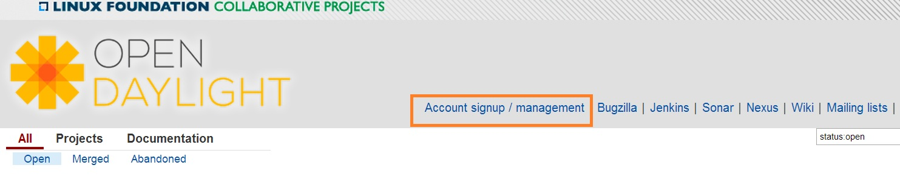
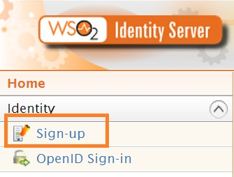
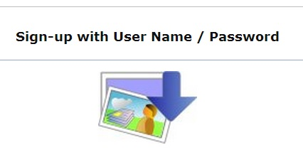
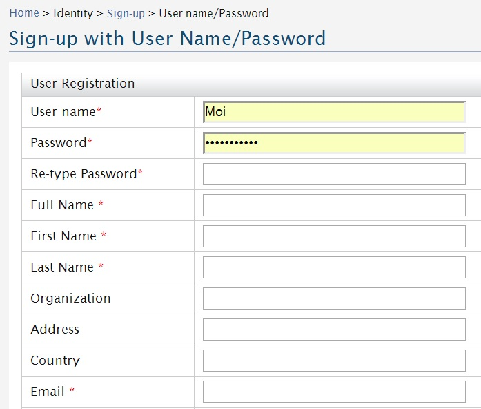

Getting started with Git and Gerrit
===================================

Overview of Git and Gerrit
--------------------------

Git is an opensource distributed version control system (dvcs) written
in the C language and originally developed by Linus Torvalds and others
to manage the Linux kernel. In Git, there is no central copy of the
repository. After you have cloned the repository, you have a functioning
copy of the source code with all the branches and tagged releases, in
your local repository.

Gerrit is an opensource web-based collaborative code review tool that
integrates with Git. It was developed at Google by Shawn Pearce. Gerrit
provides a framework for reviewing code commits before they are accepted
into the code base. Changes can be uploaded to Gerrit by any user.
However, the changes are not made a part of the project until a code
review is completed. Gerrit is also a good collaboration tool for
storing the conversations that occur around the code commits.

The OpenDaylight source code is hosted in a repository in Git.
Developers must use Gerrit to commit code to the OpenDaylight
repository.

.. note::

    For more information on Git, see http://git-scm.com/. For more
    information on Gerrit, see https://code.google.com/p/gerrit/.

Setting up a Gerrit account
---------------------------

1. Using a Google Chrome or Mozilla Firefox browser, go to
   https://git.opendaylight.org/gerrit

The main page shows existing Gerrit requests. These are patches that
have been pushed to the repository and not yet verified, reviewed, and
merged.

.. note::

    If you already have an OpenDaylight account, you can click **Sign
    In** in the top right corner of the page and follow the instructions
    to enter the OpenDaylight page.

.. figure:: ./images/Sign_in.jpg
   :alt: Signing in to OpenDaylight account

   Signing in to OpenDaylight account

1. If you do not have an existing OpenDaylight account, click **Account
   signup/management** on the top bar of the main Gerrit page.

The **WS02 Identity Server** page is displayed.

   Gerrit Account signup/management link

1. In the **WS02 Identity Server** page, click **Sign-up** in the left
   pane.

There is also an option to authenticate your sign in with OpenID. This
option is not described in this document.

   Sign-up link for Gerrit account

1. Click on the **Sign-up with User Name/Password** image on the right
   pane to continue to the actual sign-up page.

   Sign-up with User Name/Password Image

1. Fill out the details in the account creation form and then click
   **Submit**.

   Filling out the details

You now have an OpenDaylight account that can be used with Gerrit to
pull the OpenDaylight code.

Generating SSH keys for your system
-----------------------------------

You must have SSH keys for your system to register with your Gerrit
account. The method for generating SSH keys is different for different
types of operating systems.

The key you register with Gerrit must be identical to the one you will
use later to pull or edit the code. For example, if you have a
development VM which has a different UID login and keygen than that of
your laptop, the SSH key you generate for the VM is different from the
laptop. If you register the SSH key generated on your VM with Gerrit and
do not reuse it on your laptop when using Git on the laptop, the pull
fails.

.. note::

    For more information on SSH keys for Ubuntu, see
    https://help.ubuntu.com/community/SSH/OpenSSH/Keys. For generating
    SSH keys for Windows, see
    https://help.github.com/articles/generating-ssh-keys.

For a system running Ubuntu operating system, follow the steps below:

1. Run the following command::

    mkdir ~/.ssh
    chmod 700 ~/.ssh
    ssh-keygen -t rsa

1. You are prompted for a location to save the keys, and a passphrase
   for the keys.

This passphrase protects your private key while it is stored on the hard
drive. You must use the passphrase to use the keys every time you need
to login to a key-based system::

    Generating public/private rsa key pair.
    Enter file in which to save the key (/home/b/.ssh/id_rsa):
    Enter passphrase (empty for no passphrase):
    Enter same passphrase again:
    Your identification has been saved in /home/b/.ssh/id_rsa.
    Your public key has been saved in /home/b/.ssh/id_rsa.pub.

Your public key is now available as **.ssh/id\_rsa.pub** in your home
folder.

Registering your SSH key with Gerrit
------------------------------------

1. Using a Google Chrome or Mozilla Firefox browser, go to
   https://git.opendaylight.org/gerrit.

1. Click **Sign In** to access the OpenDaylight repository.

.. figure:: ./images/Sign_in.jpg
   :alt: Signin in to OpenDaylight repository

   Signin in to OpenDaylight repository

1. Click your name in the top right corner of the window and then click
   **Settings**.

The **Settings** page is displayed.

.. figure:: ./images/Gerrit_settings.jpg
   :alt: Settings page for your Gerrit account

   Settings page for your Gerrit account

1. Click **SSH Public Keys** under **Settings**.

2. Click **Add Key**.

3. In the **Add SSH Public Key** text box, paste the contents of your
   **id\_rsa.pub** file and then click **Add**.

.. figure:: ./images/SSH_keys.jpg
   :alt: Adding your SSH key

   Adding your SSH key

To verify your SSH key is working correctly, try using an SSH client to
connect to Gerrit’s SSHD port::

    $ ssh -p 29418 <sshusername>@git.opendaylight.org
    Enter passphrase for key '/home/cisco/.ssh/id_rsa':
    ****    Welcome to Gerrit Code Review    ****
    Hi <user>, you have successfully connected over SSH.
    Unfortunately, interactive shells are disabled.
    To clone a hosted Git repository, use: git clone ssh://<user>@git.opendaylight.org:29418/REPOSITORY_NAME.git
    Connection to git.opendaylight.org closed.

You can now proceed to either Pulling, Hacking, and Pushing the Code
from the CLI or Pulling, Hacking, and Pushing the Code from Eclipse
depending on your implementation.
