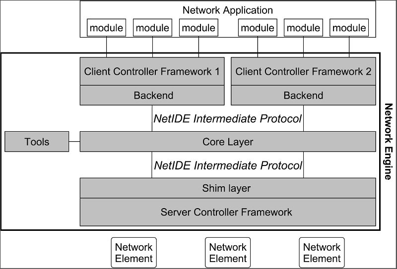

NetIDE Developer Guide
======================

Overview
--------

The NetIDE Network Engine enables portability and cooperation inside a
single network by using a client/server multi-controller SDN
architecture. Separate "Client SDN Controllers" host the various SDN
Applications with their access to the actual physical network abstracted
and coordinated through a single "Server SDN Controller", in this
instance OpenDaylight. This allows applications written for
Ryu/Floodlight/Pyretic to execute on OpenDaylight managed
infrastructure.

The "Network Engine" is modular by design:

-  An OpenDaylight plugin, "shim", sends/receives messages to/from
   subscribed SDN Client Controllers. This consumes the ODL OpenFlow
   Plugin

-  An initial suite of SDN Client Controller "Backends": Floodlight,
   Ryu, Pyretic. Further controllers may be added over time as the
   engine is extensible.

The Network Engine provides a compatibility layer capable of translating
calls of the network applications running on top of the client
controllers, into calls for the server controller framework. The
communication between the client and the server layers is achieved
through the NetIDE intermediate protocol, which is an application-layer
protocol on top of TCP that transmits the network control/management
messages from the client to the server controller and vice-versa.
Between client and server controller sits the Core Layer which also
"speaks" the intermediate protocol. The core layer implements three main
functions:

i.   interfacing with the client backends and server shim, controlling
     the lifecycle of controllers as well as modules in them,

ii.  orchestrating the execution of individual modules (in one client
     controller) or complete applications (possibly spread across
     multiple client controllers),

iii. interfacing with the tools.

   NetIDE Network Engine Architecture

NetIDE Intermediate Protocol
----------------------------

The Intermediate Protocol serves several needs, it has to:

i.   carry control messages between core and shim/backend, e.g., to
     start up/take down a particular module, providing unique
     identifiers for modules,

ii.  carry event and action messages between shim, core, and backend,
     properly demultiplexing such messages to the right module based on
     identifiers,

iii. encapsulate messages specific to a particular SBI protocol version
     (e.g., OpenFlow 1.X, NETCONF, etc.) towards the client controllers
     with proper information to recognize these messages as such.

The NetIDE packages can be added as dependencies in Maven projects by
putting the following code in the *pom.xml* file.

::

    <dependency>
        <groupId>org.opendaylight.netide</groupId>
        <artifactId>api</artifactId>
        <version>${NETIDE_VERSION}</version>
    </dependency>

The current stable version for NetIDE is ``0.1.0-Beryllium``.

Protocol specification
~~~~~~~~~~~~~~~~~~~~~~

Messages of the NetIDE protocol contain two basic elements: the NetIDE
header and the data (or payload). The NetIDE header, described below, is
placed before the payload and serves as the communication and control
link between the different components of the Network Engine. The payload
can contain management messages, used by the components of the Network
Engine to exchange relevant information, or control/configuration
messages (such as OpenFlow, NETCONF, etc.) crossing the Network Engine
generated by either network application modules or by the network
elements.

The NetIDE header is defined as follows:

::

     0                   1                   2                   3
     0 1 2 3 4 5 6 7 8 9 0 1 2 3 4 5 6 7 8 9 0 1 2 3 4 5 6 7 8 9 0 1
    +-+-+-+-+-+-+-+-+-+-+-+-+-+-+-+-+-+-+-+-+-+-+-+-+-+-+-+-+-+-+-+-+
    |   netide_ver  |      type     |             length            |
    +-+-+-+-+-+-+-+-+-+-+-+-+-+-+-+-+-+-+-+-+-+-+-+-+-+-+-+-+-+-+-+-+
    |                         xid                                   |
    +-+-+-+-+-+-+-+-+-+-+-+-+-+-+-+-+-+-+-+-+-+-+-+-+-+-+-+-+-+-+-+-+
    |                       module_id                               |
    +-+-+-+-+-+-+-+-+-+-+-+-+-+-+-+-+-+-+-+-+-+-+-+-+-+-+-+-+-+-+-+-+
    |                                                               |
    +                     datapath_id                               +
    |                                                               |
    +-+-+-+-+-+-+-+-+-+-+-+-+-+-+-+-+-+-+-+-+-+-+-+-+-+-+-+-+-+-+-+-+

where each tick mark represents one bit position. Alternatively, in a
C-style coding format, the NetIDE header can be represented with the
following structure:

::

    struct netide_header {
        uint8_t netide_ver ;
        uint8_t type ;
        uint16_t length ;
        uint32_t xid
        uint32_t module_id
        uint64_t datapath_id
    };

-  ``netide_ver`` is the version of the NetIDE protocol (the current
   version is v1.2, which is identified with value 0x03).

-  ``length`` is the total length of the payload in bytes.

-  ``type`` contains a code that indicates the type of the message
   according with the following values:

   ::

       enum type {
           NETIDE_HELLO = 0x01 ,
           NETIDE_ERROR = 0x02 ,
           NETIDE_MGMT = 0x03 ,
           MODULE_ANNOUNCEMENT = 0x04 ,
           MODULE_ACKNOWLEDGE = 0x05 ,
           NETIDE_HEARTBEAT = 0x06 ,
           NETIDE_OPENFLOW = 0x11 ,
           NETIDE_NETCONF = 0x12 ,
           NETIDE_OPFLEX = 0x13
       };

-  ``datapath_id`` is a 64-bit field that uniquely identifies the
   network elements.

-  ``module_id`` is a 32-bits field that uniquely identifies Backends
   and application modules running on top of each client controller. The
   composition mechanism in the core layer leverages on this field to
   implement the correct execution flow of these modules.

-  ``xid`` is the transaction identifier associated to the each message.
   Replies must use the same value to facilitate the pairing.

Module announcement
~~~~~~~~~~~~~~~~~~~

The first operation performed by a Backend is registering itself and the
modules that it is running to the Core. This is done by using the
``MODULE_ANNOUNCEMENT`` and ``MODULE_ACKNOWLEDGE`` message types. As a
result of this process, each Backend and application module can be
recognized by the Core through an identifier (the ``module_id``) placed
in the NetIDE header. First, a Backend registers itself by using the
following schema: backend-<platform name>-<pid>.

For example,odule a Ryu Backend will register by using the following
name in the message backend-ryu-12345 where 12345 is the process ID of
the registering instance of the Ryu platform. The format of the message
is the following:

::

    struct NetIDE_message {
        netide_ver = 0x03
        type = MODULE_ANNOUNCEMENT
        length = len(" backend -< platform_name >-<pid >")
        xid = 0
        module_id = 0
        datapath_id = 0
        data = " backend -< platform_name >-<pid >"
    }

The answer generated by the Core will include a ``module_id`` number and
the Backend name in the payload (the same indicated in the
``MODULE_ANNOUNCEMENT`` message):

::

    struct NetIDE_message {
        netide_ver = 0x03
        type = MODULE_ACKNOWLEDGE
        length = len(" backend -< platform_name >-<pid >")
        xid = 0
        module_id = MODULE_ID
        datapath_id = 0
        data = " backend -< platform_name >-<pid >"
    }

Once a Backend has successfully registered itself, it can start
registering its modules with the same procedure described above by
indicating the name of the module in the data (e.g. data="Firewall").
From this point on, the Backend will insert its own ``module_id`` in the
header of the messages it generates (e.g. heartbeat, hello messages,
OpenFlow echo messages from the client controllers, etc.). Otherwise, it
will encapsulate the control/configuration messages (e.g. FlowMod,
PacketOut, FeatureRequest, NETCONF request, etc.) generated by network
application modules with the specific +module\_id+s.

Heartbeat
~~~~~~~~~

The heartbeat mechanism has been introduced after the adoption of the
ZeroMQ messaging queuing library to transmit the NetIDE messages.
Unfortunately, the ZeroMQ library does not offer any mechanism to find
out about disrupted connections (and also completely unresponsive
peers). This limitation of the ZeroMQ library can be an issue for the
Core’s composition mechanism and for the tools connected to the Network
Engine, as they cannot understand when an client controller disconnects
or crashes. As a consequence, Backends must periodically send (let’s say
every 5 seconds) a "heartbeat" message to the Core. If the Core does not
receive at least one "heartbeat" message from the Backend within a
certain timeframe, the Core considers it disconnected, removes all the
related data from its memory structures and informs the relevant tools.
The format of the message is the following:

::

    struct NetIDE_message {
        netide_ver = 0x03
        type = NETIDE_HEARTBEAT
        length = 0
        xid = 0
        module_id = backend -id
        datapath_id = 0
        data = 0
    }

Handshake
~~~~~~~~~

Upon a successful connection with the Core, the client controller must
immediately send a hello message with the list of the control and/or
management protocols needed by the applications deployed on top of it.

::

    struct NetIDE_message {
        struct netide_header header ;
        uint8 data [0]
    };

The header contains the following values:

-  ``netide ver=0x03``

-  ``type=NETIDE_HELLO``

-  ``length=2*NR_PROTOCOLS``

-  ``data`` contains one 2-byte word (in big endian order) for each
   protocol, with the first byte containing the code of the protocol
   according to the above enum, while the second byte in- dictates the
   version of the protocol (e.g. according to the ONF specification,
   0x01 for OpenFlow v1.0, 0x02 for OpenFlow v1.1, etc.). NETCONF
   version is marked with 0x01 that refers to the specification in the
   RFC6241, while OpFlex version is marked with 0x00 since this protocol
   is still in work-in-progress stage.

The Core relays hello messages to the server controller which responds
with another hello message containing the following:

-  ``netide ver=0x03``

-  ``type=NETIDE_HELLO``

-  ``length=2*NR_PROTOCOLS``

If at least one of the protocols requested by the client is supported.
In particular, ``data`` contains the codes of the protocols that match
the client’s request (2-bytes words, big endian order). If the hand-
shake fails because none of the requested protocols is supported by the
server controller, the header of the answer is as follows:

-  ``netide ver=0x03``

-  ``type=NETIDE_ERROR``

-  ``length=2*NR_PROTOCOLS``

-  ``data`` contains the codes of all the protocols supported by the
   server controller (2-bytes words, big endian order). In this case,
   the TCP session is terminated by the server controller just after the
   answer is received by the client. \`

