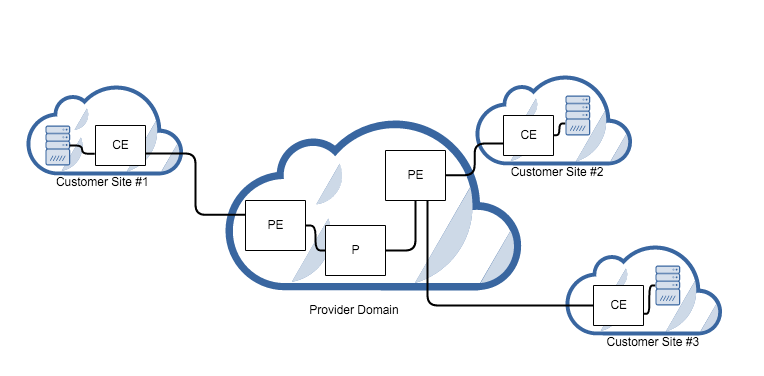

.. _nic-dev-guide:

Network Intent Composition (NIC) Developer Guide
================================================

Overview
--------

The Network Intent Composition (NIC) provides four features:

-  odl-nic-core-hazelcast: Provides a distributed intent mapping
   service, implemented using hazelcast, that stores metadata needed by
   odl-nic-core feature.

-  odl-nic-core-mdsal: Provides an intent rest API to external
   applications for CRUD operations on intents, conflict resolution and
   event handling. Uses MD-SAL as backend.

-  odl-nic-console: Provides a karaf CLI extension for intent CRUD
   operations and mapping service operations.

-  odl-nic-renderer-of - Generic OpenFlow Renderer.

-  odl-nic-renderer-vtn - a feature that transforms an intent to a
   network modification using the VTN project

-  odl-nic-renderer-gbp - a feature that transforms an intent to a
   network modification using the Group Policy project

-  odl-nic-renderer-nemo - a feature that transforms an intent to a
   network modification using the NEMO project

-  odl-nic-listeners - adds support for event listening. (depends on:
   odl-nic-renderer-of)

-  odl-nic-neutron-integration - allow integration with openstack
   neutron to allow coexistence between existing neutron security rules
   and intents pushed by ODL applications.

*Only a single renderer feature should be installed at a time for the
Boron release.*

odl-nic-core-mdsal XOR odl-nic-core-hazelcast
---------------------------------------------

This feature supplies the base models for the Network Intent Composition
(NIC) capability. This includes the definition of intent as well as the
configuration and operational data trees.

This feature only provides an information model. The interface for NIC
is to modify the information model via the configuraiton data tree,
which will trigger the renderer to make the appropriate changes in the
controlled network.

Installation
------------

First you need to install one of the core installations:
~~~~~~~~~~~~~~~~~~~~~~~~~~~~~~~~~~~~~~~~~~~~~~~~~~~~~~~~

::

    feature:install odl-nic-core-service-mdsal odl-nic-console

*OR*

::

    feature:install odl-nic-core-service-hazelcast odl-nic-console

Then pick a renderer:
~~~~~~~~~~~~~~~~~~~~~

::

    feature:install odl-nic-listeners (will install odl-nic-renderer-of)

*OR*

::

    feature:install odl-nic-renderer-vtn

*OR*

::

    feature:install odl-nic-renderer-gbp

*OR*

::

    feature:install odl-nic-renderer-nemo

REST Supported operations
-------------------------

POST / PUT (configuration)
~~~~~~~~~~~~~~~~~~~~~~~~~~

This operations create instances of an intent in the configuration data
tree and trigger the creation or modification of an intent.

GET (configuration / operational)
~~~~~~~~~~~~~~~~~~~~~~~~~~~~~~~~~

This operation lists all or fetches a single intent from the data tree.

DELETE (configuration)
~~~~~~~~~~~~~~~~~~~~~~

This operation will cause an intent to be removed from the system and
trigger any configuration changes on the network rendered from this
intent to be removed.

odl-nic-cli user guide
----------------------

This feature provides karaf console CLI command to manipulate the intent
data model. The CLI essentailly invokes the equivalent data operations.

intent:add
~~~~~~~~~~

Creates a new intent in the configuration data tree

::

    DESCRIPTION
            intent:add

        Adds an intent to the controller.

    Examples: --actions [ALLOW] --from <subject> --to <subject>
              --actions [BLOCK] --from <subject>

    SYNTAX
            intent:add [options]

    OPTIONS
            -a, --actions
                    Action to be performed.
                    -a / --actions BLOCK/ALLOW
                    (defaults to [BLOCK])
            --help
                    Display this help message
            -t, --to
                    Second Subject.
                    -t / --to <subject>
                    (defaults to any)
            -f, --from
                    First subject.
                    -f / --from <subject>
                    (defaults to any)

intent:delete
~~~~~~~~~~~~~

Removes an existing intent from the system

::

    DESCRIPTION
            intent:remove

        Removes an intent from the controller.

    SYNTAX
            intent:remove id

    ARGUMENTS
            id  Intent Id

intent:list
~~~~~~~~~~~

Lists all the intents in the system

::

    DESCRIPTION
            intent:list

        Lists all intents in the controller.

    SYNTAX
            intent:list [options]

    OPTIONS
            -c, --config
                    List Configuration Data (optional).
                    -c / --config <ENTER>
            --help
                    Display this help message

intent:show
~~~~~~~~~~~

Displays the details of a single intent

::

    DESCRIPTION
            intent:show

        Shows detailed information about an intent.

    SYNTAX
            intent:show id

    ARGUMENTS
            id  Intent Id

intent:map
~~~~~~~~~~

List/Add/Delete current state from/to the mapping service.

::

    DESCRIPTION
            intent:map

            List/Add/Delete current state from/to the mapping service.

    SYNTAX
            intent:map [options]

             Examples: --list, -l [ENTER], to retrieve all keys.
                       --add-key <key> [ENTER], to add a new key with empty contents.
                       --del-key <key> [ENTER], to remove a key with it's values."
                       --add-key <key> --value [<value 1>, <value 2>, ...] [ENTER],
                         to add a new key with some values (json format).
    OPTIONS
           --help
               Display this help message
           -l, --list
               List values associated with a particular key.
           -l / --filter <regular expression> [ENTER]
           --add-key
               Adds a new key to the mapping service.
           --add-key <key name> [ENTER]
           --value
               Specifies which value should be added/delete from the mapping service.
           --value "key=>value"... --value "key=>value" [ENTER]
               (defaults to [])
           --del-key
               Deletes a key from the mapping service.
           --del-key <key name> [ENTER]

Sample Use case: MPLS
---------------------

Description
~~~~~~~~~~~

The scope of this use-case is to add MPLS intents between two MPLS
endpoints. The use-case tries to address the real-world scenario
illustrated in the diagram below:

   MPLS VPN Service Diagram

where PE (Provider Edge) and P (Provider) switches are managed by
OpenDaylight. In NIC’s terminology the endpoints are the PE switches.
There could be many P switches between the PEs.

In order for NIC to recognize endpoints as MPLS endpoints, the user is
expected to add mapping information about the PE switches to NIC’s
mapping service to include the below properties:

1. MPLS Label to identify a PE

2. IPv4 Prefix for the customer site that are connected to a PE

3. Switch-Port: Ingress (or Egress) for source (or Destination) endpoint
   of the source (or Destination) PE

An intent:add between two MPLS endpoints renders OpenFlow rules for: 1.
push/pop labels to the MPLS endpoint nodes after an IPv4 Prefix match.
2. forward to port rule after MPLS label match to all the switches that
form the shortest path between the endpoints (calculated using Dijkstra
algorithm).

Additionally, we have also added constraints to Intent model for
protection and failover mechanism to ensure end-to-end connectivity
between endpoints. By specifying these constraints to intent:add the
use-case aims to reduces the risk of connectivity failure due to a
single link or port down event on a forwarding device.

-  Protection constraint: Constraint that requires an end-to-end
   connectivity to be protected by providing redundant paths.

-  Failover constraint: Constraint that specifies the type of failover
   implementation. slow-reroute: Uses disjoint path calculation
   algorithms like Suurballe to provide alternate end-to-end routes.
   fast-reroute: Uses failure detection feature in hardware forwarding
   device through OF group table features (Future plans) When no
   constraint is requested by the user we default to offering a since
   end-to-end route using Dijkstra shortest path.

How to use it?
~~~~~~~~~~~~~~

1. Start Karaf and install related features:

   ::

       feature:install odl-nic-core-service-mdsal odl-nic-core odl-nic-console odl-nic-listeners

2. Start mininet topology. (verification of topology can be done with the topology
   URI using RESTCONF)

   ::

       mn --controller=remote,ip=$CONTROLLER_IP --custom ~/shortest_path.py --topo shortest_path --switch ovsk,protocols=OpenFlow13

   ::

       cat shortest.py -->
       from mininet.topo import Topo
       from mininet.cli import CLI
       from mininet.net import Mininet
       from mininet.link import TCLink
       from mininet.util import irange,dumpNodeConnections
       from mininet.log import setLogLevel

   ::

       class Fast_Failover_Demo_Topo(Topo):

   ::

       def __init__(self):
           # Initialize topology and default options
           Topo.__init__(self)

   ::

       s1 = self.addSwitch('s1',dpid='0000000000000001')
       s2a = self.addSwitch('s2a',dpid='000000000000002a')
       s2b = self.addSwitch('s2b',dpid='000000000000002b')
       s2c = self.addSwitch('s2c',dpid='000000000000002c')
       s3 = self.addSwitch('s3',dpid='0000000000000003')
       self.addLink(s1, s2a)
       self.addLink(s1, s2b)
       self.addLink(s2b, s2c)
       self.addLink(s3, s2a)
       self.addLink(s3, s2c)
       host_1 = self.addHost('h1',ip='10.0.0.1',mac='10:00:00:00:00:01')
       host_2 = self.addHost('h2',ip='10.0.0.2',mac='10:00:00:00:00:02')
       self.addLink(host_1, s1)
       self.addLink(host_2, s3)

   ::

       topos = { 'shortest_path': ( lambda: Demo_Topo() ) }

3. Update the mapping service with required information

   Sample payload:

   ::

       {
         "mappings": {
           "outer-map": [
             {
               "id": "uva",
               "inner-map": [
                 {
                   "inner-key": "ip_prefix",
                   "value": "10.0.0.1/32"
                 },
                 {
                   "inner-key": "mpls_label",
                   "value": "15"
                 },
                 {
                   "inner-key": "switch_port",
                   "value": "openflow:1:1"
                 }
               ]
             },
             {
               "id": "eur",
               "inner-map": [
                 {
                   "inner-key": "ip_prefix",
                   "value": "10.0.0.2/32"
                 },
                 {
                   "inner-key": "mpls_label",
                   "value": "16"
                 },
                 {
                   "inner-key": "switch_port",
                   "value": "openflow:3:1"
                 }
               ]
             }
           ]
         }
       }

4. Create bidirectional Intents using Karaf command line or RestCONF:

   Example:

   ::

       intent:add -f uva -t eur -a ALLOW
       intent:add -f eur -t uva -a ALLOW

5. Verify by running ovs-ofctl command on mininet if the flows were pushed
   correctly to the nodes that form the shortest path.

   Example:

   ::

       ovs-ofctl -O OpenFlow13 dump-flows s1

