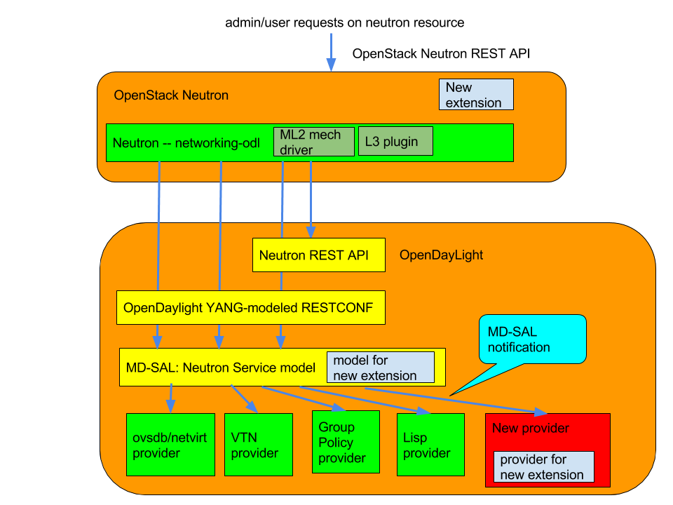

.. _neutron-service-developer-guide:

Neutron Service Developer Guide
===============================

Overview
--------

This Karaf feature (``odl-neutron-service``) provides integration
support for OpenStack Neutron via the OpenDaylight ML2 mechanism driver.
The Neutron Service is only one of the components necessary for
OpenStack integration. It defines YANG models for OpenStack Neutron data
models and northbound API via REST API and YANG model RESTCONF.

Those developers who want to add new provider for new OpenStack Neutron
extensions/services (Neutron constantly adds new extensions/services and
OpenDaylight will keep up with those new things) need to communicate
with this Neutron Service or add models to Neutron Service. If you want
to add new extensions/services themselves to the Neutron Service, new
YANG data models need to be added, but that is out of scope of this
document because this guide is for a developer who will be *using* the
feature to build something separate, but *not* somebody who will be
developing code for this feature itself.

Neutron Service Architecture
----------------------------

   Neutron Service Architecture

The Neutron Service defines YANG models for OpenStack Neutron
integration. When OpenStack admins/users request changes
(creation/update/deletion) of Neutron resources, e.g., Neutron network,
Neutron subnet, Neutron port, the corresponding YANG model within
OpenDaylight will be modified. The OpenDaylight OpenStack will subscribe
the changes on those models and will be notified those modification
through MD-SAL when changes are made. Then the provider will do the
necessary tasks to realize OpenStack integration. How to realize it (or
even not realize it) is up to each provider. The Neutron Service itself
does not take care of it.

How to Write a SB Neutron Consumer
----------------------------------

In Boron, there is only one options for SB Neutron Consumers:

-  Listening for changes via the Neutron YANG model

Until Beryllium there was another way with the legacy I\*Aware
interface. From Boron, the interface was eliminated. So all the SB
Neutron Consumers have to use Neutron YANG model.

Neutron YANG models
-------------------

Neutron service defines YANG models for Neutron. The details can be
found at

-  https://git.opendaylight.org/gerrit/gitweb?p=neutron.git;a=tree;f=model/src/main/yang;hb=refs/heads/stable/boron

Basically those models are based on OpenStack Neutron API definitions.
For exact definitions, OpenStack Neutron source code needs to be
referred as the above documentation doesn’t always cover the necessary
details. There is nothing special to utilize those Neutron YANG models.
The basic procedure will be:

1. subscribe for changes made to the model

2. respond on the data change notification for each models

.. note::

    Currently there is no way to refuse the request configuration at
    this point. That is left to future work.

.. code:: java

    public class NeutronNetworkChangeListener implements DataChangeListener, AutoCloseable {
        private ListenerRegistration<DataChangeListener> registration;
        private DataBroker db;

        public NeutronNetworkChangeListener(DataBroker db){
            this.db = db;
            // create identity path to register on service startup
            InstanceIdentifier<Network> path = InstanceIdentifier
                    .create(Neutron.class)
                    .child(Networks.class)
                    .child(Network.class);
            LOG.debug("Register listener for Neutron Network model data changes");
            // register for Data Change Notification
            registration =
                    this.db.registerDataChangeListener(LogicalDatastoreType.CONFIGURATION, path, this, DataChangeScope.ONE);

        }

        @Override
        public void onDataChanged(
                AsyncDataChangeEvent<InstanceIdentifier<?>, DataObject> changes) {
            LOG.trace("Data changes : {}",changes);

            // handle data change notification
            Object[] subscribers = NeutronIAwareUtil.getInstances(INeutronNetworkAware.class, this);
            createNetwork(changes, subscribers);
            updateNetwork(changes, subscribers);
            deleteNetwork(changes, subscribers);
        }
    }

Neutron configuration
---------------------

From Boron, new models of configuration for OpenDaylight to tell
OpenStack neutron/networking-odl its configuration/capability.

hostconfig
~~~~~~~~~~

This is for OpenDaylight to tell per-node configuration to Neutron.
Especially this is used by pseudo agent port binding heavily.

The model definition can be found at

-  https://git.opendaylight.org/gerrit/gitweb?p=neutron.git;a=blob;f=model/src/main/yang/neutron-hostconfig.yang;hb=refs/heads/stable/boron

How to populate this for pseudo agent port binding is documented at

-  http://git.openstack.org/cgit/openstack/networking-odl/tree/doc/source/devref/hostconfig.rst

Neutron extension config
~~~~~~~~~~~~~~~~~~~~~~~~

In Boron this is experimental. The model definition can be found at

-  https://git.opendaylight.org/gerrit/gitweb?p=neutron.git;a=blob;f=model/src/main/yang/neutron-extensions.yang;hb=refs/heads/stable/boron

Each Neutron Service provider has its own feature set. Some support the
full features of OpenStack, but others support only a subset. With same
supported Neutron API, some functionality may or may not be supported.
So there is a need for a way that OpenDaylight can tell networking-odl
its capability. Thus networking-odl can initialize Neutron properly
based on reported capability.

Neutorn Logger
--------------

There is another small Karaf feature, ``odl-neutron-logger``, which logs
changes of Neutron YANG models. which can be used for debug/audit.

It would also help to understand how to listen the change.

-  https://git.opendaylight.org/gerrit/gitweb?p=neutron.git;a=blob;f=neutron-logger/src/main/java/org/opendaylight/neutron/logger/NeutronLogger.java;hb=refs/heads/stable/boron

API Reference Documentation
---------------------------

The OpenStack Neutron API references

-  http://developer.openstack.org/api-ref-networking-v2.html

-  http://developer.openstack.org/api-ref-networking-v2-ext.html

