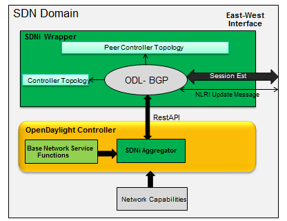

ODL-SDNi Developer Guide
========================

Overview
--------

This project aims at enabling inter-SDN controller communication by
developing SDNi (Software Defined Networking interface) as an
application (ODL-SDNi App).

ODL-SDNi Architecture
---------------------

-  SDNi Aggregator: Northbound SDNi plugin acts as an aggregator for
   collecting network information such as topology, stats, host etc.
   This plugin can be evolving as per needs of network data requested to
   be shared across federated SDN controllers.

-  SDNi REST API: REST API view autogenerated and accessible through
   RESTCONF to fetch the aggregated information from the northbound
   plugin – SDNi aggregator.The RESTCONF protocol operates on a
   conceptual datastore defined with the YANG data modeling language.

-  SDNi Wrapper: SDNi BGP Wrapper will be responsible for the sharing
   and collecting information to/from federated controllers.

SDNi Aggregator
---------------

-  SDNiAggregator connects with the Base Network Service Functions of
   the controller. Currently it is querying network topology through
   md-sal for creating SDNi network capability.

-  SDNiAggregator is customized to retrieve the host controller’s
   details, while running the controller in cluster mode. Rest of the
   northbound APIs of controller will retrieve the entire topology
   information of all the connected controllers.

-  The SDNiAggregator creates a topology structure.This structure is
   populated by the various network funtions.

SDNi REST API
-------------

ODL-SDNi REST API query SDNiAggregator to get the required information
through RESTCONF. Each request must start with URI /restconf

`http://${ipaddress}:8181/restconf/operations/opendaylight-sdni-topology-msg:getTopology <http://${ipaddress}:8181/restconf/operations/opendaylight-sdni-topology-msg:getTopology>`__

**Topology Data:** Controller IP Address, Links, Nodes, Link Bandwidths,
MAC Address of switches, Latency, Host IP address.

`http://${ipaddress}:8181/restconf/operations/opendaylight-sdni-qos-msg:get-all-node-connectors-statistics <http://${ipaddress}:8181/restconf/operations/opendaylight-sdni-qos-msg:get-all-node-connectors-statistics>`__

**QOS Data:** Node, Port, Transmit Packets, Receive Packets, Collision
Count, Receive Frame Error, Receive Over Run Error, Receive Crc Error

SDNi Wrapper
------------

   SDNiWrapper

-  SDNiWrapper is an extension of ODL-BGPCEP where SDNi topology data is
   exchange along with the Update NLRI message. Refer
   http://tools.ietf.org/html/draft-ietf-idr-ls-distribution-04 for more
   information on NLRI.

-  SDNiWrapper gets the controller’s network capabilities through SDNi
   REST API and serialize it in Update NLRI message. This NLRI message
   will get exchange between the clustered controllers through
   BGP-UPDATE message. Similarly peer controller’s UPDATE message is
   received and unpacked then format to SDNi Network capability data,
   which will be stored for further purpose.

API Reference Documentation
---------------------------

Go to
`http://${ipaddress}:8181/apidoc/explorer/index.html <http://${ipaddress}:8181/apidoc/explorer/index.html>`__,
sign in, and expand the opendaylight-sdni panel. From there, users can
execute various API calls to test their sdni deployment.

