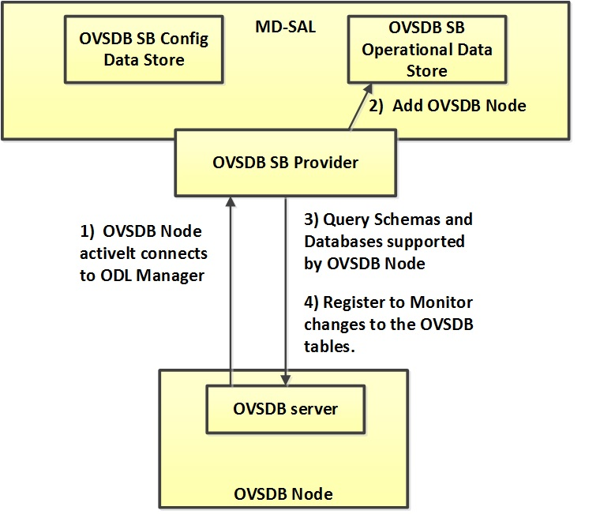

OVSDB NetVirt
=============

OVSDB Integration
-----------------

The Open vSwitch database (OVSDB) Southbound Plugin component for
OpenDaylight implements the OVSDB `RFC
7047 <https://tools.ietf.org/html/rfc7047>`__ management protocol that
allows the southbound configuration of switches that support OVSDB. The
component comprises a library and a plugin. The OVSDB protocol uses
JSON-RPC calls to manipulate a physical or virtual switch that supports
OVSDB. Many vendors support OVSDB on various hardware platforms. The
OpenDaylight controller uses the library project to interact with an OVS
instance.

.. note::

    Read the OVSDB User Guide before you begin development.

OpenDaylight OVSDB integration
~~~~~~~~~~~~~~~~~~~~~~~~~~~~~~

The OpenStack integration architecture uses the following technologies:

-  `RFC 7047 <https://tools.ietf.org/html/rfc7047>`__ - The Open vSwitch
   Database Management Protocol

-  `OpenFlow
   v1.3 <http://www.opennetworking.org/images/stories/downloads/sdn-resources/onf-specifications/openflow/openflow-switch-v1.3.4.pdf>`__

-  `OpenStack Neutron ML2
   Plugin <https://wiki.openstack.org/wiki/Neutron/ML2>`__

OpenDaylight Mechanism Driver for Openstack Neutron ML2
^^^^^^^^^^^^^^^^^^^^^^^^^^^^^^^^^^^^^^^^^^^^^^^^^^^^^^^

This code is a part of OpenStack and is available at:
https://github.com/openstack/neutron/blob/master/neutron/plugins/ml2/drivers/mechanism_odl.py

The ODL neutron driver implementation can be found at:
https://github.com/openstack/networking-odl

To make changes to this code, please read about `Neutron
Development <https://wiki.openstack.org/wiki/NeutronDevelopment>`__.

Before submitting the code, run the following tests:

::

    tox -e py27
    tox -e pep8

Importing the code in to Eclipse or IntelliJ
^^^^^^^^^^^^^^^^^^^^^^^^^^^^^^^^^^^^^^^^^^^^

To import code, look at either of the following pages:

-  `Getting started with
   Eclipse <https://wiki.opendaylight.org/view/Eclipse_Setup>`__

-  `Developing with
   Intellij <https://wiki.opendaylight.org/view/OpenDaylight_Controller:Developing_With_Intellij>`__

   Avoid conflicting project names

-  To ensure that a project in Eclipse does not have a conflicting name
   in the workspace, select Advanced > Name Template >
   [groupId].[artifactId] when importing the project.

Browsing the code
^^^^^^^^^^^^^^^^^

The code is mirrored to
`GitHub <https://github.com/opendaylight/ovsdb>`__ to make reading code
online easier.

Source code organization
^^^^^^^^^^^^^^^^^^^^^^^^

The OVSDB project generates the following Karaf modules:

-  ovsdb.karaf  — all openstack netvirt related artifacts

-  ovsdb.library-karaf — the OVSDB library reference implementation

-  ovsdb.openstack.net-virt-sfc-karaf  — OpenFlow service function
   chaining

-  ovsdb.hwvtepsouthbound-karaf — the hw\_vtep schema southbound plugin

-  ovsdb.southbound-karaf - the Open\_vSwitch schema plugin

Following are a brief descriptions on directories you will find a the
root ovsdb/ directory:

-  *commons* contains the parent POM file for Maven project which is
   used to get consistency of settings across the project.

-  *features* contains all the Karaf related feature files.

-  *hwvtepsouthbound* contains the hw\_vtep southbound plugin.

-  *karaf* contains the ovsdb library and southbound and OpenStack
   bundles for the OpenStack integration.

-  *library* contains a schema-independent library that is a reference
   implementation for RFC 7047.

-  *openstack* contains the northbound handlers for Neutron used by
   OVSDB, as well as their providers. The NetVirt SFC implementation is
   also located here.

-  *ovsdb-ui* contains the DLUX implementation for displaying network
   virtualization.

-  *resources* contains useful scripts, how-tos, demos and other
   resources.

-  *schemas* contains the OVSDB schemas that are implemented in
   OpenDaylight.

-  *southbound* contains the plugin for converting from the OVSDB
   protocol to MD-SAL and vice-versa.

-  *utils* contains a collection of utilities for using the OpenFlow
   plugin, southbound, Neutron and other helper methods.

Building and running OVSDB
~~~~~~~~~~~~~~~~~~~~~~~~~~

| **Prerequisites**

-  JDK 1.7+

-  Maven 3+

Building a Karaf feature and deploying it in an OpenDaylight Karaf distribution
^^^^^^^^^^^^^^^^^^^^^^^^^^^^^^^^^^^^^^^^^^^^^^^^^^^^^^^^^^^^^^^^^^^^^^^^^^^^^^^

1. From the root ovsdb/ directory, run **mvn clean install**.

2. Unzip the karaf-<VERSION\_NUMBER>-SNAPSHOT.zip file created from step
   1 in the directory ovsdb/karaf/target/:

::

    unzip karaf-<VERSION_NUMBER>-SNAPSHOT.zip

Downloading OVSDB’s Karaf distribution
^^^^^^^^^^^^^^^^^^^^^^^^^^^^^^^^^^^^^^

Instead of building, you can download the latest OVSDB distribution from
the Nexus server. The link for that is:

::

    https://nexus.opendaylight.org/content/repositories/opendaylight.snapshot/org/opendaylight/ovsdb/karaf/1.3.0-SNAPSHOT/

Running Karaf feature from OVSDB’s Karaf distribution
^^^^^^^^^^^^^^^^^^^^^^^^^^^^^^^^^^^^^^^^^^^^^^^^^^^^^

1. Start ODL, from the unzipped directory

   ::

      bin/karaf

2. Once karaf has started, and you see the OpenDaylight ascii art in the
   console, the last step is to start the OVSDB plugin framework with
   the following command in the karaf console:

   ::

      feature:install odl-ovsdb-openstack

Sample output from the Karaf console
''''''''''''''''''''''''''''''''''''

::

    opendaylight-user@root>feature:list | grep -i ovsdb
    opendaylight-user@root>feature:list -i | grep ovsdb
    odl-ovsdb-southbound-api          | 1.2.1-SNAPSHOT   | x         | odl-ovsdb-southbound-1.2.1-SNAPSHOT     | OpenDaylight :: southbound :: api
    odl-ovsdb-southbound-impl         | 1.2.1-SNAPSHOT   | x         | odl-ovsdb-southbound-1.2.1-SNAPSHOT     | OpenDaylight :: southbound :: impl
    odl-ovsdb-southbound-impl-rest    | 1.2.1-SNAPSHOT   | x         | odl-ovsdb-southbound-1.2.1-SNAPSHOT     | OpenDaylight :: southbound :: impl :: REST
    odl-ovsdb-southbound-impl-ui      | 1.2.1-SNAPSHOT   | x         | odl-ovsdb-southbound-1.2.1-SNAPSHOT     | OpenDaylight :: southbound :: impl :: UI
    odl-ovsdb-library                 | 1.2.1-SNAPSHOT   | x         | odl-ovsdb-library-1.2.1-SNAPSHOT        | OpenDaylight :: library
    odl-ovsdb-openstack               | 1.2.1-SNAPSHOT   | x         | ovsdb-1.2.1-SNAPSHOT                    | OpenDaylight :: OVSDB :: OpenStack Network Virtual

Testing patches
^^^^^^^^^^^^^^^

It is recommended that you test your patches locally before submission.

Neutron integration
^^^^^^^^^^^^^^^^^^^

To test patches to the Neutron integration, you need a `Multi-Node
Devstack Setup <http://devstack.org/guides/multinode-lab.html>`__. The
\`\`resources\`\` folder contains sample \`\`local.conf\`\` files.

Open vSwitch
^^^^^^^^^^^^

To test patches to the library, you will need a working `Open
vSwitch <http://openvswitch.org/>`__. Packages are available for most
Linux distributions. If you would like to run multiple versions of Open
vSwitch for testing you can use
`docker-ovs <https://github.com/dave-tucker/docker-ovs>`__ to run Open
vSwitch in `Docker <https://www.docker.com/>`__ containers.

Mininet
^^^^^^^

`Mininet <http://mininet.org/>`__ is another useful resource for testing
patches. Mininet creates multiple Open vSwitches connected in a
configurable topology.

Vagrant
^^^^^^^

The Vagrant file in the root of the OVSDB source code provides an easy
way to create VMs for tests.

-  To install Vagrant on your machine, follow the steps at: `Installing
   Vagrant <https://docs.vagrantup.com/v2/installation/>`__.

**Testing with Devstack**

1. Start the controller.

   ::

       vagrant up devstack-control
       vagrant ssh devstack-control
       cd devstack
       ./stack.sh

2. Run the following:

   ::

       vagrant up devstack-compute-1
       vagrant ssh devstack-compute-1
       cd devstack
       ./stack.sh

3. To start testing, create a new VM.

   ::

       nova boot --flavor m1.tiny --image $(nova image-list | grep 'cirros-0.3.1-x86_64-uec\s' | awk '{print $2}') --nic net-id=$(neutron net-list | grep private | awk '{print $2}') test
   
   To create three, use the following:

   ::

       nova boot --flavor m1.tiny --image $(nova image-list | grep 'cirros-0.3.1-x86_64-uec\s' | awk '{print $2}') --nic net-id=$(neutron net-list | grep private | awk '{print $2}') --num-instances 3 test

**To get a mininet installation for testing:.**

::

    vagrant up mininet
    vagrant ssh mininet

1. Use the following to clean up when finished:

::

    vagrant destroy

OVSDB integration design
~~~~~~~~~~~~~~~~~~~~~~~~

Resources
^^^^^^^^^

| See the following:

-  `Network
   Heresy <http://networkheresy.com/2012/09/15/remembering-the-management-plane/>`__

| See the OVSDB YouTube Channel for getting started videos and other
  tutorials:

-  `ODL OVSDB Youtube
   Channel <http://www.youtube.com/channel/UCMYntfZ255XGgYFrxCNcAzA>`__

-  `Mininet OVSDB
   Tutorial <https://wiki.opendaylight.org/view/OVSDB_Integration:Mininet_OVSDB_Tutorial>`__

-  `OVSDB Getting
   Started <https://wiki.opendaylight.org/view/OVSDB_Integration:Main#Getting_Started_with_OpenDaylight_OVSDB_Plugin_Network_Virtualization>`__

OpenDaylight OVSDB southbound plugin architecture and design
~~~~~~~~~~~~~~~~~~~~~~~~~~~~~~~~~~~~~~~~~~~~~~~~~~~~~~~~~~~~

OpenVSwitch (OVS) is generally accepted as the unofficial standard for
Virtual Switching in the Open hypervisor based solutions. Every other
Virtual Switch implementation, properietery or otherwise, uses OVS in
some form. For information on OVS, see `Open
vSwitch <http://openvswitch.org/>`__.

In Software Defined Networking (SDN), controllers and applications
interact using two channels: OpenFlow and OVSDB. OpenFlow addresses the
forwarding-side of the OVS functionality. OVSDB, on the other hand,
addresses the management-plane. A simple and concise overview of Open
Virtual Switch Database(OVSDB) is available at:
http://networkstatic.net/getting-started-ovsdb/

Overview of OpenDaylight Controller architecture
^^^^^^^^^^^^^^^^^^^^^^^^^^^^^^^^^^^^^^^^^^^^^^^^

The OpenDaylight controller platform is designed as a highly modular and
plugin based middleware that serves various network applications in a
variety of use-cases. The modularity is achieved through the Java OSGi
framework. The controller consists of many Java OSGi bundles that work
together to provide the required controller functionalities.

| The bundles can be placed in the following broad categories:

-  Network Service Functional Modules (Examples: Topology Manager,
   Inventory Manager, Forwarding Rules Manager,and others)

-  NorthBound API Modules (Examples: Topology APIs, Bridge Domain APIs,
   Neutron APIs, Connection Manager APIs, and others)

-  Service Abstraction Layer(SAL)- (Inventory Services, DataPath
   Services, Topology Services, Network Config, and others)

-  SouthBound Plugins (OpenFlow Plugin, OVSDB Plugin, OpenDove Plugin,
   and others)

-  Application Modules (Simple Forwarding, Load Balancer)

Each layer of the Controller architecture performs specified tasks, and
hence aids in modularity. While the Northbound API layer addresses all
the REST-Based application needs, the SAL layer takes care of
abstracting the SouthBound plugin protocol specifics from the Network
Service functions.

Each of the SouthBound Plugins serves a different purpose, with some
overlapping. For example, the OpenFlow plugin might serve the Data-Plane
needs of an OVS element, while the OVSDB plugin can serve the management
plane needs of the same OVS element. As the OpenFlow Plugin talks
OpenFlow protocol with the OVS element, the OVSDB plugin will use OVSDB
schema over JSON-RPC transport.

OVSDB southbound plugin
~~~~~~~~~~~~~~~~~~~~~~~

| The `Open vSwitch Database Management
  Protocol-draft-02 <http://tools.ietf.org/html/draft-pfaff-ovsdb-proto-02>`__
  and `Open vSwitch
  Manual <http://openvswitch.org/ovs-vswitchd.conf.db.5.pdf>`__ provide
  theoretical information about OVSDB. The OVSDB protocol draft is
  generic enough to lay the groundwork on Wire Protocol and Database
  Operations, and the OVS Manual currently covers 13 tables leaving
  space for future OVS expansion, and vendor expansions on proprietary
  implementations. The OVSDB Protocol is a database records transport
  protocol using JSON RPC1.0. For information on the protocol structure,
  see `Getting Started with
  OVSDB <http://networkstatic.net/getting-started-ovsdb/>`__. The
  OpenDaylight OVSDB southbound plugin consists of one or more OSGi
  bundles addressing the following services or functionalities:

-  Connection Service - Based on Netty

-  Network Configuration Service

-  Bidirectional JSON-RPC Library

-  OVSDB Schema definitions and Object mappers

-  Overlay Tunnel management

-  OVSDB to OpenFlow plugin mapping service

-  Inventory Service

Connection service
~~~~~~~~~~~~~~~~~~

| One of the primary services that most southbound plugins provide in
  OpenDaylight a Connection Service. The service provides protocol
  specific connectivity to network elements, and supports the
  connectivity management services as specified by the OpenDaylight
  Connection Manager. The connectivity services include:

-  Connection to a specified element given IP-address, L4-port, and
   other connectivity options (such as authentication,…)

-  Disconnection from an element

-  Handling Cluster Mode change notifications to support the
   OpenDaylight Clustering/High-Availability feature

Network Configuration Service
~~~~~~~~~~~~~~~~~~~~~~~~~~~~~

| The goal of the OpenDaylight Network Configuration services is to
  provide complete management plane solutions needed to successfully
  install, configure, and deploy the various SDN based network services.
  These are generic services which can be implemented in part or full by
  any south-bound protocol plugin. The south-bound plugins can be either
  of the following:

-  The new network virtualization protocol plugins such as OVSDB
   JSON-RPC

-  The traditional management protocols such as SNMP or any others in
   the middle.

The above definition, and more information on Network Configuration
Services, is available at :
https://wiki.opendaylight.org/view/OpenDaylight_Controller:NetworkConfigurationServices

Bidirectional JSON-RPC library
^^^^^^^^^^^^^^^^^^^^^^^^^^^^^^

The OVSDB plugin implements a Bidirectional JSON-RPC library. It is easy
to design the library as a module that manages the Netty connection
towards the Element.

| The main responsibilities of this Library are:

-  Demarshal and marshal JSON Strings to JSON objects

-  Demarshal and marshal JSON Strings from and to the Network Element.

OVSDB Schema definitions and Object mappers
^^^^^^^^^^^^^^^^^^^^^^^^^^^^^^^^^^^^^^^^^^^

The OVSDB Schema definitions and Object Mapping layer sits above the
JSON-RPC library. It maps the generic JSON objects to OVSDB schema POJOs
(Plain Old Java Object) and vice-versa. This layer mostly provides the
Java Object definition for the corresponding OVSDB schema (13 of them)
and also will provide much more friendly API abstractions on top of
these object data. This helps in hiding the JSON semantics from the
functional modules such as Configuration Service and Tunnel management.

| On the demarshaling side the mapping logic differentiates the Request
  and Response messages as follows :

-  Request messages are mapped by its "method"

-  | Response messages are mapped by their IDs which were originally
     populated by the Request message. The JSON semantics of these OVSDB
     schema is quite complex. The following figures summarize two of the
     end-to-end scenarios:

   End-to-end handling of a Create Bridge request

.. figure:: ./images/MonitorResponse.png
   :alt: End-to-end handling of a monitor response

   End-to-end handling of a monitor response

Overlay tunnel management
^^^^^^^^^^^^^^^^^^^^^^^^^

Network Virtualization using OVS is achieved through Overlay Tunnels.
The actual Type of the Tunnel may be GRE, VXLAN, or STT. The differences
in the encapsulation and configuration decide the tunnel types.
Establishing a tunnel using configuration service requires just the
sending of OVSDB messages towards the ovsdb-server. However, the scaling
issues that would arise on the state management at the data-plane (using
OpenFlow) can get challenging. Also, this module can assist in various
optimizations in the presence of Gateways. It can also help in providing
Service guarantees for the VMs using these overlays with the help of
underlay orchestration.

OVSDB to OpenFlow plugin mapping service
^^^^^^^^^^^^^^^^^^^^^^^^^^^^^^^^^^^^^^^^

| The connect() of the ConnectionService would result in a Node that
  represents an ovsdb-server. The CreateBridgeDomain() Configuration on
  the above Node would result in creating an OVS bridge. This OVS Bridge
  is an OpenFlow Agent for the OpenDaylight OpenFlow plugin with its own
  Node represented as (example) OF\|xxxx.yyyy.zzzz. Without any help
  from the OVSDB plugin, the Node Mapping Service of the Controller
  platform would not be able to map the following:

::

    {OVSDB_NODE + BRIDGE_IDENTFIER} <---> {OF_NODE}.

Without such mapping, it would be extremely difficult for the
applications to manage and maintain such nodes. This Mapping Service
provided by the OVSDB plugin would essentially help in providing more
value added services to the orchestration layers that sit atop the
Northbound APIs (such as OpenStack).

OpenDaylight OVSDB Developer Getting Started Video Series
~~~~~~~~~~~~~~~~~~~~~~~~~~~~~~~~~~~~~~~~~~~~~~~~~~~~~~~~~

The video series were started to help developers bootstrap into OVSDB
development.

-  `OpenDaylight OVSDB Developer Getting
   Started <http://www.youtube.com/watch?v=ieB645oCIPs>`__

-  `OpenDaylight OVSDB Developer Getting Started - Northbound API
   Usage <http://www.youtube.com/watch?v=xgevyaQ12cg>`__

-  `OpenDaylight OVSDB Developer Getting Started - Java
   APIs <http://www.youtube.com/watch?v=xgevyaQ12cg>`__

-  `OpenDaylight OVSDB Developer Getting Started - OpenStack Integration
   OpenFlow v1.0 <http://www.youtube.com/watch?v=NayuY6J-AMA>`__

Other developer tutorials
^^^^^^^^^^^^^^^^^^^^^^^^^

-  `OVSDB NetVirt
   Tutorial <https://docs.google.com/presentation/d/1KIuNDuUJGGEV37Zk9yzx9OSnWExt4iD2Z7afycFLf_I/edit?usp=sharing>`__

-  `Youtube of OVSDB NetVirt
   tutorial <https://www.youtube.com/watch?v=2axNKHvt5MY&list=PL8F5jrwEpGAiJG252ShQudYeodGSsks2l&index=43>`__

-  `OVSDB OpenFlow v1.3 Neutron ML2
   Integration <https://wiki.opendaylight.org/view/OVSDB:OVSDB_OpenStack_Guide>`__

-  `Open vSwitch Database Table Explanations and Simple Jackson
   Tutorial <http://networkstatic.net/getting-started-ovsdb/>`__

OVSDB integration: New features
~~~~~~~~~~~~~~~~~~~~~~~~~~~~~~~

Schema independent library
^^^^^^^^^^^^^^^^^^^^^^^^^^

The OVS connection is a node which can have multiple databases. Each
database is represented by a schema. A single connection can have
multiple schemas. OSVDB supports multiple schemas. Currently, these are
two schemas available in the OVSDB, but there is no restriction on the
number of schemas. Owing to the Northbound v3 API, no code changes in
ODL are needed for supporting additional schemas.

| Schemas:

-  openvswitch : Schema wrapper that represents
   http://openvswitch.org/ovs-vswitchd.conf.db.5.pdf

-  hardwarevtep: Schema wrapper that represents
   http://openvswitch.org/docs/vtep.5.pdf

Port security
^^^^^^^^^^^^^

Based on the fact that security rules can be obtained from a port
object, OVSDB can apply Open Flow rules. These rules will match on what
types of traffic the Openstack tenant VM is allowed to use.

Support for security groups is very experimental. There are limitations
in determining the state of flows in the Open vSwitch. See `Open vSwitch
and the Intelligent
Edge <http://%20https//www.youtube.com/watch?v=DSop2uLJZS8>`__ from
Justin Petit for a deep dive into the challenges we faced creating a
flow based port security implementation. The current set of rules that
will be installed only supports filtering of the TCP protocol. This is
because via a Nicira TCP\_Flag read we can match on a flows TCP\_SYN
flag, and permit or deny the flow based on the Neutron port security
rules. If rules are requested for ICMP and UDP, they are ignored until
greater visibility from the Linux kernel is available as outlined in the
OpenStack presentation mentioned earlier.

Using the port security groups of Neutron, one can add rules that
restrict the network access of the tenants. The OVSDB Neutron
integration checks the port security rules configured, and apply them by
means of OpenFlow rules.

Through the ML2 interface, Neutron security rules are available in the
port object, following this scope: Neutron Port → Security Group →
Security Rules.

The current rules are applied on the basis of the following attributes:
ingress/egress, tcp protocol, port range, and prefix.

OpenStack workflow
''''''''''''''''''

1. Create a stack.

2. Add the network and subnet.

3. Add the Security Group and Rules.

   .. note::

      This is no different than what users normally do in regular
      OpenStack deployments.

   ::

      neutron security-group-create group1 --description "Group 1"
      neutron security-group-list
      neutron security-group-rule-create --direction ingress --protocol tcp group1

4. Start the tenant, specifying the security-group.

   ::

      nova boot --flavor m1.tiny \
      --image $(nova image-list | grep 'cirros-0.3.1-x86_64-uec\s' | awk '{print $2}') \
      --nic net-id=$(neutron net-list | grep 'vxlan2' | awk '{print $2}') vxlan2 \
      --security-groups group1

Examples: Rules supported
'''''''''''''''''''''''''

::

    neutron security-group-create group2 --description "Group 2"
    neutron security-group-rule-create --direction ingress --protocol tcp --port-range-min 54 group2
    neutron security-group-rule-create --direction ingress --protocol tcp --port-range-min 80 group2
    neutron security-group-rule-create --direction ingress --protocol tcp --port-range-min 1633 group2
    neutron security-group-rule-create --direction ingress --protocol tcp --port-range-min 22 group2

::

    neutron security-group-create group3 --description "Group 3"
    neutron security-group-rule-create --direction ingress --protocol tcp --remote-ip-prefix 10.200.0.0/16 group3

::

    neutron security-group-create group4 --description "Group 4"
    neutron security-group-rule-create --direction ingress --remote-ip-prefix 172.24.0.0/16 group4

::

    neutron security-group-create group5 --description "Group 5"
    neutron security-group-rule-create --direction ingress --protocol tcp group5
    neutron security-group-rule-create --direction ingress --protocol tcp --port-range-min 54 group5
    neutron security-group-rule-create --direction ingress --protocol tcp --port-range-min 80 group5
    neutron security-group-rule-create --direction ingress --protocol tcp --port-range-min 1633 group5
    neutron security-group-rule-create --direction ingress --protocol tcp --port-range-min 22 group5

::

    neutron security-group-create group6 --description "Group 6"
    neutron security-group-rule-create --direction ingress --protocol tcp --remote-ip-prefix 0.0.0.0/0 group6

::

    neutron security-group-create group7 --description "Group 7"
    neutron security-group-rule-create --direction egress --protocol tcp --port-range-min 443 --remote-ip-prefix 172.16.240.128/25 group7

**Reference
gist**: `Gist <https://gist.github.com/anonymous/1543a410d57f491352c8>`__

Security group rules supported in ODL
'''''''''''''''''''''''''''''''''''''

The following rules formats are supported in the current implementation.
The direction (ingress/egress) is always expected. Rules are implemented
such that tcp-syn packets that do not satisfy the rules are dropped.

+--------------------------+--------------------------+--------------------------+
| Proto                    | Port                     | IP Prefix                |
+==========================+==========================+==========================+
| TCP                      | x                        | x                        |
+--------------------------+--------------------------+--------------------------+
| Any                      | Any                      | x                        |
+--------------------------+--------------------------+--------------------------+
| TCP                      | x                        | Any                      |
+--------------------------+--------------------------+--------------------------+
| TCP                      | Any                      | Any                      |
+--------------------------+--------------------------+--------------------------+

Limitations
'''''''''''

-  Soon, conntrack will be supported by OVS. Until then, TCP flags are
   used as way of checking for connection state. Specifically, that is
   done by matching on the TCP-SYN flag.

-  The param *--port-range-max* in *security-group-rule-create* is not
   used until the implementation uses contrack.

-  No UDP/ICMP specific match support is provided.

-  No IPv6 support is provided.

L3 forwarding
^^^^^^^^^^^^^

OVSDB extends support for the usage of an ODL-Neutron-driver so that
OVSDB can configure OF 1.3 rules to route IPv4 packets. The driver
eliminates the need for the router of the L3 Agent. In order to
accomplish that, OVS 2.1 or a newer version is required. OVSDB also
supports inbound/outbound NAT, floating IPs.

Starting OVSDB and OpenStack
''''''''''''''''''''''''''''

1. Build or download OVSDB distribution, as mentioned in `building a
   Karaf feature section <#ovsdbBuildSteps>`__.

2. `Install
   Vagrant <http://docs.vagrantup.com/v2/installation/index.html>`__.

3. Enable the L3 Forwarding feature:

   ::

      echo 'ovsdb.l3.fwd.enabled=yes' >> ./opendaylight/configuration/config.ini
      echo 'ovsdb.l3gateway.mac=${GATEWAY_MAC}' >> ./configuration/config.ini

4. Run the following commands to get the odl neutron drivers:

   ::

      git clone https://github.com/dave-tucker/odl-neutron-drivers.git
      cd odl-neutron-drivers
      vagrant up devstack-control devstack-compute-1

5. Use ssh to go to the control node, and clone odl-neutron-drivers
   again:

   ::

      vagrant ssh devstack-control
      git clone https://github.com/dave-tucker/odl-neutron-drivers.git
      cd odl-neutron-drivers
      sudo python setup.py install
      *leave this shell open*

6. Start odl, as mentioned in `running Karaf feature
   section <#ovsdbStartingOdl>`__.

7. To see processing of neutron event related to L3, do this from
   prompt:

   ::

      log:set debug org.opendaylight.ovsdb.openstack.netvirt.impl.NeutronL3Adapter

8. From shell, do one of the following: open on ssh into control node or
   vagrant ssh devstack-control.

   ::

      cd ~/devstack && ./stack.sh

9. From a new shell in the host system, run the following:

   ::

      cd odl-neutron-drivers
      vagrant ssh devstack-compute-1
      cd ~/devstack && ./stack.sh

OpenStack workflow
''''''''''''''''''

   Sample workflow

Use the following steps to set up a workflow like the one shown in
figure above.

1. Set up authentication. From shell on stack control or vagrant ssh
   devstack-control:

   ::

      source openrc admin admin

      rm -f id_rsa_demo* ; ssh-keygen -t rsa -b 2048 -N  -f id_rsa_demo
      nova keypair-add --pub-key  id_rsa_demo.pub  demo_key
      # nova keypair-list

2. Create two networks and two subnets.

   ::

      neutron net-create net1 --tenant-id $(keystone tenant-list | grep '\s'admin | awk '{print $2}') \
      --provider:network_type gre --provider:segmentation_id 555

      neutron subnet-create --tenant-id $(keystone tenant-list | grep '\s'admin | awk '{print $2}') \
      net1 10.0.0.0/16 --name subnet1 --dns-nameserver 8.8.8.8

      neutron net-create net2 --tenant-id $(keystone tenant-list | grep '\s'admin | awk '{print $2}') \
      --provider:network_type gre --provider:segmentation_id 556

      neutron subnet-create --tenant-id $(keystone tenant-list | grep '\s'admin | awk '{print $2}') \
      net2 20.0.0.0/16 --name subnet2 --dns-nameserver 8.8.8.8

3. Create a router, and add an interface to each of the two subnets.

   ::

      neutron router-create demorouter --tenant-id $(keystone tenant-list | grep '\s'admin | awk '{print $2}')
      neutron router-interface-add demorouter subnet1
      neutron router-interface-add demorouter subnet2
     # neutron router-port-list demorouter

4. Create two tenant instances.

   ::

      nova boot --poll --flavor m1.nano --image $(nova image-list | grep 'cirros-0.3.2-x86_64-uec\s' | awk '{print $2}') \
      --nic net-id=$(neutron net-list | grep -w net1 | awk '{print $2}'),v4-fixed-ip=10.0.0.10 \
      --availability-zone nova:devstack-control \
      --key-name demo_key host10

      nova boot --poll --flavor m1.nano --image $(nova image-list | grep 'cirros-0.3.2-x86_64-uec\s' | awk '{print $2}') \
      --nic net-id=$(neutron net-list | grep -w net2 | awk '{print $2}'),v4-fixed-ip=20.0.0.20 \
      --availability-zone nova:devstack-compute-1 \
      --key-name demo_key host20

Limitations
'''''''''''

-  To use this feature, you need OVS 2.1 or newer version.

-  Owing to OF limitations, icmp responses due to routing failures, like
   ttl expired or host unreacheable, are not generated.

-  The MAC address of the default route is not automatically mapped. In
   order to route to L3 destinations outside the networks of the tenant,
   the manual configuration of the default route is necessary. To
   provide the MAC address of the default route, use ovsdb.l3gateway.mac
   in file configuration/config.ini ;

-  This feature is Tech preview, which depends on later versions of
   OpenStack to be used without the provided neutron-driver.

-  No IPv6 support is provided.

| **More information on L3 forwarding**:

-  odl-neutron-driver:
   https://github.com/dave-tucker/odl-neutron-drivers

-  OF rules example:
   http://dtucker.co.uk/hack/building-a-router-with-openvswitch.html

LBaaS
^^^^^

Load-Balancing-as-a-Service (LBaaS) creates an Open vSwitch powered
L3-L4 stateless load-balancer in a virtualized network environment so
that individual TCP connections destined to a designated virtual IP
(VIP) are sent to the appropriate servers (that is to say, serving app
VMs). The load-balancer works in a session-preserving, proactive manner
without involving the controller during flow setup.

A Neutron northbound interface is provided to create a VIP which will
map to a pool of servers (that is to say, members) within a subnet. The
pools consist of members identified by an IP address. The goal is to
closely match the API to the OpenStack LBaaS v2 API:
http://docs.openstack.org/api/openstack-network/2.0/content/lbaas_ext.html.

Creating an OpenStack workflow
''''''''''''''''''''''''''''''

1. Create a subnet.

2. Create a floating VIP *A* that maps to a private VIP *B*.

3. Create a Loadbalancer pool *X*.

   ::

      neutron lb-pool-create --name http-pool --lb-method ROUND_ROBIN --protocol HTTP --subnet-id XYZ

4. Create a Loadbalancer pool member *Y* and associate with pool *X*.

   ::

      neutron lb-member-create --address 10.0.0.10 --protocol-port 80 http-pool
      neutron lb-member-create --address 10.0.0.11 --protocol-port 80 http-pool
      neutron lb-member-create --address 10.0.0.12 --protocol-port 80 http-pool
      neutron lb-member-create --address 10.0.0.13 --protocol-port 80 http-pool

5. Create a Loadbalancer instance *Z*, and associate pool *X* and VIP
   *B* with it.

   ::

      neutron lb-vip-create --name http-vip --protocol-port 80 --protocol HTTP --subnet-id XYZ http-pool

Implementation
''''''''''''''

The current implementation of the proactive stateless load-balancer was
made using "multipath" action in the Open vSwitch. The "multipath"
action takes a max\_link parameter value (which is same as the number of
pool members) as input, and performs a hash of the fields to get a value
between (0, max\_link). The value of the hash is used as an index to
select a pool member to handle that session.

Open vSwitch rules
^^^^^^^^^^^^^^^^^^

Assuming that table=20 contains all the rules to forward the traffic
destined for a specific destination MAC address, the following are the
rules needed to be programmed in the LBaaS service table=10. The
programmed rules makes the translation from the VIP to a different pool
member for every session.

-  Proactive forward rules:

   ::

      sudo ovs-ofctl -O OpenFlow13 add-flow s1 "table=10,reg0=0,ip,nw_dst=10.0.0.5,actions=load:0x1->NXM_NX_REG0[[]],multipath(symmetric_l4, 1024, modulo_n, 4, 0, NXM_NX_REG1[0..12]),resubmit(,10)"
      sudo ovs-ofctl -O OpenFlow13 add-flow s1 table=10,reg0=1,nw_dst=10.0.0.5,ip,reg1=0,actions=mod_dl_dst:00:00:00:00:00:10,mod_nw_dst:10.0.0.10,goto_table:20
      sudo ovs-ofctl -O OpenFlow13 add-flow s1 table=10,reg0=1,nw_dst=10.0.0.5,ip,reg1=1,actions=mod_dl_dst:00:00:00:00:00:11,mod_nw_dst:10.0.0.11,goto_table:20
      sudo ovs-ofctl -O OpenFlow13 add-flow s1 table=10,reg0=1,nw_dst=10.0.0.5,ip,reg1=2,actions=mod_dl_dst:00:00:00:00:00:12,mod_nw_dst:10.0.0.12,goto_table:20
      sudo ovs-ofctl -O OpenFlow13 add-flow s1 table=10,reg0=1,nw_dst=10.0.0.5,ip,reg1=3,actions=mod_dl_dst:00:00:00:00:00:13,mod_nw_dst:10.0.0.13,goto_table:20

-  Proactive reverse rules:

   ::

      sudo ovs-ofctl -O OpenFlow13 add-flow s1 table=10,ip,tcp,tp_src=80,actions=mod_dl_src:00:00:00:00:00:05,mod_nw_src:10.0.0.5,goto_table:20

OVSDB project code
''''''''''''''''''

The current implementation handles all neutron calls in the
net-virt/LBaaSHandler.java code, and makes calls to the
net-virt-providers/LoadBalancerService to program appropriate flowmods.
The rules are updated whenever there is a change in the Neutron LBaaS
settings. There is no cache of state kept in the net-virt or providers.

Limitations
'''''''''''

Owing to the inflexibility of the multipath action, the existing LBaaS
implementation comes with some limitations:

-  TCP, HTTP or HTTPS are supported protocols for the pool. (Caution:
   You can lose access to the members if you assign {Proto:TCP, Port:22}
   to LB)

-  Member weights are ignored.

-  The update of an LB instance is done as a delete + add, and not an
   actual delta.

-  The update of an LB member is not supported (because weights are
   ignored).

-  Deletion of an LB member leads to the reprogramming of the LB on all
   nodes (because of the way multipath does link hash).

-  There is only a single LB instance per subnet because the pool-id is
   not reported in the create load-balancer call.

OVSDB Library Developer Guide
-----------------------------

Overview
~~~~~~~~

The OVSDB library manages the Netty connections to network nodes and
handles bidirectional JSON-RPC messages. It not only provides OVSDB
protocol functionality to OpenDaylight OVSDB plugin but also can be used
as standalone JAVA library for OVSDB protocol.

The main responsibilities of OVSDB library include:

-  Manage connections to peers

-  Marshal and unmarshal JSON Strings to JSON objects.

-  Marshal and unmarshal JSON Strings from and to the Network Element.

Connection Service
~~~~~~~~~~~~~~~~~~

The OVSDB library provides connection management through the
OvsdbConnection interface. The OvsdbConnection interface provides OVSDB
connection management APIs which include both active and passive
connections. From the library perspective, active OVSDB connections are
initiated from the controller to OVS nodes while passive OVSDB
connections are initiated from OVS nodes to the controller. In the
active connection scenario an application needs to provide the IP
address and listening port of OVS nodes to the library management API.
On the other hand, the library management API only requires the info of
the controller listening port in the passive connection scenario.

For a passive connection scenario, the library also provides a
connection event listener through the OvsdbConnectionListener interface.
The listener interface has connected() and disconnected() methods to
notify an application when a new passive connection is established or an
existing connection is terminated.

SSL Connection
~~~~~~~~~~~~~~

In addition to a regular TCP connection, the OvsdbConnection interface
also provides a connection management API for an SSL connection. To
start an OVSDB connection with SSL, an application will need to provide
a Java SSLContext object to the management API. There are different ways
to create a Java SSLContext, but in most cases a Java KeyStore with
certificate and private key provided by the application is required.
Detailed steps about how to create a Java SSLContext is out of the scope
of this document and can be found in the Java documentation for `JAVA
Class SSlContext <http://goo.gl/5svszT>`__.

In the active connection scenario, the library uses the given SSLContext
to create a Java SSLEngine and configures the SSL engine with the client
mode for SSL handshaking. Normally clients are not required to
authenticate themselves.

In the passive connection scenario, the library uses the given
SSLContext to create a Java SSLEngine which will operate in server mode
for SSL handshaking. For security reasons, the SSLv3 protocol and some
cipher suites are disabled. Currently the OVSDB server only supports the
TLS\_RSA\_WITH\_AES\_128\_CBC\_SHA cipher suite and the following
protocols: SSLv2Hello, TLSv1, TLSv1.1, TLSv1.2.

The SSL engine is also configured to operate on two-way authentication
mode for passive connection scenarios, i.e., the OVSDB server
(controller) will authenticate clients (OVS nodes) and clients (OVS
nodes) are also required to authenticate the server (controller). In the
two-way authentication mode, an application should keep a trust manager
to store the certificates of trusted clients and initialize a Java
SSLContext with this trust manager. Thus during the SSL handshaking
process the OVSDB server (controller) can use the trust manager to
verify clients and only accept connection requests from trusted clients.
On the other hand, users should also configure OVS nodes to authenticate
the controller. Open vSwitch already supports this functionality in the
ovsdb-server command with option ``--ca-cert=cacert.pem`` and
``--bootstrap-ca-cert=cacert.pem``. On the OVS node, a user can use the
option ``--ca-cert=cacert.pem`` to specify a controller certificate
directly and the node will only allow connections to the controller with
the specified certificate. If the OVS node runs ovsdb-server with option
``--bootstrap-ca-cert=cacert.pem``, it will authenticate the controller
with the specified certificate cacert.pem. If the certificate file
doesn’t exist, it will attempt to obtain a certificate from the peer
(controller) on its first SSL connection and save it to the named PEM
file ``cacert.pem``. Here is an example of ovsdb-server with
``--bootstrap-ca-cert=cacert.pem`` option:

``ovsdb-server --pidfile --detach --log-file --remote punix:/var/run/openvswitch/db.sock --remote=db:hardware_vtep,Global,managers --private-key=/etc/openvswitch/ovsclient-privkey.pem -- certificate=/etc/openvswitch/ovsclient-cert.pem --bootstrap-ca-cert=/etc/openvswitch/vswitchd.cacert``

OVSDB protocol transactions
~~~~~~~~~~~~~~~~~~~~~~~~~~~

The OVSDB protocol defines the RPC transaction methods in RFC 7047. The
following RPC methods are supported in OVSDB protocol:

-  List databases

-  Get schema

-  Transact

-  Cancel

-  Monitor

-  Update notification

-  Monitor cancellation

-  Lock operations

-  Locked notification

-  Stolen notification

-  Echo

According to RFC 7047, an OVSDB server must implement all methods, and
an OVSDB client is only required to implement the "Echo" method and
otherwise free to implement whichever methods suit its needs. However,
the OVSDB library currently doesn’t support all RPC methods. For the
"Echo" method, the library can handle "Echo" messages from a peer and
send a JSON response message back, but the library doesn’t support
actively sending an "Echo" JSON request to a peer. Other unsupported RPC
methods are listed below:

-  Cancel

-  Lock operations

-  Locked notification

-  Stolen notification

In the OVSDB library the RPC methods are defined in the Java interface
OvsdbRPC. The library also provides a high-level interface OvsdbClient
as the main interface to interact with peers through the OVSDB protocol.
In the passive connection scenario, each connection will have a
corresponding OvsdbClient object, and the application can obtain the
OvsdbClient object through connection listener callback methods. In
other words, if the application implements the OvsdbConnectionListener
interface, it will get notifications of connection status changes with
the corresponding OvsdbClient object of that connection.

OVSDB database operations
~~~~~~~~~~~~~~~~~~~~~~~~~

RFC 7047 also defines database operations, such as insert, delete, and
update, to be performed as part of a "transact" RPC request. The OVSDB
library defines the data operations in Operations.java and provides the
TransactionBuilder class to help build "transact" RPC requests. To build
a JSON-RPC transact request message, the application can obtain the
TransactionBuilder object through a transactBuilder() method in the
OvsdbClient interface.

The TransactionBuilder class provides the following methods to help
build transactions:

-  getOperations(): Get the list of operations in this transaction.

-  add(): Add data operation to this transaction.

-  build(): Return the list of operations in this transaction. This is
   the same as the getOperations() method.

-  execute(): Send the JSON RPC transaction to peer.

-  getDatabaseSchema(): Get the database schema of this transaction.

If the application wants to build and send a "transact" RPC request to
modify OVSDB tables on a peer, it can take the following steps:

1. Statically import parameter "op" in Operations.java

   ``import static org.opendaylight.ovsdb.lib.operations.Operations.op;``

2. Obtain transaction builder through transacBuilder() method in
   OvsdbClient:

   ``TransactionBuilder transactionBuilder = ovsdbClient.transactionBuilder(dbSchema);``

3. Add operations to transaction builder:

   ``transactionBuilder.add(op.insert(schema, row));``

4. Send transaction to peer and get JSON RPC response:

   ``operationResults = transactionBuilder.execute().get();``

   .. note::

       Although the "select" operation is supported in the OVSDB
       library, the library implementation is a little different from
       RFC 7047. In RFC 7047, section 5.2.2 describes the "select"
       operation as follows:

   “The "rows" member of the result is an array of objects. Each object
   corresponds to a matching row, with each column specified in
   "columns" as a member, the column’s name as the member name, and its
   value as the member value. If "columns" is not specified, all the
   table’s columns are included (including the internally generated
   "\_uuid" and "\_version" columns).”

   The OVSDB library implementation always requires the column’s name in
   the "columns" field of a JSON message. If the "columns" field is not
   specified, none of the table’s columns are included. If the
   application wants to get the table entry with all columns, it needs
   to specify all the columns’ names in the "columns" field.

Reference Documentation
~~~~~~~~~~~~~~~~~~~~~~~

RFC 7047 The Open vSwitch Databse Management Protocol
https://tools.ietf.org/html/rfc7047

OVSDB MD-SAL Southbound Plugin Developer Guide
----------------------------------------------

Overview
~~~~~~~~

The Open vSwitch Database (OVSDB) Model Driven Service Abstraction Layer
(MD-SAL) Southbound Plugin provides an MD-SAL based interface to Open
vSwitch systems. This is done by augmenting the MD-SAL topology node
with a YANG model which replicates some (but not all) of the Open
vSwitch schema.

OVSDB MD-SAL Southbound Plugin Architecture and Operation
~~~~~~~~~~~~~~~~~~~~~~~~~~~~~~~~~~~~~~~~~~~~~~~~~~~~~~~~~

The architecture and operation of the OVSDB MD-SAL Southbound plugin is
illustrated in the following set of diagrams.

Connecting to an OVSDB Node
^^^^^^^^^^^^^^^^^^^^^^^^^^^

An OVSDB node is a system which is running the OVS software and is
capable of being managed by an OVSDB manager. The OVSDB MD-SAL
Southbound plugin in OpenDaylight is capable of operating as an OVSDB
manager. Depending on the configuration of the OVSDB node, the
connection of the OVSDB manager can be active or passive.

Active OVSDB Node Manager Workflow
''''''''''''''''''''''''''''''''''

An active OVSDB node manager connection is made when OpenDaylight
initiates the connection to the OVSDB node. In order for this to work,
you must configure the OVSDB node to listen on a TCP port for the
connection (i.e. OpenDaylight is active and the OVSDB node is passive).
This option can be configured on the OVSDB node using the following
command:

::

    ovs-vsctl set-manager ptcp:6640

The following diagram illustrates the sequence of events which occur
when OpenDaylight initiates an active OVSDB manager connection to an
OVSDB node.

.. figure:: ./images/ovsdb-sb-active-connection.jpg
   :alt: Active OVSDB Manager Connection

   Active OVSDB Manager Connection

Step 1
    Create an OVSDB node by using RESTCONF or an OpenDaylight plugin.
    The OVSDB node is listed under the OVSDB topology node.

Step 2
    Add the OVSDB node to the OVSDB MD-SAL southbound configuration
    datastore. The OVSDB southbound provider is registered to listen for
    data change events on the portion of the MD-SAL topology data store
    which contains the OVSDB southbound topology node augmentations. The
    addition of an OVSDB node causes an event which is received by the
    OVSDB Southbound provider.

Step 3
    The OVSDB Southbound provider initiates a connection to the OVSDB
    node using the connection information provided in the configuration
    OVSDB node (i.e. IP address and TCP port number).

Step 4
    The OVSDB Southbound provider adds the OVSDB node to the OVSDB
    MD-SAL operational data store. The operational data store contains
    OVSDB node objects which represent active connections to OVSDB
    nodes.

Step 5
    The OVSDB Southbound provider requests the schema and databases
    which are supported by the OVSDB node.

Step 6
    The OVSDB Southbound provider uses the database and schema
    information to construct a monitor request which causes the OVSDB
    node to send the controller any updates made to the OVSDB databases
    on the OVSDB node.

Passive OVSDB Node Manager Workflow
'''''''''''''''''''''''''''''''''''

A passive OVSDB node connection to OpenDaylight is made when the OVSDB
node initiates the connection to OpenDaylight. In order for this to
work, you must configure the OVSDB node to connect to the IP address and
OVSDB port on which OpenDaylight is listening. This option can be
configured on the OVSDB node using the following command:

::

    ovs-vsctl set-manager tcp:<IP address>:6640

The following diagram illustrates the sequence of events which occur
when an OVSDB node connects to OpenDaylight.

   Passive OVSDB Manager Connection

Step 1
    The OVSDB node initiates a connection to OpenDaylight.

Step 2
    The OVSDB Southbound provider adds the OVSDB node to the OVSDB
    MD-SAL operational data store. The operational data store contains
    OVSDB node objects which represent active connections to OVSDB
    nodes.

Step 3
    The OVSDB Southbound provider requests the schema and databases
    which are supported by the OVSDB node.

Step 4
    The OVSDB Southbound provider uses the database and schema
    information to construct a monitor request which causes the OVSDB
    node to send back any updates which have been made to the OVSDB
    databases on the OVSDB node.

OVSDB Node ID in the Southbound Operational MD-SAL
^^^^^^^^^^^^^^^^^^^^^^^^^^^^^^^^^^^^^^^^^^^^^^^^^^

When OpenDaylight initiates an active connection to an OVSDB node, it
writes an external-id to the Open\_vSwitch table on the OVSDB node. The
external-id is an OpenDaylight instance identifier which identifies the
OVSDB topology node which has just been created. Here is an example
showing the value of the *opendaylight-iid* entry in the external-ids
column of the Open\_vSwitch table where the node-id of the OVSDB node is
*ovsdb:HOST1*.

::

    $ ovs-vsctl list open_vswitch
    ...
    external_ids        : {opendaylight-iid="/network-topology:network-topology/network-topology:topology[network-topology:topology-id='ovsdb:1']/network-topology:node[network-topology:node-id='ovsdb:HOST1']"}
    ...

The *opendaylight-iid* entry in the external-ids column of the
Open\_vSwitch table causes the OVSDB node to have same node-id in the
operational MD-SAL datastore as in the configuration MD-SAL datastore.
This holds true if the OVSDB node manager settings are subsequently
changed so that a passive OVSDB manager connection is made.

If there is no *opendaylight-iid* entry in the external-ids column and a
passive OVSDB manager connection is made, then the node-id of the OVSDB
node in the operational MD-SAL datastore will be constructed using the
UUID of the Open\_vSwitch table as follows.

::

    "node-id": "ovsdb://uuid/b8dc0bfb-d22b-4938-a2e8-b0084d7bd8c1"

The *opendaylight-iid* entry can be removed from the Open\_vSwitch table
using the following command.

::

    $ sudo ovs-vsctl remove open_vswitch . external-id "opendaylight-iid"

OVSDB Changes by using OVSDB Southbound Config MD-SAL
^^^^^^^^^^^^^^^^^^^^^^^^^^^^^^^^^^^^^^^^^^^^^^^^^^^^^

After the connection has been made to an OVSDB node, you can make
changes to the OVSDB node by using the OVSDB Southbound Config MD-SAL.
You can make CRUD operations by using the RESTCONF interface or by a
plugin using the MD-SAL APIs. The following diagram illustrates the
high-level flow of events.

.. figure:: ./images/ovsdb-sb-config-crud.jpg
   :alt: OVSDB Changes by using the Southbound Config MD-SAL

   OVSDB Changes by using the Southbound Config MD-SAL

Step 1
    A change to the OVSDB Southbound Config MD-SAL is made. Changes
    include adding or deleting bridges and ports, or setting attributes
    of OVSDB nodes, bridges or ports.

Step 2
    The OVSDB Southbound provider receives notification of the changes
    made to the OVSDB Southbound Config MD-SAL data store.

Step 3
    As appropriate, OVSDB transactions are constructed and transmitted
    to the OVSDB node to update the OVSDB database on the OVSDB node.

Step 4
    The OVSDB node sends update messages to the OVSDB Southbound
    provider to indicate the changes made to the OVSDB nodes database.

Step 5
    The OVSDB Southbound provider maps the changes received from the
    OVSDB node into corresponding changes made to the OVSDB Southbound
    Operational MD-SAL data store.

Detecting changes in OVSDB coming from outside OpenDaylight
^^^^^^^^^^^^^^^^^^^^^^^^^^^^^^^^^^^^^^^^^^^^^^^^^^^^^^^^^^^

Changes to the OVSDB nodes database may also occur independently of
OpenDaylight. OpenDaylight also receives notifications for these events
and updates the Southbound operational MD-SAL. The following diagram
illustrates the sequence of events.

.. figure:: ./images/ovsdb-sb-oper-crud.jpg
   :alt: OVSDB Changes made directly on the OVSDB node

   OVSDB Changes made directly on the OVSDB node

Step 1
    Changes are made to the OVSDB node outside of OpenDaylight (e.g.
    ovs-vsctl).

Step 2
    The OVSDB node constructs update messages to inform OpenDaylight of
    the changes made to its databases.

Step 3
    The OVSDB Southbound provider maps the OVSDB database changes to
    corresponding changes in the OVSDB Southbound operational MD-SAL
    data store.

OVSDB Model
^^^^^^^^^^^

The OVSDB Southbound MD-SAL operates using a YANG model which is based
on the abstract topology node model found in the `network topology
model <https://github.com/opendaylight/yangtools/blob/stable/boron/model/ietf/ietf-topology/src/main/yang/network-topology%402013-10-21.yang>`__.

The augmentations for the OVSDB Southbound MD-SAL are defined in the
`ovsdb.yang <https://github.com/opendaylight/ovsdb/blob/stable/boron/southbound/southbound-api/src/main/yang/ovsdb.yang>`__
file.

There are three augmentations:

**ovsdb-node-augmentation**
    This augments the topology node and maps primarily to the
    Open\_vSwitch table of the OVSDB schema. It contains the following
    attributes.

    -  **connection-info** - holds the local and remote IP address and
       TCP port numbers for the OpenDaylight to OVSDB node connections

    -  **db-version** - version of the OVSDB database

    -  **ovs-version** - version of OVS

    -  **list managed-node-entry** - a list of references to
       ovsdb-bridge-augmentation nodes, which are the OVS bridges
       managed by this OVSDB node

    -  **list datapath-type-entry** - a list of the datapath types
       supported by the OVSDB node (e.g. *system*, *netdev*) - depends
       on newer OVS versions

    -  **list interface-type-entry** - a list of the interface types
       supported by the OVSDB node (e.g. *internal*, *vxlan*, *gre*,
       *dpdk*, etc.) - depends on newer OVS verions

    -  **list openvswitch-external-ids** - a list of the key/value pairs
       in the Open\_vSwitch table external\_ids column

    -  **list openvswitch-other-config** - a list of the key/value pairs
       in the Open\_vSwitch table other\_config column

**ovsdb-bridge-augmentation**
    This augments the topology node and maps to an specific bridge in
    the OVSDB bridge table of the associated OVSDB node. It contains the
    following attributes.

    -  **bridge-uuid** - UUID of the OVSDB bridge

    -  **bridge-name** - name of the OVSDB bridge

    -  **bridge-openflow-node-ref** - a reference (instance-identifier)
       of the OpenFlow node associated with this bridge

    -  **list protocol-entry** - the version of OpenFlow protocol to use
       with the OpenFlow controller

    -  **list controller-entry** - a list of controller-uuid and
       is-connected status of the OpenFlow controllers associated with
       this bridge

    -  **datapath-id** - the datapath ID associated with this bridge on
       the OVSDB node

    -  **datapath-type** - the datapath type of this bridge

    -  **fail-mode** - the OVSDB fail mode setting of this bridge

    -  **flow-node** - a reference to the flow node corresponding to
       this bridge

    -  **managed-by** - a reference to the ovsdb-node-augmentation
       (OVSDB node) that is managing this bridge

    -  **list bridge-external-ids** - a list of the key/value pairs in
       the bridge table external\_ids column for this bridge

    -  **list bridge-other-configs** - a list of the key/value pairs in
       the bridge table other\_config column for this bridge

**ovsdb-termination-point-augmentation**
    This augments the topology termination point model. The OVSDB
    Southbound MD-SAL uses this model to represent both the OVSDB port
    and OVSDB interface for a given port/interface in the OVSDB schema.
    It contains the following attributes.

    -  **port-uuid** - UUID of an OVSDB port row

    -  **interface-uuid** - UUID of an OVSDB interface row

    -  **name** - name of the port

    -  **interface-type** - the interface type

    -  **list options** - a list of port options

    -  **ofport** - the OpenFlow port number of the interface

    -  **ofport\_request** - the requested OpenFlow port number for the
       interface

    -  **vlan-tag** - the VLAN tag value

    -  **list trunks** - list of VLAN tag values for trunk mode

    -  **vlan-mode** - the VLAN mode (e.g. access, native-tagged,
       native-untagged, trunk)

    -  **list port-external-ids** - a list of the key/value pairs in the
       port table external\_ids column for this port

    -  **list interface-external-ids** - a list of the key/value pairs
       in the interface table external\_ids interface for this interface

    -  **list port-other-configs** - a list of the key/value pairs in
       the port table other\_config column for this port

    -  **list interface-other-configs** - a list of the key/value pairs
       in the interface table other\_config column for this interface

Examples of OVSDB Southbound MD-SAL API
~~~~~~~~~~~~~~~~~~~~~~~~~~~~~~~~~~~~~~~

Connect to an OVSDB Node
^^^^^^^^^^^^^^^^^^^^^^^^

This example RESTCONF command adds an OVSDB node object to the OVSDB
Southbound configuration data store and attempts to connect to the OVSDB
host located at the IP address 10.11.12.1 on TCP port 6640.

::

    POST http://<host>:8181/restconf/config/network-topology:network-topology/topology/ovsdb:1/
    Content-Type: application/json
    {
      "node": [
         {
           "node-id": "ovsdb:HOST1",
           "connection-info": {
             "ovsdb:remote-ip": "10.11.12.1",
             "ovsdb:remote-port": 6640
           }
         }
      ]
    }

Query the OVSDB Southbound Configuration MD-SAL
^^^^^^^^^^^^^^^^^^^^^^^^^^^^^^^^^^^^^^^^^^^^^^^

Following on from the previous example, if the OVSDB Southbound
configuration MD-SAL is queried, the RESTCONF command and the resulting
reply is similar to the following example.

::

    GET http://<host>:8080/restconf/config/network-topology:network-topology/topology/ovsdb:1/
    Application/json data in the reply
    {
      "topology": [
        {
          "topology-id": "ovsdb:1",
          "node": [
            {
              "node-id": "ovsdb:HOST1",
              "ovsdb:connection-info": {
                "remote-port": 6640,
                "remote-ip": "10.11.12.1"
              }
            }
          ]
        }
      ]
    }

Reference Documentation
~~~~~~~~~~~~~~~~~~~~~~~

`Openvswitch
schema <http://openvswitch.org/ovs-vswitchd.conf.db.5.pdf>`__

OVSDB Openstack Developer Guide
-------------------------------

Overview
~~~~~~~~

The Open vSwitch database (OVSDB) Southbound Plugin component for
OpenDaylight implements the OVSDB `RFC
7047 <https://tools.ietf.org/html/rfc7047>`__ management protocol that
allows the southbound configuration of switches that support OVSDB. The
component comprises a library and a plugin. The OVSDB protocol uses
JSON-RPC calls to manipulate a physical or virtual switch that supports
OVSDB. Many vendors support OVSDB on various hardware platforms. The
OpenDaylight controller uses the library project to interact with an OVS
instance.

`OpenStack <http://www.openstack.org>`__ is a popular open source
Infrastructure as a Service (IaaS) project, covering compute, storage
and network management. OpenStack can use OpenDaylight as its network
management provider through the Neutron API, which acts as a northbound
for OpenStack. the OVSDB NetVirt piece of the OVSDB project is a
provider for the Neutron API in OpenDaylight. OpenDaylight manages the
network flows for the OpenStack compute nodes via the OVSDB project,
with the south-bound plugin. This section describes how to set that up,
and how to tell when everything is working.

OVSDB Openstack Architecture
~~~~~~~~~~~~~~~~~~~~~~~~~~~~

The OpenStack integration architecture uses the following technologies:

-  `RFC 7047 <https://tools.ietf.org/html/rfc7047>`__ - The Open vSwitch
   Database Management Protocol

-  `OpenFlow
   v1.3 <http://www.opennetworking.org/images/stories/downloads/sdn-resources/onf-specifications/openflow/openflow-switch-v1.3.4.pdf>`__

-  `OpenStack Neutron ML2
   Plugin <https://wiki.openstack.org/wiki/Neutron/ML2>`__

.. figure:: images/openstack_integration.png

   OpenStack Integration

OVSDB Service Function Chaining Developer Guide
-----------------------------------------------

Overview
~~~~~~~~

The OVSDB NetVirtSfc provides a classification and traffic steering
component when integrated with OpenStack. Please refer to the Service
Function Chaining project for the theory and programming of service
chains.

Installing the NetVirt SFC Feature
~~~~~~~~~~~~~~~~~~~~~~~~~~~~~~~~~~

Install the odl-ovsdb-sfc feature. The feature will also ensure that the
odl-ovsdb-openstack feature as well as the openflowplugin, neutron and
sfc features are installed.

``feature:install odl-ovsdb-sfc-ui``

Verify the required features are installed:

::

   opendaylight-user@root>feature:list -i | grep ovsdb
   odl-ovsdb-southbound-api | 1.2.1-SNAPSHOT | x | odl-ovsdb-southbound-1.2.1-SNAPSHOT | OpenDaylight southbound :: api
   odl-ovsdb-southbound-impl | 1.2.1-SNAPSHOT | x | odl-ovsdb-southbound-1.2.1-SNAPSHOT | OpenDaylight :: southbound impl
   odl-ovsdb-southbound-impl-rest | 1.2.1-SNAPSHOT | x | odl-ovsdb-southbound-1.2.1-SNAPSHOT | OpenDaylight :: southbound :: impl REST
   odl-ovsdb-southbound-impl-ui | 1.2.1-SNAPSHOT | x | odl-ovsdb-southbound-1.2.1-SNAPSHOT | OpenDaylight :: southbound :: impl UI
   odl-ovsdb-library | 1.2.1-SNAPSHOT | x | odl-ovsdb-library-1.2.1-SNAPSHOT | OpenDaylight library
   odl-ovsdb-openstack | 1.2.1-SNAPSHOT | x | ovsdb-1.2.1-SNAPSHOT | OpenDaylight :: OVSDB OpenStack Network Virtual
   odl-ovsdb-sfc-api | 1.2.1-SNAPSHOT | x | odl-ovsdb-sfc-1.2.1-SNAPSHOT | OpenDaylight :: ovsdb-sfc api
   odl-ovsdb-sfc | 1.2.1-SNAPSHOT | x | odl-ovsdb-sfc-1.2.1-SNAPSHOT | OpenDaylight ovsdb-sfc
   odl-ovsdb-sfc-rest | 1.2.1-SNAPSHOT | x | odl-ovsdb-sfc-1.2.1-SNAPSHOT | OpenDaylight :: ovsdb-sfc REST
   odl-ovsdb-sfc-ui | 1.2.1-SNAPSHOT | x | odl-ovsdb-sfc-1.2.1-SNAPSHOT | OpenDaylight :: ovsdb-sfc UI

   opendaylight-user@root>feature:list -i | grep sfc
   odl-sfc-model | 0.2.0-SNAPSHOT | x | odl-sfc-0.2.0-SNAPSHOT | OpenDaylight :: sfc :: Model
   odl-sfc-provider | 0.2.0-SNAPSHOT | x | odl-sfc-0.2.0-SNAPSHOT | OpenDaylight :: sfc :: Provider
   odl-sfc-provider-rest | 0.2.0-SNAPSHOT | x | odl-sfc-0.2.0-SNAPSHOT | OpenDaylight :: sfc :: Provider
   odl-sfc-ovs | 0.2.0-SNAPSHOT | x | odl-sfc-0.2.0-SNAPSHOT | OpenDaylight :: OpenvSwitch
   odl-sfcofl2 | 0.2.0-SNAPSHOT | x | odl-sfc-0.2.0-SNAPSHOT | OpenDaylight :: sfcofl2
   odl-ovsdb-sfc-test | 1.2.1-SNAPSHOT | x | odl-ovsdb-sfc-test1.2.1-SNAPSHOT | OpenDaylight :: ovsdb-sfc-test
   odl-ovsdb-sfc-api | 1.2.1-SNAPSHOT | x | odl-ovsdb-sfc-1.2.1-SNAPSHOT | OpenDaylight :: ovsdb-sfc :: api
   odl-ovsdb-sfc | 1.2.1-SNAPSHOT | x | odl-ovsdb-sfc-1.2.1-SNAPSHOT | OpenDaylight :: ovsdb-sfc
   odl-ovsdb-sfc-rest | 1.2.1-SNAPSHOT | x | odl-ovsdb-sfc-1.2.1-SNAPSHOT | OpenDaylight :: ovsdb-sfc :: REST
   odl-ovsdb-sfc-ui | 1.2.1-SNAPSHOT | x | odl-ovsdb-sfc-1.2.1-SNAPSHOT | OpenDaylight :: ovsdb-sfc :: UI

   opendaylight-user@root>feature:list -i | grep neutron
   odl-neutron-service | 0.6.0-SNAPSHOT | x | odl-neutron-0.6.0-SNAPSHOT | OpenDaylight :: Neutron :: API
   odl-neutron-northbound-api | 0.6.0-SNAPSHOT | x | odl-neutron-0.6.0-SNAPSHOT | OpenDaylight :: Neutron :: Northbound
   odl-neutron-spi | 0.6.0-SNAPSHOT | x | odl-neutron-0.6.0-SNAPSHOT | OpenDaylight :: Neutron :: API
   odl-neutron-transcriber | 0.6.0-SNAPSHOT | x | odl-neutron-0.6.0-SNAPSHOT | OpenDaylight :: Neutron :: Implementation

OVSDB NetVirt Service Function Chaining Example
~~~~~~~~~~~~~~~~~~~~~~~~~~~~~~~~~~~~~~~~~~~~~~~

The architecture within OpenDaylight can be seen in the following
figure:

.. figure:: ./images/ovsdb/ODL_SFC_Architecture.png
   :alt: OpenDaylight OVSDB NetVirt SFC Architecture

   OpenDaylight OVSDB NetVirt SFC Architecture

Tacker is a Virtual Network Functions Manager that is responsible for
orchestrating the Service Function Chaining. Tacker is responsible for
generating templates for Virtual Network Functions for OpenStack to
instantiate the Service Functions. Tacker also uses the RESTCONF
interfaces of OpenDaylight to create the Service Function Chains.

Classification
~~~~~~~~~~~~~~

OVSDB NetVirt SFC implements the classification for the chains. The
classification steers traffic from the tenant overlay to the chain
overlay and back to the tenant overlay.

An Access Control List used by NetVirtSFC to create the classifier is
shown below. This is an example of classifying HTTP traffic using the
tcp port 80. In this example the user would have created a Service
Function Chain with the name "http-sfc" as well as all the associated
Service Functions and Service Function Forwarders for the chain.

http://localhost:8181/restconf/config/ietf-access-control-list:access-lists

::

   {
     "access-lists": {
       "acl": [
         {
           "acl-name": "http-acl",
           "access-list-entries": {
             "ace": [
               {
                 "rule-name": "http-rule",
                 "matches": {
                   "source-port-range": {
                     "lower-port": 0,
                     "upper-port": 0
                   },
                   "protocol": 6,
                   "destination-port-range": {
                     "lower-port": 80,
                     "upper-port": 80
                   }
                 },
                 "actions": {
                   "netvirt-sfc-acl:sfc-name": "http-sfc"
                 }
               }
             ]
           }
         }
       ]
     }
   }

When the chain is rendered using the Rendered Service Path RPC,
NetvirtSfc will add the classification flows. The classification flows
are shown below. The list shown has been modified to remove the NetVirt
tenant overlay flows. The classification flow is identified with the
cookie: 0x1110010000040255. The 6th digit of the cookie identifies the
flow type as the classifier. The last 8 digits identify the chain with
the first four digits indicating the NSH NSP and the last four digits
identifying the NSH NSI. In this case the chain is identified with an
NSP of 4 and the NSI is 255 to indicate the beginning of the chain.

::

   sudo ovs-ofctl --protocol=OpenFlow13 dump-flows br-int
   OFPST_FLOW reply (OF1.3) (xid=0x2):
    cookie=0x0, duration=17.157s, table=0, n_packets=0, n_bytes=0, priority=6 actions=goto_table:1
    cookie=0x14, duration=10.692s, table=0, n_packets=0, n_bytes=0, priority=400,udp,in_port=4,tp_dst=6633 actions=LOCAL
    cookie=0x0, duration=17.134s, table=0, n_packets=0, n_bytes=0, dl_type=0x88cc actions=CONTROLLER:65535
    cookie=0x14, duration=10.717s, table=0, n_packets=0, n_bytes=0, priority=350,nsp=4 actions=goto_table:152
    cookie=0x14, duration=10.688s, table=0, n_packets=0, n_bytes=0, priority=400,udp,nw_dst=10.2.1.1,tp_dst=6633 actions=output:4
    cookie=0x0, duration=17.157s, table=1, n_packets=0, n_bytes=0, priority=0 actions=goto_table:11
    cookie=0x1110070000040254, duration=10.608s, table=1, n_packets=0, n_bytes=0, priority=40000,reg0=0x1,nsp=4,nsi=254,in_port=1 actions=goto_table:21
    cookie=0x0, duration=17.157s, table=11, n_packets=0, n_bytes=0, priority=0 actions=goto_table:21
    cookie=0x1110060000040254, duration=10.625s, table=11, n_packets=0, n_bytes=0, nsp=4,nsi=254,in_port=4 actions=load:0x1->NXM_NX_REG0[],move:NXM_NX_NSH_C2[]->NXM_NX_TUN_ID[0..31],resubmit(1,1)
    cookie=0x1110010000040255, duration=10.615s, table=11, n_packets=0, n_bytes=0, tcp,reg0=0x1,tp_dst=80 actions=move:NXM_NX_TUN_ID[0..31]->NXM_NX_NSH_C2[],set_nshc1:0xc0a83246,set_nsp:0x4,set_nsi:255,load:0xa020101->NXM_NX_TUN_IPV4_DST[],load:0x4->NXM_NX_TUN_ID[0..31],resubmit(,0)
    cookie=0x0, duration=17.157s, table=21, n_packets=0, n_bytes=0, priority=0 actions=goto_table:31
    cookie=0x1110040000000000, duration=10.765s, table=21, n_packets=0, n_bytes=0, priority=1024,arp,in_port=LOCAL,arp_tpa=10.2.1.1,arp_op=1 actions=move:NXM_OF_ETH_SRC[]->NXM_OF_ETH_DST[],set_field:f6:00:00:0f:00:01->eth_src,load:0x2->NXM_OF_ARP_OP[],move:NXM_NX_ARP_SHA[]->NXM_NX_ARP_THA[],move:NXM_OF_ARP_SPA[]->NXM_OF_ARP_TPA[],load:0xf600000f0001->NXM_NX_ARP_SHA[],load:0xa020101->NXM_OF_ARP_SPA[],IN_PORT
    cookie=0x0, duration=17.157s, table=31, n_packets=0, n_bytes=0, priority=0 actions=goto_table:41
    cookie=0x0, duration=17.157s, table=41, n_packets=0, n_bytes=0, priority=0 actions=goto_table:51
    cookie=0x0, duration=17.157s, table=51, n_packets=0, n_bytes=0, priority=0 actions=goto_table:61
    cookie=0x0, duration=17.142s, table=61, n_packets=0, n_bytes=0, priority=0 actions=goto_table:71
    cookie=0x0, duration=17.140s, table=71, n_packets=0, n_bytes=0, priority=0 actions=goto_table:81
    cookie=0x0, duration=17.116s, table=81, n_packets=0, n_bytes=0, priority=0 actions=goto_table:91
    cookie=0x0, duration=17.116s, table=91, n_packets=0, n_bytes=0, priority=0 actions=goto_table:101
    cookie=0x0, duration=17.107s, table=101, n_packets=0, n_bytes=0, priority=0 actions=goto_table:111
    cookie=0x0, duration=17.083s, table=111, n_packets=0, n_bytes=0, priority=0 actions=drop
    cookie=0x14, duration=11.042s, table=150, n_packets=0, n_bytes=0, priority=5 actions=goto_table:151
    cookie=0x14, duration=11.027s, table=151, n_packets=0, n_bytes=0, priority=5 actions=goto_table:152
    cookie=0x14, duration=11.010s, table=152, n_packets=0, n_bytes=0, priority=5 actions=goto_table:158
    cookie=0x14, duration=10.668s, table=152, n_packets=0, n_bytes=0, priority=650,nsp=4,nsi=255 actions=load:0xa020101->NXM_NX_TUN_IPV4_DST[],goto_table:158
    cookie=0x14, duration=10.995s, table=158, n_packets=0, n_bytes=0, priority=5 actions=drop
    cookie=0xba5eba11ba5eba11, duration=10.645s, table=158, n_packets=0, n_bytes=0, priority=751,nsp=4,nsi=255,in_port=4 actions=move:NXM_NX_NSH_C1[]->NXM_NX_NSH_C1[],move:NXM_NX_NSH_C2[]->NXM_NX_NSH_C2[],move:NXM_NX_TUN_ID[0..31]->NXM_NX_TUN_ID[0..31],IN_PORT
    cookie=0xba5eba11ba5eba11, duration=10.590s, table=158, n_packets=0, n_bytes=0, priority=751,nsp=4,nsi=254,in_port=4 actions=move:NXM_NX_NSI[]->NXM_NX_NSI[],move:NXM_NX_NSP[]->NXM_NX_NSP[],move:NXM_NX_NSH_C1[]->NXM_NX_TUN_IPV4_DST[],move:NXM_NX_NSH_C2[]->NXM_NX_TUN_ID[0..31],IN_PORT
    cookie=0xba5eba11ba5eba11, duration=10.640s, table=158, n_packets=0, n_bytes=0, priority=750,nsp=4,nsi=255 actions=move:NXM_NX_NSH_C1[]->NXM_NX_NSH_C1[],move:NXM_NX_NSH_C2[]->NXM_NX_NSH_C2[],move:NXM_NX_TUN_ID[0..31]->NXM_NX_TUN_ID[0..31],output:4
    cookie=0xba5eba11ba5eba11, duration=10.571s, table=158, n_packets=0, n_bytes=0, priority=761,nsp=4,nsi=254,nshc1=3232248390,in_port=4 actions=move:NXM_NX_NSI[]->NXM_NX_NSI[],move:NXM_NX_NSP[]->NXM_NX_NSP[],move:NXM_NX_NSH_C1[]->NXM_NX_TUN_IPV4_DST[],move:NXM_NX_NSH_C2[]->NXM_NX_TUN_ID[0..31],set_nshc1:0,resubmit(,11)

Configuration
~~~~~~~~~~~~~

Some configuration is required due to application coexistence for the
OpenFlow programming. The SFC project programs flows for the SFC overlay
and NetVirt programs flows for the tenant overlay. Coexistence is
achieved by each application owning a unique set of tables and providing
a simple handoff between the tables.

First configure NetVirt to use table 1 as it’s starting table:

http://localhost:8181/restconf/config/netvirt-providers-config:netvirt-providers-config

``{ "netvirt-providers-config": { "table-offset": 1 } }``

Next configure SFC to start at table 150 and configure the table
handoff. The configuration starts SFC at table 150 and sets the handoff
to table 11 which is the NetVirt SFC classification table.

http://localhost:8181/restconf/config/sfc-of-renderer:sfc-of-renderer-config

``{ "sfc-of-renderer-config": { "sfc-of-app-egress-table-offset": 11, "sfc-of-table-offset": 150 } }``

OVSDB Hardware VTEP Developer Guide
-----------------------------------

Overview
~~~~~~~~

TBD

OVSDB Hardware VTEP Architecture
~~~~~~~~~~~~~~~~~~~~~~~~~~~~~~~~

TBD

