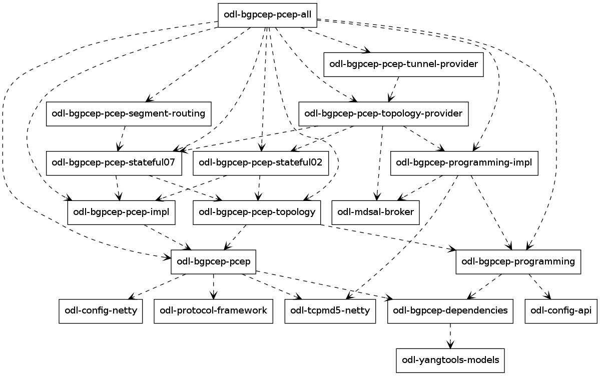
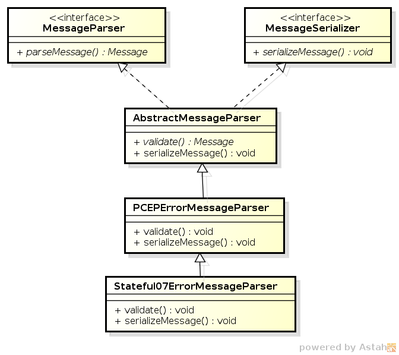

.. _pcep-developer-guide:

PCEP Developer Guide
====================

Overview
--------

This section provides an overview of **feature odl-bgpcep-pcep-all** .
This feature will install everything needed for PCEP (Path Computation
Element Protocol) including establishing the connection, storing
information about LSPs (Label Switched Paths) and displaying data in
network-topology overview.

PCEP Architecture
-----------------

Each feature represents a module in the BGPCEP codebase. The following
diagram illustrates how the features are related.

   PCEP Dependency Tree

Key APIs and Interfaces
-----------------------

PCEP
~~~~

Session handling
^^^^^^^^^^^^^^^^

*32-pcep.xml* defines only pcep-dispatcher the parser should be using
(global-pcep-extensions), factory for creating session proposals (you
can create different proposals for different PCCs (Path Computation
Clients)).

.. code:: xml

     <module>
      <type xmlns:prefix="urn:opendaylight:params:xml:ns:yang:controller:pcep:impl">prefix:pcep-dispatcher-impl</type>
      <name>global-pcep-dispatcher</name>
      <pcep-extensions>
       <type xmlns:pcepspi="urn:opendaylight:params:xml:ns:yang:controller:pcep:spi">pcepspi:extensions</type>
       <name>global-pcep-extensions</name>
      </pcep-extensions>
      <pcep-session-proposal-factory>
       <type xmlns:pcep="urn:opendaylight:params:xml:ns:yang:controller:pcep">pcep:pcep-session-proposal-factory</type>
       <name>global-pcep-session-proposal-factory</name>
      </pcep-session-proposal-factory>
      <boss-group>
       <type xmlns:netty="urn:opendaylight:params:xml:ns:yang:controller:netty">netty:netty-threadgroup</type>
       <name>global-boss-group</name>
      </boss-group>
      <worker-group>
       <type xmlns:netty="urn:opendaylight:params:xml:ns:yang:controller:netty">netty:netty-threadgroup</type>
       <name>global-worker-group</name>
      </worker-group>
     </module>

For user configuration of PCEP, check User Guide.

Parser
^^^^^^

The base PCEP parser includes messages and attributes from
`RFC5441 <http://tools.ietf.org/html/rfc5441>`__,
`RFC5541 <http://tools.ietf.org/html/rfc5541>`__,
`RFC5455 <http://tools.ietf.org/html/rfc5455>`__,
`RFC5557 <http://tools.ietf.org/html/rfc5557>`__ and
`RFC5521 <http://tools.ietf.org/html/rfc5521>`__.

Registration
^^^^^^^^^^^^

All parsers and serializers need to be registered into *Extension
provider*. This *Extension provider* is configured in initial
configuration of the parser-spi module (*32-pcep.xml*).

.. code:: xml

    <module>
     <type xmlns:prefix="urn:opendaylight:params:xml:ns:yang:controller:pcep:spi">prefix:pcep-extensions-impl</type>
     <name>global-pcep-extensions</name>
     <extension>
      <type xmlns:pcepspi="urn:opendaylight:params:xml:ns:yang:controller:pcep:spi">pcepspi:extension</type>
      <name>pcep-parser-base</name>
     </extension>
     <extension>
      <type xmlns:pcepspi="urn:opendaylight:params:xml:ns:yang:controller:pcep:spi">pcepspi:extension</type>
      <name>pcep-parser-ietf-stateful07</name>
     </extension>
     <extension>
      <type xmlns:pcepspi="urn:opendaylight:params:xml:ns:yang:controller:pcep:spi">pcepspi:extension</type>
      <name>pcep-parser-ietf-initiated00</name>
     </extension>
     <extension>
      <type xmlns:pcepspi="urn:opendaylight:params:xml:ns:yang:controller:pcep:spi">pcepspi:extension</type>
      <name>pcep-parser-sync-optimizations</name>
     </extension>
    </module>

-  *pcep-parser-base* - will register parsers and serializers
   implemented in pcep-impl module

-  *pcep-parser-ietf-stateful07* - will register parsers and serializers
   of draft-ietf-pce-stateful-pce-07 implementation

-  *pcep-parser-ietf-initiated00* - will register parser and serializer
   of draft-ietf-pce-pce-initiated-lsp-00 implementation

-  *pcep-parser-sync-optimizations* - will register parser and
   serializers of draft-ietf-pce-stateful-sync-optimizations-03
   implementation

Stateful07 module is a good example of a PCEP parser extension.

Configuration of PCEP parsers specifies one implementation of *Extension
provider* that will take care of registering mentioned parser
extensions:
`SimplePCEPExtensionProviderContext <https://git.opendaylight.org/gerrit/gitweb?p=bgpcep.git;a=blob;f=pcep/spi/src/main/java/org/opendaylight/protocol/pcep/spi/pojo/SimplePCEPExtensionProviderContext.java;hb=refs/for/stable/boron>`__.
All registries are implemented in package
`pcep-spi <https://git.opendaylight.org/gerrit/gitweb?p=bgpcep.git;a=tree;f=pcep/spi/src/main/java/org/opendaylight/protocol/pcep/spi/pojo;hb=refs/for/stable/boron>`__.

Parsing
^^^^^^^

Parsing of PCEP elements is mostly done equally to BGP, the only
exception is message parsing, that is described here.

In BGP messages, parsing of first-level elements (path-attributes) can
be validated in a simple way, as the attributes should be ordered
chronologically. PCEP, on the other hand, has a strict object order
policy, that is described in RBNF (Routing Backus-Naur Form) in each
RFC. Therefore the algorithm for parsing here is to parse all objects in
order as they appear in the message. The result of parsing is a list of
*PCEPObjects*, that is put through validation. *validate()* methods are
present in each message parser. Depending on the complexity of the
message, it can contain either a simple condition (checking the presence
of a mandatory object) or a full state machine.

In addition to that, PCEP requires sending error message for each
documented parsing error. This is handled by creating an empty list of
messages *errors* which is then passed as argument throughout whole
parsing process. If some parser encounters *PCEPDocumentedException*, it
has the duty to create appropriate PCEP error message and add it to this
list. In the end, when the parsing is finished, this list is examined
and all messages are sent to peer.

Better understanding provides this sequence diagram:

.. figure:: ./images/bgpcep/pcep-parsing.png
   :alt: Parsing

   Parsing

PCEP IETF stateful
~~~~~~~~~~~~~~~~~~

This section summarizes module pcep-ietf-stateful07. The term *stateful*
refers to
`draft-ietf-pce-stateful-pce <http://tools.ietf.org/html/draft-ietf-pce-stateful-pce>`__
and
`draft-ietf-pce-pce-initiated-lsp <http://tools.ietf.org/html/draft-ietf-pce-pce-initiated-lsp>`__
in versions draft-ietf-pce-stateful-pce-07 with
draft-ietf-pce-pce-initiated-lsp-00.

We will upgrade our implementation, when the stateful draft gets
promoted to RFC.

The stateful module is implemented as extensions to pcep-base-parser.
The stateful draft declared new elements as well as additional fields or
TLVs (type,length,value) to known objects. All new elements are defined
in yang models, that contain augmentations to elements defined in
`pcep-types.yang <https://git.opendaylight.org/gerrit/gitweb?p=bgpcep.git;a=blob;f=pcep/api/src/main/yang/pcep-types.yang;hb=refs/for/stable/boron>`__.
In the case of extending known elements, the *Parser* class merely
extends the base class and overrides necessary methods as shown in
following diagram:

   Extending existing parsers

All parsers (including those for newly defined PCEP elements) have to be
registered via the *Activator* class. This class is present in both
modules.

In addition to parsers, the stateful module also introduces additional
session proposal. This proposal includes new fields defined in stateful
drafts for Open object.

PCEP segment routing (SR)
~~~~~~~~~~~~~~~~~~~~~~~~~

PCEP Segment Routing is an extension of base PCEP and
pcep-ietf-stateful-07 extension. The pcep-segment-routing module
implements
`draft-ietf-pce-segment-routing-01 <http://tools.ietf.org/html/draft-ietf-pce-segment-routing-01>`__.

The extension brings new SR-ERO (Explicit Route Object) and SR-RRO
(Reported Route Object) subobject composed of SID (Segment Identifier)
and/or NAI (Node or Adjacency Identifier). The segment Routing path is
carried in the ERO and RRO object, as a list of SR-ERO/SR-RRO subobjects
in an order specified by the user. The draft defines new TLV -
SR-PCE-CAPABILITY TLV, carried in PCEP Open object, used to negotiate
Segment Routing ability.

| The yang models of subobject, SR-PCE-CAPABILITY TLV and appropriate
  augmentations are defined in
  `odl-pcep-segment-routing.yang <https://git.opendaylight.org/gerrit/gitweb?p=bgpcep.git;a=blob;f=pcep/segment-routing/src/main/yang/odl-pcep-segment-routing.yang;hb=refs/for/stable/boron>`__.
| The pcep-segment-routing module includes parsers/serializers for new
  subobject
  (`SrEroSubobjectParser <https://git.opendaylight.org/gerrit/gitweb?p=bgpcep.git;a=blob;f=pcep/segment-routing/src/main/java/org/opendaylight/protocol/pcep/segment/routing/SrEroSubobjectParser.java;hb=refs/for/stable/boron>`__)
  and TLV
  (`SrPceCapabilityTlvParser <https://git.opendaylight.org/gerrit/gitweb?p=bgpcep.git;a=blob;f=pcep/segment-routing/src/main/java/org/opendaylight/protocol/pcep/segment/routing/SrPceCapabilityTlvParser.java;hb=refs/for/stable/boron>`__).

The pcep-segment-routing module implements
`draft-ietf-pce-lsp-setup-type-01 <http://tools.ietf.org/html/draft-ietf-pce-lsp-setup-type-01>`__,
too. The draft defines new TLV - Path Setup Type TLV, which value
indicate path setup signaling technique. The TLV may be included in
RP(Request Parameters)/SRP(Stateful PCE Request Parameters) object. For
the default RSVP-TE (Resource Reservation Protocol), the TLV is omitted.
For Segment Routing, PST = 1 is defined.

The Path Setup Type TLV is modeled with yang in module
`pcep-types.yang <https://git.opendaylight.org/gerrit/gitweb?p=bgpcep.git;a=blob;f=pcep/api/src/main/yang/pcep-types.yang;hb=refs/for/stable/boron>`__.
A parser/serializer is implemented in
`PathSetupTypeTlvParser <https://git.opendaylight.org/gerrit/gitweb?p=bgpcep.git;a=blob;f=pcep/impl/src/main/java/org/opendaylight/protocol/pcep/impl/tlv/PathSetupTypeTlvParser.java;hb=refs/for/stable/boron>`__
and it is overriden in segment-routing module to provide the aditional
PST.

PCEP Synchronization Procedures Optimization
~~~~~~~~~~~~~~~~~~~~~~~~~~~~~~~~~~~~~~~~~~~~

Optimizations of Label Switched Path State Synchronization Procedures
for a Stateful PCE draft-ietf-pce-stateful-sync-optimizations-03
specifies following optimizations for state synchronization and the
corresponding PCEP procedures and extensions:

-  **State Synchronization Avoidance:** To skip state synchronization if
   the state has survived and not changed during session restart.

-  **Incremental State Synchronization:** To do incremental (delta)
   state synchronization when possible.

-  **PCE-triggered Initial Synchronization:** To let PCE control the
   timing of the initial state synchronization. The capability can be
   applied to both full and incremental state synchronization.

-  **PCE-triggered Re-synchronization:** To let PCE re-synchronize the
   state for sanity check.

PCEP Topology
~~~~~~~~~~~~~

PCEP data is displayed only through one URL that is accessible from the
base network-topology URL:

*http://localhost:8181/restconf/operational/network-topology:network-topology/topology/pcep-topology*

Each PCC will be displayed as a node:

.. code:: xml

    <node>
     <path-computation-client>
      <ip-address>42.42.42.42</ip-address>
      <state-sync>synchronized</state-sync>
      <stateful-tlv>
       <stateful>
        <initiation>true</initiation>
        <lsp-update-capability>true</lsp-update-capability>
       </stateful>
      </stateful-tlv>
     </path-computation-client>
     <node-id>pcc://42.42.42.42</node-id>
    </node>
    </source>

If some tunnels are configured on the network, they would be displayed
on the same page, within a node that initiated the tunnel:

.. code:: xml

    <node>
     <path-computation-client>
      <state-sync>synchronized</state-sync>
      <stateful-tlv>
       <stateful>
        <initiation>true</initiation>
        <lsp-update-capability>true</lsp-update-capability>
       </stateful>
      </stateful-tlv>
      <reported-lsp>
       <name>foo</name>
       <lsp>
        <operational>down</operational>
        <sync>false</sync>
        <ignore>false</ignore>
        <plsp-id>1</plsp-id>
        <create>false</create>
        <administrative>true</administrative>
        <remove>false</remove>
        <delegate>true</delegate>
        <processing-rule>false</processing-rule>
        <tlvs>
        <lsp-identifiers>
          <ipv4>
           <ipv4-tunnel-sender-address>43.43.43.43</ipv4-tunnel-sender-address>
           <ipv4-tunnel-endpoint-address>0.0.0.0</ipv4-tunnel-endpoint-address>
           <ipv4-extended-tunnel-id>0.0.0.0</ipv4-extended-tunnel-id>
          </ipv4>
          <tunnel-id>0</tunnel-id>
          <lsp-id>0</lsp-id>
         </lsp-identifiers>
         <symbolic-path-name>
          <path-name>Zm9v</path-name>
         </symbolic-path-name>
        </tlvs>
       </lsp>
      </reported-lsp>
      <ip-address>43.43.43.43</ip-address>
     </path-computation-client>
     <node-id>pcc://43.43.43.43</node-id>
    </node>

Note that, the *<path-name>* tag displays tunnel name in Base64
encoding.

API Reference Documentation
---------------------------

Javadocs are generated while creating mvn:site and they are located in
target/ directory in each module.
