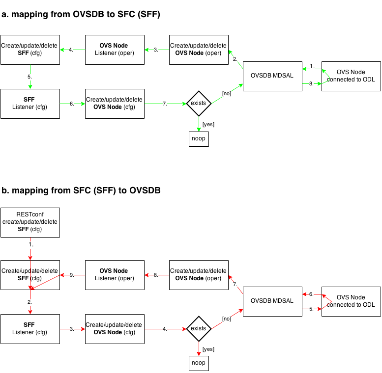
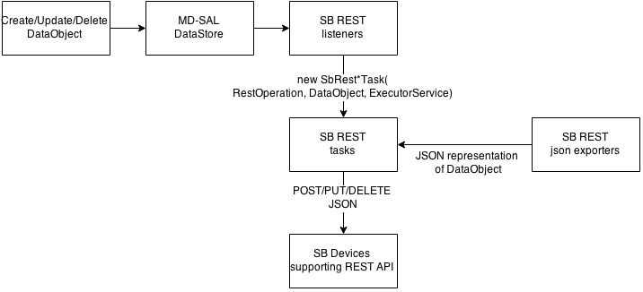
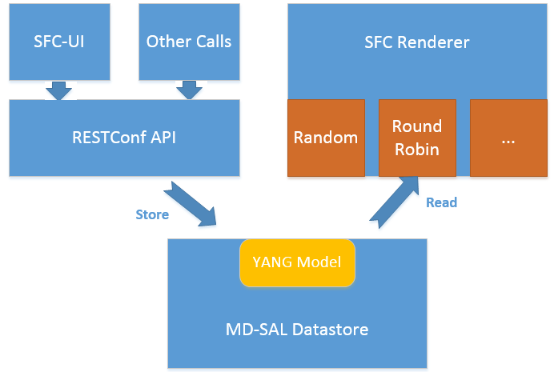
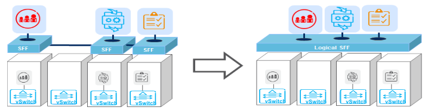
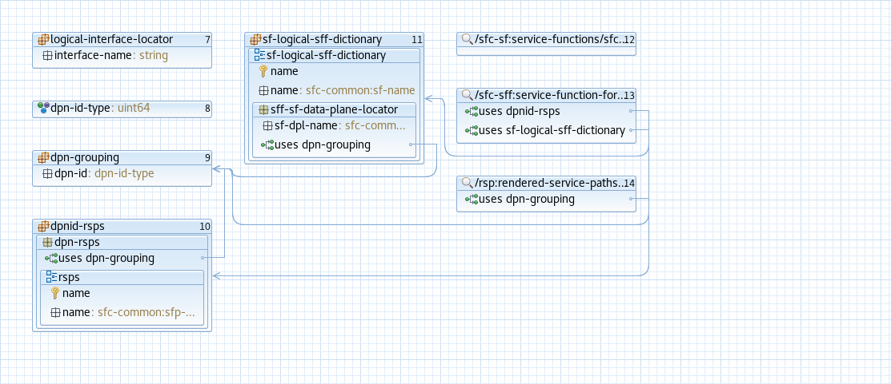
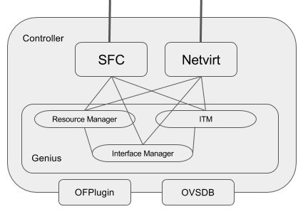

Service Function Chaining
=========================

OpenDaylight Service Function Chaining (SFC) Overview
-----------------------------------------------------

OpenDaylight Service Function Chaining (SFC) provides the ability to
define an ordered list of a network services (e.g. firewalls, load
balancers). These service are then "stitched" together in the network to
create a service chain. This project provides the infrastructure
(chaining logic, APIs) needed for ODL to provision a service chain in
the network and an end-user application for defining such chains.

-  ACE - Access Control Entry

-  ACL - Access Control List

-  SCF - Service Classifier Function

-  SF  - Service Function

-  SFC - Service Function Chain

-  SFF - Service Function Forwarder

-  SFG - Service Function Group

-  SFP - Service Function Path

-  RSP - Rendered Service Path

-  NSH - Network Service Header

SFC Classifier Control and Date plane Developer guide
-----------------------------------------------------

Overview
~~~~~~~~

Description of classifier can be found in:
https://datatracker.ietf.org/doc/draft-ietf-sfc-architecture/

Classifier manages everything from starting the packet listener to
creation (and removal) of appropriate ip(6)tables rules and marking
received packets accordingly. Its functionality is **available only on
Linux** as it leverages **NetfilterQueue**, which provides access to
packets matched by an **iptables** rule. Classifier requires **root
privileges** to be able to operate.

So far it is capable of processing ACL for MAC addresses, ports, IPv4
and IPv6. Supported protocols are TCP and UDP.

Classifier Architecture
~~~~~~~~~~~~~~~~~~~~~~~

Python code located in the project repository
sfc-py/common/classifier.py.

.. note::

    classifier assumes that Rendered Service Path (RSP) **already
    exists** in ODL when an ACL referencing it is obtained

1. sfc\_agent receives an ACL and passes it for processing to the
   classifier

2. the RSP (its SFF locator) referenced by ACL is requested from ODL

3. if the RSP exists in the ODL then ACL based iptables rules for it are
   applied

After this process is over, every packet successfully matched to an
iptables rule (i.e. successfully classified) will be NSH encapsulated
and forwarded to a related SFF, which knows how to traverse the RSP.

Rules are created using appropriate iptables command. If the Access
Control Entry (ACE) rule is MAC address related both iptables and
IPv6 tables rules are issued. If ACE rule is IPv4 address related, only
iptables rules are issued, same for IPv6.

.. note::

    iptables **raw** table contains all created rules

Information regarding already registered RSP(s) are stored in an
internal data-store, which is represented as a dictionary:

::

    {rsp_id: {'name': <rsp_name>,
              'chains': {'chain_name': (<ipv>,),
                         ...
                         },
              'sff': {'ip': <ip>,
                      'port': <port>,
                      'starting-index': <starting-index>,
                      'transport-type': <transport-type>
                      },
              },
    ...
    }

-  ``name``: name of the RSP

-  ``chains``: dictionary of iptables chains related to the RSP with
   information about IP version for which the chain exists

-  ``SFF``: SFF forwarding parameters

   -  ``ip``: SFF IP address

   -  ``port``: SFF port

   -  ``starting-index``: index given to packet at first RSP hop

   -  ``transport-type``: encapsulation protocol

Key APIs and Interfaces
~~~~~~~~~~~~~~~~~~~~~~~

This features exposes API to configure classifier (corresponds to
service-function-classifier.yang)

API Reference Documentation
~~~~~~~~~~~~~~~~~~~~~~~~~~~

See: sfc-model/src/main/yang/service-function-classifier.yang

SFC-OVS Plug-in
--------------

Overview
~~~~~~~~

SFC-OVS provides integration of SFC with Open vSwitch (OVS) devices.
Integration is realized through mapping of SFC objects (like SF, SFF,
Classifier, etc.) to OVS objects (like Bridge,
TerminationPoint=Port/Interface). The mapping takes care of automatic
instantiation (setup) of corresponding object whenever its counterpart
is created. For example, when a new SFF is created, the SFC-OVS plug-in
will create a new OVS bridge and when a new OVS Bridge is created, the
SFC-OVS plug-in will create a new SFF.

SFC-OVS Architecture
~~~~~~~~~~~~~~~~~~~~

SFC-OVS uses the OVSDB MD-SAL Southbound API for getting/writing
information from/to OVS devices. The core functionality consists of two
types of mapping:

a. mapping from OVS to SFC

   -  OVS Bridge is mapped to SFF

   -  OVS TerminationPoints are mapped to SFF DataPlane locators

b. mapping from SFC to OVS

   -  SFF is mapped to OVS Bridge

   -  SFF DataPlane locators are mapped to OVS TerminationPoints

   SFC < — > OVS mapping flow diagram

Key APIs and Interfaces
~~~~~~~~~~~~~~~~~~~~~~~

-  SFF to OVS mapping API (methods to convert SFF object to OVS Bridge
   and OVS TerminationPoints)

-  OVS to SFF mapping API (methods to convert OVS Bridge and OVS
   TerminationPoints to SFF object)

SFC Southbound REST Plug-in
--------------------------

Overview
~~~~~~~~

The Southbound REST Plug-in is used to send configuration from datastore
down to network devices supporting a REST API (i.e. they have a
configured REST URI). It supports POST/PUT/DELETE operations, which are
triggered accordingly by changes in the SFC data stores.

-  Access Control List (ACL)

-  Service Classifier Function (SCF)

-  Service Function (SF)

-  Service Function Group (SFG)

-  Service Function Schedule Type (SFST)

-  Service Function Forwarder (SFF)

-  Rendered Service Path (RSP)

Southbound REST Plug-in Architecture
~~~~~~~~~~~~~~~~~~~~~~~~~~~~~~~~~~~

1. **listeners** - used to listen on changes in the SFC data stores

2. **JSON exporters** - used to export JSON-encoded data from
   binding-aware data store objects

3. **tasks** - used to collect REST URIs of network devices and to send
   JSON-encoded data down to these devices

   Southbound REST Plug-in Architecture diagram

Key APIs and Interfaces
~~~~~~~~~~~~~~~~~~~~~~~

The plug-in provides Southbound REST API designated to listening REST
devices. It supports POST/PUT/DELETE operations. The operation (with
corresponding JSON-encoded data) is sent to unique REST URL belonging to
certain data type.

-  Access Control List (ACL):
   ``http://<host>:<port>/config/ietf-acl:access-lists/access-list/``

-  Service Function (SF):
   ``http://<host>:<port>/config/service-function:service-functions/service-function/``

-  Service Function Group (SFG):
   ``http://<host>:<port>/config/service-function:service-function-groups/service-function-group/``

-  Service Function Schedule Type (SFST):
   ``http://<host>:<port>/config/service-function-scheduler-type:service-function-scheduler-types/service-function-scheduler-type/``

-  Service Function Forwarder (SFF):
   ``http://<host>:<port>/config/service-function-forwarder:service-function-forwarders/service-function-forwarder/``

-  Rendered Service Path (RSP):
   ``http://<host>:<port>/operational/rendered-service-path:rendered-service-paths/rendered-service-path/``

Therefore, network devices willing to receive REST messages must listen
on these REST URLs.

.. note::

    Service Classifier Function (SCF) URL does not exist, because SCF is
    considered as one of the network devices willing to receive REST
    messages. However, there is a listener hooked on the SCF data store,
    which is triggering POST/PUT/DELETE operations of ACL object,
    because ACL is referenced in ``service-function-classifier.yang``

Service Function Load Balancing Developer Guide
-----------------------------------------------

Overview
~~~~~~~~

SFC Load-Balancing feature implements load balancing of Service
Functions, rather than a one-to-one mapping between Service Function
Forwarder and Service Function.

Load Balancing Architecture
~~~~~~~~~~~~~~~~~~~~~~~~~~~

Service Function Groups (SFG) can replace Service Functions (SF) in the
Rendered Path model. A Service Path can only be defined using SFGs or
SFs, but not a combination of both.

Relevant objects in the YANG model are as follows:

1. Service-Function-Group-Algorithm:

   ::

       Service-Function-Group-Algorithms {
           Service-Function-Group-Algorithm {
               String name
               String type
           }
       }

   ::

       Available types: ALL, SELECT, INDIRECT, FAST_FAILURE

2. Service-Function-Group:

   ::

       Service-Function-Groups {
           Service-Function-Group {
               String name
               String serviceFunctionGroupAlgorithmName
               String type
               String groupId
               Service-Function-Group-Element {
                   String service-function-name
                   int index
               }
           }
       }

3. ServiceFunctionHop: holds a reference to a name of SFG (or SF)

Key APIs and Interfaces
~~~~~~~~~~~~~~~~~~~~~~~

This feature enhances the existing SFC API.

REST API commands include: \* For Service Function Group (SFG): read
existing SFG, write new SFG, delete existing SFG, add Service Function
(SF) to SFG, and delete SF from SFG \* For Service Function Group
Algorithm (SFG-Alg): read, write, delete

Bundle providing the REST API: sfc-sb-rest \* Service Function Groups
and Algorithms are defined in: sfc-sfg and sfc-sfg-alg \* Relevant JAVA
API: SfcProviderServiceFunctionGroupAPI,
SfcProviderServiceFunctionGroupAlgAPI

Service Function Scheduling Algorithms
--------------------------------------

Overview
~~~~~~~~

When creating the Rendered Service Path (RSP), the earlier release of
SFC chose the first available service function from a list of service
function names. Now a new API is introduced to allow developers to
develop their own schedule algorithms when creating the RSP. There are
four scheduling algorithms (Random, Round Robin, Load Balance and
Shortest Path) are provided as examples for the API definition. This
guide gives a simple introduction of how to develop service function
scheduling algorithms based on the current extensible framework.

Architecture
~~~~~~~~~~~~

The following figure illustrates the service function selection
framework and algorithms.

   SF Scheduling Algorithm framework Architecture

The YANG Model defines the Service Function Scheduling Algorithm type
identities and how they are stored in the MD-SAL data store for the
scheduling algorithms.

The MD-SAL data store stores all informations for the scheduling
algorithms, including their types, names, and status.

The API provides some basic APIs to manage the informations stored in
the MD-SAL data store, like putting new items into it, getting all
scheduling algorithms, etc.

The RESTCONF API provides APIs to manage the informations stored in the
MD-SAL data store through RESTful calls.

The Service Function Chain Renderer gets the enabled scheduling
algorithm type, and schedules the service functions with scheduling
algorithm implementation.

Key APIs and Interfaces
~~~~~~~~~~~~~~~~~~~~~~~

While developing a new Service Function Scheduling Algorithm, a new
class should be added and it should extend the base schedule class
SfcServiceFunctionSchedulerAPI. And the new class should implement the
abstract function:

``public List<String> scheduleServiceFuntions(ServiceFunctionChain chain, int serviceIndex)``.

-  **``ServiceFunctionChain chain``**: the chain which will be rendered

-  **``int serviceIndex``**: the initial service index for this rendered
   service path

-  **``List<String>``**: a list of service function names which scheduled
   by the Service Function Scheduling Algorithm.

API Reference Documentation
~~~~~~~~~~~~~~~~~~~~~~~~~~~

Please refer the API docs generated in the mdsal-apidocs.

Logical Service Function Forwarder
----------------------------------

Overview
~~~~~~~~

Rationale
^^^^^^^^^

When the current SFC is deployed in a cloud environment, it is assumed that each
switch connected to a Service Function is configured as a Service Function Forwarder and
each Service Function is connected to its Service Function Forwarder depending on the
Compute Node where the Virtual Machine is located. This solution allows the basic cloud
use cases to be fulfilled, as for example, the ones required in OPNFV Brahmaputra, however,
some advanced use cases, like the transparent migration of VMs can not be implemented.
The Logical Service Function Forwarder enables the following advanced use cases:

1. Service Function mobility without service disruption
2. Service Functions load balancing and failover

As shown in the picture below, the Logical Service Function Forwarder concept extends the current
SFC northbound API to provide an abstraction of the underlying Data Center infrastructure.
The Data Center underlaying network can be abstracted by a single SFF. This single SFF uses
the logical port UUID as data plane locator to connect SFs globally and in a location-transparent manner.
SFC makes use of Genius project to track the location of the SF's logical ports.

The SFC internally distributes the necessary flow state over the relevant switches based on the
internal Data Center topology and the deployment of SFs.

Changes in data model
~~~~~~~~~~~~~~~~~~~~~
The Logical Service Function Forwarder concept extends the current SFC northbound API to provide
an abstraction of the underlying Data Center infrastructure.

The Logical SFF simplifies the configuration of the current SFC data model by reducing the number
of parameters to be be configured in every SFF, since the controller will discover those parameters
by interacting with the services offered by the Genius project.

The following picture shows the Logical SFF data model. The model gets simplified as most of the
configuration parameters of the current SFC data model are discovered in runtime. The complete
YANG model can be found here `logical SFF model
<https://github.com/opendaylight/sfc/blob/master/sfc-model/src/main/yang/service-function-forwarder-logical.yang>`__.

There are other minor changes in the data model; the SFC encapsulation type has been added or moved in the following files:

-  `RSP data model <https://github.com/opendaylight/sfc/blob/master/sfc-model/src/main/yang/rendered-service-path.yang>`__

-  `SFP data model <https://github.com/opendaylight/sfc/blob/master/sfc-model/src/main/yang/service-function-path.yang>`__

-  `Service Locator data model <https://github.com/opendaylight/sfc/blob/master/sfc-model/src/main/yang/service-locator.yang>`__

RSP Rendering changes for paths using the Logical SFF
~~~~~~~~~~~~~~~~~~~~~~~~~~~~~~~~~~~~~~~~~~~~~~~~~~~~~

#. **Construction of the auxiliary rendering graph**

   When starting the rendering of a RSP, the SFC renderer builds an auxiliary graph with information about the required hops for traffic traversing the path. RSP processing is achieved by iteratively evaluating each of the entries in the graph, writing the required flows in the proper switch for each hop.

   It is important to note that the graph includes both traffic ingress (i.e. traffic entering into the first SF) and traffic egress (i.e. traffic leaving the chain from the last SF) as hops. Therefore, the number of entries in the graph equals the number of SFs in the chain plus one.

   .. figure:: ./images/sfc/sfc-genius-example-auxiliary-graph.png

   The process of rendering a chain when the switches involved are part of the Logical SFF also starts with the construction of the hop graph. The difference is that when the SFs used in the chain are using a logical interface, the SFC renderer will also retrieve from Genius the DPIDs for the switches, storing them in the graph. In this context, those switches are the ones in the compute nodes each SF is hosted on at the time the chain is rendered. 

   .. figure:: ./images/sfc/sfc-genius-example-auxiliary-graph-logical-sff.png

#. **New transport processor**

   Transport processors are classes which calculate and write the correct flows for a chain. Each transport processor specializes on writing the flows for a given combination of transport type and SFC encapsulation. 

   A specific transport processor has been created for paths using a Logical SFF. A particularity of this transport processor is that its use is not only determined by the transport / SFC encapsulation combination, but also because the chain is using a Logical SFF. The actual condition evaluated for selecting the Logical SFF transport processor is that the SFs in the chain are using logical interface locators, and that the DPIDs for those locators can be successfully retrieved from Genius.

   .. figure:: ./images/sfc/transport_processors_class_diagram.png

   The main differences between the Logical SFF transport processor and other processors are the following: 

   - Instead of srcSff, dstSff fields in the hops graph (which are all equal in a path using a Logical SFF), the Logical SFF transport processor uses previously stored srcDpnId, dstDpnId fields in order to know whether an actual hop between compute nodes must be performed or not (it is possible that two consecutive SFs are collocated in the same compute node). 

   - When a hop between switches really has to be performed, it relies on Genius for getting the actions to perform that hop. The retrieval of those actions involve two steps: 

     - First, Genius' Overlay Tunnel Manager module is used in order to retrieve the target interface for a jump between the source and the destination DPIDs. 

     - Then, egress instructions for that interface are retrieved from Genius's Interface Manager.

   - There are no next hop rules between compute nodes, only egress instructions (the transport zone tunnels have all the required routing information).

   - Next hop information towards SFs uses mac adresses which are also retrieved from the Genius datastore.

   - The Logical SFF transport processor performs NSH decapsulation in the last switch of the chain. 

#. **Post-rendering update of the operational data model**

   When the rendering of a chain finishes successfully, the Logical SFF Transport Processor perform two operational datastore modifications in order to provide some relevant runtime information about the chain. The exposed information is the following: 

   - Rendered Service Path state: when the chain uses a Logical SFF, DPIDs for the switches in the compute nodes on which the SFs participating in the chain are hosted are added to the hop information.

   - SFF state: A new list of all RSPs which use each DPID is has been added. It is updated on each RSP addition / deletion. 

Interaction with Genius
~~~~~~~~~~~~~~~~~~~~~~~
As shown in the following picture, SFC will interact with Genius project's services to provide the
Logical SFF functionality.

The following are the main Genius' services used by SFC:

1. Interaction with Interface Tunnel Manager (ITM)

2. Interaction with the Interface Manager

3. Interaction with Resource Manager
