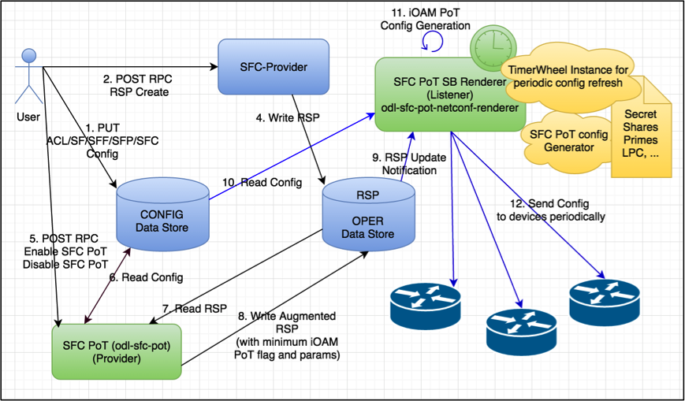
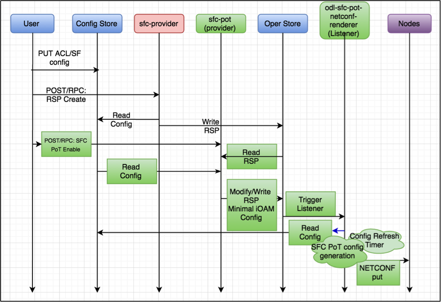
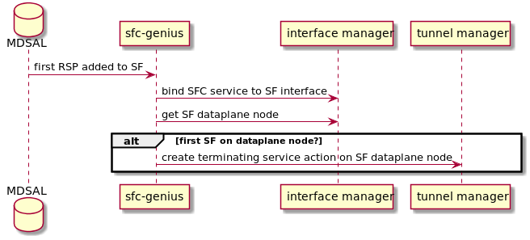
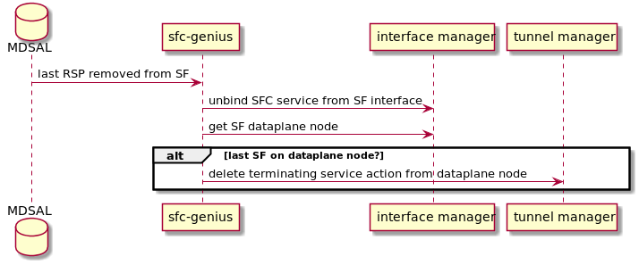
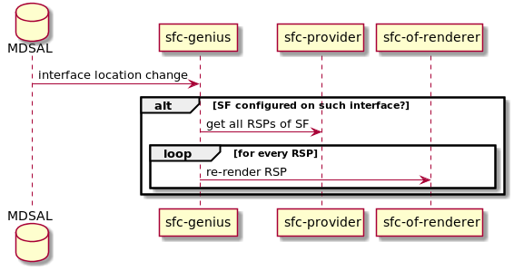
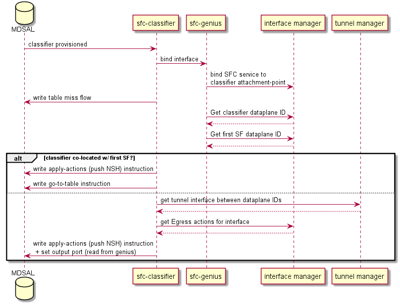

.. _sfc-dev-guide:

Service Function Chaining
=========================

OpenDaylight Service Function Chaining (SFC) Overview
-----------------------------------------------------

OpenDaylight Service Function Chaining (SFC) provides the ability to
define an ordered list of a network services (e.g. firewalls, load
balancers). These service are then "stitched" together in the network to
create a service chain. This project provides the infrastructure
(chaining logic, APIs) needed for ODL to provision a service chain in
the network and an end-user application for defining such chains.

-  ACE - Access Control Entry

-  ACL - Access Control List

-  SCF - Service Classifier Function

-  SF  - Service Function

-  SFC - Service Function Chain

-  SFF - Service Function Forwarder

-  SFG - Service Function Group

-  SFP - Service Function Path

-  RSP - Rendered Service Path

-  NSH - Network Service Header

SFC Classifier Control and Date plane Developer guide
-----------------------------------------------------

Overview
~~~~~~~~

Description of classifier can be found in:
https://datatracker.ietf.org/doc/draft-ietf-sfc-architecture/

Classifier manages everything from starting the packet listener to
creation (and removal) of appropriate ip(6)tables rules and marking
received packets accordingly. Its functionality is **available only on
Linux** as it leverages **NetfilterQueue**, which provides access to
packets matched by an **iptables** rule. Classifier requires **root
privileges** to be able to operate.

So far it is capable of processing ACL for MAC addresses, ports, IPv4
and IPv6. Supported protocols are TCP and UDP.

Classifier Architecture
~~~~~~~~~~~~~~~~~~~~~~~

Python code located in the project repository
sfc-py/common/classifier.py.

.. note::

    classifier assumes that Rendered Service Path (RSP) **already
    exists** in ODL when an ACL referencing it is obtained

1. sfc\_agent receives an ACL and passes it for processing to the
   classifier

2. the RSP (its SFF locator) referenced by ACL is requested from ODL

3. if the RSP exists in the ODL then ACL based iptables rules for it are
   applied

After this process is over, every packet successfully matched to an
iptables rule (i.e. successfully classified) will be NSH encapsulated
and forwarded to a related SFF, which knows how to traverse the RSP.

Rules are created using appropriate iptables command. If the Access
Control Entry (ACE) rule is MAC address related both iptables and
IPv6 tables rules are issued. If ACE rule is IPv4 address related, only
iptables rules are issued, same for IPv6.

.. note::

    iptables **raw** table contains all created rules

Information regarding already registered RSP(s) are stored in an
internal data-store, which is represented as a dictionary:

::

    {rsp_id: {'name': <rsp_name>,
              'chains': {'chain_name': (<ipv>,),
                         ...
                         },
              'sff': {'ip': <ip>,
                      'port': <port>,
                      'starting-index': <starting-index>,
                      'transport-type': <transport-type>
                      },
              },
    ...
    }

-  ``name``: name of the RSP

-  ``chains``: dictionary of iptables chains related to the RSP with
   information about IP version for which the chain exists

-  ``SFF``: SFF forwarding parameters

   -  ``ip``: SFF IP address

   -  ``port``: SFF port

   -  ``starting-index``: index given to packet at first RSP hop

   -  ``transport-type``: encapsulation protocol

Key APIs and Interfaces
~~~~~~~~~~~~~~~~~~~~~~~

This features exposes API to configure classifier (corresponds to
service-function-classifier.yang)

API Reference Documentation
~~~~~~~~~~~~~~~~~~~~~~~~~~~

See: sfc-model/src/main/yang/service-function-classifier.yang

SFC-OVS Plug-in
---------------

Overview
~~~~~~~~

SFC-OVS provides integration of SFC with Open vSwitch (OVS) devices.
Integration is realized through mapping of SFC objects (like SF, SFF,
Classifier, etc.) to OVS objects (like Bridge,
TerminationPoint=Port/Interface). The mapping takes care of automatic
instantiation (setup) of corresponding object whenever its counterpart
is created. For example, when a new SFF is created, the SFC-OVS plug-in
will create a new OVS bridge and when a new OVS Bridge is created, the
SFC-OVS plug-in will create a new SFF.

SFC-OVS Architecture
~~~~~~~~~~~~~~~~~~~~

SFC-OVS uses the OVSDB MD-SAL Southbound API for getting/writing
information from/to OVS devices. The core functionality consists of two
types of mapping:

a. mapping from OVS to SFC

   -  OVS Bridge is mapped to SFF

   -  OVS TerminationPoints are mapped to SFF DataPlane locators

b. mapping from SFC to OVS

   -  SFF is mapped to OVS Bridge

   -  SFF DataPlane locators are mapped to OVS TerminationPoints

   SFC < — > OVS mapping flow diagram

Key APIs and Interfaces
~~~~~~~~~~~~~~~~~~~~~~~

-  SFF to OVS mapping API (methods to convert SFF object to OVS Bridge
   and OVS TerminationPoints)

-  OVS to SFF mapping API (methods to convert OVS Bridge and OVS
   TerminationPoints to SFF object)

SFC Southbound REST Plug-in
---------------------------

Overview
~~~~~~~~

The Southbound REST Plug-in is used to send configuration from datastore
down to network devices supporting a REST API (i.e. they have a
configured REST URI). It supports POST/PUT/DELETE operations, which are
triggered accordingly by changes in the SFC data stores.

-  Access Control List (ACL)

-  Service Classifier Function (SCF)

-  Service Function (SF)

-  Service Function Group (SFG)

-  Service Function Schedule Type (SFST)

-  Service Function Forwarder (SFF)

-  Rendered Service Path (RSP)

Southbound REST Plug-in Architecture
~~~~~~~~~~~~~~~~~~~~~~~~~~~~~~~~~~~~

1. **listeners** - used to listen on changes in the SFC data stores

2. **JSON exporters** - used to export JSON-encoded data from
   binding-aware data store objects

3. **tasks** - used to collect REST URIs of network devices and to send
   JSON-encoded data down to these devices

   Southbound REST Plug-in Architecture diagram

Key APIs and Interfaces
~~~~~~~~~~~~~~~~~~~~~~~

The plug-in provides Southbound REST API designated to listening REST
devices. It supports POST/PUT/DELETE operations. The operation (with
corresponding JSON-encoded data) is sent to unique REST URL belonging to
certain data type.

-  Access Control List (ACL):
   ``http://<host>:<port>/config/ietf-acl:access-lists/access-list/``

-  Service Function (SF):
   ``http://<host>:<port>/config/service-function:service-functions/service-function/``

-  Service Function Group (SFG):
   ``http://<host>:<port>/config/service-function:service-function-groups/service-function-group/``

-  Service Function Schedule Type (SFST):
   ``http://<host>:<port>/config/service-function-scheduler-type:service-function-scheduler-types/service-function-scheduler-type/``

-  Service Function Forwarder (SFF):
   ``http://<host>:<port>/config/service-function-forwarder:service-function-forwarders/service-function-forwarder/``

-  Rendered Service Path (RSP):
   ``http://<host>:<port>/operational/rendered-service-path:rendered-service-paths/rendered-service-path/``

Therefore, network devices willing to receive REST messages must listen
on these REST URLs.

.. note::

    Service Classifier Function (SCF) URL does not exist, because SCF is
    considered as one of the network devices willing to receive REST
    messages. However, there is a listener hooked on the SCF data store,
    which is triggering POST/PUT/DELETE operations of ACL object,
    because ACL is referenced in ``service-function-classifier.yang``

Service Function Load Balancing Developer Guide
-----------------------------------------------

Overview
~~~~~~~~

SFC Load-Balancing feature implements load balancing of Service
Functions, rather than a one-to-one mapping between Service Function
Forwarder and Service Function.

Load Balancing Architecture
~~~~~~~~~~~~~~~~~~~~~~~~~~~

Service Function Groups (SFG) can replace Service Functions (SF) in the
Rendered Path model. A Service Path can only be defined using SFGs or
SFs, but not a combination of both.

Relevant objects in the YANG model are as follows:

1. Service-Function-Group-Algorithm:

   ::

       Service-Function-Group-Algorithms {
           Service-Function-Group-Algorithm {
               String name
               String type
           }
       }

   ::

       Available types: ALL, SELECT, INDIRECT, FAST_FAILURE

2. Service-Function-Group:

   ::

       Service-Function-Groups {
           Service-Function-Group {
               String name
               String serviceFunctionGroupAlgorithmName
               String type
               String groupId
               Service-Function-Group-Element {
                   String service-function-name
                   int index
               }
           }
       }

3. ServiceFunctionHop: holds a reference to a name of SFG (or SF)

Key APIs and Interfaces
~~~~~~~~~~~~~~~~~~~~~~~

This feature enhances the existing SFC API.

REST API commands include: \* For Service Function Group (SFG): read
existing SFG, write new SFG, delete existing SFG, add Service Function
(SF) to SFG, and delete SF from SFG \* For Service Function Group
Algorithm (SFG-Alg): read, write, delete

Bundle providing the REST API: sfc-sb-rest \* Service Function Groups
and Algorithms are defined in: sfc-sfg and sfc-sfg-alg \* Relevant JAVA
API: SfcProviderServiceFunctionGroupAPI,
SfcProviderServiceFunctionGroupAlgAPI

Service Function Scheduling Algorithms
--------------------------------------

Overview
~~~~~~~~

When creating the Rendered Service Path (RSP), the earlier release of
SFC chose the first available service function from a list of service
function names. Now a new API is introduced to allow developers to
develop their own schedule algorithms when creating the RSP. There are
four scheduling algorithms (Random, Round Robin, Load Balance and
Shortest Path) are provided as examples for the API definition. This
guide gives a simple introduction of how to develop service function
scheduling algorithms based on the current extensible framework.

Architecture
~~~~~~~~~~~~

The following figure illustrates the service function selection
framework and algorithms.

   SF Scheduling Algorithm framework Architecture

The YANG Model defines the Service Function Scheduling Algorithm type
identities and how they are stored in the MD-SAL data store for the
scheduling algorithms.

The MD-SAL data store stores all informations for the scheduling
algorithms, including their types, names, and status.

The API provides some basic APIs to manage the informations stored in
the MD-SAL data store, like putting new items into it, getting all
scheduling algorithms, etc.

The RESTCONF API provides APIs to manage the informations stored in the
MD-SAL data store through RESTful calls.

The Service Function Chain Renderer gets the enabled scheduling
algorithm type, and schedules the service functions with scheduling
algorithm implementation.

Key APIs and Interfaces
~~~~~~~~~~~~~~~~~~~~~~~

While developing a new Service Function Scheduling Algorithm, a new
class should be added and it should extend the base schedule class
SfcServiceFunctionSchedulerAPI. And the new class should implement the
abstract function:

``public List<String> scheduleServiceFuntions(ServiceFunctionChain chain, int serviceIndex)``.

-  **``ServiceFunctionChain chain``**: the chain which will be rendered

-  **``int serviceIndex``**: the initial service index for this rendered
   service path

-  **``List<String>``**: a list of service function names which scheduled
   by the Service Function Scheduling Algorithm.

API Reference Documentation
~~~~~~~~~~~~~~~~~~~~~~~~~~~

Please refer the API docs generated in the mdsal-apidocs.

SFC Proof of Transit Developer Guide
------------------------------------

Overview
~~~~~~~~
SFC Proof of Transit implements the in-situ OAM (iOAM) Proof of Transit
verification for SFCs and other paths.  The implementation is broadly
divided into the North-bound (NB) and the South-bound (SB) side of the
application.  The NB side is primarily charged with augmenting the RSP
with user-inputs for enabling the PoT on the RSP, while the SB side is
dedicated to auto-generated SFC PoT parameters, periodic refresh of these
parameters and delivering the parameters to the NETCONF and iOAM capable
nodes (eg. VPP instances).

Architecture
~~~~~~~~~~~~
The following diagram gives the high level overview of the different parts.

   SFC Proof of Transit Internal Architecture

The Proof of Transit feature is enabled by two sub-features:

1. ODL SFC PoT: ``feature:install odl-sfc-pot``

2. ODL SFC PoT NETCONF Renderer: ``feature:install odl-sfc-pot-netconf-renderer``

Details
~~~~~~~

The following classes and handlers are involved.

1. The class (SfcPotRpc) sets up RPC handlers for enabling the feature.

2. There are new RPC handlers for two new RPCs
   (EnableSfcIoamPotRenderedPath and DisableSfcIoamPotRenderedPath) and
   effected via SfcPotRspProcessor class.

3. When a user configures via a POST RPC call to enable Proof of Transit
   on a particular SFC (via the Rendered Service Path), the configuration
   drives the creation of necessary augmentations to the RSP
   (to modify the RSP) to effect the Proof of Transit configurations.

4. The augmentation meta-data added to the RSP are defined in the
   sfc-ioam-nb-pot.yang file.

   .. note::

      There are no auto generated configuration parameters added to the RSP to
      avoid RSP bloat.

5. Adding SFC Proof of Transit meta-data to the RSP is done in the
   SfcPotRspProcessor class.

6. Once the RSP is updated, the RSP data listeners in the SB renderer modules
   (odl-sfc-pot-netconf-renderer) will listen to the RSP changes and send
   out configurations to the necessary network nodes that are part of the SFC.

7. The configurations are handled mainly in the SfcPotAPI,
   SfcPotConfigGenerator, SfcPotPolyAPI, SfcPotPolyClass and
   SfcPotPolyClassAPI classes.

8. There is a sfc-ioam-sb-pot.yang file that shows the format of the iOAM
   PoT configuration data sent to each node of the SFC.

9. A timer is started based on the “ioam-pot-refresh-period” value in the
   SB renderer module that handles configuration
   refresh periodically.

10. The SB and timer handling are done in the odl-sfc-pot-netconf-renderer module.
    Note: This is NOT done in the NB odl-sfc-pot module to avoid periodic
    updates to the RSP itself.

11. ODL creates a new profile of a set of keys and secrets at a constant rate
    and updates an internal data store with the configuration.  The controller
    labels the configurations per RSP as “even” or “odd” – and the controller
    cycles between “even” and “odd” labeled profiles.   The rate at which these
    profiles are communicated to the nodes is configurable and in future,
    could be automatic based on profile usage.  Once the profile has been
    successfully communicated to all nodes (all Netconf transactions completed),
    the controller sends an “enable pot-profile” request to the ingress node.

12. The nodes are to maintain two profiles (an even and an odd pot-profile).
    One profile is currently active and in use, and one profile is about to
    get used.  A flag in the packet is indicating whether the odd or even
    pot-profile is to be used by a node. This is to ensure that during profile
    change we’re not disrupting the service. I.e. if the “odd” profile is
    active, the controller can communicate the “even” profile to all nodes
    and only if all the nodes have received it, the controller will tell
    the ingress node to switch to the “even” profile. Given that the
    indicator travels within the packet, all nodes will switch to the
    “even” profile. The “even” profile gets active on all nodes – and nodes
    are ready to receive a new “odd” profile.

13. HashedTimerWheel implementation is used to support the periodic
    configuration refresh.  The default refresh is 5 seconds to start with.

14. Depending on the last updated profile, the odd or the even profile is
    updated in the fresh timer pop and the configurations are sent down
    appropriately.

15. SfcPotTimerQueue, SfcPotTimerWheel, SfcPotTimerTask, SfcPotTimerData
    and SfcPotTimerThread are the classes that handle the Proof of
    Transit protocol profile refresh implementation.

16. The RSP data store is NOT being changed periodically and the timer
    and configuration refresh modules are present in the SB renderer module
    handler and hence there are are no scale or RSP churn issues
    affecting the design.

The following diagram gives the overall sequence diagram of the interactions
between the different classes.

   SFC Proof of Transit Sequence Diagram

Logical Service Function Forwarder
----------------------------------

Overview
~~~~~~~~

Rationale
^^^^^^^^^

When the current SFC is deployed in a cloud environment, it is assumed that each
switch connected to a Service Function is configured as a Service Function Forwarder and
each Service Function is connected to its Service Function Forwarder depending on the
Compute Node where the Virtual Machine is located. This solution allows the basic cloud
use cases to be fulfilled, as for example, the ones required in OPNFV Brahmaputra, however,
some advanced use cases, like the transparent migration of VMs can not be implemented.
The Logical Service Function Forwarder enables the following advanced use cases:

1. Service Function mobility without service disruption
2. Service Functions load balancing and failover

As shown in the picture below, the Logical Service Function Forwarder concept extends the current
SFC northbound API to provide an abstraction of the underlying Data Center infrastructure.
The Data Center underlaying network can be abstracted by a single SFF. This single SFF uses
the logical port UUID as data plane locator to connect SFs globally and in a location-transparent manner.
SFC makes use of Genius project to track the location of the SF's logical ports.

.. figure:: ./images/sfc/single-logical-sff-concept.png
   :alt: Single Logical SFF concept

The SFC internally distributes the necessary flow state over the relevant switches based on the
internal Data Center topology and the deployment of SFs.

Changes in data model
~~~~~~~~~~~~~~~~~~~~~
The Logical Service Function Forwarder concept extends the current SFC northbound API to provide
an abstraction of the underlying Data Center infrastructure.

The Logical SFF simplifies the configuration of the current SFC data model by reducing the number
of parameters to be be configured in every SFF, since the controller will discover those parameters
by interacting with the services offered by the Genius project.

The following picture shows the Logical SFF data model. The model gets simplified as most of the
configuration parameters of the current SFC data model are discovered in runtime. The complete
YANG model can be found here `logical SFF model
<https://github.com/opendaylight/sfc/blob/master/sfc-model/src/main/yang/service-function-forwarder-logical.yang>`__.

.. figure:: ./images/sfc/logical-sff-datamodel.png
   :alt: Logical SFF data model

There are other minor changes in the data model; the SFC encapsulation type has been added or moved in the following files:

-  `RSP data model <https://github.com/opendaylight/sfc/blob/master/sfc-model/src/main/yang/rendered-service-path.yang>`__

-  `SFP data model <https://github.com/opendaylight/sfc/blob/master/sfc-model/src/main/yang/service-function-path.yang>`__

-  `Service Locator data model <https://github.com/opendaylight/sfc/blob/master/sfc-model/src/main/yang/service-locator.yang>`__

Interaction with Genius
~~~~~~~~~~~~~~~~~~~~~~~

Feature *sfc-genius* functionally enables SFC integration with Genius. This allows configuring a Logical SFF
and SFs attached to this Logical SFF via logical interfaces (i.e. neutron ports) that are registered with Genius.

As shown in the following picture, SFC will interact with Genius project's services to provide the
Logical SFF functionality.

The following are the main Genius' services used by SFC:

1. Interaction with Interface Tunnel Manager (ITM)

2. Interaction with the Interface Manager

3. Interaction with Resource Manager

SFC Service registration with Genius
^^^^^^^^^^^^^^^^^^^^^^^^^^^^^^^^^^^^

Genius handles the coexistence of different network services. As such, SFC service is registered with Genius
performing the following actions:

SFC Service Binding
   As soon as a Service Function associated to the Logical SFF is involved in a Rendered Service Path, SFC service is
   bound to its logical interface via Genius Interface Manager. This has the effect of forwarding every incoming packet
   from the Service Function to the SFC pipeline of the attached switch, as long as it is not consumed by a different
   bound service with higher priority.

SFC Service Terminating Action
   As soon as SFC service is bound to the interface of a Service Function for the first time on a specific switch, a
   terminating service action is configured on that switch via Genius Interface Tunnel Manager. This has the effect of
   forwarding every incoming packet from a different switch to the SFC pipeline as long as the traffic is VXLAN
   encapsulated on VNI 0.

The following sequence diagrams depict how the overall process takes place:

   SFC genius module interaction with Genius at RSP creation.

   SFC genius module interaction with Genius at RSP removal.

For more information on how Genius allows different services to coexist, see the :ref:`Genius User Guide
<genius-user-guide>`.

Path Rendering
^^^^^^^^^^^^^^
During path rendering, Genius is queried to obtain needed information, such as:

- Location of a logical interface on the data-plane.
- Tunnel interface for a specific pair of source and destination switches.
- Egress OpenFlow actions to output packets to a specific interface.

See :ref:`RSP Rendering <sfc-genius-path-rendering>` section for more information.

VM migration
^^^^^^^^^^^^
Upon VM migration, it's logical interface is first unregistered and then registered with Genius, possibly at a new
physical location. *sfc-genius* reacts to this by re-rendering all the RSPs on which the associated SF
participates, if any.

The following picture illustrates the process:

   SFC genius module at VM migration.

.. _sfc-genius-path-rendering:

RSP Rendering changes for paths using the Logical SFF
~~~~~~~~~~~~~~~~~~~~~~~~~~~~~~~~~~~~~~~~~~~~~~~~~~~~~

#. **Construction of the auxiliary rendering graph**

   When starting the rendering of a RSP, the SFC renderer builds an auxiliary graph with information about the required hops for traffic traversing the path. RSP processing is achieved by iteratively evaluating each of the entries in the graph, writing the required flows in the proper switch for each hop.

   It is important to note that the graph includes both traffic ingress (i.e. traffic entering into the first SF) and traffic egress (i.e. traffic leaving the chain from the last SF) as hops. Therefore, the number of entries in the graph equals the number of SFs in the chain plus one.

   .. figure:: ./images/sfc/sfc-genius-example-auxiliary-graph.png

   The process of rendering a chain when the switches involved are part of the Logical SFF also starts with the construction of the hop graph. The difference is that when the SFs used in the chain are using a logical interface, the SFC renderer will also retrieve from Genius the DPIDs for the switches, storing them in the graph. In this context, those switches are the ones in the compute nodes each SF is hosted on at the time the chain is rendered.

   .. figure:: ./images/sfc/sfc-genius-example-auxiliary-graph-logical-sff.png

#. **New transport processor**

   Transport processors are classes which calculate and write the correct flows for a chain. Each transport processor specializes on writing the flows for a given combination of transport type and SFC encapsulation.

   A specific transport processor has been created for paths using a Logical SFF. A particularity of this transport processor is that its use is not only determined by the transport / SFC encapsulation combination, but also because the chain is using a Logical SFF. The actual condition evaluated for selecting the Logical SFF transport processor is that the SFs in the chain are using logical interface locators, and that the DPIDs for those locators can be successfully retrieved from Genius.

   .. figure:: ./images/sfc/transport_processors_class_diagram.png

   The main differences between the Logical SFF transport processor and other processors are the following:

   - Instead of srcSff, dstSff fields in the hops graph (which are all equal in a path using a Logical SFF), the Logical SFF transport processor uses previously stored srcDpnId, dstDpnId fields in order to know whether an actual hop between compute nodes must be performed or not (it is possible that two consecutive SFs are collocated in the same compute node).

   - When a hop between switches really has to be performed, it relies on Genius for getting the actions to perform that hop. The retrieval of those actions involve two steps:

     - First, Genius' Overlay Tunnel Manager module is used in order to retrieve the target interface for a jump between the source and the destination DPIDs.

     - Then, egress instructions for that interface are retrieved from Genius's Interface Manager.

   - There are no next hop rules between compute nodes, only egress instructions (the transport zone tunnels have all the required routing information).

   - Next hop information towards SFs uses mac adresses which are also retrieved from the Genius datastore.

   - The Logical SFF transport processor performs NSH decapsulation in the last switch of the chain.

#. **Post-rendering update of the operational data model**

   When the rendering of a chain finishes successfully, the Logical SFF Transport Processor perform two operational datastore modifications in order to provide some relevant runtime information about the chain. The exposed information is the following:

   - Rendered Service Path state: when the chain uses a Logical SFF, DPIDs for the switches in the compute nodes on which the SFs participating in the chain are hosted are added to the hop information.

   - SFF state: A new list of all RSPs which use each DPID is has been added. It is updated on each RSP addition / deletion.

Classifier impacts
~~~~~~~~~~~~~~~~~~

This section explains the changes made to the SFC classifier, enabling it
to be attached to Logical SFFs.

Refer to the following image to better understand the concept, and the required
steps to implement the feature.

   SFC classifier integration with Genius.

As stated in the :ref:`SFC User Guide <sfc-user-guide-classifier-impacts>`,
the classifier needs to be provisioned using logical interfaces as attachment
points.

When that happens, MDSAL will trigger an event in the odl-sfc-scf-openflow feature
(i.e. the sfc-classifier), which is responsible for installing the classifier
flows in the classifier switches.

The first step of the process, is to bind the interfaces to classify in Genius,
in order for the desired traffic (originating from the VMs having the
provisioned attachment-points) to enter the SFC pipeline. This will make traffic
reach table 82 (SFC classifier table), coming from table 0 (table managed by
Genius, shared by all applications).

The next step, is deciding which flows to install in the SFC classifier table.
A table-miss flow will be installed, having a MatchAny clause, whose action is
to jump to Genius's egress dispatcher table. This enables traffic intended for
other applications to still be processed.

The flow that allows the SFC pipeline to continue is added next, having higher
match priority than the table-miss flow. This flow has two responsabilities:

1. **Push the NSH header, along with its metadata (required within the SFC pipeline)**

   Features the specified ACL matches as match criteria, and push NSH along
   with its metadata into the Action list.

2. **Advance the SFC pipeline**

   Forward the traffic to the first Service Function in the RSP. This steers
   packets into the SFC domain, and how it is done depends on whether the
   classifier is co-located with the first service function in the specified
   RSP.

   Should the classifier be co-located (i.e. in the same compute node), a
   new instruction is appended to the flow, telling all matches to jump to
   the transport ingress table.

   If not, Genius's tunnel manager service is queried to get the tunnel
   interface connecting the classifier node with the compute node where the
   first Service Function is located, and finally, Genius's interface manager
   service is queried asking for instructions on how to reach that tunnel
   interface.

   These actions are then appended to the Action list already containing push
   NSH and push NSH metadata Actions, and written in an Apply-Actions
   Instruction into the datastore.
