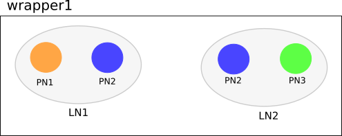

.. _topoprocessing-dev-guide:

Topology Processing Framework Developer Guide
=============================================

Overview
--------

The Topology Processing Framework allows developers to aggregate and
filter topologies according to defined correlations. It also provides
functionality, which you can use to make your own topology model by
automating the translation from one model to another. For example to
translate from the opendaylight-inventory model to only using the
network-topology model.

Architecture
------------

Chapter Overview
~~~~~~~~~~~~~~~~

In this chapter we describe the architecture of the Topology Processing
Framework. In the first part, we provide information about available
features and basic class relationships. In the second part, we describe
our model specific approach, which is used to provide support for
different models.

Basic Architecture
~~~~~~~~~~~~~~~~~~

The Topology Processing Framework consists of several Karaf features:

-  odl-topoprocessing-framework

-  odl-topoprocessing-inventory

-  odl-topoprocessing-network-topology

-  odl-topoprocessing-i2rs

-  odl-topoprocessing-inventory-rendering

The feature odl-topoprocessing-framework contains the
topoprocessing-api, topoprocessing-spi and topoprocessing-impl bundles.
This feature is the core of the Topology Processing Framework and is
required by all others features.

-  topoprocessing-api - contains correlation definitions and definitions
   required for rendering

-  topoprocessing-spi - entry point for topoprocessing service (start
   and close)

-  topoprocessing-impl - contains base implementations of handlers,
   listeners, aggregators and filtrators

TopoProcessingProvider is the entry point for Topology Processing
Framework. It requires a DataBroker instance. The DataBroker is needed
for listener registration. There is also the TopologyRequestListener
which listens on aggregated topology requests (placed into the
configuration datastore) and UnderlayTopologyListeners which listen on
underlay topology data changes (made in operational datastore). The
TopologyRequestHandler saves toporequest data and provides a method for
translating a path to the specified leaf. When a change in the topology
occurs, the registered UnderlayTopologyListener processes this
information for further aggregation and/or filtration. Finally, after an
overlay topology is created, it is passed to the TopologyWriter, which
writes this topology into operational datastore.

.. figure:: ./images/topoprocessing/TopologyRequestHandler_classesRelationship.png
   :alt: Class relationship

   Class relationship

[1] TopologyRequestHandler instantiates TopologyWriter and
TopologyManager. Then, according to the request, initializes either
TopologyAggregator, TopologyFiltrator or LinkCalculator.

[2] It creates as many instances of UnderlayTopologyListener as there
are underlay topologies.

[3] PhysicalNodes are created for relevant incoming nodes (those having
node ID).

[4a] It performs aggregation and creates logical nodes.

[4b] It performs filtration and creates logical nodes.

[4c] It performs link computation and creates links between logical
nodes.

[5] Logical nodes are put into wrapper.

[6] The wrapper is translated into the appropriate format and written
into datastore.

Model Specific Approach
~~~~~~~~~~~~~~~~~~~~~~~

The Topology Processing Framework consists of several modules and Karaf
features, which provide support for different input models. Currently we
support the network-topology, opendaylight-inventory and i2rs models.
For each of these input models, the Topology Processing Framework has
one module and one Karaf feature.

How it works
^^^^^^^^^^^^

**User point of view:**

When you start the odl-topoprocessing-framework feature, the Topology
Processing Framework starts without knowledge how to work with any input
models. In order to allow the Topology Processing Framework to process
some kind of input model, you must install one (or more) model specific
features. Installing these features will also start
odl-topoprocessing-framework feature if it is not already running. These
features inject appropriate logic into the odl-topoprocessing-framework
feature. From that point, the Topology Processing Framework is able to
process different kinds of input models, specifically those that you
install features for.

**Developer point of view:**

The topoprocessing-impl module contains (among other things) classes and
interfaces, which are common for every model specific topoprocessing
module. These classes and interfaces are implemented and extended by
classes in particular model specific modules. Model specific modules
also depend on the TopoProcessingProvider class in the
topoprocessing-spi module. This dependency is injected during
installation of model specific features in Karaf. When a model specific
feature is started, it calls the registerAdapters(adapters) method of
the injected TopoProcessingProvider object. After this step, the
Topology Processing Framework is able to use registered model adapters
to work with input models.

To achieve the described functionality we created a ModelAdapter
interface. It represents installed feature and provides methods for
creating crucial structures specific to each model.

.. figure:: ./images/topoprocessing/ModelAdapter.png
   :alt: ModelAdapter interface

   ModelAdapter interface

Model Specific Features
^^^^^^^^^^^^^^^^^^^^^^^

-  odl-topoprocessing-network-topology - this feature contains logic to
   work with network-topology model

-  odl-topoprocessing-inventory - this feature contains logic to work
   with opendaylight-inventory model

-  odl-topoprocessing-i2rs - this feature contains logic to work with
   i2rs model

Inventory Model Support
~~~~~~~~~~~~~~~~~~~~~~~

The opendaylight-inventory model contains only nodes, termination
points, information regarding these structures. This model co-operates
with network-topology model, where other topology related information is
stored. This means that we have to handle two input models at once. To
support the inventory model, InventoryListener and
NotificationInterConnector classes were introduced. Please see the flow
diagrams below.

   Network topology model

.. figure:: ./images/topoprocessing/Inventory_model_listener_diagram.png
   :alt: Inventory model

   Inventory model

Here we can see the InventoryListener and NotificationInterConnector
classes. InventoryListener listens on data changes in the inventory
model and passes these changes wrapped as an UnderlayItem for further
processing to NotificationInterConnector. It doesn’t contain node
information - it contains a leafNode (node based on which aggregation
occurs) instead. The node information is stored in the topology model,
where UnderlayTopologyListener is registered as usual. This listener
delivers the missing information.

Then the NotificationInterConnector combines the two notifications into
a complete UnderlayItem (no null values) and delivers this UnderlayItem
for further processing (to next TopologyOperator).

Aggregation and Filtration
--------------------------

Chapter Overview
~~~~~~~~~~~~~~~~

The Topology Processing Framework allows the creation of aggregated
topologies and filtered views over existing topologies. Currently,
aggregation and filtration is supported for topologies that follow
`network-topology <https://github.com/opendaylight/yangtools/blob/master/model/ietf/ietf-topology/src/main/yang/network-topology%402013-10-21.yang>`__,
opendaylight-inventory or i2rs model. When a request to create an
aggregated or filtered topology is received, the framework creates one
listener per underlay topology. Whenever any specified underlay topology
is changed, the appropriate listener is triggered with the change and
the change is processed. Two types of correlations (functionalities) are
currently supported:

-  Aggregation

   -  Unification

   -  Equality

-  Filtration

Terminology
~~~~~~~~~~~

We use the term underlay item (physical node) for items (nodes, links,
termination-points) from underlay and overlay item (logical node) for
items from overlay topologies regardless of whether those are actually
physical network elements.

Aggregation
~~~~~~~~~~~

Aggregation is an operation which creates an aggregated item from two or
more items in the underlay topology if the aggregation condition is
fulfilled. Requests for aggregated topologies must specify a list of
underlay topologies over which the overlay (aggregated) topology will be
created and a target field in the underlay item that the framework will
check for equality.

Create Overlay Node
^^^^^^^^^^^^^^^^^^^

First, each new underlay item is inserted into the proper topology
store. Once the item is stored, the framework compares it (using the
target field value) with all stored underlay items from underlay
topologies. If there is a target-field match, a new overlay item is
created containing pointers to all *equal* underlay items. The newly
created overlay item is also given new references to its supporting
underlay items.

**Equality case:**

If an item doesn’t fulfill the equality condition with any other items,
processing finishes after adding the item into topology store. It will
stay there for future use, ready to create an aggregated item with a new
underlay item, with which it would satisfy the equality condition.

**Unification case:**

An overlay item is created for all underlay items, even those which
don’t fulfill the equality condition with any other items. This means
that an overlay item is created for every underlay item, but for items
which satisfy the equality condition, an aggregated item is created.

Update Node
^^^^^^^^^^^

Processing of updated underlay items depends on whether the target field
has been modified. If yes, then:

-  if the underlay item belonged to some overlay item, it is removed
   from that item. Next, if the aggregation condition on the target
   field is satisfied, the item is inserted into another overlay item.
   If the condition isn’t met then:

   -  in equality case - the item will not be present in overlay
      topology.

   -  in unification case - the item will create an overlay item with a
      single underlay item and this will be written into overlay
      topology.

-  if the item didn’t belong to some overlay item, it is checked again
   for aggregation with other underlay items.

Remove Node
^^^^^^^^^^^

The underlay item is removed from the corresponding topology store, from
it’s overlay item (if it belongs to one) and this way it is also removed
from overlay topology.

**Equality case:**

If there is only one underlay item left in the overlay item, the overlay
item is removed.

**Unification case:**

The overlay item is removed once it refers to no underlay item.

Filtration
~~~~~~~~~~

Filtration is an operation which results in creation of overlay topology
containing only items fulfilling conditions set in the topoprocessing
request.

Create Underlay Item
^^^^^^^^^^^^^^^^^^^^

If a newly created underlay item passes all filtrators and their
conditions, then it is stored in topology store and a creation
notification is delivered into topology manager. No operation otherwise.

Update Underlay Item
^^^^^^^^^^^^^^^^^^^^

First, the updated item is checked for presence in topology store:

-  if it is present in topology store:

   -  if it meets the filtering conditions, then processUpdatedData
      notification is triggered

   -  else processRemovedData notification is triggered

-  if item isn’t present in topology store

   -  if item meets filtering conditions, then processCreatedData
      notification is triggered

   -  else it is ignored

Remove Underlay Item
^^^^^^^^^^^^^^^^^^^^

If an underlay node is supporting some overlay node, the overlay node is
simply removed.

Default Filtrator Types
^^^^^^^^^^^^^^^^^^^^^^^

There are seven types of default filtrators defined in the framework:

-  IPv4-address filtrator - checks if specified field meets IPv4 address
   + mask criteria

-  IPv6-address filtrator - checks if specified field meets IPv6 address
   + mask criteria

-  Specific number filtrator - checks for specific number

-  Specific string filtrator - checks for specific string

-  Range number filtrator - checks if specified field is higher than
   provided minimum (inclusive) and lower than provided maximum
   (inclusive)

-  Range string filtrator - checks if specified field is alphabetically
   greater than provided minimum (inclusive) and alphabetically lower
   than provided maximum (inclusive)

-  Script filtrator - allows a user or application to implement their
   own filtrator

Register Custom Filtrator
^^^^^^^^^^^^^^^^^^^^^^^^^

There might be some use case that cannot be achieved with the default
filtrators. In these cases, the framework offers the possibility for a
user or application to register a custom filtrator.

Pre-Filtration / Filtration & Aggregation
~~~~~~~~~~~~~~~~~~~~~~~~~~~~~~~~~~~~~~~~~

This feature was introduced in order to lower memory and performance
demands. It is a combination of the filtration and aggregation
operations. First, uninteresting items are filtered out and then
aggregation is performed only on items that passed filtration. This way
the framework saves on compute time. The PreAggregationFiltrator and
TopologyAggregator share the same TopoStoreProvider (and thus topology
store) which results in lower memory demands (as underlay items are
stored only in one topology store - they aren’t stored twice).

Link Computation
----------------

Chapter Overview
~~~~~~~~~~~~~~~~

While processing the topology request, we create overlay nodes with
lists of supporting underlay nodes. Because these overlay nodes have
completely new identifiers, we lose link information. To regain this
link information, we provide Link Computation functionality. Its main
purpose is to create new overlay links based on the links from the
underlay topologies and underlay items from overlay items. The required
information for Link Computation is provided via the Link Computation
model in
(`topology-link-computation.yang <https://git.opendaylight.org/gerrit/gitweb?p=topoprocessing.git;a=blob;f=topoprocessing-api/src/main/yang/topology-link-computation.yang;hb=refs/heads/stable/boron>`__).

Link Computation Functionality
~~~~~~~~~~~~~~~~~~~~~~~~~~~~~~

Let us consider two topologies with following components:

Topology 1:

-  Node: ``node:1:1``

-  Node: ``node:1:2``

-  Node: ``node:1:3``

-  Link: ``link:1:1`` (from ``node:1:1`` to ``node:1:2``)

-  Link: ``link:1:2`` (from ``node:1:3`` to ``node:1:2``)

Topology 2:

-  Node: ``node:2:1``

-  Node: ``node:2:2``

-  Node: ``node:2:3``

-  Link: ``link:2:1`` (from ``node:2:1`` to ``node:2:3``)

Now let’s say that we applied some operations over these topologies that
results into aggregating together

-  ``node:1:1`` and ``node:2:3`` (``node:1``)

-  ``node:1:2`` and ``node:2:2`` (``node:2``)

-  ``node:1:3`` and ``node:2:1`` (``node:3``)

At this point we can no longer use available links in new topology
because of the node ID change, so we must create new overlay links with
source and destination node set to new nodes IDs. It means that
``link:1:1`` from topology 1 will create new link ``link:1``. Since
original source (``node:1:1``) is already aggregated under ``node:1``,
it will become source node for ``link:1``. Using same method the
destination will be ``node:2``. And the final output will be three
links:

-  ``link:1``, from ``node:1`` to ``node:2``

-  ``link:2``, from ``node:3`` to ``node:2``

-  ``link:3``, from ``node:3`` to ``node:1``

   Overlay topology with computed links

In-Depth Look
~~~~~~~~~~~~~

The main logic behind Link Computation is executed in the LinkCalculator
operator. The required information is passed to LinkCalculator through
the LinkComputation section of the topology request. This section is
defined in the topology-link-computation.yang file. The main logic also
covers cases when some underlay nodes may not pass through other
topology operators.

Link Computation Model
^^^^^^^^^^^^^^^^^^^^^^

There are three essential pieces of information for link computations.
All of them are provided within the LinkComputation section. These
pieces are:

-  output model

.. code::

    leaf output-model {
        type identityref {
            base topo-corr:model;
        }
        description "Desired output model for computed links.";
    }

-  overlay topology with new nodes

.. code::

    container node-info {
        leaf node-topology {
            type string;
            mandatory true;
            description "Topology that contains aggregated nodes.
                         This topology will be used for storing computed links.";
        }
        uses topo-corr:input-model-grouping;
    }

-  underlay topologies with original links

.. code::

    list link-info {
        key "link-topology input-model";
        leaf link-topology {
            type string;
            mandatory true;
            description "Topology that contains underlay (base) links.";
        }
        leaf aggregated-links {
            type boolean;
            description "Defines if link computation should be based on supporting-links.";
        }
        uses topo-corr:input-model-grouping;
    }

This whole section is augmented into ``network-topology:topology``. By
placing this section out of correlations section, it allows us to send
link computation request separately from topology operations request.

Main Logic
^^^^^^^^^^

Taking into consideration that some of the underlay nodes may not
transform into overlay nodes (e.g. they are filtered out), we created
two possible states for links:

-  matched - a link is considered as matched when both original source
   and destination node were transformed to overlay nodes

-  waiting - a link is considered as waiting if original source,
   destination or both nodes are missing from the overlay topology

All links in waiting the state are stored in waitingLinks list, already
matched links are stored in matchedLinks list and overlay nodes are
stored in the storedOverlayNodes list. All processing is based only on
information in these lists. Processing created, updated and removed
underlay items is slightly different and described in next sections
separately.

**Processing Created Items**

Created items can be either nodes or links, depending on the type of
listener from which they came. In the case of a link, it is immediately
added to waitingLinks and calculation for possible overlay link
creations (calculatePossibleLink) is started. The flow diagram for this
process is shown in the following picture:

   Flow diagram of processing created items

Searching for the source and destination nodes in the
calculatePossibleLink method runs over each node in storedOverlayNodes
and the IDs of each supporting node is compared against IDs from the
underlay link’s source and destination nodes. If there are any nodes
missing, the link remains in the waiting state. If both the source and
destination nodes are found, the corresponding overlay nodes is recorded
as the new source and destination. The link is then removed from
waitingLinks and a new CalculatedLink is added to the matched links. At
the end, the new link (if it exists) is written into the datastore.

If the created item is an overlayNode, this is added to
storedOverlayNodes and we call calculatePossibleLink for every link in
waitingLinks.

**Processing Updated Items**

The difference from processing created items is that we have three
possible types of updated items: overlay nodes, waiting underlay links,
and matched underlay links.

-  In the case of a change in a matched link, this must be recalculated
   and based on the result it will either be matched with new source and
   destination or will be returned to waiting links. If the link is
   moved back to a waiting state, it must also be removed from the
   datastore.

-  In the case of change in a waiting link, it is passed to the
   calculation process and based on the result will either remain in
   waiting state or be promoted to the matched state.

-  In the case of a change in an overlay node, storedOverlayNodes must
   be updated properly and all links must be recalculated in case of
   changes.

**Processing Removed items**

Same as for processing updated item. There can be three types of removed
items:

-  In case of waiting link removal, the link is just removed from
   waitingLinks

-  In case of matched link removal, the link is removed from
   matchingLinks and datastore

-  In case of overlay node removal, the node must be removed form
   storedOverlayNodes and all matching links must be recalculated

Wrapper, RPC Republishing, Writing Mechanism
--------------------------------------------

Chapter Overview
~~~~~~~~~~~~~~~~

During the process of aggregation and filtration, overlay items (so
called logical nodes) were created from underlay items (physical nodes).
In the topology manager, overlay items are put into a wrapper. A wrapper
is identified with unique ID and contains list of logical nodes.
Wrappers are used to deal with transitivity of underlay items - which
permits grouping of overlay items (into wrappers).

   Wrapper

PN1, PN2, PN3 = physical nodes

LN1, LN2 = logical nodes

RPC Republishing
~~~~~~~~~~~~~~~~

All RPCs registered to handle underlay items are re-registered under
their corresponding wrapper ID. RPCs of underlay items (belonging to an
overlay item) are gathered, and registered under ID of their wrapper.

RPC Call
^^^^^^^^

When RPC is called on overlay item, this call is delegated to it’s
underlay items, this means that the RPC is called on all underlay items
of this overlay item.

Writing Mechanism
~~~~~~~~~~~~~~~~~

When a wrapper (containing overlay item(s) with it’s underlay item(s))
is ready to be written into data store, it has to be converted into DOM
format. After this translation is done, the result is written into
datastore. Physical nodes are stored as supporting-nodes. In order to
use resources responsibly, writing operation is divided into two steps.
First, a set of threads registers prepared operations (deletes and puts)
and one thread makes actual write operation in batch.

Topology Rendering Guide - Inventory Rendering
----------------------------------------------

Chapter Overview
~~~~~~~~~~~~~~~~

In the most recent OpenDaylight release, the opendaylight-inventory
model is marked as deprecated. To facilitate migration from it to the
network-topology model, there were requests to render (translate) data
from inventory model (whether augmented or not) to another model for
further processing. The Topology Processing Framework was extended to
provide this functionality by implementing several rendering-specific
classes. This chapter is a step-by-step guide on how to implement your
own topology rendering using our inventory rendering as an example.

Use case
~~~~~~~~

For the purpose of this guide we are going to render the following
augmented fields from the OpenFlow model:

-  from inventory node:

   -  manufacturer

   -  hardware

   -  software

   -  serial-number

   -  description

   -  ip-address

-  from inventory node-connector:

   -  name

   -  hardware-address

   -  current-speed

   -  maximum-speed

We also want to preserve the node ID and termination-point ID from
opendaylight-topology-inventory model, which is network-topology part of
the inventory model.

Implementation
~~~~~~~~~~~~~~

There are two ways to implement support for your specific topology
rendering:

-  add a module to your project that depends on the Topology Processing
   Framework

-  add a module to the Topology Processing Framework itself

Regardless, a successful implementation must complete all of the
following steps.

Step1 - Target Model Creation
^^^^^^^^^^^^^^^^^^^^^^^^^^^^^

Because the network-topology node does not have fields to store all
desired data, it is necessary to create new model to render this extra
data in to. For this guide we created the inventory-rendering model. The
picture below shows how data will be rendered and stored.

.. figure:: ./images/topoprocessing/Inventory_Rendering_Use_case.png
   :alt: Rendering to the inventory-rendering model

   Rendering to the inventory-rendering model

.. important::

    When implementing your version of the topology-rendering model in
    the Topology Processing Framework, the source file of the model
    (.yang) must be saved in /topoprocessing-api/src/main/yang folder so
    corresponding structures can be generated during build and can be
    accessed from every module through dependencies.

When the target model is created you have to add an identifier through
which you can set your new model as output model. To do that you have to
add another identity item to topology-correlation.yang file. For our
inventory-rendering model identity looks like this:

.. code::

    identity inventory-rendering-model {
        description "inventory-rendering.yang";
        base model;
    }

After that you will be able to set inventory-rendering-model as output
model in XML.

Step2 - Module and Feature Creation
^^^^^^^^^^^^^^^^^^^^^^^^^^^^^^^^^^^

.. important::

    This and following steps are based on the `model specific
    approach <#_model_specific_approach>`__ in the Topology Processing
    Framework. We highly recommend that you familiarize yourself with
    this approach in advance.

To create a base module and add it as a feature to Karaf in the Topology
Processing Framework we made the changes in following
`commit <https://git.opendaylight.org/gerrit/#/c/26223/>`__. Changes in
other projects will likely be similar.

+--------------------------------------+--------------------------------------+
| File                                 | Changes                              |
+======================================+======================================+
| pom.xml                              | add new module to topoprocessing     |
+--------------------------------------+--------------------------------------+
| features.xml                         | add feature to topoprocessing        |
+--------------------------------------+--------------------------------------+
| features/pom.xml                     | add dependencies needed by features  |
+--------------------------------------+--------------------------------------+
| topoprocessing-artifacts/pom.xml     | add artifact                         |
+--------------------------------------+--------------------------------------+
| topoprocessing-config/pom.xml        | add configuration file               |
+--------------------------------------+--------------------------------------+
| 81-topoprocessing-inventory-renderin | configuration file for new module    |
| g-config.xml                         |                                      |
+--------------------------------------+--------------------------------------+
| topoprocessing-inventory-rendering/p | main pom for new module              |
| om.xml                               |                                      |
+--------------------------------------+--------------------------------------+
| TopoProcessingProviderIR.java        | contains startup method which        |
|                                      | register new model adapter           |
+--------------------------------------+--------------------------------------+
| TopoProcessingProviderIRModule.java  | generated class which contains       |
|                                      | createInstance method. You should    |
|                                      | call your startup method from here.  |
+--------------------------------------+--------------------------------------+
| TopoProcessingProviderIRModuleFactor | generated class. You will probably   |
| y.java                               | not need to edit this file           |
+--------------------------------------+--------------------------------------+
| log4j.xml                            | configuration file for logger        |
|                                      | topoprocessing-inventory-rendering-p |
|                                      | rovider-impl.yang                    |
+--------------------------------------+--------------------------------------+

Step3 - Module Adapters Creation
^^^^^^^^^^^^^^^^^^^^^^^^^^^^^^^^

There are seven mandatory interfaces or abstract classes that needs to
be implemented in each module. They are:

-  TopoProcessingProvider - provides module registration

-  ModelAdapter - provides model specific instances

-  TopologyRequestListener - listens on changes in the configuration
   datastore

-  TopologyRequestHandler - processes configuration datastore changes

-  UnderlayTopologyListener - listens for changes in the specific model

-  LinkTransaltor and NodeTranslator - used by OverlayItemTranslator to
   create NormalizedNodes from OverlayItems

The name convention we used was to add an abbreviation for the specific
model to the beginning of implementing class name (e.g. the
IRModelAdapter refers to class which implements ModelAdapter in module
Inventory Rendering). In the case of the provider class, we put the
abbreviation at the end.

.. important::

    -  In the next sections, we use the terms TopologyRequestListener,
       TopologyRequestHandler, etc. without a prepended or appended
       abbreviation because the steps apply regardless of which specific
       model you are targeting.

    -  If you want to implement rendering from inventory to
       network-topology, you can just copy-paste our module and
       additional changes will be required only in the output part.

**Provider part**

This part is the starting point of the whole module. It is responsible
for creating and registering TopologyRequestListeners. It is necessary
to create three classes which will import:

-  **TopoProcessingProviderModule** - is a generated class from
   topoprocessing-inventory-rendering-provider-impl.yang (created in
   previous step, file will appear after first build). Its method
   ``createInstance()`` is called at the feature start and must be
   modified to create an instance of TopoProcessingProvider and call its
   ``startup(TopoProcessingProvider topoProvider)`` function.

-  **TopoProcessingProvider** - in
   ``startup(TopoProcessingProvider topoProvider)`` function provides
   ModelAdapter registration to TopoProcessingProviderImpl.

-  **ModelAdapter** - provides creation of corresponding module specific
   classes.

**Input part**

This includes the creation of the classes responsible for input data
processing. In this case, we had to create five classes implementing:

-  **TopologyRequestListener** and **TopologyRequestHandler** - when
   notified about a change in the configuration datastore, verify if the
   change contains a topology request (has correlations in it) and
   creates UnderlayTopologyListeners if needed. The implementation of
   these classes will differ according to the model in which are
   correlations saved (network-topology or i2rs). In the case of using
   network-topology, as the input model, you can use our classes
   IRTopologyRequestListener and IRTopologyRequestHandler.

-  **UnderlayTopologyListener** - registers underlay listeners according
   to input model. In our case (listening in the inventory model), we
   created listeners for the network-topology model and inventory model,
   and set the NotificationInterConnector as the first operator and set
   the IRRenderingOperator as the second operator (after
   NotificationInterConnector). Same as for
   TopologyRequestListener/Handler, if you are rendering from the
   inventory model, you can use our class IRUnderlayTopologyListener.

-  **InventoryListener** - a new implementation of this class is
   required only for inventory input model. This is because the
   InventoryListener from topoprocessing-impl requires pathIdentifier
   which is absent in the case of rendering.

-  **TopologyOperator** - replaces classic topoprocessing operator.
   While the classic operator provides specific operations on topology,
   the rendering operator just wraps each received UnderlayItem to
   OverlayItem and sends them to write.

.. important::

    For purposes of topology rendering from inventory to
    network-topology, there are misused fields in UnderlayItem as
    follows:

    -  item - contains node from network-topology part of inventory

    -  leafItem - contains node from inventory

    In case of implementing UnderlayTopologyListener or
    InventoryListener you have to carefully adjust UnderlayItem creation
    to these terms.

**Output part**

The output part of topology rendering is responsible for translating
received overlay items to normalized nodes. In the case of inventory
rendering, this is where node information from inventory are combined
with node information from network-topology. This combined information
is stored in our inventory-rendering model normalized node and passed to
the writer.

The output part consists of two translators implementing the
NodeTranslator and LinkTranslator interfaces.

**NodeTranslator implementation** - The NodeTranslator interface has one
``translate(OverlayItemWrapper wrapper)`` method. For our purposes,
there is one important thing in wrapper - the list of OverlayItems which
have one or more common UnderlayItems. Regardless of this list, in the
case of rendering it will always contains only one OverlayItem. This
item has list of UnderlayItems, but again in case of rendering there
will be only one UnderlayItem item in this list. In NodeTranslator, the
OverlayItem and corresponding UnderlayItem represent nodes from the
translating model.

The UnderlayItem has several attributes. How you will use these
attributes in your rendering is up to you, as you create this item in
your topology operator. For example, as mentioned above, in our
inventory rendering example is an inventory node normalized node stored
in the UnderlayItem leafNode attribute, and we also store node-id from
network-topology model in UnderlayItem itemId attribute. You can now use
these attributes to build a normalized node for your new model. How to
read and create normalized nodes is out of scope of this document.

**LinkTranslator implementation** - The LinkTranslator interface also
has one ``translate(OverlayItemWrapper wrapper)`` method. In our
inventory rendering this method returns ``null``, because the inventory
model doesn’t have links. But if you also need links, this is the place
where you should translate it into a normalized node for your model. In
LinkTranslator, the OverlayItem and corresponding UnderlayItem represent
links from the translating model. As in NodeTranslator, there will be
only one OverlayItem and one UnderlayItem in the corresponding lists.

Testing
~~~~~~~

If you want to test topoprocessing with some manually created underlay
topologies (like in this guide), than you have to tell Topoprocessing
to listen for underlay topologies on Configuration datastore
instead of Operational.

| You can do this in this config file
| ``<topoprocessing_directory>/topoprocessing-config/src/main/resources/80-topoprocessing-config.xml``.
| Here you have to change
| ``<datastore-type>OPERATIONAL</datastore-type>``
| to
| ``<datastore-type>CONFIGURATION</datastore-type>``.

Also you have to add dependency required to test "inventory" topologies.

| In ``<topoprocessing_directory>/features/pom.xml``
| add ``<openflowplugin.version>latest_snapshot</openflowplugin.version>``
  to properties section
| and add this dependency to dependencies section

.. code:: xml

        <dependency>
                <groupId>org.opendaylight.openflowplugin</groupId>
                <artifactId>features-openflowplugin</artifactId>
                <version>${openflowplugin.version}</version>
                <classifier>features</classifier><type>xml</type>
        </dependency>

``latest_snapshot`` in ``<openflowplugin.version>`` replace with latest snapshot, which can be found `here <https://nexus.opendaylight.org/content/repositories/opendaylight.snapshot/org/opendaylight/openflowplugin/openflowplugin/>`__.

| And in ``<topoprocessing_directory>/features/src/main/resources/features.xml``
| add ``<repository>mvn:org.opendaylight.openflowplugin/features-openflowplugin/${openflowplugin.version}/xml/features</repository>``
  to repositories section.

Now after you rebuild project and start Karaf, you can install necessary features.

| You can install all with one command:
| ``feature:install odl-restconf-noauth odl-topoprocessing-inventory-rendering odl-openflowplugin-southbound odl-openflowplugin-nsf-model``

Now you can send messages to REST from any REST client (e.g. Postman in
Chrome). Messages have to have following headers:

+--------------------------------------+--------------------------------------+
| Header                               | Value                                |
+======================================+======================================+
| Content-Type:                        | application/xml                      |
+--------------------------------------+--------------------------------------+
| Accept:                              | application/xml                      |
+--------------------------------------+--------------------------------------+
| username:                            | admin                                |
+--------------------------------------+--------------------------------------+
| password:                            | admin                                |
+--------------------------------------+--------------------------------------+

Firstly send topology request to
http://localhost:8181/restconf/config/network-topology:network-topology/topology/render:1
with method PUT. Example of simple rendering request:

.. code:: xml

    <topology xmlns="urn:TBD:params:xml:ns:yang:network-topology">
      <topology-id>render:1</topology-id>
        <correlations xmlns="urn:opendaylight:topology:correlation" >
          <output-model>inventory-rendering-model</output-model>
          <correlation>
             <correlation-id>1</correlation-id>
              <type>rendering-only</type>
              <correlation-item>node</correlation-item>
              <rendering>
                <underlay-topology>und-topo:1</underlay-topology>
            </rendering>
          </correlation>
        </correlations>
    </topology>

This request says that we want create topology with name render:1 and
this topology should be stored in the inventory-rendering-model and it
should be created from topology flow:1 by node rendering.

Next we send the network-topology part of topology flow:1. So to the URL
http://localhost:8181/restconf/config/network-topology:network-topology/topology/und-topo:1
we PUT:

.. code:: xml

    <topology xmlns="urn:TBD:params:xml:ns:yang:network-topology"
              xmlns:it="urn:opendaylight:model:topology:inventory"
              xmlns:i="urn:opendaylight:inventory">
        <topology-id>und-topo:1</topology-id>
        <node>
            <node-id>openflow:1</node-id>
            <it:inventory-node-ref>
        /i:nodes/i:node[i:id="openflow:1"]
            </it:inventory-node-ref>
            <termination-point>
                <tp-id>tp:1</tp-id>
                <it:inventory-node-connector-ref>
                    /i:nodes/i:node[i:id="openflow:1"]/i:node-connector[i:id="openflow:1:1"]
                </it:inventory-node-connector-ref>
            </termination-point>
        </node>
    </topology>

And the last input will be inventory part of topology. To the URL
http://localhost:8181/restconf/config/opendaylight-inventory:nodes we
PUT:

.. code:: xml

    <nodes
        xmlns="urn:opendaylight:inventory">
        <node>
            <id>openflow:1</id>
            <node-connector>
                <id>openflow:1:1</id>
                <port-number
                    xmlns="urn:opendaylight:flow:inventory">1
                </port-number>
                <current-speed
                    xmlns="urn:opendaylight:flow:inventory">10000000
                </current-speed>
                <name
                    xmlns="urn:opendaylight:flow:inventory">s1-eth1
                </name>
                <supported
                    xmlns="urn:opendaylight:flow:inventory">
                </supported>
                <current-feature
                    xmlns="urn:opendaylight:flow:inventory">copper ten-gb-fd
                </current-feature>
                <configuration
                    xmlns="urn:opendaylight:flow:inventory">
                </configuration>
                <peer-features
                    xmlns="urn:opendaylight:flow:inventory">
                </peer-features>
                <maximum-speed
                    xmlns="urn:opendaylight:flow:inventory">0
                </maximum-speed>
                <advertised-features
                    xmlns="urn:opendaylight:flow:inventory">
                </advertised-features>
                <hardware-address
                    xmlns="urn:opendaylight:flow:inventory">0E:DC:8C:63:EC:D1
                </hardware-address>
                <state
                    xmlns="urn:opendaylight:flow:inventory">
                    <link-down>false</link-down>
                    <blocked>false</blocked>
                    <live>false</live>
                </state>
                <flow-capable-node-connector-statistics
                    xmlns="urn:opendaylight:port:statistics">
                    <receive-errors>0</receive-errors>
                    <receive-frame-error>0</receive-frame-error>
                    <receive-over-run-error>0</receive-over-run-error>
                    <receive-crc-error>0</receive-crc-error>
                    <bytes>
                        <transmitted>595</transmitted>
                        <received>378</received>
                    </bytes>
                    <receive-drops>0</receive-drops>
                    <duration>
                        <second>28</second>
                        <nanosecond>410000000</nanosecond>
                    </duration>
                    <transmit-errors>0</transmit-errors>
                    <collision-count>0</collision-count>
                    <packets>
                        <transmitted>7</transmitted>
                        <received>5</received>
                    </packets>
                    <transmit-drops>0</transmit-drops>
                </flow-capable-node-connector-statistics>
            </node-connector>
            <node-connector>
                <id>openflow:1:LOCAL</id>
                <port-number
                    xmlns="urn:opendaylight:flow:inventory">4294967294
                </port-number>
                <current-speed
                    xmlns="urn:opendaylight:flow:inventory">0
                </current-speed>
                <name
                    xmlns="urn:opendaylight:flow:inventory">s1
                </name>
                <supported
                    xmlns="urn:opendaylight:flow:inventory">
                </supported>
                <current-feature
                    xmlns="urn:opendaylight:flow:inventory">
                </current-feature>
                <configuration
                    xmlns="urn:opendaylight:flow:inventory">
                </configuration>
                <peer-features
                    xmlns="urn:opendaylight:flow:inventory">
                </peer-features>
                <maximum-speed
                    xmlns="urn:opendaylight:flow:inventory">0
                </maximum-speed>
                <advertised-features
                    xmlns="urn:opendaylight:flow:inventory">
                </advertised-features>
                <hardware-address
                    xmlns="urn:opendaylight:flow:inventory">BA:63:87:0C:76:41
                </hardware-address>
                <state
                    xmlns="urn:opendaylight:flow:inventory">
                    <link-down>false</link-down>
                    <blocked>false</blocked>
                    <live>false</live>
                </state>
                <flow-capable-node-connector-statistics
                    xmlns="urn:opendaylight:port:statistics">
                    <receive-errors>0</receive-errors>
                    <receive-frame-error>0</receive-frame-error>
                    <receive-over-run-error>0</receive-over-run-error>
                    <receive-crc-error>0</receive-crc-error>
                    <bytes>
                        <transmitted>576</transmitted>
                        <received>468</received>
                    </bytes>
                    <receive-drops>0</receive-drops>
                    <duration>
                        <second>28</second>
                        <nanosecond>426000000</nanosecond>
                    </duration>
                    <transmit-errors>0</transmit-errors>
                    <collision-count>0</collision-count>
                    <packets>
                        <transmitted>6</transmitted>
                        <received>6</received>
                    </packets>
                    <transmit-drops>0</transmit-drops>
                </flow-capable-node-connector-statistics>
            </node-connector>
            <serial-number
                xmlns="urn:opendaylight:flow:inventory">None
            </serial-number>
            <manufacturer
                xmlns="urn:opendaylight:flow:inventory">Nicira, Inc.
            </manufacturer>
            <hardware
                xmlns="urn:opendaylight:flow:inventory">Open vSwitch
            </hardware>
            <software
                xmlns="urn:opendaylight:flow:inventory">2.1.3
            </software>
            <description
                xmlns="urn:opendaylight:flow:inventory">None
            </description>
            <ip-address
                xmlns="urn:opendaylight:flow:inventory">10.20.30.40
          </ip-address>
            <meter-features
                xmlns="urn:opendaylight:meter:statistics">
                <max_bands>0</max_bands>
                <max_color>0</max_color>
                <max_meter>0</max_meter>
            </meter-features>
            <group-features
                xmlns="urn:opendaylight:group:statistics">
                <group-capabilities-supported
                    xmlns:x="urn:opendaylight:group:types">x:chaining
                </group-capabilities-supported>
                <group-capabilities-supported
                    xmlns:x="urn:opendaylight:group:types">x:select-weight
                </group-capabilities-supported>
                <group-capabilities-supported
                    xmlns:x="urn:opendaylight:group:types">x:select-liveness
                </group-capabilities-supported>
                <max-groups>4294967040</max-groups>
                <actions>67082241</actions>
                <actions>0</actions>
            </group-features>
        </node>
    </nodes>

After this, the expected result from a GET request to
http://127.0.0.1:8181/restconf/operational/network-topology:network-topology
is:

.. code:: xml

    <network-topology
        xmlns="urn:TBD:params:xml:ns:yang:network-topology">
        <topology>
            <topology-id>render:1</topology-id>
            <node>
                <node-id>openflow:1</node-id>
                <node-augmentation
                    xmlns="urn:opendaylight:topology:inventory:rendering">
                    <ip-address>10.20.30.40</ip-address>
                    <serial-number>None</serial-number>
                    <manufacturer>Nicira, Inc.</manufacturer>
                    <description>None</description>
                    <hardware>Open vSwitch</hardware>
                    <software>2.1.3</software>
                </node-augmentation>
                <termination-point>
                    <tp-id>openflow:1:1</tp-id>
                    <tp-augmentation
                        xmlns="urn:opendaylight:topology:inventory:rendering">
                        <hardware-address>0E:DC:8C:63:EC:D1</hardware-address>
                        <current-speed>10000000</current-speed>
                        <maximum-speed>0</maximum-speed>
                        <name>s1-eth1</name>
                    </tp-augmentation>
                </termination-point>
                <termination-point>
                    <tp-id>openflow:1:LOCAL</tp-id>
                    <tp-augmentation
                        xmlns="urn:opendaylight:topology:inventory:rendering">
                        <hardware-address>BA:63:87:0C:76:41</hardware-address>
                        <current-speed>0</current-speed>
                        <maximum-speed>0</maximum-speed>
                        <name>s1</name>
                    </tp-augmentation>
                </termination-point>
            </node>
        </topology>
    </network-topology>

Use Cases
---------

You can find use case examples on `this wiki page
<https://wiki.opendaylight.org/view/Topology_Processing_Framework:Developer_Guide:Use_Case_Tutorial>`__.

Key APIs and Interfaces
-----------------------

The basic provider class is TopoProcessingProvider which provides
startup and shutdown methods. Otherwise, the framework communicates via
requests and outputs stored in the MD-SAL datastores.

API Reference Documentation
---------------------------

You can find API examples on `this wiki
page <https://wiki.opendaylight.org/view/Topology_Processing_Framework:Developer_Guide:REST_API_Specification>`__.

