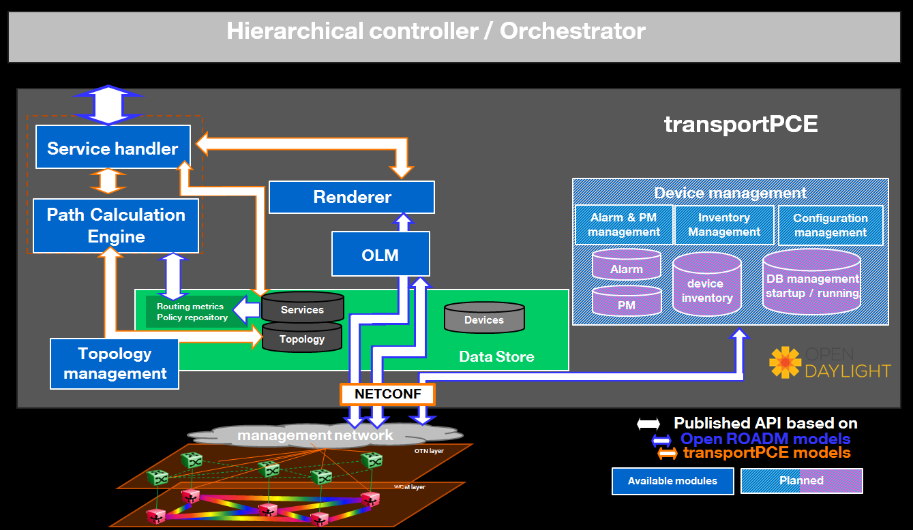

.. _transportpce-dev-guide:

TransportPCE Developer Guide
============================

Overview
--------

TransportPCE describes an application running on top of the OpenDaylight
controller. Its primary function is to control an optical transport
infrastructure using a non-proprietary South Bound Interface (SBI). It may be
interconnected with Controllers of different layers (L2, L3 Controller…), a
higher layer Controller and/or an Orchestrator through non-proprietary
Application Programing Interfaces (APIs). Control includes the capability to
configure the optical equipment, and to provision services according to a
request coming from a higher layer controller and/or an orchestrator.
This capability may rely on the controller only or it may be delegated to
distributed (standardized) protocols.

Architecture
------------

TransportPCE modular architecture is described on the next diagram. Each main
function such as Topology management, Path Calculation Engine (PCE), Service
handler, Renderer \_responsible for the path configuration through optical
equipment\_ and Optical Line Management (OLM) is associated with a generic block
relying on open models, each of them communicating through published APIs.

   TransportPCE architecture

The current version of transportPCE is dedicated to the control of WDM transport
infrastructure. OTN layer will be integrated in a later step. The WDM layer is
built from colorless ROADMs and transponders.

The interest of using a controller to provision automatically services strongly
relies on its ability to handle end to end optical services that spans through
the different network domains, potentially equipped with equipment coming from
different suppliers. Thus, interoperability in the optical layer is a key
element to get the benefit of automated control.

Initial design of TransportPCE leverages Open ROADM Multi-Source-Agreement (MSA)
which defines interoperability specifications, consisting of both Optical
interoperability and Yang data models.

Module description
~~~~~~~~~~~~~~~~~~

ServiceHandler
^^^^^^^^^^^^^^

Service Handler handles request coming from a higher level controller or an
orchestrator through the northbound API, as defined in the Open ROADM service
model. Current implementation addresses the following rpcs: service-create,
service–delete, service-reroute.
It checks the request consistency and trigs path calculation sending rpcs to the
PCE. If a valid path is returned by the PCE, path configuration is initiated
relying on Renderer and OLM.
At the confirmation of a successful service creation, the Service Handler
updates the service-list in the MD-SAL.
For service deletion, the Service Handler relies on the Renderer and the OLM to
delete connections and reset power levels associated with the service.
The service-list is updated following a successful service deletion.

PCE
^^^^^^^^^^^^^^

The Path Computation Element (PCE) is the component responsible for path
calculation. An interface allows the Renderer or external components such as an
orchestrator to request a path computation and get a response from the PCE
including the computed path(s) in case of success, or errors and indication of
the reason for the failure in case the request cannot be satisfied. Additional
parameters can be provided by the PCE in addition to the computed paths if
requested by the client module. An interface to the Topology Management module
allows keeping PCE aligned with the latest changes in the topology. Information
about current and planned services is available in the MD-SAL data store.

Current implementation of PCE allows finding the shortest path, minimizing
either the hop count (default) or the propagation delay. Wavelength is assigned
considering a fixed grid of 96 wavelengths. Current PCE handles the following
constraints as hard constraints:

-   **Node exclusion**
-   **SRLG exclusion**
-   **Maximum latency**

Topology Management
^^^^^^^^^^^^^^^^^^^^^^^^

Topology management module builds the Topology according to the Network model
defined in OpenROADM. The topology is aligned with I2RS model. It includes
several network layers:

-  **CLLI layer corresponds to the locations that host equipment**
-  **Network layer corresponds to a first level of disaggregation where we
   separate Xponders (transponder, muxponders or switchponders) from ROADMs**
-  **Topology layer introduces a second level of disaggregation where ROADMs
   Add/Drop modules ("SRGs") are separated from the degrees which includes line
   amplifiers and WSS that switch wavelengths from one to another degree**

OTN layer which includes OTN elements having or not the ability to switch OTN
containers from client to line cards is not currently implemented.

Renderer
^^^^^^^^

The Renderer module, on request coming from the Service Handler through a
service-implementation-request /service delete rpc, sets/deletes the path
corresponding to a specific service between A and Z ends.
It first checks what are the existing interfaces on the ports of the different
nodes that the path crosses. It then creates missing interfaces. After all
needed interfaces have been created it sets the connections required in the
nodes and notifies the Service Handler on the status of the path creation.
Path is created in 2 steps (from A to Z and Z to A). In case the path between
A and Z could not be fully created, a rollback function is called to set the
equipment on the path back to their initial configuration (as they were before
invoking the Renderer).

OLM
^^^^^^^^

Optical Line Management module implements two main features: it is responsible
for setting up the optical power levels on the different interfaces, and is in
charge of adjusting these settings across the life of the optical
infrastructure.

After the different connections have been established in the ROADMS, between 2
Degrees for an express path, or between a SRG and a Degree for an Add or Drop
path; meaning the devices have set WSS and all other required elements to
provide path continuity, power setting are provided as attributes of these
connections. This allows the device to set all complementary elements such as
VOAs, to guaranty that the signal is launched at a correct power level
(in accordance to the specifications) in the fiber span. This also applies
to X-Ponders, as their output power must comply with the specifications defined
for the Add/Drop ports (SRG) of the ROADM. OLM has the responsibility of
calculating the right power settings, sending it to the device, and check the
PM retrieved from the device to verify that the setting was correctly applied
and the configuration was successfully completed.

Key APIs and Interfaces
-----------------------

External API
~~~~~~~~~~~~

North API, interconnecting the Service Handler to higher level applications
relies on the Service Model defined in the MSA. The Renderer and the OLM are
developed to allow configuring Open ROADM devices through a southbound
Netconf/Yang interface and rely on the MSA’s device model.

ServiceHandler Service
^^^^^^^^^^^^^^^^^^^^^^

-  RPC call

   -  service-create (given service-name, service-aend, service-zend)

   -  service-delete (given service-name)

   -  service-reroute (given service-name, service-aend, service-zend)

-  Data structure

   -  service list : composed of services
   -  service : composed of service-name, topology wich describes the detailed path (list of used resources)

-  Notification

   - service-rpc-result : result of service RPC
   - service-notification : service has been added, modified or removed

Netconf Service
^^^^^^^^^^^^^^^

-  RPC call

   -  connect-device : PUT
   -  disconnect-device : DELETE
   -  check-connected-device : GET

-  Data Structure

   -  node list : composed of netconf nodes in topology-netconf

Internal APIs
~~~~~~~~~~~~~

Internal APIs define REST APIs to interconnect TransportPCE modules :

-   Service Handler to PCE
-   PCE to Topology Management
-   Service Handler to Renderer
-   Renderer to OLM

Pce Service
^^^^^^^^^^^

-  RPC call

   -  path-computation-request (given service-name, service-aend, service-zend)

   -  cancel-resource-reserve (given service-name)

-  Notification

   - service-path-rpc-result : result of service RPC

Renderer Service
^^^^^^^^^^^^^^^^

-  RPC call

   -  service-implementation-request (given service-name, service-aend, service-zend)

   -  service-delete (given service-name)

-  Data structure

   -  service path list : composed of service paths
   -  service path : composed of service-name, path description giving the list of abstracted elements (nodes, tps, links)

-  Notification

   - service-path-rpc-result : result of service RPC

Topology Management Service
^^^^^^^^^^^^^^^^^^^^^^^^^^^

-  Data structure

   -  network list : composed of networks(openroadm-topology, netconf-topology)
   -  node list : composed of node-id
   -  link list : composed of link-id
   -  node : composed of roadm, xponder
      link : composed of links of different types (roadm-to-roadm, express, add-drop ...)

OLM Service
^^^^^^^^^^^

-  RPC call

   -  get-pm (given node-id)

   -  service-power-setup

   -  service-power-turndown

   -  service-power-reset

   -  calculate-spanloss-base

   -  calculate-spanloss-current

Running transportPCE project
----------------------------

To use transportPCE controller, the first step is to connect the controller to optical nodes
through the NETCONF connector.

.. note::

    In the current version, only optical equipment compliant with open ROADM datamodels are managed
    by transportPCE.

Connecting nodes
~~~~~~~~~~~~~~~~

To connect a node, use the following JSON RPC

**REST API** : *POST /restconf/config/network-topology:network-topology/topology/topology-netconf/node/<node-id>*

**Sample JSON Data**

.. code:: json

    {
        "node": [
            {
                "node-id": "<node-id>",
        		"netconf-node-topology:tcp-only": "false",
        		"netconf-node-topology:reconnect-on-changed-schema": "false",
        		"netconf-node-topology:host": "<node-ip-address>",
        		"netconf-node-topology:default-request-timeout-millis": "120000",
        		"netconf-node-topology:max-connection-attempts": "0",
    			"netconf-node-topology:sleep-factor": "1.5",
        		"netconf-node-topology:actor-response-wait-time": "5",
        		"netconf-node-topology:concurrent-rpc-limit": "0",
        		"netconf-node-topology:between-attempts-timeout-millis": "2000",
        		"netconf-node-topology:port": "<netconf-port>",
        		"netconf-node-topology:connection-timeout-millis": "20000",
        		"netconf-node-topology:username": "<node-username>",
        		"netconf-node-topology:password": "<node-password>",
        		"netconf-node-topology:keepalive-delay": "300"
            }
        ]
    }

Then check that the netconf session has been correctly established between the controller and the
node. the status of **netconf-node-topology:connection-status** must be **connected**

**REST API** : *GET /restconf/operational/network-topology:network-topology/topology/topology-netconf/node/<node-id>*

Node configuration discovery
~~~~~~~~~~~~~~~~~~~~~~~~~~~~

Once the controller is connected to the node, transportPCE application automatically launchs a
discovery of the node configuration datastore and creates **Logical Connection Points** to any
physical ports related to transmission. All *circuit-packs* inside the node configuration are
analyzed.

Use the following JSON RPC to check that function internally named *portMapping*.

**REST API** : *GET /restconf/config/portmapping:network*

.. note::

    In ``org-openroadm-device.yang``, two types of optical nodes can be managed:
        * rdm: ROADM device (optical switch)
        * xpdr: Xponder device (device that converts client to optical channel interface)

Depending on the kind of open ROADM device connected, different kind of *Logical Connection Points*
should appear, if the node configuration is not empty:

-  DEG<degree-number>-TTP-<port-direction>: created on the line port of a degree on a rdm equipment
-  SRG<srg-number>-PP<port-number>: created on the client port of a srg on a rdm equipment
-  XPDR<number>-CLIENT<port-number>: created on the client port of a xpdr equipment
-  XPDR<number>-NETWORK<port-number>: created on the line port of a xpdr equipment

    For further details on openROADM device models, see `openROADM MSA white paper <https://0201.nccdn.net/1_2/000/000/134/c50/Open-ROADM-MSA-release-2-Device-White-paper-v1-1.pdf>`__.

Optical Network topology
~~~~~~~~~~~~~~~~~~~~~~~~

Before creating an optical connectivity service, your topology must contain at least two xpdr
devices connected to two different rdm devices. Normally, the *openroadm-topology* is automatically
created by transportPCE. Nevertheless, depending on the configuration inside optical nodes, this
topology can be partial. Check that link of type *ROADMtoROADM* exists between two adjacent rdm
nodes.

**REST API** : *GET /restconf/config/ietf-network:network/openroadm-topology*

If it is not the case, you need to manually complement the topology with *ROADMtoROADM* link using
the following REST RPC:

**REST API** : *POST /restconf/operations/networkutils:init-roadm-nodes*

**Sample JSON Data**

.. code:: json

    {
      "networkutils:input": {
        "networkutils:rdm-a-node": "<node-id-A>",
        "networkutils:deg-a-num": "<degree-A-number>",
        "networkutils:termination-point-a": "<Logical-Connection-Point>",
        "networkutils:rdm-z-node": "<node-id-Z>",
        "networkutils:deg-z-num": "<degree-Z-number>",
        "networkutils:termination-point-z": "<Logical-Connection-Point>"
      }
    }

*<Logical-Connection-Point> comes from the portMapping function*.

Unidirectional links between xpdr and rdm nodes must be created manually. To that end use the two
following REST RPCs:

From xpdr to rdm:
^^^^^^^^^^^^^^^^^

**REST API** : *POST /restconf/operations/networkutils:init-xpdr-rdm-links*

**Sample JSON Data**

.. code:: json

    {
      "networkutils:input": {
        "networkutils:links-input": {
          "networkutils:xpdr-node": "<xpdr-node-id>",
          "networkutils:xpdr-num": "1",
          "networkutils:network-num": "<xpdr-network-port-number>",
          "networkutils:rdm-node": "<rdm-node-id>",
          "networkutils:srg-num": "<srg-number>",
          "networkutils:termination-point-num": "<Logical-Connection-Point>"
        }
      }
    }

From rdm to xpdr:
^^^^^^^^^^^^^^^^^

**REST API** : *POST /restconf/operations/networkutils:init-rdm-xpdr-links*

**Sample JSON Data**

.. code:: json

    {
      "networkutils:input": {
        "networkutils:links-input": {
          "networkutils:xpdr-node": "<xpdr-node-id>",
          "networkutils:xpdr-num": "1",
          "networkutils:network-num": "<xpdr-network-port-number>",
          "networkutils:rdm-node": "<rdm-node-id>",
          "networkutils:srg-num": "<srg-number>",
          "networkutils:termination-point-num": "<Logical-Connection-Point>"
        }
      }
    }

Creating a service
~~~~~~~~~~~~~~~~~~

Use the following REST RPC to invoke *service handler* module in order to create a bidirectional
end-to-end optical connectivity service between two xpdr over an optical network composed of rdm
nodes.

**REST API** : *POST /restconf/operations/org-openroadm-service:service-create*

**Sample JSON Data**

.. code:: json

    {
    	"input": {
    		"sdnc-request-header": {
    			"request-id": "request-1",
    			"rpc-action": "service-create",
    			"request-system-id": "appname"
    		},
    		"service-name": "test1",
    		"common-id": "commonId",
    		"connection-type": "service",
    		"service-a-end": {
    			"service-rate": "100",
    			"node-id": "<xpdr-node-id>",
    			"service-format": "Ethernet",
    			"clli": "<ccli-name>",
    			"tx-direction": {
    				"port": {
    					"port-device-name": "<xpdr-client-port>",
    					"port-type": "fixed",
    					"port-name": "<xpdr-client-port-number>",
    					"port-rack": "000000.00",
    					"port-shelf": "Chassis#1"
    				},
    				"lgx": {
    					"lgx-device-name": "Some lgx-device-name",
    					"lgx-port-name": "Some lgx-port-name",
    					"lgx-port-rack": "000000.00",
    					"lgx-port-shelf": "00"
    				}
    			},
    			"rx-direction": {
    				"port": {
    					"port-device-name": "<xpdr-client-port>",
    					"port-type": "fixed",
    					"port-name": "<xpdr-client-port-number>",
    					"port-rack": "000000.00",
    					"port-shelf": "Chassis#1"
    				},
    				"lgx": {
    					"lgx-device-name": "Some lgx-device-name",
    					"lgx-port-name": "Some lgx-port-name",
    					"lgx-port-rack": "000000.00",
    					"lgx-port-shelf": "00"
    				}
    			},
    			"optic-type": "gray"
    		},
    		"service-z-end": {
    			"service-rate": "100",
    			"node-id": "<xpdr-node-id>",
    			"service-format": "Ethernet",
    			"clli": "<ccli-name>",
    			"tx-direction": {
    				"port": {
    					"port-device-name": "<xpdr-client-port>",
    					"port-type": "fixed",
    					"port-name": "<xpdr-client-port-number>",
    					"port-rack": "000000.00",
    					"port-shelf": "Chassis#1"
    				},
    				"lgx": {
    					"lgx-device-name": "Some lgx-device-name",
    					"lgx-port-name": "Some lgx-port-name",
    					"lgx-port-rack": "000000.00",
    					"lgx-port-shelf": "00"
    				}
    			},
    			"rx-direction": {
    				"port": {
    					"port-device-name": "<xpdr-client-port>",
    					"port-type": "fixed",
    					"port-name": "<xpdr-client-port-number>",
    					"port-rack": "000000.00",
    					"port-shelf": "Chassis#1"
    				},
    				"lgx": {
    					"lgx-device-name": "Some lgx-device-name",
    					"lgx-port-name": "Some lgx-port-name",
    					"lgx-port-rack": "000000.00",
    					"lgx-port-shelf": "00"
    				}
    			},
    			"optic-type": "gray"
    		},
    		"due-date": "yyyy-mm-ddT00:00:01Z",
    		"operator-contact": "some-contact-info"
    	}
    }

Most important parameters for this REST RPC are the identification of the two physical client ports
on xpdr nodes.This RPC invokes the *PCE* module to compute a path over the *openroadm-topology* and
then invokes *renderer* and *OLM* to implement the end-to-end path into the devices.

Deleting a service
~~~~~~~~~~~~~~~~~~

Use the following REST RPC to invoke *service handler* module in order to delete a given optical
connectivity service.

**REST API** : *POST /restconf/operations/org-openroadm-service:service-delete*

**Sample JSON Data**

.. code:: json

    {
    	"input": {
    		"sdnc-request-header": {
    			"request-id": "request-1",
    			"rpc-action": "service-delete",
    			"request-system-id": "appname",
    			"notification-url": "http://localhost:8585/NotificationServer/notify"
    		},
    		"service-delete-req-info": {
    			"service-name": "test1",
    			"tail-retention": "no"
    		}
    	}
    }

Most important parameters for this REST RPC is the *service-name*.

Help
----

-  `TransportPCE Wiki <https://wiki.opendaylight.org/view/TransportPCE:Main>`__

-  TransportPCE Mailing List
   (`developer <https://lists.opendaylight.org/mailman/listinfo/transportpce-dev>`__)
