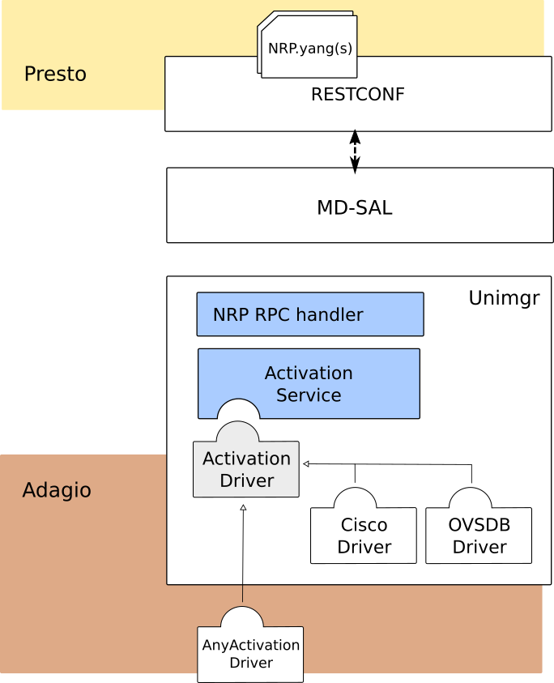
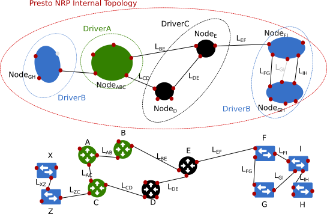

.. _unimgr-dev-guide:

User Network Interface Manager Plug-in (Unimgr) Developer Guide
===============================================================

Overview
--------

The User Network Interface (UNI) Manager project within OpenDaylight provides
data models and APIs that enable software applications and service
orchestrators to configure and provision connectivity services; in particular,
Carrier Ethernet services as defined by MEF Forum, in physical and virtual
network elements.

Unimgr Architecture
-------------------

Unimgr provides support for both service orchestration, via the Legato API, and
network resource provisioning, via the Presto API.  These APIs, and the
interfaces they provide, are defined by YANG models developed within MEF in
collaboration with ONF and IETF. An application/user can interact with Unimgr
at either layer. Presto and Legato APIs are for LSO Architecture reference points
defined in `MEF 55 specification <https://www.mef.net/Assets/Technical_Specifications/PDF/MEF_55.pdf>`_.

Presto layer
````````````


In current version of Unimgr the recent version of Presto NRP is supported.
This model is based on Transport API (TAPI) from ONF. This API allows for
management of connectivity services and exposes abstract topology of the
managed infrastracture. By its nature Presto NRP write and update operations
are defined as set of RPC calls. All the reads operation can be either specific
RPCs or via RESTCONF data tree.

Presto layer architecture is depicted in figure above. There are two
distinctive parts of Presto NRP business logic Activation Service and
Activation Driver. Activation Service part of the framework is to encapsulate
the common logic whereas Activation Driver is a way to encapsulate business
logic to transform Presto Request into a given underlying technology. This way
we are able to handle multi-vendor infrastructures and address various use
cases as vendors specific code is encapsulated in drivers.

Activation Service
..................

Activation service is responsible for handling the connectivity request. In
case of service activation following steps are performed:

1. Validation of a request (e.g. if all endpoints exists)

2. Decomposition of a request into number of drivers sub-requests

3. Activation of the request for selected drivers

4. Update of the data model and creating ``ConnectivityService`` and ``Connection`` objects for the request

Step 1. Implements only minimal functionality.

Step 2. Allows for multi-vendor configuration as decomposition mechanisms
defines all drivers required to satisfy given connectivity request. Currently
only p2p connectivity services are supported in the decomposition mechanism.

Both validation and decomposition mechanisms are plug-able thus users can
support more sophisticated scenarios.


Activation Driver
.................



Activation Driver has two main responsibilities:

* to handle connectvitiy service requests

* to contribute to Presto Topology with abstract nodes driver can handle

In figure above example topology and drivers are shown. As you can see it is up
to driver how to model infrastructure it manages. Thus, driver A has decided to
model all devices as single virtual node, whereas driver C is exposing every
single device as a node.

The connectivity service is defined between ``ServiceInterfacePoint``  (SIP)
which are mapped to ``NodeEdgePoint`` (NEP). A SIP can have UNI, ENNI or INNI
role. Assigning a SIP to NEP can be done automatically by driver of with the
use of Unimgr extension API. It is assumed that driver can connect eny number
of SIPs related to NEPs for every ``Node`` it exposes.

There is a contract for a given Karaf bundle to be recognized as a driver. The
following must be fulfiled:

* A driver have to expose an OSGI service that implements
  ``org.opendaylight.unimgr.mef.nrp.api.ActivationDriverBuilder``

* Implement a component that is responsible for writing to topology (in general
  the requirement is to add at least a single node to topology with id
  ``org.opendaylight.unimgr.mef.nrp.api.TapiConstants#PRESTO_SYSTEM_TOPO``

There are three drivers maintained as part of Unimgr project:

:template-driver: Which is intended as a template for real drivers development.
    It is not connected to infrastructure.
:ovs-driver: Which is a driver for OpenFlow infrasturcture.
:cisco-xr-driver: A netconf driver for Cisco XR devices for MPLS inter-connectivity

Key APIs and Interfaces
-----------------------

Legato YANG models:
https://git.opendaylight.org/gerrit/gitweb?p=unimgr.git;a=tree;f=legato-api/src/main/yang;hb=refs/heads/stable/nitrogen

Presto YANG models:
https://git.opendaylight.org/gerrit/gitweb?p=unimgr.git;a=tree;f=presto-api/src/main/yang;hb=refs/heads/stable/nitrogen

Legato API Tree
---------------

module: mef-services

::

  +--rw mef-services
     +--rw mef-service* [svc-id]
        +--rw evc
        |  +--rw unis
        |  |  +--rw uni* [uni-id]
        |  |     +--rw evc-uni-ce-vlans
        |  |     |  +--rw evc-uni-ce-vlan* [vid]
        |  |     |     +--rw vid    -> /mef-interfaces:mef-interfaces/unis/uni[mef-interfaces:uni-id = current()/../../../uni-id]/ce-vlans/ce-vlan/vid
        |  |     +--rw ingress-bwp-flows-per-cos!
        |  |     |  +--rw coupling-enabled?   boolean
        |  |     |  +--rw bwp-flow-per-cos* [cos-name]
        |  |     |     +--rw cos-name      -> /mef-global:mef-global/profiles/cos-names/cos-name/name
        |  |     |     +--rw bw-profile    -> /mef-interfaces:mef-interfaces/unis/uni[mef-interfaces:uni-id = current()/../../../uni-id]/ingress-envelopes/envelope/env-id
        |  |     +--rw egress-bwp-flows-per-eec!
        |  |     |  +--rw coupling-enabled?   boolean
        |  |     |  +--rw bwp-flow-per-eec* [eec-name]
        |  |     |     +--rw eec-name      -> /mef-global:mef-global/profiles/eec-names/eec-name/name
        |  |     |     +--rw bw-profile    -> /mef-interfaces:mef-interfaces/unis/uni[mef-interfaces:uni-id = current()/../../../uni-id]/egress-envelopes/envelope/env-id
        |  |     +--rw status
        |  |     |  +--ro oper-state-enabled?   boolean
        |  |     |  +--ro available-status?     mef-types:svc-endpoint-availability-type
        |  |     +--rw uni-id                         -> /mef-interfaces:mef-interfaces/unis/uni/uni-id
        |  |     +--rw role                           mef-types:evc-uni-role-type
        |  |     +--rw admin-state-enabled?           boolean
        |  |     +--rw color-id?                      mef-types:cos-color-identifier-type
        |  |     +--rw data-svc-frm-cos?              -> /mef-global:mef-global/profiles/cos/cos-profile/id
        |  |     +--rw l2cp-svc-frm-cos?              -> /mef-global:mef-global/profiles/l2cp-cos/l2cp-profile/id
        |  |     +--rw soam-svc-frm-cos?              -> /mef-global:mef-global/profiles/cos/cos-profile/id
        |  |     +--rw data-svc-frm-eec?              -> /mef-global:mef-global/profiles/eec/eec-profile/id
        |  |     +--rw l2cp-svc-frm-eec?              -> /mef-global:mef-global/profiles/l2cp-eec/l2cp-profile/id
        |  |     +--rw soam-svc-frm-eec?              -> /mef-global:mef-global/profiles/eec/eec-profile/id
        |  |     +--rw ingress-bw-profile-per-evc?    -> /mef-interfaces:mef-interfaces/unis/uni[mef-interfaces:uni-id = current()/../uni-id]/ingress-envelopes/envelope/env-id
        |  |     +--rw egress-bw-profile-per-evc?     -> /mef-interfaces:mef-interfaces/unis/uni[mef-interfaces:uni-id = current()/../uni-id]/egress-envelopes/envelope/env-id
        |  |     +--rw src-mac-addr-limit-enabled?    boolean
        |  |     +--rw src-mac-addr-limit?            uint32
        |  |     +--rw src-mac-addr-limit-interval?   yang:timeticks
        |  |     +--rw test-meg-enabled?              boolean
        |  |     +--rw test-meg?                      mef-types:identifier45
        |  |     +--rw subscriber-meg-mip-enabled?    boolean
        |  |     +--rw subscriber-meg-mip?            mef-types:identifier45
        |  +--rw status
        |  |  +--ro oper-state-enabled?   boolean
        |  |  +--ro available-status?     mef-types:virt-cx-availability-type
        |  +--rw sls-inclusions-by-cos
        |  |  +--rw sls-inclusion-by-cos* [cos-name]
        |  |     +--rw cos-name    -> /mef-global:mef-global/profiles/cos-names/cos-name/name
        |  +--rw sls-uni-inclusions!
        |  |  +--rw sls-uni-inclusion-set* [pm-type pm-id uni-id1 uni-id2]
        |  |     +--rw pm-type    -> /mef-global:mef-global/slss/sls[mef-global:sls-id = current()/../../../evc-performance-sls]/perf-objs/perf-obj/pm-type
        |  |     +--rw pm-id      -> /mef-global:mef-global/slss/sls[mef-global:sls-id = current()/../../../evc-performance-sls]/perf-objs/perf-obj[mef-global:pm-type = current()/../pm-type]/pm-id
        |  |     +--rw uni-id1    -> ../../../unis/uni/uni-id
        |  |     +--rw uni-id2    -> ../../../unis/uni/uni-id
        |  +--rw sls-uni-exclusions!
        |  |  +--rw sls-uni-exclusion-set* [pm-type pm-id uni-id1 uni-id2]
        |  |     +--rw pm-type    -> /mef-global:mef-global/slss/sls[mef-global:sls-id = current()/../../../evc-performance-sls]/perf-objs/perf-obj/pm-type
        |  |     +--rw pm-id      -> /mef-global:mef-global/slss/sls[mef-global:sls-id = current()/../../../evc-performance-sls]/perf-objs/perf-obj[mef-global:pm-type = current()/../pm-type]/pm-id
        |  |     +--rw uni-id1    -> ../../../unis/uni/uni-id
        |  |     +--rw uni-id2    -> ../../../unis/uni/uni-id
        |  +--rw evc-id                        mef-types:evc-id-type
        |  +--ro evc-status?                   mef-types:evc-status-type
        |  +--rw evc-type                      mef-types:evc-type
        |  +--rw admin-state-enabled?          boolean
        |  +--rw elastic-enabled?              boolean
        |  +--rw elastic-service?              mef-types:identifier45
        |  +--rw max-uni-count?                uint32
        |  +--rw preserve-ce-vlan-id?          boolean
        |  +--rw cos-preserve-ce-vlan-id?      boolean
        |  +--rw evc-performance-sls?          -> /mef-global:mef-global/slss/sls/sls-id
        |  +--rw unicast-svc-frm-delivery?     mef-types:data-svc-frame-delivery-type
        |  +--rw multicast-svc-frm-delivery?   mef-types:data-svc-frame-delivery-type
        |  +--rw broadcast-svc-frm-delivery?   mef-types:data-svc-frame-delivery-type
        |  +--rw evc-meg-id?                   mef-types:identifier45
        |  +--rw max-svc-frame-size?           mef-types:max-svc-frame-size-type
        +--rw svc-id        mef-types:retail-svc-id-type
        +--rw sp-id?        -> /mef-global:mef-global/svc-providers/svc-provider/sp-id
        +--rw svc-type?     mef-types:mef-service-type
        +--rw user-label?   mef-types:identifier45
        +--rw svc-entity?   mef-types:service-entity-type

module: mef-global

::

  +--rw mef-global
     +--rw svc-providers!
     |  +--rw svc-provider* [sp-id]
     |     +--rw sp-id    mef-types:svc-provider-type
     +--rw cens!
     |  +--rw cen* [cen-id]
     |     +--rw cen-id    mef-types:cen-type
     |     +--rw sp-id?    -> /mef-global/svc-providers/svc-provider/sp-id
     +--rw slss!
     |  +--rw sls* [sls-id]
     |     +--rw perf-objs
     |     |  +--rw pm-time-interval                    uint64
     |     |  +--rw pm-time-interval-increment          uint64
     |     |  +--rw unavail-flr-threshold-pp            mef-types:simple-percent
     |     |  +--rw consecutive-small-time-intervals    uint64
     |     |  +--rw perf-obj* [pm-type pm-id]
     |     |     +--rw pm-type                                  mef-types:performance-metric-type
     |     |     +--rw pm-id                                    mef-types:identifier45
     |     |     +--rw cos-name                                 -> /mef-global/profiles/cos-names/cos-name/name
     |     |     +--rw fd-pp                                    mef-types:simple-percent
     |     |     +--rw fd-range-pp                              mef-types:simple-percent
     |     |     +--rw fd-perf-obj                              uint64
     |     |     +--rw fd-range-perf-obj                        uint64
     |     |     +--rw fd-mean-perf-obj                         uint64
     |     |     +--rw ifdv-pp                                  mef-types:simple-percent
     |     |     +--rw ifdv-pair-interval                       mef-types:simple-percent
     |     |     +--rw ifdv-perf-obj                            uint64
     |     |     +--rw flr-perf-obj                             uint64
     |     |     +--rw avail-pp                                 mef-types:simple-percent
     |     |     +--rw hli-perf-obj                             uint64
     |     |     +--rw chli-consecutive-small-time-intervals    uint64
     |     |     +--rw chli-perf-obj                            uint64
     |     |     +--rw min-uni-pairs-avail                      uint64
     |     |     +--rw gp-avail-pp                              mef-types:simple-percent
     |     +--rw sls-id       mef-types:cen-type
     |     +--rw sp-id?       -> /mef-global/svc-providers/svc-provider/sp-id
     +--rw subscribers!
     |  +--rw subscriber* [sub-id]
     |     +--rw sub-id    mef-types:subscriber-type
     |     +--rw sp-id?    -> /mef-global/svc-providers/svc-provider/sp-id
     |     +--rw cen-id?   -> /mef-global/cens/cen/cen-id
     +--rw profiles!
        +--rw cos-names
        |  +--rw cos-name* [name]
        |     +--rw name    mef-types:identifier45
        +--rw eec-names
        |  +--rw eec-name* [name]
        |     +--rw name    mef-types:identifier45
        +--rw ingress-bwp-flows
        |  +--rw bwp-flow* [bw-profile]
        |     +--rw bw-profile          mef-types:identifier45
        |     +--rw user-label?         mef-types:identifier45
        |     +--rw cir?                mef-types:bwp-cir-type
        |     +--rw cir-max?            mef-types:bwp-cir-type
        |     +--rw cbs?                mef-types:bwp-cbs-type
        |     +--rw eir?                mef-types:bwp-eir-type
        |     +--rw eir-max?            mef-types:bwp-eir-type
        |     +--rw ebs?                mef-types:bwp-ebs-type
        |     +--rw coupling-enabled?   boolean
        |     +--rw color-mode?         mef-types:bwp-color-mode-type
        |     +--rw coupling-flag?      mef-types:bwp-coupling-flag-type
        +--rw egress-bwp-flows
        |  +--rw bwp-flow* [bw-profile]
        |     +--rw bw-profile          mef-types:identifier45
        |     +--rw user-label?         mef-types:identifier45
        |     +--rw cir?                mef-types:bwp-cir-type
        |     +--rw cir-max?            mef-types:bwp-cir-type
        |     +--rw cbs?                mef-types:bwp-cbs-type
        |     +--rw eir?                mef-types:bwp-eir-type
        |     +--rw eir-max?            mef-types:bwp-eir-type
        |     +--rw ebs?                mef-types:bwp-ebs-type
        |     +--rw coupling-enabled?   boolean
        |     +--rw color-mode?         mef-types:bwp-color-mode-type
        |     +--rw coupling-flag?      mef-types:bwp-coupling-flag-type
        +--rw l2cp-cos
        |  +--rw l2cp-profile* [id]
        |     +--rw l2cps
        |     |  +--rw l2cp* [dest-mac-addr peering-proto-name]
        |     |     +--rw dest-mac-addr         yang:mac-address
        |     |     +--rw peering-proto-name    mef-types:identifier45
        |     |     +--rw protocol?             mef-types:l2cp-peering-protocol-type
        |     |     +--rw protocol-id?          yang:hex-string
        |     |     +--rw cos-name?             -> /mef-global/profiles/cos-names/cos-name/name
        |     |     +--rw handling?             mef-types:l2cp-handling-type
        |     |     +--rw subtype*              yang:hex-string
        |     +--rw id            mef-types:identifier45
        |     +--rw user-label?   mef-types:identifier45
        +--rw l2cp-eec
        |  +--rw l2cp-profile* [id]
        |     +--rw l2cps
        |     |  +--rw l2cp* [dest-mac-addr peering-proto-name]
        |     |     +--rw dest-mac-addr         yang:mac-address
        |     |     +--rw peering-proto-name    mef-types:identifier45
        |     |     +--rw protocol?             mef-types:l2cp-peering-protocol-type
        |     |     +--rw protocol-id?          yang:hex-string
        |     |     +--rw eec-name?             -> /mef-global/profiles/eec-names/eec-name/name
        |     |     +--rw handling?             mef-types:l2cp-handling-type
        |     |     +--rw subtype*              yang:hex-string
        |     +--rw id            mef-types:identifier45
        |     +--rw user-label?   mef-types:identifier45
        +--rw l2cp-peering
        |  +--rw l2cp-profile* [id]
        |     +--rw l2cps
        |     |  +--rw l2cp* [dest-mac-addr peering-proto-name]
        |     |     +--rw dest-mac-addr         yang:mac-address
        |     |     +--rw peering-proto-name    mef-types:identifier45
        |     |     +--rw protocol?             mef-types:l2cp-peering-protocol-type
        |     |     +--rw protocol-id?          yang:hex-string
        |     |     +--rw subtype*              yang:hex-string
        |     +--rw id            mef-types:identifier45
        |     +--rw user-label?   mef-types:identifier45
        +--rw elmi
        |  +--rw elmi-profile* [id]
        |     +--rw id                            mef-types:identifier45
        |     +--rw user-label?                   mef-types:identifier45
        |     +--rw polling-counter?              mef-types:elmi-polling-counter-type
        |     +--rw status-error-threshold?       mef-types:elmi-status-error-threshold-type
        |     +--rw polling-timer?                mef-types:elmi-polling-timer-type
        |     +--rw polling-verification-timer?   mef-types:elmi-polling-verification-timer-type
        +--rw eec
        |  +--rw eec-profile* [id]
        |     +--rw id          mef-types:identifier45
        |     +--rw (eec-id)?
        |        +--:(pcp)
        |        |  +--rw eec-pcp!
        |        |     +--rw default-pcp-eec-name?   -> /mef-global/profiles/eec-names/eec-name/name
        |        |     +--rw default-pcp-color?      mef-types:cos-color-type
        |        |     +--rw pcp* [pcp-value]
        |        |        +--rw pcp-value        mef-types:ieee8021p-priority-type
        |        |        +--rw discard-value?   boolean
        |        |        +--rw eec-name?        -> /mef-global/profiles/eec-names/eec-name/name
        |        |        +--rw color?           mef-types:cos-color-type
        |        +--:(dscp)
        |           +--rw eec-dscp!
        |              +--rw default-ipv4-eec-name?   -> /mef-global/profiles/eec-names/eec-name/name
        |              +--rw default-ipv4-color?      mef-types:cos-color-type
        |              +--rw default-ipv6-eec-name?   -> /mef-global/profiles/eec-names/eec-name/name
        |              +--rw default-ipv6-color?      mef-types:cos-color-type
        |              +--rw ipv4-dscp* [dscp-value]
        |              |  +--rw dscp-value       inet:dscp
        |              |  +--rw discard-value?   boolean
        |              |  +--rw eec-name?        -> /mef-global/profiles/eec-names/eec-name/name
        |              |  +--rw color?           mef-types:cos-color-type
        |              +--rw ipv6-dscp* [dscp-value]
        |                 +--rw dscp-value       inet:dscp
        |                 +--rw discard-value?   boolean
        |                 +--rw eec-name?        -> /mef-global/profiles/eec-names/eec-name/name
        |                 +--rw color?           mef-types:cos-color-type
        +--rw cos
           +--rw cos-profile* [id]
              +--rw id          mef-types:identifier45
              +--rw (cos-id)?
                 +--:(evc)
                 |  +--rw cos-evc!
                 |     +--rw default-evc-cos-name?   -> /mef-global/profiles/cos-names/cos-name/name
                 |     +--rw default-evc-color?      mef-types:cos-color-type
                 +--:(pcp)
                 |  +--rw cos-pcp!
                 |     +--rw default-pcp-cos-name?   -> /mef-global/profiles/cos-names/cos-name/name
                 |     +--rw default-pcp-color?      mef-types:cos-color-type
                 |     +--rw pcp* [pcp-value]
                 |        +--rw pcp-value        mef-types:ieee8021p-priority-type
                 |        +--rw discard-value?   boolean
                 |        +--rw cos-name?        -> /mef-global/profiles/cos-names/cos-name/name
                 |        +--rw color?           mef-types:cos-color-type
                 +--:(dscp)
                    +--rw cos-dscp!
                       +--rw default-ipv4-cos-name?   -> /mef-global/profiles/cos-names/cos-name/name
                       +--rw default-ipv4-color?      mef-types:cos-color-type
                       +--rw default-ipv6-cos-name?   -> /mef-global/profiles/cos-names/cos-name/name
                       +--rw default-ipv6-color?      mef-types:cos-color-type
                       +--rw ipv4-dscp* [dscp-value]
                       |  +--rw dscp-value       inet:dscp
                       |  +--rw discard-value?   boolean
                       |  +--rw cos-name?        -> /mef-global/profiles/cos-names/cos-name/name
                       |  +--rw color?           mef-types:cos-color-type
                       +--rw ipv6-dscp* [dscp-value]
                          +--rw dscp-value       inet:dscp
                          +--rw discard-value?   boolean
                          +--rw cos-name?        -> /mef-global/profiles/cos-names/cos-name/name
                          +--rw color?           mef-types:cos-color-type

Presto API Tree
---------------

module: onf-core-network-module

::

  +--rw forwarding-constructs
     +--rw forwarding-construct* [uuid]
        +--rw uuid                   string
        +--rw layerProtocolName?     onf-cnt:LayerProtocolName
        +--rw lowerLevelFc*          -> /forwarding-constructs/forwarding-construct/uuid
        +--rw fcRoute* [uuid]
        |  +--rw uuid    string
        |  +--rw fc*     -> /forwarding-constructs/forwarding-construct/uuid
        +--rw fcPort* [topology node tp]
        |  +--rw topology           nt:topology-ref
        |  +--rw node               nt:node-ref
        |  +--rw tp                 nt:tp-ref
        |  +--rw role?              onf-cnt:PortRole
        |  +--rw fcPortDirection?   onf-cnt:PortDirection
        +--rw fcSpec
        |  +--rw uuid?                      string
        |  +--rw fcPortSpec* [uuid]
        |  |  +--rw uuid                string
        |  |  +--rw ingressFcPortSet* [topology node tp]
        |  |  |  +--rw topology    nt:topology-ref
        |  |  |  +--rw node        nt:node-ref
        |  |  |  +--rw tp          nt:tp-ref
        |  |  +--rw egressFcPortSet* [topology node tp]
        |  |  |  +--rw topology    nt:topology-ref
        |  |  |  +--rw node        nt:node-ref
        |  |  |  +--rw tp          nt:tp-ref
        |  |  +--rw role?               string
        |  +--rw nrp:nrp-ce-fcspec-attrs
        |     +--rw nrp:connectionType?           nrp-types:NRP_ConnectionType
        |     +--rw nrp:unicastFrameDelivery?     nrp-types:NRP_ServiceFrameDelivery
        |     +--rw nrp:multicastFrameDelivery?   nrp-types:NRP_ServiceFrameDelivery
        |     +--rw nrp:broadcastFrameDelivery?   nrp-types:NRP_ServiceFrameDelivery
        |     +--rw nrp:vcMaxServiceFrame?        nrp-types:NRP_PositiveInteger
        |     +--rw nrp:vcId?                     nrp-types:NRP_PositiveInteger
        +--rw forwardingDirection?   onf-cnt:ForwardingDirection

augment /nt:network-topology/nt:topology/nt:node/nt:termination-point:

::

  +--rw ltp-attrs
     +--rw lpList* [uuid]
     |  +--rw uuid                        string
     |  +--rw layerProtocolName?          onf-cnt:LayerProtocolName
     |  +--rw lpSpec
     |  |  +--rw adapterSpec
     |  |  |  +--rw nrp:nrp-conn-adapt-spec-attrs
     |  |  |  |  +--rw nrp:sourceMacAddressLimit
     |  |  |  |  |  +--rw nrp:enabled?        boolean
     |  |  |  |  |  +--rw nrp:limit?          NRP_NaturalNumber
     |  |  |  |  |  +--rw nrp:timeInterval?   NRP_NaturalNumber
     |  |  |  |  +--rw nrp:CeExternalInterface
     |  |  |  |  |  +--rw nrp:physicalLayer?             nrp-types:NRP_PhysicalLayer
     |  |  |  |  |  +--rw nrp:syncMode* [linkId]
     |  |  |  |  |  |  +--rw nrp:linkId             string
     |  |  |  |  |  |  +--rw nrp:syncModeEnabled?   boolean
     |  |  |  |  |  +--rw nrp:numberOfLinks?             nrp-types:NRP_NaturalNumber
     |  |  |  |  |  +--rw nrp:resiliency?                nrp-types:NRP_InterfaceResiliency
     |  |  |  |  |  +--rw nrp:portConvsIdToAggLinkMap
     |  |  |  |  |  |  +--rw nrp:conversationId?   NRP_NaturalNumber
     |  |  |  |  |  |  +--rw nrp:linkId?           NRP_NaturalNumber
     |  |  |  |  |  +--rw nrp:maxFrameSize?              nrp-types:NRP_NaturalNumber
     |  |  |  |  |  +--rw nrp:linkOamEnabled?            boolean
     |  |  |  |  |  +--rw nrp:tokenShareEnabled?         boolean
     |  |  |  |  |  +--rw nrp:serviceProviderUniId?      string
     |  |  |  |  +--rw nrp:coloridentifier
     |  |  |  |  |  +--rw (identifier)?
     |  |  |  |  |     +--:(sap-color-id)
     |  |  |  |  |     |  +--rw nrp:serviceAccessPointColorId
     |  |  |  |  |     |     +--rw nrp:color?   nrp-types:NRP_FrameColor
     |  |  |  |  |     +--:(pcp-color-id)
     |  |  |  |  |     |  +--rw nrp:pcpColorId
     |  |  |  |  |     |     +--rw nrp:vlanTag?    nrp-types:NRP_VlanTag
     |  |  |  |  |     |     +--rw nrp:pcpValue*   nrp-types:NRP_NaturalNumber
     |  |  |  |  |     |     +--rw nrp:color?      nrp-types:NRP_FrameColor
     |  |  |  |  |     +--:(dei-color-id)
     |  |  |  |  |     |  +--rw nrp:deiColorId
     |  |  |  |  |     |     +--rw nrp:vlanTag?    nrp-types:NRP_VlanTag
     |  |  |  |  |     |     +--rw nrp:deiValue*   nrp-types:NRP_NaturalNumber
     |  |  |  |  |     |     +--rw nrp:color?      nrp-types:NRP_FrameColor
     |  |  |  |  |     +--:(desp-color-id)
     |  |  |  |  |        +--rw nrp:despColorId
     |  |  |  |  |           +--rw nrp:ipVersion?   nrp-types:NRP_IpVersion
     |  |  |  |  |           +--rw nrp:dscpValue*   nrp-types:NRP_NaturalNumber
     |  |  |  |  |           +--rw nrp:color?       nrp-types:NRP_FrameColor
     |  |  |  |  +--rw nrp:ingressBwpFlow
     |  |  |  |  |  +--rw nrp:bwpFlowIndex?         nrp-types:NRP_PositiveInteger
     |  |  |  |  |  +--rw nrp:cir?                  nrp-types:NRP_NaturalNumber
     |  |  |  |  |  +--rw nrp:cirMax?               nrp-types:NRP_NaturalNumber
     |  |  |  |  |  +--rw nrp:cbs?                  nrp-types:NRP_NaturalNumber
     |  |  |  |  |  +--rw nrp:eir?                  nrp-types:NRP_NaturalNumber
     |  |  |  |  |  +--rw nrp:eirMax?               nrp-types:NRP_NaturalNumber
     |  |  |  |  |  +--rw nrp:ebs?                  nrp-types:NRP_NaturalNumber
     |  |  |  |  |  +--rw nrp:couplingFlag?         nrp-types:NRP_NaturalNumber
     |  |  |  |  |  +--rw nrp:colorMode?            nrp-types:NRP_ColorMode
     |  |  |  |  |  +--rw nrp:rank?                 nrp-types:NRP_PositiveInteger
     |  |  |  |  |  +--rw nrp:tokenRequestOffset?   nrp-types:NRP_NaturalNumber
     |  |  |  |  +--rw nrp:egressBwpFlow
     |  |  |  |  |  +--rw nrp:bwpFlowIndex?         nrp-types:NRP_PositiveInteger
     |  |  |  |  |  +--rw nrp:cir?                  nrp-types:NRP_NaturalNumber
     |  |  |  |  |  +--rw nrp:cirMax?               nrp-types:NRP_NaturalNumber
     |  |  |  |  |  +--rw nrp:cbs?                  nrp-types:NRP_NaturalNumber
     |  |  |  |  |  +--rw nrp:eir?                  nrp-types:NRP_NaturalNumber
     |  |  |  |  |  +--rw nrp:eirMax?               nrp-types:NRP_NaturalNumber
     |  |  |  |  |  +--rw nrp:ebs?                  nrp-types:NRP_NaturalNumber
     |  |  |  |  |  +--rw nrp:couplingFlag?         nrp-types:NRP_NaturalNumber
     |  |  |  |  |  +--rw nrp:colorMode?            nrp-types:NRP_ColorMode
     |  |  |  |  |  +--rw nrp:rank?                 nrp-types:NRP_PositiveInteger
     |  |  |  |  |  +--rw nrp:tokenRequestOffset?   nrp-types:NRP_NaturalNumber
     |  |  |  |  +--rw nrp:l2cpAddressSet?          nrp-types:NRP_L2cpAddressSet
     |  |  |  |  +--rw nrp:l2cpPeering* [linkId]
     |  |  |  |     +--rw nrp:destinationMacAddress?   string
     |  |  |  |     +--rw nrp:protocolType?            NRP_ProtocolFrameType
     |  |  |  |     +--rw nrp:linkId                   string
     |  |  |  |     +--rw nrp:protocolId?              string
     |  |  |  +--rw nrp:nrp-ivc-endpoint-conn-adapt-spec-attrs
     |  |  |  |  +--rw nrp:ivcEndPointId?             string
     |  |  |  |  +--rw nrp:testMegEnabled?            boolean
     |  |  |  |  +--rw nrp:ivcEndPointRole?           nrp-types:NRP_EndPointRole
     |  |  |  |  +--rw nrp:ivcEndPointMap* [vlanId]
     |  |  |  |  |  +--rw nrp:vlanId        nrp-types:NRP_PositiveInteger
     |  |  |  |  |  +--rw (endpoint-map-form)?
     |  |  |  |  |     +--:(map-form-e)
     |  |  |  |  |     |  +--rw nrp:enni-svid* [vid]
     |  |  |  |  |     |     +--rw nrp:vid    nrp-types:NRP_PositiveInteger
     |  |  |  |  |     +--:(map-form-t)
     |  |  |  |  |     |  +--rw nrp:root-svid?    nrp-types:NRP_PositiveInteger
     |  |  |  |  |     |  +--rw nrp:leaf-svid?    nrp-types:NRP_PositiveInteger
     |  |  |  |  |     +--:(map-form-v)
     |  |  |  |  |     |  +--rw nrp:vuni-vid?     nrp-types:NRP_PositiveInteger
     |  |  |  |  |     |  +--rw nrp:enni-cevid* [vid]
     |  |  |  |  |     |     +--rw nrp:vid    nrp-types:NRP_PositiveInteger
     |  |  |  |  |     +--:(map-form-u)
     |  |  |  |  |        +--rw nrp:cvid* [vid]
     |  |  |  |  |           +--rw nrp:vid    nrp-types:NRP_PositiveInteger
     |  |  |  |  +--rw nrp:subscriberMegMipEnabled?   boolean
     |  |  |  +--rw nrp:nrp-evc-endpoint-conn-adapt-spec-attrs
     |  |  |     +--rw nrp:sourceMacAddressLimit
     |  |  |     |  +--rw nrp:enabled?        boolean
     |  |  |     |  +--rw nrp:limit?          NRP_NaturalNumber
     |  |  |     |  +--rw nrp:timeInterval?   NRP_NaturalNumber
     |  |  |     +--rw nrp:CeExternalInterface
     |  |  |     |  +--rw nrp:physicalLayer?             nrp-types:NRP_PhysicalLayer
     |  |  |     |  +--rw nrp:syncMode* [linkId]
     |  |  |     |  |  +--rw nrp:linkId             string
     |  |  |     |  |  +--rw nrp:syncModeEnabled?   boolean
     |  |  |     |  +--rw nrp:numberOfLinks?             nrp-types:NRP_NaturalNumber
     |  |  |     |  +--rw nrp:resiliency?                nrp-types:NRP_InterfaceResiliency
     |  |  |     |  +--rw nrp:portConvsIdToAggLinkMap
     |  |  |     |  |  +--rw nrp:conversationId?   NRP_NaturalNumber
     |  |  |     |  |  +--rw nrp:linkId?           NRP_NaturalNumber
     |  |  |     |  +--rw nrp:maxFrameSize?              nrp-types:NRP_NaturalNumber
     |  |  |     |  +--rw nrp:linkOamEnabled?            boolean
     |  |  |     |  +--rw nrp:tokenShareEnabled?         boolean
     |  |  |     |  +--rw nrp:serviceProviderUniId?      string
     |  |  |     +--rw nrp:coloridentifier
     |  |  |     |  +--rw (identifier)?
     |  |  |     |     +--:(sap-color-id)
     |  |  |     |     |  +--rw nrp:serviceAccessPointColorId
     |  |  |     |     |     +--rw nrp:color?   nrp-types:NRP_FrameColor
     |  |  |     |     +--:(pcp-color-id)
     |  |  |     |     |  +--rw nrp:pcpColorId
     |  |  |     |     |     +--rw nrp:vlanTag?    nrp-types:NRP_VlanTag
     |  |  |     |     |     +--rw nrp:pcpValue*   nrp-types:NRP_NaturalNumber
     |  |  |     |     |     +--rw nrp:color?      nrp-types:NRP_FrameColor
     |  |  |     |     +--:(dei-color-id)
     |  |  |     |     |  +--rw nrp:deiColorId
     |  |  |     |     |     +--rw nrp:vlanTag?    nrp-types:NRP_VlanTag
     |  |  |     |     |     +--rw nrp:deiValue*   nrp-types:NRP_NaturalNumber
     |  |  |     |     |     +--rw nrp:color?      nrp-types:NRP_FrameColor
     |  |  |     |     +--:(desp-color-id)
     |  |  |     |        +--rw nrp:despColorId
     |  |  |     |           +--rw nrp:ipVersion?   nrp-types:NRP_IpVersion
     |  |  |     |           +--rw nrp:dscpValue*   nrp-types:NRP_NaturalNumber
     |  |  |     |           +--rw nrp:color?       nrp-types:NRP_FrameColor
     |  |  |     +--rw nrp:ingressBwpFlow
     |  |  |     |  +--rw nrp:bwpFlowIndex?         nrp-types:NRP_PositiveInteger
     |  |  |     |  +--rw nrp:cir?                  nrp-types:NRP_NaturalNumber
     |  |  |     |  +--rw nrp:cirMax?               nrp-types:NRP_NaturalNumber
     |  |  |     |  +--rw nrp:cbs?                  nrp-types:NRP_NaturalNumber
     |  |  |     |  +--rw nrp:eir?                  nrp-types:NRP_NaturalNumber
     |  |  |     |  +--rw nrp:eirMax?               nrp-types:NRP_NaturalNumber
     |  |  |     |  +--rw nrp:ebs?                  nrp-types:NRP_NaturalNumber
     |  |  |     |  +--rw nrp:couplingFlag?         nrp-types:NRP_NaturalNumber
     |  |  |     |  +--rw nrp:colorMode?            nrp-types:NRP_ColorMode
     |  |  |     |  +--rw nrp:rank?                 nrp-types:NRP_PositiveInteger
     |  |  |     |  +--rw nrp:tokenRequestOffset?   nrp-types:NRP_NaturalNumber
     |  |  |     +--rw nrp:egressBwpFlow
     |  |  |     |  +--rw nrp:bwpFlowIndex?         nrp-types:NRP_PositiveInteger
     |  |  |     |  +--rw nrp:cir?                  nrp-types:NRP_NaturalNumber
     |  |  |     |  +--rw nrp:cirMax?               nrp-types:NRP_NaturalNumber
     |  |  |     |  +--rw nrp:cbs?                  nrp-types:NRP_NaturalNumber
     |  |  |     |  +--rw nrp:eir?                  nrp-types:NRP_NaturalNumber
     |  |  |     |  +--rw nrp:eirMax?               nrp-types:NRP_NaturalNumber
     |  |  |     |  +--rw nrp:ebs?                  nrp-types:NRP_NaturalNumber
     |  |  |     |  +--rw nrp:couplingFlag?         nrp-types:NRP_NaturalNumber
     |  |  |     |  +--rw nrp:colorMode?            nrp-types:NRP_ColorMode
     |  |  |     |  +--rw nrp:rank?                 nrp-types:NRP_PositiveInteger
     |  |  |     |  +--rw nrp:tokenRequestOffset?   nrp-types:NRP_NaturalNumber
     |  |  |     +--rw nrp:l2cpAddressSet?            nrp-types:NRP_L2cpAddressSet
     |  |  |     +--rw nrp:l2cpPeering* [linkId]
     |  |  |     |  +--rw nrp:destinationMacAddress?   string
     |  |  |     |  +--rw nrp:protocolType?            NRP_ProtocolFrameType
     |  |  |     |  +--rw nrp:linkId                   string
     |  |  |     |  +--rw nrp:protocolId?              string
     |  |  |     +--rw nrp:evcEndPointId?             nrp-types:NRP_PositiveInteger
     |  |  |     +--rw nrp:testMegEnabled?            boolean
     |  |  |     +--rw nrp:evcEndPointRole?           nrp-types:NRP_EvcEndPointRole
     |  |  |     +--rw nrp:evcEndPointMap* [vid]
     |  |  |     |  +--rw nrp:vid    nrp-types:NRP_PositiveInteger
     |  |  |     +--rw nrp:subscriberMegMipEbabled?   boolean
     |  |  +--rw terminationSpec
     |  |  |  +--rw nrp:nrp-termination-spec-attrs
     |  |  |  |  +--rw nrp:physicalLayer?             nrp-types:NRP_PhysicalLayer
     |  |  |  |  +--rw nrp:syncMode* [linkId]
     |  |  |  |  |  +--rw nrp:linkId             string
     |  |  |  |  |  +--rw nrp:syncModeEnabled?   boolean
     |  |  |  |  +--rw nrp:numberOfLinks?             nrp-types:NRP_NaturalNumber
     |  |  |  |  +--rw nrp:resiliency?                nrp-types:NRP_InterfaceResiliency
     |  |  |  |  +--rw nrp:portConvsIdToAggLinkMap
     |  |  |  |  |  +--rw nrp:conversationId?   NRP_NaturalNumber
     |  |  |  |  |  +--rw nrp:linkId?           NRP_NaturalNumber
     |  |  |  |  +--rw nrp:maxFrameSize?              nrp-types:NRP_NaturalNumber
     |  |  |  |  +--rw nrp:linkOamEnabled?            boolean
     |  |  |  |  +--rw nrp:tokenShareEnabled?         boolean
     |  |  |  |  +--rw nrp:serviceProviderUniId?      string
     |  |  |  +--rw nrp:nrp-uni-termination-attrs
     |  |  |     +--rw nrp:defaultCeVlanId?             nrp-types:NRP_PositiveInteger
     |  |  |     +--rw nrp:uniMegEnabled?               boolean
     |  |  |     +--rw nrp:elmiEnabled?                 boolean
     |  |  |     +--rw nrp:serviceprovideruniprofile?   string
     |  |  |     +--rw nrp:operatoruniprofile?          string
     |  |  |     +--rw nrp:ingressBwpUni
     |  |  |     |  +--rw nrp:bwpFlowIndex?         nrp-types:NRP_PositiveInteger
     |  |  |     |  +--rw nrp:cir?                  nrp-types:NRP_NaturalNumber
     |  |  |     |  +--rw nrp:cirMax?               nrp-types:NRP_NaturalNumber
     |  |  |     |  +--rw nrp:cbs?                  nrp-types:NRP_NaturalNumber
     |  |  |     |  +--rw nrp:eir?                  nrp-types:NRP_NaturalNumber
     |  |  |     |  +--rw nrp:eirMax?               nrp-types:NRP_NaturalNumber
     |  |  |     |  +--rw nrp:ebs?                  nrp-types:NRP_NaturalNumber
     |  |  |     |  +--rw nrp:couplingFlag?         nrp-types:NRP_NaturalNumber
     |  |  |     |  +--rw nrp:colorMode?            nrp-types:NRP_ColorMode
     |  |  |     |  +--rw nrp:rank?                 nrp-types:NRP_PositiveInteger
     |  |  |     |  +--rw nrp:tokenRequestOffset?   nrp-types:NRP_NaturalNumber
     |  |  |     +--rw nrp:egressBwpUni
     |  |  |        +--rw nrp:bwpFlowIndex?         nrp-types:NRP_PositiveInteger
     |  |  |        +--rw nrp:cir?                  nrp-types:NRP_NaturalNumber
     |  |  |        +--rw nrp:cirMax?               nrp-types:NRP_NaturalNumber
     |  |  |        +--rw nrp:cbs?                  nrp-types:NRP_NaturalNumber
     |  |  |        +--rw nrp:eir?                  nrp-types:NRP_NaturalNumber
     |  |  |        +--rw nrp:eirMax?               nrp-types:NRP_NaturalNumber
     |  |  |        +--rw nrp:ebs?                  nrp-types:NRP_NaturalNumber
     |  |  |        +--rw nrp:couplingFlag?         nrp-types:NRP_NaturalNumber
     |  |  |        +--rw nrp:colorMode?            nrp-types:NRP_ColorMode
     |  |  |        +--rw nrp:rank?                 nrp-types:NRP_PositiveInteger
     |  |  |        +--rw nrp:tokenRequestOffset?   nrp-types:NRP_NaturalNumber
     |  |  +--rw adapterPropertySpecList* [uuid]
     |  |  |  +--rw uuid    string
     |  |  +--rw providerViewSpec
     |  |  +--rw serverSpecList* [uuid]
     |  |     +--rw uuid    string
     |  +--rw configuredClientCapacity?   string
     |  +--rw lpDirection?                onf-cnt:TerminationDirection
     |  +--rw terminationState?           string
     +--rw ltpSpec
     +--rw ltpDirection?   onf-cnt:TerminationDirection
