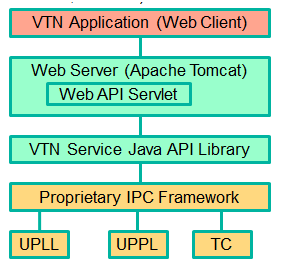

.. _vtn-dev-guide:

Virtual Tenant Network (VTN)
============================

OpenDaylight Virtual Tenant Network (VTN) Overview
--------------------------------------------------

OpenDaylight Virtual Tenant Network (VTN) is an application that
provides multi-tenant virtual network on an SDN controller.

Conventionally, huge investment in the network systems and operating
expenses are needed because the network is configured as a silo for each
department and system. Therefore various network appliances must be
installed for each tenant and those boxes cannot be shared with others.
It is a heavy work to design, implement and operate the entire complex
network.

The uniqueness of VTN is a logical abstraction plane. This enables the
complete separation of logical plane from physical plane. Users can
design and deploy any desired network without knowing the physical
network topology or bandwidth restrictions.

VTN allows the users to define the network with a look and feel of
conventional L2/L3 network. Once the network is designed on VTN, it will
automatically be mapped into underlying physical network, and then
configured on the individual switch leverage SDN control protocol. The
definition of logical plane makes it possible not only to hide the
complexity of the underlying network but also to better manage network
resources. It achieves reducing reconfiguration time of network services
and minimizing network configuration errors. OpenDaylight Virtual Tenant
Network (VTN) is an application that provides multi-tenant virtual
network on an SDN controller. It provides API for creating a common
virtual network irrespective of the physical network.

.. figure:: ./images/vtn/vtn-overview.png
   :alt: VTN Architecture

   VTN Architecture

It is implemented as two major components

-  :ref:`vtn-manager`

-  :ref:`vtn-coordinator`

.. _vtn-manager:

VTN Manager
~~~~~~~~~~~

An OpenDaylight Plugin that interacts with other modules to implement
the components of the VTN model. It also provides a REST interface to
configure VTN components in OpenDaylight. VTN Manager is implemented as
one plugin to the OpenDaylight. This provides a REST interface to
create/update/delete VTN components. The user command in VTN Coordinator
is translated as REST API to VTN Manager by the OpenDaylight Driver
component. In addition to the above mentioned role, it also provides an
implementation to the OpenStack L2 Network Functions API.

Function Outline
^^^^^^^^^^^^^^^^

The table identifies the functions and the interface used by VTN
Components:

+--------------------------+--------------------------+--------------------------+
| Component                | Interface                | Purpose                  |
+==========================+==========================+==========================+
| VTN Manager              | RESTful API              | Configure VTN            |
|                          |                          | Virtualization model     |
|                          |                          | components in            |
|                          |                          | OpenDaylight             |
+--------------------------+--------------------------+--------------------------+
| VTN Manager              | Neutron API              | Handle Networks API from |
|                          | implementation           | OpenStack (Neutron       |
|                          |                          | Interface)               |
+--------------------------+--------------------------+--------------------------+
| VTN Coordinator          | RESTful API              | (1) Uses the RESTful     |
|                          |                          | interface of VTN         |
|                          |                          | Manager and configures   |
|                          |                          | VTN Virtualization       |
|                          |                          | model components in      |
|                          |                          | OpenDaylight.            |
|                          |                          | (2) Handles multiple     |
|                          |                          | OpenDaylight             |
|                          |                          | orchestration.           |
|                          |                          | (3) Provides API to      |
|                          |                          | read the physical        |
|                          |                          | network details. See     |
|                          |                          | `samples <https://wiki   |
|                          |                          | .OpenDaylight.org/view/O |
|                          |                          | penDaylight_Virtual_Tena |
|                          |                          | nt_Network_(VTN):VTN_Coo |
|                          |                          | rdinator:RestApi:L2_Netw |
|                          |                          | ork_Example_Using_VTN_Vi |
|                          |                          | rtualization>`__         |
|                          |                          | for usage.               |
+--------------------------+--------------------------+--------------------------+

Feature Overview
^^^^^^^^^^^^^^^^

There are three features

-  **odl-vtn-manager** provides VTN Manager’s JAVA API.

-  **odl-vtn-manager-rest** provides VTN Manager’s REST API.

-  **odl-vtn-manager-neutron** provides the integration with Neutron
   interface.

REST Conf documentation for VTN Manager, please refer to:
https://nexus.opendaylight.org/content/sites/site/org.opendaylight.vtn/boron/manager.model/apidocs/index.html

For VTN Java API documentation, please refer to:
https://nexus.opendaylight.org/content/sites/site/org.opendaylight.vtn/boron/apidocs/index.html

.. _vtn-coordinator:

VTN Coordinator
~~~~~~~~~~~~~~~

The VTN Coordinator is an external application that provides a REST
interface for an user to use OpenDaylight VTN Virtualization. It
interacts with the VTN Manager plugin to implement the user
configuration. It is also capable of multiple OpenDaylight
orchestration. It realizes VTN provisioning in OpenDaylight instances.
In the OpenDaylight architecture VTN Coordinator is part of the network
application, orchestration and services layer. VTN Coordinator will use
the REST interface exposed by the VTN Manger to realize the virtual
network using OpenDaylight. It uses OpenDaylight APIs (REST) to
construct the virtual network in OpenDaylight instances. It provides
REST APIs for northbound VTN applications and supports virtual networks
spanning across multiple OpenDaylight by coordinating across
OpenDaylight.

VTN Coordinator Components:

-  Transaction Coordinator

-  Unified Provider Physical Layer (UPPL)

-  Unified Provider Logical LAyer (UPLL)

-  OpenDaylight Controller Diver (ODC Driver)

OpenDaylight Virtual Tenant Network (VTN) API Overview
^^^^^^^^^^^^^^^^^^^^^^^^^^^^^^^^^^^^^^^^^^^^^^^^^^^^^^

The VTN API module is a sub component of the VTN Coordinator and
provides the northbound REST API interface for VTN applications. It
consists of two subcomponents:

-  Web Server

-  VTN service Java API Library

   VTN-Coordinator\_api-architechture

Web Server
''''''''''

The Web Server module handles the REST APIs received from the VTN
applications. It translates the REST APIs to the appropriate Java APIs.

The main functions of this module are:

-  Starts via the startup script ``catalina.sh``.

-  VTN Application sends HTTP request to Web server in XML or JSON
   format.

-  Creates a session and acquire a read/write lock.

-  Invokes the VTN Service Java API Library corresponding to the
   specified URI.

-  Returns the response to the VTN Application.

WebServer Class Details
'''''''''''''''''''''''

The list below shows the classes available for Web Server module and
their descriptions:

Init Manager
    It is a singleton class for executing the acquisition of
    configuration information from properties file, log initialization,
    initialization of VTN Service Java API Library. Executed by init()
    of VtnServiceWebAPIServlet.

Configuration Manager
    Maintains the configuration information acquired from properties
    file.

VtnServiceCommonUtil
    Utility class

VtnServiceWebUtil
    Utility class

VtnServiceWebAPIServlet
    Receives HTTP request from VTN Application and calls the method of
    corresponding VtnServiceWebAPIHandler. herits class HttpServlet, and
    overrides doGet(), doPut(), doDelete(), doPost().

VtnServiceWebAPIHandler
    Creates JsonObject(com.google.gson) from HTTP request, and calls
    method of corresponding VtnServiceWebAPIController.

VtnServiceWebAPIController
    Creates RestResource() class and calls UPLL API/UPPL API through
    Java API. the time of calling UPLL API/UPPL API, performs the
    creation/deletion of session, acquisition/release of configuration
    mode, acquisition/release of read lock by TC API through Java API.

Data Converter
    Converts HTTP request to JsonObject and JsonXML to JSON.

VTN Service Java API Library
''''''''''''''''''''''''''''

It provides the Java API library to communicate with the lower layer
modules in the VTN Coordinator. The main functions of this library are:

-  Creates an IPC client session to the lower layer.

-  Converts the request to IPC framework format.

-  Invokes the lower layer API (i.e. UPPL API, UPLL API, TC API).

-  Returns the response from the lower layer to the web server

-  VTN Service Java API Library Class Details

Feature Overview
^^^^^^^^^^^^^^^^

VTN Coordinator doesn’t have Karaf features.

For VTN Coordinator REST API, please refer to:
https://wiki.opendaylight.org/view/OpenDaylight_Virtual_Tenant_Network_%28VTN%29:VTN_Coordinator:RestApi

Usage Examples
~~~~~~~~~~~~~~

-  `L2 Network using Single
   Controller <https://wiki.OpenDaylight.org/view/OpenDaylight_Virtual_Tenant_Network_(VTN):VTN_Coordinator:RestApi:How_to_configure_L2_Network_with_Single_Controller>`__
