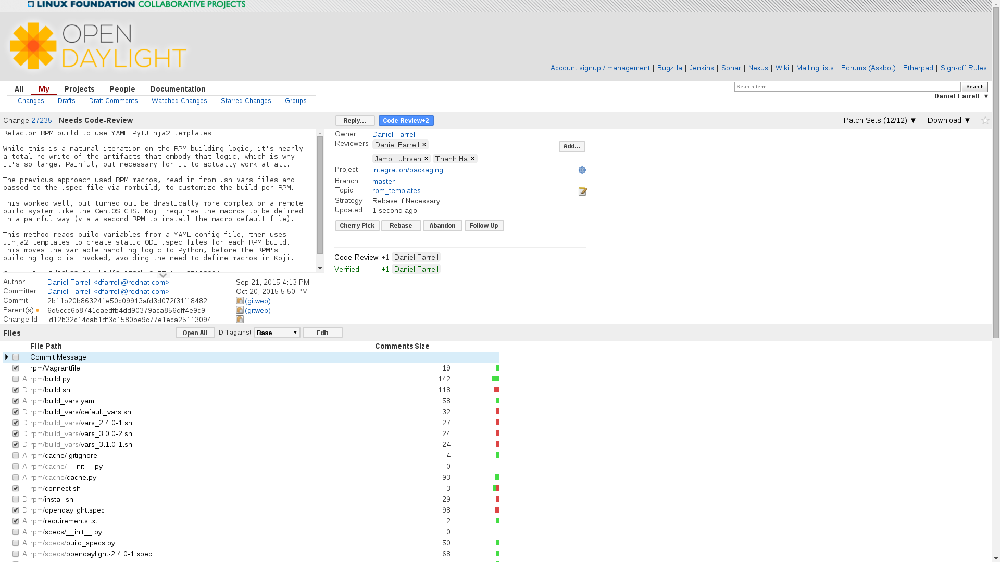
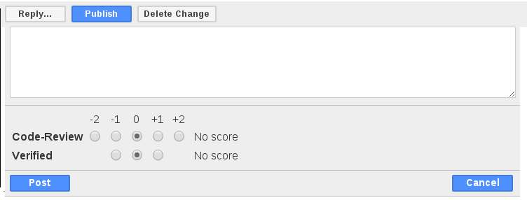
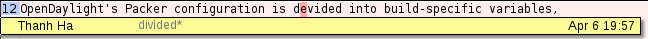
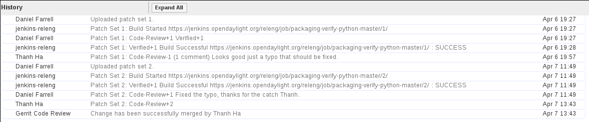
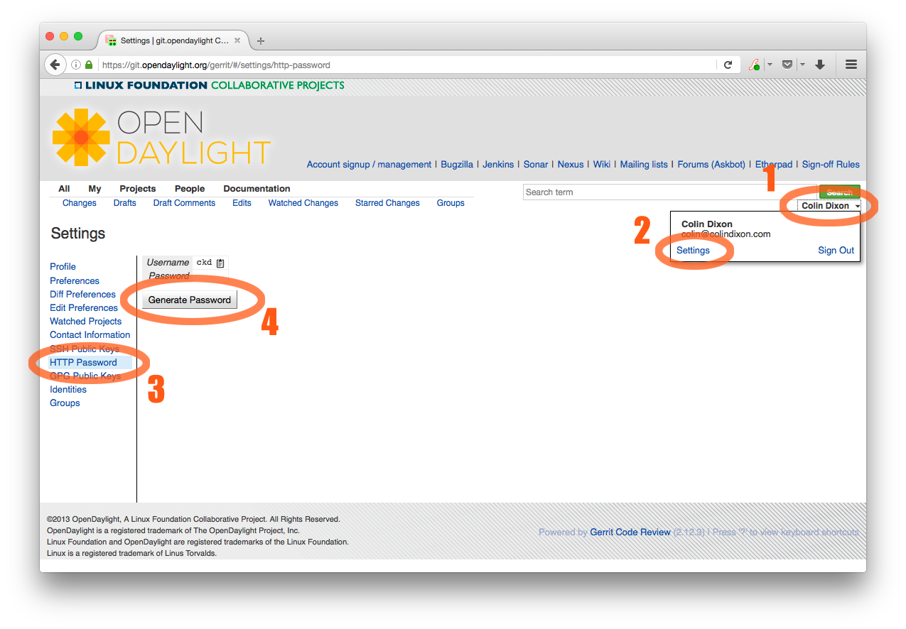

############
Gerrit Guide
############

Overview of Git and Gerrit
==========================

Git is an opensource distributed version control system (dvcs) written
in the C language and originally developed by Linus Torvalds and others
to manage the Linux kernel. In Git, there is no central copy of the
repository. After you have cloned the repository, you have a functioning
copy of the source code with all the branches and tagged releases, in
your local repository.

Gerrit is an opensource web-based collaborative code review tool that
integrates with Git. It was developed at Google by Shawn Pearce. Gerrit
provides a framework for reviewing code commits before they are accepted
into the code base. Changes can be uploaded to Gerrit by any user.
However, the changes are not made a part of the project until a code
review is completed. Gerrit is also a good collaboration tool for
storing the conversations that occur around the code commits.

The OpenDaylight source code is hosted in a repository in Git.
Developers must use Gerrit to commit code to the OpenDaylight
repository.

.. note::

   For more information on Git, see http://git-scm.com/. For more
   information on Gerrit, see https://code.google.com/p/gerrit/.

Prerequisites
=============

Before you get started, you should have:

* an OpenDaylight account (sign up `here
  <https://identity.opendaylight.org/carbon/user-registration/index.jsp?region=region1&item=user_registration_menu>`_)
  See `Creating an OpenDaylight Account`_ below for detailed instructions.
* git installed (see: http://www.git-scm.com/downloads)
* git configured with your name, e-mail address and editor

  .. code-block:: bash

     git config --global user.name "Firstname Lastname"
     git config --global user.email "email@address.com"
     git config --global core.editor "text-editor-name"

  .. note:: Your name and e-mail address (including capitalization) must match what you entered
            when creating your OpenDaylight account.

* an ssh public/private key pair (see the good `Github docs on generating ssh keys
  <https://help.github.com/articles/generating-a-new-ssh-key-and-adding-it-to-the-ssh-agent/>`_)

  * that is registered the OpenDaylight Gerrit server. See `Registering your SSH key with Gerrit`_
    below for detailed instructions.

* git-review installed (see: https://www.mediawiki.org/wiki/Gerrit/git-review#Installation)

Setting up Each Git Repository
==============================

To clone a new repository:

.. code-block:: bash

   git clone https://git.opendaylight.org/gerrit/${project_short_name}

For example to clone the Documentation repository:

.. code-block:: bash

   git clone https://git.opendaylight.org/gerrit/docs

Common Gerrit Tasks
===================

The following sections describe the most common Gerrit tasks you will need to complete while
working with code in OpenDaylight.

Submitting a New Patch
----------------------

#. On your machine, open a shell and switch to the directory with the git repository. Assuming
   you are using the docs repository:

   .. code-block:: bash

      cd docs

#. To remove any dependencies on other files you are working on, check out the appropriate branch:

   .. code-block:: bash

      git checkout ${remote_branch_name}  # will switch to the branch

   .. note:: normally, ``${remote_branch_name}`` should be master, but during a release, the
             master will switch to ``stable/${release_name}``, e.g., ``stable/carbon`` at some
             point. Also, if you are updating an existing release check out that branch.

   .. note:: If you see an error like``error: pathspec 'stable/carbon' did not match any file(s)
             known to git.``, try this command instead:

             .. code-block:: bash

                git checkout -b ${remote_branch_name} origin/${remote_branch_name}

             .. note:: This should only be necessary once.

#. Get a copy of the latest files from the server:

   .. code-block:: bash

      git pull                                      # will get all the changes from the server
      git reset --hard origin/${remote_branch_name} # (optional) will undo any local changes you've
                                                    # (accidentally) made to ${remote_branch_name}

#. Create a new branch for your work:

   .. code-block:: bash

      git checkout -b ${local_branch_name}

   .. note:: Spaces are not allowed in ``${local_branch_name}``.

#. Create new files or edit existing files, as needed.
#. Commit the files you have worked on:

   * If you've created any new files, run:

     .. code-block:: bash

        git add ${filename}

   * To commit existing files you edited, run:

     * ``git commit -as``
     * Your default terminal text editor will open.

       .. note:: The -as options instruct git to commit all of the files you have edited (``-a``)
                 and sign your commit request with your email address and name (``-s``). The
                 sign-off is to indicate that you agree with this statement::

                      Developer's Certificate of Origin 1.1

                         By making a contribution to this project, I certify that:

                         (a) The contribution was created in whole or in part by me and I
                             have the right to submit it under the open source license
                             indicated in the file; or

                         (b) The contribution is based upon previous work that, to the best
                             of my knowledge, is covered under an appropriate open source
                             license and I have the right under that license to submit that
                             work with modifications, whether created in whole or in part
                             by me, under the same open source license (unless I am
                             permitted to submit under a different license), as indicated
                             in the file; or

                         (c) The contribution was provided directly to me by some other
                             person who certified (a), (b) or (c) and I have not modified
                             it.

                         (d) I understand and agree that this project and the contribution
                             are public and that a record of the contribution (including all
                             personal information I submit with it, including my sign-off) is
                             maintained indefinitely and may be redistributed consistent with
                             this project or the open source license(s) involved.

   * Add a brief description of the changes you have made to the beginning of the commit request
     and then save the request.

     .. note:: Writing good git commit messages is important and relatively easy, but it's good to
               familiarize yourself with general guidelines like this `How to Write a Git Commit
               Message Guide <https://chris.beams.io/posts/git-commit/>`_.

     .. important:: We have linters that check for some of the style guides including that the
                    first line of a git commit message is 50 characters or less. So, make sure to
                    follow that one.

#. Submit your files for review:

   * ``git review``
   * You will receive 2 emails from Gerrit Code Review: The first indicating that a build to
     incorporate your changes has started; and the second indicating whether the build was created
     successfully.

#. Determine your patch’s change number:

   * Open either of the emails you received after submitting your files for review.
   * Locate the following line in the terminal: ``To view, visit <patch URL>``

     .. note:: The number at the end of this URL is your patch’s change number. You will need
               this in order to make updates to the patch later.

Updating an Existing Patch
--------------------------

#. On your machine, open a shell and switch to the directory containing the repository:
   ``cd ${repository_name}``, e.g., ``cd docs``
#. Download the patch you want to update: ``git review -d ${change_number}``
#. | (Optional) View information on the latest changes made to that patch:
   | To view the files that were edited, run ``git show``
   | To view a listing of the files that were edited and the number of lines in those files that
     were edited, run ``git show --stat``
#. Make the necessary changes to the patch’s files.
#. Commit your changes:

   #. run ``git commit -a --amend``
   #. Update the current patch description and then save the commit request.

      .. note:: If you feel as though you did enough additional work on the patch that you should
                be mentioned, add your name in the footer with a line like ``Co-Authored-By: First
                Last <email>``.

#. | Submit your files for review:
   | ``git review``

You will receive 2 emails from Gerrit Code Review: the first indicating that a build to incorporate
your changes has started; and the second indicating whether the build was created successfully.

Code Review
===========

All contributions to OpenDaylight Git repositories use Gerrit for code review.

The code review process is meant to provide constructive feedback about a proposed change.
Committers and interested contributors will review the change, give their feedback, propose
revisions and work with the change author through iterations of the patch until it's ready to be
merged.

Feedback is provided and the change is managed via the Gerrit web UI.

   Wide view of a change via the Gerrit web UI

Pre-review
----------

Many times, change authors will want to push changes to Gerrit before they are actually ready for
review. This is a good practice and is encouraged. It has been the experience of Integration/* so
far that pushing early and often tends to reduce the amount of work overall.

.. note:: This is not required and in some projects, not encouraged, but the general idea of making
          sure patches are ready for review when submitted is a good one.

.. note:: While in draft state, Gerrit triggers, e.g., verify Jenkins jobs, won't run by default.
          You can trigger them despite it being a draft by adding ``jenkins-releng`` as a reviewer.
          You may need to do a recheck by replying with a comment containing recheck to trigger the
          jobs after adding the reviewer.

To mark an uploaded change as not ready for attention by committers and interested contributors (in
order of preference), either mark the Gerrit a draft (by adding a ``-D`` to your ``git review``
command), vote -1 on it yourself or modify the commit message with "WIP" ("Work in Progress").

Don't add committers to the Reviewers list for a change while it's in the pre-review state, as it
adds noise to their review queue.

Review
------

Once an author wants a change to be reviewed, they need to take some actions to put it on the radar
of the committers.

If the change is marked as a draft, you'll need to publish it. This can be done from the Gerrit web
UI.

   Gerrit Web UI button to publish a draft change.

Remove your -1 vote if you've marked it with one. If you think the patch is ready to be merged,
vote +1. If there isn't an automated job to test your change and vote +1/-1 for Verified, you'll
need to do as much testing yourself as possible and then manually vote +1 to Verified. You can
also vote +1 for Verified if you've done testing in addition to any automated tests. Describing
the testing you did or didn't do is typically helpful.

   Gerrit voting interface, exposed by the Reply button.

Once the change is published and you've voted for it to be merged, add the people who need to
review/merge the change to the Gerrit Reviewers list. For Integration/Packaging, add all of our
committers (Daniel Farrell, Jamo Luhrsen, Thanh Ha) in addition to any other relevant contributors.
The auto-complete for this Gerrit UI field is somewhat flaky, but typing the full name from the
start typically works.

   Gerrit Reviewers list with Int/Pack committers added

Reviewers will give feedback via Gerrit comments or inline against the diff.

   Gerrit inline feedback about a typo

Updated versions of the proposed change should be pushed as new patchesets to the same Gerrit,
either by the original submitter or other contributors. Amending proposed changes owned by others
while reviewing may be more efficient than documenting the problem, -1ing, waiting for the original
submitter to make the changes, re-reviewing and merging.

Changes can be downloaded for local manipulation and then re-uploaded with updates via git-review.
See `Updating an Existing Patch`_ above. Once you have re-uploaded the patch the Gerrit web UI for
the proposed change will reflect the new patcheset.

   Gerrit history showing a patch update

Reviewers will use the diff between the last time time they gave review and the current patchset
to quickly understand updates, speeding the code review process.

   Gerrit diff menu

Iterative feedback continues until consensus is reached (typically: all active reviewers +1/+2 and
no -1s, definitely no -2s), at least one committer +2s and a committer merges the change.

   Gerrit code review votes

Merge
-----

Once a patch has gotten a +2 from a committer and they have clicked the submit button the project's
merge job should run and publish the project's artifacts to Nexus. Once this is done other projects
will be able to see the results of that patch.

This is particularly important when merging dependent patches across multiple projects. You will
need to wait for the merge job to run on one patch before any patches in other projects depending
on it will successful verify.

Setting up Gerrit
=================

Creating an OpenDaylight Account
--------------------------------

#. Using a Google Chrome or Mozilla Firefox browser, go to
   https://git.opendaylight.org/gerrit

   The main page shows existing Gerrit requests. These are patches that
   have been pushed to the repository and not yet verified, reviewed, and
   merged.

   .. note::

      If you already have an OpenDaylight account, you can click **Sign
      In** in the top right corner of the page and follow the instructions
      to enter the OpenDaylight page.

   .. figure:: images/gerrit-sign-in.jpg
      :alt: Signing in to OpenDaylight account

      Signing in to OpenDaylight account

#. If you do not have an existing OpenDaylight account, click **Account
   signup/management** on the top bar of the main Gerrit page.

   The **WS02 Identity Server** page is displayed.

   .. figure:: images/gerrit-setup.jpg
      :alt: Gerrit Account signup/management link

      Gerrit Account signup/management link

#. In the **WS02 Identity Server** page, click **Sign-up** in the left
   pane.

   There is also an option to authenticate your sign in with OpenID. This
   option is not described in this document.

   .. figure:: images/gerrit-sign-up.jpg
      :alt: Sign-up link for Gerrit account

      Sign-up link for Gerrit account

#. Click on the **Sign-up with User Name/Password** image on the right
   pane to continue to the actual sign-up page.

   .. figure:: images/gerrit-signup-image.jpg
      :alt: Sign-up with User Name/Password Image

      Sign-up with User Name/Password Image

#. Fill out the details in the account creation form and then click
   **Submit**.

   .. figure:: images/gerrit-form-details.jpg
      :alt: Filling out the details

      Filling out the details

You now have an OpenDaylight account that can be used with Gerrit to
pull the OpenDaylight code.

Generating SSH keys for your system
-----------------------------------

You must have SSH keys for your system to register with your Gerrit
account. The method for generating SSH keys is different for different
types of operating systems.

The key you register with Gerrit must be identical to the one you will
use later to pull or edit the code. For example, if you have a
development VM which has a different UID login and keygen than that of
your laptop, the SSH key you generate for the VM is different from the
laptop. If you register the SSH key generated on your VM with Gerrit and
do not reuse it on your laptop when using Git on the laptop, the pull
fails.

.. note::

    For more information on SSH keys for Ubuntu, see
    https://help.ubuntu.com/community/SSH/OpenSSH/Keys. For generating
    SSH keys for Windows, see
    https://help.github.com/articles/generating-ssh-keys.

For a system running Ubuntu operating system, follow the steps below:

#. Run the following command::

      mkdir ~/.ssh
      chmod 700 ~/.ssh
      ssh-keygen -t rsa

#. You are prompted for a location to save the keys, and a passphrase
   for the keys.

   This passphrase protects your private key while it is stored on the hard
   drive. You must use the passphrase to use the keys every time you need
   to login to a key-based system::

      Generating public/private rsa key pair.
      Enter file in which to save the key (/home/b/.ssh/id_rsa):
      Enter passphrase (empty for no passphrase):
      Enter same passphrase again:
      Your identification has been saved in /home/b/.ssh/id_rsa.
      Your public key has been saved in /home/b/.ssh/id_rsa.pub.

Your public key is now available as **.ssh/id\_rsa.pub** in your home
folder.

Registering your SSH key with Gerrit
------------------------------------

#. Using a Google Chrome or Mozilla Firefox browser, go to
   https://git.opendaylight.org/gerrit.

#. Click **Sign In** to access the OpenDaylight repository.

   .. figure:: images/gerrit-sign-in.jpg
      :alt: Signin in to OpenDaylight repository

      Signin in to OpenDaylight repository

#. Click your name in the top right corner of the window and then click
   **Settings**.

   The **Settings** page is displayed.

   .. figure:: images/gerrit-settings.jpg
      :alt: Settings page for your Gerrit account

      Settings page for your Gerrit account

#. Click **SSH Public Keys** under **Settings**.

#. Click **Add Key**.

#. In the **Add SSH Public Key** text box, paste the contents of your
   **id\_rsa.pub** file and then click **Add**.

   .. figure:: images/gerrit-ssh-keys.jpg
      :alt: Adding your SSH key

      Adding your SSH key

To verify your SSH key is working correctly, try using an SSH client to
connect to Gerrit’s SSHD port::

    $ ssh -p 29418 <sshusername>@git.opendaylight.org
    Enter passphrase for key '/home/cisco/.ssh/id_rsa':
    ****    Welcome to Gerrit Code Review    ****
    Hi <user>, you have successfully connected over SSH.
    Unfortunately, interactive shells are disabled.
    To clone a hosted Git repository, use: git clone ssh://<user>@git.opendaylight.org:29418/REPOSITORY_NAME.git
    Connection to git.opendaylight.org closed.

You can now proceed to either Pulling, Hacking, and Pushing the Code
from the CLI or Pulling, Hacking, and Pushing the Code from Eclipse
depending on your implementation.

Using https to push to Gerrit
=============================

It is highly recommended to use ssh to push to Gerrit. In the event that you cannot use ssh, e.g.,
a corporate firewall is blocking blocking you, then falling back to pushing via https should work.

Gerrit does not allow you to use your regular account credentials when pushing
via https. Instead it requires you to first generate a http password via the Gerrit
Web UI and use that as the password when pushing via https.

   Setting up an https password to push using https instead of ssh.

To do this:

#. navigate to https://git.opendaylight.org/gerrit/#/settings/http-password
   (Steps 1, 2 and 3 in the image above.)
#. click the **Generate Password** button.

Gerrit will then generate a random password which you will need to use as your
password when using Git to push code to Gerrit via https.

To push using git over https, do the following

.. code-block:: bash

   git remote add https https://git.opendaylight.org/gerrit/p/${repo_name}  # adds an https version of the git server
   git push https HEAD:refs/for/${branch_name}                        # will ask you for your username and password
                                                                      #   ${branch_name} should usually be master,
                                                                      #   but can be stable/carbon or something else

Signing Gerrit Commits
======================

1. Generate your GPG key.

   The following instructions work on a Mac, but the general approach
   should be the same on other OSes.

   .. code-block:: bash

      brew install gpg2  # If you don't have homebrew, get that here: http://brew.sh/
      gpg2 --gen-key
      # pick 1 for "RSA and RSA"
      # enter 4096 to creat a 4096-bit key
      # enter an expiration time, I picked 2y for 2 years
      # enter y to accept the expiration time
      # pick O or Q to accept your name/email/comment
      # enter a pass phrase twice. it seems like backspace doesn't work, so type carefully
      gpg2 --fingerprint
      # you'll get something like this:
      # spectre:~ ckd$ gpg2 --fingerprint
      # /Users/ckd/.gnupg/pubring.gpg
      # -----------------------------
      # pub   4096R/F566C9B1 2015-04-06 [expires: 2017-04-05]
      #       Key fingerprint = 7C37 02AC D651 1FA7 9209  48D3 5DD5 0C4B F566 C9B1
      # uid       [ultimate] Colin Dixon <colin at colindixon.com>
      # sub   4096R/DC1497E1 2015-04-06 [expires: 2017-04-05]
      # you're looking for the part after 4096R, which is your key ID
      gpg2 --send-keys $KEY_ID
      # in the above example, the $KEY_ID would be F566C9B1
      # you should see output like this:
      # gpg: sending key F566C9B1 to hkp server keys.gnupg.net

   If you're trying to participate in an OpenDaylight keysigning, then
   send the output of ``gpg2 --fingerprint $KEY_ID`` to
   keysigning@opendaylight.org

   .. code-block:: bash

      gpg2 --fingerprint $KEY_ID
      # in the above example, the $KEY_ID would be F566C9B1
      # in my case, the output was:
      # pub   4096R/F566C9B1 2015-04-06 [expires: 2017-04-05]
      #       Key fingerprint = 7C37 02AC D651 1FA7 9209  48D3 5DD5 0C4B F566 C9B1
      # uid       [ultimate] Colin Dixon <colin at colindixon.com>
      # sub   4096R/DC1497E1 2015-04-06 [expires: 2017-04-05]

2. Install gpg, instead of or addition to gpg2. It appears as though
   gpg2 has annoying things that it does when asking for your
   passphrase, which I haven't debugged yet.

   .. note:: you can tell Git to use gpg by doing:
     ``git config --global gpg.program gpg2``
     but that then will seem to struggle asking for your
     passphrase unless you have your gpg-agent set up right.

3. Add you GPG to Gerrit

   a. Run the following at the CLI:

      .. code-block:: bash

         gpg --export -a $FINGER_PRINT
         # e.g., gpg --export -a F566C9B1
         # in my case the output looked like:
         # -----BEGIN PGP PUBLIC KEY BLOCK-----
         # Version: GnuPG v2
         #
         # mQINBFUisGABEAC/DkcjNUhxQkRLdfbfdlq9NlfDusWri0cXLVz4YN1cTUTF5HiW
         # ...
         # gJT+FwDvCGgaE+JGlmXgjv0WSd4f9cNXkgYqfb6mpji0F3TF2HXXiVPqbwJ1V3I2
         # NA+l+/koCW0aMReK
         # =A/ql
         # -----END PGP PUBLIC KEY BLOCK-----

   b. Browse to https://git.opendaylight.org/gerrit/#/settings/gpg-keys
   c. Click Add Key...
   d. Copy the output from the above command, paste it into the box,
      and click Add

4. Set up your Git to sign commits and push signatures

   .. code-block:: bash

      git config commit.gpgsign true
      git config push.gpgsign true
      git config user.signingkey $FINGER_PRINT
      # e.g., git config user.signingkey F566C9B1

   .. note:: you can do this instead with ``git commit -S``
      You can use ``git commit -S`` and ``git push --signed``
      on the CLI instead of configuring it in config if you
      want to control which commits use your signature.

5. Commit and push a change

   a. change a file
   b. ``git commit -asm "test commit"``

      .. note:: this should result in Git asking you for your passphrase

   c. ``git review``

      .. note:: this should result in Git asking you for your passphrase

      .. note:: annoyingly, the presence of a gpgp signature or pushing
        of a gpg signature isn't recognized as a "change" by
        Gerrit, so if you forget to do either, you need to change
        something about the commit to get Gerrit to accept the
        patch again. Slightly tweaking the commit message is a
        good way.

      .. note:: this assumes you have git review set up and push.gpgsign
        set to true. Otherwise:

        ``git push --signed gerrit HEAD:refs/for/master``

        .. note:: this assumes you have your gerrit remote set up, if
            not it's something like:
            ``ssh://ckd@git.opendaylight.org:29418/<repo>.git``
            where repo is something like docs or controller

6. Verify that your commit is signed by going to the change in Gerrit
   and checking for a green check (instead of a blue ?) next to your
   name.

Setting up gpg-agent on a Mac
-----------------------------

#. Install ``gpg-agent`` and ``pinentry-mac`` using ``brew``::

      brew install gpg-agent pinentry-mac

#. Edit your ``~/.gnupg/gpg.conf`` contain the line::

      use-agent

#. Edit your ``~/.gnupg/gpg-agent.conf`` to something like::

      use-standard-socket
      enable-ssh-support
      default-cache-ttl 600
      max-cache-ttl 7200
      pinentry-program /usr/local/bin/pinentry-mac

#. Edit your ``.bash_profile`` or equivalent file to contain the
   following:

   .. code-block:: bash

      [ -f ~/.gpg-agent-info ] && source ~/.gpg-agent-info
      if [ -S "${GPG_AGENT_INFO%%:*}" ]; then
        export GPG_AGENT_INFO
      else
        eval $( gpg-agent --daemon --write-env-file ~/.gpg-agent-info )
      fi

#. Kill any stray ``gpg-agent`` daemons running::

      sudo killall gpg-agent

#. Restart your terminal (or log in and out) to reload the your
   ``.bash_profile`` or equivalent file

#. The next time a Git operation makes a call to gpg, it should use
   your gpg-agent to run a GUI window to ask for your passphrase and
   give you an option to save your passphrase in the keychain.

   .. figure:: images/pinentry-mac.png

.. report-button::
   :text: Give Feedback
