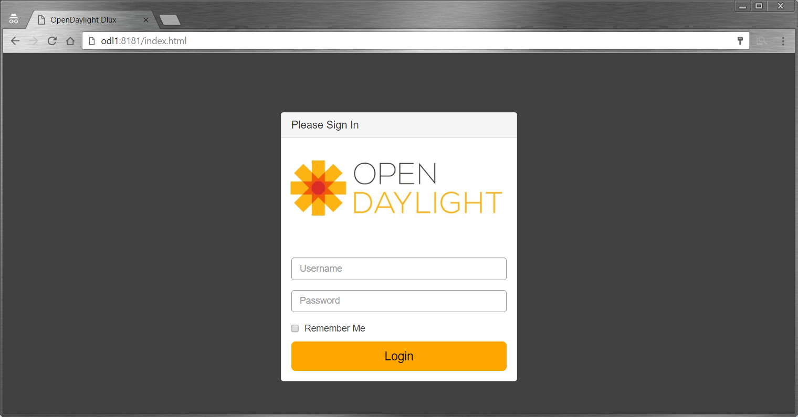
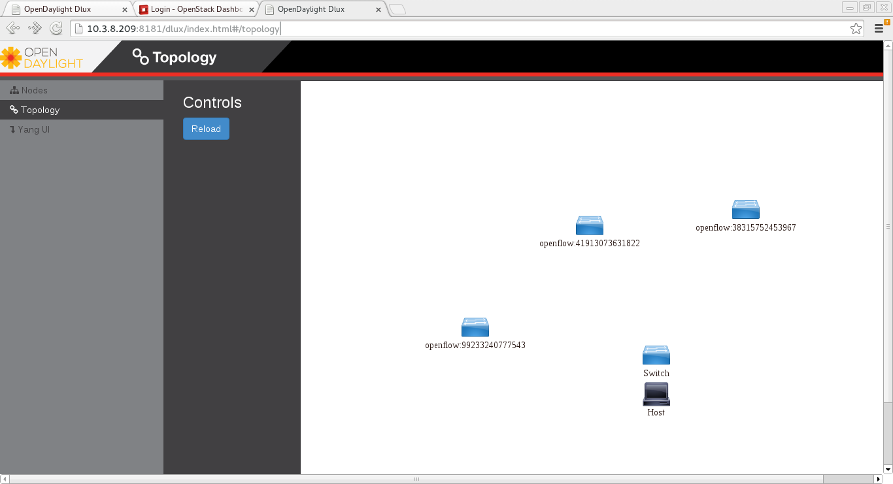

OpenStack with NetVirt
======================
.. contents:: Table of Contents
      :depth: 2

Installing OpenDaylight
-----------------------

**Prerequisites**: OpenDaylight requires Java 1.8.0.

* On the control host, `Download
  the latest OpenDaylight release <ODL_Downloads_>` (at the time of writing,
  this is Boron SR1)
* Uncompress it as root, and start OpenDaylight (you can start OpenDaylight
  by running karaf directly, but exiting from the shell will shut it down):

.. code-block:: bash

    tar xvfz distribution-karaf-0.5.1-Boron-SR1.tar.gz
    cd distribution-karaf-0.5.1-Boron-SR1
    ./bin/start # Start OpenDaylight as a server process

* Connect to the Karaf shell, and install the odl-netvirt-openstack bundle,
  dlux and their dependencies:

.. code-block:: bash

    ./bin/client # Connect to OpenDaylight with the client
    opendaylight-user@root> feature:install odl-netvirt-openstack odl-dlux-ui odl-mdsal-apidocs

* If everything is installed correctly, you should now be able to log in to
  the dlux interface on http://$CONTROL_HOST:8181/index.html - the
  default username and password is "admin/admin" (see screenshot below)

Ensuring OpenStack network state is clean
-----------------------------------------

When using OpenDaylight as the Neutron back-end, ODL expects to be the only
source of truth for Neutron configurations. Because of this, it is
necessary to remove existing OpenStack configurations to
give OpenDaylight a clean slate.

* Delete instances

.. code-block:: bash

    nova list
    nova delete <instance names>

* Remove link from subnets to routers

.. code-block:: bash

    neutron subnet-list
    neutron router-list
    neutron router-port-list <router name>
    neutron router-interface-delete <router name> <subnet ID or name>

* Delete subnets, nets, routers

.. code-block:: bash

    neutron subnet-delete <subnet name>
    neutron net-list
    neutron net-delete <net name>
    neutron router-delete <router name>

* Check that all ports have been cleared - at this point, this should be an
  empty list

.. code-block:: bash

    neutron port-list

Ensure Neutron is stopped
-------------------------

While Neutron is managing the OVS instances on compute and control nodes,
OpenDaylight and Neutron can be in conflict. To prevent issues, we turn off
Neutron server on the network controller, and Neutron's Open vSwitch agents
on all hosts.

* Turn off neutron-server on control node

.. code-block:: bash

    systemctl stop neutron-server
    systemctl stop neutron-l3-agent

* On each node in the cluster, shut down and disable Neutron's agent services to ensure that they do not restart after a reboot:

.. code-block:: bash

    systemctl stop neutron-openvswitch-agent
    systemctl disable neutron-openvswitch-agent
    systemctl stop neutron-l3-agent
    systemctl disable neutron-l3-agent

Configuring Open vSwitch to be managed by OpenDaylight
------------------------------------------------------

On each host (both compute and control nodes) we will clear the pre-existing
Open vSwitch config and set OpenDaylight to manage the switch:

* Stop the Open vSwitch service, and clear existing OVSDB (ODL expects to
  manage vSwitches completely)

.. code-block:: bash

    systemctl stop openvswitch
    rm -rf /var/log/openvswitch/*
    rm -rf /etc/openvswitch/conf.db
    systemctl start openvswitch

* At this stage, your Open vSwitch configuration should be empty:

.. code-block:: bash

    [root@odl-compute2 ~]# ovs-vsctl show
    9f3b38cb-eefc-4bc7-828b-084b1f66fbfd
        ovs_version: "2.5.1"

* Set OpenDaylight as the manager on all nodes:

.. code-block:: bash

    ovs-vsctl set-manager tcp:${CONTROL_HOST}:6640

* Set the IP to be used for VxLAN connectivity on all nodes.
  This IP must correspond to an actual linux interface on each machine.

.. code-block:: bash

    sudo ovs-vsctl set Open_vSwitch . other_config:local_ip=<ip>

* You should now see a new section in your Open vSwitch configuration
  showing that you are connected to the OpenDaylight server via OVSDB, 
  and OpenDaylight will automatically create a br-int bridge that is 
  connected via OpenFlow to the controller:

.. code-block:: bash
   :emphasize-lines: 4,6-7
    [root@odl-compute2 ~]# ovs-vsctl show
    9f3b38cb-eefc-4bc7-828b-084b1f66fbfd
        Manager "tcp:172.16.21.56:6640"
            is_connected: true
        Bridge br-int
            Controller "tcp:172.16.21.56:6633"
                is_connected: true
            fail_mode: secure
            Port br-int
                Interface br-int
        ovs_version: "2.5.1"

    [root@odl-compute2 ~]# ovs-vsctl get Open_vSwitch . other_config
    {local_ip="10.0.42.161"}

* (BUG WORKAROUND) If SELinux is enabled, you may not have a security
  context in place which allows Open vSwitch remote administration. If you
  do not see the result above (specifically, if you do not see
  "is_connected: true" in the Manager section or in the Controller section), 
  set SELinux to Permissive   mode on all nodes and ensure it stays that way after boot:
  There might also be iptables restrictions - if so the relevant ports should be opened (6640, 6653).

.. code-block:: bash

    setenforce 0
    sed -i -e 's/SELINUX=enforcing/SELINUX=permissive/g' /etc/selinux/config

* Make sure all nodes, including the control node, are connected to
  OpenDaylight
* If you reload DLUX, you should now see that all of your Open vSwitch nodes
  are now connected to OpenDaylight

* If something has gone wrong, check ``data/log/karaf.log`` under
  the OpenDaylight distribution directory. If you do not see any interesting
  log entries, set logging for netvirt to TRACE level inside Karaf and try again:

.. code-block:: bash

    log:set TRACE netvirt

Configuring Neutron to use OpenDaylight
---------------------------------------

Once you have configured the vSwitches to connect to OpenDaylight, you can
now ensure that OpenStack Neutron is using OpenDaylight.

This requires the neutron networking-odl module to be installed.
``pip install networking-odl`` # TODO is this correct?

First, ensure that port 8080 (which will be used by OpenDaylight to listen
for REST calls) is available. By default, swift-proxy-service listens on the
same port, and you may need to move it (to another port or another host), or
disable that service. It can be moved to a different port (e.g. 8081) by editing
``/etc/swift/proxy-server.conf`` and ``/etc/cinder/cinder.conf``, 
modifying iptables appropriately, and restarting swift-proxy-service.
Alternatively, ODL can be configured to listen on a different port, 
by modifying the ``jetty.port`` property value in ``etc/jetty.conf``.

.. code-block:: bash

    <Set name="port">
        <Property name="jetty.port" default="8080" />
    </Set>

* Configure Neutron to use OpenDaylight's ML2 driver:

.. code-block:: bash

    crudini --set /etc/neutron/plugins/ml2/ml2_conf.ini ml2 mechanism_drivers opendaylight
    crudini --set /etc/neutron/plugins/ml2/ml2_conf.ini ml2 tenant_network_types vxlan

    cat <<EOT>> /etc/neutron/plugins/ml2/ml2_conf.ini
    [ml2_odl]
    url = http://${CONTROL_HOST}:8080/controller/nb/v2/neutron
    password = admin
    username = admin
    EOT

* Configure Neutron to use OpenDaylight's odl-router service plugin for L3 connectivity:

.. code-block:: bash
    crudini --set /etc/neutron/plugins/neutron.conf DEFAULT service_plugins odl-router

* Configure Neutron DHCP agent to provide metadata services:

.. code-block:: bash
    crudini --set /etc/neutron/plugins/dhcp_agent.ini DEFAULT force_metadata True

* Reset Neutron's ML2 database

.. code-block:: bash

    mysql -e "drop database if exists neutron_ml2;"
    mysql -e "create database neutron_ml2 character set utf8;"
    mysql -e "grant all on neutron_ml2.* to 'neutron'@'%';"
    neutron-db-manage --config-file /usr/share/neutron/neutron-dist.conf --config-file /etc/neutron/neutron.conf \
    --config-file /etc/neutron/plugin.ini upgrade head

* Restart neutron-server:

.. code-block:: bash

    systemctl start neutron-server

Verifying it works
------------------

* Verify that OpenDaylight's ML2 interface is working:

.. code-block:: bash

    curl -u admin:admin http://${CONTROL_HOST}:8080/controller/nb/v2/neutron/networks

    {
       "networks" : [ ]
    }

If this does not work or gives an error, check Neutron's log file in
``/var/log/neutron/server.log``. Error messages here should give
some clue as to what the problem is in the connection with OpenDaylight

* Create a net, subnet, router, connect ports, and start an instance using
  the Neutron CLI:

.. code-block:: bash

    neutron router-create router1
    neutron net-create private
    neutron subnet-create private --name=private_subnet 10.10.5.0/24
    neutron router-interface-add router1 private_subnet
    nova boot --flavor <flavor> --image <image id> --nic net-id=<network id> test1
    nova boot --flavor <flavor> --image <image id> --nic net-id=<network id> test2

At this point, you have confirmed that OpenDaylight is creating network
end-points for instances on your network and managing traffic to them.

Congratulations! You're done!

Adding an external network for floating IP connectivity
-------------------------------------------------------

* In order to configure external network connectivity, we need to create an external network.
  This external network must be linked to a physical port on the machine, which will provide
  connectivity to an external gateway.

.. code-block:: bash

    sudo ovs-vsctl set Open_vSwitch . other_config:provider_mappings=physnet1:eth1
    neutron net-create public-net -- --router:external --is-default --provider:network_type=flat --provider:physical_network=physnet1
    neutron subnet-create --allocation-pool start=10.10.10.2,end=10.10.10.254 --gateway 10.10.10.1 --name public-subnet public-net 10.10.0.0/16 -- --enable_dhcp=False
    neutron router-gateway-set router1 public-net

    neutron floatingip-create public-net
    nova floating-ip-associate test1 <floating_ip>

Loading OpenDaylight with devstack
----------------------------------

* The easiest way to load and OpenStack setup using OpenDaylight is by using devstack.
  The following lines need to be added to your local.conf:
  More details on using devstack can be found in the following links:
  devstack: `http://docs.openstack.org/developer/devstack/guides/single-machine.html`_
  devstack networking-odl: `https://github.com/openstack/networking-odl/blob/master/devstack/README.rst`_

.. code-block:: bash

   enable_plugin networking-odl http://git.openstack.org/openstack/networking-odl <branch>
   ODL_MODE=allinone
   Q_ML2_PLUGIN_MECHANISM_DRIVERS=opendaylight,logger
   ODL_GATE_SERVICE_PROVIDER=vpnservice
   disable_service q-l3
   ML2_L3_PLUGIN=odl-router
   ODL_PROVIDER_MAPPINGS=physnet1:eth1

Troubleshooting
---------------

* TODO DHCP Issues - VM isn't receiving an IP address via DHCP:
  Check if the DHCP requests are reaching the qdhcp agent:

  * Access VM console:
    * Using VNC: nova get-vnc-console <vm> novnc
    * View log only: nova console-log <vm>
.. code-block:: bash

   udhcpc (v1.20.1) started
   Sending discover...
   Sending select for 10.0.123.3...
   Lease of 10.0.123.3 obtained, lease time 86400

FIXME - end code block
   * OpenStack controller:
.. code-block:: bash

    sudo ip netns
    sudo ip netns exec qdhcp-xxxxx ifconfig
    sudo ip netns exec qdhcp-xxxxx tcpdump -nei tapxxxxx

  * Trigger DHCP request VM:
    sudo ifdown eth0 ; sudo ifup eth0

  * If the requests aren't reaching qdhcp:
    * Verify VxLAN tunnels exist between compute and control nodes.
    * Run the following commands to debug the OVS processing of the DHCP request packet:
    * ovs-ofctl -OOpenFlow13 dump-ports-desc br-int # retrieve VMs ofport and MAC
    * ovs-appctl ofproto/trace br-int in_port=<ofport>,dl_src=<mac>,dl_dst=ff:ff:ff:ff:ff:ff,udp,ip_src=0.0.0.0,ip_dst=255.255.255.255 | grep "Rule\|action"

        root@devstack:~# ovs-appctl ofproto/trace br-int in_port=1,dl_src=fe:16:3e:33:8b:d8,dl_dst=ff:ff:ff:ff:ff:ff,udp,ip_src=0.0.0.0,ip_dst=255.255.255.255 | grep "Rule\|action"
            Rule: table=0 cookie=0x8000000 priority=1,in_port=1
            OpenFlow actions=write_metadata:0x20000000001/0xffffff0000000001,goto_table:17
                Rule: table=17 cookie=0x8000001 priority=5,metadata=0x20000000000/0xffffff0000000000
                OpenFlow actions=write_metadata:0xc0000200000222e2/0xfffffffffffffffe,goto_table:19
                    Rule: table=19 cookie=0x1080000 priority=0
                    OpenFlow actions=resubmit(,17)
                        Rule: table=17 cookie=0x8040000 priority=6,metadata=0xc000020000000000/0xffffff0000000000
                        OpenFlow actions=write_metadata:0xe00002138a000000/0xfffffffffffffffe,goto_table:50
                            Rule: table=50 cookie=0x8050000 priority=0
                            OpenFlow actions=CONTROLLER:65535,goto_table:51
                                Rule: table=51 cookie=0x8030000 priority=0
                                OpenFlow actions=goto_table:52
                                    Rule: table=52 cookie=0x870138a priority=5,metadata=0x138a000001/0xffff000001
                                    OpenFlow actions=write_actions(group:210003)
            Datapath actions: drop

    * Note that ofproto/trace does not fully support groups - so a dump-groups might be needed as well:
        sudo ovs-ofctl -OOpenFlow13 dump-groups br-int | grep 'group_id=210003'
            group_id=210003,type=all

  * If the requests are reaching qdhcp, but the response isn't arriving to the VM:

* TODO Floating IP Issues - VM can't be reached via the floating IP address:
.. code-block:: bash

    TODO

* Links: 
    ODL_Pipeline_
    <Add links to other docs, pipeline docs here>

.. _ODL_Downloads: https://www.opendaylight.org/software/downloads
.. _ODL_Pipeline: https://docs.google.com/presentation/d/15h4ZjPxblI5Pz9VWIYnzfyRcQrXYxA1uUoqJsgA53KM
