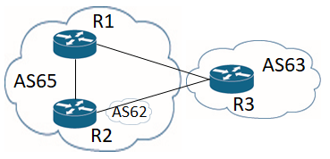
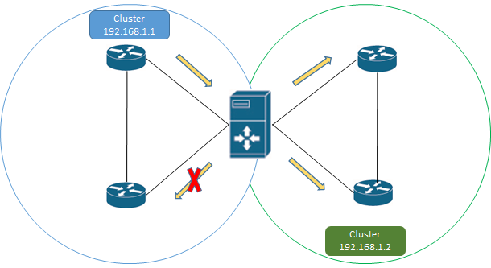

.. _bgp-user-guide-bgp-peering:

BGP Peering
===========
To exchange routing information between two BGP systems (peers), it is required to configure a peering on both BGP speakers first.
This mean that each BGP speaker has a white list of neighbors, representing remote peers, with which the peering is allowed.
The TCP connection is established between two peers and they exchange messages to open and confirm the connection parameters followed by routes exchange.

Here is a sample basic neighbor configuration:

**URL:** ``/restconf/config/openconfig-network-instance:network-instances/network-instance/global-bgp/openconfig-network-instance:protocols/protocol/openconfig-policy-types:BGP/bgp-example/bgp/neighbors``

**Method:** ``POST``

**Content-Type:** ``application/xml``

**Request Body:**

.. code-block:: xml
   :linenos:
   :emphasize-lines: 2,5,6,11,12,17,19

   <neighbor xmlns="urn:opendaylight:params:xml:ns:yang:bgp:openconfig-extensions">
       <neighbor-address>192.0.2.1</neighbor-address>
       <timers>
           <config>
               <hold-time>90</hold-time>
               <connect-retry>10</connect-retry>
           </config>
       </timers>
       <transport>
           <config>
               <remote-port>179</remote-port>
               <passive-mode>false</passive-mode>
               <!--<local-address>192.0.2.5</local-address>-->
           </config>
       </transport>
       <config>
           <peer-type>INTERNAL</peer-type>
       </config>
       <afi-safis>
           ...
       </afi-safis>
   </neighbor>

@line 2: IP address of the remote BGP peer. Also serves as an unique identifier of a neighbor in a list of neighbors.

@line 5: Proposed number of seconds for value of the Hold Timer. Default value is **90**.

@line 6: Time interval in seconds between attempts to establish session with the peer. Effective in active mode only. Default value is **30**.

@line 11: Remote port number to which the local BGP is connecting. Effective in active mode only. Default value **179**.

@line 12: Wait for peers to issue requests to open a BGP session, rather than initiating sessions from the local router. Default value is **false**.

@line 13: Optional Local IP (either IPv4 or IPv6) address used to establish connections to the remote peer. Effective in active mode only.

@line 17: Explicitly designate the peer as internal or external. Default value is **INTERNAL**.

@line 19: Enable families.

-----

Once the remote peer is connected and it advertised routes to local BGP system, routes are stored in peer's RIBs.
The RIBs can be checked via REST:

**URL:** ``/restconf/operational/bgp-rib:bgp-rib/rib/bgp-example/peer/bgp:%2F%2F192.0.2.1``

**Method:** ``GET``

**Response Body:**

.. code-block:: xml
   :linenos:
   :emphasize-lines: 8,13,35,40,62,66

   <peer xmlns="urn:opendaylight:params:xml:ns:yang:bgp-rib">
       <peer-id>bgp://192.0.2.1</peer-id>
       <supported-tables>
           <afi xmlns:x="urn:opendaylight:params:xml:ns:yang:bgp-types">x:ipv4-address-family</afi>
           <safi xmlns:x="urn:opendaylight:params:xml:ns:yang:bgp-types">x:unicast-subsequent-address-family</safi>
       </supported-tables>
       <peer-role>ibgp</peer-role>
       <adj-rib-in>
           <tables>
               <afi xmlns:x="urn:opendaylight:params:xml:ns:yang:bgp-types">x:ipv4-address-family</afi>
               <safi xmlns:x="urn:opendaylight:params:xml:ns:yang:bgp-types">x:unicast-subsequent-address-family</safi>
               <ipv4-routes xmlns="urn:opendaylight:params:xml:ns:yang:bgp-inet">
                   <ipv4-route>
                       <path-id>0</path-id>
                       <prefix>10.0.0.10/32</prefix>
                       <attributes>
                           <as-path></as-path>
                           <origin>
                               <value>igp</value>
                           </origin>
                           <local-pref>
                               <pref>100</pref>
                           </local-pref>
                           <ipv4-next-hop>
                               <global>10.10.1.1</global>
                           </ipv4-next-hop>
                       </attributes>
                   </ipv4-route>
               </ipv4-routes>
               <attributes>
                   <uptodate>true</uptodate>
               </attributes>
           </tables>
       </adj-rib-in>
       <effective-rib-in>
           <tables>
               <afi xmlns:x="urn:opendaylight:params:xml:ns:yang:bgp-types">x:ipv4-address-family</afi>
               <safi xmlns:x="urn:opendaylight:params:xml:ns:yang:bgp-types">x:unicast-subsequent-address-family</safi>
               <ipv4-routes xmlns="urn:opendaylight:params:xml:ns:yang:bgp-inet">
                   <ipv4-route>
                       <path-id>0</path-id>
                       <prefix>10.0.0.10/32</prefix>
                       <attributes>
                           <as-path></as-path>
                           <origin>
                               <value>igp</value>
                           </origin>
                           <local-pref>
                               <pref>100</pref>
                           </local-pref>
                           <ipv4-next-hop>
                               <global>10.10.1.1</global>
                           </ipv4-next-hop>
                       </attributes>
                   </ipv4-route>
               </ipv4-routes>
               <attributes>
                   <uptodate>true</uptodate>
               </attributes>
           </tables>
       </effective-rib-in>
       <adj-rib-out>
           <tables>
               <afi xmlns:x="urn:opendaylight:params:xml:ns:yang:bgp-types">x:ipv4-address-family</afi>
               <safi xmlns:x="urn:opendaylight:params:xml:ns:yang:bgp-types">x:unicast-subsequent-address-family</safi>
               <ipv4-routes xmlns="urn:opendaylight:params:xml:ns:yang:bgp-inet"></ipv4-routes>
               <attributes></attributes>
           </tables>
       </adj-rib-out>
   </peer>

@line 8: **Adj-RIB-In** - Per-peer RIB, which contains unprocessed routes that has been advertised to local BGP speaker by the remote peer.

@line 13: Here is the reported route with destination *10.0.0.10/32* in Adj-RIB-In.

@line 35: **Effective-RIB-In** - Per-peer RIB, which contains processed routes as a result of applying inbound policy to Adj-RIB-In routes.

@line 40: Here is the reported route with destination *10.0.0.10/32*, same as in Adj-RIB-In, as it was not touched by import policy.

@line 62: **Adj-RIB-Out** - Per-peer RIB, which contains routes for advertisement to the peer by means of the local speaker's UPDATE message.

@line 66: The peer's Adj-RIB-Out is empty as there are no routes to be advertise from local BGP speaker.

-----

Also the same route should appeared in Loc-RIB now:

**URL:** ``/restconf/operational/bgp-rib:bgp-rib/rib/bgp-example/loc-rib/tables/bgp-types:ipv4-address-family/bgp-types:unicast-subsequent-address-family/ipv4-routes``

**Method:** ``GET``

**Response Body:**

.. code-block:: xml
   :linenos:
   :emphasize-lines: 4,6,8,11,14

   <ipv4-routes xmlns="urn:opendaylight:params:xml:ns:yang:bgp-inet">
       <ipv4-route>
           <path-id>0</path-id>
           <prefix>10.0.0.10/32</prefix>
           <attributes>
               <as-path></as-path>
               <origin>
                   <value>igp</value>
               </origin>
               <local-pref>
                   <pref>100</pref>
               </local-pref>
               <ipv4-next-hop>
                   <global>10.10.1.1</global>
               </ipv4-next-hop>
           </attributes>
       </ipv4-route>
   </ipv4-routes>

@line 4: **Destination** - IPv4 Prefix Address.

@line 6: **AS_PATH** - mandatory attribute, contains a list of the autonomous system numbers through that routing information has traversed.

@line 8: **ORIGIN** - mandatory attribute, indicates an origin of the route - **ibgp**, **egp**, **incomplete**.

@line 11: **LOCAL_PREF** - indicates a degree of preference for external routes, higher value is preferred.

@line 14: **NEXT_HOP** - mandatory attribute, defines IP address of the router that should be used as the next hop to the destination.

-----

There are much more attributes that may be carried along with the destination:

**BGP-4 Path Attributes**

* **MULTI_EXIT_DISC** (MED)
   Optional attribute, to be used to discriminate among multiple exit/entry points on external links, lower number is preferred.

   .. code-block:: xml

      <multi-exit-disc>
       <med>0</med>
      </multi-exit-disc>

* **ATOMIC_AGGREGATE**
   Indicates whether AS_SET was excluded from AS_PATH due to routes aggregation.

   .. code-block:: xml

      <atomic-aggregate/>

* **AGGREGATOR**
   Optional attribute, contains AS number and IP address of a BGP speaker which performed routes aggregation.

   .. code-block:: xml

      <aggregator>
          <as-number>65000</as-number>
          <network-address>192.0.2.2</network-address>
      </aggregator>

* **Unrecognised**
   Optional attribute, used to store optional attributes, unrecognized by a local BGP speaker.

   .. code-block:: xml

      <unrecognized-attributes>
          <partial>true</partial>
          <transitive>true</transitive>
          <type>101</type>
          <value>0101010101010101</value>
      </unrecognized-attributes>

**Route Reflector Attributes**

* **ORIGINATOR_ID**
   Optional attribute, carries BGP Identifier of the originator of the route.

   .. code-block:: xml

      <originator-id>
          <originator>41.41.41.41</originator>
      </originator-id>

* **CLUSTER_LIST**
   Optional attribute, contains a list of CLUSTER_ID values representing the path that the route has traversed.

   .. code-block:: xml

      <cluster-id>
          <cluster>40.40.40.40</cluster>
      </cluster-id>

* **Communities**
   Optional attribute, may be used for policy routing.

   .. code-block:: xml

      <communities>
          <as-number>65000</as-number>
          <semantics>30740</semantics>
      </communities>

**Extended Communities**

* **Route Target**
   Identifies one or more routers that may receive a route.

   .. code-block:: xml

      <extended-communities>
          <transitive>true</transitive>
          <route-target-ipv4>
              <global-administrator>192.0.2.2</global-administrator>
              <local-administrator>123</local-administrator>
          </route-target-ipv4>
      </extended-communities>
      <extended-communities>
          <transitive>true</transitive>
          <as-4-route-target-extended-community>
                  <as-4-specific-common>
                  <as-number>65000</as-number>
                  <local-administrator>123</local-administrator>
              </as-4-specific-common>
          </as-4-route-target-extended-community>
      </extended-communities>

* **Route Origin**
   Identifies one or more routers that injected a route.

   .. code-block:: xml

      <extended-communities>
          <transitive>true</transitive>
          <route-origin-ipv4>
              <global-administrator>192.0.2.2</global-administrator>
              <local-administrator>123</local-administrator>
          </route-origin-ipv4>
      </extended-communities>
      <extended-communities>
          <transitive>true</transitive>
          <as-4-route-origin-extended-community>
              <as-4-specific-common>
                  <as-number>65000</as-number>
                  <local-administrator>123</local-administrator>
              </as-4-origin-common>
          </as-4-route-target-extended-community>
      </extended-communities>

* **Link Bandwidth**
   Carries the cost to reach external neighbor.

   .. code-block:: xml

      <extended-communities>
          <transitive>true</transitive>
          <link-bandwidth-extended-community>
              <bandwidth>BH9CQAA=</bandwidth>
          </link-bandwidth-extended-community>
      </extended-communities>

* **AIGP**
   Optional attribute, carries accumulated IGP metric.

   .. code-block:: xml

      <aigp>
          <aigp-tlv>
              <metric>120</metric>
          </aigp-tlv>
      </aigp>

.. note:: When the remote peer disconnects, it disappear from operational state of local speaker instance and advertised routes are removed too.

External peering configuration
''''''''''''''''''''''''''''''
An example above provided configuration for internal peering only.
Following configuration sample is intended for external peering:

**URL:** ``/restconf/config/openconfig-network-instance:network-instances/network-instance/global-bgp/openconfig-network-instance:protocols/protocol/openconfig-policy-types:BGP/bgp-example/bgp/neighbors``

**Method:** ``POST``

**Content-Type:** ``application/xml``

**Request Body:**

.. code-block:: xml
   :linenos:
   :emphasize-lines: 5

   <neighbor xmlns="urn:opendaylight:params:xml:ns:yang:bgp:openconfig-extensions">
       <neighbor-address>192.0.2.3</neighbor-address>
       <config>
           <peer-type>EXTERNAL</peer-type>
           <peer-as>64999</peer-as>
       </config>
   </neighbor>

@line 5: AS number of the remote peer.

Local AS
''''''''

The local-AS feature allows a router(eBGP) to appear to be a member of a second autonomous system (AS), in addition to its real AS.

In updates sent from R3 to R2, the AS_SEQUENCE in the AS_PATH attribute contains "62 63". And updates sent from R2 to R3, the AS_SEQUENCE in the AS_PATH attribute contains "62 65".

AS 62 will be prepended to updates that are sent to and received from R3.

Following configuration sample is intended for external peering with Local AS:

**URL:** ``/restconf/config/openconfig-network-instance:network-instances/network-instance/global-bgp/openconfig-network-instance:protocols/protocol/openconfig-policy-types:BGP/bgp-example/bgp/neighbors``

**Method:** ``POST``

**Content-Type:** ``application/xml``

**Request Body:**

.. code-block:: xml
   :linenos:
   :emphasize-lines: 5,6

   <neighbor xmlns="urn:opendaylight:params:xml:ns:yang:bgp:openconfig-extensions">
       <neighbor-address>192.0.2.3</neighbor-address>
       <config>
           <peer-type>EXTERNAL</peer-type>
           <peer-as>64999</peer-as>
           <local-as>65100</local-as>
       </config>
   </neighbor>

@line 5: AS number of the remote peer.

@line 6: Local AS number of the remote peer.

Route reflector configuration
'''''''''''''''''''''''''''''
The local BGP speaker can be configured with a specific *cluster ID*.
Following example adds the cluster ID to the existing speaker instance:

**URL:** ``/restconf/config/openconfig-network-instance:network-instances/network-instance/global-bgp/openconfig-network-instance:protocols/protocol/openconfig-policy-types:BGP/bgp-example/bgp/global/config``

**Method:** ``PUT``

**Content-Type:** ``application/xml``

**Request Body:**

.. code-block:: xml
   :linenos:
   :emphasize-lines: 4

   <config>
       <router-id>192.0.2.2</router-id>
       <as>65000</as>
       <route-reflector-cluster-id>192.0.2.1</route-reflector-cluster-id>
   </config>

@line 4: Route-reflector cluster id to use when local router is configured as a route reflector.
   The *router-id* is used as a default value.

-----

Following configuration sample is intended for route reflector client peering:

**URL:** ``/restconf/config/openconfig-network-instance:network-instances/network-instance/global-bgp/openconfig-network-instance:protocols/protocol/openconfig-policy-types:BGP/bgp-example/bgp/neighbors``

**Method:** ``POST``

**Content-Type:** ``application/xml``

**Request Body:**

.. code-block:: xml
   :linenos:
   :emphasize-lines: 8

   <neighbor xmlns="urn:opendaylight:params:xml:ns:yang:bgp:openconfig-extensions">
       <neighbor-address>192.0.2.4</neighbor-address>
       <config>
           <peer-type>INTERNAL</peer-type>
       </config>
       <route-reflector>
           <config>
               <route-reflector-client>true</route-reflector-client>
           </config>
       </route-reflector>
   </neighbor>

@line 8: Configure the neighbor as a route reflector client. Default value is *false*.

Route reflector and Multiple Cluster IDs
''''''''''''''''''''''''''''''''''''''''

An optional non-transitive attribute called CLUSTER_LIST is modified when a route reflector reflects a prefix. 
For loop prevention the route reflector adds its own cluster ID to, and discards any update containing router's own cluster ID. 
Using multiple cluster IDs allows updates to propagate to nodes that reside in a different cluster.

Following configuration sample is intended for route reflector client peering using specific cluster id:

**URL:** ``/restconf/config/openconfig-network-instance:network-instances/network-instance/global-bgp/openconfig-network-instance:protocols/protocol/openconfig-policy-types:BGP/bgp-example/bgp/neighbors``

**Method:** ``POST``

**Content-Type:** ``application/xml``

**Request Body:**

.. code-block:: xml
   :linenos:
   :emphasize-lines: 8,9

   <neighbor xmlns="urn:opendaylight:params:xml:ns:yang:bgp:openconfig-extensions">
       <neighbor-address>192.0.2.4</neighbor-address>
       <config>
           <peer-type>INTERNAL</peer-type>
       </config>
       <route-reflector>
           <config>
               <route-reflector-client>true</route-reflector-client>
               <route-reflector-cluster-id>192.0.2.4</route-reflector-cluster-id>
           </config>
       </route-reflector>
   </neighbor>

@line 8: Configure the neighbor as a route reflector client. Default value is *false*.

@line 9: Route-reflector cluster id to use for this specific neighbor when local router is configured as a route reflector.

MD5 authentication configuration
''''''''''''''''''''''''''''''''
The OpenDaylight BGP implementation is supporting TCP MD5 for authentication.
Sample configuration below shows how to set authentication password for a peer:

**URL:** ``/restconf/config/openconfig-network-instance:network-instances/network-instance/global-bgp/openconfig-network-instance:protocols/protocol/openconfig-policy-types:BGP/bgp-example/bgp/neighbors``

**Method:** ``POST``

**Content-Type:** ``application/xml``

**Request Body:**

.. code-block:: xml
   :linenos:
   :emphasize-lines: 4

   <neighbor xmlns="urn:opendaylight:params:xml:ns:yang:bgp:openconfig-extensions">
       <neighbor-address>192.0.2.5</neighbor-address>
       <config>
           <auth-password>topsecret</auth-password>
       </config>
   </neighbor>

@line 4: Configures an MD5 authentication password for use with neighboring devices.

BGP Peer Group
''''''''''''''

Allows the creation of a peer group configuration that applies to all peers configured as part of the group.

A sample peer group configuration follows:

**URL:** ``/restconf/config/openconfig-network-instance:network-instances/network-instance/global-bgp/openconfig-network-instance:protocols/protocol/openconfig-policy-types:BGP/bgp-example/bgp/peer-groups``

**Method:** ``POST``

**Content-Type:** ``application/xml``

**Request Body:**

.. code-block:: xml
   :linenos:
   :emphasize-lines: 2

   <peer-group xmlns="urn:opendaylight:params:xml:ns:yang:bgp:openconfig-extensions">
       <peer-group-name>internal-neighbor</peer-group-name>
       <config>
           <peer-type>INTERNAL</peer-type>
           <peer-as>64496</peer-as>
       </config>
       <transport>
           <config>
               <remote-port>179</remote-port>
               <passive-mode>true</passive-mode>
           </config>
       </transport>
       <timers>
           <config>
               <hold-time>180</hold-time>
               <connect-retry>10</connect-retry>
           </config>
       </timers>
       <route-reflector>
           <config>
               <route-reflector-client>false</route-reflector-client>
           </config>
       </route-reflector>
       <afi-safis>
           <afi-safi>
               <afi-safi-name xmlns:x="http://openconfig.net/yang/bgp-types">x:IPV4-UNICAST</afi-safi-name>
               <!--Advertise N Paths
               <receive>true</receive>
               <send-max>0</send-max>-->
           </afi-safi>
           <afi-safi>
               <afi-safi-name xmlns:x="http://openconfig.net/yang/bgp-types">x:IPV6-UNICAST</afi-safi-name>
           </afi-safi>
           <afi-safi>
               <afi-safi-name xmlns:x="http://openconfig.net/yang/bgp-types">x:IPV4-LABELLED-UNICAST</afi-safi-name>
           </afi-safi>
           <afi-safi>
               <afi-safi-name xmlns:x="http://openconfig.net/yang/bgp-types">x:IPV6-LABELLED-UNICAST</afi-safi-name>
           </afi-safi>
           <afi-safi>
               <afi-safi-name xmlns:x="http://openconfig.net/yang/bgp-types">x:L3VPN-IPV4-UNICAST</afi-safi-name>
           </afi-safi>
           <afi-safi>
               <afi-safi-name xmlns:x="http://openconfig.net/yang/bgp-types">x:L3VPN-IPV6-UNICAST</afi-safi-name>
           </afi-safi>
           <afi-safi>
               <afi-safi-name xmlns:x="http://openconfig.net/yang/bgp-types">x:L2VPN-EVPN</afi-safi-name>
           </afi-safi>
           <afi-safi>
               <afi-safi-name>LINKSTATE</afi-safi-name>
           </afi-safi>
           <afi-safi>
               <afi-safi-name>IPV4-FLOW</afi-safi-name>
           </afi-safi>
           <afi-safi>
               <afi-safi-name>IPV6-FLOW</afi-safi-name>
           </afi-safi>
           <afi-safi>
               <afi-safi-name>IPV4-L3VPN-FLOW</afi-safi-name>
           </afi-safi>
           <afi-safi>
               <afi-safi-name>IPV6-L3VPN-FLOW</afi-safi-name>
           </afi-safi>
       </afi-safis>
   </peer-group>

@line 2: Peer Group Identifier.

-----

A sample basic neighbor configuration using a peer group follows:

**URL:** ``/restconf/config/openconfig-network-instance:network-instances/network-instance/global-bgp/openconfig-network-instance:protocols/protocol/openconfig-policy-types:BGP/bgp-example/bgp/neighbors``

**Method:** ``POST``

**Content-Type:** ``application/xml``

**Request Body:**

.. code-block:: xml
   :linenos:
   :emphasize-lines: 4

   <neighbor>
      <neighbor-address>192.0.2.1</neighbor-address>
      <config>
         <peer-group>/bgp/neighbors/neighbor/bgp/peer-groups/peer-group[peer-group-name="internal-neighbor"]</peer-group>
      </config>
   </neighbor>

@line 4: Peer group identifier.

.. note:: Existing neighbor configuration can be reconfigured (change configuration parameters) anytime.
   As a result, established connection is dropped, peer instance is recreated with a new configuration settings and connection re-established.

.. note:: The BGP configuration is persisted on OpendDaylight shutdown and restored after the re-start.
