.. _gbp-user-guide:

Group Based Policy User Guide
=============================

Overview
--------

OpenDaylight Group Based Policy allows users to express network
configuration in a declarative versus imperative way.

This is often described as asking for **"what you want"**, rather than
**"how to do it"**.

In order to achieve this Group Based Policy (herein referred to as
**GBP**) is an implementation of an **Intent System**.

An **Intent System**:

-  is a process around an intent driven data model

-  contains no domain specifics

-  is capable of addressing multiple semantic definitions of intent

To this end, **GBP** Policy views an **Intent System** visually as:

.. figure:: ./images/groupbasedpolicy/IntentSystemPolicySurfaces.png
   :alt: Intent System Process and Policy Surfaces

   Intent System Process and Policy Surfaces

-  **expressed intent** is the entry point into the system.

-  **operational constraints** provide policy for the usage of the
   system which modulates how the system is consumed. For instance *"All
   Financial applications must use a specific encryption standard"*.

-  **capabilities and state** are provided by *renderers*. *Renderers*
   dynamically provide their capabilities to the core model, allowing
   the core model to remain non-domain specific.

-  **governance** provides feedback on the delivery of the *expressed
   intent*. i.e. *"Did we do what you asked us?"*

In summary **GBP is about the Automation of Intent**.

By thinking of **Intent Systems** in this way, it enables:

-  **automation of intent**

   By focusing on **Model. Process. Automation**, a consistent policy
   resolution process enables for mapping between the **expressed
   intent** and renderers responsible for providing the capabilities of
   implementing that intent.

-  recursive/intent level-independent behaviour.

   Where *one person’s concrete is another’s abstract*, intent can be
   fulfilled through a hierarchical implementation of non-domain
   specific policy resolution. Domain specifics are provided by the
   *renderers*, and exposed via the API, at each policy resolution
   instance. For example:

   -  To DNS: The name "www.foo.com" is *abstract*, and it’s IPv4
      address 10.0.0.10 is *concrete*,

   -  To an IP stack: 10.0.0.10 is *abstract* and the MAC
      08:05:04:03:02:01 is *concrete*,

   -  To an Ethernet switch: The MAC 08:05:04:03:02:01 is *abstract*,
      the resolution to a port in it’s CAM table is *concrete*,

   -  To an optical network: The port maybe *abstract*, yet the optical
      wavelength is *concrete*.

.. note::

    *This is a very domain specific analogy, tied to something most
    readers will understand. It in no way implies the **GBP** should be
    implemented in an OSI type fashion. The premise is that by
    implementing a full **Intent System**, the user is freed from a lot
    of the constraints of how the expressed intent is realised.*

It is important to show the overall philosophy of **GBP** as it sets the
project’s direction.

In this release of OpenDaylight, **GBP** focused on **expressed
intent**, **refactoring of how renderers consume and publish Subject
Feature Definitions for multi-renderer support**.

GBP Base Architecture and Value Proposition
-------------------------------------------

Terminology
~~~~~~~~~~~

In order to explain the fundamental value proposition of **GBP**, an
illustrated example is given. In order to do that some terminology must
be defined.

The Access Model is the core of the **GBP** Intent System policy
resolution process.

   GBP Access Model Terminology - Endpoints, EndpointGroups, Contract

   GBP Access Model Terminology - Subject, Classifier, Action

.. figure:: ./images/groupbasedpolicy/GBPTerminology3.png
   :alt: GBP Forwarding Model Terminology - L3 Context, L2 Bridge Context, L2 Flood Context/Domain, Subnet

   GBP Forwarding Model Terminology - L3 Context, L2 Bridge Context, L2
   Flood Context/Domain, Subnet

-  Endpoints:

   Define concrete uniquely identifiable entities. In this release,
   examples could be a Docker container, or a Neutron port

-  EndpointGroups:

   EndpointGroups are sets of endpoints that share a common set of
   policies. EndpointGroups can participate in contracts that determine
   the kinds of communication that are allowed. EndpointGroups *consume*
   and *provide* contracts. They also expose both *requirements and
   capabilities*, which are labels that help to determine how contracts
   will be applied. An EndpointGroup can specify a parent EndpointGroup
   from which it inherits.

-  Contracts:

   Contracts determine which endpoints can communicate and in what way.
   Contracts between pairs of EndpointGroups are selected by the
   contract selectors defined by the EndpointGroup. Contracts expose
   qualities, which are labels that can help EndpointGroups to select
   contracts. Once the contract is selected, contracts have clauses that
   can match against requirements and capabilities exposed by
   EndpointGroups, as well as any conditions that may be set on
   endpoints, in order to activate subjects that can allow specific
   kinds of communication. A contract is allowed to specify a parent
   contract from which it inherits.

-  Subject

   Subjects describe some aspect of how two endpoints are allowed to
   communicate. Subjects define an ordered list of rules that will match
   against the traffic and perform any necessary actions on that
   traffic. No communication is allowed unless a subject allows that
   communication.

-  Clause

   Clauses are defined as part of a contract. Clauses determine how a
   contract should be applied to particular endpoints and
   EndpointGroups. Clauses can match against requirements and
   capabilities exposed by EndpointGroups, as well as any conditions
   that may be set on endpoints. Matching clauses define some set of
   subjects which can be applied to the communication between the pairs
   of endpoints.

Architecture and Value Proposition
~~~~~~~~~~~~~~~~~~~~~~~~~~~~~~~~~~

**GBP** offers an intent based interface, accessed via the :ref:`UX <gbp-ux>`,
via the `REST API <#REST>`__ or directly from a domain-specific-language
such as :ref:`Neutron <gbp-neutron>` through a mapping interface.

There are two models in **GBP**:

-  the access (or core) model

-  the forwarding model

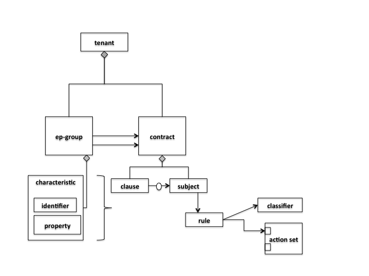

   GBP Access (or Core) Model

The *classifier* and *action* portions of the model can be thought of as
hooks, with their definition provided by each *renderer* about its
domain specific capabilities. In **GBP** for this release, there is one
renderer, the :ref:`OpenFlow Overlay renderer (OfOverlay). <gbp-of-overlay>`

These hooks are filled with *definitions* of the types of *features* the
renderer can provide the *subject*, and are called
**subject-feature-definitions**.

This means an *expressed intent* can be fulfilled by, and across,
multiple renderers simultaneously, without any specific provisioning
from the consumer of **GBP**.

Since **GBP** is implemented in OpenDaylight, which is an SDN
controller, it also must address networking. This is done via the
*forwarding model*, which is domain specific to networking, but could be
applied to many different *types* of networking.

   GBP Forwarding Model

Each endpoint is provisioned with a *network-containment*. This can be
a:

-  subnet

   -  normal IP stack behaviour, where ARP is performed in subnet, and
      for out of subnet, traffic is sent to default gateway.

   -  a subnet can be a child of any of the below forwarding model
      contexts, but typically would be a child of a flood-domain

-  L2 flood-domain

   -  allows flooding behaviour.

   -  is a n:1 child of a bridge-domain

   -  can have multiple children

-  L2 bridge-domain

   -  is a layer2 namespace

   -  is the realm where traffic can be sent at layer 2

   -  is a n:1 child of a L3 context

   -  can have multiple children

-  L3 context

   -  is a layer3 namespace

   -  is the realm where traffic is passed at layer 3

   -  is a n:1 child of a tenant

   -  can have multiple children

A simple example of how the access and forwarding models work is as
follows:

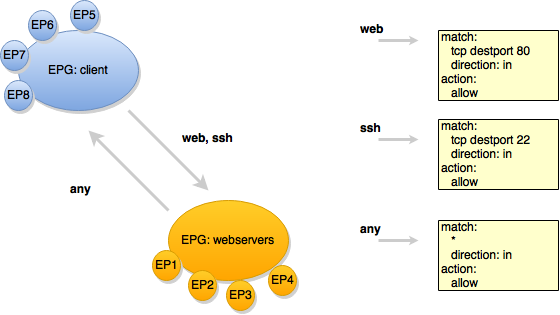

   GBP Endpoints, EndpointGroups and Contracts

In this example, the **EPG:webservers** is *providing* the *web* and
*ssh* contracts. The **EPG:client** is consuming those contracts.
**EPG:client** is providing the *any* contract, which is consumed by
**EPG:webservers**.

The *direction* keyword is always from the perspective of the *provider*
of the contract. In this case contract *web*, being *provided* by
**EPG:webservers**, with the classifier to match TCP destination port
80, means:

-  packets with a TCP destination port of 80

-  sent to (*in*) endpoints in the **EPG:webservers**

-  will be *allowed*.

   GBP Endpoints and the Forwarding Model

When the forwarding model is considered in the figure above, it can be
seen that even though all endpoints are communicating using a common set
of contracts, their forwarding is *contained* by the forwarding model
contexts or namespaces. In the example shown, the endpoints associated
with a *network-containment* that has an ultimate parent of
*L3Context:Sales* can only communicate with other endpoints within this
L3Context. In this way L3VPN services can be implemented without any
impact to the **Intent** of the contract.

High-level implementation Architecture
^^^^^^^^^^^^^^^^^^^^^^^^^^^^^^^^^^^^^^

The overall architecture, including :ref:`Neutron <gbp-neutron>` domain
specific mapping, and the :ref:`OpenFlow Overlay renderer <gbp-of-overlay>`
looks as so:

   GBP High Level Architecture

The major benefit of this architecture is that the mapping of the
domain-specific-language is completely separate and independent of the
underlying renderer implementation.

For instance, using the :ref:`Neutron Mapper <gbp-neutron>`, which maps the
Neutron API to the **GBP** core model, any contract automatically
generated from this mapping can be augmented via the :ref:`UX <gbp-ux>` to use
:ref:`Service Function Chaining <gbp-sfc>`, a capability not currently
available in OpenStack Neutron.

When another renderer is added, for instance, NetConf, the same policy
can now be leveraged across NetConf devices simultaneously:

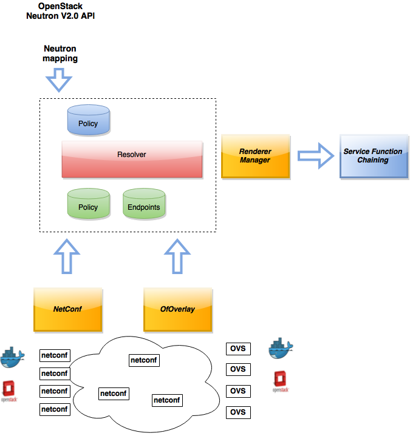

   GBP High Level Architecture - adding a renderer

As other domain-specific mappings occur, they too can leverage the same
renderers, as the renderers only need to implement the **GBP** access
and forwarding models, and the domain-specific mapping need only manage
mapping to the access and forwarding models. For instance:

   GBP High Level Architecture - adding a renderer

In summary, the **GBP** architecture:

-  separates concerns: the Expressed Intent is kept completely separated
   from the underlying renderers.

-  is cohesive: each part does it’s part and it’s part only

-  is scalable: code can be optimised around model
   mapping/implementation, and functionality re-used

Policy Resolution
~~~~~~~~~~~~~~~~~

Contract Selection
^^^^^^^^^^^^^^^^^^

The first step in policy resolution is to select the contracts that are
in scope.

EndpointGroups participate in contracts either as a *provider* or as a
*consumer* of a contract. Each EndpointGroup can participate in many
contracts at the same time, but for each contract it can be in only one
role at a time. In addition, there are two ways for an EndpointGroup to
select a contract: either with either a:

-  *named selector*

   Named selectors simply select a specific contract by its contract ID.

-  target selector.

   Target selectors allow for additional flexibility by matching against
   *qualities* of the contract’s *target.*

Thus, there are a total of 4 kinds of contract selector:

-  provider named selector

   Select a contract by contract ID, and participate as a provider.

-  provider target selector

   Match against a contract’s target with a quality matcher, and
   participate as a provider.

-  consumer named selector

   Select a contract by contract ID, and participate as a consumer.

-  consumer target selector

   Match against a contract’s target with a quality matcher, and
   participate as a consumer.

To determine which contracts are in scope, contracts are found where
either the source EndpointGroup selects a contract as either a provider
or consumer, while the destination EndpointGroup matches against the
same contract in the corresponding role. So if endpoint *x* in
EndpointGroup *X* is communicating with endpoint *y* in EndpointGroup
*Y*, a contract *C* is in scope if either *X* selects *C* as a provider
and *Y* selects *C* as a consumer, or vice versa.

The details of how quality matchers work are described further in
`Matchers <#Matchers>`__. Quality matchers provide a flexible mechanism
for contract selection based on labels.

The end result of the contract selection phase can be thought of as a
set of tuples representing selected contract scopes. The fields of the
tuple are:

-  Contract ID

-  The provider EndpointGroup ID

-  The name of the selector in the provider EndpointGroup that was used
   to select the contract, called the *matching provider selector.*

-  The consumer EndpointGroup ID

-  The name of the selector in the consumer EndpointGroup that was used
   to select the contract, called the *matching consumer selector.*

The result is then stored in the datastore under **Resolved Policy**.

Subject Selection
^^^^^^^^^^^^^^^^^

The second phase in policy resolution is to determine which subjects are
in scope. The subjects define what kinds of communication are allowed
between endpoints in the EndpointGroups. For each of the selected
contract scopes from the contract selection phase, the subject selection
procedure is applied.

Labels called, capabilities, requirements and conditions are matched
against to bring a Subject *into scope*. EndpointGroups have
capabilities and requirements, while endpoints have conditions.

Requirements and Capabilities
^^^^^^^^^^^^^^^^^^^^^^^^^^^^^

When acting as a *provider*, EndpointGroups expose *capabilities,* which
are labels representing specific pieces of functionality that can be
exposed to other EndpointGroups that may meet functional requirements of
those EndpointGroups.

When acting as a *consumer*, EndpointGroups expose *requirements*, which
are labels that represent that the EndpointGroup requires some specific
piece of functionality.

As an example, we might create a capability called "user-database" which
indicates that an EndpointGroup contains endpoints that implement a
database of users.

We might create a requirement also called "user-database" to indicate an
EndpointGroup contains endpoints that will need to communicate with the
endpoints that expose this service.

Note that in this example the requirement and capability have the same
name, but the user need not follow this convention.

The matching provider selector (that was used by the provider
EndpointGroup to select the contract) is examined to determine the
capabilities exposed by the provider EndpointGroup for this contract
scope.

The provider selector will have a list of capabilities either directly
included in the provider selector or inherited from a parent selector or
parent EndpointGroup. (See `Inheritance <#Inheritance>`__).

Similarly, the matching consumer selector will expose a set of
requirements.

Conditions
^^^^^^^^^^

Endpoints can have *conditions*, which are labels representing some
relevant piece of operational state related to the endpoint.

An example of a condition might be "malware-detected," or
"authentication-succeeded." Conditions are used to affect how that
particular endpoint can communicate.

To continue with our example, the "malware-detected" condition might
cause an endpoint’s connectivity to be cut off, while
"authentication-succeeded" might open up communication with services
that require an endpoint to be first authenticated and then forward its
authentication credentials.

Clauses
^^^^^^^

Clauses perform the actual selection of subjects. A clause has lists of
matchers in two categories. In order for a clause to become active, all
lists of matchers must match. A matching clause will select all the
subjects referenced by the clause. Note that an empty list of matchers
counts as a match.

The first category is the consumer matchers, which match against the
consumer EndpointGroup and endpoints. The consumer matchers are:

-  Group Idenfication Constraint: Requirement matchers

   Matches against requirements in the matching consumer selector.

-  Group Identification Constraint: GroupName

   Matches against the group name

-  Consumer condition matchers

   Matches against conditions on endpoints in the consumer EndpointGroup

-  Consumer Endpoint Identification Constraint

   Label based criteria for matching against endpoints. In this release
   this can be used to label endpoints based on IpPrefix.

The second category is the provider matchers, which match against the
provider EndpointGroup and endpoints. The provider matchers are:

-  Group Idenfication Constraint: Capability matchers

   Matches against capabilities in the matching provider selector.

-  Group Identification Constraint: GroupName

   Matches against the group name

-  Consumer condition matchers

   Matches against conditions on endpoints in the provider EndpointGroup

-  Consumer Endpoint Identification Constraint

   Label based criteria for matching against endpoints. In this release
   this can be used to label endpoints based on IpPrefix.

Clauses have a list of subjects that apply when all the matchers in the
clause match. The output of the subject selection phase logically is a
set of subjects that are in scope for any particular pair of endpoints.

Rule Application
^^^^^^^^^^^^^^^^

Now subjects have been selected that apply to the traffic between a
particular set of endpoints, policy can be applied to allow endpoints to
communicate. The applicable subjects from the previous step will each
contain a set of rules.

Rules consist of a set of *classifiers* and a set of *actions*.
Classifiers match against traffic between two endpoints. An example of a
classifier would be something that matches against all TCP traffic on
port 80, or one that matches against HTTP traffic containing a
particular cookie. Actions are specific actions that need to be taken on
the traffic before it reaches its destination. Actions could include
tagging or encapsulating the traffic in some way, redirecting the
traffic, or applying a :ref:`service function chain <gbp-sfc>`.

Rules, subjects, and actions have an *order* parameter, where a lower
order value means that a particular item will be applied first. All
rules from a particular subject will be applied before the rules of any
other subject, and all actions from a particular rule will be applied
before the actions from another rule. If more than item has the same
order parameter, ties are broken with a lexicographic ordering of their
names, with earlier names having logically lower order.

Matchers
''''''''

Matchers specify a set of labels (which include requirements,
capabilities, conditions, and qualities) to match against. There are
several kinds of matchers that operate similarly:

-  Quality matchers

   used in target selectors during the contract selection phase. Quality
   matchers provide a more advanced and flexible way to select contracts
   compared to a named selector.

-  Requirement and capability matchers

   used in clauses during the subject selection phase to match against
   requirements and capabilities on EndpointGroups

-  Condition matchers

   used in clauses during the subject selection phase to match against
   conditions on endpoints

A matcher is, at its heart, fairly simple. It will contain a list of
label names, along with a *match type*. The match type can be either:

-  "all"

   which means the matcher matches when all of its labels match

-  "any"

   which means the matcher matches when any of its labels match,

-  "none"

   which means the matcher matches when none of its labels match.

Note a *match all* matcher can be made by matching against an empty set
of labels with a match type of "all."

Additionally each label to match can optionally include a relevant name
field. For quality matchers, this is a target name. For capability and
requirement matchers, this is a selector name. If the name field is
specified, then the matcher will only match against targets or selectors
with that name, rather than any targets or selectors.

Inheritance
^^^^^^^^^^^

Some objects in the system include references to parents, from which
they will inherit definitions. The graph of parent references must be
loop free. When resolving names, the resolution system must detect loops
and raise an exception. Objects that are part of these loops may be
considered as though they are not defined at all. Generally, inheritance
works by simply importing the objects in the parent into the child
object. When there are objects with the same name in the child object,
then the child object will override the parent object according to rules
which are specific to the type of object. We’ll next explore the
detailed rules for inheritance for each type of object

**EndpointGroups**

EndpointGroups will inherit all their selectors from their parent
EndpointGroups. Selectors with the same names as selectors in the parent
EndpointGroups will inherit their behavior as defined below.

**Selectors**

Selectors include provider named selectors, provider target selectors,
consumer named selectors, and consumer target selectors. Selectors
cannot themselves have parent selectors, but when selectors have the
same name as a selector of the same type in the parent EndpointGroup,
then they will inherit from and override the behavior of the selector in
the parent EndpointGroup.

**Named Selectors**

Named selectors will add to the set of contract IDs that are selected by
the parent named selector.

**Target Selectors**

A target selector in the child EndpointGroup with the same name as a
target selector in the parent EndpointGroup will inherit quality
matchers from the parent. If a quality matcher in the child has the same
name as a quality matcher in the parent, then it will inherit as
described below under Matchers.

**Contracts**

Contracts will inherit all their targets, clauses and subjects from
their parent contracts. When any of these objects have the same name as
in the parent contract, then the behavior will be as defined below.

**Targets**

Targets cannot themselves have a parent target, but it may inherit from
targets with the same name as the target in a parent contract. Qualities
in the target will be inherited from the parent. If a quality with the
same name is defined in the child, then this does not have any semantic
effect except if the quality has its inclusion-rule parameter set to
"exclude." In this case, then the label should be ignored for the
purpose of matching against this target.

**Subjects**

Subjects cannot themselves have a parent subject, but it may inherit
from a subject with the same name as the subject in a parent contract.
The order parameter in the child subject, if present, will override the
order parameter in the parent subject. The rules in the parent subject
will be added to the rules in the child subject. However, the rules will
not override rules of the same name. Instead, all rules in the parent
subject will be considered to run with a higher order than all rules in
the child; that is all rules in the child will run before any rules in
the parent. This has the effect of overriding any rules in the parent
without the potentially-problematic semantics of merging the ordering.

**Clauses**

Clauses cannot themselves have a parent clause, but it may inherit from
a clause with the same name as the clause in a parent contract. The list
of subject references in the parent clause will be added to the list of
subject references in the child clause. This is just a union operation.
A subject reference that refers to a subject name in the parent contract
might have that name overridden in the child contract. Each of the
matchers in the clause are also inherited by the child clause. Matchers
in the child of the same name and type as a matcher from the parent will
inherit from and override the parent matcher. See below under Matchers
for more information.

**Matchers**

Matchers include quality matchers, condition matchers, requirement
matchers, and capability matchers. Matchers cannot themselves have
parent matchers, but when there is a matcher of the same name and type
in the parent object, then the matcher in the child object will inherit
and override the behavior of the matcher in the parent object. The match
type, if specified in the child, overrides the value specified in the
parent. Labels are also inherited from the parent object. If there is a
label with the same name in the child object, this does not have any
semantic effect except if the label has its inclusion-rule parameter set
to "exclude." In this case, then the label should be ignored for the
purpose of matching. Otherwise, the label with the same name will
completely override the label from the parent.

.. _gbp-ux:

Using the GBP UX interface
--------------------------

Overview
~~~~~~~~

These following components make up this application and are described in
more detail in following sections:

-  Basic view

-  Governance view

-  Policy Expression view

-  Wizard view

The **GBP** UX is access via:

::

    http://<odl controller>:8181/index.html

Basic view
~~~~~~~~~~

Basic view contains 5 navigation buttons which switch user to the
desired section of application:

-  Governance – switch to the Governance view (middle of graphic has the
   same function)

-  Renderer configuration – switch to the Policy expression view with
   Renderers section expanded

-  Policy expression – switch to the Policy expression view with Policy
   section expanded

-  Operational constraints – placeholder for development in next release

.. figure:: ./images/groupbasedpolicy/ui-1-basicview.png
   :alt: Basic view

   Basic view

Governance view
~~~~~~~~~~~~~~~

Governance view consists from three columns.

   Governance view

**Governance view – Basic view – Left column**

In the left column is Health section with Exception and Conflict buttons
with no functionality yet. This is a placeholder for development in
further releases.

**Governance view – Basic view – Middle column**

In the top half of this section is select box with list of tenants for
select. Once the tenant is selected, all sub sections in application
operate and display data with actual selected tenant.

Below the select box are buttons which display Expressed or Delivered
policy of Governance section. In the bottom half of this section is
select box with list of renderers for select. There is currently only
:ref:`OfOverlay <gbp-of-overlay>` renderer available.

Below the select box is Renderer configuration button, which switch the
app into the Policy expression view with Renderers section expanded for
performing CRUD operations. Renderer state button display Renderer state
view.

**Governance view – Basic view – Right column**

In the bottom part of the right section of Governance view is Home
button which switch the app to the Basic view.

In the top part is situated navigation menu with four main sections.

Policy expression button expand/collapse sub menu with three main parts
of Policy expression. By clicking on sub menu buttons, user will be
switched into the Policy expressions view with appropriate section
expanded for performing CRUD operations.

Renderer configuration button switches user into the Policy expressions
view.

Governance button expand/collapse sub menu with four main parts of
Governance section. Sub menu buttons of Governance section display
appropriate section of Governance view.

Operational constraints have no functionality yet, and is a placeholder
for development in further releases.

Below the menu is place for view info section which displays info about
actual selected element from the topology (explained below).

**Governance view – Expressed policy**

In this view are displayed contracts with their consumed and provided
EndpointGroups of actual selected tenant, which can be changed in select
box in the upper left corner.

By single-clicking on any contract or EPG, the data of actual selected
element will be shown in the right column below the menu. A Manage
button launches a display wizard window for managing configuration of
items such as :ref:`Service Function Chaining <gbp-sfc>`.

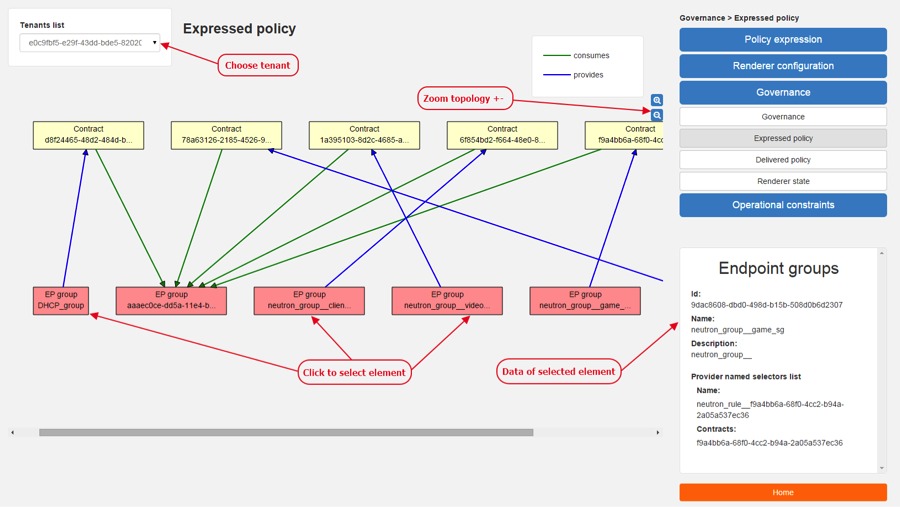

   Expressed policy

**Governance view – Delivered policy** In this view are displayed
subjects with their consumed and provided EndpointGroups of actual
selected tenant, which can be changed in select box in the upper left
corner.

By single-clicking on any subject or EPG, the data of actual selected
element will be shown in the right column below the menu.

By double-click on subject the subject detail view will be displayed
with subject’s rules of actual selected subject, which can be changed in
select box in the upper left corner.

By single-clicking on rule or subject, the data of actual selected
element will be shown in the right column below the menu.

By double-clicking on EPG in Delivered policy view, the EPG detail view
will be displayed with EPG’s endpoints of actual selected EPG, which can
be changed in select box in the upper left corner.

By single-clicking on EPG or endpoint the data of actual selected
element will be shown in the right column below the menu.

   Delivered policy

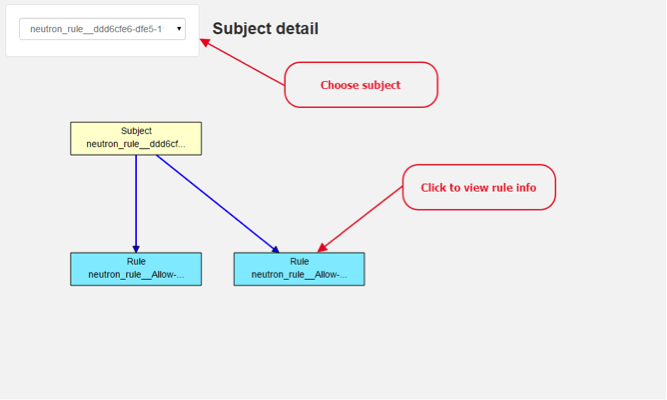

   Subject detail

   EPG detail

**Governance view – Renderer state**

In this part are displayed Subject feature definition data with two main
parts: Action definition and Classifier definition.

By clicking on the down/right arrow in the circle is possible to
expand/hide data of appropriate container or list. Next to the list node
are displayed names of list’s elements where one is always selected and
element’s data are shown (blue line under the name).

By clicking on names of children nodes is possible to select desired
node and node’s data will be displayed.

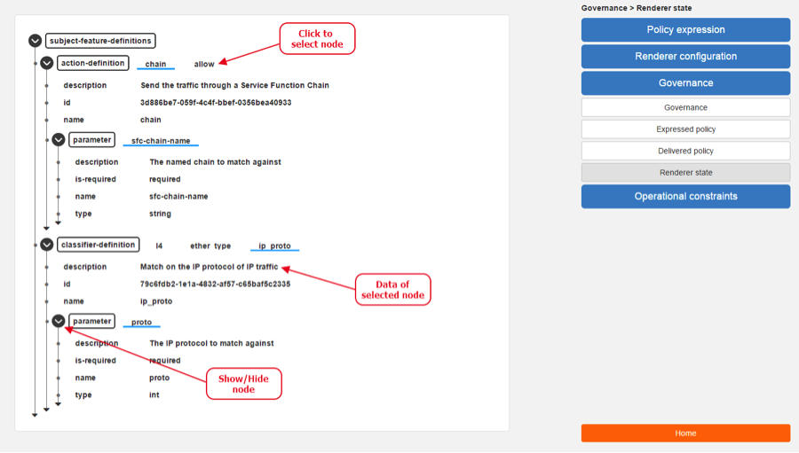

   Renderer state

Policy expression view
~~~~~~~~~~~~~~~~~~~~~~

In the left part of this view is placed topology of actual selected
elements with the buttons for switching between types of topology at the
bottom.

Right column of this view contains four parts. At the top of this column
are displayed breadcrumbs with actual position in the application.

Below the breadcrumbs is select box with list of tenants for select. In
the middle part is situated navigation menu, which allows switch to the
desired section for performing CRUD operations.

At the bottom is quick navigation menu with Access Model Wizard button
which display Wizard view, Home button which switch application to the
Basic view and occasionally Back button, which switch application to the
upper section.

**Policy expression - Navigation menu**

To open Policy expression, select Policy expression from the GBP Home
screen.

In the top of navigation box you can select the tenant from the tenants
list to activate features addicted to selected tenant.

In the right menu, by default, the Policy menu section is expanded.
Subitems of this section are modules for CRUD (creating, reading,
updating and deleting) of tenants, EndpointGroups, contracts, L2/L3
objects.

-  Section Renderers contains CRUD forms for Classifiers and Actions.

-  Section Endpoints contains CRUD forms for Endpoint and L3 prefix
   endpoint.

.. figure:: ./images/groupbasedpolicy/ui-5-expresssion-1.png
   :alt: Navigation menu

   Navigation menu

   CRUD operations

**Policy expression - Types of topology**

There are three different types of topology:

-  Configured topology - EndpointGroups and contracts between them from
   CONFIG datastore

-  Operational topology - displays same information but is based on
   operational data.

-  L2/L3 - displays relationships between L3Contexts, L2 Bridge domains,
   L2 Flood domains and Subnets.

   L2/L3 Topology

   Config Topology

**Policy expression - CRUD operations**

In this part are described basic flows for viewing, adding, editing and
deleting system elements like tenants, EndpointGroups etc.

Tenants
~~~~~~~

To edit tenant objects click the Tenants button in the right menu. You
can see the CRUD form containing tenants list and control buttons.

To add new tenant, click the Add button This will display the form for
adding a new tenant. After filling tenant attributes Name and
Description click Save button. Saving of any object can be performed
only if all the object attributes are filled correctly. If some
attribute doesn’t have correct value, exclamation mark with mouse-over
tooltip will be displayed next to the label for the attribute. After
saving of tenant the form will be closed and the tenants list will be
set to default value.

To view an existing tenant, select the tenant from the select box
Tenants list. The view form is read-only and can be closed by clicking
cross mark in the top right of the form.

To edit selected tenant, click the Edit button, which will display the
edit form for selected tenant. After editing the Name and Description of
selected tenant click the Save button to save selected tenant. After
saving of tenant the edit form will be closed and the tenants list will
be set to default value.

To delete tenant select the tenant from the Tenants list and click
Delete button.

To return to the Policy expression click Back button on the bottom of
window.

**EndpointGroups**

For managing EndpointGroups (EPG) the tenant from the top Tenants list
must be selected.

To add new EPG click Add button and after filling required attributes
click Save button. After adding the EPG you can edit it and assign
Consumer named selector or Provider named selector to it.

To edit EPG click the Edit button after selecting the EPG from Group
list.

To add new Consumer named selector (CNS) click the Add button next to
the Consumer named selectors list. While CNS editing you can set one or
more contracts for current CNS pressing the Plus button and selecting
the contract from the Contracts list. To remove the contract, click on
the cross mark next to the contract. Added CNS can be viewed, edited or
deleted by selecting from the Consumer named selectors list and clicking
the Edit and Delete buttons like with the EPG or tenants.

To add new Provider named selector (PNS) click the Add button next to
the Provider named selectors list. While PNS editing you can set one or
more contracts for current PNS pressing the Plus button and selecting
the contract from the Contracts list. To remove the contract, click on
the cross mark next to the contract. Added PNS can be viewed, edited or
deleted by selecting from the Provider named selectors list and clicking
the Edit and Delete buttons like with the EPG or tenants.

To delete EPG, CNS or PNS select it in selectbox and click the Delete
button next to the selectbox.

**Contracts**

For managing contracts the tenant from the top Tenants list must be
selected.

To add new Contract click Add button and after filling required fields
click Save button.

After adding the Contract user can edit it by selecting in the Contracts
list and clicking Edit button.

To add new Clause click Add button next to the Clause list while editing
the contract. While editing the Clause after selecting clause from the
Clause list user can assign clause subjects by clicking the Plus button
next to the Clause subjects label. Adding and editing action must be
submitted by pressing Save button. To manage Subjects you can use CRUD
form like with the Clause list.

**L2/L3**

For managing L2/L3 the tenant from the top Tenants list must be
selected.

To add L3 Context click the Add button next to the L3 Context list
,which will display the form for adding a new L3 Context. After filling
L3 Context attributes click Save button. After saving of L3 Context,
form will be closed and the L3 Context list will be set to default
value.

To view an existing L3 Context, select the L3 Context from the select
box L3 Context list. The view form is read-only and can be closed by
clicking cross mark in the top right of the form.

If user wants to edit selected L3 Context, click the Edit button, which
will display the edit form for selected L3 Context. After editing click
the Save button to save selected L3 Context. After saving of L3 Context,
the edit form will be closed and the L3 Context list will be set to
default value.

To delete L3 Context, select it from the L3 Context list and click
Delete button.

To add L2 Bridge Domain, click the Add button next to the L2 Bridge
Domain list. This will display the form for adding a new L2 Bridge
Domain. After filling L2 Bridge Domain attributes click Save button.
After saving of L2 Bridge Domain, form will be closed and the L2 Bridge
Domain list will be set to default value.

To view an existing L2 Bridge Domain, select the L2 Bridge Domain from
the select box L2 Bridge Domain list. The view form is read-only and can
be closed by clicking cross mark in the top right of the form.

If user wants to edit selected L2 Bridge Domain, click the Edit button,
which will display the edit form for selected L2 Bridge Domain. After
editing click the Save button to save selected L2 Bridge Domain. After
saving of L2 Bridge Domain the edit form will be closed and the L2
Bridge Domain list will be set to default value.

To delete L2 Bridge Domain select it from the L2 Bridge Domain list and
click Delete button.

To add L3 Flood Domain, click the Add button next to the L3 Flood Domain
list. This will display the form for adding a new L3 Flood Domain. After
filling L3 Flood Domain attributes click Save button. After saving of L3
Flood Domain, form will be closed and the L3 Flood Domain list will be
set to default value.

To view an existing L3 Flood Domain, select the L3 Flood Domain from the
select box L3 Flood Domain list. The view form is read-only and can be
closed by clicking cross mark in the top right of the form.

If user wants to edit selected L3 Flood Domain, click the Edit button,
which will display the edit form for selected L3 Flood Domain. After
editing click the Save button to save selected L3 Flood Domain. After
saving of L3 Flood Domain the edit form will be closed and the L3 Flood
Domain list will be set to default value.

To delete L3 Flood Domain select it from the L3 Flood Domain list and
click Delete button.

To add Subnet click the Add button next to the Subnet list. This will
display the form for adding a new Subnet. After filling Subnet
attributes click Save button. After saving of Subnet, form will be
closed and the Subnet list will be set to default value.

To view an existing Subnet, select the Subnet from the select box Subnet
list. The view form is read-only and can be closed by clicking cross
mark in the top right of the form.

If user wants to edit selected Subnet, click the Edit button, which will
display the edit form for selected Subnet. After editing click the Save
button to save selected Subnet. After saving of Subnet the edit form
will be closed and the Subnet list will be set to default value.

To delete Subnet select it from the Subnet list and click Delete button.

**Classifiers**

To add Classifier, click the Add button next to the Classifier list.
This will display the form for adding a new Classifier. After filling
Classifier attributes click Save button. After saving of Classifier,
form will be closed and the Classifier list will be set to default
value.

To view an existing Classifier, select the Classifier from the select
box Classifier list. The view form is read-only and can be closed by
clicking cross mark in the top right of the form.

If you want to edit selected Classifier, click the Edit button, which
will display the edit form for selected Classifier. After editing click
the Save button to save selected Classifier. After saving of Classifier
the edit form will be closed and the Classifier list will be set to
default value.

To delete Classifier select it from the Classifier list and click Delete
button.

**Actions**

To add Action, click the Add button next to the Action list. This will
display the form for adding a new Action. After filling Action
attributes click Save button. After saving of Action, form will be
closed and the Action list will be set to default value.

To view an existing Action, select the Action from the select box Action
list. The view form is read-only and can be closed by clicking cross
mark in the top right of the form.

If user wants to edit selected Action, click the Edit button, which will
display the edit form for selected Action. After editing click the Save
button to save selected Action. After saving of Action the edit form
will be closed and the Action list will be set to default value.

To delete Action select it from the Action list and click Delete button.

**Endpoint**

To add Endpoint, click the Add button next to the Endpoint list. This
will display the form for adding a new Endpoint. To add EndpointGroup
assignment click the Plus button next to the label EndpointGroups. To
add Condition click Plus button next to the label Condition. To add L3
Address click the Plus button next to the L3 Addresses label. After
filling Endpoint attributes click Save button. After saving of Endpoint,
form will be closed and the Endpoint list will be set to default value.

To view an existing Endpoint just, the Endpoint from the select box
Endpoint list. The view form is read-only and can be closed by clicking
cross mark in the top right of the form.

If you want to edit selected Endpoint, click the Edit button, which will
display the edit form for selected Endpoint. After editing click the
Save button to save selected Endpoint. After saving of Endpoint the edit
form will be closed and the Endpoint list will be set to default value.

To delete Endpoint select it from the Endpoint list and click Delete
button.

**L3 prefix endpoint**

To add L3 prefix endpoint, click the Add button next to the L3 prefix
endpoint list. This will display the form for adding a new Endpoint. To
add EndpointGroup assignment, click the Plus button next to the label
EndpointGroups. To add Condition, click Plus button next to the label
Condition. To add L2 gateway click the Plus button next to the L2
gateways label. To add L3 gateway, click the Plus button next to the L3
gateways label. After filling L3 prefix endpoint attributes click Save
button. After saving of L3 prefix endpoint, form will be closed and the
Endpoint list will be set to default value.

To view an existing L3 prefix endpoint, select the Endpoint from the
select box L3 prefix endpoint list. The view form is read-only and can
be closed by clicking cross mark in the top right of the form.

If you want to edit selected L3 prefix endpoint, click the Edit button,
which will display the edit form for selected L3 prefix endpoint. After
editing click the Save button to save selected L3 prefix endpoint. After
saving of Endpoint the edit form will be closed and the Endpoint list
will be set to default value.

To delete Endpoint select it from the L3 prefix endpoint list and click
Delete button.

Wizard
~~~~~~

Wizard provides quick method to send basic data to controller necessary
for basic usage of GBP application. It is useful in the case that there
aren’t any data in controller. In the first tab is form for create
tenant. The second tab is for CRUD operations with contracts and their
sub elements such as subjects, rules, clauses, action refs and
classifier refs. The last tab is for CRUD operations with EndpointGroups
and their CNS and PNS. Created structure of data is possible to send by
clicking on Submit button.

.. figure:: ./images/groupbasedpolicy/ui-6-wizard.png
   :alt: Wizard

   Wizard

Using the GBP API
-----------------

Please see:

-  :ref:`gbp-of-overlay`

-  `Policy Resolution`_

-  `Forwarding Model <#forwarding>`__

-  `the **GBP** demo and development environments for tips <#demo>`__

It is recommended to use:

-  `Neutron mapper <gbp-neutron>`

.. _gbp-neutron:

Using OpenStack with GBP
------------------------

Overview
~~~~~~~~

This section is for Application Developers and Network Administrators
who are looking to integrate Group Based Policy with OpenStack.

To enable the **GBP** Neutron Mapper feature, at the Karaf console:

::

    feature:install odl-groupbasedpolicy-neutronmapper

Neutron Mapper has the following dependencies that are automatically
loaded:

::

    odl-neutron-service

Neutron Northbound implementing REST API used by OpenStack

::

    odl-groupbasedpolicy-base

Base **GBP** feature set, such as policy resolution, data model etc.

::

    odl-groupbasedpolicy-ofoverlay

REST calls from OpenStack Neutron are by the Neutron NorthBound project.

**GBP** provides the implementation of the `Neutron V2.0
API <http://developer.openstack.org/api-ref-networking-v2.html>`_.

Features
~~~~~~~~

List of supported Neutron entities:

-  Port

-  Network

   -  Standard Internal

   -  External provider L2/L3 network

-  Subnet

-  Security-groups

-  Routers

   -  Distributed functionality with local routing per compute

   -  External gateway access per compute node (dedicated port required)

   -  Multiple routers per tenant

-  FloatingIP NAT

-  IPv4/IPv6 support

The mapping of Neutron entities to **GBP** entities is as follows:

**Neutron Port**

   Neutron Port

The Neutron port is mapped to an endpoint.

The current implementation supports one IP address per Neutron port.

An endpoint and L3-endpoint belong to multiple EndpointGroups if the
Neutron port is in multiple Neutron Security Groups.

The key for endpoint is L2-bridge-domain obtained as the parent of
L2-flood-domain representing Neutron network. The MAC address is from
the Neutron port. An L3-endpoint is created based on L3-context (the
parent of the L2-bridge-domain) and IP address of Neutron Port.

**Neutron Network**

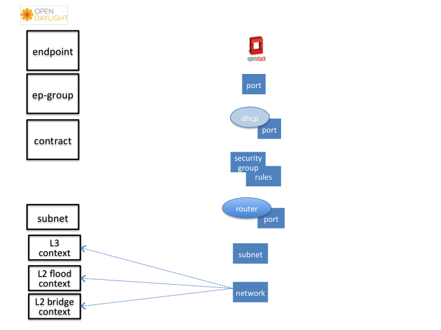

   Neutron Network

A Neutron network has the following characteristics:

-  defines a broadcast domain

-  defines a L2 transmission domain

-  defines a L2 name space.

To represent this, a Neutron Network is mapped to multiple **GBP**
entities. The first mapping is to an L2 flood-domain to reflect that the
Neutron network is one flooding or broadcast domain. An L2-bridge-domain
is then associated as the parent of L2 flood-domain. This reflects both
the L2 transmission domain as well as the L2 addressing namespace.

The third mapping is to L3-context, which represents the distinct L3
address space. The L3-context is the parent of L2-bridge-domain.

**Neutron Subnet**

.. figure:: ./images/groupbasedpolicy/neutronmapper-gbp-mapping-subnet.png
   :alt: Neutron Subnet

   Neutron Subnet

Neutron subnet is associated with a Neutron network. The Neutron subnet
is mapped to a **GBP** subnet where the parent of the subnet is
L2-flood-domain representing the Neutron network.

**Neutron Security Group**

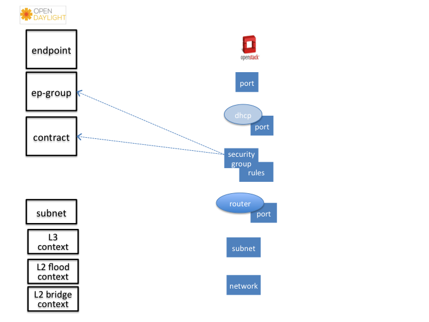

   Neutron Security Group and Rules

**GBP** entity representing Neutron security-group is EndpointGroup.

**Infrastructure EndpointGroups**

Neutron-mapper automatically creates EndpointGroups to manage key
infrastructure items such as:

-  DHCP EndpointGroup - contains endpoints representing Neutron DHCP
   ports

-  Router EndpointGroup - contains endpoints representing Neutron router
   interfaces

-  External EndpointGroup - holds L3-endpoints representing Neutron
   router gateway ports, also associated with FloatingIP ports.

**Neutron Security Group Rules**

This is the most involved amongst all the mappings because Neutron
security-group-rules are mapped to contracts with clauses, subjects,
rules, action-refs, classifier-refs, etc. Contracts are used between
EndpointGroups representing Neutron Security Groups. For simplification
it is important to note that Neutron security-group-rules are similar to
a **GBP** rule containing:

-  classifier with direction

-  action of **allow**.

**Neutron Routers**

.. figure:: ./images/groupbasedpolicy/neutronmapper-gbp-mapping-router.png
   :alt: Neutron Router

   Neutron Router

Neutron router is represented as a L3-context. This treats a router as a
Layer3 namespace, and hence every network attached to it a part of that
Layer3 namespace.

This allows for multiple routers per tenant with complete isolation.

The mapping of the router to an endpoint represents the router’s
interface or gateway port.

The mapping to an EndpointGroup represents the internal infrastructure
EndpointGroups created by the **GBP** Neutron Mapper

When a Neutron router interface is attached to a network/subnet, that
network/subnet and its associated endpoints or Neutron Ports are
seamlessly added to the namespace.

**Neutron FloatingIP**

When associated with a Neutron Port, this leverages the
:ref:`OfOverlay <gbp-of-overlay>` renderer’s NAT capabilities.

A dedicated *external* interface on each Nova compute host allows for
disitributed external access. Each Nova instance associated with a
FloatingIP address can access the external network directly without
having to route via the Neutron controller, or having to enable any form
of Neutron distributed routing functionality.

Assuming the gateway provisioned in the Neutron Subnet command for the
external network is reachable, the combination of **GBP** Neutron Mapper
and :ref:`OfOverlay renderer <gbp-of-overlay>` will automatically ARP for this
default gateway, requiring no user intervention.

**Troubleshooting within GBP**

Logging level for the mapping functionality can be set for package
org.opendaylight.groupbasedpolicy.neutron.mapper. An example of enabling
TRACE logging level on Karaf console:

::

    log:set TRACE org.opendaylight.groupbasedpolicy.neutron.mapper

**Neutron mapping example**

As an example for mapping can be used creation of Neutron network,
subnet and port. When a Neutron network is created 3 **GBP** entities
are created: l2-flood-domain, l2-bridge-domain, l3-context.

.. figure:: ./images/groupbasedpolicy/neutronmapper-gbp-mapping-network-example.png
   :alt: Neutron network mapping

   Neutron network mapping

After an subnet is created in the network mapping looks like this.

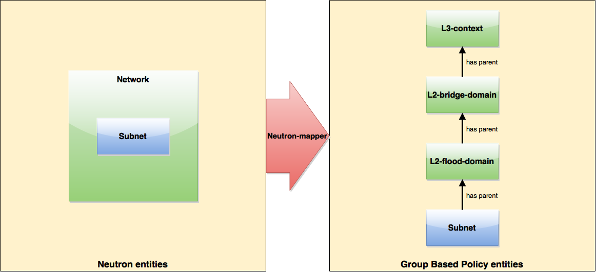

   Neutron subnet mapping

If an Neutron port is created in the subnet an endpoint and l3-endpoint
are created. The endpoint has key composed from l2-bridge-domain and MAC
address from Neutron port. A key of l3-endpoint is compesed from
l3-context and IP address. The network containment of endpoint and
l3-endpoint points to the subnet.

   Neutron port mapping

Configuring GBP Neutron
~~~~~~~~~~~~~~~~~~~~~~~

No intervention passed initial OpenStack setup is required by the user.

More information about configuration can be found in our DevStack demo
environment on the `GBP
wiki <https://wiki.opendaylight.org/view/Group_Based_Policy_(GBP)>`_.

Administering or Managing GBP Neutron
~~~~~~~~~~~~~~~~~~~~~~~~~~~~~~~~~~~~~

For consistencies sake, all provisioning should be performed via the
Neutron API. (CLI or Horizon).

The mapped policies can be augmented via the **GBP** :ref:`UX <gbp-ux>`, to:

-  Enable :ref:`Service Function Chaining <gbp-sfc>`

-  Add endpoints from outside of Neutron i.e. VMs/containers not
   provisioned in OpenStack

-  Augment policies/contracts derived from Security Group Rules

-  Overlay additional contracts or groupings

Tutorials
~~~~~~~~~

A DevStack demo environment can be found on the `GBP
wiki <https://wiki.opendaylight.org/view/Group_Based_Policy_(GBP)>`_.

GBP Renderer manager
--------------------

Overview
~~~~~~~~

The GBP Renderer manager is an integral part of **GBP** base module.
It dispatches information about endpoints'
policy configuration to specific device renderer
by writing a renderer policy configuration into the
registered renderer's policy store.

Installing and Pre-requisites
^^^^^^^^^^^^^^^^^^^^^^^^^^^^^

Renderer manager is integrated into GBP base module,
so no additional installation is required.

Architecture
~~~~~~~~~~~~

Renderer manager gets data notifications about:

- Endoints (base-endpoint.yang)

- EndpointLocations (base-endpoint.yang)

- ResolvedPolicies (resolved-policy.yang)

- Forwarding (forwarding.yang)

Based on data from notifications it creates a configuration task for
specific renderers by writing a renderer policy configuration into the
registered renderer's policy store.
Configuration is stored to CONF data store as Renderers (renderer.yang).

Configuration is signed with version number which is incremented by every change.
All renderers are supposed to be on the same version. Renderer manager waits
for all renderers to respond with version update in OPER data store.
After a version of every renderer in OPER data store has the same value
as the one in CONF data store,
renderer manager moves to the next configuration with incremented version.

GBP Location manager
--------------------

Overview
~~~~~~~~

Location manager monitors information about Endpoint Location providers
(see endpoint-location-provider.yang) and manages Endpoint locations in OPER data store accordingly.

Installing and Pre-requisites
^^^^^^^^^^^^^^^^^^^^^^^^^^^^^

Location manager is integrated into GBP base module,
so no additional installation is required.

Architecture
~~~~~~~~~~~~

The endpoint-locations container in OPER data store (see base-endpoint.yang)
contains two lists for two types of EP location,
namely address-endpoint-location and containment-endpoint-location.
LocationResolver is a class that processes Location providers in CONF data store
and puts location information to OPER data store.

When a new Location provider is created in CONF data store, its Address EP locations
are being processed first, and their info is stored locally in accordance with processed
Location provider's priority. Then a location of type "absolute" with the highest priority
is selected for an EP, and is put in OPER data store. If Address EP locations contain
locations of type "relative", those are put to OPER data store.

If current Location provider contains Containment EP locations of type "relative",
then those are put to OPER data store.

Similarly, when a Location provider is deleted, information of its locations
is removed from the OPER data store.

.. _gbp-of-overlay:

Using the GBP OpenFlow Overlay (OfOverlay) renderer
---------------------------------------------------

Overview
~~~~~~~~

The OpenFlow Overlay (OfOverlay) feature enables the OpenFlow Overlay
renderer, which creates a network virtualization solution across nodes
that host Open vSwitch software switches.

Installing and Pre-requisites
^^^^^^^^^^^^^^^^^^^^^^^^^^^^^

From the Karaf console in OpenDaylight:

::

    feature:install odl-groupbasedpolicy-ofoverlay

This renderer is designed to work with OpenVSwitch (OVS) 2.1+ (although
2.3 is strongly recommended) and OpenFlow 1.3.

When used in conjunction with the :ref:`Neutron Mapper feature <gbp-neutron>`
no extra OfOverlay specific setup is required.

When this feature is loaded "standalone", the user is required to
configure infrastructure, such as

-  instantiating OVS bridges,

-  attaching hosts to the bridges,

-  and creating the VXLAN/VXLAN-GPE tunnel ports on the bridges.

.. _gbp-offset:

The **GBP** OfOverlay renderer also supports a table offset option, to
offset the pipeline post-table 0. The value of table offset is stored in
the config datastore and it may be rewritten at runtime.

::

    PUT http://{{controllerIp}}:8181/restconf/config/ofoverlay:of-overlay-config
    {
        "of-overlay-config": {
            "gbp-ofoverlay-table-offset": 6
        }
    }

The default value is set by changing:
<gbp-ofoverlay-table-offset>0</gbp-ofoverlay-table-offset>

in file:
distribution-karaf/target/assembly/etc/opendaylight/karaf/15-groupbasedpolicy-ofoverlay.xml

To avoid overwriting runtime changes, the default value is used only
when the OfOverlay renderer starts and no other value has been written
before.

OpenFlow Overlay Architecture
~~~~~~~~~~~~~~~~~~~~~~~~~~~~~

These are the primary components of **GBP**. The OfOverlay components
are highlighted in red.

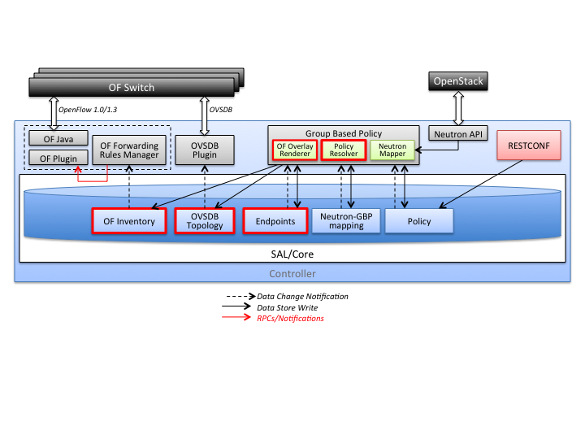

   OfOverlay within **GBP**

In terms of the inner components of the **GBP** OfOverlay renderer:

   OfOverlay expanded view:

**OfOverlay Renderer**

Launches components below:

**Policy Resolver**

Policy resolution is completely domain independent, and the OfOverlay
leverages process policy information internally. See `Policy Resolution
process <Policy Resolution>`_.

It listens to inputs to the *Tenants* configuration datastore, validates
tenant input, then writes this to the Tenants operational datastore.

From there an internal notification is generated to the PolicyManager.

In the next release, this will be moving to a non-renderer specific
location.

**Endpoint Manager**

The endpoint repository operates in **orchestrated** mode. This means
the user is responsible for the provisioning of endpoints via:

-  :ref:`UX/GUI <gbp-ux>`

-  REST API

.. note::

    When using the :ref:`Neutron mapper <gbp-neutron>` feature, everything is
    managed transparently via Neutron.

The Endpoint Manager is responsible for listening to Endpoint repository
updates and notifying the Switch Manager when a valid Endpoint has been
registered.

It also supplies utility functions to the flow pipeline process.

**Switch Manager**

The Switch Manager is purely a state manager.

Switches are in one of 3 states:

-  DISCONNECTED

-  PREPARING

-  READY

**Ready** is denoted by a connected switch:

-  having a tunnel interface

-  having at least one endpoint connected.

In this way **GBP** is not writing to switches it has no business to.

**Preparing** simply means the switch has a controller connection but is
missing one of the above *complete and necessary* conditions

**Disconnected** means a previously connected switch is no longer
present in the Inventory operational datastore.

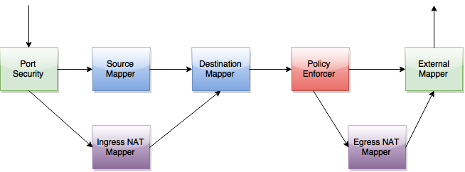

   OfOverlay Flow Pipeline

The OfOverlay leverages Nicira registers as follows:

-  REG0 = Source EndpointGroup + Tenant ordinal

-  REG1 = Source Conditions + Tenant ordinal

-  REG2 = Destination EndpointGroup + Tenant ordinal

-  REG3 = Destination Conditions + Tenant ordinal

-  REG4 = Bridge Domain + Tenant ordinal

-  REG5 = Flood Domain + Tenant ordinal

-  REG6 = Layer 3 Context + Tenant ordinal

**Port Security**

Table 0 of the OpenFlow pipeline. Responsible for ensuring that only
valid connections can send packets into the pipeline:

::

    cookie=0x0, <snip> , priority=200,in_port=3 actions=goto_table:2
    cookie=0x0, <snip> , priority=200,in_port=1 actions=goto_table:1
    cookie=0x0, <snip> , priority=121,arp,in_port=5,dl_src=fa:16:3e:d5:b9:8d,arp_spa=10.1.1.3 actions=goto_table:2
    cookie=0x0, <snip> , priority=120,ip,in_port=5,dl_src=fa:16:3e:d5:b9:8d,nw_src=10.1.1.3 actions=goto_table:2
    cookie=0x0, <snip> , priority=115,ip,in_port=5,dl_src=fa:16:3e:d5:b9:8d,nw_dst=255.255.255.255 actions=goto_table:2
    cookie=0x0, <snip> , priority=112,ipv6 actions=drop
    cookie=0x0, <snip> , priority=111, ip actions=drop
    cookie=0x0, <snip> , priority=110,arp actions=drop
    cookie=0x0, <snip> ,in_port=5,dl_src=fa:16:3e:d5:b9:8d actions=goto_table:2
    cookie=0x0, <snip> , priority=1 actions=drop

Ingress from tunnel interface, go to Table *Source Mapper*:

::

    cookie=0x0, <snip> , priority=200,in_port=3 actions=goto_table:2

Ingress from outside, goto Table *Ingress NAT Mapper*:

::

    cookie=0x0, <snip> , priority=200,in_port=1 actions=goto_table:1

ARP from Endpoint, go to Table *Source Mapper*:

::

    cookie=0x0, <snip> , priority=121,arp,in_port=5,dl_src=fa:16:3e:d5:b9:8d,arp_spa=10.1.1.3 actions=goto_table:2

IPv4 from Endpoint, go to Table *Source Mapper*:

::

    cookie=0x0, <snip> , priority=120,ip,in_port=5,dl_src=fa:16:3e:d5:b9:8d,nw_src=10.1.1.3 actions=goto_table:2

DHCP DORA from Endpoint, go to Table *Source Mapper*:

::

    cookie=0x0, <snip> , priority=115,ip,in_port=5,dl_src=fa:16:3e:d5:b9:8d,nw_dst=255.255.255.255 actions=goto_table:2

Series of DROP tables with priority set to capture any non-specific
traffic that should have matched above:

::

    cookie=0x0, <snip> , priority=112,ipv6 actions=drop
    cookie=0x0, <snip> , priority=111, ip actions=drop
    cookie=0x0, <snip> , priority=110,arp actions=drop

"L2" catch all traffic not identified above:

::

    cookie=0x0, <snip> ,in_port=5,dl_src=fa:16:3e:d5:b9:8d actions=goto_table:2

Drop Flow:

::

    cookie=0x0, <snip> , priority=1 actions=drop

**Ingress NAT Mapper**

Table :ref:`offset <gbp-offset>` +1.

ARP responder for external NAT address:

::

    cookie=0x0, <snip> , priority=150,arp,arp_tpa=192.168.111.51,arp_op=1 actions=move:NXM_OF_ETH_SRC[]->NXM_OF_ETH_DST[],set_field:fa:16:3e:58:c3:dd->eth_src,load:0x2->NXM_OF_ARP_OP[],move:NXM_NX_ARP_SHA[]->NXM_NX_ARP_THA[],load:0xfa163e58c3dd->NXM_NX_ARP_SHA[],move:NXM_OF_ARP_SPA[]->NXM_OF_ARP_TPA[],load:0xc0a86f33->NXM_OF_ARP_SPA[],IN_PORT

Translate from Outside to Inside and perform same functions as
SourceMapper.

::

    cookie=0x0, <snip> , priority=100,ip,nw_dst=192.168.111.51 actions=set_field:10.1.1.2->ip_dst,set_field:fa:16:3e:58:c3:dd->eth_dst,load:0x2->NXM_NX_REG0[],load:0x1->NXM_NX_REG1[],load:0x4->NXM_NX_REG4[],load:0x5->NXM_NX_REG5[],load:0x7->NXM_NX_REG6[],load:0x3->NXM_NX_TUN_ID[0..31],goto_table:3

**Source Mapper**

Table :ref:`offset <gbp-offset>` +2.

Determines based on characteristics from the ingress port, which:

-  EndpointGroup(s) it belongs to

-  Forwarding context

-  Tunnel VNID ordinal

Establishes tunnels at valid destination switches for ingress.

Ingress Tunnel established at remote node with VNID Ordinal that maps to
Source EPG, Forwarding Context etc:

::

    cookie=0x0, <snip>, priority=150,tun_id=0xd,in_port=3 actions=load:0xc->NXM_NX_REG0[],load:0xffffff->NXM_NX_REG1[],load:0x4->NXM_NX_REG4[],load:0x5->NXM_NX_REG5[],load:0x7->NXM_NX_REG6[],goto_table:3

Maps endpoint to Source EPG, Forwarding Context based on ingress port,
and MAC:

::

    cookie=0x0, <snip> , priority=100,in_port=5,dl_src=fa:16:3e:b4:b4:b1 actions=load:0xc->NXM_NX_REG0[],load:0x1->NXM_NX_REG1[],load:0x4->NXM_NX_REG4[],load:0x5->NXM_NX_REG5[],load:0x7->NXM_NX_REG6[],load:0xd->NXM_NX_TUN_ID[0..31],goto_table:3

Generic drop:

::

    cookie=0x0, duration=197.622s, table=2, n_packets=0, n_bytes=0, priority=1 actions=drop

**Destination Mapper**

Table :ref:`offset <gbp-offset>` +3.

Determines based on characteristics of the endpoint:

-  EndpointGroup(s) it belongs to

-  Forwarding context

-  Tunnel Destination value

Manages routing based on valid ingress nodes ARP’ing for their default
gateway, and matches on either gateway MAC or destination endpoint MAC.

ARP for default gateway for the 10.1.1.0/24 subnet:

::

    cookie=0x0, <snip> , priority=150,arp,reg6=0x7,arp_tpa=10.1.1.1,arp_op=1 actions=move:NXM_OF_ETH_SRC[]->NXM_OF_ETH_DST[],set_field:fa:16:3e:28:4c:82->eth_src,load:0x2->NXM_OF_ARP_OP[],move:NXM_NX_ARP_SHA[]->NXM_NX_ARP_THA[],load:0xfa163e284c82->NXM_NX_ARP_SHA[],move:NXM_OF_ARP_SPA[]->NXM_OF_ARP_TPA[],load:0xa010101->NXM_OF_ARP_SPA[],IN_PORT

Broadcast traffic destined for GroupTable:

::

    cookie=0x0, <snip> , priority=140,reg5=0x5,dl_dst=01:00:00:00:00:00/01:00:00:00:00:00 actions=load:0x5->NXM_NX_TUN_ID[0..31],group:5

Layer3 destination matching flows, where priority=100+masklength. Since
**GBP** now support L3Prefix endpoint, we can set default routes etc:

::

    cookie=0x0, <snip>, priority=132,ip,reg6=0x7,dl_dst=fa:16:3e:b4:b4:b1,nw_dst=10.1.1.3 actions=load:0xc->NXM_NX_REG2[],load:0x1->NXM_NX_REG3[],load:0x5->NXM_NX_REG7[],set_field:fa:16:3e:b4:b4:b1->eth_dst,dec_ttl,goto_table:4

Layer2 destination matching flows, designed to be caught only after last
IP flow (lowest priority IP flow is 100):

::

    cookie=0x0, duration=323.203s, table=3, n_packets=4, n_bytes=168, priority=50,reg4=0x4,dl_dst=fa:16:3e:58:c3:dd actions=load:0x2->NXM_NX_REG2[],load:0x1->NXM_NX_REG3[],load:0x2->NXM_NX_REG7[],goto_table:4

General drop flow: cookie=0x0, duration=323.207s, table=3, n\_packets=6,
n\_bytes=588, priority=1 actions=drop

**Policy Enforcer**

Table :ref:`offset <gbp-offset>` +4.

Once the Source and Destination EndpointGroups are assigned, policy is
enforced based on resolved rules.

In the case of :ref:`Service Function Chaining <gbp-sfc>`, the encapsulation
and destination for traffic destined to a chain, is discovered and
enforced.

Policy flow, allowing IP traffic between EndpointGroups:

::

    cookie=0x0, <snip> , priority=64998,ip,reg0=0x8,reg1=0x1,reg2=0xc,reg3=0x1 actions=goto_table:5

**Egress NAT Mapper**

Table :ref:`offset <gbp-offset>` +5.

Performs NAT function before Egressing OVS instance to the underlay
network.

Inside to Outside NAT translation before sending to underlay:

::

    cookie=0x0, <snip> , priority=100,ip,reg6=0x7,nw_src=10.1.1.2 actions=set_field:192.168.111.51->ip_src,goto_table:6

**External Mapper**

Table :ref:`offset <gbp-offset>` +6.

Manages post-policy enforcement for endpoint specific destination
effects. Specifically for :ref:`Service Function Chaining <gbp-sfc>`, which is
why we can support both symmetric and asymmetric chains and distributed
ingress/egress classification.

Generic allow:

::

    cookie=0x0, <snip>, priority=100 actions=output:NXM_NX_REG7[]

Configuring OpenFlow Overlay via REST
~~~~~~~~~~~~~~~~~~~~~~~~~~~~~~~~~~~~~

.. note::

    Please see the :ref:`UX <gbp-ux>` section on how to configure **GBP** via
    the GUI.

**Endpoint**

::

    POST http://{{controllerIp}}:8181/restconf/operations/endpoint:register-endpoint
    {
        "input": {
            "endpoint-group": "<epg0>",
            "endpoint-groups" : ["<epg1>","<epg2>"],
            "network-containment" : "<fowarding-model-context1>",
            "l2-context": "<bridge-domain1>",
            "mac-address": "<mac1>",
            "l3-address": [
                {
                    "ip-address": "<ipaddress1>",
                    "l3-context": "<l3_context1>"
                }
            ],
            "*ofoverlay:port-name*": "<ovs port name>",
            "tenant": "<tenant1>"
        }
    }

.. note::

    The usage of "port-name" preceded by "ofoverlay". In OpenDaylight,
    base datastore objects can be *augmented*. In **GBP**, the base
    endpoint model has no renderer specifics, hence can be leveraged
    across multiple renderers.

**OVS Augmentations to Inventory**

::

    PUT http://{{controllerIp}}:8181/restconf/config/opendaylight-inventory:nodes/
    {
        "opendaylight-inventory:nodes": {
            "node": [
                {
                    "id": "openflow:123456",
                    "ofoverlay:tunnel": [
                        {
                            "tunnel-type": "overlay:tunnel-type-vxlan",
                            "ip": "<ip_address_of_ovs>",
                            "port": 4789,
                            "node-connector-id": "openflow:123456:1"
                        }
                    ]
                },
                {
                    "id": "openflow:654321",
                    "ofoverlay:tunnel": [
                        {
                            "tunnel-type": "overlay:tunnel-type-vxlan",
                            "ip": "<ip_address_of_ovs>",
                            "port": 4789,
                            "node-connector-id": "openflow:654321:1"
                        }
                    ]
                }
            ]
        }
    }

**Tenants** see `Policy Resolution`_ and
`Forwarding Model <#forwarding>`__ for details:

::

    {
      "policy:tenant": {
        "contract": [
          {
            "clause": [
              {
                "name": "allow-http-clause",
                "subject-refs": [
                  "allow-http-subject",
                  "allow-icmp-subject"
                ]
              }
            ],
            "id": "<id>",
            "subject": [
              {
                "name": "allow-http-subject",
                "rule": [
                  {
                    "classifier-ref": [
                      {
                        "direction": "in",
                        "name": "http-dest"
                      },
                      {
                        "direction": "out",
                        "name": "http-src"
                      }
                    ],
                    "action-ref": [
                      {
                        "name": "allow1",
                        "order": 0
                      }
                    ],
                    "name": "allow-http-rule"
                  }
                ]
              },
              {
                "name": "allow-icmp-subject",
                "rule": [
                  {
                    "classifier-ref": [
                      {
                        "name": "icmp"
                      }
                    ],
                    "action-ref": [
                      {
                        "name": "allow1",
                        "order": 0
                      }
                    ],
                    "name": "allow-icmp-rule"
                  }
                ]
              }
            ]
          }
        ],
        "endpoint-group": [
          {
            "consumer-named-selector": [
              {
                "contract": [
                  "<id>"
                ],
                "name": "<name>"
              }
            ],
            "id": "<id>",
            "provider-named-selector": []
          },
          {
            "consumer-named-selector": [],
            "id": "<id>",
            "provider-named-selector": [
              {
                "contract": [
                  "<id>"
                ],
                "name": "<name>"
              }
            ]
          }
        ],
        "id": "<id>",
        "l2-bridge-domain": [
          {
            "id": "<id>",
            "parent": "<id>"
          }
        ],
        "l2-flood-domain": [
          {
            "id": "<id>",
            "parent": "<id>"
          },
          {
            "id": "<id>",
            "parent": "<id>"
          }
        ],
        "l3-context": [
          {
            "id": "<id>"
          }
        ],
        "name": "GBPPOC",
        "subject-feature-instances": {
          "classifier-instance": [
            {
              "classifier-definition-id": "<id>",
              "name": "http-dest",
              "parameter-value": [
                {
                  "int-value": "6",
                  "name": "proto"
                },
                {
                  "int-value": "80",
                  "name": "destport"
                }
              ]
            },
            {
              "classifier-definition-id": "<id>",
              "name": "http-src",
              "parameter-value": [
                {
                  "int-value": "6",
                  "name": "proto"
                },
                {
                  "int-value": "80",
                  "name": "sourceport"
                }
              ]
            },
            {
              "classifier-definition-id": "<id>",
              "name": "icmp",
              "parameter-value": [
                {
                  "int-value": "1",
                  "name": "proto"
                }
              ]
            }
          ],
          "action-instance": [
            {
              "name": "allow1",
              "action-definition-id": "<id>"
            }
          ]
        },
        "subnet": [
          {
            "id": "<id>",
            "ip-prefix": "<ip_prefix>",
            "parent": "<id>",
            "virtual-router-ip": "<ip address>"
          },
          {
            "id": "<id>",
            "ip-prefix": "<ip prefix>",
            "parent": "<id>",
            "virtual-router-ip": "<ip address>"
          }
        ]
      }
    }

Tutorials
~~~~~~~~~

Comprehensive tutorials, along with a demonstration environment
leveraging Vagrant can be found on the `GBP
wiki <https://wiki.opendaylight.org/view/Group_Based_Policy_(GBP)>`__

Using the GBP eBPF IO Visor Agent renderer
------------------------------------------

Overview
~~~~~~~~

The IO Visor renderer feature enables container endpoints (e.g. Docker,
LXC) to leverage GBP policies.

The renderer interacts with a IO Visor module from the Linux Foundation
IO Visor project.

Installing and Pre-requisites
^^^^^^^^^^^^^^^^^^^^^^^^^^^^^

From the Karaf console in OpenDaylight:

::

    feature:install odl-groupbasedpolicy-iovisor odl-restconf

Installation details, usage, and other information for the IO Visor GBP
module can be found here: `IO Visor github repo for IO
Modules <https://github.com/iovisor/iomodules>`_

Using the GBP FaaS renderer
---------------------------

Overview
~~~~~~~~

The FaaS renderer feature enables leveraging the FaaS project as a GBP
renderer.

Installing and Pre-requisites
^^^^^^^^^^^^^^^^^^^^^^^^^^^^^

From the Karaf console in OpenDaylight:

::

    feature:install odl-groupbasedpolicy-faas

More information about FaaS can be found here:
https://wiki.opendaylight.org/view/FaaS:GBPIntegration

.. _gbp-sfc:

Using Service Function Chaining (SFC) with GBP Neutron Mapper and OfOverlay
---------------------------------------------------------------------------

Overview
~~~~~~~~

Please refer to the Service Function Chaining project for specifics on
SFC provisioning and theory.

**GBP** allows for the use of a chain, by name, in policy.

This takes the form of an *action* in **GBP**.

Using the `GBP demo and development environment <#demo>`__ as an
example:

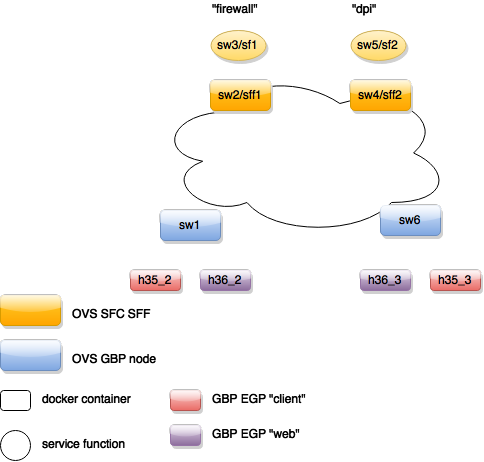

   GBP and SFC integration environment

In the topology above, a symmetrical chain between H35\_2 and H36\_3
could take path:

H35\_2 to sw1 to sff1 to sf1 to sff1 to sff2 to sf2 to sff2 to sw6 to
H36\_3

If symmetric chaining was desired, the return path is:

   GBP and SFC symmetric chain environment

If asymmetric chaining was desired, the return path could be direct, or
an **entirely different chain**.

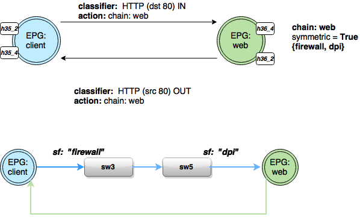

   GBP and SFC assymmetric chain environment

All these scenarios are supported by the integration.

In the **Subject Feature Instance** section of the tenant config, we
define the instances of the classifier definitions for ICMP and HTTP:

::

            "subject-feature-instances": {
              "classifier-instance": [
                {
                  "name": "icmp",
                  "parameter-value": [
                    {
                      "name": "proto",
                      "int-value": 1
                    }
                  ]
                },
                {
                  "name": "http-dest",
                  "parameter-value": [
                    {
                      "int-value": "6",
                      "name": "proto"
                    },
                    {
                      "int-value": "80",
                      "name": "destport"
                    }
                  ]
                },
                {
                  "name": "http-src",
                  "parameter-value": [
                    {
                      "int-value": "6",
                      "name": "proto"
                    },
                    {
                      "int-value": "80",
                      "name": "sourceport"
                    }
                  ]
                }
              ],

Then the action instances to associate to traffic that matches
classifiers are defined.

Note the *SFC chain name* must exist in SFC, and is validated against
the datastore once the tenant configuration is entered, before entering
a valid tenant configuration into the operational datastore (which
triggers policy resolution).

::

              "action-instance": [
                {
                  "name": "chain1",
                  "parameter-value": [
                    {
                      "name": "sfc-chain-name",
                      "string-value": "SFCGBP"
                    }
                  ]
                },
                {
                  "name": "allow1",
                }
              ]
            },

When ICMP is matched, allow the traffic:

::

            "contract": [
              {
                "subject": [
                  {
                    "name": "icmp-subject",
                    "rule": [
                      {
                        "name": "allow-icmp-rule",
                        "order" : 0,
                        "classifier-ref": [
                          {
                            "name": "icmp"
                          }
                        ],
                        "action-ref": [
                          {
                            "name": "allow1",
                            "order": 0
                          }
                        ]
                      }

                    ]
                  },

When HTTP is matched, **in** to the provider of the contract with a TCP
destination port of 80 (HTTP) or the HTTP request. The chain action is
triggered, and similarly **out** from the provider for traffic with TCP
source port of 80 (HTTP), or the HTTP response.

::

                  {
                    "name": "http-subject",
                    "rule": [
                      {
                        "name": "http-chain-rule-in",
                        "classifier-ref": [
                          {
                            "name": "http-dest",
                            "direction": "in"
                          }
                        ],
                        "action-ref": [
                          {
                            "name": "chain1",
                            "order": 0
                          }
                        ]
                      },
                      {
                        "name": "http-chain-rule-out",
                        "classifier-ref": [
                          {
                            "name": "http-src",
                            "direction": "out"
                          }
                        ],
                        "action-ref": [
                          {
                            "name": "chain1",
                            "order": 0
                          }
                        ]
                      }
                    ]
                  }

To enable asymmetrical chaining, for instance, the user desires that
HTTP requests traverse the chain, but the HTTP response does not, the
HTTP response is set to *allow* instead of chain:

::

                      {
                        "name": "http-chain-rule-out",
                        "classifier-ref": [
                          {
                            "name": "http-src",
                            "direction": "out"
                          }
                        ],
                        "action-ref": [
                          {
                            "name": "allow1",
                            "order": 0
                          }
                        ]
                      }

Demo/Development environment
----------------------------

The **GBP** project for this release has two demo/development environments.

-  Docker based GBP and GBP+SFC integration Vagrant environment

-  DevStack based GBP+Neutron integration Vagrant environment

`Demo @ GBP
wiki <https://wiki.opendaylight.org/view/Group_Based_Policy_(GBP)/Consumability/Demo>`_

