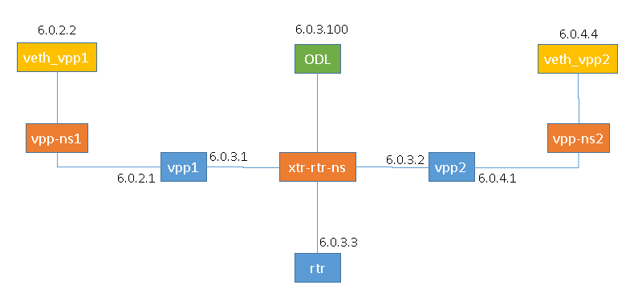

.. _lispflowmapping-user-guide:

LISP Flow Mapping User Guide
============================

Overview
--------

Locator/ID Separation Protocol
~~~~~~~~~~~~~~~~~~~~~~~~~~~~~~

`Locator/ID Separation Protocol
(LISP) <http://tools.ietf.org/html/rfc6830>`__ is a technology that
provides a flexible map-and-encap framework that can be used for overlay
network applications such as data center network virtualization and
Network Function Virtualization (NFV).

LISP provides the following name spaces:

-  `Endpoint Identifiers
   (EIDs) <http://tools.ietf.org/html/rfc6830#page-6>`__

-  `Routing Locators
   (RLOCs) <http://tools.ietf.org/html/rfc6830#section-3>`__

In a virtualization environment EIDs can be viewed as virtual address
space and RLOCs can be viewed as physical network address space.

The LISP framework decouples network control plane from the forwarding
plane by providing:

-  A data plane that specifies how the virtualized network addresses are
   encapsulated in addresses from the underlying physical network.

-  A control plane that stores the mapping of the virtual-to-physical
   address spaces, the associated forwarding policies and serves this
   information to the data plane on demand.

Network programmability is achieved by programming forwarding policies
such as transparent mobility, service chaining, and traffic engineering
in the mapping system; where the data plane elements can fetch these
policies on demand as new flows arrive. This chapter describes the LISP
Flow Mapping project in OpenDaylight and how it can be used to enable
advanced SDN and NFV use cases.

LISP data plane Tunnel Routers are available at
`OpenOverlayRouter.org <http://www.openoverlayrouter.org/>`__ in the open source community on
the following platforms:

-  Linux

-  Android

-  OpenWRT

For more details and support for LISP data plane software please visit
`the OOR web site <http://www.openoverlayrouter.org/>`__.

LISP Flow Mapping Service
~~~~~~~~~~~~~~~~~~~~~~~~~

The LISP Flow Mapping service provides LISP Mapping System services.
This includes LISP Map-Server and LISP Map-Resolver services to store
and serve mapping data to data plane nodes as well as to OpenDaylight
applications. Mapping data can include mapping of virtual addresses to
physical network address where the virtual nodes are reachable or hosted
at. Mapping data can also include a variety of routing policies
including traffic engineering and load balancing. To leverage this
service, OpenDaylight applications and services can use the northbound
REST API to define the mappings and policies in the LISP Mapping
Service. Data plane devices capable of LISP control protocol can
leverage this service through a southbound LISP plugin. LISP-enabled
devices must be configured to use this OpenDaylight service as their Map
Server and/or Map Resolver.

The southbound LISP plugin supports the LISP control protocol
(Map-Register, Map-Request, Map-Reply messages), and can also be used to
register mappings in the OpenDaylight mapping service.

LISP Flow Mapping Architecture
------------------------------

The following figure shows the various LISP Flow Mapping modules.

.. figure:: ./images/ODL_lfm_Be_component.jpg
   :alt: LISP Mapping Service Internal Architecture

   LISP Mapping Service Internal Architecture

A brief description of each module is as follows:

-  **DAO (Data Access Object):** This layer separates the LISP logic
   from the database, so that we can separate the map server and map
   resolver from the specific implementation of the mapping database.
   Currently we have an implementation of this layer with an in-memory
   HashMap, but it can be switched to any other key/value store and you
   only need to implement the ILispDAO interface.

-  **Map Server:** This module processes the adding or registration of
   authentication tokens (keys) and mappings. For a detailed
   specification of LISP Map Server, see
   `LISP <http://tools.ietf.org/search/rfc6830>`__.

-  **Map Resolver:** This module receives and processes the mapping
   lookup queries and provides the mappings to requester. For a detailed
   specification of LISP Map Server, see
   `LISP <http://tools.ietf.org/search/rfc6830>`__.

-  **RPC/RESTCONF:** This is the auto-generated RESTCONF-based
   northbound API. This module enables defining key-EID associations as
   well as adding mapping information through the Map Server. Key-EID
   associations and mappings can also be queried via this API.

-  **GUI:** This module enables adding and querying the mapping service
   through a GUI based on ODL DLUX.

-  **Neutron:** This module implements the OpenDaylight Neutron Service
   APIs. It provides integration between the LISP service and the
   OpenDaylight Neutron service, and thus OpenStack.

-  **Java API:** The API module exposes the Map Server and Map Resolver
   capabilities via a Java API.

-  **LISP Proto:** This module includes LISP protocol dependent data
   types and associated processing.

-  **In Memory DB:** This module includes the in memory database
   implementation of the mapping service.

-  **LISP Southbound Plugin:** This plugin enables data plane devices
   that support LISP control plane protocol (see
   `LISP <http://tools.ietf.org/search/rfc6830>`__) to register and
   query mappings to the LISP Flow Mapping via the LISP control plane
   protocol.

.. _lfm_config:

Configuring LISP Flow Mapping
-----------------------------

In order to use the LISP mapping service for registering EID to RLOC
mappings from northbound or southbound, keys have to be defined for the
EID prefixes first. Once a key is defined for an EID prefix, it can be
used to add mappings for that EID prefix multiple times. If the service
is going to be used to process Map-Register messages from the southbound
LISP plugin, the same key must be used by the data plane device to
create the authentication data in the Map-Register messages for the
associated EID prefix.

The ``etc/custom.properties`` file in the Karaf distribution allows
configuration of several OpenDaylight parameters. The LISP service has
the following properties that can be adjusted:

**lisp.smr** (default: *true*)
    Enables/disables the `Solicit-Map-Request
    (SMR) <http://tools.ietf.org/html/rfc6830#section-6.6.2>`__
    functionality. SMR is a method to notify changes in an EID-to-RLOC
    mapping to "subscribers". The LISP service considers all
    Map-Request’s source RLOC as a subscriber to the requested EID
    prefix, and will send an SMR control message to that RLOC if the
    mapping changes.

**lisp.elpPolicy** (default: *default*)
    Configures how to build a Map-Reply southbound message from a
    mapping containing an Explicit Locator Path (ELP) RLOC. It is used
    for compatibility with dataplane devices that don’t understand the
    ELP LCAF format. The *default* setting doesn’t alter the mapping,
    returning all RLOCs unmodified. The *both* setting adds a new RLOC
    to the mapping, with a lower priority than the ELP, that is the next
    hop in the service chain. To determine the next hop, it searches the
    source RLOC of the Map-Request in the ELP, and chooses the next hop,
    if it exists, otherwise it chooses the first hop. The *replace*
    setting adds a new RLOC using the same algorithm as the *both*
    setting, but using the origin priority of the ELP RLOC, which is
    removed from the mapping.

**lisp.lookupPolicy** (default: *northboundFirst*)
    Configures the mapping lookup algorithm. When set to
    *northboundFirst* mappings programmed through the northbound API
    will take precedence. If no northbound programmed mappings exist,
    then the mapping service will return mappings registered through the
    southbound plugin, if any exists. When set to
    *northboundAndSouthbound* the mapping programmed by the northbound
    is returned, updated by the up/down status of these mappings as
    reported by the southbound (if existing).

**lisp.mappingMerge** (default: *false*)
    Configures the merge policy on the southbound registrations through
    the LISP SB Plugin. When set to *false*, only the latest mapping
    registered through the SB plugin is valid in the southbound mapping
    database, independent of which device it came from. When set to
    *true*, mappings for the same EID registered by different devices
    are merged together and a union of the locators is maintained as the
    valid mapping for that EID.

Textual Conventions for LISP Address Formats
--------------------------------------------

In addition to the more common IPv4, IPv6 and MAC address data types,
the LISP control plane supports arbitrary `Address Family
Identifiers <http://www.iana.org/assignments/address-family-numbers>`__
assigned by IANA, and in addition to those the `LISP Canoncal Address
Format (LCAF) <https://tools.ietf.org/html/draft-ietf-lisp-lcaf>`__.

The LISP Flow Mapping project in OpenDaylight implements support for
many of these different address formats, the full list being summarized
in the following table. While some of the address formats have well
defined and widely used textual representation, many don’t. It became
necessary to define a convention to use for text rendering of all
implemented address types in logs, URLs, input fields, etc. The below
table lists the supported formats, along with their AFI number and LCAF
type, including the prefix used for disambiguation of potential overlap,
and examples output.

+------------------+----------+----------+----------+----------------------------------+
| Name             | AFI      | LCAF     | Prefix   | Text Rendering                   |
+==================+==========+==========+==========+==================================+
| **No Address**   | 0        | -        | no:      | No Address Present               |
+------------------+----------+----------+----------+----------------------------------+
| **IPv4 Prefix**  | 1        | -        | ipv4:    | 192.0.2.0/24                     |
+------------------+----------+----------+----------+----------------------------------+
| **IPv6 Prefix**  | 2        | -        | ipv6:    | 2001:db8::/32                    |
+------------------+----------+----------+----------+----------------------------------+
| **MAC Address**  | 16389    | -        | mac:     | 00:00:5E:00:53:00                |
+------------------+----------+----------+----------+----------------------------------+
| **Distinguished  | 17       | -        | dn:      | stringAsIs                       |
| Name**           |          |          |          |                                  |
+------------------+----------+----------+----------+----------------------------------+
| **AS Number**    | 18       | -        | as:      | AS64500                          |
+------------------+----------+----------+----------+----------------------------------+
| **AFI List**     | 16387    | 1        | list:    | {192.0.2.1,192.0.2.2,2001:db8::1 |
|                  |          |          |          | }                                |
+------------------+----------+----------+----------+----------------------------------+
| **Instance ID**  | 16387    | 2        | -        | [223] 192.0.2.0/24               |
+------------------+----------+----------+----------+----------------------------------+
| **Application    | 16387    | 4        | appdata: | 192.0.2.1!128!17!80-81!6667-7000 |
| Data**           |          |          |          |                                  |
+------------------+----------+----------+----------+----------------------------------+
| **Explicit       | 16387    | 10       | elp:     | {192.0.2.1→192.0.2.2\|lps→192.0. |
| Locator Path**   |          |          |          | 2.3}                             |
+------------------+----------+----------+----------+----------------------------------+
| **Source/Destina | 16387    | 12       | srcdst:  | 192.0.2.1/32\|192.0.2.2/32       |
| tion             |          |          |          |                                  |
| Key**            |          |          |          |                                  |
+------------------+----------+----------+----------+----------------------------------+
| **Key/Value      | 16387    | 15       | kv:      | 192.0.2.1⇒192.0.2.2              |
| Address Pair**   |          |          |          |                                  |
+------------------+----------+----------+----------+----------------------------------+
| **Service Path** | 16387    | N/A      | sp:      | 42(3)                            |
+------------------+----------+----------+----------+----------------------------------+

Table: LISP Address Formats

Please note that the forward slash character ``/`` typically separating
IPv4 and IPv6 addresses from the mask length is transformed into ``%2f``
when used in a URL.

Karaf commands
--------------

In this section we will discuss two types of Karaf commands: built-in,
and LISP specific. Some built-in commands are quite useful, and are
needed for the tutorial, so they will be discussed here. A reference of
all LISP specific commands, added by the LISP Flow Mapping project is
also included. They are useful mostly for debugging.

Useful built-in commands
~~~~~~~~~~~~~~~~~~~~~~~~

``help``
    Lists all available command, with a short description of each.

``help <command_name>``
    Show detailed help about a specific command.

``feature:list [-i]``
    Show all locally available features in the Karaf container. The
    ``-i`` option lists only features that are currently installed. It
    is possible to use ``| grep`` to filter the output (for all
    commands, not just this one).

``feature:install <feature_name>``
    Install feature ``feature_name``.

``log:set <level> <class>``
    Set the log level for ``class`` to ``level``. The default log level
    for all classes is INFO. For debugging, or learning about LISP
    internals it is useful to run
    ``log:set TRACE org.opendaylight.lispflowmapping`` right after Karaf
    starts up.

``log:display``
    Outputs the log file to the console, and returns control to the
    user.

``log:tail``
    Continuously shows log output, requires ``Ctrl+C`` to return to the
    console.

LISP specific commands
~~~~~~~~~~~~~~~~~~~~~~

The available lisp commands can always be obtained by
``help mappingservice``. Currently they are:

``mappingservice:addkey``
    Add the default password ``password`` for the IPv4 EID prefix
    0.0.0.0/0 (all addresses). This is useful when experimenting with
    southbound devices, and using the REST interface would be combersome
    for whatever reason.

``mappingservice:mappings``
    Show the list of all mappings stored in the internal non-persistent
    data store (the DAO), listing the full data structure. The output is
    not human friendly, but can be used for debugging.

LISP Flow Mapping Karaf Features
--------------------------------

LISP Flow Mapping has the following Karaf features that can be installed
from the Karaf console:

``odl-lispflowmapping-msmr``
    This includes the core features required to use the LISP Flow
    Mapping Service such as mapping service and the LISP southbound
    plugin.

``odl-lispflowmapping-ui``
    This includes the GUI module for the LISP Mapping Service.

``odl-lispflowmapping-neutron``
    This is the experimental Neutron provider module for LISP mapping
    service.

Tutorials
---------

This section provides a tutorial demonstrating various features in this
service. We have included tutorials using two forwarding platforms:

1.  Using `Open Overlay Router (OOR) <https://github.com/OpenOverlayRouter/oor#overview>`__

2.  Using `FD.io <https://wiki.fd.io/view/ONE>`__

Both have different approaches to create the overlay but ultimately do the
same job. Details of both approaches have been explained below.

Creating a LISP overlay with OOR
~~~~~~~~~~~~~~~~~~~~~~~~~~~~~~~~

This section provides instructions to set up a LISP network of three
nodes (one "client" node and two "server" nodes) using OOR as data
plane LISP nodes and the LISP Flow Mapping project from OpenDaylight as
the LISP programmable mapping system for the LISP network.

Overview
^^^^^^^^

The steps shown below will demonstrate setting up a LISP network between
a client and two servers, then performing a failover between the two
"server" nodes.

Prerequisites
^^^^^^^^^^^^^

-  **The OpenDaylight Karaf Distribution** (`download
   <https://www.opendaylight.org/downloads>`_)

.. _instructions:

-  **The Postman Chrome App**: the most convenient way to follow along
   this tutorial is to use the `Postman
   App <https://www.getpostman.com/apps>`__
   to edit and send the requests. The project git repository hosts a
   collection of the requests that are used in this tutorial in the
   ``resources/tutorial/OOR/Beryllium_Tutorial.json.postman_collection``
   file. You can import this file to Postman by clicking *Import* at the
   top, choosing *Download from link* and then entering the following
   URL:
   `<https://git.opendaylight.org/gerrit/gitweb?p=lispflowmapping.git;a=blob_plain;f=resources/tutorial/OOR/Beryllium_Tutorial.json.postman_collection;hb=refs/heads/stable/oxygen>`__.
   Alternatively, you can save the file on your machine, or if you have
   the repository checked out, you can import from there. You will need
   to create a new Postman Environment and define some variables within:
   ``controllerHost`` set to the hostname or IP address of the machine
   running the OpenDaylight instance, and ``restconfPort`` to 8181, if you didn’t
   modify the default controller settings.

-  **OOR version 1.0 or later** The README.md lists the dependencies needed
   to build it from source.

-  **A virtualization platform**

Target Environment
^^^^^^^^^^^^^^^^^^

The three LISP data plane nodes and the LISP mapping system are assumed
to be running in Linux virtual machines, which have the ``eth0``
interface in NAT mode to allow outside internet access and ``eth1``
connected to a host-only network, with the following IP addresses
(please adjust configuration files, JSON examples, etc. accordingly if
you’re using another addressing scheme):

+--------------------------+--------------------------+--------------------------+
| Node                     | Node Type                | IP Address               |
+==========================+==========================+==========================+
| **controller**           | OpenDaylight             | 192.168.16.11            |
+--------------------------+--------------------------+--------------------------+
| **client**               | OOR                      | 192.168.16.30            |
+--------------------------+--------------------------+--------------------------+
| **server1**              | OOR                      | 192.168.16.31            |
+--------------------------+--------------------------+--------------------------+
| **server2**              | OOR                      | 192.168.16.32            |
+--------------------------+--------------------------+--------------------------+
| **service-node**         | OOR                      | 192.168.16.33            |
+--------------------------+--------------------------+--------------------------+

Table: Nodes in the tutorial

The figure below gives a sketch of network topology that will be used in the tutorial.

In LISP terminology **client**, **server1** and **server2** are mobile nodes (MN in OOR),
**controller** is a MS/MR and **service-node** is a RTR.

Instructions
^^^^^^^^^^^^

The below steps use the command line tool cURL to talk to the LISP Flow
Mapping RPC REST API. This is so that you can see the actual request
URLs and body content on the page.

1.  Install and run the OpenDaylight distribution on the controller VM.
    Please follow the general OpenDaylight Installation Guide
    for this step. Once the OpenDaylight controller is running install
    the *odl-lispflowmapping-msmr* feature from the Karaf CLI:

    ::

        feature:install odl-lispflowmapping-msmr

    It takes quite a while to load and initialize all features and their
    dependencies. It’s worth running the command ``log:tail`` in the
    Karaf console to see when the log output is winding down, and
    continue with the tutorial after that.

2.  Install OOR on the **client**, **server1**, **server2**, and
    **service-node** VMs following the installation instructions `from
    the OOR README
    file <https://github.com/OpenOverlayRouter/oor#software-prerequisites>`__.

3.  Configure the OOR installations from the previous step. Take a look
    at the ``oor.conf.example`` to get a general idea of the structure
    of the conf file. First, check if the file ``/etc/oor.conf`` exists.
    If the file doesn't exist, create the file ``/etc/oor.conf``. Set the
    EID in ``/etc/oor.conf`` file from the IP address space selected
    for your virtual/LISP network. In this tutorial the EID of the
    **client** is set to 1.1.1.1/32, and that of **server1** and
    **server2** to 2.2.2.2/32.

4.  Set the RLOC interface to ``eth1`` in each ``oor.conf`` file. LISP
    will determine the RLOC (IP address of the corresponding VM) based
    on this interface.

5.  Set the Map-Resolver address to the IP address of the
    **controller**, and on the **client** the Map-Server too. On
    **server1** and **server2** remove the Map-Server configuration, so
    that it doesn’t interfere with the mappings on the controller, since
    we’re going to program them manually.

6.  Modify the "key" parameter in each ``oor.conf`` file to a
    key/password of your choice (*password* in this tutorial).

    .. note::

        The ``resources/tutorial/OOR`` directory in the project git repository
        has the files used in the tutorial `checked in
        <https://git.opendaylight.org/gerrit/gitweb?p=lispflowmapping.git;a=tree;f=resources/tutorial/OOR;hb=refs/heads/stable/oxygen>`_,
        so you can just copy the files to ``/etc/oor.conf`` on the respective
        VMs. You will also find the JSON files referenced below in the same
        directory.

7.  Define a key and EID prefix association in OpenDaylight using the
    RPC REST API for the **client** EID (1.1.1.1/32) to allow
    registration from the southbound. Since the mappings for the server
    EID will be configured from the REST API, no such association is
    necessary. Run the below command on the **controller** (or any
    machine that can reach **controller**, by replacing *localhost* with
    the IP address of **controller**).

    ::

        curl -u "admin":"admin" -H "Content-type: application/json" -X PUT \
            http://localhost:8181/restconf/config/odl-mappingservice:mapping-database/virtual-network-identifier/0/authentication-key/ipv4:1.1.1.1%2f32/ \
            --data @add-key.json

    where the content of the *add-key.json* file is the following:

    .. code:: json

        {
            "authentication-key": {
                "eid-uri": "ipv4:1.1.1.1/32",
                "eid": {
                    "address-type": "ietf-lisp-address-types:ipv4-prefix-afi",
                    "ipv4-prefix": "1.1.1.1/32"
                },
                "mapping-authkey": {
                    "key-string": "password",
                    "key-type": 1
                }
            }
        }

8.  Verify that the key is added properly by requesting the following
    URL:

    ::

        curl -u "admin":"admin" -H "Content-type: application/json" -X GET \
            http://localhost:8181/restconf/config/odl-mappingservice:mapping-database/virtual-network-identifier/0/authentication-key/ipv4:1.1.1.1%2f32/

    The output the above invocation should look like this:

    .. code:: json

        {
            "authentication-key":[
                {
                    "eid-uri":"ipv4:1.1.1.1/32",
                    "eid":{
                        "ipv4-prefix":"1.1.1.1/32",
                        "address-type":"ietf-lisp-address-types:ipv4-prefix-afi"
                    },
                    "mapping-authkey":{
                        "key-string":"password"
                        ,"key-type":1
                    }
                }
            ]
        }

9.  Run the ``oor`` OOR daemon on all VMs:

    ::

        oor -f /etc/oor.conf

    For more information on accessing OOR logs, take a look at
    `OOR README <https://github.com/OpenOverlayRouter/oor#readme>`__
10. The **client** OOR node should now register its EID-to-RLOC
    mapping in OpenDaylight. To verify you can lookup the corresponding
    EIDs via the REST API

    ::

        curl -u "admin":"admin" -H "Content-type: application/json" -X GET \
            http://localhost:8181/restconf/operational/odl-mappingservice:mapping-database/virtual-network-identifier/0/mapping/ipv4:1.1.1.1%2f32/southbound/

    An alternative way for retrieving mappings from OpenDaylight using the
    southbound interface is using the
    `lig <https://github.com/davidmeyer/lig>`__ open source tool.

11. Register the EID-to-RLOC mapping of the server EID 2.2.2.2/32 to the
    controller, pointing to **server1** and **server2** with a higher
    priority for **server1**

    ::

        curl -u "admin":"admin" -H "Content-type: application/json" -X PUT \
            http://localhost:8181/restconf/config/odl-mappingservice:mapping-database/virtual-network-identifier/0/mapping/ipv4:2.2.2.2%2f32/northbound/ \
            --data @mapping.json

    where the *mapping.json* file looks like this:

    .. code:: json

        {
            "mapping": {
                "eid-uri": "ipv4:2.2.2.2/32",
                "origin": "northbound",
                "mapping-record": {
                    "recordTtl": 1440,
                    "action": "NoAction",
                    "authoritative": true,
                    "eid": {
                        "address-type": "ietf-lisp-address-types:ipv4-prefix-afi",
                        "ipv4-prefix": "2.2.2.2/32"
                    },
                    "LocatorRecord": [
                        {
                            "locator-id": "server1",
                            "priority": 1,
                            "weight": 1,
                            "multicastPriority": 255,
                            "multicastWeight": 0,
                            "localLocator": true,
                            "rlocProbed": false,
                            "routed": true,
                            "rloc": {
                                "address-type": "ietf-lisp-address-types:ipv4-afi",
                                "ipv4": "192.168.16.31"
                            }
                        },
                        {
                            "locator-id": "server2",
                            "priority": 2,
                            "weight": 1,
                            "multicastPriority": 255,
                            "multicastWeight": 0,
                            "localLocator": true,
                            "rlocProbed": false,
                            "routed": true,
                            "rloc": {
                                "address-type": "ietf-lisp-address-types:ipv4-afi",
                                "ipv4": "192.168.16.32"
                            }
                        }
                    ]
                }
            }
        }

    Here the priority of the second RLOC (192.168.16.32 - **server2**)
    is 2, a higher numeric value than the priority of 192.168.16.31,
    which is 1. This policy is saying that **server1** is preferred to
    **server2** for reaching EID 2.2.2.2/32. Note that lower priority
    value has higher preference in LISP.

12. Verify the correct registration of the 2.2.2.2/32 EID:

    ::

        curl -u "admin":"admin" -H "Content-type: application/json" -X GET \
            http://localhost:8181/restconf/config/odl-mappingservice:mapping-database/virtual-network-identifier/0/mapping/ipv4:2.2.2.2%2f32/northbound/

13. Now the LISP network is up. To verify, log into the **client** VM
    and ping the server EID:

    ::

        ping 2.2.2.2

14. Let’s test fail-over now. Suppose you had a service on **server1**
    which became unavailable, but **server1** itself is still reachable.
    LISP will not automatically fail over, even if the mapping for
    2.2.2.2/32 has two locators, since both locators are still reachable
    and uses the one with the higher priority (lowest priority value).
    To force a failover, we need to set the priority of **server2** to a
    lower value. Using the file mapping.json above, swap the priority
    values between the two locators (lines 14 and 28 in *mapping.json*)
    and repeat the request from step 11. You can also repeat step 12 to
    see if the mapping is correctly registered. If you leave the ping
    on, and monitor the traffic using wireshark, you can see that the
    ping traffic to 2.2.2.2 will be diverted from the **server1** RLOC
    to the **server2** RLOC.

    With the default OpenDaylight configuration the failover should be
    near instantaneous (we observed 3 lost pings in the worst case),
    because of the LISP `Solicit-Map-Request (SMR)
    mechanism <http://tools.ietf.org/html/rfc6830#section-6.6.2>`__ that
    can ask a LISP data plane element to update its mapping for a
    certain EID (enabled by default). It is controlled by the
    ``lisp.smr`` variable in ``etc/custom.porperties``. When enabled,
    any mapping change from the RPC interface will trigger an SMR packet
    to all data plane elements that have requested the mapping in the
    last 24 hours (this value was chosen because it’s the default TTL of
    Cisco IOS xTR mapping registrations). If disabled, ITRs keep their
    mappings until the TTL specified in the Map-Reply expires.

15. To add a service chain into the path from the client to the server,
    we can use an Explicit Locator Path, specifying the **service-node**
    as the first hop and **server1** (or **server2**) as the second hop.
    The following will achieve that:

    ::

        curl -u "admin":"admin" -H "Content-type: application/json" -X PUT \
            http://localhost:8181/restconf/config/odl-mappingservice:mapping-database/virtual-network-identifier/0/mapping/ipv4:2.2.2.2%2f32/northbound/ \
            --data @elp.json

    where the *elp.json* file is as follows:

    .. code:: json

        {
            "mapping": {
                "eid-uri": "ipv4:2.2.2.2/32",
                "origin": "northbound",
                "mapping-record": {
                    "recordTtl": 1440,
                    "action": "NoAction",
                    "authoritative": true,
                    "eid": {
                        "address-type": "ietf-lisp-address-types:ipv4-prefix-afi",
                        "ipv4-prefix": "2.2.2.2/32"
                    },
                    "LocatorRecord": [
                        {
                            "locator-id": "ELP",
                            "priority": 1,
                            "weight": 1,
                            "multicastPriority": 255,
                            "multicastWeight": 0,
                            "localLocator": true,
                            "rlocProbed": false,
                            "routed": true,
                            "rloc": {
                                "address-type": "ietf-lisp-address-types:explicit-locator-path-lcaf",
                                "explicit-locator-path": {
                                    "hop": [
                                        {
                                            "hop-id": "service-node",
                                            "address": "192.168.16.33",
                                            "lrs-bits": "strict"
                                        },
                                        {
                                            "hop-id": "server1",
                                            "address": "192.168.16.31",
                                            "lrs-bits": "strict"
                                        }
                                    ]
                                }
                            }
                        }
                    ]
                }
            }
        }

    After the mapping for 2.2.2.2/32 is updated with the above, the ICMP
    traffic from **client** to **server1** will flow through the
    **service-node**. You can confirm this in the OOR logs, or by
    sniffing the traffic on either the **service-node** or **server1**.
    Note that service chains are unidirectional, so unless another ELP
    mapping is added for the return traffic, packets will go from
    **server1** to **client** directly.

16. Suppose the **service-node** is actually a firewall, and traffic is
    diverted there to support access control lists (ACLs). In this
    tutorial that can be emulated by using ``iptables`` firewall rules
    in the **service-node** VM. To deny traffic on the service chain
    defined above, the following rule can be added:

    ::

        iptables -A OUTPUT --dst 192.168.16.31 -j DROP

    The ping from the **client** should now have stopped.

    In this case the ACL is done on the destination RLOC. There is an
    effort underway in the OOR community to allow filtering on EIDs,
    which is the more logical place to apply ACLs.

17. To delete the rule and restore connectivity on the service chain,
    delete the ACL by issuing the following command:

    ::

        iptables -D OUTPUT --dst 192.168.16.31 -j DROP

    which should restore connectivity.

Creating a simple LISP overlay with FD.io
~~~~~~~~~~~~~~~~~~~~~~~~~~~~~~~~~~~~~~~~~

In this section, we use the Overlay Network Engine (ONE) project in FD.io
to facilitate fully scripted setup and testing of a LISP/VXLAN-GPE network.
Overlay Network Engine (ONE) is a `FD.io <https://fd.io/>`__ project that enables programmable
dynamic software defined overlays. Details about this project can be
found in `ONE wiki <https://wiki.fd.io/view/ONE>`__.

The steps shown below will demonstrate setting up a LISP network between
a client and a server using VPP. We demonstrate how to use VPP lite to
build a IP4 LISP overlay on an Ubuntu host using namespaces and af_packet
interfaces. All configuration files used in the tutorials can be found
`here <https://gerrit.fd.io/r/gitweb?p=one.git;a=tree;f=tutorial>`__.

Prerequisites
^^^^^^^^^^^^^

-  **The OpenDaylight Karaf Distribution** (`download
   <https://www.opendaylight.org/downloads>`_)

-  **The Postman Chrome App**: Please follow the instructions_ and import
   postman collection from the following URL: `<https://git.opendaylight.org/gerrit/gitweb?p=lispflowmapping.git;a=blob;f=resources/tutorial/FD_io/lfm_vpp.postman_collection.json;hb=refs/heads/stable/oxygen>`__.

-  **Vagrant** (optional): Download it from `Vagrant website <https://www.vagrantup.com/downloads.html>`__
   and follow the setup instructions.

Target Environment
^^^^^^^^^^^^^^^^^^

Unlike the case with OOR, we use network namespace functionality of Linux
to create the overlay in this case. The following table contains ip addresses
of nodes in the overlay topology used in the tutorial. Our objective will be to
create this topology and be able to ping from client to server through an
intermediary hop, **service node**, which is a ``rtr node`` providing the
service of re-encapsulation. So, all the packets from client to server
will be through this **service node**.

+--------------------------+--------------------------+--------------------------+
| Node                     | Node Type                | IP Address               |
+==========================+==========================+==========================+
| **controller**           | OpenDaylight             | 6.0.3.100                |
+--------------------------+--------------------------+--------------------------+
| **client**               | VPP                      | 6.0.2.2                  |
+--------------------------+--------------------------+--------------------------+
| **server**               | VPP                      | 6.0.4.4                  |
+--------------------------+--------------------------+--------------------------+
| **service node**         | VPP                      | 6.0.3.3                  |
+--------------------------+--------------------------+--------------------------+

Table: Nodes in the tutorial

The figure below gives a sketch of network topology that will be used in the tutorial.

Instructions
^^^^^^^^^^^^

Follow the instructions below sequentially.

1.  Pull the VPP code anonymously using:
    ::

        git clone https://gerrit.fd.io/r/vpp

2.  Then, use the vagrant file from repository to build virtual machine
    with proper environment.
    ::

        cd vpp/build-root/vagrant/
        vagrant up
        vagrant ssh

3.  In case there is any error from ``vagrant up``, try ``vargant ssh``. if
    it works, no worries. If it still doesn't work, you can try any Ubuntu virtual
    machine. Or sometimes there is an issue with the Vagrant properly copying
    the VPP repo code from the host VM after the first installation. In that
    case ``/vpp`` doesn't exist. In both cases, follow the instructions
    from below.

    1. Clone the code in ``/`` directory. So, the codes will be in ``/vpp``.

    2. Run the following commands:
        ::

            cd /vpp/build-root
            make distclean
            ./bootstrap.sh
            make V=0 PLATFORM=vpp TAG=vpp install-deb
            sudo dpkg -i /vpp/build-root/*.deb

    Alternative and more detailed build instructions can be found in
    `VPP's wiki <https://wiki.fd.io/view/VPP/Build,_install,_and_test_images>`__
4.  By now, you should have a Ubuntu VM with VPP repository in ``/vpp``
    with ``sudo`` access. Now, we need VPP Lite build. The following commands
    builds VPP Lite.
    ::

        cd /vpp
        export PLATFORM=vpp_lite
        make build

    Successful build create the binary in ``/vpp/build-root/install-vpp_lite_debug-native/vpp/bin``

5.  Install bridge-utils and ethtool if needed by using following commands:
    ::

       sudo apt-get install bridge-utils ethtool

6.  Now, install and run OpenDaylight on the VM. Please follow the general
    OpenDaylight Installation Guide for this step from :ref:`install_odl`.
    Before running OpenDaylight, we need to change the configuration for RTR
    to work. Update ``etc/custom.properties`` with the ``lisp.elpPolicy`` to
    be replace.
    ::

        lisp.elpPolicy = replace

    Then, run OpenDaylight. For details regarding configuring LISP
    Flow Mapping, please take a look at :ref:`lfm_config`.
    Once the OpenDaylight controller is running install the *odl-lispflowmapping-msmr*
    feature from the Karaf CLI:

    ::

        feature:install odl-lispflowmapping-msmr

    It may take quite a while to load and initialize all features and their
    dependencies. It’s worth running the command ``log:tail`` in the
    Karaf console to see when the log output is winding down, and
    continue with the tutorial after that.

7.  For setting up VPP, get the files from ``resources/tutorial/FD_io``
    folder of the lispflowmapping repo. The files can also be found `here
    <https://git.opendaylight.org/gerrit/gitweb?p=lispflowmapping.git;a=tree;f=resources/tutorial/FD_io;hb=refs/heads/stable/oxygen>`__.
    Copy the ``vpp1.config``, ``vpp2.config`` and ``rtr.config`` files in
    ``/etc/vpp/lite/``.

8.  In this example, VPP doesn't make any southbound map registers to OpenDaylight.
    So, we add the mappings directly from northbound. For that, we need
    to add the mappings to OpenDaylight via RESTCONF API.

    Register EID-to-RLOC mapping of the Client EID 6.0.2.0/24.
    ::

        curl -u "admin":"admin" -H "Content-type: application/json" -X PUT \
            http://localhost:8181/restconf/config/odl-mappingservice:mapping-database/virtual-network-identifier/0/mapping/ipv4:6.0.2.0%2f24/northbound/ \
            --data @epl1.json

    Content of epl1.json:

    .. code:: json

        {
            "mapping": {
                "eid-uri": "ipv4:6.0.2.0/24",
                "origin": "northbound",
                "mapping-record": {
                    "recordTtl": 1440,
                    "action": "NoAction",
                    "authoritative": true,
                    "eid": {
                            "address-type": "ietf-lisp-address-types:ipv4-prefix-afi",
                            "ipv4-prefix": "6.0.2.0/24"
                    },
                    "LocatorRecord": [
                        {
                            "locator-id": "ELP",
                            "priority": 1,
                            "weight": 1,
                            "multicastPriority": 255,
                            "multicastWeight": 0,
                            "localLocator": true,
                            "rlocProbed": false,
                            "routed": false,
                            "rloc": {
                                "address-type": "ietf-lisp-address-types:explicit-locator-path-lcaf",
                                "explicit-locator-path": {
                                    "hop": [
                                        {
                                            "hop-id": "Hop 1",
                                            "address": "6.0.3.3",
                                            "lrs-bits": "lookup rloc-probe strict"
                                        },
                                        {
                                            "hop-id": "Hop 2",
                                            "address": "6.0.3.1",
                                            "lrs-bits": "lookup strict"
                                        }
                                    ]
                                }
                            }
                        }
                    ]
                }
            }
        }

    Similarly add EID-to-RLOC mapping of the Server EID 6.0.4.0/24.
    ::

        curl -u "admin":"admin" -H "Content-type: application/json" -X PUT \
            http://localhost:8181/restconf/config/odl-mappingservice:mapping-database/virtual-network-identifier/0/mapping/ipv4:6.0.4.0%2f24/northbound/ \
            --data @epl2.json

    Content of elp2.json:

    .. code:: json

        {
            "mapping": {
                "eid-uri": "ipv4:6.0.4.0/24",
                "origin": "northbound",
                "mapping-record": {
                    "recordTtl": 1440,
                    "action": "NoAction",
                    "authoritative": true,
                    "eid": {
                            "address-type": "ietf-lisp-address-types:ipv4-prefix-afi",
                            "ipv4-prefix": "6.0.4.0/24"
                    },
                    "LocatorRecord": [
                        {
                            "locator-id": "ELP",
                            "priority": 1,
                            "weight": 1,
                            "multicastPriority": 255,
                            "multicastWeight": 0,
                            "localLocator": true,
                            "rlocProbed": false,
                            "routed": false,
                            "rloc": {
                                "address-type": "ietf-lisp-address-types:explicit-locator-path-lcaf",
                                "explicit-locator-path": {
                                    "hop": [
                                        {
                                            "hop-id": "Hop 1",
                                            "address": "6.0.3.3",
                                            "lrs-bits": "lookup rloc-probe strict"
                                        },
                                        {
                                            "hop-id": "Hop 2",
                                            "address": "6.0.3.2",
                                            "lrs-bits": "lookup strict"
                                        }
                                    ]
                                }
                            }
                        }
                    ]
                }
            }
        }

    The JSON files regarding these can be found in `here
    <https://git.opendaylight.org/gerrit/gitweb?p=lispflowmapping.git;a=tree;f=resources/tutorial/FD_io;hb=refs/heads/stable/oxygen>`__.
    Even though there is no southbound registration for mapping to OpenDaylight, using
    northbound policy we can specify mappings, when Client requests for
    the Server eid, Client gets a reply from OpenDaylight.

9.  Assuming all files have been created and OpenDaylight has been configured as
    explained above, execute the host script you've created or the ``topology_setup.sh``
    script from `here <https://git.opendaylight.org/gerrit/gitweb?p=lispflowmapping.git;a=tree;f=resources/tutorial/FD_io;hb=refs/heads/stable/oxygen>`__.

10. If all goes well, you can now test connectivity between the namespaces with:
    ::

        sudo ip netns exec vpp-ns1 ping 6.0.4.4

11. Traffic and control plane message exchanges can be checked with a wireshark
    listening on the odl interface.
12. .. important:: Delete the topology by running the ``topology_setup.sh`` with ``clean`` argument.
        ::

            sudo ./topology_setup.sh clean

Creating a LISP overlay with Cisco IOS-XE
~~~~~~~~~~~~~~~~~~~~~~~~~~~~~~~~~~~~~~~~~

This section describes how to create a simple LISP overlay using the Cisco
IOS-XE network operating system as the data plane software running on the
`Cisco CSR 1000v Series Cloud Services Router
<http://www.cisco.com/c/en/us/support/routers/cloud-services-router-1000v/model.html>`_.

Prerequisites
^^^^^^^^^^^^^

-  **The OpenDaylight Karaf Distribution** (`download
   <https://www.opendaylight.org/downloads>`_)

-  **CSR1Kv image with Cisco IOS-XE version 03.13.00.S or later** (`download
   <http://www.cisco.com/c/en/us/support/routers/cloud-services-router-1000v/model.html#~tab-downloads>`_;
   the instructions have been tested on version 03.15.00.S).

-  **A virtualization platform** supported by CSR1Kv images (VMware ESXi,
   Citrix XenServer, KVM, and Microsoft Hyper-V).

Target Environment
^^^^^^^^^^^^^^^^^^

The CSR1Kv images are configured with one management interface
(``GigabitEthernet1``), and another interface (``GigabitEthernet2``) connected
to a host-only network on the virtualization platform, while the LISP mapping
system is assumed to be running in a Linux virtual machine, which has the
``eth0`` interface in NAT mode to allow outside internet access and ``eth1``
connected to the host-only network, with the following IP addresses (please
adjust configuration files, JSON examples, etc.  accordingly if you’re using
another addressing scheme):

+--------------------------+--------------------------+--------------------------+
| Node                     | Node Type                | IP Address               |
+==========================+==========================+==========================+
| **controller**           | OpenDaylight             | 192.168.16.11            |
+--------------------------+--------------------------+--------------------------+
| **client**               | CSR1Kv                   | 192.168.16.30            |
+--------------------------+--------------------------+--------------------------+
| **server**               | CSR1Kv                   | 192.168.16.31            |
+--------------------------+--------------------------+--------------------------+

Table: Nodes in the tutorial

The scenario and EID allocation is the same as the OOR scenario, except that
there is no **server2** and **service-node** (for now).

Before this tutorial can be followed, basic connectivity between the Linux VM
and the CSRs should work on the host-only network.

Instructions
^^^^^^^^^^^^

The below steps use the command line tool cURL to talk to the LISP Flow
Mapping RPC REST API. This is so that you can see the actual request
URLs and body content on the page. The easy way is to just use Postman.

1.  Install and run the OpenDaylight distribution on the controller VM.
    Please follow the general OpenDaylight Installation Guide from
    :ref:`install_odl` for this step. Once the OpenDaylight controller is
    running install the *odl-lispflowmapping-msmr* feature from the Karaf CLI:

    ::

        feature:install odl-lispflowmapping-msmr

    It takes quite a while to load and initialize all features and their
    dependencies. It’s worth running the command ``log:tail`` in the
    Karaf console to see when the log output is winding down, and
    continue with the tutorial after that.

2.  Create the **client** and **server** VMs following the installation
    instructions from the `CSR1Kv Configuration Guide
    <http://www.cisco.com/c/en/us/td/docs/routers/csr1000/software/configuration/b_CSR1000v_Configuration_Guide.html>`_.

3.  Define a key and EID prefix association in OpenDaylight using the RPC REST
    API for the **client** and **server** EIDs (1.1.1.1/32 and 2.2.2.2/32
    respectively) to allow registration from the southbound.  Run the below
    command on the **controller** (or any machine that can reach
    **controller**, by replacing *localhost* with the IP address of
    **controller**).

    ::

        curl -u "admin":"admin" -H "Content-type: application/json" -X PUT \
            http://localhost:8181/restconf/config/odl-mappingservice:mapping-database/virtual-network-identifier/0/authentication-key/ipv4:1.1.1.1%2f32/ \
            --data @add-key.json

    where the content of the *add-key.json* file is the following:

    .. code:: json

        {
            "authentication-key": {
                "eid-uri": "ipv4:1.1.1.1/32",
                "eid": {
                    "address-type": "ietf-lisp-address-types:ipv4-prefix-afi",
                    "ipv4-prefix": "1.1.1.1/32"
                },
                "mapping-authkey": {
                    "key-string": "password",
                    "key-type": 1
                }
            }
        }

    The same should be done for 2.2.2.2/32 too.

4.  Verify that the key is added properly by requesting the following
    URL:

    ::

        curl -u "admin":"admin" -H "Content-type: application/json" -X GET \
            http://localhost:8181/restconf/config/odl-mappingservice:mapping-database/virtual-network-identifier/0/authentication-key/ipv4:1.1.1.1%2f32/

    The output the above invocation should look like this:

    .. code:: json

        {
            "authentication-key":[
                {
                    "eid-uri":"ipv4:1.1.1.1/32",
                    "eid":{
                        "ipv4-prefix":"1.1.1.1/32",
                        "address-type":"ietf-lisp-address-types:ipv4-prefix-afi"
                    },
                    "mapping-authkey":{
                        "key-string":"password"
                        ,"key-type":1
                    }
                }
            ]
        }

5.  Configure the CSR installations from the previous step. The EID needs to
    be configured on a loopback interface (except when the CSR is used as a
    router not a simple client like in this tutorial and the EID is assigned
    to a real interface).

    ::

        interface Loopback0
         ip address 1.1.1.1 255.255.255.255

6.  The LISP specific configuration goes to a ``router lisp`` section in the
    configuration. A ``locator-set`` defines the list of locators with their
    priorities and weights, either statically, or better yet, as an interface
    name:

    ::

        locator-set rloc-network
         IPv4-interface GigabitEthernet2 priority 1 weight 1
         exit

7.  To make sure a Map-Request is using the above defined ``rloc-network``
    locator set, the following configuration is used:

    ::

        map-request itr-rlocs rloc-network

8.  Each Instance ID needs its own configuration. For the default Instance ID
    of 0, the following configuration is needed for a besic setup:

    ::

        eid-table default instance-id 0
         database-mapping 1.1.1.1/32 locator-set rloc-network
         map-cache 0.0.0.0/0 map-request
         no ipv4 map-cache-persistent
         ipv4 itr map-resolver 192.168.16.11
         ipv4 itr
         ipv4 etr map-server 192.168.16.11 key password
         ipv4 etr
         exit

    ``database-mapping`` defines the EID prefix the router will register in
    the mapping system and which locator set it will use (``rloc-network`` in
    this case, which was defined in step 6).

    The next line creates a static map-cache entry for the whole IPv4 EID
    space, causing a Map-Request to be triggered for every destination (that
    is not directly connected on some interface).

    LISP routers save their map cache to a fie which is used to restore
    previous state on reboot. To avoid confusion due to state restored from a
    previous run, ``no ipv4 map-cache-persistent`` can be used to disable this
    behavior for non-production testing environments.

    A ``map-resolver`` is then defined, where Map-Requests will be directed to
    for mapping lookups, and then a ``map-server`` association with a shared
    secret key.

9.  Here's the full configuration that needs to be pasted into the
    configuration of the **client** to follow this tutorial:

    ::

        interface Loopback0
         ip address 1.1.1.1 255.255.255.255
        !
        router lisp
         locator-set rloc-network
          IPv4-interface GigabitEthernet2 priority 1 weight 1
          exit
         !
         map-request itr-rlocs rloc-network
         eid-table default instance-id 0
          database-mapping 1.1.1.1/32 locator-set rloc-network
          map-cache 0.0.0.0/0 map-request
          no ipv4 map-cache-persistent
          ipv4 itr map-resolver 192.168.16.11
          ipv4 itr
          ipv4 etr map-server 192.168.16.11 key password
          ipv4 etr
          exit
         !
         exit

    Configuring the **server** is done by replacing ``1.1.1.1`` with
    ``2.2.2.2`` in the above configuration snippet.

10. The CSR nodes should now register their EID-to-RLOC mappings to
    OpenDaylight. To verify, the corresponding EIDs can be looked up via the
    REST API:

    ::

        curl -u "admin":"admin" -H "Content-type: application/json" -X GET \
            http://localhost:8181/restconf/operational/odl-mappingservice:mapping-database/virtual-network-identifier/0/mapping/ipv4:1.1.1.1%2f32/southbound/

    An alternative way for retrieving mappings from OpenDaylight using the
    southbound interface is using the
    `lig <https://github.com/davidmeyer/lig>`_ open source tool.

    Yet another different way is to use the OpenDaylight mappingservice CLI,
    and type the following at the Karaf prompt:

    ::

        mappingservice:mappings

    This needs the *odl-lispflowmapping-mappingservice-shell* feature to be
    loaded. The output is intended for debugging purposes and shows the full
    Java objects stored in the map-cache.

11. Now the LISP network is up. It can be verified by pinging the **server**
    EID from the **client** CSR EID:

    ::

        ping 2.2.2.2 source 1.1.1.1

LISP Flow Mapping Support
-------------------------

For support the lispflowmapping project can be reached by emailing the
developer mailing list: lispflowmapping-dev@lists.opendaylight.org or on
the #opendaylight-lispflowmapping IRC channel on irc.freenode.net.

Additional information is also available on the `Lisp Flow Mapping
wiki <https://wiki.opendaylight.org/view/OpenDaylight_Lisp_Flow_Mapping:Main>`__

Clustering in LISP Flow Mapping
-------------------------------

Documentation regarding setting up a 3-node OpenDaylight cluster is
described at following `odl wiki
page <https://wiki.opendaylight.org/view/Running_and_testing_an_OpenDaylight_Cluster#Three-node_cluster>`__.

To turn on clustering in LISP Flow Mapping it is necessary:

-  run script **deploy.py** script. This script is in
   `integration-test <https://git.opendaylight.org/gerrit/integration/test>`__
   project placed at *tools/clustering/cluster-deployer/deploy.py*. A
   whole deploy.py command can looks like:

.. raw:: html

   

| {path\_to\_integration\_test\_project}/tools/clustering/cluster-deployer/**deploy.py**
| --**distribution** {path\_to\_distribution\_in\_zip\_format}
| --**rootdir** {dir\_at\_remote\_host\_where\_copy\_odl\_distribution}
| --**hosts** {ip1},{ip2},{ip3}
| --**clean**
| --**template** lispflowmapping
| --**rf** 3
| --**user** {user\_name\_of\_remote\_hosts}
| --**password** {password\_to\_remote\_hosts}

.. raw:: html

   

| Running this script will cause that specified **distribution** to be
  deployed to remote **hosts** specified through their IP adresses with
  using credentials (**user** and **password**). The distribution will
  be copied to specified **rootdir**. As part of the deployment, a
  **template** which contains a set of controller files which are
  different from standard ones. In this case it is specified in
| *{path\_to\_integration\_test\_project}/tools/clustering/cluster-deployer/lispflowmapping*
  directory.
| Lispflowmapping templates are part of integration-test project. There
  are 5 template files:

-  akka.conf.template

-  jolokia.xml.template

-  module-shards.conf.template

-  modules.conf.template

-  org.apache.karaf.features.cfg.template

After copying the distribution, it is unzipped and started on all of
specified **hosts** in cluster aware manner.

Remarks
~~~~~~~

It is necessary to have:

-  **unzip** program installed on all of the host

-  set all remote hosts /etc/sudoers files to not **requiretty** (should
   only matter on debian hosts)

