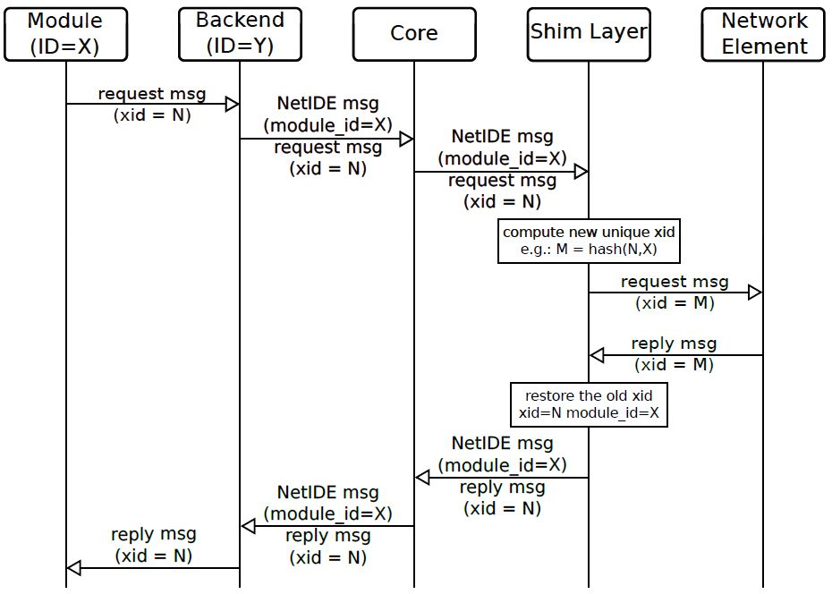

.. _netide-user-guide:

NetIDE User Guide
=================

Overview
--------

OpenDaylight’s NetIDE project allows users to run SDN applications
written for different SDN controllers, e.g., Floodlight or Ryu, on top
of OpenDaylight managed infrastructure. The NetIDE Network Engine
integrates a client controller layer that executes the modules that
compose a Network Application and interfaces with a server SDN
controller layer that drives the underlying infrastructure. In addition,
it provides a uniform interface to common tools that are intended to
allow the inspection/debug of the control channel and the management of
the network resources.

The Network Engine provides a compatibility layer capable of translating
calls of the network applications running on top of the client
controllers, into calls for the server controller framework. The
communication between the client and the server layers is achieved
through the NetIDE intermediate protocol, which is an application-layer
protocol on top of TCP that transmits the network control/management
messages from the client to the server controller and vice-versa.
Between client and server controller sits the Core Layer which also
speaks the intermediate protocol.

NetIDE API
----------

Architecture and Design
~~~~~~~~~~~~~~~~~~~~~~~

The NetIDE engine follows the ONF’s proposed Client/Server SDN
Application architecture.

.. figure:: ./images/netide/netidearch.jpg
   :alt: NetIDE Network Engine Architecture

   NetIDE Network Engine Architecture

Core
~~~~

The NetIDE Core is a message-based system that allows for the exchange
of messages between OpenDaylight and subscribed Client SDN Controllers

Handling reply messages correctly
~~~~~~~~~~~~~~~~~~~~~~~~~~~~~~~~~

When an application module sends a request to the network (e.g. flow
statistics, features, etc.), the Network Engine must be able to
correctly drive the corresponding reply to such a module. This is not a
trivial task, as many modules may compose the network application
running on top of the Network Engine, and there is no way for the Core
to pair replies and requests. The transaction IDs (xid) in the OpenFlow
header are unusable in this case, as it may happen that different
modules use the same values.

In the proposed approach, represented in the figure below, the task of
pairing replies with requests is performed by the Shim Layer which
replaces the original xid of the OpenFlow requests coming from the core
with new unique xid values. The Shim also saves the original OpenFlow
xid value and the module id it finds in the NetIDE header. As the
network elements must use the same xid values in the replies, the Shim
layer can easily pair a reply with the correct request as it is using
unique xid values.

The below figure shows how the Network Engine should handle the
controller-to-switch OpenFlow messages. The diagram shows the case of a
request message sent by an application module to a network element where
the Backend inserts the module id of the module in the NetIDE header (X
in the Figure). For other messages generated by the client controller
platform (e.g. echo requests) or by the Backend, the module id of the
Backend is used (Y in the Figure).

   NetIDE Communication Flow

Configuration
~~~~~~~~~~~~~

Below are the configuration items which can be edited, including their
default values.

-  core-address: This is the ip address of the NetIDE Core, default is
   127.0.0.1

-  core-port: The port of on which the NetIDE core is listening on

-  address: IP address where the controller listens for switch
   connections, default is 127.0.0.1

-  port: Port where controller listens for switch connections, default:
   6644

-  transport-protocol: default is TCP

-  switch-idle-timeout: default is 15000ms

