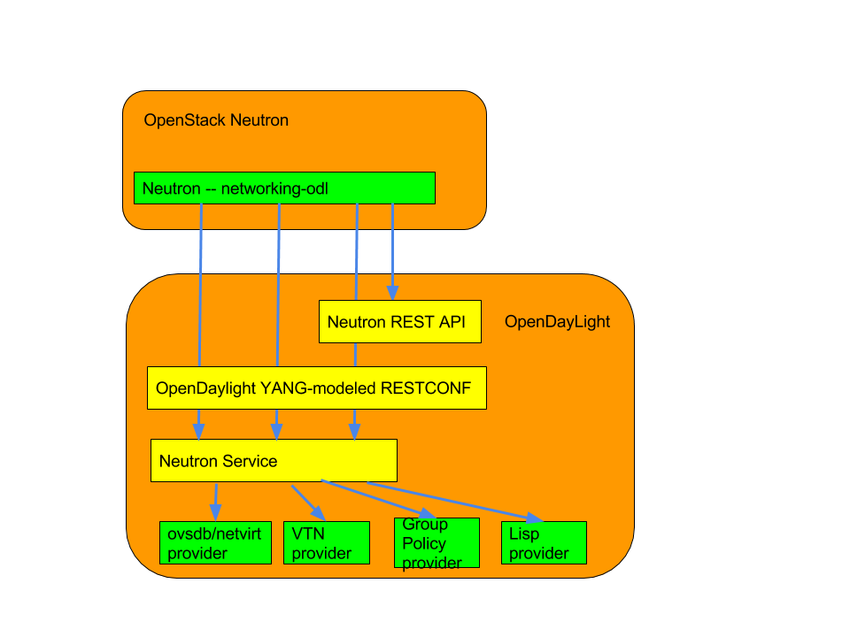

.. _neutron-service-user-guide:

Neutron Service User Guide
==========================

Overview
--------

This Karaf feature (``odl-neutron-service``) provides integration
support for OpenStack Neutron via the OpenDaylight ML2 mechanism driver.
The Neutron Service is only one of the components necessary for
OpenStack integration. For those related components please refer to
documentations of each component:

-  https://wiki.openstack.org/wiki/Neutron

-  https://launchpad.net/networking-odl

-  http://git.openstack.org/cgit/openstack/networking-odl/

-  https://wiki.opendaylight.org/view/NeutronNorthbound:Main

Use cases and who will use the feature
~~~~~~~~~~~~~~~~~~~~~~~~~~~~~~~~~~~~~~

If you want OpenStack integration with OpenDaylight, you will need this
feature with an OpenDaylight provider feature like netvirt, group
based policy, VTN, and lisp mapper. For provider configuration, please
refer to each individual provider’s documentation. Since the Neutron
service only provides the northbound API for the OpenStack Neutron ML2
mechanism driver. Without those provider features, the Neutron service
itself isn’t useful.

Neutron Service feature Architecture
------------------------------------

The Neutron service provides northbound API for OpenStack Neutron via
RESTCONF and also its dedicated REST API. It communicates through its
YANG model with providers.

   Neutron Service Architecture

Configuring Neutron Service feature
-----------------------------------

As the Karaf feature includes everything necessary for communicating
northbound, no special configuration is needed. Usually this feature is
used with an OpenDaylight southbound plugin that implements actual
network virtualization functionality and OpenStack Neutron. The user
wants to setup those configurations. Refer to each related
documentations for each configurations.

Administering or Managing ``odl-neutron-service``
-------------------------------------------------

There is no specific configuration regarding to Neutron service itself.
For related configuration, please refer to OpenStack Neutron
configuration and OpenDaylight related services which are providers for
OpenStack.

installing ``odl-neutron-service`` while the controller running
~~~~~~~~~~~~~~~~~~~~~~~~~~~~~~~~~~~~~~~~~~~~~~~~~~~~~~~~~~~~~~~

1. While OpenDaylight is running, in Karaf prompt, type:
   ``feature:install odl-neutron-service``.

2. Wait a while until the initialization is done and the controller
   stabilizes.

``odl-neutron-service`` provides only a unified interface for OpenStack
Neutron. It doesn’t provide actual functionality for network
virtualization. Refer to each OpenDaylight project documentation for
actual configuration with OpenStack Neutron.

Neutron Logger
--------------

Another service, the Neutron Logger, is provided for debugging/logging
purposes. It logs changes on Neutron YANG models.

::

    feature:install odl-neutron-logger

