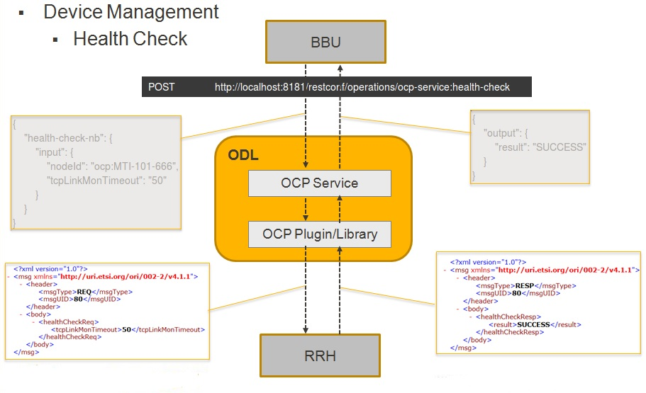
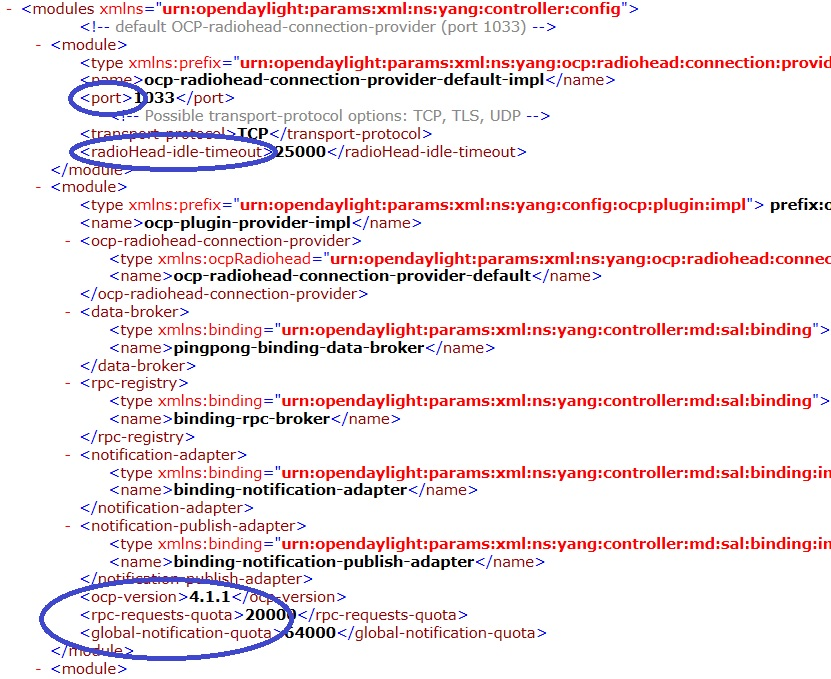

.. _ocpplugin-user-guide:

OCP Plugin User Guide
=====================

This document describes how to use the ORI Control & Management Protocol
(OCP) feature in OpenDaylight. This document contains overview, scope,
architecture and design, installation, configuration and tutorial
sections for the feature.

Overview
--------

OCP is an ETSI standard protocol for control and management of Remote
Radio Head (RRH) equipment. The OCP Project addresses the need for a
southbound plugin that allows applications and controller services to
interact with RRHs using OCP. The OCP southbound plugin will allow
applications acting as a Radio Equipment Control (REC) to interact with
RRHs that support an OCP agent.

.. figure:: ./images/ocpplugin/ocp-sb-plugin.jpg
   :alt: OCP southbound plugin

   OCP southbound plugin

It is foreseen that, in 5G, C-RAN will use the packet-based
Transport-SDN (T-SDN) as the fronthaul network to transport both control
plane and user plane data between RRHs and BBUs. As a result, the
addition of the OCP plugin to OpenDaylight will make it possible to
build an RRH controller on top of OpenDaylight to centrally manage
deployed RRHs, as well as integrating the RRH controller with T-SDN on
one single platform, achieving the joint RRH and fronthaul network
provisioning in C-RAN.

Scope
-----

The OCP Plugin project includes:

-  OCP v4.1.1 support

-  Integration of OCP protocol library

-  Simple API invoked as a RPC

-  Simple API that allows applications to perform elementary functions
   of the following categories:

   -  Device management

   -  Config management

   -  Object lifecycle

   -  Object state management

   -  Fault management

   -  Software management (not yet implemented)

-  Indication processing

-  Logging (not yet implemented)

-  AISG/Iuant interface message tunnelling (not yet implemented)

-  ALD connection management (not yet implemented)

Architecture and Design
-----------------------

OCP is a vendor-neutral standard communications interface defined to
enable control and management between RE and REC of an ORI architecture.
The OCP Plugin supports the implementation of the OCP specification; it
is based on the Model Driven Service Abstraction Layer (MD-SAL)
architecture.

OCP Plugin will support the following functionality:

-  Connection handling

-  Session management

-  State management

-  Error handling

-  Connection establishment will be handled by OCP library using
   opensource netty.io library

-  Message handling

-  Event/indication handling and propagation to upper layers

**Activities in OCP plugin module**

-  Integration with OCP protocol library

-  Integration with corresponding MD-SAL infrastructure

OCP protocol library is a component in OpenDaylight that mediates
communication between OpenDaylight controller and RRHs supporting OCP
protocol. Its primary goal is to provide the OCP Plugin with
communication channel that can be used for managing RRHs.

Key objectives:

-  Immutable transfer objects generation (transformation of OCP protocol
   library’s POJO objects into OpenDaylight DTO objects)

-  Scalable non-blocking implementation

-  Pipeline processing

-  Scatter buffer

-  TLS support

OCP Service addresses the need for a northbound interface that allows
applications and other controller services to interact with RRHs using
OCP, by providing API for abstracting OCP operations.

.. figure:: ./images/ocpplugin/plugin-design.jpg
   :alt: Overall architecture

   Overall architecture

Message Flow
------------

   Message flow example

Installation
------------

The OCP Plugin project has two top level Karaf features,
odl-ocpplugin-all and odl-ocpjava-all, which contain the following
sub-features:

-  odl-ocpplugin-southbound

-  odl-ocpplugin-app-ocp-service

-  odl-ocpjava-protocol

The OCP service (odl-ocpplugin-app-ocp-service), together with the OCP
southbound (odl-ocpplugin-southbound) and OCP protocol library
(odl-ocpjava-protocol), provides OpenDaylight with basic OCP v4.1.1
functionality.

You can interact with OCP service via RESTCONF, so you have to install
the following features to enable RESTCONF.

::

    karaf#>feature:install odl-restconf odl-l2switch-switch odl-mdsal-apidocs

Then install the odl-ocpplugin-all feature which includes the
odl-ocpplugin-southbound and odl-ocpplugin-app-ocp-service features.
Note that the odl-ocpjava-all feature will be installed automatically as
the odl-ocpplugin-southbound feature is dependent on the
odl-ocpjava-protocol feature.

::

    karaf#>feature:install odl-ocpplugin-all

After all required features are installed, use following command from
karaf console to check and make sure features are correctly installed
and initialized.

::

    karaf#>feature:list | grep ocp

Configuration
-------------

Configuring the OCP plugin can be done via its configuration file,
62-ocpplugin.xml, which can be found in the
<odl-install-dir>/etc/opendaylight/karaf/ directory.

There are the following settings that are configurable:

1. **port** specifies the port number on which the OCP plugin listens
   for connection requests

2. **radioHead-idle-timeout** determines the time duration (unit:
   milliseconds) for which a radio head has been idle before the idle
   event is triggered to perform health check

3. **ocp-version** specifies the OCP protocol version supported by the
   OCP plugin

4. **rpc-requests-quota** sets the maximum number of concurrent rpc
   requests allowed

5. **global-notification-quota** sets the maximum number of concurrent
   notifications allowed

   OCP plugin configuration

Test Environment
----------------

The OCP Plugin project contains a simple OCP agent for testing purposes;
the agent has been designed specifically to act as a fake radio head
device, giving you an idea of what it would look like during the OCP
handshake taking place between the OCP agent and OpenDaylight (OCP
plugin).

To run the simple OCP agent, you have to first download its JAR file
from OpenDaylight Nexus Repository.

::

    wget https://nexus.opendaylight.org/content/repositories/opendaylight.release/org/opendaylight/ocpplugin/simple-agent/${ocp-version}/simple-agent-${ocp-version}.jar

Then run the agent with no arguments (assuming you already have JDK 1.8
or above installed) and it should display the usage that lists the
expected arguments.

::

    java -classpath simple-agent-${ocp-version}.jar org.opendaylight.ocpplugin.OcpAgent

    Usage: java org.opendaylight.ocpplugin.OcpAgent <controller's ip address> <port number> <vendor id> <serial number>

Here is an example:

::

    java -classpath simple-agent-${ocp-version}.jar org.opendaylight.ocpplugin.OcpAgent 127.0.0.1 1033 XYZ 123

Programmatic Interface
----------------------

The OCP Plugin project has implemented a complete set of the C&M
operations (elementary functions) defined in the OCP specification, in
the form of both northbound and southbound APIs, including:

-  health-check

-  set-time

-  re-reset

-  get-param

-  modify-param

-  create-obj

-  delete-obj

-  get-state

-  modify-state

-  get-fault

The API is documented in the OCP Plugin Developer Guide under the
section Southbound API and Northbound API, respectively.
