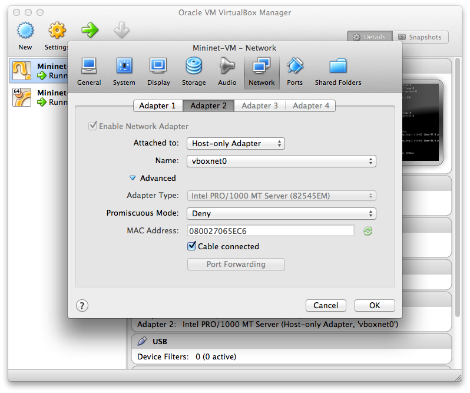

.. _ofp-user-guide:

OpenFlow Plugin Project User Guide
==================================

Overview and Architecture
-------------------------

Overview and Architecture
~~~~~~~~~~~~~~~~~~~~~~~~~

Overview
^^^^^^^^

OpenFlow is a vendor-neutral standard communications interface defined
to enable interaction between the control and forwarding layers of an
SDN architecture. The OpenFlow plugin project intends to develop a
plugin to support implementations of the OpenFlow specification as it
develops and evolves. Specifically the project has developed a plugin
aiming to support OpenFlow 1.0 and 1.3.x. It can be extended to add
support for subsequent OpenFlow specifications. The plugin is based on
the Model Driven Service Abstraction Layer (MD-SAL) architecture
(https://wiki.opendaylight.org/view/OpenDaylight_Controller:MD-SAL).
This new OpenFlow 1.0/1.3 MD-SAL based plugin is distinct from the old
OpenFlow 1.0 plugin which was based on the API driven SAL (AD-SAL)
architecture.

Scope
^^^^^

-  Southbound plugin and integration of OpenFlow 1.0/1.3.x library
   project

-  Ongoing support and integration of the OpenFlow specification

-  The plugin should be implemented in an easily extensible manner

-  Protocol verification activities will be performed on supported
   OpenFlow specifications

Architecture and Design
^^^^^^^^^^^^^^^^^^^^^^^

Functionality
'''''''''''''

OpenFlow 1.3 Plugin will support the following functionality

-  Connection Handling

-  Session Management

-  State Management.

-  Error Handling.

-  Mapping function(Infrastructure to OF structures).

-  Connection establishment will be handled by OpenFlow library using
   opensource netty.io library.

-  Message handling(Ex: Packet in).

-  Event handling and propagation to upper layers.

-  Plugin will support both MD-SAL and Hard SAL.

-  Will be backward compatible with OF 1.0.

**Activities in OF plugin module**

-  New OF plugin bundle will support both OF 1.0 and OF 1.3.

-  Integration with OpenFlow library.

-  Integration with corresponding MD-SAL infrastructure.

-  Hard SAL will be supported as adapter on top of MD-SAL plugin.

-  OF 1.3 and OF 1.0 plugin will be integrated as single bundle.

Design
''''''

**Overall Architecture**

   overal architecture

Security
''''''''

**TLS**

It is strongly recommended that any production deployments utilising
the OpenFlow Plugin do so with TLS encryption to protect against
various man-in-the-middle attacks. Please refer to the `Certificate
Management section of the user guide <https://docs.opendaylight.org/en/latest/user-guide/authentication-and-authorization-services.html#id4>`_
for more details. TLS Support in the OpenFlow Plugin is outlined on `this
wiki page <https://wiki.opendaylight.org/view/OpenDaylight_OpenFlow_Plugin:_TLS_Support>`_.

Coverage
~~~~~~~~

Intro
^^^^^

This page is to catalog the things that have been tested and confirmed
to work:

Coverage
^^^^^^^^

Coverage has been moved to a `GoogleDoc
Spreadsheet <https://docs.google.com/spreadsheet/ccc?key=0AtpUuSEP8OyMdHNTZjBoM0VjOE9BcGhHMzk3N19uamc&usp=sharing%23gid=2#gid=0>`_

OF 1.3 Considerations
^^^^^^^^^^^^^^^^^^^^^

The baseline model is a OF 1.3 model, and the coverage tables primarily
deal with OF 1.3. However for OF 1.0, we have a column to indicate
either N/A if it doesn’t apply, or whether its been confirmed working.

OF 1.0 Considerations
^^^^^^^^^^^^^^^^^^^^^

OF 1.0 is being considered as a switch with: \* 1 Table \* 0 Groups \* 0
Meters \* 1 Instruction (Apply Actions) \* and a limited vocabulary of
matches and actions.

Tutorial / How-To
-----------------

.. _ofp-running-new-plugin:

Running the controller with the new OpenFlow Plugin
~~~~~~~~~~~~~~~~~~~~~~~~~~~~~~~~~~~~~~~~~~~~~~~~~~~

**How to start**

There are all helium features (from features-openflowplugin) duplicated
into features-openflowplugin-li. The duplicates got suffix *-li* and
provide Lithium codebase functionality.

These are most used:

-  odl-openflowplugin-app-lldp-speaker-li

-  odl-openflowplugin-flow-services-rest-li

-  odl-openflowplugin-drop-test-li

In case topology is required then the first one should be installed.

::

    feature:install odl-openflowplugin-app-lldp-speaker-li

The Li-southbound currently provides:

-  flow management

-  group management

-  meter management

-  statistics polling

**What to log**

In order to see really low level messages enter these in karaf console:

::

    log:set TRACE org.opendaylight.openflowplugin.openflow.md.core
    log:set TRACE org.opendaylight.openflowplugin.impl

**How enable topology**

In order for topology to work (fill dataStore/operational with links)
there must be LLDP responses delivered back to controller. This requires
table-miss-entries. Table-miss-entry is a flow in table.id=0 with low
priority, empty match and one output action = send to controller. Having
this flow installed on every node will enable for gathering and
exporting links between nodes into dataStore/operational. This is done
if you use for example l2 switch application.

.. code:: xml

    <?xml version="1.0" encoding="UTF-8" standalone="no"?>
    <flow xmlns="urn:opendaylight:flow:inventory">
       <barrier>false</barrier>
       <cookie>54</cookie>
       <flags>SEND_FLOW_REM</flags>
       <flow-name>FooXf54</flow-name>
       <hard-timeout>0</hard-timeout>
       <id>4242</id>
       <idle-timeout>0</idle-timeout>
       <installHw>false</installHw>
       <instructions>
           <instruction>
               <apply-actions>
                   <action>
                       <output-action>
                           <max-length>65535</max-length>
                           <output-node-connector>CONTROLLER</output-node-connector>
                       </output-action>
                       <order>0</order>
                   </action>
               </apply-actions>
               <order>0</order>
           </instruction>
       </instructions>
       <match/>
       <priority>0</priority>
       <strict>false</strict>
       <table_id>0</table_id>
    </flow>

**Enable RESTCONF and Controller GUI**

If you want to use RESTCONF with openflowplugin project, you have to
install *odl-restconf* feature to enable that. To install *odl-restconf*
feature run the following command

::

    karaf#>feature:install odl-restconf

OpenFlow 1.3 Enabled Software Switches / Environment
~~~~~~~~~~~~~~~~~~~~~~~~~~~~~~~~~~~~~~~~~~~~~~~~~~~~

Getting Mininet with OF 1.3
^^^^^^^^^^^^^^^^^^^^^^^^^^^

`Download Mininet VM Upgraded to OF
1.3 <https://www.dropbox.com/s/dbf9a372elqs1s1/mininet-of-1.3.zip>`_
(or the `newer mininet-2.1.0 with
OVS-2.0 <https://www.dropbox.com/s/t66vqfqx57a7nhk/mininet-2.1.0-of1.3.zip>`_
that works with VMware Player. For using this on VirtualBox, import this
to VMware Player and then export the .vmdk ) or you could build one
yourself Openflow Protocol Library:OpenVirtualSwitch[Instructions for
setting up Mininet with OF 1.3].

Installing under VirtualBox
'''''''''''''''''''''''''''

   configuring a host-only adapter

For whatever reason, at least on the Mac, NATed interfaces in VirtualBox
don’t actually seem to allow for connections from the host to the VM.
Instead, you need to configure a host-only network and set it up. Do
this by:

-  Go to the VM’s settings in VirtualBox then to network and add a
   second adapter attached to "Host-only Adapter" (see the screenshot to
   the right)

-  Edit the /etc/network/interfaces file to configure the adapter
   properly by adding these two lines

::

    auto eth1
    iface eth1 inet dhcp

-  Reboot the VM

At this point you should have two interfaces one which gives you NATed
access to the internet and another that gives you access between your
mac and the VMs. At least for me, the NATed interface gets a 10.0.2.x
address and the the host-only interface gets a 192.168.56.x address.

Your simplest choice: Use Vagrant
'''''''''''''''''''''''''''''''''

`Download Virtual Box <https://www.virtualbox.org/>`_ and install it
`Download Vagrant <http://www.vagrantup.com/>`_ and install it

::

    cd openflowplugin/vagrant/mininet-2.1.0-of-1.3/
    vagrant up
    vagrant ssh

This will leave you sshed into a fully provisioned Ubuntu Trusty box
with mininet-2.1.0 and OVS 2.0 patches to work with OF 1.3.

Setup CPqD Openflow 1.3 Soft Switch
^^^^^^^^^^^^^^^^^^^^^^^^^^^^^^^^^^^

Latest version of Openvswitch (v2.0.0) doesn’t support all the openflow
1.3 features, e.g group multipart statistics request. Alternate options
is CPqD Openflow 1.3 soft switch, It supports most of the openflow 1.3
features.

-  You can setup the switch as per the instructions given on the
   following URL

`https://github.com/CPqD/ofsoftswitch13 <https://github.com/CPqD/ofsoftswitch13>`_

-  Fire following command to start the switch

Start the datapath :

::

    $ sudo udatapath/ofdatapath --datapath-id=<dpid> --interfaces=<if-list> ptcp:<port>
     e.g $ sudo udatapath/ofdatapath --datapath-id=000000000001 --interfaces=ethX ptcp:6680

ethX should not be associated with ip address and ipv6 should be
disabled on it. If you are installing the switch on your local machine,
you can use following command (for Ubuntu) to create virtual interface.

::

    ip link add link ethX address 00:19:d1:29:d2:58 macvlan0 type macvlan

ethX - Any existing interface.

Or if you are using mininet VM for installing this switch, you can
simply add one more adaptor to your VM.

Start Openflow protocol agent:

::

    $secchan/ofprotocol tcp:<switch-host>:<switch-port> tcp:<ctrl-host>:<ctrl-port>
     e.g $secchan/ofprotocol tcp:127.0.0.1:6680 tcp:127.0.0.1:6653

Commands to add entries to various tables of the switch
'''''''''''''''''''''''''''''''''''''''''''''''''''''''

-  Add meter

::

    $utilities/dpctl tcp:<switch-host>:<switch-port> meter-mod cmd=add,meter=1 drop:rate=50

-  Add Groups

::

    $utilities/dpctl tcp:127.0.0.1:6680 group-mod cmd=add,type=all,group=1

::

    $utilities/dpctl tcp:127.0.0.1:6680 group-mod cmd=add,type=sel,group=2 weight=10 output:1

-  Create queue

::

    $utilities/dpctl tcp:<ip>:<switch port> queue-mod <port-number> <queue-number> <minimum-bandwidth>
      e.g - $utilities/dpctl tcp:127.0.0.1:6680 queue-mod 1 1 23

"dpctl" --help is not very intuitive, so please keep adding any new
command you figured out while your experiment with the switch.

Using the built-in Wireshark
''''''''''''''''''''''''''''

Mininet comes with pre-installed Wireshark, but for some reason it does
not include the Openflow protocol dissector. You may want to get and
install it in the */.wireshark/plugins/* directory.

First login to your mininet VM

::

     ssh mininet@<your mininet vm ip> -X

The -X option in ssh will enable x-session over ssh so that the
wireshark window can be shown on your host machine’s display. when
prompted, enter the password (mininet).

From the mininet vm shell, set the wireshark capture privileges
(http://wiki.wireshark.org/CaptureSetup/CapturePrivileges):

::

    sudo chgrp mininet /usr/bin/dumpcap
    sudo chmod 754 /usr/bin/dumpcap
    sudo setcap 'CAP_NET_RAW+eip CAP_NET_ADMIN+eip' /usr/bin/dumpcap

Finally, start wireshark:

::

     wireshark

The wireshark window should show up.

To see only Openflow packets, you may want to apply the following filter
in the Filter window:

::

     tcp.port == 6633 and tcp.flags.push == 1

Start the capture on *any* port.

Running Mininet with OF 1.3
^^^^^^^^^^^^^^^^^^^^^^^^^^^

From within the Mininet VM, run:

::

     sudo mn --topo single,3  --controller 'remote,ip=<your controller ip>,port=6653' --switch ovsk,protocols=OpenFlow13

.. _ofp-e2e-inv:

End to End Inventory
~~~~~~~~~~~~~~~~~~~~

Introduction
^^^^^^^^^^^^

The purpose of this page is to walk you through how to see the Inventory
Manager working end to end with the openflowplugin using OpenFlow 1.3.

Basically, you will learn how to:

1. Run the Base/Virtualization/Service provider Edition with the new
   openflowplugin:
   OpenDaylight\_OpenFlow\_Plugin::Running\_controller\_with\_the\_new\_OF\_plugin[Running
   the controller with the new OpenFlow Plugin]

2. Start mininet to use OF 1.3:
   OpenDaylight\_OpenFlow\_Plugin::Test\_Environment[OpenFlow 1.3
   Enabled Software Switches / Environment]

3. Use RESTCONF to see the nodes appear in inventory.

Restconf for Inventory
^^^^^^^^^^^^^^^^^^^^^^

The REST url for listing all the nodes is:

::

    http://localhost:8181/restconf/operational/opendaylight-inventory:nodes/

You will need to set the Accept header:

::

    Accept: application/xml

You will also need to use HTTP Basic Auth with username: admin password:
admin.

Alternately, if you have a node’s id you can address it as

::

    http://localhost:8181/restconf/operational/opendaylight-inventory:nodes/node/<id>

for example

::

    http://localhost:8181/restconf/operational/opendaylight-inventory:nodes/node/openflow:1

How to hit RestConf with Postman
''''''''''''''''''''''''''''''''

`Install Postman for
Chrome <https://chrome.google.com/webstore/detail/postman-rest-client/fdmmgilgnpjigdojojpjoooidkmcomcm?hl=en>`_

In the chrome browser bar enter

::

    chrome://apps/

And click on Postman.

Enter the URL. Click on the Headers button on the far right. Enter the
Accept: header. Click on the Basic Auth Tab at the top and setup the
username and password. Send.

Known Bug
^^^^^^^^^

If you have not had any switches come up, and though no children for
http://localhost:8080/restconf/datastore/opendaylight-inventory:nodes/
and exception will be thrown. I’m pretty sure I know how to fix this
bug, just need to get to it :)

End to End Flows
~~~~~~~~~~~~~~~~

Instructions
^^^^^^^^^^^^

Learn End to End for Inventory
''''''''''''''''''''''''''''''

See :ref:`ofp-e2e-inv`

Check inventory
'''''''''''''''

-  Run mininet with support for OF 1.3 as described in :ref:`ofp-e2e-inv`

-  Make sure you see the openflow:1 node come up as described in :ref:`ofp-e2e-inv`

Flow Strategy
'''''''''''''

Current way to flush a flow to switch looks like this:

1. Create MD-SAL modeled flow and commit it into dataStore using two
   phase commit `MD-SAL
   FAQ <https://wiki.opendaylight.org/view/OpenDaylight_Controller:MD-SAL:FAQ>`_

2. FRM gets notified and invokes corresponding rpc (addFlow) on
   particular service provider (if suitable provider for given node
   registered)

3. The provider (plugin in this case) transforms MD-SAL modeled flow
   into OF-API modeled flow

4. OF-API modeled flow is then flushed into OFLibrary

5. OFLibrary encodes flow into particular version of wire protocol and
   sends it to particular switch

6. Check on mininet side if flow is set

Push your flow
''''''''''''''

-  With PostMan:

   -  Set headers:

      -  Content-Type: application/xml

      -  Accept: application/xml

      -  Authentication

   -  Use URL: "http://<controller
      IP>:8181/restconf/config/opendaylight-inventory:nodes/node/openflow:1/table/0/flow/1"

   -  PUT

   -  Use Body:

.. code:: xml

    <?xml version="1.0" encoding="UTF-8" standalone="no"?>
    <flow xmlns="urn:opendaylight:flow:inventory">
        <priority>2</priority>
        <flow-name>Foo</flow-name>
        <match>
            <ethernet-match>
                <ethernet-type>
                    <type>2048</type>
                </ethernet-type>
            </ethernet-match>
            <ipv4-destination>10.0.10.2/24</ipv4-destination>
        </match>
        <id>1</id>
        <table_id>0</table_id>
        <instructions>
            <instruction>
                <order>0</order>
                <apply-actions>
                    <action>
                       <order>0</order>
                       <dec-nw-ttl/>
                    </action>
                </apply-actions>
            </instruction>
        </instructions>
    </flow>

**\*Note**: If you want to try a different flow id or a different table,
make sure the URL and the body stay in sync. For example, if you wanted
to try: table 2 flow 20 you’d change the URL to:

"http://<controller
IP>:8181/restconf/config/opendaylight-inventory:nodes/node/openflow:1/table/2/flow/20"

but you would also need to update the 20 and 2 in the body of the XML.

Other caveat, we have a known bug with updates, so please only write to
a given flow id and table id on a given node once at this time until we
resolve it. Or you can use the DELETE method with the same URL in
PostMan to delete the flow information on switch and controller cache.

Check for your flow on the switch
'''''''''''''''''''''''''''''''''

-  See your flow on your mininet:

::

    mininet@mininet-vm:~$ sudo ovs-ofctl -O OpenFlow13 dump-flows s1
    OFPST_FLOW reply (OF1.3) (xid=0x2):
    cookie=0x0, duration=7.325s, table=0, n_packets=0, n_bytes=0, idle_timeout=300, hard_timeout=600, send_flow_rem priority=2,ip,nw_dst=10.0.10.0/24 actions=dec_ttl

If you want to see the above information from the mininet prompt - use
"sh" instead of "sudo" i.e. use "sh ovs-ofctl -O OpenFlow13 dump-flows
s1".

Check for your flow in the controller config via RESTCONF
'''''''''''''''''''''''''''''''''''''''''''''''''''''''''

-  See your configured flow in POSTMAN with

   -  URL http://<controller IP>:8181/restconf/operational/opendaylight-inventory:nodes/node/openflow:1/table/0/

   -  GET

   -  You no longer need to set Accept header

Return Response:

.. code:: json

    {
      "flow-node-inventory:table": [
        {
          "flow-node-inventory:id": 0,
          "flow-node-inventory:flow": [
            {
              "flow-node-inventory:priority": 1,
              "flow-node-inventory:id": "10b1a23c-5299-4f7b-83d6-563bab472754",
              "flow-node-inventory:table_id": 0,
              "flow-node-inventory:hard-timeout": 0,
              "flow-node-inventory:idle-timeout": 0,
              "flow-node-inventory:instructions": {
                "flow-node-inventory:instruction": [
                  {
                    "flow-node-inventory:apply-actions": {
                      "flow-node-inventory:action": [
                        {
                          "flow-node-inventory:output-action": {
                            "flow-node-inventory:output-node-connector": "openflow:1:1"
                          },
                          "flow-node-inventory:order": 0
                        }
                      ]
                    },
                    "flow-node-inventory:order": 0
                  }
                ]
              },
              "flow-node-inventory:match": {
                "flow-node-inventory:ethernet-match": {
                  "flow-node-inventory:ethernet-type": {
                    "flow-node-inventory:type": 2048
                  }
                },
                "flow-node-inventory:ipv4-destination": "10.0.0.2"
              },
              "flow-node-inventory:cookie": 0
            },
            {
              "flow-node-inventory:priority": 1,
              "flow-node-inventory:id": "020bf359-1299-4da6-b4f7-368bd83b5841",
              "flow-node-inventory:table_id": 0,
              "flow-node-inventory:hard-timeout": 0,
              "flow-node-inventory:idle-timeout": 0,
              "flow-node-inventory:instructions": {
                "flow-node-inventory:instruction": [
                  {
                    "flow-node-inventory:apply-actions": {
                      "flow-node-inventory:action": [
                        {
                          "flow-node-inventory:output-action": {
                            "flow-node-inventory:output-node-connector": "openflow:1:1"
                          },
                          "flow-node-inventory:order": 0
                        }
                      ]
                    },
                    "flow-node-inventory:order": 0
                  }
                ]
              },
              "flow-node-inventory:match": {
                "flow-node-inventory:ethernet-match": {
                  "flow-node-inventory:ethernet-type": {
                    "flow-node-inventory:type": 2048
                  }
                },
                "flow-node-inventory:ipv4-destination": "10.0.0.1"
              },
              "flow-node-inventory:cookie": 0
            },
            {
              "flow-node-inventory:priority": 1,
              "flow-node-inventory:id": "42172bfc-9142-4a92-9e90-ee62529b1e85",
              "flow-node-inventory:table_id": 0,
              "flow-node-inventory:hard-timeout": 0,
              "flow-node-inventory:idle-timeout": 0,
              "flow-node-inventory:instructions": {
                "flow-node-inventory:instruction": [
                  {
                    "flow-node-inventory:apply-actions": {
                      "flow-node-inventory:action": [
                        {
                          "flow-node-inventory:output-action": {
                            "flow-node-inventory:output-node-connector": "openflow:1:1"
                          },
                          "flow-node-inventory:order": 0
                        }
                      ]
                    },
                    "flow-node-inventory:order": 0
                  }
                ]
              },
              "flow-node-inventory:match": {
                "flow-node-inventory:ethernet-match": {
                  "flow-node-inventory:ethernet-type": {
                    "flow-node-inventory:type": 2048
                  }
                },
                "flow-node-inventory:ipv4-destination": "10.0.0.3"
              },
              "flow-node-inventory:cookie": 0
            },
            {
              "flow-node-inventory:priority": 1,
              "flow-node-inventory:id": "99bf566e-89f3-4c6f-ae9e-e26012ceb1e4",
              "flow-node-inventory:table_id": 0,
              "flow-node-inventory:hard-timeout": 0,
              "flow-node-inventory:idle-timeout": 0,
              "flow-node-inventory:instructions": {
                "flow-node-inventory:instruction": [
                  {
                    "flow-node-inventory:apply-actions": {
                      "flow-node-inventory:action": [
                        {
                          "flow-node-inventory:output-action": {
                            "flow-node-inventory:output-node-connector": "openflow:1:1"
                          },
                          "flow-node-inventory:order": 0
                        }
                      ]
                    },
                    "flow-node-inventory:order": 0
                  }
                ]
              },
              "flow-node-inventory:match": {
                "flow-node-inventory:ethernet-match": {
                  "flow-node-inventory:ethernet-type": {
                    "flow-node-inventory:type": 2048
                  }
                },
                "flow-node-inventory:ipv4-destination": "10.0.0.4"
              },
              "flow-node-inventory:cookie": 0
            },
            {
              "flow-node-inventory:priority": 1,
              "flow-node-inventory:id": "019dcc2e-5b4f-44f0-90cc-de490294b862",
              "flow-node-inventory:table_id": 0,
              "flow-node-inventory:hard-timeout": 0,
              "flow-node-inventory:idle-timeout": 0,
              "flow-node-inventory:instructions": {
                "flow-node-inventory:instruction": [
                  {
                    "flow-node-inventory:apply-actions": {
                      "flow-node-inventory:action": [
                        {
                          "flow-node-inventory:output-action": {
                            "flow-node-inventory:output-node-connector": "openflow:1:2"
                          },
                          "flow-node-inventory:order": 0
                        }
                      ]
                    },
                    "flow-node-inventory:order": 0
                  }
                ]
              },
              "flow-node-inventory:match": {
                "flow-node-inventory:ethernet-match": {
                  "flow-node-inventory:ethernet-type": {
                    "flow-node-inventory:type": 2048
                  }
                },
                "flow-node-inventory:ipv4-destination": "10.0.0.5"
              },
              "flow-node-inventory:cookie": 0
            },
            {
              "flow-node-inventory:priority": 1,
              "flow-node-inventory:id": "968cf81e-3f16-42f1-8b16-d01ff719c63c",
              "flow-node-inventory:table_id": 0,
              "flow-node-inventory:hard-timeout": 0,
              "flow-node-inventory:idle-timeout": 0,
              "flow-node-inventory:instructions": {
                "flow-node-inventory:instruction": [
                  {
                    "flow-node-inventory:apply-actions": {
                      "flow-node-inventory:action": [
                        {
                          "flow-node-inventory:output-action": {
                            "flow-node-inventory:output-node-connector": "openflow:1:2"
                          },
                          "flow-node-inventory:order": 0
                        }
                      ]
                    },
                    "flow-node-inventory:order": 0
                  }
                ]
              },
              "flow-node-inventory:match": {
                "flow-node-inventory:ethernet-match": {
                  "flow-node-inventory:ethernet-type": {
                    "flow-node-inventory:type": 2048
                  }
                },
                "flow-node-inventory:ipv4-destination": "10.0.0.8"
              },
              "flow-node-inventory:cookie": 0
            },
            {
              "flow-node-inventory:priority": 1,
              "flow-node-inventory:id": "1c14ea3c-9dcc-4434-b566-7e99033ea252",
              "flow-node-inventory:table_id": 0,
              "flow-node-inventory:hard-timeout": 0,
              "flow-node-inventory:idle-timeout": 0,
              "flow-node-inventory:instructions": {
                "flow-node-inventory:instruction": [
                  {
                    "flow-node-inventory:apply-actions": {
                      "flow-node-inventory:action": [
                        {
                          "flow-node-inventory:output-action": {
                            "flow-node-inventory:output-node-connector": "openflow:1:2"
                          },
                          "flow-node-inventory:order": 0
                        }
                      ]
                    },
                    "flow-node-inventory:order": 0
                  }
                ]
              },
              "flow-node-inventory:match": {
                "flow-node-inventory:ethernet-match": {
                  "flow-node-inventory:ethernet-type": {
                    "flow-node-inventory:type": 2048
                  }
                },
                "flow-node-inventory:ipv4-destination": "10.0.0.6"
              },
              "flow-node-inventory:cookie": 0
            },
            {
              "flow-node-inventory:priority": 1,
              "flow-node-inventory:id": "ed9deeb2-be8f-4b84-bcd8-9d12049383d6",
              "flow-node-inventory:table_id": 0,
              "flow-node-inventory:hard-timeout": 0,
              "flow-node-inventory:idle-timeout": 0,
              "flow-node-inventory:instructions": {
                "flow-node-inventory:instruction": [
                  {
                    "flow-node-inventory:apply-actions": {
                      "flow-node-inventory:action": [
                        {
                          "flow-node-inventory:output-action": {
                            "flow-node-inventory:output-node-connector": "openflow:1:2"
                          },
                          "flow-node-inventory:order": 0
                        }
                      ]
                    },
                    "flow-node-inventory:order": 0
                  }
                ]
              },
              "flow-node-inventory:match": {
                "flow-node-inventory:ethernet-match": {
                  "flow-node-inventory:ethernet-type": {
                    "flow-node-inventory:type": 2048
                  }
                },
                "flow-node-inventory:ipv4-destination": "10.0.0.7"
              },
              "flow-node-inventory:cookie": 0
            }
          ]
        }
      ]
    }

Look for your flow stats in the controller operational data via
'''''''''''''''''''''''''''''''''''''''''''''''''''''''''''''''

RESTCONF

-  See your operational flow stats in POSTMAN with

   -  URL "http://<controller
      IP>:8181/restconf/operational/opendaylight-inventory:nodes/node/openflow:1/table/0/"

   -  GET

Return Response:

.. code:: json

    {
      "flow-node-inventory:table": [
        {
          "flow-node-inventory:id": 0,
          "flow-node-inventory:flow": [
            {
              "flow-node-inventory:id": "10b1a23c-5299-4f7b-83d6-563bab472754",
              "opendaylight-flow-statistics:flow-statistics": {
                "opendaylight-flow-statistics:cookie": 0,
                "opendaylight-flow-statistics:duration": {
                  "opendaylight-flow-statistics:nanosecond": 886000000,
                  "opendaylight-flow-statistics:second": 2707
                },
                "opendaylight-flow-statistics:hard-timeout": 0,
                "opendaylight-flow-statistics:byte-count": 784,
                "opendaylight-flow-statistics:match": {
                  "opendaylight-flow-statistics:ethernet-match": {
                    "opendaylight-flow-statistics:ethernet-type": {
                      "opendaylight-flow-statistics:type": 2048
                    }
                  },
                  "opendaylight-flow-statistics:ipv4-destination": "10.0.0.2/32"
                },
                "opendaylight-flow-statistics:priority": 1,
                "opendaylight-flow-statistics:packet-count": 8,
                "opendaylight-flow-statistics:table_id": 0,
                "opendaylight-flow-statistics:idle-timeout": 0,
                "opendaylight-flow-statistics:instructions": {
                  "opendaylight-flow-statistics:instruction": [
                    {
                      "opendaylight-flow-statistics:order": 0,
                      "opendaylight-flow-statistics:apply-actions": {
                        "opendaylight-flow-statistics:action": [
                          {
                            "opendaylight-flow-statistics:order": 0,
                            "opendaylight-flow-statistics:output-action": {
                              "opendaylight-flow-statistics:output-node-connector": "1",
                              "opendaylight-flow-statistics:max-length": 0
                            }
                          }
                        ]
                      }
                    }
                  ]
                }
              }
            },
            {
              "flow-node-inventory:id": "020bf359-1299-4da6-b4f7-368bd83b5841",
              "opendaylight-flow-statistics:flow-statistics": {
                "opendaylight-flow-statistics:cookie": 0,
                "opendaylight-flow-statistics:duration": {
                  "opendaylight-flow-statistics:nanosecond": 826000000,
                  "opendaylight-flow-statistics:second": 2711
                },
                "opendaylight-flow-statistics:hard-timeout": 0,
                "opendaylight-flow-statistics:byte-count": 1568,
                "opendaylight-flow-statistics:match": {
                  "opendaylight-flow-statistics:ethernet-match": {
                    "opendaylight-flow-statistics:ethernet-type": {
                      "opendaylight-flow-statistics:type": 2048
                    }
                  },
                  "opendaylight-flow-statistics:ipv4-destination": "10.0.0.1/32"
                },
                "opendaylight-flow-statistics:priority": 1,
                "opendaylight-flow-statistics:packet-count": 16,
                "opendaylight-flow-statistics:table_id": 0,
                "opendaylight-flow-statistics:idle-timeout": 0,
                "opendaylight-flow-statistics:instructions": {
                  "opendaylight-flow-statistics:instruction": [
                    {
                      "opendaylight-flow-statistics:order": 0,
                      "opendaylight-flow-statistics:apply-actions": {
                        "opendaylight-flow-statistics:action": [
                          {
                            "opendaylight-flow-statistics:order": 0,
                            "opendaylight-flow-statistics:output-action": {
                              "opendaylight-flow-statistics:output-node-connector": "1",
                              "opendaylight-flow-statistics:max-length": 0
                            }
                          }
                        ]
                      }
                    }
                  ]
                }
              }
            },
            {
              "flow-node-inventory:id": "42172bfc-9142-4a92-9e90-ee62529b1e85",
              "opendaylight-flow-statistics:flow-statistics": {
                "opendaylight-flow-statistics:cookie": 0,
                "opendaylight-flow-statistics:duration": {
                  "opendaylight-flow-statistics:nanosecond": 548000000,
                  "opendaylight-flow-statistics:second": 2708
                },
                "opendaylight-flow-statistics:hard-timeout": 0,
                "opendaylight-flow-statistics:byte-count": 784,
                "opendaylight-flow-statistics:match": {
                  "opendaylight-flow-statistics:ethernet-match": {
                    "opendaylight-flow-statistics:ethernet-type": {
                      "opendaylight-flow-statistics:type": 2048
                    }
                  },
                  "opendaylight-flow-statistics:ipv4-destination": "10.0.0.3/32"
                },
                "opendaylight-flow-statistics:priority": 1,
                "opendaylight-flow-statistics:packet-count": 8,
                "opendaylight-flow-statistics:table_id": 0,
                "opendaylight-flow-statistics:idle-timeout": 0,
                "opendaylight-flow-statistics:instructions": {
                  "opendaylight-flow-statistics:instruction": [
                    {
                      "opendaylight-flow-statistics:order": 0,
                      "opendaylight-flow-statistics:apply-actions": {
                        "opendaylight-flow-statistics:action": [
                          {
                            "opendaylight-flow-statistics:order": 0,
                            "opendaylight-flow-statistics:output-action": {
                              "opendaylight-flow-statistics:output-node-connector": "1",
                              "opendaylight-flow-statistics:max-length": 0
                            }
                          }
                        ]
                      }
                    }
                  ]
                }
              }
            },
            {
              "flow-node-inventory:id": "99bf566e-89f3-4c6f-ae9e-e26012ceb1e4",
              "opendaylight-flow-statistics:flow-statistics": {
                "opendaylight-flow-statistics:cookie": 0,
                "opendaylight-flow-statistics:duration": {
                  "opendaylight-flow-statistics:nanosecond": 296000000,
                  "opendaylight-flow-statistics:second": 2710
                },
                "opendaylight-flow-statistics:hard-timeout": 0,
                "opendaylight-flow-statistics:byte-count": 1274,
                "opendaylight-flow-statistics:match": {
                  "opendaylight-flow-statistics:ethernet-match": {
                    "opendaylight-flow-statistics:ethernet-type": {
                      "opendaylight-flow-statistics:type": 2048
                    }
                  },
                  "opendaylight-flow-statistics:ipv4-destination": "10.0.0.4/32"
                },
                "opendaylight-flow-statistics:priority": 1,
                "opendaylight-flow-statistics:packet-count": 13,
                "opendaylight-flow-statistics:table_id": 0,
                "opendaylight-flow-statistics:idle-timeout": 0,
                "opendaylight-flow-statistics:instructions": {
                  "opendaylight-flow-statistics:instruction": [
                    {
                      "opendaylight-flow-statistics:order": 0,
                      "opendaylight-flow-statistics:apply-actions": {
                        "opendaylight-flow-statistics:action": [
                          {
                            "opendaylight-flow-statistics:order": 0,
                            "opendaylight-flow-statistics:output-action": {
                              "opendaylight-flow-statistics:output-node-connector": "1",
                              "opendaylight-flow-statistics:max-length": 0
                            }
                          }
                        ]
                      }
                    }
                  ]
                }
              }
            },
            {
              "flow-node-inventory:id": "019dcc2e-5b4f-44f0-90cc-de490294b862",
              "opendaylight-flow-statistics:flow-statistics": {
                "opendaylight-flow-statistics:cookie": 0,
                "opendaylight-flow-statistics:duration": {
                  "opendaylight-flow-statistics:nanosecond": 392000000,
                  "opendaylight-flow-statistics:second": 2711
                },
                "opendaylight-flow-statistics:hard-timeout": 0,
                "opendaylight-flow-statistics:byte-count": 1470,
                "opendaylight-flow-statistics:match": {
                  "opendaylight-flow-statistics:ethernet-match": {
                    "opendaylight-flow-statistics:ethernet-type": {
                      "opendaylight-flow-statistics:type": 2048
                    }
                  },
                  "opendaylight-flow-statistics:ipv4-destination": "10.0.0.5/32"
                },
                "opendaylight-flow-statistics:priority": 1,
                "opendaylight-flow-statistics:packet-count": 15,
                "opendaylight-flow-statistics:table_id": 0,
                "opendaylight-flow-statistics:idle-timeout": 0,
                "opendaylight-flow-statistics:instructions": {
                  "opendaylight-flow-statistics:instruction": [
                    {
                      "opendaylight-flow-statistics:order": 0,
                      "opendaylight-flow-statistics:apply-actions": {
                        "opendaylight-flow-statistics:action": [
                          {
                            "opendaylight-flow-statistics:order": 0,
                            "opendaylight-flow-statistics:output-action": {
                              "opendaylight-flow-statistics:output-node-connector": "2",
                              "opendaylight-flow-statistics:max-length": 0
                            }
                          }
                        ]
                      }
                    }
                  ]
                }
              }
            },
            {
              "flow-node-inventory:id": "968cf81e-3f16-42f1-8b16-d01ff719c63c",
              "opendaylight-flow-statistics:flow-statistics": {
                "opendaylight-flow-statistics:cookie": 0,
                "opendaylight-flow-statistics:duration": {
                  "opendaylight-flow-statistics:nanosecond": 344000000,
                  "opendaylight-flow-statistics:second": 2707
                },
                "opendaylight-flow-statistics:hard-timeout": 0,
                "opendaylight-flow-statistics:byte-count": 784,
                "opendaylight-flow-statistics:match": {
                  "opendaylight-flow-statistics:ethernet-match": {
                    "opendaylight-flow-statistics:ethernet-type": {
                      "opendaylight-flow-statistics:type": 2048
                    }
                  },
                  "opendaylight-flow-statistics:ipv4-destination": "10.0.0.8/32"
                },
                "opendaylight-flow-statistics:priority": 1,
                "opendaylight-flow-statistics:packet-count": 8,
                "opendaylight-flow-statistics:table_id": 0,
                "opendaylight-flow-statistics:idle-timeout": 0,
                "opendaylight-flow-statistics:instructions": {
                  "opendaylight-flow-statistics:instruction": [
                    {
                      "opendaylight-flow-statistics:order": 0,
                      "opendaylight-flow-statistics:apply-actions": {
                        "opendaylight-flow-statistics:action": [
                          {
                            "opendaylight-flow-statistics:order": 0,
                            "opendaylight-flow-statistics:output-action": {
                              "opendaylight-flow-statistics:output-node-connector": "2",
                              "opendaylight-flow-statistics:max-length": 0
                            }
                          }
                        ]
                      }
                    }
                  ]
                }
              }
            },
            {
              "flow-node-inventory:id": "ed9deeb2-be8f-4b84-bcd8-9d12049383d6",
              "opendaylight-flow-statistics:flow-statistics": {
                "opendaylight-flow-statistics:cookie": 0,
                "opendaylight-flow-statistics:duration": {
                  "opendaylight-flow-statistics:nanosecond": 577000000,
                  "opendaylight-flow-statistics:second": 2706
                },
                "opendaylight-flow-statistics:hard-timeout": 0,
                "opendaylight-flow-statistics:byte-count": 784,
                "opendaylight-flow-statistics:match": {
                  "opendaylight-flow-statistics:ethernet-match": {
                    "opendaylight-flow-statistics:ethernet-type": {
                      "opendaylight-flow-statistics:type": 2048
                    }
                  },
                  "opendaylight-flow-statistics:ipv4-destination": "10.0.0.7/32"
                },
                "opendaylight-flow-statistics:priority": 1,
                "opendaylight-flow-statistics:packet-count": 8,
                "opendaylight-flow-statistics:table_id": 0,
                "opendaylight-flow-statistics:idle-timeout": 0,
                "opendaylight-flow-statistics:instructions": {
                  "opendaylight-flow-statistics:instruction": [
                    {
                      "opendaylight-flow-statistics:order": 0,
                      "opendaylight-flow-statistics:apply-actions": {
                        "opendaylight-flow-statistics:action": [
                          {
                            "opendaylight-flow-statistics:order": 0,
                            "opendaylight-flow-statistics:output-action": {
                              "opendaylight-flow-statistics:output-node-connector": "2",
                              "opendaylight-flow-statistics:max-length": 0
                            }
                          }
                        ]
                      }
                    }
                  ]
                }
              }
            },
            {
              "flow-node-inventory:id": "1c14ea3c-9dcc-4434-b566-7e99033ea252",
              "opendaylight-flow-statistics:flow-statistics": {
                "opendaylight-flow-statistics:cookie": 0,
                "opendaylight-flow-statistics:duration": {
                  "opendaylight-flow-statistics:nanosecond": 659000000,
                  "opendaylight-flow-statistics:second": 2705
                },
                "opendaylight-flow-statistics:hard-timeout": 0,
                "opendaylight-flow-statistics:byte-count": 784,
                "opendaylight-flow-statistics:match": {
                  "opendaylight-flow-statistics:ethernet-match": {
                    "opendaylight-flow-statistics:ethernet-type": {
                      "opendaylight-flow-statistics:type": 2048
                    }
                  },
                  "opendaylight-flow-statistics:ipv4-destination": "10.0.0.6/32"
                },
                "opendaylight-flow-statistics:priority": 1,
                "opendaylight-flow-statistics:packet-count": 8,
                "opendaylight-flow-statistics:table_id": 0,
                "opendaylight-flow-statistics:idle-timeout": 0,
                "opendaylight-flow-statistics:instructions": {
                  "opendaylight-flow-statistics:instruction": [
                    {
                      "opendaylight-flow-statistics:order": 0,
                      "opendaylight-flow-statistics:apply-actions": {
                        "opendaylight-flow-statistics:action": [
                          {
                            "opendaylight-flow-statistics:order": 0,
                            "opendaylight-flow-statistics:output-action": {
                              "opendaylight-flow-statistics:output-node-connector": "2",
                              "opendaylight-flow-statistics:max-length": 0
                            }
                          }
                        ]
                      }
                    }
                  ]
                }
              }
            }
          ],
          "opendaylight-flow-table-statistics:flow-table-statistics": {
            "opendaylight-flow-table-statistics:active-flows": 8,
            "opendaylight-flow-table-statistics:packets-matched": 97683,
            "opendaylight-flow-table-statistics:packets-looked-up": 101772
          }
        }
      ]
    }

Discovering and testing new Flow Types
^^^^^^^^^^^^^^^^^^^^^^^^^^^^^^^^^^^^^^

Currently, the openflowplugin has a test-provider that allows you to
push various flows through the system from the OSGI command line. Once
those flows have been pushed through, you can see them as examples and
then use them to see in the config what a particular flow example looks
like.

Using addMDFlow
'''''''''''''''

From the

::

    cd openflowplugin/distribution/base/target/distributions-openflowplugin-base-0.0.1-SNAPSHOT-osgipackage/opendaylight
    ./run.sh

Point your mininet at the controller as described above.

once you can see your node (probably openflow:1 if you’ve been following
along) in the inventory, at the OSGI command line try running:

::

    addMDFlow openflow:1 f#

Where # is a number between 1 and 80. This will create one of 80
possible flows. You can go confirm they were created on the switch.

Once you’ve done that, use

-  GET

-  Accept: application/xml

-  URL:
   "http://192.168.195.157:8181/restconf/config/opendaylight-inventory:nodes/node/openflow:1/table/2/"

To see a full listing of the flows in table 2 (where they will be put).
If you want to see a particular flow, look at

-  URL:
   "http://192.168.195.157:8181/restconf/config/opendaylight-inventory:nodes/node/openflow:1/table/2/flow/#"

Where # is 123 + the f# you used. So for example, for f22, your url
would be

-  URL:
   "http://192.168.195.157:8181/restconf/config/opendaylight-inventory:nodes/node/openflow:1/table/2/flow/145"

Note: You may have to trim out some of the sections like that contain
bitfields and binary types that are not correctly modeled.

Note: Before attempting to PUT a flow you have created via addMDFlow,
please change its URL and body to, for example, use table 1 instead of
table 2 or another Flow Id, so you don’t collide.

Note: There are several test command providers and the one handling
flows is **OpenflowpluginTestCommandProvider**. Methods, which can be
use as **commands in OSGI-console** have prefix *\_*.

Example Flows
^^^^^^^^^^^^^

Examples for XML for various flow matches, instructions & actions can be
found in following section :ref:`here <ofp-example-flows>`.

End to End Topology
~~~~~~~~~~~~~~~~~~~

Introduction
^^^^^^^^^^^^

The purpose of this page is to walk you through how to see the Topology
Manager working end to end with the openflowplugin using OpenFlow 1.3.

Basically, you will learn how to:

1. Run the Base/Virtualization/Service provider Edition with the new
   openflowplugin: :ref:`Running the controller with the new OpenFlow
   Plugin <ofp-running-new-plugin>`

2. Start mininet to use OF 1.3: OpenFlow 1.3 Enabled Software Switches
   / Environment

3. Use RESTCONF to see the topology information.

Restconf for Topology
^^^^^^^^^^^^^^^^^^^^^

The REST url for listing all the nodes is:

::

    http://localhost:8080/restconf/operational/network-topology:network-topology/

You will need to set the Accept header:

::

    Accept: application/xml

You will also need to use HTTP Basic Auth with username: admin password:
admin.

Alternately, if you have a node’s id you can address it as

::

    http://localhost:8080/restconf/operational/network-topology:network-topology/topology/<id>

for example

::

    http://localhost:8080/restconf/operational/network-topology:network-topology/topology/flow:1/

How to hit RestConf with Postman
''''''''''''''''''''''''''''''''

Install
`postman <https://chrome.google.com/webstore/detail/postman-rest-client/fdmmgilgnpjigdojojpjoooidkmcomcm?hl=en>`_
for Chrome

In the chrome browser bar enter

::

    chrome://apps/

And click on Postman.

Enter the URL. Click on the Headers button on the far right. Enter the
Accept: header. Click on the Basic Auth Tab at the top and setup the
username and password. Send.

End to End Groups
~~~~~~~~~~~~~~~~~

NOTE
^^^^

Groups are NOT SUPPORTED in current (2.0.0) version of
`openvswitch <http://www.openvswitch.org/download>`_. See

-  http://openvswitch.org/releases/NEWS-2.0.0

-  http://comments.gmane.org/gmane.linux.network.openvswitch.general/3251

For testing group feature please use for example
CPQD virtual switch in the :ref:`ofp-e2e-inv` section.

Instructions
^^^^^^^^^^^^

Learn End to End for Inventory
''''''''''''''''''''''''''''''

:ref:`ofp-e2e-inv`

Check inventory
'''''''''''''''

Run CPqD with support for OF 1.3 as described in :ref:`ofp-e2e-inv`

Make sure you see the openflow:1 node come up as described in :ref:`ofp-e2e-inv`

Group Strategy
''''''''''''''

Current way to flush a group to switch looks like this:

1. create MD-SAL modeled group and commit it into dataStore using two
   phase commit

2. FRM gets notified and invokes corresponding rpc (addGroup) on
   particular service provider (if suitable provider for given node
   registered)

3. the provider (plugin in this case) transforms MD-SAL modeled group
   into OF-API modeled group

4. OF-API modeled group is then flushed into OFLibrary

5. OFLibrary encodes group into particular version of wire protocol and
   sends it to particular switch

6. check on CPqD if group is installed

Push your Group
'''''''''''''''

-  With PostMan:

   -  Set

      -  Content-Type: application/xml

      -  Accept: application/xml

   -  Use URL:
      "http://<ip-address>:8080/restconf/config/opendaylight-inventory:nodes/node/openflow:1/group/1"

   -  PUT

   -  Use Body:

.. code:: xml

    <?xml version="1.0" encoding="UTF-8" standalone="no"?>
    <group xmlns="urn:opendaylight:flow:inventory">
        <group-type>group-all</group-type>
        <buckets>
            <bucket>
                <action>
                    <pop-vlan-action/>
                    <order>0</order>
                </action>
                <bucket-id>12</bucket-id>
                <watch_group>14</watch_group>
                <watch_port>1234</watch_port>
            </bucket>
            <bucket>
                <action>
                    <set-field>
                        <ipv4-source>100.1.1.1</ipv4-source>
                    </set-field>
                    <order>0</order>
                </action>
                <action>
                    <set-field>
                        <ipv4-destination>200.71.9.5210</ipv4-destination>
                    </set-field>
                    <order>1</order>
                </action>
                <bucket-id>13</bucket-id>
                <watch_group>14</watch_group>
                <watch_port>1234</watch_port>
            </bucket>
        </buckets>
        <barrier>false</barrier>
        <group-name>Foo</group-name>
        <group-id>1</group-id>
    </group>

.. note::

    If you want to try a different group id, make sure the URL and the
    body stay in sync. For example, if you wanted to try: group-id 20
    you’d change the URL to
    "http://<ip-address>:8080/restconf/config/opendaylight-inventory:nodes/node/openflow:1/group/20"
    but you would also need to update the <group-id>20</group-id> in the
    body to match.

.. note::

    <ip-address> :Provide the IP Address of the machine on which the
    controller is running.

Check for your group on the switch
''''''''''''''''''''''''''''''''''

-  See your group on your cpqd switch:

::

    COMMAND: sudo dpctl tcp:127.0.0.1:6000 stats-group

    SENDING:
    stat_req{type="grp", flags="0x0", group="all"}

    RECEIVED:
    stat_repl{type="grp", flags="0x0", stats=[
    {group="1", ref_cnt="0", pkt_cnt="0", byte_cnt="0", cntrs=[{pkt_cnt="0", byte_cnt="0"}, {pkt_cnt="0", byte_cnt="0"}]}]}

Check for your group in the controller config via RESTCONF
''''''''''''''''''''''''''''''''''''''''''''''''''''''''''

-  See your configured group in POSTMAN with

   -  URL
      http://<ip-address>:8080/restconf/config/opendaylight-inventory:nodes/node/openflow:1/group/1

   -  GET

   -  You should no longer need to set Accept

   -  Note: <ip-address> :Provide the IP Address of the machine on which
      the controller is running.

Look for your group stats in the controller operational data via RESTCONF
'''''''''''''''''''''''''''''''''''''''''''''''''''''''''''''''''''''''''

-  See your operational group stats in POSTMAN with

   -  URL
      http://<ip-address>:8080/restconf/operational/opendaylight-inventory:nodes/node/openflow:1/group/1

   -  GET

   -  Note: <ip-address> :Provide the IP Address of the machine on which
      the controller is running.

Discovering and testing Group Types
^^^^^^^^^^^^^^^^^^^^^^^^^^^^^^^^^^^

Currently, the openflowplugin has a test-provider that allows you to
push various groups through the system from the OSGI command line. Once
those groups have been pushed through, you can see them as examples and
then use them to see in the config what a particular group example looks
like.

Using addGroup
^^^^^^^^^^^^^^

From the

::

    cd openflowplugin/distribution/base/target/distributions-openflowplugin-base-0.0.1-SNAPSHOT-osgipackage/opendaylight
    ./run.sh

Point your CPqD at the controller as described above.

once you can see your node (probably openflow:1 if you’ve been following
along) in the inventory, at the OSGI command line try running:

::

    addGroup openflow:1

This will install a group in the switch. You can check whether the group
is installed or not.

Once you’ve done that, use

-  GET

-  Accept: application/xml

-  URL:
   "http://<ip-address>:8080/restconf/config/opendaylight-inventory:nodes/node/openflow:1/group/1"

   -  Note: <ip-address> :Provide the IP Address of the machine on which
      the controller is running.

.. note::

    Before attempting to PUT a group you have created via addGroup,
    please change its URL and body to, for example, use group 1 instead
    of group 2 or another Group Id, so that they don’t collide.

.. note::

    There are several test command providers and the one handling groups
    is OpenflowpluginGroupTestCommandProvider. Methods, which can be use
    as commands in OSGI-console have prefix *\_*.

Example Group
^^^^^^^^^^^^^

Examples for XML for various Group Types can be found in the
test-scripts bundle of the plugin code with names g1.xml, g2.xml and
g3.xml.

End to End Meters
~~~~~~~~~~~~~~~~~

Instructions
^^^^^^^^^^^^

Learn End to End for Inventory
''''''''''''''''''''''''''''''

-  :ref:`ofp-e2e-inv`

Check inventory
'''''''''''''''

-  Run mininet with support for OF 1.3 as described in :ref:`ofp-e2e-inv`

-  Make sure you see the openflow:1 node come up as described in :ref:`ofp-e2e-inv`

Meter Strategy
''''''''''''''

Current way to flush a meter to switch looks like this:

1. create MD-SAL modeled flow and commit it into dataStore using two
   phase commit

2. FRM gets notified and invokes corresponding rpc (addMeter) on
   particular service provider (if suitable provider for given node
   registered)

3. the provider (plugin in this case) transforms MD-SAL modeled meter
   into OF-API modeled meter

4. OF-API modeled meter is then flushed into OFLibrary

5. OFLibrary encodes meter into particular version of wire protocol and
   sends it to particular switch

6. check on mininet side if meter is installed

Push your Meter
'''''''''''''''

-  Using PostMan:

   -  Set Request Headers

      -  Content-Type: application/xml

      -  Accept: application/xml

   -  Use URL:
      "http://:8080/restconf/config/opendaylight-inventory:nodes/node/openflow:1/meter/1"

   -  Method:PUT

   -  Request Body:

.. code:: xml

    <?xml version="1.0" encoding="UTF-8" standalone="no"?>
    <meter xmlns="urn:opendaylight:flow:inventory">
        <container-name>abcd</container-name>
        <flags>meter-burst</flags>
        <meter-band-headers>
            <meter-band-header>
                <band-burst-size>444</band-burst-size>
                <band-id>0</band-id>
                <band-rate>234</band-rate>
                <dscp-remark-burst-size>5</dscp-remark-burst-size>
                <dscp-remark-rate>12</dscp-remark-rate>
                <prec_level>1</prec_level>
                <meter-band-types>
                    <flags>ofpmbt-dscp-remark</flags>
                </meter-band-types>
            </meter-band-header>
        </meter-band-headers>
        <meter-id>1</meter-id>
        <meter-name>Foo</meter-name>
    </meter>

.. note::

    If you want to try a different meter id, make sure the URL and the
    body stay in sync. For example, if you wanted to try: meter-id 20
    you’d change the URL to
    "http://:8080/restconf/config/opendaylight-inventory:nodes/node/openflow:1/meter/20"
    but you would also need to update the 20 in the body to match.

.. note::

    :Provide the IP Address of the machine on which the controller is
    running.

Check for your meter on the switch
~~~~~~~~~~~~~~~~~~~~~~~~~~~~~~~~~~

-  See your meter on your CPqD switch:

::

    COMMAND: $ sudo dpctl tcp:127.0.0.1:6000 meter-config

    SENDING:
    stat_req{type="mconf", flags="0x0"{meter_id= ffffffff"}

    RECEIVED:
    stat_repl{type="mconf", flags="0x0", stats=[{meter= c"", flags="4", bands=[{type = dscp_remark, rate="12", burst_size="5", prec_level="1"}]}]}

Check for your meter in the controller config via RESTCONF
^^^^^^^^^^^^^^^^^^^^^^^^^^^^^^^^^^^^^^^^^^^^^^^^^^^^^^^^^^

-  See your configured flow in POSTMAN with

   -  URL
      "http://:8080/restconf/config/opendaylight-inventory:nodes/node/openflow:1/meter/1"

   -  Method: GET

   -  You should no longer need to set Request Headers for Accept

   -  Note: :Provide the IP Address of the machine on which the
      controller is running.

Look for your meter stats in the controller operational data via RESTCONF
^^^^^^^^^^^^^^^^^^^^^^^^^^^^^^^^^^^^^^^^^^^^^^^^^^^^^^^^^^^^^^^^^^^^^^^^^

-  See your operational meter stats in POSTMAN with

   -  URL
      "http://:8080/restconfig/operational/opendaylight-inventory:nodes/node/openflow:1/meter/1"

   -  Method: GET

   -  Note: :Provide the IP Address of the machine on which the
      controller is running.

Discovering and testing Meter Types
^^^^^^^^^^^^^^^^^^^^^^^^^^^^^^^^^^^

Currently, the openflowplugin has a test-provider that allows you to
push various meters through the system from the OSGI command line. Once
those meters have been pushed through, you can see them as examples and
then use them to see in the config what a particular meter example looks
like.

Using addMeter
''''''''''''''

From the

::

    cd openflowplugin/distribution/base/target/distributions-openflowplugin-base-0.0.1-SNAPSHOT-osgipackage/opendaylight
    ./run.sh

Point your CPqD at the controller as described above.

Once you can see your CPqD connected to the controller, at the OSGI
command line try running:

::

    addMeter openflow:1

Once you’ve done that, use

-  GET

-  Accept: application/xml

-  URL:
   "http://:8080/restconf/config/opendaylight-inventory:nodes/node/openflow:1/meter/12"

   -  Note: :Provide the IP Address of the machine on which the
      controller is running.

.. note::

    Before attempting to PUT a meter you have created via addMeter,
    please change its URL and body to, for example, use meter 1 instead
    of meter 2 or another Meter Id, so you don’t collide.

.. note::

    There are several test command providers and the one handling Meter
    is **OpenflowpluginMeterTestCommandProvider**. Methods, which can be
    used as **commands in OSGI-console** have prefix *\_*. Examples:
    addMeter, modifyMeter and removeMeter.

Example Meter
^^^^^^^^^^^^^

Examples for XML for various Meter Types can be found in the
test-scripts bundle of the plugin code with names m1.xml, m2.xml and
m3.xml.

Statistics
~~~~~~~~~~

Overview
^^^^^^^^

This page contains high level detail about the statistics collection
mechanism in new OpenFlow plugin.

Statistics collection in new OpenFlow plugin
''''''''''''''''''''''''''''''''''''''''''''

New OpenFlow plugin collects following statistics from OpenFlow enabled
node(switch):

1.  Individual Flow Statistics

2.  Aggregate Flow Statistics

3.  Flow Table Statistics

4.  Port Statistics

5.  Group Description

6.  Group Statistics

7.  Meter Configuration

8.  Meter Statistics

9.  Queue Statistics

10. Node Description

11. Flow Table Features

12. Port Description

13. Group Features

14. Meter Features

At a high level statistics collection mechanism is divided into
following three parts

1. Statistics related `YANG models, service APIs and notification
   interfaces <https://git.opendaylight.org/gerrit/gitweb?p=controller.git;a=tree;f=opendaylight/md-sal/model/model-flow-statistics;h=3488133625ccf18d023bc59aa35c38e922b17d8d;hb=HEAD>`_
   are defined in the MD-SAL.

2. Service APIs (RPCs) defined in yang models are implemented by
   OpenFlow plugin. Notification interfaces are wired up by OpenFlow
   plugin to MD-SAL.

3. Statistics Manager Module: This module use service APIs implemented
   by OpenFlow plugin to send statistics requests to all the connected
   OpenFlow enabled nodes. Module also implements notification
   interfaces to receive statistics response from nodes. Once it
   receives statistics response, it augment all the statistics data to
   the relevant element of the node (like node-connector, flow,
   table,group, meter) and store it in MD-SAL operational data store.

Details of statistics collection
''''''''''''''''''''''''''''''''

-  Current implementation collects above mentioned statistics (except
   10-14) at a periodic interval of 15 seconds.

-  Statistics mentioned in 10 to 14 are only fetched when any node
   connects to the controller because these statistics are just static
   details about the respective elements.

-  Whenever any new element is added to node (like flow, group, meter,
   queue) it sends statistics request immediately to fetch the latest
   statistics and store it in the operational data store.

-  Whenever any element is deleted from the node, it immediately remove
   the relevant statistics from operational data store.

-  Statistics data are augmented to their respective element stored in
   the configuration data store. E.g Controller installed flows are
   stored in configuration data store. Whenever Statistics Manager
   receive statistics data related to these flow, it search the
   corresponding flow in the configuration data store and augment
   statistics in the corresponding location in operational data store.
   Similar approach is used for other elements of the node.

-  Statistics Manager stores flow statistics as an unaccounted flow
   statistics in operational data store if there is no corresponding
   flow exist in configuration data store. ID format of unaccounted flow
   statistics is as follows - [#UF$TABLE\*\*Unaccounted-flow-count - e.g
   #UF$TABLE\*2\*1].

-  All the unaccounted flows will be cleaned up periodically after every
   two cycle of flow statistics collection, given that there is no
   update for these flows in the last two cycles.

-  Statistics Manager only entertains statistics response for the
   request sent by itself. User can write its own statistics collector
   using the statistics service APIs and notification defined in yang
   models, it won’t effect the functioning of Statistics Manager.

-  OpenFlow 1.0 don’t have concept of Meter and Group, so Statistics
   Manager don’t send any group & meter related statistics request to
   OpenFlow 1.0 enabled switch.

RESTCONF Uris to access statistics of various node elements
'''''''''''''''''''''''''''''''''''''''''''''''''''''''''''

-  Aggregate Flow Statistics & Flow Table Statistics

::

    GET  http://<controller-ip>:8080/restconf/operational/opendaylight-inventory:nodes/node/{node-id}/table/{table-id}

-  Individual Flow Statistics from specific table

::

    GET  http://<controller-ip>:8080/restconf/operational/opendaylight-inventory:nodes/node/{node-id}/table/{table-id}/flow/{flow-id}

-  Group Features & Meter Features Statistics

::

    GET  http://<controller-ip>:8080/restconf/operational/opendaylight-inventory:nodes/node/{node-id}

-  Group Description & Group Statistics

::

    GET  http://<controller-ip>:8080/restconf/operational/opendaylight-inventory:nodes/node/{node-id}/group/{group-id}

-  Meter Configuration & Meter Statistics

::

    GET  http://<controller-ip>:8080/restconf/operational/opendaylight-inventory:nodes/node/{node-id}/meter/{meter-id}

-  Node Connector Statistics

::

    GET  http://<controller-ip>:8080/restconf/operational/opendaylight-inventory:nodes/node/{node-id}/node-connector/{node-connector-id}

-  Queue Statistics

::

    GET  http://<controller-ip>:8080/restconf/operational/opendaylight-inventory:nodes/node/{node-id}/node-connector/{node-connector-id}/queue/{queue-id}

Bugs
''''

For more details and queuries, please send mail to
openflowplugin-dev@lists.opendaylight.org or avishnoi@in.ibm.com If you
want to report any bug in statistics collection, please use
`bugzilla <https://bugs.opendaylight.org>`_.

Web / Graphical Interface
-------------------------

In the Hydrogen & Helium release, the current Web UI does not support
the new OpenFlow 1.3 constructs such as groups, meters, new fields in
the flows, multiple flow tables, etc.

Command Line Interface
----------------------

The following is not exactly CLI - just a set of test commands which can
be executed on the OSGI console testing various features in OpenFlow 1.3
spec.

-  :ref:`OSGI Console Test Provider Commands:
   Flows <ofp-test-provider-flows>`

-  :ref:`OSGI Console Test Provider Commands:
   Groups <ofp-test-provider-groups>`

-  :ref:`OSGI Console Test Provider Commands:
   Meters <ofp-test-provider-meters>`

-  :ref:`OSGI Console Test Provider Commands: Topology
   Events <ofp-test-provider-topology>`

.. _ofp-test-provider-flows:

Flows : Test Provider
~~~~~~~~~~~~~~~~~~~~~

Currently, the openflowplugin has a test-provider that allows you to
push various flows through the system from the OSGI command line. Once
those flows have been pushed through, you can see them as examples and
then use them to see in the config what a particular flow example looks
like.

AddFlow : addMDFlow
^^^^^^^^^^^^^^^^^^^

Run the controller by executing:

::

    cd openflowplugin/distribution/base/target/distributions-openflowplugin-base-0.0.1-SNAPSHOT-osgipackage/opendaylight
    ./run.sh

Point your mininet to the controller by giving the parameters
--controller=remote,ip=.

Once you see your node (probably openflow:1 if you’ve been following
along) in the inventory, at the OSGI command line try running:

::

    addMDFlow openflow:1 f#

Where # is a number between 1 and 80 and openflow:1 is the of the
switch. This will create one of 80 possible flows. You can confirm that
they were created on the switch.

RemoveFlow : removeMDFlow
^^^^^^^^^^^^^^^^^^^^^^^^^

Similar to addMDFlow, from the controller OSGi prompt, while your switch
is connected to the controller, try running:

::

    removeMDFlow openflow:1 f#

where # is a number between 1 and 80 and openflow:1 is the of the
switch. The flow to be deleted should have same flowid and Nodeid as
used for flow add.

ModifyFlow : modifyMDFlow
^^^^^^^^^^^^^^^^^^^^^^^^^

Similar to addMDFlow, from the controller OSGi prompt, while your switch
is connected to the controller, try running:

::

    modifyMDFlow openflow:1 f#

where # is a number between 1 and 80 and openflow:1 is the of the
switch. The flow to be deleted should have same flowid and Nodeid as
used for flow add.

.. _ofp-test-provider-groups:

Group : Test Provider
~~~~~~~~~~~~~~~~~~~~~

Currently, the openflowplugin has a test-provider that allows you to
push various flows through the system from the OSGI command line. Once
those flows have been pushed through, you can see them as examples and
then use them to see in the config what a particular flow example looks
like.

AddGroup : addGroup
^^^^^^^^^^^^^^^^^^^

Run the controller by executing:

::

    cd openflowplugin/distribution/base/target/distributions-openflowplugin-base-0.0.1-SNAPSHOT-osgipackage/opendaylight
    ./run.sh

Point your mininet to the controller by giving the parameters
--controller=remote,ip=.

Once you see your node (probably openflow:1 if you’ve been following
along) in the inventory, at the OSGI command line try running:

::

    addGroup openflow:1 a# g#

Where # is a number between 1 and 4 for grouptype(g#) and 1 and 28 for
actiontype(a#). You can confirm that they were created on the switch.

RemoveGroup : removeGroup
^^^^^^^^^^^^^^^^^^^^^^^^^

Run the controller by executing:

::

    cd openflowplugin/distribution/base/target/distributions-openflowplugin-base-0.0.1-SNAPSHOT-osgipackage/opendaylight
    ./run.sh

Point your mininet at the controller as described above.

Once you see your node (probably openflow:1 if you’ve been following
along) in the inventory, at the OSGI command line try running:

::

    removeGroup openflow:1 a# g#

Where # is a number between 1 and 4 for grouptype(g#) and 1 and 28 for
actiontype(a#). GroupId should be same as that used for adding the flow.
You can confirm that it was removed from the switch.

ModifyGroup : modifyGroup
^^^^^^^^^^^^^^^^^^^^^^^^^

Run the controller by executing:

::

    cd openflowplugin/distribution/base/target/distributions-openflowplugin-base-0.0.1-SNAPSHOT-osgipackage/opendaylight
    ./run.sh

Point your mininet at the controller as described above.

Once you see your node (probably openflow:1 if you’ve been following
along) in the inventory, at the OSGI command line try running:

::

    modifyGroup openflow:1 a# g#

Where # is a number between 1 and 4 for grouptype(g#) and 1 and 28 for
actiontype(a#). GroupId should be same as that used for adding the flow.
You can confirm that it was modified on the switch.

.. _ofp-test-provider-meters:

Meters : Test Provider
~~~~~~~~~~~~~~~~~~~~~~

Currently, the openflowplugin has a test-provider that allows you to
push various flows through the system from the OSGI command line. Once
those flows have been pushed through, you can see them as examples and
then use them to see in the config what a particular flow example looks
like.

AddMeter : addMeter
^^^^^^^^^^^^^^^^^^^

Run the controller by executing:

::

    cd openflowplugin/distribution/base/target/distributions-openflowplugin-base-0.0.1-SNAPSHOT-osgipackage/opendaylight
    ./run.sh

Point your mininet to the controller by giving the parameters
--controller=remote,ip=.

Once you see your node (probably openflow:1 if you’ve been following
along) in the inventory, at the OSGI command line try running:

::

    addMeter openflow:1

You can now confirm that meter has been created on the switch.

RemoveMeter : removeMeter
^^^^^^^^^^^^^^^^^^^^^^^^^

Run the controller by executing:

::

    cd openflowplugin/distribution/base/target/distributions-openflowplugin-base-0.0.1-SNAPSHOT-osgipackage/opendaylight
    ./run.sh

Point your mininet to the controller by giving the parameters
--controller=remote,ip=.

Once you see your node (probably openflow:1 if you’ve been following
along) in the inventory, at the OSGI command line try running:

::

    removeMeter openflow:1

The CLI takes care of using the same meterId and nodeId as used for
meter add. You can confirm that it was removed from the switch.

ModifyMeter : modifyMeter
^^^^^^^^^^^^^^^^^^^^^^^^^

Run the controller by executing:

::

    cd openflowplugin/distribution/base/target/distributions-openflowplugin-base-0.0.1-SNAPSHOT-osgipackage/opendaylight
    ./run.sh

Point your mininet to the controller by giving the parameters
--controller=remote,ip=.

Once you see your node (probably openflow:1 if you’ve been following
along) in the inventory, at the OSGI command line try running:

::

    modifyMeter openflow:1

The CLI takes care of using the same meterId and nodeId as used for
meter add. You can confirm that it was modified on the switch.

.. _ofp-test-provider-topology:

Topology : Notification
~~~~~~~~~~~~~~~~~~~~~~~

Currently, the openflowplugin has a test-provider that allows you to get
notifications for the topology related events like Link-Discovered ,
Link-Removed events.

Link Discovered Event : Testing
^^^^^^^^^^^^^^^^^^^^^^^^^^^^^^^

Run the controller by executing:

::

    cd openflowplugin/distribution/base/target/distributions-openflowplugin-base-0.0.1-SNAPSHOT-osgipackage/opendaylight
    ./run.sh

Point your mininet to the controller by giving the parameters
--controller=remote,ip=. Once the controller is connected to the switch,
Link-Discovered event can be tested by initially configuring the
specific flows on the switch. For Link Discovered event either
table-miss flow or LLDP ether-type flow can be configured.

Configuring Table-Miss flow using OpenflowpluginTestCommandProvider

::

    addMDFlow Openflow:1 fTM

as per this
OpenDaylight\_OpenFlow\_Plugin:Test\_Provider#Flows\_:\_Test\_Provider[link].
*fTM* is the table-miss scenario here.

Once the table-miss flow is configured through above command, we can see
the Link-Discovered event in the debug logs on the controller console.

Configuring LLDP ether-type flow using OpenflowpluginTestCommandProvider

::

    addMDFlow Openflow:1 0(table-id) f81

You can confirm that they were created on the switch.

Once the LLDP ether-type flow is configured through above command, we
can see the Link-Discovered event in the debug logs on the controller
console.

Link Removed Event : Testing
^^^^^^^^^^^^^^^^^^^^^^^^^^^^

Having configured either table-miss or lldp ether-type flow on switch,
once the switch is disconnected we see the Link-Removed event

Programmatic Interface
----------------------

The API is documented in the model documentation under the section
OpenFlow Services at:

-  `Models Documentation (OpenFlow Services
   Section) <https://wiki.opendaylight.org/view/OpenDaylight_Controller:Config:Model_Reference>`_

.. _ofp-example-flows:

Example flows
-------------

Overview
~~~~~~~~

The flow examples on this page are tested to work with OVS.

Use, for example, POSTMAN with the following parameters:

::

    PUT http://<ctrl-addr>:8080/restconf/config/opendaylight-inventory:nodes/node/<Node-id>/table/<Table-#>/flow/<Flow-#>

    - Accept: application/xml
    - Content-Type: application/xml

For example:

::

    PUT http://localhost:8080/restconf/config/opendaylight-inventory:nodes/node/openflow:1/table/2/flow/127

Make sure that the Table-# and Flow-# in the URL and in the XML match.

The format of the flow-programming XML is determined by by the grouping
*flow* in the opendaylight-flow-types yang model: MISSING LINK.

Match Examples
~~~~~~~~~~~~~~

The format of the XML that describes OpenFlow matches is determined by
the opendaylight-match-types yang model: .

IPv4 Dest Address
^^^^^^^^^^^^^^^^^

-  Flow=124, Table=2, Priority=2,
   Instructions=\\{Apply\_Actions={dec\_nw\_ttl}},
   match=\\{ipv4\_destination\_address=10.0.1.1/24}

-  Note that ethernet-type MUST be 2048 (0x800)

.. code:: xml

    <?xml version="1.0" encoding="UTF-8" standalone="no"?>
    <flow xmlns="urn:opendaylight:flow:inventory">
        <strict>false</strict>
        <instructions>
            <instruction>
                <order>0</order>
                <apply-actions>
                    <action>
                        <order>0</order>
                        <dec-nw-ttl/>
                    </action>
                </apply-actions>
            </instruction>
        </instructions>
        <table_id>2</table_id>
        <id>124</id>
        <cookie_mask>255</cookie_mask>
        <installHw>false</installHw>
        <match>
            <ethernet-match>
                <ethernet-type>
                    <type>2048</type>
                </ethernet-type>
            </ethernet-match>
            <ipv4-destination>10.0.1.1/24</ipv4-destination>
        </match>
        <hard-timeout>12</hard-timeout>
        <cookie>1</cookie>
        <idle-timeout>34</idle-timeout>
        <flow-name>FooXf1</flow-name>
        <priority>2</priority>
        <barrier>false</barrier>
    </flow>

Ethernet Src Address
^^^^^^^^^^^^^^^^^^^^

-  Flow=126, Table=2, Priority=2,
   Instructions=\\{Apply\_Actions={drop}},
   match=\\{ethernet-source=00:00:00:00:00:01}

.. code:: xml

    <?xml version="1.0" encoding="UTF-8" standalone="no"?>
    <flow xmlns="urn:opendaylight:flow:inventory">
        <strict>false</strict>
        <instructions>
            <instruction>
                <order>0</order>
                <apply-actions>
                    <action>
                        <order>0</order>
                        <drop-action/>
                    </action>
                </apply-actions>
            </instruction>
        </instructions>
        <table_id>2</table_id>
        <id>126</id>
        <cookie_mask>255</cookie_mask>
        <installHw>false</installHw>
        <match>
            <ethernet-match>
                <ethernet-source>
                    <address>00:00:00:00:00:01</address>
                </ethernet-source>
            </ethernet-match>
        </match>
        <hard-timeout>12</hard-timeout>
        <cookie>3</cookie>
        <idle-timeout>34</idle-timeout>
        <flow-name>FooXf3</flow-name>
        <priority>2</priority>
        <barrier>false</barrier>
    </flow>

Ethernet Src & Dest Addresses, Ethernet Type
^^^^^^^^^^^^^^^^^^^^^^^^^^^^^^^^^^^^^^^^^^^^

-  Flow=127, Table=2, Priority=2,
   Instructions=\\{Apply\_Actions={drop}},
   match=\\{ethernet-source=00:00:00:00:23:ae,
   ethernet-destination=ff:ff:ff:ff:ff:ff, ethernet-type=45}

.. code:: xml

    <?xml version="1.0" encoding="UTF-8" standalone="no"?>
    <flow xmlns="urn:opendaylight:flow:inventory">
        <strict>false</strict>
        <instructions>
            <instruction>
                <order>0</order>
                <apply-actions>
                    <action>
                        <order>0</order>
                        <dec-mpls-ttl/>
                    </action>
                </apply-actions>
            </instruction>
        </instructions>
        <table_id>2</table_id>
        <id>127</id>
        <cookie_mask>255</cookie_mask>
        <installHw>false</installHw>
        <match>
            <ethernet-match>
                <ethernet-type>
                    <type>45</type>
                </ethernet-type>
                <ethernet-destination>
                    <address>ff:ff:ff:ff:ff:ff</address>
                </ethernet-destination>
                <ethernet-source>
                    <address>00:00:00:00:23:ae</address>
                </ethernet-source>
            </ethernet-match>
        </match>
        <hard-timeout>12</hard-timeout>
        <cookie>4</cookie>
        <idle-timeout>34</idle-timeout>
        <flow-name>FooXf4</flow-name>
        <priority>2</priority>
        <barrier>false</barrier>
    </flow>

Ethernet Src & Dest Addresses, IPv4 Src & Dest Addresses, Input Port
^^^^^^^^^^^^^^^^^^^^^^^^^^^^^^^^^^^^^^^^^^^^^^^^^^^^^^^^^^^^^^^^^^^^

-  Note that ethernet-type MUST be 34887 (0x8847)

.. code:: xml

    <?xml version="1.0" encoding="UTF-8" standalone="no"?>
    <flow xmlns="urn:opendaylight:flow:inventory">
        <strict>false</strict>
        <instructions>
            <instruction>
                <order>0</order>
                <apply-actions>
                    <action>
                        <order>0</order>
                        <dec-mpls-ttl/>
                    </action>
                </apply-actions>
            </instruction>
        </instructions>
        <table_id>2</table_id>
        <id>128</id>
        <cookie_mask>255</cookie_mask>
        <match>
            <ethernet-match>
                <ethernet-type>
                    <type>34887</type>
                </ethernet-type>
                <ethernet-destination>
                    <address>ff:ff:ff:ff:ff:ff</address>
                </ethernet-destination>
                <ethernet-source>
                    <address>00:00:00:00:23:ae</address>
                </ethernet-source>
            </ethernet-match>
            <ipv4-source>10.1.2.3/24</ipv4-source>
            <ipv4-destination>20.4.5.6/16</ipv4-destination>
            <in-port>0</in-port>
        </match>
        <hard-timeout>12</hard-timeout>
        <cookie>5</cookie>
        <idle-timeout>34</idle-timeout>
        <flow-name>FooXf5</flow-name>
        <priority>2</priority>
        <barrier>false</barrier>
    </flow>

Ethernet Src & Dest Addresses, IPv4 Src & Dest Addresses, IP
^^^^^^^^^^^^^^^^^^^^^^^^^^^^^^^^^^^^^^^^^^^^^^^^^^^^^^^^^^^^

Protocol #, IP DSCP, IP ECN, Input Port

-  Note that ethernet-type MUST be 2048 (0x800)

.. code:: xml

    <?xml version="1.0" encoding="UTF-8" standalone="no"?>
    <flow xmlns="urn:opendaylight:flow:inventory">
        <strict>false</strict>
        <instructions>
            <instruction>
                <order>0</order>
                <apply-actions>
                    <action>
                        <order>0</order>
                        <dec-nw-ttl/>
                    </action>
                </apply-actions>
            </instruction>
        </instructions>
        <table_id>2</table_id>
        <id>130</id>
        <cookie_mask>255</cookie_mask>
        <match>
            <ethernet-match>
                <ethernet-type>
                    <type>2048</type>
                </ethernet-type>
                <ethernet-destination>
                    <address>ff:ff:ff:ff:ff:aa</address>
                </ethernet-destination>
                <ethernet-source>
                    <address>00:00:00:11:23:ae</address>
                </ethernet-source>
            </ethernet-match>
            <ipv4-source>10.1.2.3/24</ipv4-source>
            <ipv4-destination>20.4.5.6/16</ipv4-destination>
            <ip-match>
                <ip-protocol>56</ip-protocol>
                <ip-dscp>15</ip-dscp>
                <ip-ecn>1</ip-ecn>
            </ip-match>
            <in-port>0</in-port>
        </match>
        <hard-timeout>12000</hard-timeout>
        <cookie>7</cookie>
        <idle-timeout>12000</idle-timeout>
        <flow-name>FooXf7</flow-name>
        <priority>2</priority>
        <barrier>false</barrier>
    </flow>

Ethernet Src & Dest Addresses, IPv4 Src & Dest Addresses, TCP Src &
^^^^^^^^^^^^^^^^^^^^^^^^^^^^^^^^^^^^^^^^^^^^^^^^^^^^^^^^^^^^^^^^^^^

Dest Ports, IP DSCP, IP ECN, Input Port

-  Note that ethernet-type MUST be 2048 (0x800)

-  Note that IP Protocol Type MUST be 6

.. code:: xml

    <?xml version="1.0" encoding="UTF-8" standalone="no"?>
    <flow xmlns="urn:opendaylight:flow:inventory">
        <strict>false</strict>
        <instructions>
            <instruction>
                <order>0</order>
                <apply-actions>
                    <action>
                        <order>0</order>
                        <dec-nw-ttl/>
                    </action>
                </apply-actions>
            </instruction>
        </instructions>
        <table_id>2</table_id>
        <id>131</id>
        <cookie_mask>255</cookie_mask>
        <match>
            <ethernet-match>
                <ethernet-type>
                    <type>2048</type>
                </ethernet-type>
                <ethernet-destination>
                    <address>ff:ff:29:01:19:61</address>
                </ethernet-destination>
                <ethernet-source>
                    <address>00:00:00:11:23:ae</address>
                </ethernet-source>
            </ethernet-match>
            <ipv4-source>17.1.2.3/8</ipv4-source>
            <ipv4-destination>172.168.5.6/16</ipv4-destination>
            <ip-match>
                <ip-protocol>6</ip-protocol>
                <ip-dscp>2</ip-dscp>
                <ip-ecn>2</ip-ecn>
            </ip-match>
            <tcp-source-port>25364</tcp-source-port>
            <tcp-destination-port>8080</tcp-destination-port>
            <in-port>0</in-port>
        </match>
        <hard-timeout>1200</hard-timeout>
        <cookie>8</cookie>
        <idle-timeout>3400</idle-timeout>
        <flow-name>FooXf8</flow-name>
        <priority>2</priority>
        <barrier>false</barrier>
    </flow>

Ethernet Src & Dest Addresses, IPv4 Src & Dest Addresses, UDP Src &
^^^^^^^^^^^^^^^^^^^^^^^^^^^^^^^^^^^^^^^^^^^^^^^^^^^^^^^^^^^^^^^^^^^

Dest Ports, IP DSCP, IP ECN, Input Port

-  Note that ethernet-type MUST be 2048 (0x800)

-  Note that IP Protocol Type MUST be 17

.. code:: xml

    <?xml version="1.0" encoding="UTF-8" standalone="no"?>
    <flow xmlns="urn:opendaylight:flow:inventory">
        <strict>false</strict>
        <instructions>
            <instruction>
                <order>0</order>
                <apply-actions>
                    <action>
                        <order>0</order>
                        <dec-nw-ttl/>
                    </action>
                </apply-actions>
            </instruction>
        </instructions>
        <table_id>2</table_id>
        <id>132</id>
        <cookie_mask>255</cookie_mask>
        <match>
            <ethernet-match>
                <ethernet-type>
                    <type>2048</type>
                </ethernet-type>
                <ethernet-destination>
                    <address>20:14:29:01:19:61</address>
                </ethernet-destination>
                <ethernet-source>
                    <address>00:00:00:11:23:ae</address>
                </ethernet-source>
            </ethernet-match>
            <ipv4-source>19.1.2.3/10</ipv4-source>
            <ipv4-destination>172.168.5.6/18</ipv4-destination>
            <ip-match>
                <ip-protocol>17</ip-protocol>
                <ip-dscp>8</ip-dscp>
                <ip-ecn>3</ip-ecn>
            </ip-match>
            <udp-source-port>25364</udp-source-port>
            <udp-destination-port>8080</udp-destination-port>
            <in-port>0</in-port>
        </match>
        <hard-timeout>1200</hard-timeout>
        <cookie>9</cookie>
        <idle-timeout>3400</idle-timeout>
        <flow-name>FooXf9</flow-name>
        <priority>2</priority>
        <barrier>false</barrier>

Ethernet Src & Dest Addresses, IPv4 Src & Dest Addresses, ICMPv4
^^^^^^^^^^^^^^^^^^^^^^^^^^^^^^^^^^^^^^^^^^^^^^^^^^^^^^^^^^^^^^^^

Type & Code, IP DSCP, IP ECN, Input Port

-  Note that ethernet-type MUST be 2048 (0x800)

-  Note that IP Protocol Type MUST be 1

.. code:: xml

    <?xml version="1.0" encoding="UTF-8" standalone="no"?>
    <flow xmlns="urn:opendaylight:flow:inventory">
        <strict>false</strict>
        <instructions>
            <instruction>
                <order>0</order>
                <apply-actions>
                    <action>
                        <order>0</order>
                        <dec-nw-ttl/>
                    </action>
                </apply-actions>
            </instruction>
        </instructions>
        <table_id>2</table_id>
        <id>134</id>
        <cookie_mask>255</cookie_mask>
        <match>
            <ethernet-match>
                <ethernet-type>
                    <type>2048</type>
                </ethernet-type>
                <ethernet-destination>
                    <address>ff:ff:29:01:19:61</address>
                </ethernet-destination>
                <ethernet-source>
                    <address>00:00:00:11:23:ae</address>
                </ethernet-source>
            </ethernet-match>
            <ipv4-source>17.1.2.3/8</ipv4-source>
            <ipv4-destination>172.168.5.6/16</ipv4-destination>
            <ip-match>
                <ip-protocol>1</ip-protocol>
                <ip-dscp>27</ip-dscp>
                <ip-ecn>3</ip-ecn>
            </ip-match>
            <icmpv4-match>
                <icmpv4-type>6</icmpv4-type>
                <icmpv4-code>3</icmpv4-code>
            </icmpv4-match>
            <in-port>0</in-port>
        </match>
        <hard-timeout>1200</hard-timeout>
        <cookie>11</cookie>
        <idle-timeout>3400</idle-timeout>
        <flow-name>FooXf11</flow-name>
        <priority>2</priority>
    </flow>

Ethernet Src & Dest Addresses, ARP Operation, ARP Src & Target
^^^^^^^^^^^^^^^^^^^^^^^^^^^^^^^^^^^^^^^^^^^^^^^^^^^^^^^^^^^^^^

Transport Addresses, ARP Src & Target Hw Addresses

-  Note that ethernet-type MUST be 2054 (0x806)

.. code:: xml

    <?xml version="1.0" encoding="UTF-8" standalone="no"?>
    <flow xmlns="urn:opendaylight:flow:inventory">
        <strict>false</strict>
        <instructions>
            <instruction>
                <order>0</order>
                <apply-actions>
                    <action>
                        <order>0</order>
                        <dec-nw-ttl/>
                    </action>
                    <action>
                        <order>1</order>
                        <dec-mpls-ttl/>
                    </action>
                </apply-actions>
            </instruction>
        </instructions>
        <table_id>2</table_id>
        <id>137</id>
        <cookie_mask>255</cookie_mask>
        <match>
            <ethernet-match>
                <ethernet-type>
                    <type>2054</type>
                </ethernet-type>
                <ethernet-destination>
                    <address>ff:ff:ff:ff:FF:ff</address>
                </ethernet-destination>
                <ethernet-source>
                    <address>00:00:FC:01:23:ae</address>
                </ethernet-source>
            </ethernet-match>
            <arp-op>1</arp-op>
            <arp-source-transport-address>192.168.4.1</arp-source-transport-address>
            <arp-target-transport-address>10.21.22.23</arp-target-transport-address>
            <arp-source-hardware-address>
                <address>12:34:56:78:98:AB</address>
            </arp-source-hardware-address>
            <arp-target-hardware-address>
                <address>FE:DC:BA:98:76:54</address>
            </arp-target-hardware-address>
        </match>
        <hard-timeout>12</hard-timeout>
        <cookie>14</cookie>
        <idle-timeout>34</idle-timeout>
        <flow-name>FooXf14</flow-name>
        <priority>2</priority>
        <barrier>false</barrier>

Ethernet Src & Dest Addresses, Ethernet Type, VLAN ID, VLAN PCP
^^^^^^^^^^^^^^^^^^^^^^^^^^^^^^^^^^^^^^^^^^^^^^^^^^^^^^^^^^^^^^^

.. code:: xml

    <?xml version="1.0" encoding="UTF-8" standalone="no"?>
    <flow xmlns="urn:opendaylight:flow:inventory">
        <strict>false</strict>
        <instructions>
            <instruction>
                <order>0</order>
                <apply-actions>
                    <action>
                        <order>0</order>
                        <dec-nw-ttl/>
                    </action>
                </apply-actions>
            </instruction>
        </instructions>
        <table_id>2</table_id>
        <id>138</id>
        <cookie_mask>255</cookie_mask>
        <match>
            <ethernet-match>
                <ethernet-type>
                    <type>2048</type>
                </ethernet-type>
                <ethernet-destination>
                    <address>ff:ff:29:01:19:61</address>
                </ethernet-destination>
                <ethernet-source>
                    <address>00:00:00:11:23:ae</address>
                </ethernet-source>
            </ethernet-match>
            <vlan-match>
                <vlan-id>
                    <vlan-id>78</vlan-id>
                    <vlan-id-present>true</vlan-id-present>
                </vlan-id>
                <vlan-pcp>3</vlan-pcp>
          </vlan-match>
        </match>
        <hard-timeout>1200</hard-timeout>
        <cookie>15</cookie>
        <idle-timeout>3400</idle-timeout>
        <flow-name>FooXf15</flow-name>
        <priority>2</priority>
        <barrier>false</barrier>
    </flow>

Ethernet Src & Dest Addresses, MPLS Label, MPLS TC, MPLS BoS
^^^^^^^^^^^^^^^^^^^^^^^^^^^^^^^^^^^^^^^^^^^^^^^^^^^^^^^^^^^^

.. code:: xml

    <?xml version="1.0" encoding="UTF-8" standalone="no"?>
    <flow xmlns="urn:opendaylight:flow:inventory">
        <flow-name>FooXf17</flow-name>
        <id>140</id>
        <cookie_mask>255</cookie_mask>
        <cookie>17</cookie>
        <hard-timeout>1200</hard-timeout>
        <idle-timeout>3400</idle-timeout>
        <priority>2</priority>
        <table_id>2</table_id>
        <strict>false</strict>
        <instructions>
            <instruction>
                <order>0</order>
                <apply-actions>
                    <action>
                        <order>0</order>
                        <dec-nw-ttl/>
                    </action>
                </apply-actions>
            </instruction>
        </instructions>
        <match>
            <ethernet-match>
                <ethernet-type>
                    <type>34887</type>
                </ethernet-type>
                <ethernet-destination>
                    <address>ff:ff:29:01:19:61</address>
                </ethernet-destination>
                <ethernet-source>
                    <address>00:00:00:11:23:ae</address>
                </ethernet-source>
            </ethernet-match>
            <protocol-match-fields>
                <mpls-label>567</mpls-label>
                <mpls-tc>3</mpls-tc>
                <mpls-bos>1</mpls-bos>
            </protocol-match-fields>
        </match>
    </flow>

IPv6 Src & Dest Addresses
^^^^^^^^^^^^^^^^^^^^^^^^^

-  Note that ethernet-type MUST be 34525

.. code:: xml

    <?xml version="1.0" encoding="UTF-8" standalone="no"?>
    <flow xmlns="urn:opendaylight:flow:inventory">
        <strict>false</strict>
        <flow-name>FooXf18</flow-name>
        <id>141</id>
        <cookie_mask>255</cookie_mask>
        <cookie>18</cookie>
        <table_id>2</table_id>
        <priority>2</priority>
        <hard-timeout>1200</hard-timeout>
        <idle-timeout>3400</idle-timeout>
        <installHw>false</installHw>
        <instructions>
            <instruction>
                <order>0</order>
                <apply-actions>
                    <action>
                        <order>0</order>
                        <dec-nw-ttl/>
                    </action>
                </apply-actions>
            </instruction>
        </instructions>
        <match>
            <ethernet-match>
                <ethernet-type>
                    <type>34525</type>
                </ethernet-type>
            </ethernet-match>
            <ipv6-source>fe80::2acf:e9ff:fe21:6431/128</ipv6-source>
            <ipv6-destination>aabb:1234:2acf:e9ff::fe21:6431/64</ipv6-destination>
        </match>
    </flow>

Metadata
^^^^^^^^

.. code:: xml

    <?xml version="1.0" encoding="UTF-8" standalone="no"?>
    <flow xmlns="urn:opendaylight:flow:inventory">
        <strict>false</strict>
        <flow-name>FooXf19</flow-name>
        <id>142</id>
        <cookie_mask>255</cookie_mask>
        <cookie>19</cookie>
        <table_id>2</table_id>
        <priority>1</priority>
        <hard-timeout>1200</hard-timeout>
        <idle-timeout>3400</idle-timeout>
        <installHw>false</installHw>
        <instructions>
            <instruction>
                <order>0</order>
                <apply-actions>
                    <action>
                        <order>0</order>
                        <dec-nw-ttl/>
                    </action>
                </apply-actions>
            </instruction>
        </instructions>
        <match>
            <metadata>
                <metadata>12345</metadata>
            </metadata>
        </match>
    </flow>

Metadata, Metadata Mask
^^^^^^^^^^^^^^^^^^^^^^^

.. code:: xml

    <?xml version="1.0" encoding="UTF-8" standalone="no"?>
    <flow xmlns="urn:opendaylight:flow:inventory">
        <strict>false</strict>
        <flow-name>FooXf20</flow-name>
        <id>143</id>
        <cookie_mask>255</cookie_mask>
        <cookie>20</cookie>
        <table_id>2</table_id>
        <priority>2</priority>
        <hard-timeout>1200</hard-timeout>
        <idle-timeout>3400</idle-timeout>
        <installHw>false</installHw>
        <instructions>
            <instruction>
                <order>0</order>
                <apply-actions>
                    <action>
                        <order>0</order>
                        <dec-nw-ttl/>
                    </action>
                </apply-actions>
            </instruction>
        </instructions>
        <match>
            <metadata>
                <metadata>12345</metadata>
                <metadata-mask>//FF</metadata-mask>
            </metadata>
        </match>
    </flow>

IPv6 Src & Dest Addresses, Metadata, IP DSCP, IP ECN, UDP Src & Dest Ports
^^^^^^^^^^^^^^^^^^^^^^^^^^^^^^^^^^^^^^^^^^^^^^^^^^^^^^^^^^^^^^^^^^^^^^^^^^

-  Note that ethernet-type MUST be 34525

.. code:: xml

    <?xml version="1.0" encoding="UTF-8" standalone="no"?>
    <flow xmlns="urn:opendaylight:flow:inventory">
        <strict>false</strict>
        <flow-name>FooXf21</flow-name>
        <id>144</id>
        <cookie_mask>255</cookie_mask>
        <cookie>21</cookie>
        <table_id>2</table_id>
        <priority>2</priority>
        <hard-timeout>1200</hard-timeout>
        <idle-timeout>3400</idle-timeout>
        <installHw>false</installHw>
        <instructions>
            <instruction>
                <order>0</order>
                <apply-actions>
                    <action>
                        <order>0</order>
                        <dec-nw-ttl/>
                    </action>
                </apply-actions>
            </instruction>
        </instructions>
        <match>
            <ethernet-match>
                <ethernet-type>
                    <type>34525</type>
                </ethernet-type>
            </ethernet-match>
            <ipv6-source>1234:5678:9ABC:DEF0:FDCD:A987:6543:210F/76</ipv6-source>
            <ipv6-destination>fe80::2acf:e9ff:fe21:6431/128</ipv6-destination>
            <metadata>
                <metadata>12345</metadata>
            </metadata>
            <ip-match>
                <ip-protocol>17</ip-protocol>
                <ip-dscp>8</ip-dscp>
                <ip-ecn>3</ip-ecn>
            </ip-match>
            <udp-source-port>25364</udp-source-port>
            <udp-destination-port>8080</udp-destination-port>
        </match>
    </flow>

IPv6 Src & Dest Addresses, Metadata, IP DSCP, IP ECN, TCP Src & Dest Ports
^^^^^^^^^^^^^^^^^^^^^^^^^^^^^^^^^^^^^^^^^^^^^^^^^^^^^^^^^^^^^^^^^^^^^^^^^^

-  Note that ethernet-type MUST be 34525

-  Note that IP Protocol MUST be 6

.. code:: xml

    <?xml version="1.0" encoding="UTF-8" standalone="no"?>
    <flow xmlns="urn:opendaylight:flow:inventory">
        <strict>false</strict>
        <flow-name>FooXf22</flow-name>
        <id>145</id>
        <cookie_mask>255</cookie_mask>
        <cookie>22</cookie>
        <table_id>2</table_id>
        <priority>2</priority>
        <hard-timeout>1200</hard-timeout>
        <idle-timeout>3400</idle-timeout>
        <installHw>false</installHw>
        <instructions>
            <instruction>
                <order>0</order>
                <apply-actions>
                    <action>
                        <order>0</order>
                        <dec-nw-ttl/>
                    </action>
                </apply-actions>
            </instruction>
        </instructions>
        <match>
            <ethernet-match>
                <ethernet-type>
                    <type>34525</type>
                </ethernet-type>
            </ethernet-match>
            <ipv6-source>1234:5678:9ABC:DEF0:FDCD:A987:6543:210F/76</ipv6-source>
            <ipv6-destination>fe80:2acf:e9ff:fe21::6431/94</ipv6-destination>
            <metadata>
                <metadata>12345</metadata>
            </metadata>
            <ip-match>
                <ip-protocol>6</ip-protocol>
                <ip-dscp>60</ip-dscp>
                <ip-ecn>3</ip-ecn>
            </ip-match>
            <tcp-source-port>183</tcp-source-port>
            <tcp-destination-port>8080</tcp-destination-port>
        </match>
    </flow>

IPv6 Src & Dest Addresses, Metadata, IP DSCP, IP ECN, TCP Src & Dest Ports, IPv6 Label
^^^^^^^^^^^^^^^^^^^^^^^^^^^^^^^^^^^^^^^^^^^^^^^^^^^^^^^^^^^^^^^^^^^^^^^^^^^^^^^^^^^^^^

-  Note that ethernet-type MUST be 34525

-  Note that IP Protocol MUST be 6

.. code:: xml

    <?xml version="1.0" encoding="UTF-8" standalone="no"?>
    <flow xmlns="urn:opendaylight:flow:inventory">
        <strict>false</strict>
        <flow-name>FooXf23</flow-name>
        <id>146</id>
        <cookie_mask>255</cookie_mask>
        <cookie>23</cookie>
        <table_id>2</table_id>
        <priority>2</priority>
        <hard-timeout>1200</hard-timeout>
        <idle-timeout>3400</idle-timeout>
        <installHw>false</installHw>
        <instructions>
            <instruction>
                <order>0</order>
                <apply-actions>
                    <action>
                        <order>0</order>
                        <dec-nw-ttl/>
                    </action>
                </apply-actions>
            </instruction>
        </instructions>
        <match>
            <ethernet-match>
                <ethernet-type>
                    <type>34525</type>
                </ethernet-type>
            </ethernet-match>
            <ipv6-source>1234:5678:9ABC:DEF0:FDCD:A987:6543:210F/76</ipv6-source>
            <ipv6-destination>fe80:2acf:e9ff:fe21::6431/94</ipv6-destination>
            <metadata>
                <metadata>12345</metadata>
            </metadata>
            <ipv6-label>
                <ipv6-flabel>33</ipv6-flabel>
            </ipv6-label>
            <ip-match>
                <ip-protocol>6</ip-protocol>
                <ip-dscp>60</ip-dscp>
                <ip-ecn>3</ip-ecn>
            </ip-match>
            <tcp-source-port>183</tcp-source-port>
            <tcp-destination-port>8080</tcp-destination-port>
        </match>
    </flow>

Tunnel ID
^^^^^^^^^

.. code:: xml

    <?xml version="1.0" encoding="UTF-8" standalone="no"?>
    <flow xmlns="urn:opendaylight:flow:inventory">
        <strict>false</strict>
        <flow-name>FooXf24</flow-name>
        <id>147</id>
        <cookie_mask>255</cookie_mask>
        <cookie>24</cookie>
        <table_id>2</table_id>
        <priority>2</priority>
        <hard-timeout>1200</hard-timeout>
        <idle-timeout>3400</idle-timeout>
        <installHw>false</installHw>
        <instructions>
            <instruction>
                <order>0</order>
                <apply-actions>
                    <action>
                        <order>0</order>
                        <dec-nw-ttl/>
                    </action>
                </apply-actions>
            </instruction>
        </instructions>
        <match>
            <tunnel>
                <tunnel-id>2591</tunnel-id>
            </tunnel>
        </match>
    </flow>

IPv6 Src & Dest Addresses, Metadata, IP DSCP, IP ECN, ICMPv6 Type & Code, IPv6 Label
^^^^^^^^^^^^^^^^^^^^^^^^^^^^^^^^^^^^^^^^^^^^^^^^^^^^^^^^^^^^^^^^^^^^^^^^^^^^^^^^^^^^

-  Note that ethernet-type MUST be 34525

-  Note that IP Protocol MUST be 58

.. code:: xml

    <?xml version="1.0" encoding="UTF-8" standalone="no"?>
    <flow xmlns="urn:opendaylight:flow:inventory">
        <strict>false</strict>
        <flow-name>FooXf25</flow-name>
        <id>148</id>
        <cookie_mask>255</cookie_mask>
        <cookie>25</cookie>
        <table_id>2</table_id>
        <priority>2</priority>
        <hard-timeout>1200</hard-timeout>
        <idle-timeout>3400</idle-timeout>
        <installHw>false</installHw>
        <instructions>
            <instruction>
                <order>0</order>
                <apply-actions>
                    <action>
                        <order>0</order>
                        <dec-nw-ttl/>
                    </action>
                </apply-actions>
            </instruction>
        </instructions>
        <match>
            <ethernet-match>
                <ethernet-type>
                    <type>34525</type>
                </ethernet-type>
            </ethernet-match>
            <ipv6-source>1234:5678:9ABC:DEF0:FDCD:A987:6543:210F/76</ipv6-source>
            <ipv6-destination>fe80:2acf:e9ff:fe21::6431/94</ipv6-destination>
            <metadata>
                <metadata>12345</metadata>
            </metadata>
            <ipv6-label>
                <ipv6-flabel>33</ipv6-flabel>
            </ipv6-label>
            <ip-match>
                <ip-protocol>58</ip-protocol>
                <ip-dscp>60</ip-dscp>
                <ip-ecn>3</ip-ecn>
            </ip-match>
            <icmpv6-match>
                <icmpv6-type>6</icmpv6-type>
                <icmpv6-code>3</icmpv6-code>
            </icmpv6-match>
        </match>
    </flow>

IPv6 Src & Dest Addresses, Metadata, IP DSCP, IP ECN, TCP Src & Dst Ports, IPv6 Label, IPv6 Ext Header
^^^^^^^^^^^^^^^^^^^^^^^^^^^^^^^^^^^^^^^^^^^^^^^^^^^^^^^^^^^^^^^^^^^^^^^^^^^^^^^^^^^^^^^^^^^^^^^^^^^^^^

-  Note that ethernet-type MUST be 34525

-  Note that IP Protocol MUST be 58

.. code:: xml

    <?xml version="1.0" encoding="UTF-8" standalone="no"?>
    <flow xmlns="urn:opendaylight:flow:inventory">
        <strict>false</strict>
        <flow-name>FooXf27</flow-name>
        <id>150</id>
        <cookie_mask>255</cookie_mask>
        <cookie>27</cookie>
        <table_id>2</table_id>
        <priority>2</priority>
        <hard-timeout>1200</hard-timeout>
        <idle-timeout>3400</idle-timeout>
        <installHw>false</installHw>
        <instructions>
            <instruction>
                <order>0</order>
                <apply-actions>
                    <action>
                        <order>0</order>
                        <dec-nw-ttl/>
                    </action>
                </apply-actions>
            </instruction>
        </instructions>
        <match>
            <ethernet-match>
                <ethernet-type>
                    <type>34525</type>
                </ethernet-type>
            </ethernet-match>
            <ipv6-source>1234:5678:9ABC:DEF0:FDCD:A987:6543:210F/76</ipv6-source>
            <ipv6-destination>fe80:2acf:e9ff:fe21::6431/94</ipv6-destination>
            <metadata>
                <metadata>12345</metadata>
            </metadata>
            <ipv6-label>
                <ipv6-flabel>33</ipv6-flabel>
            </ipv6-label>
            <ipv6-ext-header>
                <ipv6-exthdr>0</ipv6-exthdr>
            </ipv6-ext-header>
            <ip-match>
                <ip-protocol>6</ip-protocol>
                <ip-dscp>60</ip-dscp>
                <ip-ecn>3</ip-ecn>
            </ip-match>
            <tcp-source-port>183</tcp-source-port>
            <tcp-destination-port>8080</tcp-destination-port>
        </match>
    </flow>

Actions
~~~~~~~

The format of the XML that describes OpenFlow actions is determined by
the opendaylight-action-types yang model: .

Apply Actions
^^^^^^^^^^^^^

Output to TABLE
'''''''''''''''

.. code:: xml

    <?xml version="1.0" encoding="UTF-8" standalone="no"?>
    <flow xmlns="urn:opendaylight:flow:inventory">
        <strict>false</strict>
        <flow-name>FooXf101</flow-name>
        <id>256</id>
        <cookie_mask>255</cookie_mask>
        <cookie>101</cookie>
        <table_id>2</table_id>
        <priority>2</priority>
        <hard-timeout>1200</hard-timeout>
        <idle-timeout>3400</idle-timeout>
        <installHw>false</installHw>
        <instructions>
            <instruction>
                <order>0</order>
                <apply-actions>
                    <action>
                        <order>0</order>
                        <output-action>
                            <output-node-connector>TABLE</output-node-connector>
                            <max-length>60</max-length>
                        </output-action>
                    </action>
                </apply-actions>
            </instruction>
        </instructions>
        <match>
            <ethernet-match>
                <ethernet-type>
                    <type>34525</type>
                </ethernet-type>
            </ethernet-match>
            <ipv6-source>1234:5678:9ABC:DEF0:FDCD:A987:6543:210F/76</ipv6-source>
            <ipv6-destination>fe80:2acf:e9ff:fe21::6431/94</ipv6-destination>
            <metadata>
                <metadata>12345</metadata>
            </metadata>
            <ip-match>
                <ip-protocol>6</ip-protocol>
                <ip-dscp>60</ip-dscp>
                <ip-ecn>3</ip-ecn>
            </ip-match>
            <tcp-source-port>183</tcp-source-port>
            <tcp-destination-port>8080</tcp-destination-port>
        </match>
    </flow>

Output to INPORT
''''''''''''''''

.. code:: xml

    <?xml version="1.0" encoding="UTF-8" standalone="no"?>
    <flow xmlns="urn:opendaylight:flow:inventory">
        <strict>false</strict>
        <flow-name>FooXf102</flow-name>
        <id>257</id>
        <cookie_mask>255</cookie_mask>
        <cookie>102</cookie>
        <table_id>2</table_id>
        <priority>2</priority>
        <hard-timeout>1200</hard-timeout>
        <idle-timeout>3400</idle-timeout>
        <installHw>false</installHw>
        <instructions>
            <instruction>
                <order>0</order>
                <apply-actions>
                    <action>
                        <order>0</order>
                        <output-action>
                            <output-node-connector>INPORT</output-node-connector>
                            <max-length>60</max-length>
                        </output-action>
                    </action>
    7            </apply-actions>
            </instruction>
        </instructions>
        <match>
            <ethernet-match>
                <ethernet-type>
                    <type>2048</type>
                </ethernet-type>
                <ethernet-destination>
                    <address>ff:ff:29:01:19:61</address>
                </ethernet-destination>
                <ethernet-source>
                    <address>00:00:00:11:23:ae</address>
                </ethernet-source>
            </ethernet-match>
            <ipv4-source>17.1.2.3/8</ipv4-source>
            <ipv4-destination>172.168.5.6/16</ipv4-destination>
            <ip-match>
                <ip-protocol>6</ip-protocol>
                <ip-dscp>2</ip-dscp>
                <ip-ecn>2</ip-ecn>
            </ip-match>
            <tcp-source-port>25364</tcp-source-port>
            <tcp-destination-port>8080</tcp-destination-port>
        </match>
    </flow>

Output to Physical Port
'''''''''''''''''''''''

.. code:: xml

    <?xml version="1.0" encoding="UTF-8" standalone="no"?>
    <flow xmlns="urn:opendaylight:flow:inventory">
        <strict>false</strict>
        <flow-name>FooXf103</flow-name>
        <id>258</id>
        <cookie_mask>255</cookie_mask>
        <cookie>103</cookie>
        <table_id>2</table_id>
        <priority>2</priority>
        <hard-timeout>1200</hard-timeout>
        <idle-timeout>3400</idle-timeout>
        <installHw>false</installHw>
        <instructions>
            <instruction>
                <order>0</order>
                <apply-actions>
                    <action>
                        <order>0</order>
                        <output-action>
                            <output-node-connector>1</output-node-connector>
                            <max-length>60</max-length>
                        </output-action>
                    </action>
                </apply-actions>
            </instruction>
        </instructions>
        <match>
            <ethernet-match>
                <ethernet-type>
                    <type>2048</type>
                </ethernet-type>
                <ethernet-destination>
                    <address>ff:ff:29:01:19:61</address>
                </ethernet-destination>
                <ethernet-source>
                    <address>00:00:00:11:23:ae</address>
                </ethernet-source>
            </ethernet-match>
            <ipv4-source>17.1.2.3/8</ipv4-source>
            <ipv4-destination>172.168.5.6/16</ipv4-destination>
            <ip-match>
                <ip-protocol>6</ip-protocol>
                <ip-dscp>2</ip-dscp>
                <ip-ecn>2</ip-ecn>
            </ip-match>
            <tcp-source-port>25364</tcp-source-port>
            <tcp-destination-port>8080</tcp-destination-port>
        </match>
    </flow>

Output to LOCAL
'''''''''''''''

.. code:: xml

    <?xml version="1.0" encoding="UTF-8" standalone="no"?>
    <flow xmlns="urn:opendaylight:flow:inventory">
        <strict>false</strict>
        <flow-name>FooXf104</flow-name>
        <id>259</id>
        <cookie_mask>255</cookie_mask>
        <cookie>104</cookie>
        <table_id>2</table_id>
        <priority>2</priority>
        <hard-timeout>1200</hard-timeout>
        <idle-timeout>3400</idle-timeout>
        <installHw>false</installHw>
        <instructions>
            <instruction>
                <order>0</order>
                <apply-actions>
                    <action>
                        <order>0</order>
                        <output-action>
                            <output-node-connector>LOCAL</output-node-connector>
                            <max-length>60</max-length>
                        </output-action>
                    </action>
                </apply-actions>
            </instruction>
        </instructions>
        <match>
            <ethernet-match>
                <ethernet-type>
                    <type>34525</type>
                </ethernet-type>
            </ethernet-match>
            <ipv6-source>1234:5678:9ABC:DEF0:FDCD:A987:6543:210F/76</ipv6-source>
            <ipv6-destination>fe80:2acf:e9ff:fe21::6431/94</ipv6-destination>
            <metadata>
                <metadata>12345</metadata>
            </metadata>
            <ip-match>
                <ip-protocol>6</ip-protocol>
                <ip-dscp>60</ip-dscp>
                <ip-ecn>3</ip-ecn>
            </ip-match>
            <tcp-source-port>183</tcp-source-port>
            <tcp-destination-port>8080</tcp-destination-port>
        </match>
    </flow>

Output to NORMAL
''''''''''''''''

.. code:: xml

    <?xml version="1.0" encoding="UTF-8" standalone="no"?>
    <flow xmlns="urn:opendaylight:flow:inventory">
        <strict>false</strict>
        <flow-name>FooXf105</flow-name>
        <id>260</id>
        <cookie_mask>255</cookie_mask>
        <cookie>105</cookie>
        <table_id>2</table_id>
        <priority>2</priority>
        <hard-timeout>1200</hard-timeout>
        <idle-timeout>3400</idle-timeout>
        <installHw>false</installHw>
        <instructions>
            <instruction>
                <order>0</order>
                <apply-actions>
                    <action>
                        <order>0</order>
                        <output-action>
                            <output-node-connector>NORMAL</output-node-connector>
                            <max-length>60</max-length>
                        </output-action>
                    </action>
                </apply-actions>
            </instruction>
        </instructions>
        <match>
            <ethernet-match>
                <ethernet-type>
                    <type>34525</type>
                </ethernet-type>
            </ethernet-match>
            <ipv6-source>1234:5678:9ABC:DEF0:FDCD:A987:6543:210F/84</ipv6-source>
            <ipv6-destination>fe80:2acf:e9ff:fe21::6431/90</ipv6-destination>
            <metadata>
                <metadata>12345</metadata>
            </metadata>
            <ip-match>
                <ip-protocol>6</ip-protocol>
                <ip-dscp>45</ip-dscp>
                <ip-ecn>2</ip-ecn>
            </ip-match>
            <tcp-source-port>20345</tcp-source-port>
            <tcp-destination-port>80</tcp-destination-port>
        </match>
    </flow>

Output to FLOOD
'''''''''''''''

.. code:: xml

    <?xml version="1.0" encoding="UTF-8" standalone="no"?>
    <flow xmlns="urn:opendaylight:flow:inventory">
        <strict>false</strict>
        <flow-name>FooXf106</flow-name>
        <id>261</id>
        <cookie_mask>255</cookie_mask>
        <cookie>106</cookie>
        <table_id>2</table_id>
        <priority>2</priority>
        <hard-timeout>1200</hard-timeout>
        <idle-timeout>3400</idle-timeout>
        <installHw>false</installHw>
        <instructions>
            <instruction>
                <order>0</order>
                <apply-actions>
                    <action>
                        <order>0</order>
                        <output-action>
                            <output-node-connector>FLOOD</output-node-connector>
                            <max-length>60</max-length>
                        </output-action>
                    </action>
                </apply-actions>
            </instruction>
        </instructions>
        <match>
            <ethernet-match>
                <ethernet-type>
                    <type>34525</type>
                </ethernet-type>
            </ethernet-match>
            <ipv6-source>1234:5678:9ABC:DEF0:FDCD:A987:6543:210F/100</ipv6-source>
            <ipv6-destination>fe80:2acf:e9ff:fe21::6431/67</ipv6-destination>
            <metadata>
                <metadata>12345</metadata>
            </metadata>
            <ip-match>
                <ip-protocol>6</ip-protocol>
                <ip-dscp>45</ip-dscp>
                <ip-ecn>2</ip-ecn>
            </ip-match>
            <tcp-source-port>20345</tcp-source-port>
            <tcp-destination-port>80</tcp-destination-port>
        </match>
    </flow>

Output to ALL
'''''''''''''

.. code:: xml

    <?xml version="1.0" encoding="UTF-8" standalone="no"?>
    <flow xmlns="urn:opendaylight:flow:inventory">
        <strict>false</strict>
        <flow-name>FooXf107</flow-name>
        <id>262</id>
        <cookie_mask>255</cookie_mask>
        <cookie>107</cookie>
        <table_id>2</table_id>
        <priority>2</priority>
        <hard-timeout>1200</hard-timeout>
        <idle-timeout>3400</idle-timeout>
        <installHw>false</installHw>
        <instructions>
            <instruction>
                <order>0</order>
                <apply-actions>
                    <action>
                        <order>0</order>
                        <output-action>
                            <output-node-connector>ALL</output-node-connector>
                            <max-length>60</max-length>
                        </output-action>
                    </action>
                </apply-actions>
            </instruction>
        </instructions>
        <match>
            <ethernet-match>
                <ethernet-type>
                    <type>2048</type>
                </ethernet-type>
                <ethernet-destination>
                    <address>20:14:29:01:19:61</address>
                </ethernet-destination>
                <ethernet-source>
                    <address>00:00:00:11:23:ae</address>
                </ethernet-source>
            </ethernet-match>
            <ipv4-source>19.1.2.3/10</ipv4-source>
            <ipv4-destination>172.168.5.6/18</ipv4-destination>
            <ip-match>
                <ip-protocol>17</ip-protocol>
                <ip-dscp>8</ip-dscp>
                <ip-ecn>3</ip-ecn>
            </ip-match>
            <udp-source-port>25364</udp-source-port>
            <udp-destination-port>8080</udp-destination-port>
            <in-port>0</in-port>
        </match>
    </flow>

Output to CONTROLLER
''''''''''''''''''''

.. code:: xml

    <?xml version="1.0" encoding="UTF-8" standalone="no"?>
    <flow xmlns="urn:opendaylight:flow:inventory">
        <strict>false</strict>
        <flow-name>FooXf108</flow-name>
        <id>263</id>
        <cookie_mask>255</cookie_mask>
        <cookie>108</cookie>
        <table_id>2</table_id>
        <priority>2</priority>
        <hard-timeout>1200</hard-timeout>
        <idle-timeout>3400</idle-timeout>
        <installHw>false</installHw>
        <instructions>
            <instruction>
                <order>0</order>
                <apply-actions>
                    <action>
                        <order>0</order>
                        <output-action>
                            <output-node-connector>CONTROLLER</output-node-connector>
                            <max-length>60</max-length>
                        </output-action>
                    </action>
                </apply-actions>
            </instruction>
        </instructions>
        <match>
            <ethernet-match>
                <ethernet-type>
                    <type>2048</type>
                </ethernet-type>
                <ethernet-destination>
                    <address>20:14:29:01:19:61</address>
                </ethernet-destination>
                <ethernet-source>
                    <address>00:00:00:11:23:ae</address>
                </ethernet-source>
            </ethernet-match>
            <ipv4-source>19.1.2.3/10</ipv4-source>
            <ipv4-destination>172.168.5.6/18</ipv4-destination>
            <ip-match>
                <ip-protocol>17</ip-protocol>
                <ip-dscp>8</ip-dscp>
                <ip-ecn>3</ip-ecn>
            </ip-match>
            <udp-source-port>25364</udp-source-port>
            <udp-destination-port>8080</udp-destination-port>
            <in-port>0</in-port>
        </match>
    </flow>

Output to ANY
'''''''''''''

.. code:: xml

    <?xml version="1.0" encoding="UTF-8" standalone="no"?>
    <flow xmlns="urn:opendaylight:flow:inventory">
        <strict>false</strict>
        <flow-name>FooXf109</flow-name>
        <id>264</id>
        <cookie_mask>255</cookie_mask>
        <cookie>109</cookie>
        <table_id>2</table_id>
        <priority>2</priority>
        <hard-timeout>1200</hard-timeout>
        <idle-timeout>3400</idle-timeout>
        <installHw>false</installHw>
        <instructions>
            <instruction>
                <order>0</order>
                <apply-actions>
                    <action>
                        <order>0</order>
                        <output-action>
                            <output-node-connector>ANY</output-node-connector>
                            <max-length>60</max-length>
                        </output-action>
                    </action>
                </apply-actions>
            </instruction>
        </instructions>
        <match>
            <ethernet-match>
                <ethernet-type>
                    <type>2048</type>
                </ethernet-type>
                <ethernet-destination>
                    <address>20:14:29:01:19:61</address>
                </ethernet-destination>
                <ethernet-source>
                    <address>00:00:00:11:23:ae</address>
                </ethernet-source>
            </ethernet-match>
            <ipv4-source>19.1.2.3/10</ipv4-source>
            <ipv4-destination>172.168.5.6/18</ipv4-destination>
            <ip-match>
                <ip-protocol>17</ip-protocol>
                <ip-dscp>8</ip-dscp>
                <ip-ecn>3</ip-ecn>
            </ip-match>
            <udp-source-port>25364</udp-source-port>
            <udp-destination-port>8080</udp-destination-port>
            <in-port>0</in-port>
        </match>
    </flow>

Push VLAN
'''''''''

.. code:: xml

    <?xml version="1.0" encoding="UTF-8" standalone="no"?>
    <flow xmlns="urn:opendaylight:flow:inventory">
       <strict>false</strict>
       <instructions>
           <instruction>
               <order>0</order>
               <apply-actions>
                  <action>
                     <push-vlan-action>
                         <ethernet-type>33024</ethernet-type>
                     </push-vlan-action>
                     <order>0</order>
                  </action>
                   <action>
                       <set-field>
                           <vlan-match>
                                <vlan-id>
                                    <vlan-id>79</vlan-id>
                                    <vlan-id-present>true</vlan-id-present>
                                </vlan-id>
                           </vlan-match>
                       </set-field>
                       <order>1</order>
                   </action>
                   <action>
                       <output-action>
                           <output-node-connector>5</output-node-connector>
                       </output-action>
                       <order>2</order>
                   </action>
               </apply-actions>
           </instruction>
       </instructions>
       <table_id>0</table_id>
       <id>31</id>
       <match>
           <ethernet-match>
               <ethernet-type>
                   <type>2048</type>
               </ethernet-type>
               <ethernet-destination>
                   <address>FF:FF:29:01:19:61</address>
               </ethernet-destination>
               <ethernet-source>
                   <address>00:00:00:11:23:AE</address>
               </ethernet-source>
           </ethernet-match>
         <in-port>1</in-port>
       </match>
       <flow-name>vlan_flow</flow-name>
       <priority>2</priority>
    </flow>

Push MPLS
'''''''''

.. code:: xml

    <?xml version="1.0" encoding="UTF-8" standalone="no"?>
    <flow
        xmlns="urn:opendaylight:flow:inventory">
        <flow-name>push-mpls-action</flow-name>
        <instructions>
            <instruction>
                <order>3</order>
                <apply-actions>
                    <action>
                        <push-mpls-action>
                            <ethernet-type>34887</ethernet-type>
                        </push-mpls-action>
                        <order>0</order>
                    </action>
                    <action>
                        <set-field>
                            <protocol-match-fields>
                                <mpls-label>27</mpls-label>
                            </protocol-match-fields>
                        </set-field>
                        <order>1</order>
                    </action>
                    <action>
                        <output-action>
                            <output-node-connector>2</output-node-connector>
                        </output-action>
                        <order>2</order>
                    </action>
                </apply-actions>
            </instruction>
        </instructions>
        <strict>false</strict>
        <id>100</id>
        <match>
            <ethernet-match>
                <ethernet-type>
                    <type>2048</type>
                </ethernet-type>
            </ethernet-match>
            <in-port>1</in-port>
            <ipv4-destination>10.0.0.4/32</ipv4-destination>
        </match>
        <idle-timeout>0</idle-timeout>
        <cookie_mask>255</cookie_mask>
        <cookie>401</cookie>
        <priority>8</priority>
        <hard-timeout>0</hard-timeout>
        <installHw>false</installHw>
        <table_id>0</table_id>
    </flow>

Swap MPLS
'''''''''

-  Note that ethernet-type MUST be 34887

.. code:: xml

    <?xml version="1.0" encoding="UTF-8" standalone="no"?>
    <flow
        xmlns="urn:opendaylight:flow:inventory">
        <flow-name>push-mpls-action</flow-name>
        <instructions>
            <instruction>
                <order>2</order>
                <apply-actions>
                    <action>
                        <set-field>
                            <protocol-match-fields>
                                <mpls-label>37</mpls-label>
                            </protocol-match-fields>
                        </set-field>
                        <order>1</order>
                    </action>
                    <action>
                        <output-action>
                            <output-node-connector>2</output-node-connector>
                        </output-action>
                        <order>2</order>
                    </action>
                </apply-actions>
            </instruction>
        </instructions>
        <strict>false</strict>
        <id>101</id>
        <match>
            <ethernet-match>
                <ethernet-type>
                    <type>34887</type>
                </ethernet-type>
            </ethernet-match>
            <in-port>1</in-port>
            <protocol-match-fields>
                <mpls-label>27</mpls-label>
            </protocol-match-fields>
        </match>
        <idle-timeout>0</idle-timeout>
        <cookie_mask>255</cookie_mask>
        <cookie>401</cookie>
        <priority>8</priority>
        <hard-timeout>0</hard-timeout>
        <installHw>false</installHw>
        <table_id>0</table_id>
    </flow>

Pop MPLS
''''''''

-  Note that ethernet-type MUST be 34887

-  Issue with OVS 2.1 `OVS
   fix <http://git.openvswitch.org/cgi-bin/gitweb.cgi?p=openvswitch;a=commitdiff;h=b3f2fc93e3f357f8d05a92f53ec253339a40887f>`_

.. code:: xml

    <?xml version="1.0" encoding="UTF-8" standalone="no"?>
    <flow
        xmlns="urn:opendaylight:flow:inventory">
        <flow-name>FooXf10</flow-name>
        <instructions>
            <instruction>
                <order>0</order>
                <apply-actions>
                    <action>
                        <pop-mpls-action>
                            <ethernet-type>2048</ethernet-type>
                        </pop-mpls-action>
                        <order>1</order>
                    </action>
                    <action>
                        <output-action>
                            <output-node-connector>2</output-node-connector>
                            <max-length>60</max-length>
                        </output-action>
                        <order>2</order>
                    </action>
                </apply-actions>
            </instruction>
        </instructions>
        <id>11</id>
        <strict>false</strict>
        <match>
            <ethernet-match>
                <ethernet-type>
                    <type>34887</type>
                </ethernet-type>
            </ethernet-match>
            <in-port>1</in-port>
            <protocol-match-fields>
                <mpls-label>37</mpls-label>
            </protocol-match-fields>
        </match>
        <idle-timeout>0</idle-timeout>
        <cookie>889</cookie>
        <cookie_mask>255</cookie_mask>
        <installHw>false</installHw>
        <hard-timeout>0</hard-timeout>
        <priority>10</priority>
        <table_id>0</table_id>
    </flow>

Learn
'''''

-  Nicira extension defined in
   https://github.com/osrg/openvswitch/blob/master/include/openflow/nicira-ext.h

-  Example section is -
   https://github.com/osrg/openvswitch/blob/master/include/openflow/nicira-ext.h#L788

.. code:: xml

    <flow>
      <id>ICMP_Ingress258a5a5ad-08a8-4ff7-98f5-ef0b96ca3bb8</id>
      <hard-timeout>0</hard-timeout>
      <idle-timeout>0</idle-timeout>
      <match>
        <ethernet-match>
          <ethernet-type>
            <type>2048</type>
          </ethernet-type>
        </ethernet-match>
        <metadata>
          <metadata>2199023255552</metadata>
          <metadata-mask>2305841909702066176</metadata-mask>
        </metadata>
        <ip-match>
          <ip-protocol>1</ip-protocol>
        </ip-match>
      </match>
      <cookie>110100480</cookie>
      <instructions>
        <instruction>
          <order>0</order>
          <apply-actions>
            <action>
              <order>1</order>
              <nx-resubmit
                xmlns="urn:opendaylight:openflowplugin:extension:nicira:action">
                <table>220</table>
              </nx-resubmit>
            </action>
            <action>
              <order>0</order>
              <nx-learn
                xmlns="urn:opendaylight:openflowplugin:extension:nicira:action">
                <idle-timeout>60</idle-timeout>
                <fin-idle-timeout>0</fin-idle-timeout>
                <hard-timeout>60</hard-timeout>
                <flags>0</flags>
                <table-id>41</table-id>
                <priority>61010</priority>
                <fin-hard-timeout>0</fin-hard-timeout>
                <flow-mods>
                  <flow-mod-add-match-from-value>
                    <src-ofs>0</src-ofs>
                    <value>2048</value>
                    <src-field>1538</src-field>
                    <flow-mod-num-bits>16</flow-mod-num-bits>
                  </flow-mod-add-match-from-value>
                </flow-mods>
                <flow-mods>
                  <flow-mod-add-match-from-field>
                    <src-ofs>0</src-ofs>
                    <dst-ofs>0</dst-ofs>
                    <dst-field>4100</dst-field>
                    <src-field>3588</src-field>
                    <flow-mod-num-bits>32</flow-mod-num-bits>
                  </flow-mod-add-match-from-field>
                </flow-mods>
                <flow-mods>
                  <flow-mod-add-match-from-field>
                    <src-ofs>0</src-ofs>
                    <dst-ofs>0</dst-ofs>
                    <dst-field>518</dst-field>
                    <src-field>1030</src-field>
                    <flow-mod-num-bits>48</flow-mod-num-bits>
                  </flow-mod-add-match-from-field>
                </flow-mods>
                <flow-mods>
                  <flow-mod-add-match-from-field>
                    <src-ofs>0</src-ofs>
                    <dst-ofs>0</dst-ofs>
                    <dst-field>3073</dst-field>
                    <src-field>3073</src-field>
                    <flow-mod-num-bits>8</flow-mod-num-bits>
                  </flow-mod-add-match-from-field>
                </flow-mods>
                <flow-mods>
                  <flow-mod-copy-value-into-field>
                    <dst-ofs>0</dst-ofs>
                    <value>1</value>
                    <dst-field>65540</dst-field>
                    <flow-mod-num-bits>8</flow-mod-num-bits>
                  </flow-mod-copy-value-into-field>
                </flow-mods>
                <cookie>110100480</cookie>
              </nx-learn>
            </action>
          </apply-actions>
        </instruction>
      </instructions>
      <installHw>true</installHw>
      <barrier>false</barrier>
      <strict>false</strict>
      <priority>61010</priority>
      <table_id>253</table_id>
      <flow-name>ACL</flow-name>
    </flow>

Opendaylight OpenFlow Plugin: Troubleshooting
---------------------------------------------

empty section
