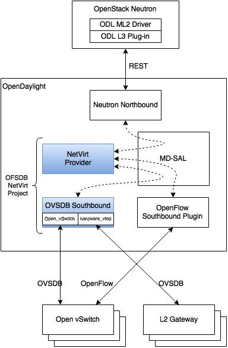

OVSDB NetVirt
=============

NetVirt
-------

The OVSDB NetVirt project delivers two major pieces of functionality:

1. The OVSDB Southbound Protocol, and

2. NetVirt, a network virtualization solution.

The following diagram shows the system-level architecture of OVSDB
NetVirt in an OpenStack-based solution.

   OVSDB NetVirt Architecture

NetVirt is a network virtualization solution that is a Neutron service
provider, and therefore supports the OpenStack Neutron Networking API
and extensions.

The OVSDB component implements the OVSDB protocol (RFC 7047), as well as
plugins to support OVSDB Schemas, such as the Open\_vSwitch database
schema and the hardware\_vtep database schema.

NetVirt has MDSAL-based interfaces with Neutron on the northbound side,
and OVSDB and OpenFlow plugins on the southbound side.

OVSDB NetVirt currently supports Open vSwitch virtual switches via
OpenFlow and OVSDB. Work is underway to support hardware gateways.

NetVirt services are enabled by installing the odl-ovsdb-openstack
feature using the following command:

::

    feature:install odl-ovsdb-openstack

To enable NetVirt’s distributed Layer 3 routing services, the following
line must be uncommented in the etc/custom.properties file in the
OpenDaylight distribution prior to starting karaf:

::

    ovsdb.l3.fwd.enabled=yes

To start the OpenDaylight controller, run the following application in
your distribution:

::

    bin/karaf

More details about using NetVirt with OpenStack can be found in the
following places:

1. The "OpenDaylight and OpenStack" guide, and

2. `Getting Started with OpenDaylight OVSDB Plugin Network
   Virtualization <https://wiki.opendaylight.org/view/OVSDB_Integration:Main#Getting_Started_with_OpenDaylight_OVSDB_Plugin_Network_Virtualization>`__

Some additional details about using OpenStack Security Groups and the
Data Plane Development Kit (DPDK) are provided below.

Security groups
~~~~~~~~~~~~~~~

The security group in openstack helps to filter packets based on
policies configured. The current implementation in openstack uses
iptables to realize security groups. In Opendaylight instead of iptable
rules, ovs flows are used. This will remove the many layers of
bridges/ports required in iptable implementation.

The current rules are applied on the basis of the following attributes:
ingress/egress, protocol, port range, and prefix. In the pipeline, table
40 is used for egress acl and table 90 for ingress acl rules.

Stateful Implementation
^^^^^^^^^^^^^^^^^^^^^^^

The security group is implemented in two modes, stateful and stateless.
Stateful can be enabled by setting false to true in
etc/opendaylight/karaf/netvirt-impl-default-config.xml

The stateful implementation uses the conntrack capabilities of ovs and
tracks an existing connection. This mode requires OVS2.5 and linux
kernel 4.3. The ovs which is integrated with netfilter framework tracks
the connection using the five tuple(layer-3 protocol, source address,
destination address, layer-4 protocol, layer-4 key). The connection
state is independent of the upper level state of connection oriented
protocols like TCP, and even connectionless protocols like UDP will have
a pseudo state. With this implementation OVS sends the packet to the
netfilter framework to know whether there is an entry for to the
connection. netfilter will return the packet to OVS with the appropriate
flag set. Below are the states we are interested in:

::

    -trk - The packet was never send to netfilter framework

::

    +trk+est - It is already known and connection which was allowed previously, 
    pass it to the next table.

::

    +trk+new - This is a new connection. So if there is a specific rule in the 
    table which allows this traffic with a commit action an entry will be made 
    in the netfilter framework. If there is no  specific rule to allow this 
    traffic the packet will be dropped.

So, by default, a packet is be dropped unless there is a rule to allow
the packet.

Stateless Implementation
^^^^^^^^^^^^^^^^^^^^^^^^

The stateless mode is for OVS 2.4 and below where connection tracking is
not supported. Here we have pseudo-connection tracking using the TCP SYN
flag. Other than TCP packets, all protocol packets is allowed by
default. For TCP packets, the SYN packets will be dropped by default
unless there is a specific rule which allows TCP SYN packets to a
particular port.

Fixed Rules
^^^^^^^^^^^

The SecurityGroup are associated with the vm port when the vm is
spawned. By default a set of rules are applied to the vm port referred
to as fixed security group rule. This includes the DHCP rules the ARP
rule and the conntrack rules. The conntrack rules will be inserted only
in the stateful mode.

DHCP rules
''''''''''

The DHCP rules added to the vm port when a vm is spawned. The fixed DHCP
rules are

-  Allow DHCP server traffic ingress.

   ::

       cookie=0x0, duration=36.848s, table=90, n_packets=2, n_bytes=717,
       priority=61006,udp,dl_src=fa:16:3e:a1:f9:d0,
       tp_src=67,tp_dst=68 actions=goto_table:100

   ::

       cookie=0x0, duration=36.566s, table=90, n_packets=0, n_bytes=0, 
       priority=61006,udp6,dl_src=fa:16:3e:a1:f9:d0,
       tp_src=547,tp_dst=546 actions=goto_table:100

-  Allow DHCP client traffic egress.

   ::

       cookie=0x0, duration=2165.596s, table=40, n_packets=2, n_bytes=674, 
       priority=61012,udp,tp_src=68,tp_dst=67 actions=goto_table:50

   ::

       cookie=0x0, duration=2165.513s, table=40, n_packets=0, n_bytes=0, 
       priority=61012,udp6,tp_src=546,tp_dst=547 actions=goto_table:50

-  Prevent DHCP server traffic from the vm port.(DHCP Spoofing)

   ::

       cookie=0x0, duration=34.711s, table=40, n_packets=0, n_bytes=0, 
       priority=61011,udp,in_port=2,tp_src=67,tp_dst=68 actions=drop

   ::

       cookie=0x0, duration=34.519s, table=40, n_packets=0, n_bytes=0, 
       priority=61011,udp6,in_port=2,tp_src=547,tp_dst=546 actions=drop

Arp rules
'''''''''

The default arp rules allows the arp traffic to go in and out of the vm
port.

::

    cookie=0x0, duration=35.015s, table=40, n_packets=10, n_bytes=420, 
    priority=61010,arp,arp_sha=fa:16:3e:93:88:60 actions=goto_table:50

::

    cookie=0x0, duration=35.582s, table=90, n_packets=1, n_bytes=42, 
    priority=61010,arp,arp_tha=fa:16:3e:93:88:60 actions=goto_table:100

Conntrack rules
'''''''''''''''

These rules are inserted only in stateful mode. The conntrack rules use
the netfilter framework to track packets. The below rules are added to
leverage it.

-  If a packet is not tracked(connection state –trk) it is send it to
   the netfilter for tracking

-  If the packet is already tracked (netfilter filter returns connection
   state +trk,+est) and if the connection is established, then allow the
   packet to go through the pipeline.

-  The third rule is the default drop rule which will drop the packet,
   if the packet is tracked and new(netfilter filter returns connection
   state +trk,+new). This rule has lower priority than the custom rules
   which shall be added.

   ::

       cookie=0x0, duration=35.015s table=40,priority=61021,in_port=3,
       ct_state=-trk,action=ct"("table=0")"

   ::

       cookie=0x0, duration=35.015s table=40,priority=61020,in_port=3,
       ct_state=+trk+est,action=goto_table:50

   ::

       cookie=0x0, duration=35.015s table=40,priority=36002,in_port=3,
       ct_state=+new,actions=drop

   ::

       cookie=0x0, duration=35.015s table=90,priority=61022,
       dl_dst=fa:16:3e:0d:8d:21,ct_state=+trk+est,action=goto_table:100

   ::

       cookie=0x0, duration=35.015s table=90,priority=61021,
       dl_dst=fa:16:3e:0d:8d:21,ct_state=-trk,action=ct"("table=0")"

   ::

       cookie=0x0, duration=35.015s table=90,priority=36002,
       dl_dst=fa:16:3e:0d:8d:21,ct_state=+new,actions=drop

TCP SYN Rule
''''''''''''

This rule is inserted in stateless mode only. This rule will drop TCP
SYN packet by default

Custom Security Groups
^^^^^^^^^^^^^^^^^^^^^^

::

       User can add security groups in openstack via command line or UI. When we associate this security group with a vm the flows related to each security group will be added in the related tables. A preconfigured security group called the default security group is available in neutron db. 

Stateful
''''''''

If connection tracking is enabled the match will have connection state
and the action will have commit along with goto. The commit will send
the packet to the netfilter framework to cache the entry. After a
commit, for the next packet of this connection netfilter will return
+trk+est and the packet will match the fixed conntrack rule and get
forwarded to next table.

::

    cookie=0x0, duration=202.516s, table=40, n_packets=0, n_bytes=0,
    priority=61007,ct_state=+new+trk,icmp,dl_src=fa:16:3e:ee:a5:ec,
    nw_dst=0.0.0.0/24,icmp_type=2,icmp_code=4 actions=ct(commit),goto_table:50

::

    cookie=0x0, duration=60.701s, table=90, n_packets=0, n_bytes=0, 
    priority=61007,ct_state=+new+trk,udp,dl_dst=fa:16:3e:22:59:2f,
    nw_src=10.100.5.3,tp_dst=2222 actions=ct(commit),goto_table:100

::

    cookie=0x0, duration=58.988s, table=90, n_packets=0, n_bytes=0, 
    priority=61007,ct_state=+new+trk,tcp,dl_dst=fa:16:3e:22:59:2f,
    nw_src=10.100.5.3,tp_dst=1111 actions=ct(commit),goto_table:100

Stateless
'''''''''

If the mode is stateless the match will have only the parameter
specified in the security rule and a goto in the action. The ct\_state
and commit action will be missing.

::

    cookie=0x0, duration=13211.171s, table=40, n_packets=0, n_bytes=0, 
    priority=61007,icmp,dl_src=fa:16:3e:93:88:60,nw_dst=0.0.0.0/24,
    icmp_type=2,icmp_code=4 actions=goto_table:50

::

    cookie=0x0, duration=199.674s, table=90, n_packets=0, n_bytes=0, 
    priority=61007,udp,dl_dst=fa:16:3e:dc:49:ff,nw_src=10.100.5.3,tp_dst=2222 
    actions=goto_table:100

::

    cookie=0x0, duration=199.780s, table=90, n_packets=0, n_bytes=0, 
    priority=61007,tcp,dl_dst=fa:16:3e:93:88:60,nw_src=10.100.5.4,tp_dst=3333 
    actions=goto_table:100

TCP/UDP Port Range
''''''''''''''''''

The TCP/UDP port range is supported with the help of port mask. This
will dramatically reduce the number of flows required to cover a port
range. The below 7 rules can cover a port range from 333 to 777.

::

    cookie=0x0, duration=56.129s, table=90, n_packets=0, n_bytes=0, 
    priority=61007,udp,dl_dst=fa:16:3e:f9:2c:42,nw_src=0.0.0.0/24,
    tp_dst=0x200/0xff00 actions=goto_table:100

::

    cookie=0x0, duration=55.805s, table=90, n_packets=0, n_bytes=0, 
    priority=61007,udp,dl_dst=fa:16:3e:f9:2c:42,nw_src=0.0.0.0/24,
    tp_dst=0x160/0xffe0 actions=goto_table:100

::

    cookie=0x0, duration=55.587s, table=90, n_packets=0, n_bytes=0, 
    priority=61007,udp,dl_dst=fa:16:3e:f9:2c:42,nw_src=0.0.0.0/24,
    tp_dst=0x300/0xfff8 actions=goto_table:100

::

    cookie=0x0, duration=55.437s, table=90, n_packets=0, n_bytes=0, 
    priority=61007,udp,dl_dst=fa:16:3e:f9:2c:42,nw_src=0.0.0.0/24,
    tp_dst=0x150/0xfff0 actions=goto_table:100

::

    cookie=0x0, duration=55.282s, table=90, n_packets=0, n_bytes=0, 
    priority=61007,udp,dl_dst=fa:16:3e:f9:2c:42,nw_src=0.0.0.0/24,
    tp_dst=0x14e/0xfffe actions=goto_table:100

::

    cookie=0x0, duration=54.063s, table=90, n_packets=0, n_bytes=0, 
    priority=61007,udp,dl_dst=fa:16:3e:f9:2c:42,nw_src=0.0.0.0/24,
    tp_dst=0x308/0xfffe actions=goto_table:100

::

    cookie=0x0, duration=55.130s, table=90, n_packets=0, n_bytes=0, 
    priority=61007,udp,dl_dst=fa:16:3e:f9:2c:42,nw_src=0.0.0.0/24,
    tp_dst=333 actions=goto_table:100

CIDR/Remote Security Group
^^^^^^^^^^^^^^^^^^^^^^^^^^

::

    When adding a security group we can select the rule to applicable to a 
    set of CIDR or to a set of VMs which has a particular security group 
    associated with it. 

If CIDR is selected there will be only one flow rule added allowing the
traffic from/to the IP’s belonging to that CIDR.

::

    cookie=0x0, duration=202.516s, table=40, n_packets=0, n_bytes=0,
    priority=61007,ct_state=+new+trk,icmp,dl_src=fa:16:3e:ee:a5:ec,
    nw_dst=0.0.0.0/24,icmp_type=2,icmp_code=4 actions=ct(commit),goto_table:50

If a remote security group is selected a flow will be inserted for every
vm which has that security group associated.

::

    cookie=0x0, duration=60.701s, table=90, n_packets=0, n_bytes=0, 
    priority=61007,ct_state=+new+trk,udp,dl_dst=fa:16:3e:22:59:2f,
    nw_src=10.100.5.3,tp_dst=2222    actions=ct(commit),goto_table:100

::

    cookie=0x0, duration=58.988s, table=90, n_packets=0, n_bytes=0, 
    priority=61007,ct_state=+new+trk,tcp,dl_dst=fa:16:3e:22:59:2f,
    nw_src=10.100.5.3,tp_dst=1111 actions=ct(commit),goto_table:100

Rules supported in ODL
^^^^^^^^^^^^^^^^^^^^^^

The following rules are supported in the current implementation. The
direction (ingress/egress) is always expected.

+--------------------+--------------------+--------------------+--------------------+
| Protocol           | Port Range         | IP Prefix          | Remote Security    |
|                    |                    |                    | Group supported    |
+--------------------+--------------------+--------------------+--------------------+
| Any                | Any                | Any                | Yes                |
+--------------------+--------------------+--------------------+--------------------+
| TCP                | 1 - 65535          | 0.0.0.0/0          | Yes                |
+--------------------+--------------------+--------------------+--------------------+
| UDP                | 1 - 65535          | 0.0.0.0/0          | Yes                |
+--------------------+--------------------+--------------------+--------------------+
| ICMP               | Any                | 0.0.0.0/0          | Yes                |
+--------------------+--------------------+--------------------+--------------------+

Table: Table Supported Rules

Note : IPV6 and port-range feature is not supported as of today

Using OVS with DPDK hosts and OVSDB NetVirt
~~~~~~~~~~~~~~~~~~~~~~~~~~~~~~~~~~~~~~~~~~~

The Data Plane Development Kit (`DPDK <http://dpdk.org/>`__) is a
userspace set of libraries and drivers designed for fast packet
processing. The userspace datapath variant of OVS can be built with DPDK
enabled to provide the performance features of DPDK to Open vSwitch
(OVS). In the 2.4.0 version of OVS, the Open\_vSwtich table schema was
enhanced to include the lists *datapath-types* and *interface-types*.
When the OVS with DPDK variant of OVS is running, the *inteface-types*
list will include DPDK interface types such as *dpdk* and
*dpdkvhostuser*. The OVSDB Southbound Plugin includes this information
in the OVSDB YANG model in the MD-SAL, so when a specific OVS host is
running OVS with DPDK, it is possible for NetVirt to detect that
information by checking that DPDK interface types are included in the
list of supported interface types.

For example, query the operational MD-SAL for OVSDB nodes:

HTTP GET:

::

    http://{{CONTROLLER-IP}}:8181/restconf/operational/network-topology:network-topology/topology/ovsdb:1/

Result Body:

::

    {
      "topology": [
        {
          "topology-id": "ovsdb:1",
          "node": [
            < content edited out >
            {
              "node-id": "ovsdb://uuid/f9b58b6d-04db-459a-b914-fff82b738aec",
              < content edited out >
              "ovsdb:interface-type-entry": [
                {
                  "interface-type": "ovsdb:interface-type-ipsec-gre"
                },
                {
                  "interface-type": "ovsdb:interface-type-internal"
                },
                {
                  "interface-type": "ovsdb:interface-type-system"
                },
                {
                  "interface-type": "ovsdb:interface-type-patch"
                },
                {
                  "interface-type": "ovsdb:interface-type-dpdkvhostuser"
                },
                {
                  "interface-type": "ovsdb:interface-type-dpdk"
                },
                {
                  "interface-type": "ovsdb:interface-type-dpdkr"
                },
                {
                  "interface-type": "ovsdb:interface-type-vxlan"
                },
                {
                  "interface-type": "ovsdb:interface-type-lisp"
                },
                {
                  "interface-type": "ovsdb:interface-type-geneve"
                },
                {
                  "interface-type": "ovsdb:interface-type-gre"
                },
                {
                  "interface-type": "ovsdb:interface-type-tap"
                },
                {
                  "interface-type": "ovsdb:interface-type-stt"
                }
              ],
              < content edited out >
              "ovsdb:datapath-type-entry": [
                {
                  "datapath-type": "ovsdb:datapath-type-netdev"
                },
                {
                  "datapath-type": "ovsdb:datapath-type-system"
                }
              ],
              < content edited out >
            },
            < content edited out >
          ]
        }
      ]
    }

This example illustrates the output of an OVS with DPDK host because the
list of interface types includes types supported by DPDK.

Bridges on OVS with DPDK hosts need to be created with the *netdev*
datapath type and DPDK specific ports need to be created with the
appropriate interface type. The OpenDaylight OVSDB Southbound Plugin
supports these attributes.

The OpenDaylight NetVirt application checks whether the OVS host is
using OVS with DPDK when creating the bridges that are expected to be
present on the host, e.g. *br-int*.

Following are some tips for supporting hosts using OVS with DPDK when
using NetVirt as the Neutron service provider and *devstack* to deploy
Openstack.

In addition to the *networking-odl* ML2 plugin, enable the
*networking-odl-dpdk* plugin in *local.conf*.

::

    For working with Openstack Liberty
    enable_plugin networking-odl https://github.com/FedericoRessi/networking-odl integration/liberty
    enable_plugin networking-ovs-dpdk https://github.com/openstack/networking-ovs-dpdk stable/liberty

::

    For working with Openstack Mitaka (or later) branch
    enable_plugin networking-odl https://github.com/openstack/networking-odl
    enable_plugin networking-ovs-dpdk https://github.com/openstack/networking-ovs-dpdk

The order of these plugin lines is important. The *networking-odl*
plugin will install and setup *openvswitch*. The *networking-ovs-dpdk*
plugin will install OVS with DPDK. Note, the *networking-ovs-dpdk*
plugin is only being used here to setup OVS with DPDK. The
*networking-odl* plugin will be used as the Neutron ML2 driver.

For VXLAN tenant network support, the NetVirt application interacts with
OVS with DPDK host in the same way as OVS hosts using the kernel
datapath by creating VXLAN ports on *br-int* to communicate with other
tunnel endpoints. The IP address for the local tunnel endpoint may be
configured in the *local.conf* file. For example:

::

    ODL_LOCAL_IP=192.100.200.10

NetVirt will use this information to configure the VXLAN port on
*br-int*. On a host with the OVS kernel datapath, it is expected that
there will be a networking interface configured with this IP address. On
an OVS with DPDK host, an OVS bridge is created and a DPDK port is added
to the bridge. The local tunnel endpoint address is then assigned to the
bridge port of the bridge. So, for example, if the physical network
interface is associated with *eth0* on the host, a bridge named
*br-eth0* could be created. The DPDK port, such as *dpdk0* (per the
naming conventions of OVS with DPDK), is added to bridge *br-eth0*. The
local tunnel endpoint address is assigned to the network interface
*br-eth0* which is attached to bridge *br-eth0*. All of this setup is
not done by NetVirt. The *networking-ovs-dpdk* can be made to perform
this setup by putting configuration like the following in *local.conf*.

::

    ODL_LOCAL_IP=192.168.200.9
    ODL_PROVIDER_MAPPINGS=physnet1:eth0,physnet2:eht1
    OVS_DPDK_PORT_MAPPINGS=eth0:br-eth0,eth1:br-ex
    OVS_BRIDGE_MAPPINGS=physnet1:br-eth0,physnet2:br-ex

The above settings associate the host networking interface *eth0* with
bridge *br-eth0*. The *networking-ovs-dpdk* plugin will determine the
DPDK port name associated with *eth0* and add it to the bridge
*br-eth0*. If using the NetVirt L3 support, these settings will enable
setup of the *br-ex* bridge and attach the DPDK port associated with
network interface *eth1* to it.

The following settings are included in *local.conf* to specify specific
attributes associated with OVS with DPDK. These are used by the
*networking-ovs-dpdk* plugin to configure OVS with DPDK.

::

    OVS_DATAPATH_TYPE=netdev
    OVS_NUM_HUGEPAGES=8192
    OVS_DPDK_MEM_SEGMENTS=8192
    OVS_HUGEPAGE_MOUNT_PAGESIZE=2M
    OVS_DPDK_RTE_LIBRTE_VHOST=y
    OVS_DPDK_MODE=compute

Once the stack is up and running virtual machines may be deployed on OVS
with DPDK hosts. The *networking-odl* plugin handles ensuring that
*dpdkvhostuser* interfaces are utilized by Nova instead of the default
*tap* interface. The *dpdkvhostuser* interface provides the best
performance for VMs on OVS with DPDK hosts.

A Nova flavor is created for VMs that may be deployed on OVS with DPDK
hosts.

::

    nova flavor-create largepage-flavor 1002 1024 4 1
    nova flavor-key 1002 set "hw:mem_page_size=large"

Then, just specify the flavor when creating a VM.

::

    nova boot --flavor largepage-flavor --image cirros-0.3.4-x86_64-uec --nic net-id=<NET ID VALUE> vm-name

OVSDB Plugins
-------------

Overview and Architecture
~~~~~~~~~~~~~~~~~~~~~~~~~

There are currently two OVSDB Southbound plugins:

-  odl-ovsdb-southbound: Implements the OVSDB Open\_vSwitch database
   schema.

-  odl-ovsdb-hwvtepsouthbound: Implements the OVSDB hardware\_vtep
   database schema.

These plugins are normally installed and used automatically by higher
level applications such as odl-ovsdb-openstack; however, they can also
be installed separately and used via their REST APIs as is described in
the following sections.

OVSDB Southbound Plugin
~~~~~~~~~~~~~~~~~~~~~~~

The OVSDB Southbound Plugin provides support for managing OVS hosts via
an OVSDB model in the MD-SAL which maps to important tables and
attributes present in the Open\_vSwitch schema. The OVSDB Southbound
Plugin is able to connect actively or passively to OVS hosts and operate
as the OVSDB manager of the OVS host. Using the OVSDB protocol it is
able to manage the OVS database (OVSDB) on the OVS host as defined by
the Open\_vSwitch schema.

OVSDB YANG Model
^^^^^^^^^^^^^^^^

The OVSDB Southbound Plugin provides a YANG model which is based on the
abstract `network topology
model <https://github.com/opendaylight/yangtools/blob/stable/beryllium/yang/yang-parser-impl/src/test/resources/ietf/network-topology%402013-10-21.yang>`__.

The details of the OVSDB YANG model are defined in the
`ovsdb.yang <https://github.com/opendaylight/ovsdb/blob/stable/beryllium/southbound/southbound-api/src/main/yang/ovsdb.yang>`__
file.

The OVSDB YANG model defines three augmentations:

**ovsdb-node-augmentation**
    This augments the network-topology node and maps primarily to the
    Open\_vSwitch table of the OVSDB schema. The ovsdb-node-augmentation
    is a representation of the OVS host. It contains the following
    attributes.

    -  **connection-info** - holds the local and remote IP address and
       TCP port numbers for the OpenDaylight to OVSDB node connections

    -  **db-version** - version of the OVSDB database

    -  **ovs-version** - version of OVS

    -  **list managed-node-entry** - a list of references to
       ovsdb-bridge-augmentation nodes, which are the OVS bridges
       managed by this OVSDB node

    -  **list datapath-type-entry** - a list of the datapath types
       supported by the OVSDB node (e.g. *system*, *netdev*) - depends
       on newer OVS versions

    -  **list interface-type-entry** - a list of the interface types
       supported by the OVSDB node (e.g. *internal*, *vxlan*, *gre*,
       *dpdk*, etc.) - depends on newer OVS verions

    -  **list openvswitch-external-ids** - a list of the key/value pairs
       in the Open\_vSwitch table external\_ids column

    -  **list openvswitch-other-config** - a list of the key/value pairs
       in the Open\_vSwitch table other\_config column

    -  **list managery-entry** - list of manager information entries and
       connection status

    -  **list qos-entries** - list of QoS entries present in the QoS
       table

    -  **list queues** - list of queue entries present in the queue
       table

**ovsdb-bridge-augmentation**
    This augments the network-topology node and maps to an specific
    bridge in the OVSDB bridge table of the associated OVSDB node. It
    contains the following attributes.

    -  **bridge-uuid** - UUID of the OVSDB bridge

    -  **bridge-name** - name of the OVSDB bridge

    -  **bridge-openflow-node-ref** - a reference (instance-identifier)
       of the OpenFlow node associated with this bridge

    -  **list protocol-entry** - the version of OpenFlow protocol to use
       with the OpenFlow controller

    -  **list controller-entry** - a list of controller-uuid and
       is-connected status of the OpenFlow controllers associated with
       this bridge

    -  **datapath-id** - the datapath ID associated with this bridge on
       the OVSDB node

    -  **datapath-type** - the datapath type of this bridge

    -  **fail-mode** - the OVSDB fail mode setting of this bridge

    -  **flow-node** - a reference to the flow node corresponding to
       this bridge

    -  **managed-by** - a reference to the ovsdb-node-augmentation
       (OVSDB node) that is managing this bridge

    -  **list bridge-external-ids** - a list of the key/value pairs in
       the bridge table external\_ids column for this bridge

    -  **list bridge-other-configs** - a list of the key/value pairs in
       the bridge table other\_config column for this bridge

**ovsdb-termination-point-augmentation**
    This augments the topology termination point model. The OVSDB
    Southbound Plugin uses this model to represent both the OVSDB port
    and OVSDB interface for a given port/interface in the OVSDB schema.
    It contains the following attributes.

    -  **port-uuid** - UUID of an OVSDB port row

    -  **interface-uuid** - UUID of an OVSDB interface row

    -  **name** - name of the port and interface

    -  **interface-type** - the interface type

    -  **list options** - a list of port options

    -  **ofport** - the OpenFlow port number of the interface

    -  **ofport\_request** - the requested OpenFlow port number for the
       interface

    -  **vlan-tag** - the VLAN tag value

    -  **list trunks** - list of VLAN tag values for trunk mode

    -  **vlan-mode** - the VLAN mode (e.g. access, native-tagged,
       native-untagged, trunk)

    -  **list port-external-ids** - a list of the key/value pairs in the
       port table external\_ids column for this port

    -  **list interface-external-ids** - a list of the key/value pairs
       in the interface table external\_ids interface for this interface

    -  **list port-other-configs** - a list of the key/value pairs in
       the port table other\_config column for this port

    -  **list interface-other-configs** - a list of the key/value pairs
       in the interface table other\_config column for this interface

    -  **list inteface-lldp** - LLDP Auto Attach configuration for the
       interface

    -  **qos** - UUID of the QoS entry in the QoS table assigned to this
       port

Getting Started
^^^^^^^^^^^^^^^

To install the OVSDB Southbound Plugin, use the following command at the
Karaf console:

::

    feature:install odl-ovsdb-southbound-impl-ui

After installing the OVSDB Southbound Plugin, and before any OVSDB
topology nodes have been created, the OVSDB topology will appear as
follows in the configuration and operational MD-SAL.

HTTP GET:

::

    http://<controller-ip>:8181/restconf/config/network-topology:network-topology/topology/ovsdb:1/
     or
    http://<controller-ip>:8181/restconf/operational/network-topology:network-topology/topology/ovsdb:1/

Result Body:

::

    {
      "topology": [
        {
          "topology-id": "ovsdb:1"
        }
      ]
    }

Where

*<controller-ip>* is the IP address of the OpenDaylight controller

OpenDaylight as the OVSDB Manager
^^^^^^^^^^^^^^^^^^^^^^^^^^^^^^^^^

An OVS host is a system which is running the OVS software and is capable
of being managed by an OVSDB manager. The OVSDB Southbound Plugin is
capable of connecting to an OVS host and operating as an OVSDB manager.
Depending on the configuration of the OVS host, the connection of
OpenDaylight to the OVS host will be active or passive.

Active Connection to OVS Hosts
^^^^^^^^^^^^^^^^^^^^^^^^^^^^^^

An active connection is when the OVSDB Southbound Plugin initiates the
connection to an OVS host. This happens when the OVS host is configured
to listen for the connection (i.e. the OVSDB Southbound Plugin is active
the the OVS host is passive). The OVS host is configured with the
following command:

::

    sudo ovs-vsctl set-manager ptcp:6640

This configures the OVS host to listen on TCP port 6640.

The OVSDB Southbound Plugin can be configured via the configuration
MD-SAL to actively connect to an OVS host.

HTTP PUT:

::

    http://<controller-ip>:8181/restconf/config/network-topology:network-topology/topology/ovsdb:1/node/ovsdb:%2F%2FHOST1

Body:

::

    {
      "network-topology:node": [
        {
          "node-id": "ovsdb://HOST1",
          "connection-info": {
            "ovsdb:remote-port": "6640",
            "ovsdb:remote-ip": "<ovs-host-ip>"
          }
        }
      ]
    }

Where

*<ovs-host-ip>* is the IP address of the OVS Host

Note that the configuration assigns a *node-id* of "ovsdb://HOST1" to
the OVSDB node. This *node-id* will be used as the identifier for this
OVSDB node in the MD-SAL.

Query the configuration MD-SAL for the OVSDB topology.

HTTP GET:

::

    http://<controller-ip>:8181/restconf/config/network-topology:network-topology/topology/ovsdb:1/

Result Body:

::

    {
      "topology": [
        {
          "topology-id": "ovsdb:1",
          "node": [
            {
              "node-id": "ovsdb://HOST1",
              "ovsdb:connection-info": {
                "remote-ip": "<ovs-host-ip>",
                "remote-port": 6640
              }
            }
          ]
        }
      ]
    }

As a result of the OVSDB node configuration being added to the
configuration MD-SAL, the OVSDB Southbound Plugin will attempt to
connect with the specified OVS host. If the connection is successful,
the plugin will connect to the OVS host as an OVSDB manager, query the
schemas and databases supported by the OVS host, and register to monitor
changes made to the OVSDB tables on the OVS host. It will also set an
external id key and value in the external-ids column of the
Open\_vSwtich table of the OVS host which identifies the MD-SAL instance
identifier of the OVSDB node. This ensures that the OVSDB node will use
the same *node-id* in both the configuration and operational MD-SAL.

::

    "opendaylight-iid" = "instance identifier of OVSDB node in the MD-SAL"

When the OVS host sends the OVSDB Southbound Plugin the first update
message after the monitoring has been established, the plugin will
populate the operational MD-SAL with the information it receives from
the OVS host.

Query the operational MD-SAL for the OVSDB topology.

HTTP GET:

::

    http://<controller-ip>:8181/restconf/operational/network-topology:network-topology/topology/ovsdb:1/

Result Body:

::

    {
      "topology": [
        {
          "topology-id": "ovsdb:1",
          "node": [
            {
              "node-id": "ovsdb://HOST1",
              "ovsdb:openvswitch-external-ids": [
                {
                  "external-id-key": "opendaylight-iid",
                  "external-id-value": "/network-topology:network-topology/network-topology:topology[network-topology:topology-id='ovsdb:1']/network-topology:node[network-topology:node-id='ovsdb://HOST1']"
                }
              ],
              "ovsdb:connection-info": {
                "local-ip": "<controller-ip>",
                "remote-port": 6640,
                "remote-ip": "<ovs-host-ip>",
                "local-port": 39042
              },
              "ovsdb:ovs-version": "2.3.1-git4750c96",
              "ovsdb:manager-entry": [
                {
                  "target": "ptcp:6640",
                  "connected": true,
                  "number_of_connections": 1
                }
              ]
            }
          ]
        }
      ]
    }

To disconnect an active connection, just delete the configuration MD-SAL
entry.

HTTP DELETE:

::

    http://<controller-ip>:8181/restconf/config/network-topology:network-topology/topology/ovsdb:1/node/ovsdb:%2F%2FHOST1

Note in the above example, that */* characters which are part of the
*node-id* are specified in hexadecimal format as "%2F".

Passive Connection to OVS Hosts
^^^^^^^^^^^^^^^^^^^^^^^^^^^^^^^

A passive connection is when the OVS host initiates the connection to
the OVSDB Southbound Plugin. This happens when the OVS host is
configured to connect to the OVSDB Southbound Plugin. The OVS host is
configured with the following command:

::

    sudo ovs-vsctl set-manager tcp:<controller-ip>:6640

The OVSDB Southbound Plugin is configured to listen for OVSDB
connections on TCP port 6640. This value can be changed by editing the
"./karaf/target/assembly/etc/custom.properties" file and changing the
value of the "ovsdb.listenPort" attribute.

When a passive connection is made, the OVSDB node will appear first in
the operational MD-SAL. If the Open\_vSwitch table does not contain an
external-ids value of *opendaylight-iid*, then the *node-id* of the new
OVSDB node will be created in the format:

::

    "ovsdb://uuid/<actual UUID value>"

If there an *opendaylight-iid* value was already present in the
external-ids column, then the instance identifier defined there will be
used to create the *node-id* instead.

Query the operational MD-SAL for an OVSDB node after a passive
connection.

HTTP GET:

::

    http://<controller-ip>:8181/restconf/operational/network-topology:network-topology/topology/ovsdb:1/

Result Body:

::

    {
      "topology": [
        {
          "topology-id": "ovsdb:1",
          "node": [
            {
              "node-id": "ovsdb://uuid/163724f4-6a70-428a-a8a0-63b2a21f12dd",
              "ovsdb:openvswitch-external-ids": [
                {
                  "external-id-key": "system-id",
                  "external-id-value": "ecf160af-e78c-4f6b-a005-83a6baa5c979"
                }
              ],
              "ovsdb:connection-info": {
                "local-ip": "<controller-ip>",
                "remote-port": 46731,
                "remote-ip": "<ovs-host-ip>",
                "local-port": 6640
              },
              "ovsdb:ovs-version": "2.3.1-git4750c96",
              "ovsdb:manager-entry": [
                {
                  "target": "tcp:10.11.21.7:6640",
                  "connected": true,
                  "number_of_connections": 1
                }
              ]
            }
          ]
        }
      ]
    }

Take note of the *node-id* that was created in this case.

Manage Bridges
^^^^^^^^^^^^^^

The OVSDB Southbound Plugin can be used to manage bridges on an OVS
host.

This example shows how to add a bridge to the OVSDB node
*ovsdb://HOST1*.

HTTP PUT:

::

    http://<controller-ip>:8181/restconf/config/network-topology:network-topology/topology/ovsdb:1/node/ovsdb:%2F%2FHOST1%2Fbridge%2Fbrtest

Body:

::

    {
      "network-topology:node": [
        {
          "node-id": "ovsdb://HOST1/bridge/brtest",
          "ovsdb:bridge-name": "brtest",
          "ovsdb:protocol-entry": [
            {
              "protocol": "ovsdb:ovsdb-bridge-protocol-openflow-13"
            }
          ],
          "ovsdb:managed-by": "/network-topology:network-topology/network-topology:topology[network-topology:topology-id='ovsdb:1']/network-topology:node[network-topology:node-id='ovsdb://HOST1']"
        }
      ]
    }

Notice that the *ovsdb:managed-by* attribute is specified in the
command. This indicates the association of the new bridge node with its
OVSDB node.

Bridges can be updated. In the following example, OpenDaylight is
configured to be the OpenFlow controller for the bridge.

HTTP PUT:

::

    http://<controller-ip>:8181/restconf/config/network-topology:network-topology/topology/ovsdb:1/node/ovsdb:%2F%2FHOST1%2Fbridge%2Fbrtest

Body:

::

    {
      "network-topology:node": [
            {
              "node-id": "ovsdb://HOST1/bridge/brtest",
                 "ovsdb:bridge-name": "brtest",
                  "ovsdb:controller-entry": [
                    {
                      "target": "tcp:<controller-ip>:6653"
                    }
                  ],
                 "ovsdb:managed-by": "/network-topology:network-topology/network-topology:topology[network-topology:topology-id='ovsdb:1']/network-topology:node[network-topology:node-id='ovsdb://HOST1']"
            }
        ]
    }

If the OpenDaylight OpenFlow Plugin is installed, then checking on the
OVS host will show that OpenDaylight has successfully connected as the
controller for the bridge.

::

    $ sudo ovs-vsctl show
        Manager "ptcp:6640"
            is_connected: true
        Bridge brtest
            Controller "tcp:<controller-ip>:6653"
                is_connected: true
            Port brtest
                Interface brtest
                    type: internal
        ovs_version: "2.3.1-git4750c96"

Query the operational MD-SAL to see how the bridge appears.

HTTP GET:

::

    http://<controller-ip>:8181/restconf/operational/network-topology:network-topology/topology/ovsdb:1/node/ovsdb:%2F%2FHOST1%2Fbridge%2Fbrtest/

Result Body:

::

    {
      "node": [
        {
          "node-id": "ovsdb://HOST1/bridge/brtest",
          "ovsdb:bridge-name": "brtest",
          "ovsdb:datapath-type": "ovsdb:datapath-type-system",
          "ovsdb:datapath-id": "00:00:da:e9:0c:08:2d:45",
          "ovsdb:managed-by": "/network-topology:network-topology/network-topology:topology[network-topology:topology-id='ovsdb:1']/network-topology:node[network-topology:node-id='ovsdb://HOST1']",
          "ovsdb:bridge-external-ids": [
            {
              "bridge-external-id-key": "opendaylight-iid",
              "bridge-external-id-value": "/network-topology:network-topology/network-topology:topology[network-topology:topology-id='ovsdb:1']/network-topology:node[network-topology:node-id='ovsdb://HOST1/bridge/brtest']"
            }
          ],
          "ovsdb:protocol-entry": [
            {
              "protocol": "ovsdb:ovsdb-bridge-protocol-openflow-13"
            }
          ],
          "ovsdb:bridge-uuid": "080ce9da-101e-452d-94cd-ee8bef8a4b69",
          "ovsdb:controller-entry": [
            {
              "target": "tcp:10.11.21.7:6653",
              "is-connected": true,
              "controller-uuid": "c39b1262-0876-4613-8bfd-c67eec1a991b"
            }
          ],
          "termination-point": [
            {
              "tp-id": "brtest",
              "ovsdb:port-uuid": "c808ae8d-7af2-4323-83c1-e397696dc9c8",
              "ovsdb:ofport": 65534,
              "ovsdb:interface-type": "ovsdb:interface-type-internal",
              "ovsdb:interface-uuid": "49e9417f-4479-4ede-8faf-7c873b8c0413",
              "ovsdb:name": "brtest"
            }
          ]
        }
      ]
    }

Notice that just like with the OVSDB node, an *opendaylight-iid* has
been added to the external-ids column of the bridge since it was created
via the configuration MD-SAL.

A bridge node may be deleted as well.

HTTP DELETE:

::

    http://<controller-ip>:8181/restconf/config/network-topology:network-topology/topology/ovsdb:1/node/ovsdb:%2F%2FHOST1%2Fbridge%2Fbrtest

Manage Ports
^^^^^^^^^^^^

Similarly, ports may be managed by the OVSDB Southbound Plugin.

This example illustrates how a port and various attributes may be
created on a bridge.

HTTP PUT:

::

    http://<controller-ip>:8181/restconf/config/network-topology:network-topology/topology/ovsdb:1/node/ovsdb:%2F%2FHOST1%2Fbridge%2Fbrtest/termination-point/testport/

Body:

::

    {
      "network-topology:termination-point": [
        {
          "ovsdb:options": [
            {
              "ovsdb:option": "remote_ip",
              "ovsdb:value" : "10.10.14.11"
            }
          ],
          "ovsdb:name": "testport",
          "ovsdb:interface-type": "ovsdb:interface-type-vxlan",
          "tp-id": "testport",
          "vlan-tag": "1",
          "trunks": [
            {
              "trunk": "5"
            }
          ],
          "vlan-mode":"access"
        }
      ]
    }

Ports can be updated - add another VLAN trunk.

HTTP PUT:

::

    http://<controller-ip>:8181/restconf/config/network-topology:network-topology/topology/ovsdb:1/node/ovsdb:%2F%2FHOST1%2Fbridge%2Fbrtest/termination-point/testport/

Body:

::

    {
      "network-topology:termination-point": [
        {
          "ovsdb:name": "testport",
          "tp-id": "testport",
          "trunks": [
            {
              "trunk": "5"
            },
            {
              "trunk": "500"
            }
          ]
        }
      ]
    }

Query the operational MD-SAL for the port.

HTTP GET:

::

    http://<controller-ip>:8181/restconf/operational/network-topology:network-topology/topology/ovsdb:1/node/ovsdb:%2F%2FHOST1%2Fbridge%2Fbrtest/termination-point/testport/

Result Body:

::

    {
      "termination-point": [
        {
          "tp-id": "testport",
          "ovsdb:port-uuid": "b1262110-2a4f-4442-b0df-84faf145488d",
          "ovsdb:options": [
            {
              "option": "remote_ip",
              "value": "10.10.14.11"
            }
          ],
          "ovsdb:port-external-ids": [
            {
              "external-id-key": "opendaylight-iid",
              "external-id-value": "/network-topology:network-topology/network-topology:topology[network-topology:topology-id='ovsdb:1']/network-topology:node[network-topology:node-id='ovsdb://HOST1/bridge/brtest']/network-topology:termination-point[network-topology:tp-id='testport']"
            }
          ],
          "ovsdb:interface-type": "ovsdb:interface-type-vxlan",
          "ovsdb:trunks": [
            {
              "trunk": 5
            },
            {
              "trunk": 500
            }
          ],
          "ovsdb:vlan-mode": "access",
          "ovsdb:vlan-tag": 1,
          "ovsdb:interface-uuid": "7cec653b-f407-45a8-baec-7eb36b6791c9",
          "ovsdb:name": "testport",
          "ovsdb:ofport": 1
        }
      ]
    }

Remember that the OVSDB YANG model includes both OVSDB port and
interface table attributes in the termination-point augmentation. Both
kinds of attributes can be seen in the examples above. Again, note the
creation of an *opendaylight-iid* value in the external-ids column of
the port table.

Delete a port.

HTTP DELETE:

::

    http://<controller-ip>:8181/restconf/config/network-topology:network-topology/topology/ovsdb:1/node/ovsdb:%2F%2FHOST1%2Fbridge%2Fbrtest2/termination-point/testport/

Overview of QoS and Queue
^^^^^^^^^^^^^^^^^^^^^^^^^

The OVSDB Southbound Plugin provides the capability of managing the QoS
and Queue tables on an OVS host with OpenDaylight configured as the
OVSDB manager.

QoS and Queue Tables in OVSDB
'''''''''''''''''''''''''''''

The OVSDB includes a QoS and Queue table. Unlike most of the other
tables in the OVSDB, except the Open\_vSwitch table, the QoS and Queue
tables are "root set" tables, which means that entries, or rows, in
these tables are not automatically deleted if they can not be reached
directly or indirectly from the Open\_vSwitch table. This means that QoS
entries can exist and be managed independently of whether or not they
are referenced in a Port entry. Similarly, Queue entries can be managed
independently of whether or not they are referenced by a QoS entry.

Modelling of QoS and Queue Tables in OpenDaylight MD-SAL
''''''''''''''''''''''''''''''''''''''''''''''''''''''''

Since the QoS and Queue tables are "root set" tables, they are modeled
in the OpenDaylight MD-SAL as lists which are part of the attributes of
the OVSDB node model.

The MD-SAL QoS and Queue models have an additonal identifier attribute
per entry (e.g. "qos-id" or "queue-id") which is not present in the
OVSDB schema. This identifier is used by the MD-SAL as a key for
referencing the entry. If the entry is created originally from the
configuration MD-SAL, then the value of the identifier is whatever is
specified by the configuration. If the entry is created on the OVSDB
node and received by OpenDaylight in an operational update, then the id
will be created in the following format.

::

    "queue-id": "queue://<UUID>"
    "qos-id": "qos://<UUID>"

The UUID in the above identifiers is the actual UUID of the entry in the
OVSDB database.

When the QoS or Queue entry is created by the configuration MD-SAL, the
identifier will be configured as part of the external-ids column of the
entry. This will ensure that the corresponding entry that is created in
the operational MD-SAL uses the same identifier.

::

    "queues-external-ids": [
      {
        "queues-external-id-key": "opendaylight-queue-id",
        "queues-external-id-value": "QUEUE-1"
      }
    ]

See more in the examples that follow in this section.

The QoS schema in OVSDB currently defines two types of QoS entries.

-  linux-htb

-  linux-hfsc

These QoS types are defined in the QoS model. Additional types will need
to be added to the model in order to be supported. See the examples that
folow for how the QoS type is specified in the model.

QoS entries can be configured with addtional attritubes such as
"max-rate". These are configured via the *other-config* column of the
QoS entry. Refer to OVSDB schema (in the reference section below) for
all of the relevant attributes that can be configured. The examples in
the rest of this section will demonstrate how the other-config column
may be configured.

Similarly, the Queue entries may be configured with additional
attributes via the other-config column.

Managing QoS and Queues via Configuration MD-SAL
^^^^^^^^^^^^^^^^^^^^^^^^^^^^^^^^^^^^^^^^^^^^^^^^

This section will show some examples on how to manage QoS and Queue
entries via the configuration MD-SAL. The examples will be illustrated
by using RESTCONF (see `QoS and Queue Postman
Collection <https://github.com/opendaylight/ovsdb/blob/stable/beryllium/resources/commons/Qos-and-Queue-Collection.json.postman_collection>`__
).

A pre-requisite for managing QoS and Queue entries is that the OVS host
must be present in the configuration MD-SAL.

For the following examples, the following OVS host is configured.

HTTP POST:

::

    http://<controller-ip>:8181/restconf/config/network-topology:network-topology/topology/ovsdb:1/

Body:

::

    {
      "node": [
        {
          "node-id": "ovsdb:HOST1",
          "connection-info": {
            "ovsdb:remote-ip": "<ovs-host-ip>",
            "ovsdb:remote-port": "<ovs-host-ovsdb-port>"
          }
        }
      ]
    }

Where

-  *<controller-ip>* is the IP address of the OpenDaylight controller

-  *<ovs-host-ip>* is the IP address of the OVS host

-  *<ovs-host-ovsdb-port>* is the TCP port of the OVSDB server on the
   OVS host (e.g. 6640)

This command creates an OVSDB node with the node-id "ovsdb:HOST1". This
OVSDB node will be used in the following examples.

QoS and Queue entries can be created and managed without a port, but
ultimately, QoS entries are associated with a port in order to use them.
For the following examples a test bridge and port will be created.

Create the test bridge.

HTTP PUT

::

    http://<controller-ip>:8181/restconf/config/network-topology:network-topology/topology/ovsdb:1/node/ovsdb:HOST1%2Fbridge%2Fbr-test

Body:

::

    {
      "network-topology:node": [
        {
          "node-id": "ovsdb:HOST1/bridge/br-test",
          "ovsdb:bridge-name": "br-test",
          "ovsdb:managed-by": "/network-topology:network-topology/network-topology:topology[network-topology:topology-id='ovsdb:1']/network-topology:node[network-topology:node-id='ovsdb:HOST1']"
        }
      ]
    }

Create the test port (which is modeled as a termination point in the
OpenDaylight MD-SAL).

HTTP PUT:

::

    http://<controller-ip>:8181/restconf/config/network-topology:network-topology/topology/ovsdb:1/node/ovsdb:HOST1%2Fbridge%2Fbr-test/termination-point/testport/

Body:

::

    {
      "network-topology:termination-point": [
        {
          "ovsdb:name": "testport",
          "tp-id": "testport"
        }
      ]
    }

If all of the previous steps were successful, a query of the operational
MD-SAL should look something like the following results. This indicates
that the configuration commands have been successfully instantiated on
the OVS host.

HTTP GET:

::

    http://<controller-ip>:8181/restconf/operational/network-topology:network-topology/topology/ovsdb:1/node/ovsdb:HOST1%2Fbridge%2Fbr-test

Result Body:

::

    {
      "node": [
        {
          "node-id": "ovsdb:HOST1/bridge/br-test",
          "ovsdb:bridge-name": "br-test",
          "ovsdb:datapath-type": "ovsdb:datapath-type-system",
          "ovsdb:managed-by": "/network-topology:network-topology/network-topology:topology[network-topology:topology-id='ovsdb:1']/network-topology:node[network-topology:node-id='ovsdb:HOST1']",
          "ovsdb:datapath-id": "00:00:8e:5d:22:3d:09:49",
          "ovsdb:bridge-external-ids": [
            {
              "bridge-external-id-key": "opendaylight-iid",
              "bridge-external-id-value": "/network-topology:network-topology/network-topology:topology[network-topology:topology-id='ovsdb:1']/network-topology:node[network-topology:node-id='ovsdb:HOST1/bridge/br-test']"
            }
          ],
          "ovsdb:bridge-uuid": "3d225d8d-d060-4909-93ef-6f4db58ef7cc",
          "termination-point": [
            {
              "tp-id": "br=-est",
              "ovsdb:port-uuid": "f85f7aa7-4956-40e4-9c94-e6ca2d5cd254",
              "ovsdb:ofport": 65534,
              "ovsdb:interface-type": "ovsdb:interface-type-internal",
              "ovsdb:interface-uuid": "29ff3692-6ed4-4ad7-a077-1edc277ecb1a",
              "ovsdb:name": "br-test"
            },
            {
              "tp-id": "testport",
              "ovsdb:port-uuid": "aa79a8e2-147f-403a-9fa9-6ee5ec276f08",
              "ovsdb:port-external-ids": [
                {
                  "external-id-key": "opendaylight-iid",
                  "external-id-value": "/network-topology:network-topology/network-topology:topology[network-topology:topology-id='ovsdb:1']/network-topology:node[network-topology:node-id='ovsdb:HOST1/bridge/br-test']/network-topology:termination-point[network-topology:tp-id='testport']"
                }
              ],
              "ovsdb:interface-uuid": "e96f282e-882c-41dd-a870-80e6b29136ac",
              "ovsdb:name": "testport"
            }
          ]
        }
      ]
    }

Create Queue
''''''''''''

Create a new Queue in the configuration MD-SAL.

HTTP PUT:

::

    http://<controller-ip>:8181/restconf/config/network-topology:network-topology/topology/ovsdb:1/node/ovsdb:HOST1/ovsdb:queues/QUEUE-1/

Body:

::

    {
      "ovsdb:queues": [
        {
          "queue-id": "QUEUE-1",
          "dscp": 25,
          "queues-other-config": [
            {
              "queue-other-config-key": "max-rate",
              "queue-other-config-value": "3600000"
            }
          ]
        }
      ]
    }

Query Queue
'''''''''''

Now query the operational MD-SAL for the Queue entry.

HTTP GET:

::

    http://<controller-ip>:8181/restconf/operational/network-topology:network-topology/topology/ovsdb:1/node/ovsdb:HOST1/ovsdb:queues/QUEUE-1/

Result Body:

::

    {
      "ovsdb:queues": [
        {
          "queue-id": "QUEUE-1",
          "queues-other-config": [
            {
              "queue-other-config-key": "max-rate",
              "queue-other-config-value": "3600000"
            }
          ],
          "queues-external-ids": [
            {
              "queues-external-id-key": "opendaylight-queue-id",
              "queues-external-id-value": "QUEUE-1"
            }
          ],
          "queue-uuid": "83640357-3596-4877-9527-b472aa854d69",
          "dscp": 25
        }
      ]
    }

Create QoS
''''''''''

Create a QoS entry. Note that the UUID of the Queue entry, obtained by
querying the operational MD-SAL of the Queue entry, is specified in the
queue-list of the QoS entry. Queue entries may be added to the QoS entry
at the creation of the QoS entry, or by a subsequent update to the QoS
entry.

HTTP PUT:

::

    http://<controller-ip>:8181/restconf/config/network-topology:network-topology/topology/ovsdb:1/node/ovsdb:HOST1/ovsdb:qos-entries/QOS-1/

Body:

::

    {
      "ovsdb:qos-entries": [
        {
          "qos-id": "QOS-1",
          "qos-type": "ovsdb:qos-type-linux-htb",
          "qos-other-config": [
            {
              "other-config-key": "max-rate",
              "other-config-value": "4400000"
            }
          ],
          "queue-list": [
            {
              "queue-number": "0",
              "queue-uuid": "83640357-3596-4877-9527-b472aa854d69"
            }
          ]
        }
      ]
    }

Query QoS
'''''''''

Query the operational MD-SAL for the QoS entry.

HTTP GET:

::

    http://<controller-ip>:8181/restconf/operational/network-topology:network-topology/topology/ovsdb:1/node/ovsdb:HOST1/ovsdb:qos-entries/QOS-1/

Result Body:

::

    {
      "ovsdb:qos-entries": [
        {
          "qos-id": "QOS-1",
          "qos-other-config": [
            {
              "other-config-key": "max-rate",
              "other-config-value": "4400000"
            }
          ],
          "queue-list": [
            {
              "queue-number": 0,
              "queue-uuid": "83640357-3596-4877-9527-b472aa854d69"
            }
          ],
          "qos-type": "ovsdb:qos-type-linux-htb",
          "qos-external-ids": [
            {
              "qos-external-id-key": "opendaylight-qos-id",
              "qos-external-id-value": "QOS-1"
            }
          ],
          "qos-uuid": "90ba9c60-3aac-499d-9be7-555f19a6bb31"
        }
      ]
    }

Add QoS to a Port
'''''''''''''''''

Update the termination point entry to include the UUID of the QoS entry,
obtained by querying the operational MD-SAL, to associate a QoS entry
with a port.

HTTP PUT:

::

    http://<controller-ip>:8181/restconf/config/network-topology:network-topology/topology/ovsdb:1/node/ovsdb:HOST1%2Fbridge%2Fbr-test/termination-point/testport/

Body:

::

    {
      "network-topology:termination-point": [
        {
          "ovsdb:name": "testport",
          "tp-id": "testport",
          "qos": "90ba9c60-3aac-499d-9be7-555f19a6bb31"
        }
      ]
    }

Query the Port
''''''''''''''

Query the operational MD-SAL to see how the QoS entry appears in the
termination point model.

HTTP GET:

::

    http://<controller-ip>:8181/restconf/operational/network-topology:network-topology/topology/ovsdb:1/node/ovsdb:HOST1%2Fbridge%2Fbr-test/termination-point/testport/

Result Body:

::

    {
      "termination-point": [
        {
          "tp-id": "testport",
          "ovsdb:port-uuid": "aa79a8e2-147f-403a-9fa9-6ee5ec276f08",
          "ovsdb:port-external-ids": [
            {
              "external-id-key": "opendaylight-iid",
              "external-id-value": "/network-topology:network-topology/network-topology:topology[network-topology:topology-id='ovsdb:1']/network-topology:node[network-topology:node-id='ovsdb:HOST1/bridge/br-test']/network-topology:termination-point[network-topology:tp-id='testport']"
            }
          ],
          "ovsdb:qos": "90ba9c60-3aac-499d-9be7-555f19a6bb31",
          "ovsdb:interface-uuid": "e96f282e-882c-41dd-a870-80e6b29136ac",
          "ovsdb:name": "testport"
        }
      ]
    }

Query the OVSDB Node
''''''''''''''''''''

Query the operational MD-SAL for the OVS host to see how the QoS and
Queue entries appear as lists in the OVS node model.

HTTP GET:

::

    http://<controller-ip>:8181/restconf/operational/network-topology:network-topology/topology/ovsdb:1/node/ovsdb:HOST1/

Result Body (edited to only show information relevant to the QoS and
Queue entries):

::

    {
      "node": [
        {
          "node-id": "ovsdb:HOST1",
          <content edited out>
          "ovsdb:queues": [
            {
              "queue-id": "QUEUE-1",
              "queues-other-config": [
                {
                  "queue-other-config-key": "max-rate",
                  "queue-other-config-value": "3600000"
                }
              ],
              "queues-external-ids": [
                {
                  "queues-external-id-key": "opendaylight-queue-id",
                  "queues-external-id-value": "QUEUE-1"
                }
              ],
              "queue-uuid": "83640357-3596-4877-9527-b472aa854d69",
              "dscp": 25
            }
          ],
          "ovsdb:qos-entries": [
            {
              "qos-id": "QOS-1",
              "qos-other-config": [
                {
                  "other-config-key": "max-rate",
                  "other-config-value": "4400000"
                }
              ],
              "queue-list": [
                {
                  "queue-number": 0,
                  "queue-uuid": "83640357-3596-4877-9527-b472aa854d69"
                }
              ],
              "qos-type": "ovsdb:qos-type-linux-htb",
              "qos-external-ids": [
                {
                  "qos-external-id-key": "opendaylight-qos-id",
                  "qos-external-id-value": "QOS-1"
                }
              ],
              "qos-uuid": "90ba9c60-3aac-499d-9be7-555f19a6bb31"
            }
          ]
          <content edited out>
        }
      ]
    }

Remove QoS from a Port
''''''''''''''''''''''

This example removes a QoS entry from the termination point and
associated port. Note that this is a PUT command on the termination
point with the QoS attribute absent. Other attributes of the termination
point should be included in the body of the command so that they are not
inadvertantly removed.

HTTP PUT:

::

    http://<controller-ip>:8181/restconf/config/network-topology:network-topology/topology/ovsdb:1/node/ovsdb:HOST1%2Fbridge%2Fbr-test/termination-point/testport/

Body:

::

    {
      "network-topology:termination-point": [
        {
          "ovsdb:name": "testport",
          "tp-id": "testport"
        }
      ]
    }

Remove a Queue from QoS
'''''''''''''''''''''''

This example removes the specific Queue entry from the queue list in the
QoS entry. The queue entry is specified by the queue number, which is
"0" in this example.

HTTP DELETE:

::

    http://<controller-ip>:8181/restconf/config/network-topology:network-topology/topology/ovsdb:1/node/ovsdb:HOST1/ovsdb:qos-entries/QOS-1/queue-list/0/

Remove Queue
''''''''''''

Once all references to a specific queue entry have been removed from QoS
entries, the Queue itself can be removed.

HTTP DELETE:

::

    http://<controller-ip>:8181/restconf/config/network-topology:network-topology/topology/ovsdb:1/node/ovsdb:HOST1/ovsdb:queues/QUEUE-1/

Remove QoS
''''''''''

The QoS entry may be removed when it is no longer referenced by any
ports.

HTTP DELETE:

::

    http://<controller-ip>:8181/restconf/config/network-topology:network-topology/topology/ovsdb:1/node/ovsdb:HOST1/ovsdb:qos-entries/QOS-1/

References
^^^^^^^^^^

`Openvswitch
schema <http://openvswitch.org/ovs-vswitchd.conf.db.5.pdf>`__

`OVSDB and Netvirt Postman
Collection <https://github.com/opendaylight/ovsdb/blob/stable/beryllium/resources/commons>`__

OVSDB Hardware VTEP SouthBound Plugin
~~~~~~~~~~~~~~~~~~~~~~~~~~~~~~~~~~~~~

Overview
^^^^^^^^

Hwvtepsouthbound plugin is used to configure a hardware VTEP which
implements hardware ovsdb schema. This page will show how to use
RESTConf API of hwvtepsouthbound. There are two ways to connect to ODL:

**switch initiates connection..**

Both will be introduced respectively.

User Initiates Connection
^^^^^^^^^^^^^^^^^^^^^^^^^

Prerequisite
''''''''''''

Configure the hwvtep device/node to listen for the tcp connection in
passive mode. In addition, management IP and tunnel source IP are also
configured. After all this configuration is done, a physical switch is
created automatically by the hwvtep node.

Connect to a hwvtep device/node
'''''''''''''''''''''''''''''''

Send below Restconf request if you want to initiate the connection to a
hwvtep node from the controller, where listening IP and port of hwvtep
device/node are provided.

REST API: POST
http://odl:8181/restconf/config/network-topology:network-topology/topology/hwvtep:1/

::

    {
     "network-topology:node": [
           {
               "node-id": "hwvtep://192.168.1.115:6640",
               "hwvtep:connection-info":
               {
                   "hwvtep:remote-port": 6640,
                   "hwvtep:remote-ip": "192.168.1.115"
               }
           }
       ]
    }

Please replace *odl* in the URL with the IP address of your OpendayLight
controller and change *192.168.1.115* to your hwvtep node IP.

**NOTE**: The format of node-id is fixed. It will be one of the two:

User initiates connection from ODL:

::

     hwvtep://ip:port

Switch initiates connection:

::

     hwvtep://uuid/<uuid of switch>

The reason for using UUID is that we can distinguish between multiple
switches if they are behind a NAT.

After this request is completed successfully, we can get the physical
switch from the operational data store.

REST API: GET
http://odl:8181/restconf/operational/network-topology:network-topology/topology/hwvtep:1/node/hwvtep:%2F%2F192.168.1.115:6640

There is no body in this request.

The response of the request is:

::

    {
       "node": [
             {
               "node-id": "hwvtep://192.168.1.115:6640",
               "hwvtep:switches": [
                 {
                   "switch-ref": "/network-topology:network-topology/network-topology:topology[network-topology:topology-id='hwvtep:1']/network-topology:node[network-topology:node-id='hwvtep://192.168.1.115:6640/physicalswitch/br0']"
                 }
               ],
               "hwvtep:connection-info": {
                 "local-ip": "192.168.92.145",
                 "local-port": 47802,
                 "remote-port": 6640,
                 "remote-ip": "192.168.1.115"
               }
             },
             {
               "node-id": "hwvtep://192.168.1.115:6640/physicalswitch/br0",
               "hwvtep:management-ips": [
                 {
                   "management-ips-key": "192.168.1.115"
                 }
               ],
               "hwvtep:physical-switch-uuid": "37eb5abd-a6a3-4aba-9952-a4d301bdf371",
               "hwvtep:managed-by": "/network-topology:network-topology/network-topology:topology[network-topology:topology-id='hwvtep:1']/network-topology:node[network-topology:node-id='hwvtep://192.168.1.115:6640']",
               "hwvtep:hwvtep-node-description": "",
               "hwvtep:tunnel-ips": [
                 {
                   "tunnel-ips-key": "192.168.1.115"
                 }
               ],
               "hwvtep:hwvtep-node-name": "br0"
             }
           ]
    }

If there is a physical switch which has already been created by manual
configuration, we can get the node-id of the physical switch from this
response, which is presented in “swith-ref”. If the switch does not
exist, we need to create the physical switch. Currently, most hwvtep
devices do not support running multiple switches.

Create a physical switch
''''''''''''''''''''''''

REST API: POST
http://odl:8181/restconf/config/network-topology:network-topology/topology/hwvtep:1/

request body:

::

    {
     "network-topology:node": [
           {
               "node-id": "hwvtep://192.168.1.115:6640/physicalswitch/br0",
               "hwvtep-node-name": "ps0",
               "hwvtep-node-description": "",
               "management-ips": [
                 {
                   "management-ips-key": "192.168.1.115"
                 }
               ],
               "tunnel-ips": [
                 {
                   "tunnel-ips-key": "192.168.1.115"
                 }
               ],
               "managed-by": "/network-topology:network-topology/network-topology:topology[network-topology:topology-id='hwvtep:1']/network-topology:node[network-topology:node-id='hwvtep://192.168.1.115:6640']"
           }
       ]
    }

Note: "managed-by" must provided by user. We can get its value after the
step *Connect to a hwvtep device/node* since the node-id of hwvtep
device is provided by user. "managed-by" is a reference typed of
instance identifier. Though the instance identifier is a little
complicated for RestConf, the primary user of hwvtepsouthbound plugin
will be provider-type code such as NetVirt and the instance identifier
is much easier to write code for.

Create a logical switch
'''''''''''''''''''''''

Creating a logical switch is effectively creating a logical network. For
VxLAN, it is a tunnel network with the same VNI.

REST API: POST
http://odl:8181/restconf/config/network-topology:network-topology/topology/hwvtep:1/node/hwvtep:%2F%2F192.168.1.115:6640

request body:

::

    {
     "logical-switches": [
           {
               "hwvtep-node-name": "ls0",
               "hwvtep-node-description": "",
               "tunnel-key": "10000"
            }
       ]
    }

Create a physical locator
'''''''''''''''''''''''''

After the VXLAN network is ready, we will add VTEPs to it. A VTEP is
described by a physical locator.

REST API: POST
http://odl:8181/restconf/config/network-topology:network-topology/topology/hwvtep:1/node/hwvtep:%2F%2F192.168.1.115:6640

request body:

::

     {
      "termination-point": [
           {
               "tp-id": "vxlan_over_ipv4:192.168.0.116",
               "encapsulation-type": "encapsulation-type-vxlan-over-ipv4",
               "dst-ip": "192.168.0.116"
               }
          ]
     }

The "tp-id" of locator is "{encapsualation-type}: {dst-ip}".

Note: As far as we know, the OVSDB database does not allow the insertion
of a new locator alone. So, no locator is inserted after this request is
sent. We will trigger off the creation until other entity refer to it,
such as remote-mcast-macs.

Create a remote-mcast-macs entry
''''''''''''''''''''''''''''''''

After adding a physical locator to a logical switch, we need to create a
remote-mcast-macs entry to handle unknown traffic.

REST API: POST
http://odl:8181/restconf/config/network-topology:network-topology/topology/hwvtep:1/node/hwvtep:%2F%2F192.168.1.115:6640

request body:

::

    {
     "remote-mcast-macs": [
           {
               "mac-entry-key": "00:00:00:00:00:00",
               "logical-switch-ref": "/network-topology:network-topology/network-topology:topology[network-topology:topology-id='hwvtep:1']/network-topology:node[network-topology:node-id='hwvtep://192.168.1.115:6640']/hwvtep:logical-switches[hwvtep:hwvtep-node-name='ls0']",
               "locator-set": [
                    {
                          "locator-ref": "/network-topology:network-topology/network-topology:topology[network-topology:topology-id='hwvtep:1']/network-topology:node[network-topology:node-id='hwvtep://219.141.189.115:6640']/network-topology:termination-point[network-topology:tp-id='vxlan_over_ipv4:192.168.0.116']"
                    }
               ]
           }
       ]
    }

The physical locator *vxlan\_over\_ipv4:192.168.0.116* is just created
in "Create a physical locator". It should be noted that list
"locator-set" is immutable, that is, we must provide a set of
"locator-ref" as a whole.

Note: "00:00:00:00:00:00" stands for "unknown-dst" since the type of
mac-entry-key is yang:mac and does not accept "unknown-dst".

Create a physical port
''''''''''''''''''''''

Now we add a physical port into the physical switch
"hwvtep://192.168.1.115:6640/physicalswitch/br0". The port is attached
with a physical server or an L2 network and with the vlan 100.

REST API: POST
http://odl:8181/restconf/config/network-topology:network-topology/topology/hwvtep:1/node/hwvtep:%2F%2F192.168.1.115:6640%2Fphysicalswitch%2Fbr0

::

    {
     "network-topology:termination-point": [
           {
               "tp-id": "port0",
               "hwvtep-node-name": "port0",
               "hwvtep-node-description": "",
               "vlan-bindings": [
                   {
                     "vlan-id-key": "100",
                     "logical-switch-ref": "/network-topology:network-topology/network-topology:topology[network-topology:topology-id='hwvtep:1']/network-topology:node[network-topology:node-id='hwvtep://192.168.1.115:6640']/hwvtep:logical-switches[hwvtep:hwvtep-node-name='ls0']"
                   }
             ]
           }
       ]
    }

At this point, we have completed the basic configuration.

Typically, hwvtep devices learn local MAC addresses automatically. But
they also support getting MAC address entries from ODL.

Create a local-mcast-macs entry
'''''''''''''''''''''''''''''''

It is similar to *Create a remote-mcast-macs entry*.

Create a remote-ucast-macs
''''''''''''''''''''''''''

REST API: POST
http://odl:8181/restconf/config/network-topology:network-topology/topology/hwvtep:1/node/hwvtep:%2F%2F192.168.1.115:6640

::

    request body:

::

    {
     "remote-ucast-macs": [
           {
               "mac-entry-key": "11:11:11:11:11:11",
               "logical-switch-ref": "/network-topology:network-topology/network-topology:topology[network-topology:topology-id='hwvtep:1']/network-topology:node[network-topology:node-id='hwvtep://192.168.1.115:6640']/hwvtep:logical-switches[hwvtep:hwvtep-node-name='ls0']",
               "ipaddr": "1.1.1.1",
               "locator-ref": "/network-topology:network-topology/network-topology:topology[network-topology:topology-id='hwvtep:1']/network-topology:node[network-topology:node-id='hwvtep://192.168.1.115:6640']/network-topology:termination-point[network-topology:tp-id='vxlan_over_ipv4:192.168.0.116']"
           }
       ]
    }

Create a local-ucast-macs entry
'''''''''''''''''''''''''''''''

This is similar to *Create a remote-ucast-macs*.

Switch Initiates Connection
^^^^^^^^^^^^^^^^^^^^^^^^^^^

We do not need to connect to a hwvtep device/node when the switch
initiates the connection. After switches connect to ODL successfully, we
get the node-id’s of switches by reading the operational data store.
Once the node-id of a hwvtep device is received, the remaining steps are
the same as when the user initiates the connection.

References
^^^^^^^^^^

https://wiki.opendaylight.org/view/User_talk:Pzhang

