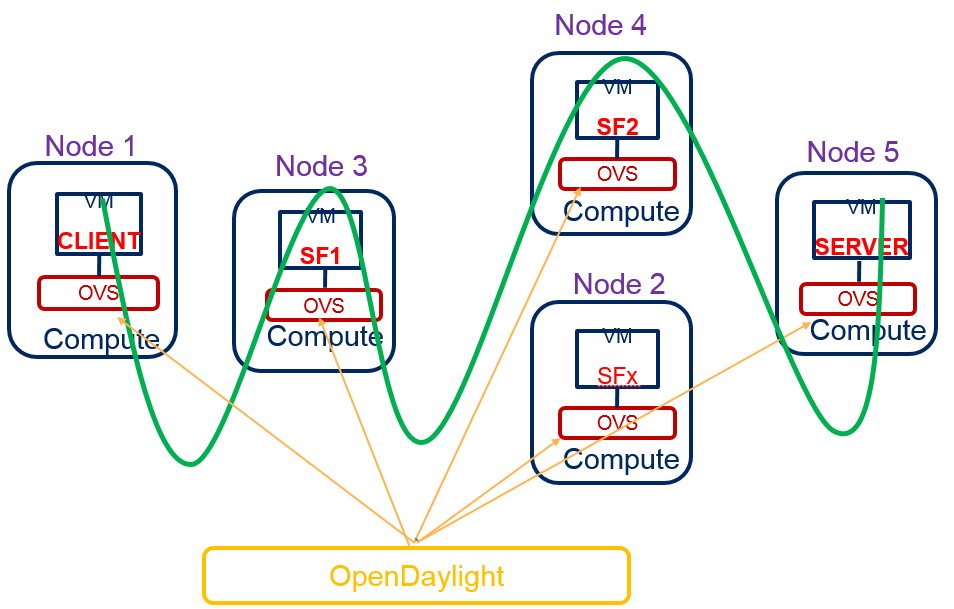

Service Function Chaining
=========================

OpenDaylight Service Function Chaining (SFC) Overview
-----------------------------------------------------

OpenDaylight Service Function Chaining (SFC) provides the ability to
define an ordered list of a network services (e.g. firewalls, load
balancers). These service are then "stitched" together in the network to
create a service chain. This project provides the infrastructure
(chaining logic, APIs) needed for ODL to provision a service chain in
the network and an end-user application for defining such chains.

-  ACE - Access Control Entry

-  ACL - Access Control List

-  SCF - Service Classifier Function

-  SF - Service Function

-  SFC - Service Function Chain

-  SFF - Service Function Forwarder

-  SFG - Service Function Group

-  SFP - Service Function Path

-  RSP - Rendered Service Path

-  NSH - Network Service Header

SFC User Interface
------------------

Overview
~~~~~~~~

SFC User Interface (SFC-UI) is based on Dlux project. It provides an
easy way to create, read, update and delete configuration stored in
datastore. Moreover, it shows the status of all SFC features (e.g
installed, uninstalled) and Karaf log messages as well.

SFC-UI Architecture
~~~~~~~~~~~~~~~~~~~

SFC-UI operates purely by using RESTCONF.

.. figure:: ./images/sfc/sfc-ui-architecture.png
   :alt: SFC-UI integration into ODL

   SFC-UI integration into ODL

Configuring SFC-UI
~~~~~~~~~~~~~~~~~~

1. Run ODL distribution (run karaf)

2. In Karaf console execute: ``feature:install odl-sfc-ui``

3. Visit SFC-UI on: ``http://<odl_ip_address>:8181/sfc/index.html``

SFC Southbound REST Plug-in
--------------------------

Overview
~~~~~~~~

The Southbound REST Plug-in is used to send configuration from datastore
down to network devices supporting a REST API (i.e. they have a
configured REST URI). It supports POST/PUT/DELETE operations, which are
triggered accordingly by changes in the SFC data stores.

-  Access Control List (ACL)

-  Service Classifier Function (SCF)

-  Service Function (SF)

-  Service Function Group (SFG)

-  Service Function Schedule Type (SFST)

-  Service Function Forwarder (SFF)

-  Rendered Service Path (RSP)

Southbound REST Plug-in Architecture
~~~~~~~~~~~~~~~~~~~~~~~~~~~~~~~~~~~

From the user perspective, the REST plug-in is another SFC Southbound
plug-in used to communicate with network devices.

.. figure:: ./images/sfc/sb-rest-architecture-user.png
   :alt: Southbound REST Plug-in integration into ODL

   Southbound REST Plug-in integration into ODL

Configuring Southbound REST Plugin
~~~~~~~~~~~~~~~~~~~~~~~~~~~~~~~~~~

1. Run ODL distribution (run karaf)

2. In Karaf console execute: ``feature:install odl-sfc-sb-rest``

3. Configure REST URIs for SF/SFF through SFC User Interface or RESTCONF
   (required configuration steps can be found in the tutorial stated
   bellow)

Tutorial
~~~~~~~~

Comprehensive tutorial on how to use the Southbound REST Plug-in and how
to control network devices with it can be found on:
https://wiki.opendaylight.org/view/Service_Function_Chaining:Main#SFC_101

SFC-OVS integration
-------------------

Overview
~~~~~~~~

SFC-OVS provides integration of SFC with Open vSwitch (OVS) devices.
Integration is realized through mapping of SFC objects (like SF, SFF,
Classifier, etc.) to OVS objects (like Bridge,
TerminationPoint=Port/Interface). The mapping takes care of automatic
instantiation (setup) of corresponding object whenever its counterpart
is created. For example, when a new SFF is created, the SFC-OVS plug-in
will create a new OVS bridge and when a new OVS Bridge is created, the
SFC-OVS plug-in will create a new SFF.

The feature is intended for SFC users willing to use Open vSwitch as
underlying network infrastructure for deploying RSPs (Rendered Service
Paths).

SFC-OVS Architecture
~~~~~~~~~~~~~~~~~~~~

SFC-OVS uses the OVSDB MD-SAL Southbound API for getting/writing
information from/to OVS devices. From the user perspective SFC-OVS acts
as a layer between SFC datastore and OVSDB.

.. figure:: ./images/sfc/sfc-ovs-architecture-user.png
   :alt: SFC-OVS integration into ODL

   SFC-OVS integration into ODL

Configuring SFC-OVS
~~~~~~~~~~~~~~~~~~~

1. Run ODL distribution (run karaf)

2. In Karaf console execute: ``feature:install odl-sfc-ovs``

3. Configure Open vSwitch to use ODL as a manager, using following
   command: ``ovs-vsctl set-manager tcp:<odl_ip_address>:6640``

Tutorials
~~~~~~~~~

Verifying mapping from OVS to SFF
^^^^^^^^^^^^^^^^^^^^^^^^^^^^^^^^^

Overview
''''''''

This tutorial shows the usual work flow when OVS configuration is
transformed to corresponding SFC objects (in this case SFF).

Prerequisites
''''''''''''''

-  Open vSwitch installed (ovs-vsctl command available in shell)

-  SFC-OVS feature configured as stated above

Instructions
''''''''''''

1. ``ovs-vsctl set-manager tcp:<odl_ip_address>:6640``

2. ``ovs-vsctl add-br br1``

3. ``ovs-vsctl add-port br1 testPort``

Verification
''''''''''''

a. visit SFC User Interface:
   ``http://<odl_ip_address>:8181/sfc/index.html#/sfc/serviceforwarder``

b. use pure RESTCONF and send GET request to URL:
   ``http://<odl_ip_address>:8181/restconf/config/service-function-forwarder:service-function-forwarders``

There should be SFF, which name will be ending with *br1* and the SFF
should containt two DataPlane locators: *br1* and *testPort*.

Verifying mapping from SFF to OVS
^^^^^^^^^^^^^^^^^^^^^^^^^^^^^^^^^

Overview
''''''''

This tutorial shows the usual workflow during creation of OVS Bridge
with use of SFC APIs.

Prerequisites
''''''''''''''

-  Open vSwitch installed (ovs-vsctl command available in shell)

-  SFC-OVS feature configured as stated above

Instructions
''''''''''''

1. In shell execute: ``ovs-vsctl set-manager tcp:<odl_ip_address>:6640``

2. Send POST request to URL:
   ``http://<odl_ip_address>:8181/restconf/operations/service-function-forwarder-ovs:create-ovs-bridge``
   Use Basic auth with credentials: "admin", "admin" and set
   ``Content-Type: application/json``. The content of POST request
   should be following:

::

    {
        "input":
        {
            "name": "br-test",
            "ovs-node": {
                "ip": "<Open_vSwitch_ip_address>"
            }
        }
    }

Open\_vSwitch\_ip\_address is IP address of machine, where Open vSwitch
is installed.

Verification
''''''''''''

In shell execute: ``ovs-vsctl show``. There should be Bridge with name
*br-test* and one port/interface called *br-test*.

Also, corresponding SFF for this OVS Bridge should be configured, which
can be verified through SFC User Interface or RESTCONF as stated in
previous tutorial.

SFC Classifier User Guide
-------------------------

Overview
~~~~~~~~

Description of classifier can be found in:
https://datatracker.ietf.org/doc/draft-ietf-sfc-architecture/

There are two types of classifier:

1. OpenFlow Classifier

2. Iptables Classifier

OpenFlow Classifier
~~~~~~~~~~~~~~~~~~~

OpenFlow Classifier implements the classification criteria based on
OpenFlow rules deployed into an OpenFlow switch. An Open vSwitch will
take the role of a classifier and performs various encapsulations such
NSH, VLAN, MPLS, etc. In the existing implementation, classifier can
support NSH encapsulation. Matching information is based on ACL for MAC
addresses, ports, protocol, IPv4 and IPv6. Supported protocols are TCP,
UDP and SCTP. Actions information in the OF rules, shall be forwarding
of the encapsulated packets with specific information related to the
RSP.

Classifier Architecture
^^^^^^^^^^^^^^^^^^^^^^^

The OVSDB Southbound interface is used to create an instance of a bridge
in a specific location (via IP address). This bridge contains the
OpenFlow rules that perform the classification of the packets and react
accordingly. The OpenFlow Southbound interface is used to translate the
ACL information into OF rules within the Open vSwitch.

.. note::

    in order to create the instance of the bridge that takes the role of
    a classifier, an "empty" SFF must be created.

Configuring Classifier
^^^^^^^^^^^^^^^^^^^^^^

1. An empty SFF must be created in order to host the ACL that contains
   the classification information.

2. SFF data plane locator must be configured

3. Classifier interface must be manually added to SFF bridge.

Administering or Managing Classifier
^^^^^^^^^^^^^^^^^^^^^^^^^^^^^^^^^^^^

Classification information is based on MAC addresses, protocol, ports
and IP. ACL gathers this information and is assigned to an RSP which
turns to be a specific path for a Service Chain.

Iptables Classifier
~~~~~~~~~~~~~~~~~~~

Classifier manages everything from starting the packet listener to
creation (and removal) of appropriate ip(6)tables rules and marking
received packets accordingly. Its functionality is **available only on
Linux** as it leverdges **NetfilterQueue**, which provides access to
packets matched by an **iptables** rule. Classifier requires **root
privileges** to be able to operate.

So far it is capable of processing ACL for MAC addresses, ports, IPv4
and IPv6. Supported protocols are TCP and UDP.

Classifier Architecture
^^^^^^^^^^^^^^^^^^^^^^^

Python code located in the project repository
sfc-py/common/classifier.py.

.. note::

    classifier assumes that Rendered Service Path (RSP) **already
    exists** in ODL when an ACL referencing it is obtained

1. sfc\_agent receives an ACL and passes it for processing to the
   classifier

2. the RSP (its SFF locator) referenced by ACL is requested from ODL

3. if the RSP exists in the ODL then ACL based iptables rules for it are
   applied

After this process is over, every packet successfully matched to an
iptables rule (i.e. successfully classified) will be NSH encapsulated
and forwarded to a related SFF, which knows how to traverse the RSP.

Rules are created using appropriate iptables command. If the Access
Control Entry (ACE) rule is MAC address related both iptables and
IPv6 tables rules re issued. If ACE rule is IPv4 address related, only
iptables rules are issued, same for IPv6.

.. note::

    iptables **raw** table contains all created rules

Configuring Classifier
^^^^^^^^^^^^^^^^^^^^^^

| Classfier does’t need any configuration.
| Its only requirement is that the **second (2) Netfilter Queue** is not
  used by any other process and is **avalilable for the classifier**.

Administering or Managing Classifier
^^^^^^^^^^^^^^^^^^^^^^^^^^^^^^^^^^^^

Classifier runs alongside sfc\_agent, therefore the command for starting
it locally is:

::

    sudo python3.4 sfc-py/sfc_agent.py --rest --odl-ip-port localhost:8181 --auto-sff-name --nfq-class

SFC OpenFlow Renderer User Guide
--------------------------------

Overview
~~~~~~~~

The Service Function Chaining (SFC) OpenFlow Renderer (SFC OF Renderer)
implements Service Chaining on OpenFlow switches. It listens for the
creation of a Rendered Service Path (RSP), and once received it programs
Service Function Forwarders (SFF) that are hosted on OpenFlow capable
switches to steer packets through the service chain.

Common acronyms used in the following sections:

-  SF - Service Function

-  SFF - Service Function Forwarder

-  SFC - Service Function Chain

-  SFP - Service Function Path

-  RSP - Rendered Service Path

SFC OpenFlow Renderer Architecture
~~~~~~~~~~~~~~~~~~~~~~~~~~~~~~~~~~

The SFC OF Renderer is invoked after a RSP is created using an MD-SAL
listener called ``SfcOfRspDataListener``. Upon SFC OF Renderer
initialization, the ``SfcOfRspDataListener`` registers itself to listen
for RSP changes. When invoked, the ``SfcOfRspDataListener`` processes
the RSP and calls the ``SfcOfFlowProgrammerImpl`` to create the
necessary flows in the Service Function Forwarders configured in the
RSP. Refer to the following diagram for more details.

.. figure:: ./images/sfc/sfcofrenderer_architecture.png
   :alt: SFC OpenFlow Renderer High Level Architecture

   SFC OpenFlow Renderer High Level Architecture

SFC OpenFlow Switch Flow pipeline
~~~~~~~~~~~~~~~~~~~~~~~~~~~~~~~~~

The SFC OpenFlow Renderer uses the following tables for its Flow
pipeline:

-  Table 0, Classifier

-  Table 1, Transport Ingress

-  Table 2, Path Mapper

-  Table 3, Path Mapper ACL

-  Table 4, Next Hop

-  Table 10, Transport Egress

The OpenFlow Table Pipeline is intended to be generic to work for all of
the different encapsulations supported by SFC.

All of the tables are explained in detail in the following section.

The SFFs (SFF1 and SFF2), SFs (SF1), and topology used for the flow
tables in the following sections are as described in the following
diagram.

.. figure:: ./images/sfc/sfcofrenderer_nwtopo.png
   :alt: SFC OpenFlow Renderer Typical Network Topology

   SFC OpenFlow Renderer Typical Network Topology

Classifier Table detailed
^^^^^^^^^^^^^^^^^^^^^^^^^

It is possible for the SFF to also act as a classifier. This table maps
subscriber traffic to RSPs, and is explained in detail in the classifier
documentation.

If the SFF is not a classifier, then this table will just have a simple
Goto Table 1 flow.

Transport Ingress Table detailed
^^^^^^^^^^^^^^^^^^^^^^^^^^^^^^^^

The Transport Ingress table has an entry per expected tunnel transport
type to be received in a particular SFF, as established in the SFC
configuration.

Here are two example on SFF1: one where the RSP ingress tunnel is MPLS
assuming VLAN is used for the SFF-SF, and the other where the RSP
ingress tunnel is NSH GRE (UDP port 4789):

+----------+-------------------------------------+--------------+
| Priority | Match                               | Action       |
+==========+=====================================+==============+
| 256      | EtherType==0x8847 (MPLS unicast)    | Goto Table 2 |
+----------+-------------------------------------+--------------+
| 256      | EtherType==0x8100 (VLAN)            | Goto Table 2 |
+----------+-------------------------------------+--------------+
| 256      | EtherType==0x0800,udp,tp\_dst==4789 | Goto Table 2 |
|          | (IP v4)                             |              |
+----------+-------------------------------------+--------------+
| 5        | Match Any                           | Drop         |
+----------+-------------------------------------+--------------+

Table: Table Transport Ingress

Path Mapper Table detailed
^^^^^^^^^^^^^^^^^^^^^^^^^^

The Path Mapper table has an entry per expected tunnel transport info to
be received in a particular SFF, as established in the SFC
configuration. The tunnel transport info is used to determine the RSP
Path ID, and is stored in the OpenFlow Metadata. This table is not used
for NSH, since the RSP Path ID is stored in the NSH header.

For SF nodes that do not support NSH tunneling, the IP header DSCP field
is used to store the RSP Path Id. The RSP Path Id is written to the DSCP
field in the Transport Egress table for those packets sent to an SF.

Here is an example on SFF1, assuming the following details:

-  VLAN ID 1000 is used for the SFF-SF

-  The RSP Path 1 tunnel uses MPLS label 100 for ingress and 101 for
   egress

-  The RSP Path 2 (symmetric downlink path) uses MPLS label 101 for
   ingress and 100 for egress

+----------+-------------------+-----------------------+
| Priority | Match             | Action                |
+==========+===================+=======================+
| 256      | MPLS Label==100   | RSP Path=1, Pop MPLS, |
|          |                   | Goto Table 4          |
+----------+-------------------+-----------------------+
| 256      | MPLS Label==101   | RSP Path=2, Pop MPLS, |
|          |                   | Goto Table 4          |
+----------+-------------------+-----------------------+
| 256      | VLAN ID==1000, IP | RSP Path=1, Pop VLAN, |
|          | DSCP==1           | Goto Table 4          |
+----------+-------------------+-----------------------+
| 256      | VLAN ID==1000, IP | RSP Path=2, Pop VLAN, |
|          | DSCP==2           | Goto Table 4          |
+----------+-------------------+-----------------------+
| 5        | Match Any         | Goto Table 3          |
+----------+-------------------+-----------------------+

Table: Table Path Mapper

Path Mapper ACL Table detailed
^^^^^^^^^^^^^^^^^^^^^^^^^^^^^^

This table is only populated when PacketIn packets are received from the
switch for TcpProxy type SFs. These flows are created with an inactivity
timer of 60 seconds and will be automatically deleted upon expiration.

Next Hop Table detailed
^^^^^^^^^^^^^^^^^^^^^^^

The Next Hop table uses the RSP Path Id and appropriate packet fields to
determine where to send the packet next. For NSH, only the NSP (Network
Services Path, RSP ID) and NSI (Network Services Index, next hop) fields
from the NSH header are needed to determine the VXLAN tunnel destination
IP. For VLAN or MPLS, then the source MAC address is used to determine
the destination MAC address.

Here are two examples on SFF1, assuming SFF1 is connected to SFF2. RSP
Paths 1 and 2 are symmetric VLAN paths. RSP Paths 3 and 4 are symmetric
NSH paths. RSP Path 1 ingress packets come from external to SFC, for
which we don’t have the source MAC address (MacSrc).

+----------+--------------------------------+--------------------------------+
| Priority | Match                          | Action                         |
+==========+================================+================================+
| 256      | RSP Path==1, MacSrc==SF1       | MacDst=SFF2, Goto Table 10     |
+----------+--------------------------------+--------------------------------+
| 256      | RSP Path==2, MacSrc==SF1       | Goto Table 10                  |
+----------+--------------------------------+--------------------------------+
| 256      | RSP Path==2, MacSrc==SFF2      | MacDst=SF1, Goto Table 10      |
+----------+--------------------------------+--------------------------------+
| 246      | RSP Path==1                    | MacDst=SF1, Goto Table 10      |
+----------+--------------------------------+--------------------------------+
| 256      | nsp=3,nsi=255 (SFF Ingress RSP | load:0xa000002→NXM\_NX\_TUN\_I |
|          | 3)                             | PV4\_DST[],                    |
|          |                                | Goto Table 10                  |
+----------+--------------------------------+--------------------------------+
| 256      | nsp=3,nsi=254 (SFF Ingress     | load:0xa00000a→NXM\_NX\_TUN\_I |
|          | from SF, RSP 3)                | PV4\_DST[],                    |
|          |                                | Goto Table 10                  |
+----------+--------------------------------+--------------------------------+
| 256      | nsp=4,nsi=254 (SFF1 Ingress    | load:0xa00000a→NXM\_NX\_TUN\_I |
|          | from SFF2)                     | PV4\_DST[],                    |
|          |                                | Goto Table 10                  |
+----------+--------------------------------+--------------------------------+
| 5        | Match Any                      | Drop                           |
+----------+--------------------------------+--------------------------------+

Table: Table Next Hop

Transport Egress Table detailed
^^^^^^^^^^^^^^^^^^^^^^^^^^^^^^^

The Transport Egress table prepares egress tunnel information and sends
the packets out.

Here are two examples on SFF1. RSP Paths 1 and 2 are symmetric MPLS
paths that use VLAN for the SFF-SF. RSP Paths 3 and 4 are symmetric NSH
paths. Since it is assumed that switches used for NSH will only have one
VXLAN port, the NSH packets are just sent back where they came from.

+----------+--------------------------------+--------------------------------+
| Priority | Match                          | Action                         |
+==========+================================+================================+
| 256      | RSP Path==1, MacDst==SF1       | Push VLAN ID 1000, Port=SF1    |
+----------+--------------------------------+--------------------------------+
| 256      | RSP Path==1, MacDst==SFF2      | Push MPLS Label 101, Port=SFF2 |
+----------+--------------------------------+--------------------------------+
| 256      | RSP Path==2, MacDst==SF1       | Push VLAN ID 1000, Port=SF1    |
+----------+--------------------------------+--------------------------------+
| 246      | RSP Path==2                    | Push MPLS Label 100,           |
|          |                                | Port=Ingress                   |
+----------+--------------------------------+--------------------------------+
| 256      | nsp=3,nsi=255 (SFF Ingress RSP | IN\_PORT                       |
|          | 3)                             |                                |
+----------+--------------------------------+--------------------------------+
| 256      | nsp=3,nsi=254 (SFF Ingress     | IN\_PORT                       |
|          | from SF, RSP 3)                |                                |
+----------+--------------------------------+--------------------------------+
| 256      | nsp=4,nsi=254 (SFF1 Ingress    | IN\_PORT                       |
|          | from SFF2)                     |                                |
+----------+--------------------------------+--------------------------------+
| 5        | Match Any                      | Drop                           |
+----------+--------------------------------+--------------------------------+

Table: Table Transport Egress

Administering SFC OF Renderer
~~~~~~~~~~~~~~~~~~~~~~~~~~~~~

To use the SFC OpenFlow Renderer Karaf, at least the following Karaf
features must be installed.

-  odl-openflowplugin-nxm-extensions

-  odl-openflowplugin-flow-services

-  odl-sfc-provider

-  odl-sfc-model

-  odl-sfc-openflow-renderer

-  odl-sfc-ui (optional)

The following command can be used to view all of the currently installed
Karaf features:

::

    opendaylight-user@root>feature:list -i

Or, pipe the command to a grep to see a subset of the currently
installed Karaf features:

::

    opendaylight-user@root>feature:list -i | grep sfc

To install a particular feature, use the Karaf ``feature:install``
command.

SFC OF Renderer Tutorial
~~~~~~~~~~~~~~~~~~~~~~~~

Overview
^^^^^^^^

In this tutorial, 2 different encapsulations will be shown: MPLS and
NSH. The following Network Topology diagram is a logical view of the
SFFs and SFs involved in creating the Service Chains.

.. figure:: ./images/sfc/sfcofrenderer_nwtopo.png
   :alt: SFC OpenFlow Renderer Typical Network Topology

   SFC OpenFlow Renderer Typical Network Topology

Prerequisites
^^^^^^^^^^^^^

To use this example, SFF OpenFlow switches must be created and connected
as illustrated above. Additionally, the SFs must be created and
connected.

Target Environment
^^^^^^^^^^^^^^^^^^

The target environment is not important, but this use-case was created
and tested on Linux.

Instructions
^^^^^^^^^^^^

The steps to use this tutorial are as follows. The referenced
configuration in the steps is listed in the following sections.

There are numerous ways to send the configuration. In the following
configuration chapters, the appropriate ``curl`` command is shown for
each configuration to be sent, including the URL.

Steps to configure the SFC OF Renderer tutorial:

1. Send the ``SF`` RESTCONF configuration

2. Send the ``SFF`` RESTCONF configuration

3. Send the ``SFC`` RESTCONF configuration

4. Send the ``SFP`` RESTCONF configuration

5. Create the ``RSP`` with a RESTCONF RPC command

Once the configuration has been successfully created, query the Rendered
Service Paths with either the SFC UI or via RESTCONF. Notice that the
RSP is symmetrical, so the following 2 RSPs will be created:

-  sfc-path1

-  sfc-path1-Reverse

At this point the Service Chains have been created, and the OpenFlow
Switches are programmed to steer traffic through the Service Chain.
Traffic can now be injected from a client into the Service Chain. To
debug problems, the OpenFlow tables can be dumped with the following
commands, assuming SFF1 is called ``s1`` and SFF2 is called ``s2``.

::

    sudo ovs-ofctl -O OpenFlow13  dump-flows s1

::

    sudo ovs-ofctl -O OpenFlow13  dump-flows s2

In all the following configuration sections, replace the ``${JSON}``
string with the appropriate JSON configuration. Also, change the
``localhost`` destination in the URL accordingly.

SFC OF Renderer NSH Tutorial
''''''''''''''''''''''''''''

The following configuration sections show how to create the different
elements using NSH encapsulation.

| **NSH Service Function configuration**

The Service Function configuration can be sent with the following
command:

::

    curl -i -H "Content-Type: application/json" -H "Cache-Control: no-cache" --data '${JSON}' -X PUT --user admin:admin http://localhost:8181/restconf/config/service-function:service-functions/

**SF configuration JSON.**

::

    {
     "service-functions": {
       "service-function": [
         {
           "name": "sf1",
           "type": "http-header-enrichment",
           "nsh-aware": true,
           "ip-mgmt-address": "10.0.0.2",
           "sf-data-plane-locator": [
             {
               "name": "sf1dpl",
               "ip": "10.0.0.10",
               "port": 4789,
               "transport": "service-locator:vxlan-gpe",
               "service-function-forwarder": "sff1"
             }
           ]
         },
         {
           "name": "sf2",
           "type": "firewall",
           "nsh-aware": true,
           "ip-mgmt-address": "10.0.0.3",
           "sf-data-plane-locator": [
             {
               "name": "sf2dpl",
                "ip": "10.0.0.20",
                "port": 4789,
                "transport": "service-locator:vxlan-gpe",
               "service-function-forwarder": "sff2"
             }
           ]
         }
       ]
     }
    }

| **NSH Service Function Forwarder configuration**

The Service Function Forwarder configuration can be sent with the
following command:

::

    curl -i -H "Content-Type: application/json" -H "Cache-Control: no-cache" --data '${JSON}' -X PUT --user admin:admin http://localhost:8181/restconf/config/service-function-forwarder:service-function-forwarders/

**SFF configuration JSON.**

::

    {
     "service-function-forwarders": {
       "service-function-forwarder": [
         {
           "name": "sff1",
           "service-node": "openflow:2",
           "sff-data-plane-locator": [
             {
               "name": "sff1dpl",
               "data-plane-locator":
               {
                   "ip": "10.0.0.1",
                   "port": 4789,
                   "transport": "service-locator:vxlan-gpe"
               }
             }
           ],
           "service-function-dictionary": [
             {
               "name": "sf1",
               "sff-sf-data-plane-locator":
               {
                   "sf-dpl-name": "sf1dpl",
                   "sff-dpl-name": "sff1dpl"
               }
             }
           ]
         },
         {
           "name": "sff2",
           "service-node": "openflow:3",
           "sff-data-plane-locator": [
             {
               "name": "sff2dpl",
               "data-plane-locator":
               {
                   "ip": "10.0.0.2",
                   "port": 4789,
                   "transport": "service-locator:vxlan-gpe"
               }
             }
           ],
           "service-function-dictionary": [
             {
               "name": "sf2",
               "sff-sf-data-plane-locator":
               {
                   "sf-dpl-name": "sf2dpl",
                   "sff-dpl-name": "sff2dpl"
               }
             }
           ]
         }
       ]
     }
    }

| **NSH Service Function Chain configuration**

The Service Function Chain configuration can be sent with the following
command:

::

    curl -i -H "Content-Type: application/json" -H "Cache-Control: no-cache" --data '${JSON}' -X PUT --user admin:admin http://localhost:8181/restconf/config/service-function-chain:service-function-chains/

**SFC configuration JSON.**

::

    {
     "service-function-chains": {
       "service-function-chain": [
         {
           "name": "sfc-chain1",
           "symmetric": true,
           "sfc-service-function": [
             {
               "name": "hdr-enrich-abstract1",
               "type": "http-header-enrichment"
             },
             {
               "name": "firewall-abstract1",
               "type": "firewall"
             }
           ]
         }
       ]
     }
    }

| **NSH Service Function Path configuration**

The Service Function Path configuration can be sent with the following
command:

::

    curl -i -H "Content-Type: application/json" -H "Cache-Control: no-cache" --data '${JSON}' -X PUT --user admin:admin http://localhost:8181/restconf/config/service-function-path:service-function-paths/

**SFP configuration JSON.**

::

    {
      "service-function-paths": {
        "service-function-path": [
          {
            "name": "sfc-path1",
            "service-chain-name": "sfc-chain1",
            "transport-type": "service-locator:vxlan-gpe",
            "symmetric": true
          }
        ]
      }
    }

| **NSH Rendered Service Path creation**

::

    curl -i -H "Content-Type: application/json" -H "Cache-Control: no-cache" --data '${JSON}' -X POST --user admin:admin http://localhost:8181/restconf/operations/rendered-service-path:create-rendered-path/

**RSP creation JSON.**

::

    {
     "input": {
         "name": "sfc-path1",
         "parent-service-function-path": "sfc-path1",
         "symmetric": true
     }
    }

| **NSH Rendered Service Path removal**

The following command can be used to remove a Rendered Service Path
called ``sfc-path1``:

::

    curl -i -H "Content-Type: application/json" -H "Cache-Control: no-cache" --data '{"input": {"name": "sfc-path1" } }' -X POST --user admin:admin http://localhost:8181/restconf/operations/rendered-service-path:delete-rendered-path/

| **NSH Rendered Service Path Query**

The following command can be used to query all of the created Rendered
Service Paths:

::

    curl -H "Content-Type: application/json" -H "Cache-Control: no-cache" -X GET --user admin:admin http://localhost:8181/restconf/operational/rendered-service-path:rendered-service-paths/

SFC OF Renderer MPLS Tutorial
'''''''''''''''''''''''''''''

The following configuration sections show how to create the different
elements using MPLS encapsulation.

| **MPLS Service Function configuration**

The Service Function configuration can be sent with the following
command:

::

    curl -i -H "Content-Type: application/json" -H "Cache-Control: no-cache" --data '${JSON}' -X PUT --user admin:admin http://localhost:8181/restconf/config/service-function:service-functions/

**SF configuration JSON.**

::

    {
     "service-functions": {
       "service-function": [
         {
           "name": "sf1",
           "type": "http-header-enrichment",
           "nsh-aware": false,
           "ip-mgmt-address": "10.0.0.2",
           "sf-data-plane-locator": [
             {
               "name": "sf1-sff1",
               "mac": "00:00:08:01:02:01",
               "vlan-id": 1000,
               "transport": "service-locator:mac",
               "service-function-forwarder": "sff1"
             }
           ]
         },
         {
           "name": "sf2",
           "type": "firewall",
           "nsh-aware": false,
           "ip-mgmt-address": "10.0.0.3",
           "sf-data-plane-locator": [
             {
               "name": "sf2-sff2",
               "mac": "00:00:08:01:03:01",
               "vlan-id": 2000,
               "transport": "service-locator:mac",
               "service-function-forwarder": "sff2"
             }
           ]
         }
       ]
     }
    }

| **MPLS Service Function Forwarder configuration**

The Service Function Forwarder configuration can be sent with the
following command:

::

    curl -i -H "Content-Type: application/json" -H "Cache-Control: no-cache" --data '${JSON}' -X PUT --user admin:admin http://localhost:8181/restconf/config/service-function-forwarder:service-function-forwarders/

**SFF configuration JSON.**

::

    {
     "service-function-forwarders": {
       "service-function-forwarder": [
         {
           "name": "sff1",
           "service-node": "openflow:2",
           "sff-data-plane-locator": [
             {
               "name": "ulSff1Ingress",
               "data-plane-locator":
               {
                   "mpls-label": 100,
                   "transport": "service-locator:mpls"
               },
               "service-function-forwarder-ofs:ofs-port":
               {
                   "mac": "11:11:11:11:11:11",
                   "port-id" : "1"
               }
             },
             {
               "name": "ulSff1ToSff2",
               "data-plane-locator":
               {
                   "mpls-label": 101,
                   "transport": "service-locator:mpls"
               },
               "service-function-forwarder-ofs:ofs-port":
               {
                   "mac": "33:33:33:33:33:33",
                   "port-id" : "2"
               }
             },
             {
               "name": "toSf1",
               "data-plane-locator":
               {
                   "mac": "22:22:22:22:22:22",
                   "vlan-id": 1000,
                   "transport": "service-locator:mac",
               },
               "service-function-forwarder-ofs:ofs-port":
               {
                   "mac": "33:33:33:33:33:33",
                   "port-id" : "3"
               }
             }
           ],
           "service-function-dictionary": [
             {
               "name": "sf1",
               "sff-sf-data-plane-locator":
               {
                   "sf-dpl-name": "sf1-sff1",
                   "sff-dpl-name": "toSf1"
               }
             }
           ]
         },
         {
           "name": "sff2",
           "service-node": "openflow:3",
           "sff-data-plane-locator": [
             {
               "name": "ulSff2Ingress",
               "data-plane-locator":
               {
                   "mpls-label": 101,
                   "transport": "service-locator:mpls"
               },
               "service-function-forwarder-ofs:ofs-port":
               {
                   "mac": "44:44:44:44:44:44",
                   "port-id" : "1"
               }
             },
             {
               "name": "ulSff2Egress",
               "data-plane-locator":
               {
                   "mpls-label": 102,
                   "transport": "service-locator:mpls"
               },
               "service-function-forwarder-ofs:ofs-port":
               {
                   "mac": "66:66:66:66:66:66",
                   "port-id" : "2"
               }
             },
             {
               "name": "toSf2",
               "data-plane-locator":
               {
                   "mac": "55:55:55:55:55:55",
                   "vlan-id": 2000,
                   "transport": "service-locator:mac"
               },
               "service-function-forwarder-ofs:ofs-port":
               {
                   "port-id" : "3"
               }
             }
           ],
           "service-function-dictionary": [
             {
               "name": "sf2",
               "sff-sf-data-plane-locator":
               {
                   "sf-dpl-name": "sf2-sff2",
                   "sff-dpl-name": "toSf2"

               },
               "service-function-forwarder-ofs:ofs-port":
               {
                   "port-id" : "3"
               }
             }
           ]
         }
       ]
     }
    }

| **MPLS Service Function Chain configuration**

The Service Function Chain configuration can be sent with the following
command:

::

    curl -i -H "Content-Type: application/json" -H "Cache-Control: no-cache" --data '${JSON}' -X PUT --user admin:admin http://localhost:8181/restconf/config/service-function-chain:service-function-chains/

**SFC configuration JSON.**

::

    {
     "service-function-chains": {
       "service-function-chain": [
         {
           "name": "sfc-chain1",
           "symmetric": true,
           "sfc-service-function": [
             {
               "name": "hdr-enrich-abstract1",
               "type": "http-header-enrichment"
             },
             {
               "name": "firewall-abstract1",
               "type": "firewall"
             }
           ]
         }
       ]
     }
    }

| **MPLS Service Function Path configuration**

The Service Function Path configuration can be sent with the following
command:

::

    curl -i -H "Content-Type: application/json" -H "Cache-Control: no-cache" --data '${JSON}' -X PUT --user admin:admin http://localhost:8181/restconf/config/service-function-path:service-function-paths/

**SFP configuration JSON.**

::

    {
      "service-function-paths": {
        "service-function-path": [
          {
            "name": "sfc-path1",
            "service-chain-name": "sfc-chain1",
            "transport-type": "service-locator:mpls",
            "symmetric": true
          }
        ]
      }
    }

| **MPLS Rendered Service Path creation**

::

    curl -i -H "Content-Type: application/json" -H "Cache-Control: no-cache" --data '${JSON}' -X POST --user admin:admin http://localhost:8181/restconf/operations/rendered-service-path:create-rendered-path/

**RSP creation JSON.**

::

    {
     "input": {
         "name": "sfc-path1",
         "parent-service-function-path": "sfc-path1",
         "symmetric": true
     }
    }

| **MPLS Rendered Service Path removal**

The following command can be used to remove a Rendered Service Path
called ``sfc-path1``:

::

    curl -i -H "Content-Type: application/json" -H "Cache-Control: no-cache" --data '{"input": {"name": "sfc-path1" } }' -X POST --user admin:admin http://localhost:8181/restconf/operations/rendered-service-path:delete-rendered-path/

| **MPLS Rendered Service Path Query**

The following command can be used to query all of the created Rendered
Service Paths:

::

    curl -H "Content-Type: application/json" -H "Cache-Control: no-cache" -X GET --user admin:admin http://localhost:8181/restconf/operational/rendered-service-path:rendered-service-paths/

SFC IOS XE Renderer User Guide
------------------------------

Overview
~~~~~~~~

The early Service Function Chaining (SFC) renderer for IOS-XE devices
(SFC IOS-XE renderer) implements Service Chaining functionality on
IOS-XE capable switches. It listens for the creation of a Rendered
Service Path (RSP) and sets up Service Function Forwarders (SFF) that
are hosted on IOS-XE switches to steer traffic through the service
chain.

Common acronyms used in the following sections:

-  SF - Service Function

-  SFF - Service Function Forwarder

-  SFC - Service Function Chain

-  SP - Service Path

-  SFP - Service Function Path

-  RSP - Rendered Service Path

-  LSF - Local Service Forwarder

-  RSF - Remote Service Forwarder

SFC IOS-XE Renderer Architecture
~~~~~~~~~~~~~~~~~~~~~~~~~~~~~~~~

When the SFC IOS-XE renderer is initialized, all required listeners are
registered to handle incoming data. It involves CSR/IOS-XE
``NodeListener`` which stores data about all configurable devices
including their mountpoints (used here as databrokers),
``ServiceFunctionListener``, ``ServiceForwarderListener`` (see mapping)
and ``RenderedPathListener`` used to listen for RSP changes. When the
SFC IOS-XE renderer is invoked, ``RenderedPathListener`` calls the
``IosXeRspProcessor`` which processes the RSP change and creates all
necessary Service Paths and Remote Service Forwarders (if necessary) on
IOS-XE devices.

Service Path details
~~~~~~~~~~~~~~~~~~~~

Each Service Path is defined by index (represented by NSP) and contains
service path entries. Each entry has appropriate service index (NSI) and
definition of next hop. Next hop can be Service Function, different
Service Function Forwarder or definition of end of chain - terminate.
After terminating, the packet is sent to destination. If a SFF is
defined as a next hop, it has to be present on device in the form of
Remote Service Forwarder. RSFs are also created during RSP processing.

Example of Service Path:

::

    service-chain service-path 200
       service-index 255 service-function firewall-1
       service-index 254 service-function dpi-1
       service-index 253 terminate

Mapping to IOS-XE SFC entities
~~~~~~~~~~~~~~~~~~~~~~~~~~~~~~

Renderer contains mappers for SFs and SFFs. IOS-XE capable device is
using its own definition of Service Functions and Service Function
Forwarders according to appropriate .yang file.
``ServiceFunctionListener`` serves as a listener for SF changes. If SF
appears in datastore, listener extracts its management ip address and
looks into cached IOS-XE nodes. If some of available nodes match,
Service function is mapped in ``IosXeServiceFunctionMapper`` to be
understandable by IOS-XE device and it’s written into device’s config.
``ServiceForwarderListener`` is used in a similar way. All SFFs with
suitable management ip address it mapped in
``IosXeServiceForwarderMapper``. Remapped SFFs are configured as a Local
Service Forwarders. It is not possible to directly create Remote Service
Forwarder using IOS-XE renderer. RSF is created only during RSP
processing.

Administering SFC IOS-XE renderer
~~~~~~~~~~~~~~~~~~~~~~~~~~~~~~~~~

To use the SFC IOS-XE Renderer Karaf, at least the following Karaf
features must be installed:

-  odl-aaa-shiro

-  odl-sfc-model

-  odl-sfc-provider

-  odl-restconf

-  odl-netconf-topology

-  odl-sfc-ios-xe-renderer

SFC IOS-XE renderer Tutorial
~~~~~~~~~~~~~~~~~~~~~~~~~~~~

Overview
^^^^^^^^

This tutorial is a simple example how to create Service Path on IOS-XE
capable device using IOS-XE renderer

Preconditions
^^^^^^^^^^^^^

To connect to IOS-XE device, it is necessary to use several modified
yang models and override device’s ones. All .yang files are in the
``Yang/netconf`` folder in the ``sfc-ios-xe-renderer module`` in the SFC
project. These files have to be copied to the ``cache/schema``
directory, before Karaf is started. After that, custom capabilities have
to be sent to network-topology:

::

    PUT ./config/network-topology:network-topology/topology/topology-netconf/node/<device-name>

    <node xmlns="urn:TBD:params:xml:ns:yang:network-topology">
      <node-id>device-name</node-id>
      <host xmlns="urn:opendaylight:netconf-node-topology">device-ip</host>
      <port xmlns="urn:opendaylight:netconf-node-topology">2022</port>
      <username xmlns="urn:opendaylight:netconf-node-topology">login</username>
      <password xmlns="urn:opendaylight:netconf-node-topology">password</password>
      <tcp-only xmlns="urn:opendaylight:netconf-node-topology">false</tcp-only>
      <keepalive-delay xmlns="urn:opendaylight:netconf-node-topology">0</keepalive-delay>
      <yang-module-capabilities xmlns="urn:opendaylight:netconf-node-topology">
         <override>true</override>
         <capability xmlns="urn:opendaylight:netconf-node-topology">
            urn:ietf:params:xml:ns:yang:ietf-inet-types?module=ietf-inet-types&amp;revision=2013-07-15
         </capability>
         <capability xmlns="urn:opendaylight:netconf-node-topology">
            urn:ietf:params:xml:ns:yang:ietf-yang-types?module=ietf-yang-types&amp;revision=2013-07-15
         </capability>
         <capability xmlns="urn:opendaylight:netconf-node-topology">
            urn:ios?module=ned&amp;revision=2016-03-08
         </capability>
         <capability xmlns="urn:opendaylight:netconf-node-topology">
            http://tail-f.com/yang/common?module=tailf-common&amp;revision=2015-05-22
         </capability>
         <capability xmlns="urn:opendaylight:netconf-node-topology">
            http://tail-f.com/yang/common?module=tailf-meta-extensions&amp;revision=2013-11-07
         </capability>
         <capability xmlns="urn:opendaylight:netconf-node-topology">
            http://tail-f.com/yang/common?module=tailf-cli-extensions&amp;revision=2015-03-19
         </capability>
      </yang-module-capabilities>
    </node>

.. note::

    The device name in the URL and in the XML must match.

Instructions
^^^^^^^^^^^^

When the IOS-XE renderer is installed, all NETCONF nodes in
topology-netconf are processed and all capable nodes with accessible
mountpoints are cached. The first step is to create LSF on node.

``Service Function Forwarder configuration``

::

    PUT ./config/service-function-forwarder:service-function-forwarders

    {
        "service-function-forwarders": {
            "service-function-forwarder": [
                {
                    "name": "CSR1Kv-2",
                    "ip-mgmt-address": "172.25.73.23",
                    "sff-data-plane-locator": [
                        {
                            "name": "CSR1Kv-2-dpl",
                            "data-plane-locator": {
                                "transport": "service-locator:vxlan-gpe",
                                "port": 6633,
                                "ip": "10.99.150.10"
                            }
                        }
                    ]
                }
            ]
        }
    }

If the IOS-XE node with appropriate management IP exists, this
configuration is mapped and LSF is created on the device. The same
approach is used for Service Functions.

::

    PUT ./config/service-function:service-functions

    {
        "service-functions": {
            "service-function": [
                {
                    "name": "Firewall",
                    "ip-mgmt-address": "172.25.73.23",
                    "type": "service-function-type: firewall",
                    "nsh-aware": true,
                    "sf-data-plane-locator": [
                        {
                            "name": "firewall-dpl",
                            "port": 6633,
                            "ip": "12.1.1.2",
                            "transport": "service-locator:gre",
                            "service-function-forwarder": "CSR1Kv-2"
                        }
                    ]
                },
                {
                    "name": "Dpi",
                    "ip-mgmt-address": "172.25.73.23",
                    "type":"service-function-type: dpi",
                    "nsh-aware": true,
                    "sf-data-plane-locator": [
                        {
                            "name": "dpi-dpl",
                            "port": 6633,
                            "ip": "12.1.1.1",
                            "transport": "service-locator:gre",
                            "service-function-forwarder": "CSR1Kv-2"
                        }
                    ]
                },
                {
                    "name": "Qos",
                    "ip-mgmt-address": "172.25.73.23",
                    "type":"service-function-type: qos",
                    "nsh-aware": true,
                    "sf-data-plane-locator": [
                        {
                            "name": "qos-dpl",
                            "port": 6633,
                            "ip": "12.1.1.4",
                            "transport": "service-locator:gre",
                            "service-function-forwarder": "CSR1Kv-2"
                        }
                    ]
                }
            ]
        }
    }

All these SFs are configured on the same device as the LSF. The next
step is to prepare Service Function Chain. SFC is symmetric.

::

    PUT ./config/service-function-chain:service-function-chains/

    {
        "service-function-chains": {
            "service-function-chain": [
                {
                    "name": "CSR3XSF",
                    "symmetric": "true",
                    "sfc-service-function": [
                        {
                            "name": "Firewall",
                            "type": "service-function-type: firewall"
                        },
                        {
                            "name": "Dpi",
                            "type": "service-function-type: dpi"
                        },
                        {
                            "name": "Qos",
                            "type": "service-function-type: qos"
                        }
                    ]
                }
            ]
        }
    }

Service Function Path:

::

    PUT ./config/service-function-path:service-function-paths/

    {
        "service-function-paths": {
            "service-function-path": [
                {
                    "name": "CSR3XSF-Path",
                    "service-chain-name": "CSR3XSF",
                    "starting-index": 255,
                    "symmetric": "true"
                }
            ]
        }
    }

Without a classifier, there is possibility to POST RSP directly.

::

    POST ./operations/rendered-service-path:create-rendered-path

    {
      "input": {
          "name": "CSR3XSF-Path-RSP",
          "parent-service-function-path": "CSR3XSF-Path",
          "symmetric": true
      }
    }

The resulting configuration:

::

    !
    service-chain service-function-forwarder local
      ip address 10.99.150.10
    !
    service-chain service-function firewall
    ip address 12.1.1.2
      encapsulation gre enhanced divert
    !
    service-chain service-function dpi
    ip address 12.1.1.1
      encapsulation gre enhanced divert
    !
    service-chain service-function qos
    ip address 12.1.1.4
      encapsulation gre enhanced divert
    !
    service-chain service-path 1
      service-index 255 service-function firewall
      service-index 254 service-function dpi
      service-index 253 service-function qos
      service-index 252 terminate
    !
    service-chain service-path 2
      service-index 255 service-function qos
      service-index 254 service-function dpi
      service-index 253 service-function firewall
      service-index 252 terminate
    !

Service Path 1 is direct, Service Path 2 is reversed. Path numbers may
vary.

Service Function Scheduling Algorithms
--------------------------------------

Overview
~~~~~~~~

When creating the Rendered Service Path, the origin SFC controller chose
the first available service function from a list of service function
names. This may result in many issues such as overloaded service
functions and a longer service path as SFC has no means to understand
the status of service functions and network topology. The service
function selection framework supports at least four algorithms (Random,
Round Robin, Load Balancing and Shortest Path) to select the most
appropriate service function when instantiating the Rendered Service
Path. In addition, it is an extensible framework that allows 3rd party
selection algorithm to be plugged in.

Architecture
~~~~~~~~~~~~

The following figure illustrates the service function selection
framework and algorithms.

.. figure:: ./images/sfc/sf-selection-arch.png
   :alt: SF Selection Architecture

   SF Selection Architecture

A user has three different ways to select one service function selection
algorithm:

1. Integrated RESTCONF Calls. OpenStack and/or other administration
   system could provide plugins to call the APIs to select one
   scheduling algorithm.

2. Command line tools. Command line tools such as curl or browser
   plugins such as POSTMAN (for Google Chrome) and RESTClient (for
   Mozilla Firefox) could select schedule algorithm by making RESTCONF
   calls.

3. SFC-UI. Now the SFC-UI provides an option for choosing a selection
   algorithm when creating a Rendered Service Path.

The RESTCONF northbound SFC API provides GUI/RESTCONF interactions for
choosing the service function selection algorithm. MD-SAL data store
provides all supported service function selection algorithms, and
provides APIs to enable one of the provided service function selection
algorithms. Once a service function selection algorithm is enabled, the
service function selection algorithm will work when creating a Rendered
Service Path.

Select SFs with Scheduler
~~~~~~~~~~~~~~~~~~~~~~~~~

Administrator could use both the following ways to select one of the
selection algorithm when creating a Rendered Service Path.

-  Command line tools. Command line tools includes Linux commands curl
   or even browser plugins such as POSTMAN(for Google Chrome) or
   RESTClient(for Mozilla Firefox). In this case, the following JSON
   content is needed at the moment:
   Service\_function\_schudule\_type.json

   ::

       {
         "service-function-scheduler-types": {
           "service-function-scheduler-type": [
             {
               "name": "random",
               "type": "service-function-scheduler-type:random",
               "enabled": false
             },
             {
               "name": "roundrobin",
               "type": "service-function-scheduler-type:round-robin",
               "enabled": true
             },
             {
               "name": "loadbalance",
               "type": "service-function-scheduler-type:load-balance",
               "enabled": false
             },
             {
               "name": "shortestpath",
               "type": "service-function-scheduler-type:shortest-path",
               "enabled": false
             }
           ]
         }
       }

   If using the Linux curl command, it could be:

   ::

       curl -i -H "Content-Type: application/json" -H "Cache-Control: no-cache" --data '$${Service_function_schudule_type.json}'
       -X PUT --user admin:admin http://localhost:8181/restconf/config/service-function-scheduler-type:service-function-scheduler-types/

   Here is also a snapshot for using the RESTClient plugin:

.. figure:: ./images/sfc/RESTClient-snapshot.png
   :alt: Mozilla Firefox RESTClient

   Mozilla Firefox RESTClient

-  SFC-UI.SFC-UI provides a drop down menu for service function
   selection algorithm. Here is a snapshot for the user interaction from
   SFC-UI when creating a Rendered Service Path.

.. figure:: ./images/sfc/karaf-webui-select-a-type.png
   :alt: Karaf Web UI

   Karaf Web UI

.. note::

    Some service function selection algorithms in the drop list are not
    implemented yet. Only the first three algorithms are committed at
    the moment.

Random
^^^^^^

Select Service Function from the name list randomly.

Overview
''''''''

The Random algorithm is used to select one Service Function from the
name list which it gets from the Service Function Type randomly.

Prerequisites
'''''''''''''

-  Service Function information are stored in datastore.

-  Either no algorithm or the Random algorithm is selected.

Target Environment
''''''''''''''''''

The Random algorithm will work either no algorithm type is selected or
the Random algorithm is selected.

Instructions
''''''''''''

Once the plugins are installed into Karaf successfully, a user can use
his favorite method to select the Random scheduling algorithm type.
There are no special instructions for using the Random algorithm.

Round Robin
^^^^^^^^^^^

Select Service Function from the name list in Round Robin manner.

Overview
''''''''

The Round Robin algorithm is used to select one Service Function from
the name list which it gets from the Service Function Type in a Round
Robin manner, this will balance workloads to all Service Functions.
However, this method cannot help all Service Functions load the same
workload because it’s flow-based Round Robin.

Prerequisites
'''''''''''''

-  Service Function information are stored in datastore.

-  Round Robin algorithm is selected

Target Environment
''''''''''''''''''

The Round Robin algorithm will work one the Round Robin algorithm is
selected.

Instructions
''''''''''''

Once the plugins are installed into Karaf successfully, a user can use
his favorite method to select the Round Robin scheduling algorithm type.
There are no special instructions for using the Round Robin algorithm.

Load Balance Algorithm
^^^^^^^^^^^^^^^^^^^^^^

Select appropriate Service Function by actual CPU utilization.

Overview
''''''''

The Load Balance Algorithm is used to select appropriate Service
Function by actual CPU utilization of service functions. The CPU
utilization of service function obtained from monitoring information
reported via NETCONF.

Prerequisites
'''''''''''''

-  CPU-utilization for Service Function.

-  NETCONF server.

-  NETCONF client.

-  Each VM has a NETCONF server and it could work with NETCONF client
   well.

Instructions
''''''''''''

Set up VMs as Service Functions. enable NETCONF server in VMs. Ensure
that you specify them separately. For example:

a. Set up 4 VMs include 2 SFs' type are Firewall, Others are Napt44.
   Name them as firewall-1, firewall-2, napt44-1, napt44-2 as Service
   Function. The four VMs can run either the same server or different
   servers.

b. Install NETCONF server on every VM and enable it. More information on
   NETCONF can be found on the OpenDaylight wiki here:
   https://wiki.opendaylight.org/view/OpenDaylight_Controller:Config:Examples:Netconf:Manual_netopeer_installation

c. Get Monitoring data from NETCONF server. These monitoring data should
   be get from the NETCONF server which is running in VMs. The following
   static XML data is an example:

static XML data like this:

::

    <?xml version="1.0" encoding="UTF-8"?>
    <service-function-description-monitor-report>
      <SF-description>
        <number-of-dataports>2</number-of-dataports>
        <capabilities>
          <supported-packet-rate>5</supported-packet-rate>
          <supported-bandwidth>10</supported-bandwidth>
          <supported-ACL-number>2000</supported-ACL-number>
          <RIB-size>200</RIB-size>
          <FIB-size>100</FIB-size>
          <ports-bandwidth>
            <port-bandwidth>
              <port-id>1</port-id>
              <ipaddress>10.0.0.1</ipaddress>
              <macaddress>00:1e:67:a2:5f:f4</macaddress>
              <supported-bandwidth>20</supported-bandwidth>
            </port-bandwidth>
            <port-bandwidth>
              <port-id>2</port-id>
              <ipaddress>10.0.0.2</ipaddress>
              <macaddress>01:1e:67:a2:5f:f6</macaddress>
              <supported-bandwidth>10</supported-bandwidth>
            </port-bandwidth>
          </ports-bandwidth>
        </capabilities>
      </SF-description>
      <SF-monitoring-info>
        <liveness>true</liveness>
        <resource-utilization>
            <packet-rate-utilization>10</packet-rate-utilization>
            <bandwidth-utilization>15</bandwidth-utilization>
            <CPU-utilization>12</CPU-utilization>
            <memory-utilization>17</memory-utilization>
            <available-memory>8</available-memory>
            <RIB-utilization>20</RIB-utilization>
            <FIB-utilization>25</FIB-utilization>
            <power-utilization>30</power-utilization>
            <SF-ports-bandwidth-utilization>
              <port-bandwidth-utilization>
                <port-id>1</port-id>
                <bandwidth-utilization>20</bandwidth-utilization>
              </port-bandwidth-utilization>
              <port-bandwidth-utilization>
                <port-id>2</port-id>
                <bandwidth-utilization>30</bandwidth-utilization>
              </port-bandwidth-utilization>
            </SF-ports-bandwidth-utilization>
        </resource-utilization>
      </SF-monitoring-info>
    </service-function-description-monitor-report>

a. Unzip SFC release tarball.

b. Run SFC: ${sfc}/bin/karaf. More information on Service Function
   Chaining can be found on the OpenDaylight SFC’s wiki page:
   https://wiki.opendaylight.org/view/Service_Function_Chaining:Main

a. Deploy the SFC2 (firewall-abstract2⇒napt44-abstract2) and click
   button to Create Rendered Service Path in SFC UI
   (http://localhost:8181/sfc/index.html).

b. Verify the Rendered Service Path to ensure the CPU utilization of the
   selected hop is the minimum one among all the service functions with
   same type. The correct RSP is firewall-1⇒napt44-2

Shortest Path Algorithm
^^^^^^^^^^^^^^^^^^^^^^^

Select appropriate Service Function by Dijkstra’s algorithm. Dijkstra’s
algorithm is an algorithm for finding the shortest paths between nodes
in a graph.

Overview
''''''''

The Shortest Path Algorithm is used to select appropriate Service
Function by actual topology.

Prerequisites
'''''''''''''

-  Depolyed topology (include SFFs, SFs and their links).

-  Dijkstra’s algorithm. More information on Dijkstra’s algorithm can be
   found on the wiki here:
   http://en.wikipedia.org/wiki/Dijkstra%27s_algorithm

Instructions
''''''''''''

a. Unzip SFC release tarball.

b. Run SFC: ${sfc}/bin/karaf.

c. Depoly SFFs and SFs. import the service-function-forwarders.json and
   service-functions.json in UI
   (http://localhost:8181/sfc/index.html#/sfc/config)

service-function-forwarders.json:

::

    {
      "service-function-forwarders": {
        "service-function-forwarder": [
          {
            "name": "SFF-br1",
            "service-node": "OVSDB-test01",
            "rest-uri": "http://localhost:5001",
            "sff-data-plane-locator": [
              {
                "name": "eth0",
                "service-function-forwarder-ovs:ovs-bridge": {
                  "uuid": "4c3778e4-840d-47f4-b45e-0988e514d26c",
                  "bridge-name": "br-tun"
                },
                "data-plane-locator": {
                  "port": 5000,
                  "ip": "192.168.1.1",
                  "transport": "service-locator:vxlan-gpe"
                }
              }
            ],
            "service-function-dictionary": [
              {
                "sff-sf-data-plane-locator": {
                  "port": 10001,
                  "ip": "10.3.1.103"
                },
                "name": "napt44-1",
                "type": "service-function-type:napt44"
              },
              {
                "sff-sf-data-plane-locator": {
                  "port": 10003,
                  "ip": "10.3.1.102"
                },
                "name": "firewall-1",
                "type": "service-function-type:firewall"
              }
            ],
            "connected-sff-dictionary": [
              {
                "name": "SFF-br3"
              }
            ]
          },
          {
            "name": "SFF-br2",
            "service-node": "OVSDB-test01",
            "rest-uri": "http://localhost:5002",
            "sff-data-plane-locator": [
              {
                "name": "eth0",
                "service-function-forwarder-ovs:ovs-bridge": {
                  "uuid": "fd4d849f-5140-48cd-bc60-6ad1f5fc0a1",
                  "bridge-name": "br-tun"
                },
                "data-plane-locator": {
                  "port": 5000,
                  "ip": "192.168.1.2",
                  "transport": "service-locator:vxlan-gpe"
                }
              }
            ],
            "service-function-dictionary": [
              {
                "sff-sf-data-plane-locator": {
                  "port": 10002,
                  "ip": "10.3.1.103"
                },
                "name": "napt44-2",
                "type": "service-function-type:napt44"
              },
              {
                "sff-sf-data-plane-locator": {
                  "port": 10004,
                  "ip": "10.3.1.101"
                },
                "name": "firewall-2",
                "type": "service-function-type:firewall"
              }
            ],
            "connected-sff-dictionary": [
              {
                "name": "SFF-br3"
              }
            ]
          },
          {
            "name": "SFF-br3",
            "service-node": "OVSDB-test01",
            "rest-uri": "http://localhost:5005",
            "sff-data-plane-locator": [
              {
                "name": "eth0",
                "service-function-forwarder-ovs:ovs-bridge": {
                  "uuid": "fd4d849f-5140-48cd-bc60-6ad1f5fc0a4",
                  "bridge-name": "br-tun"
                },
                "data-plane-locator": {
                  "port": 5000,
                  "ip": "192.168.1.2",
                  "transport": "service-locator:vxlan-gpe"
                }
              }
            ],
            "service-function-dictionary": [
              {
                "sff-sf-data-plane-locator": {
                  "port": 10005,
                  "ip": "10.3.1.104"
                },
                "name": "test-server",
                "type": "service-function-type:dpi"
              },
              {
                "sff-sf-data-plane-locator": {
                  "port": 10006,
                  "ip": "10.3.1.102"
                },
                "name": "test-client",
                "type": "service-function-type:dpi"
              }
            ],
            "connected-sff-dictionary": [
              {
                "name": "SFF-br1"
              },
              {
                "name": "SFF-br2"
              }
            ]
          }
        ]
      }
    }

service-functions.json:

::

    {
      "service-functions": {
        "service-function": [
          {
            "rest-uri": "http://localhost:10001",
            "ip-mgmt-address": "10.3.1.103",
            "sf-data-plane-locator": [
              {
                "name": "preferred",
                "port": 10001,
                "ip": "10.3.1.103",
                "service-function-forwarder": "SFF-br1"
              }
            ],
            "name": "napt44-1",
            "type": "service-function-type:napt44",
            "nsh-aware": true
          },
          {
            "rest-uri": "http://localhost:10002",
            "ip-mgmt-address": "10.3.1.103",
            "sf-data-plane-locator": [
              {
                "name": "master",
                "port": 10002,
                "ip": "10.3.1.103",
                "service-function-forwarder": "SFF-br2"
              }
            ],
            "name": "napt44-2",
            "type": "service-function-type:napt44",
            "nsh-aware": true
          },
          {
            "rest-uri": "http://localhost:10003",
            "ip-mgmt-address": "10.3.1.103",
            "sf-data-plane-locator": [
              {
                "name": "1",
                "port": 10003,
                "ip": "10.3.1.102",
                "service-function-forwarder": "SFF-br1"
              }
            ],
            "name": "firewall-1",
            "type": "service-function-type:firewall",
            "nsh-aware": true
          },
          {
            "rest-uri": "http://localhost:10004",
            "ip-mgmt-address": "10.3.1.103",
            "sf-data-plane-locator": [
              {
                "name": "2",
                "port": 10004,
                "ip": "10.3.1.101",
                "service-function-forwarder": "SFF-br2"
              }
            ],
            "name": "firewall-2",
            "type": "service-function-type:firewall",
            "nsh-aware": true
          },
          {
            "rest-uri": "http://localhost:10005",
            "ip-mgmt-address": "10.3.1.103",
            "sf-data-plane-locator": [
              {
                "name": "3",
                "port": 10005,
                "ip": "10.3.1.104",
                "service-function-forwarder": "SFF-br3"
              }
            ],
            "name": "test-server",
            "type": "service-function-type:dpi",
            "nsh-aware": true
          },
          {
            "rest-uri": "http://localhost:10006",
            "ip-mgmt-address": "10.3.1.103",
            "sf-data-plane-locator": [
              {
                "name": "4",
                "port": 10006,
                "ip": "10.3.1.102",
                "service-function-forwarder": "SFF-br3"
              }
            ],
            "name": "test-client",
            "type": "service-function-type:dpi",
            "nsh-aware": true
          }
        ]
      }
    }

The deployed topology like this:

::

                  +----+           +----+          +----+
                  |sff1|+----------|sff3|---------+|sff2|
                  +----+           +----+          +----+
                    |                                  |
             +--------------+                   +--------------+
             |              |                   |              |
        +----------+   +--------+          +----------+   +--------+
        |firewall-1|   |napt44-1|          |firewall-2|   |napt44-2|
        +----------+   +--------+          +----------+   +--------+

-  Deploy the SFC2(firewall-abstract2⇒napt44-abstract2), select
   "Shortest Path" as schedule type and click button to Create Rendered
   Service Path in SFC UI (http://localhost:8181/sfc/index.html).

.. figure:: ./images/sfc/sf-schedule-type.png
   :alt: select schedule type

   select schedule type

-  Verify the Rendered Service Path to ensure the selected hops are
   linked in one SFF. The correct RSP is firewall-1⇒napt44-1 or
   firewall-2⇒napt44-2. The first SF type is Firewall in Service
   Function Chain. So the algorithm will select first Hop randomly among
   all the SFs type is Firewall. Assume the first selected SF is
   firewall-2. All the path from firewall-1 to SF which type is Napt44
   are list:

   -  Path1: firewall-2 → sff2 → napt44-2

   -  Path2: firewall-2 → sff2 → sff3 → sff1 → napt44-1 The shortest
      path is Path1, so the selected next hop is napt44-2.

.. figure:: ./images/sfc/sf-rendered-service-path.png
   :alt: rendered service path

   rendered service path

Service Function Load Balancing User Guide
------------------------------------------

Overview
~~~~~~~~

SFC Load-Balancing feature implements load balancing of Service
Functions, rather than a one-to-one mapping between
Service-Function-Forwarder and Service-Function.

Load Balancing Architecture
~~~~~~~~~~~~~~~~~~~~~~~~~~~

Service Function Groups (SFG) can replace Service Functions (SF) in the
Rendered Path model. A Service Path can only be defined using SFGs or
SFs, but not a combination of both.

Relevant objects in the YANG model are as follows:

1. Service-Function-Group-Algorithm:

   ::

       Service-Function-Group-Algorithms {
           Service-Function-Group-Algorithm {
               String name
               String type
           }
       }

   ::

       Available types: ALL, SELECT, INDIRECT, FAST_FAILURE

2. Service-Function-Group:

   ::

       Service-Function-Groups {
           Service-Function-Group {
               String name
               String serviceFunctionGroupAlgorithmName
               String type
               String groupId
               Service-Function-Group-Element {
                   String service-function-name
                   int index
               }
           }
       }

3. ServiceFunctionHop: holds a reference to a name of SFG (or SF)

Tutorials
~~~~~~~~~

This tutorial will explain how to create a simple SFC configuration,
with SFG instead of SF. In this example, the SFG will include two
existing SF.

Setup SFC
^^^^^^^^^

For general SFC setup and scenarios, please see the SFC wiki page:
https://wiki.opendaylight.org/view/Service_Function_Chaining:Main#SFC_101

Create an algorithm
^^^^^^^^^^^^^^^^^^^

POST -
http://127.0.0.1:8181/restconf/config/service-function-group-algorithm:service-function-group-algorithms

::

    {
        "service-function-group-algorithm": [
          {
            "name": "alg1"
            "type": "ALL"
          }
       ]
    }

(Header "content-type": application/json)

Verify: get all algorithms
^^^^^^^^^^^^^^^^^^^^^^^^^^

GET -
http://127.0.0.1:8181/restconf/config/service-function-group-algorithm:service-function-group-algorithms

In order to delete all algorithms: DELETE -
http://127.0.0.1:8181/restconf/config/service-function-group-algorithm:service-function-group-algorithms

Create a group
^^^^^^^^^^^^^^

POST -
http://127.0.0.1:8181/restconf/config/service-function-group:service-function-groups

::

    {
        "service-function-group": [
        {
            "rest-uri": "http://localhost:10002",
            "ip-mgmt-address": "10.3.1.103",
            "algorithm": "alg1",
            "name": "SFG1",
            "type": "service-function-type:napt44",
            "sfc-service-function": [
                {
                    "name":"napt44-104"
                },
                {
                    "name":"napt44-103-1"
                }
            ]
          }
        ]
    }

Verify: get all SFG’s
^^^^^^^^^^^^^^^^^^^^^

GET -
http://127.0.0.1:8181/restconf/config/service-function-group:service-function-groups

SFC Proof of Transit User Guide
-------------------------------

Overview
~~~~~~~~

Early Service Function Chaining (SFC) Proof of Transit (SFC Proof of
Transit) implements Service Chaining Proof of Transit functionality on
capable switches. After the creation of an Rendered Service Path (RSP),
a user can configure to enable SFC proof of transit on the selected RSP
to effect the proof of transit.

Common acronyms used in the following sections:

-  SF - Service Function

-  SFF - Service Function Forwarder

-  SFC - Service Function Chain

-  SFP - Service Function Path

-  RSP - Rendered Service Path

-  SFCPOT - Service Function Chain Proof of Transit

SFC Proof of Transit Architecture
~~~~~~~~~~~~~~~~~~~~~~~~~~~~~~~~~

When SFC Proof of Transit is initialized, all required listeners are
registered to handle incoming data. It involves ``SfcPotNodeListener``
which stores data about all node devices including their mountpoints
(used here as databrokers), ``SfcPotRSPDataListener``,
``RenderedPathListener``. ``RenderedPathListener`` is used to listen for
RSP changes. ``SfcPotRSPDataListener`` implements RPC services to enable
or disable SFC Proof of Transit on a particular RSP. When the SFC Proof
of Transit is invoked, RSP listeners and service implementations are
setup to receive SFCPOT configurations. When a user configures via a
POST RPC call to enable SFCPOT on a particular RSP, the configuration
drives the creation of necessary augmentations to the RSP to effect the
SFCPOT configurations.

SFC Proof of Transit details
~~~~~~~~~~~~~~~~~~~~~~~~~~~~

Several deployments use traffic engineering, policy routing, segment
routing or service function chaining (SFC) to steer packets through a
specific set of nodes. In certain cases regulatory obligations or a
compliance policy require to prove that all packets that are supposed to
follow a specific path are indeed being forwarded across the exact set
of nodes specified. I.e. if a packet flow is supposed to go through a
series of service functions or network nodes, it has to be proven that
all packets of the flow actually went through the service chain or
collection of nodes specified by the policy. In case the packets of a
flow weren’t appropriately processed, a proof of transit egress device
would be required to identify the policy violation and take
corresponding actions (e.g. drop or redirect the packet, send an alert
etc.) corresponding to the policy.

The SFCPOT approach is based on meta-data which is added to every
packet. The meta data is updated at every hop and is used to verify
whether a packet traversed all required nodes. A particular path is
either described by a set of secret keys, or a set of shares of a single
secret. Nodes on the path retrieve their individual keys or shares of a
key (using for e.g. Shamir’s Shared Sharing Secret scheme) from a
central controller. The complete key set is only known to the verifier-
which is typically the ultimate node on a path that requires proof of
transit. Each node in the path uses its secret or share of the secret to
update the meta-data of the packets as the packets pass through the
node. When the verifier receives a packet, it can use its key(s) along
with the meta-data to validate whether the packet traversed the service
chain correctly.

SFC Proof of Transit entities
~~~~~~~~~~~~~~~~~~~~~~~~~~~~~

In order to implement SFC Proof of Transit for a service function chain,
an RSP is a pre-requisite to identify the SFC to enable SFC PoT on. SFC
Proof of Transit for a particular RSP is enabled by an RPC request to
the controller along with necessary parameters to control some of the
aspects of the SFC Proof of Transit process.

The RPC handler identifies the RSP and generates SFC Proof of Transit
parameters like secret share, secret etc., and adds the generated SFCPOT
configuration parameters to SFC main as well as the various SFC hops.
The last node in the SFC is configured as a verifier node to allow
SFCPOT Proof of Transit process to be completed.

The SFCPOT configuration generators and related handling are done by
``SfcPotAPI``, ``SfcPotConfigGenerator``, ``SfcPotListener``,
``SfcPotPolyAPI``, ``SfcPotPolyClassAPI`` and ``SfcPotPolyClass``.

Administering SFC Proof of Transit
~~~~~~~~~~~~~~~~~~~~~~~~~~~~~~~~~~

To use the SFC Proof of Transit Karaf, at least the following Karaf
features must be installed:

-  odl-sfc-model

-  odl-sfc-provider

-  odl-sfc-netconf

-  odl-restconf

-  odl-netconf-topology

-  odl-netconf-connector-all

-  odl-sfc-pot

SFC Proof of Transit Tutorial
~~~~~~~~~~~~~~~~~~~~~~~~~~~~~

Overview
^^^^^^^^

This tutorial is a simple example how to configure Service Function
Chain Proof of Transit using SFC POT feature.

Preconditions
^^^^^^^^^^^^^

To enable a device to handle SFC Proof of Transit, it is expected that
the netconf server device advertise capability as under ioam-scv.yang
present under src/main/yang folder of sfc-pot feature. It is also
expected that netconf notifications be enabled and its support
capability advertised as capabilities.

It is also expected that the devices are netconf mounted and available
in the topology-netconf store.

Instructions
^^^^^^^^^^^^

When SFC Proof of Transit is installed, all netconf nodes in
topology-netconf are processed and all capable nodes with accessible
mountpoints are cached.

First step is to create the required RSP as usually done.

Once RSP name is available it is used to send a POST RPC to the
controller similar to below:

::

    POST ./restconf/operations/sfc-ioam-nb-pot:enable-sfc-ioam-pot-rendered-path

    {
      "input": {
        "sfc-ioam-pot-rsp-name": "rsp1"
      }
    }

The following can be used to disable the SFC Proof of Transit on an RSP
which removes the augmentations and stores back the RSP without the
SFCPOT enabled features and also sending down a delete configuration to
the SFCPOT configuration sub-tree in the nodes.

::

    POST ./restconf/operations/sfc-ioam-nb-pot:disable-sfc-ioam-pot-rendered-path

    {
      "input": {
        "sfc-ioam-pot-rsp-name": "rsp1"
      }
    }

Logical Service Function Forwarder
----------------------------------

Overview
~~~~~~~~

Rationale
^^^^^^^^^

When the current SFC is deployed in a cloud environment, it is assumed that each
switch connected to a Service Function is configured as a Service Function Forwarder and
each Service Function is connected to its Service Function Forwarder depending on the
Compute Node where the Virtual Machine is located.

As shown in the picture above, this solution allows the basic cloud use cases to be fulfilled,
as for example, the ones required in OPNFV Brahmaputra, however, some advanced use cases
like the transparent migration of VMs can not be implemented. The Logical Service Function Forwarder
enables the following advanced use cases:

1. Service Function mobility without service disruption
2. Service Functions load balancing and failover

As shown in the picture below, the Logical Service Function Forwarder concept extends the current
SFC northbound API to provide an abstraction of the underlying Data Center infrastructure.
The Data Center underlaying network can be abstracted by a single SFF. This single SFF uses
the logical port UUID as data plane locator to connect SFs globally and in a location-transparent manner.
SFC makes use of `Genius <./genius-user-guide.html>`__ project to track the
location of the SF's logical ports.

.. figure:: ./images/sfc/single-logical-sff-concept.png
   :alt: Single Logical SFF concept

The SFC internally distributes the necessary flow state over the relevant switches based on the
internal Data Center topology and the deployment of SFs.

Changes in data model
~~~~~~~~~~~~~~~~~~~~~
The Logical Service Function Forwarder concept extends the current SFC northbound API to provide
an abstraction of the underlying Data Center infrastructure.

The Logical SFF simplifies the configuration of the current SFC data model by reducing the number
of parameters to be be configured in every SFF, since the controller will discover those parameters
by interacting with the services offered by the `Genius <./genius-user-guide.html>`__ project.

The following picture shows the Logical SFF data model. The model gets simplified as most of the
configuration parameters of the current SFC data model are discovered in runtime. The complete
YANG model can be found here `logical SFF model
<https://github.com/opendaylight/sfc/blob/master/sfc-model/src/main/yang/service-function-forwarder-logical.yang>`__.

.. figure:: ./images/sfc/logical-sff-datamodel.png
   :alt: Logical SFF data model

How to configure the Logical SFF
~~~~~~~~~~~~~~~~~~~~~~~~~~~~~~~~
The following are examples to configure the Logical SFF:
::

    curl -i -H "Content-Type: application/json" -H "Cache-Control: no-cache" --data '${JSON}' -X PUT --user admin:admin http://localhost:8181/restconf/config/restconf/config/service-function:service-functions/

**Service Functions JSON.**

::

    {
    "service-functions": {
        "service-function": [
            {
                "name": "firewall-1",
                "type": "firewall",
                "nsh-aware": "true",
                "sf-data-plane-locator": [
                    {
                        "name": "firewall-dpl",
                        "interface-name": "eccb57ae-5a2e-467f-823e-45d7bb2a6a9a",
                        "transport": "service-locator:eth-nsh",
                        "service-function-forwarder": "sfflogical1"

                    }
                ]
            },
            {
                "name": "dpi-1",
                "type": "dpi",
                "nsh-aware": "true",
                "sf-data-plane-locator": [
                    {
                        "name": "dpi-dpl",
                        "interface-name": "df15ac52-e8ef-4e9a-8340-ae0738aba0c0",
                        "transport": "service-locator:eth-nsh",
                        "service-function-forwarder": "sfflogical1"
                    }
                ]
            }
        ]
    }
    }

::

    curl -i -H "Content-Type: application/json" -H "Cache-Control: no-cache" --data '${JSON}' -X PUT --user admin:admin http://localhost:8181/restconf/config/service-function-forwarder:service-function-forwarders/

**Service Function Forwarders JSON.**

::

    {
    "service-function-forwarders": {
        "service-function-forwarder": [
           {
                "name": "sfflogical1"
            }
        ]
    }
    }

::

    curl -i -H "Content-Type: application/json" -H "Cache-Control: no-cache" --data '${JSON}' -X PUT --user admin:admin http://localhost:8181/restconf/config/service-function-chain:service-function-chains/

**Service Function Chains JSON.**

::

    {
    "service-function-chains": {
        "service-function-chain": [
            {
                "name": "SFC1",
                "symmetric": "true",
                "sfc-service-function": [
                    {
                        "name": "dpi-abstract1",
                        "type": "dpi"
                    },
                    {
                        "name": "firewall-abstract1",
                        "type": "firewall"
                    }
                ]
            },
            {
                "name": "SFC2",
                "symmetric": "true",
                "sfc-service-function": [
                    {
                        "name": "dpi-abstract1",
                        "type": "dpi"
                    }
                ]
            }
        ]
    }
    }

::

    curl -i -H "Content-Type: application/json" -H "Cache-Control: no-cache" --data '${JSON}' -X PUT --user admin:admin http://localhost:8182/restconf/config/service-function-chain:service-function-paths/

**Service Function Paths JSON.**

::

    {
    "service-function-paths": {
        "service-function-path": [
            {
                "name": "SFP1",
                "service-chain-name": "SFC1",
                "starting-index": 255,
                "symmetric": "true",
                "context-metadata": "NSH1",
                "transport-type": "service-locator:vxlan-gpe"
        ]
    }
    }
	
As a result of above configuration, ODL renders the needed flows in all involved SFFs. Those flows implement:

-  Two Rendered Service Path:

	-  dpi-1 (SF1), firewall-1 (SF2)
        -  firewall-1 (SF2), dpi-1 (SF1)

-  The communication between SFFs and SFs based on eth-nsh

-  The communication between SFFs based on vxlan-gpe

The following picture shows a topology and traffic flow (in green) which corresponds to the above configuration.

   Logical SFF Example

The Logical SFF functionality allows the ODL to find out the SFFs holding the SFs involved in a path. In this example 
the SFFs affected are Node3 and Node4 then the controller renders the flows containing NSH parameters just in those SFFs.

Here you have all the flows rendered in Node 3 and Node4 where you can see flows implewmenting NSH protocol; on the other hand,
the rest of nodes no holding SFs involved in the paths (Node1, Node2 and Node5) do not contain NSH specific flows.

**Rendered Flows Node 3**

::

 cookie=0x8000001, duration=195.752s, table=0, n_packets=260, n_bytes=18993, priority=5,in_port=1 actions=write_metadata:0xa0000000001/0xfffff0000000001,goto_table:36
 cookie=0x8000001, duration=195.686s, table=0, n_packets=263, n_bytes=19113, priority=5,in_port=2 actions=write_metadata:0xb0000000001/0xfffff0000000001,goto_table:36
 cookie=0x8000000, duration=195.009s, table=0, n_packets=5, n_bytes=390, priority=4,in_port=3 actions=write_metadata:0x80000000000/0xffffff0000000001,goto_table:17
 cookie=0x8000001, duration=194.721s, table=0, n_packets=261, n_bytes=19106, priority=5,in_port=4 actions=write_metadata:0xd0000000001/0xfffff0000000001,goto_table:36
 cookie=0x8000001, duration=194.254s, table=0, n_packets=261, n_bytes=18981, priority=5,in_port=5 actions=write_metadata:0xf0000000001/0xfffff0000000001,goto_table:36
 cookie=0x8000001, duration=186.921s, table=0, n_packets=251, n_bytes=18258, priority=5,in_port=6 actions=write_metadata:0x100000000001/0xfffff0000000001,goto_table:36
 cookie=0x8000001, duration=184.769s, table=0, n_packets=251, n_bytes=18360, priority=5,in_port=7 actions=write_metadata:0x1a0000000001/0xfffff0000000001,goto_table:36
 cookie=0x8000001, duration=176.637s, table=0, n_packets=236, n_bytes=17221, priority=5,in_port=8 actions=write_metadata:0x250000000001/0xfffff0000000001,goto_table:36
 cookie=0x8000001, duration=176.212s, table=0, n_packets=238, n_bytes=17361, priority=5,in_port=9 actions=write_metadata:0x290000000001/0xfffff0000000001,goto_table:36
 cookie=0x8030000, duration=59.478s, table=17, n_packets=0, n_bytes=0, priority=4,metadata=0x80000000000/0xffffff0000000000 actions=write_metadata:0x6000080000000000/0xfffffffffffffffe,goto_table:83
 cookie=0x8040000, duration=59.478s, table=17, n_packets=0, n_bytes=0, priority=6,metadata=0x6000080000000000/0xffffff0000000000 actions=write_metadata:0x7000081388000000/0xfffffffffffffffe,goto_table:50
 cookie=0x8000000, duration=196.814s, table=17, n_packets=0, n_bytes=0, priority=0,metadata=0x5000000000000000/0xf000000000000000 actions=write_metadata:0x6000000000000000/0xf000000000000000,goto_table:80
 cookie=0x6800000, duration=196.852s, table=18, n_packets=0, n_bytes=0, priority=0 actions=goto_table:38
 cookie=0x1080000, duration=196.843s, table=19, n_packets=0, n_bytes=0, priority=100,arp,arp_op=2 actions=CONTROLLER:65535,resubmit(,17)
 cookie=0x1080000, duration=196.842s, table=19, n_packets=0, n_bytes=0, priority=100,arp,arp_op=1 actions=CONTROLLER:65535,resubmit(,17)
 cookie=0x1080000, duration=196.838s, table=19, n_packets=0, n_bytes=0, priority=0 actions=resubmit(,17)
 cookie=0x1030000, duration=196.838s, table=20, n_packets=0, n_bytes=0, priority=0 actions=goto_table:80
 cookie=0x8000004, duration=196.837s, table=22, n_packets=0, n_bytes=0, priority=0 actions=CONTROLLER:65535
 cookie=0x9000008, duration=194.119s, table=36, n_packets=0, n_bytes=0, priority=5,tun_id=0x8 actions=load:0x800->NXM_NX_REG6[],resubmit(,220)
 cookie=0x9001388, duration=194.120s, table=36, n_packets=4, n_bytes=280, priority=5,tun_id=0x1388 actions=write_actions(group:209999)
 cookie=0x9000000, duration=59.557s, table=36, n_packets=95, n_bytes=10687, priority=5,tun_id=0 actions=goto_table:83
 cookie=0x6900000, duration=196.770s, table=40, n_packets=0, n_bytes=0, priority=0 actions=drop
 cookie=0x6900000, duration=196.744s, table=41, n_packets=0, n_bytes=0, priority=62020,ct_state=-new+est-rel-inv+trk actions=resubmit(,17)
 cookie=0x6900000, duration=196.728s, table=41, n_packets=0, n_bytes=0, priority=62020,ct_state=-new-est+rel-inv+trk actions=resubmit(,17)
 cookie=0x6900000, duration=196.722s, table=41, n_packets=0, n_bytes=0, priority=36007,ct_state=+new+trk actions=drop
 cookie=0x6900000, duration=196.706s, table=41, n_packets=0, n_bytes=0, priority=36007,ct_state=+inv+trk actions=drop
 cookie=0x6900000, duration=196.759s, table=41, n_packets=0, n_bytes=0, priority=0 actions=drop
 cookie=0x4000000, duration=196.793s, table=45, n_packets=0, n_bytes=0, priority=0 actions=resubmit(,17)
 cookie=0x8051388, duration=194.146s, table=50, n_packets=2, n_bytes=140, priority=20,metadata=0x81388000000/0xfffffffff000000,dl_src=6e:e0:06:b4:c5:1e actions=goto_table:51
 cookie=0x8050000, duration=196.874s, table=50, n_packets=0, n_bytes=0, priority=0 actions=CONTROLLER:65535,goto_table:51
 cookie=0x8031388, duration=194.132s, table=51, n_packets=0, n_bytes=0, priority=20,metadata=0x1388000000/0xffff000000,dl_dst=6e:e0:06:b4:c5:1e actions=load:0x800->NXM_NX_REG6[],resubmit(,220)
 cookie=0x8031388, duration=193.267s, table=51, n_packets=0, n_bytes=0, priority=20,metadata=0x1388000000/0xffff000000,dl_dst=c2:16:56:fb:55:98 actions=set_field:0x1->tun_id,output:4
 cookie=0x8031388, duration=193.056s, table=51, n_packets=0, n_bytes=0, priority=20,metadata=0x1388000000/0xffff000000,dl_dst=0a:e0:94:01:59:2c actions=set_field:0x2->tun_id,output:5
 cookie=0x8031388, duration=183.414s, table=51, n_packets=0, n_bytes=0, priority=20,metadata=0x1388000000/0xffff000000,dl_dst=02:14:84:5e:a8:5d actions=set_field:0x11->tun_id,output:7
 cookie=0x8031388, duration=174.276s, table=51, n_packets=0, n_bytes=0, priority=20,metadata=0x1388000000/0xffff000000,dl_dst=fa:f6:8b:da:f3:c0 actions=set_field:0x1e->tun_id,output:9
 cookie=0x8030000, duration=196.829s, table=51, n_packets=2, n_bytes=140, priority=0 actions=goto_table:52
 cookie=0x8701388, duration=194.105s, table=52, n_packets=2, n_bytes=140, priority=5,metadata=0x1388000000/0xffff000001 actions=write_actions(group:210000)
 cookie=0x8800008, duration=194.104s, table=55, n_packets=2, n_bytes=140, priority=10,tun_id=0x8,metadata=0x80000000000/0xfffff0000000000 actions=drop
 cookie=0x8800008, duration=194.105s, table=55, n_packets=4, n_bytes=280, priority=9,tun_id=0x8 actions=load:0x800->NXM_NX_REG6[],resubmit(,220)
 cookie=0x6800000, duration=196.882s, table=60, n_packets=0, n_bytes=0, priority=0 actions=resubmit(,17)
 cookie=0x1030000, duration=196.837s, table=80, n_packets=0, n_bytes=0, priority=0 actions=resubmit(,17)
 cookie=0x14, duration=59.264s, table=83, n_packets=0, n_bytes=0, priority=250,nsp=5 actions=goto_table:86
 cookie=0x14, duration=59.194s, table=83, n_packets=0, n_bytes=0, priority=250,nsp=8388613 actions=goto_table:86
 cookie=0x14, duration=59.264s, table=83, n_packets=95, n_bytes=10687, priority=5 actions=drop
 cookie=0x14, duration=59.264s, table=84, n_packets=0, n_bytes=0, priority=5 actions=goto_table:85
 cookie=0x14, duration=59.264s, table=85, n_packets=0, n_bytes=0, priority=5 actions=goto_table:86
 cookie=0x14, duration=59.257s, table=86, n_packets=0, n_bytes=0, priority=550,nsi=254,nsp=5 actions=load:0x8e0a37cc9094->NXM_NX_ENCAP_ETH_SRC[],load:0x6ee006b4c51e->NXM_NX_ENCAP_ETH_DST[],goto_table:87
 cookie=0x14, duration=59.189s, table=86, n_packets=0, n_bytes=0, priority=550,nsi=255,nsp=8388613 actions=load:0x8e0a37cc9094->NXM_NX_ENCAP_ETH_SRC[],load:0x6ee006b4c51e->NXM_NX_ENCAP_ETH_DST[],goto_table:87
 cookie=0x14, duration=59.257s, table=86, n_packets=0, n_bytes=0, priority=5 actions=goto_table:87
 cookie=0xba5eba1100000203, duration=59.213s, table=87, n_packets=0, n_bytes=0, priority=650,nsi=253,nsp=5 actions=pop_nsh,set_field:6e:e0:06:b4:c5:1e->eth_src,resubmit(,17)
 cookie=0xba5eba1100000201, duration=59.213s, table=87, n_packets=0, n_bytes=0, priority=650,nsi=254,nsp=5 actions=load:0x800->NXM_NX_REG6[],resubmit(,220)
 cookie=0xba5eba1100000201, duration=59.188s, table=87, n_packets=0, n_bytes=0, priority=650,nsi=255,nsp=8388613 actions=load:0x800->NXM_NX_REG6[],resubmit(,220)
 cookie=0xba5eba1100000201, duration=59.182s, table=87, n_packets=0, n_bytes=0, priority=650,nsi=254,nsp=8388613 actions=set_field:0->tun_id,output:6
 cookie=0x14, duration=59.213s, table=87, n_packets=0, n_bytes=0, priority=5 actions=drop
 cookie=0x8000007, duration=194.879s, table=220, n_packets=4, n_bytes=280, priority=7,reg6=0x800 actions=output:3
 cookie=0x6900000, duration=196.793s, table=251, n_packets=0, n_bytes=0, priority=0 actions=drop
 cookie=0x6900000, duration=196.697s, table=252, n_packets=0, n_bytes=0, priority=62020,ct_state=-new+est-rel-inv+trk actions=resubmit(,220)
 cookie=0x6900000, duration=196.691s, table=252, n_packets=0, n_bytes=0, priority=62020,ct_state=-new-est+rel-inv+trk actions=resubmit(,220)
 cookie=0x6900000, duration=196.682s, table=252, n_packets=0, n_bytes=0, priority=36007,ct_state=+new+trk actions=drop
 cookie=0x6900000, duration=196.674s, table=252, n_packets=0, n_bytes=0, priority=36007,ct_state=+inv+trk actions=drop
 cookie=0x6900000, duration=196.778s, table=252, n_packets=0, n_bytes=0, priority=0 actions=drop
 
**Rendered Flows Node 4**

::
 
 cookie=0x8000001, duration=196.160s, table=0, n_packets=261, n_bytes=19059, priority=5,in_port=1 actions=write_metadata:0x130000000001/0xfffff0000000001,goto_table:36
 cookie=0x8000001, duration=196.127s, table=0, n_packets=265, n_bytes=19245, priority=5,in_port=2 actions=write_metadata:0x140000000001/0xfffff0000000001,goto_table:36
 cookie=0x8000001, duration=196.107s, table=0, n_packets=264, n_bytes=19257, priority=5,in_port=3 actions=write_metadata:0x150000000001/0xfffff0000000001,goto_table:36
 cookie=0x8000000, duration=195.369s, table=0, n_packets=5, n_bytes=390, priority=4,in_port=4 actions=write_metadata:0x110000000000/0xffffff0000000001,goto_table:17
 cookie=0x8000001, duration=195.219s, table=0, n_packets=260, n_bytes=19040, priority=5,in_port=5 actions=write_metadata:0x170000000001/0xfffff0000000001,goto_table:36
 cookie=0x8000001, duration=194.472s, table=0, n_packets=261, n_bytes=19059, priority=5,in_port=6 actions=write_metadata:0x1b0000000001/0xfffff0000000001,goto_table:36
 cookie=0x8000001, duration=194.445s, table=0, n_packets=262, n_bytes=19047, priority=5,in_port=7 actions=write_metadata:0x1c0000000001/0xfffff0000000001,goto_table:36
 cookie=0x8000001, duration=186.750s, table=0, n_packets=249, n_bytes=18173, priority=5,in_port=8 actions=write_metadata:0x1f0000000001/0xfffff0000000001,goto_table:36
 cookie=0x8000001, duration=186.243s, table=0, n_packets=251, n_bytes=18360, priority=5,in_port=9 actions=write_metadata:0x260000000001/0xfffff0000000001,goto_table:36
 cookie=0x8030000, duration=69.334s, table=17, n_packets=0, n_bytes=0, priority=4,metadata=0x110000000000/0xffffff0000000000 actions=write_metadata:0x6000110000000000/0xfffffffffffffffe,goto_table:83
 cookie=0x8040000, duration=69.331s, table=17, n_packets=0, n_bytes=0, priority=6,metadata=0x6000110000000000/0xffffff0000000000 actions=write_metadata:0x7000111388000000/0xfffffffffffffffe,goto_table:50
 cookie=0x8000000, duration=197.124s, table=17, n_packets=0, n_bytes=0, priority=0,metadata=0x5000000000000000/0xf000000000000000 actions=write_metadata:0x6000000000000000/0xf000000000000000,goto_table:80
 cookie=0x6800000, duration=197.174s, table=18, n_packets=0, n_bytes=0, priority=0 actions=goto_table:38
 cookie=0x1080000, duration=197.152s, table=19, n_packets=0, n_bytes=0, priority=100,arp,arp_op=1 actions=CONTROLLER:65535,resubmit(,17)
 cookie=0x1080000, duration=197.151s, table=19, n_packets=0, n_bytes=0, priority=100,arp,arp_op=2 actions=CONTROLLER:65535,resubmit(,17)
 cookie=0x1080000, duration=197.144s, table=19, n_packets=0, n_bytes=0, priority=0 actions=resubmit(,17)
 cookie=0x1030000, duration=197.144s, table=20, n_packets=0, n_bytes=0, priority=0 actions=goto_table:80
 cookie=0x8000004, duration=197.143s, table=22, n_packets=0, n_bytes=0, priority=0 actions=CONTROLLER:65535
 cookie=0x9000011, duration=193.235s, table=36, n_packets=0, n_bytes=0, priority=5,tun_id=0x11 actions=load:0x1100->NXM_NX_REG6[],resubmit(,220)
 cookie=0x9001388, duration=193.235s, table=36, n_packets=2, n_bytes=140, priority=5,tun_id=0x1388 actions=write_actions(group:209999)
 cookie=0x9000000, duration=69.432s, table=36, n_packets=112, n_bytes=12600, priority=5,tun_id=0 actions=goto_table:83
 cookie=0x6900000, duration=197.086s, table=40, n_packets=0, n_bytes=0, priority=0 actions=drop
 cookie=0x6900000, duration=197.061s, table=41, n_packets=0, n_bytes=0, priority=62020,ct_state=-new+est-rel-inv+trk actions=resubmit(,17)
 cookie=0x6900000, duration=197.019s, table=41, n_packets=0, n_bytes=0, priority=62020,ct_state=-new-est+rel-inv+trk actions=resubmit(,17)
 cookie=0x6900000, duration=197.019s, table=41, n_packets=0, n_bytes=0, priority=36007,ct_state=+new+trk actions=drop
 cookie=0x6900000, duration=196.959s, table=41, n_packets=0, n_bytes=0, priority=36007,ct_state=+inv+trk actions=drop
 cookie=0x6900000, duration=197.081s, table=41, n_packets=0, n_bytes=0, priority=0 actions=drop
 cookie=0x4000000, duration=197.132s, table=45, n_packets=0, n_bytes=0, priority=0 actions=resubmit(,17)
 cookie=0x8051388, duration=193.239s, table=50, n_packets=2, n_bytes=140, priority=20,metadata=0x111388000000/0xfffffffff000000,dl_src=02:14:84:5e:a8:5d actions=goto_table:51
 cookie=0x8050000, duration=197.157s, table=50, n_packets=0, n_bytes=0, priority=0 actions=CONTROLLER:65535,goto_table:51
 cookie=0x8031388, duration=193.239s, table=51, n_packets=0, n_bytes=0, priority=20,metadata=0x1388000000/0xffff000000,dl_dst=c2:16:56:fb:55:98 actions=set_field:0x1->tun_id,output:5
 cookie=0x8031388, duration=193.239s, table=51, n_packets=0, n_bytes=0, priority=20,metadata=0x1388000000/0xffff000000,dl_dst=0a:e0:94:01:59:2c actions=set_field:0x2->tun_id,output:7
 cookie=0x8031388, duration=193.239s, table=51, n_packets=0, n_bytes=0, priority=20,metadata=0x1388000000/0xffff000000,dl_dst=6e:e0:06:b4:c5:1e actions=set_field:0x8->tun_id,output:6
 cookie=0x8031388, duration=193.239s, table=51, n_packets=0, n_bytes=0, priority=20,metadata=0x1388000000/0xffff000000,dl_dst=02:14:84:5e:a8:5d actions=load:0x1100->NXM_NX_REG6[],resubmit(,220)
 cookie=0x8031388, duration=184.375s, table=51, n_packets=0, n_bytes=0, priority=20,metadata=0x1388000000/0xffff000000,dl_dst=fa:f6:8b:da:f3:c0 actions=set_field:0x1e->tun_id,output:9
 cookie=0x8030000, duration=197.106s, table=51, n_packets=2, n_bytes=140, priority=0 actions=goto_table:52
 cookie=0x8701388, duration=193.235s, table=52, n_packets=2, n_bytes=140, priority=5,metadata=0x1388000000/0xffff000001 actions=write_actions(group:210000)
 cookie=0x8800011, duration=193.224s, table=55, n_packets=2, n_bytes=140, priority=10,tun_id=0x11,metadata=0x110000000000/0xfffff0000000000 actions=drop
 cookie=0x8800011, duration=193.234s, table=55, n_packets=2, n_bytes=140, priority=9,tun_id=0x11 actions=load:0x1100->NXM_NX_REG6[],resubmit(,220)
 cookie=0x6800000, duration=197.189s, table=60, n_packets=0, n_bytes=0, priority=0 actions=resubmit(,17)
 cookie=0x1030000, duration=197.136s, table=80, n_packets=0, n_bytes=0, priority=0 actions=resubmit(,17)
 cookie=0x14, duration=69.040s, table=83, n_packets=0, n_bytes=0, priority=250,nsp=5 actions=goto_table:86
 cookie=0x14, duration=69.008s, table=83, n_packets=0, n_bytes=0, priority=250,nsp=8388613 actions=goto_table:86
 cookie=0x14, duration=69.040s, table=83, n_packets=112, n_bytes=12600, priority=5 actions=drop
 cookie=0x14, duration=69.040s, table=84, n_packets=0, n_bytes=0, priority=5 actions=goto_table:85
 cookie=0x14, duration=69.040s, table=85, n_packets=0, n_bytes=0, priority=5 actions=goto_table:86
 cookie=0x14, duration=69.040s, table=86, n_packets=0, n_bytes=0, priority=550,nsi=255,nsp=5 actions=load:0xbea93873f4fa->NXM_NX_ENCAP_ETH_SRC[],load:0x214845ea85d->NXM_NX_ENCAP_ETH_DST[],goto_table:87
 cookie=0x14, duration=69.005s, table=86, n_packets=0, n_bytes=0, priority=550,nsi=254,nsp=8388613 actions=load:0xbea93873f4fa->NXM_NX_ENCAP_ETH_SRC[],load:0x214845ea85d->NXM_NX_ENCAP_ETH_DST[],goto_table:87
 cookie=0x14, duration=69.040s, table=86, n_packets=0, n_bytes=0, priority=5 actions=goto_table:87
 cookie=0xba5eba1100000201, duration=69.029s, table=87, n_packets=0, n_bytes=0, priority=650,nsi=255,nsp=5 actions=load:0x1100->NXM_NX_REG6[],resubmit(,220)
 cookie=0xba5eba1100000201, duration=69.029s, table=87, n_packets=0, n_bytes=0, priority=650,nsi=254,nsp=5 actions=set_field:0->tun_id,output:1
 cookie=0xba5eba1100000201, duration=68.999s, table=87, n_packets=0, n_bytes=0, priority=650,nsi=254,nsp=8388613 actions=load:0x1100->NXM_NX_REG6[],resubmit(,220)
 cookie=0xba5eba1100000203, duration=68.996s, table=87, n_packets=0, n_bytes=0, priority=650,nsi=253,nsp=8388613 actions=pop_nsh,set_field:02:14:84:5e:a8:5d->eth_src,resubmit(,17)
 cookie=0x14, duration=69.028s, table=87, n_packets=0, n_bytes=0, priority=5 actions=drop
 cookie=0x8000007, duration=195.224s, table=220, n_packets=2, n_bytes=140, priority=7,reg6=0x1100 actions=output:4
 cookie=0x6900000, duration=197.133s, table=251, n_packets=0, n_bytes=0, priority=0 actions=drop
 cookie=0x6900000, duration=196.959s, table=252, n_packets=0, n_bytes=0, priority=62020,ct_state=-new+est-rel-inv+trk actions=resubmit(,220)
 cookie=0x6900000, duration=196.959s, table=252, n_packets=0, n_bytes=0, priority=62020,ct_state=-new-est+rel-inv+trk actions=resubmit(,220)
 cookie=0x6900000, duration=196.959s, table=252, n_packets=0, n_bytes=0, priority=36007,ct_state=+new+trk actions=drop
 cookie=0x6900000, duration=196.959s, table=252, n_packets=0, n_bytes=0, priority=36007,ct_state=+inv+trk actions=drop
 cookie=0x6900000, duration=197.111s, table=252, n_packets=0, n_bytes=0, priority=0 actions=drop
 
An interesting scenario to show the Logical SFF strength is the migration of a SF from a compute node to another. 
The ODL will learn the new topology by itself them it will re-render the new flows to the new SFFS affected. 

  
.. figure:: ./images/sfc/single-logical-sff-example-migration.png
   :alt: Logical SFF - SF Migration Example
   :width: 800px
   :height: 600px

   Logical SFF - SF Migration Example

In our example, SF2 is moved from Node4 to Node2 then ODL removes NSH specific flows from Node4 and puts them in Node2.
Check below flows showing this effect.   

**Rendered Flows Node 3 After Migration**

::

 cookie=0x8000001, duration=405.701s, table=0, n_packets=542, n_bytes=39579, priority=5,in_port=1 actions=write_metadata:0xa0000000001/0xfffff0000000001,goto_table:36
 cookie=0x8000001, duration=405.635s, table=0, n_packets=546, n_bytes=39681, priority=5,in_port=2 actions=write_metadata:0xb0000000001/0xfffff0000000001,goto_table:36
 cookie=0x8000000, duration=404.958s, table=0, n_packets=5, n_bytes=390, priority=4,in_port=3 actions=write_metadata:0x80000000000/0xffffff0000000001,goto_table:17
 cookie=0x8000001, duration=404.670s, table=0, n_packets=544, n_bytes=39758, priority=5,in_port=4 actions=write_metadata:0xd0000000001/0xfffff0000000001,goto_table:36
 cookie=0x8000001, duration=404.203s, table=0, n_packets=543, n_bytes=39483, priority=5,in_port=5 actions=write_metadata:0xf0000000001/0xfffff0000000001,goto_table:36
 cookie=0x8000001, duration=396.870s, table=0, n_packets=532, n_bytes=38778, priority=5,in_port=6 actions=write_metadata:0x100000000001/0xfffff0000000001,goto_table:36
 cookie=0x8000001, duration=394.718s, table=0, n_packets=532, n_bytes=38880, priority=5,in_port=7 actions=write_metadata:0x1a0000000001/0xfffff0000000001,goto_table:36
 cookie=0x8000001, duration=386.586s, table=0, n_packets=515, n_bytes=37609, priority=5,in_port=8 actions=write_metadata:0x250000000001/0xfffff0000000001,goto_table:36
 cookie=0x8000001, duration=386.161s, table=0, n_packets=517, n_bytes=37749, priority=5,in_port=9 actions=write_metadata:0x290000000001/0xfffff0000000001,goto_table:36
 cookie=0x8030000, duration=269.427s, table=17, n_packets=0, n_bytes=0, priority=4,metadata=0x80000000000/0xffffff0000000000 actions=write_metadata:0x6000080000000000/0xfffffffffffffffe,goto_table:83
 cookie=0x8040000, duration=269.427s, table=17, n_packets=0, n_bytes=0, priority=6,metadata=0x6000080000000000/0xffffff0000000000 actions=write_metadata:0x7000081388000000/0xfffffffffffffffe,goto_table:50
 cookie=0x8000000, duration=406.763s, table=17, n_packets=0, n_bytes=0, priority=0,metadata=0x5000000000000000/0xf000000000000000 actions=write_metadata:0x6000000000000000/0xf000000000000000,goto_table:80
 cookie=0x6800000, duration=406.801s, table=18, n_packets=0, n_bytes=0, priority=0 actions=goto_table:38
 cookie=0x1080000, duration=406.792s, table=19, n_packets=0, n_bytes=0, priority=100,arp,arp_op=2 actions=CONTROLLER:65535,resubmit(,17)
 cookie=0x1080000, duration=406.791s, table=19, n_packets=0, n_bytes=0, priority=100,arp,arp_op=1 actions=CONTROLLER:65535,resubmit(,17)
 cookie=0x1080000, duration=406.787s, table=19, n_packets=0, n_bytes=0, priority=0 actions=resubmit(,17)
 cookie=0x1030000, duration=406.787s, table=20, n_packets=0, n_bytes=0, priority=0 actions=goto_table:80
 cookie=0x8000004, duration=406.786s, table=22, n_packets=0, n_bytes=0, priority=0 actions=CONTROLLER:65535
 cookie=0x9000008, duration=404.068s, table=36, n_packets=0, n_bytes=0, priority=5,tun_id=0x8 actions=load:0x800->NXM_NX_REG6[],resubmit(,220)
 cookie=0x9001388, duration=404.068s, table=36, n_packets=4, n_bytes=280, priority=5,tun_id=0x1388 actions=write_actions(group:209999)
 cookie=0x9000000, duration=269.505s, table=36, n_packets=431, n_bytes=48487, priority=5,tun_id=0 actions=goto_table:83
 cookie=0x6900000, duration=406.718s, table=40, n_packets=0, n_bytes=0, priority=0 actions=drop
 cookie=0x6900000, duration=406.692s, table=41, n_packets=0, n_bytes=0, priority=62020,ct_state=-new+est-rel-inv+trk actions=resubmit(,17)
 cookie=0x6900000, duration=406.676s, table=41, n_packets=0, n_bytes=0, priority=62020,ct_state=-new-est+rel-inv+trk actions=resubmit(,17)
 cookie=0x6900000, duration=406.670s, table=41, n_packets=0, n_bytes=0, priority=36007,ct_state=+new+trk actions=drop
 cookie=0x6900000, duration=406.654s, table=41, n_packets=0, n_bytes=0, priority=36007,ct_state=+inv+trk actions=drop
 cookie=0x6900000, duration=406.707s, table=41, n_packets=0, n_bytes=0, priority=0 actions=drop
 cookie=0x4000000, duration=406.741s, table=45, n_packets=0, n_bytes=0, priority=0 actions=resubmit(,17)
 cookie=0x8051388, duration=404.094s, table=50, n_packets=2, n_bytes=140, priority=20,metadata=0x81388000000/0xfffffffff000000,dl_src=6e:e0:06:b4:c5:1e actions=goto_table:51
 cookie=0x8050000, duration=406.822s, table=50, n_packets=0, n_bytes=0, priority=0 actions=CONTROLLER:65535,goto_table:51
 cookie=0x8031388, duration=404.080s, table=51, n_packets=0, n_bytes=0, priority=20,metadata=0x1388000000/0xffff000000,dl_dst=6e:e0:06:b4:c5:1e actions=load:0x800->NXM_NX_REG6[],resubmit(,220)
 cookie=0x8031388, duration=403.215s, table=51, n_packets=0, n_bytes=0, priority=20,metadata=0x1388000000/0xffff000000,dl_dst=c2:16:56:fb:55:98 actions=set_field:0x1->tun_id,output:4
 cookie=0x8031388, duration=403.004s, table=51, n_packets=0, n_bytes=0, priority=20,metadata=0x1388000000/0xffff000000,dl_dst=0a:e0:94:01:59:2c actions=set_field:0x2->tun_id,output:5
 cookie=0x8031388, duration=384.224s, table=51, n_packets=0, n_bytes=0, priority=20,metadata=0x1388000000/0xffff000000,dl_dst=fa:f6:8b:da:f3:c0 actions=set_field:0x1e->tun_id,output:9
 cookie=0x8031388, duration=64.193s, table=51, n_packets=0, n_bytes=0, priority=20,metadata=0x1388000000/0xffff000000,dl_dst=02:14:84:5e:a8:5d actions=set_field:0x11->tun_id,output:5
 cookie=0x8030000, duration=406.777s, table=51, n_packets=2, n_bytes=140, priority=0 actions=goto_table:52
 cookie=0x8701388, duration=404.053s, table=52, n_packets=2, n_bytes=140, priority=5,metadata=0x1388000000/0xffff000001 actions=write_actions(group:210000)
 cookie=0x8800008, duration=404.052s, table=55, n_packets=2, n_bytes=140, priority=10,tun_id=0x8,metadata=0x80000000000/0xfffff0000000000 actions=drop
 cookie=0x8800008, duration=404.053s, table=55, n_packets=4, n_bytes=280, priority=9,tun_id=0x8 actions=load:0x800->NXM_NX_REG6[],resubmit(,220)
 cookie=0x6800000, duration=406.830s, table=60, n_packets=0, n_bytes=0, priority=0 actions=resubmit(,17)
 cookie=0x1030000, duration=406.785s, table=80, n_packets=0, n_bytes=0, priority=0 actions=resubmit(,17)
 cookie=0x14, duration=64.044s, table=83, n_packets=0, n_bytes=0, priority=250,nsp=5 actions=goto_table:86
 cookie=0x14, duration=63.947s, table=83, n_packets=0, n_bytes=0, priority=250,nsp=8388613 actions=goto_table:86
 cookie=0x14, duration=269.212s, table=83, n_packets=431, n_bytes=48487, priority=5 actions=drop
 cookie=0x14, duration=269.212s, table=84, n_packets=0, n_bytes=0, priority=5 actions=goto_table:85
 cookie=0x14, duration=269.212s, table=85, n_packets=0, n_bytes=0, priority=5 actions=goto_table:86
 cookie=0x14, duration=64.044s, table=86, n_packets=0, n_bytes=0, priority=550,nsi=254,nsp=5 actions=load:0x8e0a37cc9094->NXM_NX_ENCAP_ETH_SRC[],load:0x6ee006b4c51e->NXM_NX_ENCAP_ETH_DST[],goto_table:87
 cookie=0x14, duration=63.947s, table=86, n_packets=0, n_bytes=0, priority=550,nsi=255,nsp=8388613 actions=load:0x8e0a37cc9094->NXM_NX_ENCAP_ETH_SRC[],load:0x6ee006b4c51e->NXM_NX_ENCAP_ETH_DST[],goto_table:87
 cookie=0x14, duration=269.205s, table=86, n_packets=0, n_bytes=0, priority=5 actions=goto_table:87
 cookie=0xba5eba1100000201, duration=64.034s, table=87, n_packets=0, n_bytes=0, priority=650,nsi=254,nsp=5 actions=load:0x800->NXM_NX_REG6[],resubmit(,220)
 cookie=0xba5eba1100000203, duration=64.034s, table=87, n_packets=0, n_bytes=0, priority=650,nsi=253,nsp=5 actions=pop_nsh,set_field:6e:e0:06:b4:c5:1e->eth_src,resubmit(,17)
 cookie=0xba5eba1100000201, duration=63.947s, table=87, n_packets=0, n_bytes=0, priority=650,nsi=255,nsp=8388613 actions=load:0x800->NXM_NX_REG6[],resubmit(,220)
 cookie=0xba5eba1100000201, duration=63.942s, table=87, n_packets=0, n_bytes=0, priority=650,nsi=254,nsp=8388613 actions=set_field:0->tun_id,output:2
 cookie=0x14, duration=269.161s, table=87, n_packets=0, n_bytes=0, priority=5 actions=drop
 cookie=0x8000007, duration=404.827s, table=220, n_packets=4, n_bytes=280, priority=7,reg6=0x800 actions=output:3
 cookie=0x6900000, duration=406.741s, table=251, n_packets=0, n_bytes=0, priority=0 actions=drop
 cookie=0x6900000, duration=406.645s, table=252, n_packets=0, n_bytes=0, priority=62020,ct_state=-new+est-rel-inv+trk actions=resubmit(,220)
 cookie=0x6900000, duration=406.639s, table=252, n_packets=0, n_bytes=0, priority=62020,ct_state=-new-est+rel-inv+trk actions=resubmit(,220)
 cookie=0x6900000, duration=406.630s, table=252, n_packets=0, n_bytes=0, priority=36007,ct_state=+new+trk actions=drop
 cookie=0x6900000, duration=406.622s, table=252, n_packets=0, n_bytes=0, priority=36007,ct_state=+inv+trk actions=drop
 cookie=0x6900000, duration=406.726s, table=252, n_packets=0, n_bytes=0, priority=0 actions=drop

**Rendered Flows Node 2 After Migration**

::

 cookie=0x8000001, duration=407.010s, table=0, n_packets=545, n_bytes=39824, priority=5,in_port=1 actions=write_metadata:0x40000000001/0xfffff0000000001,goto_table:36
 cookie=0x8000000, duration=406.283s, table=0, n_packets=5, n_bytes=390, priority=4,in_port=2 actions=write_metadata:0x20000000000/0xffffff0000000001,goto_table:17
 cookie=0x8000001, duration=405.591s, table=0, n_packets=544, n_bytes=39758, priority=5,in_port=3 actions=write_metadata:0x60000000001/0xfffff0000000001,goto_table:36
 cookie=0x8000001, duration=399.180s, table=0, n_packets=536, n_bytes=39136, priority=5,in_port=4 actions=write_metadata:0x70000000001/0xfffff0000000001,goto_table:36
 cookie=0x8000001, duration=397.549s, table=0, n_packets=537, n_bytes=39257, priority=5,in_port=5 actions=write_metadata:0xc0000000001/0xfffff0000000001,goto_table:36
 cookie=0x8000001, duration=388.987s, table=0, n_packets=521, n_bytes=38052, priority=5,in_port=6 actions=write_metadata:0x160000000001/0xfffff0000000001,goto_table:36
 cookie=0x8000001, duration=387.586s, table=0, n_packets=523, n_bytes=38239, priority=5,in_port=7 actions=write_metadata:0x190000000001/0xfffff0000000001,goto_table:36
 cookie=0x8000001, duration=380.303s, table=0, n_packets=508, n_bytes=37053, priority=5,in_port=8 actions=write_metadata:0x1d0000000001/0xfffff0000000001,goto_table:36
 cookie=0x8000001, duration=379.003s, table=0, n_packets=509, n_bytes=37174, priority=5,in_port=9 actions=write_metadata:0x280000000001/0xfffff0000000001,goto_table:36
 cookie=0x8000000, duration=57.227s, table=0, n_packets=0, n_bytes=0, priority=4,in_port=10 actions=write_metadata:0x110000000000/0xffffff0000000001,goto_table:17
 cookie=0x8040000, duration=405.419s, table=17, n_packets=3, n_bytes=230, priority=6,metadata=0x20000000000/0xffffff0000000000 actions=write_metadata:0x7000021388000000/0xfffffffffffffffe,goto_table:50
 cookie=0x8040000, duration=57.208s, table=17, n_packets=0, n_bytes=0, priority=6,metadata=0x6000110000000000/0xffffff0000000000 actions=write_metadata:0x7000111388000000/0xfffffffffffffffe,goto_table:50
 cookie=0x8030000, duration=57.208s, table=17, n_packets=0, n_bytes=0, priority=4,metadata=0x110000000000/0xffffff0000000000 actions=write_metadata:0x6000110000000000/0xfffffffffffffffe,goto_table:83
 cookie=0x8000000, duration=407.919s, table=17, n_packets=0, n_bytes=0, priority=0,metadata=0x5000000000000000/0xf000000000000000 actions=write_metadata:0x6000000000000000/0xf000000000000000,goto_table:80
 cookie=0x6800000, duration=407.988s, table=18, n_packets=0, n_bytes=0, priority=0 actions=goto_table:38
 cookie=0x1080000, duration=408.009s, table=19, n_packets=0, n_bytes=0, priority=100,arp,arp_op=2 actions=CONTROLLER:65535,resubmit(,17)
 cookie=0x1080000, duration=408.002s, table=19, n_packets=0, n_bytes=0, priority=100,arp,arp_op=1 actions=CONTROLLER:65535,resubmit(,17)
 cookie=0x1080000, duration=408.009s, table=19, n_packets=0, n_bytes=0, priority=0 actions=resubmit(,17)
 cookie=0x1030000, duration=408s, table=20, n_packets=0, n_bytes=0, priority=0 actions=goto_table:80
 cookie=0x8000004, duration=407.990s, table=22, n_packets=0, n_bytes=0, priority=0 actions=CONTROLLER:65535
 cookie=0x9001388, duration=405.442s, table=36, n_packets=6, n_bytes=420, priority=5,tun_id=0x1388 actions=write_actions(group:209999)
 cookie=0x9000002, duration=405.441s, table=36, n_packets=0, n_bytes=0, priority=5,tun_id=0x2 actions=load:0x200->NXM_NX_REG6[],resubmit(,220)
 cookie=0x9000000, duration=56.989s, table=36, n_packets=96, n_bytes=10848, priority=5,tun_id=0 actions=goto_table:83
 cookie=0x9000011, duration=56.988s, table=36, n_packets=0, n_bytes=0, priority=5,tun_id=0x11 actions=load:0x1100->NXM_NX_REG6[],resubmit(,220)
 cookie=0x6900000, duration=407.953s, table=40, n_packets=0, n_bytes=0, priority=0 actions=drop
 cookie=0x6900000, duration=407.892s, table=41, n_packets=0, n_bytes=0, priority=62020,ct_state=-new+est-rel-inv+trk actions=resubmit(,17)
 cookie=0x6900000, duration=407.865s, table=41, n_packets=0, n_bytes=0, priority=62020,ct_state=-new-est+rel-inv+trk actions=resubmit(,17)
 cookie=0x6900000, duration=407.854s, table=41, n_packets=0, n_bytes=0, priority=36007,ct_state=+new+trk actions=drop
 cookie=0x6900000, duration=407.844s, table=41, n_packets=0, n_bytes=0, priority=36007,ct_state=+inv+trk actions=drop
 cookie=0x6900000, duration=407.942s, table=41, n_packets=0, n_bytes=0, priority=0 actions=drop
 cookie=0x4000000, duration=407.980s, table=45, n_packets=0, n_bytes=0, priority=0 actions=resubmit(,17)
 cookie=0x8051388, duration=405.454s, table=50, n_packets=3, n_bytes=230, priority=20,metadata=0x21388000000/0xfffffffff000000,dl_src=0a:e0:94:01:59:2c actions=goto_table:51
 cookie=0x8051388, duration=56.989s, table=50, n_packets=0, n_bytes=0, priority=20,metadata=0x111388000000/0xfffffffff000000,dl_src=02:14:84:5e:a8:5d actions=goto_table:51
 cookie=0x8050000, duration=407.929s, table=50, n_packets=0, n_bytes=0, priority=0 actions=CONTROLLER:65535,goto_table:51
 cookie=0x8031388, duration=405.454s, table=51, n_packets=0, n_bytes=0, priority=20,metadata=0x1388000000/0xffff000000,dl_dst=0a:e0:94:01:59:2c actions=load:0x200->NXM_NX_REG6[],resubmit(,220)
 cookie=0x8031388, duration=404.163s, table=51, n_packets=0, n_bytes=0, priority=20,metadata=0x1388000000/0xffff000000,dl_dst=c2:16:56:fb:55:98 actions=set_field:0x1->tun_id,output:3
 cookie=0x8031388, duration=396.072s, table=51, n_packets=0, n_bytes=0, priority=20,metadata=0x1388000000/0xffff000000,dl_dst=6e:e0:06:b4:c5:1e actions=set_field:0x8->tun_id,output:5
 cookie=0x8031388, duration=377.251s, table=51, n_packets=0, n_bytes=0, priority=20,metadata=0x1388000000/0xffff000000,dl_dst=fa:f6:8b:da:f3:c0 actions=set_field:0x1e->tun_id,output:9
 cookie=0x8031388, duration=56.989s, table=51, n_packets=0, n_bytes=0, priority=20,metadata=0x1388000000/0xffff000000,dl_dst=02:14:84:5e:a8:5d actions=load:0x1100->NXM_NX_REG6[],resubmit(,220)
 cookie=0x8030000, duration=407.878s, table=51, n_packets=3, n_bytes=230, priority=0 actions=goto_table:52
 cookie=0x8701388, duration=405.441s, table=52, n_packets=3, n_bytes=230, priority=5,metadata=0x1388000000/0xffff000001 actions=write_actions(group:210000)
 cookie=0x8800002, duration=405.431s, table=55, n_packets=3, n_bytes=230, priority=10,tun_id=0x2,metadata=0x20000000000/0xfffff0000000000 actions=drop
 cookie=0x8800011, duration=56.988s, table=55, n_packets=0, n_bytes=0, priority=10,tun_id=0x11,metadata=0x110000000000/0xfffff0000000000 actions=drop
 cookie=0x8800002, duration=405.437s, table=55, n_packets=6, n_bytes=420, priority=9,tun_id=0x2 actions=load:0x200->NXM_NX_REG6[],resubmit(,220)
 cookie=0x8800011, duration=56.988s, table=55, n_packets=0, n_bytes=0, priority=9,tun_id=0x11 actions=load:0x1100->NXM_NX_REG6[],resubmit(,220)
 cookie=0x6800000, duration=408.039s, table=60, n_packets=0, n_bytes=0, priority=0 actions=resubmit(,17)
 cookie=0x1030000, duration=407.990s, table=80, n_packets=0, n_bytes=0, priority=0 actions=resubmit(,17)
 cookie=0x14, duration=56.856s, table=83, n_packets=0, n_bytes=0, priority=250,nsp=5 actions=goto_table:86
 cookie=0x14, duration=56.755s, table=83, n_packets=0, n_bytes=0, priority=250,nsp=8388613 actions=goto_table:86
 cookie=0x14, duration=56.848s, table=83, n_packets=96, n_bytes=10848, priority=5 actions=drop
 cookie=0x14, duration=56.848s, table=84, n_packets=0, n_bytes=0, priority=5 actions=goto_table:85
 cookie=0x14, duration=56.848s, table=85, n_packets=0, n_bytes=0, priority=5 actions=goto_table:86
 cookie=0x14, duration=56.847s, table=86, n_packets=0, n_bytes=0, priority=550,nsi=255,nsp=5 actions=load:0xbea93873f4fa->NXM_NX_ENCAP_ETH_SRC[],load:0x214845ea85d->NXM_NX_ENCAP_ETH_DST[],goto_table:87
 cookie=0x14, duration=56.755s, table=86, n_packets=0, n_bytes=0, priority=550,nsi=254,nsp=8388613 actions=load:0xbea93873f4fa->NXM_NX_ENCAP_ETH_SRC[],load:0x214845ea85d->NXM_NX_ENCAP_ETH_DST[],goto_table:87
 cookie=0x14, duration=56.842s, table=86, n_packets=0, n_bytes=0, priority=5 actions=goto_table:87
 cookie=0xba5eba1100000201, duration=56.823s, table=87, n_packets=0, n_bytes=0, priority=650,nsi=255,nsp=5 actions=load:0x1100->NXM_NX_REG6[],resubmit(,220)
 cookie=0xba5eba1100000201, duration=56.823s, table=87, n_packets=0, n_bytes=0, priority=650,nsi=254,nsp=5 actions=set_field:0->tun_id,output:4
 cookie=0xba5eba1100000201, duration=56.755s, table=87, n_packets=0, n_bytes=0, priority=650,nsi=254,nsp=8388613 actions=load:0x1100->NXM_NX_REG6[],resubmit(,220)
 cookie=0xba5eba1100000203, duration=56.750s, table=87, n_packets=0, n_bytes=0, priority=650,nsi=253,nsp=8388613 actions=pop_nsh,set_field:02:14:84:5e:a8:5d->eth_src,resubmit(,17)
 cookie=0x14, duration=56.842s, table=87, n_packets=0, n_bytes=0, priority=5 actions=drop
 cookie=0x8000007, duration=406.169s, table=220, n_packets=6, n_bytes=420, priority=7,reg6=0x200 actions=output:2
 cookie=0x8000007, duration=56.989s, table=220, n_packets=0, n_bytes=0, priority=7,reg6=0x1100 actions=output:10
 cookie=0x6900000, duration=407.983s, table=251, n_packets=0, n_bytes=0, priority=0 actions=drop
 cookie=0x6900000, duration=407.827s, table=252, n_packets=0, n_bytes=0, priority=62020,ct_state=-new+est-rel-inv+trk actions=resubmit(,220)
 cookie=0x6900000, duration=407.813s, table=252, n_packets=0, n_bytes=0, priority=62020,ct_state=-new-est+rel-inv+trk actions=resubmit(,220)
 cookie=0x6900000, duration=407.802s, table=252, n_packets=0, n_bytes=0, priority=36007,ct_state=+new+trk actions=drop
 cookie=0x6900000, duration=407.779s, table=252, n_packets=0, n_bytes=0, priority=36007,ct_state=+inv+trk actions=drop
 cookie=0x6900000, duration=407.965s, table=252, n_packets=0, n_bytes=0, priority=0 actions=drop

**Rendered Flows Node 4 After Migration**

::

 cookie=0x8000001, duration=382.155s, table=0, n_packets=508, n_bytes=37100, priority=5,in_port=1 actions=write_metadata:0x130000000001/0xfffff0000000001,goto_table:36
 cookie=0x8000001, duration=382.122s, table=0, n_packets=513, n_bytes=37278, priority=5,in_port=2 actions=write_metadata:0x140000000001/0xfffff0000000001,goto_table:36
 cookie=0x8000001, duration=382.102s, table=0, n_packets=513, n_bytes=37430, priority=5,in_port=3 actions=write_metadata:0x150000000001/0xfffff0000000001,goto_table:36
 cookie=0x8000001, duration=381.214s, table=0, n_packets=509, n_bytes=37213, priority=5,in_port=5 actions=write_metadata:0x170000000001/0xfffff0000000001,goto_table:36
 cookie=0x8000001, duration=380.467s, table=0, n_packets=511, n_bytes=37298, priority=5,in_port=6 actions=write_metadata:0x1b0000000001/0xfffff0000000001,goto_table:36
 cookie=0x8000001, duration=380.440s, table=0, n_packets=509, n_bytes=37014, priority=5,in_port=7 actions=write_metadata:0x1c0000000001/0xfffff0000000001,goto_table:36
 cookie=0x8000001, duration=372.745s, table=0, n_packets=501, n_bytes=36544, priority=5,in_port=8 actions=write_metadata:0x1f0000000001/0xfffff0000000001,goto_table:36
 cookie=0x8000001, duration=372.238s, table=0, n_packets=499, n_bytes=36467, priority=5,in_port=9 actions=write_metadata:0x260000000001/0xfffff0000000001,goto_table:36
 cookie=0x8000000, duration=383.119s, table=17, n_packets=0, n_bytes=0, priority=0,metadata=0x5000000000000000/0xf000000000000000 actions=write_metadata:0x6000000000000000/0xf000000000000000,goto_table:80
 cookie=0x6800000, duration=383.169s, table=18, n_packets=0, n_bytes=0, priority=0 actions=goto_table:38
 cookie=0x1080000, duration=383.146s, table=19, n_packets=0, n_bytes=0, priority=100,arp,arp_op=1 actions=CONTROLLER:65535,resubmit(,17)
 cookie=0x1080000, duration=383.145s, table=19, n_packets=0, n_bytes=0, priority=100,arp,arp_op=2 actions=CONTROLLER:65535,resubmit(,17)
 cookie=0x1080000, duration=383.138s, table=19, n_packets=0, n_bytes=0, priority=0 actions=resubmit(,17)
 cookie=0x1030000, duration=383.138s, table=20, n_packets=0, n_bytes=0, priority=0 actions=goto_table:80
 cookie=0x8000004, duration=383.137s, table=22, n_packets=0, n_bytes=0, priority=0 actions=CONTROLLER:65535
 cookie=0x6900000, duration=383.080s, table=40, n_packets=0, n_bytes=0, priority=0 actions=drop
 cookie=0x6900000, duration=383.055s, table=41, n_packets=0, n_bytes=0, priority=62020,ct_state=-new+est-rel-inv+trk actions=resubmit(,17)
 cookie=0x6900000, duration=383.013s, table=41, n_packets=0, n_bytes=0, priority=62020,ct_state=-new-est+rel-inv+trk actions=resubmit(,17)
 cookie=0x6900000, duration=383.013s, table=41, n_packets=0, n_bytes=0, priority=36007,ct_state=+new+trk actions=drop
 cookie=0x6900000, duration=382.953s, table=41, n_packets=0, n_bytes=0, priority=36007,ct_state=+inv+trk actions=drop
 cookie=0x6900000, duration=383.075s, table=41, n_packets=0, n_bytes=0, priority=0 actions=drop
 cookie=0x4000000, duration=383.126s, table=45, n_packets=0, n_bytes=0, priority=0 actions=resubmit(,17)
 cookie=0x8050000, duration=383.151s, table=50, n_packets=0, n_bytes=0, priority=0 actions=CONTROLLER:65535,goto_table:51
 cookie=0x8030000, duration=383.100s, table=51, n_packets=2, n_bytes=140, priority=0 actions=goto_table:52
 cookie=0x6800000, duration=383.183s, table=60, n_packets=0, n_bytes=0, priority=0 actions=resubmit(,17)
 cookie=0x1030000, duration=383.130s, table=80, n_packets=0, n_bytes=0, priority=0 actions=resubmit(,17)
 cookie=0x6900000, duration=383.127s, table=251, n_packets=0, n_bytes=0, priority=0 actions=drop
 cookie=0x6900000, duration=382.953s, table=252, n_packets=0, n_bytes=0, priority=62020,ct_state=-new+est-rel-inv+trk actions=resubmit(,220)
 cookie=0x6900000, duration=382.953s, table=252, n_packets=0, n_bytes=0, priority=62020,ct_state=-new-est+rel-inv+trk actions=resubmit(,220)
 cookie=0x6900000, duration=382.953s, table=252, n_packets=0, n_bytes=0, priority=36007,ct_state=+new+trk actions=drop
 cookie=0x6900000, duration=382.953s, table=252, n_packets=0, n_bytes=0, priority=36007,ct_state=+inv+trk actions=drop
 cookie=0x6900000, duration=383.105s, table=252, n_packets=0, n_bytes=0, priority=0 actions=drop

