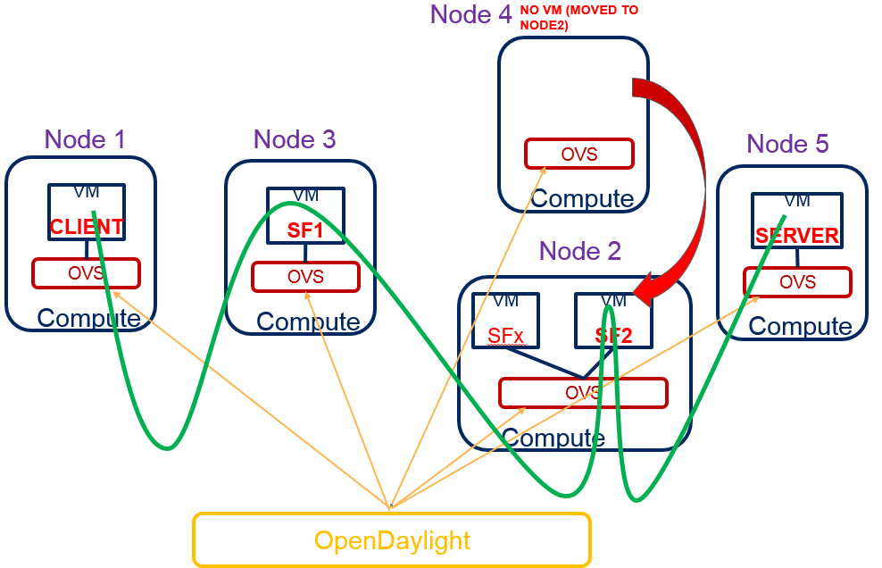

.. _sfc-user-guide:

Service Function Chaining
=========================

OpenDaylight Service Function Chaining (SFC) Overview
-----------------------------------------------------

OpenDaylight Service Function Chaining (SFC) provides the ability to
define an ordered list of network services (e.g. firewalls, load
balancers). These services are then "stitched" together in the network
to create a service chain. This project provides the infrastructure
(chaining logic, APIs) needed for ODL to provision a service chain in
the network and an end-user application for defining such chains.

-  ACE - Access Control Entry

-  ACL - Access Control List

-  SCF - Service Classifier Function

-  SF - Service Function

-  SFC - Service Function Chain

-  SFF - Service Function Forwarder

-  SFG - Service Function Group

-  SFP - Service Function Path

-  RSP - Rendered Service Path

-  NSH - Network Service Header

SFC User Interface
------------------

Overview
~~~~~~~~

The SFC User interface comes with a Command Line Interface (CLI): it provides
several Karaf console commands to show the SFC model (SF, SFFs, etc.) provisioned
in the datastore.

SFC Web Interface (SFC-UI)
~~~~~~~~~~~~~~~~~~~~~~~~~~

Architecture
^^^^^^^^^^^^

SFC-UI operates purely by using RESTCONF.

.. figure:: ./images/sfc/sfc-ui-architecture.png
   :alt: SFC-UI integration into ODL

   SFC-UI integration into ODL

How to access
^^^^^^^^^^^^^

1. Run ODL distribution (run karaf)

2. In Karaf console execute: ``feature:install odl-sfc-ui``

3. Visit SFC-UI on: ``http://<odl_ip_address>:8181/sfc/index.html``

SFC Command Line Interface (SFC-CLI)
~~~~~~~~~~~~~~~~~~~~~~~~~~~~~~~~~~~~

Overview
^^^^^^^^

The Karaf Container offers a complete Unix-like console that allows managing
the container. This console can be extended with custom commands to manage the
features deployed on it. This feature will add some basic commands to show the
provisioned SFC entities.

How to use it
^^^^^^^^^^^^^

The SFC-CLI implements commands to show some of the provisioned SFC entities:
Service Functions, Service Function Forwarders, Service Function
Chains, Service Function Paths, Service Function Classifiers, Service Nodes and
Service Function Types:

* List one/all provisioned Service Functions:

  .. code-block:: bash

     sfc:sf-list [--name <name>]

* List one/all provisioned Service Function Forwarders:

  .. code-block:: bash

     sfc:sff-list [--name <name>]

* List one/all provisioned Service Function Chains:

  .. code-block:: bash

     sfc:sfc-list [--name <name>]

* List one/all provisioned Service Function Paths:

  .. code-block:: bash

     sfc:sfp-list [--name <name>]

* List one/all provisioned Service Function Classifiers:

  .. code-block:: bash

     sfc:sc-list [--name <name>]

* List one/all provisioned Service Nodes:

  .. code-block:: bash

     sfc:sn-list [--name <name>]

* List one/all provisioned Service Function Types:

  .. code-block:: bash

     sfc:sft-list [--name <name>]

SFC Southbound REST Plug-in
---------------------------

Overview
~~~~~~~~

The Southbound REST Plug-in is used to send configuration from datastore
down to network devices supporting a REST API (i.e. they have a
configured REST URI). It supports POST/PUT/DELETE operations, which are
triggered accordingly by changes in the SFC data stores.

-  Access Control List (ACL)

-  Service Classifier Function (SCF)

-  Service Function (SF)

-  Service Function Group (SFG)

-  Service Function Schedule Type (SFST)

-  Service Function Forwarder (SFF)

-  Rendered Service Path (RSP)

Southbound REST Plug-in Architecture
~~~~~~~~~~~~~~~~~~~~~~~~~~~~~~~~~~~~

From the user perspective, the REST plug-in is another SFC Southbound
plug-in used to communicate with network devices.

.. figure:: ./images/sfc/sb-rest-architecture-user.png
   :alt: Southbound REST Plug-in integration into ODL

   Southbound REST Plug-in integration into ODL

Configuring Southbound REST Plugin
~~~~~~~~~~~~~~~~~~~~~~~~~~~~~~~~~~

1. Run ODL distribution (run karaf)

2. In Karaf console execute: ``feature:install odl-sfc-sb-rest``

3. Configure REST URIs for SF/SFF through SFC User Interface or RESTCONF
   (required configuration steps can be found in the tutorial stated
   bellow)

Tutorial
~~~~~~~~

Comprehensive tutorial on how to use the Southbound REST Plug-in and how
to control network devices with it can be found on:
https://wiki.opendaylight.org/view/Service_Function_Chaining:Main#SFC_103

SFC-OVS integration
-------------------

Overview
~~~~~~~~

SFC-OVS provides integration of SFC with Open vSwitch (OVS) devices.
Integration is realized through mapping of SFC objects (like SF, SFF,
Classifier, etc.) to OVS objects (like Bridge,
TerminationPoint=Port/Interface). The mapping takes care of automatic
instantiation (setup) of corresponding object whenever its counterpart
is created. For example, when a new SFF is created, the SFC-OVS plug-in
will create a new OVS bridge.

The feature is intended for SFC users willing to use Open vSwitch as an
underlying network infrastructure for deploying RSPs (Rendered Service
Paths).

SFC-OVS Architecture
~~~~~~~~~~~~~~~~~~~~

SFC-OVS uses the OVSDB MD-SAL Southbound API for getting/writing
information from/to OVS devices. From the user perspective SFC-OVS acts
as a layer between SFC datastore and OVSDB.

.. figure:: ./images/sfc/sfc-ovs-architecture-user.png
   :alt: SFC-OVS integration into ODL

   SFC-OVS integration into ODL

Configuring SFC-OVS
~~~~~~~~~~~~~~~~~~~

1. Run ODL distribution (run karaf)

2. In Karaf console execute: ``feature:install odl-sfc-ovs``

3. Configure Open vSwitch to use ODL as a manager, using following
   command: ``ovs-vsctl set-manager tcp:<odl_ip_address>:6640``

Tutorials
~~~~~~~~~

Verifying mapping from SFF to OVS
^^^^^^^^^^^^^^^^^^^^^^^^^^^^^^^^^

Overview
''''''''

This tutorial shows the usual workflow during creation of an OVS
Bridge with use of the SFC APIs.

Prerequisites
'''''''''''''

-  Open vSwitch installed (ovs-vsctl command available in shell)

-  SFC-OVS feature configured as stated above

Instructions
''''''''''''

1. In a shell execute: ``ovs-vsctl set-manager tcp:<odl_ip_address>:6640``

2. Send POST request to URL:
   ``http://<odl_ip_address>:8181/restconf/operations/service-function-forwarder-ovs:create-ovs-bridge``
   Use Basic auth with credentials: "admin", "admin" and set
   ``Content-Type: application/json``. The content of POST request
   should be following:

::

    {
        "input":
        {
            "name": "br-test",
            "ovs-node": {
                "ip": "<Open_vSwitch_ip_address>"
            }
        }
    }

Open\_vSwitch\_ip\_address is the IP address of the machine where Open vSwitch
is installed.

Verification
''''''''''''

In a shell execute: ``ovs-vsctl show``. There should be a Bridge with
the name *br-test* and one port/interface called *br-test*.

Also, the corresponding SFF for this OVS Bridge should be configured,
which can be verified through the SFC User Interface or RESTCONF as
follows.

a. Visit the SFC User Interface:
   ``http://<odl_ip_address>:8181/sfc/index.html#/sfc/serviceforwarder``

b. Use pure RESTCONF and send a GET request to URL:
   ``http://<odl_ip_address>:8181/restconf/config/service-function-forwarder:service-function-forwarders``

There should be an SFF, whose name will be ending with *br1* and the
SFF should contain two DataPlane locators: *br1* and *testPort*.

SFC Classifier User Guide
-------------------------

Overview
~~~~~~~~

Description of classifier can be found in:
https://datatracker.ietf.org/doc/draft-ietf-sfc-architecture/

There are two types of classifier:

1. OpenFlow Classifier

2. Iptables Classifier

OpenFlow Classifier
~~~~~~~~~~~~~~~~~~~

OpenFlow Classifier implements the classification criteria based on
OpenFlow rules deployed into an OpenFlow switch. An Open vSwitch will
take the role of a classifier and performs various encapsulations such
NSH, VLAN, MPLS, etc. In the existing implementation, classifier can
support NSH encapsulation. Matching information is based on ACL for MAC
addresses, ports, protocol, IPv4 and IPv6. Supported protocols are TCP,
UDP and SCTP. Actions information in the OF rules, shall be forwarding
of the encapsulated packets with specific information related to the
RSP.

Classifier Architecture
^^^^^^^^^^^^^^^^^^^^^^^

The OVSDB Southbound interface is used to create an instance of a bridge
in a specific location (via IP address). This bridge contains the
OpenFlow rules that perform the classification of the packets and react
accordingly. The OpenFlow Southbound interface is used to translate the
ACL information into OF rules within the Open vSwitch.

.. note::

    in order to create the instance of the bridge that takes the role of
    a classifier, an "empty" SFF must be created.

Configuring Classifier
^^^^^^^^^^^^^^^^^^^^^^

1. An empty SFF must be created in order to host the ACL that contains
   the classification information.

2. SFF data plane locator must be configured

3. Classifier interface must be manually added to SFF bridge.

Administering or Managing Classifier
^^^^^^^^^^^^^^^^^^^^^^^^^^^^^^^^^^^^

Classification information is based on MAC addresses, protocol, ports
and IP. ACL gathers this information and is assigned to an RSP which
turns to be a specific path for a Service Chain.

Iptables Classifier
~~~~~~~~~~~~~~~~~~~

Classifier manages everything from starting the packet listener to
creation (and removal) of appropriate ip(6)tables rules and marking
received packets accordingly. Its functionality is **available only on
Linux** as it leverdges **NetfilterQueue**, which provides access to
packets matched by an **iptables** rule. Classifier requires **root
privileges** to be able to operate.

So far it is capable of processing ACL for MAC addresses, ports, IPv4
and IPv6. Supported protocols are TCP and UDP.

Classifier Architecture
^^^^^^^^^^^^^^^^^^^^^^^

Python code located in the project repository
sfc-py/common/classifier.py.

.. note::

    classifier assumes that Rendered Service Path (RSP) **already
    exists** in ODL when an ACL referencing it is obtained

1. sfc\_agent receives an ACL and passes it for processing to the
   classifier

2. the RSP (its SFF locator) referenced by ACL is requested from ODL

3. if the RSP exists in the ODL then ACL based iptables rules for it are
   applied

After this process is over, every packet successfully matched to an
iptables rule (i.e. successfully classified) will be NSH encapsulated
and forwarded to a related SFF, which knows how to traverse the RSP.

Rules are created using appropriate iptables command. If the Access
Control Entry (ACE) rule is MAC address related both iptables and
IPv6 tables rules re issued. If ACE rule is IPv4 address related, only
iptables rules are issued, same for IPv6.

.. note::

    iptables **raw** table contains all created rules

Configuring Classifier
^^^^^^^^^^^^^^^^^^^^^^

| Classfier does’t need any configuration.
| Its only requirement is that the **second (2) Netfilter Queue** is not
  used by any other process and is **avalilable for the classifier**.

Administering or Managing Classifier
^^^^^^^^^^^^^^^^^^^^^^^^^^^^^^^^^^^^

Classifier runs alongside sfc\_agent, therefore the command for starting
it locally is:

.. code-block:: bash

   sudo python3.4 sfc-py/sfc_agent.py --rest --odl-ip-port localhost:8181
   --auto-sff-name --nfq-class

SFC OpenFlow Renderer User Guide
--------------------------------

Overview
~~~~~~~~

The Service Function Chaining (SFC) OpenFlow Renderer (SFC OF Renderer)
implements Service Chaining on OpenFlow switches. It listens for the
creation of a Rendered Service Path (RSP) in the operational data store,
and once received it programs Service Function Forwarders (SFF) that
are hosted on OpenFlow capable switches to forward packets through the
service chain.

Common acronyms used in the following sections:

-  SF - Service Function

-  SFF - Service Function Forwarder

-  SFC - Service Function Chain

-  SFP - Service Function Path

-  RSP - Rendered Service Path

SFC OpenFlow Renderer Architecture
~~~~~~~~~~~~~~~~~~~~~~~~~~~~~~~~~~

The SFC OF Renderer is invoked after a RSP is created in the operational
data store using an MD-SAL listener called ``SfcOfRspDataListener``.
Upon SFC OF Renderer initialization, the ``SfcOfRspDataListener``
registers itself to listen for RSP changes. When invoked, the
``SfcOfRspDataListener`` processes the RSP and calls the
``SfcOfFlowProgrammerImpl`` to create the necessary flows in
the Service Function Forwarders configured in the
RSP. Refer to the following diagram for more details.

.. figure:: ./images/sfc/sfcofrenderer_architecture.png
   :alt: SFC OpenFlow Renderer High Level Architecture

   SFC OpenFlow Renderer High Level Architecture

.. _sfc-user-guide-sfc-of-pipeline:

SFC OpenFlow Switch Flow pipeline
~~~~~~~~~~~~~~~~~~~~~~~~~~~~~~~~~

The SFC OpenFlow Renderer uses the following tables for its Flow
pipeline:

-  Table 0, Classifier

-  Table 1, Transport Ingress

-  Table 2, Path Mapper

-  Table 3, Path Mapper ACL

-  Table 4, Next Hop

-  Table 10, Transport Egress

The OpenFlow Table Pipeline is intended to be generic to work for all of
the different encapsulations supported by SFC.

All of the tables are explained in detail in the following section.

The SFFs (SFF1 and SFF2), SFs (SF1), and topology used for the flow
tables in the following sections are as described in the following
diagram.

.. figure:: ./images/sfc/sfcofrenderer_nwtopo.png
   :alt: SFC OpenFlow Renderer Typical Network Topology

   SFC OpenFlow Renderer Typical Network Topology

Classifier Table detailed
^^^^^^^^^^^^^^^^^^^^^^^^^

It is possible for the SFF to also act as a classifier. This table maps
subscriber traffic to RSPs, and is explained in detail in the classifier
documentation.

If the SFF is not a classifier, then this table will just have a simple
Goto Table 1 flow.

Transport Ingress Table detailed
^^^^^^^^^^^^^^^^^^^^^^^^^^^^^^^^

The Transport Ingress table has an entry per expected tunnel transport
type to be received in a particular SFF, as established in the SFC
configuration.

Here are two example on SFF1: one where the RSP ingress tunnel is MPLS
assuming VLAN is used for the SFF-SF, and the other where the RSP
ingress tunnel is NSH GRE (UDP port 4789):

+----------+-------------------------------------+--------------+
| Priority | Match                               | Action       |
+==========+=====================================+==============+
| 256      | EtherType==0x8847 (MPLS unicast)    | Goto Table 2 |
+----------+-------------------------------------+--------------+
| 256      | EtherType==0x8100 (VLAN)            | Goto Table 2 |
+----------+-------------------------------------+--------------+
| 256      | EtherType==0x0800,udp,tp\_dst==4789 | Goto Table 2 |
|          | (IP v4)                             |              |
+----------+-------------------------------------+--------------+
| 5        | Match Any                           | Drop         |
+----------+-------------------------------------+--------------+

Table: Table Transport Ingress

Path Mapper Table detailed
^^^^^^^^^^^^^^^^^^^^^^^^^^

The Path Mapper table has an entry per expected tunnel transport info to
be received in a particular SFF, as established in the SFC
configuration. The tunnel transport info is used to determine the RSP
Path ID, and is stored in the OpenFlow Metadata. This table is not used
for NSH, since the RSP Path ID is stored in the NSH header.

For SF nodes that do not support NSH tunneling, the IP header DSCP field
is used to store the RSP Path Id. The RSP Path Id is written to the DSCP
field in the Transport Egress table for those packets sent to an SF.

Here is an example on SFF1, assuming the following details:

-  VLAN ID 1000 is used for the SFF-SF

-  The RSP Path 1 tunnel uses MPLS label 100 for ingress and 101 for
   egress

-  The RSP Path 2 (symmetric downlink path) uses MPLS label 101 for
   ingress and 100 for egress

+----------+-------------------+-----------------------+
| Priority | Match             | Action                |
+==========+===================+=======================+
| 256      | MPLS Label==100   | RSP Path=1, Pop MPLS, |
|          |                   | Goto Table 4          |
+----------+-------------------+-----------------------+
| 256      | MPLS Label==101   | RSP Path=2, Pop MPLS, |
|          |                   | Goto Table 4          |
+----------+-------------------+-----------------------+
| 256      | VLAN ID==1000, IP | RSP Path=1, Pop VLAN, |
|          | DSCP==1           | Goto Table 4          |
+----------+-------------------+-----------------------+
| 256      | VLAN ID==1000, IP | RSP Path=2, Pop VLAN, |
|          | DSCP==2           | Goto Table 4          |
+----------+-------------------+-----------------------+
| 5        | Match Any         | Goto Table 3          |
+----------+-------------------+-----------------------+

Table: Table Path Mapper

Path Mapper ACL Table detailed
^^^^^^^^^^^^^^^^^^^^^^^^^^^^^^

This table is only populated when PacketIn packets are received from the
switch for TcpProxy type SFs. These flows are created with an inactivity
timer of 60 seconds and will be automatically deleted upon expiration.

Next Hop Table detailed
^^^^^^^^^^^^^^^^^^^^^^^

The Next Hop table uses the RSP Path Id and appropriate packet fields to
determine where to send the packet next. For NSH, only the NSP (Network
Services Path, RSP ID) and NSI (Network Services Index, next hop) fields
from the NSH header are needed to determine the VXLAN tunnel destination
IP. For VLAN or MPLS, then the source MAC address is used to determine
the destination MAC address.

Here are two examples on SFF1, assuming SFF1 is connected to SFF2. RSP
Paths 1 and 2 are symmetric VLAN paths. RSP Paths 3 and 4 are symmetric
NSH paths. RSP Path 1 ingress packets come from external to SFC, for
which we don’t have the source MAC address (MacSrc).

+----------+--------------------------------+--------------------------------+
| Priority | Match                          | Action                         |
+==========+================================+================================+
| 256      | RSP Path==1, MacSrc==SF1       | MacDst=SFF2, Goto Table 10     |
+----------+--------------------------------+--------------------------------+
| 256      | RSP Path==2, MacSrc==SF1       | Goto Table 10                  |
+----------+--------------------------------+--------------------------------+
| 256      | RSP Path==2, MacSrc==SFF2      | MacDst=SF1, Goto Table 10      |
+----------+--------------------------------+--------------------------------+
| 246      | RSP Path==1                    | MacDst=SF1, Goto Table 10      |
+----------+--------------------------------+--------------------------------+
| 256      | nsp=3,nsi=255 (SFF Ingress RSP | load:0xa000002→NXM\_NX\_TUN\_I |
|          | 3)                             | PV4\_DST[],                    |
|          |                                | Goto Table 10                  |
+----------+--------------------------------+--------------------------------+
| 256      | nsp=3,nsi=254 (SFF Ingress     | load:0xa00000a→NXM\_NX\_TUN\_I |
|          | from SF, RSP 3)                | PV4\_DST[],                    |
|          |                                | Goto Table 10                  |
+----------+--------------------------------+--------------------------------+
| 256      | nsp=4,nsi=254 (SFF1 Ingress    | load:0xa00000a→NXM\_NX\_TUN\_I |
|          | from SFF2)                     | PV4\_DST[],                    |
|          |                                | Goto Table 10                  |
+----------+--------------------------------+--------------------------------+
| 5        | Match Any                      | Drop                           |
+----------+--------------------------------+--------------------------------+

Table: Table Next Hop

Transport Egress Table detailed
^^^^^^^^^^^^^^^^^^^^^^^^^^^^^^^

The Transport Egress table prepares egress tunnel information and sends
the packets out.

Here are two examples on SFF1. RSP Paths 1 and 2 are symmetric MPLS
paths that use VLAN for the SFF-SF. RSP Paths 3 and 4 are symmetric NSH
paths. Since it is assumed that switches used for NSH will only have one
VXLAN port, the NSH packets are just sent back where they came from.

+----------+--------------------------------+--------------------------------+
| Priority | Match                          | Action                         |
+==========+================================+================================+
| 256      | RSP Path==1, MacDst==SF1       | Push VLAN ID 1000, Port=SF1    |
+----------+--------------------------------+--------------------------------+
| 256      | RSP Path==1, MacDst==SFF2      | Push MPLS Label 101, Port=SFF2 |
+----------+--------------------------------+--------------------------------+
| 256      | RSP Path==2, MacDst==SF1       | Push VLAN ID 1000, Port=SF1    |
+----------+--------------------------------+--------------------------------+
| 246      | RSP Path==2                    | Push MPLS Label 100,           |
|          |                                | Port=Ingress                   |
+----------+--------------------------------+--------------------------------+
| 256      | nsp=3,nsi=255 (SFF Ingress RSP | IN\_PORT                       |
|          | 3)                             |                                |
+----------+--------------------------------+--------------------------------+
| 256      | nsp=3,nsi=254 (SFF Ingress     | IN\_PORT                       |
|          | from SF, RSP 3)                |                                |
+----------+--------------------------------+--------------------------------+
| 256      | nsp=4,nsi=254 (SFF1 Ingress    | IN\_PORT                       |
|          | from SFF2)                     |                                |
+----------+--------------------------------+--------------------------------+
| 5        | Match Any                      | Drop                           |
+----------+--------------------------------+--------------------------------+

Table: Table Transport Egress

Administering SFC OF Renderer
~~~~~~~~~~~~~~~~~~~~~~~~~~~~~

To use the SFC OpenFlow Renderer Karaf, at least the following Karaf
features must be installed.

-  odl-openflowplugin-nxm-extensions

-  odl-openflowplugin-flow-services

-  odl-sfc-provider

-  odl-sfc-model

-  odl-sfc-openflow-renderer

-  odl-sfc-ui (optional)

Since OpenDaylight Karaf features internally install dependent features
all of the above features can be installed by simply installing the
''odl-sfc-openflow-renderer'' feature.

The following command can be used to view all of the currently installed
Karaf features:

.. code-block:: bash

   opendaylight-user@root>feature:list -i

Or, pipe the command to a grep to see a subset of the currently
installed Karaf features:

.. code-block:: bash

   opendaylight-user@root>feature:list -i | grep sfc

To install a particular feature, use the Karaf ``feature:install``
command.

SFC OF Renderer Tutorial
~~~~~~~~~~~~~~~~~~~~~~~~

Overview
^^^^^^^^

In this tutorial, the VXLAN-GPE NSH encapsulations will be shown.
The following Network Topology diagram is a logical view of the
SFFs and SFs involved in creating the Service Chains.

.. figure:: ./images/sfc/sfcofrenderer_nwtopo.png
   :alt: SFC OpenFlow Renderer Typical Network Topology

   SFC OpenFlow Renderer Typical Network Topology

Prerequisites
^^^^^^^^^^^^^

To use this example, SFF OpenFlow switches must be created and connected
as illustrated above. Additionally, the SFs must be created and
connected.

Note that RSP symmetry depends on the Service Function Path symmetric
field, if present. If not, the RSP will be symmetric if any of the SFs
involved in the chain has the bidirectional field set to true.

Target Environment
^^^^^^^^^^^^^^^^^^

The target environment is not important, but this use-case was created
and tested on Linux.

Instructions
^^^^^^^^^^^^

The steps to use this tutorial are as follows. The referenced
configuration in the steps is listed in the following sections.

There are numerous ways to send the configuration. In the following
configuration chapters, the appropriate ``curl`` command is shown for
each configuration to be sent, including the URL.

Steps to configure the SFC OF Renderer tutorial:

1. Send the ``SF`` RESTCONF configuration

2. Send the ``SFF`` RESTCONF configuration

3. Send the ``SFC`` RESTCONF configuration

4. Send the ``SFP`` RESTCONF configuration

5. The ``RSP`` will be created internally when the ``SFP`` is created.

Once the configuration has been successfully created, query the Rendered
Service Paths with either the SFC UI or via RESTCONF. Notice that the
RSP is symmetrical, so the following 2 RSPs will be created:

-  sfc-path1-Path-<RSP-ID>

-  sfc-path1-Path-<RSP-ID>-Reverse

At this point the Service Chains have been created, and the OpenFlow
Switches are programmed to steer traffic through the Service Chain.
Traffic can now be injected from a client into the Service Chain. To
debug problems, the OpenFlow tables can be dumped with the following
commands, assuming SFF1 is called ``s1`` and SFF2 is called ``s2``.

.. code-block:: bash

   sudo ovs-ofctl -O OpenFlow13  dump-flows s1

.. code-block:: bash

   sudo ovs-ofctl -O OpenFlow13  dump-flows s2

In all the following configuration sections, replace the ``${JSON}``
string with the appropriate JSON configuration. Also, change the
``localhost`` destination in the URL accordingly.

SFC OF Renderer NSH Tutorial
''''''''''''''''''''''''''''

The following configuration sections show how to create the different
elements using NSH encapsulation.

| **NSH Service Function configuration**

The Service Function configuration can be sent with the following
command:

.. code-block:: bash

   curl -i -H "Content-Type: application/json" -H "Cache-Control: no-cache"
   --data '${JSON}' -X PUT --user
   admin:admin http://localhost:8181/restconf/config/service-function:service-functions/

**SF configuration JSON.**

.. code-block:: none

    {
     "service-functions": {
       "service-function": [
         {
           "name": "sf1",
           "type": "http-header-enrichment",
           "ip-mgmt-address": "10.0.0.2",
           "sf-data-plane-locator": [
             {
               "name": "sf1dpl",
               "ip": "10.0.0.10",
               "port": 4789,
               "transport": "service-locator:vxlan-gpe",
               "service-function-forwarder": "sff1"
             }
           ]
         },
         {
           "name": "sf2",
           "type": "firewall",
           "ip-mgmt-address": "10.0.0.3",
           "sf-data-plane-locator": [
             {
               "name": "sf2dpl",
                "ip": "10.0.0.20",
                "port": 4789,
                "transport": "service-locator:vxlan-gpe",
               "service-function-forwarder": "sff2"
             }
           ]
         }
       ]
     }
    }

| **NSH Service Function Forwarder configuration**

The Service Function Forwarder configuration can be sent with the
following command:

.. code-block:: bash

   curl -i -H "Content-Type: application/json" -H "Cache-Control: no-cache" --data '${JSON}' -X PUT --user admin:admin http://localhost:8181/restconf/config/service-function-forwarder:service-function-forwarders/

**SFF configuration JSON.**

.. code-block:: none

    {
     "service-function-forwarders": {
       "service-function-forwarder": [
         {
           "name": "sff1",
           "service-node": "openflow:2",
           "sff-data-plane-locator": [
             {
               "name": "sff1dpl",
               "data-plane-locator":
               {
                   "ip": "10.0.0.1",
                   "port": 4789,
                   "transport": "service-locator:vxlan-gpe"
               }
             }
           ],
           "service-function-dictionary": [
             {
               "name": "sf1",
               "sff-sf-data-plane-locator":
               {
                   "sf-dpl-name": "sf1dpl",
                   "sff-dpl-name": "sff1dpl"
               }
             }
           ]
         },
         {
           "name": "sff2",
           "service-node": "openflow:3",
           "sff-data-plane-locator": [
             {
               "name": "sff2dpl",
               "data-plane-locator":
               {
                   "ip": "10.0.0.2",
                   "port": 4789,
                   "transport": "service-locator:vxlan-gpe"
               }
             }
           ],
           "service-function-dictionary": [
             {
               "name": "sf2",
               "sff-sf-data-plane-locator":
               {
                   "sf-dpl-name": "sf2dpl",
                   "sff-dpl-name": "sff2dpl"
               }
             }
           ]
         }
       ]
     }
    }

| **NSH Service Function Chain configuration**

The Service Function Chain configuration can be sent with the following
command:

.. code-block:: bash

   curl -i -H "Content-Type: application/json" -H "Cache-Control: no-cache"
   --data '${JSON}' -X PUT --user
   admin:admin http://localhost:8181/restconf/config/service-function-chain:service-function-chains/

**SFC configuration JSON.**

.. code-block:: none

    {
     "service-function-chains": {
       "service-function-chain": [
         {
           "name": "sfc-chain1",
           "sfc-service-function": [
             {
               "name": "hdr-enrich-abstract1",
               "type": "http-header-enrichment"
             },
             {
               "name": "firewall-abstract1",
               "type": "firewall"
             }
           ]
         }
       ]
     }
    }

| **NSH Service Function Path configuration**

The Service Function Path configuration can be sent with the following
command:

.. code-block:: bash

   curl -i -H "Content-Type: application/json" -H "Cache-Control: no-cache" --data '${JSON}' -X PUT --user admin:admin http://localhost:8181/restconf/config/service-function-path:service-function-paths/

**SFP configuration JSON.**

.. code-block:: none

    {
      "service-function-paths": {
        "service-function-path": [
          {
            "name": "sfc-path1",
            "service-chain-name": "sfc-chain1",
            "transport-type": "service-locator:vxlan-gpe",
            "symmetric": true
          }
        ]
      }
    }

| **NSH Rendered Service Path Query**

The following command can be used to query all of the created Rendered
Service Paths:

.. code-block:: bash

   curl -H "Content-Type: application/json" -H "Cache-Control: no-cache" -X GET --user admin:admin http://localhost:8181/restconf/operational/rendered-service-path:rendered-service-paths/

SFC OF Renderer MPLS Tutorial
'''''''''''''''''''''''''''''

The following configuration sections show how to create the different
elements using MPLS encapsulation.

| **MPLS Service Function configuration**

The Service Function configuration can be sent with the following
command:

.. code-block:: bash

   curl -i -H "Content-Type: application/json" -H "Cache-Control: no-cache"
   --data '${JSON}' -X PUT --user
   admin:admin http://localhost:8181/restconf/config/service-function:service-functions/

**SF configuration JSON.**

.. code-block:: none

    {
     "service-functions": {
       "service-function": [
         {
           "name": "sf1",
           "type": "http-header-enrichment",
           "ip-mgmt-address": "10.0.0.2",
           "sf-data-plane-locator": [
             {
               "name": "sf1-sff1",
               "mac": "00:00:08:01:02:01",
               "vlan-id": 1000,
               "transport": "service-locator:mac",
               "service-function-forwarder": "sff1"
             }
           ]
         },
         {
           "name": "sf2",
           "type": "firewall",
           "ip-mgmt-address": "10.0.0.3",
           "sf-data-plane-locator": [
             {
               "name": "sf2-sff2",
               "mac": "00:00:08:01:03:01",
               "vlan-id": 2000,
               "transport": "service-locator:mac",
               "service-function-forwarder": "sff2"
             }
           ]
         }
       ]
     }
    }

| **MPLS Service Function Forwarder configuration**

The Service Function Forwarder configuration can be sent with the
following command:

.. code-block:: bash

   curl -i -H "Content-Type: application/json" -H "Cache-Control: no-cache" --data '${JSON}' -X PUT --user admin:admin http://localhost:8181/restconf/config/service-function-forwarder:service-function-forwarders/

**SFF configuration JSON.**

.. code-block:: none

    {
     "service-function-forwarders": {
       "service-function-forwarder": [
         {
           "name": "sff1",
           "service-node": "openflow:2",
           "sff-data-plane-locator": [
             {
               "name": "ulSff1Ingress",
               "data-plane-locator":
               {
                   "mpls-label": 100,
                   "transport": "service-locator:mpls"
               },
               "service-function-forwarder-ofs:ofs-port":
               {
                   "mac": "11:11:11:11:11:11",
                   "port-id" : "1"
               }
             },
             {
               "name": "ulSff1ToSff2",
               "data-plane-locator":
               {
                   "mpls-label": 101,
                   "transport": "service-locator:mpls"
               },
               "service-function-forwarder-ofs:ofs-port":
               {
                   "mac": "33:33:33:33:33:33",
                   "port-id" : "2"
               }
             },
             {
               "name": "toSf1",
               "data-plane-locator":
               {
                   "mac": "22:22:22:22:22:22",
                   "vlan-id": 1000,
                   "transport": "service-locator:mac",
               },
               "service-function-forwarder-ofs:ofs-port":
               {
                   "mac": "33:33:33:33:33:33",
                   "port-id" : "3"
               }
             }
           ],
           "service-function-dictionary": [
             {
               "name": "sf1",
               "sff-sf-data-plane-locator":
               {
                   "sf-dpl-name": "sf1-sff1",
                   "sff-dpl-name": "toSf1"
               }
             }
           ]
         },
         {
           "name": "sff2",
           "service-node": "openflow:3",
           "sff-data-plane-locator": [
             {
               "name": "ulSff2Ingress",
               "data-plane-locator":
               {
                   "mpls-label": 101,
                   "transport": "service-locator:mpls"
               },
               "service-function-forwarder-ofs:ofs-port":
               {
                   "mac": "44:44:44:44:44:44",
                   "port-id" : "1"
               }
             },
             {
               "name": "ulSff2Egress",
               "data-plane-locator":
               {
                   "mpls-label": 102,
                   "transport": "service-locator:mpls"
               },
               "service-function-forwarder-ofs:ofs-port":
               {
                   "mac": "66:66:66:66:66:66",
                   "port-id" : "2"
               }
             },
             {
               "name": "toSf2",
               "data-plane-locator":
               {
                   "mac": "55:55:55:55:55:55",
                   "vlan-id": 2000,
                   "transport": "service-locator:mac"
               },
               "service-function-forwarder-ofs:ofs-port":
               {
                   "port-id" : "3"
               }
             }
           ],
           "service-function-dictionary": [
             {
               "name": "sf2",
               "sff-sf-data-plane-locator":
               {
                   "sf-dpl-name": "sf2-sff2",
                   "sff-dpl-name": "toSf2"

               },
               "service-function-forwarder-ofs:ofs-port":
               {
                   "port-id" : "3"
               }
             }
           ]
         }
       ]
     }
    }

| **MPLS Service Function Chain configuration**

The Service Function Chain configuration can be sent with the following
command:

.. code-block:: bash

   curl -i -H "Content-Type: application/json" -H "Cache-Control: no-cache"
    --data '${JSON}' -X PUT --user admin:admin
    http://localhost:8181/restconf/config/service-function-chain:service-function-chains/

**SFC configuration JSON.**

.. code-block:: none

    {
     "service-function-chains": {
       "service-function-chain": [
         {
           "name": "sfc-chain1",
           "sfc-service-function": [
             {
               "name": "hdr-enrich-abstract1",
               "type": "http-header-enrichment"
             },
             {
               "name": "firewall-abstract1",
               "type": "firewall"
             }
           ]
         }
       ]
     }
    }

| **MPLS Service Function Path configuration**

The Service Function Path configuration can be sent with the following
command:

.. code-block:: bash

   curl -i -H "Content-Type: application/json" -H "Cache-Control: no-cache"
   --data '${JSON}' -X PUT --user admin:admin
    http://localhost:8181/restconf/config/service-function-path:service-function-paths/

**SFP configuration JSON.**

.. code-block:: none

    {
      "service-function-paths": {
        "service-function-path": [
          {
            "name": "sfc-path1",
            "service-chain-name": "sfc-chain1",
            "transport-type": "service-locator:mpls",
            "symmetric": true
          }
        ]
      }
    }

| **MPLS Rendered Service Path creation**

.. code-block:: bash

   curl -i -H "Content-Type: application/json" -H "Cache-Control: no-cache"
   --data '${JSON}' -X POST --user admin:admin
    http://localhost:8181/restconf/operations/rendered-service-path:create-rendered-path/

| **MPLS Rendered Service Path Query**

The following command can be used to query all of the created Rendered
Service Paths:

.. code-block:: bash

   curl -H "Content-Type: application/json" -H "Cache-Control: no-cache" -X GET
   --user admin:admin http://localhost:8181/restconf/operational/rendered-service-path:rendered-service-paths/

SFC IOS XE Renderer User Guide
------------------------------

Overview
~~~~~~~~

The early Service Function Chaining (SFC) renderer for IOS-XE devices
(SFC IOS-XE renderer) implements Service Chaining functionality on
IOS-XE capable switches. It listens for the creation of a Rendered
Service Path (RSP) and sets up Service Function Forwarders (SFF) that
are hosted on IOS-XE switches to steer traffic through the service
chain.

Common acronyms used in the following sections:

-  SF - Service Function

-  SFF - Service Function Forwarder

-  SFC - Service Function Chain

-  SP - Service Path

-  SFP - Service Function Path

-  RSP - Rendered Service Path

-  LSF - Local Service Forwarder

-  RSF - Remote Service Forwarder

SFC IOS-XE Renderer Architecture
~~~~~~~~~~~~~~~~~~~~~~~~~~~~~~~~

When the SFC IOS-XE renderer is initialized, all required listeners are
registered to handle incoming data. It involves CSR/IOS-XE
``NodeListener`` which stores data about all configurable devices
including their mountpoints (used here as databrokers),
``ServiceFunctionListener``, ``ServiceForwarderListener`` (see mapping)
and ``RenderedPathListener`` used to listen for RSP changes. When the
SFC IOS-XE renderer is invoked, ``RenderedPathListener`` calls the
``IosXeRspProcessor`` which processes the RSP change and creates all
necessary Service Paths and Remote Service Forwarders (if necessary) on
IOS-XE devices.

Service Path details
~~~~~~~~~~~~~~~~~~~~

Each Service Path is defined by index (represented by NSP) and contains
service path entries. Each entry has appropriate service index (NSI) and
definition of next hop. Next hop can be Service Function, different
Service Function Forwarder or definition of end of chain - terminate.
After terminating, the packet is sent to destination. If a SFF is
defined as a next hop, it has to be present on device in the form of
Remote Service Forwarder. RSFs are also created during RSP processing.

Example of Service Path:

::

    service-chain service-path 200
       service-index 255 service-function firewall-1
       service-index 254 service-function dpi-1
       service-index 253 terminate

Mapping to IOS-XE SFC entities
~~~~~~~~~~~~~~~~~~~~~~~~~~~~~~

Renderer contains mappers for SFs and SFFs. IOS-XE capable device is
using its own definition of Service Functions and Service Function
Forwarders according to appropriate .yang file.
``ServiceFunctionListener`` serves as a listener for SF changes. If SF
appears in datastore, listener extracts its management ip address and
looks into cached IOS-XE nodes. If some of available nodes match,
Service function is mapped in ``IosXeServiceFunctionMapper`` to be
understandable by IOS-XE device and it’s written into device’s config.
``ServiceForwarderListener`` is used in a similar way. All SFFs with
suitable management ip address it mapped in
``IosXeServiceForwarderMapper``. Remapped SFFs are configured as a Local
Service Forwarders. It is not possible to directly create Remote Service
Forwarder using IOS-XE renderer. RSF is created only during RSP
processing.

Administering SFC IOS-XE renderer
~~~~~~~~~~~~~~~~~~~~~~~~~~~~~~~~~

To use the SFC IOS-XE Renderer Karaf, at least the following Karaf
features must be installed:

-  odl-aaa-shiro

-  odl-sfc-model

-  odl-sfc-provider

-  odl-restconf

-  odl-netconf-topology

-  odl-sfc-ios-xe-renderer

SFC IOS-XE renderer Tutorial
~~~~~~~~~~~~~~~~~~~~~~~~~~~~

Overview
^^^^^^^^

This tutorial is a simple example how to create Service Path on IOS-XE
capable device using IOS-XE renderer

Preconditions
^^^^^^^^^^^^^

To connect to IOS-XE device, it is necessary to use several modified
yang models and override device’s ones. All .yang files are in the
``Yang/netconf`` folder in the ``sfc-ios-xe-renderer module`` in the SFC
project. These files have to be copied to the ``cache/schema``
directory, before Karaf is started. After that, custom capabilities have
to be sent to network-topology:

*  PUT ./config/network-topology:network-topology/topology/topology-netconf/node/<device-name>

   .. code-block:: xml

    <node xmlns="urn:TBD:params:xml:ns:yang:network-topology">
      <node-id>device-name</node-id>
      <host xmlns="urn:opendaylight:netconf-node-topology">device-ip</host>
      <port xmlns="urn:opendaylight:netconf-node-topology">2022</port>
      <username xmlns="urn:opendaylight:netconf-node-topology">login</username>
      <password xmlns="urn:opendaylight:netconf-node-topology">password</password>
      <tcp-only xmlns="urn:opendaylight:netconf-node-topology">false</tcp-only>
      <keepalive-delay xmlns="urn:opendaylight:netconf-node-topology">0</keepalive-delay>
      <yang-module-capabilities xmlns="urn:opendaylight:netconf-node-topology">
         <override>true</override>
         <capability xmlns="urn:opendaylight:netconf-node-topology">
            urn:ietf:params:xml:ns:yang:ietf-inet-types?module=ietf-inet-types&amp;revision=2013-07-15
         </capability>
         <capability xmlns="urn:opendaylight:netconf-node-topology">
            urn:ietf:params:xml:ns:yang:ietf-yang-types?module=ietf-yang-types&amp;revision=2013-07-15
         </capability>
         <capability xmlns="urn:opendaylight:netconf-node-topology">
            urn:ios?module=ned&amp;revision=2016-03-08
         </capability>
         <capability xmlns="urn:opendaylight:netconf-node-topology">
            http://tail-f.com/yang/common?module=tailf-common&amp;revision=2015-05-22
         </capability>
         <capability xmlns="urn:opendaylight:netconf-node-topology">
            http://tail-f.com/yang/common?module=tailf-meta-extensions&amp;revision=2013-11-07
         </capability>
         <capability xmlns="urn:opendaylight:netconf-node-topology">
            http://tail-f.com/yang/common?module=tailf-cli-extensions&amp;revision=2015-03-19
         </capability>
      </yang-module-capabilities>
    </node>

.. note::

    The device name in the URL and in the XML must match.

Instructions
^^^^^^^^^^^^

When the IOS-XE renderer is installed, all NETCONF nodes in
topology-netconf are processed and all capable nodes with accessible
mountpoints are cached. The first step is to create LSF on node.

``Service Function Forwarder configuration``

*  PUT ./config/service-function-forwarder:service-function-forwarders

   .. code-block:: none

    {
        "service-function-forwarders": {
            "service-function-forwarder": [
                {
                    "name": "CSR1Kv-2",
                    "ip-mgmt-address": "172.25.73.23",
                    "sff-data-plane-locator": [
                        {
                            "name": "CSR1Kv-2-dpl",
                            "data-plane-locator": {
                                "transport": "service-locator:vxlan-gpe",
                                "port": 6633,
                                "ip": "10.99.150.10"
                            }
                        }
                    ]
                }
            ]
        }
    }

If the IOS-XE node with appropriate management IP exists, this
configuration is mapped and LSF is created on the device. The same
approach is used for Service Functions.

*  PUT ./config/service-function:service-functions

   .. code-block:: none

    {
        "service-functions": {
            "service-function": [
                {
                    "name": "Firewall",
                    "ip-mgmt-address": "172.25.73.23",
                    "type": "firewall",
                    "sf-data-plane-locator": [
                        {
                            "name": "firewall-dpl",
                            "port": 6633,
                            "ip": "12.1.1.2",
                            "transport": "service-locator:gre",
                            "service-function-forwarder": "CSR1Kv-2"
                        }
                    ]
                },
                {
                    "name": "Dpi",
                    "ip-mgmt-address": "172.25.73.23",
                    "type":"dpi",
                    "sf-data-plane-locator": [
                        {
                            "name": "dpi-dpl",
                            "port": 6633,
                            "ip": "12.1.1.1",
                            "transport": "service-locator:gre",
                            "service-function-forwarder": "CSR1Kv-2"
                        }
                    ]
                },
                {
                    "name": "Qos",
                    "ip-mgmt-address": "172.25.73.23",
                    "type":"qos",
                    "sf-data-plane-locator": [
                        {
                            "name": "qos-dpl",
                            "port": 6633,
                            "ip": "12.1.1.4",
                            "transport": "service-locator:gre",
                            "service-function-forwarder": "CSR1Kv-2"
                        }
                    ]
                }
            ]
        }
    }

All these SFs are configured on the same device as the LSF. The next
step is to prepare Service Function Chain.

*  PUT ./config/service-function-chain:service-function-chains/

   .. code-block:: none

    {
        "service-function-chains": {
            "service-function-chain": [
                {
                    "name": "CSR3XSF",
                    "sfc-service-function": [
                        {
                            "name": "Firewall",
                            "type": "firewall"
                        },
                        {
                            "name": "Dpi",
                            "type": "dpi"
                        },
                        {
                            "name": "Qos",
                            "type": "qos"
                        }
                    ]
                }
            ]
        }
    }

Service Function Path:

*  PUT ./config/service-function-path:service-function-paths/

   .. code-block:: none

    {
        "service-function-paths": {
            "service-function-path": [
                {
                    "name": "CSR3XSF-Path",
                    "service-chain-name": "CSR3XSF",
                    "starting-index": 255,
                    "symmetric": "true"
                }
            ]
        }
    }

Without a classifier, there is possibility to POST RSP directly.

*  POST ./operations/rendered-service-path:create-rendered-path

   .. code-block:: none

    {
      "input": {
          "name": "CSR3XSF-Path-RSP",
          "parent-service-function-path": "CSR3XSF-Path"
      }
    }

The resulting configuration:

::

    !
    service-chain service-function-forwarder local
      ip address 10.99.150.10
    !
    service-chain service-function firewall
    ip address 12.1.1.2
      encapsulation gre enhanced divert
    !
    service-chain service-function dpi
    ip address 12.1.1.1
      encapsulation gre enhanced divert
    !
    service-chain service-function qos
    ip address 12.1.1.4
      encapsulation gre enhanced divert
    !
    service-chain service-path 1
      service-index 255 service-function firewall
      service-index 254 service-function dpi
      service-index 253 service-function qos
      service-index 252 terminate
    !
    service-chain service-path 2
      service-index 255 service-function qos
      service-index 254 service-function dpi
      service-index 253 service-function firewall
      service-index 252 terminate
    !

Service Path 1 is direct, Service Path 2 is reversed. Path numbers may
vary.

Service Function Scheduling Algorithms
--------------------------------------

Overview
~~~~~~~~

When creating the Rendered Service Path, the origin SFC controller chose
the first available service function from a list of service function
names. This may result in many issues such as overloaded service
functions and a longer service path as SFC has no means to understand
the status of service functions and network topology. The service
function selection framework supports at least four algorithms (Random,
Round Robin, Load Balancing and Shortest Path) to select the most
appropriate service function when instantiating the Rendered Service
Path. In addition, it is an extensible framework that allows 3rd party
selection algorithm to be plugged in.

Architecture
~~~~~~~~~~~~

The following figure illustrates the service function selection
framework and algorithms.

.. figure:: ./images/sfc/sf-selection-arch.png
   :alt: SF Selection Architecture

   SF Selection Architecture

A user has three different ways to select one service function selection
algorithm:

1. Integrated RESTCONF Calls. OpenStack and/or other administration
   system could provide plugins to call the APIs to select one
   scheduling algorithm.

2. Command line tools. Command line tools such as curl or browser
   plugins such as POSTMAN (for Google Chrome) and RESTClient (for
   Mozilla Firefox) could select schedule algorithm by making RESTCONF
   calls.

3. SFC-UI. Now the SFC-UI provides an option for choosing a selection
   algorithm when creating a Rendered Service Path.

The RESTCONF northbound SFC API provides GUI/RESTCONF interactions for
choosing the service function selection algorithm. MD-SAL data store
provides all supported service function selection algorithms, and
provides APIs to enable one of the provided service function selection
algorithms. Once a service function selection algorithm is enabled, the
service function selection algorithm will work when creating a Rendered
Service Path.

Select SFs with Scheduler
~~~~~~~~~~~~~~~~~~~~~~~~~

Administrator could use both the following ways to select one of the
selection algorithm when creating a Rendered Service Path.

-  Command line tools. Command line tools includes Linux commands curl
   or even browser plugins such as POSTMAN(for Google Chrome) or
   RESTClient(for Mozilla Firefox). In this case, the following JSON
   content is needed at the moment:
   Service\_function\_schudule\_type.json

   .. code-block:: none

       {
         "service-function-scheduler-types": {
           "service-function-scheduler-type": [
             {
               "name": "random",
               "type": "service-function-scheduler-type:random",
               "enabled": false
             },
             {
               "name": "roundrobin",
               "type": "service-function-scheduler-type:round-robin",
               "enabled": true
             },
             {
               "name": "loadbalance",
               "type": "service-function-scheduler-type:load-balance",
               "enabled": false
             },
             {
               "name": "shortestpath",
               "type": "service-function-scheduler-type:shortest-path",
               "enabled": false
             }
           ]
         }
       }

   If using the Linux curl command, it could be:

   .. code-block:: bash

      curl -i -H "Content-Type: application/json" -H "Cache-Control: no-cache"
      --data '$${Service_function_schudule_type.json}' -X PUT
      --user admin:admin http://localhost:8181/restconf/config/service-function-scheduler-type:service-function-scheduler-types/

Here is also a snapshot for using the RESTClient plugin:

.. figure:: ./images/sfc/RESTClient-snapshot.png
   :alt: Mozilla Firefox RESTClient

   Mozilla Firefox RESTClient

-  SFC-UI.SFC-UI provides a drop down menu for service function
   selection algorithm. Here is a snapshot for the user interaction from
   SFC-UI when creating a Rendered Service Path.

.. figure:: ./images/sfc/karaf-webui-select-a-type.png
   :alt: Karaf Web UI

   Karaf Web UI

.. note::

    Some service function selection algorithms in the drop list are not
    implemented yet. Only the first three algorithms are committed at
    the moment.

Random
^^^^^^

Select Service Function from the name list randomly.

Overview
''''''''

The Random algorithm is used to select one Service Function from the
name list which it gets from the Service Function Type randomly.

Prerequisites
'''''''''''''

-  Service Function information are stored in datastore.

-  Either no algorithm or the Random algorithm is selected.

Target Environment
''''''''''''''''''

The Random algorithm will work either no algorithm type is selected or
the Random algorithm is selected.

Instructions
''''''''''''

Once the plugins are installed into Karaf successfully, a user can use
his favorite method to select the Random scheduling algorithm type.
There are no special instructions for using the Random algorithm.

Round Robin
^^^^^^^^^^^

Select Service Function from the name list in Round Robin manner.

Overview
''''''''

The Round Robin algorithm is used to select one Service Function from
the name list which it gets from the Service Function Type in a Round
Robin manner, this will balance workloads to all Service Functions.
However, this method cannot help all Service Functions load the same
workload because it’s flow-based Round Robin.

Prerequisites
'''''''''''''

-  Service Function information are stored in datastore.

-  Round Robin algorithm is selected

Target Environment
''''''''''''''''''

The Round Robin algorithm will work one the Round Robin algorithm is
selected.

Instructions
''''''''''''

Once the plugins are installed into Karaf successfully, a user can use
his favorite method to select the Round Robin scheduling algorithm type.
There are no special instructions for using the Round Robin algorithm.

Load Balance Algorithm
^^^^^^^^^^^^^^^^^^^^^^

Select appropriate Service Function by actual CPU utilization.

Overview
''''''''

The Load Balance Algorithm is used to select appropriate Service
Function by actual CPU utilization of service functions. The CPU
utilization of service function obtained from monitoring information
reported via NETCONF.

Prerequisites
'''''''''''''

-  CPU-utilization for Service Function.

-  NETCONF server.

-  NETCONF client.

-  Each VM has a NETCONF server and it could work with NETCONF client
   well.

Instructions
''''''''''''

Set up VMs as Service Functions. enable NETCONF server in VMs. Ensure
that you specify them separately. For example:

a. Set up 4 VMs include 2 SFs' type are Firewall, Others are Napt44.
   Name them as firewall-1, firewall-2, napt44-1, napt44-2 as Service
   Function. The four VMs can run either the same server or different
   servers.

b. Install NETCONF server on every VM and enable it. More information on
   NETCONF can be found on the OpenDaylight wiki here:
   https://wiki.opendaylight.org/view/OpenDaylight_Controller:Config:Examples:Netconf:Manual_netopeer_installation

c. Get Monitoring data from NETCONF server. These monitoring data should
   be get from the NETCONF server which is running in VMs. The following
   static XML data is an example:

static XML data like this:

.. code-block:: xml

    <?xml version="1.0" encoding="UTF-8"?>
    <service-function-description-monitor-report>
      <SF-description>
        <number-of-dataports>2</number-of-dataports>
        <capabilities>
          <supported-packet-rate>5</supported-packet-rate>
          <supported-bandwidth>10</supported-bandwidth>
          <supported-ACL-number>2000</supported-ACL-number>
          <RIB-size>200</RIB-size>
          <FIB-size>100</FIB-size>
          <ports-bandwidth>
            <port-bandwidth>
              <port-id>1</port-id>
              <ipaddress>10.0.0.1</ipaddress>
              <macaddress>00:1e:67:a2:5f:f4</macaddress>
              <supported-bandwidth>20</supported-bandwidth>
            </port-bandwidth>
            <port-bandwidth>
              <port-id>2</port-id>
              <ipaddress>10.0.0.2</ipaddress>
              <macaddress>01:1e:67:a2:5f:f6</macaddress>
              <supported-bandwidth>10</supported-bandwidth>
            </port-bandwidth>
          </ports-bandwidth>
        </capabilities>
      </SF-description>
      <SF-monitoring-info>
        <liveness>true</liveness>
        <resource-utilization>
            <packet-rate-utilization>10</packet-rate-utilization>
            <bandwidth-utilization>15</bandwidth-utilization>
            <CPU-utilization>12</CPU-utilization>
            <memory-utilization>17</memory-utilization>
            <available-memory>8</available-memory>
            <RIB-utilization>20</RIB-utilization>
            <FIB-utilization>25</FIB-utilization>
            <power-utilization>30</power-utilization>
            <SF-ports-bandwidth-utilization>
              <port-bandwidth-utilization>
                <port-id>1</port-id>
                <bandwidth-utilization>20</bandwidth-utilization>
              </port-bandwidth-utilization>
              <port-bandwidth-utilization>
                <port-id>2</port-id>
                <bandwidth-utilization>30</bandwidth-utilization>
              </port-bandwidth-utilization>
            </SF-ports-bandwidth-utilization>
        </resource-utilization>
      </SF-monitoring-info>
    </service-function-description-monitor-report>

a. Unzip SFC release tarball.

b. Run SFC: ${sfc}/bin/karaf. More information on Service Function
   Chaining can be found on the OpenDaylight SFC’s wiki page:
   https://wiki.opendaylight.org/view/Service_Function_Chaining:Main

a. Deploy the SFC2 (firewall-abstract2⇒napt44-abstract2) and click
   button to Create Rendered Service Path in SFC UI
   (http://localhost:8181/sfc/index.html).

b. Verify the Rendered Service Path to ensure the CPU utilization of the
   selected hop is the minimum one among all the service functions with
   same type. The correct RSP is firewall-1⇒napt44-2

Shortest Path Algorithm
^^^^^^^^^^^^^^^^^^^^^^^

Select appropriate Service Function by Dijkstra’s algorithm. Dijkstra’s
algorithm is an algorithm for finding the shortest paths between nodes
in a graph.

Overview
''''''''

The Shortest Path Algorithm is used to select appropriate Service
Function by actual topology.

Prerequisites
'''''''''''''

-  Deployed topology (include SFFs, SFs and their links).

-  Dijkstra’s algorithm. More information on Dijkstra’s algorithm can be
   found on the wiki here:
   http://en.wikipedia.org/wiki/Dijkstra%27s_algorithm

Instructions
''''''''''''

a. Unzip SFC release tarball.

b. Run SFC: ${sfc}/bin/karaf.

c. Depoly SFFs and SFs. import the service-function-forwarders.json and
   service-functions.json in UI
   (http://localhost:8181/sfc/index.html#/sfc/config)

service-function-forwarders.json:

.. code-block:: none

    {
      "service-function-forwarders": {
        "service-function-forwarder": [
          {
            "name": "SFF-br1",
            "service-node": "OVSDB-test01",
            "rest-uri": "http://localhost:5001",
            "sff-data-plane-locator": [
              {
                "name": "eth0",
                "service-function-forwarder-ovs:ovs-bridge": {
                  "uuid": "4c3778e4-840d-47f4-b45e-0988e514d26c",
                  "bridge-name": "br-tun"
                },
                "data-plane-locator": {
                  "port": 5000,
                  "ip": "192.168.1.1",
                  "transport": "service-locator:vxlan-gpe"
                }
              }
            ],
            "service-function-dictionary": [
              {
                "sff-sf-data-plane-locator": {
                   "sf-dpl-name": "sf1dpl",
                   "sff-dpl-name": "sff1dpl"
                },
                "name": "napt44-1",
                "type": "napt44"
              },
              {
                "sff-sf-data-plane-locator": {
                   "sf-dpl-name": "sf2dpl",
                   "sff-dpl-name": "sff2dpl"
                },
                "name": "firewall-1",
                "type": "firewall"
              }
            ],
            "connected-sff-dictionary": [
              {
                "name": "SFF-br3"
              }
            ]
          },
          {
            "name": "SFF-br2",
            "service-node": "OVSDB-test01",
            "rest-uri": "http://localhost:5002",
            "sff-data-plane-locator": [
              {
                "name": "eth0",
                "service-function-forwarder-ovs:ovs-bridge": {
                  "uuid": "fd4d849f-5140-48cd-bc60-6ad1f5fc0a1",
                  "bridge-name": "br-tun"
                },
                "data-plane-locator": {
                  "port": 5000,
                  "ip": "192.168.1.2",
                  "transport": "service-locator:vxlan-gpe"
                }
              }
            ],
            "service-function-dictionary": [
              {
                "sff-sf-data-plane-locator": {
                   "sf-dpl-name": "sf1dpl",
                   "sff-dpl-name": "sff1dpl"
                },
                "name": "napt44-2",
                "type": "napt44"
              },
              {
                "sff-sf-data-plane-locator": {
                   "sf-dpl-name": "sf2dpl",
                   "sff-dpl-name": "sff2dpl"
                },
                "name": "firewall-2",
                "type": "firewall"
              }
            ],
            "connected-sff-dictionary": [
              {
                "name": "SFF-br3"
              }
            ]
          },
          {
            "name": "SFF-br3",
            "service-node": "OVSDB-test01",
            "rest-uri": "http://localhost:5005",
            "sff-data-plane-locator": [
              {
                "name": "eth0",
                "service-function-forwarder-ovs:ovs-bridge": {
                  "uuid": "fd4d849f-5140-48cd-bc60-6ad1f5fc0a4",
                  "bridge-name": "br-tun"
                },
                "data-plane-locator": {
                  "port": 5000,
                  "ip": "192.168.1.2",
                  "transport": "service-locator:vxlan-gpe"
                }
              }
            ],
            "service-function-dictionary": [
              {
                "sff-sf-data-plane-locator": {
                   "sf-dpl-name": "sf1dpl",
                   "sff-dpl-name": "sff1dpl"
                },
                "name": "test-server",
                "type": "dpi"
              },
              {
                "sff-sf-data-plane-locator": {
                   "sf-dpl-name": "sf2dpl",
                   "sff-dpl-name": "sff2dpl"
                },
                "name": "test-client",
                "type": "dpi"
              }
            ],
            "connected-sff-dictionary": [
              {
                "name": "SFF-br1"
              },
              {
                "name": "SFF-br2"
              }
            ]
          }
        ]
      }
    }

service-functions.json:

.. code-block:: none

    {
      "service-functions": {
        "service-function": [
          {
            "rest-uri": "http://localhost:10001",
            "ip-mgmt-address": "10.3.1.103",
            "sf-data-plane-locator": [
              {
                "name": "preferred",
                "port": 10001,
                "ip": "10.3.1.103",
                "service-function-forwarder": "SFF-br1"
              }
            ],
            "name": "napt44-1",
            "type": "napt44"
          },
          {
            "rest-uri": "http://localhost:10002",
            "ip-mgmt-address": "10.3.1.103",
            "sf-data-plane-locator": [
              {
                "name": "master",
                "port": 10002,
                "ip": "10.3.1.103",
                "service-function-forwarder": "SFF-br2"
              }
            ],
            "name": "napt44-2",
            "type": "napt44"
          },
          {
            "rest-uri": "http://localhost:10003",
            "ip-mgmt-address": "10.3.1.103",
            "sf-data-plane-locator": [
              {
                "name": "1",
                "port": 10003,
                "ip": "10.3.1.102",
                "service-function-forwarder": "SFF-br1"
              }
            ],
            "name": "firewall-1",
            "type": "firewall"
          },
          {
            "rest-uri": "http://localhost:10004",
            "ip-mgmt-address": "10.3.1.103",
            "sf-data-plane-locator": [
              {
                "name": "2",
                "port": 10004,
                "ip": "10.3.1.101",
                "service-function-forwarder": "SFF-br2"
              }
            ],
            "name": "firewall-2",
            "type": "firewall"
          },
          {
            "rest-uri": "http://localhost:10005",
            "ip-mgmt-address": "10.3.1.103",
            "sf-data-plane-locator": [
              {
                "name": "3",
                "port": 10005,
                "ip": "10.3.1.104",
                "service-function-forwarder": "SFF-br3"
              }
            ],
            "name": "test-server",
            "type": "dpi"
          },
          {
            "rest-uri": "http://localhost:10006",
            "ip-mgmt-address": "10.3.1.103",
            "sf-data-plane-locator": [
              {
                "name": "4",
                "port": 10006,
                "ip": "10.3.1.102",
                "service-function-forwarder": "SFF-br3"
              }
            ],
            "name": "test-client",
            "type": "dpi"
          }
        ]
      }
    }

The deployed topology like this:

.. code-block:: none

                  +----+           +----+          +----+
                  |sff1|+----------|sff3|---------+|sff2|
                  +----+           +----+          +----+
                    |                                  |
             +--------------+                   +--------------+
             |              |                   |              |
        +----------+   +--------+          +----------+   +--------+
        |firewall-1|   |napt44-1|          |firewall-2|   |napt44-2|
        +----------+   +--------+          +----------+   +--------+

-  Deploy the SFC2(firewall-abstract2⇒napt44-abstract2), select
   "Shortest Path" as schedule type and click button to Create Rendered
   Service Path in SFC UI (http://localhost:8181/sfc/index.html).

.. figure:: ./images/sfc/sf-schedule-type.png
   :alt: select schedule type

   select schedule type

-  Verify the Rendered Service Path to ensure the selected hops are
   linked in one SFF. The correct RSP is firewall-1⇒napt44-1 or
   firewall-2⇒napt44-2. The first SF type is Firewall in Service
   Function Chain. So the algorithm will select first Hop randomly among
   all the SFs type is Firewall. Assume the first selected SF is
   firewall-2. All the path from firewall-1 to SF which type is Napt44
   are list:

   -  Path1: firewall-2 → sff2 → napt44-2

   -  Path2: firewall-2 → sff2 → sff3 → sff1 → napt44-1 The shortest
      path is Path1, so the selected next hop is napt44-2.

.. figure:: ./images/sfc/sf-rendered-service-path.png
   :alt: rendered service path

   rendered service path

Service Function Load Balancing User Guide
------------------------------------------

Overview
~~~~~~~~

SFC Load-Balancing feature implements load balancing of Service
Functions, rather than a one-to-one mapping between
Service-Function-Forwarder and Service-Function.

Load Balancing Architecture
~~~~~~~~~~~~~~~~~~~~~~~~~~~

Service Function Groups (SFG) can replace Service Functions (SF) in the
Rendered Path model. A Service Path can only be defined using SFGs or
SFs, but not a combination of both.

Relevant objects in the YANG model are as follows:

1. Service-Function-Group-Algorithm:

   ::

       Service-Function-Group-Algorithms {
           Service-Function-Group-Algorithm {
               String name
               String type
           }
       }

   ::

       Available types: ALL, SELECT, INDIRECT, FAST_FAILURE

2. Service-Function-Group:

   ::

       Service-Function-Groups {
           Service-Function-Group {
               String name
               String serviceFunctionGroupAlgorithmName
               String type
               String groupId
               Service-Function-Group-Element {
                   String service-function-name
                   int index
               }
           }
       }

3. ServiceFunctionHop: holds a reference to a name of SFG (or SF)

Tutorials
~~~~~~~~~

This tutorial will explain how to create a simple SFC configuration,
with SFG instead of SF. In this example, the SFG will include two
existing SF.

Setup SFC
^^^^^^^^^

For general SFC setup and scenarios, please see the SFC wiki page:
https://wiki.opendaylight.org/view/Service_Function_Chaining:Main#SFC_101

Create an algorithm
^^^^^^^^^^^^^^^^^^^

POST -
http://127.0.0.1:8181/restconf/config/service-function-group-algorithm:service-function-group-algorithms

.. code-block:: none

    {
        "service-function-group-algorithm": [
          {
            "name": "alg1"
            "type": "ALL"
          }
       ]
    }

(Header "content-type": application/json)

Verify: get all algorithms
^^^^^^^^^^^^^^^^^^^^^^^^^^

GET -
http://127.0.0.1:8181/restconf/config/service-function-group-algorithm:service-function-group-algorithms

In order to delete all algorithms: DELETE -
http://127.0.0.1:8181/restconf/config/service-function-group-algorithm:service-function-group-algorithms

Create a group
^^^^^^^^^^^^^^

POST -
http://127.0.0.1:8181/restconf/config/service-function-group:service-function-groups

.. code-block:: none

    {
        "service-function-group": [
        {
            "rest-uri": "http://localhost:10002",
            "ip-mgmt-address": "10.3.1.103",
            "algorithm": "alg1",
            "name": "SFG1",
            "type": "napt44",
            "sfc-service-function": [
                {
                    "name":"napt44-104"
                },
                {
                    "name":"napt44-103-1"
                }
            ]
          }
        ]
    }

Verify: get all SFG’s
^^^^^^^^^^^^^^^^^^^^^

GET -
http://127.0.0.1:8181/restconf/config/service-function-group:service-function-groups

SFC Proof of Transit User Guide
-------------------------------

Overview
~~~~~~~~

Several deployments use traffic engineering, policy routing, segment
routing or service function chaining (SFC) to steer packets through a
specific set of nodes. In certain cases regulatory obligations or a
compliance policy require to prove that all packets that are supposed to
follow a specific path are indeed being forwarded across the exact set
of nodes specified. I.e. if a packet flow is supposed to go through a
series of service functions or network nodes, it has to be proven that
all packets of the flow actually went through the service chain or
collection of nodes specified by the policy. In case the packets of a
flow weren’t appropriately processed, a proof of transit egress device
would be required to identify the policy violation and take
corresponding actions (e.g. drop or redirect the packet, send an alert
etc.) corresponding to the policy.

Service Function Chaining (SFC) Proof of Transit (SFC PoT)
implements Service Chaining Proof of Transit functionality on capable
network devices.  Proof of Transit defines mechanisms to securely
prove that traffic transited the defined path.  After the creation of an
Rendered Service Path (RSP), a user can configure to enable SFC proof
of transit on the selected RSP to effect the proof of transit.

To ensure that the data traffic follows a specified path or a function
chain, meta-data is added to user traffic in the form of a header.  The
meta-data is based on a 'share of a secret' and provisioned by the SFC
PoT configuration from ODL over a secure channel to each of the nodes
in the SFC.  This meta-data is updated at each of the service-hop while
a designated node called the verifier checks whether the collected
meta-data allows the retrieval of the secret.

The following diagram shows the overview and essentially utilizes Shamir's
secret sharing algorithm, where each service is given a point on the
curve and when the packet travels through each service, it collects these
points (meta-data) and a verifier node tries to re-construct the curve
using the collected points, thus verifying that the packet traversed
through all the service functions along the chain.

   SFC Proof of Transit overview

Transport options for different protocols includes a new TLV in SR header
for Segment Routing, NSH Type-2 meta-data, IPv6 extension headers, IPv4
variants and for VXLAN-GPE.  More details are captured in the following
link.

In-situ OAM: https://github.com/CiscoDevNet/iOAM

Common acronyms used in the following sections:

-  SF - Service Function

-  SFF - Service Function Forwarder

-  SFC - Service Function Chain

-  SFP - Service Function Path

-  RSP - Rendered Service Path

-  SFC PoT - Service Function Chain Proof of Transit

SFC Proof of Transit Architecture
~~~~~~~~~~~~~~~~~~~~~~~~~~~~~~~~~

SFC PoT feature is implemented as a two-part implementation with a
north-bound handler that augments the RSP while a south-bound renderer
auto-generates the required parameters and passes it on to the nodes
that belong to the SFC.

The north-bound feature is enabled via odl-sfc-pot feature while the
south-bound renderer is enabled via the odl-sfc-pot-netconf-renderer
feature.  For the purposes of SFC PoT handling, both features must be
installed.

RPC handlers to augment the RSP are part of ``SfcPotRpc`` while the
RSP augmentation to enable or disable SFC PoT feature is done via
``SfcPotRspProcessor``.

SFC Proof of Transit entities
~~~~~~~~~~~~~~~~~~~~~~~~~~~~~

In order to implement SFC Proof of Transit for a service function chain,
an RSP is a pre-requisite to identify the SFC to enable SFC PoT on. SFC
Proof of Transit for a particular RSP is enabled by an RPC request to
the controller along with necessary parameters to control some of the
aspects of the SFC Proof of Transit process.

The RPC handler identifies the RSP and adds PoT feature meta-data like
enable/disable, number of PoT profiles, profiles refresh parameters etc.,
that directs the south-bound renderer appropriately when RSP changes
are noticed via call-backs in the renderer handlers.

Administering SFC Proof of Transit
~~~~~~~~~~~~~~~~~~~~~~~~~~~~~~~~~~

To use the SFC Proof of Transit Karaf, at least the following Karaf
features must be installed:

-  odl-sfc-model

-  odl-sfc-provider

-  odl-sfc-netconf

-  odl-restconf

-  odl-netconf-topology

-  odl-netconf-connector-all

-  odl-sfc-pot

Please note that the odl-sfc-pot-netconf-renderer or other renderers in future
must be installed for the feature to take full-effect.  The details of the renderer
features are described in other parts of this document.

SFC Proof of Transit Tutorial
~~~~~~~~~~~~~~~~~~~~~~~~~~~~~

Overview
^^^^^^^^

This tutorial is a simple example how to configure Service Function
Chain Proof of Transit using SFC POT feature.

Preconditions
^^^^^^^^^^^^^

To enable a device to handle SFC Proof of Transit, it is expected that
the NETCONF node device advertise capability as under ioam-sb-pot.yang
present under sfc-model/src/main/yang folder. It is also expected that base
NETCONF support be enabled and its support capability advertised as capabilities.

NETCONF support:``urn:ietf:params:netconf:base:1.0``

PoT support: ``(urn:cisco:params:xml:ns:yang:sfc-ioam-sb-pot?revision=2017-01-12)sfc-ioam-sb-pot``

It is also expected that the devices are netconf mounted and available
in the topology-netconf store.

Instructions
^^^^^^^^^^^^

When SFC Proof of Transit is installed, all netconf nodes in topology-netconf
are processed and all capable nodes with accessible mountpoints are cached.

First step is to create the required RSP as is usually done using RSP creation
steps in SFC main.

Once RSP name is available it is used to send a POST RPC to the
controller similar to below:

POST -
http://ODL-IP:8181/restconf/operations/sfc-ioam-nb-pot:enable-sfc-ioam-pot-rendered-path/

.. code-block:: none

    {
        "input":
        {
            "sfc-ioam-pot-rsp-name": "sfc-path-3sf3sff",
            "ioam-pot-enable":true,
            "ioam-pot-num-profiles":2,
            "ioam-pot-bit-mask":"bits32",
            "refresh-period-time-units":"milliseconds",
            "refresh-period-value":5000
        }
    }

The following can be used to disable the SFC Proof of Transit on an RSP
which disables the PoT feature.

POST -
http://ODL-IP:8181/restconf/operations/sfc-ioam-nb-pot:disable-sfc-ioam-pot-rendered-path/

.. code-block:: none

    {
        "input":
        {
            "sfc-ioam-pot-rsp-name": "sfc-path-3sf3sff",
        }
    }

SFC PoT NETCONF Renderer User Guide
-----------------------------------

Overview
~~~~~~~~

The SFC Proof of Transit (PoT) NETCONF renderer implements SFC Proof of
Transit functionality on NETCONF-capable devices, that have advertised
support for in-situ OAM (iOAM) support.

It listens for an update to an existing RSP with enable or disable proof of
transit support and adds the auto-generated SFC PoT configuration parameters
to all the SFC hop nodes.  The last node in the SFC is configured as a
verifier node to allow SFC PoT process to be completed.

Common acronyms are used as below:

- SF - Service Function

- SFC - Service Function Chain

- RSP - Rendered Service Path

- SFF - Service Function Forwarder

Mapping to SFC entities
~~~~~~~~~~~~~~~~~~~~~~~

The renderer module listens to RSP updates in ``SfcPotNetconfRSPListener``
and triggers configuration generation in ``SfcPotNetconfIoam`` class.  Node
arrival and leaving are managed via ``SfcPotNetconfNodeManager`` and
``SfcPotNetconfNodeListener``.  In addition there is a timer thread that
runs to generate configuration periodically to refresh the profiles in the
nodes that are part of the SFC.

Administering SFC PoT NETCONF Renderer
~~~~~~~~~~~~~~~~~~~~~~~~~~~~~~~~~~~~~~

To use the SFC Proof of Transit Karaf, the following Karaf features must
be installed:

-  odl-sfc-model

-  odl-sfc-provider

-  odl-sfc-netconf

-  odl-restconf-all

-  odl-netconf-topology

-  odl-netconf-connector-all

-  odl-sfc-pot

-  odl-sfc-pot-netconf-renderer

SFC PoT NETCONF Renderer Tutorial
~~~~~~~~~~~~~~~~~~~~~~~~~~~~~~~~~

Overview
^^^^^^^^

This tutorial is a simple example how to enable SFC PoT on NETCONF-capable
devices.

Preconditions
^^^^^^^^^^^^^

The NETCONF-capable device will have to support sfc-ioam-sb-pot.yang file.

It is expected that a NETCONF-capable VPP device has Honeycomb (Hc2vpp)
Java-based agent that helps to translate between NETCONF and VPP internal
APIs.

More details are here:
In-situ OAM: https://github.com/CiscoDevNet/iOAM

Steps
^^^^^
When the SFC PoT NETCONF renderer module is installed, all NETCONF nodes in
topology-netconf are processed and all sfc-ioam-sb-pot yang capable nodes
with accessible mountpoints are cached.

The first step is to create RSP for the SFC as per SFC guidelines above.

Enable SFC PoT is done on the RSP via RESTCONF to the ODL as outlined above.

Internally, the NETCONF renderer will act on the callback to a modified RSP
that has PoT enabled.

In-situ OAM algorithms for auto-generation of SFC PoT parameters are
generated automatically and sent to these nodes via NETCONF.

Logical Service Function Forwarder
----------------------------------

Overview
~~~~~~~~

.. _sfc-user-guide-logical-sff-motivation:

Rationale
^^^^^^^^^
When the current SFC is deployed in a cloud environment, it is assumed that each
switch connected to a Service Function is configured as a Service Function
Forwarder and each Service Function is connected to its Service Function
Forwarder depending on the Compute Node where the Virtual Machine is located.

.. figure:: ./images/sfc/sfc-in-cloud.png
   :alt: Deploying SFC in Cloud Environments

As shown in the picture above, this solution allows the basic cloud use cases to
be fulfilled, as for example, the ones required in OPNFV Brahmaputra, however,
some advanced use cases like the transparent migration of VMs can not be
implemented. The Logical Service Function Forwarder enables the following
advanced use cases:

1. Service Function mobility without service disruption
2. Service Functions load balancing and failover

As shown in the picture below, the Logical Service Function Forwarder concept
extends the current SFC northbound API to provide an abstraction of the
underlying Data Center infrastructure. The Data Center underlaying network can
be abstracted by a single SFF. This single SFF uses the logical port UUID as
data plane locator to connect SFs globally and in a location-transparent manner.
SFC makes use of `Genius <./genius-user-guide.html>`__ project to track the
location of the SF's logical ports.

The SFC internally distributes the necessary flow state over the relevant
switches based on the internal Data Center topology and the deployment of SFs.

Changes in data model
~~~~~~~~~~~~~~~~~~~~~
The Logical Service Function Forwarder concept extends the current SFC
northbound API to provide an abstraction of the underlying Data Center
infrastructure.

The Logical SFF simplifies the configuration of the current SFC data model by
reducing the number of parameters to be be configured in every SFF, since the
controller will discover those parameters by interacting with the services
offered by the `Genius <./genius-user-guide.html>`__ project.

The following picture shows the Logical SFF data model. The model gets
simplified as most of the configuration parameters of the current SFC data model
are discovered in runtime. The complete YANG model can be found here
`logical SFF model <https://github.com/opendaylight/sfc/blob/master/sfc-model/src/main/yang/service-function-forwarder-logical.yang>`__.

.. figure:: ./images/sfc/logical-sff-datamodel.png
   :alt: Logical SFF data model

How to configure the Logical SFF
~~~~~~~~~~~~~~~~~~~~~~~~~~~~~~~~
The following are examples to configure the Logical SFF:

.. code-block:: bash

   curl -i -H "Content-Type: application/json" -H "Cache-Control: no-cache"
   --data '${JSON}' -X PUT --user
   admin:admin http://localhost:8181/restconf/config/restconf/config/service-function:service-functions/

**Service Functions JSON.**

.. code-block:: none

    {
    "service-functions": {
        "service-function": [
            {
                "name": "firewall-1",
                "type": "firewall",
                "sf-data-plane-locator": [
                    {
                        "name": "firewall-dpl",
                        "interface-name": "eccb57ae-5a2e-467f-823e-45d7bb2a6a9a",
                        "transport": "service-locator:eth-nsh",
                        "service-function-forwarder": "sfflogical1"

                    }
                ]
            },
            {
                "name": "dpi-1",
                "type": "dpi",
                "sf-data-plane-locator": [
                    {
                        "name": "dpi-dpl",
                        "interface-name": "df15ac52-e8ef-4e9a-8340-ae0738aba0c0",
                        "transport": "service-locator:eth-nsh",
                        "service-function-forwarder": "sfflogical1"
                    }
                ]
            }
        ]
    }
    }

.. code-block:: bash

   curl -i -H "Content-Type: application/json" -H "Cache-Control: no-cache"
   --data '${JSON}' -X PUT --user
   admin:admin http://localhost:8181/restconf/config/service-function-forwarder:service-function-forwarders/

**Service Function Forwarders JSON.**

.. code-block:: none

    {
    "service-function-forwarders": {
        "service-function-forwarder": [
           {
                "name": "sfflogical1"
            }
        ]
    }
    }

.. code-block:: bash

   curl -i -H "Content-Type: application/json" -H "Cache-Control: no-cache"
   --data '${JSON}' -X PUT --user
   admin:admin http://localhost:8181/restconf/config/service-function-chain:service-function-chains/

**Service Function Chains JSON.**

.. code-block:: none

    {
    "service-function-chains": {
        "service-function-chain": [
            {
                "name": "SFC1",
                "sfc-service-function": [
                    {
                        "name": "dpi-abstract1",
                        "type": "dpi"
                    },
                    {
                        "name": "firewall-abstract1",
                        "type": "firewall"
                    }
                ]
            },
            {
                "name": "SFC2",
                "sfc-service-function": [
                    {
                        "name": "dpi-abstract1",
                        "type": "dpi"
                    }
                ]
            }
        ]
    }
    }

.. code-block:: bash

   curl -i -H "Content-Type: application/json" -H "Cache-Control: no-cache"
   --data '${JSON}' -X PUT --user
    admin:admin http://localhost:8182/restconf/config/service-function-chain:service-function-paths/

**Service Function Paths JSON.**

.. code-block:: none

    {
    "service-function-paths": {
        "service-function-path": [
            {
                "name": "SFP1",
                "service-chain-name": "SFC1",
                "starting-index": 255,
                "symmetric": "true",
                "context-metadata": "NSH1",
                "transport-type": "service-locator:vxlan-gpe"

            }
        ]
    }
    }

As a result of above configuration, OpenDaylight renders the needed flows in all involved SFFs. Those flows implement:

- Two Rendered Service Paths:

  - dpi-1 (SF1), firewall-1 (SF2)
  - firewall-1 (SF2), dpi-1 (SF1)

- The communication between SFFs and SFs based on eth-nsh

- The communication between SFFs based on vxlan-gpe

The following picture shows a topology and traffic flow (in green) which corresponds to the above configuration.

.. figure:: ./images/sfc/single-logical-sff-example.png
   :alt: Logical SFF Example
   :width: 800px
   :height: 600px

   Logical SFF Example

The Logical SFF functionality allows OpenDaylight to find out the SFFs holding
the SFs involved in a path. In this example the SFFs affected are Node3 and
Node4 thus the controller renders the flows containing NSH parameters just in
those SFFs.

Here you have the new flows rendered in Node3 and Node4 which implement the NSH
protocol. Every Rendered Service Path is represented by an NSP value. We
provisioned a symmetric RSP so we get two NSPs: 8388613 and 5. Node3 holds the
first SF of NSP 8388613 and the last SF of NSP 5. Node 4 holds the first SF of
NSP 5 and the last SF of NSP 8388613. Both Node3 and Node4 will pop the NSH
header when the received packet has gone through the last SF of its path.

**Rendered flows Node 3**

::

 cookie=0x14, duration=59.264s, table=83, n_packets=0, n_bytes=0, priority=250,nsp=5 actions=goto_table:86
 cookie=0x14, duration=59.194s, table=83, n_packets=0, n_bytes=0, priority=250,nsp=8388613 actions=goto_table:86
 cookie=0x14, duration=59.257s, table=86, n_packets=0, n_bytes=0, priority=550,nsi=254,nsp=5 actions=load:0x8e0a37cc9094->NXM_NX_ENCAP_ETH_SRC[],load:0x6ee006b4c51e->NXM_NX_ENCAP_ETH_DST[],goto_table:87
 cookie=0x14, duration=59.189s, table=86, n_packets=0, n_bytes=0, priority=550,nsi=255,nsp=8388613 actions=load:0x8e0a37cc9094->NXM_NX_ENCAP_ETH_SRC[],load:0x6ee006b4c51e->NXM_NX_ENCAP_ETH_DST[],goto_table:87
 cookie=0xba5eba1100000203, duration=59.213s, table=87, n_packets=0, n_bytes=0, priority=650,nsi=253,nsp=5 actions=pop_nsh,set_field:6e:e0:06:b4:c5:1e->eth_src,resubmit(,17)
 cookie=0xba5eba1100000201, duration=59.213s, table=87, n_packets=0, n_bytes=0, priority=650,nsi=254,nsp=5 actions=load:0x800->NXM_NX_REG6[],resubmit(,220)
 cookie=0xba5eba1100000201, duration=59.188s, table=87, n_packets=0, n_bytes=0, priority=650,nsi=255,nsp=8388613 actions=load:0x800->NXM_NX_REG6[],resubmit(,220)
 cookie=0xba5eba1100000201, duration=59.182s, table=87, n_packets=0, n_bytes=0, priority=650,nsi=254,nsp=8388613 actions=set_field:0->tun_id,output:6

**Rendered Flows Node 4**

::

 cookie=0x14, duration=69.040s, table=83, n_packets=0, n_bytes=0, priority=250,nsp=5 actions=goto_table:86
 cookie=0x14, duration=69.008s, table=83, n_packets=0, n_bytes=0, priority=250,nsp=8388613 actions=goto_table:86
 cookie=0x14, duration=69.040s, table=86, n_packets=0, n_bytes=0, priority=550,nsi=255,nsp=5 actions=load:0xbea93873f4fa->NXM_NX_ENCAP_ETH_SRC[],load:0x214845ea85d->NXM_NX_ENCAP_ETH_DST[],goto_table:87
 cookie=0x14, duration=69.005s, table=86, n_packets=0, n_bytes=0, priority=550,nsi=254,nsp=8388613 actions=load:0xbea93873f4fa->NXM_NX_ENCAP_ETH_SRC[],load:0x214845ea85d->NXM_NX_ENCAP_ETH_DST[],goto_table:87
 cookie=0xba5eba1100000201, duration=69.029s, table=87, n_packets=0, n_bytes=0, priority=650,nsi=255,nsp=5 actions=load:0x1100->NXM_NX_REG6[],resubmit(,220)
 cookie=0xba5eba1100000201, duration=69.029s, table=87, n_packets=0, n_bytes=0, priority=650,nsi=254,nsp=5 actions=set_field:0->tun_id,output:1
 cookie=0xba5eba1100000201, duration=68.999s, table=87, n_packets=0, n_bytes=0, priority=650,nsi=254,nsp=8388613 actions=load:0x1100->NXM_NX_REG6[],resubmit(,220)
 cookie=0xba5eba1100000203, duration=68.996s, table=87, n_packets=0, n_bytes=0, priority=650,nsi=253,nsp=8388613 actions=pop_nsh,set_field:02:14:84:5e:a8:5d->eth_src,resubmit(,17)

An interesting scenario to show the Logical SFF strength is the migration of a
SF from a compute node to another. The OpenDaylight will learn the new topology
by itself, then it will re-render the new flows to the new SFFs affected.

   Logical SFF - SF Migration Example

In our example, SF2 is moved from Node4 to Node2 then OpenDaylight removes NSH
specific flows from Node4 and puts them in Node2. Check below flows showing this
effect. Now Node3 keeps holding the first SF of NSP 8388613 and the last SF of
NSP 5; but Node2 becomes the new holder of the first SF of NSP 5 and the last SF
of NSP 8388613.

**Rendered Flows Node 3 After Migration**

::

 cookie=0x14, duration=64.044s, table=83, n_packets=0, n_bytes=0, priority=250,nsp=5 actions=goto_table:86
 cookie=0x14, duration=63.947s, table=83, n_packets=0, n_bytes=0, priority=250,nsp=8388613 actions=goto_table:86
 cookie=0x14, duration=64.044s, table=86, n_packets=0, n_bytes=0, priority=550,nsi=254,nsp=5 actions=load:0x8e0a37cc9094->NXM_NX_ENCAP_ETH_SRC[],load:0x6ee006b4c51e->NXM_NX_ENCAP_ETH_DST[],goto_table:87
 cookie=0x14, duration=63.947s, table=86, n_packets=0, n_bytes=0, priority=550,nsi=255,nsp=8388613 actions=load:0x8e0a37cc9094->NXM_NX_ENCAP_ETH_SRC[],load:0x6ee006b4c51e->NXM_NX_ENCAP_ETH_DST[],goto_table:87
 cookie=0xba5eba1100000201, duration=64.034s, table=87, n_packets=0, n_bytes=0, priority=650,nsi=254,nsp=5 actions=load:0x800->NXM_NX_REG6[],resubmit(,220)
 cookie=0xba5eba1100000203, duration=64.034s, table=87, n_packets=0, n_bytes=0, priority=650,nsi=253,nsp=5 actions=pop_nsh,set_field:6e:e0:06:b4:c5:1e->eth_src,resubmit(,17)
 cookie=0xba5eba1100000201, duration=63.947s, table=87, n_packets=0, n_bytes=0, priority=650,nsi=255,nsp=8388613 actions=load:0x800->NXM_NX_REG6[],resubmit(,220)
 cookie=0xba5eba1100000201, duration=63.942s, table=87, n_packets=0, n_bytes=0, priority=650,nsi=254,nsp=8388613 actions=set_field:0->tun_id,output:2

**Rendered Flows Node 2 After Migration**

::

 cookie=0x14, duration=56.856s, table=83, n_packets=0, n_bytes=0, priority=250,nsp=5 actions=goto_table:86
 cookie=0x14, duration=56.755s, table=83, n_packets=0, n_bytes=0, priority=250,nsp=8388613 actions=goto_table:86
 cookie=0x14, duration=56.847s, table=86, n_packets=0, n_bytes=0, priority=550,nsi=255,nsp=5 actions=load:0xbea93873f4fa->NXM_NX_ENCAP_ETH_SRC[],load:0x214845ea85d->NXM_NX_ENCAP_ETH_DST[],goto_table:87
 cookie=0x14, duration=56.755s, table=86, n_packets=0, n_bytes=0, priority=550,nsi=254,nsp=8388613 actions=load:0xbea93873f4fa->NXM_NX_ENCAP_ETH_SRC[],load:0x214845ea85d->NXM_NX_ENCAP_ETH_DST[],goto_table:87
 cookie=0xba5eba1100000201, duration=56.823s, table=87, n_packets=0, n_bytes=0, priority=650,nsi=255,nsp=5 actions=load:0x1100->NXM_NX_REG6[],resubmit(,220)
 cookie=0xba5eba1100000201, duration=56.823s, table=87, n_packets=0, n_bytes=0, priority=650,nsi=254,nsp=5 actions=set_field:0->tun_id,output:4
 cookie=0xba5eba1100000201, duration=56.755s, table=87, n_packets=0, n_bytes=0, priority=650,nsi=254,nsp=8388613 actions=load:0x1100->NXM_NX_REG6[],resubmit(,220)
 cookie=0xba5eba1100000203, duration=56.750s, table=87, n_packets=0, n_bytes=0, priority=650,nsi=253,nsp=8388613 actions=pop_nsh,set_field:02:14:84:5e:a8:5d->eth_src,resubmit(,17)

**Rendered Flows Node 4 After Migration**

::

 -- No flows for NSH processing --

.. _sfc-user-guide-classifier-impacts:

Classifier impacts
~~~~~~~~~~~~~~~~~~

As previously mentioned, in the :ref:`Logical SFF rationale
<sfc-user-guide-logical-sff-motivation>`, the Logical SFF feature relies on
Genius to get the dataplane IDs of the OpenFlow switches, in order to properly
steer the traffic through the chain.

Since one of the classifier's objectives is to steer the packets *into* the
SFC domain, the classifier has to be aware of where the first Service
Function is located - if it migrates somewhere else, the classifier table
has to be updated accordingly, thus enabling the seemless migration of Service
Functions.

For this feature, mobility of the client VM is out of scope, and should be
managed by its high-availability module, or VNF manager.

Keep in mind that classification *always* occur in the compute-node where
the client VM (i.e. traffic origin) is running.

How to attach the classifier to a Logical SFF
~~~~~~~~~~~~~~~~~~~~~~~~~~~~~~~~~~~~~~~~~~~~~

In order to leverage this functionality, the classifier has to be configured
using a Logical SFF as an attachment-point, specifying within it the neutron
port to classify.

The following examples show how to configure an ACL, and a classifier having
a Logical SFF as an attachment-point:

**Configure an ACL**

The following ACL enables traffic intended for port 80 within the subnetwork
192.168.2.0/24, for RSP1 and RSP1-Reverse.

.. code-block:: none

        {
          "access-lists": {
            "acl": [
              {
                "acl-name": "ACL1",
                "acl-type": "ietf-access-control-list:ipv4-acl",
                "access-list-entries": {
                  "ace": [
                    {
                      "rule-name": "ACE1",
                      "actions": {
                        "service-function-acl:rendered-service-path": "RSP1"
                      },
                      "matches": {
                        "destination-ipv4-network": "192.168.2.0/24",
                        "source-ipv4-network": "192.168.2.0/24",
                        "protocol": "6",
                        "source-port-range": {
                            "lower-port": 0
                        },
                        "destination-port-range": {
                            "lower-port": 80
                        }
                      }
                    }
                  ]
                }
              },
              {
                "acl-name": "ACL2",
                "acl-type": "ietf-access-control-list:ipv4-acl",
                "access-list-entries": {
                  "ace": [
                    {
                      "rule-name": "ACE2",
                      "actions": {
                        "service-function-acl:rendered-service-path": "RSP1-Reverse"
                      },
                      "matches": {
                        "destination-ipv4-network": "192.168.2.0/24",
                        "source-ipv4-network": "192.168.2.0/24",
                        "protocol": "6",
                        "source-port-range": {
                            "lower-port": 80
                        },
                        "destination-port-range": {
                            "lower-port": 0
                        }
                      }
                    }
                  ]
                }
              }
            ]
          }
        }

.. code-block:: bash

   curl -i -H "Content-Type: application/json" -H "Cache-Control: no-cache"
   --data '${JSON}' -X PUT --user
   admin:admin http://localhost:8181/restconf/config/ietf-access-control-list:access-lists/

**Configure a classifier JSON**

The following JSON provisions a classifier, having a Logical SFF as an
attachment point. The value of the field 'interface' is where you
indicate the neutron ports of the VMs you want to classify.

.. code-block:: none

        {
          "service-function-classifiers": {
            "service-function-classifier": [
              {
                "name": "Classifier1",
                "scl-service-function-forwarder": [
                  {
                    "name": "sfflogical1",
                    "interface": "09a78ba3-78ba-40f5-a3ea-1ce708367f2b"
                  }
                ],
                "acl": {
                    "name": "ACL1",
                    "type": "ietf-access-control-list:ipv4-acl"
                 }
              }
            ]
          }
        }

.. code-block:: bash

   curl -i -H "Content-Type: application/json" -H "Cache-Control: no-cache"
   --data '${JSON}' -X PUT --user
   admin:admin http://localhost:8181/restconf/config/service-function-classifier:service-function-classifiers/

.. _sfc-user-guide-pipeline-impacts:

SFC pipeline impacts
~~~~~~~~~~~~~~~~~~~~

After binding SFC service with a particular interface by means of Genius, as
explained in the :ref:`Genius User Guide <genius-user-guide-binding-services>`,
the entry point in the SFC pipeline will be table 82
(SFC_TRANSPORT_CLASSIFIER_TABLE), and from that point, packet processing will be
similar to the :ref:`SFC OpenFlow pipeline <sfc-user-guide-sfc-of-pipeline>`,
just with another set of specific tables for the SFC service.

This picture shows the SFC pipeline after service integration with Genius:

   SFC Logical SFF OpenFlow pipeline

Directional data plane locators for symmetric paths
---------------------------------------------------

Overview
~~~~~~~~

A symmetric path results from a Service Function Path with the symmetric field
set or when any of the constituent Service Functions is set as bidirectional.
Such a path is defined by two Rendered Service Paths where one of them steers
the traffic through the same Service Functions as the other but in opposite
order. These two Rendered Service Paths are also said to be symmetric to each
other and gives to each path a sense of direction: The Rendered Service Path
that corresponds to the same order of Service Functions as that defined on the
Service Function Chain is tagged as the forward or up-link path, while the
Rendered Service Path that corresponds to the opposite order is tagged as
reverse or down-link path.

Directional data plane locators allow the use of different interfaces or
interface details between the Service Function Forwarder and the Service
Function in relation with the direction of the path for which they are being
used. This function is relevant for Service Functions that would have no other
way of discerning the direction of the traffic, like for example legacy
bump-in-the-wire network devices.

::

                        +-----------------------------------------------+
                        |                                               |
                        |                                               |
                        |                      SF                       |
                        |                                               |
                        |  sf-forward-dpl                sf-reverse-dpl |
                        +--------+-----------------------------+--------+
                                 |                             |
                         ^       |      +              +       |      ^
                         |       |      |              |       |      |
                         |       |      |              |       |      |
                         +       |      +              +       |      +
                    Forward Path | Reverse Path   Forward Path | Reverse Path
                         +       |      +              +       |      +
                         |       |      |              |       |      |
                         |       |      |              |       |      |
                         |       |      |              |       |      |
                         +       |      v              v       |      +
                                 |                             |
                     +-----------+-----------------------------------------+
      Forward Path   |     sff-forward-dpl               sff-reverse-dpl   |   Forward Path
    +--------------> |                                                     | +-------------->
                     |                                                     |
                     |                         SFF                         |
                     |                                                     |
    <--------------+ |                                                     | <--------------+
      Reverse Path   |                                                     |   Reverse Path
                     +-----------------------------------------------------+

As shown in the previous figure, the forward path egress from the Service
Function Forwarder towards the Service Function is defined by the
sff-forward-dpl and sf-forward-dpl data plane locators. The forward path
ingress from the Service Function to the Service Function Forwarder is defined
by the sf-reverse-dpl and sff-reverse-dpl data plane locators. For the reverse
path, it's the opposite: the sff-reverse-dpl and sf-reverse-dpl define the
egress from the Service Function Forwarder to the Service Function, and the
sf-forward-dpl and sff-forward-dpl define the ingress into the Service Function
Forwarder from the Service Function.

.. note:: Directional data plane locators are only supported in combination
          with the SFC OF Renderer at this time.

Configuration
~~~~~~~~~~~~~

Directional data plane locators are configured within the
service-function-forwarder in the service-function-dictionary entity, which
describes the association between a Service Function Forwarder and Service
Functions:

.. code-block:: none
   :caption: service-function-forwarder.yang

        list service-function-dictionary {
            key "name";
            leaf name {
              type sfc-common:sf-name;
              description
                  "The name of the service function.";
            }
            container sff-sf-data-plane-locator {
              description
                "SFF and SF data plane locators to use when sending
                 packets from this SFF to the associated SF";
              leaf sf-dpl-name {
                type sfc-common:sf-data-plane-locator-name;
                description
                  "The SF data plane locator to use when sending
                   packets to the associated service function.
                   Used both as forward and reverse locators for
                   paths of a symmetric chain.";
              }
              leaf sff-dpl-name {
                type sfc-common:sff-data-plane-locator-name;
                description
                  "The SFF data plane locator to use when sending
                   packets to the associated service function.
                   Used both as forward and reverse locators for
                   paths of a symmetric chain.";
              }
              leaf sf-forward-dpl-name {
                type sfc-common:sf-data-plane-locator-name;
                description
                  "The SF data plane locator to use when sending
                   packets to the associated service function
                   on the forward path of a symmetric chain";
              }
              leaf sf-reverse-dpl-name {
                type sfc-common:sf-data-plane-locator-name;
                description
                  "The SF data plane locator to use when sending
                   packets to the associated service function
                   on the reverse path of a symmetric chain";
              }
              leaf sff-forward-dpl-name {
                type sfc-common:sff-data-plane-locator-name;
                description
                  "The SFF data plane locator to use when sending
                   packets to the associated service function
                   on the forward path of a symmetric chain.";
              }
              leaf sff-reverse-dpl-name {
                type sfc-common:sff-data-plane-locator-name;
                description
                  "The SFF data plane locator to use when sending
                   packets to the associated service function
                   on the reverse path of a symmetric chain.";
              }
            }
        }

Example
~~~~~~~

The following configuration example is based on the Logical SFF configuration
one. Only the Service Function and Service Function Forwarder configuration
changes with respect to that example:

.. code-block:: bash

   curl -i -H "Content-Type: application/json" -H "Cache-Control: no-cache"
   --data '${JSON}' -X PUT --user
   admin:admin http://localhost:8181/restconf/config/restconf/config/service-function:service-functions/

**Service Functions JSON.**

.. code-block:: none

    {
    "service-functions": {
        "service-function": [
            {
                "name": "firewall-1",
                "type": "firewall",
                "sf-data-plane-locator": [
                    {
                        "name": "sf-firewall-net-A-dpl",
                        "interface-name": "eccb57ae-5a2e-467f-823e-45d7bb2a6a9a",
                        "transport": "service-locator:mac",
                        "service-function-forwarder": "sfflogical1"

                    },
                    {
                        "name": "sf-firewall-net-B-dpl",
                        "interface-name": "7764b6f1-a5cd-46be-9201-78f917ddee1d",
                        "transport": "service-locator:mac",
                        "service-function-forwarder": "sfflogical1"

                    }
                ]
            },
            {
                "name": "dpi-1",
                "type": "dpi",
                "sf-data-plane-locator": [
                    {
                        "name": "sf-dpi-net-A-dpl",
                        "interface-name": "df15ac52-e8ef-4e9a-8340-ae0738aba0c0",
                        "transport": "service-locator:mac",
                        "service-function-forwarder": "sfflogical1"
                    },
                    {
                        "name": "sf-dpi-net-B-dpl",
                        "interface-name": "1bb09b01-422d-4ccf-8d7a-9ebf00d1a1a5",
                        "transport": "service-locator:mac",
                        "service-function-forwarder": "sfflogical1"
                    }
                ]
            }
        ]
    }
    }

.. code-block:: bash

   curl -i -H "Content-Type: application/json" -H "Cache-Control: no-cache"
   --data '${JSON}' -X PUT --user
   admin:admin http://localhost:8181/restconf/config/service-function-forwarder:service-function-forwarders/

**Service Function Forwarders JSON.**

.. code-block:: none

    {
    "service-function-forwarders": {
        "service-function-forwarder": [
            {
                "name": "sfflogical1"
                "sff-data-plane-locator": [
                    {
                        "name": "sff-firewall-net-A-dpl",
                        "data-plane-locator": {
                            "interface-name": "eccb57ae-5a2e-467f-823e-45d7bb2a6a9a",
                            "transport": "service-locator:mac"
                        }
                    },
                    {
                        "name": "sff-firewall-net-B-dpl",
                        "data-plane-locator": {
                            "interface-name": "7764b6f1-a5cd-46be-9201-78f917ddee1d",
                            "transport": "service-locator:mac"
                        }
                    },
                    {
                        "name": "sff-dpi-net-A-dpl",
                        "data-plane-locator": {
                            "interface-name": "df15ac52-e8ef-4e9a-8340-ae0738aba0c0",
                            "transport": "service-locator:mac"
                        }
                    },
                    {
                        "name": "sff-dpi-net-B-dpl",
                        "data-plane-locator": {
                            "interface-name": "1bb09b01-422d-4ccf-8d7a-9ebf00d1a1a5",
                            "transport": "service-locator:mac"
                        }
                    }
                ],
                "service-function-dictionary": [
                    {
                        "name": "firewall-1",
                        "sff-sf-data-plane-locator": {
                            "sf-forward-dpl-name": "sf-firewall-net-A-dpl",
                            "sf-reverse-dpl-name": "sf-firewall-net-B-dpl",
                            "sff-forward-dpl-name": "sff-firewall-net-A-dpl",
                            "sff-reverse-dpl-name": "sff-firewall-net-B-dpl",
                        }
                    },
                    {
                        "name": "dpi-1",
                        "sff-sf-data-plane-locator": {
                            "sf-forward-dpl-name": "sf-dpi-net-A-dpl",
                            "sf-reverse-dpl-name": "sf-dpi-net-B-dpl",
                            "sff-forward-dpl-name": "sff-dpi-net-A-dpl",
                            "sff-reverse-dpl-name": "sff-dpi-net-B-dpl",
                        }
                    }
                ]
            }
        ]
    }
    }

In comparison with the Logical SFF example, noticed that each Service Function
is configured with two data plane locators instead of one so that each can be
used in different directions of the path. To specify which locator is used on
which direction, the Service Function Forwarder configuration is also more
extensive compared to the previous example.

When comparing this example with the Logical SFF one, that the Service Function
Forwarder is configured with data plane locators and that they hold the same
interface name values as the corresponding Service Function interfaces. This is
because in the Logical SFF particular case, a single logical interface fully
describes an attachment of a Service Function Forwarder to a Service Function
on both the Service Function and Service Function Forwarder sides. For
non-Logical SFF scenarios, it would be expected for the data plane locators to
have different values as we have seen on other examples through out this user
guide. For example, if mac addresses are to be specified in the locators, the
Service Function would have a different mac address than the Service Function
Forwarder.

As a result of the overall configuration, two Rendered Service Paths are
implemented. The forward path:

::

                        +------------+                +-------+
                        | firewall-1 |                | dpi- 1 |
                        +---+---+----+                +--+--+-+
                            ^   |                        ^  |
                   net-A-dpl|   |net-B-dpl      net-A-dpl|  |net-B-dpl
                            |   |                        |  |
  +----------+              |   |                        |  |             +----------+
  | client A +--------------+   +------------------------+  +------------>+ server B |
  +----------+                                                            +----------+

And the reverse path:

::

                        +------------+                +-------+
                        | firewall 1 |                | dpi-1 |
                        +---+---+----+                +--+--+-+
                            |   ^                        |  ^
                   net-A-dpl|   |net-B-dpl      net-A-dpl|  |net-B-dpl
                            |   |                        |  |
  +----------+              |   |                        |  |             +----------+
  | client A +<-------------+   +------------------------+  +-------------+ server B |
  +----------+                                                            +----------+

Consider the following notes to put the example in context:

- The classification function is obviated from the illustration.
- The forward path is up-link traffic from a client in network A to a server in
  network B.
- The reverse path is down-link traffic from a server in network B to a client
  in network A.
- The service functions might be legacy bump-in-the-wire network devices that
  need to use different interfaces for each network.

SFC Statistics User Guide
-------------------------

Statistics can be queried for Rendered Service Paths created on OVS bridges.
Future support will be added for Service Function Forwarders and Service
Functions. Future support will also be added for VPP and IOs-XE devices.

To use SFC statistics the 'odl-sfc-statistics' Karaf feature needs to be
installed.

Statistics are queried by sending an RPC RESTconf message to ODL. For
RSPs, its possible to either query statistics for one individual RSP
or for all RSPs, as follows:

Querying statistics for a specific RSP:

.. code-block:: bash

   curl -i -H "Content-Type: application/json" -H "Cache-Control: no-cache"
   --data '{ "input": { "name" : "path1-Path-42" } }' -X POST --user admin:admin
   http://localhost:8181/restconf/operations/sfc-statistics-operations:get-rsp-statistics

Querying statistics for all RSPs:

.. code-block:: bash

   curl -i -H "Content-Type: application/json" -H "Cache-Control: no-cache"
   --data '{ "input": { } }' -X POST --user admin:admin
   http://localhost:8181/restconf/operations/sfc-statistics-operations:get-rsp-statistics

The following is the sort of output that can be expected for each RSP.

.. code-block:: none

   {
       "output": {
           "statistics": [
               {
                   "name": "sfc-path-1sf1sff-Path-34",
                   "statistic-by-timestamp": [
                       {
                           "service-statistic": {
                               "bytes-in": 0,
                               "bytes-out": 0,
                               "packets-in": 0,
                               "packets-out": 0
                           },
                           "timestamp": 1518561500480
                       }
                   ]
               }
           ]
       }
   }
