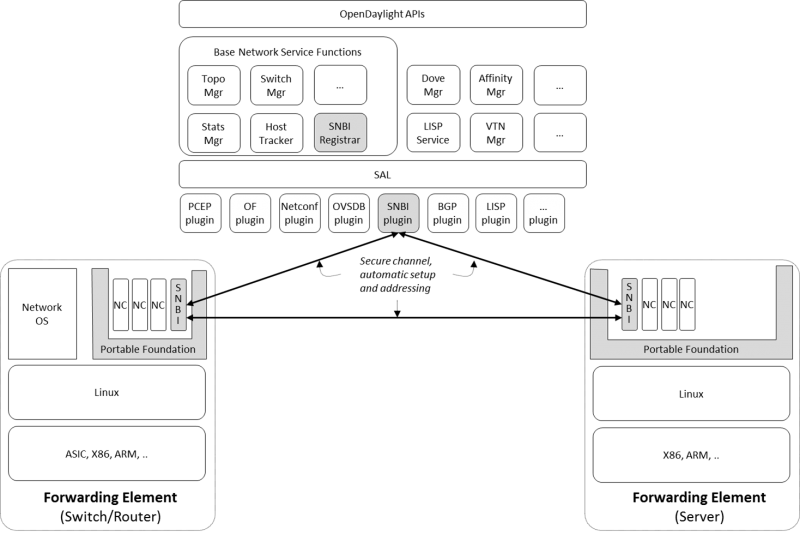

SNBI User Guide
===============

This section describes how to use the SNBI feature in OpenDaylight and
contains configuration, administration, and management section for the
feature.

Overview
--------

Key distribution in a scaled network has always been a challenge.
Typically, operators must perform some manual key distribution process
before secure communication is possible between a set of network
devices. The Secure Network Bootstrapping Infrastructure (SNBI) project
securely and automatically brings up an integrated set of network
devices and controllers, simplifying the process of bootstrapping
network devices with the keys required for secure communication. SNBI
enables connectivity to the network devices by assigning unique IPv6
addresses and bootstrapping devices with the required keys. Admission
control of devices into a specific domain is achieved using whitelist of
authorized devices.

SNBI Architecture
-----------------

At a high level, SNBI architecture consists of the following components:

-  SNBI Registrar

-  SNBI Forwarding Element (FE)

   SNBI Architecture Diagram

SNBI Registrar
~~~~~~~~~~~~~~

Registrar is a device in a network that validates device against a
whitelist and delivers device domain certificate. Registrar includes the
following:

-  RESCONF API for Domain Whitelist Configuration

-  SNBI Southbound Plugin

-  Certificate Authority

**RESTCONF API for Domain Whitelist Configuration:.**

Below is the YANG model to configure the whitelist of devices for a
particular domain.

::

    module snbi {
        //The yang version - today only 1 version exists. If omitted defaults to 1.
        yang-version 1;

        //a unique namespace for this SNBI module, to uniquely identify it from other modules that may have the same name.
        namespace "http://netconfcentral.org/ns/snbi";

        //a shorter prefix that represents the namespace for references used below
        prefix snbi;

        //Defines the organization which defined / owns this .yang file.
        organization "Netconf Central";

        //defines the primary contact of this yang file.
        contact "snbi-dev";

        //provides a description of this .yang file.
        description "YANG version for SNBI.";

        //defines the dates of revisions for this yang file
        revision "2024-07-02" {
            description "SNBI module";
        }

        typedef UDI {
            type string;
            description "Unique Device Identifier";
        }

        container snbi-domain {
            leaf domain-name {
                type string;
                description "The SNBI domain name";
            }

            list device-list {
                key "list-name";

                leaf list-name {
                    type string;
                    description "Name of the device list";
                }

                leaf list-type {
                    type enumeration {
                        enum "white";
                    }
                    description "Indicates the type of the list";
                }

                leaf active {
                    type boolean;
                    description "Indicates whether the list is active or not";
                }

                list devices {
                    key "device-identifier";
                    leaf device-identifier {
                        type union {
                            type UDI;
                        }
                    }
                 }
             }
        }
    }

**Southbound Plugin:.**

The Southbound Plugin implements the protocol state machine necessary to
exchange device identifiers, and deliver certificates.

**Certificate Authority:.**

A simple certificate authority is implemented using the Bouncy Castle
package. The Certificate Authority creates the certificates from the
device CSR requests received from the devices. The certificates thus
generated are delivered to the devices using the Southbound Plugin.

SNBI Forwarding Element
~~~~~~~~~~~~~~~~~~~~~~~

The forwarding element must be installed or unpacked on a Linux host
whose network layer traffic must be secured. The FE performs the
following functions:

-  Neighour Discovery

-  Bootstrap

-  Host Configuration

**Neighbour Discovery:.**

Neighbour Discovery (ND) is the first step in accommodating devices in a
secure network. SNBI performs periodic neighbour discovery of SNBI
agents by transmitting ND hello packets. The discovered devices are
populated in an ND table. Neighbour Discovery is periodic and
bidirectional. ND hello packets are transmitted every 10 seconds. A 40
second refresh timer is set for each discovered neighbour. On expiry of
the refresh timer, the Neighbour Adjacency is removed from the ND table
as the Neighbour Adjacency is no longer valid. It is possible that the
same SNBI neighbour is discovered on multiple links, the expiry of a
device on one link does not automatically remove the device entry from
the ND table.

**Bootstrapping:.**

Bootstrapping a device involves the following sequential steps:

-  Authenticate a device using device identifier (UDI or SUDI)

-  Allocate the appropriate device ID and IPv6 address to uniquely
   identify the device in the network

-  Allocate the required keys by installing a Device Domain Certificate

-  Accommodate the device in the domain

**Host Configuration:.**

Involves configuring a host to create a secure overlay network,
assigning appropriate ipv6 address, setting up gre tunnels, securing the
tunnels traffic via IPsec and enabling connectivity via a routing
protocol.

The SNBI Forwarding Element is packaged in a docker container available
at this link: https://hub.docker.com/r/snbi/boron/. For more information
on docker, refer to this link: https://docs.docker.com/linux/.

Prerequisites for Configuring SNBI
----------------------------------

Before proceeding further, ensure that the following system requirements
are met:

-  64bit Ubunutu 14.04 LTS

-  4GB RAM

-  4GB of hard disk space, sufficient enough to store certificates

-  Java Virtual Machine 1.8 or above

-  Apache Maven 3.3.3 or above

-  Make sure the time on all the devices or synced either manually or
   using NTP

-  The docker version must be greater than 1.0 on a 14.04 Ubuntu

Configuring SNBI
----------------

This section contains the following:

-  Setting up SNBI Registrar on the controller

-  Configuring Whitelist

-  Setting up SNBI FE on Linux Hosts

Setting up SNBI Registrar on the controller
~~~~~~~~~~~~~~~~~~~~~~~~~~~~~~~~~~~~~~~~~~~

This section contains the following:

-  Configuring the Registrar Host

-  Installing Karaf Package

-  Configuring SNBI Registrar

**Configuring the Registrar Host:.**

Before enabling the SNBI registrar service, assign an IPv6 address to an
interface on the registrar host. This is to bind the registrar service
to an IPv6 address (**fd08::aaaa:bbbb:1/128**).

::

    sudo ip link add snbi-ra type dummy
    sudo ip addr add fd08::aaaa:bbbb:1/128 dev snbi-ra
    sudo ifconfig snbi-ra up

**Installing Karaf Package:.**

Download the karaf package from this link:
http://www.opendaylight.org/software/downloads, unzip and run the
``karaf`` executable present in the bin folder. Here is an example of
this step:

::

    cd distribution-karaf-0.3.0-Boron/bin
    ./karaf

Additional information on useful Karaf commands are available at this
link:
https://wiki.opendaylight.org/view/CrossProject:Integration_Group:karaf.

**Configuring SNBI Registrar:.**

Before you perform this step, ensure that you have completed the tasks
`above <#_configuring_snbi>`__:

To use RESTCONF APIs, install the RESTCONF feature available in the
Karaf package. If required, install mdsal-apidocs module for access to
documentation. Refer
https://wiki.opendaylight.org/view/OpenDaylight_Controller:MD-SAL:Restconf_API_Explorer
for more information on MDSAL API docs.

Use the commands below to install the required features and verify the
same.

::

    feature:install odl-restconf
    feature:install odl-mdsal-apidocs
    feature:install odl-snbi-all
    feature:list -i

After confirming that the features are installed, use the following
command to start SNBI registrar:

::

    snbi:start <domain-name>

Configuring Whitelist
~~~~~~~~~~~~~~~~~~~~~

The registrar must be configured with a whitelist of devices that are
accommodated in a specific domain. The YANG for configuring the domain
and the associated whitelist in the controller is avaialble at this
link:
https://wiki.opendaylight.org/view/SNBI_Architecture_and_Design#Registrar_YANG_Definition.
It is recommended to use Postman to configure the registrar using
RESTCONF.

This section contains the following:

-  Installing PostMan

-  Configuring Whitelist using REST API

**Installing PostMan:.**

Follow the steps below to install postman on your Google Chrome Browser.

-  Install Postman via Google Chrome browser available at this link:
   https://chrome.google.com/webstore/detail/postman-rest-client/fdmmgilgnpjigdojojpjoooidkmcomcm?hl=en

-  In the chrome browser address bar, enter: chrome://apps/

-  Click Postman.

-  Enter the URL.

-  Click Headers.

-  Enter Accept: header.

-  Click Basic Auth tab to create user credentials, such as user name
   and password.

-  Send.

You can download a sample Postman configuration to get started from this
link: https://www.getpostman.com/collections/c929a2a4007ffd0a7b51

**Configuring Whitelist using REST API:.**

The POST method below configures a domain - "secure-domain" and
configures a whitelist set of devices to be accommodated to the domain.

::

    {
      "snbi-domain": {
        "domain-name": "secure-domain",
        "device-list": [
          {
            "list-name": "demo list",
            "list-type": "white",
            "active": true,
            "devices": [
              {
                "device-id": "UDI-FirstFE"
              },
              {
                "device-id": "UDI-dev1"
              },
              {
                "device-id": "UDI-dev2"
              }
            ]
          }
         ]
      }
    }

The associated device ID must be configured on the SNBI FE (see below).
You can also use REST APIs using the API docs interface to push the
domain and whitelist information. The API docs could be accessed at
link:http://localhost:8080/apidoc/explorer. More details on the API docs
is available at
link:https://wiki.opendaylight.org/view/OpenDaylight\_Controller:MD-SAL:Restconf\_API\_Explorer

Setting up SNBI FE on Linux Hosts
~~~~~~~~~~~~~~~~~~~~~~~~~~~~~~~~~

The SNBI Daemon is used to bootstrap the host device with a valid device
domain certificate and IP address for connectivity and to create a
reachable overlay network by interacting with multiple software modules.

**Device UDI:.**

The Device UDI or the device Unique Identifier can be derived from a
multitude of parameters in the host machine, but most derived parameters
are already known or do not remain constant across reloads. Therefore,
every SNBI FE must be configured explicitly with a UDI that is present
in the device whitelist.

**First Forwarding Element:.**

The registrar service IP address must be provided to the first host
(Forwarding Element) to be bootstrapped. As mentioned in the
"Configuring the Registrar Host" section, the registrar service IP
address is **fd08::aaaa:bbbb:1**. The First Forwarding Element must be
configured with this IPv6 address.

**Running the SNBI docker image:.**

The SNBI FE in the docker image picks the UDI of the ForwardingElement
via an environment variable provided when executing docker instance. If
the Forwarding Element is a first forwarding element, the IP address of
the registrar service should also be provided.

::

    sudo docker run -v /etc/timezone:/etc/timezone:ro --net=host --privileged=true
    --rm -t -i -e SNBI_UDI=UDI-FirstFE  -e SNBI_REGISTRAR=fd08::aaaa:bbbb:1 snbi/boron:latest /bin/bash

After the docker image is executed, you are placed in the snbi.d command
prompt.

A new Forwarding Element is bootstrapped in the same way, except that
the registrar IP address is not required while running the docker image.

::

    sudo docker run --net=host --privileged=true --rm -t -i -e SNBI_UDI=UDI-dev1 snbi/boron:latest /bin/bash

Administering or Managing SNBI
------------------------------

The SNBI daemon provides various show commands to verify the current
state of the daemon. The commands are completed automatically when you
press Tab in your keyboard. There are help strings "?" to list commands.

::

    snbi.d > show snbi
            device                Host deevice
            neighbors             SNBI Neighbors
            debugs                Debugs enabled
            certificate           Certificate information

