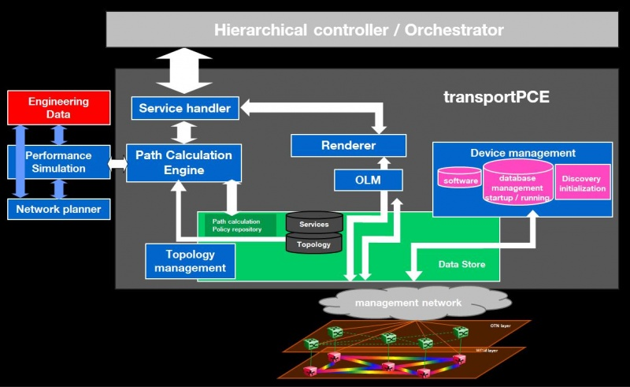

.. _transportpce-user-guide:

TransportPCE User Guide
=======================

Overview
--------

TransportPCE describes an application running on top of the OpenDaylight
controller. Its primary function is to control an optical transport
infrastructure using a non-proprietary South Bound Interface (SBI). It may be
interconnected with Controllers of different layers (L2, L3 Controller…),
a higher layer Controller and/or an Orchestrator through non-proprietary
Application Programing Interfaces (APIs). Control includes the capability to
configure the optical equipment, and to provision services according to a
request coming from a higher layer controller and/or an orchestrator.
This capability may rely on the controller only or it may be delegated to
distributed (standardized) protocols.

It provides alarm/fault and performance
monitoring, but this function might be externalized to improve the scalability.
A Graphical User Interface could be developed in a later step, but is not
considered as a priority since automated control does not imply user
interactions at the transport controller level.

TransportPCE modular architecture is described on the next diagram. Each main
function such as Topology management, Path Calculation Engine (PCE), Service
handler, Renderer responsible for the path configuration through optical
equipment and Optical Line Management (OLM) is associated with a generic block
relying on open models, each of them communicating through published APIs.

   TransportPCE architecture

TransportPCE User-Facing Features
---------------------------------
-  **odl-transportpce**

   -  This feature contains all other features/bundles of TransportPCE project.
      If you install it, it provides all functions that the TransportPCE project
      can support.

-  **odl-transportpce-api**

   -  This feature contains all Transportpce project specific models defined in "Service-path".
      These models complement OpenROADM models describing South and Northbound APIs, and define the
      data structure used to interconnect the generic blocks/functions described on the previous
      diagram.

-  **odl-transportpce-ordmodels**

   -  This feature contains all OpenROADM models : Common, Device, Network and Service models.

-  **odl-transportpce-stubmodels**

   -  This feature provides function to be able to stub some of TransportPCE modules, pce and
      renderer (Stubpce and Stubrenderer).
      Stubs are used for development purposes and required for some of the functionnal tests.

How To Start
------------

Preparing for Installation
~~~~~~~~~~~~~~~~~~~~~~~~~~

1. Devices must support the standard OpenROADM Models more precisely versions
   1.2.1 and 2.1.

2. Devices must support configuration through NETCONF protocol/API.

Installation Feature
~~~~~~~~~~~~~~~~~~~~

Run OpenDaylight and install TransportPCE Service *odl-transportpce* as below::

   feature:install odl-transportpce

For a more detailed overview of the TransportPCE, see the :ref:`transportpce-dev-guide`.
