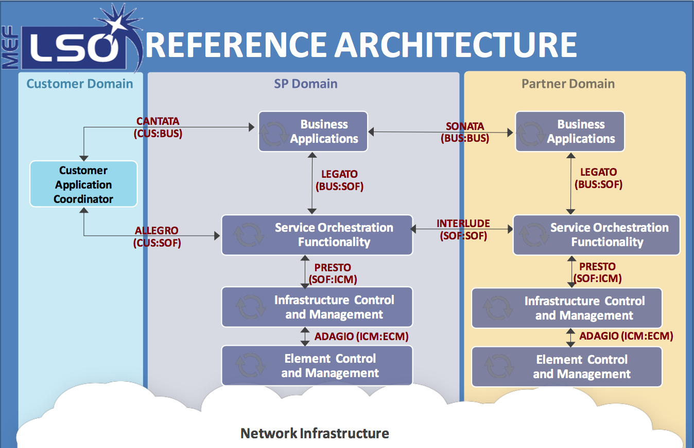

.. _unimgr-user-guide:

User Network Interface Manager Plug-in (Unimgr) User Guide
==========================================================

Overview
--------

The User Network Interface (UNI) Manager project within OpenDaylight provides
data models and APIs that enable software applications and service
orchestrators to configure and provision connectivity services; in particular,
Carrier Ethernet services as defined by MEF Forum, in physical and virtual
network elements.

MEF has defined the Lifecycle Service Orchestration (LSO) Reference
Architecture for the management and control of domains and entities that enable
cooperative network services across one or more service provider networks. The
architecture also identifies LSO Reference Points, which are the logical points
of interaction between specific functional management components. These LSO
Reference Points are further defined by interface profiles and instantiated by
APIs.

The LSO Reference Architecture is shown below. Note that this is a functional
architecture that does not describe how the management components are
implemented (e.g., single vs. multiple instances), but rather identifies
management components that provide logical functionality as well as the points
of interaction among them.

   MEF LSO Reference Architecture

Unimgr provides support for both the Legato as well as the Presto interfaces.
These interfaces, and the APIs associated with them, are defined by YANG models
developed within MEF in collaboration with ONF and IETF. For the Carbon release,
these are as follows:

Legato YANG modules:
https://git.opendaylight.org/gerrit/gitweb?p=unimgr.git;a=tree;f=legato-api/src/main/yang;hb=refs/heads/stable/carbon

Presto YANG modules:
https://git.opendaylight.org/gerrit/gitweb?p=unimgr.git;a=tree;f=presto-api/src/main/yang;hb=refs/heads/stable/carbon

An application/user can interact with Unimgr at either the service
orchestration layer (Legato) or the network resource provisioning layer
(Presto).

Unimgr Architecture
-------------------

Unimgr is comprised of the following OpenDaylight Karaf features:

+--------------------------------------+--------------------------------------+
| odl-unimgr-api                       | OpenDaylight :: UniMgr :: api        |
+--------------------------------------+--------------------------------------+
| odl-unimgr                           | OpenDaylight :: UniMgr               |
+--------------------------------------+--------------------------------------+
| odl-unimgr-console                   | OpenDaylight :: UniMgr :: CLI        |
+--------------------------------------+--------------------------------------+
| odl-unimgr-rest                      | OpenDaylight :: UniMgr :: REST       |
+--------------------------------------+--------------------------------------+
| odl-unimgr-ui                        | OpenDaylight :: UniMgr :: UI         |
+--------------------------------------+--------------------------------------+

Configuring Unimgr
------------------

After launching OpenDaylight, install the feature for Unimgr.  From the karaf
command prompt execute the following command:

::

    $ feature:install odl-unimgr-ui

Explore and exercise the Unimgr REST API
----------------------------------------

To see the Unimgr API, browse to this URL:
http://localhost:8181/apidoc/explorer/index.html

Replace localhost with the IP address or hostname where OpenDaylight is
running if you are not running OpenDaylight locally on your machine.

See also the Unimgr Developer Guide for a full listing of the API.
