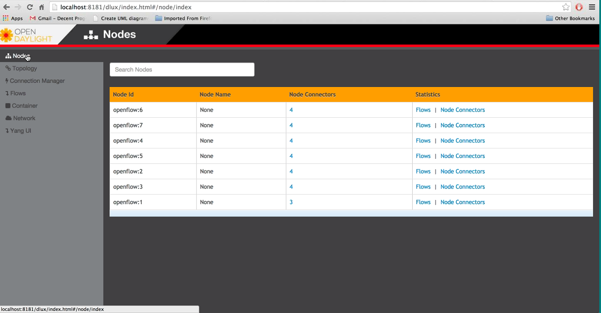

Using the OpenDaylight User Interface (DLUX)
============================================

This section introduces you to the OpenDaylight User Experience (DLUX)
application.

Getting Started with DLUX
-------------------------

DLUX provides a number of different Karaf features, which you can enable
and disable separately. In Beryllum they are: . odl-dlux-core .
odl-dlux-node . odl-dlux-yangui . odl-dlux-yangvisualizer

Logging In
----------

To log in to DLUX, after installing the application:

1. Open a browser and enter the login URL
   http://<your-karaf-ip>:8181/index.html
   in your browser (Chrome is recommended).

2. Login to the application with your username and password credentials.

.. note::

    OpenDaylight’s default credentials are *admin* for both the username
    and password.

Working with DLUX
-----------------

After you login to DLUX, if you enable only odl-dlux-core feature, you
will see only topology application available in the left pane.

.. note::

    To make sure topology displays all the details, enable the
    odl-l2switch-switch feature in Karaf.

DLUX has other applications such as node, yang UI and those apps won’t
show up, until you enable their features odl-dlux-node and
odl-dlux-yangui respectively in the Karaf distribution.

   DLUX Modules

.. note::

    If you install your application in dlux, they will also show up on
    the left hand navigation after browser page refresh.

Viewing Network Statistics
--------------------------

The **Nodes** module on the left pane enables you to view the network
statistics and port information for the switches in the network.

To use the **Nodes** module:

1. Select **Nodes** on the left pane. The right pane displays atable
   that lists all the nodes, node connectors and the statistics.

2. Enter a node ID in the **Search Nodes** tab to search by node
   connectors.

3. Click on the **Node Connector** number to view details such as port
   ID, port name, number of ports per switch, MAC Address, and so on.

4. Click **Flows** in the Statistics column to view Flow Table
   Statistics for the particular node like table ID, packet match,
   active flows and so on.

5. Click **Node Connectors** to view Node Connector Statistics for the
   particular node ID.

Viewing Network Topology
------------------------

The Topology tab displays a graphical representation of network topology
created.

.. note::

    DLUX does not allow for editing or adding topology information. The
    topology is generated and edited in other modules, e.g., the
    OpenFlow plugin. OpenDaylight stores this information in the MD-SAL
    datastore where DLUX can read and display it.

To view network topology:

1. Select **Topology** on the left pane. You will view the graphical
   representation on the right pane. In the diagram blue boxes represent
   the switches, the black represents the hosts available, and lines
   represents how the switches and hosts are connected.

2. Hover your mouse on hosts, links, or switches to view source and
   destination ports.

3. Zoom in and zoom out using mouse scroll to verify topology for larger
   topologies.

   Topology Module

Interacting with the YANG-based MD-SAL datastore
------------------------------------------------

The **Yang UI** module enables you to interact with the YANG-based
MD-SAL datastore. For more information about YANG and how it interacts
with the MD-SAL datastore, see the *Controller* and *YANG Tools* section
of the *OpenDaylight Developer Guide*.

.. figure:: ./images/dlux-yang-ui-screen.png
   :alt: Yang UI

   Yang UI

To use Yang UI:

1. Select **Yang UI** on the left pane. The right pane is divided in two
   parts.

2. The top part displays a tree of APIs, subAPIs, and buttons to call
   possible functions (GET, POST, PUT, and DELETE).

   .. note::

       every subAPI can call every function. For example, subAPIs in
       the *operational* store have GET functionality only.

   Inputs can be filled from OpenDaylight when existing data from
   OpenDaylight is displayed or can be filled by user on the page and
   sent to OpenDaylight.

   Buttons under the API tree are variable. It depends on subAPI
   specifications. Common buttons are:

   -  GET to get data from OpenDaylight,

   -  PUT and POST for sending data to OpenDaylight for saving

   -  DELETE for sending data to OpenDaylight for deleting.

      You must specify the xpath for all these operations. This path is
      displayed in the same row before buttons and it may include text
      inputs for specific path element identifiers.

      .. figure:: ./images/dlux-yang-api-specification.png
         :alt: Yang API Specification

         Yang API Specification

3. The bottom part of the right pane displays inputs according to the
   chosen subAPI.

   -  Lists are handled as a special case. For example, a device can
      store multiple flows. In this case "flow" is name of the list and
      every list element is identified by a unique key value. Elements
      of a list can, in turn, contain other lists.

   -  In Yang UI, each list element is rendered with the name of the
      list it belongs to, its key, its value, and a button for removing
      it from the list.

      .. figure:: ./images/dlux-yang-sub-api-screen.png
         :alt: Yang UI API Specification

         Yang UI API Specification

4. After filling in the relevant inputs, click the **Show Preview**
   button under the API tree to display request that will be sent to
   OpenDaylight. A pane is displayed on the right side with text of
   request when some input is filled.

Displaying Topology on the **Yang UI**
~~~~~~~~~~~~~~~~~~~~~~~~~~~~~~~~~~~~~~

To display topology:

1. Select subAPI network-topology <topology revision number> == >
   operational == > network-topology.

2. Get data from OpenDaylight by clicking on the "GET" button.

3. Click **Display Topology**.

   DLUX Yang Topology

Configuring List Elements on the **Yang UI**
~~~~~~~~~~~~~~~~~~~~~~~~~~~~~~~~~~~~~~~~~~~~

Lists in Yang UI are displayed as trees. To expand or collapse a list,
click the arrow before name of the list. To configure list elements in
Yang UI:

1. To add a new list element with empty inputs use the plus icon-button
   **+** that is provided after list name.

2. To remove several list elements, use the **X** button that is
   provided after every list element.

   .. figure:: ./images/dlux-yang-list-elements.png
      :alt: DLUX List Elements

      DLUX List Elements

3. In the YANG-based data store all elements of a list must have a
   unique key. If you try to assign two or more elements the same key, a
   warning icon **!** is displayed near their name buttons.

   .. figure:: ./images/dlux-yang-list-warning.png
      :alt: DLUX List Warnings

      DLUX List Warnings

4. When the list contains at least one list element, after the **+**
   icon, there are buttons to select each individual list element. You
   can choose one of them by clicking on it. In addition, to the right
   of the list name, there is a button which will display a vertically
   scrollable pane with all the list elements.

   .. figure:: ./images/dlux-yang-list-button1.png
      :alt: DLUX List Button1

      DLUX List Button1

