.. _vtn-user-guide:

Virtual Tenant Network (VTN)
============================

VTN Overview
------------

OpenDaylight Virtual Tenant Network (VTN) is an application that
provides multi-tenant virtual network on an SDN controller.

Conventionally, huge investment in the network systems and operating
expenses are needed because the network is configured as a silo for each
department and system. So, various network appliances must be installed
for each tenant and those boxes cannot be shared with others. It is a
heavy work to design, implement and operate the entire complex network.

The uniqueness of VTN is a logical abstraction plane. This enables the
complete separation of logical plane from physical plane. Users can
design and deploy any desired network without knowing the physical
network topology or bandwidth restrictions.

VTN allows the users to define the network with a look and feel of
conventional L2/L3 network. Once the network is designed on VTN, it will
automatically be mapped into underlying physical network, and then
configured on the individual switch leveraging SDN control protocol. The
definition of logical plane makes it possible not only to hide the
complexity of the underlying network but also to better manage network
resources. It achieves reducing reconfiguration time of network services
and minimizing network configuration errors.

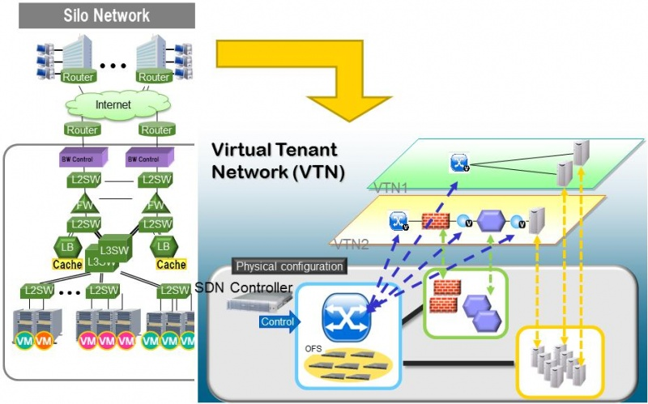

   VTN Overview

It is implemented as two major components

-  `VTN Manager`

-  `VTN Coordinator`

VTN Manager
~~~~~~~~~~~

An OpenDaylight Plugin that interacts with other modules to implement
the components of the VTN model. It also provides a REST interface to
configure VTN components in OpenDaylight. VTN Manager is implemented as
one plugin to the OpenDaylight. This provides a REST interface to
create/update/delete VTN components. The user command in VTN Coordinator
is translated as REST API to VTN Manager by the OpenDaylight Driver
component. In addition to the above mentioned role, it also provides an
implementation to the OpenStack L2 Network Functions API.

Features Overview
^^^^^^^^^^^^^^^^^

-  **odl-vtn-manager** provides VTN Manager’s JAVA API.

-  **odl-vtn-manager-rest** provides VTN Manager’s REST API.

-  **odl-vtn-manager-neutron** provides the integration with Neutron
   interface.

REST API
^^^^^^^^

VTN Manager provides REST API for virtual network functions.

Here is an example of how to create a virtual tenant network.

::

     curl --user "admin":"admin" -H "Accept: application/json" -H \
     "Content-type: application/json" -X POST \
     http://localhost:8181/restconf/operations/vtn:update-vtn \
     -d '{"input":{"tenant-name":"vtn1"}}'

You can check the list of all tenants by executing the following
command.

::

     curl --user "admin":"admin" -H "Accept: application/json" -H \
     "Content-type: application/json" -X GET \
     http://localhost:8181/restconf/operational/vtn:vtns

REST Conf documentation for VTN Manager, please refer to:
https://nexus.opendaylight.org/content/sites/site/org.opendaylight.vtn/boron/manager.model/apidocs/index.html

VTN Coordinator
~~~~~~~~~~~~~~~

The VTN Coordinator is an external application that provides a REST
interface for an user to use OpenDaylight VTN Virtualization. It
interacts with VTN Manager plugin to implement the user configuration.
It is also capable of multiple OpenDaylight orchestration. It realizes
Virtual Tenant Network (VTN) provisioning in OpenDaylight instances. In
the OpenDaylight architecture VTN Coordinator is part of the network
application, orchestration and services layer. VTN Coordinator will use
the REST interface exposed by the VTN Manger to realize the virtual
network using OpenDaylight. It uses OpenDaylight APIs (REST) to
construct the virtual network in OpenDaylight instances. It provides
REST APIs for northbound VTN applications and supports virtual networks
spanning across multiple OpenDaylight by coordinating across
OpenDaylight.

For VTN Coordinator REST API, please refer to:
https://wiki.opendaylight.org/view/OpenDaylight_Virtual_Tenant_Network_%28VTN%29:VTN_Coordinator:RestApi

Network Virtualization Function
~~~~~~~~~~~~~~~~~~~~~~~~~~~~~~~

The user first defines a VTN. Then, the user maps the VTN to a physical
network, which enables communication to take place according to the VTN
definition. With the VTN definition, L2 and L3 transfer functions and
flow-based traffic control functions (filtering and redirect) are
possible.

Virtual Network Construction
~~~~~~~~~~~~~~~~~~~~~~~~~~~~

The following table shows the elements which make up the VTN. In the
VTN, a virtual network is constructed using virtual nodes (vBridge,
vRouter) and virtual interfaces and links. It is possible to configure a
network which has L2 and L3 transfer function, by connecting the virtual
intrefaces made on virtual nodes via virtual links.

+--------------------------------------+--------------------------------------+
| vBridge                              | The logical representation of L2     |
|                                      | switch function.                     |
+--------------------------------------+--------------------------------------+
| vRouter                              | The logical representation of router |
|                                      | function.                            |
+--------------------------------------+--------------------------------------+
| vTep                                 | The logical representation of Tunnel |
|                                      | End Point - TEP.                     |
+--------------------------------------+--------------------------------------+
| vTunnel                              | The logical representation of        |
|                                      | Tunnel.                              |
+--------------------------------------+--------------------------------------+
| vBypass                              | The logical representation of        |
|                                      | connectivity between controlled      |
|                                      | networks.                            |
+--------------------------------------+--------------------------------------+
| Virtual interface                    | The representation of end point on   |
|                                      | the virtual node.                    |
+--------------------------------------+--------------------------------------+
| Virtual Linkv(vLink)                 | The logical representation of L1     |
|                                      | connectivity between virtual         |
|                                      | interfaces.                          |
+--------------------------------------+--------------------------------------+

The following figure shows an example of a constructed virtual network.
VRT is defined as the vRouter, BR1 and BR2 are defined as vBridges.
interfaces of the vRouter and vBridges are connected using vLinks.

.. figure:: ./images/vtn/VTN_Construction.jpg
   :alt: VTN Construction

   VTN Construction

Mapping of Physical Network Resources
~~~~~~~~~~~~~~~~~~~~~~~~~~~~~~~~~~~~~

Map physical network resources to the constructed virtual network.
Mapping identifies which virtual network each packet transmitted or
received by an OpenFlow switch belongs to, as well as which interface in
the OpenFlow switch transmits or receives that packet. There are two
mapping methods. When a packet is received from the OFS, port mapping is
first searched for the corresponding mapping definition, then VLAN
mapping is searched, and the packet is mapped to the relevant vBridge
according to the first matching mapping.

+--------------------------------------+--------------------------------------+
| Port mapping                         | Maps physical network resources to   |
|                                      | an interface of vBridge using Switch |
|                                      | ID, Port ID and VLAN ID of the       |
|                                      | incoming L2 frame. Untagged frame    |
|                                      | mapping is also supported.           |
+--------------------------------------+--------------------------------------+
| VLAN mapping                         | Maps physical network resources to a |
|                                      | vBridge using VLAN ID of the         |
|                                      | incoming L2 frame.Maps physical      |
|                                      | resources of a particular switch to  |
|                                      | a vBridge using switch ID and VLAN   |
|                                      | ID of the incoming L2 frame.         |
+--------------------------------------+--------------------------------------+
| MAC mapping                          | Maps physical resources to an        |
|                                      | interface of vBridge using MAC       |
|                                      | address of the incoming L2 frame(The |
|                                      | initial contribution does not        |
|                                      | include this method).                |
+--------------------------------------+--------------------------------------+

VTN can learn the terminal information from a terminal that is connected
to a switch which is mapped to VTN. Further, it is possible to refer
that terminal information on the VTN.

-  Learning terminal information VTN learns the information of a
   terminal that belongs to VTN. It will store the MAC address and VLAN
   ID of the terminal in relation to the port of the switch.

-  Aging of terminal information Terminal information, learned by the
   VTN, will be maintained until the packets from terminal keep flowing
   in VTN. If the terminal gets disconnected from the VTN, then the
   aging timer will start clicking and the terminal information will be
   maintained till timeout.

The following figure shows an example of mapping. An interface of BR1 is
mapped to port GBE0/1 of OFS1 using port mapping. Packets received from
GBE0/1 of OFS1 are regarded as those from the corresponding interface of
BR1. BR2 is mapped to VLAN 200 using VLAN mapping. Packets with VLAN tag
200 received from any ports of any OFSs are regarded as those from an
interface of BR2.

.. figure:: ./images/vtn/VTN_Mapping.jpg
   :alt: VTN Mapping

   VTN Mapping

vBridge Functions
~~~~~~~~~~~~~~~~~

The vBridge provides the bridge function that transfers a packet to the
intended virtual port according to the destination MAC address. The
vBridge looks up the MAC address table and transmits the packet to the
corresponding virtual interface when the destination MAC address has
been learned. When the destination MAC address has not been learned, it
transmits the packet to all virtual interfaces other than the receiving
port (flooding). MAC addresses are learned as follows.

-  MAC address learning The vBridge learns the MAC address of the
   connected host. The source MAC address of each received frame is
   mapped to the receiving virtual interface, and this MAC address is
   stored in the MAC address table created on a per-vBridge basis.

-  MAC address aging The MAC address stored in the MAC address table is
   retained as long as the host returns the ARP reply. After the host is
   disconnected, the address is retained until the aging timer times
   out. To have the vBridge learn MAC addresses statically, you can
   register MAC addresses manually.

vRouter Functions
~~~~~~~~~~~~~~~~~

The vRouter transfers IPv4 packets between vBridges. The vRouter
supports routing, ARP learning, and ARP aging functions. The following
outlines the functions.

-  Routing function When an IP address is registered with a virtual
   interface of the vRouter, the default routing information for that
   interface is registered. It is also possible to statically register
   routing information for a virtual interface.

-  ARP learning function The vRouter associates a destination IP
   address, MAC address and a virtual interface, based on an ARP request
   to its host or a reply packet for an ARP request, and maintains this
   information in an ARP table prepared for each routing domain. The
   registered ARP entry is retained until the aging timer, described
   later, times out. The vRouter transmits an ARP request on an
   individual aging timer basis and deletes the associated entry from
   the ARP table if no reply is returned. For static ARP learning, you
   can register ARP entry information manually.

-  DHCP relay agent function The vRouter also provides the DHCP relay
   agent function.

Flow Filter Functions
~~~~~~~~~~~~~~~~~~~~~

Flow Filter function is similar to ACL. It is possible to allow or
prohibit communication with only certain kind of packets that meet a
particular condition. Also, it can perform a processing called
Redirection - WayPoint routing, which is different from the existing
ACL. Flow Filter can be applied to any interface of a vNode within VTN,
and it is possible to the control the packets that pass interface. The
match conditions that could be specified in Flow Filter are as follows.
It is also possible to specify a combination of multiple conditions.

-  Source MAC address

-  Destination MAC address

-  MAC ether type

-  VLAN Priority

-  Source IP address

-  Destination IP address

-  DSCP

-  IP Protocol

-  TCP/UDP source port

-  TCP/UDP destination port

-  ICMP type

-  ICMP code

The types of Action that can be applied on packets that match the Flow
Filter conditions are given in the following table. It is possible to
make only those packets, which match a particular condition, to pass
through a particular server by specifying Redirection in Action. E.g.,
path of flow can be changed for each packet sent from a particular
terminal, depending upon the destination IP address. VLAN priority
control and DSCP marking are also supported.

+--------------------------------------+--------------------------------------+
| Action                               | Function                             |
+--------------------------------------+--------------------------------------+
| Pass                                 | Pass particular packets matching the |
|                                      | specified conditions.                |
+--------------------------------------+--------------------------------------+
| Drop                                 | Discards particular packets matching |
|                                      | the specified conditions.            |
+--------------------------------------+--------------------------------------+
| Redirection                          | Redirects the packet to a desired    |
|                                      | virtual interface. Both Transparent  |
|                                      | Redirection (not changing MAC        |
|                                      | address) and Router Redirection      |
|                                      | (changing MAC address) are           |
|                                      | supported.                           |
+--------------------------------------+--------------------------------------+

The following figure shows an example of how the flow filter function
works.

If there is any matching condition specified by flow filter when a
packet being transferred within a virtual network goes through a virtual
interface, the function evaluates the matching condition to see whether
the packet matches it. If the packet matches the condition, the function
applies the matching action specified by flow filter. In the example
shown in the figure, the function evaluates the matching condition at
BR1 and discards the packet if it matches the condition.

.. figure:: ./images/vtn/VTN_Flow_Filter.jpg
   :alt: VTN FlowFilter

   VTN FlowFilter

Multiple SDN Controller Coordination
~~~~~~~~~~~~~~~~~~~~~~~~~~~~~~~~~~~~

With the network abstractions, VTN enables to configure virtual network
across multiple SDN controllers. This provides highly scalable network
system.

VTN can be created on each SDN controller. If users would like to manage
those multiple VTNs with one policy, those VTNs can be integrated to a
single VTN.

As a use case, this feature is deployed to multi data center
environment. Even if those data centers are geographically separated and
controlled with different controllers, a single policy virtual network
can be realized with VTN.

Also, one can easily add a new SDN Controller to an existing VTN or
delete a particular SDN Controller from VTN.

In addition to this, one can define a VTN which covers both OpenFlow
network and Overlay network at the same time.

Flow Filter, which is set on the VTN, will be automatically applied on
the newly added SDN Controller.

Coordination between OpenFlow Network and L2/L3 Network
~~~~~~~~~~~~~~~~~~~~~~~~~~~~~~~~~~~~~~~~~~~~~~~~~~~~~~~

It is possible to configure VTN on an environment where there is mix of
L2/L3 switches as well. L2/L3 switch will be shown on VTN as vBypass.
Flow Filter or policing cannot be configured for a vBypass. However, it
is possible to treat it as a virtual node inside VTN.

Virtual Tenant Network (VTN) API
~~~~~~~~~~~~~~~~~~~~~~~~~~~~~~~~

VTN provides Web APIs. They are implemented by REST architecture and
provide the access to resources within VTN that are identified by URI.
User can perform the operations like GET/PUT/POST/DELETE against the
virtual network resources (e.g. vBridge or vRouter) by sending a message
to VTN through HTTPS communication in XML or JSON format.

.. figure:: ./images/vtn/VTN_API.jpg
   :alt: VTN API

   VTN API

Function Outline
^^^^^^^^^^^^^^^^

VTN provides following operations for various network resources.

+----------------+----------------+----------------+----------------+----------------+
| Resources      | GET            | POST           | PUT            | DELETE         |
+----------------+----------------+----------------+----------------+----------------+
| VTN            | Yes            | Yes            | Yes            | Yes            |
+----------------+----------------+----------------+----------------+----------------+
| vBridge        | Yes            | Yes            | Yes            | Yes            |
+----------------+----------------+----------------+----------------+----------------+
| vRouter        | Yes            | Yes            | Yes            | Yes            |
+----------------+----------------+----------------+----------------+----------------+
| vTep           | Yes            | Yes            | Yes            | Yes            |
+----------------+----------------+----------------+----------------+----------------+
| vTunnel        | Yes            | Yes            | Yes            | Yes            |
+----------------+----------------+----------------+----------------+----------------+
| vBypass        | Yes            | Yes            | Yes            | Yes            |
+----------------+----------------+----------------+----------------+----------------+
| vLink          | Yes            | Yes            | Yes            | Yes            |
+----------------+----------------+----------------+----------------+----------------+
| Interface      | Yes            | Yes            | Yes            | Yes            |
+----------------+----------------+----------------+----------------+----------------+
| Port map       | Yes            | No             | Yes            | Yes            |
+----------------+----------------+----------------+----------------+----------------+
| Vlan map       | Yes            | Yes            | Yes            | Yes            |
+----------------+----------------+----------------+----------------+----------------+
| Flowfilter     | Yes            | Yes            | Yes            | Yes            |
| (ACL/redirect) |                |                |                |                |
+----------------+----------------+----------------+----------------+----------------+
| Controller     | Yes            | Yes            | Yes            | Yes            |
| information    |                |                |                |                |
+----------------+----------------+----------------+----------------+----------------+
| Physical       | Yes            | No             | No             | No             |
| topology       |                |                |                |                |
| information    |                |                |                |                |
+----------------+----------------+----------------+----------------+----------------+
| Alarm          | Yes            | No             | No             | No             |
| information    |                |                |                |                |
+----------------+----------------+----------------+----------------+----------------+

Example usage
^^^^^^^^^^^^^

The following is an example of the usage to construct a virtual network.

-  Create VTN

::

       curl --user admin:adminpass -X POST -H 'content-type: application/json'  \
      -d '{"vtn":{"vtn_name":"VTN1"}}' http://172.1.0.1:8083/vtn-webapi/vtns.json

-  Create Controller Information

::

       curl --user admin:adminpass -X POST -H 'content-type: application/json'  \
      -d '{"controller": {"controller_id":"CONTROLLER1","ipaddr":"172.1.0.1","type":"odc","username":"admin", \
      "password":"admin","version":"1.0"}}' http://172.1.0.1:8083/vtn-webapi/controllers.json

-  Create vBridge under VTN

::

      curl --user admin:adminpass -X POST -H 'content-type: application/json' \
      -d '{"vbridge":{"vbr_name":"VBR1","controller_id": "CONTROLLER1","domain_id": "(DEFAULT)"}}' \
      http://172.1.0.1:8083/vtn-webapi/vtns/VTN1/vbridges.json

-  Create the interface under vBridge

::

      curl --user admin:adminpass -X POST -H 'content-type: application/json' \
      -d '{"interface":{"if_name":"IF1"}}' http://172.1.0.1:8083/vtn-webapi/vtns/VTN1/vbridges/VBR1/interfaces.json

VTN OpenStack Configuration
---------------------------

This guide describes how to set up OpenStack for integration with
OpenDaylight Controller.

While OpenDaylight Controller provides several ways to integrate with
OpenStack, this guide focus on the way which uses VTN features available
on OpenDaylight. In the integration, VTN Manager work as network service
provider for OpenStack.

VTN Manager features, enable OpenStack to work in pure OpenFlow
environment in which all switches in data plane are OpenFlow switch.

Requirements
~~~~~~~~~~~~

-  OpenDaylight Controller. (VTN features must be installed)

-  OpenStack Control Node.

-  OpenStack Compute Node.

-  OpenFlow Switch like mininet(Not Mandatory).

The VTN features support multiple OpenStack nodes. You can deploy
multiple OpenStack Compute Nodes. In management plane, OpenDaylight
Controller, OpenStack nodes and OpenFlow switches should communicate
with each other. In data plane, Open vSwitches running in OpenStack
nodes should communicate with each other through a physical or logical
OpenFlow switches. The core OpenFlow switches are not mandatory.
Therefore, you can directly connect to the Open vSwitch’s.

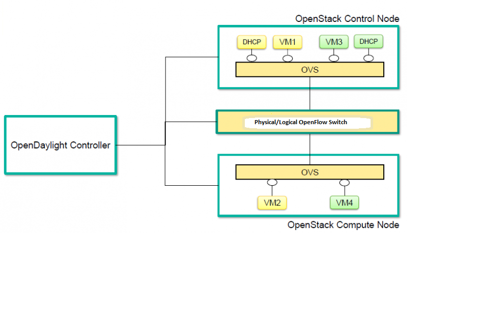

   Openstack Overview

Sample Configuration
~~~~~~~~~~~~~~~~~~~~

Below steps depicts the configuration of single OpenStack Control node
and OpenStack Compute node setup. Our test setup is as follows

.. figure:: ./images/vtn/vtn_devstack_setup.png
   :alt: LAB Setup

   LAB Setup

**Server Preparation**

-  Install Ubuntu 14.04 LTS in two servers (OpenStack Control node and
   Compute node respectively)

-  While installing, Ubuntu mandates creation of a User, we created the
   user "stack"(We will use the same user for running devstack)

-  Proceed with the below mentioned User Settings and Network Settings
   in both the Control and Compute nodes.

**User Settings for devstack** - Login to both servers - Disable Ubuntu
Firewall

::

    sudo ufw disable

-  Install the below packages (optional, provides ifconfig and route
   coammnds, handy for debugging!!)

   ::

       sudo apt-get install net-tools

-  Edit sudo vim /etc/sudoers and add an entry as follows

   ::

       stack ALL=(ALL) NOPASSWD: ALL

**Network Settings** - Checked the output of ifconfig -a, two interfaces
were listed eth0 and eth1 as indicated in the image above. - We had
connected eth0 interface to the Network where OpenDaylight is reachable.
- eth1 interface in both servers were connected to a different network
to act as data plane for the VM’s created using the OpenStack. -
Manually edited the file : sudo vim /etc/network/interfaces and made
entries as follows

::

     stack@ubuntu-devstack:~/devstack$ cat /etc/network/interfaces
     # This file describes the network interfaces available on your system
     # and how to activate them. For more information, see interfaces(5).
     # The loop-back network interface
     auto lo
     iface lo inet loopback
     # The primary network interface
     auto eth0
     iface eth0 inet static
          address <IP_ADDRESS_TO_REACH_ODL>
          netmask <NET_MASK>
          broadcast <BROADCAST_IP_ADDRESS>
          gateway <GATEWAY_IP_ADDRESS>
    auto eth1
    iface eth1 inet static
         address <IP_ADDRESS_UNIQ>
         netmask <NETMASK>

.. note::

    Please ensure that the eth0 interface is the default route and it is
    able to reach the ODL\_IP\_ADDRESS NOTE: The entries for eth1 are
    not mandatory, If not set, we may have to manually do "ifup eth1"
    after the stacking is complete to activate the interface

**Finalize the user and network settings** - Please reboot both nodes
after the user and network settings to have the network settings applied
to the network - Login again and check the output of ifconfig to ensure
that both interfaces are listed

OpenDaylight Settings and Execution
~~~~~~~~~~~~~~~~~~~~~~~~~~~~~~~~~~~

VTN Configuration for OpenStack Integration:
^^^^^^^^^^^^^^^^^^^^^^^^^^^^^^^^^^^^^^^^^^^^

-  VTN uses the configuration parameters from "90-vtn-neutron.xml" file
   for the OpenStack integration.

-  These values will be set for the OpenvSwitch, in all the
   participating OpenStack nodes.

-  A configuration file "90-vtn-neutron.xml" will be generated
   automatically by following the below steps,

-  Download the latest Boron karaf distribution from the below link,

   ::

       http://www.opendaylight.org/software/downloads

-  cd "distribution-karaf-0.5.0-Boron" and run karaf by using the
   following command "./bin/karaf".

-  Install the below feature to generate "90-vtn-neutron.xml"

::

     feature:install odl-vtn-manager-neutron

-  Logout from the karaf console and Check "90-vtn-neutron.xml" file
   from the following path
   "distribution-karaf-0.5.0-Boron/etc/opendaylight/karaf/".

-  The contents of "90-vtn-neutron.xml" should be as follows:

bridgename=br-int portname=eth1 protocols=OpenFlow13 failmode=secure

-  The values of the configuration parameters must be changed based on
   the user environment.

-  Especially, "portname" should be carefully configured, because if the
   value is wrong, OpenDaylight fails to forward packets.

-  Other parameters works fine as is for general use cases.

   -  bridgename

      -  The name of the bridge in Open vSwitch, that will be created by
         OpenDaylight Controller.

      -  It must be "br-int".

   -  portname

      -  The name of the port that will be created in the vbridge in
         Open vSwitch.

      -  This must be the same name of the interface of OpenStack Nodes
         which is used for interconnecting OpenStack Nodes in data
         plane.(in our case:eth1)

      -  By default, if 90-vtn-neutron.xml is not created, VTN uses
         ens33 as portname.

   -  protocols

      -  OpenFlow protocol through which OpenFlow Switch and Controller
         communicate.

      -  The values can be OpenFlow13 or OpenFlow10.

   -  failmode

      -  The value can be "standalone" or "secure".

      -  Please use "secure" for general use cases.

Start ODL Controller
^^^^^^^^^^^^^^^^^^^^

-  Please refer to the Installation Pages to run ODL with VTN Feature
   enabled.

-  After running ODL Controller, please ensure ODL Controller listens to
   the ports:6633,6653, 6640 and 8080

-  Please allow the ports in firewall for the devstack to be able to
   communicate with ODL Controller.

.. note::

    -  6633/6653 - OpenFlow Ports

    -  6640 - OVS Manager Port

    -  8080 - Port for REST API

Devstack Setup
~~~~~~~~~~~~~~

Get Devstack (All nodes)
^^^^^^^^^^^^^^^^^^^^^^^^

-  Install git application using

   -  sudo apt-get install git

-  Get devstack

   -  git clone https://git.openstack.org/openstack-dev/devstack;

-  Switch to stable/Juno Version branch

   -  cd devstack

      ::

          git checkout stable/juno

.. note::

    If you want to use stable/kilo Version branch, Please execute the
    below command in devstack folder

::

    git checkout stable/kilo

.. note::

    If you want to use stable/liberty Version branch, Please execute the
    below command in devstack folder

::

    git checkout stable/liberty

Stack Control Node
^^^^^^^^^^^^^^^^^^

-  local.conf:

-  cd devstack in the controller node

-  Copy the contents of local.conf for juno (devstack control node) from
   https://wiki.opendaylight.org/view/OpenDaylight_Virtual_Tenant_Network_(VTN):Scripts:devstack
   and save it as "local.conf" in the "devstack".

-  Copy the contents of local.conf for kilo and liberty (devstack
   control node) from
   https://wiki.opendaylight.org/view/OpenDaylight_Virtual_Tenant_Network_(VTN):Scripts:devstack_post_juno_versions
   and save it as "local.conf" in the "devstack".

-  Please modify the IP Address values as required.

-  Stack the node

   ::

       ./stack.sh

Verify Control Node stacking
''''''''''''''''''''''''''''

-  stack.sh prints out Horizon is now available at
   http://<CONTROL\_NODE\_IP\_ADDRESS>:8080/

-  Execute the command *sudo ovs-vsctl show* in the control node
   terminal and verify if the bridge *br-int* is created.

-  Typical output of the ovs-vsctl show is indicated below:

::

    e232bbd5-096b-48a3-a28d-ce4a492d4b4f
       Manager "tcp:192.168.64.73:6640"
           is_connected: true
       Bridge br-int
           Controller "tcp:192.168.64.73:6633"
               is_connected: true
           fail_mode: secure
           Port "eth1"
              Interface "eth1"
       ovs_version: "2.0.2"

Stack Compute Node
^^^^^^^^^^^^^^^^^^

-  local.conf:

-  cd devstack in the controller node

-  Copy the contents of local.conf for juno (devstack compute node) from
   https://wiki.opendaylight.org/view/OpenDaylight_Virtual_Tenant_Network_(VTN):Scripts:devstack
   and save it as "local.conf" in the "devstack".

-  Copy the contents of local.conf file for kilo and liberty (devstack
   compute node) from
   https://wiki.opendaylight.org/view/OpenDaylight_Virtual_Tenant_Network_(VTN):Scripts:devstack_post_juno_versions
   and save it as "local.conf" in the "devstack".

-  Please modify the IP Address values as required.

-  Stack the node

   ::

       ./stack.sh

Verify Compute Node Stacking
''''''''''''''''''''''''''''

-  stack.sh prints out This is your host ip:
   <COMPUTE\_NODE\_IP\_ADDRESS>

-  Execute the command *sudo ovs-vsctl show* in the control node
   terminal and verify if the bridge *br-int* is created.

-  The output of the ovs-vsctl show will be similar to the one seen in
   control node.

Additional Verifications
^^^^^^^^^^^^^^^^^^^^^^^^
::

    ifup <interface_name>

-  Please Accept Promiscuous mode in the networks involving the
   interconnect.

Create VM from Devstack Horizon GUI
^^^^^^^^^^^^^^^^^^^^^^^^^^^^^^^^^^^

-  Login to
   http://<CONTROL\_NODE\_IP>:8080/
   to check the horizon GUI.

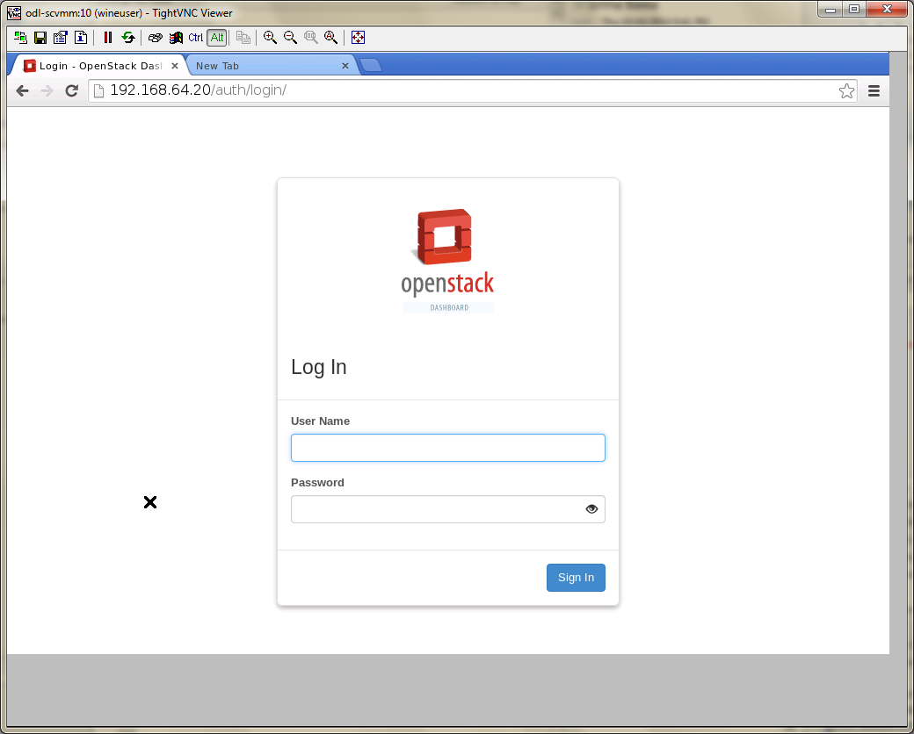

   Horizon GUI

Enter the value for User Name as admin and enter the value for Password
as labstack.

-  We should first ensure both the hypervisors(control node and compute
   node) are mapped under hypervisors by clicking on Hpervisors tab.

.. figure:: ./images/vtn/Hypervisors.png
   :alt: Hypervisors

   Hypervisors

-  Create a new Network from Horizon GUI.

-  Click on Networks Tab.

-  click on the Create Network button.

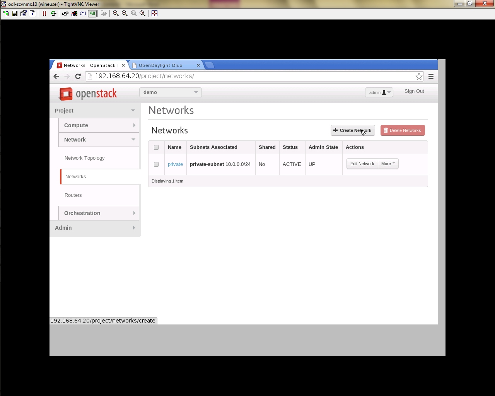

   Create Network

-  A popup screen will appear.

-  Enter network name and click Next button.

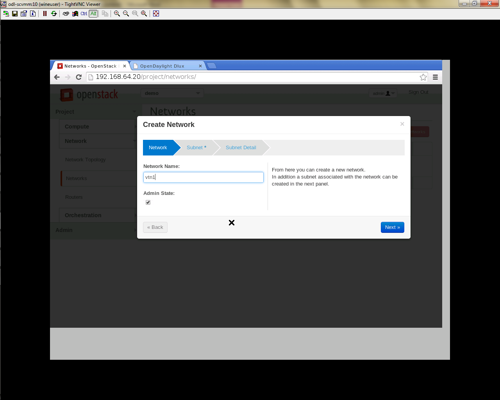

   Step 1

-  Create a sub network by giving Network Address and click Next button
   .

.. figure:: ./images/vtn/Create_Network_Step_2.png
   :alt: Step 2

   Step 2

-  Specify the additional details for subnetwork (please refer the image
   for your reference).

.. figure:: ./images/vtn/Create_Network_Step_3.png
   :alt: Step 3

   Step 3

-  Click Create button

-  Create VM Instance

-  Navigate to Instances tab in the GUI.

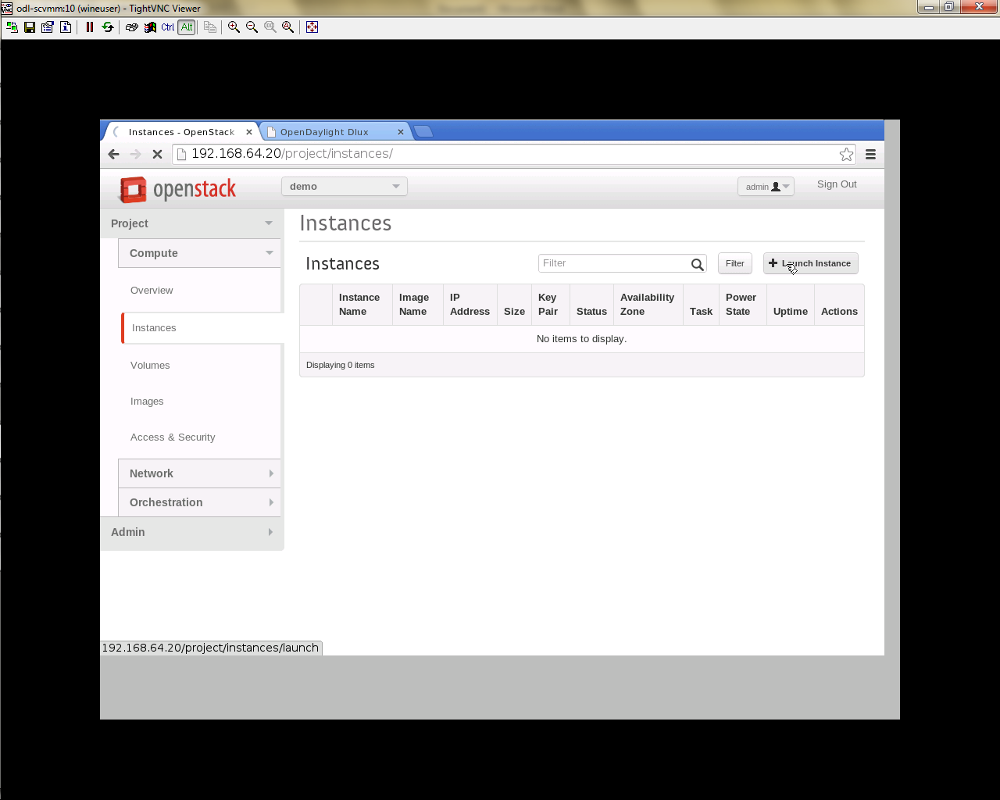

   Instance Creation

-  Click on Launch Instances button.

.. figure:: ./images/vtn/Launch_Instance.png
   :alt: Launch Instance

   Launch Instance

-  Click on Details tab to enter the VM details.For this demo we are
   creating Ten VM’s(instances).

-  In the Networking tab, we must select the network,for this we need to
   drag and drop the Available networks to Selected Networks (i.e.,)
   Drag vtn1 we created from Available networks to Selected Networks and
   click Launch to create the instances.

.. figure:: ./images/vtn/Launch_Instance_network.png
   :alt: Launch Network

   Launch Network

-  Ten VM’s will be created.

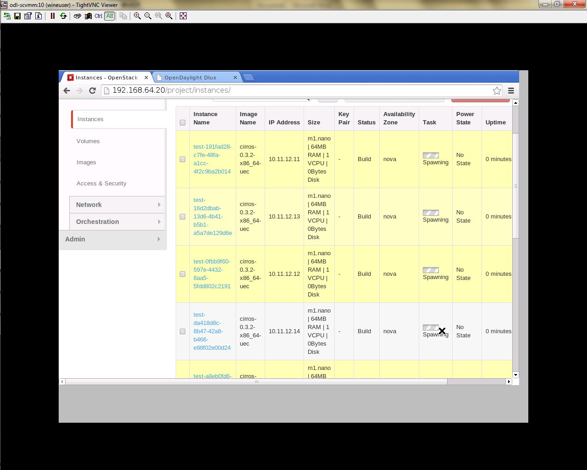

   Load All Instances

-  Click on any VM displayed in the Instances tab and click the Console
   tab.

.. figure:: ./images/vtn/Instance_Console.png
   :alt: Instance Console

   Instance Console

-  Login to the VM console and verify with a ping command.

.. figure:: ./images/vtn/Instance_ping.png
   :alt: Ping

   Ping

Verification of Control and Compute Node after VM creation
^^^^^^^^^^^^^^^^^^^^^^^^^^^^^^^^^^^^^^^^^^^^^^^^^^^^^^^^^^

-  Every time a new VM is created, more interfaces are added to the
   br-int bridge in Open vSwitch.

-  Use *sudo ovs-vsctl show* to list the number of interfaces added.

OpenStack PackStack Installation Steps
~~~~~~~~~~~~~~~~~~~~~~~~~~~~~~~~~~~~~~

-  Please go through the below wiki page for OpenStack PackStack
   installation steps.

   -  https://wiki.opendaylight.org/view/Release/Lithium/VTN/User_Guide/Openstack_Packstack_Support

References
~~~~~~~~~~

-  http://devstack.org/guides/multinode-lab.html

-  https://wiki.opendaylight.org/view/File:Vtn_demo_hackfest_2014_march.pdf

VTN Manager Usage Examples
--------------------------

How to provision virtual L2 Network
~~~~~~~~~~~~~~~~~~~~~~~~~~~~~~~~~~~

Overview
^^^^^^^^

This page explains how to provision virtual L2 network using VTN
Manager. This page targets Boron release, so the procedure described
here does not work in other releases.

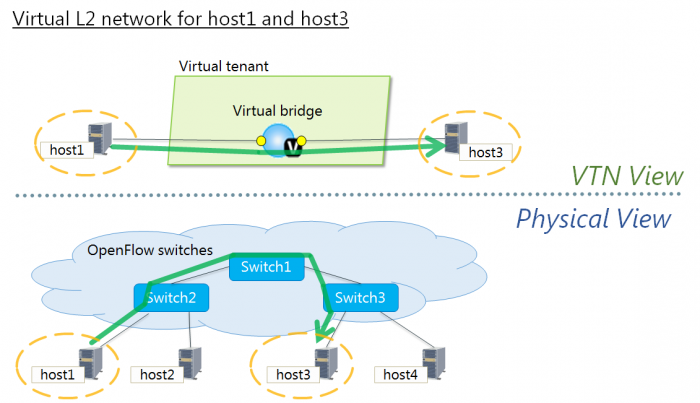

   Virtual L2 network for host1 and host3

Requirements
^^^^^^^^^^^^

Mininet
'''''''

-  To provision OpenFlow switches, this page uses Mininet. Mininet
   details and set-up can be referred at the following page:
   https://wiki.opendaylight.org/view/OpenDaylight_Controller:Installation#Using_Mininet

-  Start Mininet and create three switches(s1, s2, and s3) and four
   hosts(h1, h2, h3, and h4) in it.

::

     mininet@mininet-vm:~$ sudo mn --controller=remote,ip=192.168.0.100 --topo tree,2

.. note::

    Replace "192.168.0.100" with the IP address of OpenDaylight
    controller based on your environment.

-  you can check the topology that you have created by executing "net"
   command in the Mininet console.

::

     mininet> net
     h1 h1-eth0:s2-eth1
     h2 h2-eth0:s2-eth2
     h3 h3-eth0:s3-eth1
     h4 h4-eth0:s3-eth2
     s1 lo:  s1-eth1:s2-eth3 s1-eth2:s3-eth3
     s2 lo:  s2-eth1:h1-eth0 s2-eth2:h2-eth0 s2-eth3:s1-eth1
     s3 lo:  s3-eth1:h3-eth0 s3-eth2:h4-eth0 s3-eth3:s1-eth2

-  In this guide, you will provision the virtual L2 network to establish
   communication between h1 and h3.

Configuration
^^^^^^^^^^^^^

To provision the virtual L2 network for the two hosts (h1 and h3),
execute REST API provided by VTN Manager as follows. It uses curl
command to call the REST API.

-  Create a virtual tenant named vtn1 by executing `the update-vtn
   RPC <https://nexus.opendaylight.org/content/sites/site/org.opendaylight.vtn/boron/manager.model/models/vtn.html#update-vtn>`__.

::

    curl --user "admin":"admin" -H "Content-type: application/json" -X POST http://localhost:8181/restconf/operations/vtn:update-vtn -d '{"input":{"tenant-name":"vtn1"}}'

-  Create a virtual bridge named vbr1 in the tenant vtn1 by executing
   `the update-vbridge
   RPC <https://nexus.opendaylight.org/content/sites/site/org.opendaylight.vtn/boron/manager.model/models/vtn-vbridge.html#update-vbridge>`__.

::

    curl --user "admin":"admin" -H "Content-type: application/json" -X POST http://localhost:8181/restconf/operations/vtn-vbridge:update-vbridge -d '{"input":{"tenant-name":"vtn1", "bridge-name":"vbr1"}}'

-  Create two interfaces into the virtual bridge by executing `the
   update-vinterface
   RPC <https://nexus.opendaylight.org/content/sites/site/org.opendaylight.vtn/boron/manager.model/models/vtn-vinterface.html#update-vinterface>`__.

::

    curl --user "admin":"admin" -H "Content-type: application/json" -X POST http://localhost:8181/restconf/operations/vtn-vinterface:update-vinterface -d '{"input":{"tenant-name":"vtn1", "bridge-name":"vbr1", "interface-name":"if1"}}'

::

    curl --user "admin":"admin" -H "Content-type: application/json" -X POST http://localhost:8181/restconf/operations/vtn-vinterface:update-vinterface -d '{"input":{"tenant-name":"vtn1", "bridge-name":"vbr1", "interface-name":"if2"}}'

-  Configure two mappings on the created interfaces by executing `the
   set-port-map
   RPC <https://nexus.opendaylight.org/content/sites/site/org.opendaylight.vtn/boron/manager.model/models/vtn-port-map.html#set-port-map>`__.

   -  The interface if1 of the virtual bridge will be mapped to the port
      "s2-eth1" of the switch "openflow:2" of the Mininet.

      -  The h1 is connected to the port "s2-eth1".

   -  The interface if2 of the virtual bridge will be mapped to the port
      "s3-eth1" of the switch "openflow:3" of the Mininet.

      -  The h3 is connected to the port "s3-eth1".

::

    curl --user "admin":"admin" -H "Content-type: application/json" -X POST http://localhost:8181/restconf/operations/vtn-port-map:set-port-map -d '{"input":{"tenant-name":"vtn1", "bridge-name":"vbr1", "interface-name":"if1", "node":"openflow:2", "port-name":"s2-eth1"}}'

::

    curl --user "admin":"admin" -H "Content-type: application/json" -X POST http://localhost:8181/restconf/operations/vtn-port-map:set-port-map -d '{"input":{"tenant-name":"vtn1", "bridge-name":"vbr1", "interface-name":"if2", "node":"openflow:3", "port-name":"s3-eth1"}}'

Verification
^^^^^^^^^^^^

-  Please execute ping from h1 to h3 to verify if the virtual L2 network
   for h1 and h3 is provisioned successfully.

::

     mininet> h1 ping h3
     PING 10.0.0.3 (10.0.0.3) 56(84) bytes of data.
     64 bytes from 10.0.0.3: icmp_seq=1 ttl=64 time=243 ms
     64 bytes from 10.0.0.3: icmp_seq=2 ttl=64 time=0.341 ms
     64 bytes from 10.0.0.3: icmp_seq=3 ttl=64 time=0.078 ms
     64 bytes from 10.0.0.3: icmp_seq=4 ttl=64 time=0.079 ms

-  You can also verify the configuration by executing the following REST
   API. It shows all configuration in VTN Manager.

::

    curl --user "admin":"admin" -H "Content-type: application/json" -X GET http://localhost:8181/restconf/operational/vtn:vtns/

-  The result of the command should be like this.

::

    {
      "vtns": {
        "vtn": [
        {
          "name": "vtn1",
            "vtenant-config": {
              "idle-timeout": 300,
              "hard-timeout": 0
            },
            "vbridge": [
            {
              "name": "vbr1",
              "bridge-status": {
                "state": "UP",
                "path-faults": 0
              },
              "vbridge-config": {
                "age-interval": 600
              },
              "vinterface": [
              {
                "name": "if2",
                "vinterface-status": {
                  "entity-state": "UP",
                  "state": "UP",
                  "mapped-port": "openflow:3:3"
                },
                "vinterface-config": {
                  "enabled": true
                },
                "port-map-config": {
                  "vlan-id": 0,
                  "port-name": "s3-eth1",
                  "node": "openflow:3"
                }
              },
              {
                "name": "if1",
                "vinterface-status": {
                  "entity-state": "UP",
                  "state": "UP",
                  "mapped-port": "openflow:2:1"
                },
                "vinterface-config": {
                  "enabled": true
                },
                "port-map-config": {
                  "vlan-id": 0,
                  "port-name": "s2-eth1",
                  "node": "openflow:2"
                }
              }
              ]
            }
          ]
        }
        ]
      }
    }

Cleaning Up
^^^^^^^^^^^

-  You can delete the virtual tenant vtn1 by executing `the remove-vtn
   RPC <https://nexus.opendaylight.org/content/sites/site/org.opendaylight.vtn/boron/manager.model/models/vtn.html#remove-vtn>`__.

::

    curl --user "admin":"admin" -H "Content-type: application/json" -X POST http://localhost:8181/restconf/operations/vtn:remove-vtn -d '{"input":{"tenant-name":"vtn1"}}'

How To Test Vlan-Map In Mininet Environment
~~~~~~~~~~~~~~~~~~~~~~~~~~~~~~~~~~~~~~~~~~~

Overview
^^^^^^^^

This page explains how to test Vlan-map in a multi host scenario using
mininet. This page targets Boron release, so the procedure described
here does not work in other releases.

.. figure:: ./images/vtn/vlanmap_using_mininet.png
   :alt: Example that demonstrates vlanmap testing in Mininet Environment

   Example that demonstrates vlanmap testing in Mininet Environment

Requirements
^^^^^^^^^^^^

Save the mininet script given below as vlan\_vtn\_test.py and run the
mininet script in the mininet environment where Mininet is installed.

Mininet Script
^^^^^^^^^^^^^^

https://wiki.opendaylight.org/view/OpenDaylight_Virtual_Tenant_Network_(VTN):Scripts:Mininet#Network_with_hosts_in_different_vlan

-  Run the mininet script

::

    sudo mn --controller=remote,ip=192.168.64.13 --custom vlan_vtn_test.py --topo mytopo

.. note::

    Replace "192.168.64.13" with the IP address of OpenDaylight
    controller based on your environment.

-  You can check the topology that you have created by executing "net"
   command in the Mininet console.

::

     mininet> net
     h1 h1-eth0.200:s1-eth1
     h2 h2-eth0.300:s2-eth2
     h3 h3-eth0.200:s2-eth3
     h4 h4-eth0.300:s2-eth4
     h5 h5-eth0.200:s3-eth2
     h6 h6-eth0.300:s3-eth3
     s1 lo:  s1-eth1:h1-eth0.200 s1-eth2:s2-eth1 s1-eth3:s3-eth1
     s2 lo:  s2-eth1:s1-eth2 s2-eth2:h2-eth0.300 s2-eth3:h3-eth0.200 s2-eth4:h4-eth0.300
     s3 lo:  s3-eth1:s1-eth3 s3-eth2:h5-eth0.200 s3-eth3:h6-eth0.300
     c0

Configuration
^^^^^^^^^^^^^

To test vlan-map, execute REST API provided by VTN Manager as follows.

-  Create a virtual tenant named vtn1 by executing `the update-vtn
   RPC <https://nexus.opendaylight.org/content/sites/site/org.opendaylight.vtn/boron/manager.model/models/vtn.html#update-vtn>`__.

::

    curl --user "admin":"admin" -H "Content-type: application/json" -X POST http://localhost:8181/restconf/operations/vtn:update-vtn -d '{"input":{"tenant-name":"vtn1"}}'

-  Create a virtual bridge named vbr1 in the tenant vtn1 by executing
   `the update-vbridge
   RPC <https://nexus.opendaylight.org/content/sites/site/org.opendaylight.vtn/boron/manager.model/models/vtn-vbridge.html#update-vbridge>`__.

::

    curl --user "admin":"admin" -H "Content-type: application/json" -X POST http://localhost:8181/restconf/operations/vtn-vbridge:update-vbridge -d '{"input":{"tenant-name":"vtn1","bridge-name":"vbr1"}}'

-  Configure a vlan map with vlanid 200 for vBridge vbr1 by executing
   `the add-vlan-map
   RPC <https://nexus.opendaylight.org/content/sites/site/org.opendaylight.vtn/boron/manager.model/models/vtn-vlan-map.html#add-vlan-map>`__.

::

    curl --user "admin":"admin" -H "Content-type: application/json" -X POST http://localhost:8181/restconf/operations/vtn-vlan-map:add-vlan-map -d '{"input":{"vlan-id":200,"tenant-name":"vtn1","bridge-name":"vbr1"}}'

-  Create a virtual bridge named vbr2 in the tenant vtn1 by executing
   `the update-vbridge
   RPC <https://nexus.opendaylight.org/content/sites/site/org.opendaylight.vtn/boron/manager.model/models/vtn-vbridge.html#update-vbridge>`__.

::

    curl --user "admin":"admin" -H "Content-type: application/json" -X POST http://localhost:8181/restconf/operations/vtn-vbridge:update-vbridge -d '{"input":{"tenant-name":"vtn1","bridge-name":"vbr2"}}'

-  Configure a vlan map with vlanid 300 for vBridge vbr2 by executing
   `the add-vlan-map
   RPC <https://nexus.opendaylight.org/content/sites/site/org.opendaylight.vtn/boron/manager.model/models/vtn-vlan-map.html#add-vlan-map>`__.

::

    curl --user "admin":"admin" -H "Content-type: application/json" -X POST http://localhost:8181/restconf/operations/vtn-vlan-map:add-vlan-map -d '{"input":{"vlan-id":300,"tenant-name":"vtn1","bridge-name":"vbr2"}}'

Verification
^^^^^^^^^^^^

-  Please execute pingall in mininet environment to view the host
   reachability.

::

     mininet> pingall
     Ping: testing ping reachability
     h1 -> X h3 X h5 X
     h2 -> X X h4 X h6
     h3 -> h1 X X h5 X
     h4 -> X h2 X X h6
     h5 -> h1 X h3 X X
     h6 -> X h2 X h4 X

-  You can also verify the configuration by executing the following REST
   API. It shows all configurations in VTN Manager.

::

    curl --user "admin":"admin" -H "Content-type: application/json" -X GET http://localhost:8181/restconf/operational/vtn:vtns

-  The result of the command should be like this.

::

    {
      "vtns": {
        "vtn": [
        {
          "name": "vtn1",
            "vtenant-config": {
              "hard-timeout": 0,
              "idle-timeout": 300,
              "description": "creating vtn"
            },
            "vbridge": [
            {
              "name": "vbr2",
              "vbridge-config": {
                "age-interval": 600,
                "description": "creating vbr2"
              },
              "bridge-status": {
                "state": "UP",
                "path-faults": 0
              },
              "vlan-map": [
              {
                "map-id": "ANY.300",
                "vlan-map-config": {
                  "vlan-id": 300
                },
                "vlan-map-status": {
                  "active": true
                }
              }
              ]
            },
            {
              "name": "vbr1",
              "vbridge-config": {
                "age-interval": 600,
                "description": "creating vbr1"
              },
              "bridge-status": {
                "state": "UP",
                "path-faults": 0
              },
              "vlan-map": [
              {
                "map-id": "ANY.200",
                "vlan-map-config": {
                  "vlan-id": 200
                },
                "vlan-map-status": {
                  "active": true
                }
              }
              ]
            }
          ]
        }
        ]
      }
    }

Cleaning Up
^^^^^^^^^^^

-  You can delete the virtual tenant vtn1 by executing `the remove-vtn
   RPC <https://nexus.opendaylight.org/content/sites/site/org.opendaylight.vtn/boron/manager.model/models/vtn.html#remove-vtn>`__.

::

    curl --user "admin":"admin" -H "Content-type: application/json" -X POST http://localhost:8181/restconf/operations/vtn:remove-vtn -d '{"input":{"tenant-name":"vtn1"}}'

How To Configure Service Function Chaining using VTN Manager
~~~~~~~~~~~~~~~~~~~~~~~~~~~~~~~~~~~~~~~~~~~~~~~~~~~~~~~~~~~~

Overview
^^^^^^^^

This page explains how to configure VTN Manager for Service Chaining.
This page targets Boron release, so the procedure described here
does not work in other releases.

.. figure:: ./images/vtn/Service_Chaining_With_One_Service.png
   :alt: Service Chaining With One Service

   Service Chaining With One Service

Requirements
^^^^^^^^^^^^

-  Please refer to the `Installation
   Pages <https://wiki.opendaylight.org/view/VTN:Boron:Installation_Guide>`__
   to run ODL with VTN Feature enabled.

-  Please ensure Bridge-Utils package is installed in mininet
   environment before running the mininet script.

-  To install Bridge-Utils package run sudo apt-get install bridge-utils
   (assuming Ubuntu is used to run mininet, If not then this is not
   required).

-  Save the mininet script given below as topo\_handson.py and run the
   mininet script in the mininet environment where Mininet is installed.

Mininet Script
^^^^^^^^^^^^^^

-  `Script for emulating network with multiple
   hosts <https://wiki.opendaylight.org/view/OpenDaylight_Virtual_Tenant_Network_(VTN):Scripts:Mininet>`__.

-  Before executing the mininet script, please confirm Controller is up
   and running.

-  Run the mininet script.

-  Replace <path> and <Controller IP> based on your environment

::

    sudo mn --controller=remote,ip=<Controller IP> --custom <path>\topo_handson.py --topo mytopo2

::

     mininet> net
     h11 h11-eth0:s1-eth1
     h12 h12-eth0:s1-eth2
     h21 h21-eth0:s2-eth1
     h22 h22-eth0:s2-eth2
     h23 h23-eth0:s2-eth3
     srvc1 srvc1-eth0:s3-eth3 srvc1-eth1:s4-eth3
     srvc2 srvc2-eth0:s3-eth4 srvc2-eth1:s4-eth4
     s1 lo:  s1-eth1:h11-eth0 s1-eth2:h12-eth0 s1-eth3:s2-eth4 s1-eth4:s3-eth2
     s2 lo:  s2-eth1:h21-eth0 s2-eth2:h22-eth0 s2-eth3:h23-eth0 s2-eth4:s1-eth3 s2-eth5:s4-eth1
     s3 lo:  s3-eth1:s4-eth2 s3-eth2:s1-eth4 s3-eth3:srvc1-eth0 s3-eth4:srvc2-eth0
     s4 lo:  s4-eth1:s2-eth5 s4-eth2:s3-eth1 s4-eth3:srvc1-eth1 s4-eth4:srvc2-eth1

Configurations
^^^^^^^^^^^^^^

Mininet
'''''''

-  Please follow the below steps to configure the network in mininet as
   in the below image:

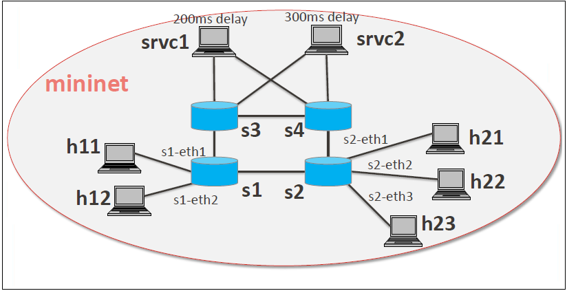

   Mininet Configuration

Configure service nodes
'''''''''''''''''''''''

-  Please execute the following commands in the mininet console where
   mininet script is executed.

::

     mininet> srvc1 ip addr del 10.0.0.6/8 dev srvc1-eth0
     mininet> srvc1 brctl addbr br0
     mininet> srvc1 brctl addif br0 srvc1-eth0
     mininet> srvc1 brctl addif br0 srvc1-eth1
     mininet> srvc1 ifconfig br0 up
     mininet> srvc1 tc qdisc add dev srvc1-eth1 root netem delay 200ms
     mininet> srvc2 ip addr del 10.0.0.7/8 dev srvc2-eth0
     mininet> srvc2 brctl addbr br0
     mininet> srvc2 brctl addif br0 srvc2-eth0
     mininet> srvc2 brctl addif br0 srvc2-eth1
     mininet> srvc2 ifconfig br0 up
     mininet> srvc2 tc qdisc add dev srvc2-eth1 root netem delay 300ms

Controller
^^^^^^^^^^

Multi-Tenancy
'''''''''''''

-  Please execute the below commands to configure the network topology
   in the controller as in the below image:

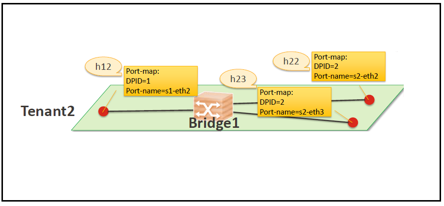

   Tenant2

Please execute the below commands in controller
'''''''''''''''''''''''''''''''''''''''''''''''

.. note::

    The below commands are for the difference in behavior of Manager in
    Boron topology. The Link below has the details for this bug:
    https://bugs.opendaylight.org/show_bug.cgi?id=3818.

::

    curl --user admin:admin -H 'content-type: application/json' -H 'ipaddr:127.0.0.1' -X PUT http://localhost:8181/restconf/config/vtn-static-topology:vtn-static-topology/static-edge-ports -d '{"static-edge-ports": {"static-edge-port": [ {"port": "openflow:3:3"}, {"port": "openflow:3:4"}, {"port": "openflow:4:3"}, {"port": "openflow:4:4"}]}}'

-  Create a virtual tenant named vtn1 by executing `the update-vtn
   RPC <https://nexus.opendaylight.org/content/sites/site/org.opendaylight.vtn/boron/manager.model/models/vtn.html#update-vtn>`__.

::

    curl --user "admin":"admin" -H "Content-type: application/json" -X POST http://localhost:8181/restconf/operations/vtn:update-vtn -d '{"input":{"tenant-name":"vtn1","update-mode":"CREATE","operation":"SET","description":"creating vtn","idle-timeout":300,"hard-timeout":0}}'

-  Create a virtual bridge named vbr1 in the tenant vtn1 by executing
   `the update-vbridge
   RPC <https://nexus.opendaylight.org/content/sites/site/org.opendaylight.vtn/boron/manager.model/models/vtn-vbridge.html#update-vbridge>`__.

::

    curl --user "admin":"admin" -H "Content-type: application/json" -X POST http://localhost:8181/restconf/operations/vtn-vbridge:update-vbridge -d '{"input":{"update-mode":"CREATE","operation":"SET","description":"creating vbr","tenant-name":"vtn1","bridge-name":"vbr1"}}'

-  Create interface if1 into the virtual bridge vbr1 by executing `the
   update-vinterface
   RPC <https://nexus.opendaylight.org/content/sites/site/org.opendaylight.vtn/boron/manager.model/models/vtn-vinterface.html#update-vinterface>`__.

::

    curl --user "admin":"admin" -H "Content-type: application/json" -X POST http://localhost:8181/restconf/operations/vtn-vinterface:update-vinterface -d '{"input":{"update-mode":"CREATE","operation":"SET","description":"Creating vbrif1 interface","tenant-name":"vtn1","bridge-name":"vbr1","interface-name":"if1"}}'

-  Configure port mapping on the interface by executing `the
   set-port-map
   RPC <https://nexus.opendaylight.org/content/sites/site/org.opendaylight.vtn/boron/manager.model/models/vtn-port-map.html#set-port-map>`__.

   -  The interface if1 of the virtual bridge will be mapped to the port
      "s1-eth2" of the switch "openflow:1" of the Mininet.

      -  The h12 is connected to the port "s1-eth2".

::

    curl --user "admin":"admin" -H "Content-type: application/json" -X POST http://localhost:8181/restconf/operations/vtn-port-map:set-port-map -d '{"input":{"vlan-id":0,"tenant-name":"vtn1","bridge-name":"vbr1","interface-name":"if1","node":"openflow:1","port-name":"s1-eth2"}}'

-  Create interface if2 into the virtual bridge vbr1 by executing `the
   update-vinterface
   RPC <https://nexus.opendaylight.org/content/sites/site/org.opendaylight.vtn/boron/manager.model/models/vtn-vinterface.html#update-vinterface>`__.

::

    curl --user "admin":"admin" -H "Content-type: application/json" -X POST http://localhost:8181/restconf/operations/vtn-vinterface:update-vinterface -d '{"input":{"update-mode":"CREATE","operation":"SET","description":"Creating vbrif2 interface","tenant-name":"vtn1","bridge-name":"vbr1","interface-name":"if2"}}'

-  Configure port mapping on the interface by executing `the
   set-port-map
   RPC <https://nexus.opendaylight.org/content/sites/site/org.opendaylight.vtn/boron/manager.model/models/vtn-port-map.html#set-port-map>`__.

   -  The interface if2 of the virtual bridge will be mapped to the port
      "s2-eth2" of the switch "openflow:2" of the Mininet.

      -  The h22 is connected to the port "s2-eth2".

::

    curl --user "admin":"admin" -H "Content-type: application/json" -X POST http://localhost:8181/restconf/operations/vtn-port-map:set-port-map -d '{"input":{"vlan-id":0,"tenant-name":"vtn1","bridge-name":"vbr1","interface-name":"if2","node":"openflow:2","port-name":"s2-eth2"}}'

-  Create interface if3 into the virtual bridge vbr1 by executing `the
   update-vinterface
   RPC <https://nexus.opendaylight.org/content/sites/site/org.opendaylight.vtn/boron/manager.model/models/vtn-vinterface.html#update-vinterface>`__.

::

    curl --user "admin":"admin" -H "Content-type: application/json" -X POST http://localhost:8181/restconf/operations/vtn-vinterface:update-vinterface -d '{"input":{"update-mode":"CREATE","operation":"SET","description":"Creating vbrif3 interface","tenant-name":"vtn1","bridge-name":"vbr1","interface-name":"if3"}}'

-  Configure port mapping on the interfaces by executing `the
   set-port-map
   RPC <https://nexus.opendaylight.org/content/sites/site/org.opendaylight.vtn/boron/manager.model/models/vtn-port-map.html#set-port-map>`__.

   -  The interface if3 of the virtual bridge will be mapped to the port
      "s2-eth3" of the switch "openflow:2" of the Mininet.

      -  The h23 is connected to the port "s2-eth3".

::

    curl --user "admin":"admin" -H "Content-type: application/json" -X POST http://localhost:8181/restconf/operations/vtn-port-map:set-port-map -d '{"input":{"vlan-id":0,"tenant-name":"vtn1","bridge-name":"vbr1","interface-name":"if3","node":"openflow:2","port-name":"s2-eth3"}}'

Traffic filtering
^^^^^^^^^^^^^^^^^

-  Create flowcondition named cond\_1 by executing `the
   set-flow-condition
   RPC <https://nexus.opendaylight.org/content/sites/site/org.opendaylight.vtn/boron/manager.model/models/vtn-flow-condition.html#set-flow-condition>`__.

   -  For option source and destination-network, get inet address of
      host h12(src) and h22(dst) from mininet.

::

    curl --user "admin":"admin" -H "Content-type: application/json" -X POST http://localhost:8181/restconf/operations/vtn-flow-condition:set-flow-condition -d '{"input":{"operation":"SET","present":"false","name":"cond_1","vtn-flow-match":[{"index":1,"vtn-ether-match":{},"vtn-inet-match":{"source-network":"10.0.0.2/32","destination-network":"10.0.0.4/32"}}]}}'

-  Flow filter demonstration with DROP action-type. Create Flowfilter in
   VBR Interface if1 by executing `the set-flow-filter
   RPC <https://nexus.opendaylight.org/content/sites/site/org.opendaylight.vtn/boron/manager.model/models/vtn-flow-filter.html#set-flow-filter>`__.

::

    curl --user "admin":"admin" -H "Content-type: application/json" -X POST http://localhost:8181/restconf/operations/vtn-flow-filter:set-flow-filter -d '{"input":{"output":"false","tenant-name":"vtn1","bridge-name":"vbr1","interface-name":"if1","vtn-flow-filter":[{"condition":"cond_1","index":10,"vtn-drop-filter":{}}]}}'

Service Chaining
^^^^^^^^^^^^^^^^

With One Service
''''''''''''''''

-  Please execute the below commands to configure the network topology
   which sends some specific traffic via a single service(External
   device) in the controller as in the below image:

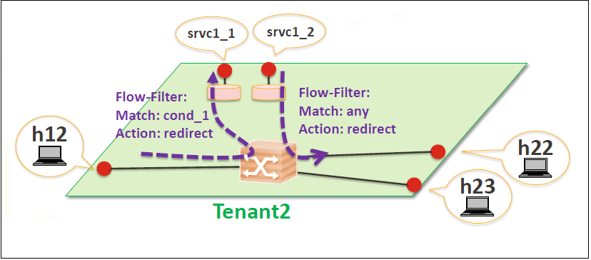

   Service Chaining With One Service LLD

-  Create a virtual terminal named vt\_srvc1\_1 in the tenant vtn1 by
   executing `the update-vterminal
   RPC <https://nexus.opendaylight.org/content/sites/site/org.opendaylight.vtn/boron/manager.model/models/vtn-vterminal.html#update-vterminal>`__.

::

    curl --user "admin":"admin" -H "Content-type: application/json" -X POST http://localhost:8181/restconf/operations/vtn-vterminal:update-vterminal -d '{"input":{"update-mode":"CREATE","operation":"SET","tenant-name":"vtn1","terminal-name":"vt_srvc1_1","description":"Creating vterminal"}}'

-  Create interface IF into the virtual terminal vt\_srvc1\_1 by
   executing `the update-vinterface
   RPC <https://nexus.opendaylight.org/content/sites/site/org.opendaylight.vtn/boron/manager.model/models/vtn-vinterface.html#update-vinterface>`__.

::

    curl --user "admin":"admin" -H "Content-type: application/json" -X POST http://localhost:8181/restconf/operations/vtn-vinterface:update-vinterface -d '{"input":{"update-mode":"CREATE","operation":"SET","description":"Creating vterminal IF","enabled":"true","tenant-name":"vtn1","terminal-name":"vt_srvc1_1","interface-name":"IF"}}'

-  Configure port mapping on the interfaces by executing `the
   set-port-map
   RPC <https://nexus.opendaylight.org/content/sites/site/org.opendaylight.vtn/boron/manager.model/models/vtn-port-map.html#set-port-map>`__.

   -  The interface IF of the virtual terminal will be mapped to the
      port "s3-eth3" of the switch "openflow:3" of the Mininet.

      -  The h12 is connected to the port "s3-eth3".

::

    curl --user "admin":"admin" -H "Content-type: application/json" -X POST http://localhost:8181/restconf/operations/vtn-port-map:set-port-map -d '{"input":{"tenant-name":"vtn1","terminal-name":"vt_srvc1_1","interface-name":"IF","node":"openflow:3","port-name":"s3-eth3"}}'

-  Create a virtual terminal named vt\_srvc1\_2 in the tenant vtn1 by
   executing `the update-vterminal
   RPC <https://nexus.opendaylight.org/content/sites/site/org.opendaylight.vtn/boron/manager.model/models/vtn-vterminal.html#update-vterminal>`__.

::

    curl --user "admin":"admin" -H "Content-type: application/json" -X POST http://localhost:8181/restconf/operations/vtn-vterminal:update-vterminal -d '{"input":{"update-mode":"CREATE","operation":"SET","tenant-name":"vtn1","terminal-name":"vt_srvc1_2","description":"Creating vterminal"}}'

-  Create interface IF into the virtual terminal vt\_srvc1\_2 by
   executing `the update-vinterface
   RPC <https://nexus.opendaylight.org/content/sites/site/org.opendaylight.vtn/boron/manager.model/models/vtn-vinterface.html#update-vinterface>`__.

::

    curl --user "admin":"admin" -H "Content-type: application/json" -X POST http://localhost:8181/restconf/operations/vtn-vinterface:update-vinterface -d '{"input":{"update-mode":"CREATE","operation":"SET","description":"Creating vterminal IF","enabled":"true","tenant-name":"vtn1","terminal-name":"vt_srvc1_2","interface-name":"IF"}}'

-  Configure port mapping on the interfaces by executing `the
   set-port-map
   RPC <https://nexus.opendaylight.org/content/sites/site/org.opendaylight.vtn/boron/manager.model/models/vtn-port-map.html#set-port-map>`__.

   -  The interface IF of the virtual terminal will be mapped to the
      port "s4-eth3" of the switch "openflow:4" of the Mininet.

      -  The h22 is connected to the port "s4-eth3".

::

    curl --user "admin":"admin" -H "Content-type: application/json" -X POST http://localhost:8181/restconf/operations/vtn-port-map:set-port-map -d '{"input":{"tenant-name":"vtn1","terminal-name":"vt_srvc1_2","interface-name":"IF","node":"openflow:4","port-name":"s4-eth3"}}'

-  Create flowcondition named cond\_1 by executing `the
   set-flow-condition
   RPC <https://nexus.opendaylight.org/content/sites/site/org.opendaylight.vtn/boron/manager.model/models/vtn-flow-condition.html#set-flow-condition>`__.

   -  For option source and destination-network, get inet address of
      host h12(src) and h22(dst) from mininet.

::

    curl --user "admin":"admin" -H "Content-type: application/json" -X POST http://localhost:8181/restconf/operations/vtn-flow-condition:set-flow-condition -d '{"input":{"operation":"SET","present":"false","name":"cond_1","vtn-flow-match":[{"index":1,"vtn-ether-match":{},"vtn-inet-match":{"source-network":"10.0.0.2/32","destination-network":"10.0.0.4/32"}}]}}'

-  Create flowcondition named cond\_any by executing `the
   set-flow-condition
   RPC <https://nexus.opendaylight.org/content/sites/site/org.opendaylight.vtn/boron/manager.model/models/vtn-flow-condition.html#set-flow-condition>`__.

::

    curl --user "admin":"admin" -H "Content-type: application/json" -X POST http://localhost:8181/restconf/operations/vtn-flow-condition:set-flow-condition -d '{"input":{"operation":"SET","present":"false","name":"cond_any","vtn-flow-match":[{"index":1}]}}'

-  Flow filter demonstration with redirect action-type. Create
   Flowfilter in virtual terminal vt\_srvc1\_2 interface IF by executing
   `the set-flow-filter
   RPC <https://nexus.opendaylight.org/content/sites/site/org.opendaylight.vtn/boron/manager.model/models/vtn-flow-filter.html#set-flow-filter>`__.

   -  Flowfilter redirects vt\_srvc1\_2 to bridge1-IF2

::

    curl --user "admin":"admin" -H "Content-type: application/json" -X POST http://localhost:8181/restconf/operations/vtn-flow-filter:set-flow-filter -d '{"input":{"output":"false","tenant-name":"vtn1","terminal-name":"vt_srvc1_2","interface-name":"IF","vtn-flow-filter":[{"condition":"cond_any","index":10,"vtn-redirect-filter":{"redirect-destination":{"bridge-name":"vbr1","interface-name":"if2"},"output":"true"}}]}}'

-  Flow filter demonstration with redirect action-type. Create
   Flowfilter in vbridge vbr1 interface if1 by executing `the
   set-flow-filter
   RPC <https://nexus.opendaylight.org/content/sites/site/org.opendaylight.vtn/boron/manager.model/models/vtn-flow-filter.html#set-flow-filter>`__.

   -  Flow filter redirects Bridge1-IF1 to vt\_srvc1\_1

::

    curl --user "admin":"admin" -H "Content-type: application/json" -X POST http://localhost:8181/restconf/operations/vtn-flow-filter:set-flow-filter -d '{"input":{"output":"false","tenant-name":"vtn1","bridge-name":"vbr1","interface-name":"if1","vtn-flow-filter":[{"condition":"cond_1","index":10,"vtn-redirect-filter":{"redirect-destination":{"terminal-name":"vt_srvc1_1","interface-name":"IF"},"output":"true"}}]}}'

Verification
^^^^^^^^^^^^

.. figure:: ./images/vtn/Service_Chaining_With_One_Service_Verification.png
   :alt: Service Chaining With One Service

   Service Chaining With One Service

-  Ping host12 to host22 to view the host rechability, a delay of 200ms
   will be taken to reach host22 as below.

::

     mininet> h12 ping h22
     PING 10.0.0.4 (10.0.0.4) 56(84) bytes of data.
     64 bytes from 10.0.0.4: icmp_seq=35 ttl=64 time=209 ms
     64 bytes from 10.0.0.4: icmp_seq=36 ttl=64 time=201 ms
     64 bytes from 10.0.0.4: icmp_seq=37 ttl=64 time=200 ms
     64 bytes from 10.0.0.4: icmp_seq=38 ttl=64 time=200 ms

With two services
'''''''''''''''''

-  Please execute the below commands to configure the network topology
   which sends some specific traffic via two services(External device)
   in the controller as in the below image.

.. figure:: ./images/vtn/Service_Chaining_With_Two_Services_LLD.png
   :alt: Service Chaining With Two Services LLD

   Service Chaining With Two Services LLD

-  Create a virtual terminal named vt\_srvc2\_1 in the tenant vtn1 by
   executing `the update-vterminal
   RPC <https://nexus.opendaylight.org/content/sites/site/org.opendaylight.vtn/boron/manager.model/models/vtn-vterminal.html#update-vterminal>`__.

::

    curl --user "admin":"admin" -H "Content-type: application/json" -X POST http://localhost:8181/restconf/operations/vtn-vterminal:update-vterminal -d '{"input":{"update-mode":"CREATE","operation":"SET","tenant-name":"vtn1","terminal-name":"vt_srvc2_1","description":"Creating vterminal"}}'

-  Create interface IF into the virtual terminal vt\_srvc2\_1 by
   executing `the update-vinterface
   RPC <https://nexus.opendaylight.org/content/sites/site/org.opendaylight.vtn/boron/manager.model/models/vtn-vinterface.html#update-vinterface>`__.

::

    curl --user "admin":"admin" -H "Content-type: application/json" -X POST http://localhost:8181/restconf/operations/vtn-vinterface:update-vinterface -d '{"input":{"update-mode":"CREATE","operation":"SET","description":"Creating vterminal IF","enabled":"true","tenant-name":"vtn1","terminal-name":"vt_srvc2_1","interface-name":"IF"}}'

-  Configure port mapping on the interfaces by executing `the
   set-port-map
   RPC <https://nexus.opendaylight.org/content/sites/site/org.opendaylight.vtn/boron/manager.model/models/vtn-port-map.html#set-port-map>`__.

   -  The interface IF of the virtual terminal will be mapped to the
      port "s3-eth4" of the switch "openflow:3" of the Mininet.

      -  The host h12 is connected to the port "s3-eth4".

::

    curl --user "admin":"admin" -H "Content-type: application/json" -X POST http://localhost:8181/restconf/operations/vtn-port-map:set-port-map -d '{"input":{"tenant-name":"vtn1","terminal-name":"vt_srvc2_1","interface-name":"IF","node":"openflow:3","port-name":"s3-eth4"}}'

-  Create a virtual terminal named vt\_srvc2\_2 in the tenant vtn1 by
   executing `the update-vterminal
   RPC <https://nexus.opendaylight.org/content/sites/site/org.opendaylight.vtn/boron/manager.model/models/vtn-vterminal.html#update-vterminal>`__.

::

    curl --user "admin":"admin" -H "Content-type: application/json" -X POST http://localhost:8181/restconf/operations/vtn-vterminal:update-vterminal -d '{"input":{"update-mode":"CREATE","operation":"SET","tenant-name":"vtn1","terminal-name":"vt_srvc2_2","description":"Creating vterminal"}}'

-  Create interfaces IF into the virtual terminal vt\_srvc2\_2 by
   executing `the update-vinterface
   RPC <https://nexus.opendaylight.org/content/sites/site/org.opendaylight.vtn/boron/manager.model/models/vtn-vinterface.html#update-vinterface>`__.

::

    curl --user "admin":"admin" -H "Content-type: application/json" -X POST http://localhost:8181/restconf/operations/vtn-vinterface:update-vinterface -d '{"input":{"update-mode":"CREATE","operation":"SET","description":"Creating vterminal IF","enabled":"true","tenant-name":"vtn1","terminal-name":"vt_srvc2_2","interface-name":"IF"}}'

-  Configure port mapping on the interfaces by executing `the
   set-port-map
   RPC <https://nexus.opendaylight.org/content/sites/site/org.opendaylight.vtn/boron/manager.model/models/vtn-port-map.html#set-port-map>`__.

   -  The interface IF of the virtual terminal will be mapped to the
      port "s4-eth4" of the switch "openflow:4" of the mininet.

      -  The host h22 is connected to the port "s4-eth4".

::

    curl --user "admin":"admin" -H "Content-type: application/json" -X POST http://localhost:8181/restconf/operations/vtn-port-map:set-port-map -d '{"input":{"tenant-name":"vtn1","terminal-name":"vt_srvc2_2","interface-name":"IF","node":"openflow:4","port-name":"s4-eth4"}}'

-  Flow filter demonstration with redirect action-type. Create
   Flowfilter in virtual terminal vt\_srvc2\_2 interface IF by executing
   `the set-flow-filter
   RPC <https://nexus.opendaylight.org/content/sites/site/org.opendaylight.vtn/boron/manager.model/models/vtn-flow-filter.html#set-flow-filter>`__.

   -  Flow filter redirects vt\_srvc2\_2 to Bridge1-IF2.

::

    curl --user "admin":"admin" -H "Content-type: application/json" -X POST http://localhost:8181/restconf/operations/vtn-flow-filter:set-flow-filter -d '{"input":{"output":"false","tenant-name":"vtn1","terminal-name":"vt_srvc2_2","interface-name":"IF","vtn-flow-filter":[{"condition":"cond_any","index":10,"vtn-redirect-filter":{"redirect-destination":{"bridge-name":"vbr1","interface-name":"if2"},"output":"true"}}]}}'

-  Flow filter demonstration with redirect action-type. Create
   Flowfilter in virtual terminal vt\_srvc2\_2 interface IF by executing
   `the set-flow-filter
   RPC <https://nexus.opendaylight.org/content/sites/site/org.opendaylight.vtn/boron/manager.model/models/vtn-flow-filter.html#set-flow-filter>`__.

   -  Flow filter redirects vt\_srvc1\_2 to vt\_srvc2\_1.

::

    curl --user "admin":"admin" -H "Content-type: application/json" -X POST http://localhost:8181/restconf/operations/vtn-flow-filter:set-flow-filter -d '{"input":{"output":"false","tenant-name":"vtn1","terminal-name":"vt_srvc1_2","interface-name":"IF","vtn-flow-filter":[{"condition":"cond_any","index":10,"vtn-redirect-filter":{"redirect-destination":{"terminal-name":"vt_srvc2_1","interface-name":"IF"},"output":"true"}}]}}'

Verification
^^^^^^^^^^^^

.. figure:: ./images/vtn/Service_Chaining_With_Two_Services.png
   :alt: Service Chaining With Two Service

   Service Chaining With Two Service

-  Ping host12 to host22 to view the host rechability, a delay of 500ms
   will be taken to reach host22 as below.

::

     mininet> h12 ping h22
     PING 10.0.0.4 (10.0.0.4) 56(84) bytes of data.
     64 bytes from 10.0.0.4: icmp_seq=1 ttl=64 time=512 ms
     64 bytes from 10.0.0.4: icmp_seq=2 ttl=64 time=501 ms
     64 bytes from 10.0.0.4: icmp_seq=3 ttl=64 time=500 ms
     64 bytes from 10.0.0.4: icmp_seq=4 ttl=64 time=500 ms

-  You can verify the configuration by executing the following REST API.
   It shows all configuration in VTN Manager.

::

    curl --user "admin":"admin" -H "Content-type: application/json" -X GET http://localhost:8181/restconf/operational/vtn:vtns

::

    {
      "vtn": [
      {
        "name": "vtn1",
          "vtenant-config": {
            "hard-timeout": 0,
            "idle-timeout": 300,
            "description": "creating vtn"
          },
          "vbridge": [
          {
            "name": "vbr1",
            "vbridge-config": {
              "age-interval": 600,
              "description": "creating vbr"
            },
            "bridge-status": {
              "state": "UP",
              "path-faults": 0
            },
            "vinterface": [
            {
              "name": "if1",
              "vinterface-status": {
                "mapped-port": "openflow:1:2",
                "state": "UP",
                "entity-state": "UP"
              },
              "port-map-config": {
                "vlan-id": 0,
                "node": "openflow:1",
                "port-name": "s1-eth2"
              },
              "vinterface-config": {
                "description": "Creating vbrif1 interface",
                "enabled": true
              },
              "vinterface-input-filter": {
                "vtn-flow-filter": [
                {
                  "index": 10,
                  "condition": "cond_1",
                  "vtn-redirect-filter": {
                    "output": true,
                    "redirect-destination": {
                      "terminal-name": "vt_srvc1_1",
                      "interface-name": "IF"
                    }
                  }
                }
                ]
              }
            },
            {
              "name": "if2",
              "vinterface-status": {
                "mapped-port": "openflow:2:2",
                "state": "UP",
                "entity-state": "UP"
              },
              "port-map-config": {
                "vlan-id": 0,
                "node": "openflow:2",
                "port-name": "s2-eth2"
              },
              "vinterface-config": {
                "description": "Creating vbrif2 interface",
                "enabled": true
              }
            },
            {
              "name": "if3",
              "vinterface-status": {
                "mapped-port": "openflow:2:3",
                "state": "UP",
                "entity-state": "UP"
              },
              "port-map-config": {
                "vlan-id": 0,
                "node": "openflow:2",
                "port-name": "s2-eth3"
              },
              "vinterface-config": {
                "description": "Creating vbrif3 interface",
                "enabled": true
              }
            }
            ]
          }
        ],
          "vterminal": [
          {
            "name": "vt_srvc2_2",
            "bridge-status": {
              "state": "UP",
              "path-faults": 0
            },
            "vinterface": [
            {
              "name": "IF",
              "vinterface-status": {
                "mapped-port": "openflow:4:4",
                "state": "UP",
                "entity-state": "UP"
              },
              "port-map-config": {
                "vlan-id": 0,
                "node": "openflow:4",
                "port-name": "s4-eth4"
              },
              "vinterface-config": {
                "description": "Creating vterminal IF",
                "enabled": true
              },
              "vinterface-input-filter": {
                "vtn-flow-filter": [
                {
                  "index": 10,
                  "condition": "cond_any",
                  "vtn-redirect-filter": {
                    "output": true,
                    "redirect-destination": {
                      "bridge-name": "vbr1",
                      "interface-name": "if2"
                    }
                  }
                }
                ]
              }
            }
            ],
              "vterminal-config": {
                "description": "Creating vterminal"
              }
          },
          {
            "name": "vt_srvc1_1",
            "bridge-status": {
              "state": "UP",
              "path-faults": 0
            },
            "vinterface": [
            {
              "name": "IF",
              "vinterface-status": {
                "mapped-port": "openflow:3:3",
                "state": "UP",
                "entity-state": "UP"
              },
              "port-map-config": {
                "vlan-id": 0,
                "node": "openflow:3",
                "port-name": "s3-eth3"
              },
              "vinterface-config": {
                "description": "Creating vterminal IF",
                "enabled": true
              }
            }
            ],
              "vterminal-config": {
                "description": "Creating vterminal"
              }
          },
          {
            "name": "vt_srvc1_2",
            "bridge-status": {
              "state": "UP",
              "path-faults": 0
            },
            "vinterface": [
            {
              "name": "IF",
              "vinterface-status": {
                "mapped-port": "openflow:4:3",
                "state": "UP",
                "entity-state": "UP"
              },
              "port-map-config": {
                "vlan-id": 0,
                "node": "openflow:4",
                "port-name": "s4-eth3"
              },
              "vinterface-config": {
                "description": "Creating vterminal IF",
                "enabled": true
              },
              "vinterface-input-filter": {
                "vtn-flow-filter": [
                {
                  "index": 10,
                  "condition": "cond_any",
                  "vtn-redirect-filter": {
                    "output": true,
                    "redirect-destination": {
                      "terminal-name": "vt_srvc2_1",
                      "interface-name": "IF"
                    }
                  }
                }
                ]
              }
            }
            ],
              "vterminal-config": {
                "description": "Creating vterminal"
              }
          },
          {
            "name": "vt_srvc2_1",
            "bridge-status": {
              "state": "UP",
              "path-faults": 0
            },
            "vinterface": [
            {
              "name": "IF",
              "vinterface-status": {
                "mapped-port": "openflow:3:4",
                "state": "UP",
                "entity-state": "UP"
              },
              "port-map-config": {
                "vlan-id": 0,
                "node": "openflow:3",
                "port-name": "s3-eth4"
              },
              "vinterface-config": {
                "description": "Creating vterminal IF",
                "enabled": true
              }
            }
            ],
              "vterminal-config": {
                "description": "Creating vterminal"
              }
          }
        ]
      }
      ]
    }

Cleaning Up
^^^^^^^^^^^

-  To clean up both VTN and flowconditions.

-  You can delete the virtual tenant vtn1 by executing `the remove-vtn
   RPC <https://nexus.opendaylight.org/content/sites/site/org.opendaylight.vtn/boron/manager.model/models/vtn.html#remove-vtn>`__.

::

    curl --user "admin":"admin" -H "Content-type: application/json" -X POST http://localhost:8181/restconf/operations/vtn:remove-vtn -d '{"input":{"tenant-name":"vtn1"}}'

-  You can delete the flowcondition cond\_1 and cond\_any by executing
   `the remove-flow-condition
   RPC <https://nexus.opendaylight.org/content/sites/site/org.opendaylight.vtn/boron/manager.model/models/vtn-flow-condition.html#remove-flow-condition>`__.

::

    curl --user "admin":"admin" -H "Content-type: application/json" -X POST http://localhost:8181/restconf/operations/vtn-flow-condition:remove-flow-condition -d '{"input":{"name":"cond_1"}}'

::

    curl --user "admin":"admin" -H "Content-type: application/json" -X POST http://localhost:8181/restconf/operations/vtn-flow-condition:remove-flow-condition -d '{"input":{"name":"cond_any"}}'

How To View Dataflows
~~~~~~~~~~~~~~~~~~~~~

Overview
^^^^^^^^

This page explains how to view Dataflows using VTN Manager. This page
targets Boron release, so the procedure described here does not work
in other releases.

Dataflow feature enables retrieval and display of data flows in the
OpenFlow network. The data flows can be retrieved based on an OpenFlow
switch or a switch port or a L2 source host.

The flow information provided by this feature are

-  Location of virtual node which maps the incoming packet and outgoing
   packets.

-  Location of physical switch port where incoming and outgoing packets
   is sent and received.

-  A sequence of physical route info which represents the packet route
   in the physical network.

Configuration
^^^^^^^^^^^^^

-  To view Dataflow information, configure with VLAN Mapping
   https://wiki.opendaylight.org/view/VTN:Mananger:How_to_test_Vlan-map_using_mininet.

Verification
^^^^^^^^^^^^

After creating vlan mapping configuration from the above page, execute
as below in mininet to get switch details.

::

     mininet> net
     h1 h1-eth0.200:s1-eth1
     h2 h2-eth0.300:s2-eth2
     h3 h3-eth0.200:s2-eth3
     h4 h4-eth0.300:s2-eth4
     h5 h5-eth0.200:s3-eth2
     h6 h6-eth0.300:s3-eth3
     s1 lo:  s1-eth1:h1-eth0.200 s1-eth2:s2-eth1 s1-eth3:s3-eth1
     s2 lo:  s2-eth1:s1-eth2 s2-eth2:h2-eth0.300 s2-eth3:h3-eth0.200 s2-eth4:h4-eth0.300
     s3 lo:  s3-eth1:s1-eth3 s3-eth2:h5-eth0.200 s3-eth3:h6-eth0.300
     c0
     mininet>

Please execute ping from h1 to h3 to check hosts reachability.

::

     mininet> h1 ping h3
     PING 10.0.0.3 (10.0.0.3) 56(84) bytes of data.
     64 bytes from 10.0.0.3: icmp_seq=1 ttl=64 time=11.4 ms
     64 bytes from 10.0.0.3: icmp_seq=2 ttl=64 time=0.654 ms
     64 bytes from 10.0.0.3: icmp_seq=3 ttl=64 time=0.093 ms

Parallely execute below Restconf command to get data flow information of
node "openflow:1" and its port "s1-eth1".

-  Get the Dataflows information by executing `the get-data-flow
   RPC <https://nexus.opendaylight.org/content/sites/site/org.opendaylight.vtn/boron/manager.model/models/vtn-flow.html#get-data-flow>`__.

::

    curl --user "admin":"admin" -H "Content-type: application/json" -X POST http://localhost:8181/restconf/operations/vtn-flow:get-data-flow -d '{"input":{"tenant-name":"vtn1","mode":"DETAIL","node":"openflow:1","data-flow-port":{"port-id":"1","port-name":"s1-eth1"}}}'

::

    {
      "output": {
        "data-flow-info": [
        {
          "averaged-data-flow-stats": {
            "packet-count": 1.1998800119988002,
              "start-time": 1455241209151,
              "end-time": 1455241219152,
              "byte-count": 117.58824117588242
          },
            "physical-route": [
            {
              "physical-ingress-port": {
                "port-name": "s2-eth3",
                "port-id": "3"
              },
              "physical-egress-port": {
                "port-name": "s2-eth1",
                "port-id": "1"
              },
              "node": "openflow:2",
              "order": 0
            },
            {
              "physical-ingress-port": {
                "port-name": "s1-eth2",
                "port-id": "2"
              },
              "physical-egress-port": {
                "port-name": "s1-eth1",
                "port-id": "1"
              },
              "node": "openflow:1",
              "order": 1
            }
          ],
            "data-egress-node": {
              "bridge-name": "vbr1",
              "tenant-name": "vtn1"
            },
            "hard-timeout": 0,
            "idle-timeout": 300,
            "data-flow-stats": {
              "duration": {
                "nanosecond": 640000000,
                "second": 362
              },
              "packet-count": 134,
              "byte-count": 12932
            },
            "data-egress-port": {
              "node": "openflow:1",
              "port-name": "s1-eth1",
              "port-id": "1"
            },
            "data-ingress-node": {
              "bridge-name": "vbr1",
              "tenant-name": "vtn1"
            },
            "data-ingress-port": {
              "node": "openflow:2",
              "port-name": "s2-eth3",
              "port-id": "3"
            },
            "creation-time": 1455240855753,
            "data-flow-match": {
              "vtn-ether-match": {
                "vlan-id": 200,
                "source-address": "6a:ff:e2:81:86:bb",
                "destination-address": "26:9f:82:70:ec:66"
              }
            },
            "virtual-route": [
            {
              "reason": "VLANMAPPED",
              "virtual-node-path": {
                "bridge-name": "vbr1",
                "tenant-name": "vtn1"
              },
              "order": 0
            },
            {
              "reason": "FORWARDED",
              "virtual-node-path": {
                "bridge-name": "vbr1",
                "tenant-name": "vtn1"
              },
              "order": 1
            }
          ],
            "flow-id": 16
        },
        {
          "averaged-data-flow-stats": {
            "packet-count": 1.1998800119988002,
            "start-time": 1455241209151,
            "end-time": 1455241219152,
            "byte-count": 117.58824117588242
          },
          "physical-route": [
          {
            "physical-ingress-port": {
              "port-name": "s1-eth1",
              "port-id": "1"
            },
            "physical-egress-port": {
              "port-name": "s1-eth2",
              "port-id": "2"
            },
            "node": "openflow:1",
            "order": 0
          },
          {
            "physical-ingress-port": {
              "port-name": "s2-eth1",
              "port-id": "1"
            },
            "physical-egress-port": {
              "port-name": "s2-eth3",
              "port-id": "3"
            },
            "node": "openflow:2",
            "order": 1
          }
          ],
            "data-egress-node": {
              "bridge-name": "vbr1",
              "tenant-name": "vtn1"
            },
            "hard-timeout": 0,
            "idle-timeout": 300,
            "data-flow-stats": {
              "duration": {
                "nanosecond": 587000000,
                "second": 362
              },
              "packet-count": 134,
              "byte-count": 12932
            },
            "data-egress-port": {
              "node": "openflow:2",
              "port-name": "s2-eth3",
              "port-id": "3"
            },
            "data-ingress-node": {
              "bridge-name": "vbr1",
              "tenant-name": "vtn1"
            },
            "data-ingress-port": {
              "node": "openflow:1",
              "port-name": "s1-eth1",
              "port-id": "1"
            },
            "creation-time": 1455240855747,
            "data-flow-match": {
              "vtn-ether-match": {
                "vlan-id": 200,
                "source-address": "26:9f:82:70:ec:66",
                "destination-address": "6a:ff:e2:81:86:bb"
              }
            },
            "virtual-route": [
            {
              "reason": "VLANMAPPED",
              "virtual-node-path": {
                "bridge-name": "vbr1",
                "tenant-name": "vtn1"
              },
              "order": 0
            },
            {
              "reason": "FORWARDED",
              "virtual-node-path": {
                "bridge-name": "vbr1",
                "tenant-name": "vtn1"
              },
              "order": 1
            }
          ],
            "flow-id": 15
        }
        ]
      }
    }

How To Create Mac Map In VTN
~~~~~~~~~~~~~~~~~~~~~~~~~~~~

Overview
^^^^^^^^

-  This page demonstrates Mac Mapping. This demonstration aims at
   enabling communication between two hosts and denying communication of
   particular host by associating a Vbridge to the hosts and configuring
   Mac Mapping (mac address) to the Vbridge.

-  This page targets Boron release, so the procedure described here
   does not work in other releases.

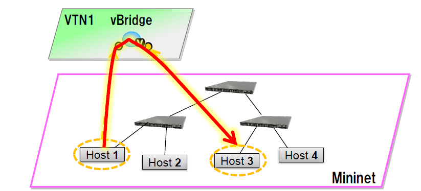

   Single Controller Mapping

Requirement
^^^^^^^^^^^

Configure mininet and create a topology
'''''''''''''''''''''''''''''''''''''''

-  `Script for emulating network with multiple
   hosts <https://wiki.opendaylight.org/view/OpenDaylight_Virtual_Tenant_Network_(VTN):Scripts:Mininet#Network_with_Multiple_Hosts_for_Service_Function_Chain>`__.

-  Before executing the mininet script, please confirm Controller is up
   and running.

-  Run the mininet script.

-  Replace <path> and <Controller IP> based on your environment.

::

    sudo mn --controller=remote,ip=<Controller IP> --custom <path>\topo_handson.py --topo mytopo2

::

    mininet> net
    h11 h11-eth0:s1-eth1
    h12 h12-eth0:s1-eth2
    h21 h21-eth0:s2-eth1
    h22 h22-eth0:s2-eth2
    h23 h23-eth0:s2-eth3
    srvc1 srvc1-eth0:s3-eth3 srvc1-eth1:s4-eth3
    srvc2 srvc2-eth0:s3-eth4 srvc2-eth1:s4-eth4
    s1 lo:  s1-eth1:h11-eth0 s1-eth2:h12-eth0 s1-eth3:s2-eth4 s1-eth4:s3-eth2
    s2 lo:  s2-eth1:h21-eth0 s2-eth2:h22-eth0 s2-eth3:h23-eth0 s2-eth4:s1-eth3 s2-eth5:s4-eth1
    s3 lo:  s3-eth1:s4-eth2 s3-eth2:s1-eth4 s3-eth3:srvc1-eth0 s3-eth4:srvc2-eth0
    s4 lo:  s4-eth1:s2-eth5 s4-eth2:s3-eth1 s4-eth3:srvc1-eth1 s4-eth4:srvc2-eth1

Configuration
^^^^^^^^^^^^^

To create Mac Map in VTN, execute REST API provided by VTN Manager as
follows. It uses curl command to call REST API.

-  Create a virtual tenant named Tenant1 by executing `the update-vtn
   RPC <https://nexus.opendaylight.org/content/sites/site/org.opendaylight.vtn/boron/manager.model/models/vtn.html#update-vtn>`__.

::

    curl --user "admin":"admin" -H "Content-type: application/json" -X POST http://localhost:8181/restconf/operations/vtn:update-vtn -d '{"input":{"tenant-name":"Tenant1"}}'

-  Create a virtual bridge named vBridge1 in the tenant Tenant1 by
   executing `the update-vbridge
   RPC <https://nexus.opendaylight.org/content/sites/site/org.opendaylight.vtn/boron/manager.model/models/vtn-vbridge.html#update-vbridge>`__.

::

    curl --user "admin":"admin" -H "Content-type: application/json" -X POST http://localhost:8181/restconf/operations/vtn-vbridge:update-vbridge -d '{"input":{"tenant-name":"Tenant1","bridge-name":"vBridge1"}}'

-  Configuring Mac Mappings on the vBridge1 by giving the mac address of
   host h12 and host h22 as follows to allow the communication by
   executing `the set-mac-map
   RPC <https://nexus.opendaylight.org/content/sites/site/org.opendaylight.vtn/boron/manager.model/models/vtn-mac-map.html#set-mac-map>`__.

::

    curl --user "admin":"admin" -H "Content-type: application/json" -X POST http://localhost:8181/restconf/operations/vtn-mac-map:set-mac-map -d '{"input":{"operation":"SET","allowed-hosts":["de:05:40:c4:96:76@0","62:c5:33:bc:d7:4e@0"],"tenant-name":"Tenant1","bridge-name":"vBridge1"}}'

.. note::

    Mac Address of host h12 and host h22 can be obtained with the
    following command in mininet.

::

     mininet> h12 ifconfig
     h12-eth0  Link encap:Ethernet  HWaddr 62:c5:33:bc:d7:4e
     inet addr:10.0.0.2  Bcast:10.255.255.255  Mask:255.0.0.0
     inet6 addr: fe80::60c5:33ff:febc:d74e/64 Scope:Link

::

     mininet> h22 ifconfig
     h22-eth0  Link encap:Ethernet  HWaddr de:05:40:c4:96:76
     inet addr:10.0.0.4  Bcast:10.255.255.255  Mask:255.0.0.0
     inet6 addr: fe80::dc05:40ff:fec4:9676/64 Scope:Link

-  MAC Mapping will not be activated just by configuring it, a two end
   communication needs to be established to activate Mac Mapping.

-  Ping host h22 from host h12 in mininet, the ping will not happen
   between the hosts as only one way activation is enabled.

::

     mininet> h12 ping h22
     PING 10.0.0.4 (10.0.0.4) 56(84) bytes of data.
     From 10.0.0.2 icmp_seq=1 Destination Host Unreachable
     From 10.0.0.2 icmp_seq=2 Destination Host Unreachable

-  Ping host h12 from host h22 in mininet, now the ping communication
   will take place as the two end communication is enabled.

::

     mininet> h22 ping h12
     PING 10.0.0.2 (10.0.0.2) 56(84) bytes of data.
     64 bytes from 10.0.0.2: icmp_req=1 ttl=64 time=91.8 ms
     64 bytes from 10.0.0.2: icmp_req=2 ttl=64 time=0.510 ms

-  After two end communication enabled, now host h12 can ping host h22

::

     mininet> h12 ping h22
     PING 10.0.0.4 (10.0.0.4) 56(84) bytes of data.
     64 bytes from 10.0.0.4: icmp_req=1 ttl=64 time=0.780 ms
     64 bytes from 10.0.0.4: icmp_req=2 ttl=64 time=0.079 ms

Verification
^^^^^^^^^^^^

-  To view the configured Mac Map of allowed host execute the following
   command.

::

    curl --user "admin":"admin" -H "Content-type: application/json" -X GET http://localhost:8181/restconf/operational/vtn:vtns/vtn/Tenant1/vbridge/vBridge1/mac-map

::

    {
      "mac-map": {
        "mac-map-status": {
          "mapped-host": [
          {
            "mac-address": "c6:44:22:ba:3e:72",
              "vlan-id": 0,
              "port-id": "openflow:1:2"
          },
          {
            "mac-address": "f6:e0:43:b6:3a:b7",
            "vlan-id": 0,
            "port-id": "openflow:2:2"
          }
          ]
        },
          "mac-map-config": {
            "allowed-hosts": {
              "vlan-host-desc-list": [
              {
                "host": "c6:44:22:ba:3e:72@0"
              },
              {
                "host": "f6:e0:43:b6:3a:b7@0"
              }
              ]
            }
          }
      }
    }

.. note::

    When Deny is configured a broadcast message is sent to all the hosts
    connected to the vBridge, so a two end communication need not be
    establihed like allow, the hosts can communicate directly without
    any two way communication enabled.

1. To Deny host h23 communication from hosts connected on vBridge1, the
   following configuration can be applied.

::

    curl --user "admin":"admin" -H "Content-type: application/json" -X POST http://localhost:8181/restconf/operations/vtn-mac-map:set-mac-map -d '{"input":{"operation": "SET", "denied-hosts": ["0a:d3:ea:3d:8f:a5@0"],"tenant-name": "Tenant1","bridge-name": "vBridge1"}}'

Cleaning Up
^^^^^^^^^^^

-  You can delete the virtual tenant Tenant1 by executing `the
   remove-vtn
   RPC <https://nexus.opendaylight.org/content/sites/site/org.opendaylight.vtn/boron/manager.model/models/vtn.html#remove-vtn>`__.

::

    curl --user "admin":"admin" -H "Content-type: application/json" -X POST http://localhost:8181/restconf/operations/vtn:remove-vtn -d '{"input":{"tenant-name":"Tenant1"}}'

How To Configure Flowfilters
~~~~~~~~~~~~~~~~~~~~~~~~~~~~

Overview
^^^^^^^^

-  This page explains how to provision flowfilter using VTN Manager.
   This page targets Boron release, so the procedure described here
   does not work in other releases.

-  The flow-filter function discards, permits, or redirects packets of
   the traffic within a VTN, according to specified flow conditions. The
   table below lists the actions to be applied when a packet matches the
   condition:

+-----------------------+----------------------------------------------------+
| Action                | Function                                           |
+=======================+====================================================+
| Pass                  | | Permits the packet to pass along the determined  |
|                       |   path.                                            |
|                       | | As options, packet transfer priority (set        |
|                       |   priority) and DSCP change (set ip-dscp) is       |
|                       |   specified.                                       |
+-----------------------+----------------------------------------------------+
| Drop                  | Discards the packet.                               |
+-----------------------+----------------------------------------------------+
| Redirect              | | Redirects the packet to a desired virtual        |
|                       |   interface.                                       |
|                       | | As an option, it is possible to change the MAC   |
|                       |   address when the packet is transferred.          |
+-----------------------+----------------------------------------------------+

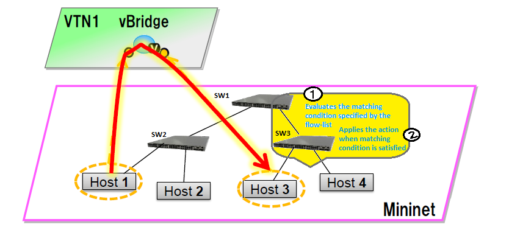

   Flow Filter Example

-  Following steps explain flow-filter function:

   -  when a packet is transferred to an interface within a virtual
      network, the flow-filter function evaluates whether the
      transferred packet matches the condition specifed in the
      flow-list.

   -  If the packet matches the condition, the flow-filter applies the
      flow-list matching action specified in the flow-filter.

Requirements
^^^^^^^^^^^^

To apply the packet filter, configure the following:

-  Create a flow condition.

-  Specify where to apply the flow-filter, for example VTN, vBridge, or
   interface of vBridge.

To provision OpenFlow switches, this page uses Mininet. Mininet details
and set-up can be referred at the below page:
https://wiki.opendaylight.org/view/OpenDaylight_Controller:Installation#Using_Mininet

Start Mininet, and create three switches (s1, s2, and s3) and four hosts
(h1, h2, h3 and h4) in it.

::

    sudo mn --controller=remote,ip=192.168.0.100 --topo tree,2

.. note::

    Replace "192.168.0.100" with the IP address of OpenDaylight
    controller based on your environment.

You can check the topology that you have created by executing "net"
command in the Mininet console.

::

     mininet> net
     h1 h1-eth0:s2-eth1
     h2 h2-eth0:s2-eth2
     h3 h3-eth0:s3-eth1
     h4 h4-eth0:s3-eth2
     s1 lo:  s1-eth1:s2-eth3 s1-eth2:s3-eth3
     s2 lo:  s2-eth1:h1-eth0 s2-eth2:h2-eth0 s2-eth3:s1-eth1
     s3 lo:  s3-eth1:h3-eth0 s3-eth2:h4-eth0 s3-eth3:s1-eth2

In this guide, you will provision flowfilters to establish communication
between h1 and h3.

Configuration
^^^^^^^^^^^^^

To provision the virtual L2 network for the two hosts (h1 and h3),
execute REST API provided by VTN Manager as follows. It uses curl
command to call the REST API.

-  Create a virtual tenant named vtn1 by executing `the update-vtn
   RPC <https://nexus.opendaylight.org/content/sites/site/org.opendaylight.vtn/boron/manager.model/models/vtn.html#update-vtn>`__.

::

    curl --user "admin":"admin" -H "Content-type: application/json" -X POST http://localhost:8181/restconf/operations/vtn:update-vtn -d '{"input":{"tenant-name":"vtn1"}}'

-  Create a virtual bridge named vbr1 in the tenant vtn1 by executing
   `the update-vbridge
   RPC <https://nexus.opendaylight.org/content/sites/site/org.opendaylight.vtn/boron/manager.model/models/vtn-vbridge.html#update-vbridge>`__.

::

    curl --user "admin":"admin" -H "Content-type: application/json" -X POST http://localhost:8181/restconf/operations/vtn-vbridge:update-vbridge -d '{"input":{"tenant-name":"vtn1","bridge-name":"vbr1"}}'

-  Create two interfaces into the virtual bridge by executing `the
   update-vinterface
   RPC <https://nexus.opendaylight.org/content/sites/site/org.opendaylight.vtn/boron/manager.model/models/vtn-vinterface.html#update-vinterface>`__.

::

    curl --user "admin":"admin" -H "Content-type: application/json" -X POST http://localhost:8181/restconf/operations/vtn-vinterface:update-vinterface -d '{"input":{"tenant-name":"vtn1","bridge-name":"vbr1","interface-name":"if1"}}'

::

    curl --user "admin":"admin" -H "Content-type: application/json" -X POST http://localhost:8181/restconf/operations/vtn-vinterface:update-vinterface -d '{"input":{"tenant-name":"vtn1","bridge-name":"vbr1","interface-name":"if2"}}'

-  Configure two mappings on the interfaces by executing `the
   set-port-map
   RPC <https://nexus.opendaylight.org/content/sites/site/org.opendaylight.vtn/boron/manager.model/models/vtn-port-map.html#set-port-map>`__.

   -  The interface if1 of the virtual bridge will be mapped to the port
      "s2-eth1" of the switch "openflow:2" of the Mininet.

      -  The h1 is connected to the port "s2-eth1".

   -  The interface if2 of the virtual bridge will be mapped to the port
      "s3-eth1" of the switch "openflow:3" of the Mininet.

      -  The h3 is connected to the port "s3-eth1".

::

    curl --user "admin":"admin" -H "Content-type: application/json" -X POST http://localhost:8181/restconf/operations/vtn-port-map:set-port-map -d '{"input":{"tenant-name":"vtn1", "bridge-name":"vbr1", "interface-name":"if1", "node":"openflow:2", "port-name":"s2-eth1"}}'

::

    curl --user "admin":"admin" -H "Content-type: application/json" -X POST http://localhost:8181/restconf/operations/vtn-port-map:set-port-map -d '{"input":{"tenant-name":"vtn1", "bridge-name":"vbr1", "interface-name":"if2", "node":"openflow:3", "port-name":"s3-eth1"}}'

-  Create flowcondition named cond\_1 by executing `the
   set-flow-condition
   RPC <https://nexus.opendaylight.org/content/sites/site/org.opendaylight.vtn/boron/manager.model/models/vtn-flow-condition.html#set-flow-condition>`__.

   -  For option source and destination-network, get inet address of
      host h1 and h3 from mininet.

::

    curl --user "admin":"admin" -H "Content-type: application/json" -X POST http://localhost:8181/restconf/operations/vtn-flow-condition:set-flow-condition -d '{"input":{"name":"cond_1", "vtn-flow-match":[{"vtn-ether-match":{},"vtn-inet-match":{"source-network":"10.0.0.1/32","protocol":1,"destination-network":"10.0.0.3/32"},"index":"1"}]}}'

-  Flowfilter can be applied either in VTN, VBR or VBR Interfaces. Here
   in this page we provision flowfilter with VBR Interface and
   demonstrate with action type drop and then pass.

-  Flow filter demonstration with DROP action-type. Create Flowfilter in
   VBR Interface if1 by executing `the set-flow-filter
   RPC <https://nexus.opendaylight.org/content/sites/site/org.opendaylight.vtn/boron/manager.model/models/vtn-flow-filter.html#set-flow-filter>`__.

::

    curl --user "admin":"admin" -H "Content-type: application/json" -X POST http://localhost:8181/restconf/operations/vtn-flow-filter:set-flow-filter -d '{"input": {"tenant-name": "vtn1", "bridge-name": "vbr1","interface-name":"if1","vtn-flow-filter":[{"condition":"cond_1","vtn-drop-filter":{},"vtn-flow-action":[{"order": "1","vtn-set-inet-src-action":{"ipv4-address":"10.0.0.1/32"}},{"order": "2","vtn-set-inet-dst-action":{"ipv4-address":"10.0.0.3/32"}}],"index": "1"}]}}'

Verification of the drop filter
^^^^^^^^^^^^^^^^^^^^^^^^^^^^^^^

-  Please execute ping from h1 to h3. As we have applied the action type
   "drop" , ping should fail with no packet flows between hosts h1 and
   h3 as below,

::

     mininet> h1 ping h3

Configuration for pass filter
^^^^^^^^^^^^^^^^^^^^^^^^^^^^^

-  Update the flow filter to pass the packets by executing `the
   set-flow-filter
   RPC <https://nexus.opendaylight.org/content/sites/site/org.opendaylight.vtn/boron/manager.model/models/vtn-flow-filter.html#set-flow-filter>`__.

::

    curl --user "admin":"admin" -H "Content-type: application/json" -X POST http://localhost:8181/restconf/operations/vtn-flow-filter:set-flow-filter -d '{"input": {"tenant-name": "vtn1", "bridge-name": "vbr1","interface-name":"if1","vtn-flow-filter":[{"condition":"cond_1","vtn-pass-filter":{},"vtn-flow-action":[{"order": "1","vtn-set-inet-src-action":{"ipv4-address":"10.0.0.1/32"}},{"order": "2","vtn-set-inet-dst-action":{"ipv4-address":"10.0.0.3/32"}}],"index": "1"}]}}'

Verification For Packets Success
^^^^^^^^^^^^^^^^^^^^^^^^^^^^^^^^

-  As we have applied action type PASS now ping should happen between
   hosts h1 and h3.

::

     mininet> h1 ping h3
     PING 10.0.0.3 (10.0.0.3) 56(84) bytes of data.
     64 bytes from 10.0.0.3: icmp_req=1 ttl=64 time=0.984 ms
     64 bytes from 10.0.0.3: icmp_req=2 ttl=64 time=0.110 ms
     64 bytes from 10.0.0.3: icmp_req=3 ttl=64 time=0.098 ms

-  You can also verify the configurations by executing the following
   REST API. It shows all configuration in VTN Manager.

::

    curl --user "admin":"admin" -H "Content-type: application/json" -X GET http://localhost:8181/restconf/operational/vtn:vtns/vtn/vtn1

::

    {
      "vtn": [
      {
        "name": "vtn1",
          "vtenant-config": {
            "hard-timeout": 0,
            "idle-timeout": 300,
            "description": "creating vtn"
          },
          "vbridge": [
          {
            "name": "vbr1",
            "vbridge-config": {
              "age-interval": 600,
              "description": "creating vBridge1"
            },
            "bridge-status": {
              "state": "UP",
              "path-faults": 0
            },
            "vinterface": [
            {
              "name": "if1",
              "vinterface-status": {
                "mapped-port": "openflow:2:1",
                "state": "UP",
                "entity-state": "UP"
              },
              "port-map-config": {
                "vlan-id": 0,
                "node": "openflow:2",
                "port-name": "s2-eth1"
              },
              "vinterface-config": {
                "description": "Creating if1 interface",
                "enabled": true
              },
              "vinterface-input-filter": {
                "vtn-flow-filter": [
                {
                  "index": 1,
                  "condition": "cond_1",
                  "vtn-flow-action": [
                  {
                    "order": 1,
                    "vtn-set-inet-src-action": {
                      "ipv4-address": "10.0.0.1/32"
                    }
                  },
                  {
                    "order": 2,
                    "vtn-set-inet-dst-action": {
                      "ipv4-address": "10.0.0.3/32"
                    }
                  }
                  ],
                    "vtn-pass-filter": {}
                },
                {
                  "index": 10,
                  "condition": "cond_1",
                  "vtn-drop-filter": {}
                }
                ]
              }
            },
            {
              "name": "if2",
              "vinterface-status": {
                "mapped-port": "openflow:3:1",
                "state": "UP",
                "entity-state": "UP"
              },
              "port-map-config": {
                "vlan-id": 0,
                "node": "openflow:3",
                "port-name": "s3-eth1"
              },
              "vinterface-config": {
                "description": "Creating if2 interface",
                "enabled": true
              }
            }
            ]
          }
        ]
      }
      ]
    }

Cleaning Up
^^^^^^^^^^^

-  To clean up both VTN and flowcondition.

-  You can delete the virtual tenant vtn1 by executing `the remove-vtn
   RPC <https://nexus.opendaylight.org/content/sites/site/org.opendaylight.vtn/boron/manager.model/models/vtn.html#remove-vtn>`__.

::

    curl --user "admin":"admin" -H "Content-type: application/json" -X POST http://localhost:8181/restconf/operations/vtn:remove-vtn -d '{"input":{"tenant-name":"vtn1"}}'

-  You can delete the flowcondition cond\_1 by executing `the
   remove-flow-condition
   RPC <https://nexus.opendaylight.org/content/sites/site/org.opendaylight.vtn/boron/manager.model/models/vtn-flow-condition.html#remove-flow-condition>`__.

::

    curl --user "admin":"admin" -H "Content-type: application/json" -X POST http://localhost:8181/restconf/operations/vtn-flow-condition:remove-flow-condition -d '{"input":{"name":"cond_1"}}'

How to use VTN to change the path of the packet flow
~~~~~~~~~~~~~~~~~~~~~~~~~~~~~~~~~~~~~~~~~~~~~~~~~~~~

Overview
^^^^^^^^

-  This page explains how to create specific VTN Pathmap using VTN
   Manager. This page targets Boron release, so the procedure
   described here does not work in other releases.

.. figure:: ./images/vtn/Pathmap.png
   :alt: Pathmap

   Pathmap

Requirement
^^^^^^^^^^^

-  Save the mininet script given below as pathmap\_test.py and run the
   mininet script in the mininet environment where Mininet is installed.

-  Create topology using the below mininet script:

::

     from mininet.topo import Topo
     class MyTopo( Topo ):
        "Simple topology example."
        def __init__( self ):
            "Create custom topo."
            # Initialize topology
            Topo.__init__( self )
            # Add hosts and switches
            leftHost = self.addHost( 'h1' )
            rightHost = self.addHost( 'h2' )
            leftSwitch = self.addSwitch( 's1' )
            middleSwitch = self.addSwitch( 's2' )
            middleSwitch2 = self.addSwitch( 's4' )
            rightSwitch = self.addSwitch( 's3' )
            # Add links
            self.addLink( leftHost, leftSwitch )
            self.addLink( leftSwitch, middleSwitch )
            self.addLink( leftSwitch, middleSwitch2 )
            self.addLink( middleSwitch, rightSwitch )
            self.addLink( middleSwitch2, rightSwitch )
            self.addLink( rightSwitch, rightHost )
     topos = { 'mytopo': ( lambda: MyTopo() ) }

-  After creating new file with the above script start the mininet as
   below,

::

    sudo mn --controller=remote,ip=10.106.138.124 --custom pathmap_test.py --topo mytopo

.. note::

    Replace "10.106.138.124" with the IP address of OpenDaylight
    controller based on your environment.

::

     mininet> net
     h1 h1-eth0:s1-eth1
     h2 h2-eth0:s3-eth3
     s1 lo:  s1-eth1:h1-eth0 s1-eth2:s2-eth1 s1-eth3:s4-eth1
     s2 lo:  s2-eth1:s1-eth2 s2-eth2:s3-eth1
     s3 lo:  s3-eth1:s2-eth2 s3-eth2:s4-eth2 s3-eth3:h2-eth0
     s4 lo:  s4-eth1:s1-eth3 s4-eth2:s3-eth2
     c0

-  Generate traffic by pinging between host h1 and host h2 before
   creating the portmaps respectively.

::

     mininet> h1 ping h2
     PING 10.0.0.2 (10.0.0.2) 56(84) bytes of data.
     From 10.0.0.1 icmp_seq=1 Destination Host Unreachable
     From 10.0.0.1 icmp_seq=2 Destination Host Unreachable
     From 10.0.0.1 icmp_seq=3 Destination Host Unreachable
     From 10.0.0.1 icmp_seq=4 Destination Host Unreachable

Configuration
^^^^^^^^^^^^^

-  To change the path of the packet flow, execute REST API provided by
   VTN Manager as follows. It uses curl command to call the REST API.

-  Create a virtual tenant named vtn1 by executing `the update-vtn
   RPC <https://nexus.opendaylight.org/content/sites/site/org.opendaylight.vtn/boron/manager.model/models/vtn.html#update-vtn>`__.

::

    curl --user "admin":"admin" -H "Content-type: application/json" -X POST http://localhost:8181/restconf/operations/vtn:update-vtn -d '{"input":{"tenant-name":"vtn1"}}'

-  Create a virtual bridge named vbr1 in the tenant vtn1 by executing
   `the update-vbridge
   RPC <https://nexus.opendaylight.org/content/sites/site/org.opendaylight.vtn/boron/manager.model/models/vtn-vbridge.html#update-vbridge>`__.

::

    curl --user "admin":"admin" -H "Content-type: application/json" -X POST http://localhost:8181/restconf/operations/vtn-vbridge:update-vbridge -d '{"input":{"tenant-name":"vtn1","bridge-name":"vbr1"}}'

-  Create two interfaces into the virtual bridge by executing `the
   update-vinterface
   RPC <https://nexus.opendaylight.org/content/sites/site/org.opendaylight.vtn/boron/manager.model/models/vtn-vinterface.html#update-vinterface>`__.

::

    curl --user "admin":"admin" -H "Content-type: application/json" -X POST http://localhost:8181/restconf/operations/vtn-vinterface:update-vinterface -d '{"input":{"tenant-name":"vtn1","bridge-name":"vbr1","interface-name":"if1"}}'

::

    curl --user "admin":"admin" -H "Content-type: application/json" -X POST http://localhost:8181/restconf/operations/vtn-vinterface:update-vinterface -d '{"input":{"tenant-name":"vtn1","bridge-name":"vbr1","interface-name":"if2"}}'

-  Configure two mappings on the interfaces by executing `the
   set-port-map
   RPC <https://nexus.opendaylight.org/content/sites/site/org.opendaylight.vtn/boron/manager.model/models/vtn-port-map.html#set-port-map>`__.

   -  The interface if1 of the virtual bridge will be mapped to the port
      "s2-eth1" of the switch "openflow:1" of the Mininet.

      -  The h1 is connected to the port "s1-eth1".

   -  The interface if2 of the virtual bridge will be mapped to the port
      "s3-eth1" of the switch "openflow:3" of the Mininet.

      -  The h3 is connected to the port "s3-eth3".

::

    curl --user "admin":"admin" -H "Content-type: application/json" -X POST http://localhost:8181/restconf/operations/vtn-port-map:set-port-map -d '{"input":{"tenant-name":"vtn1", "bridge-name":"vbr1", "interface-name":"if1", "node":"openflow:1", "port-name":"s1-eth1"}}'

::

    curl --user "admin":"admin" -H "Content-type: application/json" -X POST http://localhost:8181/restconf/operations/vtn-port-map:set-port-map -d '{"input":{"tenant-name":"vtn1", "bridge-name":"vbr1", "interface-name":"if2", "node":"openflow:3", "port-name":"s3-eth3"}}'

-  Genarate traffic by pinging between host h1 and host h2 after
   creating the portmaps respectively.

::

     mininet> h1 ping h2
     PING 10.0.0.2 (10.0.0.2) 56(84) bytes of data.
     64 bytes from 10.0.0.2: icmp_seq=1 ttl=64 time=0.861 ms
     64 bytes from 10.0.0.2: icmp_seq=2 ttl=64 time=0.101 ms
     64 bytes from 10.0.0.2: icmp_seq=3 ttl=64 time=0.101 ms

-  Get the Dataflows information by executing `the get-data-flow
   RPC <https://nexus.opendaylight.org/content/sites/site/org.opendaylight.vtn/boron/manager.model/models/vtn-flow.html#get-data-flow>`__.

::

    curl --user "admin":"admin" -H "Content-type: application/json" -X POST http://localhost:8181/restconf/operations/vtn-flow:get-data-flow -d '{"input":{"tenant-name":"vtn1","mode":"DETAIL","node":"openflow:1","data-flow-port":{"port-id":1,"port-name":"s1-eth1"}}}'

-  Create flowcondition named cond\_1 by executing `the
   set-flow-condition
   RPC <https://nexus.opendaylight.org/content/sites/site/org.opendaylight.vtn/boron/manager.model/models/vtn-flow-condition.html#set-flow-condition>`__.

   -  For option source and destination-network, get inet address of
      host h1 or host h2 from mininet

::

    curl --user "admin":"admin" -H "Content-type: application/json" -X POST http://localhost:8181/restconf/operations/vtn-flow-condition:set-flow-condition -d '{"input":{"operation":"SET","present":"false","name":"cond_1", "vtn-flow-match":[{"vtn-ether-match":{},"vtn-inet-match":{"source-network":"10.0.0.1/32","protocol":1,"destination-network":"10.0.0.2/32"},"index":"1"}]}}'

-  Create pathmap with flowcondition cond\_1 by executing `the
   set-path-map
   RPC <https://nexus.opendaylight.org/content/sites/site/org.opendaylight.vtn/boron/manager.model/models/vtn-path-map.html#set-path-map>`__.

::

    curl --user "admin":"admin" -H "Content-type: application/json" -X POST http://localhost:8181/restconf/operations/vtn-path-map:set-path-map -d '{"input":{"tenant-name":"vtn1","path-map-list":[{"condition":"cond_1","policy":"1","index": "1","idle-timeout":"300","hard-timeout":"0"}]}}'

-  Create pathpolicy by executing `the set-path-policy
   RPC <https://nexus.opendaylight.org/content/sites/site/org.opendaylight.vtn/boron/manager.model/models/vtn-path-policy.html#set-path-policy>`__.

::

    curl --user "admin":"admin" -H "Content-type: application/json" -X POST http://localhost:8181/restconf/operations/vtn-path-policy:set-path-policy -d '{"input":{"operation":"SET","id": "1","default-cost": "10000","vtn-path-cost": [{"port-desc":"openflow:1,3,s1-eth3","cost":"1000"},{"port-desc":"openflow:4,2,s4-eth2","cost":"1000"},{"port-desc":"openflow:3,3,s3-eth3","cost":"100000"}]}}'

Verification
^^^^^^^^^^^^

-  Before applying Path policy get node information by executing get
   dataflow command.

::

    "data-flow-info": [
    {
      "physical-route": [
      {
        "physical-ingress-port": {
          "port-name": "s3-eth3",
            "port-id": "3"
        },
          "physical-egress-port": {
            "port-name": "s3-eth1",
            "port-id": "1"
          },
          "node": "openflow:3",
          "order": 0
      },
      {
        "physical-ingress-port": {
          "port-name": "s2-eth2",
          "port-id": "2"
        },
        "physical-egress-port": {
          "port-name": "s2-eth1",
          "port-id": "1"
        },
        "node": "openflow:2",
        "order": 1
      },
      {
        "physical-ingress-port": {
          "port-name": "s1-eth2",
          "port-id": "2"
        },
        "physical-egress-port": {
          "port-name": "s1-eth1",
          "port-id": "1"
        },
        "node": "openflow:1",
        "order": 2
      }
      ],
        "data-egress-node": {
          "interface-name": "if1",
          "bridge-name": "vbr1",
          "tenant-name": "vtn1"
        },
        "data-egress-port": {
          "node": "openflow:1",
          "port-name": "s1-eth1",
          "port-id": "1"
        },
        "data-ingress-node": {
          "interface-name": "if2",
          "bridge-name": "vbr1",
          "tenant-name": "vtn1"
        },
        "data-ingress-port": {
          "node": "openflow:3",
          "port-name": "s3-eth3",
          "port-id": "3"
        },
        "flow-id": 32
      },
    }

-  After applying Path policy get node information by executing get
   dataflow command.

::

    "data-flow-info": [
    {
      "physical-route": [
      {
        "physical-ingress-port": {
          "port-name": "s1-eth1",
            "port-id": "1"
        },
          "physical-egress-port": {
            "port-name": "s1-eth3",
            "port-id": "3"
          },
          "node": "openflow:1",
          "order": 0
      },
      {
        "physical-ingress-port": {
          "port-name": "s4-eth1",
          "port-id": "1"
        },
        "physical-egress-port": {
          "port-name": "s4-eth2",
          "port-id": "2"
        },
        "node": "openflow:4",
        "order": 1
      },
      {
        "physical-ingress-port": {
          "port-name": "s3-eth2",
          "port-id": "2"
        },
        "physical-egress-port": {
          "port-name": "s3-eth3",
          "port-id": "3"
        },
        "node": "openflow:3",
        "order": 2
      }
      ],
        "data-egress-node": {
          "interface-name": "if2",
          "bridge-name": "vbr1",
          "tenant-name": "vtn1"
        },
        "data-egress-port": {
          "node": "openflow:3",
          "port-name": "s3-eth3",
          "port-id": "3"
        },
        "data-ingress-node": {
          "interface-name": "if1",
          "bridge-name": "vbr1",
          "tenant-name": "vtn1"
        },
        "data-ingress-port": {
          "node": "openflow:1",
          "port-name": "s1-eth1",
          "port-id": "1"
        },
    }

Cleaning Up
^^^^^^^^^^^

-  To clean up both VTN and flowcondition.

-  You can delete the virtual tenant vtn1 by executing `the remove-vtn
   RPC <https://nexus.opendaylight.org/content/sites/site/org.opendaylight.vtn/boron/manager.model/models/vtn.html#remove-vtn>`__.

::

    curl --user "admin":"admin" -H "Content-type: application/json" -X POST http://localhost:8181/restconf/operations/vtn:remove-vtn -d '{"input":{"tenant-name":"vtn1"}}'

-  You can delete the flowcondition cond\_1 by executing `the
   remove-flow-condition
   RPC <https://nexus.opendaylight.org/content/sites/site/org.opendaylight.vtn/boron/manager.model/models/vtn-flow-condition.html#remove-flow-condition>`__.

::

    curl --user "admin":"admin" -H "Content-type: application/json" -X POST http://localhost:8181/restconf/operations/vtn-flow-condition:remove-flow-condition -d '{"input":{"name":"cond_1"}}'

VTN Coordinator Usage Examples
------------------------------

How to configure L2 Network with Single Controller
~~~~~~~~~~~~~~~~~~~~~~~~~~~~~~~~~~~~~~~~~~~~~~~~~~

Overview
^^^^^^^^

This example provides the procedure to demonstrate configuration of VTN
Coordinator with L2 network using VTN Virtualization(single controller).
Here is the Example for vBridge Interface Mapping with Single Controller
using mininet. mininet details and set-up can be referred at below URL:
https://wiki.opendaylight.org/view/OpenDaylight_Controller:Installation#Using_Mininet

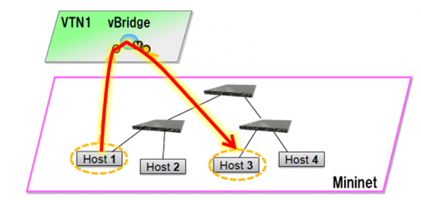

   EXAMPLE DEMONSTRATING SINGLE CONTROLLER

Requirements
^^^^^^^^^^^^

-  Configure mininet and create a topology:

::

    mininet@mininet-vm:~$ sudo mn --controller=remote,ip=<controller-ip> --topo tree,2

-  mininet> net

::

     s1 lo:  s1-eth1:h1-eth0 s1-eth2:s2-eth1
     s2 lo:  s2-eth1:s1-eth2 s2-eth2:h2-eth0
     h1 h1-eth0:s1-eth1
     h2 h2-eth0:s2-eth2

Configuration
^^^^^^^^^^^^^

-  Create a Controller named controllerone and mention its ip-address in
   the below create-controller command.

::

    curl --user admin:adminpass -H 'content-type: application/json' -X POST -d '{"controller": {"controller_id": "controllerone", "ipaddr":"10.0.0.2", "type": "odc", "version": "1.0", "auditstatus":"enable"}}' http://127.0.0.1:8083/vtn-webapi/controllers.json

-  Create a VTN named vtn1 by executing the create-vtn command

::

    curl --user admin:adminpass -H 'content-type: application/json' -X POST -d '{"vtn" : {"vtn_name":"vtn1","description":"test VTN" }}' http://127.0.0.1:8083/vtn-webapi/vtns.json

-  Create a vBridge named vBridge1 in the vtn1 by executing the
   create-vbr command.

::

     curl --user admin:adminpass -H 'content-type: application/json' -X POST -d '{"vbridge" : {"vbr_name":"vBridge1","controller_id":"controllerone","domain_id":"(DEFAULT)" }}' http://127.0.0.1:8083/vtn-webapi/vtns/vtn1/vbridges.json

-  Create two Interfaces named if1 and if2 into the vBridge1

::

    curl --user admin:adminpass -H 'content-type: application/json' -X POST -d '{"interface": {"if_name": "if1","description": "if_desc1"}}' http://127.0.0.1:8083/vtn-webapi/vtns/vtn1/vbridges/vBridge1/interfaces.json

::

    curl --user admin:adminpass -H 'content-type: application/json' -X POST -d '{"interface": {"if_name": "if2","description": "if_desc2"}}' http://127.0.0.1:8083/vtn-webapi/vtns/vtn1/vbridges/vBridge1/interfaces.json

-  Get the list of logical ports configured

::

    Curl --user admin:adminpass -H 'content-type: application/json' -X GET http://127.0.0.1:8083/vtn-webapi/controllers/controllerone/domains/\(DEFAULT\)/logical_ports.json

-  Configure two mappings on each of the interfaces by executing the
   below command.

The interface if1 of the virtual bridge will be mapped to the port
"s2-eth1" of the switch "openflow:2" of the Mininet. The h1 is connected
to the port "s2-eth1".

The interface if2 of the virtual bridge will be mapped to the port
"s3-eth1" of the switch "openflow:3" of the Mininet. The h3 is connected
to the port "s3-eth1".

::

    curl --user admin:adminpass -H 'content-type: application/json' -X PUT -d '{"portmap":{"logical_port_id": "PP-OF:00:00:00:00:00:00:00:03-s3-eth1"}}' http://127.0.0.1:8083/vtn-webapi/vtns/vtn1/vbridges/vBridge1/interfaces/if1/portmap.json
    curl --user admin:adminpass -H 'content-type: application/json' -X PUT -d '{"portmap":{"logical_port_id": "PP-OF:00:00:00:00:00:00:00:02-s2-eth1"}}' http://127.0.0.1:8083/vtn-webapi/vtns/vtn1/vbridges/vBridge1/interfaces/if2/portmap.json

Verification
^^^^^^^^^^^^

Please verify whether the Host1 and Host3 are pinging.

-  Send packets from Host1 to Host3

::

     mininet> h1 ping h3
     PING 10.0.0.3 (10.0.0.3) 56(84) bytes of data.
     64 bytes from 10.0.0.3: icmp_req=1 ttl=64 time=0.780 ms
     64 bytes from 10.0.0.3: icmp_req=2 ttl=64 time=0.079 ms

How to configure L2 Network with Multiple Controllers
~~~~~~~~~~~~~~~~~~~~~~~~~~~~~~~~~~~~~~~~~~~~~~~~~~~~~

-  This example provides the procedure to demonstrate configuration of
   VTN Coordinator with L2 network using VTN Virtualization Here is the
   Example for vBridge Interface Mapping with Multi-controller using
   mininet.

.. figure:: ./images/vtn/MutiController_Example_diagram.png
   :alt: EXAMPLE DEMONSTRATING MULTIPLE CONTROLLERS

   EXAMPLE DEMONSTRATING MULTIPLE CONTROLLERS

Requirements
^^^^^^^^^^^^

-  Configure multiple controllers using the mininet script given below:
   https://wiki.opendaylight.org/view/OpenDaylight_Virtual_Tenant_Network_%28VTN%29:Scripts:Mininet#Network_with_multiple_switches_and_OpenFlow_controllers

Configuration
^^^^^^^^^^^^^

-  Create a VTN named vtn3 by executing the create-vtn command

::

    curl --user admin:adminpass -H 'content-type: application/json'  -X POST -d '{"vtn" : {"vtn_name":"vtn3"}}' http://127.0.0.1:8083/vtn-webapi/vtns.json

-  Create two Controllers named odc1 and odc2 with its ip-address in the
   below create-controller command.

::

    curl --user admin:adminpass -H 'content-type: application/json'  -X POST -d '{"controller": {"controller_id": "odc1", "ipaddr":"10.100.9.52", "type": "odc", "version": "1.0", "auditstatus":"enable"}}' http://127.0.0.1:8083/vtn-webapi/controllers.json

::

    curl --user admin:adminpass -H 'content-type: application/json'  -X POST -d '{"controller": {"controller_id": "odc2", "ipaddr":"10.100.9.61", "type": "odc", "version": "1.0", "auditstatus":"enable"}}' http://127.0.0.1:8083/vtn-webapi/controllers.json

-  Create two vBridges in the VTN like, vBridge1 in Controller1 and
   vBridge2 in Controller2

::

     curl --user admin:adminpass -H 'content-type: application/json' -X POST -d '{"vbridge" : {"vbr_name":"vbr1","controller_id":"odc1","domain_id":"(DEFAULT)" }}' http://127.0.0.1:8083/vtn-webapi/vtns/vtn3/vbridges.json

::

    curl --user admin:adminpass -H 'content-type: application/json'  -X POST -d '{"vbridge" : {"vbr_name":"vbr2","controller_id":"odc2","domain_id":"(DEFAULT)" }}' http://127.0.0.1:8083/vtn-webapi/vtns/vtn3/vbridges.json

-  Create two Interfaces if1, if2 for the two vBridges vbr1 and vbr2.

::

    curl --user admin:adminpass -H 'content-type: application/json'  -X POST -d '{"interface": {"if_name": "if1"}}' http://127.0.0.1:8083/vtn-webapi/vtns/vtn3/vbridges/vbr1/interfaces.json

::

    curl --user admin:adminpass -H 'content-type: application/json'  -X POST -d '{"interface": {"if_name": "if2"}}' http://127.0.0.1:8083/vtn-webapi/vtns/vtn3/vbridges/vbr1/interfaces.json

::

    curl --user admin:adminpass -H 'content-type: application/json'  -X POST -d '{"interface": {"if_name": "if1"}}' http://127.0.0.1:8083/vtn-webapi/vtns/vtn3/vbridges/vbr2/interfaces.json

::

    curl --user admin:adminpass -H 'content-type: application/json'  -X POST -d '{"interface": {"if_name": "if2"}}' http://127.0.0.1:8083/vtn-webapi/vtns/vtn3/vbridges/vbr2/interfaces.json

-  Get the list of logical ports configured

::

    curl --user admin:adminpass -H 'content-type: application/json' -X GET http://127.0.0.1:8083/vtn-webapi/controllers/odc1/domains/\(DEFAULT\)/logical_ports/detail.json

-  Create boundary and vLink for the two controllers

::

    curl --user admin:adminpass -H 'content-type: application/json'   -X POST -d '{"boundary": {"boundary_id": "b1", "link": {"controller1_id": "odc1", "domain1_id": "(DEFAULT)", "logical_port1_id": "PP-OF:00:00:00:00:00:00:00:01-s1-eth3", "controller2_id": "odc2", "domain2_id": "(DEFAULT)", "logical_port2_id": "PP-OF:00:00:00:00:00:00:00:04-s4-eth3"}}}' http://127.0.0.1:8083/vtn-webapi/boundaries.json

::

    curl --user admin:adminpass -H 'content-type: application/json'  -X POST -d '{"vlink": {"vlk_name": "vlink1" , "vnode1_name": "vbr1", "if1_name":"if2", "vnode2_name": "vbr2", "if2_name": "if2", "boundary_map": {"boundary_id":"b1","vlan_id": "50"}}}' http://127.0.0.1:8083/vtn-webapi/vtns/vtn3/vlinks.json

-  Configure two mappings on each of the interfaces by executing the
   below command.

The interface if1 of the vbr1 will be mapped to the port "s2-eth2" of
the switch "openflow:2" of the Mininet. The h2 is connected to the port
"s2-eth2".

The interface if2 of the vbr2 will be mapped to the port "s5-eth2" of
the switch "openflow:5" of the Mininet. The h6 is connected to the port
"s5-eth2".

::

    curl --user admin:adminpass -H 'content-type: application/json' -X PUT -d '{"portmap":{"logical_port_id": "PP-OF:00:00:00:00:00:00:00:02-s2-eth2"}}' http://127.0.0.1:8083/vtn-webapi/vtns/vtn3/vbridges/vbr1/interfaces/if1/portmap.json

::

    curl --user admin:adminpass -H 'content-type: application/json'  -X PUT -d '{"portmap":{"logical_port_id": "PP-OF:00:00:00:00:00:00:00:05-s5-eth2"}}' http://127.0.0.1:8083/vtn-webapi/vtns/vtn3/vbridges/vbr2/interfaces/if1/portmap.json

Verification
^^^^^^^^^^^^

Please verify whether Host h2 and Host h6 are pinging.

-  Send packets from h2 to h6

::

    mininet> h2 ping h6

::

     PING 10.0.0.6 (10.0.0.3) 56(84) bytes of data.
     64 bytes from 10.0.0.6: icmp_req=1 ttl=64 time=0.780 ms
     64 bytes from 10.0.0.6: icmp_req=2 ttl=64 time=0.079 ms

How To Test Vlan-Map In Mininet Environment
~~~~~~~~~~~~~~~~~~~~~~~~~~~~~~~~~~~~~~~~~~~

Overview
^^^^^^^^

This example explains how to test vlan-map in a multi host scenario.

.. figure:: ./images/vtn/vlanmap_using_mininet.png
   :alt: Example that demonstrates vlanmap testing in Mininet Environment

   Example that demonstrates vlanmap testing in Mininet Environment

Requirements
^^^^^^^^^^^^

-  Save the mininet script given below as vlan\_vtn\_test.py and run the
   mininet script in the mininet environment where Mininet is installed.

Mininet Script
^^^^^^^^^^^^^^

https://wiki.opendaylight.org/view/OpenDaylight_Virtual_Tenant_Network_(VTN):Scripts:Mininet#Network_with_hosts_in_different_vlan

-  Run the mininet script

::

    sudo mn --controller=remote,ip=192.168.64.13 --custom vlan_vtn_test.py --topo mytopo

Configuration
^^^^^^^^^^^^^

Please follow the below steps to test a vlan map using mininet:

-  Create a Controller named controllerone and mention its ip-address in
   the below create-controller command.

::

    curl --user admin:adminpass -H 'content-type: application/json'  -X POST -d '{"controller": {"controller_id": "controllerone", "ipaddr":"10.0.0.2", "type": "odc", "version": "1.0", "auditstatus":"enable"}}' http://127.0.0.1:8083/vtn-webapi/controllers

-  Create a VTN named vtn1 by executing the create-vtn command

::

    curl -X POST -H 'content-type: application/json' -H 'username: admin' -H 'password: adminpass' -d '{"vtn" : {"vtn_name":"vtn1","description":"test VTN" }}' http://127.0.0.1:8083/vtn-webapi/vtns.json

-  Create a vBridge named vBridge1 in the vtn1 by executing the
   create-vbr command.

::

    curl -X POST -H 'content-type: application/json' -H 'username: admin' -H 'password: adminpass' -d '{"vbridge" : {"vbr_name":"vBridge1","controller_id":"controllerone","domain_id":"(DEFAULT)" }}' http://127.0.0.1:8083/vtn-webapi/vtns/vtn1/vbridges.json

-  Create a vlan map with vlanid 200 for vBridge vBridge1

::

    curl -X POST -H 'content-type: application/json' -H 'username: admin' -H 'password: adminpass' -d '{"vlanmap" : {"vlan_id": 200 }}' http://127.0.0.1:8083/vtn-webapi/vtns/vtn1/vbridges/vBridge1/vlanmaps.json

-  Create a vBridge named vBridge2 in the vtn1 by executing the
   create-vbr command.

::

    curl -X POST -H 'content-type: application/json' -H 'username: admin' -H 'password: adminpass' -d '{"vbridge" : {"vbr_name":"vBridge2","controller_id":"controllerone","domain_id":"(DEFAULT)" }}' http://127.0.0.1:8083/vtn-webapi/vtns/vtn1/vbridges.json

-  Create a vlan map with vlanid 300 for vBridge vBridge2

::

    curl -X POST -H 'content-type: application/json' -H 'username: admin' -H 'password: adminpass' -d '{"vlanmap" : {"vlan_id": 300 }}' http://127.0.0.1:8083/vtn-webapi/vtns/vtn1/vbridges/vBridge2/vlanmaps.json

Verification
^^^^^^^^^^^^

Ping all in mininet environment to view the host reachability.

::

    mininet> pingall
    Ping: testing ping reachability
    h1 -> X h3 X h5 X
    h2 -> X X h4 X h6
    h3 -> h1 X X h5 X
    h4 -> X h2 X X h6
    h5 -> h1 X h3 X X
    h6 -> X h2 X h4 X

How To View Specific VTN Station Information.
~~~~~~~~~~~~~~~~~~~~~~~~~~~~~~~~~~~~~~~~~~~~~

This example demonstrates on how to view a specific VTN Station
information.

.. figure:: ./images/vtn/vtn_stations.png
   :alt: EXAMPLE DEMONSTRATING VTN STATIONS

   EXAMPLE DEMONSTRATING VTN STATIONS

Requirement
^^^^^^^^^^^

-  Configure mininet and create a topology:

::

     $ sudo mn --custom /home/mininet/mininet/custom/topo-2sw-2host.py --controller=remote,ip=10.100.9.61 --topo mytopo
    mininet> net

     s1 lo:  s1-eth1:h1-eth0 s1-eth2:s2-eth1
     s2 lo:  s2-eth1:s1-eth2 s2-eth2:h2-eth0
     h1 h1-eth0:s1-eth1
     h2 h2-eth0:s2-eth2

-  Generate traffic by pinging between hosts h1 and h2 after configuring
   the portmaps respectively

::

     mininet> h1 ping h2
     PING 10.0.0.2 (10.0.0.2) 56(84) bytes of data.
     64 bytes from 10.0.0.2: icmp_req=1 ttl=64 time=16.7 ms
     64 bytes from 10.0.0.2: icmp_req=2 ttl=64 time=13.2 ms

Configuration
^^^^^^^^^^^^^

-  Create a Controller named controllerone and mention its ip-address in
   the below create-controller command

::

    curl --user admin:adminpass -H 'content-type: application/json' -X POST -d '{"controller": {"controller_id": "controllerone", "ipaddr":"10.100.9.61", "type": "odc", "version": "1.0", "auditstatus":"enable"}}' http://127.0.0.1:8083/vtn-webapi/controllers.json

-  Create a VTN named vtn1 by executing the create-vtn command

::

    curl --user admin:adminpass -H 'content-type: application/json' -X POST -d '{"vtn" : {"vtn_name":"vtn1","description":"test VTN" }}' http://127.0.0.1:8083/vtn-webapi/vtns.json

-  Create a vBridge named vBridge1 in the vtn1 by executing the
   create-vbr command.

::

    curl --user admin:adminpass -H 'content-type: application/json' -X POST -d '{"vbridge" : {"vbr_name":"vBridge1","controller_id":"controllerone","domain_id":"(DEFAULT)" }}' http://127.0.0.1:8083/vtn-webapi/vtns/vtn1/vbridges.json

-  Create two Interfaces named if1 and if2 into the vBridge1

::

    curl --user admin:adminpass -H 'content-type: application/json' -X POST -d '{"interface": {"if_name": "if1","description": "if_desc1"}}' http://127.0.0.1:8083/vtn-webapi/vtns/vtn1/vbridges/vBridge1/interfaces.json
    curl -v --user admin:adminpass -H 'content-type: application/json' -X POST -d '{"interface": {"if_name": "if2","description": "if_desc2"}}' http://127.0.0.1:8083/vtn-webapi/vtns/vtn1/vbridges/vBridge1/interfaces.json

-  Configure two mappings on each of the interfaces by executing the
   below command.

The interface if1 of the virtual bridge will be mapped to the port
"s1-eth1" of the switch "openflow:1" of the Mininet. The h1 is connected
to the port "s1-eth1".

The interface if2 of the virtual bridge will be mapped to the port
"s1-eth2" of the switch "openflow:1" of the Mininet. The h2 is connected
to the port "s1-eth2".

::

    curl --user admin:adminpass -H 'content-type: application/json' -X PUT -d '{"portmap":{"logical_port_id": "PP-OF:00:00:00:00:00:00:00:01-s1-eth1"}}' http://127.0.0.1:8083/vtn-webapi/vtns/vtn1/vbridges/vBridge1/interfaces/if1/portmap.json
    curl -v --user admin:adminpass -H 'content-type: application/json' -X PUT -d '{"portmap":{"logical_port_id": "PP-OF:00:00:00:00:00:00:00:02-s2-eth2"}}' http://17.0.0.1:8083/vtn-webapi/vtns/vtn1/vbridges/vBridge1/interfaces/if2/portmap.json

-  Get the VTN stations information

::

    curl -X GET -H 'content-type: application/json' -H 'username: admin' -H 'password: adminpass' "http://127.0.0.1:8083/vtn-webapi/vtnstations?controller_id=controllerone&vtn_name=vtn1"

Verification
^^^^^^^^^^^^

::

    curl -X GET -H 'content-type: application/json' -H 'username: admin' -H 'password: adminpass' "http://127.0.0.1:8083/vtn-webapi/vtnstations?controller_id=controllerone&vtn_name=vtn1"
    {
       "vtnstations": [
           {
               "domain_id": "(DEFAULT)",
               "interface": {},
               "ipaddrs": [
                   "10.0.0.2"
               ],
               "macaddr": "b2c3.06b8.2dac",
               "no_vlan_id": "true",
               "port_name": "s2-eth2",
               "station_id": "178195618445172",
               "switch_id": "00:00:00:00:00:00:00:02",
               "vnode_name": "vBridge1",
               "vnode_type": "vbridge",
               "vtn_name": "vtn1"
           },
           {
               "domain_id": "(DEFAULT)",
               "interface": {},
               "ipaddrs": [
                   "10.0.0.1"
               ],
               "macaddr": "ce82.1b08.90cf",
               "no_vlan_id": "true",
               "port_name": "s1-eth1",
               "station_id": "206130278144207",
               "switch_id": "00:00:00:00:00:00:00:01",
               "vnode_name": "vBridge1",
               "vnode_type": "vbridge",
               "vtn_name": "vtn1"
           }
       ]
    }

How To View Dataflows in VTN
~~~~~~~~~~~~~~~~~~~~~~~~~~~~

This example demonstrates on how to view a specific VTN Dataflow
information.

Configuration
^^^^^^^^^^^^^

The same Configuration as Vlan Mapping
Example(\ https://wiki.opendaylight.org/view/VTN:Coordinator:Beryllium:HowTos:How_To_test_vlanmap_using_mininet)

Verification
^^^^^^^^^^^^

Get the VTN Dataflows information

::

    curl -X GET -H 'content-type: application/json' --user 'admin:adminpass' "http://127.0.0.1:8083/vtn-webapi/dataflows?controller_id=controllerone&srcmacaddr=924c.e4a3.a743&vlan_id=300&switch_id=openflow:2&port_name=s2-eth1"

::

    {
       "dataflows": [
           {
               "controller_dataflows": [
                   {
                       "controller_id": "controllerone",
                       "controller_type": "odc",
                       "egress_domain_id": "(DEFAULT)",
                       "egress_port_name": "s3-eth3",
                       "egress_station_id": "3",
                       "egress_switch_id": "00:00:00:00:00:00:00:03",
                       "flow_id": "29",
                       "ingress_domain_id": "(DEFAULT)",
                       "ingress_port_name": "s2-eth2",
                       "ingress_station_id": "2",
                       "ingress_switch_id": "00:00:00:00:00:00:00:02",
                       "match": {
                           "macdstaddr": [
                               "4298.0959.0e0b"
                           ],
                           "macsrcaddr": [
                               "924c.e4a3.a743"
                           ],
                           "vlan_id": [
                               "300"
                           ]
                       },
                       "pathinfos": [
                           {
                               "in_port_name": "s2-eth2",
                               "out_port_name": "s2-eth1",
                               "switch_id": "00:00:00:00:00:00:00:02"
                           },
                           {
                               "in_port_name": "s1-eth2",
                               "out_port_name": "s1-eth3",
                               "switch_id": "00:00:00:00:00:00:00:01"
                           },
                           {
                               "in_port_name": "s3-eth1",
                               "out_port_name": "s3-eth3",
                               "switch_id": "00:00:00:00:00:00:00:03"
                           }
                       ]
                   }
               ],
               "reason": "success"
           }
       ]
    }

How To Configure Flow Filters Using VTN
~~~~~~~~~~~~~~~~~~~~~~~~~~~~~~~~~~~~~~~

Overview
^^^^^^^^

The flow-filter function discards, permits, or redirects packets of the
traffic within a VTN, according to specified flow conditions The table
below lists the actions to be applied when a packet matches the
condition:

+--------------------------------------+--------------------------------------+
| Action                               | Function                             |
+--------------------------------------+--------------------------------------+
| Pass                                 | Permits the packet to pass. As       |
|                                      | options, packet transfer priority    |
|                                      | (set priority) and DSCP change (se t |
|                                      | ip-dscp) is specified.               |
+--------------------------------------+--------------------------------------+
| Drop                                 | Discards the packet.                 |
+--------------------------------------+--------------------------------------+
| Redirect                             | Redirects the packet to a desired    |
|                                      | virtual interface. As an option, it  |
|                                      | is possible to change the MAC        |
|                                      | address when the packet is           |
|                                      | transferred.                         |
+--------------------------------------+--------------------------------------+

   Flow Filter

Following steps explain flow-filter function:

-  When a packet is transferred to an interface within a virtual
   network, the flow-filter function evaluates whether the transferred
   packet matches the condition specified in the flow-list.

-  If the packet matches the condition, the flow-filter applies the
   flow-list matching action specified in the flow-filter.

Requirements
^^^^^^^^^^^^

To apply the packet filter, configure the following:

-  Create a flow-list and flow-listentry.

-  Specify where to apply the flow-filter, for example VTN, vBridge, or
   interface of vBridge.

Configure mininet and create a topology:

::

    $  mininet@mininet-vm:~$ sudo mn --controller=remote,ip=<controller-ip> --topo tree

Please generate the following topology

::

    $  mininet@mininet-vm:~$ sudo mn --controller=remote,ip=<controller-ip> --topo tree,2
    mininet> net
    c0
    s1 lo:  s1-eth1:s2-eth3 s1-eth2:s3-eth3
    s2 lo:  s2-eth1:h1-eth0 s2-eth2:h2-eth0 s2-eth3:s1-eth1
    s3 lo:  s3-eth1:h3-eth0 s3-eth2:h4-eth0 s3-eth3:s1-eth2
    h1 h1-eth0:s2-eth1
    h2 h2-eth0:s2-eth2
    h3 h3-eth0:s3-eth1
    h4 h4-eth0:s3-eth2

Configuration
^^^^^^^^^^^^^

-  Create a Controller named controller1 and mention its ip-address in
   the below create-controller command.

::

    curl --user admin:adminpass -H 'content-type: application/json' -X POST -d '{"controller": {"controller_id": "controller1", "ipaddr":"10.100.9.61", "type": "odc", "version": "1.0", "auditstatus":"enable"}}' http://127.0.0.1:8083/vtn-webapi/controllers

-  Create a VTN named vtn\_one by executing the create-vtn command

::

    curl --user admin:adminpass -H 'content-type: application/json' -X POST -d '{"vtn" : {"vtn_name":"vtn_one","description":"test VTN" }}' http://127.0.0.1:8083/vtn-webapi/vtns.json

-  Create a vBridge named vbr\_two in the vtn1 by executing the
   create-vbr command.

::

    curl --user admin:adminpass -H 'content-type: application/json' -X POST -d '{"vbridge" : {"vbr_name":"vbr_one^C"controller_id":"controller1","domain_id":"(DEFAULT)" }}' http://127.0.0.1:8083/vtn-webapi/vtns/vtn_one/vbridges.json
    curl -v --user admin:adminpass -H 'content-type: application/json' -X POST -d '{"vbridge" :
    {"vbr_name":"vbr_two","controller_id":"controller1","domain_id":"(DEFAULT)" }}' http://127.0.0.1:8083/vtn-webapi/vtns/vtn_one/vbridges.json

-  Create two Interfaces named if1 and if2 into the vbr\_two

::

    curl --user admin:adminpass -H 'content-type: application/json' -X POST -d '{"interface": {"if_name": "if1","description": "if_desc1"}}' http://127.0.0.1:8083/vtn-webapi/vtns/vtn_one/vbridges/vbr_two/interfaces.json
    curl -v --user admin:adminpass -H 'content-type: application/json' -X POST -d '{"interface": {"if_name": "if1","description": "if_desc1"}}' http://127.0.0.1:8083/vtn-webapi/vtns/vtn_one/vbridges/vbr_two/interfaces.json

-  Get the list of logical ports configured

::

    curl --user admin:adminpass -H 'content-type: application/json' -X GET  http://127.0.0.1:8083/vtn-webapi/controllers/controllerone/domains/\(DEFAULT\)/logical_ports.json

-  Configure two mappings on each of the interfaces by executing the
   below command.

The interface if1 of the virtual bridge will be mapped to the port
"s2-eth1" of the switch "openflow:2" of the Mininet. The h1 is connected
to the port "s2-eth1".

The interface if2 of the virtual bridge will be mapped to the port
"s3-eth1" of the switch "openflow:3" of the Mininet. The h3 is connected
to the port "s3-eth1".

::

    curl --user admin:adminpass -H 'content-type: application/json' -X PUT -d '{"portmap":{"logical_port_id": "PP-OF:00:00:00:00:00:00:00:03-s3-eth1"}}' http://127.0.0.1:8083/vtn-webapi/vtns/vtn_one/vbridges/vbr_two/interfaces/if1/portmap.json
    curl -v --user admin:adminpass -H 'content-type: application/json' -X PUT -d '{"portmap":{"logical_port_id": "PP-OF:00:00:00:00:00:00:00:02-s2-eth1"}}' http://127.0.0.1:8083/vtn-webapi/vtns/vtn_one/vbridges/vbr_two/interfaces/if2/portmap.json

-  Create Flowlist

::

    curl --user admin:adminpass -H 'content-type: application/json' -X POST -d '{"flowlist": {"fl_name": "flowlist1", "ip_version":"IP"}}' http://127.0.0.1:8083/vtn-webapi/flowlists.json

-  Create Flowlistentry

::

    curl --user admin:adminpass -H 'content-type: application/json' -X POST -d '{"flowlistentry": {"seqnum": "233","macethertype": "0x8000","ipdstaddr": "10.0.0.3","ipdstaddrprefix": "2","ipsrcaddr": "10.0.0.2","ipsrcaddrprefix": "2","ipproto": "17","ipdscp": "55","icmptypenum":"232","icmpcodenum": "232"}}' http://127.0.0.1:8083/vtn-webapi/flowlists/flowlist1/flowlistentries.json

-  Create vBridge Interface Flowfilter

::

    curl --user admin:adminpass -X POST -H 'content-type: application/json' -d '{"flowfilter" : {"ff_type": "in"}}' http://127.0.0.1:8083/vtn-webapi/vtns/vtn_one/vbridges/vbr_two/interfaces/if1/flowfilters.json

Flow filter demonstration with DROP action-type
^^^^^^^^^^^^^^^^^^^^^^^^^^^^^^^^^^^^^^^^^^^^^^^

::

    curl --user admin:adminpass -X POST -H 'content-type: application/json' -d '{"flowfilterentry": {"seqnum": "233", "fl_name": "flowlist1", "action_type":"drop", "priority":"3", "dscp":"55" }}' http://127.0.0.1:8083/vtn-webapi/vtns/vtn_one/vbridges/vbr_two/interfaces/if1/flowfilters/in/flowfilterentries.json

Verification
^^^^^^^^^^^^

As we have applied the action type "drop" , ping should fail.

::

    mininet> h1 ping h3
    PING 10.0.0.2 (10.0.0.2) 56(84) bytes of data.
    From 10.0.0.1 icmp_seq=1 Destination Host Unreachable
    From 10.0.0.1 icmp_seq=2 Destination Host Unreachable

Flow filter demonstration with PASS action-type
^^^^^^^^^^^^^^^^^^^^^^^^^^^^^^^^^^^^^^^^^^^^^^^

::

    curl --user admin:adminpass -X PUT -H 'content-type: application/json' -d '{"flowfilterentry": {"seqnum": "233", "fl_name": "flowlist1", "action_type":"pass", "priority":"3", "dscp":"55" }}' http://127.0.0.1:8083/vtn-webapi/vtns/vtn_one/vbridges/vbr_two/interfaces/if1/flowfilters/in/flowfilterentries/233.json

Verification
^^^^^^^^^^^^

::

    mininet> h1 ping h3
    PING 10.0.0.3 (10.0.0.3) 56(84) bytes of data.
    64 bytes from 10.0.0.3: icmp_req=1 ttl=64 time=0.984 ms
    64 bytes from 10.0.0.3: icmp_req=2 ttl=64 time=0.110 ms
    64 bytes from 10.0.0.3: icmp_req=3 ttl=64 time=0.098 ms

How To Use VTN To Make Packets Take Different Paths
~~~~~~~~~~~~~~~~~~~~~~~~~~~~~~~~~~~~~~~~~~~~~~~~~~~

This example demonstrates on how to create a specific VTN Path Map
information.

.. figure:: ./images/vtn/Pathmap.png
   :alt: PathMap

   PathMap

Requirement
^^^^^^^^^^^

-  Save the mininet script given below as pathmap\_test.py and run the
   mininet script in the mininet environment where Mininet is installed.

-  Create topology using the below mininet script:

::

     from mininet.topo import Topo
     class MyTopo( Topo ):
        "Simple topology example."
        def __init__( self ):
            "Create custom topo."
            # Initialize topology
            Topo.__init__( self )
            # Add hosts and switches
            leftHost = self.addHost( 'h1' )
            rightHost = self.addHost( 'h2' )
            leftSwitch = self.addSwitch( 's1' )
            middleSwitch = self.addSwitch( 's2' )
            middleSwitch2 = self.addSwitch( 's4' )
            rightSwitch = self.addSwitch( 's3' )
            # Add links
            self.addLink( leftHost, leftSwitch )
            self.addLink( leftSwitch, middleSwitch )
            self.addLink( leftSwitch, middleSwitch2 )
            self.addLink( middleSwitch, rightSwitch )
            self.addLink( middleSwitch2, rightSwitch )
            self.addLink( rightSwitch, rightHost )
     topos = { 'mytopo': ( lambda: MyTopo() ) }

::

     mininet> net
     c0
     s1 lo:  s1-eth1:h1-eth0 s1-eth2:s2-eth1 s1-eth3:s4-eth1
     s2 lo:  s2-eth1:s1-eth2 s2-eth2:s3-eth1
     s3 lo:  s3-eth1:s2-eth2 s3-eth2:s4-eth2 s3-eth3:h2-eth0
     s4 lo:  s4-eth1:s1-eth3 s4-eth2:s3-eth2
     h1 h1-eth0:s1-eth1
     h2 h2-eth0:s3-eth3

-  Generate traffic by pinging between hosts h1 and h2 before creating
   the portmaps respectively

::

      mininet> h1 ping h2
      PING 10.0.0.2 (10.0.0.2) 56(84) bytes of data.
      From 10.0.0.1 icmp_seq=1 Destination Host Unreachable
      From 10.0.0.1 icmp_seq=2 Destination Host Unreachable
      From 10.0.0.1 icmp_seq=3 Destination Host Unreachable
      From 10.0.0.1 icmp_seq=4 Destination Host Unreachable

Configuration
^^^^^^^^^^^^^

-  Create a Controller named controller1 and mention its ip-address in
   the below create-controller command.

::

    curl --user admin:adminpass -H 'content-type: application/json'  -X POST -d '{"controller": {"controller_id": "odc", "ipaddr":"10.100.9.42", "type": "odc", "version": "1.0", "auditstatus":"enable"}}' http://127.0.0.1:8083/vtn-webapi/controllers.json

-  Create a VTN named vtn1 by executing the create-vtn command

::

    curl --user admin:adminpass -H 'content-type: application/json'  -X POST -d '{"vtn" : {"vtn_name":"vtn1","description":"test VTN" }}' http://127.0.0.1:8083/vtn-webapi/vtns.json

-  Create a vBridge named vBridge1 in the vtn1 by executing the
   create-vbr command.

::

    curl --user admin:adminpass -H 'content-type: application/json'  -X POST -d '{"vbridge" : {"vbr_name":"vBridge1","controller_id":"odc","domain_id":"(DEFAULT)" }}' http://127.0.0.1:8083/vtn-webapi/vtns/vtn1/vbridges.json

-  Create two Interfaces named if1 and if2 into the vBridge1

::

    curl --user admin:adminpass -H 'content-type: application/json'  -X POST -d '{"interface": {"if_name": "if1","description": "if_desc1"}}' http://127.0.0.1:8083/vtn-webapi/vtns/vtn1/vbridges/vBridge1/interfaces.json
    curl --user admin:adminpass -H 'content-type: application/json'  -X POST -d '{"interface": {"if_name": "if2","description": "if_desc2"}}' http://127.0.0.1:8083/vtn-webapi/vtns/vtn1/vbridges/vBridge1/interfaces.json

-  Configure two mappings on each of the interfaces by executing the
   below command.

The interface if1 of the virtual bridge will be mapped to the port
"s1-eth1" of the switch "openflow:1" of the Mininet. The h1 is connected
to the port "s1-eth1".

The interface if2 of the virtual bridge will be mapped to the port
"s3-eth3" of the switch "openflow:3" of the Mininet. The h2 is connected
to the port "s3-eth3".

::

    curl --user admin:adminpass -H 'content-type: application/json'  -X PUT -d '{"portmap":{"logical_port_id": "PP-OF:00:00:00:00:00:00:00:01-s1-eth1"}}' http://127.0.0.1:8083/vtn-webapi/vtns/vtn1/vbridges/vBridge1/interfaces/if1/portmap.json
    curl --user admin:adminpass -H 'content-type: application/json'  -X PUT -d '{"portmap":{"logical_port_id": "PP-OF:00:00:00:00:00:00:00:03-s3-eth3"}}' http://127.0.0.1:8083/vtn-webapi/vtns/vtn1/vbridges/vBridge1/interfaces/if2/portmap.json

-  Generate traffic by pinging between hosts h1 and h2 after creating
   the portmaps respectively

::

      mininet> h1 ping h2
      PING 10.0.0.2 (10.0.0.2) 56(84) bytes of data.
      64 bytes from 10.0.0.2: icmp_req=1 ttl=64 time=36.4 ms
      64 bytes from 10.0.0.2: icmp_req=2 ttl=64 time=0.880 ms
      64 bytes from 10.0.0.2: icmp_req=3 ttl=64 time=0.073 ms
      64 bytes from 10.0.0.2: icmp_req=4 ttl=64 time=0.081 ms

-  Get the VTN Dataflows information

::

    curl -X GET -H 'content-type: application/json' --user 'admin:adminpass' "http://127.0.0.1:8083/vtn-webapi/dataflows?&switch_id=00:00:00:00:00:00:00:01&port_name=s1-eth1&controller_id=odc&srcmacaddr=de3d.7dec.e4d2&no_vlan_id=true"

-  Create a Flowcondition in the VTN

**(The flowconditions, pathmap and pathpolicy commands have to be
executed in the controller).**

::

    curl --user "admin":"admin" -H "Content-type: application/json" -X POST http://localhost:8181/restconf/operations/vtn-flow-condition:set-flow-condition -d '{"input":{"operation":"SET","present":"false","name":"cond_1", "vtn-flow-match":[{"vtn-ether-match":{},"vtn-inet-match":{"source-network":"10.0.0.1/32","protocol":1,"destination-network":"10.0.0.2/32"},"index":"1"}]}}'

-  Create a Pathmap in the VTN

::

    curl --user "admin":"admin" -H "Content-type: application/json" -X POST http://localhost:8181/restconf/operations/vtn-path-map:set-path-map -d '{"input":{"tenant-name":"vtn1","path-map-list":[{"condition":"cond_1","policy":"1","index": "1","idle-timeout":"300","hard-timeout":"0"}]}}'

-  Get the Path policy information

::

    curl --user "admin":"admin" -H "Content-type: application/json" -X POST http://localhost:8181/restconf/operations/vtn-path-policy:set-path-policy -d '{"input":{"operation":"SET","id": "1","default-cost": "10000","vtn-path-cost": [{"port-desc":"openflow:1,3,s1-eth3","cost":"1000"},{"port-desc":"openflow:4,2,s4-eth2","cost":"100000"},{"port-desc":"openflow:3,3,s3-eth3","cost":"10000"}]}}'

Verification
^^^^^^^^^^^^

-  Before applying Path policy information in the VTN

::

    {
            "pathinfos": [
                {
                  "in_port_name": "s1-eth1",
                  "out_port_name": "s1-eth3",
                  "switch_id": "openflow:1"
                },
                {
                  "in_port_name": "s4-eth1",
                  "out_port_name": "s4-eth2",
                  "switch_id": "openflow:4"
                },
                {
                   "in_port_name": "s3-eth2",
                   "out_port_name": "s3-eth3",
                   "switch_id": "openflow:3"
                }
                         ]
    }

-  After applying Path policy information in the VTN

::

    {
        "pathinfos": [
                {
                  "in_port_name": "s1-eth1",
                  "out_port_name": "s1-eth2",
                  "switch_id": "openflow:1"
                },
                {
                  "in_port_name": "s2-eth1",
                  "out_port_name": "s2-eth2",
                  "switch_id": "openflow:2"
                },
                {
                   "in_port_name": "s3-eth1",
                   "out_port_name": "s3-eth3",
                   "switch_id": "openflow:3"
                }
                         ]
    }

VTN Coordinator(Troubleshooting HowTo)
~~~~~~~~~~~~~~~~~~~~~~~~~~~~~~~~~~~~~~

Overview
^^^^^^^^

This page demonstrates Installation troubleshooting steps of VTN
Coordinator. OpenDaylight VTN provides multi-tenant virtual network
functions on OpenDaylight controllers. OpenDaylight VTN consists of two
parts:

-  VTN Coordinator.

-  VTN Manager.

VTN Coordinator orchestrates multiple VTN Managers running in
OpenDaylight Controllers, and provides VTN Applications with VTN API.
VTN Manager is OSGi bundles running in OpenDaylight Controller. Current
VTN Manager supports only OpenFlow switches. It handles PACKET\_IN
messages, sends PACKET\_OUT messages, manages host information, and
installs flow entries into OpenFlow switches to provide VTN Coordinator
with virtual network functions. The requirements for installing these
two are different.Therefore, we recommend that you install VTN Manager
and VTN Coordinator in different machines.

List of installation Troubleshooting How to’s
^^^^^^^^^^^^^^^^^^^^^^^^^^^^^^^^^^^^^^^^^^^^^

-  https://wiki.opendaylight.org/view/OpenDaylight_Virtual_Tenant_Network_(VTN):Installation:VTN_Coordinator

**After executing db\_setup, you have encountered the error "Failed to
setup database"?**

The error could be due to the below reasons

-  Access Restriction

The user who owns /usr/local/vtn/ directory and installs VTN
Coordinator, can only start db\_setup. Example :

::

      The directory should appear as below (assuming the user as "vtn"):
      # ls -l /usr/local/
        drwxr-xr-x. 12 vtn  vtn  4096 Mar 14 21:53 vtn
      If the user doesnot own /usr/local/vtn/ then, please run the below command (assuming the username as vtn),
                  chown -R vtn:vtn /usr/local/vtn

-  Postgres not Present

::

    1. In case of Fedora/CentOS/RHEL, please check if /usr/pgsql/<version> directory is present and also ensure the commands initdb, createdb,pg_ctl,psql are working. If, not please re-install postgres packages
    2. In case of Ubuntu, check if /usr/lib/postgres/<version> directory is present and check for the commands as in the previous step.

-  Not enough space to create tables

::

    Please check df -k and ensure enough free space is available.

-  If the above steps do not solve the problem, please refer to the log
   file for the exact problem

::

    /usr/local/vtn/var/dbm/unc_setup_db.log for the exact error.

-  list of VTN Coordinator processes

-  Run the below command ensure the Coordinator daemons are running.

::

           Command:     /usr/local/vtn/bin/unc_dmctl status
           Name              Type           IPC Channel       PID
        -----------       -----------      --------------     ------
            drvodcd         DRIVER           drvodcd           15972
            lgcnwd         LOGICAL           lgcnwd            16010
            phynwd         PHYSICAL          phynwd            15996

-  Issue the curl command to fetch version and ensure the process is
   able to respond.

**How to debug a startup failure?.**

The following activities take place in order during startup

-  Database server is started after setting virtual memory to required
   value,Any database startup errors will be reflected in any of the
   below logs.

::

             /usr/local/vtn/var/dbm/unc_db_script.log.
             /usr/local/vtn/var/db/pg_log/postgresql-*.log (the pattern will have the date)

-  uncd daemon is kicked off, The daemon in turn kicks off the rest of
   the daemons.

::

      Any  uncd startup failures will be reflected in /usr/local/vtn/var/uncd/uncd_start.err.

After setting up the apache tomcat server, what are the aspects that should be checked.
'''''''''''''''''''''''''''''''''''''''''''''''''''''''''''''''''''''''''''''''''''''''

**Please check if catalina is running..**

::

        The command ps -ef | grep catalina | grep -v grep should list a catalina process

**If you encounter an erroneous situation where the REST API is always
failing..**

::

      Please ensure the firewall settings for port:8181 (Beryllium release) or port:8083 (Post Beryllium release) and enable the same.

**How to debug a REST API returning a failure message?.**

Please check the /usr/share/java/apache-tomcat-7.0.39/logs/core/core.log
for failure details.

**REST API for VTN configuration fails, how to debug?.**

The default log level for all daemons is "INFO", to debug the situation
TRACE or DEBUG logs may be needed. To increase the log level for
individual daemons, please use the commands suggested below

::

      /usr/local/vtn/bin/lgcnw_control loglevel trace -- upll daemon log
       /usr/local/vtn/bin/phynw_control loglevel trace -- uppl daemon log
       /usr/local/vtn/bin/unc_control loglevel trace -- uncd daemon log
       /usr/local/vtn/bin/drvodc_control loglevel trace -- Driver daemon log

After setting the log levels, the operation can be repeated and the log
files can be referred for debugging.

**Problems while Installing PostgreSQL due to openssl.**

Errors may occur when trying to install postgreSQL rpms. Recently
PostgreSQL has upgraded all their binaries to use the latest openssl
versions with fix for http://en.wikipedia.org/wiki/Heartbleed Please
upgrade the openssl package to the latest version and re-install. For
RHEL 6.1/6.4 : If you have subscription, Please use the same and update
the rpms. The details are available in the following link
https://access.redhat.com/site/solutions/781793 ACCESS-REDHAT

::

      rpm -Uvh http://mirrors.kernel.org/centos/6/os/x86_64/Packages/openssl-1.0.1e-15.el6.x86_64.rpm
      rpm -ivh http://mirrors.kernel.org/centos/6/os/x86_64/Packages/openssl-devel-1.0.1e-15.el6.x86_64.rpm

For other linux platforms, Please do yum update, the public respositroes
will have the latest openssl, please install the same.

Support for Microsoft SCVMM 2012 R2 with ODL VTN
~~~~~~~~~~~~~~~~~~~~~~~~~~~~~~~~~~~~~~~~~~~~~~~~

Introduction
^^^^^^^^^^^^

System Center Virtual Machine Manager (SCVMM) is Microsoft’s virtual
machine support center for window’s based emulations. SCVMM is a
management solution for the virtualized data center. You can use it to
configure and manage your virtualization host, networking, and storage
resources in order to create and deploy virtual machines and services to
private clouds that you have created.

The VSEM Provider is a plug-in to bridge between SCVMM and OpenDaylight.

Microsoft Hyper-V is a server virtualization developed by Microsoft,
which provides virtualization services through hypervisor-based
emulations.

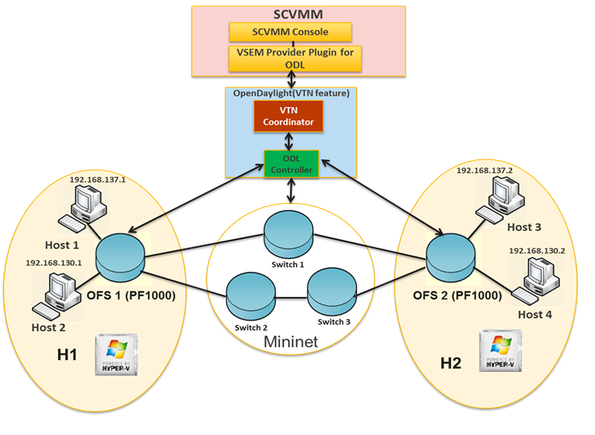

   Set-Up Diagram

**The topology used in this set-up is:**

-  A SCVMM with VSEM Provider installed and a running VTN Coordinator
   and OpenDaylight with VTN Feature installed.

-  PF1000 virtual switch extension has been installed in the two Hyper-V
   servers as it implements the OpenFlow capability in Hyper-V.

-  Three OpenFlow switches simulated using mininet and connected to
   Hyper-V.

-  Four VM’s hosted using SCVMM.

**It is implemented as two major components:**

-  SCVMM

-  OpenDaylight (VTN Feature)

-  VTN Coordinator

VTN Coordinator
^^^^^^^^^^^^^^^

OpenDaylight VTN as Network Service provider for SCVMM where VSEM
provider is added in the Network Service which will handle all requests
from SCVMM and communicate with the VTN Coordinator. It is used to
manage the network virtualization provided by OpenDaylight.

Installing HTTPS in VTN Coordinator
'''''''''''''''''''''''''''''''''''

-  System Center Virtual Machine Manager (SCVMM) supports only https
   protocol.

**Apache Portable Runtime (APR) Installation Steps**

-  Enter the command "yum install **apr**" in VTN Coordinator installed
   machine.

-  In /usr/bin, create a soft link as "ln –s /usr/bin/apr-1-config
   /usr/bin/apr-config".

-  Extract tomcat under "/usr/share/java" by using the below command
   "tar -xvf apache-tomcat-8.0.27.tar.gz –C /usr/share/java".

.. note::

    Please go through the bleow link to download
    apache-tomcat-8.0.27.tar.gz file,
    https://archive.apache.org/dist/tomcat/tomcat-8/v8.0.27/bin/

-  Please go to the directory "cd
   /usr/share/java/apache-tomcat-8.0.27/bin and unzip tomcat-native.gz
   using this command "tar -xvf tomcat-native.gz".

-  Go to the directory "cd
   /usr/share/java/apache-tomcat-8.0.27/bin/tomcat-native-1.1.33-src/jni/native".

-  Enter the command "./configure --with-os-type=bin
   --with-apr=/usr/bin/apr-config".

-  Enter the command "make" and "make install".

-  Apr libraries are successfully installed in "/usr/local/apr/lib".

**Enable HTTP/HTTPS in VTN Coordinator**

Enter the command "firewall-cmd --zone=public --add-port=8083/tcp
--permanent" and "firewall-cmd --reload" to enable firewall settings in
server.

**Create a CA’s private key and a self-signed certificate in server**

-  Execute the following command "openssl req -x509 -days 365
   -extensions v3\_ca -newkey rsa:2048 –out /etc/pki/CA/cacert.pem
   –keyout /etc/pki/CA/private/cakey.pem" in a single line.

+-----------------------+----------------------------------------------------+
| Argument              | Description                                        |
+=======================+====================================================+
| Country Name          | | Specify the country code.                        |
|                       | | For example, JP                                  |
+-----------------------+----------------------------------------------------+
| State or Province     | | Specify the state or province.                   |
| Name                  | | For example, Tokyo                               |
+-----------------------+----------------------------------------------------+
| Locality Name         | | Locality Name                                    |
|                       | | For example, Chuo-Ku                             |
+-----------------------+----------------------------------------------------+
| Organization Name     | Specify the company.                               |
+-----------------------+----------------------------------------------------+
| Organizational Unit   | Specify the department, division, or the like.     |
| Name                  |                                                    |
+-----------------------+----------------------------------------------------+
| Common Name           | Specify the host name.                             |
+-----------------------+----------------------------------------------------+
| Email Address         | Specify the e-mail address.                        |
+-----------------------+----------------------------------------------------+

-  Execute the following commands: "touch /etc/pki/CA/index.txt" and
   "echo 00 > /etc/pki/CA/serial" in server after setting your CA’s
   private key.

**Create a private key and a CSR for web server**

-  Execute the following command "openssl req -new -newkey rsa:2048 -out
   csr.pem –keyout /usr/local/vtn/tomcat/conf/key.pem" in a single line.

-  Enter the PEM pass phrase: Same password you have given in CA’s
   private key PEM pass phrase.

+-----------------------+----------------------------------------------------+
| Argument              | Description                                        |
+=======================+====================================================+
| Country Name          | | Specify the country code.                        |
|                       | | For example, JP                                  |
+-----------------------+----------------------------------------------------+
| State or Province     | | Specify the state or province.                   |
| Name                  | | For example, Tokyo                               |
+-----------------------+----------------------------------------------------+
| Locality Name         | | Locality Name                                    |
|                       | | For example, Chuo-Ku                             |
+-----------------------+----------------------------------------------------+
| Organization Name     | Specify the company.                               |
+-----------------------+----------------------------------------------------+
| Organizational Unit   | Specify the department, division, or the like.     |
| Name                  |                                                    |
+-----------------------+----------------------------------------------------+
| Common Name           | Specify the host name.                             |
+-----------------------+----------------------------------------------------+
| Email Address         | Specify the e-mail address.                        |
+-----------------------+----------------------------------------------------+
| A challenge password  | Specify the challenge password.                    |
+-----------------------+----------------------------------------------------+
| An optional company   | Specify an optional company name.                  |
| name                  |                                                    |
+-----------------------+----------------------------------------------------+

**Create a certificate for web server**

-  Execute the following command "openssl ca –in csr.pem –out
   /usr/local/vtn/tomcat/conf/cert.pem –days 365 –batch" in a single
   line.

-  Enter pass phrase for /etc/pki/CA/private/cakey.pem: Same password
   you have given in CA’s private key PEM pass phrase.

-  Open the tomcat file using "vim /usr/local/vtn/tomcat/bin/tomcat".

-  Include the line " TOMCAT\_PROPS="$TOMCAT\_PROPS
   -Djava.library.path=\\"/usr/local/apr/lib\\"" " in 131th line and
   save the file.

**Edit server.xml file and restart the server**

-  Open the server.xml file using "vim
   /usr/local/vtn/tomcat/conf/server.xml" and add the below lines.

   ::

       <Connector port="${vtn.port}" protocol="HTTP/1.1" SSLEnabled="true"
       maxThreads="150" scheme="https" secure="true"
       SSLCertificateFile="/usr/local/vtn/tomcat/conf/cert.pem"
       SSLCertificateKeyFile="/usr/local/vtn/tomcat/conf/key.pem"
       SSLPassword=same password you have given in CA's private key PEM pass phrase
       connectionTimeout="20000" />

-  Save the file and restart the server.

-  To stop vtn use the following command.

   ::

       /usr/local/vtn/bin/vtn_stop

-  To start vtn use the following command.

   ::

       /usr/local/vtn/bin/vtn_start

-  Copy the created CA certificate from cacert.pem to cacert.crt by
   using the following command,

   ::

       openssl x509 –in /etc/pki/CA/cacert.pem –out cacert.crt

   **Checking the HTTP and HTTPS connection from client**

-  You can check the HTTP connection by using the following command:

   ::

       curl -X GET -H 'contenttype:application/json' -H 'username:admin' -H 'password:adminpass' http://<server IP address>:8083/vtn-webapi/api_version.json

-  You can check the HTTPS connection by using the following command:

   ::

       curl -X GET -H 'contenttype:application/json' -H 'username:admin' -H 'password:adminpass' https://<server IP address>:8083/vtn-webapi/api_version.json --cacert /etc/pki/CA/cacert.pem

-  The response should be like this for both HTTP and HTTPS:

   ::

       {"api_version":{"version":"V1.4"}}

Prerequisites to create Network Service in SCVMM machine, Please follow the below steps
^^^^^^^^^^^^^^^^^^^^^^^^^^^^^^^^^^^^^^^^^^^^^^^^^^^^^^^^^^^^^^^^^^^^^^^^^^^^^^^^^^^^^^^

1.  Please go through the below link to download VSEM Provider zip file,
    https://nexus.opendaylight.org/content/groups/public/org/opendaylight/vtn/application/vtnmanager-vsemprovider/1.2.0-Boron/vtnmanager-vsemprovider-1.2.0-Boron-bin.zip

2.  Unzip the vtnmanager-vsemprovider-1.2.0-Boron-bin.zip file
    anywhere in your SCVMM machine.

3.  Stop SCVMM service from **"service manager→tools→servers→select
    system center virtual machine manager"** and click stop.

4.  Go to **"C:/Program Files"** in your SCVMM machine. Inside
    **"C:/Program Files"**, create a folder named as **"ODLProvider"**.

5.  Inside **"C:/Program Files/ODLProvider"**, create a folder named as
    "Module" in your SCVMM machine.

6.  Inside "C:/Program Files/ODLProvider/Module", Create two folders
    named as **"Odl.VSEMProvider"** and **"VSEMOdlUI"** in your SCVMM
    machine.

7.  Copy the **"VSEMOdl.dll"** file from
    **"ODL\_SCVMM\_PROVIDER/ODL\_VSEM\_PROVIDER"** to **"C:/Program
    Files/ODLProvider/Module/Odl.VSEMProvider"** in your SCVMM machine.

8.  Copy the **"VSEMOdlProvider.psd1"** file from
    **"application/vsemprovider/VSEMOdlProvider/VSEMOdlProvider.psd1"**
    to **"C:/Program Files/ODLProvider/Module/Odl.VSEMProvider"** in
    your SCVMM machine.

9.  Copy the **"VSEMOdlUI.dll"** file from
    **"ODL\_SCVMM\_PROVIDER/ODL\_VSEM\_PROVIDER\_UI"** to **"C:/Program
    Files/ODLProvider/Module/VSEMOdlUI"** in your SCVMM machine.

10. Copy the **"VSEMOdlUI.psd1"** file from
    **"application/vsemprovider/VSEMOdlUI"** to **"C:/Program
    Files/ODLProvider/Module/VSEMOdlUI"** in your SCVMM machine.

11. Copy the **"reg\_entry.reg"** file from
    **"ODL\_SCVMM\_PROVIDER/Register\_settings"** to your SCVMM desktop
    and double click the **"reg\_entry.reg"** file to install registry
    entry in your SCVMM machine.

12. Download **"PF1000.msi"** from this link,
    https://www.pf-info.com/License/en/index.php?url=index/index_non_buyer
    and place into **"C:/Program Files/Switch Extension Drivers"** in
    your SCVMM machine.

13. Start SCVMM service from **"service manager→tools→servers→select
    system center virtual machine manager"** and click start.

System Center Virtual Machine Manager (SCVMM)
^^^^^^^^^^^^^^^^^^^^^^^^^^^^^^^^^^^^^^^^^^^^^

It supports two major features:

-  Failover Clustering

-  Live Migration

Failover Clustering
'''''''''''''''''''

A single Hyper-V can host a number of virtual machines. If the host were
to fail then all of the virtual machines that are running on it will
also fail, thereby resulting in a major outage. Failover clustering
treats individual virtual machines as clustered resources. If a host
were to fail then clustered virtual machines are able to fail over to a
different Hyper-V server where they can continue to run.

Live Migration
''''''''''''''

Live Migration is used to migrate the running virtual machines from one
Hyper-V server to another Hyper-V server without any interruptions.
Please go through the below video for more details,

-  https://youtu.be/34YMOTzbNJM

SCVMM User Guide
^^^^^^^^^^^^^^^^

-  Please go through the below link for SCVMM user guide:
   https://wiki.opendaylight.org/images/c/ca/ODL_SCVMM_USER_GUIDE_final.pdf

-  Please go through the below links for more details

   -  OpenDaylight SCVMM VTN Integration: https://youtu.be/iRt4dxtiz94

   -  OpenDaylight Congestion Control with SCVMM VTN:
      https://youtu.be/34YMOTzbNJM
