============================
OpenDaylight Developer Guide
============================

:Author: OpenDaylight Community documentation@opendaylight.org
:Date:   2014-08-03

Getting started with Git and Gerrit
===================================

Overview of Git and Gerrit
--------------------------

Git is an opensource distributed version control system (dvcs) written
in the C language and originally developed by Linus Torvalds and others
to manage the Linux kernel. In Git, there is no central copy of the
repository. After you have cloned the repository, you have a functioning
copy of the source code with all the branches and tagged releases, in
your local repository.

Gerrit is an opensource web-based collaborative code review tool that
integrates with Git. It was developed at Google by Shawn Pearce. Gerrit
provides a framework for reviewing code commits before they are accepted
into the code base. Changes can be uploaded to Gerrit by any user.
However, the changes are not made a part of the project until a code
review is completed. Gerrit is also a good collaboration tool for
storing the conversations that occur around the code commits.

The OpenDaylight source code is hosted in a repository in Git.
Developers must use Gerrit to commit code to the OpenDaylight
repository.

    **Note**

    For more information on Git, see http://git-scm.com/. For more
    information on Gerrit, see https://code.google.com/p/gerrit/.

Setting up a Gerrit account
---------------------------

1. Using a Google Chrome or Mozilla Firefox browser, go to
   https://git.opendaylight.org/gerrit

The main page shows existing Gerrit requests. These are patches that
have been pushed to the repository and not yet verified, reviewed, and
merged.

    **Note**

    If you already have an OpenDaylight account, you can click **Sign
    In** in the top right corner of the page and follow the instructions
    to enter the OpenDaylight page.

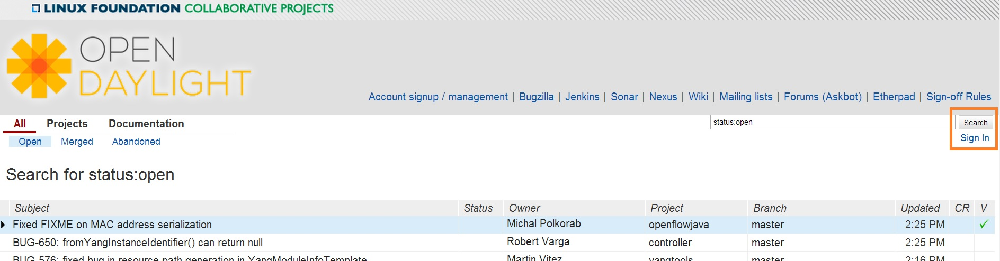

   Signing in to OpenDaylight account

1. If you do not have an existing OpenDaylight account, click **Account
   signup/management** on the top bar of the main Gerrit page.

The **WS02 Identity Server** page is displayed.

.. figure:: ./images/Gerrit_setup.jpg
   :alt: Gerrit Account signup/management link

   Gerrit Account signup/management link

1. In the **WS02 Identity Server** page, click **Sign-up** in the left
   pane.

There is also an option to authenticate your sign in with OpenID. This
option is not described in this document.

.. figure:: ./images/sign-up.jpg
   :alt: Sign-up link for Gerrit account

   Sign-up link for Gerrit account

1. Click on the **Sign-up with User Name/Password** image on the right
   pane to continue to the actual sign-up page.

.. figure:: ./images/signup_image.jpg
   :alt: Sign-up with User Name/Password Image

   Sign-up with User Name/Password Image

1. Fill out the details in the account creation form and then click
   **Submit**.

.. figure:: ./images/form_details.jpg
   :alt: Filling out the details

   Filling out the details

You now have an OpenDaylight account that can be used with Gerrit to
pull the OpenDaylight code.

Generating SSH keys for your system
-----------------------------------

You must have SSH keys for your system to register with your Gerrit
account. The method for generating SSH keys is different for different
types of operating systems.

The key you register with Gerrit must be identical to the one you will
use later to pull or edit the code. For example, if you have a
development VM which has a different UID login and keygen than that of
your laptop, the SSH key you generate for the VM is different from the
laptop. If you register the SSH key generated on your VM with Gerrit and
do not reuse it on your laptop when using Git on the laptop, the pull
fails.

    **Note**

    For more information on SSH keys for Ubuntu, see
    https://help.ubuntu.com/community/SSH/OpenSSH/Keys. For generating
    SSH keys for Windows, see
    https://help.github.com/articles/generating-ssh-keys.

For a system running Ubuntu operating system, follow the steps below:

1. Run the following command:

::

    mkdir ~/.ssh
    chmod 700 ~/.ssh
    ssh-keygen -t rsa

1. You are prompted for a location to save the keys, and a passphrase
   for the keys.

This passphrase protects your private key while it is stored on the hard
drive. You must use the passphrase to use the keys every time you need
to login to a key-based system.

::

    Generating public/private rsa key pair.
    Enter file in which to save the key (/home/b/.ssh/id_rsa):
    Enter passphrase (empty for no passphrase):
    Enter same passphrase again:
    Your identification has been saved in /home/b/.ssh/id_rsa.
    Your public key has been saved in /home/b/.ssh/id_rsa.pub.

Your public key is now available as **.ssh/id\_rsa.pub** in your home
folder.

Registering your SSH key with Gerrit
------------------------------------

1. Using a Google Chrome or Mozilla Firefox browser, go to
   https://git.opendaylight.org/gerrit.

1. Click **Sign In** to access the OpenDaylight repository.


   Signin in to OpenDaylight repository

1. Click your name in the top right corner of the window and then click
   **Settings**.

The **Settings** page is displayed.


   Settings page for your Gerrit account

1. Click **SSH Public Keys** under **Settings**.

2. Click **Add Key**.

3. In the **Add SSH Public Key** text box, paste the contents of your
   **id\_rsa.pub** file and then click **Add**.

.. figure:: ./images/SSH_keys.jpg
   :alt: Adding your SSH key

   Adding your SSH key

To verify your SSH key is working correctly, try using an SSH client to
connect to Gerrit’s SSHD port.

::

    $ ssh -p 29418 <sshusername>@git.opendaylight.org
    Enter passphrase for key '/home/cisco/.ssh/id_rsa':
    ****    Welcome to Gerrit Code Review    ****
    Hi <user>, you have successfully connected over SSH.
    Unfortunately, interactive shells are disabled.
    To clone a hosted Git repository, use: git clone ssh://<user>@git.opendaylight.org:29418/REPOSITORY_NAME.git
    Connection to git.opendaylight.org closed.

You can now proceed to either Pulling, Hacking, and Pushing the Code
from the CLI or Pulling, Hacking, and Pushing the Code from Eclipse
depending on your implementation.

Pulling and Pushing the Code from the CLI
=========================================

OpenDayligh is a collection of projects, each with their own code
repository. This section provides a general guide for to pulling,
hacking, and pushing the code for each project. For project specific
detail, refer to the project’s section in this guide.

Code reviews are enabled through Gerrit. For setting up Gerrit see the
section on Getting started with Git and Gerrit.

    **Note**

    You will need to perform the Gerrit Setup before you can access git
    via ssh as described below.

Pulling code via Git CLI
------------------------

Pull the code by cloning the project’s repository.

::

     git clone ssh://<username>@git.opendaylight.org:29418/<project_repo_name>.git

where <username> is your OpenDaylight username, and
<project\_repo\_name> is the name of the repository for project you are
trying to pull. Here is the current list of project repository names:

aaa, affinity, bgpcep, controller, defense4all, dlux, docs,
groupbasedpolicy, integration, l2switch, lispflowmapping, odlparent,
opendove, openflowjava, openflowplugin, opflex, ovsdb, packetcable,
reservation, sdninterfaceapp, sfc, snbi, snmp4sdn, toolkit, ttp, vtn,
yangtools.

For an anonymous git clone, you can use:

::

     git clone https://git.opendaylight.org/gerrit/p/<project_repo_name>.git

Setting up Gerrit Change-id Commit Message Hook
-----------------------------------------------

-  This command inserts a unique Change-Id tag in the footer of a commit
   message. This step is optional but highly recommended for tracking
   changes.

::

     cd <project_repo_name>
     scp -p -P 29418 <username>@git.opendaylight.org:hooks/commit-msg .git/hooks/
     chmod 755 .git/hooks/commit-msg

-  Install and setup Git-review. Git-review is a great tool to simplify
   the hassle of using several git commands to submit a patch for
   review. Refer to `How to install and push codes with
   git-review <http://www.mediawiki.org/wiki/Gerrit/git-review#Installation%7Chere>`__
   for instructions. After initializing git-review, both commit-msg hook
   and a remote repo named gerrit will be created and a patch can be
   submitted to Gerrit with a single "git review" command.

-  Now you can start making your code changes.

Building the code
-----------------

While you are in the <project\_repo\_name> directory, run

::

     mvn clean install

To run without unitests you can skip building those tests running the
following:

::

     mvn clean install -DskipTests
     /* instead of "mvn clean install" */

Runing OpenDaylight from local build
------------------------------------

Change to the karaf distribution sub-directory, and run

::

     ./target/assembly/bin/karaf

At this point the OpenDaylight controller is running. You can now open a
web browser and point your browser at http://localhost:8080/

.. figure:: ./images/800p_OpenDaylight_Login.jpg
   :alt: OpenDaylight Main Page

   OpenDaylight Main Page

Commit the code using Git CLI
-----------------------------

    **Note**

    To be accepted, all code mustcome with a `developer certificate of
    origin <http://elinux.org/Developer_Certificate_Of_Origin>`__ as
    expressed by having a Signed-off-by. This means that you are
    asserting that you have made the change and you understand that the
    work was done as part of an open-source license.

::

    Developer's Certificate of Origin 1.1

            By making a contribution to this project, I certify that:

            (a) The contribution was created in whole or in part by me and I
                have the right to submit it under the open source license
                indicated in the file; or

            (b) The contribution is based upon previous work that, to the best
                of my knowledge, is covered under an appropriate open source
                license and I have the right under that license to submit that
                work with modifications, whether created in whole or in part
                by me, under the same open source license (unless I am
                permitted to submit under a different license), as indicated
                in the file; or

            (c) The contribution was provided directly to me by some other
                person who certified (a), (b) or (c) and I have not modified
                it.

            (d) I understand and agree that this project and the contribution
                are public and that a record of the contribution (including all
                personal information I submit with it, including my sign-off) is
                maintained indefinitely and may be redistributed consistent with
                this project or the open source license(s) involved.

**Mechanically you do it this way**:

::

    git commit --signoff

You will be prompted for a commit message. If you are fixing a buzilla
bug you can add the associated bug number to your commit message and it
will get linked from Gerrit:

**For Example:.**

::

    Fix for bug 2.

    Signed-off-by: Ed Warnicke <eaw@cisco.com>
    # Please enter the commit message for your changes. Lines starting
    # with '#' will be ignored, and an empty message aborts the commit.
    # On branch develop
    # Changes to be committed:
    #   (use "git reset HEAD <file>..." to unstage)
    #
    #       modified:   README
    #

Pulling the Code changes via Git CLI
------------------------------------

Pull the latest changes from the remote repository

::

    git remote update
    git rebase origin/<project_main_branch_name>

where <project\_main\_branch\_name> is the the branch you want to commit
to. For most projects this is master branch. For some projects such as
lispflowmapping, a different branch name (develop in the case of
lispflowmapping) should be used.

Pushing the Code via Git CLI
----------------------------

Use git review to push your changes back to the remote repository using:

::

     git review

You can set a topic for your patch by:

::

     git review -t <topic>

You will get a message pointing you to your gerrit request like:

::

    ==========================
    remote: Resolving deltas: 100% (2/2) +
    remote: Processing changes: new: 1, refs: 1, done    +
    remote: +
    remote: New Changes: +
    remote:   http://git.opendaylight.org/gerrit/64 +
    remote: +
    ==========================

The Jenkins Controller User will verify your code and post the result on
the your gerrit request.

Viewing your Changes in Gerrit
~~~~~~~~~~~~~~~~~~~~~~~~~~~~~~

Follow the link you got above to see your commit in Gerrit:

.. figure:: ./images/gerrit_code_review.jpg
   :alt: Gerritt Code Review Sample

   Gerritt Code Review Sample

Note that the Jenkins Controller User has verified your code and at the
bottom is a link to the Jenkins build.

Once your code has been reviewed and submitted by a committer it will be
merged into the authoritative repo, which would look like this:

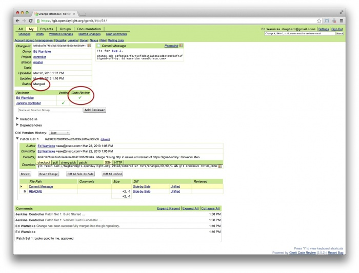

   Gerritt Code Merge Sample

Troubleshooting
~~~~~~~~~~~~~~~

1. **What to do if your Firewall blocks port 29418**

There have been reports that many corporate firewalls block port 29418.
If that’s the case, please follow the `Setting up HTTP in
Gerrit <https://wiki.opendaylight.org/view/OpenDaylight_Controller:Setting_up_HTTP_in_Gerrit>`__
instructions and use git URL:

::

    git clone https://<your_username>@git.opendaylight.org/gerrit/p/<project_repo_name>.git

You will be prompted for the password you generated in `Setting up HTTP
in
Gerrit <https://wiki.opendaylight.org/view/OpenDaylight_Controller:Setting_up_HTTP_in_Gerrit>`__.

All other instructions on this page remain unchanged.

To download pre-built images with ODP bootstraps see the following
Github project:

`Pre-Built OpenDaylight VM
Images <https://github.com/nerdalert/OpenDaylight-Lab>`__

Developing Apps on the OpenDaylight controller
==============================================

This section provides information that is required to develop apps on
the OpenDaylight controller.

You can either develop apps within the controller using the model-driven
SAL (MD-SAL) archetype or develop external apps and use the RESTCONF to
communicate with the controller.

Overview
--------

This section enables you to get started with app development within the
OpenDaylight controller. In this example, you perform the following
steps to develop an app.

1. Create a local repository for the code using a simple build process.

2. Start the OpenDaylight controller.

3. Test a simple remote procedure call (RPC) which you have created
   based on the principle of *hello world*.

Pre requisites
--------------

This example requires the following.

-  A development environment with following set up and working correctly
   from the shell:

   -  Maven 3.1.1 or later

   -  Java 7- or Java 8-compliant JDK

   -  An appropriate Maven settings.xml file. A simple way to get the
      default OpenDaylight settings.xml file is:

      ::

          cp -n ~/.m2/settings.xml{,.orig} ; \wget -q -O - https://raw.githubusercontent.com/opendaylight/odlparent/stable/lithium/settings.xml > ~/.m2/settings.xml

    **Note**

    If you are using Linux or Mac OS X as your development OS, your
    local repository is ~/.m2/repository. For other platforms the local
    repository location will vary.

Building an example module
--------------------------

To develop an app perform the following steps.

1. Create an *Example* project using Maven and an archetype called the
   *opendaylight-startup-archetype*. If you are downloading this project
   for the first time, then it will take sometime to pull all the code
   from the remote repository.

   .. code:: shell

       mvn archetype:generate -DarchetypeGroupId=org.opendaylight.controller -DarchetypeArtifactId=opendaylight-startup-archetype \
       -DarchetypeRepository=https://nexus.opendaylight.org/content/repositories/public/ \
       -DarchetypeCatalog=https://nexus.opendaylight.org/content/repositories/public/archetype-catalog.xml

2. Update the properties values as follows. Ensure that the groupid and
   the artifactid is lower case.

   .. code:: shell

       Define value for property 'groupId': : org.opendaylight.example
       Define value for property 'artifactId': : example
       Define value for property 'version':  1.0-SNAPSHOT: : 1.0.0-SNAPSHOT
       Define value for property 'package':  org.opendaylight.example: :
       Define value for property 'classPrefix':  ${artifactId.substring(0,1).toUpperCase()}${artifactId.substring(1)}
       Define value for property 'copyright': : Copyright (c) 2015 Yoyodyne, Inc.

3. Accept the default value of classPrefix that is,
   ``(${artifactId.substring(0,1).toUpperCase()}${artifactId.substring(1)})``.
   The classPrefix creates a Java Class Prefix by capitalizing the first
   character of the artifactId.

       **Note**

       In this scenario, the classPrefix used is "Example". Create a
       top-level directory for the archetype.

   .. code:: shell

       ${artifactId}/
       example/
       cd example/
       api/
       artifacts/
       features/
       impl/
       karaf/
       pom.xml

4. Build the *example* project.

       **Note**

       Depending on your development machine’s specification this might
       take a little while. Ensure that you are in the project’s root
       directory, example/, and then issue the build command, shown
       below.

   .. code:: shell

       mvn clean install

5. Start the *example* project for the first time.

   .. code:: shell

       cd karaf/target/assembly/bin
       ls
       ./karaf

6. Wait for the karaf cli that appears as follows. Wait for OpenDaylight
   to fully load all the components. This can take a minute or two after
   the prompt appears. Check the CPU on your dev machine, specifically
   the Java process to see when it calms down.

   .. code:: shell

       opendaylight-user@root>

7. Verify if the “example” module is built and search for the log entry
   which includes the entry *ExampleProvider Session Initiated*.

   .. code:: shell

       log:display | grep Example

8. Shutdown the OpenDaylight through the console by using the following
   command.

   .. code:: shell

       shutdown -f

Defining a Simple Hello World RPC
---------------------------------

1.  | Run the maven archetype *opendaylight-startup-archetype*, and
      create the *hello* project.

    .. code:: shell

        mvn archetype:generate -DarchetypeGroupId=org.opendaylight.controller -DarchetypeArtifactId=opendaylight-startup-archetype \
        -DarchetypeRepository=http://nexus.opendaylight.org/content/repositories/opendaylight.snapshot/ \
        -DarchetypeCatalog=http://nexus.opendaylight.org/content/repositories/opendaylight.snapshot/archetype-catalog.xml

2.  Update the Properties values as follows.

    .. code:: shell

        Define value for property 'groupId': : org.opendaylight.hello
        Define value for property 'artifactId': : hello
        Define value for property 'version':  1.0-SNAPSHOT: : 1.0.0-SNAPSHOT
        Define value for property 'package':  org.opendaylight.hello: :
        Define value for property 'classPrefix':  ${artifactId.substring(0,1).toUpperCase()}${artifactId.substring(1)}
        Define value for property 'copyright': : Copyright(c) Yoyodyne, Inc.

3.  View the *hello* project.

    .. code:: shell

        cd hello/
        ls -1
        api
        artifacts
        features
        impl
        karaf
        pom.xml

4.  Build *hello* project by using the following command.

    .. code:: shell

        mvn clean install

5.  Verify that the project is functioning by executing karaf.

    .. code:: shell

        cd karaf/target/assembly/bin
        ./karaf

6.  | The karaf cli appears as follows.
    | NOTE: Remember to wait for OpenDaylight to load completely. Verify
      that the Java process CPU has stabilized.+

    .. code:: shell

        opendaylight-user@root>

7.  Verify that the *hello* module is loaded by checking the log.

    .. code:: shell

        log:display | grep Hello

8.  Shutdown karaf.

    .. code:: shell

        shutdown -f

9.  Return to the top of the directory structure:

    .. code:: shell

        cd ../../../../

10. View the entry point to understand where the log line came from. The
    entry point is in the impl project:

    .. code:: shell

        impl/src/main/java/org/opendaylight/hello/impl/HelloProvider.java

11. Add any new things that you are doing in your implementation by
    using the HelloProvider.onSessionInitiate method. Its analogous to
    an Activator.

    .. code:: java

        @Override
            public void onSessionInitiated(ProviderContext session) {
                LOG.info("HelloProvider Session Initiated");
            }

Add a simple HelloWorld RPC API
-------------------------------

1. Navigate to the file.

   ::

       Edit
       api/src/main/yang/hello.yang

2. Edit this file as follows. In the following example, we are adding
   the code in a YANG module to define the *hello-world* RPC:

   .. code:: yang

       module hello {
           yang-version 1;
           namespace "urn:opendaylight:params:xml:ns:yang:hello";
           prefix "hello";
           revision "2015-01-05" {
               description "Initial revision of hello model";
           }
           rpc hello-world {
               input {
                   leaf name {
                       type string;
                   }
               }
               output {
                   leaf greating {
                       type string;
                   }
               }
           }
       }

3. Return to the hello/api directory and build your API as follows.

   .. code:: shell

       cd ../../../
       mvn clean install

Implement the HelloWorld RPC API
--------------------------------

1. Define the HelloService, which is invoked through the *hello-world*
   API.

   .. code:: shell

       cd ../impl/src/main/java/org/opendaylight/hello/impl/

2. Create a new file called HelloWorldImpl.java and add in the code
   below.

   .. code:: java

       package org.opendaylight.hello.impl;
       import java.util.concurrent.Future;
       import org.opendaylight.yang.gen.v1.urn.opendaylight.params.xml.ns.yang.hello.rev150105.HelloService;
       import org.opendaylight.yang.gen.v1.urn.opendaylight.params.xml.ns.yang.hello.rev150105.HelloWorldInput;
       import org.opendaylight.yang.gen.v1.urn.opendaylight.params.xml.ns.yang.hello.rev150105.HelloWorldOutput;
       import org.opendaylight.yang.gen.v1.urn.opendaylight.params.xml.ns.yang.hello.rev150105.HelloWorldOutputBuilder;
       import org.opendaylight.yangtools.yang.common.RpcResult;
       import org.opendaylight.yangtools.yang.common.RpcResultBuilder;
       public class HelloWorldImpl implements HelloService {
           @Override
           public Future<RpcResult<HelloWorldOutput>> helloWorld(HelloWorldInput input) {
               HelloWorldOutputBuilder helloBuilder = new HelloWorldOutputBuilder();
               helloBuilder.setGreating("Hello " + input.getName());
               return RpcResultBuilder.success(helloBuilder.build()).buildFuture();
           }
       }

3. The HelloProvider.java file is in the current directory. Register the
   RPC that you created in the *hello.yang* file in the
   HelloProvider.java file. You can either edit the HelloProvider.java
   to match what is below or you can simple replace it with the code
   below.

   .. code:: java

       /*
        * Copyright(c) Yoyodyne, Inc. and others.  All rights reserved.
        *
        * This program and the accompanying materials are made available under the
        * terms of the Eclipse Public License v1.0 which accompanies this distribution,
        * and is available at http://www.eclipse.org/legal/epl-v10.html
        */
       package org.opendaylight.hello.impl;

       import org.opendaylight.controller.sal.binding.api.BindingAwareBroker.ProviderContext;
       import org.opendaylight.controller.sal.binding.api.BindingAwareBroker.RpcRegistration;
       import org.opendaylight.controller.sal.binding.api.BindingAwareProvider;
       import org.opendaylight.yang.gen.v1.urn.opendaylight.params.xml.ns.yang.hello.rev150105.HelloService;
       import org.slf4j.Logger;
       import org.slf4j.LoggerFactory;

       public class HelloProvider implements BindingAwareProvider, AutoCloseable {
           private static final Logger LOG = LoggerFactory.getLogger(HelloProvider.class);
           private RpcRegistration<HelloService> helloService;
           @Override
           public void onSessionInitiated(ProviderContext session) {
               LOG.info("HelloProvider Session Initiated");
               helloService = session.addRpcImplementation(HelloService.class, new HelloWorldImpl());
           }
           @Override
           public void close() throws Exception {
               LOG.info("HelloProvider Closed");
               if (helloService != null) {
                   helloService.close();
               }
           }
       }

4. Optionally, you can also build the Java classes which will register
   the new RPC. This is useful to test the edits you have made to
   HelloProvider.java and HelloWorldImpl.java.

   .. code:: shell

       cd ../../../../../../../
       mvn clean install

5. Return to the top level directory

   .. code:: shell

       cd ../

6. Build the entire *hello* again, which will pickup the changes you
   have made and build them into your project:

   .. code:: shell

       mvn clean install

Execute the *hello* project for the first time
----------------------------------------------

1. Run karaf

   .. code:: shell

       cd ../karaf/target/assembly/bin
       ./karaf

2. Wait for the project to load completely. Then view the log to see the
   loaded *Hello* Module:

   .. code:: shell

       log:display | grep Hello

Test the *hello-world* RPC via REST
-----------------------------------

There are a lot of ways to test your RPC. Following are some examples.

1. Using the API Explorer through HTTP

2. Using a browser REST client

Using the API Explorer through HTTP
~~~~~~~~~~~~~~~~~~~~~~~~~~~~~~~~~~~

1. | Navigate to `apidoc
     UI <http://localhost:8181/apidoc/explorer/index.html>`__ with your
     web browser.
   | NOTE: In the URL mentioned above, Change *localhost* to the IP/Host
     name to reflect your development machine’s network address.

2. Select

   .. code:: shell

       hello(2015-01-05)

3. Select

   ::

       POST /operations/hello:hello-world

4. Provide the required value.

   .. code:: json

       {"hello:input": { "name":"Your Name"}}

5. Click the button.

6. Enter the username and password, by default the credentials are
   admin/admin.

7. In the response body you should see.

   .. code:: json

       {
         "output": {
           "greating": "Hello Your Name"
         }
       }

Using a browser REST client
~~~~~~~~~~~~~~~~~~~~~~~~~~~

| For example, use the following information in the Firefox plugin
  *RESTClient*
  [`https://github.com/chao/RESTClient} <https://github.com/chao/RESTClient}>`__

::

    POST: http://192.168.1.43:8181/restconf/operations/hello:hello-world

Header:

::

    application/json

Body:

.. code:: json

    {"input": {
        "name": "Andrew"
      }
    }

Troubleshooting
---------------

If you get a response code 501 while attempting to POST
/operations/hello:hello-world, check the file: HelloProvider.java and
make sure the helloService member is being set. By not invoking
"session.addRpcImplementation()" the REST API will be unable to map
/operations/hello:hello-world url to HelloWorldImpl.

ALTO Developer Guide
====================

Overview
--------

The topics of this guide are:

1. How to add alto projects as dependencies;

2. How to put/fetch data from ALTO;

3. Basic API and DataType;

4. How to use customized service implementations.

Adding ALTO Projects as Dependencies
------------------------------------

Most ALTO packages can be added as dependencies in Maven projects by
putting the following code in the *pom.xml* file.

::

    <dependency>
        <groupId>org.opendaylight.alto</groupId>
        <artifactId>${THE_NAME_OF_THE_PACKAGE_YOU_NEED}</artifactId>
        <version>${ALTO_VERSION}</version>
    </dependency>

The current stable version for ALTO is ``0.2.0-Beryllium``.

Putting/Fetching data from ALTO
-------------------------------

Using RESTful API
~~~~~~~~~~~~~~~~~

There are two kinds of RESTful APIs for ALTO: the one provided by
``alto-northbound`` which follows the formats defined in `RFC
7285 <https://tools.ietf.org/html/rfc7285>`__, and the one provided by
RESTCONF whose format is defined by the YANG model proposed in `this
draft <https://tools.ietf.org/html/draft-shi-alto-yang-model-03>`__.

One way to get the URLs for the resources from ``alto-northbound`` is to
visit the IRD service first where there is a ``uri`` field for every
entry. However, the IRD service is not yet implemented so currently the
developers have to construct the URLs themselves. The base URL is
``/alto`` and below is a list of the specific paths defined in
``alto-core/standard-northbound-route`` using Jersey ``@Path``
annotation:

-  ``/ird/{rid}``: the path to access *IRD* services;

-  ``/networkmap/{rid}[/{tag}]``: the path to access *Network Map* and
   *Filtered Network Map* services;

-  ``/costmap/{rid}[/{tag}[/{mode}/{metric}]]``: the path to access
   *Cost Map* and *Filtered Cost Map* services;

-  ``/endpointprop``: the path to access *Endpoint Property* services;

-  ``/endpointcost``: the path to access *Endpoint Cost* services.

    **Note**

    The segments in brackets are optional.

If you want to fetch the data using RESTCONF, it is highly recommended
to take a look at the ``apidoc`` page
(`http://{controller\_ip}:8181/apidoc/explorer/index.html <http://{controller_ip}:8181/apidoc/explorer/index.html>`__)
after installing the ``odl-alto-release`` feature in karaf.

It is also worth pointing out that ``alto-northbound`` only supports
``GET`` and ``POST`` operations so it is impossible to manipulate the
data through its RESTful APIs. To modify the data, use ``PUT`` and
``DELETE`` methods with RESTCONF.

    **Note**

    The current implementation uses the ``configuration`` data store and
    that enables the developers to modify the data directly through
    RESTCONF. In the future this approach might be disabled in the core
    packages of ALTO but may still be available as an extension.

Using MD-SAL
~~~~~~~~~~~~

You can also fetch data from the datastore directly.

First you must get the access to the datastore by registering your
module with a data broker.

Then an ``InstanceIdentifier`` must be created. Here is an example of
how to build an ``InstanceIdentifier`` for a *network map*:

::

    import org.opendaylight...alto...Resources;
    import org.opendaylight...alto...resources.NetworkMaps;
    import org.opendaylight...alto...resources.network.maps.NetworkMap;
    import org.opendaylight...alto...resources.network.maps.NetworkMapKey;
    ...
    protected
    InstanceIdentifier<NetworkMap> getNetworkMapIID(String resource_id) {
      ResourceId rid = ResourceId.getDefaultInstance(resource_id);
      NetworkMapKey key = new NetworkMapKey(rid);
      InstanceIdentifier<NetworkMap> iid = null;
      iid = InstanceIdentifier.builder(Resources.class)
                              .child(NetworkMaps.class)
                              .child(NetworkMap.class, key)
                              .build();
      return iid;
    }
    ...

With the ``InstanceIdentifier`` you can use ``ReadOnlyTransaction``,
``WriteTransaction`` and ``ReadWriteTransaction`` to manipulate the data
accordingly. The ``simple-impl`` package, which provides some of the
AD-SAL APIs mentioned above, is using this method to get data from the
datastore and then convert them into RFC7285-compatible objects.

Basic API and DataType
----------------------

a. alto-basic-types: Defines basic types of ALTO protocol.

b. alto-service-model-api: Includes the YANG models for the five basic
   ALTO services defined in `RFC
   7285 <https://tools.ietf.org/html/rfc7285>`__.

c. alto-resourcepool: Manages the meta data of each ALTO service,
   including capabilities and versions.

d. alto-northbound: Provides the root of RFC7285-compatible services at
   http://localhost:8080/alto.

e. alto-northbound-route: Provides the root of the network map resources
   at http://localhost:8080/alto/networkmap/.

How to customize service
------------------------

Define new service API
~~~~~~~~~~~~~~~~~~~~~~

Add a new module in ``alto-core/standard-service-models``. For example,
we named our service model module as ``model-example``.

Implement service RPC
~~~~~~~~~~~~~~~~~~~~~

Add a new module in ``alto-basic`` to implement a service RPC in
``alto-core``.

Currently ``alto-core/standard-service-models/model-base`` has defined a
template of the service RPC. You can define your own RPC using
``augment`` in YANG. Here is an example in ``alto-simpleird``.

.. code:: yang

        grouping "alto-ird-request" {
            container "ird-request" {
            }
        }
        grouping "alto-ird-response" {
            container "ird" {
                container "meta" {
                }
                list "resource" {
                    key "resource-id";
                    leaf "resource-id" {
                        type "alto-types:resource-id";
                    }
                }
            }
        }
        augment "/base:query/base:input/base:request" {
            case "ird-request-data" {
                uses "alto-ird-request";
            }
        }
        augment "/base:query/base:output/base:response" {
            case "ird-response-data" {
                uses "alto-ird-response";
            }
        }

Register northbound route
~~~~~~~~~~~~~~~~~~~~~~~~~

If necessary, you can add a northbound route module in
``alto-core/standard-northbound-routes``.

BGP Developer Guide
===================

Overview
--------

This section provides an overview of **feature odl-bgpcep-bgp-all** .
This feature will install everything needed for BGP (Border Gateway
Protocol) from establishing the connection, storing the data in RIBs
(Route Information Base) and displaying data in network-topology
overview.

BGP Architecture
----------------

Each feature represents a module in the BGPCEP codebase. The following
diagram illustrates how the features are related.


   BGP Dependency Tree

Key APIs and Interfaces
-----------------------

BGP concepts
~~~~~~~~~~~~

This module contains the base BGP concepts contained in
`RFC4271 <http://tools.ietf.org/html/rfc4271>`__,
`RFC4760 <http://tools.ietf.org/html/rfc4760>`__,
`RFC4456 <http://tools.ietf.org/html/rfc4456>`__,
`RFC1997 <http://tools.ietf.org/html/rfc1997>`__ and
`RFC4360 <http://tools.ietf.org/html/rfc4360>`__.

All the concepts are described in one yang model :
`bgp-types.yang <https://git.opendaylight.org/gerrit/gitweb?p=bgpcep.git;a=blob;f=bgp/concepts/src/main/yang/bgp-types.yang;hb=refs/heads/stable/lithium>`__
.

Outside generated classes, there is just one class
*`NextHopUtil <https://git.opendaylight.org/gerrit/gitweb?p=bgpcep.git;a=blob;f=bgp/concepts/src/main/java/org/opendaylight/bgp/concepts/NextHopUtil.java;hb=refs/heads/stable/lithium>`__*
that contains methods for serializing and parsing NextHop.

BGP parser
~~~~~~~~~~

Base BGP parser includes messages and attributes from
`RFC4271 <http://tools.ietf.org/html/rfc4271>`__,
`RFC4760 <http://tools.ietf.org/html/rfc4760>`__,
`RFC1997 <http://tools.ietf.org/html/rfc1997>`__ and
`RFC4360 <http://tools.ietf.org/html/rfc4360>`__.

*API* module defines BGP messages in YANG.

*IMPL* module contains actual parsers and serializers for BGP messages
and
*`Activator <https://git.opendaylight.org/gerrit/gitweb?p=bgpcep.git;a=blob;f=bgp/parser-impl/src/main/java/org/opendaylight/protocol/bgp/parser/impl/BGPActivator.java;hb=refs/heads/stable/lithium>`__*
class

*SPI* module contains helper classes needed for registering parsers into
activators

Registration
^^^^^^^^^^^^

As mentioned before, all parsers and serializers need to be registered
into the *Extension provider*. This *Extension provider* is configured
in initial configuration of the parser-spi module (*31-bgp.xml*).

.. code:: xml

     <module>
      <type xmlns:prefix="urn:opendaylight:params:xml:ns:yang:controller:bgp:parser:spi">prefix:bgp-extensions-impl</type>
      <name>global-bgp-extensions</name>
      <extension>
       <type xmlns:bgpspi="urn:opendaylight:params:xml:ns:yang:controller:bgp:parser:spi">bgpspi:extension</type>
       <name>base-bgp-parser</name>
      </extension>
      <extension>
       <type xmlns:bgpspi="urn:opendaylight:params:xml:ns:yang:controller:bgp:parser:spi">bgpspi:extension</type>
       <name>bgp-linkstate</name>
      </extension>
     </module>

-  *base-bgp-parser* - will register parsers and serializers implemented
   in the bgp-parser-impl module

-  *bgp-linkstate* - will register parsers and serializers implemented
   in the bgp-linkstate module

The bgp-linkstate module is a good example of a BGP parser extension.

The configuration of bgp-parser-spi specifies one implementation of
*Extension provider* that will take care of registering mentioned parser
extensions:
`SimpleBGPExtensionProviderContext <https://git.opendaylight.org/gerrit/gitweb?p=bgpcep.git;a=blob;f=bgp/parser-spi/src/main/java/org/opendaylight/protocol/bgp/parser/spi/pojo/SimpleBGPExtensionProviderContext.java;hb=refs/heads/stable/lithium>`__.
All registries are implemented in package
`bgp-parser-spi <https://git.opendaylight.org/gerrit/gitweb?p=bgpcep.git;a=tree;f=bgp/parser-spi/src/main/java/org/opendaylight/protocol/bgp/parser/spi;hb=refs/heads/stable/lithium>`__.

Serializing
^^^^^^^^^^^

The serializing of BGP elements is mostly done in the same way as in
PCEP, the only exception is the serialization of path attributes, that
is described here. Path attributes are different from any other BGP
element, as path attributes don’t implement one common interface, but
this interface contains getters for individual path attributes (this
structure is because update message can contain exactly one instance of
each path attribute). This means, that a given *PathAttributes* object,
you can only get to the specific type of the path attribute through
checking its presence. Therefore method *serialize()* in
*AttributeRegistry*, won’t look up the registered class, instead it will
go through the registrations and offer this object to the each
registered parser. This way the object will be passed also to
serializers unknown to module bgp-parser, for example to
LinkstateAttributeParser. RFC4271 recommends ordering path attributes,
hence the serializers are ordered in a list as they are registered in
the *Activator*. In other words, this is the only case, where
registration ordering matters.


   PathAttributesSerialization

*serialize()* method in each Path Attribute parser contains check for
presence of its attribute in the PathAttributes object, which simply
returns, if the attribute is not there:

.. code:: java

     if (pathAttributes.getAtomicAggregate() == null) {
         return;
     }
     //continue with serialization of Atomic Aggregate

BGP RIB
-------

The BGP RIB module can be divided into two semantic parts: \* BGP
listener and speaker session handling \* RIB handling.

Session handling
~~~~~~~~~~~~~~~~

*31-bgp.xml* defines only bgp-dispatcher and the parser it should be
using (global-bgp-extensions).

.. code:: xml

     <module>
     <type>prefix:bgp-dispatcher-impl</type>
     <name>global-bgp-dispatcher</name>
     <bgp-extensions>
      <type>bgpspi:extensions</type>
      <name>global-bgp-extensions</name>
     </bgp-extensions>
     <boss-group>
      <type>netty:netty-threadgroup</type>
      <name>global-boss-group</name>
     </boss-group>
     <worker-group>
      <type>netty:netty-threadgroup</type>
      <name>global-worker-group</name>
     </worker-group>
     </module>

For user configuration of BGP, check User Guide.

Synchronization
~~~~~~~~~~~~~~~

Synchronization is a phase, where upon connection, a BGP speaker sends
all available data about topology to its new client. After the whole
topology has been advertized, the synchronization is over. For the
listener, the synchronization is over when the RIB receives End-of-RIB
(EOR) messages. There is a special EOR message for each AFI (Address
Family Identifier).

-  IPv4 EOR is an empty Update message

-  Ipv6 EOR is an Update message with empty MP\_UNREACH attribute where
   AFI and SAFI (Subsequent Address Family Identifier) are set to Ipv6.
   OpenDaylight also supports EOR for IPv4 in this format

-  Linkstate EOR is an Update message with empty MP\_UNREACH attribute
   where AFI and SAFI are set to Linkstate

For BGP connections, where both peers support graceful restart, the EORs
are sent by the BGP speaker and are redirected to RIB, where the
specific AFI/SAFI table is set to *true*. Without graceful restart, the
messages are generated by OpenDaylight itself and sent after second
keepalive for each AFI/SAFI. This is done in
*`BGPSynchronization <https://git.opendaylight.org/gerrit/gitweb?p=bgpcep.git;a=blob;f=bgp/rib-impl/src/main/java/org/opendaylight/protocol/bgp/rib/impl/BGPSynchronization.java;hb=refs/heads/stable/lithium>`__*

**Peers**

*`BGPPeer <https://git.opendaylight.org/gerrit/gitweb?p=bgpcep.git;a=blob;f=bgp/rib-impl/src/main/java/org/opendaylight/protocol/bgp/rib/impl/BGPPeer.java;hb=refs/heads/stable/lithium>`__*
has various meanings. If you configure BGP listener, *BGPPeer*
represents the BGP listener itself. If you are configuring BGP speaker,
you need to provide a list of peers, that are allowed to connect to this
speaker. Unknown peer represents, in this case, a peer that is allowed
to be refused. *BGPPeer* represents in this case peer, that is supposed
to connect to your speaker. *BGPPeer* is stored in
*`BGPPeerRegistry <https://git.opendaylight.org/gerrit/gitweb?p=bgpcep.git;a=blob;f=bgp/rib-impl/src/main/java/org/opendaylight/protocol/bgp/rib/impl/StrictBGPPeerRegistry.java;hb=refs/heads/stable/lithium>`__*.
This registry controls the number of sessions. Our strict implementation
limits sessions to one per peer.

*`ApplicationPeer <https://git.opendaylight.org/gerrit/gitweb?p=bgpcep.git;a=blob;f=bgp/rib-impl/src/main/java/org/opendaylight/protocol/bgp/rib/impl/ApplicationPeer.java;hb=refs/heads/stable/lithium>`__*
is a special case of peer, that has it’s own RIB. This RIB is populated
from RESTCONF. The RIB is synchronized with default BGP RIB. Incoming
routes to the default RIB are treated in the same way as they were from
a BGP peer (speaker or listener) in the network.

RIB handling
~~~~~~~~~~~~

RIB (Route Information Base) is defined as a concept in
`RFC4271 <http://tools.ietf.org/html/rfc4271#section-3.2>`__. RFC does
not define how it should be implemented. In our implementation, the
routes are stored in MD-SALs data-store. There are four supported routes
- *Ipv4Routes*, *Ipv6Routes*, *LinkstateRoutes* and *FlowspecRoutes*.

Each route type needs to provide a
`RIBSupport.java <https://git.opendaylight.org/gerrit/gitweb?p=bgpcep.git;a=blob;f=bgp/rib-spi/src/main/java/org/opendaylight/protocol/bgp/rib/spi/RIBSupport.java;hb=refs/heads/stable/lithium>`__
implementation. *RIBSupport* tells RIB how to parse binding-aware data
(BGP Update message) to binding-independent (datastore format).

Following picture describes the data flow from BGP message that is sent
to *BGPPeer* to datastore and various types of RIB.


   RIB

**`AdjRibInWriter <https://git.opendaylight.org/gerrit/gitweb?p=bgpcep.git;a=blob;f=bgp/rib-impl/src/main/java/org/opendaylight/protocol/bgp/rib/impl/AdjRibInWriter.java;hb=refs/heads/stable/lithium>`__**
- represents the first step in putting data to datastore. This writer is
notified whenever a peer receives an Update message. The message is
transformed into binding-independent format and pushed into datastore to
*adj-rib-in*. This RIB is associated with a peer.

**`EffectiveRibInWriter <https://git.opendaylight.org/gerrit/gitweb?p=bgpcep.git;a=blob;f=bgp/rib-impl/src/main/java/org/opendaylight/protocol/bgp/rib/impl/EffectiveRibInWriter.java;hb=refs/heads/stable/lithium>`__**
- this writer is notified whenever *adj-rib-in* is updated. It applies
all configured import policies to the routes and stores them in
*effective-rib-in*. This RIB is also associated with a peer.

**`LocRibWriter <https://git.opendaylight.org/gerrit/gitweb?p=bgpcep.git;a=blob;f=bgp/rib-impl/src/main/java/org/opendaylight/protocol/bgp/rib/impl/LocRibWriter.java;hb=refs/heads/stable/lithium>`__**
- this writer is notified whenever **any** *effective-rib-in* is updated
(in any peer). Performs best path selection filtering and stores the
routes in *loc-rib*. It also determines which routes need to be
advertised and fills in *adj-rib-out* that is per peer as well.

**`AdjRibOutListener <https://git.opendaylight.org/gerrit/gitweb?p=bgpcep.git;a=blob;f=bgp/rib-impl/src/main/java/org/opendaylight/protocol/bgp/rib/impl/AdjRibOutListener.java;h=a14fd54a29ea613b381a36248f67491d968963b8;hb=refs/heads/stable/lithium>`__**
- listens for changes in *adj-rib-out*, transforms the routes into
BGPUpdate messages and sends them to its associated peer.

BGP inet
--------

This module contains only one YANG model
`bgp-inet.yang <https://git.opendaylight.org/gerrit/gitweb?p=bgpcep.git;a=blob;f=bgp/inet/src/main/yang/bgp-inet.yang;hb=refs/heads/stable/lithium>`__
that summarizes the ipv4 and ipv6 extensions to RIB routes and BGP
messages.

BGP flowspec
------------

BGP flowspec is a module that implements
`RFC5575 <http://tools.ietf.org/html/rfc5575>`__. The RFC defines an
extension to BGP in form of a new subsequent address family, NLRI and
extended communities. All of those are defined in the
`bgp-flowspec.yang <https://git.opendaylight.org/gerrit/gitweb?p=bgpcep.git;a=blob;f=bgp/flowspec/src/main/yang/bgp-flowspec.yang;hb=refs/heads/stable/lithium>`__
model. In addition to generated sources, the module contains parsers for
newly defined elements and RIBSupport for flowspec-routes. The route key
of flowspec routes is a string representing human-readable flowspec
request.

BGP linkstate
-------------

BGP linkstate is a module that implements
`draft-ietf-idr-ls-distribution <http://tools.ietf.org/html/draft-ietf-idr-ls-distribution-04>`__
version 04. The draft defines an extension to BGP in form of a new
address family, subsequent address family, NLRI and path attribute. All
of those are defined in the
`bgp-linkstate.yang <https://git.opendaylight.org/gerrit/gitweb?p=bgpcep.git;a=blob;f=bgp/linkstate/src/main/yang/bgp-linkstate.yang;hb=refs/heads/stable/lithium>`__
model. In addition to generated sources, the module contains
`LinkstateAttributeParser <https://git.opendaylight.org/gerrit/gitweb?p=bgpcep.git;a=blob;f=bgp/linkstate/src/main/java/org/opendaylight/protocol/bgp/linkstate/attribute/LinkstateAttributeParser.java;hb=refs/heads/stable/lithium>`__,
`LinkstateNlriParser <https://git.opendaylight.org/gerrit/gitweb?p=bgpcep.git;a=blob;f=bgp/linkstate/src/main/java/org/opendaylight/protocol/bgp/linkstate/nlri/LinkstateNlriParser.java;hb=refs/heads/stable/lithium>`__,
activators for both, parser and RIB, and RIBSupport handler for
linkstate address family. As each route needs a key, in case of
linkstate, the route key is defined as a binary string, containing all
the nlri serialized to byte format.

BGP topology provider
---------------------

BGP data besides RIB, is stored in network-topology view. The format of
how the data is displayed there conforms to
`draft-clemm-netmod-yang-network-topo <https://tools.ietf.org/html/draft-clemm-netmod-yang-network-topo-01>`__.

API Reference Documentation
---------------------------

Javadocs are generated while creating mvn:site and they are located in
target/ directory in each module.

BGP Monitoring Protocol Developer Guide
=======================================

Overview
--------

This section provides an overview of **feature odl-bgpcep-bmp**. This
feature will install everything needed for BMP (BGP Monitoring Protocol)
including establishing the connection, processing messages, storing
information about monitored routers, peers and their Adj-RIB-In
(unprocessed routing information) and Post-Policy Adj-RIB-In and
displaying data in BGP RIBs overview. The OpenDaylight BMP plugin plays
the role of a monitoring station.

Key APIs and Interfaces
-----------------------

Session handling
~~~~~~~~~~~~~~~~

*32-bmp.xml* defines only bmp-dispatcher the parser should be using
(global-bmp-extensions).

.. code:: xml

     <module>
      <type xmlns:prefix="urn:opendaylight:params:xml:ns:yang:controller:bmp:impl">prefix:bmp-dispatcher-impl</type>
      <name>global-bmp-dispatcher</name>
       <bmp-extensions>
        <type xmlns:bmp-spi="urn:opendaylight:params:xml:ns:yang:controller:bmp:spi">bmp-spi:extensions</type>
        <name>global-bmp-extensions</name>
       </bmp-extensions>
       <boss-group>
        <type xmlns:netty="urn:opendaylight:params:xml:ns:yang:controller:netty">netty:netty-threadgroup</type>
        <name>global-boss-group</name>
       </boss-group>
       <worker-group>
        <type xmlns:netty="urn:opendaylight:params:xml:ns:yang:controller:netty">netty:netty-threadgroup</type>
        <name>global-worker-group</name>
      </worker-group>
     </module>

For user configuration of BMP, check User Guide.

Parser
~~~~~~

The base BMP parser includes messages and attributes from
https://tools.ietf.org/html/draft-ietf-grow-bmp-15

Registration
~~~~~~~~~~~~

All parsers and serializers need to be registered into *Extension
provider*. This *Extension provider* is configured in initial
configuration of the parser (*32-bmp.xml*).

.. code:: xml

     <module>
      <type xmlns:prefix="urn:opendaylight:params:xml:ns:yang:controller:bmp:spi">prefix:bmp-extensions-impl</type>
      <name>global-bmp-extensions</name>
      <extension>
       <type xmlns:bmp-spi="urn:opendaylight:params:xml:ns:yang:controller:bmp:spi">bmp-spi:extension</type>
       <name>bmp-parser-base</name>
      </extension>
     </module>

-  *bmp-parser-base* - will register parsers and serializers implemented
   in bmp-impl module

Parsing
~~~~~~~

Parsing of BMP elements is mostly done equally to BGP. Some of the BMP
messages includes wrapped BGP messages.

BMP Monitoring Station
~~~~~~~~~~~~~~~~~~~~~~

The BMP application (Monitoring Station) serves as message processor
incoming from monitored routers. The processed message is transformed
and relevant information is stored. Route information is stored in a BGP
RIB data structure.

BMP data is displayed only through one URL that is accessible from the
base BMP URL:

*`http://<controllerIP>:8181/restconf/operational/bmp-monitor:bmp-monitor <http://<controllerIP>:8181/restconf/operational/bmp-monitor:bmp-monitor>`__*

Each Monitor station will be displayed and it may contains multiple
monitored routers and peers within:

.. code:: xml

    <bmp-monitor xmlns="urn:opendaylight:params:xml:ns:yang:bmp-monitor">
     <monitor>
     <monitor-id>example-bmp-monitor</monitor-id>
      <router>
      <router-id>127.0.0.11</router-id>
       <status>up</status>
       <peer>
        <peer-id>20.20.20.20</peer-id>
        <as>72</as>
        <type>global</type>
        <peer-session>
         <remote-port>5000</remote-port>
         <timestamp-sec>5</timestamp-sec>
         <status>up</status>
         <local-address>10.10.10.10</local-address>
         <local-port>220</local-port>
        </peer-session>
        <pre-policy-rib>
         <tables>
          <afi xmlns:x="urn:opendaylight:params:xml:ns:yang:bgp-types">x:ipv4-address-family</afi>
          <safi xmlns:x="urn:opendaylight:params:xml:ns:yang:bgp-types">x:unicast-subsequent-address-family</safi>
          <ipv4-routes xmlns="urn:opendaylight:params:xml:ns:yang:bgp-inet">
           <ipv4-route>
            <prefix>10.10.10.0/24</prefix>
             <attributes>
              ...
             </attributes>
           </ipv4-route>
          </ipv4-routes>
          <attributes>
           <uptodate>true</uptodate>
          </attributes>
         </tables>
        </pre-policy-rib>
        <address>10.10.10.10</address>
        <post-policy-rib>
         ...
        </post-policy-rib>
        <bgp-id>20.20.20.20</bgp-id>
        <stats>
         <timestamp-sec>5</timestamp-sec>
         <invalidated-cluster-list-loop>53</invalidated-cluster-list-loop>
         <duplicate-prefix-advertisements>16</duplicate-prefix-advertisements>
         <loc-rib-routes>100</loc-rib-routes>
         <duplicate-withdraws>11</duplicate-withdraws>
         <invalidated-as-confed-loop>55</invalidated-as-confed-loop>
         <adj-ribs-in-routes>10</adj-ribs-in-routes>
         <invalidated-as-path-loop>66</invalidated-as-path-loop>
         <invalidated-originator-id>70</invalidated-originator-id>
         <rejected-prefixes>8</rejected-prefixes>
        </stats>
       </peer>
       <name>name</name>
       <description>description</description>
       <info>some info;</info>
      </router>
     </monitor>
    </bmp-monitor>
    </source>

API Reference Documentation
---------------------------

Javadocs are generated while creating mvn:site and they are located in
target/ directory in each module.

CAPWAP Developer Guide
======================

Overview
--------

The Control And Provisioning of Wireless Access Points (CAPWAP) plugin
project aims to provide new southbound interface for controller to be
able to monitor and manage CAPWAP compliant wireless termination point
(WTP) network devices. The CAPWAP feature will provide REST based
northbound APIs.

CAPWAP Architecture
-------------------

The CAPWAP feature is implemented as an MD-SAL based provider module,
which helps discover WTP devices and update their states in the MD-SAL
operational datastore.

CAPWAP APIs and Interfaces
--------------------------

This section describes the APIs for interacting with the CAPWAP plugin.

Discovered WTPs
~~~~~~~~~~~~~~~

The CAPWAP project maintains list of discovered CAPWAP WTPs that is
YANG-based in MD-SAL. These models are available via RESTCONF.

-  Name: Discovered-WTPs

-  URL:
   `http://${ipaddress}:8181/restconf/operational/capwap-impl:capwap-ac-root/ <http://${ipaddress}:8181/restconf/operational/capwap-impl:capwap-ac-root/>`__

-  Description: Displays list of discovered WTPs and their basic
   attributes

API Reference Documentation
---------------------------

Go to
`http://${ipaddress}:8181/apidoc/explorer/index.html <http://${ipaddress}:8181/apidoc/explorer/index.html>`__,
sign in, and expand the capwap-impl panel. From there, users can execute
various API calls to test their CAPWAP deployment.

Cardinal: OpenDaylight Monitoring as a Service
==============================================

Overview
--------

Cardinal (OpenDaylight Monitoring as a Service) enables OpenDaylight and
the underlying software defined network to be remotely monitored by
deployed Network Management Systems (NMS) or Analytics suite. In the
Boron release, Cardinal adds:

1. OpenDaylight MIB.

2. Enable ODL diagnostics/monitoring to be exposed across SNMP (v2c, v3)
   and REST north-bound.

3. Extend ODL System health, Karaf parameter and feature info, ODL
   plugin scalability and network parameters.

4. Support autonomous notifications (SNMP Traps).

Cardinal Architecture
---------------------

The Cardinal architecture can be found at the below link:

https://wiki.opendaylight.org/images/8/89/Cardinal-ODL_Monitoring_as_a_Service_V2.pdf

Key APIs and Interfaces
-----------------------

There are 2 main APIs for requesting snmpget request of the Karaf info
and System info. To expose these APIs, it assumes that you already have
the ``odl-cardinal`` and ``odl-restconf`` features installed. You can do
that by entering the following at the Karaf console:

::

    feature:install odl-cardinal
    feature:install odl-restconf-all

System Info APIs
~~~~~~~~~~~~~~~~

Open the REST interface and using the basic authentication, execute REST
APIs for system info as:

::

    http://localhost:8181/restconf/operational/cardinal:CardinalSystemInfo/

You should get the response code of the same as 200 OK with the
following output as:

::

    {
      "CardinalSystemInfo": {
        "odlSystemMemUsage": " 9",
        "odlSystemSysInfo": " OpenDaylight Node Information",
        "odlSystemOdlUptime": " 00:29",
        "odlSystemCpuUsage": " 271",
        "odlSystemHostAddress": " Address of the Host should come up"
      }
    }

Karaf Info APIs
~~~~~~~~~~~~~~~

Open the REST interface and using the basic authentication, execute REST
APIs for system info as:

::

    http://localhost:8181/restconf/operational/cardinal-karaf:CardinalKarafInfo/

You should get the response code of the same as 200 OK with the
following output as:

::

      {
      "CardinalKarafInfo": {
        "odlKarafBundleListActive1": " org.ops4j.pax.url.mvn_2.4.5 [1]",
        "odlKarafBundleListActive2": " org.ops4j.pax.url.wrap_2.4.5 [2]",
        "odlKarafBundleListActive3": " org.ops4j.pax.logging.pax-logging-api_1.8.4 [3]",
        "odlKarafBundleListActive4": " org.ops4j.pax.logging.pax-logging-service_1.8.4 [4]",
        "odlKarafBundleListActive5": " org.apache.karaf.service.guard_3.0.6 [5]",
        "odlKarafBundleListActive6": " org.apache.felix.configadmin_1.8.4 [6]",
        "odlKarafBundleListActive7": " org.apache.felix.fileinstall_3.5.2 [7]",
        "odlKarafBundleListActive8": " org.objectweb.asm.all_5.0.3 [8]",
        "odlKarafBundleListActive9": " org.apache.aries.util_1.1.1 [9]",
        "odlKarafBundleListActive10": " org.apache.aries.proxy.api_1.0.1 [10]",
        "odlKarafBundleListInstalled1": " org.ops4j.pax.url.mvn_2.4.5 [1]",
        "odlKarafBundleListInstalled2": " org.ops4j.pax.url.wrap_2.4.5 [2]",
        "odlKarafBundleListInstalled3": " org.ops4j.pax.logging.pax-logging-api_1.8.4 [3]",
        "odlKarafBundleListInstalled4": " org.ops4j.pax.logging.pax-logging-service_1.8.4 [4]",
        "odlKarafBundleListInstalled5": " org.apache.karaf.service.guard_3.0.6 [5]",
        "odlKarafFeatureListInstalled1": " config",
        "odlKarafFeatureListInstalled2": " region",
        "odlKarafFeatureListInstalled3": " package",
        "odlKarafFeatureListInstalled4": " http",
        "odlKarafFeatureListInstalled5": " war",
        "odlKarafFeatureListInstalled6": " kar",
        "odlKarafFeatureListInstalled7": " ssh",
        "odlKarafFeatureListInstalled8": " management",
        "odlKarafFeatureListInstalled9": " odl-netty",
        "odlKarafFeatureListInstalled10": " odl-lmax",
        "odlKarafBundleListResolved1": " org.ops4j.pax.url.mvn_2.4.5 [1]",
        "odlKarafBundleListResolved2": " org.ops4j.pax.url.wrap_2.4.5 [2]",
        "odlKarafBundleListResolved3": " org.ops4j.pax.logging.pax-logging-api_1.8.4 [3]",
        "odlKarafBundleListResolved4": " org.ops4j.pax.logging.pax-logging-service_1.8.4 [4]",
        "odlKarafBundleListResolved5": " org.apache.karaf.service.guard_3.0.6 [5]",
        "odlKarafFeatureListUnInstalled1": " aries-annotation",
        "odlKarafFeatureListUnInstalled2": " wrapper",
        "odlKarafFeatureListUnInstalled3": " service-wrapper",
        "odlKarafFeatureListUnInstalled4": " obr",
        "odlKarafFeatureListUnInstalled5": " http-whiteboard",
        "odlKarafFeatureListUnInstalled6": " jetty",
        "odlKarafFeatureListUnInstalled7": " webconsole",
        "odlKarafFeatureListUnInstalled8": " scheduler",
        "odlKarafFeatureListUnInstalled9": " eventadmin",
        "odlKarafFeatureListUnInstalled10": " jasypt-encryption"
      }
    }

Controller
==========

Overview
--------

OpenDaylight Controller is Java-based, model-driven controller using
YANG as its modeling language for various aspects of the system and
applications and with its components serves as a base platform for other
OpenDaylight applications.

The OpenDaylight Controller relies on the following technologies:

-  **OSGI** - This framework is the back-end of OpenDaylight as it
   allows dynamically loading of bundles and packages JAR files, and
   binding bundles together for exchanging information.

-  **Karaf** - Application container built on top of OSGI, which
   simplifies operational aspects of packaging and installing
   applications.

-  **YANG** - a data modeling language used to model configuration and
   state data manipulated by the applications, remote procedure calls,
   and notifications.

The OpenDaylight Controller provides following model-driven subsystems
as a foundation for Java applications:

-  **`Config Subsystem <#_config_subsystem>`__** - an activation,
   dependency-injection and configuration framework, which allows
   two-phase commits of configuration and dependency-injection, and
   allows for run-time rewiring.

-  **`MD-SAL <#_md_sal_overview>`__** - messaging and data storage
   functionality for data, notifications and RPCs modeled by application
   developers. MD-SAL uses YANG as the modeling for both interface and
   data definitions, and provides a messaging and data-centric runtime
   for such services based on YANG modeling.

-  **MD-SAL Clustering** - enables cluster support for core MD-SAL
   functionality and provides location-transparent accesss to
   YANG-modeled data.

The OpenDaylight Controller supports external access to applications and
data using following model-driven protocols:

-  **NETCONF** - XML-based RPC protocol, which provides abilities for
   client to invoke YANG-modeled RPCs, receive notifications and to
   read, modify and manipulate YANG modeled data.

-  **RESTCONF** - HTTP-based protocol, which provides REST-like APIs to
   manipulate YANG modeled data and invoke YANG modeled RPCs, using XML
   or JSON as payload format.

MD-SAL Overview
---------------

The Model-Driven Service Adaptation Layer (MD-SAL) is message-bus
inspired extensible middleware component that provides messaging and
data storage functionality based on data and interface models defined by
application developers (i.e. user-defined models).

The MD-SAL:

-  Defines a **common-layer, concepts, data model building blocks and
   messaging patterns** and provides infrastructure / framework for
   applications and inter-application communication.

-  Provide common support for user-defined transport and payload
   formats, including payload serialization and adaptation (e.g. binary,
   XML or JSON).

The MD-SAL uses **YANG** as the modeling language for both interface and
data definitions, and provides a messaging and data-centric runtime for
such services based on YANG modeling.

| The MD-SAL provides two different API types (flavours):

-  **MD-SAL Binding:** MD-SAL APIs which extensively uses APIs and
   classes generated from YANG models, which provides compile-time
   safety.

-  **MD-SAL DOM:** (Document Object Model) APIs which uses DOM-like
   representation of data, which makes them more powerful, but provides
   less compile-time safety.

    **Note**

    Model-driven nature of the MD-SAL and **DOM**-based APIs allows for
    behind-the-scene API and payload type mediation and transformation
    to facilitate seamless communication between applications - this
    enables for other components and applications to provide connectors
    / expose different set of APIs and derive most of its functionality
    purely from models, which all existing code can benefit from without
    modification. For example **RESTCONF Connector** is an application
    built on top of MD-SAL and exposes YANG-modeled application APIs
    transparently via HTTP and adds support for XML and JSON payload
    type.

Basic concepts
~~~~~~~~~~~~~~

Basic concepts are building blocks which are used by applications, and
from which MD-SAL uses to define messaging patterns and to provide
services and behavior based on developer-supplied YANG models.

Data Tree
    All state-related data are modeled and represented as data tree,
    with possibility to address any element / subtree

    -  **Operational Data Tree** - Reported state of the system,
       published by the providers using MD-SAL. Represents a feedback
       loop for applications to observe state of the network / system.

    -  **Configuration Data Tree** - Intended state of the system or
       network, populated by consumers, which expresses their intention.

Instance Identifier
    Unique identifier of node / subtree in data tree, which provides
    unambiguous information, how to reference and retrieve node /
    subtree from conceptual data trees.

Notification
    Asynchronous transient event which may be consumed by subscribers
    and they may act upon it

RPC
    asynchronous request-reply message pair, when request is triggered
    by consumer, send to the provider, which in future replies with
    reply message.

        **Note**

        In MD-SAL terminology, the term *RPC* is used to define the
        input and output for a procedure (function) that is to be
        provided by a provider, and mediated by the MD-SAL, that means
        it may not result in remote call.

Messaging Patterns
~~~~~~~~~~~~~~~~~~

MD-SAL provides several messaging patterns using broker derived from
basic concepts, which are intended to transfer YANG modeled data between
applications to provide data-centric integration between applications
instead of API-centric integration.

-  **Unicast communication**

   -  **Remote Procedure Calls** - unicast between consumer and
      provider, where consumer sends **request** message to provider,
      which asynchronously responds with **reply** message

-  **Publish / Subscribe**

   -  **Notifications** - multicast transient message which is published
      by provider and is delivered to subscribers

   -  **Data Change Events** - multicast asynchronous event, which is
      sent by data broker if there is change in conceptual data tree,
      and is delivered to subscribers

-  **Transactional access to Data Tree**

   -  Transactional **reads** from conceptual **data tree** - read-only
      transactions with isolation from other running transactions.

   -  Transactional **modification** to conceptual **data tree** - write
      transactions with isolation from other running transactions.

   -  **Transaction chaining**

MD-SAL Data Transactions
------------------------

MD-SAL **Data Broker** provides transactional access to conceptual
**data trees** representing configuration and operational state.

    **Note**

    **Data tree** usually represents state of the modeled data, usually
    this is state of controller, applications and also external systems
    (network devices).

**Transactions** provide **`stable and isolated
view <#_transaction_isolation>`__** from other currently running
transactions. The state of running transaction and underlying data tree
is not affected by other concurrently running transactions.

Write-Only
    Transaction provides only modification capabilities, but does not
    provide read capabilities. Write-only transaction is allocated using
    ``newWriteOnlyTransaction()``.

        **Note**

        This allows less state tracking for write-only transactions and
        allows MD-SAL Clustering to optimize internal representation of
        transaction in cluster.

Read-Write
    Transaction provides both read and write capabilities. It is
    allocated using ``newReadWriteTransaction()``.

Read-Only
    Transaction provides stable read-only view based on current data
    tree. Read-only view is not affected by any subsequent write
    transactions. Read-only transaction is allocated using
    ``newReadOnlyTransaction()``.

        **Note**

        If an application needs to observe changes itself in data tree,
        it should use **data tree listeners** instead of read-only
        transactions and polling data tree.

Transactions may be allocated using the **data broker** itself or using
**transaction chain**. In the case of **transaction chain**, the new
allocated transaction is not based on current state of data tree, but
rather on state introduced by previous transaction from the same chain,
even if the commit for previous transaction has not yet occurred (but
transaction was submitted).

Write-Only & Read-Write Transaction
~~~~~~~~~~~~~~~~~~~~~~~~~~~~~~~~~~~

Write-Only and Read-Write transactions provide modification capabilities
for the conceptual data trees.

1. application allocates new transactions using
   ``newWriteOnlyTransaction()`` or ``newReadWriteTransaction()``.

2. application `modifies data tree <#_modification_of_data_tree>`__
   using ``put``, ``merge`` and/or ``delete``.

3. application finishes transaction using
   ```submit()`` <#_submitting_transaction>`__, which seals transaction
   and submits it to be processed.

4. application observes the result of the transaction commit using
   either blocking or asynchronous calls.

The **initial state** of the write transaction is a **stable snapshot**
of the current data tree state captured when transaction was created and
it’s state and underlying data tree are not affected by other
concurrently running transactions.

Write transactions are **isolated** from other concurrent write
transactions. All **`writes are local <#_transaction_local_state>`__**
to the transaction and represents only a **proposal of state change**
for data tree and **are not visible** to any other concurrently running
transactions (including read-only transactions).

The transaction **`commit may fail <#_commit_failure_scenarios>`__** due
to failing verification of data or concurrent transaction modifying and
affected data in an incompatible way.

Modification of Data Tree
^^^^^^^^^^^^^^^^^^^^^^^^^

Write-only and read-write transaction provides following methods to
modify data tree:

put
    .. code:: java

        <T> void put(LogicalDatastoreType store, InstanceIdentifier<T> path, T data);

    Stores a piece of data at a specified path. This acts as an **add /
    replace** operation, which is to say that whole subtree will be
    replaced by the specified data.

merge
    .. code:: java

        <T> void merge(LogicalDatastoreType store, InstanceIdentifier<T> path, T data);

    Merges a piece of data with the existing data at a specified path.
    Any **pre-existing data** which are not explicitly overwritten
    **will be preserved**. This means that if you store a container, its
    child subtrees will be merged.

delete
    .. code:: java

        void delete(LogicalDatastoreType store, InstanceIdentifier<?> path);

    Removes a whole subtree from a specified path.

Submitting transaction
^^^^^^^^^^^^^^^^^^^^^^

Transaction is submitted to be processed and committed using following
method:

.. code:: java

    CheckedFuture<Void,TransactionCommitFailedException> submit();

Applications publish the changes proposed in the transaction by calling
``submit()`` on the transaction. This **seals the transaction**
(preventing any further writes using this transaction) and submits it to
be processed and applied to global conceptual data tree. The
``submit()`` method does not block, but rather returns
``ListenableFuture``, which will complete successfully once processing
of transaction is finished and changes are applied to data tree. If
**commit** of data failed, the future will fail with
``TransactionFailedException``.

Application may listen on commit state asynchronously using
``ListenableFuture``.

.. code:: java

    Futures.addCallback( writeTx.submit(), new FutureCallback<Void>() { 
            public void onSuccess( Void result ) { 
                LOG.debug("Transaction committed successfully.");
            }

            public void onFailure( Throwable t ) { 
                LOG.error("Commit failed.",e);
            }
        });

-  Submits ``writeTx`` and registers application provided
   ``FutureCallback`` on returned future.

-  Invoked when future completed successfully - transaction ``writeTx``
   was successfully committed to data tree.

-  Invoked when future failed - commit of transaction ``writeTx``
   failed. Supplied exception provides additional details and cause of
   failure.

If application need to block till commit is finished it may use
``checkedGet()`` to wait till commit is finished.

.. code:: java

    try {
        writeTx.submit().checkedGet(); 
    } catch (TransactionCommitFailedException e) { 
        LOG.error("Commit failed.",e);
    }

-  Submits ``writeTx`` and blocks till commit of ``writeTx`` is
   finished. If commit fails ``TransactionCommitFailedException`` will
   be thrown.

-  Catches ``TransactionCommitFailedException`` and logs it.

Transaction local state
^^^^^^^^^^^^^^^^^^^^^^^

Read-Write transactions maintain transaction-local state, which renders
all modifications as if they happened, but this is only local to
transaction.

Reads from the transaction returns data as if the previous modifications
in transaction already happened.

Let assume initial state of data tree for ``PATH`` is ``A``.

.. code:: java

    ReadWriteTransaction rwTx = broker.newReadWriteTransaction(); 

    rwRx.read(OPERATIONAL,PATH).get(); 
    rwRx.put(OPERATIONAL,PATH,B); 
    rwRx.read(OPERATIONAL,PATH).get(); 
    rwRx.put(OPERATIONAL,PATH,C); 
    rwRx.read(OPERATIONAL,PATH).get(); 

-  Allocates new ``ReadWriteTransaction``.

-  Read from ``rwTx`` will return value ``A`` for ``PATH``.

-  Writes value ``B`` to ``PATH`` using ``rwTx``.

-  Read will return value ``B`` for ``PATH``, since previous write
   occurred in same transaction.

-  Writes value ``C`` to ``PATH`` using ``rwTx``.

-  Read will return value ``C`` for ``PATH``, since previous write
   occurred in same transaction.

Transaction isolation
~~~~~~~~~~~~~~~~~~~~~

Running (not submitted) transactions are isolated from each other and
changes done in one transaction are not observable in other currently
running transaction.

Lets assume initial state of data tree for ``PATH`` is ``A``.

.. code:: java

    ReadOnlyTransaction txRead = broker.newReadOnlyTransaction(); 
    ReadWriteTransaction txWrite = broker.newReadWriteTransaction(); 

    txRead.read(OPERATIONAL,PATH).get(); 
    txWrite.put(OPERATIONAL,PATH,B); 
    txWrite.read(OPERATIONAL,PATH).get(); 
    txWrite.submit().get(); 
    txRead.read(OPERATIONAL,PATH).get(); 
    txAfterCommit = broker.newReadOnlyTransaction(); 
    txAfterCommit.read(OPERATIONAL,PATH).get(); 

-  Allocates read only transaction, which is based on data tree which
   contains value ``A`` for ``PATH``.

-  Allocates read write transaction, which is based on data tree which
   contains value ``A`` for ``PATH``.

-  Read from read-only transaction returns value ``A`` for ``PATH``.

-  Data tree is updated using read-write transaction, ``PATH`` contains
   ``B``. Change is not public and only local to transaction.

-  Read from read-write transaction returns value ``B`` for ``PATH``.

-  Submits changes in read-write transaction to be committed to data
   tree. Once commit will finish, changes will be published and ``PATH``
   will be updated for value ``B``. Previously allocated transactions
   are not affected by this change.

-  Read from previously allocated read-only transaction still returns
   value ``A`` for ``PATH``, since it provides stable and isolated view.

-  Allocates new read-only transaction, which is based on data tree,
   which contains value ``B`` for ``PATH``.

-  Read from new read-only transaction return value ``B`` for ``PATH``
   since read-write transaction was committed.

    **Note**

    Examples contain blocking calls on future only to illustrate that
    action happened after other asynchronous action. The use of the
    blocking call ``ListenableFuture#get()`` is discouraged for most
    use-cases and you should use
    ``Futures#addCallback(ListenableFuture, FutureCallback)`` to listen
    asynchronously for result.

Commit failure scenarios
~~~~~~~~~~~~~~~~~~~~~~~~

A transaction commit may fail because of following reasons:

Optimistic Lock Failure
    Another transaction finished earlier and **modified the same node in
    a non-compatible way**. The commit (and the returned future) will
    fail with an ``OptimisticLockFailedException``.

    It is the responsibility of the caller to create a new transaction
    and submit the same modification again in order to update data tree.

        **Warning**

        ``OptimisticLockFailedException`` usually exposes **multiple
        writers** to the same data subtree, which may conflict on same
        resources.

        In most cases, retrying may result in a probability of success.

        There are scenarios, albeit unusual, where any number of retries
        will not succeed. Therefore it is strongly recommended to limit
        the number of retries (2 or 3) to avoid an endless loop.

Data Validation
    The data change introduced by this transaction **did not pass
    validation** by commit handlers or data was incorrectly structured.
    The returned future will fail with a
    ``DataValidationFailedException``. User **should not retry** to
    create new transaction with same data, since it probably will fail
    again.

Example conflict of two transactions
^^^^^^^^^^^^^^^^^^^^^^^^^^^^^^^^^^^^

This example illustrates two concurrent transactions, which derived from
same initial state of data tree and proposes conflicting modifications.

.. code:: java

    WriteTransaction txA = broker.newWriteTransaction();
    WriteTransaction txB = broker.newWriteTransaction();

    txA.put(CONFIGURATION, PATH, A);    
    txB.put(CONFIGURATION, PATH, B);     

    CheckedFuture<?,?> futureA = txA.submit(); 
    CheckedFuture<?,?> futureB = txB.submit(); 

-  Updates ``PATH`` to value ``A`` using ``txA``

-  Updates ``PATH`` to value ``B`` using ``txB``

-  Seals & submits ``txA``. The commit will be processed asynchronously
   and data tree will be updated to contain value ``A`` for ``PATH``.
   The returned ‘ListenableFuture’ will complete successfully once state
   is applied to data tree.

-  Seals & submits ``txB``. Commit of ``txB`` will fail, because
   previous transaction also modified path in a concurrent way. The
   state introduced by ``txB`` will not be applied. The returned
   ``ListenableFuture`` will fail with ``OptimisticLockFailedException``
   exception, which indicates that concurrent transaction prevented the
   submitted transaction from being applied.

Example asynchronous retry-loop
^^^^^^^^^^^^^^^^^^^^^^^^^^^^^^^

.. code:: java

    private void doWrite( final int tries ) {
        WriteTransaction writeTx = dataBroker.newWriteOnlyTransaction();

        MyDataObject data = ...;
        InstanceIdentifier<MyDataObject> path = ...;
        writeTx.put( LogicalDatastoreType.OPERATIONAL, path, data );

        Futures.addCallback( writeTx.submit(), new FutureCallback<Void>() {
            public void onSuccess( Void result ) {
                // succeeded
            }

            public void onFailure( Throwable t ) {
                if( t instanceof OptimisticLockFailedException && (( tries - 1 ) > 0)) {
                    doWrite( tries - 1 );
                }
            }
          });
    }
    ...
    doWrite( 2 );

Concurrent change compatibility
~~~~~~~~~~~~~~~~~~~~~~~~~~~~~~~

There are several sets of changes which could be considered incompatible
between two transactions which are derived from same initial state.
Rules for conflict detection applies recursively for each subtree level.

Following table shows state changes and failures between two concurrent
transactions, which are based on same initial state, ``tx1`` is
submitted before ``tx2``.

INFO: Following tables stores numeric values and shows data using
``toString()`` to simplify examples.

+--------------------+--------------------+--------------------+--------------------+
| Initial state      | tx1                | tx2                | Observable Result  |
+====================+====================+====================+====================+
| Empty              | ``put(A,1)``       | ``put(A,2)``       | ``tx2`` will fail, |
|                    |                    |                    | value of ``A`` is  |
|                    |                    |                    | ``1``              |
+--------------------+--------------------+--------------------+--------------------+
| Empty              | ``put(A,1)``       | ``merge(A,2)``     | value of ``A`` is  |
|                    |                    |                    | ``2``              |
+--------------------+--------------------+--------------------+--------------------+
| Empty              | ``merge(A,1)``     | ``put(A,2)``       | ``tx2`` will fail, |
|                    |                    |                    | value of ``A`` is  |
|                    |                    |                    | ``1``              |
+--------------------+--------------------+--------------------+--------------------+
| Empty              | ``merge(A,1)``     | ``merge(A,2)``     | ``A`` is ``2``     |
+--------------------+--------------------+--------------------+--------------------+
| A=0                | ``put(A,1)``       | ``put(A,2)``       | ``tx2`` will fail, |
|                    |                    |                    | ``A`` is ``1``     |
+--------------------+--------------------+--------------------+--------------------+
| A=0                | ``put(A,1)``       | ``merge(A,2)``     | ``A`` is ``2``     |
+--------------------+--------------------+--------------------+--------------------+
| A=0                | ``merge(A,1)``     | ``put(A,2)``       | ``tx2`` will fail, |
|                    |                    |                    | value of ``A`` is  |
|                    |                    |                    | ``1``              |
+--------------------+--------------------+--------------------+--------------------+
| A=0                | ``merge(A,1)``     | ``merge(A,2)``     | ``A`` is ``2``     |
+--------------------+--------------------+--------------------+--------------------+
| A=0                | ``delete(A)``      | ``put(A,2)``       | ``tx2`` will fail, |
|                    |                    |                    | ``A`` does not     |
|                    |                    |                    | exists             |
+--------------------+--------------------+--------------------+--------------------+
| A=0                | ``delete(A)``      | ``merge(A,2)``     | ``A`` is ``2``     |
+--------------------+--------------------+--------------------+--------------------+

Table: Concurrent change resolution for leaves and leaf-list items

+--------------------+--------------------+--------------------+--------------------+
| Initial state      | ``tx1``            | ``tx2``            | Result             |
+====================+====================+====================+====================+
| Empty              | put(TOP,[])        | put(TOP,[])        | ``tx2`` will fail, |
|                    |                    |                    | state is TOP=[]    |
+--------------------+--------------------+--------------------+--------------------+
| Empty              | put(TOP,[])        | merge(TOP,[])      | TOP=[]             |
+--------------------+--------------------+--------------------+--------------------+
| Empty              | put(TOP,[FOO=1])   | put(TOP,[BAR=1])   | ``tx2`` will fail, |
|                    |                    |                    | state is           |
|                    |                    |                    | TOP=[FOO=1]        |
+--------------------+--------------------+--------------------+--------------------+
| Empty              | put(TOP,[FOO=1])   | merge(TOP,[BAR=1]) | TOP=[FOO=1,BAR=1]  |
+--------------------+--------------------+--------------------+--------------------+
| Empty              | merge(TOP,[FOO=1]) | put(TOP,[BAR=1])   | ``tx2`` will fail, |
|                    |                    |                    | state is           |
|                    |                    |                    | TOP=[FOO=1]        |
+--------------------+--------------------+--------------------+--------------------+
| Empty              | merge(TOP,[FOO=1]) | merge(TOP,[BAR=1]) | TOP=[FOO=1,BAR=1]  |
+--------------------+--------------------+--------------------+--------------------+
| TOP=[]             | put(TOP,[FOO=1])   | put(TOP,[BAR=1])   | ``tx2`` will fail, |
|                    |                    |                    | state is           |
|                    |                    |                    | TOP=[FOO=1]        |
+--------------------+--------------------+--------------------+--------------------+
| TOP=[]             | put(TOP,[FOO=1])   | merge(TOP,[BAR=1]) | state is           |
|                    |                    |                    | TOP=[FOO=1,BAR=1]  |
+--------------------+--------------------+--------------------+--------------------+
| TOP=[]             | merge(TOP,[FOO=1]) | put(TOP,[BAR=1])   | ``tx2`` will fail, |
|                    |                    |                    | state is           |
|                    |                    |                    | TOP=[FOO=1]        |
+--------------------+--------------------+--------------------+--------------------+
| TOP=[]             | merge(TOP,[FOO=1]) | merge(TOP,[BAR=1]) | state is           |
|                    |                    |                    | TOP=[FOO=1,BAR=1]  |
+--------------------+--------------------+--------------------+--------------------+
| TOP=[]             | delete(TOP)        | put(TOP,[BAR=1])   | ``tx2`` will fail, |
|                    |                    |                    | state is empty     |
|                    |                    |                    | store              |
+--------------------+--------------------+--------------------+--------------------+
| TOP=[]             | delete(TOP)        | merge(TOP,[BAR=1]) | state is           |
|                    |                    |                    | TOP=[BAR=1]        |
+--------------------+--------------------+--------------------+--------------------+
| TOP=[]             | put(TOP/FOO,1)     | put(TOP/BAR,1])    | state is           |
|                    |                    |                    | TOP=[FOO=1,BAR=1]  |
+--------------------+--------------------+--------------------+--------------------+
| TOP=[]             | put(TOP/FOO,1)     | merge(TOP/BAR,1)   | state is           |
|                    |                    |                    | TOP=[FOO=1,BAR=1]  |
+--------------------+--------------------+--------------------+--------------------+
| TOP=[]             | merge(TOP/FOO,1)   | put(TOP/BAR,1)     | state is           |
|                    |                    |                    | TOP=[FOO=1,BAR=1]  |
+--------------------+--------------------+--------------------+--------------------+
| TOP=[]             | merge(TOP/FOO,1)   | merge(TOP/BAR,1)   | state is           |
|                    |                    |                    | TOP=[FOO=1,BAR=1]  |
+--------------------+--------------------+--------------------+--------------------+
| TOP=[]             | delete(TOP)        | put(TOP/BAR,1)     | ``tx2`` will fail, |
|                    |                    |                    | state is empty     |
|                    |                    |                    | store              |
+--------------------+--------------------+--------------------+--------------------+
| TOP=[]             | delete(TOP)        | merge(TOP/BAR,1]   | ``tx2`` will fail, |
|                    |                    |                    | state is empty     |
|                    |                    |                    | store              |
+--------------------+--------------------+--------------------+--------------------+
| TOP=[FOO=1]        | put(TOP/FOO,2)     | put(TOP/BAR,1)     | state is           |
|                    |                    |                    | TOP=[FOO=2,BAR=1]  |
+--------------------+--------------------+--------------------+--------------------+
| TOP=[FOO=1]        | put(TOP/FOO,2)     | merge(TOP/BAR,1)   | state is           |
|                    |                    |                    | TOP=[FOO=2,BAR=1]  |
+--------------------+--------------------+--------------------+--------------------+
| TOP=[FOO=1]        | merge(TOP/FOO,2)   | put(TOP/BAR,1)     | state is           |
|                    |                    |                    | TOP=[FOO=2,BAR=1]  |
+--------------------+--------------------+--------------------+--------------------+
| TOP=[FOO=1]        | merge(TOP/FOO,2)   | merge(TOP/BAR,1)   | state is           |
|                    |                    |                    | TOP=[FOO=2,BAR=1]  |
+--------------------+--------------------+--------------------+--------------------+
| TOP=[FOO=1]        | delete(TOP/FOO)    | put(TOP/BAR,1)     | state is           |
|                    |                    |                    | TOP=[BAR=1]        |
+--------------------+--------------------+--------------------+--------------------+
| TOP=[FOO=1]        | delete(TOP/FOO)    | merge(TOP/BAR,1]   | state is           |
|                    |                    |                    | TOP=[BAR=1]        |
+--------------------+--------------------+--------------------+--------------------+

Table: Concurrent change resolution for containers, lists, list items

MD-SAL RPC routing
------------------

The MD-SAL provides a way to deliver Remote Procedure Calls (RPCs) to a
particular implementation based on content in the input as it is modeled
in YANG. This part of the the RPC input is referred to as a **context
reference**.

The MD-SAL does not dictate the name of the leaf which is used for this
RPC routing, but provides necessary functionality for YANG model author
to define their **context reference** in their model of RPCs.

MD-SAL routing behavior is modeled using following terminology and its
application to YANG models:

Context Type
    Logical type of RPC routing. Context type is modeled as YANG
    ``identity`` and is referenced in model to provide scoping
    information.

Context Instance
    Conceptual location in data tree, which represents context in which
    RPC could be executed. Context instance usually represent logical
    point to which RPC execution is attached.

Context Reference
    Field of RPC input payload which contains Instance Identifier
    referencing **context instance** in which the RPC should be
    executed.

Modeling a routed RPC
~~~~~~~~~~~~~~~~~~~~~

In order to define routed RPCs, the YANG model author needs to declare
(or reuse) a **context type**, set of possible **context instances** and
finally RPCs which will contain **context reference** on which they will
be routed.

Declaring a routing context type
^^^^^^^^^^^^^^^^^^^^^^^^^^^^^^^^

.. code:: yang

    identity node-context {
        description "Identity used to mark node context";
    }

This declares an identity named ``node-context``, which is used as
marker for node-based routing and is used in other places to reference
that routing type.

Declaring possible context instances
^^^^^^^^^^^^^^^^^^^^^^^^^^^^^^^^^^^^

In order to define possible values of **context instances** for routed
RPCs, we need to model that set accordingly using ``context-instance``
extension from the ``yang-ext`` model.

.. code:: yang

    import yang-ext { prefix ext; }

    /** Base structure **/
    container nodes {
        list node {
            key "id";
            ext:context-instance "node-context";
            // other node-related fields would go here
        }
    }

The statement ``ext:context-instance "node-context";`` marks any element
of the ``list node`` as a possible valid **context instance** in
``node-context`` based routing.

    **Note**

    The existence of a **context instance** node in operational or
    config data tree is not strongly tied to existence of RPC
    implementation.

    For most routed RPC models, there is relationship between the data
    present in operational data tree and RPC implementation
    availability, but this is not enforced by MD-SAL. This provides some
    flexibility for YANG model writers to better specify their routing
    model and requirements for implementations. Details when RPC
    implementations are available should be documented in YANG model.

    If user invokes RPC with a **context instance** that has no
    registered implementation, the RPC invocation will fail with the
    exception ``DOMRpcImplementationNotAvailableException``.

Declaring a routed RPC
^^^^^^^^^^^^^^^^^^^^^^

To declare RPC to be routed based on ``node-context`` we need to add
leaf of ``instance-identifier`` type (or type derived from
``instance-identifier``) to the RPC and mark it as **context
reference**.

This is achieved using YANG extension ``context-reference`` from
``yang-ext`` model on leaf, which will be used for RPC routing.

.. code:: yang

    rpc example-routed-rpc  {
        input {
            leaf node {
                ext:context-reference "node-context";
                type "instance-identifier";
            }
            // other input to the RPC would go here
        }
    }

The statement ``ext:context-reference "node-context"`` marks
``leaf node`` as **context reference** of type ``node-context``. The
value of this leaf, will be used by the MD-SAL to select the particular
RPC implementation that registered itself as the implementation of the
RPC for particular **context instance**.

Using routed RPCs
~~~~~~~~~~~~~~~~~

From a user perspective (e.g. invoking RPCs) there is no difference
between routed and non-routed RPCs. Routing information is just an
additional leaf in RPC which must be populated.

Implementing a routed RPC
~~~~~~~~~~~~~~~~~~~~~~~~~

Implementation

Registering implementations
^^^^^^^^^^^^^^^^^^^^^^^^^^^

Implementations of a routed RPC (e.g., southbound plugins) will specify
an instance-identifier for the **context reference** (in this case a
node) for which they want to provide an implementation during
registration. Consumers, e.g., those calling the RPC are required to
specify that instance-identifier (in this case the identifier of a node)
when invoking RPC.

Simple code which showcases that for add-flow via Binding-Aware APIs
(`RoutedServiceTest.java <https://git.opendaylight.org/gerrit/gitweb?p=controller.git;a=blob;f=opendaylight/md-sal/sal-binding-it/src/test/java/org/opendaylight/controller/test/sal/binding/it/RoutedServiceTest.java;h=d49d6f0e25e271e43c8550feb5eef63d96301184;hb=HEAD>`__
):

.. code:: java

     61  @Override
     62  public void onSessionInitiated(ProviderContext session) {
     63      assertNotNull(session);
     64      firstReg = session.addRoutedRpcImplementation(SalFlowService.class, salFlowService1);
     65  }

Line 64: We are registering salFlowService1 as implementation of
SalFlowService RPC

.. code:: java

    107  NodeRef nodeOne = createNodeRef("foo:node:1");
    109  /**
    110   * Provider 1 registers path of node 1
    111   */
    112  firstReg.registerPath(NodeContext.class, nodeOne);

Line 107: We are creating NodeRef (encapsulation of InstanceIdentifier)
for "foo:node:1".

Line 112: We register salFlowService1 as implementation for nodeOne.

The salFlowService1 will be executed only for RPCs which contains
Instance Identifier for foo:node:1.

OpenDaylight Controller MD-SAL: RESTCONF
----------------------------------------

RESCONF operations overview
~~~~~~~~~~~~~~~~~~~~~~~~~~~

| RESTCONF allows access to datastores in the controller.
| There are two datastores:

-  Config: Contains data inserted via controller

-  Operational: Contains other data

    **Note**

    | Each request must start with the URI /restconf.
    | RESTCONF listens on port 8080 for HTTP requests.

RESTCONF supports **OPTIONS**, **GET**, **PUT**, **POST**, and
**DELETE** operations. Request and response data can either be in the
XML or JSON format. XML structures according to yang are defined at:
`XML-YANG <http://tools.ietf.org/html/rfc6020>`__. JSON structures are
defined at:
`JSON-YANG <http://tools.ietf.org/html/draft-lhotka-netmod-yang-json-02>`__.
Data in the request must have a correctly set **Content-Type** field in
the http header with the allowed value of the media type. The media type
of the requested data has to be set in the **Accept** field. Get the
media types for each resource by calling the OPTIONS operation. Most of
the paths of the pathsRestconf endpoints use `Instance
Identifier <https://wiki.opendaylight.org/view/OpenDaylight_Controller:MD-SAL:Concepts#Instance_Identifier>`__.
``<identifier>`` is used in the explanation of the operations.

| **<identifier>**

-  It must start with <moduleName>:<nodeName> where <moduleName> is a
   name of the module and <nodeName> is the name of a node in the
   module. It is sufficient to just use <nodeName> after
   <moduleName>:<nodeName>. Each <nodeName> has to be separated by /.

-  <nodeName> can represent a data node which is a list or container
   yang built-in type. If the data node is a list, there must be defined
   keys of the list behind the data node name for example,
   <nodeName>/<valueOfKey1>/<valueOfKey2>.

-  | The format <moduleName>:<nodeName> has to be used in this case as
     well:
   | Module A has node A1. Module B augments node A1 by adding node X.
     Module C augments node A1 by adding node X. For clarity, it has to
     be known which node is X (for example: C:X). For more details about
     encoding, see: `RESTCONF 02 - Encoding YANG Instance Identifiers in
     the Request
     URI. <http://tools.ietf.org/html/draft-bierman-netconf-restconf-02#section-5.3.1>`__

Mount point
~~~~~~~~~~~

| A Node can be behind a mount point. In this case, the URI has to be in
  format <identifier>/**yang-ext:mount**/<identifier>. The first
  <identifier> is the path to a mount point and the second <identifier>
  is the path to a node behind the mount point. A URI can end in a mount
  point itself by using <identifier>/**yang-ext:mount**.
| More information on how to actually use mountpoints is available at:
  `OpenDaylight
  Controller:Config:Examples:Netconf <https://wiki.opendaylight.org/view/OpenDaylight_Controller:Config:Examples:Netconf>`__.

HTTP methods
~~~~~~~~~~~~

OPTIONS /restconf
^^^^^^^^^^^^^^^^^

-  Returns the XML description of the resources with the required
   request and response media types in Web Application Description
   Language (WADL)

GET /restconf/config/<identifier>
^^^^^^^^^^^^^^^^^^^^^^^^^^^^^^^^^

-  Returns a data node from the Config datastore.

-  <identifier> points to a data node which must be retrieved.

GET /restconf/operational/<identifier>
^^^^^^^^^^^^^^^^^^^^^^^^^^^^^^^^^^^^^^

-  Returns the value of the data node from the Operational datastore.

-  <identifier> points to a data node which must be retrieved.

PUT /restconf/config/<identifier>
^^^^^^^^^^^^^^^^^^^^^^^^^^^^^^^^^

-  Updates or creates data in the Config datastore and returns the state
   about success.

-  <identifier> points to a data node which must be stored.

| **Example:**

::

    PUT http://<controllerIP>:8080/restconf/config/module1:foo/bar
    Content-Type: applicaton/xml
    <bar>
      …
    </bar>

| **Example with mount point:**

::

    PUT http://<controllerIP>:8080/restconf/config/module1:foo1/foo2/yang-ext:mount/module2:foo/bar
    Content-Type: applicaton/xml
    <bar>
      …
    </bar>

POST /restconf/config
^^^^^^^^^^^^^^^^^^^^^

-  Creates the data if it does not exist

| For example:

::

    POST URL: http://localhost:8080/restconf/config/
    content-type: application/yang.data+json
    JSON payload:

       {
         "toaster:toaster" :
         {
           "toaster:toasterManufacturer" : "General Electric",
           "toaster:toasterModelNumber" : "123",
           "toaster:toasterStatus" : "up"
         }
      }

POST /restconf/config/<identifier>
^^^^^^^^^^^^^^^^^^^^^^^^^^^^^^^^^^

-  Creates the data if it does not exist in the Config datastore, and
   returns the state about success.

-  <identifier> points to a data node where data must be stored.

-  The root element of data must have the namespace (data are in XML) or
   module name (data are in JSON.)

| **Example:**

::

    POST http://<controllerIP>:8080/restconf/config/module1:foo
    Content-Type: applicaton/xml/
    <bar xmlns=“module1namespace”>
      …
    </bar>

**Example with mount point:**

::

    http://<controllerIP>:8080/restconf/config/module1:foo1/foo2/yang-ext:mount/module2:foo
    Content-Type: applicaton/xml
    <bar xmlns=“module2namespace”>
      …
    </bar>

POST /restconf/operations/<moduleName>:<rpcName>
^^^^^^^^^^^^^^^^^^^^^^^^^^^^^^^^^^^^^^^^^^^^^^^^

-  Invokes RPC.

-  <moduleName>:<rpcName> - <moduleName> is the name of the module and
   <rpcName> is the name of the RPC in this module.

-  The Root element of the data sent to RPC must have the name “input”.

-  The result can be the status code or the retrieved data having the
   root element “output”.

| **Example:**

::

    POST http://<controllerIP>:8080/restconf/operations/module1:fooRpc
    Content-Type: applicaton/xml
    Accept: applicaton/xml
    <input>
      …
    </input>

    The answer from the server could be:
    <output>
      …
    </output>

| **An example using a JSON payload:**

::

    POST http://localhost:8080/restconf/operations/toaster:make-toast
    Content-Type: application/yang.data+json
    {
      "input" :
      {
         "toaster:toasterDoneness" : "10",
         "toaster:toasterToastType":"wheat-bread"
      }
    }

    **Note**

    Even though this is a default for the toasterToastType value in the
    yang, you still need to define it.

DELETE /restconf/config/<identifier>
^^^^^^^^^^^^^^^^^^^^^^^^^^^^^^^^^^^^

-  Removes the data node in the Config datastore and returns the state
   about success.

-  <identifier> points to a data node which must be removed.

More information is available in the `RESTCONF
RFC <http://tools.ietf.org/html/draft-bierman-netconf-restconf-02>`__.

How RESTCONF works
~~~~~~~~~~~~~~~~~~

| RESTCONF uses these base classes:

InstanceIdentifier
    Represents the path in the data tree

ConsumerSession
    Used for invoking RPCs

DataBrokerService
    Offers manipulation with transactions and reading data from the
    datastores

SchemaContext
    Holds information about yang modules

MountService
    Returns MountInstance based on the InstanceIdentifier pointing to a
    mount point

MountInstace
    Contains the SchemaContext behind the mount point

DataSchemaNode
    Provides information about the schema node

SimpleNode
    Possesses the same name as the schema node, and contains the value
    representing the data node value

CompositeNode
    Can contain CompositeNode-s and SimpleNode-s

GET in action
~~~~~~~~~~~~~

Figure 1 shows the GET operation with URI restconf/config/M:N where M is
the module name, and N is the node name.


   Get

1. The requested URI is translated into the InstanceIdentifier which
   points to the data node. During this translation, the DataSchemaNode
   that conforms to the data node is obtained. If the data node is
   behind the mount point, the MountInstance is obtained as well.

2. RESTCONF asks for the value of the data node from DataBrokerService
   based on InstanceIdentifier.

3. DataBrokerService returns CompositeNode as data.

4. StructuredDataToXmlProvider or StructuredDataToJsonProvider is called
   based on the **Accept** field from the http request. These two
   providers can transform CompositeNode regarding DataSchemaNode to an
   XML or JSON document.

5. XML or JSON is returned as the answer on the request from the client.

PUT in action
~~~~~~~~~~~~~

Figure 2 shows the PUT operation with the URI restconf/config/M:N where
M is the module name, and N is the node name. Data is sent in the
request either in the XML or JSON format.

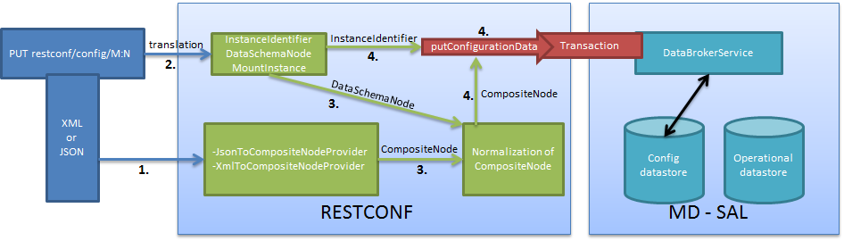

   Put

1. Input data is sent to JsonToCompositeNodeProvider or
   XmlToCompositeNodeProvider. The correct provider is selected based on
   the Content-Type field from the http request. These two providers can
   transform input data to CompositeNode. However, this CompositeNode
   does not contain enough information for transactions.

2. The requested URI is translated into InstanceIdentifier which points
   to the data node. DataSchemaNode conforming to the data node is
   obtained during this translation. If the data node is behind the
   mount point, the MountInstance is obtained as well.

3. CompositeNode can be normalized by adding additional information from
   DataSchemaNode.

4. RESTCONF begins the transaction, and puts CompositeNode with
   InstanceIdentifier into it. The response on the request from the
   client is the status code which depends on the result from the
   transaction.

Something practical
~~~~~~~~~~~~~~~~~~~

1. Create a new flow on the switch openflow:1 in table 2.

| **HTTP request**

::

    Operation: POST
    URI: http://192.168.11.1:8080/restconf/config/opendaylight-inventory:nodes/node/openflow:1/table/2
    Content-Type: application/xml

::

    <?xml version="1.0" encoding="UTF-8" standalone="no"?>
    <flow
        xmlns="urn:opendaylight:flow:inventory">
        <strict>false</strict>
        <instructions>
            <instruction>
                <order>1</order>
                <apply-actions>
                    <action>
                      <order>1</order>
                        <flood-all-action/>
                    </action>
                </apply-actions>
            </instruction>
        </instructions>
        <table_id>2</table_id>
        <id>111</id>
        <cookie_mask>10</cookie_mask>
        <out_port>10</out_port>
        <installHw>false</installHw>
        <out_group>2</out_group>
        <match>
            <ethernet-match>
                <ethernet-type>
                    <type>2048</type>
                </ethernet-type>
            </ethernet-match>
            <ipv4-destination>10.0.0.1/24</ipv4-destination>
        </match>
        <hard-timeout>0</hard-timeout>
        <cookie>10</cookie>
        <idle-timeout>0</idle-timeout>
        <flow-name>FooXf22</flow-name>
        <priority>2</priority>
        <barrier>false</barrier>
    </flow>

| **HTTP response**

::

    Status: 204 No Content

1. Change *strict* to *true* in the previous flow.

| **HTTP request**

::

    Operation: PUT
    URI: http://192.168.11.1:8080/restconf/config/opendaylight-inventory:nodes/node/openflow:1/table/2/flow/111
    Content-Type: application/xml

::

    <?xml version="1.0" encoding="UTF-8" standalone="no"?>
    <flow
        xmlns="urn:opendaylight:flow:inventory">
        <strict>true</strict>
        <instructions>
            <instruction>
                <order>1</order>
                <apply-actions>
                    <action>
                      <order>1</order>
                        <flood-all-action/>
                    </action>
                </apply-actions>
            </instruction>
        </instructions>
        <table_id>2</table_id>
        <id>111</id>
        <cookie_mask>10</cookie_mask>
        <out_port>10</out_port>
        <installHw>false</installHw>
        <out_group>2</out_group>
        <match>
            <ethernet-match>
                <ethernet-type>
                    <type>2048</type>
                </ethernet-type>
            </ethernet-match>
            <ipv4-destination>10.0.0.1/24</ipv4-destination>
        </match>
        <hard-timeout>0</hard-timeout>
        <cookie>10</cookie>
        <idle-timeout>0</idle-timeout>
        <flow-name>FooXf22</flow-name>
        <priority>2</priority>
        <barrier>false</barrier>
    </flow>

| **HTTP response**

::

    Status: 200 OK

1. Show flow: check that *strict* is *true*.

| **HTTP request**

::

    Operation: GET
    URI: http://192.168.11.1:8080/restconf/config/opendaylight-inventory:nodes/node/openflow:1/table/2/flow/111
    Accept: application/xml

| **HTTP response**

::

    Status: 200 OK

::

    <?xml version="1.0" encoding="UTF-8" standalone="no"?>
    <flow
        xmlns="urn:opendaylight:flow:inventory">
        <strict>true</strict>
        <instructions>
            <instruction>
                <order>1</order>
                <apply-actions>
                    <action>
                      <order>1</order>
                        <flood-all-action/>
                    </action>
                </apply-actions>
            </instruction>
        </instructions>
        <table_id>2</table_id>
        <id>111</id>
        <cookie_mask>10</cookie_mask>
        <out_port>10</out_port>
        <installHw>false</installHw>
        <out_group>2</out_group>
        <match>
            <ethernet-match>
                <ethernet-type>
                    <type>2048</type>
                </ethernet-type>
            </ethernet-match>
            <ipv4-destination>10.0.0.1/24</ipv4-destination>
        </match>
        <hard-timeout>0</hard-timeout>
        <cookie>10</cookie>
        <idle-timeout>0</idle-timeout>
        <flow-name>FooXf22</flow-name>
        <priority>2</priority>
        <barrier>false</barrier>
    </flow>

1. Delete the flow created.

| **HTTP request**

::

    Operation: DELETE
    URI: http://192.168.11.1:8080/restconf/config/opendaylight-inventory:nodes/node/openflow:1/table/2/flow/111

| **HTTP response**

::

    Status: 200 OK

Websocket change event notification subscription tutorial
---------------------------------------------------------

Subscribing to data change notifications makes it possible to obtain
notifications about data manipulation (insert, change, delete) which are
done on any specified **path** of any specified **datastore** with
specific **scope**. In following examples *{odlAddress}* is address of
server where ODL is running and *{odlPort}* is port on which
OpenDaylight is running.

Websocket notifications subscription process
~~~~~~~~~~~~~~~~~~~~~~~~~~~~~~~~~~~~~~~~~~~~

In this section we will learn what steps need to be taken in order to
successfully subscribe to data change event notifications.

Create stream
^^^^^^^^^^^^^

In order to use event notifications you first need to call RPC that
creates notification stream that you can later listen to. You need to
provide three parameters to this RPC:

-  **path**: data store path that you plan to listen to. You can
   register listener on containers, lists and leaves.

-  **datastore**: data store type. *OPERATIONAL* or *CONFIGURATION*.

-  **scope**: Represents scope of data change. Possible options are:

   -  BASE: only changes directly to the data tree node specified in the
      path will be reported

   -  ONE: changes to the node and to direct child nodes will be
      reported

   -  SUBTREE: changes anywhere in the subtree starting at the node will
      be reported

The RPC to create the stream can be invoked via RESCONF like this:

-  URI:
   http://{odlAddress}:{odlPort}/restconf/operations/sal-remote:create-data-change-event-subscription

-  HEADER: Content-Type=application/json

-  OPERATION: POST

-  DATA:

   .. code:: json

       {
           "input": {
               "path": "/toaster:toaster/toaster:toasterStatus",
               "sal-remote-augment:datastore": "OPERATIONAL",
               "sal-remote-augment:scope": "ONE"
           }
       }

The response should look something like this:

.. code:: json

    {
        "output": {
            "stream-name": "toaster:toaster/toaster:toasterStatus/datastore=CONFIGURATION/scope=SUBTREE"
        }
    }

**stream-name** is important because you will need to use it when you
subscribe to the stream in the next step.

    **Note**

    Internally, this will create a new listener for *stream-name* if it
    did not already exist.

Subscribe to stream
^^^^^^^^^^^^^^^^^^^

In order to subscribe to stream and obtain WebSocket location you need
to call *GET* on your stream path. The URI should generally be
http://{odlAddress}:{odlPort}/restconf/streams/stream/{streamName},
where *{streamName}* is the *stream-name* parameter contained in
response from *create-data-change-event-subscription* RPC from the
previous step.

-  URI:
   http://{odlAddress}:{odlPort}/restconf/streams/stream/toaster:toaster/datastore=CONFIGURATION/scope=SUBTREE

-  OPERATION: GET

The expected response status is 200 OK and response body should be
empty. You will get your WebSocket location from **Location** header of
response. For example in our particular toaster example location header
would have this value:
*ws://{odlAddress}:8185/toaster:toaster/datastore=CONFIGURATION/scope=SUBTREE*

    **Note**

    During this phase there is an internal check for to see if a
    listener for the *stream-name* from the URI exists. If not, new a
    new listener is registered with the DOM data broker.

Receive notifications
^^^^^^^^^^^^^^^^^^^^^

You should now have a data change notification stream created and have
location of a WebSocket. You can use this WebSocket to listen to data
change notifications. To listen to notifications you can use a
JavaScript client or if you are using chrome browser you can use the
`Simple WebSocket
Client <https://chrome.google.com/webstore/detail/simple-websocket-client/pfdhoblngboilpfeibdedpjgfnlcodoo>`__.

Also, for testing purposes, there is simple Java application named
WebSocketClient. The application is placed in the
*-sal-rest-connector-classes.class* project. It accepts a WebSocket URI
as and input parameter. After starting the utility (WebSocketClient
class directly in Eclipse/InteliJ Idea) received notifications should be
displayed in console.

Notifications are always in XML format and look like this:

.. code:: xml

    <notification xmlns="urn:ietf:params:xml:ns:netconf:notification:1.0">
        <eventTime>2014-09-11T09:58:23+02:00</eventTime>
        <data-changed-notification xmlns="urn:opendaylight:params:xml:ns:yang:controller:md:sal:remote">
            <data-change-event>
                <path xmlns:meae="http://netconfcentral.org/ns/toaster">/meae:toaster</path>
                <operation>updated</operation>
                <data>
                   <!-- updated data -->
                </data>
            </data-change-event>
        </data-changed-notification>
    </notification>

Example use case
~~~~~~~~~~~~~~~~

The typical use case is listening to data change events to update web
page data in real-time. In this tutorial we will be using toaster as the
base.

When you call *make-toast* RPC, it sets *toasterStatus* to "down" to
reflect that the toaster is busy making toast. When it finishes,
*toasterStatus* is set to "up" again. We will listen to this toaster
status changes in data store and will reflect it on our web page in
real-time thanks to WebSocket data change notification.

Simple javascript client implementation
~~~~~~~~~~~~~~~~~~~~~~~~~~~~~~~~~~~~~~~

We will create simple JavaScript web application that will listen
updates on *toasterStatus* leaf and update some element of our web page
according to new toaster status state.

Create stream
^^^^^^^^^^^^^

First you need to create stream that you are planing to subscribe to.
This can be achieved by invoking "create-data-change-event-subscription"
RPC on RESTCONF via AJAX request. You need to provide data store
**path** that you plan to listen on, **data store type** and **scope**.
If the request is successful you can extract the **stream-name** from
the response and use that to subscribe to the newly created stream. The
*{username}* and *{password}* fields represent your credentials that you
use to connect to OpenDaylight via RESTCONF:

    **Note**

    The default user name and password are "admin".

.. code:: javascript

    function createStream() {
        $.ajax(
            {
                url: 'http://{odlAddress}:{odlPort}/restconf/operations/sal-remote:create-data-change-event-subscription',
                type: 'POST',
                headers: {
                  'Authorization': 'Basic ' + btoa('{username}:{password}'),
                  'Content-Type': 'application/json'
                },
                data: JSON.stringify(
                    {
                        'input': {
                            'path': '/toaster:toaster/toaster:toasterStatus',
                            'sal-remote-augment:datastore': 'OPERATIONAL',
                            'sal-remote-augment:scope': 'ONE'
                        }
                    }
                )
            }).done(function (data) {
                // this function will be called when ajax call is executed successfully
                subscribeToStream(data.output['stream-name']);
            }).fail(function (data) {
                // this function will be called when ajax call fails
                console.log("Create stream call unsuccessful");
            })
    }

Subscribe to stream
^^^^^^^^^^^^^^^^^^^

The Next step is to subscribe to the stream. To subscribe to the stream
you need to call *GET* on
*http://{odlAddress}:{odlPort}/restconf/streams/stream/{stream-name}*.
If the call is successful, you get WebSocket address for this stream in
**Location** parameter inside response header. You can get response
header by calling *getResponseHeader(\ *Location*)* on HttpRequest
object inside *done()* function call:

.. code:: javascript

    function subscribeToStream(streamName) {
        $.ajax(
            {
                url: 'http://{odlAddress}:{odlPort}/restconf/streams/stream/' + streamName;
                type: 'GET',
                headers: {
                  'Authorization': 'Basic ' + btoa('{username}:{password}'),
                }
            }
        ).done(function (data, textStatus, httpReq) {
            // we need function that has http request object parameter in order to access response headers.
            listenToNotifications(httpReq.getResponseHeader('Location'));
        }).fail(function (data) {
            console.log("Subscribe to stream call unsuccessful");
        });
    }

Receive notifications
^^^^^^^^^^^^^^^^^^^^^

Once you got WebSocket server location you can now connect to it and
start receiving data change events. You need to define functions that
will handle events on WebSocket. In order to process incoming events
from OpenDaylight you need to provide a function that will handle
*onmessage* events. The function must have one parameter that represents
the received event object. The event data will be stored in
*event.data*. The data will be in an XML format that you can then easily
parse using jQuery.

.. code:: javascript

    function listenToNotifications(socketLocation) {
        try {
            var notificatinSocket = new WebSocket(socketLocation);

            notificatinSocket.onmessage = function (event) {
                // we process our received event here
                console.log('Received toaster data change event.');
                $($.parseXML(event.data)).find('data-change-event').each(
                    function (index) {
                        var operation = $(this).find('operation').text();
                        if (operation == 'updated') {
                            // toaster status was updated so we call function that gets the value of toasterStatus leaf
                            updateToasterStatus();
                            return false;
                        }
                    }
                );
            }
            notificatinSocket.onerror = function (error) {
                console.log("Socket error: " + error);
            }
            notificatinSocket.onopen = function (event) {
                console.log("Socket connection opened.");
            }
            notificatinSocket.onclose = function (event) {
                console.log("Socket connection closed.");
            }
            // if there is a problem on socket creation we get exception (i.e. when socket address is incorrect)
        } catch(e) {
            alert("Error when creating WebSocket" + e );
        }
    }

The *updateToasterStatus()* function represents function that calls
*GET* on the path that was modified and sets toaster status in some web
page element according to received data. After the WebSocket connection
has been established you can test events by calling make-toast RPC via
RESTCONF.

    **Note**

    for more information about WebSockets in JavaScript visit `Writing
    WebSocket client
    applications <https://developer.mozilla.org/en-US/docs/WebSockets/Writing_WebSocket_client_applications>`__

Config Subsystem
----------------

Overview
~~~~~~~~

The Controller configuration operation has three stages:

-  First, a Proposed configuration is created. Its target is to replace
   the old configuration.

-  Second, the Proposed configuration is validated, and then committed.
   If it passes validation successfully, the Proposed configuration
   state will be changed to Validated.

-  Finally, a Validated configuration can be Committed, and the affected
   modules can be reconfigured.

In fact, each configuration operation is wrapped in a transaction. Once
a transaction is created, it can be configured, that is to say, a user
can abort the transaction during this stage. After the transaction
configuration is done, it is committed to the validation stage. In this
stage, the validation procedures are invoked. If one or more validations
fail, the transaction can be reconfigured. Upon success, the second
phase commit is invoked. If this commit is successful, the transaction
enters the last stage, committed. After that, the desired modules are
reconfigured. If the second phase commit fails, it means that the
transaction is unhealthy - basically, a new configuration instance
creation failed, and the application can be in an inconsistent state.


   Configuration states


   Transaction states

Validation
~~~~~~~~~~

To secure the consistency and safety of the new configuration and to
avoid conflicts, the configuration validation process is necessary.
Usually, validation checks the input parameters of a new configuration,
and mostly verifies module-specific relationships. The validation
procedure results in a decision on whether the proposed configuration is
healthy.

Dependency resolver
~~~~~~~~~~~~~~~~~~~

Since there can be dependencies between modules, a change in a module
configuration can affect the state of other modules. Therefore, we need
to verify whether dependencies on other modules can be resolved. The
Dependency Resolver acts in a manner similar to dependency injectors.
Basically, a dependency tree is built.

APIs and SPIs
~~~~~~~~~~~~~

This section describes configuration system APIs and SPIs.

SPIs
^^^^

**Module** org.opendaylight.controller.config.spi. Module is the common
interface for all modules: every module must implement it. The module is
designated to hold configuration attributes, validate them, and create
instances of service based on the attributes. This instance must
implement the AutoCloseable interface, owing to resources clean up. If
the module was created from an already running instance, it contains an
old instance of the module. A module can implement multiple services. If
the module depends on other modules, setters need to be annotated with
@RequireInterface.

**Module creation**

1. The module needs to be configured, set with all required attributes.

2. The module is then moved to the commit stage for validation. If the
   validation fails, the module attributes can be reconfigured.
   Otherwise, a new instance is either created, or an old instance is
   reconfigured. A module instance is identified by ModuleIdentifier,
   consisting of the factory name and instance name.

| **ModuleFactory** org.opendaylight.controller.config.spi. The
  ModuleFactory interface must be implemented by each module factory.
| A module factory can create a new module instance in two ways:

-  From an existing module instance

-  | An entirely new instance
   | ModuleFactory can also return default modules, useful for
     populating registry with already existing configurations. A module
     factory implementation must have a globally unique name.

APIs
^^^^

+--------------------------------------+--------------------------------------+
| ConfigRegistry                       | Represents functionality provided by |
|                                      | a configuration transaction (create, |
|                                      | destroy module, validate, or abort   |
|                                      | transaction).                        |
+--------------------------------------+--------------------------------------+
| ConfigTransactionController          | Represents functionality for         |
|                                      | manipulating with configuration      |
|                                      | transactions (begin, commit config). |
+--------------------------------------+--------------------------------------+
| RuntimeBeanRegistratorAwareConfiBean | The module implementing this         |
|                                      | interface will receive               |
|                                      | RuntimeBeanRegistrator before        |
|                                      | getInstance is invoked.              |
+--------------------------------------+--------------------------------------+

Runtime APIs
^^^^^^^^^^^^

+--------------------------------------+--------------------------------------+
| RuntimeBean                          | Common interface for all runtime     |
|                                      | beans                                |
+--------------------------------------+--------------------------------------+
| RootRuntimeBeanRegistrator           | Represents functionality for root    |
|                                      | runtime bean registration, which     |
|                                      | subsequently allows hierarchical     |
|                                      | registrations                        |
+--------------------------------------+--------------------------------------+
| HierarchicalRuntimeBeanRegistration  | Represents functionality for runtime |
|                                      | bean registration and                |
|                                      | unreregistration from hierarchy      |
+--------------------------------------+--------------------------------------+

JMX APIs
^^^^^^^^

| JMX API is purposed as a transition between the Client API and the JMX
  platform.

+--------------------------------------+--------------------------------------+
| ConfigTransactionControllerMXBean    | Extends ConfigTransactionController, |
|                                      | executed by Jolokia clients on       |
|                                      | configuration transaction.           |
+--------------------------------------+--------------------------------------+
| ConfigRegistryMXBean                 | Represents entry point of            |
|                                      | configuration management for         |
|                                      | MXBeans.                             |
+--------------------------------------+--------------------------------------+
| Object names                         | Object Name is the pattern used in   |
|                                      | JMX to locate JMX beans. It consists |
|                                      | of domain and key properties (at     |
|                                      | least one key-value pair). Domain is |
|                                      | defined as                           |
|                                      | "org.opendaylight.controller". The   |
|                                      | only mandatory property is "type".   |
+--------------------------------------+--------------------------------------+

Use case scenarios
^^^^^^^^^^^^^^^^^^

| A few samples of successful and unsuccessful transaction scenarios
  follow:

**Successful commit scenario**

1.  The user creates a transaction calling creteTransaction() method on
    ConfigRegistry.

2.  ConfigRegisty creates a transaction controller, and registers the
    transaction as a new bean.

3.  Runtime configurations are copied to the transaction. The user can
    create modules and set their attributes.

4.  The configuration transaction is to be committed.

5.  The validation process is performed.

6.  After successful validation, the second phase commit begins.

7.  Modules proposed to be destroyed are destroyed, and their service
    instances are closed.

8.  Runtime beans are set to registrator.

9.  The transaction controller invokes the method getInstance on each
    module.

10. The transaction is committed, and resources are either closed or
    released.

| **Validation failure scenario**
| The transaction is the same as the previous case until the validation
  process.

1. If validation fails, (that is to day, illegal input attributes values
   or dependency resolver failure), the validationException is thrown
   and exposed to the user.

2. The user can decide to reconfigure the transaction and commit again,
   or abort the current transaction.

3. On aborted transactions, TransactionController and JMXRegistrator are
   properly closed.

4. Unregistration event is sent to ConfigRegistry.

Default module instances
^^^^^^^^^^^^^^^^^^^^^^^^

The configuration subsystem provides a way for modules to create default
instances. A default instance is an instance of a module, that is
created at the module bundle start-up (module becomes visible for
configuration subsystem, for example, its bundle is activated in the
OSGi environment). By default, no default instances are produced.

The default instance does not differ from instances created later in the
module life-cycle. The only difference is that the configuration for the
default instance cannot be provided by the configuration subsystem. The
module has to acquire the configuration for these instances on its own.
It can be acquired from, for example, environment variables. After the
creation of a default instance, it acts as a regular instance and fully
participates in the configuration subsystem (It can be reconfigured or
deleted in following transactions.).

DIDM Developer Guide
====================

Overview
--------

The Device Identification and Driver Management (DIDM) project addresses
the need to provide device-specific functionality. Device-specific
functionality is code that performs a feature, and the code is
knowledgeable of the capability and limitations of the device. For
example, configuring VLANs and adjusting FlowMods are features, and
there may be different implementations for different device types.
Device-specific functionality is implemented as Device Drivers. Device
Drivers need to be associated with the devices they can be used with. To
determine this association requires the ability to identify the device
type.

DIDM Architecture
-----------------

The DIDM project creates the infrastructure to support the following
functions:

-  **Discovery** - Determination that a device exists in the controller
   management domain and connectivity to the device can be established.
   For devices that support the OpenFlow protocol, the existing
   discovery mechanism in OpenDaylight suffices. Devices that do not
   support OpenFlow will be discovered through manual means such as the
   operator entering device information via GUI or REST API.

-  **Identification** – Determination of the device type.

-  **Driver Registration** – Registration of Device Drivers as routed
   RPCs.

-  **Synchronization** – Collection of device information, device
   configuration, and link (connection) information.

-  **Data Models for Common Features** – Data models will be defined to
   perform common features such as VLAN configuration. For example,
   applications can configure a VLAN by writing the VLAN data to the
   data store as specified by the common data model.

-  **RPCs for Common Features** – Configuring VLANs and adjusting
   FlowMods are example of features. RPCs will be defined that specify
   the APIs for these features. Drivers implement features for specific
   devices and support the APIs defined by the RPCs. There may be
   different Driver implementations for different device types.

Key APIs and Interfaces
-----------------------

The Beryllium release includes a flow mod driver for the HP 3800. This
driver adjusts the flows and push the same to the device. This API takes
the flow to be adjusted as input and displays the adjusted flow as
output in the REST output container. Here is the REST API to adjust and
push flows to HP 3800 device:

::

    http://<CONTROLLER-IP:8181>/restconf/operations/openflow-feature:adjust-flow

Here is an example of an ARP flow and how it gets adjusted and pushed to
device HP3800:

**adjust-flow input.**

::

    <?xml version="1.0" encoding="UTF-8" standalone="no"?>
    <input xmlns="urn:opendaylight:params:xml:ns:yang:didm:drivers:openflow" xmlns:opendaylight-inventory="urn:opendaylight:inventory">
      <node>/opendaylight-inventory:nodes/opendaylight-inventory:node[opendaylight-inventory:id='openflow:673249119553088']</node>
        <flow>
          <match>
            <ethernet-match>
                <ethernet-type>
                    <type>2054</type>
                </ethernet-type>
            </ethernet-match>
          </match>
          <flags>SEND_FLOW_REM</flags>
          <priority>0</priority>
          <flow-name>ARP_FLOW</flow-name>
          <instructions>
            <instruction>
                <order>0</order>
                <apply-actions>
                    <action>
                        <order>0</order>
                        <output-action>
                            <output-node-connector>CONTROLLER</output-node-connector>
                            <max-length>65535</max-length>
                        </output-action>
                    </action>
                    <action>
                        <order>1</order>
                        <output-action>
                            <output-node-connector>NORMAL</output-node-connector>
                            <max-length>65535</max-length>
                        </output-action>
                    </action>
                </apply-actions>
            </instruction>
          </instructions>
          <idle-timeout>180</idle-timeout>
          <hard-timeout>1800</hard-timeout>
          <cookie>10</cookie>
        </flow>
    </input>

In the output, you can see that the table ID has been identified for the
given flow and two flow mods are created as a result of adjustment. The
first one is to catch ARP packets in Hardware table 100 with an action
to goto table 200. The second flow mod is in table 200 with actions:
output normal and output controller.

**adjust-flow output.**

::

    {
      "output": {
        "flow": [
          {
            "idle-timeout": 180,
            "instructions": {
              "instruction": [
                {
                  "order": 0,
                  "apply-actions": {
                    "action": [
                      {
                        "order": 1,
                        "output-action": {
                          "output-node-connector": "NORMAL",
                          "max-length": 65535
                        }
                      },
                      {
                        "order": 0,
                        "output-action": {
                          "output-node-connector": "CONTROLLER",
                          "max-length": 65535
                        }
                      }
                    ]
                  }
                }
              ]
            },
            "strict": false,
            "table_id": 200,
            "flags": "SEND_FLOW_REM",
            "cookie": 10,
            "hard-timeout": 1800,
            "match": {
              "ethernet-match": {
                "ethernet-type": {
                  "type": 2054
                }
              }
            },
            "flow-name": "ARP_FLOW",
            "priority": 0
          },
          {
            "idle-timeout": 180,
            "instructions": {
              "instruction": [
                {
                  "order": 0,
                  "go-to-table": {
                    "table_id": 200
                  }
                }
              ]
            },
            "strict": false,
            "table_id": 100,
            "flags": "SEND_FLOW_REM",
            "cookie": 10,
            "hard-timeout": 1800,
            "match": {},
            "flow-name": "ARP_FLOW",
            "priority": 0
          }
        ]
      }
    }

API Reference Documentation
---------------------------

Go to
`http://${controller-ip}:8181/apidoc/explorer/index.html <http://${controller-ip}:8181/apidoc/explorer/index.html>`__,
and look under DIDM section to see all the available REST calls and
tables

DLUX
====

Setup and Run
-------------

Required Technology Stack
~~~~~~~~~~~~~~~~~~~~~~~~~

-  AngularJS (JavaScript client-side framework, http://www.angularjs.org
   )

Run DLUX
~~~~~~~~

To turn on the DLUX UI, install DLUX core feature via running following
command on the Karaf console -

::

    feature:install odl-dlux-core

The above command will install odl-restconf and DLUX topology
application internally, along with core DLUX components. Once this
feature is successfully installed, access the UI at
http://localhost:8181/index.html. The default credentials for login are
admin/admin.

All the applications in DLUX are Karaf features. A user can install
other dlux applications such as node and yang-ui from Karaf console
using commands such as -

::

    $ feature:install odl-dlux-node

    $ feature:install odl-dlux-yangui

DLUX Modules
------------

DLUX modules are the individual features such as nodes and topology.
Each module has a defined structure and you can find all existing
modules at
https://github.com/opendaylight/dlux/tree/stable/lithium/modules.

Module Structure
~~~~~~~~~~~~~~~~

-  module\_folder

   -  <module\_name>.module.js

   -  <module\_name>.controller.js

   -  <module\_name>.services.js

   -  <module\_name>.directives.js

   -  <module\_name>.filter.js

   -  index.tpl.html

   -  <a\_stylesheet>.css

Create New Module
~~~~~~~~~~~~~~~~~

Define the module
^^^^^^^^^^^^^^^^^

1. Create an empty maven project and create your module folder under
   src/main/resources.

2. Create an empty file with pattern <module\_name>.module.js.

3. Next, you need to surround the angular module with a define function.
   This allows RequireJs to see our module.js files. The first argument
   is an array which contains all the module’s dependencies. The second
   argument is a callback function, whose body contain the AngularJS
   code base. The function parameters correspond with the order of
   dependencies. Each dependency is injected into a parameter, if it is
   provided.

4. Finally, you will return the angular module to be able to inject it
   as a parameter in others modules.

For each new module, you must have at least these two dependencies :

-  angularAMD : It’s a wrapper around AngularJS to provide an AMD
   (Asynchronous Module Definition) support, which is used by RequireJs.
   For more information see the `AMD
   documentation <https://github.com/amdjs/amdjs-api/blob/master/AMD.md>`__.

-  app/core/core.services : This one is mandatory, if you want to add
   content in the navigation menu, the left bar or the top bar.

The following are not mandatory, but very often used.

-  angular-ui-router : A library to provide URL routing.

-  routingConfig : To set the level access to a page.

Your module.js file might look like this:

::

    define(['angularAMD','app/routingConfig', 'angular-ui-router','app/core/core.services'], function(ng) {
       var module = angular.module('app.a_module', ['ui.router.state', 'app.core']);
       // module configuration
       module.config(function() {
           [...]
       });
      return module;
    });

Set the register function
^^^^^^^^^^^^^^^^^^^^^^^^^

AngularJS allows lazy registration of a module’s components such as
controller, factory etc. Once you will install your application, DLUX
will load your module javascript, but not your angular component during
bootstrap phase. You have to register your angular components to make
sure they are available at the runtime.

Here is how to register your module’s component for lazy initialization
-

::

    module.config(function($compileProvider, $controllerProvider, $provide) {
       module.register = {
         controller : $controllerProvider.register,
         directive : $compileProvider.directive,
         factory : $provide.factory,
         service : $provide.service
       };
    });

Set the route
^^^^^^^^^^^^^

The next step is to set up the route for your module. This part is also
done in the configuration method of the module. We have to add
**$stateProvider** as a parameter.

::

    module.config(function($stateProvider) {
       var access = routingConfig.accessLevels;
       $stateProvider.state('main.module', {
         url: 'module',
         views : {
           'content' : {
             templateUrl: 'src/app/module/module.tpl.html',
             controller: 'ModuleCtrl'
           }
         }
       });
    });

Adding element to the navigation menu
^^^^^^^^^^^^^^^^^^^^^^^^^^^^^^^^^^^^^

To be able to add item to the navigation menu, the module requires the
**NavHelperProvider** parameter in the configuration method.
**addToMenu** method in **NavMenuHelper** helper allows an item addition
to the menu.

::

    var module = angular.module('app.a_module', ['app.core']);
    module.config(function(NavMenuHelper) {
        NavMenuHelper.addToMenu('myFirstModule', {
            "link" : "#/module/index",
            "active" : "module",
            "title" : "My First Module",
            "icon" : "icon-sitemap",
            "page" : {
                "title" : "My First Module",
                "description" : "My first module"
            }
        });
    });

The first parameter is an ID that refers to the level of your menu and
the second is a object. For now, The ID parameter supports two levels of
depth. If your ID looks like *rootNode.childNode*, the helper will look
for a node named *rootNode* and it will append the *childNode* to it. If
the root node doesn’t exist, it will create it.

Link the AngularJS module’s controller file
^^^^^^^^^^^^^^^^^^^^^^^^^^^^^^^^^^^^^^^^^^^

To include the module’s controller file, you can use the
NavHelperProvider. It contains a method that will load the given file.

::

    [...]
       NavHelperProvider.addControllerUrl('<path_to_module_folder>/<module_name>.controller');

This completes your module.js file.

Create the controller, factory, directive, etc
~~~~~~~~~~~~~~~~~~~~~~~~~~~~~~~~~~~~~~~~~~~~~~

Creating the controller and other components is similar to the module.

-  First, add the define method.

-  Second, add the relative path to the module definition.

-  Last, create your methods as you usually do it with AngularJS.

For example -

::

    define(['<relative_path_to_module>/<module_name>.module'], function(module) {
       module.register.controller('ModuleCtrl', function($rootScope, $scope) {
       });
    });

Add new application using DLUX modularity
-----------------------------------------

DLUX works as a Karaf based UI platform, where you can create a new
Karaf feature of your UI component and install that UI applications in
DLUX using blueprint. This page will help you to create and load a new
application for DLUX. You don’t have to add new module in DLUX
repository.

Add a new OSGi blueprint bundle
~~~~~~~~~~~~~~~~~~~~~~~~~~~~~~~

The OSGi Blueprint Container specification allows us to use dependency
injection in our OSGi environment. Each DLUX application module
registers itself via blueprint configuration. Each application will have
its own blueprint.xml to place its configuration.

1. Create a maven project to place blueprint configuration. For
   reference, take a look at topology bundle, present at
   https://github.com/opendaylight/dlux/tree/stable/lithium/bundles/topology.
   All the existing DLUX modules' configurations are available under
   bundles directory of DLUX code.

2. In pom.xml, you have to add a maven plugin to unpack your module code
   under generated-resources of this project. For reference, you can
   check pom.xml of dlux/bundles/topology at
   https://github.com/opendaylight/dlux/tree/stable/lithium/bundles/topology.
   Your bundle will eventually get deployed in Karaf as feature, so your
   bundle should contain all your module code. If you want to combine
   module and bundle project, that should not be an issue either.

3. Create a blueprint.xml configuration file under
   src/main/resources/OSGI-INF/blueprint. Below is the content of the
   blueprint.xml taken from topology bundles’s blueprint.xml. Any new
   application should create a blueprint.xml in following format -

::

    <blueprint xmlns="http://www.osgi.org/xmlns/blueprint/v1.0.0">
        <reference id="httpService" availability="mandatory" activation="eager" interface="org.osgi.service.http.HttpService"/>
        <reference id="loader" availability="mandatory" activation="eager" interface="org.opendaylight.dlux.loader.DluxModuleLoader"/>

        <bean id="bundle" init-method="initialize" destroy-method="clean" class="org.opendaylight.dlux.loader.DluxModule">
          <property name="httpService" ref="httpService"/>
          <property name="loader" ref="loader"/>
          <property name="moduleName" value="topology "/>
          <property name="url" value="/src/app/topology"/>
          <property name="directory" value="/topology"/>
          <property name="requireJs" value="app/topology/topology.module"/>
          <property name="angularJs" value="app.topology"/>
          <property name="cssDependencies">
              <list>
                  <value>http://yui.yahooapis.com/3.18.1/build/cssreset/cssreset-min.css</value>
                  <value>src/app/topology/topology-custom.css</value>
              </list>
          </property>
        </bean>
    </blueprint>

In above configuration, there are two references with id httpService and
loader. These two beans will already be initialized by dlux-core, so any
new application can use them. Without these two bean references, a new
application will not be able to register.

Next is the initialization of your application bean, which will be an
instance of class org.opendaylight.dlux.loader.DluxModule. There are 5
properties that you should provide in this bean besides the references
of httpService and loader. Lets talk about those bean properties in
little more detail.

**moduleName** : Name of your module. This name should be unique in
DLUX.

**url**: This is the url via which RequireJS in DLUX will try to load
your module JS/HTML files. Also, this is the url that browser will use
to load the static HTML, JS or CSS files. RequireJS in DLUX has a base
path of **src**, so all the url should start with /src so RequireJS and
the browser can correctly find the files.

**directory**: In your bundle’s pom.xml, you unpack your module code.
This is the directory where your actual static files will reside. The
above mentioned url is registered with httpService, so when browser
makes a call to that url, it will be redirected to the directory
mentioned here. In the above example, all the topology files are present
under /topology directory and the browser/RequireJS can access those
files with uri /src/app/topology.

**requireJS**: This is the path to your RequireJS module. If you notice
closely, you will see the initial path of RequireJS app/topology in the
above example matches with the last part of url. This path will be be
used by RequireJS. As mentioned above, we have kept **src** as base path
in RequireJS, that is the exact reason that url start with /src.

**angularJS**: name of your AngularJS module.

**cssDependencies**: If the application has any external/internal css
dependencies, then those can be added here. If you create your own css
files, just point to those css files here. Use the url path that you
mentioned above, so the browser can find your css file.

OSGi understands blueprint.xml, once you will deploy your bundle in
karaf (or you can create a new feature for your application), karaf will
read your blueprint.xml and it will try to register your application
with dlux. Once successful, if you refresh your dlux UI, you will see
your application in left hand navigation bar of dlux.

Yang Utils
----------

Yang Utils are used by UI to perform all CRUD operations. All of these
utilities are present in yangutils.services.js file. It has following
AngularJS factories -

-  **arrayUtils** – defines functions for working with arrays.

-  **pathUtils** – defines functions for working with xpath (paths to
   APIs and subAPIs). It divides xpath string to array of elements, so
   this array can be later used for search functions.

-  **syncFact** – provides synchronization between requests to and from
   OpenDaylight when it’s needed.

-  **custFunct** – it is linked with
   apiConnector.createCustomFunctionalityApis in yangui controller in
   yangui.controller.js. That function makes it possible to create some
   custom function called by the click on button in index.tpl.html. All
   custom functions are stored in array and linked to specific subAPI.
   When particular subAPI is expanded and clicked, its inputs (linked
   root node with its child nodes) are displayed in the bottom part of
   the page and its buttons with custom functionality are displayed
   also.

-  **reqBuilder** – Builds object in JSON format from input fields of
   the UI page. **Show Preview** button on Yang UI use this builder.
   This request is sent to OpenDaylight when button PUT or POST is
   clicked.

-  **yinParser** – factory for reading .xml files of yang models and
   creating object hierarchy. Every statement from yang is represented
   by a node.

-  **nodeWrapper** – adds functions to objects in tree hierarchy created
   with yinParser. These functions provide functionality for every type
   of node.

-  **apiConnector** – the main functionality is filling the main
   structures and linking them. Structure of APIs and subAPIs which is
   two level array - first level is filled by main APIs, second level is
   filled by others sub APIs. Second main structure is array of root
   nodes, which are objects including root node and its children nodes.
   Linking these two structures is creating links between every subAPI
   (second level of APIs array) and its root node, which must be
   displayed like inputs when subAPI is expanded.

-  **yangUtils** – some top level functions which are used by yangui
   controller for creating the main structures.

IoTDM Developer Guide
=====================

Overview
--------

The Internet of Things Data Management (IoTDM) on OpenDaylight project
is about developing a data-centric middleware that will act as a oneM2M
compliant IoT Data Broker and enable authorized applications to retrieve
IoT data uploaded by any device. The OpenDaylight platform is used to
implement the oneM2M data store which models a hierarchical containment
tree, where each node in the tree represents an oneM2M resource.
Typically, IoT devices and applications interact with the resource tree
over standard protocols such as CoAP, MQTT, and HTTP. Initially, the
oneM2M resource tree is used by applications to retrieve data. Possible
applications are inventory or device management systems or big data
analytic systems designed to make sense of the collected data. But, at
some point, applications will need to configure the devices. Features
and tools will have to be provided to enable configuration of the
devices based on applications responding to user input, network
conditions, or some set of programmable rules or policies possibly
triggered by the receipt of data collected from the devices. The
OpenDaylight platform, with its rich unique cross-section of SDN
capabilities, NFV, and now IoT device and application management, can be
bundled with a targeted set of features and deployed anywhere in the
network to give the network service provider ultimate control. Depending
on the use case, the OpenDaylight IoT platform can be configured with
only IoT data collection capabilities where it is deployed near the IoT
devices and its footprint needs to be small, or it can be configured to
run as a highly scaled up and out distributed cluster with IoT, SDN and
NFV functions enabled and deployed in a high traffic data center.

oneM2M Architecture
-------------------

The architecture provides a framework that enables the support of the
oneM2M resource containment tree. The onem2m-core implements the MDSAL
RPCs defined in the onem2m-api YANG files. These RPCs enable oneM2M
resources to be created, read, updated, and deleted (CRUD), and also
enables the management of subscriptions. When resources are CRUDed, the
onem2m-notifier issues oneM2M notification events to interested
subscribers. TS0001: oneM2M Functional Architecture and TS0004: oneM2M
Service Layer Protocol are great reference documents to learn details of
oneM2M resource types, message flow, formats, and CRUD/N semantics. Both
of these specifications can be found at
http://onem2m.org/technical/published-documents

The oneM2M resource tree is modeled in YANG and essentially is a
meta-model for the tree. The oneM2M wire protocols allow the resource
tree to be constructed via HTTP or CoAP messages that populate nodes in
the tree with resource specific attributes. Each oneM2M resource type
has semantic behaviour associated with it. For example: a container
resource has attributes which control quotas on how many and how big the
collection of data or content instance objects that can exist below it
in the tree. Depending on the resource type, the oneM2M core software
implements and enforces the resource type specific rules to ensure a
well-behaved resource tree.

The resource tree can be simultaneously accessed by many concurrent
applications wishing to manage or access the tree, and also many devices
can be reporting in new data or sensor readings into their appropriate
place in the tree.

Key APIs and Interfaces
-----------------------

The API’s to access the oneM2M datastore are well documented in TS0004
(referred above) found on onem2m.org

RESTCONF is available too but generally HTTP and CoAP are used to access
the oneM2M data tree.

L2Switch Developer Guide
========================

Overview
--------

The L2Switch project provides Layer2 switch functionality.

L2Switch Architecture
---------------------

-  Packet Handler

   -  Decodes the packets coming to the controller and dispatches them
      appropriately

-  Loop Remover

   -  Removes loops in the network

-  Arp Handler

   -  Handles the decoded ARP packets

-  Address Tracker

   -  Learns the Addresses (MAC and IP) of entities in the network

-  Host Tracker

   -  Tracks the locations of hosts in the network

-  L2Switch Main

   -  Installs flows on each switch based on network traffic

Key APIs and Interfaces
-----------------------

-  Packet Handler

-  Loop Remover

-  Arp Handler

-  Address Tracker

-  Host Tracker

-  L2Switch Main

Packet Dispatcher
~~~~~~~~~~~~~~~~~

Classes
^^^^^^^

-  AbstractPacketDecoder

   -  Defines the methods that all decoders must implement

-  EthernetDecoder

   -  The base decoder which decodes the packet into an Ethernet packet

-  ArpDecoder, Ipv4Decoder, Ipv6Decoder

   -  Decodes Ethernet packets into the either an ARP or IPv4 or IPv6
      packet

Further development
^^^^^^^^^^^^^^^^^^^

There is a need for more decoders. A developer can write

-  A decoder for another EtherType, i.e. LLDP.

-  A higher layer decoder for the body of the IPv4 packet or IPv6
   packet, i.e. TCP and UDP.

How to write a new decoder

-  extends AbstractDecoder<A, B>

   -  A refers to the notification that the new decoder consumes

   -  B refers to the notification that the new decoder produces

-  implements xPacketListener

   -  The new decoder must specify which notification it is listening to

-  canDecode method

   -  This method should examine the consumed notification to see
      whether the new decoder can decode the contents of the packet

-  decode method

   -  This method does the actual decoding of the packet

Loop Remover
~~~~~~~~~~~~

Classes
^^^^^^^

-  **LoopRemoverModule**

   -  Reads config subsystem value for *is-install-lldp-flow*

      -  If *is-install-lldp-flow* is true, then an
         **InitialFlowWriter** is created

   -  Creates and initializes the other LoopRemover classes

-  **InitialFlowWriter**

   -  Only created when *is-install-lldp-flow* is true

   -  Installs a flow, which forwards all LLDP packets to the
      controller, on each switch

-  **TopologyLinkDataChangeHandler**

   -  Listens to data change events on the Topology tree

   -  When these changes occur, it waits *graph-refresh-delay* seconds
      and then tells **NetworkGraphImpl** to update

   -  Writes an STP (Spanning Tree Protocol) status of "forwarding" or
      "discarding" to each link in the Topology data tree

      -  Forwarding links can forward packets.

      -  Discarding links cannot forward packets.

-  **NetworkGraphImpl**

   -  Creates a loop-free graph of the network

Configuration
^^^^^^^^^^^^^

-  graph-refresh-delay

   -  Used in TopologyLinkDataChangeHandler

   -  A higher value has the advantage of doing less graph updates, at
      the potential cost of losing some packets because the graph didn’t
      update immediately.

   -  A lower value has the advantage of handling network topology
      changes quicker, at the cost of doing more computation.

-  is-install-lldp-flow

   -  Used in LoopRemoverModule

   -  "true" means a flow that sends all LLDP packets to the controller
      will be installed on each switch

   -  "false" means this flow will not be installed

-  lldp-flow-table-id

   -  The LLDP flow will be installed on the specified flow table of
      each switch

-  lldp-flow-priority

   -  The LLDP flow will be installed with the specified priority

-  lldp-flow-idle-timeout

   -  The LLDP flow will timeout (removed from the switch) if the flow
      doesn’t forward a packet for *x* seconds

-  lldp-flow-hard-timeout

   -  The LLDP flow will timeout (removed from the switch) after *x*
      seconds, regardless of how many packets it is forwarding

Further development
^^^^^^^^^^^^^^^^^^^

No suggestions at the moment.

Validating changes to Loop Remover
^^^^^^^^^^^^^^^^^^^^^^^^^^^^^^^^^^

STP Status information is added to the Inventory data tree.

-  A status of "forwarding" means the link is active and packets are
   flowing on it.

-  A status of "discarding" means the link is inactive and packets are
   not sent over it.

The STP status of a link can be checked through a browser or a REST
Client.

::

    http://10.194.126.91:8080/restconf/operational/opendaylight-inventory:nodes/node/openflow:1/node-connector/openflow:1:2

The STP status should still be there after changes are made.

Arp Handler
~~~~~~~~~~~

Classes
^^^^^^^

-  **ArpHandlerModule**

   -  Reads config subsystem value for *is-proactive-flood-mode*

      -  If *is-proactive-flood-mode* is true, then a
         ProactiveFloodFlowWriter is created

      -  If *is-proactive-flood-mode* is false, then an
         InitialFlowWriter is created

-  **ProactiveFloodFlowWriter**

   -  Only created when *is-proactive-flood-mode* is true

   -  Installs a flood flow on each switch. With this flood flow, a
      packet that doesn’t match any other flows will be
      flooded/broadcast from that switch.

-  **InitialFlowWriter**

   -  Only created when *is-proactive-flood-mode* is false

   -  Installs a flow, which sends all ARP packets to the controller, on
      each switch

-  **ArpPacketHandler**

   -  Only created when *is-proactive-flood-mode* is false

   -  Handles and processes the controller’s incoming ARP packets

   -  Uses **PacketDispatcher** to send the ARP packet back into the
      network

-  **PacketDispatcher**

   -  Only created when *is-proactive-flood-mode* is false

   -  Sends packets out to the network

   -  Uses **InventoryReader** to determine which node-connector to a
      send a packet on

-  **InventoryReader**

   -  Only created when *is-proactive-flood-mode* is false

   -  Maintains a list of each switch’s node-connectors

Configuration
^^^^^^^^^^^^^

-  is-proactive-flood-mode

   -  "true" means that flood flows will be installed on each switch.
      With this flood flow, each switch will flood a packet that doesn’t
      match any other flows.

      -  Advantage: Fewer packets are sent to the controller because
         those packets are flooded to the network.

      -  Disadvantage: A lot of network traffic is generated.

   -  "false" means the previously mentioned flood flows will not be
      installed. Instead an ARP flow will be installed on each switch
      that sends all ARP packets to the controller.

      -  Advantage: Less network traffic is generated.

      -  Disadvantage: The controller handles more packets (ARP requests
         & replies) and the ARP process takes longer than if there were
         flood flows.

-  flood-flow-table-id

   -  The flood flow will be installed on the specified flow table of
      each switch

-  flood-flow-priority

   -  The flood flow will be installed with the specified priority

-  flood-flow-idle-timeout

   -  The flood flow will timeout (removed from the switch) if the flow
      doesn’t forward a packet for *x* seconds

-  flood-flow-hard-timeout

   -  The flood flow will timeout (removed from the switch) after *x*
      seconds, regardless of how many packets it is forwarding

-  arp-flow-table-id

   -  The ARP flow will be installed on the specified flow table of each
      switch

-  arp-flow-priority

   -  The ARP flow will be installed with the specified priority

-  arp-flow-idle-timeout

   -  The ARP flow will timeout (removed from the switch) if the flow
      doesn’t forward a packet for *x* seconds

-  arp-flow-hard-timeout

   -  The ARP flow will timeout (removed from the switch) after
      *arp-flow-hard-timeout* seconds, regardless of how many packets it
      is forwarding

Further development
^^^^^^^^^^^^^^^^^^^

The **ProactiveFloodFlowWriter** needs to be improved. It does have the
advantage of having less traffic come to the controller; however, it
generates too much network traffic.

Address Tracker
~~~~~~~~~~~~~~~

Classes
^^^^^^^

-  AddressTrackerModule

   -  Reads config subsystem value for *observe-addresses-from*

   -  If *observe-addresses-from* contains "arp", then an
      AddressObserverUsingArp is created

   -  If *observe-addresses-from* contains "ipv4", then an
      AddressObserverUsingIpv4 is created

   -  If *observe-addresses-from* contains "ipv6", then an
      AddressObserverUsingIpv6 is created

-  AddressObserverUsingArp

   -  Registers for ARP packet notifications

   -  Uses **AddressObservationWriter** to write address observations
      from ARP packets

-  AddressObserverUsingIpv4

   -  Registers for IPv4 packet notifications

   -  Uses **AddressObservationWriter** to write address observations
      from IPv4 packets

-  AddressObserverUsingIpv6

   -  Registers for IPv6 packet notifications

   -  Uses **AddressObservationWriter** to write address observations
      from IPv6 packets

-  AddressObservationWriter

   -  Writes new Address Observations to the Inventory data tree

   -  Updates existing Address Observations with updated "last seen"
      timestamps

      -  Uses the *timestamp-update-intervval* configuration variable to
         determine whether or not to update

Configuration
^^^^^^^^^^^^^

-  timestamp-update-interval

   -  A last-seen timestamp is associated with each address. This
      last-seen timestamp will only be updated after
      *timestamp-update-interval* milliseconds.

   -  A higher value has the advantage of performing less writes to the
      database.

   -  A lower value has the advantage of knowing how fresh an address
      is.

-  observe-addresses-from

   -  IP and MAC addresses can be observed/learned from ARP, IPv4, and
      IPv6 packets. Set which packets to make these observations from.

Further development
^^^^^^^^^^^^^^^^^^^

Further improvements can be made to the **AddressObservationWriter** so
that it (1) doesn’t make any unnecessary writes to the DB and (2) is
optimized for multi-threaded environments.

Validating changes to Address Tracker
^^^^^^^^^^^^^^^^^^^^^^^^^^^^^^^^^^^^^

Address Observations are added to the Inventory data tree.

The Address Observations on a Node Connector can be checked through a
browser or a REST Client.

::

    http://10.194.126.91:8080/restconf/operational/opendaylight-inventory:nodes/node/openflow:1/node-connector/openflow:1:1

The Address Observations should still be there after changes.

Developer’s Guide for Host Tracker
~~~~~~~~~~~~~~~~~~~~~~~~~~~~~~~~~~

Validationg changes to Host Tracker
^^^^^^^^^^^^^^^^^^^^^^^^^^^^^^^^^^^

Host information is added to the Topology data tree.

-  Host address

-  Attachment point (link) to a node/switch

This host information and attachment point information can be checked
through a browser or a REST Client.

::

    http://10.194.126.91:8080/restconf/operational/network-topology:network-topology/topology/flow:1/

Host information should still be there after changes.

L2Switch Main
~~~~~~~~~~~~~

Classes
^^^^^^^

-  L2SwitchMainModule

   -  Reads config subsystem value for *is-install-dropall-flow*

      -  If *is-install-dropall-flow* is true, then an
         **InitialFlowWriter** is created

   -  Reads config subsystem value for *is-learning-only-mode*

      -  If *is-learning-only-mode* is false, then a
         **ReactiveFlowWriter** is created

-  InitialFlowWriter

   -  Only created when *is-install-dropall-flow* is true

   -  Installs a flow, which drops all packets, on each switch. This
      flow has low priority and means that packets that don’t match any
      higher-priority flows will simply be dropped.

-  ReactiveFlowWriter

   -  Reacts to network traffic and installs MAC-to-MAC flows on
      switches. These flows have matches based on MAC source and MAC
      destination.

   -  Uses **FlowWriterServiceImpl** to write these flows to the
      switches

-  FlowWriterService / FlowWriterServiceImpl

   -  Writes flows to switches

Configuration
^^^^^^^^^^^^^

-  is-install-dropall-flow

   -  "true" means a drop-all flow will be installed on each switch, so
      the default action will be to drop a packet instead of sending it
      to the controller

   -  "false" means this flow will not be installed

-  dropall-flow-table-id

   -  The dropall flow will be installed on the specified flow table of
      each switch

   -  This field is only relevant when "is-install-dropall-flow" is set
      to "true"

-  dropall-flow-priority

   -  The dropall flow will be installed with the specified priority

   -  This field is only relevant when "is-install-dropall-flow" is set
      to "true"

-  dropall-flow-idle-timeout

   -  The dropall flow will timeout (removed from the switch) if the
      flow doesn’t forward a packet for *x* seconds

   -  This field is only relevant when "is-install-dropall-flow" is set
      to "true"

-  dropall-flow-hard-timeout

   -  The dropall flow will timeout (removed from the switch) after *x*
      seconds, regardless of how many packets it is forwarding

   -  This field is only relevant when "is-install-dropall-flow" is set
      to "true"

-  is-learning-only-mode

   -  "true" means that the L2Switch will only be learning addresses. No
      additional flows to optimize network traffic will be installed.

   -  "false" means that the L2Switch will react to network traffic and
      install flows on the switches to optimize traffic. Currently,
      MAC-to-MAC flows are installed.

-  reactive-flow-table-id

   -  The reactive flow will be installed on the specified flow table of
      each switch

   -  This field is only relevant when "is-learning-only-mode" is set to
      "false"

-  reactive-flow-priority

   -  The reactive flow will be installed with the specified priority

   -  This field is only relevant when "is-learning-only-mode" is set to
      "false"

-  reactive-flow-idle-timeout

   -  The reactive flow will timeout (removed from the switch) if the
      flow doesn’t forward a packet for *x* seconds

   -  This field is only relevant when "is-learning-only-mode" is set to
      "false"

-  reactive-flow-hard-timeout

   -  The reactive flow will timeout (removed from the switch) after *x*
      seconds, regardless of how many packets it is forwarding

   -  This field is only relevant when "is-learning-only-mode" is set to
      "false"

Further development
^^^^^^^^^^^^^^^^^^^

The **ReactiveFlowWriter** needs to be improved to install the
MAC-to-MAC flows faster. For the first ping, the ARP request and reply
are successful. However, then the ping packets are sent out. The first
ping packet is dropped sometimes because the MAC-to-MAC flow isn’t
installed quickly enough. The second, third, and following ping packets
are successful though.

API Reference Documentation
---------------------------

Further documentation can be found by checking out the L2Switch project.

Checking out the L2Switch project
---------------------------------

::

    git clone https://git.opendaylight.org/gerrit/p/l2switch.git

The above command will create a directory called "l2switch" with the
project.

Testing your changes to the L2Switch project
--------------------------------------------

Running the L2Switch project
~~~~~~~~~~~~~~~~~~~~~~~~~~~~

To run the base distribution, you can use the following command

::

    ./distribution/base/target/distributions-l2switch-base-0.1.0-SNAPSHOT-osgipackage/opendaylight/run.sh

If you need additional resources, you can use these command line
arguments:

::

    -Xms1024m -Xmx2048m -XX:PermSize=512m -XX:MaxPermSize=1024m'

To run the karaf distribution, you can use the following command:

::

    ./distribution/karaf/target/assembly/bin/karaf

Create a network using mininet
~~~~~~~~~~~~~~~~~~~~~~~~~~~~~~

::

    sudo mn --controller=remote,ip=<Controller IP> --topo=linear,3 --switch ovsk,protocols=OpenFlow13
    sudo mn --controller=remote,ip=127.0.0.1 --topo=linear,3 --switch ovsk,protocols=OpenFlow13

The above command will create a virtual network consisting of 3
switches. Each switch will connect to the controller located at the
specified IP, i.e. 127.0.0.1

::

    sudo mn --controller=remote,ip=127.0.0.1 --mac --topo=linear,3 --switch ovsk,protocols=OpenFlow13

The above command has the "mac" option, which makes it easier to
distinguish between Host MAC addresses and Switch MAC addresses.

Generating network traffic using mininet
~~~~~~~~~~~~~~~~~~~~~~~~~~~~~~~~~~~~~~~~

::

    h1 ping h2

The above command will cause host1 (h1) to ping host2 (h2)

::

    pingall

*pingall* will cause each host to ping every other host.

Miscellaneous mininet commands
~~~~~~~~~~~~~~~~~~~~~~~~~~~~~~

::

    link s1 s2 down

This will bring the link between switch1 (s1) and switch2 (s2) down

::

    link s1 s2 up

This will bring the link between switch1 (s1) and switch2 (s2) up

::

    link s1 h1 down

This will bring the link between switch1 (s1) and host1 (h1) down

LACP Developer Guide
====================

LACP Overview
-------------

The OpenDaylight LACP (Link Aggregation Control Protocol) project can be
used to aggregate multiple links between OpenDaylight controlled network
switches and LACP enabled legacy switches or hosts operating in active
LACP mode.

OpenDaylight LACP passively negotiates automatic bundling of multiple
links to form a single LAG (Link Aggregation Group). LAGs are realised
in the OpenDaylight controlled switches using OpenFlow 1.3+ group table
functionality.

LACP Architecture
-----------------

-  **inventory**

   -  Maintains list of OpenDaylight controlled switches and port
      information

   -  List of LAGs created and physical ports that are part of the LAG

   -  Interacts with MD-SAL to update LACP related information

-  **inventorylistener**

   -  This module interacts with MD-SAL for receiving
      node/node-connector notifications

-  **flow**

   -  Programs the switch to punt LACP PDU (Protocol Data Unit) to
      controller

-  **packethandler**

   -  Receives and transmits LACP PDUs to the LACP enabled endpoint

   -  Provides infrastructure services for group table programming

-  **core**

   -  Performs LACP state machine processing

How LAG programming is implemented
~~~~~~~~~~~~~~~~~~~~~~~~~~~~~~~~~~

The LAG representing the aggregated multiple physical ports are realized
in the OpenDaylight controlled switches by creating a group table entry
(Group table supported from OpenFlow 1.3 onwards). The group table entry
has a group type **Select** and action referring to the aggregated
physical ports. Any data traffic to be sent out through the LAG can be
sent through the **group entry** available for the LAG.

Suppose there are ports P1-P8 in a node. When LACP project is installed,
a group table entry for handling broadcast traffic is automatically
created on all the switches that have registered to the controller.

+--------------------------+--------------------------+--------------------------+
| GroupID                  | GroupType                | EgressPorts              |
+==========================+==========================+==========================+
| <B’castgID>              | ALL                      | P1,P2,…P8                |
+--------------------------+--------------------------+--------------------------+

Now, assume P1 & P2 are now part of LAG1. The group table would be
programmed as follows:

+--------------------------+--------------------------+--------------------------+
| GroupID                  | GroupType                | EgressPorts              |
+==========================+==========================+==========================+
| <B’castgID>              | ALL                      | P3,P4,…P8                |
+--------------------------+--------------------------+--------------------------+
| <LAG1>                   | SELECT                   | P1,P2                    |
+--------------------------+--------------------------+--------------------------+

When a second LAG, LAG2, is formed with ports P3 and P4,

+--------------------------+--------------------------+--------------------------+
| GroupID                  | GroupType                | EgressPorts              |
+==========================+==========================+==========================+
| <B’castgID>              | ALL                      | P5,P6,…P8                |
+--------------------------+--------------------------+--------------------------+
| <LAG1>                   | SELECT                   | P1,P2                    |
+--------------------------+--------------------------+--------------------------+
| <LAG2>                   | SELECT                   | P3,P4                    |
+--------------------------+--------------------------+--------------------------+

How applications can program OpenFlow flows using LACP-created LAG groups
~~~~~~~~~~~~~~~~~~~~~~~~~~~~~~~~~~~~~~~~~~~~~~~~~~~~~~~~~~~~~~~~~~~~~~~~~

OpenDaylight controller modules can get the information of LAG by
listening/querying the LACP Aggregator datastore.

When any application receives packets, it can check, if the ingress port
is part of a LAG by verifying the LAG Aggregator reference
(lacp-agg-ref) for the source nodeConnector that OpenFlow plugin
provides.

When applications want to add flows to egress out of the LAG, they must
use the group entry corresponding to the LAG.

From the above example, for a flow to egress out of LAG1,

**add-flow eth\_type=<xxxx>,ip\_dst=<x.x.x.x>,actions=output:<LAG1>**

Similarly, when applications want traffic to be broadcasted, they should
use the group table entries **<B’castgID>,<LAG1>,<LAG2>** in output
action.

For all applications, the group table information is accessible from
LACP Aggregator datastore.

NETCONF Developer Guide
=======================

    **Note**

    Reading the NETCONF section in the User Guide is likely useful as it
    contains an overview of NETCONF in OpenDaylight and a how-to for
    spawning and configuring NETCONF connectors.

This chapter is recommended for application developers who want to
interact with mounted NETCONF devices from their application code. It
tries to demonstrate all the use cases from user guide with RESTCONF but
now from the code level. One important difference would be the
demonstration of NETCONF notifications and notification listeners. The
notifications were not shown using RESTCONF because **RESTCONF does not
support notifications from mounted NETCONF devices.**

    **Note**

    It may also be useful to read the generic `OpenDaylight MD-SAL app
    development
    tutorial <https://wiki.opendaylight.org/view/OpenDaylight_Controller:MD-SAL:MD-SAL_App_Tutorial>`__
    before diving into this chapter. This guide assumes awareness of
    basic OpenDaylight application development.

Sample app overview
-------------------

All the examples presented here are implemented by a sample OpenDaylight
application called **ncmount** in the ``coretutorials`` OpenDaylight
project. It can be found on the github mirror of OpenDaylight’s
repositories:

-  https://github.com/opendaylight/coretutorials/tree/stable/lithium/ncmount

or checked out from the official OpenDaylight repository:

-  https://git.opendaylight.org/gerrit/#/admin/projects/coretutorials

**The application was built using the `project startup maven
archetype <https://wiki.opendaylight.org/view/OpenDaylight_Controller:MD-SAL:Startup_Project_Archetype>`__
and demonstrates how to:**

-  preconfigure connectors to NETCONF devices

-  retrieve MountPointService (registry of available mount points)

-  listen and react to changing connection state of netconf-connector

-  add custom device YANG models to the app and work with them

-  read data from device in binding aware format (generated java APIs
   from provided YANG models)

-  write data into device in binding aware format

-  trigger and listen to NETCONF notifications in binding aware format

Detailed information about the structure of the application can be found
at:
https://wiki.opendaylight.org/view/Controller_Core_Functionality_Tutorials:Tutorials:Netconf_Mount

    **Note**

    The code in ncmount is fully **binding aware** (works with generated
    java APIs from provided YANG models). However it is also possible to
    perform the same operations in **binding independent** manner.

NcmountProvider
~~~~~~~~~~~~~~~

The NcmountProvider class (found in NcmountProvider.java) is the central
point of the ncmount application and all the application logic is
contained there. The following sections will detail its most interesting
pieces.

Retrieve MountPointService
^^^^^^^^^^^^^^^^^^^^^^^^^^

The MountPointService is a central registry of all available mount
points in OpenDaylight. It is just another MD-SAL service and is
available from the ``session`` attribute passed by
``onSessionInitiated`` callback:

::

    @Override
    public void onSessionInitiated(ProviderContext session) {
        LOG.info("NcmountProvider Session Initiated");

        // Get references to the data broker and mount service
        this.mountService = session.getSALService(MountPointService.class);

        ...

        }
    }

Listen for connection state changes
^^^^^^^^^^^^^^^^^^^^^^^^^^^^^^^^^^^

It is important to know when a mount point appears, when it is fully
connected and when it is disconnected or removed. The exact states of a
mount point are:

-  Connected

-  Connecting

-  Unable to connect

To receive this kind of information, an application has to register
itself as a notification listener for the preconfigured netconf-topology
subtree in MD-SAL’s datastore. This can be performed in the
``onSessionInitiated`` callback as well:

::

    @Override
    public void onSessionInitiated(ProviderContext session) {

        ...

        this.dataBroker = session.getSALService(DataBroker.class);

        // Register ourselves as the REST API RPC implementation
        this.rpcReg = session.addRpcImplementation(NcmountService.class, this);

        // Register ourselves as data change listener for changes on Netconf
        // nodes. Netconf nodes are accessed via "Netconf Topology" - a special
        // topology that is created by the system infrastructure. It contains
        // all Netconf nodes the Netconf connector knows about. NETCONF_TOPO_IID
        // is equivalent to the following URL:
        // .../restconf/operational/network-topology:network-topology/topology/topology-netconf
        if (dataBroker != null) {
            this.dclReg = dataBroker.registerDataChangeListener(LogicalDatastoreType.OPERATIONAL,
                    NETCONF_TOPO_IID.child(Node.class),
                    this,
                    DataChangeScope.SUBTREE);
        }
    }

The implementation of the callback from MD-SAL when the data change can
be found in the
``onDataChanged(AsyncDataChangeEvent<InstanceIdentifier<?>, DataObject>
change)`` callback of `NcmountProvider
class <https://github.com/opendaylight/coretutorials/blob/stable/lithium/ncmount/impl/src/main/java/ncmount/impl/NcmountProvider.java>`__.

Reading data from the device
^^^^^^^^^^^^^^^^^^^^^^^^^^^^

The first step when trying to interact with the device is to get the
exact mount point instance (identified by an instance identifier) from
the MountPointService:

::

    @Override
    public Future<RpcResult<ShowNodeOutput>> showNode(ShowNodeInput input) {
        LOG.info("showNode called, input {}", input);

        // Get the mount point for the specified node
        // Equivalent to '.../restconf/<config | operational>/opendaylight-inventory:nodes/node/<node-name>/yang-ext:mount/'
        // Note that we can read both config and operational data from the same
        // mount point
        final Optional<MountPoint> xrNodeOptional = mountService.getMountPoint(NETCONF_TOPO_IID
                .child(Node.class, new NodeKey(new NodeId(input.getNodeName()))));

        Preconditions.checkArgument(xrNodeOptional.isPresent(),
                "Unable to locate mountpoint: %s, not mounted yet or not configured",
                input.getNodeName());
        final MountPoint xrNode = xrNodeOptional.get();

        ....
    }

    **Note**

    The triggering method in this case is called ``showNode``. It is a
    YANG-defined RPC and NcmountProvider serves as an MD-SAL RPC
    implementation among other things. This means that ``showNode`` an
    be triggered using RESTCONF.

The next step is to retrieve an instance of the ``DataBroker`` API from
the mount point and start a read transaction:

::

    @Override
    public Future<RpcResult<ShowNodeOutput>> showNode(ShowNodeInput input) {

        ...

        // Get the DataBroker for the mounted node
        final DataBroker xrNodeBroker = xrNode.getService(DataBroker.class).get();
        // Start a new read only transaction that we will use to read data
        // from the device
        final ReadOnlyTransaction xrNodeReadTx = xrNodeBroker.newReadOnlyTransaction();

        ...
    }

Finally, it is possible to perform the read operation:

::

    @Override
    public Future<RpcResult<ShowNodeOutput>> showNode(ShowNodeInput input) {

        ...

        InstanceIdentifier<InterfaceConfigurations> iid =
                InstanceIdentifier.create(InterfaceConfigurations.class);

        Optional<InterfaceConfigurations> ifConfig;
        try {
            // Read from a transaction is asynchronous, but a simple
            // get/checkedGet makes the call synchronous
            ifConfig = xrNodeReadTx.read(LogicalDatastoreType.CONFIGURATION, iid).checkedGet();
        } catch (ReadFailedException e) {
            throw new IllegalStateException("Unexpected error reading data from " + input.getNodeName(), e);
        }

        ...
    }

The instance identifier is used here again to specify a subtree to read
from the device. At this point application can process the data as it
sees fit. The ncmount app transforms the data into its own format and
returns it from ``showNode``.

    **Note**

    More information can be found in the source code of ncmount sample
    app + on wiki:
    https://wiki.opendaylight.org/view/Controller_Core_Functionality_Tutorials:Tutorials:Netconf_Mount

Network Intent Composition (NIC) Developer Guide
================================================

Overview
--------

The Network Intent Composition (NIC) provides four features:

-  odl-nic-core - the basic model and infrastructure for the NIC
   capabilities

-  odl-nic-cli - support for the Karaf console CLI NIC commands

-  odl-nic-renderer-vtn - a feature that transforms an intent to a
   network modification using the VTN project

-  odl-nic-renderer-gbp - a feature that transforms an intent to a
   network modification using the Group Policy project

*Only a single renderer feature should be installed at a time for the
Lithium release.*

odl-nic-core
------------

This feature supplies the base models for the Network Intent Composition
(NIC) capability. This includes the definition of intent as well as the
configuration and operational data trees.

This feature only provides an information model. The interface for NIC
is to modify the information model via the configuraiton data tree,
which will trigger the renderer to make the appropriate changes in the
controlled network.

POST / PUT (configuration)
~~~~~~~~~~~~~~~~~~~~~~~~~~

This operations create instances of an intent in the configuration data
tree and trigger the creation or modification of an intent.

GET (configuration / operational)
~~~~~~~~~~~~~~~~~~~~~~~~~~~~~~~~~

This operation lists all or fetches a single intent from the data tree.

DELETE (configuration)
~~~~~~~~~~~~~~~~~~~~~~

This operation will cause an intent to be removed from the system and
trigger any configuration changes on the network rendered from this
intent to be removed.

odl-nic-cli
-----------

This feature provides karaf console CLI command to manipulate the intent
data model. The CLI essentailly invokes the equivalent data operations.

intent:add
~~~~~~~~~~

Creates a new intent in the configuration data tree

intent:update
~~~~~~~~~~~~~

Updates an existing intent in the configuration data tree

intent:delete
~~~~~~~~~~~~~

Removes an existing intent from the system

intent:list
~~~~~~~~~~~

Lists all the intents in the system

intent:show
~~~~~~~~~~~

Displayes the details of a single intent

NEtwork MOdeling (NEMO)
=======================

Overview
--------

TBD: Overview of the NEMO feature, what logical functionality it
provides and why you might use it as a developer.

NEMO Architecture
-----------------

TBD: NEMO components and how they work together. Also include
information about how the feature integrates with OpenDaylight and
architecture.

Key APIs and Interfaces
-----------------------

TBD: Document the key things a user would want to use.

NEMO Intent API
~~~~~~~~~~~~~~~

TBD: A description of NEMO Intent API.

API Reference Documentation
---------------------------

TBD: Provide links to JavaDoc, REST API documentation, etc.

NetIDE Developer Guide
======================

Overview
--------

The NetIDE Network Engine enables portability and cooperation inside a
single network by using a client/server multi-controller SDN
architecture. Separate "Client SDN Controllers" host the various SDN
Applications with their access to the actual physical network abstracted
and coordinated through a single "Server SDN Controller", in this
instance OpenDaylight. This allows applications written for
Ryu/Floodlight/Pyretic to execute on OpenDaylight managed
infrastructure.

The "Network Engine" is modular by design:

-  An OpenDaylight plugin, "shim", sends/receives messages to/from
   subscribed SDN Client Controllers. This consumes the ODL OpenFlow
   Plugin

-  An initial suite of SDN Client Controller "Backends": Floodlight,
   Ryu, Pyretic. Further controllers may be added over time as the
   engine is extensible.

The Network Engine provides a compatibility layer capable of translating
calls of the network applications running on top of the client
controllers, into calls for the server controller framework. The
communication between the client and the server layers is achieved
through the NetIDE intermediate protocol, which is an application-layer
protocol on top of TCP that transmits the network control/management
messages from the client to the server controller and vice-versa.
Between client and server controller sits the Core Layer which also
"speaks" the intermediate protocol. The core layer implements three main
functions:

i.   interfacing with the client backends and server shim, controlling
     the lifecycle of controllers as well as modules in them,

ii.  orchestrating the execution of individual modules (in one client
     controller) or complete applications (possibly spread across
     multiple client controllers),

iii. interfacing with the tools.

.. figure:: ./images/netide/arch-engine.jpg
   :alt: NetIDE Network Engine Architecture

   NetIDE Network Engine Architecture

NetIDE Intermediate Protocol
----------------------------

The Intermediate Protocol serves several needs, it has to:

i.   carry control messages between core and shim/backend, e.g., to
     start up/take down a particular module, providing unique
     identifiers for modules,

ii.  carry event and action messages between shim, core, and backend,
     properly demultiplexing such messages to the right module based on
     identifiers,

iii. encapsulate messages specific to a particular SBI protocol version
     (e.g., OpenFlow 1.X, NETCONF, etc.) towards the client controllers
     with proper information to recognize these messages as such.

The NetIDE packages can be added as dependencies in Maven projects by
putting the following code in the *pom.xml* file.

::

    <dependency>
        <groupId>org.opendaylight.netide</groupId>
        <artifactId>api</artifactId>
        <version>${NETIDE_VERSION}</version>
    </dependency>

The current stable version for NetIDE is ``0.1.0-Beryllium``.

Protocol specification
~~~~~~~~~~~~~~~~~~~~~~

Messages of the NetIDE protocol contain two basic elements: the NetIDE
header and the data (or payload). The NetIDE header, described below, is
placed before the payload and serves as the communication and control
link between the different components of the Network Engine. The payload
can contain management messages, used by the components of the Network
Engine to exchange relevant information, or control/configuration
messages (such as OpenFlow, NETCONF, etc.) crossing the Network Engine
generated by either network application modules or by the network
elements.

The NetIDE header is defined as follows:

::

     0                   1                   2                   3
     0 1 2 3 4 5 6 7 8 9 0 1 2 3 4 5 6 7 8 9 0 1 2 3 4 5 6 7 8 9 0 1
    +-+-+-+-+-+-+-+-+-+-+-+-+-+-+-+-+-+-+-+-+-+-+-+-+-+-+-+-+-+-+-+-+
    |   netide_ver  |      type     |             length            |
    +-+-+-+-+-+-+-+-+-+-+-+-+-+-+-+-+-+-+-+-+-+-+-+-+-+-+-+-+-+-+-+-+
    |                         xid                                   |
    +-+-+-+-+-+-+-+-+-+-+-+-+-+-+-+-+-+-+-+-+-+-+-+-+-+-+-+-+-+-+-+-+
    |                       module_id                               |
    +-+-+-+-+-+-+-+-+-+-+-+-+-+-+-+-+-+-+-+-+-+-+-+-+-+-+-+-+-+-+-+-+
    |                                                               |
    +                     datapath_id                               +
    |                                                               |
    +-+-+-+-+-+-+-+-+-+-+-+-+-+-+-+-+-+-+-+-+-+-+-+-+-+-+-+-+-+-+-+-+

where each tick mark represents one bit position. Alternatively, in a
C-style coding format, the NetIDE header can be represented with the
following structure:

::

    struct netide_header {
        uint8_t netide_ver ;
        uint8_t type ;
        uint16_t length ;
        uint32_t xid
        uint32_t module_id
        uint64_t datapath_id
    };

-  ``netide_ver`` is the version of the NetIDE protocol (the current
   version is v1.2, which is identified with value 0x03).

-  ``length`` is the total length of the payload in bytes.

-  ``type`` contains a code that indicates the type of the message
   according with the following values:

   ::

       enum type {
           NETIDE_HELLO = 0x01 ,
           NETIDE_ERROR = 0x02 ,
           NETIDE_MGMT = 0x03 ,
           MODULE_ANNOUNCEMENT = 0x04 ,
           MODULE_ACKNOWLEDGE = 0x05 ,
           NETIDE_HEARTBEAT = 0x06 ,
           NETIDE_OPENFLOW = 0x11 ,
           NETIDE_NETCONF = 0x12 ,
           NETIDE_OPFLEX = 0x13
       };

-  ``datapath_id`` is a 64-bit field that uniquely identifies the
   network elements.

-  ``module_id`` is a 32-bits field that uniquely identifies Backends
   and application modules running on top of each client controller. The
   composition mechanism in the core layer leverages on this field to
   implement the correct execution flow of these modules.

-  ``xid`` is the transaction identifier associated to the each message.
   Replies must use the same value to facilitate the pairing.

Module announcement
~~~~~~~~~~~~~~~~~~~

The first operation performed by a Backend is registering itself and the
modules that it is running to the Core. This is done by using the
``MODULE_ANNOUNCEMENT`` and ``MODULE_ACKNOWLEDGE`` message types. As a
result of this process, each Backend and application module can be
recognized by the Core through an identifier (the ``module_id``) placed
in the NetIDE header. First, a Backend registers itself by using the
following schema: backend-<platform name>-<pid>.

For example,odule a Ryu Backend will register by using the following
name in the message backend-ryu-12345 where 12345 is the process ID of
the registering instance of the Ryu platform. The format of the message
is the following:

::

    struct NetIDE_message {
        netide_ver = 0x03
        type = MODULE_ANNOUNCEMENT
        length = len(" backend -< platform_name >-<pid >")
        xid = 0
        module_id = 0
        datapath_id = 0
        data = " backend -< platform_name >-<pid >"
    }

The answer generated by the Core will include a ``module_id`` number and
the Backend name in the payload (the same indicated in the
``MODULE_ANNOUNCEMENT`` message):

::

    struct NetIDE_message {
        netide_ver = 0x03
        type = MODULE_ACKNOWLEDGE
        length = len(" backend -< platform_name >-<pid >")
        xid = 0
        module_id = MODULE_ID
        datapath_id = 0
        data = " backend -< platform_name >-<pid >"
    }

Once a Backend has successfully registered itself, it can start
registering its modules with the same procedure described above by
indicating the name of the module in the data (e.g. data="Firewall").
From this point on, the Backend will insert its own ``module_id`` in the
header of the messages it generates (e.g. heartbeat, hello messages,
OpenFlow echo messages from the client controllers, etc.). Otherwise, it
will encapsulate the control/configuration messages (e.g. FlowMod,
PacketOut, FeatureRequest, NETCONF request, etc.) generated by network
application modules with the specific +module\_id+s.

Heartbeat
~~~~~~~~~

The heartbeat mechanism has been introduced after the adoption of the
ZeroMQ messaging queuing library to transmit the NetIDE messages.
Unfortunately, the ZeroMQ library does not offer any mechanism to find
out about disrupted connections (and also completely unresponsive
peers). This limitation of the ZeroMQ library can be an issue for the
Core’s composition mechanism and for the tools connected to the Network
Engine, as they cannot understand when an client controller disconnects
or crashes. As a consequence, Backends must periodically send (let’s say
every 5 seconds) a "heartbeat" message to the Core. If the Core does not
receive at least one "heartbeat" message from the Backend within a
certain timeframe, the Core considers it disconnected, removes all the
related data from its memory structures and informs the relevant tools.
The format of the message is the following:

::

    struct NetIDE_message {
        netide_ver = 0x03
        type = NETIDE_HEARTBEAT
        length = 0
        xid = 0
        module_id = backend -id
        datapath_id = 0
        data = 0
    }

Handshake
~~~~~~~~~

Upon a successful connection with the Core, the client controller must
immediately send a hello message with the list of the control and/or
management protocols needed by the applications deployed on top of it.

::

    struct NetIDE_message {
        struct netide_header header ;
        uint8 data [0]
    };

The header contains the following values:

-  ``netide ver=0x03``

-  ``type=NETIDE_HELLO``

-  ``length=2*NR_PROTOCOLS``

-  ``data`` contains one 2-byte word (in big endian order) for each
   protocol, with the first byte containing the code of the protocol
   according to the above enum, while the second byte in- dictates the
   version of the protocol (e.g. according to the ONF specification,
   0x01 for OpenFlow v1.0, 0x02 for OpenFlow v1.1, etc.). NETCONF
   version is marked with 0x01 that refers to the specification in the
   RFC6241, while OpFlex version is marked with 0x00 since this protocol
   is still in work-in-progress stage.

The Core relays hello messages to the server controller which responds
with another hello message containing the following:

-  ``netide ver=0x03``

-  ``type=NETIDE_HELLO``

-  ``length=2*NR_PROTOCOLS``

If at least one of the protocols requested by the client is supported.
In particular, ``data`` contains the codes of the protocols that match
the client’s request (2-bytes words, big endian order). If the hand-
shake fails because none of the requested protocols is supported by the
server controller, the header of the answer is as follows:

-  ``netide ver=0x03``

-  ``type=NETIDE_ERROR``

-  ``length=2*NR_PROTOCOLS``

-  ``data`` contains the codes of all the protocols supported by the
   server controller (2-bytes words, big endian order). In this case,
   the TCP session is terminated by the server controller just after the
   answer is received by the client. \`

Neutron Northbound
==================

How to Write a SB Neutron Consumer
----------------------------------

In Lithium, there will be two options for SB Neutron Consumers:

-  Using the legacy I\*Aware interfaces

-  Listening for changes via the Neutron YANG model

How to use the legacy I\*Aware interfaces
-----------------------------------------

For each neutron data object, there is an I\*Aware interface defined to
allow southbound providers that don’t want to use the MD-SAL to register
with the Neutron service to be made aware of potential operations on
that type of object. For each modification operation (create, update and
delete), the I\*Aware interface defines a pair of calls (The general
template is shown in the following table, please see javadoc of the
specific interface for specific details)

+--------------------------+--------------------------+--------------------------+
| Create                   | Update                   | Delete                   |
+==========================+==========================+==========================+
| canCreate\*()            | canUpdate\*()            | canDelete\*()            |
+--------------------------+--------------------------+--------------------------+
| neutron\*Created()       | neutron\*Updated()       | neutron\*Deleted()       |
+--------------------------+--------------------------+--------------------------+

Table: I\*Aware Methods

The semantics of the can\*() methods
~~~~~~~~~~~~~~~~~~~~~~~~~~~~~~~~~~~~

Each of the can\*() methods gives a southbound provider a vote on
whether a proposed change is acceptable or not. A southbound provider
that implements a particular can\*() method is expected to return an
HTTP response code as its "vote" - values between 200 and 299 are a
"yes" vote, other values are a "no" vote. The neutron white board
pattern is an all or nothing affair: if any one southbound provider
votes no on a change, that change is rejected.

For the canCreate\*() method, the southbound provider recieves the
proposed object. In the case of canDelete\*(), the southbound provider
recieves the current object that will be removed. Lastly, the
canUpdate\*() method passed the current object and the proposed delta.

The semantics of the neutron\*() methods
~~~~~~~~~~~~~~~~~~~~~~~~~~~~~~~~~~~~~~~~

Once all southbound providers vote yes for a particular change, the
neutron service transcribes the change into its caches/MD-SAL models and
then calls the appropriate neutron\*() method on each registered
southbound provider. At this point, the southbound provider is expected
to meet the request as best they can and when they can, taking
responsibility for any errors that might be incurred (there is no back
signalling of errors). For these calls, the modified object is provided
in all cases, except for the neutron\*Deleted() method. This passes an
instance of the deleted object that will be garbage collected once all
the southbound providers are finished with it.

How to register your consumer with the Neutron Service
~~~~~~~~~~~~~~~~~~~~~~~~~~~~~~~~~~~~~~~~~~~~~~~~~~~~~~

A southbound provider that wants to register with the neutron service
via a particular I\*Aware interface must first implement that interface.
Then, in the init class of its Activator method, it should add the name
of the implemented I\*Aware class as an interface that is managed, along
with the class that implements the interface as the implementation via
the setInterface method. The following example from the Neutron test
dummy provider shows it is registering for **all** I\*Aware interfaces:

.. code:: java

        @Override
        public void init(BundleContext context, DependencyManager manager) throws Exception {
           manager.add(createComponent().setInterface(new String[] {
               INeutronFirewallAware.class.getName()}, null)
               .setImplementation(NeutronFirewallDummyProvider.class));
           manager.add(createComponent().setInterface(new String[] {
               INeutronFirewallPolicyAware.class.getName()}, null)
               .setImplementation(NeutronFirewallPolicyDummyProvider.class));
           manager.add(createComponent().setInterface(new String[] {
               INeutronFirewallRuleAware.class.getName()}, null)
               .setImplementation(NeutronFirewallRuleDummyProvider.class));
           manager.add(createComponent().setInterface(new String[] {
               INeutronFloatingIPAware.class.getName()}, null)
               .setImplementation(NeutronFloatingIPDummyProvider.class));
           manager.add(createComponent().setInterface(new String[] {
               INeutronLoadBalancerAware.class.getName()}, null)
               .setImplementation(NeutronLoadBalancerDummyProvider.class));
           manager.add(createComponent().setInterface(new String[] {
               INeutronLoadBalancerHealthMonitorAware.class.getName()}, null)
               .setImplementation(NeutronLoadBalancerHealthMonitorDummyProvider.class));
           manager.add(createComponent().setInterface(new String[] {
               INeutronLoadBalancerListenerAware.class.getName()}, null)
               .setImplementation(NeutronLoadBalancerListenerDummyProvider.class));
           manager.add(createComponent().setInterface(new String[] {
               INeutronLoadBalancerPoolAware.class.getName()}, null)
               .setImplementation(NeutronLoadBalancerPoolDummyProvider.class));
           manager.add(createComponent().setInterface(new String[] {
               INeutronLoadBalancerPoolMemberAware.class.getName()}, null)
               .setImplementation(NeutronLoadBalancerPoolMemberDummyProvider.class));
           manager.add(createComponent().setInterface(new String[] {
               INeutronNetworkAware.class.getName()}, null)
               .setImplementation(NeutronNetworkDummyProvider.class));
           manager.add(createComponent().setInterface(new String[] {
               INeutronPortAware.class.getName()}, null)
               .setImplementation(NeutronPortDummyProvider.class));
           manager.add(createComponent().setInterface(new String[] {
               INeutronRouterAware.class.getName()}, null)
               .setImplementation(NeutronRouterDummyProvider.class));
           manager.add(createComponent().setInterface(new String[] {
               INeutronSecurityGroupAware.class.getName()}, null)
               .setImplementation(NeutronSecurityGroupDummyProvider.class));
           manager.add(createComponent().setInterface(new String[] {
               INeutronSecurityRuleAware.class.getName()}, null)
               .setImplementation(NeutronSecurityRuleDummyProvider.class));
           manager.add(createComponent().setInterface(new String[] {
               INeutronSubnetAware.class.getName()}, null)
               .setImplementation(NeutronSubnetDummyProvider.class));
        }

How to use the Neutron YANG model
---------------------------------

| For each neutron data object, there is an Neutron\*Interface defined
  within the transcriber artifact that will write that object to the
  MD-SAL configurational datastore.
| All Neutron\*Interface extend AbstractNeutronInterface, in which two
  methods are defined:

-  | one takes the neutron object as input, and will create a data
     object from it.

-  one takes an uuid as input, and will create a data object containing
   the uuid.

::

    protected abstract T toMd(S neutronObject);
    protected abstract T toMd(String uuid);

In addition the AbstractNeutronInterface class provides several other
helper methods (addMd, updateMd, removeMd), which handle the actual
writing to the configuration datastore.

The semantics of the toMD() methods
~~~~~~~~~~~~~~~~~~~~~~~~~~~~~~~~~~~

Each of the Neutron YANG models defines structures containing data.
Further each YANG-modeled structures has it own builder. A particular
toMD() method instantiates an instance of the correct builder, fills in
the properties of the builder from the corresponding values of the
Neutron object and then creates the YANG-modeled structures via the
build() method.

As an example, one of the toMD code for Neutron Networks is presented
below:

::

        protected Network toMd(NeutronNetwork network) {
            NetworkBuilder networkBuilder = new NetworkBuilder();
            networkBuilder.setAdminStateUp(network.getAdminStateUp());
            if (network.getNetworkName() != null) {
                networkBuilder.setName(network.getNetworkName());
            }
            if (network.getShared() != null) {
                networkBuilder.setShared(network.getShared());
            }
            if (network.getStatus() != null) {
                networkBuilder.setStatus(network.getStatus());
            }
            if (network.getSubnets() != null) {
                List<Uuid> subnets = new ArrayList<Uuid>();
                for( String subnet : network.getSubnets()) {
                    subnets.add(toUuid(subnet));
                }
                networkBuilder.setSubnets(subnets);
            }
            if (network.getTenantID() != null) {
                networkBuilder.setTenantId(toUuid(network.getTenantID()));
            }
            if (network.getNetworkUUID() != null) {
                networkBuilder.setUuid(toUuid(network.getNetworkUUID()));
            } else {
                logger.warn("Attempting to write neutron network without UUID");
            }
            return networkBuilder.build();
        }

ODL-SDNi Developer Guide
========================

Overview
--------

This project aims at enabling inter-SDN controller communication by
developing SDNi (Software Defined Networking interface) as an
application (ODL-SDNi App).

ODL-SDNi Architecture
---------------------

-  SDNi Aggregator: Northbound SDNi plugin acts as an aggregator for
   collecting network information such as topology, stats, host etc.
   This plugin can be evolving as per needs of network data requested to
   be shared across federated SDN controllers.

-  SDNi REST API: REST API view autogenerated and accessible through
   RESTCONF to fetch the aggregated information from the northbound
   plugin – SDNi aggregator.The RESTCONF protocol operates on a
   conceptual datastore defined with the YANG data modeling language.

-  SDNi Wrapper: SDNi BGP Wrapper will be responsible for the sharing
   and collecting information to/from federated controllers.

SDNi Aggregator
---------------

-  SDNiAggregator connects with the Base Network Service Functions of
   the controller. Currently it is querying network topology through
   md-sal for creating SDNi network capability.

-  SDNiAggregator is customized to retrieve the host controller’s
   details, while running the controller in cluster mode. Rest of the
   northbound APIs of controller will retrieve the entire topology
   information of all the connected controllers.

-  The SDNiAggregator creates a topology structure.This structure is
   populated by the various network funtions.

SDNi REST API
-------------

ODL-SDNi REST API query SDNiAggregator to get the required information
through RESTCONF. Each request must start with URI /restconf

`http://${ipaddress}:8181/restconf/operations/opendaylight-sdni-topology-msg:getTopology <http://${ipaddress}:8181/restconf/operations/opendaylight-sdni-topology-msg:getTopology>`__

**Topology Data:** Controller IP Address, Links, Nodes, Link Bandwidths,
MAC Address of switches, Latency, Host IP address.

`http://${ipaddress}:8181/restconf/operations/opendaylight-sdni-qos-msg:get-all-node-connectors-statistics <http://${ipaddress}:8181/restconf/operations/opendaylight-sdni-qos-msg:get-all-node-connectors-statistics>`__

**QOS Data:** Node, Port, Transmit Packets, Receive Packets, Collision
Count, Receive Frame Error, Receive Over Run Error, Receive Crc Error

SDNi Wrapper
------------

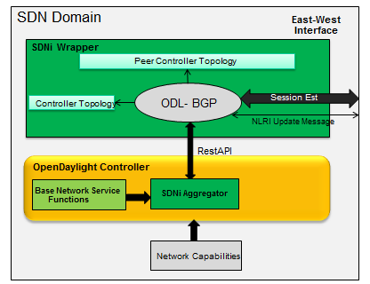

   SDNiWrapper

-  SDNiWrapper is an extension of ODL-BGPCEP where SDNi topology data is
   exchange along with the Update NLRI message. Refer
   http://tools.ietf.org/html/draft-ietf-idr-ls-distribution-04 for more
   information on NLRI.

-  SDNiWrapper gets the controller’s network capabilities through SDNi
   REST API and serialize it in Update NLRI message. This NLRI message
   will get exchange between the clustered controllers through
   BGP-UPDATE message. Similarly peer controller’s UPDATE message is
   received and unpacked then format to SDNi Network capability data,
   which will be stored for further purpose.

API Reference Documentation
---------------------------

Go to
`http://${ipaddress}:8181/apidoc/explorer/index.html <http://${ipaddress}:8181/apidoc/explorer/index.html>`__,
sign in, and expand the opendaylight-sdni panel. From there, users can
execute various API calls to test their sdni deployment.

OpenFlow Protocol Library Developer Guide
=========================================

Introduction
------------

OpenFlow Protocol Library is component in OpenDaylight, that mediates
communication between OpenDaylight controller and hardware devices
supporting OpenFlow protocol. Primary goal is to provide user (or upper
layers of OpenDaylight) communication channel, that can be used for
managing network hardware devices.

Features Overview
-----------------

There are three features inside openflowjava:

-  **odl-openflowjava-protocol** provides all openflowjava bundles, that
   are needed for communication with openflow devices. It ensures
   message translation and handles network connections. It also provides
   openflow protocol specific model.

-  **odl-openflowjava-all** currently contains only
   odl-openflowjava-protocol feature.

-  **odl-openflowjava-stats** provides mechanism for message counting
   and reporting. Can be used for performance analysis.

odl-openflowjava-protocol Architecture
--------------------------------------

Basic bundles contained in this feature are openflow-protocol-api,
openflow-protocol-impl, openflow-protocol-spi and util.

-  **openflow-protocol-api** - contains openflow model, constants and
   keys used for (de)serializer registration.

-  **openflow-protocol-impl** - contains message factories, that
   translate binary messages into DataObjects and vice versa. Bundle
   also contains network connection handlers - servers, netty pipeline
   handlers, …

-  **openflow-protocol-spi** - entry point for openflowjava
   configuration, startup and close. Basically starts implementation.

-  **util** - utility classes for binary-Java conversions and to ease
   experimenter key creation

odl-openflowjava-stats Feature
------------------------------

Runs over odl-openflowjava-protocol. It counts various message types /
events and reports counts in specified time periods. Statistics
collection can be configured in
openflowjava-config/src/main/resources/45-openflowjava-stats.xml

Key APIs and Interfaces
-----------------------

Basic API / SPI classes are ConnectionAdapter (Rpc/notifications) and
SwitchConnectionProcider (configure, start, shutdown)

Installation
------------

Pull the code and import project into your IDE.

::

    git clone ssh://<username>@git.opendaylight.org:29418/openflowjava.git

Configuration
-------------

Current implementation allows to configure:

-  listening port (mandatory)

-  transfer protocol (mandatory)

-  switch idle timeout (mandatory)

-  TLS configuration (optional)

-  thread count (optional)

You can find exemplary Openflow Protocol Library instance configuration
below:

::

    <data xmlns="urn:ietf:params:xml:ns:netconf:base:1.0">
      <modules xmlns="urn:opendaylight:params:xml:ns:yang:controller:config">
        <!-- default OF-switch-connection-provider (port 6633) -->
        <module>
          <type xmlns:prefix="urn:opendaylight:params:xml:ns:yang:openflow:switch:connection:provider:impl">prefix:openflow-switch-connection-provider-impl</type>
          <name>openflow-switch-connection-provider-default-impl</name>
          <port>6633</port>
    <!--  Possible transport-protocol options: TCP, TLS, UDP -->
          <transport-protocol>TCP</transport-protocol>
          <switch-idle-timeout>15000</switch-idle-timeout>
    <!--       Exemplary TLS configuration:
                - uncomment the <tls> tag
                - copy exemplary-switch-privkey.pem, exemplary-switch-cert.pem and exemplary-cacert.pem
                  files into your virtual machine
                - set VM encryption options to use copied keys
                - start communication
               Please visit OpenflowPlugin or Openflow Protocol Library#Documentation wiki pages
               for detailed information regarding TLS -->
    <!--       <tls>
                 <keystore>/exemplary-ctlKeystore</keystore>
                 <keystore-type>JKS</keystore-type>
                 <keystore-path-type>CLASSPATH</keystore-path-type>
                 <keystore-password>opendaylight</keystore-password>
                 <truststore>/exemplary-ctlTrustStore</truststore>
                 <truststore-type>JKS</truststore-type>
                 <truststore-path-type>CLASSPATH</truststore-path-type>
                 <truststore-password>opendaylight</truststore-password>
                 <certificate-password>opendaylight</certificate-password>
               </tls> -->
    <!--       Exemplary thread model configuration. Uncomment <threads> tag below to adjust default thread model -->
    <!--       <threads>
                 <boss-threads>2</boss-threads>
                 <worker-threads>8</worker-threads>
               </threads> -->
        </module>

::

        <!-- default OF-switch-connection-provider (port 6653) -->
        <module>
          <type xmlns:prefix="urn:opendaylight:params:xml:ns:yang:openflow:switch:connection:provider:impl">prefix:openflow-switch-connection-provider-impl</type>
          <name>openflow-switch-connection-provider-legacy-impl</name>
          <port>6653</port>
    <!--  Possible transport-protocol options: TCP, TLS, UDP -->
          <transport-protocol>TCP</transport-protocol>
          <switch-idle-timeout>15000</switch-idle-timeout>
    <!--       Exemplary TLS configuration:
                - uncomment the <tls> tag
                - copy exemplary-switch-privkey.pem, exemplary-switch-cert.pem and exemplary-cacert.pem
                  files into your virtual machine
                - set VM encryption options to use copied keys
                - start communication
               Please visit OpenflowPlugin or Openflow Protocol Library#Documentation wiki pages
               for detailed information regarding TLS -->
    <!--       <tls>
                 <keystore>/exemplary-ctlKeystore</keystore>
                 <keystore-type>JKS</keystore-type>
                 <keystore-path-type>CLASSPATH</keystore-path-type>
                 <keystore-password>opendaylight</keystore-password>
                 <truststore>/exemplary-ctlTrustStore</truststore>
                 <truststore-type>JKS</truststore-type>
                 <truststore-path-type>CLASSPATH</truststore-path-type>
                 <truststore-password>opendaylight</truststore-password>
                 <certificate-password>opendaylight</certificate-password>
               </tls> -->
    <!--       Exemplary thread model configuration. Uncomment <threads> tag below to adjust default thread model -->
    <!--       <threads>
                 <boss-threads>2</boss-threads>
                 <worker-threads>8</worker-threads>
               </threads> -->
        </module>

::

        <module>
          <type xmlns:prefix="urn:opendaylight:params:xml:ns:yang:openflow:common:config:impl">prefix:openflow-provider-impl</type>
          <name>openflow-provider-impl</name>
          <openflow-switch-connection-provider>
            <type xmlns:ofSwitch="urn:opendaylight:params:xml:ns:yang:openflow:switch:connection:provider">ofSwitch:openflow-switch-connection-provider</type>
            <name>openflow-switch-connection-provider-default</name>
          </openflow-switch-connection-provider>
          <openflow-switch-connection-provider>
            <type xmlns:ofSwitch="urn:opendaylight:params:xml:ns:yang:openflow:switch:connection:provider">ofSwitch:openflow-switch-connection-provider</type>
            <name>openflow-switch-connection-provider-legacy</name>
          </openflow-switch-connection-provider>
          <binding-aware-broker>
            <type xmlns:binding="urn:opendaylight:params:xml:ns:yang:controller:md:sal:binding">binding:binding-broker-osgi-registry</type>
            <name>binding-osgi-broker</name>
          </binding-aware-broker>
        </module>
      </modules>

Possible transport-protocol options:

-  TCP

-  TLS

-  UDP

Switch-idle timeout specifies time needed to detect idle state of
switch. When no message is received from switch within this time, upper
layers are notified on switch idleness. To be able to use this exemplary
TLS configuration:

-  uncomment the ``<tls>`` tag

-  copy *exemplary-switch-privkey.pem*, *exemplary-switch-cert.pem* and
   *exemplary-cacert.pem* files into your virtual machine

-  set VM encryption options to use copied keys (please visit TLS
   support wiki page for detailed information regarding TLS)

-  start communication

Thread model configuration specifies how many threads are desired to
perform Netty’s I/O operations.

-  boss-threads specifies the number of threads that register incoming
   connections

-  worker-threads specifies the number of threads performing read /
   write (+ serialization / deserialization) operations.

Architecture
------------

Public API ``(openflow-protocol-api)``
~~~~~~~~~~~~~~~~~~~~~~~~~~~~~~~~~~~~~~

Set of interfaces and builders for immutable data transfer objects
representing Openflow Protocol structures.

Transfer objects and service APIs are infered from several YANG models
using code generator to reduce verbosity of definition and repeatibility
of code.

The following YANG modules are defined:

-  openflow-types - defines common Openflow specific types

-  openflow-instruction - defines base Openflow instructions

-  openflow-action - defines base Openflow actions

-  openflow-augments - defines object augmentations

-  openflow-extensible-match - defines Openflow OXM match

-  openflow-protocol - defines Openflow Protocol messages

-  system-notifications - defines system notification objects

-  openflow-configuration - defines structures used in ConfigSubsystem

This modules also reuse types from following YANG modules:

-  ietf-inet-types - IP adresses, IP prefixes, IP-protocol related types

-  ietf-yang-types - Mac Address, etc.

The use of predefined types is to make APIs contracts more safe, better
readable and documented (e.g using MacAddress instead of byte array…)

TCP Channel pipeline ``(openflow-protocol-impl)``
~~~~~~~~~~~~~~~~~~~~~~~~~~~~~~~~~~~~~~~~~~~~~~~~~

Creates channel processing pipeline based on configuration and support.

**TCP Channel pipeline.**

imageopenflowjava/500px-TCPChannelPipeline.png[width=500]

**Switch Connection Provider.**

Implementation of connection point for other projects. Library exposes
its functionality through this class. Library can be configured, started
and shutdowned here. There are also methods for custom (de)serializer
registration.

**Tcp Connection Initializer.**

In order to initialize TCP connection to a device (switch), OF Plugin
calls method ``initiateConnection()`` in ``SwitchConnectionProvider``.
This method in turn initializes (Bootstrap) server side channel towards
the device.

**TCP Handler.**

Represents single server that is handling incoming connections over TCP
/ TLS protocol. TCP Handler creates a single instance of TCP Channel
Initializer that will initialize channels. After that it binds to
configured InetAddress and port. When a new device connects, TCP Handler
registers its channel and passes control to TCP Channel Initializer.

**TCP Channel Initializer.**

This class is used for channel initialization / rejection and passing
arguments. After a new channel has been registered it calls Switch
Connection Handler’s (OF Plugin) accept method to decide if the library
should keep the newly registered channel or if the channel should be
closed. If the channel has been accepted, TCP Channel Initializer
creates the whole pipeline with needed handlers and also with
ConnectionAdapter instance. After the channel pipeline is ready, Switch
Connection Handler is notified with ``onConnectionReady`` notification.
OpenFlow Plugin can now start sending messages downstream.

**Idle Handler.**

If there are no messages received for more than time specified, this
handler triggers idle state notification. The switch idle timeout is
received as a parameter from ConnectionConfiguration settings. Idle
State Handler is inactive while there are messages received within the
switch idle timeout. If there are no messages received for more than
timeout specified, handler creates SwitchIdleEvent message and sends it
upstream.

**TLS Handler.**

It encrypts and decrypts messages over TLS protocol. Engaging TLS
Handler into pipeline is matter of configuration (``<tls>`` tag). TLS
communication is either unsupported or required. TLS Handler is
represented as a Netty’s SslHandler.

**OF Frame Decoder.**

Parses input stream into correct length message frames for further
processing. Framing is based on Openflow header length. If received
message is shorter than minimal length of OpenFlow message (8 bytes), OF
Frame Decoder waits for more data. After receiving at least 8 bytes the
decoder checks length in OpenFlow header. If there are still some bytes
missing, the decoder waits for them. Else the OF Frame Decoder sends
correct length message to next handler in the channel pipeline.

**OF Version Detector.**

Detects version of used OpenFlow Protocol and discards unsupported
version messages. If the detected version is supported, OF Version
Detector creates ``VersionMessageWrapper`` object containing the
detected version and byte message and sends this object upstream.

**OF Decoder.**

Chooses correct deserilization factory (based on message type) and
deserializes messages into generated DTOs (Data Transfer Object). OF
Decoder receives ``VersionMessageWrapper`` object and passes it to
``DeserializationFactory`` which will return translated DTO.
``DeserializationFactory`` creates ``MessageCodeKey`` object with
version and type of received message and Class of object that will be
the received message deserialized into. This object is used as key when
searching for appropriate decoder in ``DecoderTable``. ``DecoderTable``
is basically a map storing decoders. Found decoder translates received
message into DTO. If there was no decoder found, null is returned. After
returning translated DTO back to OF Decoder, the decoder checks if it is
null or not. When the DTO is null, the decoder logs this state and
throws an Exception. Else it passes the DTO further upstream. Finally,
the OF Decoder releases ByteBuf containing received and decoded byte
message.

**OF Encoder.**

Chooses correct serialization factory (based on type of DTO) and
serializes DTOs into byte messages. OF Encoder does the opposite than
the OF Decoder using the same principle. OF Encoder receives DTO, passes
it for translation and if the result is not null, it sends translated
DTO downstream as a ByteBuf. Searching for appropriate encoder is done
via MessageTypeKey, based on version and class of received DTO.

**Delegating Inbound Handler.**

Delegates received DTOs to Connection Adapter. It also reacts on
channelInactive and channelUnregistered events. Upon one of these events
is triggered, DelegatingInboundHandler creates DisconnectEvent message
and sends it upstream, notifying upper layers about switch
disconnection.

**Channel Outbound Queue.**

Message flushing handler. Stores outgoing messages (DTOs) and flushes
them. Flush is performed based on time expired and on the number of
messages enqueued.

**Connection Adapter.**

Provides a facade on top of pipeline, which hides netty.io specifics.
Provides a set of methods to register for incoming messages and to send
messages to particular channel / session. ConnectionAdapterImpl
basically implements three interfaces (unified in one superinterface
ConnectionFacade):

-  ConnectionAdapter

-  MessageConsumer

-  OpenflowProtocolService

**ConnectionAdapter** interface has methods for setting up listeners
(message, system and connection ready listener), method to check if all
listeners are set, checking if the channel is alive and disconnect
method. Disconnect method clears responseCache and disables consuming of
new messages.

**MessageConsumer** interface holds only one method: ``consume()``.
``Consume()`` method is called from DelegatingInboundHandler. This
method processes received DTO’s based on their type. There are three
types of received objects:

-  System notifications - invoke system notifications in OpenFlow Plugin
   (systemListener set). In case of ``DisconnectEvent`` message, the
   Connection Adapter clears response cache and disables consume()
   method processing,

-  OpenFlow asynchronous messages (from switch) - invoke corresponding
   notifications in OpenFlow Plugin,

-  OpenFlow symmetric messages (replies to requests) - create
   ``RpcResponseKey`` with XID and DTO’s class set. This
   ``RpcResponseKey`` is then used to find corresponding future object
   in responseCache. Future object is set with success flag, received
   message and errors (if any occurred). In case no corresponding future
   was found in responseCache, Connection Adapter logs warning and
   discards the message. Connection Adapter also logs warning when an
   unknown DTO is received.

**OpenflowProtocolService** interface contains all rpc-methods for
sending messages from upper layers (OpenFlow Plugin) downstream and
responding. Request messages return Future filled with expected reply
message, otherwise the expected Future is of type Void.

**NOTE:** MultipartRequest message is the only exception. Basically it
is request - reply Message type, but it wouldn’t be able to process more
following MultipartReply messages if this was implemented as rpc (only
one Future). This is why MultipartReply is implemented as notification.
OpenFlow Plugin takes care of correct message processing.

UDP Channel pipeline (openflow-protocol-impl)
~~~~~~~~~~~~~~~~~~~~~~~~~~~~~~~~~~~~~~~~~~~~~

Creates UDP channel processing pipeline based on configuration and
support. **Switch Connection Provider**, **Channel Outbound Queue** and
**Connection Adapter** fulfill the same role as in case of TCP
connection / channel pipeline (please see above).

.. figure:: ./images/openflowjava/500px-UdpChannelPipeline.png
   :alt: UDP Channel pipeline

   UDP Channel pipeline

**UDP Handler.**

Represents single server that is handling incoming connections over UDP
(DTLS) protocol. UDP Handler creates a single instance of UDP Channel
Initializer that will initialize channels. After that it binds to
configured InetAddress and port. When a new device connects, UDP Handler
registers its channel and passes control to UDP Channel Initializer.

**UDP Channel Initializer.**

This class is used for channel initialization and passing arguments.
After a new channel has been registered (for UDP there is always only
one channel) UDP Channel Initializer creates whole pipeline with needed
handlers.

**DTLS Handler.**

Haven’t been implemented yet. Will take care of secure DTLS connections.

**OF Datagram Packet Handler.**

Combines functionality of OF Frame Decoder and OF Version Detector.
Extracts messages from received datagram packets and checks if message
version is supported. If there is a message received from yet unknown
sender, OF Datagram Packet Handler creates Connection Adapter for this
sender and stores it under sender’s address in ``UdpConnectionMap``.
This map is also used for sending the messages and for correct
Connection Adapter lookup - to delegate messages from one channel to
multiple sessions.

**OF Datagram Packet Decoder.**

Chooses correct deserilization factory (based on message type) and
deserializes messages into generated DTOs. OF Decoder receives
``VersionMessageUdpWrapper`` object and passes it to
``DeserializationFactory`` which will return translated DTO.
``DeserializationFactory`` creates ``MessageCodeKey`` object with
version and type of received message and Class of object that will be
the received message deserialized into. This object is used as key when
searching for appropriate decoder in ``DecoderTable``. ``DecoderTable``
is basically a map storing decoders. Found decoder translates received
message into DTO (DataTransferObject). If there was no decoder found,
null is returned. After returning translated DTO back to OF Datagram
Packet Decoder, the decoder checks if it is null or not. When the DTO is
null, the decoder logs this state. Else it looks up appropriate
Connection Adapter in ``UdpConnectionMap`` and passes the DTO to found
Connection Adapter. Finally, the OF Decoder releases ``ByteBuf``
containing received and decoded byte message.

**OF Datagram Packet Encoder.**

Chooses correct serialization factory (based on type of DTO) and
serializes DTOs into byte messages. OF Datagram Packet Encoder does the
opposite than the OF Datagram Packet Decoder using the same principle.
OF Encoder receives DTO, passes it for translation and if the result is
not null, it sends translated DTO downstream as a datagram packet.
Searching for appropriate encoder is done via MessageTypeKey, based on
version and class of received DTO.

SPI (openflow-protocol-spi)
~~~~~~~~~~~~~~~~~~~~~~~~~~~

Defines interface for library’s connection point for other projects.
Library exposes its functionality through this interface.

Integration test (openflow-protocol-it)
~~~~~~~~~~~~~~~~~~~~~~~~~~~~~~~~~~~~~~~

Testing communication with simple client.

Simple client(simple-client)
~~~~~~~~~~~~~~~~~~~~~~~~~~~~

Lightweight switch simulator - programmable with desired scenarios.

Utility (util)
~~~~~~~~~~~~~~

Contains utility classes, mainly for work with ByteBuf.

Library’s lifecycle
-------------------

Steps (after the library’s bundle is started):

-  [1] Library is configured by ConfigSubsystem (adress, ports,
   encryption, …)

-  [2] Plugin injects its SwitchConnectionHandler into the Library

-  [3] Plugin starts the Library

-  [4] Library creates configured protocol handler (e.g. TCP Handler)

-  [5] Protocol Handler creates Channel Initializer

-  [6] Channel Initializer asks plugin whether to accept incoming
   connection on each new switch connection

-  [7] Plugin responds:

   -  true - continue building pipeline

   -  false - reject connection / disconnect channel

-  [8] Library notifies Plugin with onSwitchConnected(ConnectionAdapter)
   notification, passing reference to ConnectionAdapter, that will
   handle the connection

-  [9] Plugin registers its system and message listeners

-  [10] FireConnectionReadyNotification() is triggered, announcing that
   pipeline handlers needed for communication have been created and
   Plugin can start communication

-  [11] Plugin shutdowns the Library when desired


   Library lifecycle

Statistics collection
---------------------

Introduction
~~~~~~~~~~~~

Statistics collection collects message statistics. Current collected
statistics (``DS`` - downstream, ``US`` - upstream):

-  ``DS_ENTERED_OFJAVA`` - all messages that entered openflowjava
   (picked up from openflowplugin)

-  ``DS_ENCODE_SUCCESS`` - successfully encoded messages

-  ``DS_ENCODE_FAIL`` - messages that failed during encoding
   (serialization) process

-  ``DS_FLOW_MODS_ENTERED`` - all flow-mod messages that entered
   openflowjava

-  ``DS_FLOW_MODS_SENT`` - all flow-mod messages that were successfully
   sent

-  ``US_RECEIVED_IN_OFJAVA`` - messages received from switch

-  ``US_DECODE_SUCCESS`` - successfully decoded messages

-  ``US_DECODE_FAIL`` - messages that failed during decoding
   (deserialization) process

-  ``US_MESSAGE_PASS`` - messages handed over to openflowplugin

Karaf
~~~~~

In orded to start statistics, it is needed to feature:install
odl-openflowjava-stats. To see the logs one should use log:set DEBUG
org.opendaylight.openflowjava.statistics and than probably log:display
(you can log:list to see if the logging has been set). To adjust
collection settings it is enough to modify 45-openflowjava-stats.xml.

JConsole
~~~~~~~~

JConsole provides two commands for the statistics collection:

-  printing current statistics

-  resetting statistic counters

After attaching JConsole to correct process, one only needs to go into
MBeans
``tab → org.opendaylight.controller → RuntimeBean → statistics-collection-service-impl
→ statistics-collection-service-impl → Operations`` to be able to use
this commands.

TLS Support
-----------

    **Note**

    see OpenFlow Plugin Developper Guide

Extensibility
-------------

Introduction
~~~~~~~~~~~~

Entry point for the extensibility is ``SwitchConnectionProvider``.
``SwitchConnectionProvider`` contains methods for (de)serializer
registration. To register deserializer it is needed to use
.register\*Deserializer(key, impl). To register serializer one must use
.register\*Serializer(key, impl). Registration can occur either during
configuration or at runtime.

**NOTE**: In case when experimenter message is received and no
(de)serializer was registered, the library will throw
``IllegalArgumentException``.

Basic Principle
~~~~~~~~~~~~~~~

In order to use extensions it is needed to augment existing model and
register new (de)serializers.

Augmenting the model: 1. Create new augmentation

Register (de)serializers: 1. Create your (de)serializer 2. Let it
implement ``OFDeserializer<>`` / ``OFSerializer<>`` - in case the
structure you are (de)serializing needs to be used in Multipart
TableFeatures messages, let it implement ``HeaderDeserializer<>`` /
``HeaderSerializer`` 3. Implement prescribed methods 4. Register your
deserializer under appropriate key (in our case
``ExperimenterActionDeserializerKey``) 5. Register your serializer under
appropriate key (in our case ``ExperimenterActionSerializerKey``) 6.
Done, test your implementation

**NOTE**: If you don’t know what key should be used with your
(de)serializer implementation, please visit `Registration
keys <#registration_keys>`__ page.

Example
~~~~~~~

Let’s say we have vendor / experimenter action represented by this
structure:

::

    struct foo_action {
        uint16_t type;
        uint16_t length;
        uint32_t experimenter;
        uint16_t first;
        uint16_t second;
        uint8_t  pad[4];
    }

First, we have to augment existing model. We create new module, which
imports "``openflow-types.yang``" (don’t forget to update your
``pom.xml`` with api dependency). Now we create foo action identity:

::

    import openflow-types {prefix oft;}
    identity foo {
        description "Foo action description";
        base oft:action-base;
    }

This will be used as type in our structure. Now we must augment existing
action structure, so that we will have the desired fields first and
second. In order to create new augmentation, our module has to import
"``openflow-action.yang``". The augment should look like this:

::

    import openflow-action {prefix ofaction;}
    augment "/ofaction:actions-container/ofaction:action" {
        ext:augment-identifier "foo-action";
            leaf first {
                type uint16;
            }
            leaf second {
                type uint16;
            }
        }

We are finished with model changes. Run mvn clean compile to generate
sources. After generation is done, we need to implement our
(de)serializer.

Deserializer:

::

    public class FooActionDeserializer extends OFDeserializer<Action> {
       @Override
       public Action deserialize(ByteBuf input) {
           ActionBuilder builder = new ActionBuilder();
           input.skipBytes(SIZE_OF_SHORT_IN_BYTES); *// we know the type of action*
           builder.setType(Foo.class);
           input.skipBytes(SIZE_OF_SHORT_IN_BYTES); *// we don't need length*
           *// now create experimenterIdAugmentation - so that openflowplugin can
           differentiate correct vendor codec*
           ExperimenterIdActionBuilder expIdBuilder = new ExperimenterIdActionBuilder();
           expIdBuilder.setExperimenter(new ExperimenterId(input.readUnsignedInt()));
           builder.addAugmentation(ExperimenterIdAction.class, expIdBuilder.build());
           FooActionBuilder fooBuilder = new FooActionBuilder();
           fooBuilder.setFirst(input.readUnsignedShort());
           fooBuilder.setSecond(input.readUnsignedShort());
           builder.addAugmentation(FooAction.class, fooBuilder.build());
           input.skipBytes(4); *// padding*
           return builder.build();
       }
    }

Serializer:

::

    public class FooActionSerializer extends OFSerializer<Action> {
       @Override
       public void serialize(Action action, ByteBuf outBuffer) {
           outBuffer.writeShort(FOO_CODE);
           outBuffer.writeShort(16);
           *// we don't have to check for ExperimenterIdAction augmentation - our
           serializer*
           *// was called based on the vendor / experimenter ID, so we simply write
           it to buffer*
           outBuffer.writeInt(VENDOR / EXPERIMENTER ID);
           FooAction foo = action.getAugmentation(FooAction.class);
           outBuffer.writeShort(foo.getFirst());
           outBuffer.writeShort(foo.getSecond());
           outBuffer.writeZero(4); //write padding
       }
    }

Register both deserializer and serializer:
``SwitchConnectionProvider.registerDeserializer(new
ExperimenterActionDeserializerKey(0x04, VENDOR / EXPERIMENTER ID),
new FooActionDeserializer());``
``SwitchConnectionProvider.registerSerializer(new
ExperimenterActionSerializerKey(0x04, VENDOR / EXPERIMENTER ID),
new FooActionSerializer());``

We are ready to test our implementation.

**NOTE:** Vendor / Experimenter structures define only vendor /
experimenter ID as common distinguisher (besides action type). Vendor /
Experimenter ID is unique for all vendor messages - that’s why vendor is
able to register only one class under
ExperimenterAction(De)SerializerKey. And that’s why vendor has to switch
/ choose between his subclasses / subtypes on his own.

Detailed walkthrough: Deserialization extensibility
~~~~~~~~~~~~~~~~~~~~~~~~~~~~~~~~~~~~~~~~~~~~~~~~~~~

**External interface & class description.**

**OFGeneralDeserializer:**

-  ``OFDeserializer<E extends DataObject>``

   -  *deserialize(ByteBuf)* - deserializes given ByteBuf

-  ``HeaderDeserializer<E extends DataObject>``

   -  *deserializeHeaders(ByteBuf)* - deserializes only E headers (used
      in Multipart TableFeatures messages)

**DeserializerRegistryInjector**

-  ``injectDeserializerRegistry(DeserializerRegistry)`` - injects
   deserializer registry into deserializer. Useful when custom
   deserializer needs access to other deserializers.

**NOTE:** DeserializerRegistryInjector is not OFGeneralDeserializer
descendand. It is a standalone interface.

**MessageCodeKey and its descendants** These keys are used as for
deserializer lookup in DeserializerRegistry. MessageCodeKey should is
used in general, while its descendants are used in more special cases.
For Example ActionDeserializerKey is used for Action deserializer lookup
and (de)registration. Vendor is provided with special keys, which
contain only the most necessary fields. These keys usually start with
"Experimenter" prefix (MatchEntryDeserializerKey is an exception).

MessageCodeKey has these fields:

-  short version - Openflow wire version number

-  int value - value read from byte message

-  Class<?> clazz - class of object being creating

-  [1] The scenario starts in a custom bundle which wants to extend
   library’s functionality. The custom bundle creates deserializers
   which implement exposed ``OFDeserializer`` / ``HeaderDeserializer``
   interfaces (wrapped under ``OFGeneralDeserializer`` unifying super
   interface).

-  [2] Created deserializers are paired with corresponding
   ExperimenterKeys, which are used for deserializer lookup. If you
   don’t know what key should be used with your (de)serializer
   implementation, please visit `Registration
   keys <#registration_keys>`__ page.

-  [3] Paired deserializers are passed to the OF Library via
   **SwitchConnectionProvider**.\ *registerCustomDeserializer(key,
   impl)*. Library registers the deserializer.

   -  While registering, Library checks if the deserializer is an
      instance of **DeserializerRegistryInjector** interface. If yes,
      the DeserializerRegistry (which stores all deserializer
      references) is injected into the deserializer.

This is particularly useful when the deserializer needs access to other
deserializers. For example ``IntructionsDeserializer`` needs access to
``ActionsDeserializer`` in order to be able to process
OFPIT\_WRITE\_ACTIONS/OFPIT\_APPLY\_ACTIONS instructions.

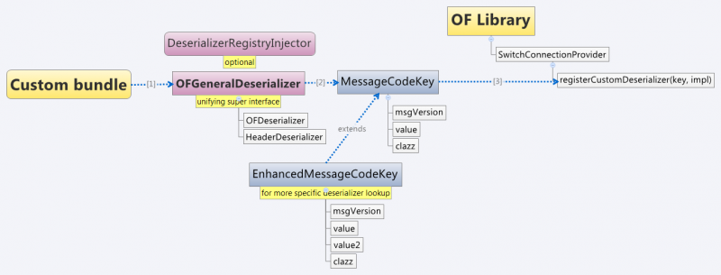

   Deserialization scenario walkthrough

Detailed walkthrough: Serialization extensibility
~~~~~~~~~~~~~~~~~~~~~~~~~~~~~~~~~~~~~~~~~~~~~~~~~

**External interface & class description.**

**OFGeneralSerializer:**

-  OFSerializer<E extends DataObject>

   -  *serialize(E,ByteBuf)* - serializes E into given ByteBuf

-  ``HeaderSerializer<E extends DataObject>``

   -  *serializeHeaders(E,ByteBuf)* - serializes E headers (used in
      Multipart TableFeatures messages)

**SerializerRegistryInjector** \*
``injectSerializerRegistry(SerializerRegistry)`` - injects serializer
registry into serializer. Useful when custom serializer needs access to
other serializers.

**NOTE:** SerializerRegistryInjector is not OFGeneralSerializer
descendand.

**MessageTypeKey and its descendants** These keys are used as for
serializer lookup in SerializerRegistry. MessageTypeKey should is used
in general, while its descendants are used in more special cases. For
Example ActionSerializerKey is used for Action serializer lookup and
(de)registration. Vendor is provided with special keys, which contain
only the most necessary fields. These keys usually start with
"Experimenter" prefix (MatchEntrySerializerKey is an exception).

MessageTypeKey has these fields:

-  *short version* - Openflow wire version number

-  *Class<E> msgType* - DTO class

Scenario walkthrough

-  [1] Serialization extensbility principles are similar to the
   deserialization principles. The scenario starts in a custom bundle.
   The custom bundle creates serializers which implement exposed
   OFSerializer / HeaderSerializer interfaces (wrapped under
   OFGeneralSerializer unifying super interface).

-  [2] Created serializers are paired with their ExperimenterKeys, which
   are used for serializer lookup. If you don’t know what key should be
   used with your serializer implementation, please visit `Registration
   keys <#registration_keys>`__ page.

-  [3] Paired serializers are passed to the OF Library via
   **SwitchConnectionProvider**.\ *registerCustomSerializer(key, impl)*.
   Library registers the serializer.

-  While registering, Library checks if the serializer is an instance of
   **SerializerRegistryInjector** interface. If yes, the
   SerializerRegistry (which stores all serializer references) is
   injected into the serializer.

This is particularly useful when the serializer needs access to other
deserializers. For example IntructionsSerializer needs access to
ActionsSerializer in order to be able to process
OFPIT\_WRITE\_ACTIONS/OFPIT\_APPLY\_ACTIONS instructions.

.. figure:: ./images/openflowjava/800px-Extensibility2.png
   :alt: Serialization scenario walkthrough

   Serialization scenario walkthrough

Internal description
~~~~~~~~~~~~~~~~~~~~

**SwitchConnectionProvider** ``SwitchConnectionProvider`` constructs and
initializes both deserializer and serializer registries with default
(de)serializers. It also injects the ``DeserializerRegistry`` into the
``DeserializationFactory``, the ``SerializerRegistry`` into the
``SerializationFactory``. When call to register custom (de)serializer is
made, ``SwitchConnectionProvider`` calls register method on appropriate
registry.

**DeserializerRegistry / SerializerRegistry** Both registries contain
init() method to initialize default (de)serializers. Registration checks
if key or (de)serializer implementation are not ``null``. If at least
one of the is ``null``, ``NullPointerException`` is thrown. Else the
(de)serializer implementation is checked if it is
``(De)SerializerRegistryInjector`` instance. If it is an instance of
this interface, the registry is injected into this (de)serializer
implementation.

``GetSerializer(key)`` or ``GetDeserializer(key)`` performs registry
lookup. Because there are two separate interfaces that might be put into
the registry, the registry uses their unifying super interface.
Get(De)Serializer(key) method casts the super interface to desired type.
There is also a null check for the (de)serializer received from the
registry. If the deserializer wasn’t found, ``NullPointerException``
with key description is thrown.

Registration keys
~~~~~~~~~~~~~~~~~

**Deserialization.**

**Possible openflow extensions and their keys**

There are three vendor specific extensions in Openflow v1.0 and eight in
Openflow v1.3. These extensions are registered under registration keys,
that are shown in table below:

+----------------+---------+------------------------------+-----------------------+
| Extension type | OpenFlo | Registration key             | Utility class         |
|                | w       |                              |                       |
+================+=========+==============================+=======================+
| Vendor message | 1.0     | ExperimenterIdDeserializerKe | ExperimenterDeseriali |
|                |         | y(1,                         | zerKeyFactory         |
|                |         | experimenterId,              |                       |
|                |         | ExperimenterMessage.class)   |                       |
+----------------+---------+------------------------------+-----------------------+
| Action         | 1.0     | ExperimenterActionDeserializ | .                     |
|                |         | erKey(1,                     |                       |
|                |         | experimenter ID)             |                       |
+----------------+---------+------------------------------+-----------------------+
| Stats message  | 1.0     | ExperimenterMultipartReplyMe | ExperimenterDeseriali |
|                |         | ssageDeserializerKey(1,      | zerKeyFactory         |
|                |         | experimenter ID)             |                       |
+----------------+---------+------------------------------+-----------------------+
| Experimenter   | 1.3     | ExperimenterIdDeserializerKe | ExperimenterDeseriali |
| message        |         | y(4,                         | zerKeyFactory         |
|                |         | experimenterId,              |                       |
|                |         | ExperimenterMessage.class)   |                       |
+----------------+---------+------------------------------+-----------------------+
| Match entry    | 1.3     | MatchEntryDeserializerKey(4, | .                     |
|                |         | (number) ${oxm\_class},      |                       |
|                |         | (number) ${oxm\_field});     |                       |
+----------------+---------+------------------------------+-----------------------+
|                |         | key.setExperimenterId(experi | .                     |
|                |         | menter                       |                       |
|                |         | ID);                         |                       |
+----------------+---------+------------------------------+-----------------------+
| Action         | 1.3     | ExperimenterActionDeserializ | .                     |
|                |         | erKey(4,                     |                       |
|                |         | experimenter ID)             |                       |
+----------------+---------+------------------------------+-----------------------+
| Instruction    | 1.3     | ExperimenterInstructionDeser | .                     |
|                |         | ializerKey(4,                |                       |
|                |         | experimenter ID)             |                       |
+----------------+---------+------------------------------+-----------------------+
| Multipart      | 1.3     | ExperimenterIdDeserializerKe | ExperimenterDeseriali |
|                |         | y(4,                         | zerKeyFactory         |
|                |         | experimenterId,              |                       |
|                |         | MultipartReplyMessage.class) |                       |
+----------------+---------+------------------------------+-----------------------+
| Multipart -    | 1.3     | ExperimenterIdDeserializerKe | ExperimenterDeseriali |
| Table features |         | y(4,                         | zerKeyFactory         |
|                |         | experimenterId,              |                       |
|                |         | TableFeatureProperties.class |                       |
|                |         | )                            |                       |
+----------------+---------+------------------------------+-----------------------+
| Error          | 1.3     | ExperimenterIdDeserializerKe | ExperimenterDeseriali |
|                |         | y(4,                         | zerKeyFactory         |
|                |         | experimenterId,              |                       |
|                |         | ErrorMessage.class)          |                       |
+----------------+---------+------------------------------+-----------------------+
| Queue property | 1.3     | ExperimenterIdDeserializerKe | ExperimenterDeseriali |
|                |         | y(4,                         | zerKeyFactory         |
|                |         | experimenterId,              |                       |
|                |         | QueueProperty.class)         |                       |
+----------------+---------+------------------------------+-----------------------+
| Meter band     | 1.3     | ExperimenterIdDeserializerKe | ExperimenterDeseriali |
| type           |         | y(4,                         | zerKeyFactory         |
|                |         | experimenterId,              |                       |
|                |         | MeterBandExperimenterCase.cl |                       |
|                |         | ass)                         |                       |
+----------------+---------+------------------------------+-----------------------+

Table: **Deserialization**

**Serialization.**

**Possible openflow extensions and their keys**

There are three vendor specific extensions in Openflow v1.0 and seven
Openflow v1.3. These extensions are registered under registration keys,
that are shown in table below:

+----------------+---------+------------------------------+-----------------------+
| Extension type | OpenFlo | Registration key             | Utility class         |
|                | w       |                              |                       |
+================+=========+==============================+=======================+
| Vendor message | 1.0     | ExperimenterIdSerializerKey< | ExperimenterSerialize |
|                |         | >(1,                         | rKeyFactory           |
|                |         | experimenterId,              |                       |
|                |         | ExperimenterInput.class)     |                       |
+----------------+---------+------------------------------+-----------------------+
| Action         | 1.0     | ExperimenterActionSerializer | .                     |
|                |         | Key(1,                       |                       |
|                |         | experimenterId, sub-type)    |                       |
+----------------+---------+------------------------------+-----------------------+
| Stats message  | 1.0     | ExperimenterMultipartRequest | ExperimenterSerialize |
|                |         | SerializerKey(1,             | rKeyFactory           |
|                |         | experimenter ID)             |                       |
+----------------+---------+------------------------------+-----------------------+
| Experimenter   | 1.3     | ExperimenterIdSerializerKey< | ExperimenterSerialize |
| message        |         | >(4,                         | rKeyFactory           |
|                |         | experimenterId,              |                       |
|                |         | ExperimenterInput.class)     |                       |
+----------------+---------+------------------------------+-----------------------+
| Match entry    | 1.3     | MatchEntrySerializerKey<>(4, | .                     |
|                |         | (class) ${oxm\_class},       |                       |
|                |         | (class) ${oxm\_field});      |                       |
+----------------+---------+------------------------------+-----------------------+
|                |         | key.setExperimenterId(experi | .                     |
|                |         | menter                       |                       |
|                |         | ID)                          |                       |
+----------------+---------+------------------------------+-----------------------+
| Action         | 1.3     | ExperimenterActionSerializer | .                     |
|                |         | Key(4,                       |                       |
|                |         | experimenterId, sub-type)    |                       |
+----------------+---------+------------------------------+-----------------------+
| Instruction    | 1.3     | ExperimenterInstructionSeria | .                     |
|                |         | lizerKey(4,                  |                       |
|                |         | experimenter ID)             |                       |
+----------------+---------+------------------------------+-----------------------+
| Multipart      | 1.3     | ExperimenterIdSerializerKey< | ExperimenterSerialize |
|                |         | >(4,                         | rKeyFactory           |
|                |         | experimenterId,              |                       |
|                |         | MultipartRequestExperimenter |                       |
|                |         | Case.class)                  |                       |
+----------------+---------+------------------------------+-----------------------+
| Multipart -    | 1.3     | ExperimenterIdSerializerKey< | ExperimenterSerialize |
| Table features |         | >(4,                         | rKeyFactory           |
|                |         | experimenterId,              |                       |
|                |         | TableFeatureProperties.class |                       |
|                |         | )                            |                       |
+----------------+---------+------------------------------+-----------------------+
| Meter band     | 1.3     | ExperimenterIdSerializerKey< | ExperimenterSerialize |
| type           |         | >(4,                         | rKeyFactory           |
|                |         | experimenterId,              |                       |
|                |         | MeterBandExperimenterCase.cl |                       |
|                |         | ass)                         |                       |
+----------------+---------+------------------------------+-----------------------+

Table: **Serialization**

OpenFlow Plugin Project Developer Guide
=======================================

This section covers topics which are developer specific and which have
not been covered in the user guide. Please see the Lithium OpenFlow
plugin user guide first.

It can be found on `the OpenDaylight software download
page <https://www.opendaylight.org/downloads>`__.

Event Sequences
---------------

Session Establishment
~~~~~~~~~~~~~~~~~~~~~

The `OpenFlow Protocol
Library <#_openflow_protocol_library_developer_guide>`__ provides
interface **SwitchConnectionHandler** which contains method
*onSwitchConnected* (step 1). This event is raised in the OpenFlow
Protocol Library when an OpenFlow device connects to OpenDaylight and
caught in the **ConnectionManagerImpl** class in the OpenFlow plugin.

There the plugin creates a new instance of the **ConnectionContextImpl**
class (step 1.1) and also instances of **HandshakeManagerImpl** (which
uses **HandshakeListenerImpl**) and **ConnectionReadyListenerImpl**.
**ConnectionReadyListenerImpl** contains method *onConnectionReady()*
which is called when connection is prepared. This method starts the
handshake with the OpenFlow device (switch) from the OpenFlow plugin
side. Then handshake can be also started from device side. In this case
method *shake()* from **HandshakeManagerImpl** is called (steps 1.1.1
and 2).

The handshake consists of an exchange of HELLO messages in addition to
an exchange of device features (steps 2.1. and 3). The handshake is
completed by **HandshakeManagerImpl**. After receiving device features,
the **HandshakeListenerImpl** is notifed via the
*onHanshakeSuccessfull()* method. After this, the device features, node
id and connection state are stored in a **ConnectionContext** and the
method *deviceConnected()* of **DeviceManagerImpl** is called.

When *deviceConnected()* is called, it does the following:

1. creates a new transaction chain (step 4.1)

2. creates a new instance of **DeviceContext** (step 4.2.2)

3. initializes the device context: the static context of device is
   populated by calling *createDeviceFeaturesForOF<version>()* to
   populate table, group, meter features and port descriptions (step
   4.2.1 and 4.2.1.1)

4. creates an instance of **RequestContext** for each type of feature

When the OpenFlow device responds to these requests (step 4.2.1.1) with
multipart replies (step 5) they are processed and stored to MD-SAL
operational datastore. The *createDeviceFeaturesForOF<version>()* method
returns a **Future** which is processed in the callback (step 5.1) (part
of *initializeDeviceContext()* in the *deviceConnected()* method) by
calling the method *onDeviceCtxLevelUp()* from **StatisticsManager**
(step 5.1.1).

The call to *createDeviceFeaturesForOF<version>()*: . creates a new
instance of **StatisticsContextImpl** (step 5.1.1.1).

1. calls *gatherDynamicStatistics()* on that instance which returns a
   **Future** which will produce a value when done

   a. this method calls methods to get dynamic data (flows, tables,
      groups) from the device (step 5.1.1.2, 5.1.1.2.1, 5.1.1.2.1.1)

   b. if everything works, this data is also stored in the MD-SAL
      operational datastore

If the **Future** is successful, it is processed (step 6.1.1) in a
callback in **StatisticsManagerImpl** which:

1. schedules the next time to poll the device for statistics

2. sets the device state to synchronized (step 6.1.1.2)

3. calls *onDeviceContextLevelUp()* in **RpcManagerImpl**

The *onDeviceContextLevelUp()* call:

1. creates a new instance of **RequestContextImpl**

2. registers implementation for supported services

3. calls *onDeviceContextLevelUp()* in **DeviceManagerImpl** (step
   6.1.1.2.1.2) which causes the information about the new device be be
   written to the MD-SAL operational datastore (step 6.1.1.2.2)


   Session establishment

Handshake
~~~~~~~~~

The first thing that happens when an OpenFlow device connects to
OpenDaylight is that the OpenFlow plugin gathers basic information about
the device and establishes agreement on key facts like the version of
OpenFlow which will be used. This process is called the handshake.

The handshake starts with HELLO message which can be sent either by the
OpenFlow device or the OpenFlow plugin. After this, there are several
scenarios which can happen:

1. if the first HELLO message contains a *version bitmap*, it is
   possible to determine if there is a common version of OpenFlow or
   not:

   a. if there is a single common version use it and the **VERSION IS
      SETTLED**

   b. if there are more than one common versions, use the highest
      (newest) protocol and the **VERSION IS SETTLED**

   c. if there are no common versions, the device is **DISCONNECTED**

2. if the first HELLO message does not contain a *version bitmap*, then
   STEB-BY-STEP negotiation is used

3. if second (or more) HELLO message is received, then STEP-BY-STEP
   negotiation is used

STEP-BY-STEP negotiation:
^^^^^^^^^^^^^^^^^^^^^^^^^

-  if last version proposed by the OpenFlow plugin is the same as the
   version received from the OpenFlow device, then the **VERSION IS
   SETTLED**

-  if the version received in the current HELLO message from the device
   is the same as from previous then negotiation has failed and the
   device is **DISCONNECTED**

-  if the last version from the device is greater than the last version
   proposed from the plugin, wait for the next HELLO message in the hope
   that it will advertise support for a lower version

-  if the last version from the device is is less than the last version
   proposed from the plugin:

   -  propose the highest version the plugin supports that is less than
      or equal to the version received from the device and wait for the
      next HELLO message

   -  if if the plugin doesn’t support a lower version, the device is
      **DISCONNECTED**

After selecting of version we can say that the **VERSION IS SETTLED**
and the OpenFlow plugin can ask device for its features. At this point
handshake ends.

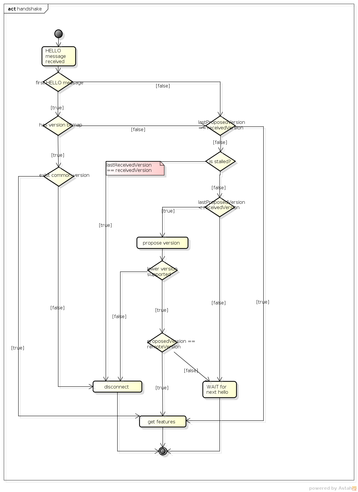

   Handshake process

Adding a Flow
~~~~~~~~~~~~~

There are two ways to add a flow in in the OpenFlow plugin: adding it to
the MD-SAL config datastore or calling an RPC. Both of these can either
be done using the native MD-SAL interfaces or using RESTCONF. This
discussion focuses on calling the RPC.

If user send flow via REST interface (step 1) it will cause that
*invokeRpc()* is called on **RpcBroker**. The **RpcBroker** then looks
for an appropriate implementation of the interface. In the case of the
OpenFlow plugin, this is the *addFlow()* method of
**SalFlowServiceImpl** (step 1.1). The same thing happens if the RPC is
called directly from the native MD-SAL interfaces.

The *addFlow()* method then

1. calls the *commitEntry()* method (step 2) from the OpenFlow Protocol
   Library which is responsible for sending the flow to the device

2. creates a new **RequestContext** by calling *createRequestContext()*
   (step 3)

3. creates a callback to handle any events that happen because of
   sending the flow to the device

The callback method is triggered when a barrier reply message (step 2.1)
is received from the device indicating that the flow was either
installed or an appropriate error message was sent. If the flow was
successfully sent to the device, the RPC result is set to success (step
5). // **SalFlowService** contains inside method *addFlow()* other
callback which caught notification from callback for barrier message.

At this point, no information pertaining to the flow has been added to
the MD-SAL operational datastore. That is accomplished by the periodic
gathering of statistics from OpenFlow devices.

The **StatisticsContext** for each given OpenFlow device periodically
polls it using *gatherStatistics()* of **StatisticsGatheringUtil** which
issues an OpenFlow OFPT\_MULTIPART\_REQUEST - OFPMP\_FLOW. The response
to this request (step 7) is processed in **StatisticsGatheringUtil**
class where flow data is written to the MD-SAL operational datastore via
the *writeToTransaction()* method of **DeviceContext**.

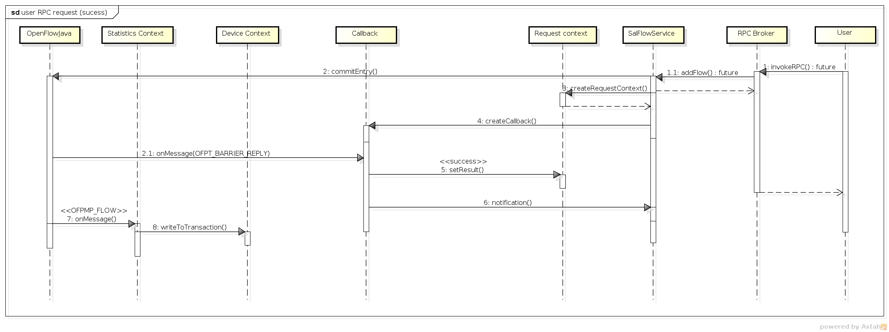

   Add flow

Internal message statistics API
-------------------------------

To aid in testing and diagnosis, the OpenFlow plugin provides
information about the number and rate of different internal events.

The implementation does two things: collects event counts and exposes
counts. Event counts are grouped by message type, e.g.,
**PacketInMessage**, and checkpoint, e.g.,
*TO\_SWITCH\_ENQUEUED\_SUCCESS*. Once gathered, the results are logged
as well as being exposed using OSGi command line (deprecated) and JMX.

Collect
~~~~~~~

Each message is counted as it passes through various processing
checkpoints. The following checkpoints are defined as a Java enum and
tracked:

.. code:: java

      /**
        * statistic groups overall in OFPlugin
        */
      enum STATISTIC_GROUP {
           /** message from switch, enqueued for processing */
           FROM_SWITCH_ENQUEUED,
           /** message from switch translated successfully - source */
           FROM_SWITCH_TRANSLATE_IN_SUCCESS,
           /** message from switch translated successfully - target */
           FROM_SWITCH_TRANSLATE_OUT_SUCCESS,
           /** message from switch where translation failed - source */
           FROM_SWITCH_TRANSLATE_SRC_FAILURE,
           /** message from switch finally published into MD-SAL */
           FROM_SWITCH_PUBLISHED_SUCCESS,
           /** message from switch - publishing into MD-SAL failed */
           FROM_SWITCH_PUBLISHED_FAILURE,

           /** message from MD-SAL to switch via RPC enqueued */
           TO_SWITCH_ENQUEUED_SUCCESS,
           /** message from MD-SAL to switch via RPC NOT enqueued */
           TO_SWITCH_ENQUEUED_FAILED,
           /** message from MD-SAL to switch - sent to OFJava successfully */
           TO_SWITCH_SUBMITTED_SUCCESS,
           /** message from MD-SAL to switch - sent to OFJava but failed*/
           TO_SWITCH_SUBMITTED_FAILURE
      }

When a message passes through any of those checkpoints then counter
assigned to corresponding checkpoint and message is incremented by 1.

Expose statistics
~~~~~~~~~~~~~~~~~

As described above, there are three ways to access the statistics:

-  OSGi command line (this is considered deprecated)

       ``osgi> dumpMsgCount``

-  OpenDaylight logging console (statistics are logged here every 10
   seconds)

       required logback settings :
       ``<logger name="org.opendaylight.openflowplugin.openflow.md.queue.MessageSpyCounterImpl" level="DEBUG"\/>``

-  JMX (via JConsole)

       start OpenFlow plugin with the ``-jmx`` parameter

       start JConsole by running ``jconsole``

       the JConsole MBeans tab should contain
       org.opendaylight.controller

       RuntimeBean has a msg-spy-service-impl

       Operations provides makeMsgStatistics report functionality

Example results
^^^^^^^^^^^^^^^


   OFplugin Debug stats.png

::

    DEBUG o.o.o.s.MessageSpyCounterImpl - FROM_SWITCH_ENQUEUED: MSG[PortStatusMessage] -> +0 | 1
    DEBUG o.o.o.s.MessageSpyCounterImpl - FROM_SWITCH_ENQUEUED: MSG[MultipartReplyMessage] -> +24 | 81
    DEBUG o.o.o.s.MessageSpyCounterImpl - FROM_SWITCH_ENQUEUED: MSG[PacketInMessage] -> +8 | 111
    DEBUG o.o.o.s.MessageSpyCounterImpl - FROM_SWITCH_TRANSLATE_IN_SUCCESS: MSG[PortStatusMessage] -> +0 | 1
    DEBUG o.o.o.s.MessageSpyCounterImpl - FROM_SWITCH_TRANSLATE_IN_SUCCESS: MSG[MultipartReplyMessage] -> +24 | 81
    DEBUG o.o.o.s.MessageSpyCounterImpl - FROM_SWITCH_TRANSLATE_IN_SUCCESS: MSG[PacketInMessage] -> +8 | 111
    DEBUG o.o.o.s.MessageSpyCounterImpl - FROM_SWITCH_TRANSLATE_OUT_SUCCESS: MSG[QueueStatisticsUpdate] -> +3 | 7
    DEBUG o.o.o.s.MessageSpyCounterImpl - FROM_SWITCH_TRANSLATE_OUT_SUCCESS: MSG[NodeUpdated] -> +0 | 3
    DEBUG o.o.o.s.MessageSpyCounterImpl - FROM_SWITCH_TRANSLATE_OUT_SUCCESS: MSG[NodeConnectorStatisticsUpdate] -> +3 | 7
    DEBUG o.o.o.s.MessageSpyCounterImpl - FROM_SWITCH_TRANSLATE_OUT_SUCCESS: MSG[GroupDescStatsUpdated] -> +3 | 7
    DEBUG o.o.o.s.MessageSpyCounterImpl - FROM_SWITCH_TRANSLATE_OUT_SUCCESS: MSG[FlowsStatisticsUpdate] -> +3 | 19
    DEBUG o.o.o.s.MessageSpyCounterImpl - FROM_SWITCH_TRANSLATE_OUT_SUCCESS: MSG[PacketReceived] -> +8 | 111
    DEBUG o.o.o.s.MessageSpyCounterImpl - FROM_SWITCH_TRANSLATE_OUT_SUCCESS: MSG[MeterFeaturesUpdated] -> +0 | 3
    DEBUG o.o.o.s.MessageSpyCounterImpl - FROM_SWITCH_TRANSLATE_OUT_SUCCESS: MSG[GroupStatisticsUpdated] -> +3 | 7
    DEBUG o.o.o.s.MessageSpyCounterImpl - FROM_SWITCH_TRANSLATE_OUT_SUCCESS: MSG[GroupFeaturesUpdated] -> +0 | 3
    DEBUG o.o.o.s.MessageSpyCounterImpl - FROM_SWITCH_TRANSLATE_OUT_SUCCESS: MSG[MeterConfigStatsUpdated] -> +3 | 7
    DEBUG o.o.o.s.MessageSpyCounterImpl - FROM_SWITCH_TRANSLATE_OUT_SUCCESS: MSG[MeterStatisticsUpdated] -> +3 | 7
    DEBUG o.o.o.s.MessageSpyCounterImpl - FROM_SWITCH_TRANSLATE_OUT_SUCCESS: MSG[NodeConnectorUpdated] -> +0 | 12
    DEBUG o.o.o.s.MessageSpyCounterImpl - FROM_SWITCH_TRANSLATE_OUT_SUCCESS: MSG[FlowTableStatisticsUpdate] -> +3 | 8
    DEBUG o.o.o.s.MessageSpyCounterImpl - FROM_SWITCH_TRANSLATE_SRC_FAILURE: no activity detected
    DEBUG o.o.o.s.MessageSpyCounterImpl - FROM_SWITCH_PUBLISHED_SUCCESS: MSG[QueueStatisticsUpdate] -> +3 | 7
    DEBUG o.o.o.s.MessageSpyCounterImpl - FROM_SWITCH_PUBLISHED_SUCCESS: MSG[NodeUpdated] -> +0 | 3
    DEBUG o.o.o.s.MessageSpyCounterImpl - FROM_SWITCH_PUBLISHED_SUCCESS: MSG[NodeConnectorStatisticsUpdate] -> +3 | 7
    DEBUG o.o.o.s.MessageSpyCounterImpl - FROM_SWITCH_PUBLISHED_SUCCESS: MSG[GroupDescStatsUpdated] -> +3 | 7
    DEBUG o.o.o.s.MessageSpyCounterImpl - FROM_SWITCH_PUBLISHED_SUCCESS: MSG[FlowsStatisticsUpdate] -> +3 | 19
    DEBUG o.o.o.s.MessageSpyCounterImpl - FROM_SWITCH_PUBLISHED_SUCCESS: MSG[PacketReceived] -> +8 | 111
    DEBUG o.o.o.s.MessageSpyCounterImpl - FROM_SWITCH_PUBLISHED_SUCCESS: MSG[MeterFeaturesUpdated] -> +0 | 3
    DEBUG o.o.o.s.MessageSpyCounterImpl - FROM_SWITCH_PUBLISHED_SUCCESS: MSG[GroupStatisticsUpdated] -> +3 | 7
    DEBUG o.o.o.s.MessageSpyCounterImpl - FROM_SWITCH_PUBLISHED_SUCCESS: MSG[GroupFeaturesUpdated] -> +0 | 3
    DEBUG o.o.o.s.MessageSpyCounterImpl - FROM_SWITCH_PUBLISHED_SUCCESS: MSG[MeterConfigStatsUpdated] -> +3 | 7
    DEBUG o.o.o.s.MessageSpyCounterImpl - FROM_SWITCH_PUBLISHED_SUCCESS: MSG[MeterStatisticsUpdated] -> +3 | 7
    DEBUG o.o.o.s.MessageSpyCounterImpl - FROM_SWITCH_PUBLISHED_SUCCESS: MSG[NodeConnectorUpdated] -> +0 | 12
    DEBUG o.o.o.s.MessageSpyCounterImpl - FROM_SWITCH_PUBLISHED_SUCCESS: MSG[FlowTableStatisticsUpdate] -> +3 | 8
    DEBUG o.o.o.s.MessageSpyCounterImpl - FROM_SWITCH_PUBLISHED_FAILURE: no activity detected
    DEBUG o.o.o.s.MessageSpyCounterImpl - TO_SWITCH_ENQUEUED_SUCCESS: MSG[AddFlowInput] -> +0 | 12
    DEBUG o.o.o.s.MessageSpyCounterImpl - TO_SWITCH_ENQUEUED_FAILED: no activity detected
    DEBUG o.o.o.s.MessageSpyCounterImpl - TO_SWITCH_SUBMITTED_SUCCESS: MSG[AddFlowInput] -> +0 | 12
    DEBUG o.o.o.s.MessageSpyCounterImpl - TO_SWITCH_SUBMITTED_FAILURE: no activity detected

Yang models and API
-------------------

+--------------------------------------------------------+-------------------+
| Model                                                  | DOC               |
+========================================================+===================+
| ***Openflow basic types***                             |
+--------------------------------------------------------+-------------------+
| `opendaylight-table-types.yang <https://git.opendaylig | `YangDOC <https:/ |
| ht.org/gerrit/gitweb?p=openflowplugin.git;f=model/mode | /jenkins.opendayl |
| l-flow-base/src/main/yang/opendaylight-table-types.yan | ight.org/releng/v |
| g;a=blob;hb=refs/heads/stable/boron>`__                | iew/openflowplugi |
|                                                        | n/job/openflowplu |
|                                                        | gin-merge-boron/l |
|                                                        | astSuccessfulBuil |
|                                                        | d/artifact/model/ |
|                                                        | model-flow-base/t |
|                                                        | arget/site/models |
|                                                        | /opendaylight-tab |
|                                                        | le-types.html>`__ |
+--------------------------------------------------------+-------------------+
| `opendaylight-action-types.yang <https://git.opendayli | `YangDOC <https:/ |
| ght.org/gerrit/gitweb?p=openflowplugin.git;f=model/mod | /jenkins.opendayl |
| el-flow-base/src/main/yang/opendaylight-action-types.y | ight.org/releng/v |
| ang;a=blob;hb=refs/heads/stable/boron>`__              | iew/openflowplugi |
|                                                        | n/job/openflowplu |
|                                                        | gin-merge-boron/l |
|                                                        | astSuccessfulBuil |
|                                                        | d/artifact/model/ |
|                                                        | model-flow-base/t |
|                                                        | arget/site/models |
|                                                        | /opendaylight-act |
|                                                        | ion-types.html>`_ |
|                                                        | _                 |
+--------------------------------------------------------+-------------------+
| `opendaylight-flow-types.yan <https://git.opendaylight | `YangDOC <https:/ |
| .org/gerrit/gitweb?p=openflowplugin.git;f=model/model- | /jenkins.opendayl |
| flow-base/src/main/yang/opendaylight-flow-types.yang;a | ight.org/releng/v |
| =blob;hb=refs/heads/stable/boron>`__                   | iew/openflowplugi |
|                                                        | n/job/openflowplu |
|                                                        | gin-merge-boron/l |
|                                                        | astSuccessfulBuil |
|                                                        | d/artifact/model/ |
|                                                        | model-flow-base/t |
|                                                        | arget/site/models |
|                                                        | /opendaylight-flo |
|                                                        | w-types.html>`__  |
+--------------------------------------------------------+-------------------+
| `opendaylight-meter-types.yang <https://git.opendaylig | `YangDOC <https:/ |
| ht.org/gerrit/gitweb?p=openflowplugin.git;f=model/mode | /jenkins.opendayl |
| l-flow-base/src/main/yang/opendaylight-meter-types.yan | ight.org/releng/v |
| g;a=blob;hb=refs/heads/stable/boron>`__                | iew/openflowplugi |
|                                                        | n/job/openflowplu |
|                                                        | gin-merge-boron/l |
|                                                        | astSuccessfulBuil |
|                                                        | d/artifact/model/ |
|                                                        | model-flow-base/t |
|                                                        | arget/site/models |
|                                                        | /opendaylight-met |
|                                                        | er-types.html>`__ |
+--------------------------------------------------------+-------------------+
| `opendaylight-group-types.yang <https://git.opendaylig | `YangDOC <https:/ |
| ht.org/gerrit/gitweb?p=openflowplugin.git;f=model/mode | /jenkins.opendayl |
| l-flow-base/src/main/yang/opendaylight-group-types.yan | ight.org/releng/v |
| g;a=blob;hb=refs/heads/stable/boron>`__                | iew/openflowplugi |
|                                                        | n/job/openflowplu |
|                                                        | gin-merge-boron/l |
|                                                        | astSuccessfulBuil |
|                                                        | d/artifact/model/ |
|                                                        | model-flow-base/t |
|                                                        | arget/site/models |
|                                                        | /opendaylight-gro |
|                                                        | up-types.html>`__ |
+--------------------------------------------------------+-------------------+
| `opendaylight-match-types.yang <https://git.opendaylig | `YangDOC <https:/ |
| ht.org/gerrit/gitweb?p=openflowplugin.git;f=model/mode | /jenkins.opendayl |
| l-flow-base/src/main/yang/opendaylight-match-types.yan | ight.org/releng/v |
| g;a=blob;hb=refs/heads/stable/boron>`__                | iew/openflowplugi |
|                                                        | n/job/openflowplu |
|                                                        | gin-merge-boron/l |
|                                                        | astSuccessfulBuil |
|                                                        | d/artifact/model/ |
|                                                        | model-flow-base/t |
|                                                        | arget/site/models |
|                                                        | /opendaylight-mat |
|                                                        | ch-types.html>`__ |
+--------------------------------------------------------+-------------------+
| `opendaylight-port-types.yang <https://git.opendayligh | `YangDOC <https:/ |
| t.org/gerrit/gitweb?p=openflowplugin.git;f=model/model | /jenkins.opendayl |
| -flow-base/src/main/yang/opendaylight-port-types.yang; | ight.org/releng/v |
| a=blob;hb=refs/heads/stable/boron>`__                  | iew/openflowplugi |
|                                                        | n/job/openflowplu |
|                                                        | gin-merge-boron/l |
|                                                        | astSuccessfulBuil |
|                                                        | d/artifact/model/ |
|                                                        | model-flow-base/t |
|                                                        | arget/site/models |
|                                                        | /opendaylight-por |
|                                                        | t-types.html>`__  |
+--------------------------------------------------------+-------------------+
| `opendaylight-queue-types.yang <https://git.opendaylig | `YangDOC <https:/ |
| ht.org/gerrit/gitweb?p=openflowplugin.git;f=model/mode | /jenkins.opendayl |
| l-flow-base/src/main/yang/opendaylight-queue-types.yan | ight.org/releng/v |
| g;a=blob;hb=refs/heads/stable/boron>`__                | iew/openflowplugi |
|                                                        | n/job/openflowplu |
|                                                        | gin-merge-boron/l |
|                                                        | astSuccessfulBuil |
|                                                        | d/artifact/model/ |
|                                                        | model-flow-base/t |
|                                                        | arget/site/models |
|                                                        | /opendaylight-que |
|                                                        | ue-types.html>`__ |
+--------------------------------------------------------+-------------------+
| ***Openflow services***                                |
+--------------------------------------------------------+-------------------+
| `sal-table.yang <https://git.opendaylight.org/gerrit/g | `YangDOC <https:/ |
| itweb?p=openflowplugin.git;f=model/model-flow-service/ | /jenkins.opendayl |
| src/main/yang/sal-table.yang;a=blob;hb=refs/heads/stab | ight.org/releng/v |
| le/boron>`__                                           | iew/openflowplugi |
|                                                        | n/job/openflowplu |
|                                                        | gin-merge-boron/l |
|                                                        | astSuccessfulBuil |
|                                                        | d/artifact/model/ |
|                                                        | model-flow-servic |
|                                                        | e/target/site/mod |
|                                                        | els/sal-table.htm |
|                                                        | l>`__             |
+--------------------------------------------------------+-------------------+
| `sal-group.yang <https://git.opendaylight.org/gerrit/g | `YangDOC <https:/ |
| itweb?p=openflowplugin.git;f=model/model-flow-service/ | /jenkins.opendayl |
| src/main/yang/sal-group.yang;a=blob;hb=refs/heads/stab | ight.org/releng/v |
| le/boron>`__                                           | iew/openflowplugi |
|                                                        | n/job/openflowplu |
|                                                        | gin-merge-boron/l |
|                                                        | astSuccessfulBuil |
|                                                        | d/artifact/model/ |
|                                                        | model-flow-servic |
|                                                        | e/target/site/mod |
|                                                        | els/sal-group.htm |
|                                                        | l>`__             |
+--------------------------------------------------------+-------------------+
| `sal-queue.yang <https://git.opendaylight.org/gerrit/g | `YangDOC <https:/ |
| itweb?p=openflowplugin.git;f=model/model-flow-service/ | /jenkins.opendayl |
| src/main/yang/sal-queue.yang;a=blob;hb=refs/heads/stab | ight.org/releng/v |
| le/boron>`__                                           | iew/openflowplugi |
|                                                        | n/job/openflowplu |
|                                                        | gin-merge-boron/l |
|                                                        | astSuccessfulBuil |
|                                                        | d/artifact/model/ |
|                                                        | model-flow-servic |
|                                                        | e/target/site/mod |
|                                                        | els/sal-queue.htm |
|                                                        | l>`__             |
+--------------------------------------------------------+-------------------+
| `flow-errors.yang <https://git.opendaylight.org/gerrit | `YangDOC <https:/ |
| /gitweb?p=openflowplugin.git;f=model/model-flow-servic | /jenkins.opendayl |
| e/src/main/yang/flow-errors.yang;a=blob;hb=refs/heads/ | ight.org/releng/v |
| stable/boron>`__                                       | iew/openflowplugi |
|                                                        | n/job/openflowplu |
|                                                        | gin-merge-boron/l |
|                                                        | astSuccessfulBuil |
|                                                        | d/artifact/model/ |
|                                                        | model-flow-servic |
|                                                        | e/target/site/mod |
|                                                        | els/flow-errors.h |
|                                                        | tml>`__           |
+--------------------------------------------------------+-------------------+
| `flow-capable-transaction.yang <https://git.opendaylig | `YangDOC <https:/ |
| ht.org/gerrit/gitweb?p=openflowplugin.git;f=model/mode | /jenkins.opendayl |
| l-flow-service/src/main/yang/flow-capable-transaction. | ight.org/releng/v |
| yang;a=blob;hb=refs/heads/stable/boron>`__             | iew/openflowplugi |
|                                                        | n/job/openflowplu |
|                                                        | gin-merge-boron/l |
|                                                        | astSuccessfulBuil |
|                                                        | d/artifact/model/ |
|                                                        | model-flow-servic |
|                                                        | e/target/site/mod |
|                                                        | els/flow-capable- |
|                                                        | transaction.html> |
|                                                        | `__               |
+--------------------------------------------------------+-------------------+
| `sal-flow.yang <https://git.opendaylight.org/gerrit/gi | `YangDOC <https:/ |
| tweb?p=openflowplugin.git;f=model/model-flow-service/s | /jenkins.opendayl |
| rc/main/yang/sal-flow.yang;a=blob;hb=refs/heads/stable | ight.org/releng/v |
| /boron>`__                                             | iew/openflowplugi |
|                                                        | n/job/openflowplu |
|                                                        | gin-merge-boron/l |
|                                                        | astSuccessfulBuil |
|                                                        | d/artifact/model/ |
|                                                        | model-flow-servic |
|                                                        | e/target/site/mod |
|                                                        | els/sal-flow.html |
|                                                        | >`__              |
+--------------------------------------------------------+-------------------+
| `sal-meter.yang <https://git.opendaylight.org/gerrit/g | `YangDOC <https:/ |
| itweb?p=openflowplugin.git;f=model/model-flow-service/ | /jenkins.opendayl |
| src/main/yang/sal-meter.yang;a=blob;hb=refs/heads/stab | ight.org/releng/v |
| le/boron>`__                                           | iew/openflowplugi |
|                                                        | n/job/openflowplu |
|                                                        | gin-merge-boron/l |
|                                                        | astSuccessfulBuil |
|                                                        | d/artifact/model/ |
|                                                        | model-flow-servic |
|                                                        | e/target/site/mod |
|                                                        | els/sal-meter.htm |
|                                                        | l>`__             |
+--------------------------------------------------------+-------------------+
| `flow-topology-discovery.yang <https://git.opendayligh | `YangDOC <https:/ |
| t.org/gerrit/gitweb?p=openflowplugin.git;f=model/model | /jenkins.opendayl |
| -flow-service/src/main/yang/flow-topology-discovery.ya | ight.org/releng/v |
| ng;a=blob;hb=refs/heads/stable/boron>`__               | iew/openflowplugi |
|                                                        | n/job/openflowplu |
|                                                        | gin-merge-boron/l |
|                                                        | astSuccessfulBuil |
|                                                        | d/artifact/model/ |
|                                                        | model-flow-servic |
|                                                        | e/target/site/mod |
|                                                        | els/flow-topology |
|                                                        | -discovery.html>` |
|                                                        | __                |
+--------------------------------------------------------+-------------------+
| `node-errors.yang <https://git.opendaylight.org/gerrit | `YangDOC <https:/ |
| /gitweb?p=openflowplugin.git;f=model/model-flow-servic | /jenkins.opendayl |
| e/src/main/yang/node-errors.yang;a=blob;hb=refs/heads/ | ight.org/releng/v |
| stable/boron>`__                                       | iew/openflowplugi |
|                                                        | n/job/openflowplu |
|                                                        | gin-merge-boron/l |
|                                                        | astSuccessfulBuil |
|                                                        | d/artifact/model/ |
|                                                        | model-flow-servic |
|                                                        | e/target/site/mod |
|                                                        | els/node-errors.h |
|                                                        | tml>`__           |
+--------------------------------------------------------+-------------------+
| `node-config.yang <https://git.opendaylight.org/gerrit | `YangDOC <https:/ |
| /gitweb?p=openflowplugin.git;f=model/model-flow-servic | /jenkins.opendayl |
| e/src/main/yang/node-config.yang;a=blob;hb=refs/heads/ | ight.org/releng/v |
| stable/boron>`__                                       | iew/openflowplugi |
|                                                        | n/job/openflowplu |
|                                                        | gin-merge-boron/l |
|                                                        | astSuccessfulBuil |
|                                                        | d/artifact/model/ |
|                                                        | model-flow-servic |
|                                                        | e/target/site/mod |
|                                                        | els/node-config.h |
|                                                        | tml>`__           |
+--------------------------------------------------------+-------------------+
| `sal-echo.yang <https://git.opendaylight.org/gerrit/gi | `YangDOC <https:/ |
| tweb?p=openflowplugin.git;f=model/model-flow-service/s | /jenkins.opendayl |
| rc/main/yang/sal-echo.yang;a=blob;hb=refs/heads/stable | ight.org/releng/v |
| /boron>`__                                             | iew/openflowplugi |
|                                                        | n/job/openflowplu |
|                                                        | gin-merge-boron/l |
|                                                        | astSuccessfulBuil |
|                                                        | d/artifact/model/ |
|                                                        | model-flow-servic |
|                                                        | e/target/site/mod |
|                                                        | els/sal-echo.html |
|                                                        | >`__              |
+--------------------------------------------------------+-------------------+
| `sal-port.yang <https://git.opendaylight.org/gerrit/gi | `YangDOC <https:/ |
| tweb?p=openflowplugin.git;f=model/model-flow-service/s | /jenkins.opendayl |
| rc/main/yang/sal-port.yang;a=blob;hb=refs/heads/stable | ight.org/releng/v |
| /boron>`__                                             | iew/openflowplugi |
|                                                        | n/job/openflowplu |
|                                                        | gin-merge-boron/l |
|                                                        | astSuccessfulBuil |
|                                                        | d/artifact/model/ |
|                                                        | model-flow-servic |
|                                                        | e/target/site/mod |
|                                                        | els/sal-port.html |
|                                                        | >`__              |
+--------------------------------------------------------+-------------------+
| `packet-processing.yang <https://git.opendaylight.org/ | `YangDOC <https:/ |
| gerrit/gitweb?p=openflowplugin.git;f=model/model-flow- | /jenkins.opendayl |
| service/src/main/yang/packet-processing.yang;a=blob;hb | ight.org/releng/v |
| =refs/heads/stable/boron>`__                           | iew/openflowplugi |
|                                                        | n/job/openflowplu |
|                                                        | gin-merge-boron/l |
|                                                        | astSuccessfulBuil |
|                                                        | d/artifact/model/ |
|                                                        | model-flow-servic |
|                                                        | e/target/site/mod |
|                                                        | els/packet-proces |
|                                                        | sing.html>`__     |
+--------------------------------------------------------+-------------------+
| `flow-node-inventory.yang <https://git.opendaylight.or | `YangDOC <https:/ |
| g/gerrit/gitweb?p=openflowplugin.git;f=model/model-flo | /jenkins.opendayl |
| w-service/src/main/yang/flow-node-inventory.yang;a=blo | ight.org/releng/v |
| b;hb=refs/heads/stable/boron>`__                       | iew/openflowplugi |
|                                                        | n/job/openflowplu |
|                                                        | gin-merge-boron/l |
|                                                        | astSuccessfulBuil |
|                                                        | d/artifact/model/ |
|                                                        | model-flow-servic |
|                                                        | e/target/site/mod |
|                                                        | els/flow-node-inv |
|                                                        | entory.html>`__   |
+--------------------------------------------------------+-------------------+
| ***Openflow statistics***                              |
+--------------------------------------------------------+-------------------+
| `opendaylight-queue-statistics.yang <https://git.opend | `YangDOC <https:/ |
| aylight.org/gerrit/gitweb?p=openflowplugin.git;f=model | /jenkins.opendayl |
| /model-flow-statistics/src/main/yang/opendaylight-queu | ight.org/releng/v |
| e-statistics.yang;a=blob;hb=refs/heads/stable/boron>`_ | iew/openflowplugi |
| _                                                      | n/job/openflowplu |
|                                                        | gin-merge-boron/l |
|                                                        | astSuccessfulBuil |
|                                                        | d/artifact/model/ |
|                                                        | model-flow-statis |
|                                                        | tics/target/site/ |
|                                                        | models/opendaylig |
|                                                        | ht-queue-statisti |
|                                                        | cs.html>`__       |
+--------------------------------------------------------+-------------------+
| `opendaylight-flow-table-statistics.yang <https://git. | `YangDOC <https:/ |
| opendaylight.org/gerrit/gitweb?p=openflowplugin.git;f= | /jenkins.opendayl |
| model/model-flow-statistics/src/main/yang/opendaylight | ight.org/releng/v |
| -flow-table-statistics.yang;a=blob;hb=refs/heads/stabl | iew/openflowplugi |
| e/boron>`__                                            | n/job/openflowplu |
|                                                        | gin-merge-boron/l |
|                                                        | astSuccessfulBuil |
|                                                        | d/artifact/model/ |
|                                                        | model-flow-statis |
|                                                        | tics/target/site/ |
|                                                        | models/opendaylig |
|                                                        | ht-flow-table-sta |
|                                                        | tistics.html>`__  |
+--------------------------------------------------------+-------------------+
| `opendaylight-port-statistics.yang <https://git.openda | `YangDOC <https:/ |
| ylight.org/gerrit/gitweb?p=openflowplugin.git;f=model/ | /jenkins.opendayl |
| model-flow-statistics/src/main/yang/opendaylight-port- | ight.org/releng/v |
| statistics.yang;a=blob;hb=refs/heads/stable/boron>`__  | iew/openflowplugi |
|                                                        | n/job/openflowplu |
|                                                        | gin-merge-boron/l |
|                                                        | astSuccessfulBuil |
|                                                        | d/artifact/model/ |
|                                                        | model-flow-statis |
|                                                        | tics/target/site/ |
|                                                        | models/opendaylig |
|                                                        | ht-port-statistic |
|                                                        | s.html>`__        |
+--------------------------------------------------------+-------------------+
| `opendaylight-statistics-types.yang <https://git.opend | `YangDOC <https:/ |
| aylight.org/gerrit/gitweb?p=openflowplugin.git;f=model | /jenkins.opendayl |
| /model-flow-statistics/src/main/yang/opendaylight-stat | ight.org/releng/v |
| istics-types.yang;a=blob;hb=refs/heads/stable/boron>`_ | iew/openflowplugi |
| _                                                      | n/job/openflowplu |
|                                                        | gin-merge-boron/l |
|                                                        | astSuccessfulBuil |
|                                                        | d/artifact/model/ |
|                                                        | model-flow-statis |
|                                                        | tics/target/site/ |
|                                                        | models/opendaylig |
|                                                        | ht-statistics-typ |
|                                                        | es.html>`__       |
+--------------------------------------------------------+-------------------+
| `opendaylight-group-statistics.yang <https://git.opend | `YangDOC <https:/ |
| aylight.org/gerrit/gitweb?p=openflowplugin.git;f=model | /jenkins.opendayl |
| /model-flow-statistics/src/main/yang/opendaylight-grou | ight.org/releng/v |
| p-statistics.yang;a=blob;hb=refs/heads/stable/boron>`_ | iew/openflowplugi |
| _                                                      | n/job/openflowplu |
|                                                        | gin-merge-boron/l |
|                                                        | astSuccessfulBuil |
|                                                        | d/artifact/model/ |
|                                                        | model-flow-statis |
|                                                        | tics/target/site/ |
|                                                        | models/opendaylig |
|                                                        | ht-group-statisti |
|                                                        | cs.html>`__       |
+--------------------------------------------------------+-------------------+
| `opendaylight-flow-statistics.yang <https://git.openda | `YangDOC <https:/ |
| ylight.org/gerrit/gitweb?p=openflowplugin.git;f=model/ | /jenkins.opendayl |
| model-flow-statistics/src/main/yang/opendaylight-flow- | ight.org/releng/v |
| statistics.yang;a=blob;hb=refs/heads/stable/boron>`__  | iew/openflowplugi |
|                                                        | n/job/openflowplu |
|                                                        | gin-merge-boron/l |
|                                                        | astSuccessfulBuil |
|                                                        | d/artifact/model/ |
|                                                        | model-flow-statis |
|                                                        | tics/target/site/ |
|                                                        | models/opendaylig |
|                                                        | ht-flow-statistic |
|                                                        | s.html>`__        |
+--------------------------------------------------------+-------------------+
| `opendaylight-meter-statistics.yang <https://git.opend | `YangDOC <https:/ |
| aylight.org/gerrit/gitweb?p=openflowplugin.git;f=model | /jenkins.opendayl |
| /model-flow-statistics/src/main/yang/opendaylight-mete | ight.org/releng/v |
| r-statistics.yang;a=blob;hb=refs/heads/stable/boron>`_ | iew/openflowplugi |
| _                                                      | n/job/openflowplu |
|                                                        | gin-merge-boron/l |
|                                                        | astSuccessfulBuil |
|                                                        | d/artifact/model/ |
|                                                        | model-flow-statis |
|                                                        | tics/target/site/ |
|                                                        | models/opendaylig |
|                                                        | ht-meter-statisti |
|                                                        | cs.html>`__       |
+--------------------------------------------------------+-------------------+

Karaf feature tree
------------------


   Openflow plugin karaf feature tree

Short
`HOWTO <https://wiki.opendaylight.org/view/OpenDaylight_OpenFlow_Plugin:FeatureTreeHowto>`__
create such a tree.

Wiring up notifications
-----------------------

Introduction
~~~~~~~~~~~~

We need to translate OpenFlow messages coming up from the `OpenFlow
Protocol Library <#_openflow_protocol_library_developer_guide>`__ into
MD-SAL Notification objects and then publish them to the MD-SAL.

Mechanics
~~~~~~~~~

1. Create a Translator class

2. Register the Translator

3. Register the notificationPopListener to handle your Notification
   Objects

Create a Translator class
^^^^^^^^^^^^^^^^^^^^^^^^^

You can see an example in
`PacketInTranslator.java <https://git.opendaylight.org/gerrit/gitweb?p=openflowplugin.git;a=blob;f=openflowplugin/src/main/java/org/opendaylight/openflowplugin/openflow/md/core/translator/PacketInTranslator.java;hb=refs/heads/stable/boron>`__.

First, simply create the class

::

    public class PacketInTranslator implements IMDMessageTranslator<OfHeader, List<DataObject>> {

Then implement the translate function:

::

    public class PacketInTranslator implements IMDMessageTranslator<OfHeader, List<DataObject>> {

        protected static final Logger LOG = LoggerFactory
                .getLogger(PacketInTranslator.class);
        @Override
        public PacketReceived translate(SwitchConnectionDistinguisher cookie,
                SessionContext sc, OfHeader msg) {
                ...
        }

Make sure to check that you are dealing with the expected type and cast
it:

::

    if(msg instanceof PacketInMessage) {
        PacketInMessage message = (PacketInMessage)msg;
        List<DataObject> list = new CopyOnWriteArrayList<DataObject>();

Do your transation work and return

::

    PacketReceived pktInEvent = pktInBuilder.build();
    list.add(pktInEvent);
    return list;

Register your Translator Class
^^^^^^^^^^^^^^^^^^^^^^^^^^^^^^

Next you need to go to
`MDController.java <https://git.opendaylight.org/gerrit/gitweb?p=openflowplugin.git;a=blob;f=openflowplugin/src/main/java/org/opendaylight/openflowplugin/openflow/md/core/MDController.java;hb=refs/heads/stable/boron>`__
and in init() add register your Translator:

::

    public void init() {
            LOG.debug("Initializing!");
            messageTranslators = new ConcurrentHashMap<>();
            popListeners = new ConcurrentHashMap<>();
            //TODO: move registration to factory
            addMessageTranslator(ErrorMessage.class, OF10, new ErrorTranslator());
            addMessageTranslator(ErrorMessage.class, OF13, new ErrorTranslator());
            addMessageTranslator(PacketInMessage.class,OF10, new PacketInTranslator());
            addMessageTranslator(PacketInMessage.class,OF13, new PacketInTranslator());

Notice that there is a separate registration for each of OpenFlow 1.0
and OpenFlow 1.3. Basically, you indicate the type of OpenFlow Protocol
Library message you wish to translate for, the OpenFlow version, and an
instance of your Translator.

Register your MD-SAL Message for Notification to the MD-SAL
^^^^^^^^^^^^^^^^^^^^^^^^^^^^^^^^^^^^^^^^^^^^^^^^^^^^^^^^^^^

Now, also in MDController.init() register to have the
notificationPopListener handle your MD-SAL Message:

::

    addMessagePopListener(PacketReceived.class, new NotificationPopListener<DataObject>());

You are done
^^^^^^^^^^^^

That’s all there is to it. Now when a message comes up from the OpenFlow
Protocol Library, it will be translated and published to the MD-SAL.

Message Order Preservation
--------------------------

While the Helium release of OpenFlow Plugin relied on queues to ensure
messages were delivered in order, subsequent releases instead ensure
that all the messages from a given device are delivered using the same
thread and thus message order is guaranteed without queues. The OpenFlow
plugin allocates a number of threads equal to twice the number of
processor cores on machine it is run, e.g., 8 threads if the machine has
4 cores.

    **Note**

    While each device is assigned to one thread, multiple devices can be
    assigned to the same thread.

OpFlex agent-ovs Developer Guide
================================

Overview
--------

agent-ovs is a policy agent that works with OVS to enforce a group-based
policy networking model with locally attached virtual machines or
containers. The policy agent is designed to work well with orchestration
tools like OpenStack.

agent-ovs Architecture
----------------------

agent-ovs uses libopflex to communicate with an OpFlex-based policy
repository to enforce policy on network endpoints attached to OVS by an
orchestration system.

The key components are:

-  Agent - coordinates startup and configuration

-  Renderers - Renderers are responsible for rendering policy. This is a
   very general mechanism but the currently-implemented renderer is the
   stitched-mode renderer that can work along with with hardware fabrics
   such as ACI that support policy enforcement.

-  EndpointManager - Keep track of network endpoints and declare them to
   the endpoint repository

-  PolicyManager - Keep track of and index policies

-  FlowManager - render policies to OVS

API Reference Documentation
---------------------------

Internal API documentation can be found here:
https://jenkins.opendaylight.org/opflex/job/opflex-merge/ws/agent-ovs/doc/html/index.html

OpFlex genie Developer Guide
============================

Overview
--------

Genie is a tool for code generation from a model. It supports generating
C++ and Java code. C++ can be generated suitable for use with libopflex.
C++ and Java can be generated as a plain set of objects.

Group-based Policy Model
------------------------

The group-based policy model is included with the genie tool and can be
found under the MODEL directory. By running mvn exec:java, libmodelgbp
will be generated as a library project that, when built and installed,
will work with libopflex. This model is used by the OVS agent.

API Reference Documentation
---------------------------

Complete API documentation for the generated libmodelgbp can be found
here:
https://jenkins.opendaylight.org/opflex/job/opflex-merge/ws/libopflex/doc/html/index.html

OpFlex libopflex Developer Guide
================================

Overview
--------

The OpFlex framework allows you to develop agents that can communicate
using the OpFlex protocol and act as a policy element in an OpFlex-based
distributed control system. The OpFlex architecture provides a
distributed control system based on a declarative policy information
model. The policies are defined at a logically centralized policy
repository and enforced within a set of distributed policy elements. The
policy repository communicates with the subordinate policy elements
using the OpFlex control protocol. This protocol allows for
bidirectional communication of policy, events, statistics, and faults.

Rather than simply providing access to the OpFlex protocol, this
framework allows you to directly manipulate a management information
tree containing a hierarchy of managed objects. This tree is kept in
sync as needed with other policy elements in the system, and you are
automatically notified when important changes to the model occur.
Additionally, we can ensure that only those managed objects that are
important to the local policy element are synchronized locally.

Object Model
~~~~~~~~~~~~

Interactions with the OpFlex framework happen through the management
information tree. This is a tree of managed objects defined by an object
model specific to your application. There are a few important major
category of objects that can appear in the model.

-  First, there is the policy object. A policy object represents some
   data related to a policy that describes a user intent for how the
   system should behave. A policy object is stored in the policy
   repository which is the source of "truth" for this object.

-  Second, there is an endpoint object. A endpoint represents an entity
   in the system to which we want to apply policy, which could be a
   network interface, a storage array, or other relevent policy
   endpoint. Endpoints are discovered and reported by policy elements
   locally, and are synchronized into the endpoint repository. The
   originating policy element is the source of truth for the endpoints
   it discovers. Policy elements can retrieve information about
   endpoints discovered by other policy elements by resolving endpoints
   from the endpoint repository.

-  Third, there is the observable object. An observable object
   represents some state related to the operational status or health of
   the policy element. Observable objects will be reported to the
   observer.

-  Finally, there is the local-only object. This is the simplest object
   because it exists only local to a particular policy element. These
   objects can be used to store state specific to that policy element,
   or as helpers to resolve other objects. Read on to learn more.

You can use the genie tool that is included with the framework to
produce your application model along with a set of generated accessor
classes that can work with this framework library. You should refer to
the documentation that accompanies the genie tool for information on how
to use to to generate your object model. Later in this guide, we’ll go
through examples of how to use the generated managed object accessor
classes.

Programming by Side Effect
~~~~~~~~~~~~~~~~~~~~~~~~~~

When developing software on the OpFlex framework, you’ll need to think
in a slightly different way. Rather than calling an API function that
would perform some specific action, you’ll need to write a managed
object to the managed object database. Writing that object to the store
will trigger the side effect of performing the action that you want.

For example, a policy element will need to have a component responsible
for discovering policy endpoints. When it discovers a policy endpoint,
it would write an endpoint object into the managed object database. That
endpoint object will contain a reference to policy that is relevant to
the endpoint object. This will trigger a whole cascade of events. First,
the framework will notice that an endpoint object has been created and
it will write it to the endpoint repository. Second, the framework to
will attempt to resolve the unresolved reference to the relevent policy
object. There might be a whole chain of policy resolutions that will be
automatically performed to download all the relevent policy until there
are no longer any dangling references.

As long as there is a locally-created object in the system with a
reference to that policy, the framework will continually ensure that the
policy and any transitive policies are kept up to date. The policy
element can subscribe to updates to these policy classes that will be
invoked either the first time the policy is resolved or any time the
policy changes.

A consequence of this design is that the managed object database can be
temporarily in an inconsistent state with unresolved dangling
references. Eventually, however, the inconsistency will be fully
resolved. The policy element must be able to cleanly handle
partially-resolved or inconsistent state and eventually reach the
correct state as it receives these update notifications. Note that, in
the OpFlex architecture, when there is no policy that specifically
allows a particular action, that action must be prevented.

Let’s cover one slightly more complex example. If a policy element needs
to discover information about an endpoint that is not local to that
policy element, it will need to retrieve that information from the
endpoint repository. However, just as there is no API call to retrieve a
policy object from the policy repository, there is no API call to
retrieve an endpoint from the endpoint repository.

To get this information, the policy element needs to create a local-only
object that references the endpoint. Once it creates this local-only
object, if the endpoint is not already resolved, the framework will
notice the dangling reference and automatically resolve the endpoint
from the endpoint respository. When the endpoint resolution completes,
the framework deliver an update notification to the policy element. The
policy element will continue to receive any updates related to that
endpoint until the policy element remove the local-only reference to the
object. Once this occurs, the framework can garbage-collect any
unreferenced objects.

Threading and Ownership
~~~~~~~~~~~~~~~~~~~~~~~

The OpFlex framework uses a somewhat unique threading model. Each
managed object in the system belongs to a particular owner. An owner
would typically be a single thread that is reponsible for all updates to
objects with that owner. Though anything can read the state of a managed
object, only the owner of a managed object is permitted to write to it.
Though this is not strictly required for correctness, the performance of
the system wil be best if you ensure that only one thread at a time is
writing to objects with a particular owner.

Change notifications are delivered in a serialized fashion by a single
thread. Blocking this thread from a notification callback will stall
delivery of all notifications. It is therefore best practice to ensure
that you do not block or perform long-running operations from a
notification callback.

Key APIs and Interfaces
-----------------------

Basic Usage and Initialization
~~~~~~~~~~~~~~~~~~~~~~~~~~~~~~

The primary interface point into the framework is
opflex::ofcore::OFFramework. You can choose to instantiate your own copy
of the framework, or you can use the static default instance.

Before you can use the framework, you must initialize it by installing
your model metadata. The model metadata is accessible through the
generated model library. In this case, it assumes your model is called
"mymodel":

.. code:: cpp

    #include <opflex/ofcore/OFFramework.h>
    #include <mymodel/metadata/metadata.hpp>
    // ...
    using opflex::ofcore::OFFramework;
    OFFramework::defaultInstance().setModel(mymodel::getMetadata());

The other critical piece of information required for initialization is
the OpFlex identity information. The identity information is required in
order to successfully connect to OpFlex peers. In OpFlex, each component
has a unique name within its policy domain, and each policy domain is
identified by a globally unique domain name. You can set this identity
information by calling:

.. code:: cpp

    OFFramework::defaultInstance()
        .setOpflexIdentity("[component name]", "[unique domain]");

You can then start the framework simply by calling:

.. code:: cpp

    OFFramework::defaultInstance().start();

Finally, you can add peers after the framework is started by calling the
``opflex::ofcore::OFFramework::addPeer`` method:

.. code:: cpp

    OFFramework::defaultInstance().addPeer("192.168.1.5", 1234);

When connecting to the peer, that peer may provide an additional list of
peers to connect to, which will be automatically added as peers. If the
peer does not include itself in the list, then the framework will
disconnect from that peer and add the peers in the list. In this way, it
is possible to automatically bootstrap the correct set of peers using a
known hostname or IP address or a known, fixed anycast IP address.

To cleanly shut down, you can call:

.. code:: cpp

    OFFramework::defaultInstance().stop();

Working with Data in the Tree
~~~~~~~~~~~~~~~~~~~~~~~~~~~~~

Reading from the Tree
^^^^^^^^^^^^^^^^^^^^^

You can access data in the managed tree using the generated accessor
classes. The details of exactly which classes you’ll use will depend on
the model you’re using, but let’s assume that we have a simple model
called "simple" with the following classes:

-  root - The root node. The URI for the root node is "/"

-  foo - A policy object, and a child of root, with a scalar string
   property called "bar", and a unsigned 64-bit integer property called
   baz. The bar property is the naming property for foo. The URI for a
   foo object would be "/foo/[value of bar]/"

-  fooref - A local-only child of root, with a reference to a foo, and a
   scalar string property called "bar". The bar property is the naming
   property for foo. The URI for a fooref object would be
   "/fooref/[value of bar]/"

In this example, we’ll have a generated class for each of the objects.
There are two main ways to get access to an object in the tree.

First, we can get instantiate an accessor class to any node in the tree
by calling one of its static resolve functions. The resolve functions
can take either an already-built URI that represents the object, or you
can call the version that will locate the object by its naming
properties.

Second, we can access the object also from its parent object using the
appropriate child resolver member functions.

However we read it, the object we get back is an immutable view into the
object it references. The properties set locally on that object will not
change even though the underlying object may have been updated in the
store. Note, however, that its children can change between when you
first retrieve the object and when you resolve any children.

Another thing that is critical to note again is that when you attempt to
resolve an object, you can get back nothing, even if the object actually
does exist on another OpFlex node. You must ensure that some object in
the managed object database references the remote managed object you
want before it will be visible to you.

To get access to the root node using the default framework instance, we
can simply call:

.. code:: cpp

    using boost::shared_ptr;
    using boost::optional;
    optional<shared_ptr<simple::root> > r(simple::root::resolve());

Note that whenever we can a resolve function, we get back our data in
the form of an optional shared pointer to the object instance. If the
node does not exist, then the optional will be set to boost::none. Note
that if you dereference an optional that has not been set, you’ll
trigger an assert, so you must check the return as follows:

.. code:: cpp

    if (!r) {
       // handle missing object
    }

Now let’s get a child node of the root in three different ways:

.. code:: cpp

    // Get foo1 by constructing its URI from the root
    optional<shared_ptr<simple::foo> > foo1(simple::foo::resolve("test"));
    // get foo1 by constructing its URI relative to its parent
    foo1 = r.get()->resolveFoo("test");
    // get foo1 by manually building its URI
    foo1 = simple::foo::resolve(opflex::modb::URIBuilder()
                                   .addElement("foo")
                                   .addElement("test")
                                   .build());

All three of these calls will give us the same object, which is the
"foo" object located at "/foo/test/".

The foo class has a single string property called "bar". We can easily
access it as follows:

.. code:: cpp

    const std::string& barv = foo1.getBar();

Writing to the Tree
^^^^^^^^^^^^^^^^^^^

Writing to the tree is nearly as easy as reading from it. The key
concept to understand is the mutator object. If you want to make changes
to the tree, you must allocate a mutator object. The mutator will
register itself in some thread-local storage in the framework instance
you’re using. The mutator is specific to a single "owner" for the data,
so you can only make changes to data associated with that owner.

Whenever you modify one of the accessor classes, the change is actually
forwarded to the currently-active mutator. You won’t see any of the
changes you make until you call the commit member function on the
mutator. When you do that, all the changes you made are written into the
store.

Once the changes are written into the store, you will need to call the
appropriate resolve function again to see the changes.

Allocating a mutator is simple. To create a mutator for the default
framework instance associated with the owner "owner1", just allocate the
mutator on the stack. Be sure to call commit() before it goes out of
scope or you’ll lose your changes.

.. code:: cpp

    {
        opflex::modb::Mutator mutator("owner1");
        // make changes here
        mutator.commit();
    }

Note that if an exception is thrown while making changes but before
committing, the mutator will go out of scope and the changes will be
discarded.

To create a new node, you must call the appropriate add[Child] member
function on its parent. This function takes parameters for each of the
naming properties for the object:

.. code:: cpp

    shared_ptr<simple::foo> newfoo(root->addFoo("test"));

This will return a shared pointer to a new foo object that has been
registered in the active mutator but not yet committed. The "bar" naming
property will be set automatically, but if you want to set the "baz"
property now, you can do so by calling:

.. code:: cpp

    newfoo->setBaz(42);

Note that creating the root node requires a call to the special static
class method createRootElement:

.. code:: cpp

    shared_ptr<simple::root> newroot(simple::root::createRootElement());

Here’s a complete example that ties this all together:

.. code:: cpp

    {
        opflex::modb::Mutator mutator("owner1");
        shared_ptr<simple::root> newroot(simple::root::createRootElement());
        shared_ptr<simple::root> newfoo(newroot->addFoo("test"));
        newfoo->setBaz(42);

        mutator.commit();
    }

Update Notifications
~~~~~~~~~~~~~~~~~~~~

When using the OpFlex framework, you’re likely to find that most of your
time is spend responding to changes in the managed object database. To
get these notifications, you’re going to need to register some number of
listeners.

You can register an object listener to see all changes related to a
particular class by calling a static function for that class. You’ll
then get notifications whenever any object in that class is added,
updated, or deleted. The listener should queue a task to read the new
state and perform appropriate processing. If this function blocks or
peforms a long-running operation, then the dispatching of update
notifications will be stalled, but there will not be any other
deleterious effects.

If multiple changes happen to the same URI, then at least one
notification will be delivered but some events may be consolidated.

The update you get will tell you the URI and the Class ID of the changed
object. The class ID is a unique ID for each class. When you get the
update, you’ll need to call the appropriate resolve function to retrieve
the new value.

You’ll need to create your own object listener derived from
opflex::modb::ObjectListener:

.. code:: cpp

    class MyListener : public ObjectListener {
    public:
        MyListener() { }
        virtual void objectUpdated(class_id_t class_id, const URI& uri) {
            // Your handler here
        }
    };

To register your listener with the default framework instance, just call
the appropriate class static method:

.. code:: cpp

    MyListener listener;
    simple::foo::registerListener(&listener);
    // main loop
    simple::foo::unregisterListener(&listener);

The listener will now recieve notifications whenever any foo or any
children of any foo object changes.

Note that you must ensure that you unregister your listeners before
deallocating them.

API Reference Documentation
---------------------------

Complete API documentation can be found through doxygen here:
https://jenkins.opendaylight.org/opflex/job/opflex-merge/ws/libopflex/doc/html/index.html

OVSDB NetVirt
=============

OVSDB Integration
-----------------

The Open vSwitch database (OVSDB) Southbound Plugin component for
OpenDaylight implements the OVSDB `RFC
7047 <https://tools.ietf.org/html/rfc7047>`__ management protocol that
allows the southbound configuration of switches that support OVSDB. The
component comprises a library and a plugin. The OVSDB protocol uses
JSON-RPC calls to manipulate a physical or virtual switch that supports
OVSDB. Many vendors support OVSDB on various hardware platforms. The
OpenDaylight controller uses the library project to interact with an OVS
instance.

    **Note**

    Read the OVSDB User Guide before you begin development.

OpenDaylight OVSDB integration
~~~~~~~~~~~~~~~~~~~~~~~~~~~~~~

The OpenStack integration architecture uses the following technologies:

-  `RFC 7047 <https://tools.ietf.org/html/rfc7047>`__ - The Open vSwitch
   Database Management Protocol

-  `OpenFlow
   v1.3 <http://www.opennetworking.org/images/stories/downloads/sdn-resources/onf-specifications/openflow/openflow-switch-v1.3.4.pdf>`__

-  `OpenStack Neutron ML2
   Plugin <https://wiki.openstack.org/wiki/Neutron/ML2>`__

OpenDaylight Mechanism Driver for Openstack Neutron ML2
^^^^^^^^^^^^^^^^^^^^^^^^^^^^^^^^^^^^^^^^^^^^^^^^^^^^^^^

This code is a part of OpenStack and is available at:
https://github.com/openstack/neutron/blob/master/neutron/plugins/ml2/drivers/mechanism_odl.py

The ODL neutron driver implementation can be found at:
https://github.com/openstack/networking-odl

To make changes to this code, please read about `Neutron
Development <https://wiki.openstack.org/wiki/NeutronDevelopment>`__.

Before submitting the code, run the following tests:

::

    tox -e py27
    tox -e pep8

Importing the code in to Eclipse or IntelliJ
^^^^^^^^^^^^^^^^^^^^^^^^^^^^^^^^^^^^^^^^^^^^

To import code, look at either of the following pages:

-  `Getting started with
   Eclipse <https://wiki.opendaylight.org/view/Eclipse_Setup>`__

-  `Developing with
   Intellij <https://wiki.opendaylight.org/view/OpenDaylight_Controller:Developing_With_Intellij>`__

.. figure:: ./images/OVSDB_Eclipse.png
   :alt: Avoid conflicting project names

   Avoid conflicting project names

-  To ensure that a project in Eclipse does not have a conflicting name
   in the workspace, select Advanced > Name Template >
   [groupId].[artifactId] when importing the project.

Browsing the code
^^^^^^^^^^^^^^^^^

The code is mirrored to
`GitHub <https://github.com/opendaylight/ovsdb>`__ to make reading code
online easier.

Source code organization
^^^^^^^^^^^^^^^^^^^^^^^^

The OVSDB project generates the following Karaf modules:

-  ovsdb.karaf  — all openstack netvirt related artifacts

-  ovsdb.library-karaf — the OVSDB library reference implementation

-  ovsdb.openstack.net-virt-sfc-karaf  — openflow service function
   chaining

-  ovsdb.hwvtepsouthbound-karaf — the hw\_vtep schema southbound plugin

-  ovsdb.southbound-karaf - the Open\_vSwitch schema plugin

Following are a brief descriptions on directories you will find a the
root ovsdb/ directory:

-  *commons* contains the parent POM file for Maven project which is
   used to get consistency of settings across the project.

-  *features* contains all the Karaf related feature files.

-  *hwvtepsouthbound* contains the hw\_vtep southbound plugin.

-  *karaf* contains the ovsdb library and southbound and OpenStack
   bundles for the OpenStack integration.

-  *library* contains a schema-independent library that is a reference
   implementation for RFC 7047.

-  *openstack* contains the northbound handlers for Neutron used by
   OVSDB, as well as their providers. The NetVirt SFC implementation is
   also located here.

-  *ovsdb-ui* contains the DLUX implementation for displaying network
   virtualization.

-  *resources* contains useful scripts, how-tos, demos and other
   resources.

-  *schemas* contains the OVSDB schemas that are implemented in
   OpenDaylight.

-  *southbound* contains the plugin for converting from the OVSDB
   protocol to MD-SAL and vice-versa.

-  *utils* contains a collection of utilities for using the OpenFlow
   plugin, southbound, Neutron and other helper methods.

Building and running OVSDB
~~~~~~~~~~~~~~~~~~~~~~~~~~

| **Prerequisites**

-  JDK 1.7+

-  Maven 3+

Building a Karaf feature and deploying it in an Opendaylight Karaf distribution
^^^^^^^^^^^^^^^^^^^^^^^^^^^^^^^^^^^^^^^^^^^^^^^^^^^^^^^^^^^^^^^^^^^^^^^^^^^^^^^

1. From the root ovsdb/ directory, run **mvn clean install**.

2. Unzip the karaf-<VERSION\_NUMBER>-SNAPSHOT.zip file created from step
   1 in the directory ovsdb/karaf/target/:

::

    unzip karaf-<VERSION_NUMBER>-SNAPSHOT.zip

Downloading OVSDB’s Karaf distribution
^^^^^^^^^^^^^^^^^^^^^^^^^^^^^^^^^^^^^^

Instead of building, you can download the latest OVSDB distribution from
the Nexus server. The link for that is:

::

    https://nexus.opendaylight.org/content/repositories/opendaylight.snapshot/org/opendaylight/ovsdb/karaf/1.3.0-SNAPSHOT/

Running Karaf feature from OVSDB’s Karaf distribution
^^^^^^^^^^^^^^^^^^^^^^^^^^^^^^^^^^^^^^^^^^^^^^^^^^^^^

1. Start ODL, from the unzipped directory

::

    bin/karaf

1. Once karaf has started, and you see the Opendaylight ascii art in the
   console, the last step is to start the OVSDB plugin framework with
   the following command in the karaf console:

::

    feature:install odl-ovsdb-openstack

Sample output from the Karaf console
''''''''''''''''''''''''''''''''''''

::

    opendaylight-user@root>feature:list | grep -i ovsdb
    opendaylight-user@root>feature:list -i | grep ovsdb
    odl-ovsdb-southbound-api          | 1.2.1-SNAPSHOT   | x         | odl-ovsdb-southbound-1.2.1-SNAPSHOT     | OpenDaylight :: southbound :: api
    odl-ovsdb-southbound-impl         | 1.2.1-SNAPSHOT   | x         | odl-ovsdb-southbound-1.2.1-SNAPSHOT     | OpenDaylight :: southbound :: impl
    odl-ovsdb-southbound-impl-rest    | 1.2.1-SNAPSHOT   | x         | odl-ovsdb-southbound-1.2.1-SNAPSHOT     | OpenDaylight :: southbound :: impl :: REST
    odl-ovsdb-southbound-impl-ui      | 1.2.1-SNAPSHOT   | x         | odl-ovsdb-southbound-1.2.1-SNAPSHOT     | OpenDaylight :: southbound :: impl :: UI
    odl-ovsdb-library                 | 1.2.1-SNAPSHOT   | x         | odl-ovsdb-library-1.2.1-SNAPSHOT        | OpenDaylight :: library
    odl-ovsdb-openstack               | 1.2.1-SNAPSHOT   | x         | ovsdb-1.2.1-SNAPSHOT                    | OpenDaylight :: OVSDB :: OpenStack Network Virtual

Testing patches
^^^^^^^^^^^^^^^

It is recommended that you test your patches locally before submission.

Neutron integration
^^^^^^^^^^^^^^^^^^^

To test patches to the Neutron integration, you need a `Multi-Node
Devstack Setup <http://devstack.org/guides/multinode-lab.html>`__. The
\`\`resources\`\` folder contains sample \`\`local.conf\`\` files.

Open vSwitch
^^^^^^^^^^^^

To test patches to the library, you will need a working `Open
vSwitch <http://openvswitch.org/>`__. Packages are available for most
Linux distributions. If you would like to run multiple versions of Open
vSwitch for testing you can use
`docker-ovs <https://github.com/dave-tucker/docker-ovs>`__ to run Open
vSwitch in `Docker <https://www.docker.com/>`__ containers.

Mininet
^^^^^^^

`Mininet <http://mininet.org/>`__ is another useful resource for testing
patches. Mininet creates multiple Open vSwitches connected in a
configurable topology.

Vagrant
^^^^^^^

The Vagrant file in the root of the OVSDB source code provides an easy
way to create VMs for tests.

-  To install Vagrant on your machine, follow the steps at: `Installing
   Vagrant <https://docs.vagrantup.com/v2/installation/>`__.

**Testing with Devstack**

1. Start the controller.

::

    vagrant up devstack-control
    vagrant ssh devstack-control
    cd devstack
    ./stack.sh

1. Run the following:

::

    vagrant up devstack-compute-1
    vagrant ssh devstack-compute-1
    cd devstack
    ./stack.sh

1. To start testing, create a new VM.

::

    nova boot --flavor m1.tiny --image $(nova image-list | grep 'cirros-0.3.1-x86_64-uec\s' | awk '{print $2}') --nic net-id=$(neutron net-list | grep private | awk '{print $2}') test

To create three, use the following:

::

    nova boot --flavor m1.tiny --image $(nova image-list | grep 'cirros-0.3.1-x86_64-uec\s' | awk '{print $2}') --nic net-id=$(neutron net-list | grep private | awk '{print $2}') --num-instances 3 test

**To get a mininet installation for testing:.**

::

    vagrant up mininet
    vagrant ssh mininet

1. Use the following to clean up when finished:

::

    vagrant destroy

OVSDB integration design
~~~~~~~~~~~~~~~~~~~~~~~~

Resources
^^^^^^^^^

| See the following:

-  `Network
   Heresy <http://networkheresy.com/2012/09/15/remembering-the-management-plane/>`__

| See the OVSDB YouTube Channel for getting started videos and other
  tutorials:

-  `ODL OVSDB Youtube
   Channel <http://www.youtube.com/channel/UCMYntfZ255XGgYFrxCNcAzA>`__

-  `Mininet OVSDB
   Tutorial <https://wiki.opendaylight.org/view/OVSDB_Integration:Mininet_OVSDB_Tutorial>`__

-  `OVSDB Getting
   Started <https://wiki.opendaylight.org/view/OVSDB_Integration:Main#Getting_Started_with_OpenDaylight_OVSDB_Plugin_Network_Virtualization>`__

OpenDaylight OVSDB southbound plugin architecture and design
~~~~~~~~~~~~~~~~~~~~~~~~~~~~~~~~~~~~~~~~~~~~~~~~~~~~~~~~~~~~

OpenVSwitch (OVS) is generally accepted as the unofficial standard for
Virtual Switching in the Open hypervisor based solutions. Every other
Virtual Switch implementation, properietery or otherwise, uses OVS in
some form. For information on OVS, see `Open
vSwitch <http://openvswitch.org/>`__.

In Software Defined Networking (SDN), controllers and applications
interact using two channels: OpenFlow and OVSDB. OpenFlow addresses the
forwarding-side of the OVS functionality. OVSDB, on the other hand,
addresses the management-plane. A simple and concise overview of Open
Virtual Switch Database(OVSDB) is available at:
http://networkstatic.net/getting-started-ovsdb/

Overview of OpenDaylight Controller architecture
^^^^^^^^^^^^^^^^^^^^^^^^^^^^^^^^^^^^^^^^^^^^^^^^

The OpenDaylight controller platform is designed as a highly modular and
plugin based middleware that serves various network applications in a
variety of use-cases. The modularity is achieved through the Java OSGi
framework. The controller consists of many Java OSGi bundles that work
together to provide the required controller functionalities.

| The bundles can be placed in the following broad categories:

-  Network Service Functional Modules (Examples: Topology Manager,
   Inventory Manager, Forwarding Rules Manager,and others)

-  NorthBound API Modules (Examples: Topology APIs, Bridge Domain APIs,
   Neutron APIs, Connection Manager APIs, and others)

-  Service Abstraction Layer(SAL)- (Inventory Services, DataPath
   Services, Topology Services, Network Config, and others)

-  SouthBound Plugins (OpenFlow Plugin, OVSDB Plugin, OpenDove Plugin,
   and others)

-  Application Modules (Simple Forwarding, Load Balancer)

Each layer of the Controller architecture performs specified tasks, and
hence aids in modularity. While the Northbound API layer addresses all
the REST-Based application needs, the SAL layer takes care of
abstracting the SouthBound plugin protocol specifics from the Network
Service functions.

Each of the SouthBound Plugins serves a different purpose, with some
overlapping. For example, the OpenFlow plugin might serve the Data-Plane
needs of an OVS element, while the OVSDB plugin can serve the management
plane needs of the same OVS element. As the Openflow Plugin talks
OpenFlow protocol with the OVS element, the OVSDB plugin will use OVSDB
schema over JSON-RPC transport.

OVSDB southbound plugin
~~~~~~~~~~~~~~~~~~~~~~~

| The `Open vSwitch Database Management
  Protocol-draft-02 <http://tools.ietf.org/html/draft-pfaff-ovsdb-proto-02>`__
  and `Open vSwitch
  Manual <http://openvswitch.org/ovs-vswitchd.conf.db.5.pdf>`__ provide
  theoretical information about OVSDB. The OVSDB protocol draft is
  generic enough to lay the groundwork on Wire Protocol and Database
  Operations, and the OVS Manual currently covers 13 tables leaving
  space for future OVS expansion, and vendor expansions on proprietary
  implementations. The OVSDB Protocol is a database records transport
  protocol using JSON RPC1.0. For information on the protocol structure,
  see `Getting Started with
  OVSDB <http://networkstatic.net/getting-started-ovsdb/>`__. The
  OpenDaylight OVSDB southbound plugin consists of one or more OSGi
  bundles addressing the following services or functionalities:

-  Connection Service - Based on Netty

-  Network Configuration Service

-  Bidirectional JSON-RPC Library

-  OVSDB Schema definitions and Object mappers

-  Overlay Tunnel management

-  OVSDB to OpenFlow plugin mapping service

-  Inventory Service

Connection service
~~~~~~~~~~~~~~~~~~

| One of the primary services that most southbound plugins provide in
  Opendaylight a Connection Service. The service provides protocol
  specific connectivity to network elements, and supports the
  connectivity management services as specified by the OpenDaylight
  Connection Manager. The connectivity services include:

-  Connection to a specified element given IP-address, L4-port, and
   other connectivity options (such as authentication,…)

-  Disconnection from an element

-  Handling Cluster Mode change notifications to support the
   OpenDaylight Clustering/High-Availability feature

Network Configuration Service
~~~~~~~~~~~~~~~~~~~~~~~~~~~~~

| The goal of the OpenDaylight Network Configuration services is to
  provide complete management plane solutions needed to successfully
  install, configure, and deploy the various SDN based network services.
  These are generic services which can be implemented in part or full by
  any south-bound protocol plugin. The south-bound plugins can be either
  of the following:

-  The new network virtualization protocol plugins such as OVSDB
   JSON-RPC

-  The traditional management protocols such as SNMP or any others in
   the middle.

The above definition, and more information on Network Configuration
Services, is available at :
https://wiki.opendaylight.org/view/OpenDaylight_Controller:NetworkConfigurationServices

Bidirectional JSON-RPC library
^^^^^^^^^^^^^^^^^^^^^^^^^^^^^^

The OVSDB plugin implements a Bidirectional JSON-RPC library. It is easy
to design the library as a module that manages the Netty connection
towards the Element.

| The main responsibilities of this Library are:

-  Demarshal and marshal JSON Strings to JSON objects

-  Demarshal and marshal JSON Strings from and to the Network Element.

OVSDB Schema definitions and Object mappers
^^^^^^^^^^^^^^^^^^^^^^^^^^^^^^^^^^^^^^^^^^^

The OVSDB Schema definitions and Object Mapping layer sits above the
JSON-RPC library. It maps the generic JSON objects to OVSDB schema POJOs
(Plain Old Java Object) and vice-versa. This layer mostly provides the
Java Object definition for the corresponding OVSDB schema (13 of them)
and also will provide much more friendly API abstractions on top of
these object data. This helps in hiding the JSON semantics from the
functional modules such as Configuration Service and Tunnel management.

| On the demarshaling side the mapping logic differentiates the Request
  and Response messages as follows :

-  Request messages are mapped by its "method"

-  | Response messages are mapped by their IDs which were originally
     populated by the Request message. The JSON semantics of these OVSDB
     schema is quite complex. The following figures summarize two of the
     end-to-end scenarios:

.. figure:: ./images/ConfigurationService-example1.png
   :alt: End-to-end handling of a Create Bridge request

   End-to-end handling of a Create Bridge request


   End-to-end handling of a monitor response

Overlay tunnel management
^^^^^^^^^^^^^^^^^^^^^^^^^

Network Virtualization using OVS is achieved through Overlay Tunnels.
The actual Type of the Tunnel may be GRE, VXLAN, or STT. The differences
in the encapsulation and configuration decide the tunnel types.
Establishing a tunnel using configuration service requires just the
sending of OVSDB messages towards the ovsdb-server. However, the scaling
issues that would arise on the state management at the data-plane (using
OpenFlow) can get challenging. Also, this module can assist in various
optimizations in the presence of Gateways. It can also help in providing
Service guarantees for the VMs using these overlays with the help of
underlay orchestration.

OVSDB to OpenFlow plugin mapping service
^^^^^^^^^^^^^^^^^^^^^^^^^^^^^^^^^^^^^^^^

| The connect() of the ConnectionService would result in a Node that
  represents an ovsdb-server. The CreateBridgeDomain() Configuration on
  the above Node would result in creating an OVS bridge. This OVS Bridge
  is an OpenFlow Agent for the OpenDaylight OpenFlow plugin with its own
  Node represented as (example) OF\|xxxx.yyyy.zzzz. Without any help
  from the OVSDB plugin, the Node Mapping Service of the Controller
  platform would not be able to map the following:

::

    {OVSDB_NODE + BRIDGE_IDENTFIER} <---> {OF_NODE}.

Without such mapping, it would be extremely difficult for the
applications to manage and maintain such nodes. This Mapping Service
provided by the OVSDB plugin would essentially help in providing more
value added services to the orchestration layers that sit atop the
Northbound APIs (such as OpenStack).

OpenDaylight OVSDB Developer Getting Started Video Series
~~~~~~~~~~~~~~~~~~~~~~~~~~~~~~~~~~~~~~~~~~~~~~~~~~~~~~~~~

The video series were started to help developers bootstrap into OVSDB
development.

-  `OpenDaylight OVSDB Developer Getting
   Started <http://www.youtube.com/watch?v=ieB645oCIPs>`__

-  `OpenDaylight OVSDB Developer Getting Started - Northbound API
   Usage <http://www.youtube.com/watch?v=xgevyaQ12cg>`__

-  `OpenDaylight OVSDB Developer Getting Started - Java
   APIs <http://www.youtube.com/watch?v=xgevyaQ12cg>`__

-  `OpenDaylight OVSDB Developer Getting Started - OpenStack Integration
   OpenFlow v1.0 <http://www.youtube.com/watch?v=NayuY6J-AMA>`__

Other developer tutorials
^^^^^^^^^^^^^^^^^^^^^^^^^

-  `OVSDB NetVirt
   Tutorial <https://docs.google.com/presentation/d/1KIuNDuUJGGEV37Zk9yzx9OSnWExt4iD2Z7afycFLf_I/edit?usp=sharing>`__

-  `Youtube of OVSDB NetVirt
   tutorial <https://www.youtube.com/watch?v=2axNKHvt5MY&list=PL8F5jrwEpGAiJG252ShQudYeodGSsks2l&index=43>`__

-  `OVSDB OpenFlow v1.3 Neutron ML2
   Integration <https://wiki.opendaylight.org/view/OVSDB:OVSDB_OpenStack_Guide>`__

-  `Open vSwitch Database Table Explanations and Simple Jackson
   Tutorial <http://networkstatic.net/getting-started-ovsdb/>`__

OVSDB integration: New features
~~~~~~~~~~~~~~~~~~~~~~~~~~~~~~~

Schema independent library
^^^^^^^^^^^^^^^^^^^^^^^^^^

The OVS connection is a node which can have multiple databases. Each
database is represented by a schema. A single connection can have
multiple schemas. OSVDB supports multiple schemas. Currently, these are
two schemas available in the OVSDB, but there is no restriction on the
number of schemas. Owing to the Northbound v3 API, no code changes in
ODL are needed for supporting additional schemas.

| Schemas:

-  openvswitch : Schema wrapper that represents
   http://openvswitch.org/ovs-vswitchd.conf.db.5.pdf

-  hardwarevtep: Schema wrapper that represents
   http://openvswitch.org/docs/vtep.5.pdf

Port security
^^^^^^^^^^^^^

Based on the fact that security rules can be obtained from a port
object, OVSDB can apply Open Flow rules. These rules will match on what
types of traffic the Openstack tenant VM is allowed to use.

Support for security groups is very experimental. There are limitations
in determining the state of flows in the Open vSwitch. See `Open vSwitch
and the Intelligent
Edge <http://%20https//www.youtube.com/watch?v=DSop2uLJZS8>`__ from
Justin Petit for a deep dive into the challenges we faced creating a
flow based port security implementation. The current set of rules that
will be installed only supports filtering of the TCP protocol. This is
because via a Nicira TCP\_Flag read we can match on a flows TCP\_SYN
flag, and permit or deny the flow based on the Neutron port security
rules. If rules are requested for ICMP and UDP, they are ignored until
greater visibility from the Linux kernel is available as outlined in the
OpenStack presentation mentioned earlier.

Using the port security groups of Neutron, one can add rules that
restrict the network access of the tenants. The OVSDB Neutron
integration checks the port security rules configured, and apply them by
means of openflow rules.

Through the ML2 interface, Neutron security rules are available in the
port object, following this scope: Neutron Port → Security Group →
Security Rules.

The current rules are applied on the basis of the following attributes:
ingress/egress, tcp protocol, port range, and prefix.

OpenStack workflow
''''''''''''''''''

1. Create a stack.

2. Add the network and subnet.

3. Add the Security Group and Rules.

    **Note**

    This is no different than what users normally do in regular
    openstack deployments.

::

    neutron security-group-create group1 --description "Group 1"
    neutron security-group-list
    neutron security-group-rule-create --direction ingress --protocol tcp group1

1. Start the tenant, specifying the security-group.

::

    nova boot --flavor m1.tiny \
    --image $(nova image-list | grep 'cirros-0.3.1-x86_64-uec\s' | awk '{print $2}') \
    --nic net-id=$(neutron net-list | grep 'vxlan2' | awk '{print $2}') vxlan2 \
    --security-groups group1

Examples: Rules supported
'''''''''''''''''''''''''

::

    neutron security-group-create group2 --description "Group 2"
    neutron security-group-rule-create --direction ingress --protocol tcp --port-range-min 54 group2
    neutron security-group-rule-create --direction ingress --protocol tcp --port-range-min 80 group2
    neutron security-group-rule-create --direction ingress --protocol tcp --port-range-min 1633 group2
    neutron security-group-rule-create --direction ingress --protocol tcp --port-range-min 22 group2

::

    neutron security-group-create group3 --description "Group 3"
    neutron security-group-rule-create --direction ingress --protocol tcp --remote-ip-prefix 10.200.0.0/16 group3

::

    neutron security-group-create group4 --description "Group 4"
    neutron security-group-rule-create --direction ingress --remote-ip-prefix 172.24.0.0/16 group4

::

    neutron security-group-create group5 --description "Group 5"
    neutron security-group-rule-create --direction ingress --protocol tcp group5
    neutron security-group-rule-create --direction ingress --protocol tcp --port-range-min 54 group5
    neutron security-group-rule-create --direction ingress --protocol tcp --port-range-min 80 group5
    neutron security-group-rule-create --direction ingress --protocol tcp --port-range-min 1633 group5
    neutron security-group-rule-create --direction ingress --protocol tcp --port-range-min 22 group5

::

    neutron security-group-create group6 --description "Group 6"
    neutron security-group-rule-create --direction ingress --protocol tcp --remote-ip-prefix 0.0.0.0/0 group6

::

    neutron security-group-create group7 --description "Group 7"
    neutron security-group-rule-create --direction egress --protocol tcp --port-range-min 443 --remote-ip-prefix 172.16.240.128/25 group7

**Reference
gist**:https://gist.github.com/anonymous/1543a410d57f491352c8[Gist]

Security group rules supported in ODL
'''''''''''''''''''''''''''''''''''''

The following rules formata are supported in the current implementation.
The direction (ingress/egress) is always expected. Rules are implemented
such that tcp-syn packets that do not satisfy the rules are dropped.

+--------------------------+--------------------------+--------------------------+
| Proto                    | Port                     | IP Prefix                |
+==========================+==========================+==========================+
| TCP                      | x                        | x                        |
+--------------------------+--------------------------+--------------------------+
| Any                      | Any                      | x                        |
+--------------------------+--------------------------+--------------------------+
| TCP                      | x                        | Any                      |
+--------------------------+--------------------------+--------------------------+
| TCP                      | Any                      | Any                      |
+--------------------------+--------------------------+--------------------------+

Limitations
'''''''''''

-  Soon, conntrack will be supported by OVS. Until then, TCP flags are
   used as way of checking for connection state. Specifically, that is
   done by matching on the TCP-SYN flag.

-  The param *--port-range-max* in *security-group-rule-create* is not
   used until the implementation uses contrack.

-  No UDP/ICMP specific match support is provided.

-  No IPv6 support is provided.

L3 forwarding
^^^^^^^^^^^^^

OVSDB extends support for the usage of an ODL-Neutron-driver so that
OVSDB can configure OF 1.3 rules to route IPv4 packets. The driver
eliminates the need for the router of the L3 Agent. In order to
accomplish that, OVS 2.1 or a newer version is required. OVSDB also
supports inbound/outbound NAT, floating IPs.

Starting OVSDB and OpenStack
''''''''''''''''''''''''''''

1. Build or download OVSDB distribution, as mentioned in `building a
   Karaf feature section <#ovsdbBuildSteps>`__.

2. `Install
   Vagrant <http://docs.vagrantup.com/v2/installation/index.html>`__.

1. Enable the L3 Forwarding feature:

::

    echo 'ovsdb.l3.fwd.enabled=yes' >> ./opendaylight/configuration/config.ini
    echo 'ovsdb.l3gateway.mac=${GATEWAY_MAC}' >> ./configuration/config.ini

1. Run the following commands to get the odl neutron drivers:

::

    git clone https://github.com/dave-tucker/odl-neutron-drivers.git
    cd odl-neutron-drivers
    vagrant up devstack-control devstack-compute-1

1. Use ssh to go to the control node, and clone odl-neutron-drivers
   again:

::

    vagrant ssh devstack-control
    git clone https://github.com/dave-tucker/odl-neutron-drivers.git
    cd odl-neutron-drivers
    sudo python setup.py install
    *leave this shell open*

1. Start odl, as mentioned in `running Karaf feature
   section <#ovsdbStartingOdl>`__.

2. To see processing of neutron event related to L3, do this from
   prompt:

::

    log:set debug org.opendaylight.ovsdb.openstack.netvirt.impl.NeutronL3Adapter

1. From shell, do one of the following: open on ssh into control node or
   vagrant ssh devstack-control.

::

    cd ~/devstack && ./stack.sh

1. From a new shell in the host system, run the following:

::

    cd odl-neutron-drivers
    vagrant ssh devstack-compute-1
    cd ~/devstack && ./stack.sh

OpenStack workflow
''''''''''''''''''

.. figure:: ./images/L3FwdSample.png
   :alt: Sample workflow

   Sample workflow

Use the following steps to set up a workflow like the one shown in
figure above.

1. Set up authentication. From shell on stack control or vagrant ssh
   devstack-control:

::

    source openrc admin admin

::

    rm -f id_rsa_demo* ; ssh-keygen -t rsa -b 2048 -N  -f id_rsa_demo
     nova keypair-add --pub-key  id_rsa_demo.pub  demo_key
     # nova keypair-list

1. Create two networks and two subnets.

::

    neutron net-create net1 --tenant-id $(keystone tenant-list | grep '\s'admin | awk '{print $2}') \
     --provider:network_type gre --provider:segmentation_id 555

::

    neutron subnet-create --tenant-id $(keystone tenant-list | grep '\s'admin | awk '{print $2}') \
    net1 10.0.0.0/16 --name subnet1 --dns-nameserver 8.8.8.8

::

    neutron net-create net2 --tenant-id $(keystone tenant-list | grep '\s'admin | awk '{print $2}') \
     --provider:network_type gre --provider:segmentation_id 556

::

    neutron subnet-create --tenant-id $(keystone tenant-list | grep '\s'admin | awk '{print $2}') \
     net2 20.0.0.0/16 --name subnet2 --dns-nameserver 8.8.8.8

1. Create a router, and add an interface to each of the two subnets.

::

    neutron router-create demorouter --tenant-id $(keystone tenant-list | grep '\s'admin | awk '{print $2}')
     neutron router-interface-add demorouter subnet1
     neutron router-interface-add demorouter subnet2
     # neutron router-port-list demorouter

1. Create two tenant instances.

::

    nova boot --poll --flavor m1.nano --image $(nova image-list | grep 'cirros-0.3.2-x86_64-uec\s' | awk '{print $2}') \
     --nic net-id=$(neutron net-list | grep -w net1 | awk '{print $2}'),v4-fixed-ip=10.0.0.10 \
     --availability-zone nova:devstack-control \
     --key-name demo_key host10

::

    nova boot --poll --flavor m1.nano --image $(nova image-list | grep 'cirros-0.3.2-x86_64-uec\s' | awk '{print $2}') \
     --nic net-id=$(neutron net-list | grep -w net2 | awk '{print $2}'),v4-fixed-ip=20.0.0.20 \
     --availability-zone nova:devstack-compute-1 \
     --key-name demo_key host20

Limitations
'''''''''''

-  To use this feature, you need OVS 2.1 or newer version.

-  Owing to OF limitations, icmp responses due to routing failures, like
   ttl expired or host unreacheable, are not generated.

-  The MAC address of the default route is not automatically mapped. In
   order to route to L3 destinations outside the networks of the tenant,
   the manual configuration of the default route is necessary. To
   provide the MAC address of the default route, use ovsdb.l3gateway.mac
   in file configuration/config.ini ;

-  This feature is Tech preview, which depends on later versions of
   OpenStack to be used without the provided neutron-driver.

-  No IPv6 support is provided.

| **More information on L3 forwarding**:

-  odl-neutron-driver:
   https://github.com/dave-tucker/odl-neutron-drivers

-  OF rules example:
   http://dtucker.co.uk/hack/building-a-router-with-openvswitch.html

LBaaS
^^^^^

Load-Balancing-as-a-Service (LBaaS) creates an Open vSwitch powered
L3-L4 stateless load-balancer in a virtualized network environment so
that individual TCP connections destined to a designated virtual IP
(VIP) are sent to the appropriate servers (that is to say, serving app
VMs). The load-balancer works in a session-preserving, proactive manner
without involving the controller during flow setup.

A Neutron northbound interface is provided to create a VIP which will
map to a pool of servers (that is to say, members) within a subnet. The
pools consist of members identified by an IP address. The goal is to
closely match the API to the OpenStack LBaaS v2 API:
http://docs.openstack.org/api/openstack-network/2.0/content/lbaas_ext.html.

Creating an OpenStack workflow
''''''''''''''''''''''''''''''

1. Create a subnet.

2. Create a floating VIP *A* that maps to a private VIP *B*.

3. Create a Loadbalancer pool *X*.

::

    neutron lb-pool-create --name http-pool --lb-method ROUND_ROBIN --protocol HTTP --subnet-id XYZ

1. Create a Loadbalancer pool member *Y* and associate with pool *X*.

::

    neutron lb-member-create --address 10.0.0.10 --protocol-port 80 http-pool
    neutron lb-member-create --address 10.0.0.11 --protocol-port 80 http-pool
    neutron lb-member-create --address 10.0.0.12 --protocol-port 80 http-pool
    neutron lb-member-create --address 10.0.0.13 --protocol-port 80 http-pool

1. Create a Loadbalancer instance *Z*, and associate pool *X* and VIP
   *B* with it.

::

    neutron lb-vip-create --name http-vip --protocol-port 80 --protocol HTTP --subnet-id XYZ http-pool

Implementation
''''''''''''''

The current implementation of the proactive stateless load-balancer was
made using "multipath" action in the Open vSwitch. The "multipath"
action takes a max\_link parameter value (which is same as the number of
pool members) as input, and performs a hash of the fields to get a value
between (0, max\_link). The value of the hash is used as an index to
select a pool member to handle that session.

Open vSwitch rules
^^^^^^^^^^^^^^^^^^

Assuming that table=20 contains all the rules to forward the traffic
destined for a specific destination MAC address, the following are the
rules needed to be programmed in the LBaaS service table=10. The
programmed rules makes the translation from the VIP to a different pool
member for every session.

-  Proactive forward rules:

::

    sudo ovs-ofctl -O OpenFlow13 add-flow s1 "table=10,reg0=0,ip,nw_dst=10.0.0.5,actions=load:0x1->NXM_NX_REG0[[]],multipath(symmetric_l4, 1024, modulo_n, 4, 0, NXM_NX_REG1[0..12]),resubmit(,10)"
    sudo ovs-ofctl -O OpenFlow13 add-flow s1 table=10,reg0=1,nw_dst=10.0.0.5,ip,reg1=0,actions=mod_dl_dst:00:00:00:00:00:10,mod_nw_dst:10.0.0.10,goto_table:20
    sudo ovs-ofctl -O OpenFlow13 add-flow s1 table=10,reg0=1,nw_dst=10.0.0.5,ip,reg1=1,actions=mod_dl_dst:00:00:00:00:00:11,mod_nw_dst:10.0.0.11,goto_table:20
    sudo ovs-ofctl -O OpenFlow13 add-flow s1 table=10,reg0=1,nw_dst=10.0.0.5,ip,reg1=2,actions=mod_dl_dst:00:00:00:00:00:12,mod_nw_dst:10.0.0.12,goto_table:20
    sudo ovs-ofctl -O OpenFlow13 add-flow s1 table=10,reg0=1,nw_dst=10.0.0.5,ip,reg1=3,actions=mod_dl_dst:00:00:00:00:00:13,mod_nw_dst:10.0.0.13,goto_table:20

-  Proactive reverse rules:

::

    sudo ovs-ofctl -O OpenFlow13 add-flow s1 table=10,ip,tcp,tp_src=80,actions=mod_dl_src:00:00:00:00:00:05,mod_nw_src:10.0.0.5,goto_table:20

OVSDB project code
''''''''''''''''''

The current implementation handles all neutron calls in the
net-virt/LBaaSHandler.java code, and makes calls to the
net-virt-providers/LoadBalancerService to program appropriate flowmods.
The rules are updated whenever there is a change in the Neutron LBaaS
settings. There is no cache of state kept in the net-virt or providers.

Limitations
'''''''''''

Owing to the inflexibility of the multipath action, the existing LBaaS
implementation comes with some limitations:

-  TCP, HTTP or HTTPS are supported protocols for the pool. (Caution:
   You can lose access to the members if you assign {Proto:TCP, Port:22}
   to LB)

-  Member weights are ignored.

-  The update of an LB instance is done as a delete + add, and not an
   actual delta.

-  The update of an LB member is not supported (because weights are
   ignored).

-  Deletion of an LB member leads to the reprogramming of the LB on all
   nodes (because of the way multipath does link hash).

-  There is only a single LB instance per subnet because the pool-id is
   not reported in the create load-balancer call.

OVSDB Library Developer Guide
-----------------------------

Overview
~~~~~~~~

The OVSDB library manages the Netty connections to network nodes and
handles bidirectional JSON-RPC messages. It not only provides OVSDB
protocol functionality to OpenDaylight OVSDB plugin but also can be used
as standalone JAVA library for OVSDB protocol.

The main responsibilities of OVSDB library include:

-  Manage connections to peers

-  Marshal and unmarshal JSON Strings to JSON objects.

-  Marshal and unmarshal JSON Strings from and to the Network Element.

Connection Service
~~~~~~~~~~~~~~~~~~

The OVSDB library provides connection management through the
OvsdbConnection interface. The OvsdbConnection interface provides OVSDB
connection management APIs which include both active and passive
connections. From the library perspective, active OVSDB connections are
initiated from the controller to OVS nodes while passive OVSDB
connections are initiated from OVS nodes to the controller. In the
active connection scenario an application needs to provide the IP
address and listening port of OVS nodes to the library management API.
On the other hand, the library management API only requires the info of
the controller listening port in the passive connection scenario.

For a passive connection scenario, the library also provides a
connection event listener through the OvsdbConnectionListener interface.
The listener interface has connected() and disconnected() methods to
notify an application when a new passive connection is established or an
existing connection is terminated.

SSL Connection
~~~~~~~~~~~~~~

In addition to a regular TCP connection, the OvsdbConnection interface
also provides a connection management API for an SSL connection. To
start an OVSDB connection with SSL, an application will need to provide
a Java SSLContext object to the management API. There are different ways
to create a Java SSLContext, but in most cases a Java KeyStore with
certificate and private key provided by the application is required.
Detailed steps about how to create a Java SSLContext is out of the scope
of this document and can be found in the Java documentation for `JAVA
Class SSlContext <http://goo.gl/5svszT>`__.

In the active connection scenario, the library uses the given SSLContext
to create a Java SSLEngine and configures the SSL engine with the client
mode for SSL handshaking. Normally clients are not required to
authenticate themselves.

In the passive connection scenario, the library uses the given
SSLContext to create a Java SSLEngine which will operate in server mode
for SSL handshaking. For security reasons, the SSLv3 protocol and some
cipher suites are disabled. Currently the OVSDB server only supports the
TLS\_RSA\_WITH\_AES\_128\_CBC\_SHA cipher suite and the following
protocols: SSLv2Hello, TLSv1, TLSv1.1, TLSv1.2.

The SSL engine is also configured to operate on two-way authentication
mode for passive connection scenarios, i.e., the OVSDB server
(controller) will authenticate clients (OVS nodes) and clients (OVS
nodes) are also required to authenticate the server (controller). In the
two-way authentication mode, an application should keep a trust manager
to store the certificates of trusted clients and initialize a Java
SSLContext with this trust manager. Thus during the SSL handshaking
process the OVSDB server (controller) can use the trust manager to
verify clients and only accept connection requests from trusted clients.
On the other hand, users should also configure OVS nodes to authenticate
the controller. Open vSwitch already supports this functionality in the
ovsdb-server command with option ``--ca-cert=cacert.pem`` and
``--bootstrap-ca-cert=cacert.pem``. On the OVS node, a user can use the
option ``--ca-cert=cacert.pem`` to specify a controller certificate
directly and the node will only allow connections to the controller with
the specified certificate. If the OVS node runs ovsdb-server with option
``--bootstrap-ca-cert=cacert.pem``, it will authenticate the controller
with the specified certificate cacert.pem. If the certificate file
doesn’t exist, it will attempt to obtain a certificate from the peer
(controller) on its first SSL connection and save it to the named PEM
file ``cacert.pem``. Here is an example of ovsdb-server with
``--bootstrap-ca-cert=cacert.pem`` option:

``ovsdb-server --pidfile --detach --log-file --remote punix:/var/run/openvswitch/db.sock --remote=db:hardware_vtep,Global,managers --private-key=/etc/openvswitch/ovsclient-privkey.pem -- certificate=/etc/openvswitch/ovsclient-cert.pem --bootstrap-ca-cert=/etc/openvswitch/vswitchd.cacert``

OVSDB protocol transactions
~~~~~~~~~~~~~~~~~~~~~~~~~~~

The OVSDB protocol defines the RPC transaction methods in RFC 7047. The
following RPC methods are supported in OVSDB protocol:

-  List databases

-  Get schema

-  Transact

-  Cancel

-  Monitor

-  Update notification

-  Monitor cancellation

-  Lock operations

-  Locked notification

-  Stolen notification

-  Echo

According to RFC 7047, an OVSDB server must implement all methods, and
an OVSDB client is only required to implement the "Echo" method and
otherwise free to implement whichever methods suit its needs. However,
the OVSDB library currently doesn’t support all RPC methods. For the
"Echo" method, the library can handle "Echo" messages from a peer and
send a JSON response message back, but the library doesn’t support
actively sending an "Echo" JSON request to a peer. Other unsupported RPC
methods are listed below:

-  Cancel

-  Lock operations

-  Locked notification

-  Stolen notification

In the OVSDB library the RPC methods are defined in the Java interface
OvsdbRPC. The library also provides a high-level interface OvsdbClient
as the main interface to interact with peers through the OVSDB protocol.
In the passive connection scenario, each connection will have a
corresponding OvsdbClient object, and the application can obtain the
OvsdbClient object through connection listener callback methods. In
other words, if the application implements the OvsdbConnectionListener
interface, it will get notifications of connection status changes with
the corresponding OvsdbClient object of that connection.

OVSDB database operations
~~~~~~~~~~~~~~~~~~~~~~~~~

RFC 7047 also defines database operations, such as insert, delete, and
update, to be performed as part of a "transact" RPC request. The OVSDB
library defines the data operations in Operations.java and provides the
TransactionBuilder class to help build "transact" RPC requests. To build
a JSON-RPC transact request message, the application can obtain the
TransactionBuilder object through a transactBuilder() method in the
OvsdbClient interface.

The TransactionBuilder class provides the following methods to help
build transactions:

-  getOperations(): Get the list of operations in this transaction.

-  add(): Add data operation to this transaction.

-  build(): Return the list of operations in this transaction. This is
   the same as the getOperations() method.

-  execute(): Send the JSON RPC transaction to peer.

-  getDatabaseSchema(): Get the database schema of this transaction.

If the application wants to build and send a "transact" RPC request to
modify OVSDB tables on a peer, it can take the following steps:

1. Statically import parameter "op" in Operations.java

   ``import static org.opendaylight.ovsdb.lib.operations.Operations.op;``

2. Obtain transaction builder through transacBuilder() method in
   OvsdbClient:

   ``TransactionBuilder transactionBuilder = ovsdbClient.transactionBuilder(dbSchema);``

3. Add operations to transaction builder:

   ``transactionBuilder.add(op.insert(schema, row));``

4. Send transaction to peer and get JSON RPC response:

   ``operationResults = transactionBuilder.execute().get();``

       **Note**

       Although the "select" operation is supported in the OVSDB
       library, the library implementation is a little different from
       RFC 7047. In RFC 7047, section 5.2.2 describes the "select"
       operation as follows:

   “The "rows" member of the result is an array of objects. Each object
   corresponds to a matching row, with each column specified in
   "columns" as a member, the column’s name as the member name, and its
   value as the member value. If "columns" is not specified, all the
   table’s columns are included (including the internally generated
   "\_uuid" and "\_version" columns).”

   The OVSDB library implementation always requires the column’s name in
   the "columns" field of a JSON message. If the "columns" field is not
   specified, none of the table’s columns are included. If the
   application wants to get the table entry with all columns, it needs
   to specify all the columns’ names in the "columns" field.

Reference Documentation
~~~~~~~~~~~~~~~~~~~~~~~

RFC 7047 The Open vSwitch Databse Management Protocol
https://tools.ietf.org/html/rfc7047

OVSDB MD-SAL Southbound Plugin Developer Guide
----------------------------------------------

Overview
~~~~~~~~

The Open vSwitch Database (OVSDB) Model Driven Service Abstraction Layer
(MD-SAL) Southbound Plugin provides an MD-SAL based interface to Open
vSwitch systems. This is done by augmenting the MD-SAL topology node
with a YANG model which replicates some (but not all) of the Open
vSwitch schema.

OVSDB MD-SAL Southbound Plugin Architecture and Operation
~~~~~~~~~~~~~~~~~~~~~~~~~~~~~~~~~~~~~~~~~~~~~~~~~~~~~~~~~

The architecture and operation of the OVSDB MD-SAL Southbound plugin is
illustrated in the following set of diagrams.

Connecting to an OVSDB Node
^^^^^^^^^^^^^^^^^^^^^^^^^^^

An OVSDB node is a system which is running the OVS software and is
capable of being managed by an OVSDB manager. The OVSDB MD-SAL
Southbound plugin in OpenDaylight is capable of operating as an OVSDB
manager. Depending on the configuration of the OVSDB node, the
connection of the OVSDB manager can be active or passive.

Active OVSDB Node Manager Workflow
''''''''''''''''''''''''''''''''''

An active OVSDB node manager connection is made when OpenDaylight
initiates the connection to the OVSDB node. In order for this to work,
you must configure the OVSDB node to listen on a TCP port for the
connection (i.e. OpenDaylight is active and the OVSDB node is passive).
This option can be configured on the OVSDB node using the following
command:

::

    ovs-vsctl set-manager ptcp:6640

The following diagram illustrates the sequence of events which occur
when OpenDaylight initiates an active OVSDB manager connection to an
OVSDB node.


   Active OVSDB Manager Connection

Step 1
    Create an OVSDB node by using RESTCONF or an OpenDaylight plugin.
    The OVSDB node is listed under the OVSDB topology node.

Step 2
    Add the OVSDB node to the OVSDB MD-SAL southbound configuration
    datastore. The OVSDB southbound provider is registered to listen for
    data change events on the portion of the MD-SAL topology data store
    which contains the OVSDB southbound topology node augmentations. The
    addition of an OVSDB node causes an event which is received by the
    OVSDB Southbound provider.

Step 3
    The OVSDB Southbound provider initiates a connection to the OVSDB
    node using the connection information provided in the configuration
    OVSDB node (i.e. IP address and TCP port number).

Step 4
    The OVSDB Southbound provider adds the OVSDB node to the OVSDB
    MD-SAL operational data store. The operational data store contains
    OVSDB node objects which represent active connections to OVSDB
    nodes.

Step 5
    The OVSDB Southbound provider requests the schema and databases
    which are supported by the OVSDB node.

Step 6
    The OVSDB Southbound provider uses the database and schema
    information to construct a monitor request which causes the OVSDB
    node to send the controller any updates made to the OVSDB databases
    on the OVSDB node.

Passive OVSDB Node Manager Workflow
'''''''''''''''''''''''''''''''''''

A passive OVSDB node connection to OpenDaylight is made when the OVSDB
node initiates the connection to OpenDaylight. In order for this to
work, you must configure the OVSDB node to connect to the IP address and
OVSDB port on which OpenDaylight is listening. This option can be
configured on the OVSDB node using the following command:

::

    ovs-vsctl set-manager tcp:<IP address>:6640

The following diagram illustrates the sequence of events which occur
when an OVSDB node connects to OpenDaylight.

.. figure:: ./images/ovsdb-sb-passive-connection.jpg
   :alt: Passive OVSDB Manager Connection

   Passive OVSDB Manager Connection

Step 1
    The OVSDB node initiates a connection to OpenDaylight.

Step 2
    The OVSDB Southbound provider adds the OVSDB node to the OVSDB
    MD-SAL operational data store. The operational data store contains
    OVSDB node objects which represent active connections to OVSDB
    nodes.

Step 3
    The OVSDB Southbound provider requests the schema and databases
    which are supported by the OVSDB node.

Step 4
    The OVSDB Southbound provider uses the database and schema
    information to construct a monitor request which causes the OVSDB
    node to send back any updates which have been made to the OVSDB
    databases on the OVSDB node.

OVSDB Node ID in the Southbound Operational MD-SAL
^^^^^^^^^^^^^^^^^^^^^^^^^^^^^^^^^^^^^^^^^^^^^^^^^^

When OpenDaylight initiates an active connection to an OVSDB node, it
writes an external-id to the Open\_vSwitch table on the OVSDB node. The
external-id is an OpenDaylight instance identifier which identifies the
OVSDB topology node which has just been created. Here is an example
showing the value of the *opendaylight-iid* entry in the external-ids
column of the Open\_vSwitch table where the node-id of the OVSDB node is
*ovsdb:HOST1*.

::

    $ ovs-vsctl list open_vswitch
    ...
    external_ids        : {opendaylight-iid="/network-topology:network-topology/network-topology:topology[network-topology:topology-id='ovsdb:1']/network-topology:node[network-topology:node-id='ovsdb:HOST1']"}
    ...

The *opendaylight-iid* entry in the external-ids column of the
Open\_vSwitch table causes the OVSDB node to have same node-id in the
operational MD-SAL datastore as in the configuration MD-SAL datastore.
This holds true if the OVSDB node manager settings are subsequently
changed so that a passive OVSDB manager connection is made.

If there is no *opendaylight-iid* entry in the external-ids column and a
passive OVSDB manager connection is made, then the node-id of the OVSDB
node in the operational MD-SAL datastore will be constructed using the
UUID of the Open\_vSwitch table as follows.

::

    "node-id": "ovsdb://uuid/b8dc0bfb-d22b-4938-a2e8-b0084d7bd8c1"

The *opendaylight-iid* entry can be removed from the Open\_vSwitch table
using the following command.

::

    $ sudo ovs-vsctl remove open_vswitch . external-id "opendaylight-iid"

OVSDB Changes by using OVSDB Southbound Config MD-SAL
^^^^^^^^^^^^^^^^^^^^^^^^^^^^^^^^^^^^^^^^^^^^^^^^^^^^^

After the connection has been made to an OVSDB node, you can make
changes to the OVSDB node by using the OVSDB Southbound Config MD-SAL.
You can make CRUD operations by using the RESTCONF interface or by a
plugin using the MD-SAL APIs. The following diagram illustrates the
high-level flow of events.


   OVSDB Changes by using the Southbound Config MD-SAL

Step 1
    A change to the OVSDB Southbound Config MD-SAL is made. Changes
    include adding or deleting bridges and ports, or setting attributes
    of OVSDB nodes, bridges or ports.

Step 2
    The OVSDB Southbound provider receives notification of the changes
    made to the OVSDB Southbound Config MD-SAL data store.

Step 3
    As appropriate, OVSDB transactions are constructed and transmitted
    to the OVSDB node to update the OVSDB database on the OVSDB node.

Step 4
    The OVSDB node sends update messages to the OVSDB Southbound
    provider to indicate the changes made to the OVSDB nodes database.

Step 5
    The OVSDB Southbound provider maps the changes received from the
    OVSDB node into corresponding changes made to the OVSDB Southbound
    Operational MD-SAL data store.

Detecting changes in OVSDB coming from outside OpenDaylight
^^^^^^^^^^^^^^^^^^^^^^^^^^^^^^^^^^^^^^^^^^^^^^^^^^^^^^^^^^^

Changes to the OVSDB nodes database may also occur independently of
OpenDaylight. OpenDaylight also receives notifications for these events
and updates the Southbound operational MD-SAL. The following diagram
illustrates the sequence of events.


   OVSDB Changes made directly on the OVSDB node

Step 1
    Changes are made to the OVSDB node outside of OpenDaylight (e.g.
    ovs-vsctl).

Step 2
    The OVSDB node constructs update messages to inform OpenDaylight of
    the changes made to its databases.

Step 3
    The OVSDB Southbound provider maps the OVSDB database changes to
    corresponding changes in the OVSDB Southbound operational MD-SAL
    data store.

OVSDB Model
^^^^^^^^^^^

The OVSDB Southbound MD-SAL operates using a YANG model which is based
on the abstract topology node model found in the `network topology
model <https://github.com/opendaylight/yangtools/blob/stable/lithium/model/ietf/ietf-topology/src/main/yang/network-topology%402013-10-21.yang>`__.

The augmentations for the OVSDB Southbound MD-SAL are defined in the
`ovsdb.yang <https://github.com/opendaylight/ovsdb/blob/stable/lithium/southbound/southbound-api/src/main/yang/ovsdb.yang>`__
file.

There are three augmentations:

**ovsdb-node-augmentation**
    This augments the topology node and maps primarily to the
    Open\_vSwitch table of the OVSDB schema. It contains the following
    attributes.

    -  **connection-info** - holds the local and remote IP address and
       TCP port numbers for the OpenDaylight to OVSDB node connections

    -  **db-version** - version of the OVSDB database

    -  **ovs-version** - version of OVS

    -  **list managed-node-entry** - a list of references to
       ovsdb-bridge-augmentation nodes, which are the OVS bridges
       managed by this OVSDB node

    -  **list datapath-type-entry** - a list of the datapath types
       supported by the OVSDB node (e.g. *system*, *netdev*) - depends
       on newer OVS versions

    -  **list interface-type-entry** - a list of the interface types
       supported by the OVSDB node (e.g. *internal*, *vxlan*, *gre*,
       *dpdk*, etc.) - depends on newer OVS verions

    -  **list openvswitch-external-ids** - a list of the key/value pairs
       in the Open\_vSwitch table external\_ids column

    -  **list openvswitch-other-config** - a list of the key/value pairs
       in the Open\_vSwitch table other\_config column

**ovsdb-bridge-augmentation**
    This augments the topology node and maps to an specific bridge in
    the OVSDB bridge table of the associated OVSDB node. It contains the
    following attributes.

    -  **bridge-uuid** - UUID of the OVSDB bridge

    -  **bridge-name** - name of the OVSDB bridge

    -  **bridge-openflow-node-ref** - a reference (instance-identifier)
       of the OpenFlow node associated with this bridge

    -  **list protocol-entry** - the version of OpenFlow protocol to use
       with the OpenFlow controller

    -  **list controller-entry** - a list of controller-uuid and
       is-connected status of the OpenFlow controllers associated with
       this bridge

    -  **datapath-id** - the datapath ID associated with this bridge on
       the OVSDB node

    -  **datapath-type** - the datapath type of this bridge

    -  **fail-mode** - the OVSDB fail mode setting of this bridge

    -  **flow-node** - a reference to the flow node corresponding to
       this bridge

    -  **managed-by** - a reference to the ovsdb-node-augmentation
       (OVSDB node) that is managing this bridge

    -  **list bridge-external-ids** - a list of the key/value pairs in
       the bridge table external\_ids column for this bridge

    -  **list bridge-other-configs** - a list of the key/value pairs in
       the bridge table other\_config column for this bridge

**ovsdb-termination-point-augmentation**
    This augments the topology termination point model. The OVSDB
    Southbound MD-SAL uses this model to represent both the OVSDB port
    and OVSDB interface for a given port/interface in the OVSDB schema.
    It contains the following attributes.

    -  **port-uuid** - UUID of an OVSDB port row

    -  **interface-uuid** - UUID of an OVSDB interface row

    -  **name** - name of the port

    -  **interface-type** - the interface type

    -  **list options** - a list of port options

    -  **ofport** - the OpenFlow port number of the interface

    -  **ofport\_request** - the requested OpenFlow port number for the
       interface

    -  **vlan-tag** - the VLAN tag value

    -  **list trunks** - list of VLAN tag values for trunk mode

    -  **vlan-mode** - the VLAN mode (e.g. access, native-tagged,
       native-untagged, trunk)

    -  **list port-external-ids** - a list of the key/value pairs in the
       port table external\_ids column for this port

    -  **list interface-external-ids** - a list of the key/value pairs
       in the interface table external\_ids interface for this interface

    -  **list port-other-configs** - a list of the key/value pairs in
       the port table other\_config column for this port

    -  **list interface-other-configs** - a list of the key/value pairs
       in the interface table other\_config column for this interface

Examples of OVSDB Southbound MD-SAL API
~~~~~~~~~~~~~~~~~~~~~~~~~~~~~~~~~~~~~~~

Connect to an OVSDB Node
^^^^^^^^^^^^^^^^^^^^^^^^

This example RESTCONF command adds an OVSDB node object to the OVSDB
Southbound configuration data store and attempts to connect to the OVSDB
host located at the IP address 10.11.12.1 on TCP port 6640.

::

    POST http://<host>:8181/restconf/config/network-topology:network-topology/topology/ovsdb:1/
    Content-Type: application/json
    {
      "node": [
         {
           "node-id": "ovsdb:HOST1",
           "connection-info": {
             "ovsdb:remote-ip": "10.11.12.1",
             "ovsdb:remote-port": 6640
           }
         }
      ]
    }

Query the OVSDB Southbound Configuration MD-SAL
^^^^^^^^^^^^^^^^^^^^^^^^^^^^^^^^^^^^^^^^^^^^^^^

Following on from the previous example, if the OVSDB Southbound
configuration MD-SAL is queried, the RESTCONF command and the resulting
reply is similar to the following example.

::

    GET http://<host>:8080/restconf/config/network-topology:network-topology/topology/ovsdb:1/
    Application/json data in the reply
    {
      "topology": [
        {
          "topology-id": "ovsdb:1",
          "node": [
            {
              "node-id": "ovsdb:HOST1",
              "ovsdb:connection-info": {
                "remote-port": 6640,
                "remote-ip": "10.11.12.1"
              }
            }
          ]
        }
      ]
    }

Reference Documentation
~~~~~~~~~~~~~~~~~~~~~~~

`Openvswitch
schema <http://openvswitch.org/ovs-vswitchd.conf.db.5.pdf>`__

OVSDB Openstack Developer Guide
-------------------------------

Overview
~~~~~~~~

The Open vSwitch database (OVSDB) Southbound Plugin component for
OpenDaylight implements the OVSDB `RFC
7047 <https://tools.ietf.org/html/rfc7047>`__ management protocol that
allows the southbound configuration of switches that support OVSDB. The
component comprises a library and a plugin. The OVSDB protocol uses
JSON-RPC calls to manipulate a physical or virtual switch that supports
OVSDB. Many vendors support OVSDB on various hardware platforms. The
OpenDaylight controller uses the library project to interact with an OVS
instance.

`OpenStack <http://www.openstack.org>`__ is a popular open source
Infrastructure as a Service (IaaS) project, covering compute, storage
and network management. OpenStack can use OpenDaylight as its network
management provider through the Neutron API, which acts as a northbound
for OpenStack. the OVSDB NetVirt piece of the OVSDB project is a
provider for the Neutron API in OpenDaylight. OpenDaylight manages the
network flows for the OpenStack compute nodes via the OVSDB project,
with the south-bound plugin. This section describes how to set that up,
and how to tell when everything is working.

OVSDB Openstack Architecture
~~~~~~~~~~~~~~~~~~~~~~~~~~~~

The OpenStack integration architecture uses the following technologies:

-  `RFC 7047 <https://tools.ietf.org/html/rfc7047>`__ - The Open vSwitch
   Database Management Protocol

-  `OpenFlow
   v1.3 <http://www.opennetworking.org/images/stories/downloads/sdn-resources/onf-specifications/openflow/openflow-switch-v1.3.4.pdf>`__

-  `OpenStack Neutron ML2
   Plugin <https://wiki.openstack.org/wiki/Neutron/ML2>`__

|Openstack Integration|

OVSDB Service Function Chaining Developer Guide
-----------------------------------------------

Overview
~~~~~~~~

The OVSDB NetVirtSfc provides a classification and traffic steering
component when integrated with OpenStack. Please refer to the Service
Function Chaining project for the theory and programming of service
chains.

Installing the NetVirt SFC Feature
~~~~~~~~~~~~~~~~~~~~~~~~~~~~~~~~~~

Install the odl-ovsdb-sfc feature. The feature will also ensure that the
odl-ovsdb-openstack feature as well as the openflowplugin, neutron and
sfc features are installed.

feature:install odl-ovsdb-sfc-ui ---

Verify the required features are installed:

opendaylight-user@root>feature:list -i \| grep ovsdb

odl-ovsdb-southbound-api \| 1.2.1-SNAPSHOT \| x \|
odl-ovsdb-southbound-1.2.1-SNAPSHOT \| OpenDaylight
    southbound :: api

odl-ovsdb-southbound-impl \| 1.2.1-SNAPSHOT \| x \|
odl-ovsdb-southbound-1.2.1-SNAPSHOT \| OpenDaylight :: southbound
    impl

odl-ovsdb-southbound-impl-rest \| 1.2.1-SNAPSHOT \| x \|
odl-ovsdb-southbound-1.2.1-SNAPSHOT \| OpenDaylight :: southbound ::
impl
    REST

odl-ovsdb-southbound-impl-ui \| 1.2.1-SNAPSHOT \| x \|
odl-ovsdb-southbound-1.2.1-SNAPSHOT \| OpenDaylight :: southbound ::
impl
    UI

odl-ovsdb-library \| 1.2.1-SNAPSHOT \| x \|
odl-ovsdb-library-1.2.1-SNAPSHOT \| OpenDaylight
    library

odl-ovsdb-openstack \| 1.2.1-SNAPSHOT \| x \| ovsdb-1.2.1-SNAPSHOT \|
OpenDaylight :: OVSDB
    OpenStack Network Virtual

odl-ovsdb-sfc-api \| 1.2.1-SNAPSHOT \| x \| odl-ovsdb-sfc-1.2.1-SNAPSHOT
\| OpenDaylight :: ovsdb-sfc
    api

odl-ovsdb-sfc \| 1.2.1-SNAPSHOT \| x \| odl-ovsdb-sfc-1.2.1-SNAPSHOT \|
OpenDaylight
    ovsdb-sfc

odl-ovsdb-sfc-rest \| 1.2.1-SNAPSHOT \| x \|
odl-ovsdb-sfc-1.2.1-SNAPSHOT \| OpenDaylight :: ovsdb-sfc
    REST

odl-ovsdb-sfc-ui \| 1.2.1-SNAPSHOT \| x \| odl-ovsdb-sfc-1.2.1-SNAPSHOT
\| OpenDaylight :: ovsdb-sfc
    UI

opendaylight-user@root>feature:list -i \| grep sfc odl-sfc-model \|
0.2.0-SNAPSHOT \| x \| odl-sfc-0.2.0-SNAPSHOT \| OpenDaylight :: sfc ::
Model odl-sfc-provider \| 0.2.0-SNAPSHOT \| x \| odl-sfc-0.2.0-SNAPSHOT
\| OpenDaylight :: sfc :: Provider odl-sfc-provider-rest \|
0.2.0-SNAPSHOT \| x \| odl-sfc-0.2.0-SNAPSHOT \| OpenDaylight :: sfc ::
Provider odl-sfc-ovs \| 0.2.0-SNAPSHOT \| x \| odl-sfc-0.2.0-SNAPSHOT \|
OpenDaylight :: OpenvSwitch odl-sfcofl2 \| 0.2.0-SNAPSHOT \| x \|
odl-sfc-0.2.0-SNAPSHOT \| OpenDaylight :: sfcofl2 odl-ovsdb-sfc-test \|
1.2.1-SNAPSHOT \| x \| odl-ovsdb-sfc-test1.2.1-SNAPSHOT \| OpenDaylight
:: ovsdb-sfc-test odl-ovsdb-sfc-api \| 1.2.1-SNAPSHOT \| x \|
odl-ovsdb-sfc-1.2.1-SNAPSHOT \| OpenDaylight :: ovsdb-sfc :: api
odl-ovsdb-sfc \| 1.2.1-SNAPSHOT \| x \| odl-ovsdb-sfc-1.2.1-SNAPSHOT \|
OpenDaylight :: ovsdb-sfc odl-ovsdb-sfc-rest \| 1.2.1-SNAPSHOT \| x \|
odl-ovsdb-sfc-1.2.1-SNAPSHOT \| OpenDaylight :: ovsdb-sfc :: REST
odl-ovsdb-sfc-ui \| 1.2.1-SNAPSHOT \| x \| odl-ovsdb-sfc-1.2.1-SNAPSHOT
\| OpenDaylight :: ovsdb-sfc :: UI

opendaylight-user@root>feature:list -i \| grep neutron
odl-neutron-service \| 0.6.0-SNAPSHOT \| x \| odl-neutron-0.6.0-SNAPSHOT
\| OpenDaylight :: Neutron :: API odl-neutron-northbound-api \|
0.6.0-SNAPSHOT \| x \| odl-neutron-0.6.0-SNAPSHOT \| OpenDaylight ::
Neutron :: Northbound odl-neutron-spi \| 0.6.0-SNAPSHOT \| x \|
odl-neutron-0.6.0-SNAPSHOT \| OpenDaylight :: Neutron :: API
odl-neutron-transcriber \| 0.6.0-SNAPSHOT \| x \|
odl-neutron-0.6.0-SNAPSHOT \| OpenDaylight :: Neutron :: Implementation
---

OVSDB NetVirt Service Function Chaining Example
~~~~~~~~~~~~~~~~~~~~~~~~~~~~~~~~~~~~~~~~~~~~~~~

The architecture within OpenDaylight can be seen in the following
figure:


   OpenDaylight OVSDB NetVirt SFC Architecture

Tacker is a Virtual Network Functions Manager that is responsible for
orchestrating the Service Function Chaining. Tacker is responsible for
generating templates for Virtual Network Functions for OpenStack to
instantiate the Service Functions. Tacker also uses the RESTCONF
interfaces of OpenDaylight to create the Service Function Chains.

Classification
~~~~~~~~~~~~~~

OVSDB NetVirt SFC implements the classification for the chains. The
classification steers traffic from the tenant overlay to the chain
overlay and back to the tenant overlay.

An Access Control List used by NetVirtSFC to create the classifier is
shown below. This is an example of classifying HTTP traffic using the
tcp port 80. In this example the user would have created a Service
Function Chain with the name "http-sfc" as well as all the associated
Service Functions and Service Function Forwarders for the chain.

http://localhost:8181/restconf/config/ietf-access-control-list:access-lists

{ "access-lists": { "acl": [ { "acl-name": "http-acl",
"access-list-entries": { "ace": [ { "rule-name": "http-rule", "matches":
{ "source-port-range": { "lower-port": 0, "upper-port": 0 }, "protocol":
6, "destination-port-range": { "lower-port": 80, "upper-port": 80 } },
"actions": { "netvirt-sfc-acl:sfc-name": "http-sfc" } } ] } } ] } } ---

When the chain is rendered using the Rendered Service Path RPC,
NetvirtSfc will add the classification flows. The classification flows
are shown below. The list shown has been modified to remove the NetVirt
tenant overlay flows. The classification flow is identified with the
cookie: 0x1110010000040255. The 6th digit of the cookie identifies the
flow type as the classifier. The last 8 digits identify the chain with
the first four digits indicating the NSH NSP and the last four digits
identifying the NSH NSI. In this case the chain is identified with an
NSP of 4 and the NSI is 255 to indicate the beginning of the chain.

sudo ovs-ofctl --protocol=OpenFlow13 dump-flows br-int OFPST\_FLOW reply
(OF1.3) (xid=0x2): cookie=0x0, duration=17.157s, table=0, n\_packets=0,
n\_bytes=0, priority=6 actions=goto\_table:1 cookie=0x14,
duration=10.692s, table=0, n\_packets=0, n\_bytes=0,
priority=400,udp,in\_port=4,tp\_dst=6633 actions=LOCAL cookie=0x0,
duration=17.134s, table=0, n\_packets=0, n\_bytes=0, dl\_type=0x88cc
actions=CONTROLLER:65535 cookie=0x14, duration=10.717s, table=0,
n\_packets=0, n\_bytes=0, priority=350,nsp=4 actions=goto\_table:152
cookie=0x14, duration=10.688s, table=0, n\_packets=0, n\_bytes=0,
priority=400,udp,nw\_dst=10.2.1.1,tp\_dst=6633 actions=output:4
cookie=0x0, duration=17.157s, table=1, n\_packets=0, n\_bytes=0,
priority=0 actions=goto\_table:11 cookie=0x1110070000040254,
duration=10.608s, table=1, n\_packets=0, n\_bytes=0,
priority=40000,reg0=0x1,nsp=4,nsi=254,in\_port=1 actions=goto\_table:21
cookie=0x0, duration=17.157s, table=11, n\_packets=0, n\_bytes=0,
priority=0 actions=goto\_table:21 cookie=0x1110060000040254,
duration=10.625s, table=11, n\_packets=0, n\_bytes=0,
nsp=4,nsi=254,in\_port=4
actions=load:0x1→NXM\_NX\_REG0[],move:NXM\_NX\_NSH\_C2[]→NXM\_NX\_TUN\_ID[0..31],resubmit(1,1)
cookie=0x1110010000040255, duration=10.615s, table=11, n\_packets=0,
n\_bytes=0, tcp,reg0=0x1,tp\_dst=80
actions=move:NXM\_NX\_TUN\_ID[0..31]→NXM\_NX\_NSH\_C2[],set\_nshc1:0xc0a83246,set\_nsp:0x4,set\_nsi:255,load:0xa020101→NXM\_NX\_TUN\_IPV4\_DST[],load:0x4→NXM\_NX\_TUN\_ID[0..31],resubmit(,0)
cookie=0x0, duration=17.157s, table=21, n\_packets=0, n\_bytes=0,
priority=0 actions=goto\_table:31 cookie=0x1110040000000000,
duration=10.765s, table=21, n\_packets=0, n\_bytes=0,
priority=1024,arp,in\_port=LOCAL,arp\_tpa=10.2.1.1,arp\_op=1
actions=move:NXM\_OF\_ETH\_SRC[]→NXM\_OF\_ETH\_DST[],set\_field:f6:00:00:0f:00:01→eth\_src,load:0x2→NXM\_OF\_ARP\_OP[],move:NXM\_NX\_ARP\_SHA[]→NXM\_NX\_ARP\_THA[],move:NXM\_OF\_ARP\_SPA[]→NXM\_OF\_ARP\_TPA[],load:0xf600000f0001→NXM\_NX\_ARP\_SHA[],load:0xa020101→NXM\_OF\_ARP\_SPA[],IN\_PORT
cookie=0x0, duration=17.157s, table=31, n\_packets=0, n\_bytes=0,
priority=0 actions=goto\_table:41 cookie=0x0, duration=17.157s,
table=41, n\_packets=0, n\_bytes=0, priority=0 actions=goto\_table:51
cookie=0x0, duration=17.157s, table=51, n\_packets=0, n\_bytes=0,
priority=0 actions=goto\_table:61 cookie=0x0, duration=17.142s,
table=61, n\_packets=0, n\_bytes=0, priority=0 actions=goto\_table:71
cookie=0x0, duration=17.140s, table=71, n\_packets=0, n\_bytes=0,
priority=0 actions=goto\_table:81 cookie=0x0, duration=17.116s,
table=81, n\_packets=0, n\_bytes=0, priority=0 actions=goto\_table:91
cookie=0x0, duration=17.116s, table=91, n\_packets=0, n\_bytes=0,
priority=0 actions=goto\_table:101 cookie=0x0, duration=17.107s,
table=101, n\_packets=0, n\_bytes=0, priority=0 actions=goto\_table:111
cookie=0x0, duration=17.083s, table=111, n\_packets=0, n\_bytes=0,
priority=0 actions=drop cookie=0x14, duration=11.042s, table=150,
n\_packets=0, n\_bytes=0, priority=5 actions=goto\_table:151
cookie=0x14, duration=11.027s, table=151, n\_packets=0, n\_bytes=0,
priority=5 actions=goto\_table:152 cookie=0x14, duration=11.010s,
table=152, n\_packets=0, n\_bytes=0, priority=5 actions=goto\_table:158
cookie=0x14, duration=10.668s, table=152, n\_packets=0, n\_bytes=0,
priority=650,nsp=4,nsi=255
actions=load:0xa020101→NXM\_NX\_TUN\_IPV4\_DST[],goto\_table:158
cookie=0x14, duration=10.995s, table=158, n\_packets=0, n\_bytes=0,
priority=5 actions=drop cookie=0xba5eba11ba5eba11, duration=10.645s,
table=158, n\_packets=0, n\_bytes=0,
priority=751,nsp=4,nsi=255,in\_port=4
actions=move:NXM\_NX\_NSH\_C1[]→NXM\_NX\_NSH\_C1[],move:NXM\_NX\_NSH\_C2[]→NXM\_NX\_NSH\_C2[],move:NXM\_NX\_TUN\_ID[0..31]→NXM\_NX\_TUN\_ID[0..31],IN\_PORT
cookie=0xba5eba11ba5eba11, duration=10.590s, table=158, n\_packets=0,
n\_bytes=0, priority=751,nsp=4,nsi=254,in\_port=4
actions=move:NXM\_NX\_NSI[]→NXM\_NX\_NSI[],move:NXM\_NX\_NSP[]→NXM\_NX\_NSP[],move:NXM\_NX\_NSH\_C1[]→NXM\_NX\_TUN\_IPV4\_DST[],move:NXM\_NX\_NSH\_C2[]→NXM\_NX\_TUN\_ID[0..31],IN\_PORT
cookie=0xba5eba11ba5eba11, duration=10.640s, table=158, n\_packets=0,
n\_bytes=0, priority=750,nsp=4,nsi=255
actions=move:NXM\_NX\_NSH\_C1[]→NXM\_NX\_NSH\_C1[],move:NXM\_NX\_NSH\_C2[]→NXM\_NX\_NSH\_C2[],move:NXM\_NX\_TUN\_ID[0..31]→NXM\_NX\_TUN\_ID[0..31],output:4
cookie=0xba5eba11ba5eba11, duration=10.571s, table=158, n\_packets=0,
n\_bytes=0, priority=761,nsp=4,nsi=254,nshc1=3232248390,in\_port=4
actions=move:NXM\_NX\_NSI[]→NXM\_NX\_NSI[],move:NXM\_NX\_NSP[]→NXM\_NX\_NSP[],move:NXM\_NX\_NSH\_C1[]→NXM\_NX\_TUN\_IPV4\_DST[],move:NXM\_NX\_NSH\_C2[]→NXM\_NX\_TUN\_ID[0..31],set\_nshc1:0,resubmit(,11)
---

Configuration
~~~~~~~~~~~~~

Some configuration is required due to application coexistence for the
OpenFlow programming. The SFC project programs flows for the SFC overlay
and NetVirt programs flows for the tenant overlay. Coexistence is
achieved by each application owning a unique set of tables and providing
a simple handoff between the tables.

First configure NetVirt to use table 1 as it’s starting table:

http://localhost:8181/restconf/config/netvirt-providers-config:netvirt-providers-config

{ "netvirt-providers-config": { "table-offset": 1 } } ---

Next configure SFC to start at table 150 and configure the table
handoff. The configuration starts SFC at table 150 and sets the handoff
to table 11 which is the NetVirt SFC classification table.

http://localhost:8181/restconf/config/sfc-of-renderer:sfc-of-renderer-config

{ "sfc-of-renderer-config": { "sfc-of-app-egress-table-offset": 11,
"sfc-of-table-offset": 150 } } ---

OVSDB Hardware VTEP Developer Guide
-----------------------------------

Overview
~~~~~~~~

TBD

OVSDB Hardware VTEP Architecture
~~~~~~~~~~~~~~~~~~~~~~~~~~~~~~~~

TBD

PCEP Developer Guide
====================

Overview
--------

This section provides an overview of **feature odl-bgpcep-pcep-all** .
This feature will install everything needed for PCEP (Path Computation
Element Protocol) including establishing the connection, storing
information about LSPs (Label Switched Paths) and displaying data in
network-topology overview.

PCEP Architecture
-----------------

Each feature represents a module in the BGPCEP codebase. The following
diagram illustrates how the features are related.


   PCEP Dependency Tree

Key APIs and Interfaces
-----------------------

PCEP
~~~~

Session handling
^^^^^^^^^^^^^^^^

*32-pcep.xml* defines only pcep-dispatcher the parser should be using
(global-pcep-extensions), factory for creating session proposals (you
can create different proposals for different PCCs (Path Computation
Clients)).

.. code:: xml

     <module>
      <type xmlns:prefix="urn:opendaylight:params:xml:ns:yang:controller:pcep:impl">prefix:pcep-dispatcher-impl</type>
      <name>global-pcep-dispatcher</name>
      <pcep-extensions>
       <type xmlns:pcepspi="urn:opendaylight:params:xml:ns:yang:controller:pcep:spi">pcepspi:extensions</type>
       <name>global-pcep-extensions</name>
      </pcep-extensions>
      <pcep-session-proposal-factory>
        <type xmlns:pcep="urn:opendaylight:params:xml:ns:yang:controller:pcep">pcep:pcep-session-proposal-factory</type>
        <name>stateful07-proposal</name>
      </pcep-session-proposal-factory>
      <boss-group>
       <type xmlns:netty="urn:opendaylight:params:xml:ns:yang:controller:netty">netty:netty-threadgroup</type>
       <name>global-boss-group</name>
      </boss-group>
      <worker-group>
       <type xmlns:netty="urn:opendaylight:params:xml:ns:yang:controller:netty">netty:netty-threadgroup</type>
       <name>global-worker-group</name>
      </worker-group>
     </module>

For user configuration of PCEP, check User Guide.

Parser
^^^^^^

The base PCEP parser includes messages and attributes from
`RFC5441 <http://tools.ietf.org/html/rfc5441>`__,
`RFC5541 <http://tools.ietf.org/html/rfc5541>`__,
`RFC5455 <http://tools.ietf.org/html/rfc5455>`__,
`RFC5557 <http://tools.ietf.org/html/rfc5557>`__ and
`RFC5521 <http://tools.ietf.org/html/rfc5521>`__.

Registration
^^^^^^^^^^^^

All parsers and serializers need to be registered into *Extension
provider*. This *Extension provider* is configured in initial
configuration of the parser-spi module (*32-pcep.xml*).

.. code:: xml

     <module>
      <type xmlns:prefix="urn:opendaylight:params:xml:ns:yang:controller:pcep:spi">prefix:pcep-extensions-impl</type>
      <name>global-pcep-extensions</name>
      <extension>
       <type xmlns:pcepspi="urn:opendaylight:params:xml:ns:yang:controller:pcep:spi">pcepspi:extension</type>
       <name>pcep-parser-base</name>
      </extension>
      <extension>
       <type xmlns:pcepspi="urn:opendaylight:params:xml:ns:yang:controller:pcep:spi">pcepspi:extension</type>
       <name>pcep-parser-ietf-stateful07</name>
      </extension>
      <extension>
       <type xmlns:pcepspi="urn:opendaylight:params:xml:ns:yang:controller:pcep:spi">pcepspi:extension</type>
       <name>pcep-parser-ietf-initiated00</name>
      </extension>
     </module>

-  *pcep-parser-base* - will register parsers and serializers
   implemented in pcep-impl module

-  *pcep-parser-ietf-stateful07* - will register parsers and serializers
   implemented in stateful07 module

Stateful07 module is a good example of a PCEP parser extension.

Configuration of PCEP parsers specifies one implementation of *Extension
provider* that will take care of registering mentioned parser
extensions:
`SimplePCEPExtensionProviderContext <https://git.opendaylight.org/gerrit/gitweb?p=bgpcep.git;a=blob;f=pcep/spi/src/main/java/org/opendaylight/protocol/pcep/spi/pojo/SimplePCEPExtensionProviderContext.java;hb=refs/for/stable/lithium>`__.
All registries are implemented in package
`pcep-spi <https://git.opendaylight.org/gerrit/gitweb?p=bgpcep.git;a=tree;f=pcep/spi/src/main/java/org/opendaylight/protocol/pcep/spi/pojo;hb=refs/for/stable/lithium>`__.

Parsing
^^^^^^^

Parsing of PCEP elements is mostly done equally to BGP, the only
exception is message parsing, that is described here.

In BGP messages, parsing of first-level elements (path-attributes) can
be validated in a simple way, as the attributes should be ordered
chronologically. PCEP, on the other hand, has a strict object order
policy, that is described in RBNF (Routing Backus-Naur Form) in each
RFC. Therefore the algorithm for parsing here is to parse all objects in
order as they appear in the message. The result of parsing is a list of
*PCEPObjects*, that is put through validation. *validate()* methods are
present in each message parser. Depending on the complexity of the
message, it can contain either a simple condition (checking the presence
of a mandatory object) or a full state machine.

In addition to that, PCEP requires sending error message for each
documented parsing error. This is handled by creating an empty list of
messages *errors* which is then passed as argument throughout whole
parsing process. If some parser encounters *PCEPDocumentedException*, it
has the duty to create appropriate PCEP error message and add it to this
list. In the end, when the parsing is finished, this list is examined
and all messages are sent to peer.

Better understanding provides this sequence diagram:

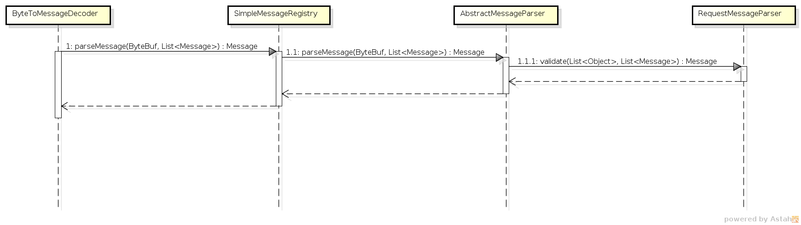

   Parsing

PCEP IETF stateful
~~~~~~~~~~~~~~~~~~

This section summarizes module pcep-ietf-stateful07. The term *stateful*
refers to
`draft-ietf-pce-stateful-pce <http://tools.ietf.org/html/draft-ietf-pce-stateful-pce>`__
and
`draft-ietf-pce-pce-initiated-lsp <http://tools.ietf.org/html/draft-ietf-pce-pce-initiated-lsp>`__
in versions draft-ietf-pce-stateful-pce-07 with
draft-ietf-pce-pce-initiated-lsp-00.

We will upgrade our implementation, when the stateful draft gets
promoted to RFC.

The stateful module is implemented as extensions to pcep-base-parser.
The stateful draft declared new elements as well as additional fields or
TLVs (type,length,value) to known objects. All new elements are defined
in yang models, that contain augmentations to elements defined in
`pcep-types.yang <https://git.opendaylight.org/gerrit/gitweb?p=bgpcep.git;a=blob;f=pcep/api/src/main/yang/pcep-types.yang;hb=refs/for/stable/lithium>`__.
In the case of extending known elements, the *Parser* class merely
extends the base class and overrides necessary methods as shown in
following diagram:

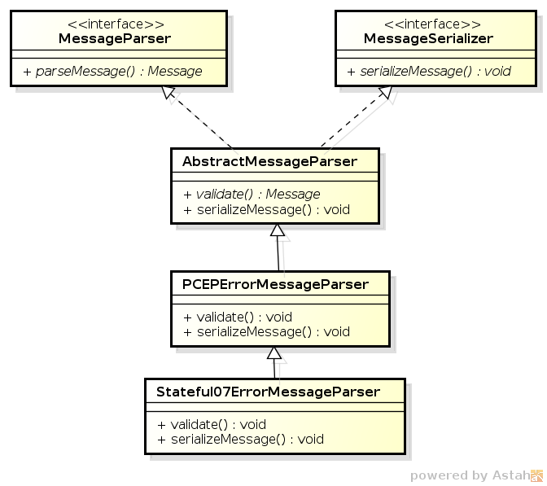

   Extending existing parsers

All parsers (including those for newly defined PCEP elements) have to be
registered via the *Activator* class. This class is present in both
modules.

In addition to parsers, the stateful module also introduces additional
session proposal. This proposal includes new fields defined in stateful
drafts for Open object.

PCEP segment routing (SR)
~~~~~~~~~~~~~~~~~~~~~~~~~

PCEP Segment Routing is an extension of base PCEP and
pcep-ietf-stateful-07 extension. The pcep-segment-routing module
implements
`draft-ietf-pce-segment-routing-01 <http://tools.ietf.org/html/draft-ietf-pce-segment-routing-01>`__.

The extension brings new SR-ERO (Explicit Route Object) and SR-RRO
(Reported Route Object) subobject composed of SID (Segment Identifier)
and/or NAI (Node or Adjacency Identifier). The segment Routing path is
carried in the ERO and RRO object, as a list of SR-ERO/SR-RRO subobjects
in an order specified by the user. The draft defines new TLV -
SR-PCE-CAPABILITY TLV, carried in PCEP Open object, used to negotiate
Segment Routing ability.

| The yang models of subobject, SR-PCE-CAPABILITY TLV and appropriate
  augmentations are defined in
  `odl-pcep-segment-routing.yang <https://git.opendaylight.org/gerrit/gitweb?p=bgpcep.git;a=blob;f=pcep/segment-routing/src/main/yang/odl-pcep-segment-routing.yang;hb=refs/for/stable/lithium>`__.
| The pcep-segment-routing module includes parsers/serializers for new
  subobject
  (`SrEroSubobjectParser <https://git.opendaylight.org/gerrit/gitweb?p=bgpcep.git;a=blob;f=pcep/segment-routing/src/main/java/org/opendaylight/protocol/pcep/segment/routing/SrEroSubobjectParser.java;hb=refs/for/stable/lithium>`__)
  and TLV
  (`SrPceCapabilityTlvParser <https://git.opendaylight.org/gerrit/gitweb?p=bgpcep.git;a=blob;f=pcep/segment-routing/src/main/java/org/opendaylight/protocol/pcep/segment/routing/SrPceCapabilityTlvParser.java;hb=refs/for/stable/lithium>`__).

The pcep-segment-routing module implements
`draft-ietf-pce-lsp-setup-type-01 <http://tools.ietf.org/html/draft-ietf-pce-lsp-setup-type-01>`__,
too. The draft defines new TLV - Path Setup Type TLV, which value
indicate path setup signaling technique. The TLV may be included in
RP(Request Parameters)/SRP(Stateful PCE Request Parameters) object. For
the default RSVP-TE (Resource Reservation Protocol), the TLV is omitted.
For Segment Routing, PST = 1 is defined.

The Path Setup Type TLV is modeled with yang in module
`pcep-types.yang <https://git.opendaylight.org/gerrit/gitweb?p=bgpcep.git;a=blob;f=pcep/api/src/main/yang/pcep-types.yang;hb=refs/for/stable/lithium>`__.
A parser/serializer is implemented in
`PathSetupTypeTlvParser <https://git.opendaylight.org/gerrit/gitweb?p=bgpcep.git;a=blob;f=pcep/impl/src/main/java/org/opendaylight/protocol/pcep/impl/tlv/PathSetupTypeTlvParser.java;hb=refs/for/stable/lithium>`__
and it is overriden in segment-routing module to provide the aditional
PST.

PCEP Topology
~~~~~~~~~~~~~

PCEP data is displayed only through one URL that is accessible from the
base network-topology URL:

*http://localhost:8181/restconf/operational/network-topology:network-topology/topology/pcep-topology*

Each PCC will be displayed as a node:

.. code:: xml

    <node>
     <path-computation-client>
      <ip-address>42.42.42.42</ip-address>
      <state-sync>synchronized</state-sync>
      <stateful-tlv>
       <stateful>
        <initiation>true</initiation>
        <lsp-update-capability>true</lsp-update-capability>
       </stateful>
      </stateful-tlv>
     </path-computation-client>
     <node-id>pcc://42.42.42.42</node-id>
    </node>
    </source>

If some tunnels are configured on the network, they would be displayed
on the same page, within a node that initiated the tunnel:

.. code:: xml

    <node>
     <path-computation-client>
      <state-sync>synchronized</state-sync>
      <stateful-tlv>
       <stateful>
        <initiation>true</initiation>
        <lsp-update-capability>true</lsp-update-capability>
       </stateful>
      </stateful-tlv>
      <reported-lsp>
       <name>foo</name>
       <lsp>
        <operational>down</operational>
        <sync>false</sync>
        <ignore>false</ignore>
        <plsp-id>1</plsp-id>
        <create>false</create>
        <administrative>true</administrative>
        <remove>false</remove>
        <delegate>true</delegate>
        <processing-rule>false</processing-rule>
        <tlvs>
        <lsp-identifiers>
          <ipv4>
           <ipv4-tunnel-sender-address>43.43.43.43</ipv4-tunnel-sender-address>
           <ipv4-tunnel-endpoint-address>0.0.0.0</ipv4-tunnel-endpoint-address>
           <ipv4-extended-tunnel-id>0.0.0.0</ipv4-extended-tunnel-id>
          </ipv4>
          <tunnel-id>0</tunnel-id>
          <lsp-id>0</lsp-id>
         </lsp-identifiers>
         <symbolic-path-name>
          <path-name>Zm9v</path-name>
         </symbolic-path-name>
        </tlvs>
       </lsp>
      </reported-lsp>
      <ip-address>43.43.43.43</ip-address>
     </path-computation-client>
     <node-id>pcc://43.43.43.43</node-id>
    </node>

Note that, the *<path-name>* tag displays tunnel name in Base64
encoding.

API Reference Documentation
---------------------------

Javadocs are generated while creating mvn:site and they are located in
target/ directory in each module.

PacketCable Developer Guide
===========================

PCMM Specification
------------------

`PacketCable™ Multimedia
Specification <http://www.cablelabs.com/specification/packetcable-multimedia-specification>`__

System Overview
---------------

These components introduce a DOCSIS QoS Service Flow management using
the PCMM protocol. The driver component is responsible for the
PCMM/COPS/PDP functionality required to service requests from
PacketCable Provider and FlowManager. Requests are transposed into PCMM
Gate Control messages and transmitted via COPS to the CCAP/CMTS. This
plugin adheres to the PCMM/COPS/PDP functionality defined in the
CableLabs specification. PacketCable solution is an MDSAL compliant
component.

PacketCable Components
----------------------

The packetcable maven project is comprised of several modules.

+--------------------------------------+--------------------------------------+
| Bundle                               | Description                          |
+======================================+======================================+
| packetcable-driver                   | A common module that containts the   |
|                                      | COPS stack and manages all           |
|                                      | connections to CCAPS/CMTSes.         |
+--------------------------------------+--------------------------------------+
| packetcable-emulator                 | A basic CCAP emulator to facilitate  |
|                                      | testing the the plugin when no       |
|                                      | physical CCAP is avaible.            |
+--------------------------------------+--------------------------------------+
| packetcable-policy-karaf             | Generates a Karaf distribution with  |
|                                      | a config that loads all the          |
|                                      | packetcable features at runtime.     |
+--------------------------------------+--------------------------------------+
| packetcable-policy-model             | Contains the YANG information model. |
+--------------------------------------+--------------------------------------+
| packetcable-policy-server            | Provider hosts the model processing, |
|                                      | RESTCONF, and API implementation.    |
+--------------------------------------+--------------------------------------+

Setting Logging Levels
~~~~~~~~~~~~~~~~~~~~~~

From the Karaf console

::

    log:set <LEVEL> (<PACKAGE>|<BUNDLE>)
    Example
    log:set DEBUG org.opendaylight.packetcable.packetcable-policy-server

Tools for Testing
-----------------

Postman REST client for Chrome
~~~~~~~~~~~~~~~~~~~~~~~~~~~~~~

`Install the Chrome
extension <https://chrome.google.com/webstore/detail/postman-rest-client/fdmmgilgnpjigdojojpjoooidkmcomcm?hl=en>`__

`Download and import sample packetcable
collection <https://git.opendaylight.org/gerrit/gitweb?p=packetcable.git;a=tree;f=packetcable-policy-server/doc/restconf-samples>`__

View Rest API
~~~~~~~~~~~~~

1. Install the ``odl-mdsal-apidocs`` feature from the karaf console.

2. Open http://localhost:8181/apidoc/explorer/index.html default dev
   build user/pass is admin/admin

3. Navigate to the PacketCable section.

Yang-IDE
~~~~~~~~

Editing yang can be done in any text editor but Yang-IDE will help
prevent mistakes.

`Setup and Build Yang-IDE for
Eclipse <https://github.com/xored/yang-ide/wiki/Setup-and-build>`__

Using Wireshark to Trace PCMM
-----------------------------

1. To start wireshark with privileges issue the following command:

   ::

       sudo wireshark &

2. Select the interface to monitor.

3. Use the Filter to only display COPS messages by applying “cops” in
   the filter field.

|Screenshot8|

Debugging and Verifying DQoS Gate (Flows) on the CCAP/CMTS
----------------------------------------------------------

Below are some of the most useful CCAP/CMTS commands to verify flows
have been enabled on the CMTS.

Cisco
~~~~~

`Cisco CMTS Cable Command
Reference <http://www.cisco.com/c/en/us/td/docs/cable/cmts/cmd_ref/b_cmts_cable_cmd_ref.pdf>`__

Find the Cable Modem
~~~~~~~~~~~~~~~~~~~~

::

    10k2-DSG#show cable modem
                                                                                      D
    MAC Address    IP Address      I/F           MAC           Prim RxPwr  Timing Num I
                                                 State         Sid  (dBmv) Offset CPE P
    0010.188a.faf6 0.0.0.0         C8/0/0/U0     offline       1    0.00   1482   0   N
    74ae.7600.01f3 10.32.115.150   C8/0/10/U0    online        1    -0.50  1431   0   Y
    0010.188a.fad8 10.32.115.142   C8/0/10/UB    w-online      2    -0.50  1507   1   Y
    000e.0900.00dd 10.32.115.143   C8/0/10/UB    w-online      3    1.00   1677   0   Y
    e86d.5271.304f 10.32.115.168   C8/0/10/UB    w-online      6    -0.50  1419   1   Y

Show PCMM Plugin Connection
~~~~~~~~~~~~~~~~~~~~~~~~~~~

::

    10k2-DSG#show packetcabl ?
      cms     Gate Controllers connected to this PacketCable client
      event   Event message server information
      gate    PacketCable gate information
      global  PacketCable global information

    10k2-DSG#show packetcable cms
    GC-Addr        GC-Port  Client-Addr    COPS-handle  Version PSID Key PDD-Cfg


    10k2-DSG#show packetcable cms
    GC-Addr        GC-Port  Client-Addr    COPS-handle  Version PSID Key PDD-Cfg
    10.32.0.240    54238    10.32.15.3     0x4B9C8150/1    4.0   0    0   0

Show COPS Messages
~~~~~~~~~~~~~~~~~~

::

    debug cops details

Use CM Mac Address to List Service Flows
~~~~~~~~~~~~~~~~~~~~~~~~~~~~~~~~~~~~~~~~

::

    10k2-DSG#show cable modem
                                                                                      D
    MAC Address    IP Address      I/F           MAC           Prim RxPwr  Timing Num I
                                                 State         Sid  (dBmv) Offset CPE P
    0010.188a.faf6 ---             C8/0/0/UB     w-online      1    0.50   1480   1   N
    74ae.7600.01f3 10.32.115.150   C8/0/10/U0    online        1    -0.50  1431   0   Y
    0010.188a.fad8 10.32.115.142   C8/0/10/UB    w-online      2    -0.50  1507   1   Y
    000e.0900.00dd 10.32.115.143   C8/0/10/UB    w-online      3    0.00   1677   0   Y
    e86d.5271.304f 10.32.115.168   C8/0/10/UB    w-online      6    -0.50  1419   1   Y


    10k2-DSG#show cable modem 000e.0900.00dd service-flow


    SUMMARY:
    MAC Address    IP Address      Host          MAC           Prim  Num Primary    DS
                                   Interface     State         Sid   CPE Downstream RfId
    000e.0900.00dd 10.32.115.143   C8/0/10/UB    w-online      3     0   Mo8/0/2:1  2353


    Sfid  Dir Curr  Sid   Sched  Prio MaxSusRate  MaxBrst     MinRsvRate  Throughput
              State       Type
    23    US  act   3     BE     0    0           3044        0           39
    30    US  act   16    BE     0    500000      3044        0           0
    24    DS  act   N/A   N/A    0    0           3044        0           17


    UPSTREAM SERVICE FLOW DETAIL:

    SFID  SID   Requests   Polls      Grants     Delayed    Dropped    Packets
                                                 Grants     Grants
    23    3     784        0          784        0          0          784
    30    16    0          0          0          0          0          0


    DOWNSTREAM SERVICE FLOW DETAIL:

    SFID  RP_SFID QID    Flg Policer               Scheduler             FrwdIF
                             Xmits      Drops      Xmits      Drops
    24    33019   131550     0          0          777        0          Wi8/0/2:2

    Flags Legend:
    $: Low Latency Queue (aggregated)
    ~: CIR Queue

Deleting a PCMM Gate Message from the CMTS
~~~~~~~~~~~~~~~~~~~~~~~~~~~~~~~~~~~~~~~~~~

::

    10k2-DSG#test cable dsd  000e.0900.00dd 30

Find service flows
~~~~~~~~~~~~~~~~~~

All gate controllers currently connected to the PacketCable client are
displayed

::

    show cable modem 00:11:22:33:44:55 service flow   ????
    show cable modem

Debug and display PCMM Gate messages
~~~~~~~~~~~~~~~~~~~~~~~~~~~~~~~~~~~~

::

    debug packetcable gate control
    debug packetcable gate events
    show packetcable gate summary
    show packetcable global
    show packetcable cms

Debug COPS messages
~~~~~~~~~~~~~~~~~~~

::

    debug cops detail
    debug packetcable cops
    debug cable dynamic_qos trace

Integration Verification
------------------------

Checkout the integration project and perform regression tests.

::

    git clone ssh://${ODL_USERNAME}@git.opendaylight.org:29418/integration.git
    git clone https:/git.opendaylight.org/gerrit/integration.git

1. Check and edit the
   integration/features/src/main/resources/features.xml and follow the
   directions there.

2. Check and edit the integration/features/pom.xml and add a dependency
   for your feature file

3. Build integration/features and debug

``  mvn clean install``

Test your feature in the integration/distributions/extra/karaf/
distribution

::

    cd integration/distributions/extra/karaf/
    mvn clean install
    cd target/assembly/bin
    ./karaf

service-wrapper
~~~~~~~~~~~~~~~

Install http://karaf.apache.org/manual/latest/users-guide/wrapper.html

::

    opendaylight-user@root>feature:install service-wrapper
    opendaylight-user@root>wrapper:install --help
    DESCRIPTION
            wrapper:install

    Install the container as a system service in the OS.

    SYNTAX
            wrapper:install [options]

    OPTIONS
            -d, --display
                    The display name of the service.
                    (defaults to karaf)
            --help
                    Display this help message
            -s, --start-type
                    Mode in which the service is installed. AUTO_START or DEMAND_START (Default: AUTO_START)
                    (defaults to AUTO_START)
            -n, --name
                    The service name that will be used when installing the service. (Default: karaf)
                    (defaults to karaf)
            -D, --description
                    The description of the service.
                    (defaults to )

    opendaylight-user@root> wrapper:install
    Creating file: /home/user/odl/distribution-karaf-0.3.0-Lithium/bin/karaf-wrapper
    Creating file: /home/user/odl/distribution-karaf-0.3.0-Lithium/bin/karaf-service
    Creating file: /home/user/odl/distribution-karaf-0.3.0-Lithium/etc/karaf-wrapper.conf
    Creating file: /home/user/odl/distribution-karaf-0.3.0-Lithium/lib/libwrapper.so
    Creating file: /home/user/odl/distribution-karaf-0.3.0-Lithium/lib/karaf-wrapper.jar
    Creating file: /home/user/odl/distribution-karaf-0.3.0-Lithium/lib/karaf-wrapper-main.jar

    Setup complete.  You may wish to tweak the JVM properties in the wrapper configuration file:
    /home/user/odl/distribution-karaf-0.3.0-Lithium/etc/karaf-wrapper.conf
    before installing and starting the service.


    Ubuntu/Debian Linux system detected:
      To install the service:
        $ ln -s /home/user/odl/distribution-karaf-0.3.0-Lithium/bin/karaf-service /etc/init.d/

      To start the service when the machine is rebooted:
        $ update-rc.d karaf-service defaults

      To disable starting the service when the machine is rebooted:
        $ update-rc.d -f karaf-service remove

      To start the service:
        $ /etc/init.d/karaf-service start

      To stop the service:
        $ /etc/init.d/karaf-service stop

      To uninstall the service :
        $ rm /etc/init.d/karaf-service

Service Function Chaining
=========================

OpenDaylight Service Function Chaining (SFC) Overiew
----------------------------------------------------

OpenDaylight Service Function Chaining (SFC) provides the ability to
define an ordered list of a network services (e.g. firewalls, load
balancers). These service are then "stitched" together in the network to
create a service chain. This project provides the infrastructure
(chaining logic, APIs) needed for ODL to provision a service chain in
the network and an end-user application for defining such chains.

-  ACE - Access Control Entry

-  ACL - Access Control List

-  SCF - Service Classifier Function

-  SF - Service Function

-  SFC - Service Function Chain

-  SFF - Service Function Forwarder

-  SFG - Service Function Group

-  SFP - Service Function Path

-  RSP - Rendered Service Path

-  NSH - Network Service Header

SFC Classifier Control and Date plane Developer guide
-----------------------------------------------------

Overview
~~~~~~~~

Description of classifier can be found in:
https://datatracker.ietf.org/doc/draft-ietf-sfc-architecture/

Classifier manages everything from starting the packet listener to
creation (and removal) of appropriate ip(6)tables rules and marking
received packets accordingly. Its functionality is **available only on
Linux** as it leverdges **NetfilterQueue**, which provides access to
packets matched by an **iptables** rule. Classifier requires **root
privileges** to be able to operate.

So far it is capable of processing ACL for MAC addresses, ports, IPv4
and IPv6. Supported protocols are TCP and UDP.

Classifier Architecture
~~~~~~~~~~~~~~~~~~~~~~~

Python code located in the project repository
sfc-py/common/classifier.py.

    **Note**

    classifier assumes that Rendered Service Path (RSP) **already
    exists** in ODL when an ACL referencing it is obtained

1. sfc\_agent receives an ACL and passes it for processing to the
   classifier

2. the RSP (its SFF locator) referenced by ACL is requested from ODL

3. if the RSP exists in the ODL then ACL based iptables rules for it are
   applied

After this process is over, every packet successfully matched to an
iptables rule (i.e. successfully classified) will be NSH encapsulated
and forwarded to a related SFF, which knows how to traverse the RSP.

Rules are created using appropriate iptables command. If the Access
Control Entry (ACE) rule is MAC address related both iptables and
ip6tabeles rules re issued. If ACE rule is IPv4 address related, only
iptables rules are issued, same for IPv6.

    **Note**

    iptables **raw** table contains all created rules

Information regarding already registered RSP(s) are stored in an
internal data-store, which is represented as a dictionary:

::

    {rsp_id: {'name': <rsp_name>,
              'chains': {'chain_name': (<ipv>,),
                         ...
                         },
              'sff': {'ip': <ip>,
                      'port': <port>,
                      'starting-index': <starting-index>,
                      'transport-type': <transport-type>
                      },
              },
    ...
    }

-  ``name``: name of the RSP

-  ``chains``: dictionary of iptables chains related to the RSP with
   information about IP version for which the chain exists

-  ``SFF``: SFF forwarding parameters

   -  ``ip``: SFF IP address

   -  ``port``: SFF port

   -  ``starting-index``: index given to packet at first RSP hop

   -  ``transport-type``: encapsulation protocol

Key APIs and Interfaces
~~~~~~~~~~~~~~~~~~~~~~~

This features exposes API to configure classifier (corresponds to
service-function-classifier.yang)

API Reference Documentation
~~~~~~~~~~~~~~~~~~~~~~~~~~~

See: sfc-model/src/main/yang/service-function-classifier.yang

SFC-OVS Plugin
--------------

Overview
~~~~~~~~

SFC-OVS provides integration of SFC with Open vSwitch (OVS) devices.
Integration is realized through mapping of SFC objects (like SF, SFF,
Classifier, etc.) to OVS objects (like Bridge,
TerminationPoint=Port/Interface). The mapping takes care of automatic
instantiation (setup) of corresponding object whenever its counterpart
is created. For example, when a new SFF is created, the SFC-OVS plugin
will create a new OVS bridge and when a new OVS Bridge is created, the
SFC-OVS plugin will create a new SFF.

SFC-OVS Architecture
~~~~~~~~~~~~~~~~~~~~

SFC-OVS uses the OVSDB MD-SAL Southbound API for getting/writing
information from/to OVS devices. The core functionality consists of two
types of mapping:

a. mapping from OVS to SFC

   -  OVS Bridge is mapped to SFF

   -  OVS TerminationPoints are mapped to SFF DataPlane locators

b. mapping from SFC to OVS

   -  SFF is mapped to OVS Bridge

   -  SFF DataPlane locators are mapped to OVS TerminationPoints

.. figure:: ./images/sfc/sfc-ovs-architecture.png
   :alt: SFC < — > OVS mapping flow diagram

   SFC < — > OVS mapping flow diagram

Key APIs and Interfaces
~~~~~~~~~~~~~~~~~~~~~~~

-  SFF to OVS mapping API (methods to convert SFF object to OVS Bridge
   and OVS TerminationPoints)

-  OVS to SFF mapping API (methods to convert OVS Bridge and OVS
   TerminationPoints to SFF object)

SFC Southbound REST Plugin
--------------------------

Overview
~~~~~~~~

The Southbound REST Plugin is used to send configuration from DataStore
down to network devices supporting a REST API (i.e. they have a
configured REST URI). It supports POST/PUT/DELETE operations, which are
triggered accordingly by changes in the SFC data stores.

-  Access Control List (ACL)

-  Service Classifier Function (SCF)

-  Service Function (SF)

-  Service Function Group (SFG)

-  Service Function Schedule Type (SFST)

-  Service Function Forwader (SFF)

-  Rendered Service Path (RSP)

Southbound REST Plugin Architecture
~~~~~~~~~~~~~~~~~~~~~~~~~~~~~~~~~~~

1. **listeners** - used to listen on changes in the SFC data stores

2. **JSON exporters** - used to export JSON-encoded data from
   binding-aware data store objects

3. **tasks** - used to collect REST URIs of network devices and to send
   JSON-encoded data down to these devices

.. figure:: ./images/sfc/sb-rest-architecture.png
   :alt: Southbound REST Plugin Architecture diagram

   Southbound REST Plugin Architecture diagram

Key APIs and Interfaces
~~~~~~~~~~~~~~~~~~~~~~~

The plugin provides Southbound REST API designated to listening REST
devices. It supports POST/PUT/DELETE operations. The operation (with
corresponding JSON-encoded data) is sent to unique REST URL belonging to
certain datatype.

-  Access Control List (ACL):
   ``http://<host>:<port>/config/ietf-acl:access-lists/access-list/``

-  Service Function (SF):
   ``http://<host>:<port>/config/service-function:service-functions/service-function/``

-  Service Function Group (SFG):
   ``http://<host>:<port>/config/service-function:service-function-groups/service-function-group/``

-  Service Function Schedule Type (SFST):
   ``http://<host>:<port>/config/service-function-scheduler-type:service-function-scheduler-types/service-function-scheduler-type/``

-  Service Function Forwarder (SFF):
   ``http://<host>:<port>/config/service-function-forwarder:service-function-forwarders/service-function-forwarder/``

-  Rendered Service Path (RSP):
   ``http://<host>:<port>/operational/rendered-service-path:rendered-service-paths/rendered-service-path/``

Therefore, network devices willing to receive REST messages must listen
on these REST URLs.

    **Note**

    Service Classifier Function (SCF) URL does not exist, because SCF is
    considered as one of the network devices willing to receive REST
    messages. However, there is a listener hooked on the SCF data store,
    which is triggering POST/PUT/DELETE operations of ACL object,
    because ACL is referenced in ``service-function-classifier.yang``

Service Function Load Balancing Developer Guide
-----------------------------------------------

Overview
~~~~~~~~

SFC Load-Balancing feature implements load balancing of Service
Functions, rather than a one-to-one mapping between Service Function
Forwarder and Service Function.

Load Balancing Architecture
~~~~~~~~~~~~~~~~~~~~~~~~~~~

Service Function Groups (SFG) can replace Service Functions (SF) in the
Rendered Path model. A Service Path can only be defined using SFGs or
SFs, but not a combination of both.

Relevant objects in the YANG model are as follows:

1. Service-Function-Group-Algorithm:

   ::

       Service-Function-Group-Algorithms {
           Service-Function-Group-Algorithm {
               String name
               String type
           }
       }

   ::

       Available types: ALL, SELECT, INDIRECT, FAST_FAILURE

2. Service-Function-Group:

   ::

       Service-Function-Groups {
           Service-Function-Group {
               String name
               String serviceFunctionGroupAlgorithmName
               String type
               String groupId
               Service-Function-Group-Element {
                   String service-function-name
                   int index
               }
           }
       }

3. ServiceFunctionHop: holds a reference to a name of SFG (or SF)

Key APIs and Interfaces
~~~~~~~~~~~~~~~~~~~~~~~

This feature enhances the existing SFC API.

REST API commands include: \* For Service Function Group (SFG): read
existing SFG, write new SFG, delete existing SFG, add Service Function
(SF) to SFG, and delete SF from SFG \* For Service Function Group
Algorithm (SFG-Alg): read, write, delete

Bundle providing the REST API: sfc-sb-rest \* Service Function Groups
and Algorithms are defined in: sfc-sfg and sfc-sfg-alg \* Relevant JAVA
API: SfcProviderServiceFunctionGroupAPI,
SfcProviderServiceFunctionGroupAlgAPI

Service Function Scheduling Algorithms
--------------------------------------

Overview
~~~~~~~~

When creating the Rendered Service Path (RSP), the earlier release of
SFC chose the first available service function from a list of service
function names. Now a new API is introduced to allow developers to
develop their own schedule algorithms when creating the RSP. There are
four scheduling algorithms (Random, Round Robin, Load Balance and
Shortest Path) are provided as examples for the API definition. This
guide gives a simple introduction of how to develop service function
scheduling algorithms based on the current extensible framework.

Architecture
~~~~~~~~~~~~

The following figure illustrates the service function selection
framework and algorithms.

.. figure:: ./images/sfc-sf-selection-arch.png
   :alt: SF Scheduling Algorithm framework Architecture

   SF Scheduling Algorithm framework Architecture

The YANG Model defines the Service Function Scheduling Algorithm type
identities and how they are stored in the MD-SAL data store for the
scheduling algorithms.

The MD-SAL data store stores all informations for the scheduling
algorithms, including their types, names, and status.

The API provides some basic APIs to manage the informations stored in
the MD-SAL data store, like putting new items into it, getting all
scheduling algorithms, etc.

The RESTCONF API provides APIs to manage the informations stored in the
MD-SAL data store through RESTful calls.

The Service Function Chain Renderer gets the enabled scheduling
algorithm type, and schedules the service functions with scheduling
algorithm implementation.

Key APIs and Interfaces
~~~~~~~~~~~~~~~~~~~~~~~

While developing a new Service Function Scheduling Algorithm, a new
class should be added and it should extend the base schedule class
SfcServiceFunctionSchedulerAPI. And the new class should implement the
abstract function:

``public List<String> scheduleServiceFuntions(ServiceFunctionChain chain, int serviceIndex)``.

-  **``ServiceFunctionChain chain``**: the chain which will be rendered

-  **``int serviceIndex``**: the initial service index for this rendered
   service path

-  **``List<String>``**: a list of service funtion names which scheduled
   by the Service Function Scheduling Algorithm.

API Reference Documentation
~~~~~~~~~~~~~~~~~~~~~~~~~~~

Please refer the API docs generated in the mdsal-apidocs.

SNMP4SDN Developer Guide
========================

Overview
--------

We propose a southbound plugin that can control the off-the-shelf
commodity Ethernet switches for the purpose of building SDN using
Ethernet switches. For Ethernet switches, forwarding table, VLAN table,
and ACL are where one can install flow configuration on, and this is
done via SNMP and CLI in the proposed plugin. In addition, some settings
required for Ethernet switches in SDN, e.g., disabling STP and flooding,
are proposed.


   SNMP4SDN as an OpenDaylight southbound plugin

Architecture
------------

The modules in the plugin are depicted as the following figure.


   Modules in the SNMP4SDN Plugin

-  AclService: add/remove ACL profile and rule on the switches.

-  FdbService: add/modify/remove FDB table entry on the switches.

-  VlanService: add/modify/remove VLAN table entry on the switches.

-  TopologyService: query and acquire the subnet topology.

-  InventoryService: acquire the switches and their ports.

-  DiscoveryService: probe and resolve the underlying switches as well
   as the port pairs connecting the switches. The probing is realized by
   SNMP queries. The updates from discovery will also be reflected to
   the TopologyService.

-  MiscConfigService: do kinds of settings on switches

   -  Supported STP and ARP settings such as enable/disable STP, get
      port’s STP state, get ARP table, set ARP entry, and others

-  VendorSpecificHandler: to assist the flow configuration services to
   call the switch-talking modules with correct parameters value and
   order.

-  Switch-talking modules

   -  For the services above, when they need to read or configure the
      underlying switches via SNMP or CLI, these queries are dealt with
      the modules SNMPHandler and CLIHandler which directly talk with
      the switches. The SNMPListener is to listen to snmp trap such as
      link up/down event or switch on/off event.

Design
------

In terms of the architecture of the SNMP4SDN Plugin’s features, the
features include flow configuration, topology discovery, and
multi-vendor support. Their architectures please refer to Wiki
(`Developer Guide -
Design <https://wiki.opendaylight.org/view/SNMP4SDN:Developer_Guide#Design>`__).

Installation and Configuration Guide
------------------------------------

-  Please refer to the *Getting Started Guide* in
   https://www.opendaylight.org/downloads, find the SNMP4SDN section.

-  For the latest full guide, please refer to Wiki (`Installation
   Guide <https://wiki.opendaylight.org/view/SNMP4SDN:Installation_Guide>`__,
   `User Guide -
   Configuration <https://wiki.opendaylight.org/view/SNMP4SDN:User_Guide#Configuration>`__).

Tutorial
--------

-  For the latest full guide, please refer to Wiki (`User Guide -
   Tutorial <https://wiki.opendaylight.org/view/SNMP4SDN:User_Guide#Tutorial_.2F_How-To>`__).

Programmatic Interface(s)
-------------------------

SNMP4SDN Plugin exposes APIs via MD-SAL with YANG model. The methods
(RPC call) and data structures for them are listed below.

TopologyService
~~~~~~~~~~~~~~~

-  RPC call

   -  get-edge-list

   -  get-node-list

   -  get-node-connector-list

   -  set-discovery-interval (given interval time in seconds)

   -  rediscover

-  Data structure

   -  node: composed of node-id, node-type

   -  node-connector: composed of node-connector-id,
      node-connector-type, node

   -  topo-edge: composed of head-node-connector-id,
      head-node-connector-type, head-node-id, head-node-type,
      tail-node-connector-id, tail-node-connector-type, tail-node-id,
      tail-node-type

VlanService
~~~~~~~~~~~

-  RPC call

   -  add-vlan (given node ID, VLAN ID, VLAN name)

   -  add-vlan-and-set-ports (given node ID, VLAN ID, VLAN name, tagged
      ports, untagged ports)

   -  set-vlan-ports (given node ID, VLAN ID, tagged ports, untagged
      ports)

   -  delete-vlan (given node ID, VLAN ID)

   -  get-vlan-table (given node ID)

AclService
~~~~~~~~~~

-  RPC call

   -  create-acl-profile (given node ID, acl-profile-index, acl-profile)

   -  del-acl-profile (given node ID, acl-profile-index)

   -  set-acl-rule (given node ID, acl-index, acl-rule)

   -  del-acl-rule (given node ID, acl-index)

   -  clear-acl-table (given node ID)

-  Data structure

   -  acl-profile-index: composed of profile-id, profile name

   -  acl-profile: composed of acl-layer, vlan-mask, src-ip-mask,
      dst-ip-mask

   -  acl-layer: IP or ETHERNET

   -  acl-index: composed of acl-profile-index, acl-rule-index

   -  acl-rule-index: composed of rule-id, rule-name

   -  acl-rule: composed of port-list, acl-layer, acl-field, acl-action

   -  acl-field: composed of vlan-id, src-ip, dst-ip

   -  acl-action: PERMIT or DENY

FdbService
~~~~~~~~~~

-  RPC call

   -  set-fdb-entry (given fdb-entry)

   -  del-fdb-entry (given node-id, vlan-id, dest-mac-adddr)

   -  get-fdb-entry (given node-id, vlan-id, dest-mac-adddr)

   -  get-fdb-table (given node-id)

-  Data structure

   -  fdb-entry: composed of node-id, vlan-id, dest-mac-addr, port,
      fdb-entry-type

   -  fdb-entry-type: OTHER/INVALID/LEARNED/SELF/MGMT

MiscConfigService
~~~~~~~~~~~~~~~~~

-  RPC call

   -  set-stp-port-state (given node-id, port, is\_nable)

   -  get-stp-port-state (given node-id, port)

   -  get-stp-port-root (given node-id, port)

   -  enable-stp (given node-id)

   -  disable-stp (given node-id)

   -  delete-arp-entry (given node-id, ip-address)

   -  set-arp-entry (given node-id, arp-entry)

   -  get-arp-entry (given node-id, ip-address)

   -  get-arp-table (given node-id)

-  Data structure

   -  stp-port-state:
      DISABLE/BLOCKING/LISTENING/LEARNING/FORWARDING/BROKEN

   -  arp-entry: composed of ip-address and mac-address

SwitchDbService
~~~~~~~~~~~~~~~

-  RPC call

   -  reload-db (The following 4 RPC implemention is TBD)

   -  add-switch-entry

   -  delete-switch-entry

   -  clear-db

   -  update-db

-  Data structure

   -  switch-info: compose of node-ip, node-mac, community,
      cli-user-name, cli-password, model

Help
----

-  `SNMP4SDN Wiki <https://wiki.opendaylight.org/view/SNMP4SDN:Main>`__

-  SNMP4SDN Mailing List
   (`user <https://lists.opendaylight.org/mailman/listinfo/snmp4sdn-users>`__,
   `developer <https://lists.opendaylight.org/mailman/listinfo/snmp4sdn-dev>`__)

-  `Latest troubleshooting in
   Wiki <https://wiki.opendaylight.org/view/SNMP4SDN:User_Guide#Troubleshooting>`__

SXP Developer Guide
===================

Overview
--------

SXP (Source-Group Tag eXchange Protocol) project is an effort to enhance
OpenDaylight platform with IP-SGT (IP Address to Source Group Tag)
bindings that can be learned from connected SXP-aware network nodes. The
current implementation supports SXP protocol version 4 according to the
Smith, Kandula - SXP `IETF
draft <https://tools.ietf.org/html/draft-smith-kandula-sxp-04>`__ and
grouping of peers and creating filters based on ACL/Prefix-list syntax
for filtering outbound and inbound IP-SGT bindings. All protocol legacy
versions 1-3 are supported as well. Additionally, version 4 adds
bidirectional connection type as an extension of a unidirectional one.

SXP Architecture
----------------

The SXP Server manages all connected clients in separate threads and a
common SXP protocol agreement is used between connected peers. Each SXP
network peer is modelled with its pertaining class, e.g., SXP Server
represents the SXP Speaker, SXP Listener the Client. The server program
creates the ServerSocket object on a specified port and waits until a
client starts up and requests connect on the IP address and port of the
server. The client program opens a Socket that is connected to the
server running on the specified host IP address and port.

The SXP Listener maintains connection with its speaker peer. From an
opened channel pipeline, all incoming SXP messages are processed by
various handlers. Message must be decoded, parsed and validated.

The SXP Speaker is a counterpart to the SXP Listener. It maintains a
connection with its listener peer and sends composed messages.

The SXP Binding Handler extracts the IP-SGT binding from a message and
pulls it into the SXP-Database. If an error is detected during the
IP-SGT extraction, an appropriate error code and sub-code is selected
and an error message is sent back to the connected peer. All transitive
messages are routed directly to the output queue of SXP Binding
Dispatcher.

The SXP Binding Dispatcher represents a selector that will decides how
many data from the SXP-database will be sent and when. It is responsible
for message content composition based on maximum message length.

The SXP Binding Filters handles filtering of outgoing and incoming
IP-SGT bindings according to BGP filtering using ACL and Prefix List
syntax for specifying filter or based on Peer-sequence length.

The SXP Domains feature provides isolation of SXP peers and bindings
learned between them, also exchange of Bindings is possible across
SXP-Domains by ACL, Prefix List or Peer-Sequence filters

Key APIs and Interfaces
-----------------------

As this project is fairly small, it provides only few features that
install and provide all APIs and implementations for this project.

-  sxp-controller

-  sxp-api

-  spx-core

sxp-controller
~~~~~~~~~~~~~~

RPC request handling

sxp-api
~~~~~~~

Contains data holders and entities

spx-core
~~~~~~~~

Main logic and core features

API Reference Documentation
---------------------------

`RESTCONF Interface and Dynamic
Tree <https://wiki.opendaylight.org/images/9/91/SXP_Restconf_Interface_and_Dynamic_Tree.pdf>`__
`Specification and
Architecture <https://wiki.opendaylight.org/images/6/6e/SXP_Specification_and_Architecture_v03.pdf>`__

Topology Processing Framework Developer Guide
=============================================

Overview
--------

The Topology Processing Framework allows developers to aggregate and
filter topologies according to defined correlations. It also provides
functionality, which you can use to make your own topology model by
automating the translation from one model to another. For example to
translate from the opendaylight-inventory model to only using the
network-topology model.

Architecture
------------

Chapter Overview
~~~~~~~~~~~~~~~~

In this chapter we describe the architecture of the Topology Processing
Framework. In the first part, we provide information about available
features and basic class relationships. In the second part, we describe
our model specific approach, which is used to provide support for
different models.

Basic Architecture
~~~~~~~~~~~~~~~~~~

The Topology Processing Framework consists of several Karaf features:

-  odl-topoprocessing-framework

-  odl-topoprocessing-inventory

-  odl-topoprocessing-network-topology

-  odl-topoprocessing-i2rs

-  odl-topoprocessing-inventory-rendering

The feature odl-topoprocessing-framework contains the
topoprocessing-api, topoprocessing-spi and topoprocessing-impl bundles.
This feature is the core of the Topology Processing Framework and is
required by all others features.

-  topoprocessing-api - contains correlation definitions and definitions
   required for rendering

-  topoprocessing-spi - entry point for topoprocessing service (start
   and close)

-  topoprocessing-impl - contains base implementations of handlers,
   listeners, aggregators and filtrators

TopoProcessingProvider is the entry point for Topology Processing
Framework. It requires a DataBroker instance. The DataBroker is needed
for listener registration. There is also the TopologyRequestListener
which listens on aggregated topology requests (placed into the
configuration datastore) and UnderlayTopologyListeners which listen on
underlay topology data changes (made in operational datastore). The
TopologyRequestHandler saves toporequest data and provides a method for
translating a path to the specified leaf. When a change in the topology
occurs, the registered UnderlayTopologyListener processes this
information for further aggregation and/or filtration. Finally, after an
overlay topology is created, it is passed to the TopologyWriter, which
writes this topology into operational datastore.


   Class relationship

[1] TopologyRequestHandler instantiates TopologyWriter and
TopologyManager. Then, according to the request, initializes either
TopologyAggregator, TopologyFiltrator or LinkCalculator.

[2] It creates as many instances of UnderlayTopologyListener as there
are underlay topologies.

[3] PhysicalNodes are created for relevant incoming nodes (those having
node ID).

[4a] It performs aggregation and creates logical nodes.

[4b] It performs filtration and creates logical nodes.

[4c] It performs link computation and creates links between logical
nodes.

[5] Logical nodes are put into wrapper.

[6] The wrapper is translated into the appropriate format and written
into datastore.

Model Specific Approach
~~~~~~~~~~~~~~~~~~~~~~~

The Topology Processing Framework consists of several modules and Karaf
features, which provide support for different input models. Currently we
support the network-topology, opendaylight-inventory and i2rs models.
For each of these input models, the Topology Processing Framework has
one module and one Karaf feature.

How it works
^^^^^^^^^^^^

**User point of view:.**

When you start the odl-topoprocessing-framework feature, the Topology
Processing Framework starts without knowledge how to work with any input
models. In order to allow the Topology Processing Framework to process
some kind of input model, you must install one (or more) model specific
features. Installing these features will also start
odl-topoprocessing-framework feature if it is not already running. These
features inject appropriate logic into the odl-topoprocessing-framework
feature. From that point, the Topology Processing Framework is able to
process different kinds of input models, specifically those that you
install features for.

**Developer point of view:.**

The topoprocessing-impl module contains (among other things) classes and
interfaces, which are common for every model specific topoprocessing
module. These classes and interfaces are implemented and extended by
classes in particular model specific modules. Model specific modules
also depend on the TopoProcessingProvider class in the
topoprocessing-spi module. This dependency is injected during
installation of model specific features in Karaf. When a model specific
feature is started, it calls the registerAdapters(adapters) method of
the injected TopoProcessingProvider object. After this step, the
Topology Processing Framework is able to use registered model adapters
to work with input models.

To achieve the described functionality we created a ModelAdapter
interface. It represents installed feature and provides methods for
creating crucial structures specific to each model.


   ModelAdapter interface

Model Specific Features
^^^^^^^^^^^^^^^^^^^^^^^

-  odl-topoprocessing-network-topology - this feature contains logic to
   work with network-topology model

-  odl-topoprocessing-inventory - this feature contains logic to work
   with opendaylight-inventory model

-  odl-topoprocessing-i2rs - this feature contains logic to work with
   i2rs model

Inventory Model Support
~~~~~~~~~~~~~~~~~~~~~~~

The opendaylight-inventory model contains only nodes, termination
points, information regarding these structures. This model co-operates
with network-topology model, where other topology related information is
stored. This means that we have to handle two input models at once. To
support the inventory model, InventoryListener and
NotificationInterConnector classes were introduced. Please see the flow
diagrams below.

.. figure:: ./images/topoprocessing/Network_topology_model_flow_diagram.png
   :alt: Network topology model

   Network topology model

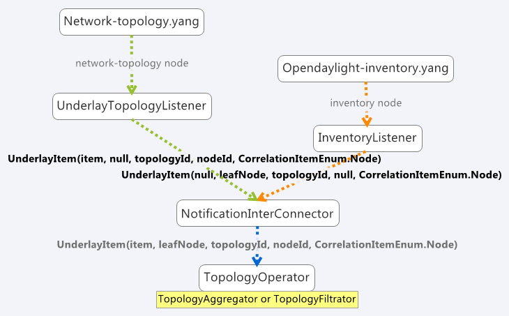

   Inventory model

Here we can see the InventoryListener and NotificationInterConnector
classes. InventoryListener listens on data changes in the inventory
model and passes these changes wrapped as an UnderlayItem for further
processing to NotificationInterConnector. It doesn’t contain node
information - it contains a leafNode (node based on which aggregation
occurs) instead. The node information is stored in the topology model,
where UnderlayTopologyListener is registered as usual. This listener
delivers the missing information.

Then the NotificationInterConnector combines the two notifications into
a complete UnderlayItem (no null values) and delivers this UnderlayItem
for further processing (to next TopologyOperator).

Aggregation and Filtration
--------------------------

Chapter Overview
~~~~~~~~~~~~~~~~

The Topology Processing Framework allows the creation of aggregated
topologies and filtered views over existing topologies. Currently,
aggregation and filtration is supported for topologies that follow
`network-topology <https://github.com/opendaylight/yangtools/blob/master/model/ietf/ietf-topology/src/main/yang/network-topology%402013-10-21.yang>`__,
opendaylight-inventory or i2rs model. When a request to create an
aggregated or filtered topology is received, the framework creates one
listener per underlay topology. Whenever any specified underlay topology
is changed, the appropriate listener is triggered with the change and
the change is processed. Two types of correlations (functionalities) are
currently supported:

-  Aggregation

   -  Unification

   -  Equality

-  Filtration

Terminology
~~~~~~~~~~~

We use the term underlay item (physical node) for items (nodes, links,
termination-points) from underlay and overlay item (logical node) for
items from overlay topologies regardless of whether those are actually
physical network elements.

Aggregation
~~~~~~~~~~~

Aggregation is an operation which creates an aggregated item from two or
more items in the underlay topology if the aggregation condition is
fulfilled. Requests for aggregated topologies must specify a list of
underlay topologies over which the overlay (aggregated) topology will be
created and a target field in the underlay item that the framework will
check for equality.

Create Overlay Node
^^^^^^^^^^^^^^^^^^^

First, each new underlay item is inserted into the proper topology
store. Once the item is stored, the framework compares it (using the
target field value) with all stored underlay items from underlay
topologies. If there is a target-field match, a new overlay item is
created containing pointers to all *equal* underlay items. The newly
created overlay item is also given new references to its supporting
underlay items.

**Equality case:.**

If an item doesn’t fulfill the equality condition with any other items,
processing finishes after adding the item into topology store. It will
stay there for future use, ready to create an aggregated item with a new
underlay item, with which it would satisfy the equality condition.

**Unification case:.**

An overlay item is created for all underlay items, even those which
don’t fulfill the equality condition with any other items. This means
than an overlay item is created for every underlay item, but for items
which satisfy the equality condition, an aggregated item is created.

Update Node
^^^^^^^^^^^

Processing of updated underlay items depends on whether the target field
has been modified. If yes, then:

-  if the underlay item belonged to some overlay item, it is removed
   from that item. Next, if the aggregation condition on the target
   field is satisfied, the item is inserted into another overlay item.
   If the condition isn’t met then:

   -  in equality case - the item will not be present in overlay
      topology.

   -  in unification case - the item will create an overlay item with a
      single underlay item and this will be written into overlay
      topology.

-  if the item didn’t belong to some overlay item, it is checked again
   for aggregation with other underlay items.

Remove Node
^^^^^^^^^^^

The underlay item is removed from the corresponding topology store, from
it’s overlay item (if it belongs to one) and this way it is also removed
from overlay topology.

**Equality case:.**

If there is only one underlay item left in the overlay item, the overlay
item is removed.

**Unification case:.**

The overlay item is removed once it refers to no underlay item.

Filtration
~~~~~~~~~~

Filtration is an operation which results in creation of overlay topology
containing only items fulfilling conditions set in the topoprocessing
request.

Create Underlay Item
^^^^^^^^^^^^^^^^^^^^

If a newly created underlay item passes all filtrators and their
conditions, then it is stored in topology store and a creation
notification is delivered into topology manager. No operation otherwise.

Update Underlay Item
^^^^^^^^^^^^^^^^^^^^

First, the updated item is checked for presence in topology store:

-  if it is present in topology store:

   -  if it meets the filtering conditions, then processUpdatedData
      notification is triggered

   -  else processRemovedData notification is triggered

-  if item isn’t present in topology store

   -  if item meets filtering conditions, then processCreatedData
      notification is triggered

   -  else it is ignored

Remove Underlay Item
^^^^^^^^^^^^^^^^^^^^

If an underlay node is supporting some overlay node, the overlay node is
simply removed.

Default Filtrator Types
^^^^^^^^^^^^^^^^^^^^^^^

There are seven types of default filtrators defined in the framework:

-  IPv4-address filtrator - checks if specified field meets IPv4 address
   + mask criteria

-  IPv6-address filtrator - checks if specified field meets IPv6 address
   + mask criteria

-  Specific number filtrator - check for specific number

-  Specific string filtrator - checks for specific string

-  Range number filtrator - checks if specified field is higher than
   provided minimum and lower than provided maximum

-  Range string filtrator - checks if specified field is alphabetically
   greater than provided minimum and alphabetically lower than provided
   maximum

-  Script filtrator - allows a user or application to implement their
   own filtrator

Register Custom Filtrator
^^^^^^^^^^^^^^^^^^^^^^^^^

There might be some use case that cannot be achieved with the default
filtrators. In these cases, the framework offers the possibility for a
user or application to register a custom filtrator.

Pre-Filtration / Filtration & Aggregation
~~~~~~~~~~~~~~~~~~~~~~~~~~~~~~~~~~~~~~~~~

This feature was introduced in order to lower memory and performance
demands. It is a combination of the filtration and aggregation
operations. First, uninteresting items are filtered out and then
aggregation is performed only on items that passed filtration. This way
the framework saves on compute time. The PreAggregationFiltrator and
TopologyAggregator share the same TopoStoreProvider (and thus topology
store) which results in lower memory demands (as underlay items are
stored only in one topology store - they aren’t stored twice).

Link Computation
----------------

Chapter Overview
~~~~~~~~~~~~~~~~

During the topology request processing, we create overlay nodes with
lists of supporting underlay nodes. Because these overlay nodes have
completely new identifiers, we lose link information. To regain this
link information, we provide Link Computation functionality. Its main
purpose is to create new overlay links based on the links from the
underlay topologies and underlay items from overlay items. The required
information for Link Computation is provided via the Link Computation
model in
(`topology-link-computation.yang <https://git.opendaylight.org/gerrit/gitweb?p=topoprocessing.git;a=blob;f=topoprocessing-api/src/main/yang/topology-link-computation.yang;hb=refs/heads/stable/beryllium>`__).

Link Computation Functionality
~~~~~~~~~~~~~~~~~~~~~~~~~~~~~~

Let us consider two topologies with following components:

Topology 1:

-  Node: ``node:1:1``

-  Node: ``node:1:2``

-  Node: ``node:1:3``

-  Link: ``link:1:1`` (from ``node:1:1`` to ``node:1:2``)

-  Link: ``link:1:2`` (from ``node:1:3`` to ``node:1:2``)

Topology 2:

-  Node: ``node:2:1``

-  Node: ``node:2:2``

-  Node: ``node:2:3``

-  Link: ``link:2:1`` (from ``node:2:1`` to ``node:2:3``)

Now let’s say that we applied some operations over these topologies that
results into aggregating together

-  ``node:1:1`` and ``node:2:3`` (``node:1``)

-  ``node:1:2`` and ``node:2:2`` (``node:2``)

-  ``node:1:3`` and ``node:2:1`` (``node:3``)

At this point we can no longer use available links in new topology
because of the node ID change, so we must create new overlay links with
source and destination node set to new nodes IDs. It means that
``link:1:1`` from topology 1 will create new link ``link:1``. Since
original source (``node:1:1``) is already aggregated under ``node:1``,
it will become source node for ``link:1``. Using same method the
destination will be ``node:2``. And the final output will be three
links:

-  ``link:1``, from ``node:1`` to ``node:2``

-  ``link:2``, from ``node:3`` to ``node:2``

-  ``link:3``, from ``node:3`` to ``node:1``

.. figure:: ./images/topoprocessing/LinkComputation.png
   :alt: Overlay topology with computed links

   Overlay topology with computed links

In-Depth Look
~~~~~~~~~~~~~

The main logic behind Link Computation is executed in the LinkCalculator
operator. The required information is passed to LinkCalculator through
the LinkComputation section of the topology request. This section is
defined in the topology-link-computation.yang file. The main logic also
covers cases when some underlay nodes may not pass through other
topology operators.

Link Computation Model
^^^^^^^^^^^^^^^^^^^^^^

There are three essential pieces of information for link computations.
All of them are provided within the LinkComputation section. These
pieces are:

-  output model

.. code:: yang

    leaf output-model {
        type identityref {
            base topo-corr:model;
        }
        description "Desired output model for computed links.";
    }

-  overlay topology with new nodes

.. code:: yang

    container node-info {
        leaf node-topology {
            type string;
            mandatory true;
            description "Topology that contains aggregated nodes.
                         This topology will be used for storing computed links.";
        }
        uses topo-corr:input-model-grouping;
    }

-  underlay topologies with original links

.. code:: yang

    list link-info {
        key "link-topology input-model";
        leaf link-topology {
            type string;
            mandatory true;
            description "Topology that contains underlay (base) links.";
        }
        leaf aggregated-links {
            type boolean;
            description "Defines if link computation should be based on supporting-links.";
        }
        uses topo-corr:input-model-grouping;
    }

This whole section is augmented into ``network-topology:topology``. By
placing this section out of correlations section, it allows us to send
link computation request separately from topology operations request.

Main Logic
^^^^^^^^^^

Taking into consideration that some of the underlay nodes may not
transform into overlay nodes (e.g. they are filtered out), we created
two possible states for links:

-  matched - a link is considered as matched when both original source
   and destination node were transformed to overlay nodes

-  waiting - a link is considered as waiting if original source,
   destination or both nodes are missing from the overlay topology

All links in waiting the state are stored in waitingLinks list, already
matched links are stored in matchedLinks list and overlay nodes are
stored in the storedOverlayNodes list. All processing is based only on
information in these lists. Processing created, updated and removed
underlay items is slightly different and described in next sections
separately.

**Processing Created Items**

Created items can be either nodes or links, depending on the type of
listener from which they came. In the case of a link, it is immediately
added to waitingLinks and calculation for possible overlay link
creations (calculatePossibleLink) is started. The flow diagram for this
process is shown in the following picture:

.. figure:: ./images/topoprocessing/LinkComputationFlowDiagram.png
   :alt: Flow diagram of processing created items

   Flow diagram of processing created items

Searching for the source and destination nodes in the
calculatePossibleLink method runs over each node in storedOverlayNodes
and the IDs of each supporting node is compared against IDs from the
underlay link’s source and destination nodes. If there are any nodes
missing, the link remains in the waiting state. If both the source and
destination nodes are found, the corresponding overlay nodes is recorded
as the new source and destination. The link is then removed from
waitingLinks and a new CalculatedLink is added to the matched links. At
the end, the new link (if it exists) is written into the datastore.

If the created item is an overlayNode, this is added to
storedOverlayNodes and we call calculatePossibleLink for every link in
waitingLinks.

**Processing Updated Items**

The difference from processing created items is that we have three
possible types of updated items: overlay nodes, waiting underlay links,
and matched underlay links.

-  In the case of a change in a matched link, this must be recalculated
   and based on the result it will either be matched with new source and
   destination or will be returned to waiting links. If the link is
   moved back to a waiting state, it must also be removed from the
   datastore.

-  In the case of change in a waiting link, it is passed to the
   calculation process and based on the result will either remain in
   waiting state or be promoted to the matched state.

-  In the case of a change in an overlay node, storedOverlayNodes must
   be updated properly and all links must be recalculated in case of
   changes.

**Processing Removed items**

Same as for processing updated item there can be three types of removed
items:

-  In case of waiting link removal, the link is just removed from
   waitingLinks

-  In case of matched link removal, the link is removed from
   matchingLinks and datastore

-  In case of overlay node removal, the node must be removed form
   storedOverlayNodes and all matching links must be recalculated

Wrapper, RPC Republishing, Writing Mechanism
--------------------------------------------

Chapter Overview
~~~~~~~~~~~~~~~~

During the process of aggregation and filtration, overlay items (so
called logical nodes) were created from underlay items (physical nodes).
In the topology manager, overlay items are put into a wrapper. A wrapper
is identified with unique ID and contains list of logical nodes.
Wrappers are used to deal with transitivity of underlay items - which
permits grouping of overlay items (into wrappers).

.. figure:: ./images/topoprocessing/wrapper.png
   :alt: Wrapper

   Wrapper

PN1, PN2, PN3 = physical nodes

LN1, LN2 = logical nodes

RPC Republishing
~~~~~~~~~~~~~~~~

All RPCs registered to handle underlay items are re-registered under
their corresponding wrapper ID. RPCs of underlay items (belonging to an
overlay item) are gathered, and registered under ID of their wrapper.

RPC Call
^^^^^^^^

When RPC is called on overlay item, this call is delegated to it’s
underlay items, this means that the RPC is called on all underlay items
of this overlay item.

Writing Mechanism
~~~~~~~~~~~~~~~~~

When a wrapper (containing overlay item(s) with it’s underlay item(s))
is ready to be written into data store, it has to be converted into DOM
format. After this translation is done, the result is written into
datastore. Physical nodes are stored as supporting-nodes. In order to
use resources responsibly, writing operation is divided into two steps.
First, a set of threads registers prepared operations (deletes and puts)
and one thread makes actual write operation in batch.

Topology Rendering Guide - Inventory Rendering
----------------------------------------------

Chapter Overview
~~~~~~~~~~~~~~~~

In the most recent OpenDaylight release, the opendaylight-inventory
model is marked as deprecated. To facilitate migration from it to the
network-topology model, there were requests to render (translate) data
from inventory model (whether augmented or not) to another model for
further processing. The Topology Processing Framework was extended to
provide this functionality by implementing several rendering-specific
classes. This chapter is a step-by-step guide on how to implement your
own topology rendering using our inventory rendering as an example.

Use case
~~~~~~~~

For the purpose of this guide we are going to render the following
augmented fields from the OpenFlow model:

-  from inventory node:

   -  manufacturer

   -  hardware

   -  software

   -  serial-number

   -  description

   -  ip-address

-  from inventory node-connector:

   -  name

   -  hardware-address

   -  current-speed

   -  maximum-speed

We also want to preserve the node ID and termination-point ID from
opendaylight-topology-inventory model, which is network-topology part of
the inventory model.

Implementation
~~~~~~~~~~~~~~

There are two ways to implement support for your specific topology
rendering:

-  add a module to your project that depends on the Topology Processing
   Framework

-  add a module to the Topology Processing Framework itself

Regardless, a successful implementation must complete all of the
following steps.

Step1 - Target Model Creation
^^^^^^^^^^^^^^^^^^^^^^^^^^^^^

Because the network-topology node does not have fields to store all
desired data, it is necessary to create new model to render this extra
data in to. For this guide we created the inventory-rendering model. The
picture below shows how data will be rendered and stored.


   Rendering to the inventory-rendering model

    **Important**

    When implementing your version of the topology-rendering model in
    the Topology Processing Framework, the source file of the model
    (.yang) must be saved in /topoprocessing-api/src/main/yang folder so
    corresponding structures can be generated during build and can be
    accessed from every module through dependencies.

When the target model is created you have to add an identifier through
which you can set your new model as output model. To do that you have to
add another identity item to topology-correlation.yang file. For our
inventory-rendering model identity looks like this:

.. code:: yang

    identity inventory-rendering-model {
        description "inventory-rendering.yang";
        base model;
    }

After that you will be able to set inventory-rendering-model as output
model in XML.

Step2 - Module and Feature Creation
^^^^^^^^^^^^^^^^^^^^^^^^^^^^^^^^^^^

    **Important**

    This and following steps are based on the `model specific
    approach <#_model_specific_approach>`__ in the Topology Processing
    Framework. We highly recommend that you familiarize yourself with
    this approach in advance.

To create a base module and add it as a feature to Karaf in the Topology
Processing, Framework we made the changes in following
`commit <https://git.opendaylight.org/gerrit/#/c/26223/>`__. Changes in
other projects will likely be similar.

+--------------------------------------+--------------------------------------+
| File                                 | Changes                              |
+======================================+======================================+
| pom.xml                              | add new module to topoprocessing     |
+--------------------------------------+--------------------------------------+
| features.xml                         | add feature to topoprocessing        |
+--------------------------------------+--------------------------------------+
| features/pom.xml                     | add dependencies needed by features  |
+--------------------------------------+--------------------------------------+
| topoprocessing-artifacts/pom.xml     | add artifact                         |
+--------------------------------------+--------------------------------------+
| topoprocessing-config/pom.xml        | add configuration file               |
+--------------------------------------+--------------------------------------+
| 81-topoprocessing-inventory-renderin | configuration file for new module    |
| g-config.xml                         |                                      |
+--------------------------------------+--------------------------------------+
| topoprocessing-inventory-rendering/p | main pom for new module              |
| om.xml                               |                                      |
+--------------------------------------+--------------------------------------+
| TopoProcessingProviderIR.java        | contains startup method which        |
|                                      | register new model adapter           |
+--------------------------------------+--------------------------------------+
| TopoProcessingProviderIRModule.java  | generated class which contains       |
|                                      | createInstance method. You should    |
|                                      | call your startup method from here.  |
+--------------------------------------+--------------------------------------+
| TopoProcessingProviderIRModuleFactor | generated class. You will probably   |
| y.java                               | not need to edit this file           |
+--------------------------------------+--------------------------------------+
| log4j.xml                            | configuration file for logger        |
|                                      | topoprocessing-inventory-rendering-p |
|                                      | rovider-impl.yang                    |
+--------------------------------------+--------------------------------------+

Step3 - Module Adapters Creation
^^^^^^^^^^^^^^^^^^^^^^^^^^^^^^^^

There are seven mandatory interfaces or abstract classes that needs to
be implemented in each module. They are:

-  TopoProcessingProvider - provides module registration

-  ModelAdapter - provides model specific instances

-  TopologyRequestListener - listens on changes in the configuration
   datastore

-  TopologyRequestHandler - processes configuration datastore changes

-  UnderlayTopologyListener - listens for changes in the specific model

-  LinkTransaltor and NodeTranslator - used by OverlayItemTranslator to
   create NormalizedNodes from OverlayItems

The name convention we used was to add an abbreviation for the specific
model to the beginning of implementing class name (e.g. the
IRModelAdapter refers to class which implements ModelAdapter in module
Inventory Rendering). In the case of the provider class, we put the
abbreviation at the end.

    **Important**

    -  In the next sections, we use the terms TopologyRequestListener,
       TopologyRequestHandler, etc. without a prepended or appended
       abbreviation because the steps apply regardless of which specific
       model you are targeting.

    -  If you want to implement rendering from inventory to
       network-topology, you can just copy-paste our module and
       additional changes will be required only in the output part.

**Provider part**

This part is the starting point of the whole module. It is responsible
for creating and registering TopologyRequestListeners. It is necessary
to create three classes which will import:

-  **TopoProcessingProviderModule** - is a generated class from
   topoprocessing-inventory-rendering-provider-impl.yang (created in
   previous step, file will appear after first build). Its method
   ``createInstance()`` is called at the feature start and must be
   modified to create an instance of TopoProcessingProvider and calli
   its ``startup(TopoProcessingProvider topoProvider)`` function.

-  **TopoProcessingProvider** - in
   ``startup(TopoProcessingProvider topoProvider)`` function provides
   ModelAdapter registration to TopoProcessingProviderImpl.

-  **ModelAdapter** - provides creation of corresponding module specific
   classes.

**Input part**

This includes the creation of the classes responsible for input data
processing. In this case, we had to create five classes implementing:

-  **TopologyRequestListener** and **TopologyRequestHandler** - when
   notified about a change in the configuration datastore, verify if the
   change contains a topology request (has correlations in it) and
   creates UnderlayTopologyListeners if needed. The implementation of
   these classes will differ according to the model in which are
   correlations saved (network-topology or i2rs). In the case of using
   network-topology, as the input model, you can use our classes
   IRTopologyRequestListener and IRTopologyRequestHandler.

-  **UnderlayTopologyListener** - registers underlay listeners according
   to input model. In our case (listening in the inventory model), we
   created listeners for the network-topology model and inventory model,
   and set the NotificationInterConnector as the first operator and set
   the IRRenderingOperator as the second operator (after
   NotificationInterConnector). Same as for
   TopologyRequestListener/Handler, if you are rendering from the
   inventory model, you can use our class IRUnderlayTopologyListener.

-  **InventoryListener** - a new implementation of this class is
   required only for inventory input model. This is because the
   InventoryListener from topoprocessing-impl requires pathIdentifier
   which is absent in the case of rendering.

-  **TopologyOperator** - replaces classic topoprocessing operator.
   While the classic operator provides specific operations on topology,
   the rendering operator just wraps each received UnderlayItem to
   OverlayItem and sends them to write.

    **Important**

    For purposes of topology rendering from inventory to
    network-topology, there are misused fields in UnderlayItem as
    follows:

    -  item - contains node from network-topology part of inventory

    -  leafItem - contains node from inventory

    In case of implementing UnderlayTopologyListener or
    InventoryListener you have to carefully adjust UnderlayItem creation
    to these terms.

**Output part**

The output part of topology rendering is responsible for translating
received overlay items to normalized nodes. In the case of inventory
rendering, this is where node information from inventory are combined
with node information from network-topology. This combined information
is stored in our inventory-rendering model normalized node and passed to
the writer.

The output part consists of two translators implementing the
NodeTranslator and LinkTranslator interfaces.

**NodeTranslator implementation** - The NodeTranslator interface has one
``translate(OverlayItemWrapper wrapper)`` method. For our purposes,
there is one important thing in wrapper - the list of OverlayItems which
have one or more common UnderlayItems. Regardless of this list, in the
case of rendering it will always contains only one OverlayItem. This
item has list of UnderlayItems, but again in case of rendering there
will be only one UnderlayItem item in this list. In NodeTranslator, the
OverlayItem and corresponding UnderlayItem represent nodes from the
translating model.

The UnderlayItem has several attributes. How you will use these
attributes in your rendering is up to you, as you create this item in
your topology operator. For example, as mentioned above, in our
inventory rendering example there is an inventory node normalized node
stored in the UnderlayItem leafNode attribute, and we also store node-id
from network-topology model in UnderlayItem itemId attribute. You can
now use these attributes to build a normalized node for your new model.
How to read and create normalized nodes is out of scope of this
document.

**LinkTranslator implementation** - The LinkTranslator interface also
has one ``translate(OverlayItemWrapper wrapper)`` method. In our
inventory rendering this method returns ``null``, because the inventory
model doesn’t have links. But if you also need links, this is the place
where you should translate it into a normalized node for your model. In
LinkTranslator, the OverlayItem and corresponding UnderlayItem represent
links from the translating model. As in NodeTranslator, there will be
only one OverlayItem and one UnderlayItem in the corresponding lists.

Testing
~~~~~~~

If you want to test our implementation you must apply `this
patch <https://git.opendaylight.org/gerrit/#/c/26612>`__. It adds an
OpenFlow Plugin dependency so we can use it in the Karaf distribution as
a feature. After adding patch and building the whole framework, you can
start Karaf. Next, you have to install necessary features. In our case
it is:

``feature:install odl-restconf-noauth odl-topoprocessing-inventory-rendering odl-openflowplugin-southbound-li odl-openflowplugin-nsf-model-li``

Now you can send messages to REST from any REST client (e.g. Postman in
Chrome). Messages have to have following headers:

+--------------------------------------+--------------------------------------+
| Header                               | Value                                |
+======================================+======================================+
| Content-Type:                        | application/xml                      |
+--------------------------------------+--------------------------------------+
| Accept:                              | application/xml                      |
+--------------------------------------+--------------------------------------+
| username:                            | admin                                |
+--------------------------------------+--------------------------------------+
| password:                            | admin                                |
+--------------------------------------+--------------------------------------+

Firstly send topology request to
http://localhost:8181/restconf/config/network-topology:network-topology/topology/render:1
with method PUT. Example of simple rendering request:

.. code:: xml

    <topology xmlns="urn:TBD:params:xml:ns:yang:network-topology">
      <topology-id>render:1</topology-id>
        <correlations xmlns="urn:opendaylight:topology:correlation" >
          <output-model>inventory-rendering-model</output-model>
          <correlation>
             <correlation-id>1</correlation-id>
              <type>rendering-only</type>
              <correlation-item>node</correlation-item>
              <rendering>
                <underlay-topology>und-topo:1</underlay-topology>
            </rendering>
          </correlation>
        </correlations>
    </topology>

This request says that we want create topology with name render:1 and
this topology should be stored in the inventory-rendering-model and it
should be created from topology flow:1 by node rendering.

Next we send the network-topology part of topology flow:1. So to the URL
http://localhost:8181/restconf/config/network-topology:network-topology/topology/und-topo:1
we PUT:

.. code:: xml

    <topology xmlns="urn:TBD:params:xml:ns:yang:network-topology"
              xmlns:it="urn:opendaylight:model:topology:inventory"
              xmlns:i="urn:opendaylight:inventory">
        <topology-id>und-topo:1</topology-id>
        <node>
            <node-id>openflow:1</node-id>
            <it:inventory-node-ref>
        /i:nodes/i:node[i:id="openflow:1"]
            </it:inventory-node-ref>
            <termination-point>
                <tp-id>tp:1</tp-id>
                <it:inventory-node-connector-ref>
                    /i:nodes/i:node[i:id="openflow:1"]/i:node-connector[i:id="openflow:1:1"]
                </it:inventory-node-connector-ref>
            </termination-point>
        </node>
    </topology>

And the last input will be inventory part of topology. To the URL
http://localhost:8181/restconf/config/opendaylight-inventory:nodes we
PUT:

.. code:: xml

    <nodes
        xmlns="urn:opendaylight:inventory">
        <node>
            <id>openflow:1</id>
            <node-connector>
                <id>openflow:1:1</id>
                <port-number
                    xmlns="urn:opendaylight:flow:inventory">1
                </port-number>
                <current-speed
                    xmlns="urn:opendaylight:flow:inventory">10000000
                </current-speed>
                <name
                    xmlns="urn:opendaylight:flow:inventory">s1-eth1
                </name>
                <supported
                    xmlns="urn:opendaylight:flow:inventory">
                </supported>
                <current-feature
                    xmlns="urn:opendaylight:flow:inventory">copper ten-gb-fd
                </current-feature>
                <configuration
                    xmlns="urn:opendaylight:flow:inventory">
                </configuration>
                <peer-features
                    xmlns="urn:opendaylight:flow:inventory">
                </peer-features>
                <maximum-speed
                    xmlns="urn:opendaylight:flow:inventory">0
                </maximum-speed>
                <advertised-features
                    xmlns="urn:opendaylight:flow:inventory">
                </advertised-features>
                <hardware-address
                    xmlns="urn:opendaylight:flow:inventory">0E:DC:8C:63:EC:D1
                </hardware-address>
                <state
                    xmlns="urn:opendaylight:flow:inventory">
                    <link-down>false</link-down>
                    <blocked>false</blocked>
                    <live>false</live>
                </state>
                <flow-capable-node-connector-statistics
                    xmlns="urn:opendaylight:port:statistics">
                    <receive-errors>0</receive-errors>
                    <receive-frame-error>0</receive-frame-error>
                    <receive-over-run-error>0</receive-over-run-error>
                    <receive-crc-error>0</receive-crc-error>
                    <bytes>
                        <transmitted>595</transmitted>
                        <received>378</received>
                    </bytes>
                    <receive-drops>0</receive-drops>
                    <duration>
                        <second>28</second>
                        <nanosecond>410000000</nanosecond>
                    </duration>
                    <transmit-errors>0</transmit-errors>
                    <collision-count>0</collision-count>
                    <packets>
                        <transmitted>7</transmitted>
                        <received>5</received>
                    </packets>
                    <transmit-drops>0</transmit-drops>
                </flow-capable-node-connector-statistics>
            </node-connector>
            <node-connector>
                <id>openflow:1:LOCAL</id>
                <port-number
                    xmlns="urn:opendaylight:flow:inventory">4294967294
                </port-number>
                <current-speed
                    xmlns="urn:opendaylight:flow:inventory">0
                </current-speed>
                <name
                    xmlns="urn:opendaylight:flow:inventory">s1
                </name>
                <supported
                    xmlns="urn:opendaylight:flow:inventory">
                </supported>
                <current-feature
                    xmlns="urn:opendaylight:flow:inventory">
                </current-feature>
                <configuration
                    xmlns="urn:opendaylight:flow:inventory">
                </configuration>
                <peer-features
                    xmlns="urn:opendaylight:flow:inventory">
                </peer-features>
                <maximum-speed
                    xmlns="urn:opendaylight:flow:inventory">0
                </maximum-speed>
                <advertised-features
                    xmlns="urn:opendaylight:flow:inventory">
                </advertised-features>
                <hardware-address
                    xmlns="urn:opendaylight:flow:inventory">BA:63:87:0C:76:41
                </hardware-address>
                <state
                    xmlns="urn:opendaylight:flow:inventory">
                    <link-down>false</link-down>
                    <blocked>false</blocked>
                    <live>false</live>
                </state>
                <flow-capable-node-connector-statistics
                    xmlns="urn:opendaylight:port:statistics">
                    <receive-errors>0</receive-errors>
                    <receive-frame-error>0</receive-frame-error>
                    <receive-over-run-error>0</receive-over-run-error>
                    <receive-crc-error>0</receive-crc-error>
                    <bytes>
                        <transmitted>576</transmitted>
                        <received>468</received>
                    </bytes>
                    <receive-drops>0</receive-drops>
                    <duration>
                        <second>28</second>
                        <nanosecond>426000000</nanosecond>
                    </duration>
                    <transmit-errors>0</transmit-errors>
                    <collision-count>0</collision-count>
                    <packets>
                        <transmitted>6</transmitted>
                        <received>6</received>
                    </packets>
                    <transmit-drops>0</transmit-drops>
                </flow-capable-node-connector-statistics>
            </node-connector>
            <serial-number
                xmlns="urn:opendaylight:flow:inventory">None
            </serial-number>
            <manufacturer
                xmlns="urn:opendaylight:flow:inventory">Nicira, Inc.
            </manufacturer>
            <hardware
                xmlns="urn:opendaylight:flow:inventory">Open vSwitch
            </hardware>
            <software
                xmlns="urn:opendaylight:flow:inventory">2.1.3
            </software>
            <description
                xmlns="urn:opendaylight:flow:inventory">None
            </description>
            <ip-address
                xmlns="urn:opendaylight:flow:inventory">10.20.30.40
          </ip-address>
            <meter-features
                xmlns="urn:opendaylight:meter:statistics">
                <max_bands>0</max_bands>
                <max_color>0</max_color>
                <max_meter>0</max_meter>
            </meter-features>
            <group-features
                xmlns="urn:opendaylight:group:statistics">
                <group-capabilities-supported
                    xmlns:x="urn:opendaylight:group:types">x:chaining
                </group-capabilities-supported>
                <group-capabilities-supported
                    xmlns:x="urn:opendaylight:group:types">x:select-weight
                </group-capabilities-supported>
                <group-capabilities-supported
                    xmlns:x="urn:opendaylight:group:types">x:select-liveness
                </group-capabilities-supported>
                <max-groups>4294967040</max-groups>
                <actions>67082241</actions>
                <actions>0</actions>
            </group-features>
        </node>
    </nodes>

After this, the expected result from a GET request to
http://127.0.0.1:8181/restconf/operational/network-topology:network-topology
is:

.. code:: xml

    <network-topology
        xmlns="urn:TBD:params:xml:ns:yang:network-topology">
        <topology>
            <topology-id>render:1</topology-id>
            <node>
                <node-id>openflow:1</node-id>
                <node-augmentation
                    xmlns="urn:opendaylight:topology:inventory:rendering">
                    <ip-address>10.20.30.40</ip-address>
                    <serial-number>None</serial-number>
                    <manufacturer>Nicira, Inc.</manufacturer>
                    <description>None</description>
                    <hardware>Open vSwitch</hardware>
                    <software>2.1.3</software>
                </node-augmentation>
                <termination-point>
                    <tp-id>openflow:1:1</tp-id>
                    <tp-augmentation
                        xmlns="urn:opendaylight:topology:inventory:rendering">
                        <hardware-address>0E:DC:8C:63:EC:D1</hardware-address>
                        <current-speed>10000000</current-speed>
                        <maximum-speed>0</maximum-speed>
                        <name>s1-eth1</name>
                    </tp-augmentation>
                </termination-point>
                <termination-point>
                    <tp-id>openflow:1:LOCAL</tp-id>
                    <tp-augmentation
                        xmlns="urn:opendaylight:topology:inventory:rendering">
                        <hardware-address>BA:63:87:0C:76:41</hardware-address>
                        <current-speed>0</current-speed>
                        <maximum-speed>0</maximum-speed>
                        <name>s1</name>
                    </tp-augmentation>
                </termination-point>
            </node>
        </topology>
    </network-topology>

Key APIs and Interfaces
-----------------------

The basic provider class is TopoProcessingProvider which provides
startup and shutdown methods. Otherwise, the framework communicates via
requests and outputs stored in the MD-SAL datastores.

API Reference Documentation
---------------------------

You can find API examples on `this wiki
page <https://wiki.opendaylight.org/view/Topology_Processing_Framework:Developer_Guide:End_to_End_Example>`__.

TTP Model Developer Guide
=========================

Overview
--------

Table Type Patterns are a specification developed by the `Open
Networking Foundation <https://www.opennetworking.org/>`__ to enable the
description and negotiation of subsets of the OpenFlow protocol. This is
particularly useful for hardware switches that support OpenFlow as it
enables the to describe what features they do (and thus also what
features they do not) support. More details can be found in the full
specification listed on the `OpenFlow specifications
page <https://www.opennetworking.org/sdn-resources/onf-specifications/openflow>`__.

TTP Model Architecture
----------------------

The TTP Model provides a YANG-modeled type for a TTP and allows them to
be associated with a master list of known TTPs, as well as active and
supported TTPs with nodes in the MD-SAL inventory model.

Key APIs and Interfaces
-----------------------

The key API provided by the TTP Model feature is the ability to store a
set of TTPs in the MD-SAL as well as associate zero or one active TTPs
and zero or more supported TTPs along with a given node in the MD-SAL
inventory model.

API Reference Documentation
---------------------------

RESTCONF
~~~~~~~~

See the generated RESTCONF API documentation at:
http://localhost:8181/apidoc/explorer/index.html

Look for the onf-ttp module to expand and see the various RESTCONF APIs.

Java Bindings
~~~~~~~~~~~~~

As stated above there are 3 locations where a Table Type Pattern can be
placed into the MD-SAL Data Store. They correspond to 3 different REST
API URIs:

1. ``restconf/config/onf-ttp:opendaylight-ttps/onf-ttp:table-type-patterns/``

2. ``restconf/config/opendaylight-inventory:nodes/node/{id}/ttp-inventory-node:active_ttp/``

3. ``restconf/config/opendaylight-inventory:nodes/node/{id}/ttp-inventory-node:supported_ttps/``

    **Note**

    Typically, these URIs are running on the machine the controller is
    on at port 8181. If you are on the same machine they can thus be
    accessed at ``http://localhost:8181/<uri>``

Using the TTP Model RESTCONF APIs
---------------------------------

Setting REST HTTP Headers
~~~~~~~~~~~~~~~~~~~~~~~~~

Authentication
^^^^^^^^^^^^^^

The REST API calls require authentication by default. The default method
is to use basic auth with a user name and password of ‘admin’.

Content-Type and Accept
^^^^^^^^^^^^^^^^^^^^^^^

RESTCONF supports both xml and json. This example focuses on JSON, but
xml can be used just as easily. When doing a PUT or POST be sure to
specify the appropriate ``Conetnt-Type`` header: either
``application/json`` or ``application/xml``.

When doing a GET be sure to specify the appropriate ``Accept`` header:
again, either ``application/json`` or ``application/xml``.

Content
~~~~~~~

The contents of a PUT or POST should be a OpenDaylight Table Type
Pattern. An example of one is provided below. The example can also be
found at ```parser/sample-TTP-from-tests.ttp`` in the TTP git
repository <https://git.opendaylight.org/gerrit/gitweb?p=ttp.git;a=blob;f=parser/sample-TTP-from-tests.ttp;h=45130949b25c6f86b750959d27d04ec2208935fb;hb=HEAD>`__.

**Sample Table Type Pattern (json).**

::

    {
        "table-type-patterns": {
            "table-type-pattern": [
                {
                    "security": {
                        "doc": [
                            "This TTP is not published for use by ONF. It is an example and for",
                            "illustrative purposes only.",
                            "If this TTP were published for use it would include",
                            "guidance as to any security considerations in this doc member."
                        ]
                    },
                    "NDM_metadata": {
                        "authority": "org.opennetworking.fawg",
                        "OF_protocol_version": "1.3.3",
                        "version": "1.0.0",
                        "type": "TTPv1",
                        "doc": [
                            "Example of a TTP supporting L2 (unicast, multicast, flooding), L3 (unicast only),",
                            "and an ACL table."
                        ],
                        "name": "L2-L3-ACLs"
                    },
                    "identifiers": [
                        {
                            "doc": [
                                "The VLAN ID of a locally attached L2 subnet on a Router."
                            ],
                            "var": "<subnet_VID>"
                        },
                        {
                            "doc": [
                                "An OpenFlow group identifier (integer) identifying a group table entry",
                                "of the type indicated by the variable name"
                            ],
                            "var": "<<group_entry_types/name>>"
                        }
                    ],
                    "features": [
                        {
                            "doc": [
                                "Flow entry notification Extension – notification of changes in flow entries"
                            ],
                            "feature": "ext187"
                        },
                        {
                            "doc": [
                                "Group notifications Extension – notification of changes in group or meter entries"
                            ],
                            "feature": "ext235"
                        }
                    ],
                    "meter_table": {
                        "meter_types": [
                            {
                                "name": "ControllerMeterType",
                                "bands": [
                                    {
                                        "type": "DROP",
                                        "rate": "1000..10000",
                                        "burst": "50..200"
                                    }
                                ]
                            },
                            {
                                "name": "TrafficMeter",
                                "bands": [
                                    {
                                        "type": "DSCP_REMARK",
                                        "rate": "10000..500000",
                                        "burst": "50..500"
                                    },
                                    {
                                        "type": "DROP",
                                        "rate": "10000..500000",
                                        "burst": "50..500"
                                    }
                                ]
                            }
                        ],
                        "built_in_meters": [
                            {
                                "name": "ControllerMeter",
                                "meter_id": 1,
                                "type": "ControllerMeterType",
                                "bands": [
                                    {
                                        "rate": 2000,
                                        "burst": 75
                                    }
                                ]
                            },
                            {
                                "name": "AllArpMeter",
                                "meter_id": 2,
                                "type": "ControllerMeterType",
                                "bands": [
                                    {
                                        "rate": 1000,
                                        "burst": 50
                                    }
                                ]
                            }
                        ]
                    },
                    "table_map": [
                        {
                            "name": "ControlFrame",
                            "number": 0
                        },
                        {
                            "name": "IngressVLAN",
                            "number": 10
                        },
                        {
                            "name": "MacLearning",
                            "number": 20
                        },
                        {
                            "name": "ACL",
                            "number": 30
                        },
                        {
                            "name": "L2",
                            "number": 40
                        },
                        {
                            "name": "ProtoFilter",
                            "number": 50
                        },
                        {
                            "name": "IPv4",
                            "number": 60
                        },
                        {
                            "name": "IPv6",
                            "number": 80
                        }
                    ],
                    "parameters": [
                        {
                            "doc": [
                                "documentation"
                            ],
                            "name": "Showing-curt-how-this-works",
                            "type": "type1"
                        }
                    ],
                    "flow_tables": [
                        {
                            "doc": [
                                "Filters L2 control reserved destination addresses and",
                                "may forward control packets to the controller.",
                                "Directs all other packets to the Ingress VLAN table."
                            ],
                            "name": "ControlFrame",
                            "flow_mod_types": [
                                {
                                    "doc": [
                                        "This match/action pair allows for flow_mods that match on either",
                                        "ETH_TYPE or ETH_DST (or both) and send the packet to the",
                                        "controller, subject to metering."
                                    ],
                                    "name": "Frame-To-Controller",
                                    "match_set": [
                                        {
                                            "field": "ETH_TYPE",
                                            "match_type": "all_or_exact"
                                        },
                                        {
                                            "field": "ETH_DST",
                                            "match_type": "exact"
                                        }
                                    ],
                                    "instruction_set": [
                                        {
                                            "doc": [
                                                "This meter may be used to limit the rate of PACKET_IN frames",
                                                "sent to the controller"
                                            ],
                                            "instruction": "METER",
                                            "meter_name": "ControllerMeter"
                                        },
                                        {
                                            "instruction": "APPLY_ACTIONS",
                                            "actions": [
                                                {
                                                    "action": "OUTPUT",
                                                    "port": "CONTROLLER"
                                                }
                                            ]
                                        }
                                    ]
                                }
                            ],
                            "built_in_flow_mods": [
                                {
                                    "doc": [
                                        "Mandatory filtering of control frames with C-VLAN Bridge reserved DA."
                                    ],
                                    "name": "Control-Frame-Filter",
                                    "priority": "1",
                                    "match_set": [
                                        {
                                            "field": "ETH_DST",
                                            "mask": "0xfffffffffff0",
                                            "value": "0x0180C2000000"
                                        }
                                    ]
                                },
                                {
                                    "doc": [
                                        "Mandatory miss flow_mod, sends packets to IngressVLAN table."
                                    ],
                                    "name": "Non-Control-Frame",
                                    "priority": "0",
                                    "instruction_set": [
                                        {
                                            "instruction": "GOTO_TABLE",
                                            "table": "IngressVLAN"
                                        }
                                    ]
                                }
                            ]
                        }
                    ],
                    "group_entry_types": [
                        {
                            "doc": [
                                "Output to a port, removing VLAN tag if needed.",
                                "Entry per port, plus entry per untagged VID per port."
                            ],
                            "name": "EgressPort",
                            "group_type": "INDIRECT",
                            "bucket_types": [
                                {
                                    "name": "OutputTagged",
                                    "action_set": [
                                        {
                                            "action": "OUTPUT",
                                            "port": "<port_no>"
                                        }
                                    ]
                                },
                                {
                                    "name": "OutputUntagged",
                                    "action_set": [
                                        {
                                            "action": "POP_VLAN"
                                        },
                                        {
                                            "action": "OUTPUT",
                                            "port": "<port_no>"
                                        }
                                    ]
                                },
                                {
                                    "opt_tag": "VID-X",
                                    "name": "OutputVIDTranslate",
                                    "action_set": [
                                        {
                                            "action": "SET_FIELD",
                                            "field": "VLAN_VID",
                                            "value": "<local_vid>"
                                        },
                                        {
                                            "action": "OUTPUT",
                                            "port": "<port_no>"
                                        }
                                    ]
                                }
                            ]
                        }
                    ],
                    "flow_paths": [
                        {
                            "doc": [
                                "This object contains just a few examples of flow paths, it is not",
                                "a comprehensive list of the flow paths required for this TTP.  It is",
                                "intended that the flow paths array could include either a list of",
                                "required flow paths or a list of specific flow paths that are not",
                                "required (whichever is more concise or more useful."
                            ],
                            "name": "L2-2",
                            "path": [
                                "Non-Control-Frame",
                                "IV-pass",
                                "Known-MAC",
                                "ACLskip",
                                "L2-Unicast",
                                "EgressPort"
                            ]
                        },
                        {
                            "name": "L2-3",
                            "path": [
                                "Non-Control-Frame",
                                "IV-pass",
                                "Known-MAC",
                                "ACLskip",
                                "L2-Multicast",
                                "L2Mcast",
                                "[EgressPort]"
                            ]
                        },
                        {
                            "name": "L2-4",
                            "path": [
                                "Non-Control-Frame",
                                "IV-pass",
                                "Known-MAC",
                                "ACL-skip",
                                "VID-flood",
                                "VIDflood",
                                "[EgressPort]"
                            ]
                        },
                        {
                            "name": "L2-5",
                            "path": [
                                "Non-Control-Frame",
                                "IV-pass",
                                "Known-MAC",
                                "ACLskip",
                                "L2-Drop"
                            ]
                        },
                        {
                            "name": "v4-1",
                            "path": [
                                "Non-Control-Frame",
                                "IV-pass",
                                "Known-MAC",
                                "ACLskip",
                                "L2-Router-MAC",
                                "IPv4",
                                "v4-Unicast",
                                "NextHop",
                                "EgressPort"
                            ]
                        },
                        {
                            "name": "v4-2",
                            "path": [
                                "Non-Control-Frame",
                                "IV-pass",
                                "Known-MAC",
                                "ACLskip",
                                "L2-Router-MAC",
                                "IPv4",
                                "v4-Unicast-ECMP",
                                "L3ECMP",
                                "NextHop",
                                "EgressPort"
                            ]
                        }
                    ]
                }
            ]
        }
    }

Making a REST Call
~~~~~~~~~~~~~~~~~~

In this example we’ll do a PUT to install the sample TTP from above into
OpenDaylight and then retrieve it both as json and as xml. We’ll use the
`Postman - REST
Client <https://chrome.google.com/webstore/detail/postman-rest-client/fdmmgilgnpjigdojojpjoooidkmcomcm>`__
for Chrome in the examples, but any method of accessing REST should
work.

First, we’ll fill in the basic information:

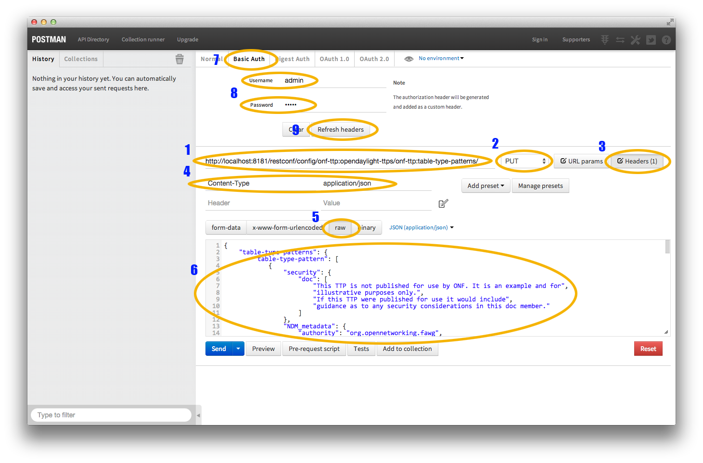

   Filling in URL, content, Content-Type and basic auth

1. Set the URL to
   ``http://localhost:8181/restconf/config/onf-ttp:opendaylight-ttps/onf-ttp:table-type-patterns/``

2. Set the action to ``PUT``

3. Click Headers and

4. Set a header for ``Content-Type`` to ``application/json``

5. Make sure the content is set to raw and

6. Copy the sample TTP from above into the content

7. Click the Basic Auth tab and

8. Set the username and password to admin

9. Click Refresh headers

.. figure:: ./images/ttp-screen2-applied-basic-auth.png
   :alt: Refreshing basic auth headers

   Refreshing basic auth headers

After clicking Refresh headers, we can see that a new header
(``Authorization``) has been created and this will allow us to
authenticate to make the REST call.


   PUTting a TTP

At this point, clicking send should result in a Status response of ``200
OK`` indicating we’ve successfully PUT the TTP into OpenDaylight.


   Retrieving the TTP as json via a GET

We can now retrieve the TTP by:

1. Changing the action to ``GET``

2. Setting an ``Accept`` header to ``application/json`` and

3. Pressing send

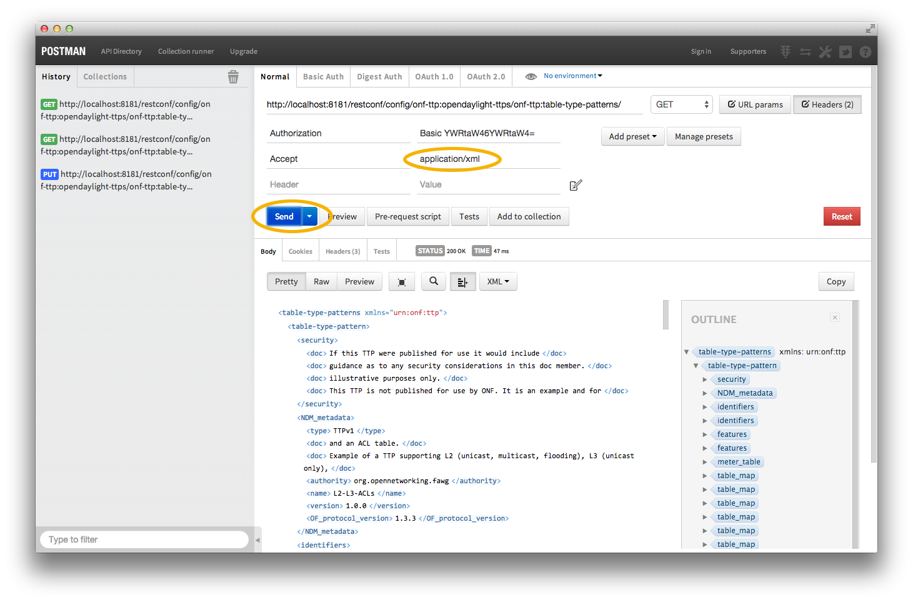

   Retrieving the TTP as xml via a GET

The same process can retrieve the content as xml by setting the
``Accept`` header to ``application/xml``.

TTP CLI Tools Developer Guide
=============================

Overview
--------

Table Type Patterns are a specification developed by the `Open
Networking Foundation <https://www.opennetworking.org/>`__ to enable the
description and negotiation of subsets of the OpenFlow protocol. This is
particularly useful for hardware switches that support OpenFlow as it
enables the to describe what features they do (and thus also what
features they do not) support. More details can be found in the full
specification listed on the `OpenFlow specifications
page <https://www.opennetworking.org/sdn-resources/onf-specifications/openflow>`__.

The TTP CLI Tools provide a way for people interested in TTPs to read
in, validate, output, and manipulate TTPs as a self-contained,
executable jar file.

TTP CLI Tools Architecture
--------------------------

The TTP CLI Tools use the TTP Model and the YANG Tools/RESTCONF codecs
to translate between the Data Transfer Objects (DTOs) and JSON/XML.

Command Line Options
--------------------

This will cover the various options for the CLI Tools. For now, there
are no options and it merely outputs fixed data using the codecs.

Unified Secure Channel
======================

Overview
--------

The Unified Secure Channel (USC) feature provides REST API, manager, and
plugin for unified secure channels. The REST API provides a northbound
api. The manager monitors, maintains, and provides channel related
services. The plugin handles the lifecycle of channels.

USC Channel Architecture
------------------------

-  USC Agent

   -  The USC Agent provides proxy and agent functionality on top of all
      standard protocols supported by the device. It initiates call-home
      with the controller, maintains live connections with with the
      controller, acts as a demuxer/muxer for packets with the USC
      header, and authenticates the controller.

-  USC Plugin

   -  The USC Plugin is responsible for communication between the
      controller and the USC agent . It responds to call-home with the
      controller, maintains live connections with the devices, acts as a
      muxer/demuxer for packets with the USC header, and provides
      support for TLS/DTLS.

-  USC Manager

   -  The USC Manager handles configurations, high availability,
      security, monitoring, and clustering support for USC.

-  USC UI

   -  The USC UI is responsible for displaying a graphical user
      interface representing the state of USC in the OpenDaylight DLUX
      UI.

USC Channel APIs and Interfaces
-------------------------------

This section describes the APIs for interacting with the unified secure
channels.

USC Channel Topology API
~~~~~~~~~~~~~~~~~~~~~~~~

The USC project maintains a topology that is YANG-based in MD-SAL. These
models are available via RESTCONF.

-  Name: view-channel

-  URL:
   `http://${ipaddress}:8181/restconf/operations/usc-channel:view-channel <http://${ipaddress}:8181/restconf/operations/usc-channel:view-channel>`__

-  Description: Views the current state of the USC environment.

API Reference Documentation
---------------------------

Go to
`http://${ipaddress}:8181/apidoc/explorer/index.html <http://${ipaddress}:8181/apidoc/explorer/index.html>`__,
sign in, and expand the usc-channel panel. From there, users can execute
various API calls to test their USC deployment.

Virtual Tenant Network (VTN)
============================

OpenDaylight Virtual Tenant Network (VTN) Overview
--------------------------------------------------

OpenDaylight Virtual Tenant Network (VTN) is an application that
provides multi-tenant virtual network on an SDN controller.

Conventionally, huge investment in the network systems and operating
expenses are needed because the network is configured as a silo for each
department and system. Therefore various network appliances must be
installed for each tenant and those boxes cannot be shared with others.
It is a heavy work to design, implement and operate the entire complex
network.

The uniqueness of VTN is a logical abstraction plane. This enables the
complete separation of logical plane from physical plane. Users can
design and deploy any desired network without knowing the physical
network topology or bandwidth restrictions.

VTN allows the users to define the network with a look and feel of
conventional L2/L3 network. Once the network is designed on VTN, it will
automatically be mapped into underlying physical network, and then
configured on the individual switch leverage SDN control protocol. The
definition of logical plane makes it possible not only to hide the
complexity of the underlying network but also to better manage network
resources. It achieves reducing reconfiguration time of network services
and minimizing network configuration errors. OpenDaylight Virtual Tenant
Network (VTN) is an application that provides multi-tenant virtual
network on an SDN controller. It provides API for creating a common
virtual network irrespective of the physical network.


   VTN Architecture

It is implemented as two major components

-  `VTN Manager <#_vtn_manager>`__

-  `VTN Coordinator <#_vtn_coordinator>`__

VTN Manager
~~~~~~~~~~~

An OpenDaylight Plugin that interacts with other modules to implement
the components of the VTN model. It also provides a REST interface to
configure VTN components in OpenDaylight. VTN Manager is implemented as
one plugin to the OpenDaylight. This provides a REST interface to
create/update/delete VTN components. The user command in VTN Coordinator
is translated as REST API to VTN Manager by the OpenDaylight Driver
component. In addition to the above mentioned role, it also provides an
implementation to the OpenStack L2 Network Functions API.

Function Outline
^^^^^^^^^^^^^^^^

The table identifies the functions and the interface used by VTN
Components:

+--------------------------+--------------------------+--------------------------+
| Component                | Interface                | Purpose                  |
+==========================+==========================+==========================+
| VTN Manager              | RESTful API              | Configure VTN            |
|                          |                          | Virtualization model     |
|                          |                          | components in            |
|                          |                          | OpenDaylight             |
+--------------------------+--------------------------+--------------------------+
| VTN Manager              | Neutron API              | Handle Networks API from |
|                          | implementation           | OpenStack (Neutron       |
|                          |                          | Interface)               |
+--------------------------+--------------------------+--------------------------+
| VTN Coordinator          | RESTful API              | | (1) Uses the RESTful   |
|                          |                          |   interface of VTN       |
|                          |                          |   Manager and configures |
|                          |                          |   VTN Virtualization     |
|                          |                          |   model components in    |
|                          |                          |   OpenDaylight.          |
|                          |                          | | (2) Handles multiple   |
|                          |                          |   OpenDaylight           |
|                          |                          |   orchestration.         |
|                          |                          | | (3) Provides API to    |
|                          |                          |   read the physical      |
|                          |                          |   network details. See   |
|                          |                          |   `samples <https://wiki |
|                          |                          | .OpenDaylight.org/view/O |
|                          |                          | penDaylight_Virtual_Tena |
|                          |                          | nt_Network_(VTN):VTN_Coo |
|                          |                          | rdinator:RestApi:L2_Netw |
|                          |                          | ork_Example_Using_VTN_Vi |
|                          |                          | rtualization>`__         |
|                          |                          |   for usage.             |
+--------------------------+--------------------------+--------------------------+

Feature Overview
^^^^^^^^^^^^^^^^

There are three features

-  **odl-vtn-manager** provides VTN Manager’s JAVA API.

-  **odl-vtn-manager-rest** provides VTN Manager’s REST API.

-  **odl-vtn-manager-neutron** provides the integration with Neutron
   interface.

REST API documentation for VTN Manager, please refer to:
https://jenkins.opendaylight.org/releng/view/vtn/job/vtn-merge-beryllium/lastSuccessfulBuild/artifact/manager/model/target/site/models/

For VTN Java API documentation, please refer to:
https://jenkins.opendaylight.org/releng/view/vtn/job/vtn-merge-beryllium/lastSuccessfulBuild/artifact/target/apidocs/index.html

Once the Karaf distribution is up, install dlux and apidocs.

::

    feature:install odl-dlux-all odl-mdsal-apidocs

Logging In
''''''''''

To Log in to DLUX, after installing the application:

-  Open a browser and enter the login URL as
   `http://<OpenDaylight-IP>:8181/index.html <http://<OpenDaylight-IP>:8181/index.html>`__.

    **Note**

    Replace "<OpenDaylight-IP>" with the IP address of OpenDaylight
    based on your environment.

-  Login to the application with user ID and password credentials as
   admin.

    **Note**

    admin is the only default user available for DLUX in this release.

-  In the right hand side frame, click "Yang UI".

YANG documentation for VTN Manager, please refer to:
https://jenkins.opendaylight.org/releng/view/vtn/job/vtn-merge-beryllium/lastSuccessfulBuild/artifact/manager/model/target/site/models/

VTN Coordinator
~~~~~~~~~~~~~~~

The VTN Coordinator is an external application that provides a REST
interface for an user to use OpenDaylight VTN Virtualization. It
interacts with VTN Manager plugin to implement the user configuration.
It is also capable of multiple OpenDaylight orchestration. It realizes
VTN provisioning in OpenDaylight instances. In the OpenDaylight
architecture VTN Coordinator is part of the network application,
orchestration and services layer. VTN Coordinator will use the REST
interface exposed by the VTN Manger to realize the virtual network using
OpenDaylight. It uses OpenDaylight APIs (REST) to construct the virtual
network in OpenDaylight instances. It provides REST APIs for northbound
VTN applications and supports virtual networks spanning across multiple
OpenDaylight by coordinating across OpenDaylight.

Feature Overview
^^^^^^^^^^^^^^^^

VTN Coordinator doesn’t have Karaf features.

For VTN Coordinator REST API, please refer to:
https://wiki.opendaylight.org/view/OpenDaylight_Virtual_Tenant_Network_%28VTN%29:VTN_Coordinator:RestApi

Usage Examples
~~~~~~~~~~~~~~

-  `L2 Network using Single
   Controller <https://wiki.OpenDaylight.org/view/OpenDaylight_Virtual_Tenant_Network_(VTN):VTN_Coordinator:RestApi:How_to_configure_L2_Network_with_Single_Controller>`__

YANG Tools
==========

Overview
--------

YANG Tools is set of libraries and tooling providing support for use
`YANG <https://tools.ietf.org/html/rfc6020>`__ for Java (or other
JVM-based language) projects and applications.

YANG Tools provides following features in OpenDaylight:

-  parsing of YANG sources and semantic inference of relationship across
   YANG models as defined in
   `RFC6020 <https://tools.ietf.org/html/rfc6020>`__

-  representation of YANG-modeled data in Java

   -  **Normalized Node** representation - DOM-like tree model, which
      uses conceptual meta-model more tailored to YANG and OpenDaylight
      use-cases than a standard XML DOM model allows for.

   -  **Java Binding** - concrete data model and classes generated from
      YANG models, designed to provide compile-time safety when working
      with YANG-modeled data.

-  serialization / deserialization of YANG-modeled data driven by YANG
   models

   -  XML - as defined in
      `RFC6020 <https://tools.ietf.org/html/rfc6020>`__

   -  JSON - as defined in
      `draft-lhotka-netmod-yang-json-01 <https://tools.ietf.org/html/rfc6020>`__

   -  Java Binding to Normalized Node and vice-versa

-  Integration of YANG model parsing into Maven build lifecycle and
   support for third-party generators processing YANG models.

YANG Tools project consists of following logical subsystems:

-  **Commons** - Set of general purpose code, which is not specific to
   YANG, but is also useful outside YANG Tools implementation.

-  **YANG Model and Parser** - YANG semantic model and lexical and
   semantic parser of YANG models, which creates in-memory
   cross-referenced represenation of YANG models, which is used by other
   components to determine their behaviour based on the model.

-  **YANG Data** - Definition of Normalized Node APIs and Data Tree
   APIs, reference implementation of these APIs and implementation of
   XML and JSON codecs for Normalized Nodes.

-  **YANG Maven Plugin** - Maven plugin which integrates YANG parser
   into Maven build lifecycle and provides code-generation framework for
   components, which wants to generate code or other artefacts based on
   YANG model.

-  **YANG Java Binding** - Mapping of YANG model to generated Java APIs.
   Java Binding also references to set of compile-time and runtime
   components which implements this mapping, provides generation of
   classes and APIs based on YANG models and integrate these Java
   Binding objects with **YANG Data** APIs and components.

   -  **Models** - Set of **IETF** and **YANG Tools** models, with
      generated Java Bindings so they could be simply consumed outside
      of **YANG Tools**.

YANG Java Binding: Mapping rules
--------------------------------

This chapter covers the details of mapping YANG to Java.

    **Note**

    The following source code examples does not show canonical generated
    code, but rather illustrative example. Generated classes and
    interfaces may differ from this examples, but APIs are preserved.

General conversion rules
~~~~~~~~~~~~~~~~~~~~~~~~

Package names of YANG models
^^^^^^^^^^^^^^^^^^^^^^^^^^^^

| The package name consists of the following parts:

-  **Opendaylight prefix** - Specifies the opendaylight prefix. Every
   package name starts with the prefix ``org.opendaylight.yang.gen.v``.

-  **Java Binding version** - Specifies the YANG Java Binding version.
   Curent Binding version is ``1``.

-  **Namespace** - Specified by the value of ``namespace`` substatement.
   URI is converted to package name structure.

-  **Revision** - Specifies the concatenation of word ``rev`` and value
   of ``module`` substatements ``revision`` argument value without
   leading zeros before month and day. For example: ``rev201379``

After the package name is generated, we check if it contains any Java
keywords or starts with a digit. If so, then we add an underscore before
the offending token.

The following is a list of keywords which are prefixed with underscore:

abstract, assert, boolean, break, byte, case, catch, char, class, const,
continue, default, double, do, else, enum, extends, false, final,
finally, float, for, goto, if, implements, import, instanceof, int,
interface, long, native, new, null, package, private, protected, public,
return, short, static, strictfp, super, switch, synchronized, this,
throw, throws, transient, true, try, void, volatile, while

As an example suppose following yang model:

.. code:: yang

    module module {
        namespace "urn:2:case#module";
        prefix "sbd";
        organization "OPEN DAYLIGHT";
        contact "http://www.example.com/";
        revision 2013-07-09 {
        }
    }

After applying rules (replacing digits and Java keywords) the resulting
package name is
``org.opendaylight.yang.gen.v1.urn._2._case.module.rev201379``

Additional Packages
^^^^^^^^^^^^^^^^^^^

In cases when YANG statement contain some of specific YANG statements
additional packages are generated to designate this containment. Table
below provides details of parent statement and nested statements, which
yields additional package generation:

+--------------------------------------+--------------------------------------+
| Parent statement                     | Substatement                         |
+======================================+======================================+
| ``list``                             | list, container, choice              |
+--------------------------------------+--------------------------------------+
| ``container``                        | list, container, choice              |
+--------------------------------------+--------------------------------------+
| ``choice``                           | leaf, list, leaf-list, container,    |
|                                      | case                                 |
+--------------------------------------+--------------------------------------+
| ``case``                             | list, container, choice              |
+--------------------------------------+--------------------------------------+
| rpc ``input`` or ``output``          | list, container, (choice isn’t       |
|                                      | supported)                           |
+--------------------------------------+--------------------------------------+
| ``notification``                     | list, container, (choice isn’t       |
|                                      | supported)                           |
+--------------------------------------+--------------------------------------+
| ``augment``                          | list, container, choice, case        |
+--------------------------------------+--------------------------------------+

Substatements are not only mapped to Java setter methods in the
interface representing the parent statement, but they also generate
packages with names consisting of the parent statement package name with
the parent statement name appended.

For example, this YANG model considers the container statement ``cont``
as the direct substatement of the module.

.. code:: yang

    container cont {
      container cont-inner {
      }
      list outter-list {
        list list-in-list {
        }
      }
    }

Container ``cont`` is the parent statement for the substatements
``cont-inner`` and ``outter-list``. ``list outter-list`` is the parent
statement for substatement ``list-in-list``.

| Java code is generated in the following structure:

-  ``org.opendaylight.yang.gen.v1.urn.module.rev201379`` - package
   contains direct substatements of module statement

   -  ``Cont.java``

-  ``org.opendaylight.yang.gen.v1.urn.module.rev201379.cont`` - package
   contains substatements of ``cont`` container statement

   -  ``ContInner.java`` - interface representing container
      ``cont-inner``

   -  ``OutterList.java`` - interface representing list ``outer-list``

-  ``org.opendaylight.yang.gen.v1.urn.module.rev201379.cont.outter.list``
   - package contains substatements of outter-list list element

   -  ``ListInList.java``

Class and interface names
^^^^^^^^^^^^^^^^^^^^^^^^^

Some YANG statements are mapped to Java classes and interfaces. The name
of YANG element may contain various characters which aren’t permitted in
Java class names. Firstly whitespaces are trimmed from YANG name. Next
the characters space, -, \` are deleted and the subsequent letter is
capitalized. At the end, first letter is capitalized.

For example, ``example-name_ without_capitalization`` would map to
``ExampleNameWithoutCapitalization``.

Getter and setter names
^^^^^^^^^^^^^^^^^^^^^^^

In some cases, YANG statements are converted to getter and/or setter
methods. The process for getter is:

1. the name of YANG statement is converted to Java class name style as
   `explained above <#_class_and_interface_names>`__.

2. the word ``get`` is added as prefix, if resulting type is
   ``Boolean``, the name is prefixed with ``is`` prefix instead of
   ``get``.

3. the return type of the getter method is set to Java type representing
   substatement

The process for setter is:

1. the name of YANG statement is converted to Java class name style as
   `explained above <#_class_and_interface_names>`__.

2. the word ``set`` is added as prefix

3. the input parameter name is set to element’s name converted to Java
   parameter style

4. the return parameter is set to builder type

Statement specific mapping
~~~~~~~~~~~~~~~~~~~~~~~~~~

module statement
^^^^^^^^^^^^^^^^

YANG ``module`` statement is converted to Java as two Java classes. Each
of the classes is in the separate Java file. The names of Java files are
composed as follows: ``<module name><suffix>.java`` where ``<suffix>``
is either data or service.

Data Interface
''''''''''''''

Data Interface has a mapping similar to container, but contains only top
level nodes defined in module.

Data interface serves only as marker interface for type-safe APIs of
``InstanceIdentifier``.

Service Interface
'''''''''''''''''

Service Interface serves to describe RPC contract defined in the module.
This RPC contract is defined by ``rpc`` statements.

RPC implementation usually implement this interface and users of the
RPCs use this interface to invoke RPCs.

container statement
^^^^^^^^^^^^^^^^^^^

YANG containers are mapped to Java interfaces which extend the Java
DataObject and Augmentable<container-interface>, where
container-interface is the name of the mapped interface.

For example, the following YANG:

**YANG model.**

.. code:: yang

    container cont {

    }

is converted into this Java:

**Cont.java.**

.. code:: java

    public interface Cont extends ChildOf<...>, Augmentable<Cont> {
    }

Leaf statement
^^^^^^^^^^^^^^

Each leaf has to contain at least one type substatement. The leaf is
mapped to getter method of parent statement with return type equal to
type substatement value.

For example, the following YANG:

**YANG model.**

.. code:: yang

    container cont {
      leaf lf {
        type string;
      }
    }

is converted into this Java:

**Cont.java.**

.. code:: java

    public interface Cont extends DataObject, Augmentable<Cont> {
        String getLf(); 
    }

-  Represents ``leaf lf``

leaf-list statement
^^^^^^^^^^^^^^^^^^^

Each leaf-list has to contain one type substatement. The leaf-list is
mapped to getter method of parent statement with return type equal to
List of type substatement value.

For example, the following YANG:

**YANG model.**

.. code:: yang

    container cont {
        leaf-list lf-lst {
            type string;
        }
    }

is converted into this Java:

**Cont.java.**

.. code:: java

    public interface Cont extends DataObject, Augmentable<Cont> {
        List<String> getLfLst();
    }

list statement
^^^^^^^^^^^^^^

``list`` statements are mapped to Java interfaces and a getter method is
generated in the interface associated with it’s parent statement. The
return type of getter the method is a Java List of objects implementing
the interface generated corresponding to the ``list statement.
Mapping of `list`` substatement to Java:

For example, the following YANG:

**YANG model.**

.. code:: yang

    container cont {
      list outter-list {
        key "leaf-in-list";
        leaf number {
          type uint64;
        }
      }
    }

The list statement ``example-list`` is mapped to the Java interface
``ExampleList`` and the ``Cont`` interface (parent of ``ExampleList``)
contains getter method with return type ``List<ExampleList>``. The
presence of a ``key`` statement, triggers generation of
``ExampleListKey``, which may be used to identify item in list.

The end result is this Java:

**OutterList.java.**

.. code:: java

    package org.opendaylight.yang.gen.v1.urn.module.rev201379.cont;

    import org.opendaylight.yangtools.yang.binding.DataObject;
    import org.opendaylight.yangtools.yang.binding.Augmentable;
    import Java.util.List;
    import org.opendaylight.yang.gen.v1.urn.module.rev201379.cont.outter.list.ListInList;

    public interface OutterList extends DataObject, Augmentable<OutterList> {

        List<String> getLeafListInList();

        List<ListInList> getListInList();

        /*
        Returns Primary Key of Yang List Type
        */
        OutterListKey getOutterListKey();

    }

**OutterListKey.java.**

.. code:: java

    package org.opendaylight.yang.gen.v1.urn.module.rev201379.cont;

    import org.opendaylight.yang.gen.v1.urn.module.rev201379.cont.OutterListKey;
    import Java.math.BigInteger;

    public class OutterListKey {

        private BigInteger _leafInList;

        public OutterListKey(BigInteger _leafInList) {
            super();
            this_leafInList = _leafInList;
        }

        public BigInteger getLeafInList() {
            return _leafInList;
        }

        @Override
        public int hashCode() {
            final int prime = 31;
            int result = 1;
            result = prime * result + ((_leafInList == null) ? 0 : _leafInList.hashCode());
            return result;
        }

        @Override
        public boolean equals(Object obj) {
            if (this == obj) {
                return true;
            }
            if (obj == null) {
                return false;
            }
            if (getClass() != obj.getClass()) {
                return false;
            }
            OutterListKey other = (OutterListKey) obj;
            if (_leafInList == null) {
                if (other._LeafInList != null) {
                    return false;
                }
            } else if(!_leafInList.equals(other._leafInList)) {
                return false;
            }
            return true;
        }

        @Override
        public String toString() {
            StringBuilder builder = new StringBuilder();
            builder.append("OutterListKey [_leafInList=");
            builder.append(_leafInList);
            builder.append("]");
            return builder.toString();
        }
    }

choice and case statements
^^^^^^^^^^^^^^^^^^^^^^^^^^

A ``choice`` element is mapped in mostly the same way a ``list`` element
is. The ``choice`` element is mapped to and interface (marker interface)
and a new getter method with the return type of a Java ``List`` of this
marker interfaces is added to the interface corresponding to the parent
statement. Any ``case`` substatements are mapped to Java interfaces
which extend the marker interface.

For example, the following YANG:

**YANG model.**

.. code:: yang

    container cont {
        choice example-choice {
            case foo-case {
              leaf foo {
                type string;
              }
            }
            case bar-case {
                leaf bar {
                  type string;
                }
            }
        }
    }

is converted into this Java:

**Cont.java.**

.. code:: java

    package org.opendaylight.yang.gen.v1.urn.module.rev201379;

    import org.opendaylight.yangtools.yang.binding.DataObject;
    import org.opendaylight.yangtools.yang.binding.Augmentable;
    import org.opendaylight.yang.gen.v1.urn.module.rev201379.cont.ChoiceTest;

    public interface Cont extends DataObject, Augmentable<Cont> {

        ExampleChoice getExampleChoice();

    }

**ExampleChoice.java.**

.. code:: java

    package org.opendaylight.yang.gen.v1.urn.module.rev201379.cont;

    import org.opendaylight.yangtools.yang.binding.DataObject;

    public interface ExampleChoice extends DataContainer {
    }

**FooCase.java.**

.. code:: java

    package org.opendaylight.yang.gen.v1.urn.module.rev201379.cont.example.choice;

    import org.opendaylight.yangtools.yang.binding.DataObject;
    import org.opendaylight.yangtools.yang.binding.Augmentable;
    import org.opendaylight.yang.gen.v1.urn.module.rev201379.cont.ChoiceTest;

    public interface FooCase extends ExampleChoice, DataObject, Augmentable<FooCase> {

        String getFoo();

    }

**BarCase.java.**

.. code:: java

    package org.opendaylight.yang.gen.v1.urn.module.rev201379.cont.example.choice;

    import org.opendaylight.yangtools.yang.binding.DataObject;
    import org.opendaylight.yangtools.yang.binding.Augmentable;
    import org.opendaylight.yang.gen.v1.urn.module.rev201379.cont.ChoiceTest;

    public interface BarCase extends ExampleChoice, DataObject, Augmentable<BarCase> {

        String getBar();

    }

grouping and uses statements
^^^^^^^^^^^^^^^^^^^^^^^^^^^^

``grouping`s are mapped to Java interfaces. `uses`` statements in some
element (using of concrete grouping) are mapped as extension of
interface for this element with the interface which represents grouping.

For example, the following YANG:

**YANG Model.**

.. code:: yang

    grouping grp {
      leaf foo {
        type string;
      }
    }

    container cont {
        uses grp;
    }

is converted into this Java:

**Grp.java.**

.. code:: java

    package org.opendaylight.yang.gen.v1.urn.module.rev201379;

    import org.opendaylight.yangtools.yang.binding.DataObject;

    public interface Grp extends DataObject {

        String getFoo();

    }

**Cont.java.**

.. code:: java

    package org.opendaylight.yang.gen.v1.urn.module.rev201379;

    import org.opendaylight.yangtools.yang.binding.DataObject;
    import org.opendaylight.yangtools.yang.binding.Augmentable;

    public interface Cont extends DataObject, Augmentable<Cont>, Grp {
    }

rpc, input and output statements
^^^^^^^^^^^^^^^^^^^^^^^^^^^^^^^^

An ``rpc`` statement is mapped to Java as method of class
``ModuleService.java``. Any substatements of an ``rpc`` are mapped as
follows:

+--------------------------------------+--------------------------------------+
| Rpc Substatement                     | Mapping                              |
+======================================+======================================+
| input                                | presence of input statement triggers |
|                                      | generation of interface              |
+--------------------------------------+--------------------------------------+
| output                               | presence of output statement         |
|                                      | triggers generation of interface     |
+--------------------------------------+--------------------------------------+

For example, the following YANG:

**YANG model.**

.. code:: yang

    rpc rpc-test1 {
        output {
            leaf lf-output {
                type string;
            }
        }
        input {
            leaf lf-input {
                type string;
            }
        }
    }

is converted into this Java:

**ModuleService.java.**

.. code:: java

    package org.opendaylight.yang.gen.v1.urn.module.rev201379;

    import Java.util.concurrent.Future;
    import org.opendaylight.yangtools.yang.common.RpcResult;

    public interface ModuleService {

        Future<RpcResult<RpcTest1Output>> rpcTest1(RpcTest1Input input);

    }

**RpcTest1Input.java.**

.. code:: java

    package org.opendaylight.yang.gen.v1.urn.module.rev201379;

    public interface RpcTest1Input {

        String getLfInput();

    }

**RpcTest1Output.java.**

.. code:: java

    package org.opendaylight.yang.gen.v1.urn.module.rev201379;

    public interface RpcTest1Output {

        String getLfOutput();

    }

notification statement
^^^^^^^^^^^^^^^^^^^^^^

``notification`` statements are mapped to Java interfaces which extend
the Notification interface.

For example, the following YANG:

**YANG model.**

.. code:: yang

    notification notif {
        }

is converted into this Java:

**Notif.java.**

.. code:: java

    package org.opendaylight.yang.gen.v1.urn.module.rev201379;


    import org.opendaylight.yangtools.yang.binding.DataObject;
    import org.opendaylight.yangtools.yang.binding.Augmentable;
    import org.opendaylight.yangtools.yang.binding.Notification;

    public interface Notif extends DataObject, Augmentable<Notif>, Notification {
    }

augment statement
~~~~~~~~~~~~~~~~~

``augment`` statements are mapped to Java interfaces. The interface
starts with the same name as the name of augmented interface with a
suffix corresponding to the order number of augmenting interface. The
augmenting interface also extends ``Augmentation<>`` with actual type
parameter equal to augmented interface.

For example, the following YANG:

**YANG Model.**

.. code:: yang

    container cont {
    }

    augment "/cont" {
      leaf additional-value {
        type string;
      }
    }

is converted into this Java:

**Cont.java.**

.. code:: java

    package org.opendaylight.yang.gen.v1.urn.module.rev201379;

    import org.opendaylight.yangtools.yang.binding.DataObject;
    import org.opendaylight.yangtools.yang.binding.Augmentable;

    public interface Cont extends DataObject, Augmentable<Cont> {

    }

**Cont1.java.**

.. code:: java

    package org.opendaylight.yang.gen.v1.urn.module.rev201379;

    import org.opendaylight.yangtools.yang.binding.DataObject;
    import org.opendaylight.yangtools.yang.binding.Augmentation;

    public interface Cont1 extends DataObject, Augmentation<Cont> {

    }

YANG Type mapping
~~~~~~~~~~~~~~~~~

typedef statement
^^^^^^^^^^^^^^^^^

YANG ``typedef`` statements are mapped to Java classes. A ``typedef``
may contain following substatements:

+--------------------------------------+--------------------------------------+
| Substatement                         | Behaviour                            |
+======================================+======================================+
| type                                 | determines wrapped type and how      |
|                                      | class will be generated              |
+--------------------------------------+--------------------------------------+
| descripton                           | Javadoc description                  |
+--------------------------------------+--------------------------------------+
| units                                | is not mapped                        |
+--------------------------------------+--------------------------------------+
| default                              | is not mapped                        |
+--------------------------------------+--------------------------------------+

Valid Arguments Type
''''''''''''''''''''

Simple values of type argument are mapped as follows:

+--------------------------------------+--------------------------------------+
| YANG Type                            | Java type                            |
+======================================+======================================+
| boolean                              | Boolean                              |
+--------------------------------------+--------------------------------------+
| empty                                | Boolean                              |
+--------------------------------------+--------------------------------------+
| int8                                 | Byte                                 |
+--------------------------------------+--------------------------------------+
| int16                                | Short                                |
+--------------------------------------+--------------------------------------+
| int32                                | Integer                              |
+--------------------------------------+--------------------------------------+
| int64                                | Long                                 |
+--------------------------------------+--------------------------------------+
| string                               | String or, wrapper class (if pattern |
|                                      | substatement is specified)           |
+--------------------------------------+--------------------------------------+
| decimal64                            | Double                               |
+--------------------------------------+--------------------------------------+
| uint8                                | Short                                |
+--------------------------------------+--------------------------------------+
| uint16                               | Integer                              |
+--------------------------------------+--------------------------------------+
| uint32                               | Long                                 |
+--------------------------------------+--------------------------------------+
| uint64                               | BigInteger                           |
+--------------------------------------+--------------------------------------+
| binary                               | byte[]                               |
+--------------------------------------+--------------------------------------+

Complex values of type argument are mapped as follows:

+--------------------------------------+--------------------------------------+
| Argument Type                        | Java type                            |
+======================================+======================================+
| enumeration                          | generated java enum                  |
+--------------------------------------+--------------------------------------+
| bits                                 | generated class for bits             |
+--------------------------------------+--------------------------------------+
| leafref                              | same type as referenced leaf         |
+--------------------------------------+--------------------------------------+
| identityref                          | Class                                |
+--------------------------------------+--------------------------------------+
| union                                | generated java class                 |
+--------------------------------------+--------------------------------------+
| instance-identifier                  | ``org.opendaylight.yangtools.yang.bi |
|                                      | nding.InstanceIdentifier``           |
+--------------------------------------+--------------------------------------+

Enumeration Substatement Enum
^^^^^^^^^^^^^^^^^^^^^^^^^^^^^

The YANG ``enumeration`` type has to contain some ``enum``
substatements. An ``enumeration`` is mapped as Java enum type
(standalone class) and every YANG enum substatements is mapped to Java
enum’s predefined values.

An ``enum`` statement can have following substatements:

+--------------------------------------+--------------------------------------+
| Enum’s Substatement                  | Java mapping                         |
+======================================+======================================+
| description                          | is not mapped in API                 |
+--------------------------------------+--------------------------------------+
| value                                | mapped as input parameter for every  |
|                                      | predefined value of enum             |
+--------------------------------------+--------------------------------------+

For example, the following YANG:

**YANG model.**

.. code:: yang

    typedef typedef-enumeration {
        type enumeration {
            enum enum1 {
                description "enum1 description";
                value 18;
            }
            enum enum2 {
                value 16;
            }
            enum enum3 {
            }
        }
    }

is converted into this Java:

**TypedefEnumeration.java.**

.. code:: java

    public enum TypedefEnumeration {
        Enum1(18),
        Enum2(16),
        Enum3(19);

        int value;

        private TypedefEnumeration(int value) {
            this.value = value;
        }
    }

Bits’s Substatement Bit
^^^^^^^^^^^^^^^^^^^^^^^

The YANG ``bits`` type has to contain some bit substatements. YANG
``bits`` is mapped to a Java class (standalone class) and every YANG
``bits`` substatements is mapped to a boolean attribute of that class.
In addition, the class provides overridden versions of the Object
methods ``hashCode``, ``toString``, and ``equals``.

For example, the following YANG:

**YANG Model.**

.. code:: yang

    typedef typedef-bits {
      type bits {
        bit first-bit {
          description "first-bit description";
            position 15;
          }
        bit second-bit;
      }
    }

is converted into this Java:

**TypedefBits.java.**

.. code:: java

    public class TypedefBits {

        private Boolean firstBit;
        private Boolean secondBit;

        public TypedefBits() {
            super();
        }

        public Boolean getFirstBit() {
            return firstBit;
        }

        public void setFirstBit(Boolean firstBit) {
            this.firstBit = firstBit;
        }

        public Boolean getSecondBit() {
            return secondBit;
        }

        public void setSecondBit(Boolean secondBit) {
            this.secondBit = secondBit;
        }

        @Override
        public int hashCode() {
            final int prime = 31;
            int result = 1;
            result = prime * result +
             ((firstBit == null) ? 0 : firstBit.hashCode());
            result = prime * result +
             ((secondBit == null) ? 0 : secondBit.hashCode());
            return result;
        }

        @Override
        public boolean equals(Object obj) {
            if (this == obj) {
                return true;
            }
            if (obj == null) {
                return false;
            }
            if (getClass() != obj.getClass()) {
                return false;
            }
            TypedefBits other = (TypedefBits) obj;
            if (firstBit == null) {
                if (other.firstBit != null) {
                    return false;
                }
            } else if(!firstBit.equals(other.firstBit)) {
                return false;
            }
            if (secondBit == null) {
                if (other.secondBit != null) {
                    return false;
                }
            } else if(!secondBit.equals(other.secondBit)) {
                return false;
            }
            return true;
        }

        @Override
        public String toString() {
            StringBuilder builder = new StringBuilder();
            builder.append("TypedefBits [firstBit=");
            builder.append(firstBit);
            builder.append(", secondBit=");
            builder.append(secondBit);
            builder.append("]");
            return builder.toString();
        }
    }

Union’s Substatement Type
^^^^^^^^^^^^^^^^^^^^^^^^^

If the type of a ``typedef`` is ``union``, it has to contain ``type``
substatements. The ``union typedef`` is mapped to class and its ``type``
substatements are mapped to private class members. Every YANG union
subtype gets its own Java constructor with a parameter which represent
just that one attribute.

For example, the following YANG:

**YANG model.**

.. code:: yang

    typedef typedef-union {
        type union {
            type int32;
            type string;
        }
    }

is converted into this Java:

**TypdefUnion.java.**

.. code:: java

    public class TypedefUnion {

        private Integer int32;
        private String string;

        public TypedefUnion(Integer int32) {
            super();
            this.int32 = int32;
        }

        public TypedefUnion(String string) {
            super();
            this.string = string;
        }

        public Integer getInt32() {
            return int32;
        }

        public String getString() {
            return string;
        }

        @Override
        public int hashCode() {
            final int prime = 31;
            int result = 1;
            result = prime * result + ((int32 == null) ? 0 : int32.hashCode());
            result = prime * result + ((string == null) ? 0 : string.hashCode());
            return result;
        }

        @Override
        public boolean equals(Object obj) {
            if (this == obj) {
                return true;
            }
            if (obj == null) {
                return false;
            }
            if (getClass() != obj.getClass()) {
                return false;
            }
            TypedefUnion other = (TypedefUnion) obj;
            if (int32 == null) {
                if (other.int32 != null) {
                    return false;
                }
            } else if(!int32.equals(other.int32)) {
                return false;
            }
            if (string == null) {
                if (other.string != null) {
                    return false;
                }
            } else if(!string.equals(other.string)) {
                return false;
            }
            return true;
        }

        @Override
        public String toString() {
            StringBuilder builder = new StringBuilder();
            builder.append("TypedefUnion [int32=");
            builder.append(int32);
            builder.append(", string=");
            builder.append(string);
            builder.append("]");
            return builder.toString();
        }
    }

String Mapping
^^^^^^^^^^^^^^

The YANG ``string`` type can contain the substatements ``length`` and
``pattern`` which are mapped as follows:

+--------------------------------------+--------------------------------------+
| Type substatements                   | Mapping to Java                      |
+======================================+======================================+
| length                               | not mapped                           |
+--------------------------------------+--------------------------------------+
| pattern                              | | . list of string constants = list  |
|                                      |   of patterns                        |
|                                      | | . list of Pattern objects          |
|                                      | | . static initialization block      |
|                                      |   where list of Patterns is          |
|                                      |   initialized from list of string of |
|                                      |   constants                          |
+--------------------------------------+--------------------------------------+

For example, the following YANG:

**YANG model.**

.. code:: yang

    typedef typedef-string {
        type string {
            length 44;
            pattern "[a][.]*"
        }
    }

is converted into this Java:

**TypedefString.java.**

.. code:: java

    public class TypedefString {

        private static final List<Pattern> patterns = new ArrayList<Pattern>();
        public static final List<String> PATTERN`CONSTANTS = Arrays.asList("[a][.]*");

        static {
            for (String regEx : PATTERN`CONSTANTS) {
                patterns.add(Pattern.compile(regEx));
            }
        }

        private String typedefString;

        public TypedefString(String typedefString) {
            super();
            // Pattern validation
            this.typedefString = typedefString;
        }

        public String getTypedefString() {
            return typedefString;
        }

        @Override
        public int hashCode() {
            final int prime = 31;
            int result = 1;
            result = prime * result + ((typedefString == null) ? 0 : typedefString.hashCode());
            return result;
        }

        @Override
        public boolean equals(Object obj) {
            if (this == obj) {
                return true;
            }
            if (obj == null) {
                return false;
            }
            if (getClass() != obj.getClass()) {
                return false;
            }
            TypedefString other = (TypedefString) obj;
            if (typedefString == null) {
                if (other.typedefString != null) {
                    return false;
                }
            } else if(!typedefString.equals(other.typedefString)) {
                return false;
            }
            return true;
        }

        @Override
        public String toString() {
            StringBuilder builder = new StringBuilder();
            builder.append("TypedefString [typedefString=");
            builder.append(typedefString);
            builder.append("]");
            return builder.toString();
        }
    }

identity statement
~~~~~~~~~~~~~~~~~~

The purpose of the ``identity`` statement is to define a new globally
unique, abstract, and untyped value.

The ``base`` substatement argument is the name of existing identity from
which the new identity is derived.

Given that, an ``identity`` statement is mapped to Java abstract class
and any ``base`` substatements are mapped as ``extends`` Java keyword.
The identity name is translated to class name.

For example, the following YANG:

**YANG Model.**

.. code:: yang

    identity toast-type {

    }

    identity white-bread {
       base toast-type;
    }

is converted into this Java:

**ToastType.java.**

.. code:: java

    public abstract class ToastType extends BaseIdentity {
        protected ToastType() {
            super();
        }
    }

**WhiteBread.java.**

.. code:: java

    public abstract class WhiteBread extends ToastType {
        protected WhiteBread() {
            super();
        }
    }

YANG-PUSH Developer Guide
=========================

Overview
--------

The YANG PUBSUB project allows subscriptions to be placed on targeted
subtrees of YANG datastores residing on remote devices. Changes in YANG
objects within the remote subtree can be pushed to an OpenDaylight
controller as specified without a requiring the controller to make a
continuous set of fetch requests.

YANG-PUSH capabilities available
~~~~~~~~~~~~~~~~~~~~~~~~~~~~~~~~

This module contains the base code which embodies the intent of
YANG-PUSH requirements for subscription as defined in
{i2rs-pub-sub-requirements}
[https://datatracker.ietf.org/doc/draft-ietf-i2rs-pub-sub-requirements/].
The mechanism for delivering on these YANG-PUSH requirements over
Netconf transport is defined in {netconf-yang-push} [netconf-yang-push:
https://tools.ietf.org/html/draft-ietf-netconf-yang-push-00].

Note that in the current release, not all capabilities of
draft-ietf-netconf-yang-push are realized. Currently only implemented is
**create-subscription** RPC support from
ietf-datastore-push@2015-10-15.yang; and this will be for periodic
subscriptions only. There of course is intent to provide much additional
functionality in future OpenDaylight releases.

Future YANG-PUSH capabilities
~~~~~~~~~~~~~~~~~~~~~~~~~~~~~

Over time, the intent is to flesh out more robust capabilities which
will allow OpenDaylight applications to subscribe to YANG-PUSH compliant
devices. Capabilities for future releases will include:

Support for subscription change/delete: **modify-subscription** rpc
support for all mountpoint devices or particular mountpoint device
**delete-subscription** rpc support for all mountpoint devices or
particular mountpoint device

Support for static subscriptions: This will enable the receipt of
subscription updates pushed from publishing devices where no signaling
from the controller has been used to establish the subscriptions.

Support for additional transports: NETCONF is not the only transport of
interest to OpenDaylight or the subscribed devices. Over time this code
will support Restconf and HTTP/2 transport requirements defined in
{netconf-restconf-yang-push}
[https://tools.ietf.org/html/draft-voit-netconf-restconf-yang-push-01]

YANG-PUSH Architecture
----------------------

The code architecture of Yang push consists of two main elements

YANGPUSH Provider YANGPUSH Listener

YANGPUSH Provider receives create-subscription requests from
applications and then establishes/registers the corresponding listener
which will receive information pushed by a publisher. In addition,
YANGPUSH Provider also invokes an augmented OpenDaylight
create-subscription RPC which enables applications to register for
notification as per rfc5277. This augmentation adds periodic time period
(duration) and subscription-id values to the existing RPC parameters.
The Java package supporting this capability is
“org.opendaylight.yangpush.impl”. Below class supports the YANGPUSH
Provider capability:

(1) YangpushDomProvider The Binding Independent version. It uses a
neutral data Document Object Model format for data and API calls, which
is independent of any generated Java language bindings from the YANG
model.

The YANGPUSH Listener accepts update notifications from a device after
they have been de-encapsulated from the NETCONF transport. The YANGPUSH
Listener then passes these updates to MD-SAL. This function is
implemented via the YangpushDOMNotificationListener class within the
“org.opendaylight.yangpush.listner” Java package.

Key APIs and Interfaces
-----------------------

YangpushDomProvider
~~~~~~~~~~~~~~~~~~~

Central to this is onSessionInitiated which acquires the Document Object
Model format based versions of MD-SAL services, including the MountPoint
service and RPCs. Via these acquired services, invoke
registerDataChangeListener over in YangpushDOMNotificationListener.

YangpushDOMNotificationListener
~~~~~~~~~~~~~~~~~~~~~~~~~~~~~~~

This API handles instances of a received Push Updates which are inbound
to the listener and places these in MD-SAL. Key classes in include:

onPushUpdate Converts and validates the encoding of the pushed
subscription update. If the subscription exists and is active, calls
updateDataStoreForPushUpdate so that the information can be put in
MD-SAL. Finally logs the pushed subscription update as well as some
additional context information.

updateDataStoreForPushUpdate Used to put the published information into
MD-SAL. This pushed information will also include elements such as the
subscription-id, the identity of the publisher, the time of the update,
the incoming encoding type, and the pushed YANG subtree information.

YangpushDOMNotificationListener Starts the listener tracking a new
Subscription ID from a particular publisher.

API Reference Documentation
---------------------------

Javadocs are generated while creating mvn:site and they are located in
target/ directory in each module.


