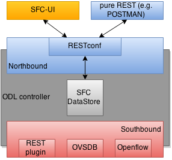

=== SFC User Interface

==== Overview
SFC User Interface (SFC-UI) is based on Dlux project. It provides an easy way
to create, read, update and delete configuration stored in Datastore. Moreover,
it shows the status of all SFC features (e.g installed, uninstalled) and
Karaf log messages as well.

==== SFC-UI Architecture
SFC-UI operates purely by using RESTCONF.

.SFC-UI integration into ODL

==== Configuring SFC-UI
.Configuration steps
. Run ODL distribution (run karaf)
. In karaf console execute: +feature:install odl-sfc-ui+
. Visit SFC-UI on: +http://<odl_ip_address>:8181/sfc/index.html+
