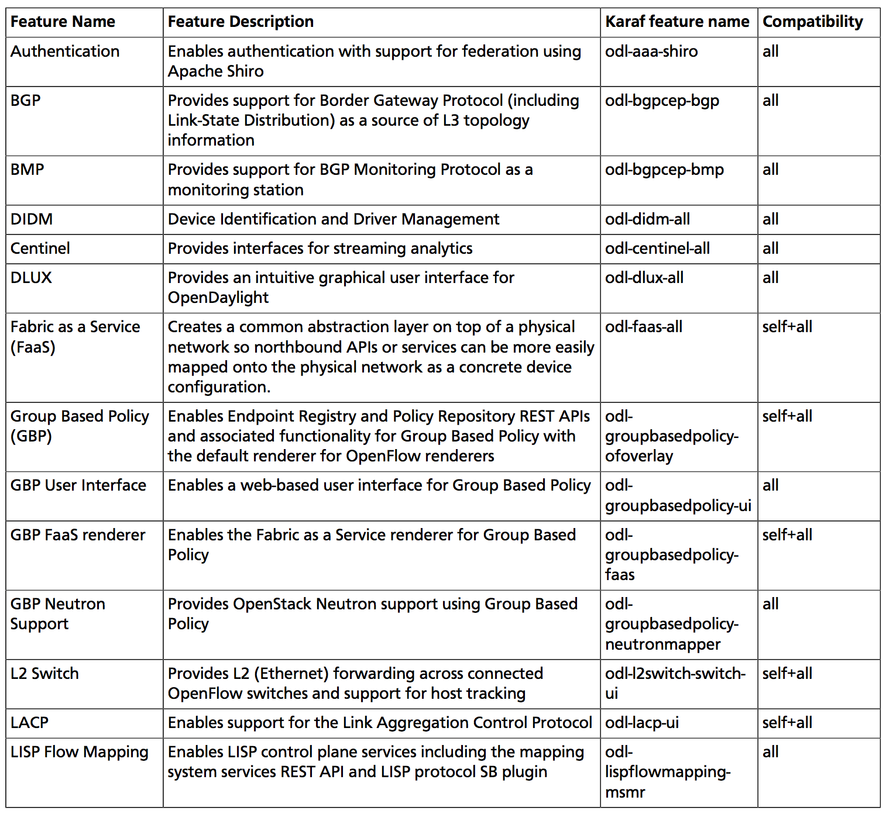
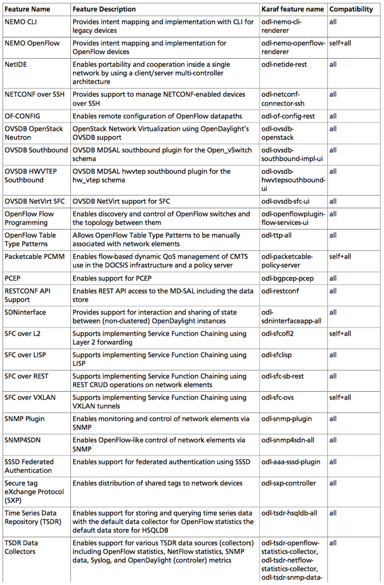
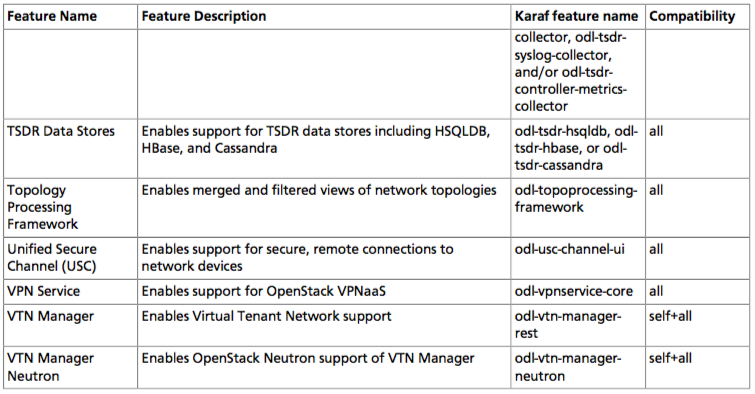
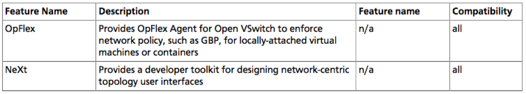
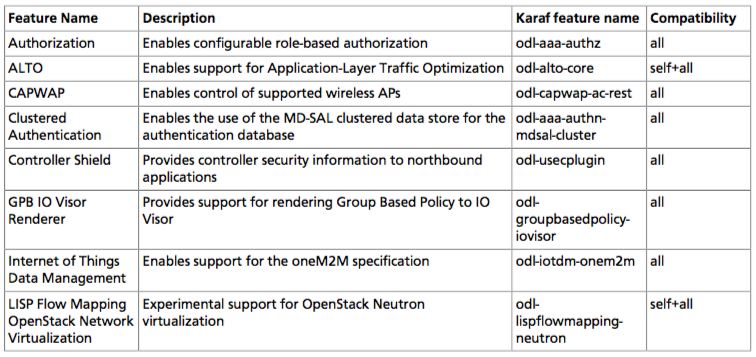
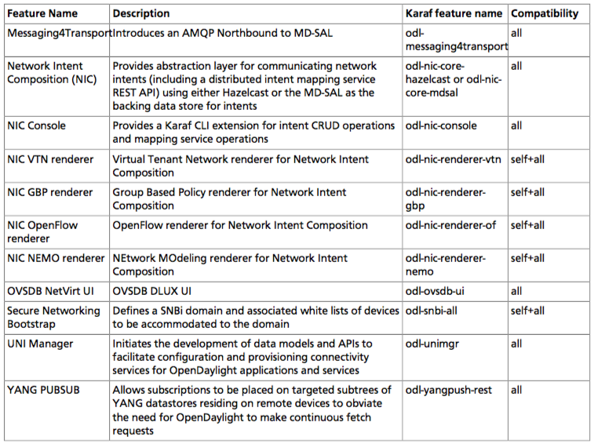

Installing OpenDaylight
=======================

You complete the following steps to install your networking environment, with
specific instructions provided in the subsections below.

Before detailing the instructions for these, we address the following:
Java Runtime Environment (JRE) and operating system information
Target environment
Known issues and limitations

Install OpenDaylight
--------------------

Install the Karaf features
--------------------------
To install a feature, use the following command, where feature1 is the feature
name listed in the table below::

    feature:install <feature1>

You can install multiple features using the following command::

    feature:install <feature1> <feature2> ... <featureN-name>

.. note:: For compatibility reasons, you cannot enable all Karaf features
   simultaneously. The table below documents feature installation names and
   known incompatibilities.Compatibility values indicate the following:

* *all* - the feature can be run with other features.
* *self+all* - the feature can be installed with other features with a value of
  *all*, but may interact badly with other features that have a value of
  *self+all*. Not every combination has been tested.

Uninstalling features
^^^^^^^^^^^^^^^^^^^^^
To uninstall a feature, you must shut down OpenDaylight, delete the data
directory, and start OpenDaylight up again.

.. important:: Uninstalling a feature using the Karaf feature:uninstall command
   is not supported and can cause unexpected and undesirable behavior.

Listing available features
^^^^^^^^^^^^^^^^^^^^^^^^^^
To find the complete list of Karaf features, run the following command::

    feature:list

To list the installed Karaf features, run the following command::

    feature:list -i

Features to implement networking functionality provide release notes you can
access on the OpenDaylight Wiki: https://wiki.opendaylight.org/view/Project_list

* Authentication, Authorization and Accounting (AAA_)
* ALTO_
* BGPCEP_
* Controller_
* Control And Provisioning of Wireless Access Points (CAPWAP_)
* Identification and Driver Management (DIDM_)
* DLUX_
* FaaS_
* Group_Based_Policy_ (GPB)
* Internet of Things Data Management (IoTDM_)
* L2_Switch_
* Link Aggregation Control Protocol (LACP_)
* LISP_Flow_Mapping_
* MDSAL_
* NEMO_
* NETCONF_
* NetIDE_
* NeXt_
* Network Intent Composition (NIC_)
* Neutron_Northbound_
* OF-Config_
* OpFlex_
* OpenFlow_Plugin_
* OpenFlow_Protocol_Library_
* OVSDB_Netvirt_
* Packet_Cable_ / PCMM
* SDN_Interface_Application_
* Secure Network Bootstrapping Infrastructure (SNBI_)
* SNMP4SDN_
* SNMP_Plugin_
* Secure tag eXchange Protocol (SXP_)
* Service Function Chaining (SFC_)
* TCPMD5_
* Time Series Data Repository (TSDR_)
* Table Type Patterns (TTP_)
* Topology_Processing_Framework_
* Unified Secure Channel (USC_)
* VPN_Service_
* Virtual Tenant Network (VTN_)
* YANG_Tools_

Projects without Release Notes
^^^^^^^^^^^^^^^^^^^^^^^^^^^^^^
The following projects participated in Beryllium, but intentionally do not have
release notes:

* The Documentation Project produced this and the other downloadable
  documentation.
* The Integration Group hosted the OpenDaylight-wide tests and main release
  distribution.
* Controller Core Functionality Tutorials provided a single test suite
  (dsbenchmark) that was used as part of integration testing
* Release Engineering used autorelease to build the Beryllium release artifacts,
  including the main release download.

Beryllium features
------------------

Other Beryllium features
------------------------

Experimental Beryllium Features
-------------------------------
The following functionality is labeled as experimental in OpenDaylight
Beryllium and should be used accordingly. In general, it is not supposed to be
used in production unless its limitations are well understood by those
deploying it.

Install support for REST APIs
-----------------------------
Most components that offer REST APIs will automatically load the RESTCONF API
Support component, but if for whatever reason they seem to be missing, install
the “odl-restconf” feature to activate this support.

Install the DLUX interface
--------------------------
OpenDaylight’s DLUX web interface draws information from topology and host
databases to display information about the topology of the network, flow
statistics, and host locations.

To integrate with OpenDaylight you must enable the DLUX Karaf feature. Each
feature can be enabled or disabled separately. Ensure that you have created a
topology and enabled the MD-SAL feature in the Karaf distribution before you
use DLUX for network management. For more information about enabling the Karaf
features for DLUX, refer to Enable_DLUX_Feature_.

MD-SAL clustering
-----------------
In the Beryllium release and newer, the odl-mdsal-broker installs MD-SAL
clustering automatically.

.. _Enable_DLUX_Feature: https://wiki.opendaylight.org/view/DLUX:Beryllium_System_Test_Plan#Enabling_The_Feature

.. _AAA: https://wiki.opendaylight.org/view/AAA:Beryllium_Release_Notes
.. _ALTO: https://wiki.opendaylight.org/view/ALTO:Beryllium:Release_Notes
.. _BGPCEP: https://wiki.opendaylight.org/view/BGP_LS_PCEP:Beryllium_Release_Notes
.. _CAPWAP: https://wiki.opendaylight.org/view/CAPWAP:Beryllium:Release_Notes
.. _Controller: https://wiki.opendaylight.org/view/OpenDaylight_Controller:Beryllium:Release_Notes
.. _DIDM: https://wiki.opendaylight.org/view/DIDM:_Beryllium_Release_Notes
.. _DLUX: https://wiki.opendaylight.org/view/OpenDaylight_DLUX:Beryllium:Release_Notes
.. _FaaS: https://wiki.opendaylight.org/view/FaaS:Beryllium_Release_Notes
.. _Group_Based_Policy: https://wiki.opendaylight.org/view/Group_Based_Policy_(GBP)/Releases/Beryllium:Beryllium_Release_Notes
.. _IoTDM: https://wiki.opendaylight.org/view/Iotdm:Beryllium_Release_Notes
.. _L2_Switch: https://wiki.opendaylight.org/view/L2_Switch:Beryllium:Release_Notes
.. _LACP: https://wiki.opendaylight.org/view/LACP:Beryllium:Release_Notes
.. _LISP_Flow_Mapping: https://wiki.opendaylight.org/view/OpenDaylight_Lisp_Flow_Mapping:Beryllium_Release_Notes
.. _MDSAL: https://wiki.opendaylight.org/view/MD-SAL:Beryllium:Release_Notes
.. _NEMO: https://wiki.opendaylight.org/view/NEMO:Beryllium:Release_Notes
.. _NETCONF: https://wiki.opendaylight.org/view/OpenDaylight_NETCONF:Beryllium_Release_Notes
.. _NetIDE: https://wiki.opendaylight.org/view/NetIDE:Release_Notes
.. _NeXt: https://wiki.opendaylight.org/view/NeXt:Beryllium_Release_Notes
.. _NIC: https://wiki.opendaylight.org/view/Network_Intent_Composition:Release_Notes
.. _Neutron_Northbound: https://wiki.opendaylight.org/view/NeutronNorthbound:Beryllium:Release_Notes
.. _OF-Config: https://wiki.opendaylight.org/view/OF-CONFIG:Beryllium:Release_Notes
.. _OpFlex: https://wiki.opendaylight.org/view/OpFlex:Beryllium_Release_Notes
.. _OpenFlow_Plugin: https://wiki.opendaylight.org/view/OpenDaylight_OpenFlow_Plugin:Beryllium_Release_Notes
.. _OpenFlow_Protocol_Library: https://wiki.opendaylight.org/view/Openflow_Protocol_Library:Release_Notes:Beryllium_Release_Notes
.. _OVSDB_Netvirt: https://wiki.opendaylight.org/view/OpenDaylight_OVSDB:Beryllium_Release_Notes
.. _Packet_Cable: https://wiki.opendaylight.org/view/PacketCablePCMM:BerylliumReleaseNotes
.. _SDN_Interface_Application: https://wiki.opendaylight.org/view/ODL-SDNi:Beryllium_Release_Notes
.. _SNBI: https://wiki.opendaylight.org/view/SNBI_Berrylium_Release_Notes
.. _SNMP4SDN: https://wiki.opendaylight.org/view/SNMP4SDN:Beryllium_Release_Note
.. _SNMP_Plugin: https://wiki.opendaylight.org/view/SNMP_Plugin:SNMP_Plugin:Beryllium_Release_Notes
.. _SXP: https://wiki.opendaylight.org/view/SXP:Beryllium:Release_Notes
.. _SFC: https://wiki.opendaylight.org/view/Service_Function_Chaining:Beryllium_Release_Notes
.. _TCPMD5: https://wiki.opendaylight.org/view/TCPMD5:Beryllium_Release_Notes
.. _TSDR: https://wiki.opendaylight.org/view/TSDR:Beryllium:Release_Notes
.. _TTP: https://wiki.opendaylight.org/view/Table_Type_Patterns/Beryllium/Release_Notes
.. _Topology_Processing_Framework: https://wiki.opendaylight.org/view/Topology_Processing_Framework:BERYLLIUM_Release_Notes
.. _USC: https://wiki.opendaylight.org/view/USC:Beryllium:Release_Notes
.. _VPN_Service: https://wiki.opendaylight.org/view/Vpnservice:Beryllium_Release_Notes
.. _VTN: https://wiki.opendaylight.org/view/VTN:Beryllium:Release_Notes
.. _YANG_Tools: https://wiki.opendaylight.org/view/YANG_Tools:Beryllium:Release_Notes
